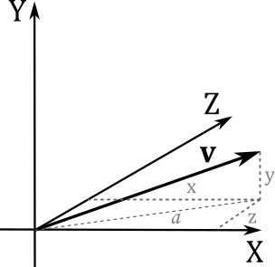

<strong><em>Proof</em></strong>
<br><br>

$$
\begin{aligned}
\mathbf{a}\times (\mathbf{b}\times\mathbf{c}) &= (a_x,\, a_y,\, a_z)\times [(b_x,\, b_y,\, b_z)\times (c_x,\, c_y,\, c_z)] \\ 
&= (a_x,\, a_y,\, a_z)\times (b_yc_z-b_zc_y,\; b_zc_x-b_xc_z,\; b_xc_y-b_yc_x) \\ 
&= \big(\color{red}{a_y (b_xc_y-b_yc_x)-a_z (b_zc_x-b_xc_z)},\; \color{green}{a_z (b_yc_z-b_zc_y)-a_x\ (b_xc_y-b_yc_x)},\; \color{blue}{a_x (b_zc_x-b_xc_z)-a_y(b_yc_z-b_zc_y)})
\end{aligned}
$$

<br>
The first component of $\mathbf{b}(\mathbf{a}\cdot\mathbf{c})-\mathbf{c}(\mathbf{a}\cdot\mathbf{b})$ is equivalent to the first component of $\mathbf{a}\times (\mathbf{b}\times\mathbf{c})$
<br><br>

$$
\begin{align*}
(\mathbf{b}(\mathbf{a}\cdot\mathbf{c})-\mathbf{c}(\mathbf{a}\cdot\mathbf{b}))_x &= b_x (a_xc_x+a_yc_y+a_zc_z)-c_x (a_xb_x+a_yb_y+a_zb_z) \\ 
&=a_xb_xc_x+a_yb_xc_y+a_zb_xc_z-a_xb_xc_x-a_yb_yc_x-a_zb_zc_x \\ 
&= \color{red}{a_y (b_xc_y-b_yc_x)-a_z (b_zc_x-b_xc_z)}
\end{align*}
$$

<br>
The same applies to the other two components.
<br><br>

$\blacksquare$

<br><br>
Specifying one or more vector components is called swizzling. For example:
<br><br>

```cpp
vector<int, 1> iVector = 1;                             // int iVector = 1;
vector<double, 4> dVector = { 0.2, 0.3, 0.4, 0.5 };     // float4 dVector = { 0.2, 0.3, 0.4, 0.5 };  
  
float4 u = { 1.0f, 2.0f, 3.0f, 0.0f };
float f0 = u.x;         // f0 = 1.0f
float f1 = u.g;         // f1 = 2.0f
float f2 = u[2];        // f2 = 3.0f
u.a = 4.0f;             // u = (1.0f, 2.0f, 3.0f, 4.0f)
 
float4 v = { 1.0f, 2.0f, 3.0f, 4.0f };
float3 vec1 = v.xyz;            // vec1 = (1.0f, 2.0f, 3.0f)
float2 vec2 = v.rb;             // vec2 = (1.0f, 3.0f)
float4 vec3 = v.zzxy;           // vec3 = (3.0f, 3.0f, 1.0f, 2.0f)
vec3.wxyz = vec3;               // vec3 = (3.0f, 1.0f, 2.0f, 3.0f)
vec3.yw = vec1.zz;              // vec3 = (3.0f, 3.0f, 2.0f, 3.0f)
 
float4 w = float4(vec1, 5.0);   // w = (1.0f, 2.0f, 3.0f, 5.0f)
```
<br><br>

<br><br>


