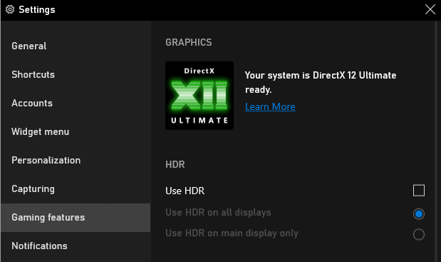

# 00 - Introduction and Prerequisites

 

 

# 1 - Introduction

New graphics APIs, like DirectX 12 and Vulkan, have a reputation for being difficult to learn for beginners. The main reason is that modern APIs hide less to the programmer than the old ones (DirectX 11 and OpenGL) so you just end up studying low-level details even to draw a single triangle. However, learning DirectX 12 also has some advantages as it designed to make full use of multi-threading, and to get a finer control on resource management and CPU/GPU synchronization. Thanks to a better support for multi-threading, the CPU workload is more evenly distributed across all cores. Also, if you understand the use and re-use of resources, then you can take advantage of that by minimizing uploading and copying. That way you can free up CPU time to increase the number of draw calls (and consequently the GPU workload) to enhance performance of your graphics applications.

Currently, you have three ways to learn DirectX 12 from scratch, each with its advantages and disadvantages.

 

**Frank Luna's book: Introduction to 3D Game Programming with DirectX 12**  
$\color{#44FFAA}\text{The Good}$: It explains both theory and practice. Also, it can be used both as an API reference and a computer graphics textbook (at least at the beginning).  
$\color{#FF6666}\text{The Bad}$: It's a book. So, to reduce cost and size, it omits some important low-level details. Also, it's a bit dated now.

**Online tutorials (included YouTube videos)**  
$\color{#44FFAA}\text{The Good}$: Free and easy to follow.  
$\color{#FF6666}\text{The Bad}$: Often, they mainly focus on the API, completely avoiding math and theory, or merely providing the equations with no explanation.  

**Official repositories and documentation**  
$\color{#44FFAA}\text{The Good}$: All the source code and level of detail you need, for free. 
$\color{#FF6666}\text{The Bad}$: The documentation is written as a reference for graphics programmers. That is, it assumes you have basic knowledge of computer graphics, GPU architectures and system programming. 

 

Actually, nothing prevents you from learning DirectX 12 by only taking the good parts of each resource, provided that you are motivated enough to jump from a math textbook to another and to read dozens of documentation pages and tutorials to collect all the information you need about every single subject.

My goal is to write a new, updated tutorial series to cover both theory (maths, computer graphics, rendering techniques) and practice (API and source code) in depth. And the only possibility of doing that effectively is to prevent the reader from getting bored, intimidated or discouraged by the amount of information they need to learn and master to write graphics applications. Usually, when people start studying computer graphics, they want to see something on their screen as a reward. For this reason, in every tutorial I will review a different sample to only explain the theory needed to implement it. That way, the reader feels like they are studying to understand the implementation of a specific sample. This allows a gradual and progressive acquisition of new information on which to build knowledge like a puzzle: whenever you read a tutorial, you add another piece.

I'm not claiming this will be the ultimate resource to learn DirectX. By the way, the official Microsoft documentation (see [1] and [2] in the reference list at the end of this tutorial) will always be the most important and fundamental resource to refer to during your studies. Here, I will simply try to provide as many details as possible to minimize the number of resources you need to look at.

As for the code samples, instead of reinventing the wheel, we can use the source code already available and maintained by Microsoft in their repositories. However, I will also write custom samples based on the same framework and coding style, when necessary.

 

[microsoft/DirectX-Graphics-Samples](https://github.com/microsoft/DirectX-Graphics-Samples)  
[microsoft/Xbox-ATG-Samples](https://github.com/microsoft/Xbox-ATG-Samples)  
[microsoft/Xbox-GDK-Samples](https://github.com/microsoft/Xbox-GDK-Samples)  
[walbourn (Chuck Walbourn)](https://github.com/walbourn)  
[PAMinerva/LearnDirectX](https://github.com/PAMinerva/LearnDirectX)  

 

In conclusion, if you are looking for a comprehensive, updated resource to learn how to program with DirectX 12 from scratch, then give this tutorial series a chance.

 

 

# 2 - Prerequisites
## 2.1 - Background knowledge

Of course, I can't explain everything, so you need basic math skills to completely understand the content of the tutorials, and the techniques used in the related samples. Fortunately, college math (algebra, trigonometry and single variable calculus) covers 90% of the math used in this tutorial series. As for the remaining 10%, I'm going to write dedicated math tutorials. However, if you prefer a book, I recommend [3], then [4] (for self-study) or [5] (for a formal education) as a reference for advanced topics.

If you need an introductory textbook on C++ you can take a look at [6] and [7], then use [8] as a reference and [9] to really understand the low-level details.

 

## 2.2 - Hardware

Obviously, you need a DirectX 12-capable graphics card if you want to run the samples examined in this tutorial series. In particular, a GPU that fully supports DirectX 12 Ultimate is required to execute some of the demos and compile the related source code. To verify if that's the case, press <kbd>Win</kbd> + <kbd>G</kbd> to open the Xbox Game Bar and select Gaming features from Settings.

 

 

If your graphics card supports DirectX 12 Ultimate then you should see something like the above image. Otherwise, it's time to upgrade your PC with a new graphics card.

 

## 2.3 - Software

The complete set of DirectX 12 Ultimate features is available starting from Windows 10, version 2004, so you need to upgrade your OS at least to this version, if necessary. 
Visual Studio is required to open the projects and compile the samples presented in this tutorial series (of course, you also need Visual Studio to create new DirectX applications). Make sure to install the latest Windows 10 SDK (10.0.19041.0 or higher) and update the drivers of your graphics card to the latest version.

 

 

You will also need a graphics debugger: I recommend to install [PIX on Windows](https://devblogs.microsoft.com/pix/download/) and/or [RenderDoc](https://renderdoc.org/).

 

 

# References
[1] [DirectX graphics and gaming (microsoft.com)](https://docs.microsoft.com/en-us/windows/win32/directx)  
[2] [DirectX-Specs (microsoft.github.io)](https://microsoft.github.io/DirectX-Specs/)  
[3] Engineering Mathematics (Stroud, Booth)  
[4] Advanced Engineering Mathematics (Stroud, Booth)  
[5] Advanced Engineering Mathematics (Kreyszig)  
[6] Beginning C++ Through Game Programming (Dawson)  
[7] A Tour of C++ (Stroustrup)  
[8] The C++ Programming Language (Stroustrup)  
[9] Write Great Code - Vol. 1 and 2 (Randall Hyde)
