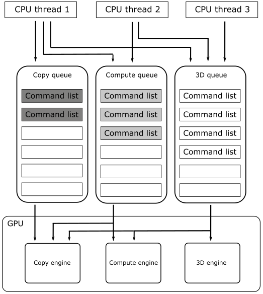
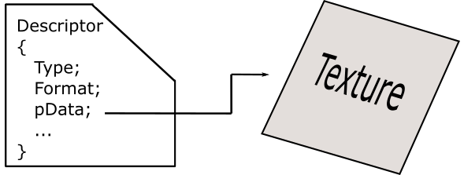
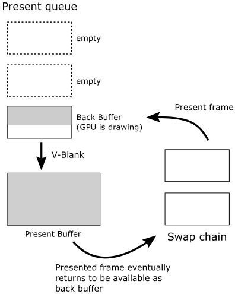

# 01.A - Hello Window

<br>


<br>

# 1 - Introduction

DirectX provides a set of APIs that you can use to create games and graphics applications. In particular, it includes support for high-performance 2-D and 3-D graphics, audio, arithmetic and linear algebra operations. Below is a list of the main APIs included in DirectX. Although, we are primarily interested in Direct3D 12 and DirectXMath, the only ones we will use for a while.

<br>

**Direct3D** provides functionality to perform 3-D graphics rendering tasks. It is used to draw primitives (i.e., points, lines and triangles) with the rendering pipeline, or to start parallel operations on the GPU. By Direc3D 12 we mean the API that allows apps to take advantage of the graphics and computing capabilities of PCs equipped with a DirectX 12-compatible GPU.

**Direct2D** provides functionality to render 2-D geometries, bitmaps, and text. It is designed to interoperate with existing code that uses Direct3D to create 2D menus, user interface (UI) elements, and Heads-up Displays (HUDs).

**DirectWrite** provides support for high-quality text rendering, resolution-independent outline fonts, and full Unicode text and layouts. It is designed to interoperate with Direct2D to render text by taking advantage of the hardware acceleration. You can also fill text with an arbitrary Direct2D brush, such as radial gradients, linear gradients, and bitmaps.

**DirectXMath** provides types and helper functions for common linear algebra and graphics math operations common to DirectX applications.

**XAudio2** allows to add sound effects and background music, or to develop high performance audio engines.

**XInput** enables applications to receive input from the Xbox Controller when it is connected to a Windows PC.

<br>

To create graphics applications, you first need a window to draw on. So, the purpose of this tutorial is to create and show a simple window on your screen. For this purpose, we will examine the sample **D3D12HelloWindow**. The related source code can be found in the official Microsoft repository (the link is provided at the end of the tutorial). The only notable graphics operation performed by this sample is the setting of the window background color. You might be surprised to find out that you need to write lots of code to execute this simple operation. The good news is that the code we will review in this first tutorial mainly consists of boilerplate code. This means that, by the end of this tutorial, you will have a basic knowledge of the common framework used by almost any samples we will examine in the upcoming tutorials, so that we can only focus on new additions.

Before starting to review the source code of **D3D12HelloWindow**, you need a basic knowledge of the Component Object Model (COM), the DXGI API and how Windows applications work. You can skip the following three sections if you are comfortable with these topics. Alternatively, you can also look at [1]-[3] for further information.

<br>

<br>

# 2 - Windows applications

This section is heavily inspired by the first chapter of the book “Programming Microsoft Visual C++, Fifth Edition” by David J. Kruglinski, George Shepherd and Scott Wingo.

Windows applications use an event-driven programming model (illustrated in the following image) in which programs respond to events by processing messages sent by the operating system. In this context, an event is a keystroke, a mouse click, or a command for a window to repaint itself. The entry point of a Windows application is a function called **WinMain**, but most of the action takes place in a function known as the window procedure. The window procedure processes messages sent by the OS to the application a window belongs to. **WinMain** creates that window and then enters a message loop, retrieving messages and dispatching them to the window procedure. Messages wait in a message queue until they are retrieved. The main occupation of a Windows application is to respond to the messages it receives, and in between messages, it does little except wait for the next message to arrive. You exit the message loop when a **WM_QUIT** message is retrieved from the message queue, signaling that the application is about to end. This message is sent by the OS when the user closes the window. When the message loop ends, **WinMain** returns, and the application terminates.

<br>


<br>

Observe that window messages can also be sent directly to a window procedure, bypassing the message queue. If the sending thread is sending a message to a window created by the same thread, the specified window’s window procedure is called. However, if a thread is sending a message to a window created by another thread, things become more complicated. Fortunately, we don't need to know these low-level details right now.

<br>

## 2.1 - Window Procedure

As stated earlier, a window procedure is a function that receives and processes messages sent by the OS to the application a window belongs to. A window class defines important characteristics of a window such as its window procedure address, its default background color, and its icon. Every window created with a particular class will use that same window procedure to respond to messages.<br>
When the application dispatches a message to a window procedure, it also passes additional information on the message as arguments in its input parameters. That way, the window procedure can perform an appropriate action for a message by consuming the related message data. If a window procedure does not process a message, it must send the message back to the system for default processing by calling the **DefWindowProc** function, which performs a default action and returns a message result. The window procedure must then return this value as its own message result.<br>
Since a window procedure is shared by all windows belonging to the same class, it can process messages for different windows. To identify the specific window a message is addressed to, a window procedure can examine the window handle passed as input parameter.
The code provided in the window procedure to process a particular message is known as message handler.

<br>

## 2.2 - Messages

Windows defines many different message types. Usually, messages have names that begin with the letters "WM_", as in **WM_CREATE** and **WM_PAINT**. The following table shows ten of the most common messages. For example, a window receives a **WM_PAINT** message when its interior needs repainting. You can think of a Windows program as a collection of message handlers.

<br>

| Message        | Sent when                                                                      |
| -------------- | ------------------------------------------------------------------------------ |
| WM_CHAR        | A character is input from the keyboard.                                        |
| WM_COMMAND     | The user selects a menu item, or a control sends a notification to its parent. |
| WM_CREATE      | A window is created.                                                           |
| WM_DESTROY     | A window is destroyed.                                                         |
| WM_LBUTTONDOWN | The left mouse button is pressed.                                              |
| WM_LBUTTONUP   | The left mouse button is released.                                             |
| WM_MOUSEMOVE   | The mouse pointer is moved.                                                    |
| WM_PAINT       | A window needs repainting.                                                     |
| WM_QUIT        | The application is about to terminate.                                         |
| WM_SIZE        | A window is resized.                                                           |

<br>

When the message loop dispatches a message, the window procedure is called, and you can retrieve the information on the message from its four input parameters:

<br>

* The handle of the window to which the message is directed,

* A message ID, and

* Two 32-bit parameters known as **wParam** and **lParam**.

<br>

The window handle is a 32-bit value that uniquely identifies a window. Internally, the value references a data structure in which the OS stores relevant information about the window such as its size, style, and location on the screen.<br>
The message ID is a numeric value that identifies the message type: **WM_CREATE**, **WM_PAINT**, and so on.<br>
**wParam** and **lParam** contain information specific to the message type. For example, when a **WM_LBUTTONDOWN** message arrives, **wParam** holds a series of bit flags identifying the state of the <kbd>Ctrl</kbd> and <kbd>Shift</kbd> keys and of the mouse buttons. **lParam** holds two 16-bit values identifying the location of the mouse pointer (in screen coordinates) when the click occurred. At that point, you have all you need to know to process the **WM_LBUTTONDOWN** message in the window procedure. Conventionally, **WinMain** should return the value stored in the **wParam** of the **WM_QUIT** message.

The only criticism to the above explanation is that a graphics application performs the bulk of its processing exactly in between messages. Although, **D3D12HelloWindow** is an exception as its only purpose is to show a window on the screen (i.e., no relevant graphics operations are involved).

<br>

<br>

# 3 - Component Object Model (COM)

Microsoft used the Component Object Model (COM) to design the internals of DirectX. So, whenever you program with DirectX you are also implicitly using COM. This is an object-oriented programming model created by Microsoft to break dependencies of the code at the binary level. This means that, if an API, a framework, or a generic technology is built upon COM, then it will be language independent and backward compatible, to some extent.

> Unfortunately, this doesn't automatically mean you can write DirectX applications by using whatever programming language you want, or that you can run a DX12 application with old libraries and runtime (DX11 or earlier).

COM is a complex programming model, but, fortunately, you don't need to master it to write DirectX applications. Indeed, we will only use COM as end-user rather than for developing our API or framework. That is, DirectX will hide the complexity of COM from us. However, to effectively program with DirectX, we still need to know some basic concepts about COM. First, it can be useful to understand what it means to break dependencies of the code at the binary level and what type of problems this break can solve.

If you've ever developed a Windows library, you know that functionality can be exported from DLLs written in C language to be used by applications written in other languages (C++, C#, Java, Python, etc.). Microsoft didn’t use C to write DirectX, although. They preferred an object-oriented language like C++. Now, imagine writing a DLL that exports a C++ class. The functionality provided by this class can’t be easily used by other languages because C++ only specifies what happens at source code level. The standard doesn't say anything about what happens at the binary level. For example, we know that object-oriented languages use virtual tables to implement polymorphism. However, this is an implementation concept, just like the stack and the heap: the C++ standard doesn't say anything about how to implement polymorphism. The following image shows a common layout for a class in memory. However, nothing prevents a new language to place the virtual table pointer at the end, or to define a whole new system to implement polymorphism.

<br>


<br>

In other words, you would be able to use a C++ class exported from a DLL provided that you are on the same OS and use the same compiler. On the contrary, other languages (or different implementations of C++) may have no idea how to communicate with the DLL if they don’t know the binary layout of the exported class in memory. That is, if the compiler tries to resolve the call to a virtual function it needs to know the memory layout of the class to access the virtual table.

Even if you were able to use a C++ class exported from a DLL, one problem still remains. Usually, the developer of the DLL provides the include file with the class declaration. Now, imagine using the include file to compile an app that creates an instance of the exported class as a local variable on the stack. Also, suppose that you put the DLL in the executable directory of your application. After a while, the developer releases an updated version of their DLL, and you choose to overwrite the old one in the executable directory without recompiling your app as the notes of the developer indicate they only add a private member in the exported class. Indeed, C++ rules state that everything should be fine as the public part has not changed. The problem is that this statement is only valid at source level, not at the binary level. If you now execute your app, the new DLL is loaded in memory and the new constructor of the exported class is invoked to initialize the new private member. However, you haven't recompiled your app, so the space reserved for the local variable on the stack is the one specified by the definition of the class in the old include file you used to compile the first time. You can easily imagine how this can lead to incorrect results, or even worse, crashes.

These problems arise from the fact that the binary representation of the DLL is exposed to the app. COM try to resolve this inconvenience with few fundamental principles:

<br>

* Clients (apps) communicate with servers (DLLs) using abstract interfaces instead of concrete classes. If a server exports a class (called COM class) that implements an interface, a client can reference an instance of the COM class (called COM object) through an interface pointer and use it to call the member methods exported by the COM class.

* Clients create COM objects using methods implemented in the servers. That way, the implementation of the COM class is hidden from the clients entirely. Only the server knows how to create a COM object, so if the private part of the COM class changes, the client is not affected because the interface is still the same (interfaces don’t contain data members).

* COM classes and interfaces have unique IDs. That way it’s possible for more than a server to implement the same interface, and for a client to load the correct server (DLL) in memory. So, if there are more versions of the DLL available, the client can choose what server to load. Then, if your application wants to use new functionalities, you are forced to recompile.

<br>

However, even if COM involves the use of abstract interfaces, client and server still have to agree on the binary representation of these interfaces if they want to communicate with each other.<br>
For this purpose, the COM specification defines a binary object layout that can be implemented and understood by almost any language and platform. In particular, Microsoft decided to use a virtual table mechanism similar to the one they used in their C++ implementation. This means a COM interface in memory is just a virtual table that contains function pointers (plus other data). Then, an interface pointer to a COM object is just a pointer to a virtual table.<br>
That way, if a language/compiler wants to support COM, it must layout COM interfaces as indicated by the COM specification. This is one of the reasons why you can't always use DirectX with your favorite programming language.

As stated earlier, clients can’t create COM objects directly. Usually, we use a method like **CoCreateInstance**, specifying the COM class ID the client wants to create a COM object for, and the interface ID implemented by the COM class the client is interested in getting a pointer. The client does not need to know where the server is located. The Windows Registry is used for this purposed and **CoCreateInstance** (with the help of a system service) can find the server, based on the arguments passed as parameters. At that point, the server can create the COM object and an interface pointer to that object is returned to the client, which can use it to communicate with the server (that is, call its member functions).<br>
However, you will hardly use **CoCreateInstance** to directly create DirectX COM objects. Usually, you will create COM objects indirectly by using specific DirectX methods that return (as output parameters) pointers to whatever interface implemented by the related COM classes. This mechanism is less centralized (that is, it doesn't use the Windows Registry to locate the servers) but it works in a similar way. Generally, the functions to create DirectX COM objects return an HRESULT which is an encoded value indicating if the operation succeeded.

At this point we can better define the meaning of backward compatibility in this context. A DirectX application can run on a system provided that the servers with the COM classes used by the client can be loaded. So, provided that new versions of a DLL don't change the COM classes to include new disruptive functionalities that modify the related COM interfaces, the application can still load the new DLL and use the new COM classes without problems.

Usually, before creating any COM object, you should initialize the COM library by calling **CoInitializeEx**. However, when you create COM objects indirectly, the creation methods will handle this task for you. We will see many examples of such methods in the upcoming tutorials.

COM defines a base interface that all other interfaces must extend: **IUnknown**. This interface defines some basic operations:

<br>

* **AddRef** increments the reference count for an interface pointer to a COM object. You should call this method whenever you make a copy of an interface pointer.

* **Release** decrements the reference count for an interface on a COM object. When the reference count on an object reaches zero, this method must cause the interface pointer to free itself.

* **QueryInterface** queries a COM object for a pointer to one of its interfaces; identifying the interface by a reference to its interface identifier (IID). If the COM object implements the interface, then it returns a pointer to that interface after calling **AddRef** on it.

<br>

Directly managing interface pointers to COM objects can be a daunting task as you should explicitly call **Release** and **AddRef** to maintain the reference count. A better solution with C++ is to make use of smart pointers. **Microsoft::WRL::ComPtr** is a smart pointer provided by the Windows Runtime C++ Template Library (WRL). This library is "pure" C++ so it can be utilized for classic Win32 desktop applications. It automatically calls **AddRef** and **Release** on the underlying interface pointer. That means it maintains a reference count for the underlying interface pointer and releases the interface pointer when the reference count goes to zero. Moreover, it defines many other methods, including:

<br>

* **Get** returns the underlying interface pointer to a COM object. It's especially useful when you have functions that accept a raw pointer instead of a **ComPtr**.

* **GetAddressOf** returns a pointer to the underlying interface pointer to a COM object. It's especially useful because, whenever you create a COM object indirectly, the default is to return the interface pointer as an output parameter (that is, as a pointer to an interface pointer).

* **Reset** calls **Release** on the underlying interface pointer to a COM object and then set it to **nullptr**. It can be useful when you don’t need the underlying interface pointer anymore, but the **ComPtr** hasn’t gone out of scope yet.

* **ReleaseAndGetAddressOf** is similar to **Reset** but it returns the underlying pointer (that will be a **nullptr**) to the caller. It can be useful if you want a new initialization for an underlying interface pointer you don’t need anymore (e.g., when you want to pass it as an argument to the output parameter of a creation method).

* **Detach** returns the underlying interface pointer to a COM object and then set it to **nullptr**. It can be useful if you need to return the underlying interface pointer to a caller and, at the same time, you don’t need the local **ComPtr** object anymore.

* **As** is just a wrapper around **QueryInterface**. It takes another **ComPtr** as input parameter to get a pointer to one of the interfaces implemented by a COM object.

<br>

Also, the dereference operator -> is overloaded and returns the underlying interface pointer to a COM object, so you don't need to call **Get** if you only want to invoke a function through the interface pointer.

<br>

<br>

# 4 - DirectX Graphics Infrastructure (DXGI)

Microsoft DirectX Graphics Infrastructure (DXGI) is an API that collects functionality and tasks that (at least in theory) don't change often, so that you can use them no matter what version of graphics API you are actually using (Direct3D 10, 11, or 12). Specifically, DXGI manages low-level tasks like enumeration of hardware graphics devices (GPUs) and outputs (monitors), creating rendering buffers, presenting rendered frames to an output, controlling gamma and managing full-screen transitions. That way, a graphics API can focus on drawing 3D content into buffers and, for example, not care about where these buffers come from, or whether and how they are going to be displayed.<br>
DXGI's purpose is to communicate with the kernel mode driver and the system hardware, as shown in the following diagram.

<br>


<br>

A graphics application can access DXGI directly, or call the Direct3D API, which handles the communications with DXGI for you. You may want to work with DXGI directly if your application needs to enumerate devices or control how data is presented to an output.

An adapter is an abstraction of a hardware or software device. There are generally many adapters on your machine. Some devices are implemented in hardware (like a video card) while others are implemented in software (like the Direct3D rasterizer implemented by Microsoft). The following diagram shows a system with a single computer, two adapters (video cards), and three output monitors.

<br>


<br>

Your application's job is to draw on buffers and ask DXGI to present those buffers as frames to the output. If the application has two buffers available, it can render one buffer (the render target) while presenting another one. The application might require more than two buffers depending on the time it takes to render a frame or the desired frame rate for presentation. The set of buffers created is called a swap chain, as shown here.

<br>


<br>

A swap chain has one front (or present) buffer and one or more back buffers (used as render targets). Each application creates its own swap chain. To maximize the speed of the presentation of the data to an output, a swap chain is almost always created in GPU memory and DXGI (with the help of the kernel driver) is responsible for scanning rendered content from video memory and presenting it on outputs.<br>
A swap chain is set up to draw in full-screen or windowed mode. This eliminates the need to know whether an output is windowed or full screen. A full-screen mode swap chain can optimize performance by switching the display resolution. An output can support one or more display mode (a display mode includes resolution, refresh rate, format, etc.). DXGI might change the display mode of an output when making a full-screen transition. Resizing swap chain buffers will not cause a mode switch, though. The swap chain makes an implicit promise that if you choose a back buffer that exactly matches a display mode supported by the target output, then it will switch to that display mode when entering full-screen mode on that output. Consequently, you choose a display mode by choosing your back buffer size and format.

<br>

<br>

# 5 - Framework overview

As stated at the beginning of this tutorial, the framework used by **D3D12HelloWindow** is common to almost any samples we will review in the upcoming tutorials. This means that, by the end of this tutorial, you will know how to write a generic DirectX application (or at least the backbone of a complete graphics application).

First, as you can see in the following image, the import libraries (LIBs) of Direct3D 12 and DXGI are listed in the additional dependencies of the project, so that the linker can use the related information to resolve external references to exported functions in the related DLLs. Also, the DLL associated to Direct3D 12 won't be loaded at the same time of the application, but only the first time we call an exported function.

<br>


<br>

DirectX applications are normal Windows programs, so the entry point is **WinMain** as usual.

<br>

```cpp
#include "stdafx.h"
#include "D3D12HelloWindow.h"
 
_Use_decl_annotations_
int WINAPI WinMain(HINSTANCE hInstance, HINSTANCE, LPSTR, int nCmdShow)
{
    D3D12HelloWindow sample(1280, 720, L"D3D12 Hello Window");
    return Win32Application::Run(&sample, hInstance, nCmdShow);
}
```
<br>

The header file _stdafx.h_ includes others header files associated with some DirectX libraries (Direct3D 12, DirectXMath, DXGI). We also need to include _wrl.h_ to use the smart pointers provided by the Windows Template Library. The header file _d3dx12.h_ defines many helper structures that behave like C++ wrapper classes around Direct3D 12 structures to simplify their initialization (it also provides some helper functions to make it easier to handle subresources). _D3DCompiler.h_ is the header associated with a library we will use to compile shader code. We will see what subresources and shader code are in the upcoming tutorials.

<br>

```cpp
#include <windows.h>
 
#include <d3d12.h>
#include <dxgi1_6.h>
#include <D3Dcompiler.h>
#include <DirectXMath.h>
#include "d3dx12.h"
 
#include <string>
#include <wrl.h>
#include <shellapi.h>
```
<br>

**WinMain** is called by the C/C++ runtime startup and takes four parameters. However, we are only interested in two of them (the named ones).<br>
**hInstance** is the base virtual address of the executable loaded in memory.<br>
**nCmdShow** is an integer value that controls how to show the window we are going to create. We’ll pass this last parameter to a function whose primary purpose is to show the window of our sample (more on this in the next section).

<br>

**D3D12HelloWindow** is the application class, which defines data and methods needed for a specific sample.

<br>

```cpp
class D3D12HelloWindow : public DXSample
{
public:
    D3D12HelloWindow(UINT width, UINT height, std::wstring name);
 
    virtual void OnInit();
    virtual void OnUpdate();
    virtual void OnRender();
    virtual void OnDestroy();
 
private:
    static const UINT FrameCount = 2;
 
    // Pipeline objects.
    ComPtr<IDXGISwapChain3> m_swapChain;
    ComPtr<ID3D12Device> m_device;
    ComPtr<ID3D12Resource> m_renderTargets[FrameCount];
    ComPtr<ID3D12CommandAllocator> m_commandAllocator;
    ComPtr<ID3D12CommandQueue> m_commandQueue;
    ComPtr<ID3D12DescriptorHeap> m_rtvHeap;
    ComPtr<ID3D12PipelineState> m_pipelineState;
    ComPtr<ID3D12GraphicsCommandList> m_commandList;
    UINT m_rtvDescriptorSize;
 
    // Synchronization objects.
    UINT m_frameIndex;
    HANDLE m_fenceEvent;
    ComPtr<ID3D12Fence> m_fence;
    UINT64 m_fenceValue;
 
    void LoadPipeline();
    void LoadAssets();
    void PopulateCommandList();
    void WaitForPreviousFrame();
};
```
<br>

The base class **DXSample** defines data and methods used by all graphics samples.

<br>

```cpp
class DXSample
{
public:
    DXSample(UINT width, UINT height, std::wstring name);
    virtual ~DXSample();
 
    virtual void OnInit() = 0;
    virtual void OnUpdate() = 0;
    virtual void OnRender() = 0;
    virtual void OnDestroy() = 0;
 
    // Samples override the event handlers to handle specific messages.
    virtual void OnKeyDown(UINT8 /*key*/)   {}
    virtual void OnKeyUp(UINT8 /*key*/)     {}
 
    // Accessors.
    UINT GetWidth() const           { return m_width; }
    UINT GetHeight() const          { return m_height; }
    const WCHAR* GetTitle() const   { return m_title.c_str(); }
 
    void ParseCommandLineArgs(_In_reads_(argc) WCHAR* argv[], int argc);
 
protected:
    std::wstring GetAssetFullPath(LPCWSTR assetName);
 
    void GetHardwareAdapter(
        _In_ IDXGIFactory1* pFactory,
        _Outptr_result_maybenull_ IDXGIAdapter1** ppAdapter,
        bool requestHighPerformanceAdapter = false);
 
    void SetCustomWindowText(LPCWSTR text);
 
    // Viewport dimensions.
    UINT m_width;
    UINT m_height;
    float m_aspectRatio;
 
    // Adapter info.
    bool m_useWarpDevice;
 
private:
    // Root assets path.
    std::wstring m_assetsPath;
 
    // Window title.
    std::wstring m_title;
};
```
<br>

The class **Win32Application** defines data and methods used by all Windows applications.

<br>

```cpp
class Win32Application
{
public:
    static int Run(DXSample* pSample, HINSTANCE hInstance, int nCmdShow);
    static HWND GetHwnd() { return m_hwnd; }
 
protected:
    static LRESULT CALLBACK WindowProc(HWND hWnd, UINT message, WPARAM wParam, LPARAM lParam);
 
private:
    static HWND m_hwnd;
};
```
<br>

It's perfectly fine if you don't understand the meaning of every single class member. I'll explain each of them in the next section and in later tutorials.

<br>

As you might have noticed in the first listing, the entry point **WinMain** calls the constructor of **D3D12HelloWindow**.

<br>

```cpp
D3D12HelloWindow::D3D12HelloWindow(UINT width, UINT height, std::wstring name) :
    DXSample(width, height, name),
    m_frameIndex(0),
    m_rtvDescriptorSize(0)
{
}
```
<br>

This constructor initializes some data members to zero and calls the constructor of **DXSample**.

<br>

```cpp
DXSample::DXSample(UINT width, UINT height, std::wstring name) :
    m_width(width),
    m_height(height),
    m_title(name),
    m_useWarpDevice(false)
{
    WCHAR assetsPath[512];
    GetAssetsPath(assetsPath, _countof(assetsPath));
    m_assetsPath = assetsPath;
 
    m_aspectRatio = static_cast<float>(width) / static_cast<float>(height);
}
```
<br>

Here we initialize the name of our graphics sample (we will show that name in the title bar), as well as the width and height of the window’s client area we are going to draw on. <br>
**GetAssetsPath** returns the absolute path of the executable, where you will find the files of the resources (shaders, textures, etc.) needed to execute the sample. Although, we don’t need these types resources for this first sample, so you won't find anything in the executable directory (except for the executable itself).<br>
The aspect ratio is the proportional relationship between the width and height of the window’s client area.

<br>


<br>

The client area of a window is where we are allowed to draw. Technically speaking, it’s where the render target will be mapped once the GPU finishes drawing a frame on it. Usually, you can think of a render target as a texture that the GPU uses for rendering\drawing purposes.<br>
Then, in **WinMain** we call **Win32Application::Run**, passing the instance of **D3D12HelloWindow** just created and both the named arguments of **WinMain**.

<br>

```cpp
int Win32Application::Run(DXSample* pSample, HINSTANCE hInstance, int nCmdShow)
{
    // Parse the command line parameters
    int argc;
    LPWSTR* argv = CommandLineToArgvW(GetCommandLineW(), &argc);
    pSample->ParseCommandLineArgs(argv, argc);
    LocalFree(argv);
 
    // Initialize the window class.
    WNDCLASSEX windowClass = { 0 };
    windowClass.cbSize = sizeof(WNDCLASSEX);
    windowClass.style = CS_HREDRAW | CS_VREDRAW;
    windowClass.lpfnWndProc = WindowProc;
    windowClass.hInstance = hInstance;
    windowClass.hCursor = LoadCursor(NULL, IDC_ARROW);
    windowClass.lpszClassName = L"DXSampleClass";
    RegisterClassEx(&windowClass);
 
    RECT windowRect = { 0, 0, static_cast<LONG>(pSample->GetWidth()), static_cast<LONG>(pSample->GetHeight()) };
    AdjustWindowRect(&windowRect, WS_OVERLAPPEDWINDOW, FALSE);
 
    // Create the window and store a handle to it.
    m_hwnd = CreateWindow(
        windowClass.lpszClassName,
        pSample->GetTitle(),
        WS_OVERLAPPEDWINDOW,
        CW_USEDEFAULT,
        CW_USEDEFAULT,
        windowRect.right - windowRect.left,
        windowRect.bottom - windowRect.top,
        nullptr,        // We have no parent window.
        nullptr,        // We aren't using menus.
        hInstance,
        pSample);
 
    // Initialize the sample. OnInit is defined in each child-implementation of DXSample.
    pSample->OnInit();
 
    ShowWindow(m_hwnd, nCmdShow);
 
    // Main sample loop.
    MSG msg = {};
    while (msg.message != WM_QUIT)
    {
        // Process any messages in the queue.
        if (PeekMessage(&msg, NULL, 0, 0, PM_REMOVE))
        {
            TranslateMessage(&msg);
            DispatchMessage(&msg);
        }
    }
 
    pSample->OnDestroy();
 
    // Return this part of the WM_QUIT message to Windows.
    return static_cast<char>(msg.wParam);
}
```
<br>

To create a window, we first need an instance of a window class (structure **WNDCLASSEX**) to specify some basic information about all the windows created using that instance. Below is a list of the most important fields of **WNDCLASSEX**. 

**style** specifies some additional information about the window. **CS_HREDRAW&nbsp;&#124;&nbsp;CS_VREDRAW** indicates to redraw the entire window if a size adjustment changes the width and\or height of the client area.

**hCursor** specifies the cursor showed when this is over the window’s client area.

**hInstance** specifies the application a window belongs to. This information is passed as an argument to the first parameter of **WinMain**.

**lpszClassName** specifies the name we want to give to the window class.

**lpfnWndProc** specifies the address of the window procedure.

<br>

**RegisterClassEx** registers the window class so we can use an instance of this class to create one or more windows with a specific style, window procedure, etc.
**CreateWindow**, as the name suggests, creates a window and return its handle. It takes the name of a window class and some additional information. Look at the Microsoft documentation for more details on **CreateWindow**.

> The instance of the application class (passed as an argument to the first parameter of **Run**) stores width and height of the window’s client area. However, **CreateWindow** needs the size of the whole window, so we must calculate it. **AdjustWindowRect** returns such information if you pass the size of the client area and the style of the window you’re going to create with **CreateWindow**. **WS_OVERLAPPEDWINDOW** specifies a window with a title bar and no menu.

> With the last parameter of **CreateWindow** we can specify a pointer the OS will return to us in response to a **WM_CREATE** message (sent by the OS to an application as soon as a window is created; that is, when **CreateWindow** returns). This way, we’ll have a chance to save the instance of **DXSample** with the purpose to access it later (more on this shortly).

<br>

<br>

# 6 - D3D12HelloWindow: code review

**DXSample::OnInit** is a virtual function that must be redefined in derived classes. Indeed, we did it in the definition of the application class (**D3D12HelloWindow**). Below, you can see the related implementation.

<br>

```cpp
void D3D12HelloWindow::OnInit()
{
    LoadPipeline();
    LoadAssets();
}
```
<br>

It simply calls **LoadPipeline** and **LoadAssets**. Let’s start with **LoadPipeline**.

<br>

```cpp
// Load the rendering pipeline dependencies.
void D3D12HelloWindow::LoadPipeline()
{
    UINT dxgiFactoryFlags = 0;
 
#if defined(_DEBUG)
    // Enable the debug layer (requires the Graphics Tools "optional feature").
    // NOTE: Enabling the debug layer after device creation will invalidate the active device.
    {
        ComPtr<ID3D12Debug> debugController;
        if (SUCCEEDED(D3D12GetDebugInterface(IID_PPV_ARGS(&debugController))))
        {
            debugController->EnableDebugLayer();
 
            // Enable additional debug layers.
            dxgiFactoryFlags |= DXGI_CREATE_FACTORY_DEBUG;
        }
    }
#endif
 
    ComPtr<IDXGIFactory4> factory;
    ThrowIfFailed(CreateDXGIFactory2(dxgiFactoryFlags, IID_PPV_ARGS(&factory)));
 
    if (m_useWarpDevice)
    {
        ComPtr<IDXGIAdapter> warpAdapter;
        ThrowIfFailed(factory->EnumWarpAdapter(IID_PPV_ARGS(&warpAdapter)));
 
        ThrowIfFailed(D3D12CreateDevice(
            warpAdapter.Get(),
            D3D_FEATURE_LEVEL_11_0,
            IID_PPV_ARGS(&m_device)
            ));
    }
    else
    {
        ComPtr<IDXGIAdapter1> hardwareAdapter;
        GetHardwareAdapter(factory.Get(), &hardwareAdapter);
 
        ThrowIfFailed(D3D12CreateDevice(
            hardwareAdapter.Get(),
            D3D_FEATURE_LEVEL_11_0,
            IID_PPV_ARGS(&m_device)
            ));
    }
 
    // Describe and create the command queue.
    D3D12_COMMAND_QUEUE_DESC queueDesc = {};
    queueDesc.Flags = D3D12_COMMAND_QUEUE_FLAG_NONE;
    queueDesc.Type = D3D12_COMMAND_LIST_TYPE_DIRECT;
 
    ThrowIfFailed(m_device->CreateCommandQueue(&queueDesc, IID_PPV_ARGS(&m_commandQueue)));
 
    // Describe and create the swap chain.
    DXGI_SWAP_CHAIN_DESC1 swapChainDesc = {};
    swapChainDesc.BufferCount = FrameCount;
    swapChainDesc.Width = m_width;
    swapChainDesc.Height = m_height;
    swapChainDesc.Format = DXGI_FORMAT_R8G8B8A8_UNORM;
    swapChainDesc.BufferUsage = DXGI_USAGE_RENDER_TARGET_OUTPUT;
    swapChainDesc.SwapEffect = DXGI_SWAP_EFFECT_FLIP_DISCARD;
    swapChainDesc.SampleDesc.Count = 1;
 
    ComPtr<IDXGISwapChain1> swapChain;
    ThrowIfFailed(factory->CreateSwapChainForHwnd(
        m_commandQueue.Get(),        // Swap chain needs the queue so that it can force a flush on it.
        Win32Application::GetHwnd(),
        &swapChainDesc,
        nullptr,
        nullptr,
        &swapChain
        ));
 
    // This sample does not support fullscreen transitions.
    ThrowIfFailed(factory->MakeWindowAssociation(Win32Application::GetHwnd(), DXGI_MWA_NO_ALT_ENTER));
 
    ThrowIfFailed(swapChain.As(&m_swapChain));
    m_frameIndex = m_swapChain->GetCurrentBackBufferIndex();
 
    // Create descriptor heaps.
    {
        // Describe and create a render target view (RTV) descriptor heap.
        D3D12_DESCRIPTOR_HEAP_DESC rtvHeapDesc = {};
        rtvHeapDesc.NumDescriptors = FrameCount;
        rtvHeapDesc.Type = D3D12_DESCRIPTOR_HEAP_TYPE_RTV;
        rtvHeapDesc.Flags = D3D12_DESCRIPTOR_HEAP_FLAG_NONE;
        ThrowIfFailed(m_device->CreateDescriptorHeap(&rtvHeapDesc, IID_PPV_ARGS(&m_rtvHeap)));
 
        m_rtvDescriptorSize = m_device->GetDescriptorHandleIncrementSize(D3D12_DESCRIPTOR_HEAP_TYPE_RTV);
    }
 
    // Create frame resources.
    {
        CD3DX12_CPU_DESCRIPTOR_HANDLE rtvHandle(m_rtvHeap->GetCPUDescriptorHandleForHeapStart());
 
        // Create a RTV for each frame.
        for (UINT n = 0; n < FrameCount; n++)
        {
            ThrowIfFailed(m_swapChain->GetBuffer(n, IID_PPV_ARGS(&m_renderTargets[n])));
            m_device->CreateRenderTargetView(m_renderTargets[n].Get(), nullptr, rtvHandle);
            rtvHandle.Offset(1, m_rtvDescriptorSize);
        }
    }
 
    ThrowIfFailed(m_device->CreateCommandAllocator(D3D12_COMMAND_LIST_TYPE_DIRECT, IID_PPV_ARGS(&m_commandAllocator)));
}
```
<br>

**LoadPipeline** is responsible for creating some of the objects we need to render (draw) the frames of our sample. Here, for the first time, we meet a method to create a DirectX COM object indirectly: **D3D12GetDebugInterface**. The prototype of this method is

<br>

```cpp
HRESULT WINAPI D3D12GetDebugInterface( _In_ REFIID riid, _COM_Outptr_opt_ void** ppvDebug );
```
<br>

The first parameter is the ID of the interface we want to get a pointer, while the second parameter is where the function will return the interface pointer to the caller (that is, the address where it will store the address of the COM interface; that's why the parameter is a pointer to a pointer). In this case, the first parameter is the ID of the **ID3D12Debug** interface. So, **D3D12GetDebugInterface** creates an instance of the COM object that implements this interface and return the interface pointer in the second parameter. Then, the caller can use it to call functionality implemented by the related COM class. Often the macro **IID_PPV_ARGS** is used to reduce typos. This macro is defined as 

<br>

```cpp
#define IID_PPV_ARGS(ppType) __uuidof(**(ppType)), IID_PPV_ARGS_Helper(ppType)
```
<br>

The **__uuidof** operator allows to get IDs of COM interfaces and classes. Usually, we pass the address of a **ComPtr**, so we need to dereference twice to get the underlying interface pointer, which is used to determine the type of the requested object. The helper macro **IID_PPV_ARGS_Helper** converts the address of a **ComPtr** to a normal **void**** (take a look at the source code in _combaseapi.h_ if you want to see how it is implemented).<br>
After we get a pointer to the **ID3D12Debug** interface, we use it to enable the Direct3D debug layer. It helps during debugging by showing error and warning messages in the output window of the debugger if any obscure rendering error, validation control or memory leak occurs.

**D3D12GetDebugInterface** must be called before the D3D12 device is created. Calling it after creating the D3D12 device will cause the D3D12 runtime to remove the device (the D3D12 runtime refers to a set of functionalities provided by the Direct3D 12 library on which all Direct3D 12 applications depend at run time in order to run as intended.).

The **IDXGIFactory4** interface allows to create some important DXGI objects (for example, adapters and swap chains), as well as to enumerate adapters and outputs. It also allows to manage full-screen transitions. We use **CreateDXGIFactory2** to get a pointer to **IDXGIFactory4** because this method allows to pass a flag indicating we are also interested in errors and warnings about DXGI (in addition to those related to Direct3D).

A software adapter (called WARP adapter) could also be installed on your system by default. To get an interface pointer to a WARP adapter you need to call **EnumWarpAdapter**. However, we won't make use of software adapters in this tutorial series. If you have a video card, you can get an interface pointer to the related adapter with the helper function **DXSample::GetHardwareAdapter**. At that point, we can pass it as an argument to **D3D12CreateDevice** to create a device object and get an interface pointer to it. In the context of Direct3D, by device we simply mean a video card, and we use the device object created with **D3D12CreateDevice** to communicate with our video card. **D3D_FEATURE_LEVEL_11_0** specifies we are interested in creating a device object for a GPU that supports the basic functionality provided by Direct3D 12. A feature level is a well-defined set of GPU functionalities. For instance, the 9_1 feature level implements the functionality that was implemented in Microsoft Direct3D 9, while the 11_0 feature level implements the functionality that was implemented in Direct3D 11. Of course, Direct3D 12 also implement the functionality of the earlier versions, adding new ones.

Before continuing with the explanation of **LoadPipeline**, let’s see how we can get an interface pointer to a hardware adapter by examining the code of **DXSample::GetHardwareAdapter**.

<br>

```cpp
// Helper function for acquiring the first available hardware adapter that supports Direct3D 12.
// If no such adapter can be found, *ppAdapter will be set to nullptr.
_Use_decl_annotations_
void DXSample::GetHardwareAdapter(
    IDXGIFactory1* pFactory,
    IDXGIAdapter1** ppAdapter,
    bool requestHighPerformanceAdapter)
{
    *ppAdapter = nullptr;
 
    ComPtr<IDXGIAdapter1> adapter;
 
    ComPtr<IDXGIFactory6> factory6;
    if (SUCCEEDED(pFactory->QueryInterface(IID_PPV_ARGS(&factory6))))
    {
        for (
            UINT adapterIndex = 0;
            SUCCEEDED(factory6->EnumAdapterByGpuPreference(
                adapterIndex,
                requestHighPerformanceAdapter == true ? DXGI_GPU_PREFERENCE_HIGH_PERFORMANCE : DXGI_GPU_PREFERENCE_UNSPECIFIED,
                IID_PPV_ARGS(&adapter)));
            ++adapterIndex)
        {
            DXGI_ADAPTER_DESC1 desc;
            adapter->GetDesc1(&desc);
 
            if (desc.Flags & DXGI_ADAPTER_FLAG_SOFTWARE)
            {
                // Don't select the Basic Render Driver adapter.
                // If you want a software adapter, pass in "/warp" on the command line.
                continue;
            }
 
            // Check to see whether the adapter supports Direct3D 12, but don't create the
            // actual device yet.
            if (SUCCEEDED(D3D12CreateDevice(adapter.Get(), D3D_FEATURE_LEVEL_11_0, _uuidof(ID3D12Device), nullptr)))
            {
                break;
            }
        }
    }
 
    if(adapter.Get() == nullptr)
    {
        for (UINT adapterIndex = 0; SUCCEEDED(pFactory->EnumAdapters1(adapterIndex, &adapter)); ++adapterIndex)
        {
            DXGI_ADAPTER_DESC1 desc;
            adapter->GetDesc1(&desc);
 
            if (desc.Flags & DXGI_ADAPTER_FLAG_SOFTWARE)
            {
                // Don't select the Basic Render Driver adapter.
                // If you want a software adapter, pass in "/warp" on the command line.
                continue;
            }
 
            // Check to see whether the adapter supports Direct3D 12, but don't create the
            // actual device yet.
            if (SUCCEEDED(D3D12CreateDevice(adapter.Get(), D3D_FEATURE_LEVEL_11_0, _uuidof(ID3D12Device), nullptr)))
            {
                break;
            }
        }
    }
    
    *ppAdapter = adapter.Detach();
}
```
<br>

We use **QueryInterface** to check if we can get a pointer to **IDXGIFactory6** from the pointer to the **IDXGIFactory4** interface we passed as an argument. It will work only if the related COM object implements both interfaces. In that case, we can loop to get a pointer to **IDXGIAdapter1** by calling **EnumAdapterByGpuPreference**. Otherwise, we must use **EnumAdapters1**. In both cases, we want to skip software adapters. You can get that (and further) information from the structure **DXGI_ADAPTER_DESC1**, returned by **IDXGIAdapter1::GetDesc1** as an output parameter.<br>
Observe that, usually, interface names ending with a number extend an earlier, well known interface by inheriting from it and adding new functionalities. For example, we pass **IDXGIFactory4** as an argument to a **IDXGIFactory1** parameter since we are confident that both interfaces implement **QueryInterface** (which is the function we call through the related interface pointer).

Now, we can get back to **LoadPipeline**.<br>
We need to create a command queue to hold command lists which, in turn, will hold the commands we want the GPU to execute. Indeed, part of the work of a GPU is to execute commands in command lists consumed from a command queue. **D3D12HelloWindow** has very few commands to send to the GPU because it simply shows a window with a blueish client area. Despite this, we still need a command queue as we need to associate it with the swap chain (behind the scenes the DXGI API records commands to be executed by the GPU; more on this shortly). As shown in the image below, there are multiple types of command queue, each of which can hold command lists of a specific type. Then, CPU threads can create command lists of whatever type and insert them in the related command queue.

<br>



<br>

Many GPUs have one or more dedicated copy engines, a compute engine and a 3D engine, each capable of executing specific commands in parallel with the other engines. For this reason, there can be no simple guarantee of the order of execution, hence the need for synchronization mechanisms. <br>
We will use a graphic command queue (named 3D queue in the illustration above) as it is able to hold direct command lists that, in turn, can include all types of commands. Indeed, a graphics queue can drive all GPU engines, the compute queue can drive the compute and copy engines and the copy queue can only drive the copy engine.

To create a swap chain, you need to specify the number of buffers, their size, format, and usage. We’re going to use two buffers of the same size as the window’s client area. That way, the buffers will be mapped to the client area without stretching the image.<br>
**DXGI_FORMAT_R8G8B8A8_UNORM** indicates the format of the buffers. You can imagine the buffers in the swap chain as grids of (width * height) elements, whose common type is specified by a DXGI_FORMAT value. In this case we indicate that each element is a 32-bit value composed of four 8-bit unsigned-normalized-integer channels, each in the range $[0/255, 255/255]=[0, 1]$ (that is, each channel can have 256 different values). The four channels are called R, G, B and A to mimic the RGB color model, where a color is defined by the amount of red, green and blue it contains. The channel A (called alpha) is used to control the transparency or the opacity of the color.<br>
**DXGI_USAGE_RENDER_TARGET_OUTPUT** specifies that the buffers will be used as render targets (the targets of the drawing operations executed by the GPU).<br>
**DXGI_SWAP_EFFECT_FLIP_DISCARD** indicates that we want to use the flip presentation model (developed by Microsoft to provide a faster way to present frames on the screen) and that DXGI can discard the contents of a back buffer after presenting the related frame, which can enable some optimizations.
**SampleDesc.Count** specifies the number of samples per pixel. It should be always 1 as buffers presented using the flip presentation model don’t support multisampling (you need to explicitly create MSAA render targets and resolve yourself the results from multi samples to a single sample as part of the presentation of the frame; we will see how to implement MSAA in a later tutorial).<br>
The call to **CreateSwapChainForHwnd** creates the swap chain. It takes the command queue, the window handle that describes where the buffers will be presented and the description of the buffers in the swap chain. 

> The comment in the source code states that the swap chain needs a queue to flush. That's because, behind the scenes, the DXGI API creates a command list with the commands needed to create the buffers in the swap chain (in GPU memory).

Now, we have a pointer to **IDXGISwapChain1**. The related COM object almost certainly also implements **IDXGISwapChain3** so we can get a pointer to this interface by using the member function **ComPtr::As**. **IDXGISwapChain3** allows to invoke **GetCurrentBackBufferIndex** to get the index of the current back buffer in the swap chain (the buffer we are going to draw on; the render target).

The call to **IDXGIFactory::MakeWindowAssociation** disable the full screen transition when you press ALT+ENTER. We don’t need to provide support for such functionality in this sample.

The next step is to create a descriptor heap, a memory space we can consider as an array of descriptors. A descriptor, as its name implies, it's a block of data that describes a resource to the GPU (type, format, address and other hardware-specific information) for binding purposes. That is, whenever we need to bind a resource to the rendering pipeline, we pass a descriptor to the GPU to let it know where to find the resource and how to access it.

<br>



<br>


<br>

But, why do we need to create a descriptor heap? Well, lots of GPUs require that binding information resides in a small size region of memory, which allows to use less bits to address them (for example, by using byte offsets from a base address). So, the primary purpose of a descriptor heap is to encompass the bulk of memory allocation required for storing descriptors.<br>
Right now, we have a couple of buffers in the swap chain (allocated in GPU memory) that can be used as render targets. However, whenever we want to create a new frame, we need to bind one of them as render target so that the GPU exactly know where to draw. For this purpose, we need to create a descriptor for each buffer in the swap chain and record a binding command in the command list to specify the current render target to the GPU.<br>
We will create descriptors and store them in a descriptor heap from our C++ application. This means the descriptor heap needs to be CPU visible. That is, the related space must be allocated in CPU-visible video memory (a small part of VRAM) or in system memory (RAM). That's exactly what **CreateDescriptorHeap** does.<br>
If you are wondering how GPUs can access descriptors in system memory, the answer is that it is possible through the PCI-e bus. However, in this case the GPU doesn't even need to do that as, when we record the command to bind the render target, the driver copies the descriptor in the command, so that the GPU can directly read from that command the details about what buffer to use as render target.

> Descriptors for texture and other type of resources need to be accessed by the GPU wherever they are in memory. That is, the driver doesn't copy the descriptors in the binding command (more on this in the next tutorial).

Then, we set the fields of the structure **D3D12_DESCRIPTOR_HEAP_DESC** to specify we want a heap that will hold two descriptors of type RTV (render target view; descriptor and view are pretty much the same thing). That way, **ID3D12Device::CreateDescriptorHeap** creates a descriptor heap that has enough space to contain two RTVs, and return an interface pointer to the heap in the last parameter (or more precisely, an interface pointer to the COM object that implements the interface we will use to reference the heap; I won't stress on this point anymore).<br>
Observe that a descriptor heap can only hold descriptors of a specific type. We will see other types of descriptors, and the related heaps, starting from the next tutorial.

**ID3D12Device::GetDescriptorHandleIncrementSize** returns the size of a descriptor, based on the type of descriptor heap passed as argument. In this case we want to know the size of RTVs, so we pass a type of descriptor heap capable of containing them. We need to store this information for later use.

Once we have the heap, we need to create the views (RTVs) to the two buffers in the swap chain.<br>
**ID3D12DescriptorHeap::GetCPUDescriptorHandleForHeapStart** returns a CPU handle to the first descriptor in the heap, where we are going to store the first RTV.

> As noted above, a descriptor heap must be CPU visible, so we need a CPU descriptor handle to store a view in a descriptor.<br>
Handles are opaque pointers. This means a handle uniquely identifies a resource, but you shouldn't dereference it as its value only makes sense within a specific context. However, as we will see later in this tutorial, in this context CPU descriptor handles returned by **GetCPUDescriptorHandleForHeapStart** are simple CPU virtual addresses, so we can use pointer arithmetic to calculate the addresses of other descriptors (see the implementation of **CD3DX12_CPU_DESCRIPTOR_HANDLE::Offset** in *d3dx12.h*). This confirms that descriptor heaps are allocated in CPU-visible memory. <br>
GPU descriptor handles also exist. However, we will only use them to reference descriptors in a special descriptor heap (more on this in the next tutorial). Observe that, unlike CPU handles, usually GPU handles are just byte offsets from the start of a descriptor heap, not virtual addresses.

> **CD3DX12_CPU_DESCRIPTOR_HANDLE** is a wrapper on the Direct3D 12 structure **CPU_DESCRIPTOR_HANDLE**. In general, types with a name that begin with "CD3DX12" are defined in *d3dx12.h* and behave like C++ classes around Direct3D 12 structures to simplify their initialization and to provide useful helper functions.

**IDXGISwapChain:: GetBuffer** returns (as an output parameter) an interface pointer to the buffer of the swap chain associated with the index passed in the first parameter. In particular, we get a pointer to a **ID3D12Resource** interface, used to reference a wide variety of resources from our C++ application. That is, **ID3D12Resource** provides useful information about the related resource in GPU memory (type, format, dimension, GPU virtual address, etc.).

> **ID3D12Resource** is only an interface implemented by a COM object in system memory: it doesn’t directly reference resources in GPU memory. Even if you have the GPU virtual address of a resource, you can't access it from your C++ application because it only "understands" addresses of its CPU virtual address space. However, in some cases, we can use **ID3D12Resource** to map the GPU memory space where resides a resource to the virtual address space of our application to make them CPU visible\accessible. More on this in the next tutorial.

With the pointers to the **ID3D12Resource** interfaces that describe the buffers in the swap chain, we can create the related views by calling **ID3D12Device::CreateRenderTargetView**, indicating the descriptor\position in the heap where we want to store them.<br>
To get the handle of the second descriptor in the heap we use **CD3DX12_CPU_DESCRIPTOR_HANDLE::Offset**, which allows to offset a handle by passing the number of handles to offset and the descriptor size. That’s the reason we stored the size of RTVs.

**ID3D12Device:: CreateCommandAllocator** creates a command allocator. This is a memory manager for a command list. That is, it manages the memory space where a command list holds its commands. You must specify the type of command list the allocator is going to manage. A direct command list can hold all types of commands.<br>
Observe that we will record commands in command lists from our C++ application, so the memory space managed by the allocators must be CPU visible. And indeed, the allocation happens in memory accessible both to CPU and GPU. That is, one of the two must access the command list through the PCI-e bus (more on this in the next tutorial).

> Be careful when reusing a command list because the CPU memory space that holds the related commands could be still in use by the GPU. That is, we don't know when the GPU finishes executing the commands of a command list without a synchronization mechanism between CPU and GPU. We will see how to implement such mechanism in a moment.

<br> 

Now it’s time to look at the code of **LoadAssets**.

<br>

```cpp
// Load the sample assets.
void D3D12HelloWindow::LoadAssets()
{
    // Create the command list.
    ThrowIfFailed(m_device->CreateCommandList(0, D3D12_COMMAND_LIST_TYPE_DIRECT, m_commandAllocator.Get(), nullptr, IID_PPV_ARGS(&m_commandList)));
 
    // Command lists are created in the recording state, but there is nothing
    // to record yet. The main loop expects it to be closed, so close it now.
    ThrowIfFailed(m_commandList->Close());
 
    // Create synchronization objects.
    {
        ThrowIfFailed(m_device->CreateFence(0, D3D12_FENCE_FLAG_NONE, IID_PPV_ARGS(&m_fence)));
        m_fenceValue = 1;
 
        // Create an event handle to use for frame synchronization.
        m_fenceEvent = CreateEvent(nullptr, FALSE, FALSE, nullptr);
        if (m_fenceEvent == nullptr)
        {
            ThrowIfFailed(HRESULT_FROM_WIN32(GetLastError()));
        }
    }
}
```
<br>

This function is responsible for creating other types of objects and resources we need to draw the frames of our graphic samples.<br>
First, we create a direct command list with **ID3D12Device:: CreateCommandList** (we also pass the related command allocator as an argument). A command list is created in a state where it’s ready to receive commands. We have no commands to record in the list right now, although. Also, a command list needs to be closed when you call **Reset** on it. This is a common operation to execute the first time you use a command list or when you reuse it (often after submitting the command list to the related command queue). So, we close the command list now, waiting to call **Reset** on it later.

**ID3D12Device::CreateFence** creates a fence. A fence is a synchronization object you can insert in a command queue for synchronization purposes. As a fence is a synchronization object that the GPU meets during the execution of commands in command lists consumed from a command queue, we also need an event to notify a waiting CPU thread that the GPU met a fence in the queue (more on this shortly).

At this point, the initialization stage (that is, the call to **DXSample::OnInit** in **Win32Application::Run**) is done, and **ShowWindow** is invoked to activate the window and display it in its current size and position.. However, remember that **CreateWindow**, before returning, sent a **WM_CREATE** message to the window procedure.

<br>

```cpp
// Main message handler for the sample.
LRESULT CALLBACK Win32Application::WindowProc(HWND hWnd, UINT message, WPARAM wParam, LPARAM lParam)
{
    DXSample* pSample = reinterpret_cast<DXSample*>(GetWindowLongPtr(hWnd, GWLP_USERDATA));
 
    switch (message)
    {
    case WM_CREATE:
        {
            // Save the DXSample* passed in to CreateWindow.
            LPCREATESTRUCT pCreateStruct = reinterpret_cast<LPCREATESTRUCT>(lParam);
            SetWindowLongPtr(hWnd, GWLP_USERDATA, reinterpret_cast<LONG_PTR>(pCreateStruct->lpCreateParams));
        }
        return 0;
 
    case WM_KEYDOWN:
        if (pSample)
        {
            pSample->OnKeyDown(static_cast<UINT8>(wParam));
        }
        return 0;
 
    case WM_KEYUP:
        if (pSample)
        {
            pSample->OnKeyUp(static_cast<UINT8>(wParam));
        }
        return 0;
 
    case WM_PAINT:
        if (pSample)
        {
            pSample->OnUpdate();
            pSample->OnRender();
        }
        return 0;
 
    case WM_DESTROY:
        PostQuitMessage(0);
        return 0;
    }
 
    // Handle any messages the switch statement didn't.
    return DefWindowProc(hWnd, message, wParam, lParam);
}
```
<br>

Observe that we passed a pointer to the instance of the application class as the last parameter of **CreateWindow**. The OS returns this pointer to us in response to a **WM_CREATE** message, so now we have a chance to save it in order to access this instance later. In the **WM_CREATE** message handler, **lParam** is a pointer to **CREATESTRUCT**. The **lpCreateParams** field of this structure contains the last parameter passed to **CreateWindow**. We use **SetWindowLongPtr** to save this information in the user data associated with the window (an extra memory space reserved to the user), and we will retrieve it with **GetWindowLongPtr** later.

A **WM_DESTROY** is sent to the window procedure of the window being destroyed after the user closes it. The **WM_DESTROY** message handler calls **PostQuitMessage**, which queues a **WM_QUIT** message. That way, we can exit the message loop in **Win32Application::Run** and execute **DXSample::OnDestroy**. That’s a pure virtual function overwritten by **D3D12HelloWindow::OnDestroy**. This function simply calls **WaitForPreviousFrame**, which waits for the GPU to finish drawing the last frame (more on this shortly).

Normally, the system sends a **WM_PAINT** message to the window procedure when the message queue gets empty. That way we keep calling **OnUpdate** and **OnRender** in the **WM_PAINT** message handler. These are pure virtual functions overwritten in **D3D12HelloWindow**. **OnUpdate** does nothing in this sample, so let’s go straight to **OnRender**.

<br>

```cpp
// Render the scene.
void D3D12HelloWindow::OnRender()
{
    // Record all the commands we need to render the scene into the command list.
    PopulateCommandList();
 
    // Execute the command list.
    ID3D12CommandList* ppCommandLists[] = { m_commandList.Get() };
    m_commandQueue->ExecuteCommandLists(_countof(ppCommandLists), ppCommandLists);
 
    // Present the frame.
    ThrowIfFailed(m_swapChain->Present(1, 0));
 
    WaitForPreviousFrame();
}
```
<br>

In **PopulateCommandList** we record (in the command list) the commands needed to draw a frame. For this first sample, we will only paint the window’s client area blue. We’ll return to this function in a moment.<br>
As we know, a command queue is a collection of command lists, so we could queue more than a command list if we want to. That’s the reason we pass an array of command lists to **ID3D12CommandQueue::ExecuteCommandLists**. This function submits the command lists (passed as an argument to the second parameter) to the command queue, ready to be consumed by the GPU (which executes the command lists sequentially, preserving the order of submission; on the other hand, commands in a command list can be executed in parallel whenever possible).

At this point it should be clear that we are dealing with two different timelines. The term timeline in this context means the time when we execute something. For example, creating a command queue, a command list, and a command allocator are operations executed on the CPU timeline because the creation of the related resources is performed at the time of an API call in our C++ application, which is executed by the CPU. Adding commands to a command list is also executed on the CPU timeline, but the execution of those commands is something that belongs to the GPU timeline, when the GPU actually consumes command lists from a command queue.

**IDXGISwapChain::Present** allows to present on the screen the frame we just created on the CPU timeline (using the current back buffer as render target). How does it work? Present operations occur on the graphics queue associated with the swap chain. That is, when you call **Present**, a present operation is recorded in the command queue associated with the swap chain, and a request to present the frame is inserted in a queue called present queue, waiting for the GPU to execute the commands to draw on the related back buffer. Since this happens only after recording all the commands needed to create the frame, you are sure the GPU met the present operation in the command queue only at the very end (i.e., after executing all the other previous commands). At that point, the frame associated with the request in the present queue is done, ready to be shown on the screen at the next vertical interval, when the swap\flip between the back and present buffers takes place.

> When you create a frame and present it on the CPU timeline, nothing happens on the related back buffer until the GPU starts executing commands of the related command list.

**Present** also updates the index of the current back buffer in the swap chain, so that the next frame will be created on the other buffer, when it becomes available again as back buffer.<br>
Observe that **Present** takes as first parameter (called _SyncInterval_) a value that specifies how to synchronize presentation of a frame with the vertical blank. For values greater than zero, it indicates the number of vertical intervals the frame waits in the present queue before getting ready to be presented on the screen, enabling v-sync. In this sample, we always pass 1 as an argument to this parameter to specify we want to wait a single vertical interval. In a later tutorial we will see what it means if you pass 0 to this parameter.

<br>



<br>

A vertical interval (or vertical blank; shown as a dashed diagonal in the image below) is the time the scanning process takes to restart the refresh of your monitor.

<br>


<br>

In the following images you can see that if the GPU isn’t fast enough in drawing on the render target, the frames per second (FPS) can drop by half. If a new frame is not ready to be shown, the previous one continues to be displayed on the screen. That is, no swap can occur between the buffers at the next v-sync interval since the GPU has not finished drawing on the back buffer.

<br>


<br>


<br>

> To be honest, presentation of frames on the screen is a little trickier than I just explained. The fact is that, when you present a frame, different things can happen depending on how you set the swap chain, if the window is full screen, or if v-sync is on. However, I don't want to add complexity right now. We will return to this in a later tutorial.

The sample examined in this tutorial uses a single command allocator to record the commands to draw on both buffers in the swap chain. This means we need to flush the command queue before recording the commands to create and present a new frame, as all commands get recorded in the same memory space, and we can't overwrite commands still in use by the GPU. That way, CPU and GPU are working sequentially: the CPU creates a frame and waits the GPU to complete it (in a later tutorial we will see how to unleash parallelism between CPU and GPU). In other words, we (still) can't create frames in advance on the CPU timeline with respect to the GPU. **WaitForPreviousFrame** waits for the GPU to finish executing the commands to compose the frame we just created and presented on the CPU timeline. However, before moving on to examine the code of **WaitForPreviousFrame**, we still need to review **PopulateCommandList**.

<br>

```cpp
void D3D12HelloWindow::PopulateCommandList()
{
    // Command list allocators can only be reset when the associated 
    // command lists have finished execution on the GPU; apps should use 
    // fences to determine GPU execution progress.
    ThrowIfFailed(m_commandAllocator->Reset());
 
    // However, when ExecuteCommandList() is called on a particular command 
    // list, that command list can then be reset at any time and must be before 
    // re-recording.
    ThrowIfFailed(m_commandList->Reset(m_commandAllocator.Get(), m_pipelineState.Get()));
 
    // Indicate that the back buffer will be used as a render target.
    m_commandList->ResourceBarrier(1, &CD3DX12_RESOURCE_BARRIER::Transition(m_renderTargets[m_frameIndex].Get(), D3D12_RESOURCE_STATE_PRESENT, D3D12_RESOURCE_STATE_RENDER_TARGET));
 
    CD3DX12_CPU_DESCRIPTOR_HANDLE rtvHandle(m_rtvHeap->GetCPUDescriptorHandleForHeapStart(), m_frameIndex, m_rtvDescriptorSize);
 
    // Record commands.
    const float clearColor[] = { 0.0f, 0.2f, 0.4f, 1.0f };
    m_commandList->ClearRenderTargetView(rtvHandle, clearColor, 0, nullptr);
 
    // Indicate that the back buffer will now be used to present.
    m_commandList->ResourceBarrier(1, &CD3DX12_RESOURCE_BARRIER::Transition(m_renderTargets[m_frameIndex].Get(), D3D12_RESOURCE_STATE_RENDER_TARGET, D3D12_RESOURCE_STATE_PRESENT));
 
    ThrowIfFailed(m_commandList->Close());
}
```
<br>

As explained above, a command allocator can’t be reused until the GPU has finished executing all the commands in the memory space managed by the allocator. So, we need a fence to track the GPU progress. That’s exactly what **WaitForPreviousFrame** does at the end of **OnRender**. That way, we are sure that, whenever we call **PopulateCommandList**, we can reuse the command allocator.

On the other hand, we have no problems reusing the command list (with the same command allocator) after calling **ExecuteCommandList**, as we just used a fence to ensure there are no pending commands. So, we can record new commands without worrying about overwriting pending commands in the memory space managed by the allocator. Alternatively, you can use the same command list, but with a different command allocator. In any case, a command list must be reset every time you record new commands, and in turn a reset needs a closed command list (we did it in **LoadAssets**).<br>
**ID3D12GraphicsCommandList::Reset** takes the command allocator associated with the command list and, optionally, a pipeline state object (PSO) that sets the state of the rendering pipeline. In this case, **m_pipelineState** holds a null pointer that indicates to set a default pipeline state. We’ll return on the rendering pipeline and its state in the next tutorial.

Then, we indicate that we are going to use the current back buffer as render target. We specify this information with a resource state transition. Why do we need to point out a state transition for a resource? Imagine having a buffer you use both for read and write operations. Before starting a read operation all ongoing write operations need to be completed. State transitions are used to inform the GPU how we intend to use a resource so it can complete some ongoing operations on that resource before starting new ones.

The only rendering operation recorded to draw on the back buffer of this first sample is to clear the buffer with an RGB color passed as an array of floats. In this case, the RGB color is $(0.0, 0.2, 0.4, 1.0)$, which means a blueish color assigned to every element of the back buffer. The last component is 1.0, which indicates a fully opaque color (no transparency).

Observe how we get a CPU handle to the RTV of the current back buffer by offsetting the handle to the first RTV on the descriptor heap: we need the index of the current back buffer (**m_frameIndex**) and the size of an RTV (**m_ rtvDescriptorSize**). Also, the following images show that, if you change a bit the code and debug the sample, CPU descriptor handles are simple CPU virtual addresses, while GPU descriptor handles are offsets. Note that, in my case, **m_ rtvDescriptorSize** is 32 bytes (0x20 in hexadecimal), but remember that descriptors hold hardware-specific information, so this can vary from system to system.

<br>

 <br>
(First call to **PopulatedCommandList**)
<br><br>

 <br>
(Second call to **PopulatedCommandList**)
<br><br>

 <br>
(Memory regions in the virtual address space of **D3D12HelloWindow**)
<br><br>

At this point, we are done with the frame creation on the CPU timeline, so we can change the state of the back buffer back to present. That means that, once this transition command will be executed by the GPU, the back buffer is almost ready to be shown to the screen (the GPU must first execute the related present operation in the command queue).

Please remember that a command list must be closed before submitting it to the command queue.

Now, we can finally review the code of **WaitForPreviousFrame**. As already stated earlier, the purpose of this function is to flush the command queue.

<br>

```cpp
void D3D12HelloWindow::WaitForPreviousFrame()
{
    // WAITING FOR THE FRAME TO COMPLETE BEFORE CONTINUING IS NOT BEST PRACTICE.
    // This is code implemented as such for simplicity. The D3D12HelloFrameBuffering
    // sample illustrates how to use fences for efficient resource usage and to
    // maximize GPU utilization.
 
    // Signal and increment the fence value.
    const UINT64 fence = m_fenceValue;
    ThrowIfFailed(m_commandQueue->Signal(m_fence.Get(), fence));
    m_fenceValue++;
 
    // Wait until the previous frame is finished.
    if (m_fence->GetCompletedValue() < fence)
    {
        ThrowIfFailed(m_fence->SetEventOnCompletion(fence, m_fenceEvent));
        WaitForSingleObject(m_fenceEvent, INFINITE);
    }
 
    m_frameIndex = m_swapChain->GetCurrentBackBufferIndex();
}
```
<br>

The comment at the beginning of **WaitForPreviousFrame** states you shouldn’t wait for a frame to complete. Indeed, we could start recording commands for the next frame if we had separated command allocators for the two buffers in the swap chain. Unfortunately, this is not the case, so we merely wait for the GPU to complete a frame before creating the next one on the CPU timeline. That way, we are sure the command queue is empty, so that we can reuse the command allocator whenever we call **PopulateCommandList**.

We store **m_ fenceValue** in a local variable. Remember that the value of this member is 1 in the first call to **WaitForPreviousFrame** (look at **LoadAssets** again). <br> **ID3D12CommandQueue::Signal** insert in the command queue a fence with a value equal to the one passed as second parameter (1, in this case). Then, we increase the value of the variable **m_fenceValue**. Now in the command queue there is the command list we submitted in **OnRender**, followed by a fence with value 1. <br>
**ID3D12Fence::GetCompletedValue** returns the value of the last fence met\executed by the GPU in the command queue. If still no fence has been executed, this function returns 0. So, if the GPU hasn’t finished drawing the frame, we wait for **m_fenceEvent** to get signaled. Otherwise, if **GetCompletedValue** returns the fence value passed to **Signal**, we are sure that the GPU finished drawing the frame. A fence is signaled when the GPU meets\executes it on the command queue (that is, the execution of a fence results in a change from a non-signaled to a signaled state). <br>
Remember that the call to **IDXGISwapChain::Present** (in **OnRender**) update the index of the current back buffer, so **GetCurrentBackBufferIndex** returns the index of the next buffer where to create a new frame. At that point **m_ fenceValue** is 2, and a fence with this value will be used to delimit the command list submitted to the command queue to draw the second frame. And so on.

<br>

<br>

Source code: [D3D12HelloWorld (DirectX-Graphics-Samples)](https://github.com/microsoft/DirectX-Graphics-Samples/tree/master/Samples/Desktop/D3D12HelloWorld)

<br>

# References

[1] [About Windows (Microsoft Docs)](https://docs.microsoft.com/en-us/windows/win32/winmsg/about-windows) <br>
[2] [Programming DirectX with COM (Microsoft Docs)](https://docs.microsoft.com/en-us/windows/win32/prog-dx-with-com) <br>
[3] [DXGI overview (Microsoft Docs)](https://docs.microsoft.com/en-us/windows/win32/direct3ddxgi/d3d10-graphics-programming-guide-dxgi)

<br>

***
If you found the content of this tutorial somewhat useful or interesting, please consider supporting this project by clicking on the **Sponsor** button.  Whether a small tip, a one time donation, or a recurring payment, it's all welcome! Thank you!<br><br>
<p align="center">
 <a href="https://github.com/sponsors/PAMinerva">
         
      </a>
</p><br>
