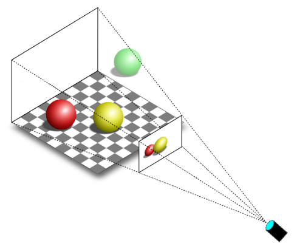
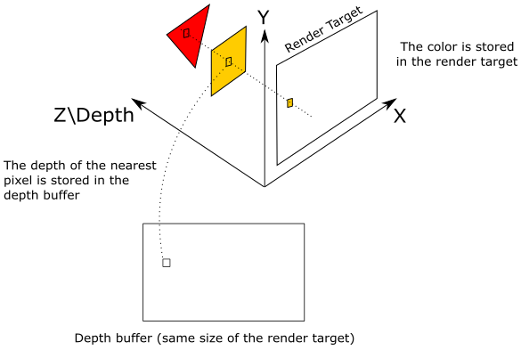
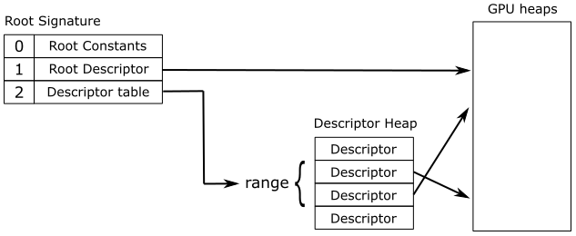
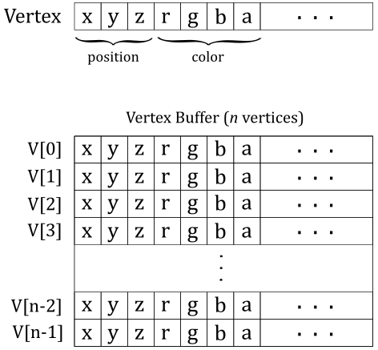
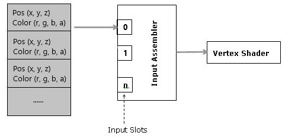
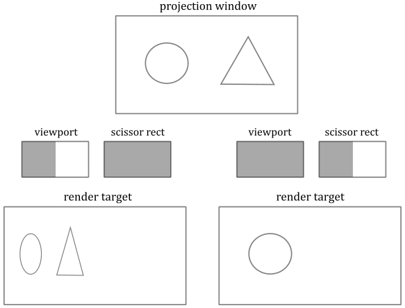
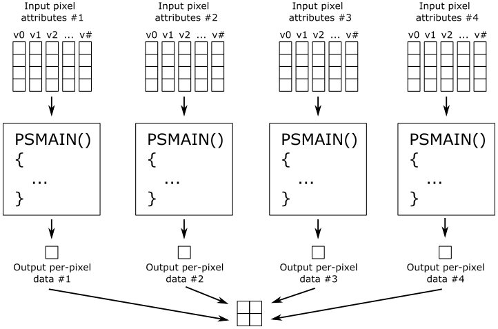

# 01.B - Hello Triangle

<br>


<br>

# 1 - Introduction

This tutorial builds on the previous one, so I do highly recommend completing it before going through this tutorial if you have not done so already.

Here, we will examine the sample **D3D12HelloTriangle**, which draws a triangle on the render target. The related source code can be found in the official Microsoft repository (the link is provided at the end of the tutorial). Actually, the code of this sample hardly changes compared to that of **D3D12HelloWindow**. However, there is still a lot to explain. The reason is this time we will make use of the rendering pipeline to draw something on the render target.

If you are familiar with video games, you know that the image you see on the screen is only a 2D representation of 3D geometries composed of polygons (most of the time triangles) defined by vertex locations in 3D space.

<br>


<br>

It can be stated that the whole art of computer graphics boils down to create a 2D representation from a 3D scene. And indeed, this is the result of processing 3D geometries through a rendering pipeline, which will be briefly discussed in the next section.

In the following figure, we can see a 3D scene projected onto a 2D rectangle\window lying on a plane in front of a special viewpoint called camera. You can think of a 2D projection window as the film of a camera (or the retina of the human eye) that captures the light and allows to create a 2D representation of a 3D scene. Eventually, this 2D representation is mapped to the render target, which, in turn, is mapped to the window’s client area. 

<br>



<br>

You can easily guess that only a particular region of the 3D scene should be captured by the camera (that is, usually we won’t capture the whole 3D scene). The extent of the region captured can be controlled in a similar way to how we set the field of view of the camera lens when we want to take a picture. However, in computer graphics usually the film is in front of the camera lens, not behind. Now, we need to define a couple of terms we will use in the remainder of this tutorial.

**Monitors** are raster display, which means the screen can be seen as a two-dimensional grid of small dots called pixels. Each pixel shows a color which is independent of other pixels. When we render a triangle on the screen, we don't really render a triangle as one entity. Rather, we light up the group of pixels that are covered by the triangle's area.

<br>


<br>

**Textures** are usually 2D digital images of small dots called texels that contain some interesting information (e.g., color, distance, direction, etc.) We can also use textures as render targets (that is, like a canvas where we can draw by setting colors to texels). Then, the final image (called frame) can be mapped to the window’s client area to show the result to the user.

> Observe that a physical pixel is a square with an area, but its coordinates refer to a specific dot\point (usually, the top-left corner of the square\pixel). However, GPU calculations and sampling operations can occur at the center of the pixels. When we state that a monitor is like a 2D grid of dots, we actually mean rows and columns intersecting at pixel coordinates. The same goes for texels and textures. We will return to this both later and in upcoming tutorials.

In the following section we will take a brief look at what's a rendering pipeline, and how we can use it to draw on a render target.

<br>

<br>

# 2 - Direct3D rendering pipeline overview

GPUs provide thousands of programmable cores. That is, GPU cores can execute instructions in the form of programs provided by a programmer, similar to how CPU cores execute C++ apps. Usually, CPUs have fewer cores compared to GPUs. However, GPU cores are smaller and more specialized in processing tasks that can be divided up and processed across many cores. In particular, GPUs use parallelism to execute the same few instructions on multiple cores in order to process huge amount of data really fast. On the other hand, CPUs are good to process many sequential instructions on each core in order to execute multiple tasks on small data really fast.

<br>

 <br>
CPU (on the left) versus GPU (on the right)

<br>

GPUs that support Direct3D can execute programs on their cores to perform the work of various stages in a rendering pipeline. In this context, GPU cores are often called shader cores as they execute shader programs. A rendering pipeline defines the steps needed to draw something on the render target. In particular, the following image shows the stages of the pipeline used to draw on a render target with the Direct3D API.

<br>


<br>

Programmable stages can execute programs (called shader programs, or simply shaders) written by programmers. Configurable stages (the rectangles with gear wheels in the above illustration) can’t be programmed: they always execute the same code, but you can still configure their state. This means you can’t specify what a configurable stage can do, but you can still specify how it performs its task. For this reason, they are often called fixed-function stages. <br>
Data flows from input to output through each of the configurable or programmable stages. In other words, each stage consumes the input from the previous stage and provides its output to the next one (that can use it as input).

<br>

* **Input-Assembler Stage** - The input assembler is responsible for supplying data to the pipeline. This stage takes its input from user-filled buffers in memory that contain arrays of vertices (and often also indices), and from those buffers it makes up primitives (triangles, lines and points) with attached system-generated values (such as a primitive ID, an instance ID, or a vertex ID) to pass to the next stage, vertex by vertex.
  
* **Vertex Shader Stage** - The vertex shader processes vertices from the input assembler. It usually performs operations such as transformations, skinning, and per-vertex lighting. A vertex shader always takes one vertex as input and return one vertex as output. So, a vertex shader needs to run multiple times to process all the vertices of the primitives assembled by the input assembler.
  
* **Hull Shader Stage** - The hull shader operates once per patch. A patch is a set of control points whose interpolation defines a piece of curve or surface. You can use this stage with patches from the input assembler. The hull shader can transform input control points into output control points. Also, it can perform other setup for the fixed-function tessellator stage. For example, the hull shader can output tess factors, which are numbers that indicate how much to tessellate.

* **Tessellator Stage** - The tessellator is a fixed-function unit whose operation is defined by declarations in the hull shader. That is, the tessellator operates once per patch that is output by the hull shader. The purpose of the tessellator stage is to sample the domain (quad, tri, or line) that represents the input patch. Also, the tess factors generated by the hull shader notify the tessellator how much to tessellate (generate geometry and connectivity) over the domain of the patch.

* **Domain Shader Stage** - The domain shader is invoked once per sample (generated by the tessellator). Each invocation is identified by the coordinates of the sample on a generic domain. The role of the domain shader is to turn the sample coordinates into something tangible (such as, a point in 3D space) for use down stream of the domain shader. Each domain shader invocation for a patch also accesses shared input of all the hull shader output (such as, output control points).

* **Geometry Shader Stage** - The geometry shader processes entire primitives. That is, its input can be three vertices for a triangle, two vertices for a line, or a single vertex for a point. The geometry shader supports limited geometry amplification and de-amplification. Given an input primitive, the geometry shader can discard the primitive, or emit one or more new primitives.

* **Stream Output Stage** - The stream output is designed for streaming primitive data from the pipeline to memory on its way to the rasterizer. Data can be streamed out and/or passed into the rasterizer. Data streamed out to memory can be recirculated back into the pipeline as input data for the input assembler or read-back from the CPU.

* **Rasterizer Stage** - The rasterizer converts primitives into a raster images (composed of pixels that need to be processed to be rendered on the screen). It also takes into account the viewport and scissor rectangles (more on this later). During rasterization, per-pixel attributes are interpolated (from per-vertex attributes; a vertex is a collection of attributes) across each primitive.
p
* **Pixel Shader Stage** - The pixel shader receives interpolated attributes for every pixel of a primitive and generates per-pixel data (such as color) to be returned and possibly stored in the render target. It enables rich shading techniques such as per-pixel lighting and post-processing.

* **Output-Merger Stage** - The output merger is the final step for determining which pixels are visible (with depth-stencil testing) and blending the final pixel colors. In particular, it is responsible for combining various types of output data (pixel shader returned values, depth, stencil and blend information) with the contents of the render target and depth/stencil buffer to generate the final pipeline result (the image we want to draw on the render target before showing it on the screen).

<br>

> Hull Shader, Tessellator and Domain Shader together form the Tessellation stage. They are optional and we won’t use them for a while. The same goes for the Geometry Shader and the Stream Output stage.

As illustrated in the figure above, many stages can take part of their input by reading resources from GPU memory (in addition to the input passed from the previous stage), and some of them can write their output in GPU memory as well. The little squares at the bottom right of some stages represent the slots where you can bind descriptors\views of resources in GPU memory. At the left of each stage, you can find a visual description of the task usually performed by the stage. VSMAIN, PSMAIN, etc., suggest that programmable stages execute shader programs.

> A descriptor (or view) is a data structure that fully describes a resource to the GPU (type, dimension, GPU virtual address, and other hardware-specific information). This means the size of a descriptor can change from GPU to GPU. Usually, we will use descriptors to bind resources to the slots of the stages (that is, we won’t directly bind resources to the slots). Then, the GPU can access resources by reading the descriptors bound to the related slots. Please note that binding slots are not physical blocks of memory or registers that a GPU can access to read descriptors. They are simple names used to associate descriptors to resource declarations in shader programs. However, since the documentation uses the term slots to bind resources, I decided to show them in the illustration anyway. As described in the previous tutorial, descriptors are stored in a descriptor heap. In the remainder of this tutorial we will see how a GPU accesses descriptors during the execution of a shader program. <br>
The documentation makes no difference between descriptors and views. However, sometimes it's convenient to think of a descriptor as the physical block of memory where you store a view, which can be seen as the instance of a hardware-specific type that describes a resource.

The depth buffer is a texture associated with the render target (both should be the same size). The depth buffer is used to store depth information that tells us how deep each visible pixel is in the scene. When Direct3D renders 3D primitives to a render target, the output merger stage can use the depth buffer to determine how the pixels of rasterized polygons occlude one another. <br>
Usually, the stencil buffer is coupled with the depth buffer (that is, both share the same buffer in memory, though using different bits) and stores stencil information to mask pixels. The mask controls whether a pixel is drawn or not on the render target, to produce special effects such as dissolves, decaling, and outlining. We will return to the stencil buffer in a later tutorial.

<br>



<br>

In the figure above, the 2D projection window lies in the plane identified by the X- and Y-axes. We already know that the projection window is eventually mapped to the render target, so let’s assume for a moment that we are directly drawing on the render target (without passing through the projection window). The Z-axis is used to quantify the depth of the pixels (that is, their distance from the XY-plane). As you can see, the texel of the render target will store the pixel of the yellow square, which occludes the pixel of the red triangle. Indeed, the value stored in the corresponding texel of the depth buffer (that is, at the same position of the texel in the render target) is the depth of the nearest pixel: the one of the yellow square, in this case. So, the pixel of the triangle will be discarded if the depth test is enabled. On the other hand, if the depth test is disabled, the texel of the render target will store the last pixel processed by the pixel shader because it will always overwrite whatever color is stored in that texel. Observe that if blending is enabled, the pixel is blended with the texel in the render rather than being stored.

The following figure shows a generic programmable stage.

<br>


<br>

* **Input Data**: A vertex shader receives its input from the input assembler stage; geometry and pixel shaders receive their inputs from the previous stage. Additional inputs include system-value semantics, which are consumable by the first stage in the pipeline to which they are applicable. I know. I need to elaborate further. In general, data passed between pipeline stages is completely generic. A semantic is a textual name we can associate to every element in the input data to establish its intended use. You can associate arbitrary strings with no special meaning to elements of the input data as semantics. However, there are several predefined semantics with specific meanings when attached to elements of the input data. For example, **POSITION** and **COLOR**, which are pretty self explanatory. A system-value semantic is simply a semantic that start with "SV_", and that can be associated with additional data generated and\or consumed by the stages of the pipeline to pass and\or identify info in the input data with a special meaning. For example, pixel shaders can only write to elements with the **SV_depth** and **SV_Target** system-value semantics.

* **Output Data**: Shaders generate output results to be passed on to the subsequent stage in the pipeline. For a geometry shader, the amount of data output from a single invocation can vary. Semantics also apply to elements of the output data to convey information about the intended use to the next stage. Semantics are required for all elements passed between shader stages.

* **Shader Code**: Shader programs can read from memory, perform vector floating point and integer arithmetic operations, or flow control operations. We will write shader programs in HLSL (High Level Shader Language), a procedural language similar to C.

* **Samplers**: Samplers define how to sample and filter textures.

* **Textures**: Textures can be filtered using samplers, or read on a per-texel basis directly with the **Load** intrinsic function.

* **Buffers**: A buffer is a collection of fully typed data grouped into elements (just like an array). Buffers are never filtered, but can be read from memory on a per-element basis.

* **Constant Buffers**: Constant buffers are optimized for shader constant-variables. They are designed for more frequent update from the CPU; therefore, they have additional size, layout, and access restrictions.

<br>

This section provided just a brief overview of the rendering pipeline, so don’t worry if you are a little confused right now. We will return to each of these topics in the following sections and upcoming tutorials to explain everything in detail.

<br>

<br>

# 3 - Resources management

In DirectX, we can create several types of resources through the device object (that is, through a pointer to the **ID3D12Device** interface). In the first tutorial we have seen how to create a command queue, a command allocator and a command list. However, we can also create various types of buffers (constant, typed, structured, raw) and textures (1D, 2D, 3D), or even arrays of these resources. Usually, we call **ID3D12Device::CreateCommittedResource** whenever we want to create a buffer or a texture. The arguments passed to **CreateCommittedResource** specify where to allocate memory space, the type of resource to create, its initial state, and a pointer to a memory block that will receive the interface pointer to the created resource. With **CreateCommittedResource** we can also create typeless resources if format information is missing. However, when you want the GPU to access a typeless resource, you need to bind a view that fully describes it; otherwise, the GPU could have no idea how to access it.

<br>

## 3.1 - Memory

GPUs have access to four types of physical memory:

* **Dedicated video memory**: this is memory reserved\local to the GPU (VRAM). It's where we allocate most of the resources accessed by the GPU (through the shader programs).

* **Dedicated system memory:** it is a part of dedicated video memory. It's allocated at boot time and used by the GPU for internal use. That is, we can't use it to allocate memory from our application.

* **Shared system memory**: this is CPU-visible GPU memory. Usually, it is a small part of the GPU local memory (VRAM) accessible by the CPU through the PCI-e bus, but the GPU can also use CPU system memory (RAM) as GPU memory if needed. Shared system memory is often used to copy data from CPU to GPU. It's write-combine memory from the CPU point of view, which means that write operations are buffered up and executed in groups when the buffer is full, or when important events occur. This allows to speed up write operations, but read ones should be avoided as write-combine memory is uncached. This means that if you try to read this memory from your CPU application, the buffer that holds the write operations need to be flushed first, which makes reads from write-combine memory slow.

* **CPU system memory**: it's system memory (RAM) that, like shared system memory, can be accessed from both CPU and GPU. However, CPUs can read from this memory without problems as it is cached. On the other hand, GPUs need to access this memory through the PCI-e bus, which can be slow (unlike CPUs, which use the system memory bus to access system memory).

<br>


<br>

Observe that if you have an integrated graphics card, or use a software adapter, there is no difference between the four memory types mentioned above. That is, CPU and GPU always share the only memory type available: the system memory (RAM). This means your GPU will likely have limited and slower memory to access.<br>
When you call **CreateCommittedResource**, you need to specify the type of memory where to allocate the related resource. You can indicate this information in two ways: abstract and custom. In the abstract way we have three types of heaps that allow to abstract the current hardware.

* **Default heap**: memory that resides in dedicated video memory.

* **Upload heap**: memory that resides in shared video memory.

* **Readback heap**: memory that resides in CPU system memory.

<br>

Then, regardless of whether you have a discrete GPU (that is, a real graphics card) or an integrated one, physical memory allocations are hidden to the programmer.<br>
On the other hand, if you want different allocations based on the type of hardware, you can try the custom way, which allows to specify the caching properties and the memory pool where you want to allocate space. However, we won't cover the details here because we will mostly use the abstract way to allocate GPU-visible memory in the upcoming tutorials.

A resource is considered to be resident in memory when it is accessible by the GPU. Usually, when you create a resource with **CreateCommittedResource**, you allocate an amount of GPU-visible memory big enough to contain the resource. At that point, the resource is resident in memory and remains so until it is destroyed (or you explicitly evict it from memory).

<br>

## 3.2 - Views and descriptors

As stated earlier, a resource can be created in a generic format, and a view is an instance of a hardware-specific type that fully describes a resource to the GPU. We use views to bind resources to the rendering pipeline. That is, we use views to bind resource to resource declarations in shader programs (more on this later). We can create a view to a resource with one of the **Create*View** methods. Each of these methods creates a view to a resource from the related information passed as an argument, then stores the view in the descriptor passed in the last parameter (as a CPU descriptor handle). Remember that descriptor heaps must be CPU visible because we need to store views in descriptors.

Since views holds hardware-specific information for different resource types, the size of a view depends both on the hardware and the type of resource described. In the first tutorial we have seen that to access descriptors in a descriptor heap, we offset CPU or GPU descriptor handle values. This means that not all descriptors can share the same descriptor heap. Also, not all views can be stored in descriptors (more on this shortly). Below is a list of all views we can create.

<br>

* Constant buffer view (CBV)
* Unordered access view (UAV)
* Shader resource view (SRV)
* Samplers
* Render Target View (RTV)
* Depth Stencil View (DSV)
* Index Buffer View (IBV)
* Vertex Buffer View (VBV)
* Stream Output View (SOV)

<br>

CBVs are used to describe constant buffers, SRVs are used to describe read-only textures and buffers, and UAVs are used to describe textures and buffers when read/write access from multiple threads is needed.<br>
Samplers are not exactly views (you can think of them as self-contained objects). However, samplers are considered views because they are often managed in a similar way (more on this shortly).<br>
We have already met RTVs in the first tutorial. DSVs are used to describe depth-stencil buffers.<br>
IBVs and VBVs are used to describe index and vertex buffers, respectively.<br>
SOVs are used to describe stream output buffers (we will cover them in a later tutorial).

CBVs, SRVs, UAVs are the same size so they can share the same descriptor heap.<br>
CBVs, SRVs, UAVs and samplers can be stored in descriptor heaps allocated in write combine memory (possibly on CPU-visible GPU local memory) by setting **D3D12_DESCRIPTOR_HEAP_FLAG_SHADER_VISIBLE** as a flag in the **D3D12_DESCRIPTOR_HEAP_DESC** structure passed to **CreateDescriptorHeap** as a parameter. In that case, we call them shader visible descriptor heaps to specify that the GPU needs to access their descriptors. Samplers can't share a descriptor heap with CBVs, SRVs and UAVs, although (they need a dedicated descriptor heap).<br>
RTVs and DSVs must be stored in descriptor heaps allocated in CPU system memory by specifying **D3D12_DESCRIPTOR_HEAP_FLAG_NONE** as flag in **D3D12_DESCRIPTOR_HEAP_DESC**. We call them non shader visible descriptor heaps to specify that the GPU doesn't need to access their descriptors (if you remember what we stated in the first tutorial, RTVs are copied in the command list; the same applies to DSVs). Both RTVs and DSVs need a separated descriptor heap from all other views. CBVs, SRVs, UAVs can also be stored in non shader visible heaps.<br>
IBVs, VBVs and SOVs don't even need to be stored in a descriptor (as well as descriptors placed directly in the root arguments, described later in more detail). These descriptors, similarly to RTVs and DSVs, are recorded into (copied to) the command list directly.

<br>

## 3.3 - Transitions

Suppose we have some commands in a command list to both read and write a resource. Even though a GPU can execute commands in parallel, it shouldn't start reading the texture if any write operation is still ongoing, otherwise data races can occur. <br>
In Direct3D 12 we specify the intended use of a resource by transitioning its state. For example, if you want the GPU to read a texture, that texture must be in a read state. The programmer is responsible for recording transition barriers in the command list to let the GPU know the intended use of each resource, so that it can establish which operations can be executed in parallel and which not.<br>
In Direct3D 12 most per-resource state is managed by our application with **ID3D12GraphicsCommandList::ResourceBarrier**. At any given time, a resource is in exactly one state, determined by the set of **D3D12_RESOURCE_STATES** flags supplied to **ResourceBarrier**. 

<br>

## 3.4 - Root signature

Obviously, shader programs need to access resources stored in GPU heaps. For example, in HLSL (the language used to write shader programs) you can declare the following variable:

<br>

```hlsl
Texture2D g_texture : register(t0);
```
<br>

It seems that **g_texture** is a variable that represents a texture 2D. That's not totally wrong, but we can be more precise. The Microsoft documentation states that resources in HLSL are bound to virtual registers within logical register spaces:

<br>

**t** – for shader resource views (SRV) <br>
**s** – for samplers <br>
**u** – for unordered access views (UAV) <br>
**b** – for constant buffer views (CBV)

<br>

The **register** attribute specifies that **g_texture** is bound to the slot (virtual register) 0 of the register space **t**, which is reserved to SRVs. Then, this variable allows to access a descriptor that holds an SRV describing a 2D texture. The use of the term register is a bit misleading in this case. There are no registers or memory regions behind binding slots. A better name would have been **linkname**, to indicate that a slot name is only used to link descriptors and resource declarations. That is, we use the string **t0** to bind a descriptor stored in a GPU heap (e.g., in a descriptor heap, or in a command list) to a resource declaration in a shader program. That said, the following illustration shows the general idea: we can bind descriptors in memory to variables declared in the shader code by associating both a root signature and a shader visible descriptor heap to the command list. Now, we need to elaborate further on this general idea.

<br>


<br>

After creating the resources and the related descriptors (on the CPU timeline), we can associate a structure called root signature to the command list. The root signature acts like a function signature in C++: it describes the types of the input and output parameters. That is, the root signature describes what the shader programs of all programmable stages should expect both as input and output through the resource variables declared in the related HLSL code (that is, what they need to read and\or write). In particular, a root signature is an array of root parameters that describe the types of the descriptors we want to bind to the pipeline (or rather, to resource variables declared in the shader code), along with the related binding slots (virtual registers), so that we have a chance to associate root parameters with variables in HLSL.

> Observe that, like a function signature, a root signature only describes the types of the descriptors. The actual descriptors need to be passed as root arguments to the root parameters by recording commands in the command list.

There are three types of root parameters:

* **Root constants**: 32-bit constants inlined in the root arguments that show up in the shader code as a constant buffer. The size of each root constant in the root signature is 1 DWORD.

* **Root descriptors**: descriptors inlined in the root arguments. Mainly used for descriptors that are frequently accessed and that describes buffers (i.e., not for textures). The size of each root descriptor in the root signature is 2 DWORD.

* **Root descriptor tables** (also called **descriptor tables**, or **root tables**): pointers to a set of contiguous descriptors in a shader visible descriptor heap associated with the command list. The size of each root descriptor table in the root signature is 1 DWORD.

<br>

Please note that root constants show up as a constant buffer in shader programs. This means you still have to define the related type in the shader code. However, you don't need to create a constant buffer and the related view to bind it to the pipeline as, with root constants, the constant buffer data is passed to the GPU directly in the root parameter. We will return to root constants in a later tutorial.

Root descriptors are not normal descriptors. They only take 2 DWORD to store the GPU virtual address of the related resource. That's why you can only use them for buffers: GPUs need more information to access textures (size, type, format, etc.). As we will see in an upcoming tutorial, if a buffer holds one or more elements of a user defined type, this needs to be fully defined in the HLSL code, so a GPU can access them by only knowing the starting address of the buffer. However, it's up to the programmer to not access the buffer out of bounds.

Root tables are convenient when you want to bind sets of descriptors to arrays of resources declared in HLSL. A root table just stores a 32-bit value (1 DWORD) representing the byte offset of a set of contiguous descriptors from the start of a shader visible descriptor heap associated with the command list. Also, a root table allows to bind different types of descriptors, provided they are contiguous in a descriptor heap.

The figure below is an example of a simple root signature. The root parameter at index 0 is a collection of four root constants (as **float4** is an array of four **float** of 1 DWORD each), the root parameter at index 3 is a root descriptor the holds the GPU virtual address of a resource in a GPU heap, while the root parameters with indices 1 and 2 are root descriptor tables. As you can see, the descriptor table at index 1 is a set of five contiguous descriptors divided into three ranges of descriptors with different types (2 SRVs, 2CBVs and 1 UAV). When we pass a root argument as a command recorded in a command list, we must also specify the index of the related root parameter.<br>
Observe that binding slots are also specified in both root constants and root descriptors, while in root tables they are specified at a range level.

<br>


<br>

In the figure below you can see that for root constants there is no indirection. That is, the shaders can read the values directly from the root arguments passed at command list recording time. For root descriptors, we have a level of indirection since they contain GPU virtual addresses to resources in GPU heaps. Lastly, with root descriptor tables we have a double level of indirection as they hold offsets to descriptors, which in turn hold GPU virtual addresses to resources. <br>
Obviously, levels of indirection increase the complexity (i.e., the time) needed to access a resource. On the other hand, they allow to "cover" more descriptors of different types.

<br>



<br>

Worthy of special mention are static samplers as they are part of a root signature, but separated from the root parameters. Then, static samplers do not have any cost in the size of a root signature. How to manage static samplers is an implementation-specific detail. However, some GPUs implicitly store static samplers in a descriptor heap hidden in a reserved space, and automatically bound them to the related declarations in the shader code. That's why samplers are considered like other views. <br>
There are no downsides for taking advantage of the convenience of static samplers, so just use them whenever practicable, as you don't need to explicitly create descriptor heaps and views.

We must associate a root signature to a command list in order to set up a parameter space where to map root arguments. As noted above, root arguments are passed to root parameters by recording commands in the command list. When the GPU executes these commands, the root arguments are stored in a root argument space, a memory region near the GPU core registers, so that a GPU can quickly reference them during the execution of a shader program. However, this fast memory region is limited in size. Fortunately, most GPUs can also spill to slower memory regions whenever the fast memory is full.

If you pass a root argument to a root parameter to draw an object A and then, in the same command list, you pass a different root argument to the same root parameter to draw an object B, the driver needs to copy the whole memory region where the root arguments are stored. If the root arguments are split into fast and slow memory regions, the driver can only copy the region of memory where the new root arguments reside. This allows to execute drawing commands in parallel, where each draw references the proper memory region of root arguments.

Changing the root signature associated with a command list is fairly inexpensive. However, this invalidates the current root arguments, that need to be reset. Unfortunately, this last operation is a bit more expensive, so minimize the number of root signature changes. <br>
Changing a shader visible descriptor heap associated to a command list can be expensive since the GPU first need to execute the pipeline operations still pending. Then, whenever possible, set a shader visible descriptor heap once, after creating the command list.

The maximum size of a root signature is 64 DWORDs. However, this is more a suggestion (than a rule) to remember that small root signatures allow to only use the fast memory region to store root arguments. Also, the documentation also states that we should sort root parameters (in the root signature) from most frequently changing to least. That is, root parameters that receive different root arguments within the same command list should be placed before root parameters that don't change their root arguments. That way, we give the driver a better chance of only copying root arguments in the fast memory region (which is faster).

<br>

### 3.4.1 - Root signature version

Microsoft constantly updates the design of the root signature to enable more hardware optimizations by the drivers.<br>
Root Signature version 1.0 allows descriptors in a descriptor heap, and\or resources they point at, to be freely changed by applications any time that command lists referencing them are potentially in flight on the GPU. However, this flexibility in changing descriptors and the related resources is paid for with a poor optimization.<br>
Root version 1.1 lets drivers produce more efficient memory accesses by shaders if they know the promises an application can make about the static-ness of descriptors and resources they point to during command list recording and execution. For example, drivers could remove a level of indirection for accessing a descriptor in a heap by converting a descriptor table into a root descriptor if both the descriptor table and the resource it points to is found to be static.<br> 
We can make our promise about the static-ness of descriptors (in a descriptor heap) and\or data they point to by setting some flags during the creation of the related root descriptor tables. Unless otherwise indicated (that is, if no flag is specified), using a root signature version 1.1 will set descriptors to be static. As for the data they point to, it depends on the type of descriptor. CBVs and SRVs data are **DATA_STATIC_WHILE_SET_AT_EXECUTE** by default, which means the driver assumes that the resource pointed by a descriptor can change up until the command list starts executing, and stays unchanged for the rest of the execution. UAVs data is **DATA_VOLATILE** by default, which means the driver assumes the resources pointed by a descriptor to be editable both during command list recording and execution. You can explicitly set descriptor to **DESCRIPTORS_VOLATILE**, which means the driver assumes descriptors can change during command list recording and stays unchanged for the rest of the execution. **DESCRIPTORS_VOLATILE** and **DATA_VOLATILE** are the only supported behaviors of Root Signature version 1.0. That's why the driver can't make assumptions about the static-ness of descriptors and data.

<br>

<br>

# 4 - The Pipeline State

The pipeline state defines the behaviour\setup of every stage in the pipeline when we are going to draw something. We can set the state of both configurable and programmable stages in a single object called pipeline state object (PSO), which describes most of the state of the rendering pipeline. A PSO is a unified pipeline state object that is immutable after creation (you have to create a new one to define a different pipeline state). A quick summary of the states that can be set in a PSO includes:

* The bytecode for all shader programs (that defines the states of programmable stages).

* The input vertex format.

* The primitive topology type (point, line, triangle, patch). 

* The blend state, rasterizer state, depth stencil state.

* The depth stencil and render target formats, as well as the render target count.

* Multi-sampling parameters.

* A streaming output buffer.

* The root signature. 

<br>

We will return to each of these points later and in upcoming tutorials.<br>
As stated above, most graphics pipeline states are set using PSOs. However, some pipeline state parameters must be set directly in the command list. That way, we can modify them on the fly without recreating a PSO. The following table shows the states that must be set directly in a command list.

* Resource bindings (vertex and index buffers, render target, depth-stencil buffer, descriptor heaps).

* Viewport and Scissor rectangles.

* Blend factors.

* The depth stencil reference value.

* The input-assembler primitive topology order and adjacency type (line list, line strip, line strip with adjacency data, etc.).

<br>

As for the first point, remember that IBVs, VBVs, RTVs and DSVs are copied in the command list, and that we can associate a shader visible descriptor heap to a command list. We’ll return to the remaining points both in this and later tutorials.

To set the part of the pipeline state defined within a PSO, we can record a command in the command list with **ID3D12GraphicsCommandList::SetPipelineState**. Alternatively, we can set the same state during the creation or reset of a command list with **ID3D12Device::CreateCommandList** and **ID3D12GraphicsCommandList::Reset**, respectively. The result is the same: a command (in the command list) that sets the pipeline state. Either way, we pass a PSO as an argument. If no PSO is specified in **CreateCommandList**, a default initial state is used. Then, we can use **SetPipelineState** to change the PSO associated to the command list.<br>
Command lists inherit none of the pipeline states (within and outside a PSO) set by previous command lists.

The documentation states that, ideally, the same root signature should be shared by more than one PSO. This means we should design the root signature as general as possible. The last sentence suggests that root signatures could easily turn to a large structure. This seems to contrast with what has been stated earlier about the need to have small root signatures. However, the trick is always to find the right balance for the application we are working on.

We set both a PSO and a root signature in the command list so that the GPU can use them to define most of the pipeline state and to bind resources to the pipeline (remember that non-PSO states need to be directly set in the command list). For binding purposes, we may also need to set a couple of shader visible descriptor heaps to the command list (one for CBVs\SRVs\UAVs and the other for dynamic samplers; as samplers can't share a descriptor heap with other views) to bind sets of descriptors in a descriptor heap through root descriptor tables.

Whenever you record a drawing command in a command list, the root signature in the PSO needs to match with the one associated with the command list. Otherwise, the result is undefined. <br>
As stated earlier, root signatures should be as small as possible, but big enough to be shared by as many PSOs as possible. That way, you can switch between PSOs without changing the root signature associated with the command list (which invalidates the root arguments).

We create a PSO with **ID3D12Device::CreateGraphicsPipelineState**, which takes a **D3D12_GRAPHICS_PIPELINE_STATE_DESC** as parameter. This structure describes a pipeline state object (that is, we set its fields to define the part of pipeline state within a PSO: bytecode of the shaders, root signature, and so on). When we call **CreateGraphicsPipelineState** to create a PSO, the driver compiles the bytecode in machine code executable by the GPU. The driver also uses the root signature inside the PSO to embed the traversal details in the machine code to let the GPU know how to access resources through the root arguments.

> We won't cover how the driver translates from bytecode to GPU machine code as this is an implementation-specific detail that goes beyond the scope of this tutorial. However, something can be said about the traversal details the driver embeds in the machine code. <br>
As for root constants, a possible implementation could specify to load them in registers, so that the GPU (during the execution of the shader code) can directly access the related values without reading memory. <br>
As for root descriptors, an implementation could specify to load the GPU virtual addresses to the related resources into registers, so that the GPU needs to read memory to access them (in this case we have a level of indirection). <br>
As for root tables, an implementation could specify to load the address of the shader visible descriptor heap into a register, and the byte offset of a set of descriptors into another register, so that the GPU needs to read memory twice. A first time to get a descriptor, and a second time to get the related resource (in this case we have two levels of indirection). <br>
At this point you may conclude that the root constants are always the best option. Unfortunately, GPUs have a limited number of registers so, if you use many root constants, the driver could end up spilling root constants to memory, so that we'll still have a level of indirection.

At this point you may wonder why we need to set the root signature twice (both in PSO and command list). In other words, if the root signature in the PSO and in the command list must match, can't the command list take this information from the PSO we associate with it? The point is that the PSO uses the root signature only to compile the bytecode. On the other hand, a command list uses the root signature to set up the parameter space (so that we can map root arguments to root parameters). Also, we can set root arguments before associating a PSO with a command list, so the parameter space needs to be set even without a PSO.

Again, don’t worry if you are a little confused right now. The next four sections will cover in depth the pipeline stages used by **D3D12HelloTriangle** to draw a triangle on the render target. Also, in the last section we will review the source code of the sample, providing a practical approach to the theoretical concepts discussed so far. By the end of this tutorial you will have a basic knowledge of how the rendering pipeline works, and how to use it to draw on the render target.

<br>

<br>

# 5 - The Input Assembler

The input assembler is the first stage of the pipeline. It assembles primitives (points, lines, triangles) from a couple of user-defined arrays (called vertex and index buffers) and pass the result to the vertex shader. It's a fixed-function stage, so we can only set up some of its state. In particular, we need to bind an array of vertices (the vertex buffer) and, optionally, an array of indices (the index buffer) that describe the mesh we want to draw, primitive by primitive. As we will see in this section, the input assembler also needs additional information to perform its task.

<br>

## 5.1 - Meshes

A mesh is a geometry composed of polygons\primitives (often triangles) which, in turn, are described by vertices. Whether it’s a complex model (created with graphics modeling tools like 3ds Max or Blender) or a simple cube created programmatically, the structure used to describe them is the same: an array of vertices (the vertex buffer) describing the primitives that make up the mesh. For this reason, it can be useful to see what vertices are, and how they can be organized in memory as a vertex buffer.

<br>


<br>

## 5.2 - Vertex buffer

When you think of a vertex, position is the first thing that comes to mind. Actually, in the context of computer graphics, a vertex is more like a structure whose fields describe some important attributes of the vertex such as position, color, and so on. A vertex buffer is simply a buffer that contains an array (that is, a contiguous collection) of vertices.

<br>



<br>

However, the vertex buffer illustrated in the image above is the logical representation from our point of view (i.e., what we want the input assembler "see" as vertex buffer). If you simply bind an array of vertices, the input assembler has no clue about how to interpret the data in the buffer. Indeed, without additional information, from the point of view of the input assembler, the vertex buffer is a collection of contiguous, generic data. For example, it can't know how many attributes each vertex contains, and the size of each attribute. As a result, the input assembler can't even know when a vertex ends, or a new one starts in the vertex buffer. Then, we also need to pass the vertex layout as information to the input assembler (more on this shortly).

The input assembler has 16 slots (from 0 to 15) where you can bind views to buffers of homogeneous attributes (that is, splitting up the attributes of the vertices in separated buffers).

<br>


<br>

However, most of the time we will bind a single buffer of heterogeneous attributes for all vertices: the whole vertex buffer.

<br>



<br>

Separated buffers of homogeneous attributes are useful if you need to only access some of the attributes. In that case, you can get better cache and bandwidth performance with separated buffers of homogeneous attributes, which allows cache lines and registers to only fetch the relevant data. Anyway, we don't need to worry about these low-level details right now.

<br>

## 5.3 - Input layout

The input layout holds part of the state of the input assembler. In particular, it describes the vertex layout to let the input assembler know how to access the vertex attributes. Also, the input layout specifies, for each vertex attribute, the semantic name (to identify the attribute), a semantic index (to append to the semantic name in case there were more attributes with the same semantic name; that is, to distinguish them from each other), the format, the input slot, the offset (in bytes) from the start of the vertex, and other information. That way, the input assembler knows how to convey vertex attributes to the vertex shader through input registers (more on this shortly).

<br>

## 5.4 - Primitive topologies

In order to assemble primitives, the input assembler also needs to know their basic type (point, line, triangle or patch) and topology, which allows to define a relationship between primitives (connection, adiacency, and so on). We need to pass this information to let the input assemble know how to interpret the vertex buffer data. The following image shows all of the primitive types that the input assembler can produce from the vertex buffer data. <br>

<br>


<br>

**Point List** indicates a set of vertices that are rendered as isolated points. The order of the vertices in the vertex buffer is not important as it describes a set of separated points.

**Line List** indicates a set of lines. The two vertices that represent the extremes of each line must be contiguous in the vertex buffer.

**Line Strip** indicates a connected series of line segments. In the vertex buffer, the vertices are ordered so that the first vertex represents the starting point of the first segment of the line strip, the second vertex represents both the second point of the first segment and the first point of the second segment, and so on.

**Triangle List** indicates a series of triangles that make up a mesh. The three vertices of each triangle must be contiguous in the vertex buffer, and in clockwise order.

**Triangle Strip** indicates a series of connected triangles that make up a mesh. The three vertices of the i-th triangle in the strip can be determined according to the formula $\triangle_i=\\{i,\quad i+(1+i\\%2),\quad i+(2-i\\% 2)\\}$.<br>
As you can see in the image above, this allows to have an invariant winding order (clockwise) of the vertices of each triangle in the strip.

Adjacent primitives are intended to provide more information about a geometry and are only visible through a geometry shader. We will return to adjacent primitives in a later tutorial.

<br>

## 5.5 Index buffer

Consider the following figure.

<br>


<br>

Here, we have a geometry composed of 8 primitives\triangles and 9 vertices. However, the vertex buffer that describes this geometry as a triangle list contains 24 vertices with lots of repetitions.

<br>

```cpp
Vertex octagon[24] = {
v0, v1, v2, // Triangle 0
v0, v2, v3, // Triangle 1
v0, v3, v4, // Triangle 2
v0, v4, v5, // Triangle 3
v0, v5, v6, // Triangle 4
v0, v6, v7, // Triangle 5
v0, v7, v8, // Triangle 6
v0, v8, v1  // Triangle 7
};
```
<br>

To avoid duplication in the vertex buffer, we can build an index buffer that describes the geometry as a triangle list by picking up vertices in the vertex buffer. For example,

<br>

```cpp
Vertex v[9] = { v0, v1, v2, v3, v4, v5, v6, v7, v8 };
 
UINT indexList[24] = {
0, 1, 2, // Triangle 0
0, 2, 3, // Triangle 1
0, 3, 4, // Triangle 2
0, 4, 5, // Triangle 3
0, 5, 6, // Triangle 4
0, 6, 7, // Triangle 5
0, 7, 8, // Triangle 6
0, 8, 1  // Triangle 7
};
```
<br>

Now, the vertex buffer only contains 9 vertices. Of course, we simply shifted repetitions in the index buffer, but as you know, indices are integers (4 bytes) while vertices are huge structures. Then, we can save memory space by using index buffers. Although, we won’t use an index buffer in this tutorial as the vertex buffer to describe a triangle only contains 3 vertices. Anyway, you can bind an index buffer to a slot of the input assembler the same way you bind vertex buffers (we will see how in the last section).

<br>

## 5.6 - System-Generated Values

In addition to the vertex attributes from the vertex buffer, the input assembler can also pass to the next stages some system-generated values such as a primitive ID and\or a vertex ID to help them identify vertices and primitives generated by the input assembler.

<br>

<br>

# 6 - The Vertex Shader

The vertex shader processes, one by one, the vertices of the primitives generated by the input assembler. Usually, the vertex shader transforms the vertices to scale, rotate or translate a mesh before passing the result to the next stage.<br>
If no optional stage is used between the vertex shader and the rasterizer, the task of the vertex shader is also to compute a 2D representation of the 3D vertex positions passed as input by the input assembler. Right now, there's no point in providing further details as the sample examined in this tutorial will use a vertex buffer where the vertex positions are already in 2D, and projected onto the projection window (more on this in the last section). Also, we don't need to apply any transformations to the triangle we want to show on the screen. Then, the vertex shader used by **D3D12HelloTriangle** will work as a simple pass-through. We will return to transformations and projections in later tutorials.

To conclude this section, I'd like to cover generic programmable stages in more detail. The following image shows a simplified design of a shader core, as exposed by the shader model, which abstract\hide the hardware details to expose the rendering pipeline to the programmer. 

<br>

>An important thing to understand is that GPUs have no idea of what pipelines and stages are, as they simply execute instructions in parallel on different threads. On the other hand, a rendering pipeline is required a theoretical sequential processing of the primitives generated by the input assembler. However, in practice this restriction applies only when necessary. That is, a GPU can execute shaders in parallel on its cores as long as it needs to perform a task depending on the order of the primitives. We will return to these low-level details in later tutorials.

<br>


<br>

On the right you can see the binding slots used to bind resources through views\descriptors. Remember that binding slots are just virtual registers. That is, they are simply names used for linkage purposes. <br>
Shader cores use 128-bit registers for input (**v#**), output (**o#**) and temporary data (**r#** and **x#**). Each register is composed of four 32-bit fields (that’s why you see arrays of four squares in the figure above). For example, a vertex shader can receive the position of a vertex (from the input assembler) in the input register **v0**, and the color in the input register **v1**. Then, it can transform the position using a temporary register and put the result in the output register **o0** to pass the data to the next stage. In this context, a shader core is similar to a CPU core. However, unlike CPU programs, you will hardly write shader code in assembly language. Despite this, looking at the assembly code of shader programs is a crucial task in the optimization process to speed up the execution of your graphics applications. Observe that, as stated above, shader cores are just an abstraction of real hardware (they only "execute" bytecode, not GPU instructions).

<br>

<br>

# 7 - The Rasterizer

The rasterizer takes vertices of 2D primitives (projected onto the projection window), and passes to the next stage the pixels covered by these 2D representations of the original 3D primitives. For this purpose, the rasterizer first use the viewport to transform the 2D vertex positions to render target positions, so that it can consider the related 2D primitives with respect to the space of the render target. At that point, the rasterizer can compute the pixels covered by the 2D primitives so that to each pixel corresponds a texel in the render target at the same location. Then, it uses the scissor to discard the pixels falling outside a rectangular region on the render target. As you can see in the following image, the viewport is represented as a rectangle jut like a scissor, so that we can select a region on the render target where to restrict the drawing (more details on the viewport will be provided in a later tutorial). Then, the viewport can be seen as a transformation to map\stretch the projection window onto a particular rectangle of the render target. On the other hand, the scissor rectangle can be seen as a filter to discard pixels.

<br>



<br>

The calculation the rasterizer performs to check if a 2D primitive in the render target space covers a pixel is made with respect to its center (that is, a pixel is covered if a primitive covers its center). Also, if two or more primitives overlap, the rasterizer will generate\pass several pixels for the same texel position. However, what pixel is actually stored in the render target and how, it depends on whether blending, or depth and stencil tests are enabled (we will return to this in a later tutorial, when we cover the output merger stage).

<br>


<br>

In the image above, light grey and dark grey are used for distinguishing between pixels of adjacent primitives. For example, in the top center of the figure, only two pixels (the dark grey ones) belong to the upper triangle. Despite the edge shared by the two triangles passes through the center of four pixels, the rasterizer decided they belong to the lower triangle. Fortunately, we don’t need to know the rules that govern the rasterizer’s decisions. We usually just set the rasterizer state and enjoy the result in the pixel shader.

Behind the scene the rasterizer always passes to the pixel shader a quad of $2\times 2$ pixels. So, even if only a pixel is covered by a 2D primitive, all the pixels of the quad will be passed as well. The reason for this behavior will be explained in another tutorial. In the figure below, for example, only one pixel (center) is covered. However, all the pixels in the quad will be processed in parallel by the pixel shader.

<br>


<br>

Now, it is important to note that a pixel not covered by a primitive, but equally processed by the pixel shader, will be simply discarded when you try to generate a per-pixel data to write in the render target (that is, when you return a value from the pixel shader; for example, a color).

<br>

## 7.1 - Face culling

Unless otherwise specified, the rasterizer will only return pixels covered by front-face triangles, whose vertices are in clockwise order.

<br>


<br>

The front face of a triangle is the face on the side of the normal vector. This vector is perpendicular to the triangle and points away from the front side of the face. The direction of the normal vector can be determined by the order of the vertices. So, the rasterizer can infer which one is the front face as it receives the vertices of each primitive in order, which is determined by the input assembler (based on the primitive type and topology). In particular, the winding order is clockwise for vertices of triangles in the vertex buffer, so the front face of triangles in the render target space is the one where the vertices are in clockwise order as well. In a later tutorial we will see how we can derive a formula to compute the normal vector from the vertices of a triangle.

<br>


<br>

## 7.2 - Attribute interpolation

We know that attributes are something related to vertices. However, the rasterizer also generates pixels inside primitives (that is, in the middle of their vertices). At this point, a question arises. What’s the color of a pixel inside a triangle? We don’t know this information. Fortunately, the rasterizer can calculate it for us by interpolating the attributes of the vertices of a primitive with barycentric coordinates, and fixing the result to take into account the problems that arise when you get a 2D representation from a 3D primitive. Don’t worry if you found the last sentence a bit cryptic. The rasterizer is a fixed-function stage: we can easily skip the low-level details and just welcome the result in the pixel shader. However, the following image can help to explain why the rasterizer needs to fix the interpolation.

<br>


<br>


Imagine an oblique segment in 3D which is described by its two extreme points as vertices that hold both position and color attributes. If a vertex is black and the other is white, the center of the segment in 3D will be grey. The 2D representation of the segment projected onto the projection window will be a segment as well. However, if the rasterizer simply interpolate the colors of the two projected extreme vertices, the grey pixel will be the one at the center of the projected segment rather than the one where the center of the 3D segment is projected.

<br>

<br>

# 8 - The Pixel shader

The pixel shader processes, one by one, the pixels sent by the rasterizer. It receives into the input registers (**v#**) the interpolated attributes, and it is usually used to compute per-pixel lighting and post-processing effects. The system-value semantic **SV_Target** is used to identify the output value returned by the pixel shader as the per-pixel data that could be stored in the render target, at the same position (that is, in the corresponding texel).

However, the sample examined in this tutorial doesn’t implement per-pixel lighting or special effects, so it can simply return the interpolated color as the per-pixel data to be stored in the render target, or to be discarded. Indeed, we have just a triangle to draw, so it can't be occluded by other geometries\meshes. In this case, the pixels generated by the rasterizer for the triangle will be the only processed by the pixel shader. Then, we don't need to enable blending, or depth and stencil tests in the output merger (OM) stage. So, most of the per-pixel data returned by the pixel shader will be definitely stored in the render target as the related pixels are covered by the triangle. As for the remaining pixels (the discarded ones), we already know that usually GPUs process in parallel a quad of pixels.

<br>



<br>

We also know that pixels not covered by primitives, but equally processed by the pixel shader, are discarded when the per-pixel data is returned to be stored in the render target. Then, the remaining per-pixel data returned by the pixel shader for pixels in the quad, but not covered by the triangle, will be simply discarded.

> Per-pixel data is always stored in the render target if blending, along with depth and stencil tests are disabled in the output merger stage, unless the center of the pixel is not covered by a primitive (in that case the pixel gets discarded by the pixel shader).<br>
Observe that, in **D3D12HelloTriangle**, we will only make use of the OM stage to set the render target as the final output of the rendering pipeline. We will cover the output merger stage in detail in a later tutorial.

As you can verify by running the sample, the colors of the pixels inside the triangle, and on its edges, are interpolated from the colors associated with the 3 vertices that describe the triangle in the vertex buffer.

<br>

<br>

# 9 - D3D12HelloTriangle: code review

We can finally review some code.<br>
The application class now includes a root signature, a PSO, a vertex buffer, and both viewport and scissor rectangles. It is also worth noting that the comment about **ComPtr** refers to the fact that, when you send a command list to a command queue, you must make sure to not release COM objects on the CPU timeline before the GPU uses the related resources on its timeline.

<br>

```cpp
// Note that while ComPtr is used to manage the lifetime of resources on the CPU,
// it has no understanding of the lifetime of resources on the GPU. Apps must account
// for the GPU lifetime of resources to avoid destroying objects that may still be
// referenced by the GPU.
// An example of this can be found in the class method: OnDestroy().
using Microsoft::WRL::ComPtr;
 
class D3D12HelloTriangle : public DXSample
{
public:
    D3D12HelloTriangle(UINT width, UINT height, std::wstring name);
 
    virtual void OnInit();
    virtual void OnUpdate();
    virtual void OnRender();
    virtual void OnDestroy();
 
private:
    static const UINT FrameCount = 2;
 
    struct Vertex
    {
        XMFLOAT3 position;
        XMFLOAT4 color;
    };
 
    // Pipeline objects.
    CD3DX12_VIEWPORT m_viewport;
    CD3DX12_RECT m_scissorRect;
    ComPtr<IDXGISwapChain3> m_swapChain;
    ComPtr<ID3D12Device> m_device;
    ComPtr<ID3D12Resource> m_renderTargets[FrameCount];
    ComPtr<ID3D12CommandAllocator> m_commandAllocator;
    ComPtr<ID3D12CommandQueue> m_commandQueue;
    ComPtr<ID3D12RootSignature> m_rootSignature;
    ComPtr<ID3D12DescriptorHeap> m_rtvHeap;
    ComPtr<ID3D12PipelineState> m_pipelineState;
    ComPtr<ID3D12GraphicsCommandList> m_commandList;
    UINT m_rtvDescriptorSize;
 
    // App resources.
    ComPtr<ID3D12Resource> m_vertexBuffer;
    D3D12_VERTEX_BUFFER_VIEW m_vertexBufferView;
 
    // Synchronization objects.
    UINT m_frameIndex;
    HANDLE m_fenceEvent;
    ComPtr<ID3D12Fence> m_fence;
    UINT64 m_fenceValue;
 
    void LoadPipeline();
    void LoadAssets();
    void PopulateCommandList();
    void WaitForPreviousFrame();
};
```
<br>

As you can see in the constructor of **D3D12HelloTriangle**, we will select the whole render target with the viewport and scissor rectangles. This will allow to draw on the whole back buffer (without stretching the image), discarding the pixels outside it (as they have no chance to be shown\mapped on the screen). Observe that in Windows programming a rectangle is often defined with a starting point and a size.

<br>

```cpp
D3D12HelloTriangle::D3D12HelloTriangle(UINT width, UINT height, std::wstring name) :
    DXSample(width, height, name),
    m_frameIndex(0),
    m_viewport(0.0f, 0.0f, static_cast<float>(width), static_cast<float>(height)),
    m_scissorRect(0, 0, static_cast<LONG>(width), static_cast<LONG>(height)),
    m_rtvDescriptorSize(0)
{
}
```
<br>

The code of **LoadPipeline** hasn't changed from the previous sample (**D3D12HelloWindow**). On the other hand, **LoadAssets** includes many additions, so we will take all the time to explain everything.

<br>

```cpp
// Load the sample assets.
void D3D12HelloTriangle::LoadAssets()
{
    // Create an empty root signature.
    {
        CD3DX12_ROOT_SIGNATURE_DESC rootSignatureDesc;
        rootSignatureDesc.Init(0, nullptr, 0, nullptr, D3D12_ROOT_SIGNATURE_FLAG_ALLOW_INPUT_ASSEMBLER_INPUT_LAYOUT);
 
        ComPtr<ID3DBlob> signature;
        ComPtr<ID3DBlob> error;
        ThrowIfFailed(D3D12SerializeRootSignature(&rootSignatureDesc, D3D_ROOT_SIGNATURE_VERSION_1, &signature, &error));
        ThrowIfFailed(m_device->CreateRootSignature(0, signature->GetBufferPointer(), signature->GetBufferSize(), IID_PPV_ARGS(&m_rootSignature)));
    }
 
    // Create the pipeline state, which includes compiling and loading shaders.
    {
        ComPtr<ID3DBlob> vertexShader;
        ComPtr<ID3DBlob> pixelShader;
 
#if defined(_DEBUG)
        // Enable better shader debugging with the graphics debugging tools.
        UINT compileFlags = D3DCOMPILE_DEBUG | D3DCOMPILE_SKIP_OPTIMIZATION;
#else
        UINT compileFlags = 0;
#endif
 
        ThrowIfFailed(D3DCompileFromFile(GetAssetFullPath(L"shaders.hlsl").c_str(), nullptr, nullptr, "VSMain", "vs_5_0", compileFlags, 0, &vertexShader, nullptr));
        ThrowIfFailed(D3DCompileFromFile(GetAssetFullPath(L"shaders.hlsl").c_str(), nullptr, nullptr, "PSMain", "ps_5_0", compileFlags, 0, &pixelShader, nullptr));
 
        // Define the vertex input layout.
        D3D12_INPUT_ELEMENT_DESC inputElementDescs[] =
        {
            { "POSITION", 0, DXGI_FORMAT_R32G32B32_FLOAT, 0, 0, D3D12_INPUT_CLASSIFICATION_PER_VERTEX_DATA, 0 },
            { "COLOR", 0, DXGI_FORMAT_R32G32B32A32_FLOAT, 0, 12, D3D12_INPUT_CLASSIFICATION_PER_VERTEX_DATA, 0 }
        };
 
        // Describe and create the graphics pipeline state object (PSO).
        D3D12_GRAPHICS_PIPELINE_STATE_DESC psoDesc = {};
        psoDesc.InputLayout = { inputElementDescs, _countof(inputElementDescs) };
        psoDesc.pRootSignature = m_rootSignature.Get();
        psoDesc.VS = CD3DX12_SHADER_BYTECODE(vertexShader.Get());
        psoDesc.PS = CD3DX12_SHADER_BYTECODE(pixelShader.Get());
        psoDesc.RasterizerState = CD3DX12_RASTERIZER_DESC(D3D12_DEFAULT);
        psoDesc.BlendState = CD3DX12_BLEND_DESC(D3D12_DEFAULT);
        psoDesc.DepthStencilState.DepthEnable = FALSE;
        psoDesc.DepthStencilState.StencilEnable = FALSE;
        psoDesc.SampleMask = UINT_MAX;
        psoDesc.PrimitiveTopologyType = D3D12_PRIMITIVE_TOPOLOGY_TYPE_TRIANGLE;
        psoDesc.NumRenderTargets = 1;
        psoDesc.RTVFormats[0] = DXGI_FORMAT_R8G8B8A8_UNORM;
        psoDesc.SampleDesc.Count = 1;
        ThrowIfFailed(m_device->CreateGraphicsPipelineState(&psoDesc, IID_PPV_ARGS(&m_pipelineState)));
    }
 
    // Create the command list.
    ThrowIfFailed(m_device->CreateCommandList(0, D3D12_COMMAND_LIST_TYPE_DIRECT, m_commandAllocator.Get(), m_pipelineState.Get(), IID_PPV_ARGS(&m_commandList)));
 
    // Command lists are created in the recording state, but there is nothing
    // to record yet. The main loop expects it to be closed, so close it now.
    ThrowIfFailed(m_commandList->Close());
 
    // Create the vertex buffer.
    {
        // Define the geometry for a triangle.
        Vertex triangleVertices[] =
        {
            { { 0.0f, 0.25f * m_aspectRatio, 0.0f }, { 1.0f, 0.0f, 0.0f, 1.0f } },
            { { 0.25f, -0.25f * m_aspectRatio, 0.0f }, { 0.0f, 1.0f, 0.0f, 1.0f } },
            { { -0.25f, -0.25f * m_aspectRatio, 0.0f }, { 0.0f, 0.0f, 1.0f, 1.0f } }
        };
 
        const UINT vertexBufferSize = sizeof(triangleVertices);
 
        // Note: using upload heaps to transfer static data like vert buffers is not 
        // recommended. Every time the GPU needs it, the upload heap will be marshalled 
        // over. Please read up on Default Heap usage. An upload heap is used here for 
        // code simplicity and because there are very few verts to actually transfer.
        ThrowIfFailed(m_device->CreateCommittedResource(
            &CD3DX12_HEAP_PROPERTIES(D3D12_HEAP_TYPE_UPLOAD),
            D3D12_HEAP_FLAG_NONE,
            &CD3DX12_RESOURCE_DESC::Buffer(vertexBufferSize),
            D3D12_RESOURCE_STATE_GENERIC_READ,
            nullptr,
            IID_PPV_ARGS(&m_vertexBuffer)));
 
        // Copy the triangle data to the vertex buffer.
        UINT8* pVertexDataBegin;
        CD3DX12_RANGE readRange(0, 0);        // We do not intend to read from this resource on the CPU.
        ThrowIfFailed(m_vertexBuffer->Map(0, &readRange, reinterpret_cast<void**>(&pVertexDataBegin)));
        memcpy(pVertexDataBegin, triangleVertices, sizeof(triangleVertices));
        m_vertexBuffer->Unmap(0, nullptr);
 
        // Initialize the vertex buffer view.
        m_vertexBufferView.BufferLocation = m_vertexBuffer->GetGPUVirtualAddress();
        m_vertexBufferView.StrideInBytes = sizeof(Vertex);
        m_vertexBufferView.SizeInBytes = vertexBufferSize;
    }
 
    // Create synchronization objects and wait until assets have been uploaded to the GPU.
    {
        ThrowIfFailed(m_device->CreateFence(0, D3D12_FENCE_FLAG_NONE, IID_PPV_ARGS(&m_fence)));
        m_fenceValue = 1;
 
        // Create an event handle to use for frame synchronization.
        m_fenceEvent = CreateEvent(nullptr, FALSE, FALSE, nullptr);
        if (m_fenceEvent == nullptr)
        {
            ThrowIfFailed(HRESULT_FROM_WIN32(GetLastError()));
        }
 
        // Wait for the command list to execute; we are reusing the same command 
        // list in our main loop but for now, we just want to wait for setup to 
        // complete before continuing.
        WaitForPreviousFrame();
    }
}
```

<br>

First, we create an empty root signature (with no root parameters) as the shader programs used by this sample don't need to access GPU resources (we will review the shader code at the end of the tutorial). We use the **CD3DX12_ROOT_SIGNATURE_DESC** structure, and its **Init** helper function, to specify root parameters, static samplers and flags. <br>
The flag **D3D12_ROOT_SIGNATURE_FLAG_ALLOW_INPUT_ASSEMBLER_INPUT_LAYOUT** specifies we want to use the input assembler as a stage of the pipeline (indeed, we can also render without it, but we won’t cover the details here as it goes beyond the scope of this tutorial). On some GPUs, omitting this flag can save an additional DWORD in the root argument space to store our root arguments. Omit this flag if the input assembler is not required, though the optimization is minor.<br>
We create a serialized version of the root signature with **D3D12SerializeRootSignature**. That way, we get a memory blob of the root signature that can be used to create the root signature object with **CreateRootSignature**. We could also store the serialized version to a file on disk so that we can quickly load it to create the root signature object with **CreateRootSignature** (that is, without recreating the serialized version every time). To store the serialized version in memory we use a pointer to a **ID3DBlob** interface. This interface is used to hold generic byte arrays called memory blob (whether it be object code or a simple vertex array; it’s up to the programmer to cast data to the correct type) that can be easily stored in files on disk with **D3DWriteBlobToFile**.<br>
We can define root signatures in shader code as well. In that case the shader code is compiled along with the root signature in the same memory blob.<br>
For this sample, we will use the root signature version 1.0, as indicated by the second argument passed to **D3D12SerializeRootSignature**. Starting from the next tutorial, we will use the version 1.1. The general advice is: always use the latest version of the root signature, unless you have a valid reason to use a previous version.

Then, we compile the shaders with **D3DcompileFromFile** to get the bytecode of the shader programs as a memory blob. In this case, we will use a vertex shader and a pixel shader as the only two programmable stages of the rendering pipeline to render a triangle on the screen. **D3DcompileFromFile** takes the path of the file where to find the shader code (written in HLSL language), the entry point of the program, a shader target (as a string), some flags (as a bit field) and the address of the **ID3DBlob** interface pointer the function will use to store the bytecode. Observe that you can have the code of multiple shaders (for example the code of both vertex and pixel shaders) in a single file on disk.<br> Usually a shader target is a string that specifies a shader model. The High-Level Shading Language is used to program in the context of a shader model that defines the design and capabilities of the shader cores, and expose the rendering pipeline to the programmer. Each shader model builds on the capabilities of the model before it, implementing more functionality with fewer restrictions. So, you can write shader programs in HLSL with more features by using the latest shader models.

As stated earlier, the input layout is used to define part of the input assembler state. In this case we specify that each vertex in the vertex buffer has two elements\attributes: a position and a color.<br>
**POSITION** and **COLOR** are the string used as semantic names in the input layout, so that the vertex shader can identify the related attributes by looking at the input parameters marked by the same semantic names (we will review the shader code at the end of the tutorial). <br>
We don't have attributes that use the same semantic names, so the semantic index is zero for both attributes. <br>
The format of the position attribute is an array of three 32-bit floating point values (for the x-, y- and z-coordinate) while the format of the color attribute is an array of four 32-bit floats to hold the related RGBA values.<br>
We have a single vertex buffer that contains the three vertices describing a triangle (that is, we won't use separated vertex buffers for each attribute), so we set zero as binding slot for both attributes.<br>
The position is the first attribute, so we set zero as byte offset from the start of the vertex structure. On the other hand, we set 12 for the second attribute (the color) as it follows the position, which is an array of 3 **float**s (a **float** is a 4 bytes, so 3 * 4 = 12).<br>
**D3D12_INPUT_CLASSIFICATION_PER_VERTEX_DATA** specifies the attribute is per-vertex data. 

> On the other hand, **D3D12_INPUT_CLASSIFICATION_PER_INSTANCE_DATA** specifies the attribute is per-instance data. Indeed, you can draw more instances of the same mesh\geometry with a single draw command, in which case the last field of **D3D12_INPUT_ELEMENT_DESC** specifies the number of instances to draw using the same per-instance data before advancing in the per-instance buffer by one element. We’ll cover instancing in a later tutorial.

Then, we create a PSO with **CreateGraphicsPipelineState**. <br>
In addition to the input layout, we specify TRIANGLE as the basic type to describe primitives in the vertex buffer. Together, these two pieces of information don’t cover the whole input assembler state, although. We still need to set the topology (more on this shortly).<br>
We also set the root signature, the bytecode (for vertex and pixel shaders) and the format of the render target (sometimes it can be different from the format of the buffers in the swap chain; for example, when you want to draw on a different texture in order to implement some off-screen rendering techniques).<br>
We set a default blend state, which means the per-pixel data returned by the pixel shader won't be blended with the corresponding texel data in the render target. Also, we disable depth and stencil tests as we have a single triangle that can't be occluded. Blending information, depth and stencil tests, and the specification of a render target are all part of the output-merger stage, that will be covered in more detail in a later tutorial.<br>
We set a default state for the rasterizer stage as well. This indicates we are interested in pixels covered only by front-face triangles, whose vertices are in clockwise order.<br>
During the creation of a command list, we can pass a PSO as an argument to set the pipeline state. In this case, we pass the PSO just created as an argument to **CreateCommandList**.

To create the vertex buffer we first use the **Vertex** structure defined in the application class to build an array of vertices. Indeed, in this case the vertex buffer is an array of 3 vertices, in clockwise order, with position and color as vertex attributes (in accordance with the input layout). As you may notice, the last coordinate of the position (the z-coordinate) is $0.0$ for all three vertices. This means the triangle lies in the XY-plane, where also lies the projection window. That’s a great advantage as we already have a 2D representation of the triangle, and we only need to make sure that it stays within the projection window. 

>In a later tutorial we will see that a projected primitive is inside the 2D projection window (in front of the camera) as long as the x- and y-coordinates of its vertex positions are in the range $[−1,\ 1]$, while the z-coordinate is in the range $[0,\ 1]$. As you can see in the definition of the array of vertices, that’s exactly the case of our triangle.

Once we have the array of vertices, we need to transfer it to a GPU heap to be used as a vertex buffer in the input assembler. **ID3D12Device::CreateCommittedResource** both creates a resource and allocates GPU heap memory space such that it is big enough to contain the whole resource. As already explained in a previous section, we have four types of heaps on the GPU where we can allocate memory space:

* **D3D12_HEAP_TYPE_DEFAULT** specifies the default heap. This heap type experiences the most bandwidth for the GPU, but cannot provide CPU access.

* **D3D12_HEAP_TYPE_UPLOAD** specifies the upload heap. This heap type has CPU access optimized for write operations, but might not experience the maximum amount of bandwidth for the GPU. Resources in this heap must be created with **D3D12_RESOURCE_STATE_GENERIC_READ** and cannot be changed away from this. Typical usages for _UPLOAD heaps are: 
  
    - Initializing resources in a default heap with data from the CPU.
    - Uploading dynamic data in a constant buffer that is read, repeatedly, for each vertex or pixel.<br><br>

* **D3D12_HEAP_TYPE_READBACK** Specifies the readback heap. This heap type has CPU access optimized for reading data back from the CPU, but does not experience the maximum amount of bandwidth for the GPU.

* **D3D12_HEAP_TYPE_CUSTOM** Specifies a custom heap. The application may specify the memory pool and CPU cache properties directly. To do so, the application is expected to understand the adapter architecture to make the right choice.

<br>

Based on the definitions above, we should allocate on the upload heap only to initialize a default heap with the array of vertices. The reason is that, once the vertex buffer is initialized, we don’t need to access it to update the vertices from the CPU (in that case we say that the vertex buffer is static). However, for the sake of simplicity, in this sample we are going to use the upload heap to store the vertex buffer. This means the GPU could access the vertex buffer through the PCI-e bus, which is slower. We’ll see how to use other heaps in later tutorials.

**ID3D12Resource::Map** maps a resource to the virtual address space of our C++ application. It returns (as an output parameter) a pointer to the CPU-visible GPU heap memory where it is stored the resource (so it only works for resources stored on upload and readback heaps).<br>
In Direct3D, we access resources in memory to a subresource granularity. That is, a subresource is the minimal resource we can access in memory, except for tiled resources (we will return to subresources and tiled resources in later tutorials). However, in this case we pass zero as an argument for the first parameter of **Map** to specify we want to map the whole vertex buffer (which is a simple resource with no subresources, or a single subresource that includes the whole resource; you can see it either way). **Map** also takes a pointer to a **D3D12_RANGE** structure that describes the region of memory the CPU might read. In this case, the resource is stored in the upload heap so we shouldn't read it from the CPU, as it is write-combine memory, then we initialize the range to $[0,\ 0]$ to specify the CPU won't read any data from the mapped resource (on the other hand, passing a null pointer specifies the whole resource). The last parameter of **Map** is a pointer to a memory block that will receive the virtual address of the mapped resource (that is, the returned value we mentioned above).

>The pointer returned in the last parameter is never offset by any values in the **D3D12_RANGE** structure. This means **ID3D12Resource::Map** always maps starting from the beginning of the subresource for writing purposes.

We use **memcpy** to copy the array of vertices to the CPU mapped version of the vertex buffer (we can do it as the upload heap is accessible by the CPU). Then, we call **ID3D12Resource::Unmap** to unmap the vertex buffer from the virtual address space of our application (as we don't need it anymore).

Observe that to create a vertex buffer view we need the address and size of the vertex buffer, as well as the size in bytes of each vertex (*StrideInBytes*) to inform the input assembler when it is accessing a new vertex\entry in the vertex buffer. Remember that vertex buffer views are not stored in descriptors as they are recorded in (copied to) a command list when we want to bind them to the input assembler.

Lastly, we create a fence and call **WaitForPreviousFrame** at the end of **LoadAssets**. However, we don’t really need it here, as there is nothing in the command list right now. We will return to this in a later tutorial.

<br>

Now, we can review the code of **PopulateCommandList**.

<br>

```cpp
void D3D12HelloTriangle::PopulateCommandList()
{
    // Command list allocators can only be reset when the associated 
    // command lists have finished execution on the GPU; apps should use 
    // fences to determine GPU execution progress.
    ThrowIfFailed(m_commandAllocator->Reset());
 
    // However, when ExecuteCommandList() is called on a particular command 
    // list, that command list can then be reset at any time and must be before 
    // re-recording.
    ThrowIfFailed(m_commandList->Reset(m_commandAllocator.Get(), m_pipelineState.Get()));
 
    // Set necessary state.
    m_commandList->SetGraphicsRootSignature(m_rootSignature.Get());
    m_commandList->RSSetViewports(1, &m_viewport);
    m_commandList->RSSetScissorRects(1, &m_scissorRect);
 
    // Indicate that the back buffer will be used as a render target.
    m_commandList->ResourceBarrier(1, &CD3DX12_RESOURCE_BARRIER::Transition(m_renderTargets[m_frameIndex].Get(), D3D12_RESOURCE_STATE_PRESENT, D3D12_RESOURCE_STATE_RENDER_TARGET));
 
    CD3DX12_CPU_DESCRIPTOR_HANDLE rtvHandle(m_rtvHeap->GetCPUDescriptorHandleForHeapStart(), m_frameIndex, m_rtvDescriptorSize);
    m_commandList->OMSetRenderTargets(1, &rtvHandle, FALSE, nullptr);
 
    // Record commands.
    const float clearColor[] = { 0.0f, 0.2f, 0.4f, 1.0f };
    m_commandList->ClearRenderTargetView(rtvHandle, clearColor, 0, nullptr);
    m_commandList->IASetPrimitiveTopology(D3D_PRIMITIVE_TOPOLOGY_TRIANGLELIST);
    m_commandList->IASetVertexBuffers(0, 1, &m_vertexBufferView);
    m_commandList->DrawInstanced(3, 1, 0, 0);
 
    // Indicate that the back buffer will now be used to present.
    m_commandList->ResourceBarrier(1, &CD3DX12_RESOURCE_BARRIER::Transition(m_renderTargets[m_frameIndex].Get(), D3D12_RESOURCE_STATE_RENDER_TARGET, D3D12_RESOURCE_STATE_PRESENT));
 
    ThrowIfFailed(m_commandList->Close());
}
```
<br>

In resetting the command list, we pass the PSO as an argument to set the pipeline state. Remember that if you pass a null pointer, a default pipeline state will be set, and we want to prevent this behavior as we have a custom PSO to set.<br>
Then, we associate the root signature with the command list with **SetGraphicsRootSignature** to setup the parameter space.

We need to record some commands in the command list to set the pipeline states outside the PSO.<br> 
We can complete the input assembler state by binding the vertex buffer view with **IASetVertexBuffers** and setting the topology with **IASetPrimitiveTopology**. In this case, we set TRIANGLELIST as we have a single triangle described with 3 contiguous vertices in the vertex buffer, in clockwise order.<br>
The rasterizer state is completed by setting the viewport and scissor rectangles, which are the same size as the render target so that we can draw on the whole back buffer.<br>
Also, we complete the output-merger state with **OMSetRenderTargets**, which binds the current render target as the final output of the rendering pipeline.

>Some rendering techniques need to write different per-pixel data in different render targets. To avoid restarting the rendering pipeline every time we need to write on a different render target, Direct3D allows to write on multiple render targets at once (we can select the render target where to store a value with **SV_Target**[n], where *n* is the index of the render target). That's why **OMSetRenderTargets** takes the number of render targets as first parameter and an array of render targets as second parameter. This also explains why we need to pass arrays viewport and scissor rectangles to **RSSetViewports** and **RSSetScissorRects**, respectively.<br>
The third parameter of **OMSetRenderTargets** is a boolean that specifies if the handle passed as an argument to the second parameter is a pointer to a contiguous range of RTVs in a descriptor heap. In this case we can pass FALSE, which means that the handle is the first of an array of handles to descriptors. In our case, it's ok to pass FALSE as we have just an handle to the RTV we want to bind. We will return to these advanced topics in later tutorials.

**ID3D12GraphicsCommandList::DrawInstanced** instructs the GPU to draw one or more instances of a mesh. In this case, we will draw a single triangle. When the GPU executes this command, the rendering pipeline starts working. The first parameter of **DrawInstanced** is the number of vertices to draw per instance (that is, it is the number of vertices that makes up the primitives of the mesh in the vertex buffer, so it’s also the number of times the vertex shader will be executed per instance; remember that the vertex shader processes the privimitves one vertex at a time). The remaining parameters will be explained in a later tutorial.

<br>

To conclude this section, let's take a look at the shader code.

<br>

```hlsl
struct PSInput
{
    float4 position : SV_POSITION;
    float4 color : COLOR;
};
 


PSInput VSMain(float4 position : POSITION, float4 color : COLOR)
{
    PSInput result;
 
    result.position = position;
    result.color = color;
 
    return result;
}
 
 
 
float4 PSMain(PSInput input) : SV_TARGET
{
    return input.color;
}
```
<br>

The **PSInput** structure declares both the output of the vertex shader and the (interpolated) input the pixel shader expects from the rasterizer. It is possible to have a single structure for both shaders as the per-pixel attributes are a simple interpolation of the per-vertex attributes (that is, we have the same type and number of attributes both per-vertex and per-pixel).<br>
The system-value semantic **SV_POSITION** identifies a special position both in the output of the vertex shader and in the input of the pixel shader. In the context of a vertex shader this semantic specifies the 2D representation of a 3D vertex position (remember that the rasterizer expects a 2D representation of 3D primitives). In the context of a pixel shader, **SV_POSITION** specifies the pixel position of the pixel currently processed (offset by 0.5 to get the position of its center). In other words, it identifies the render target coordinates of the pixel: remember that the pixel shader processes pixels related to texels in the render target, so the rasterizer can easily compute this value. However, the pixel position is rarely used in the pixel shader, unless you need to implement some advanced rendering techniques.<br>
The semantic **COLOR** is used to convey the color attribute of the vertices from the input assembler (remember how we set up the input layout) up to the pixel shader in order to return it as the per-pixel data we want to store in the render target (at the same position of the pixel currently processed).

>You may wonder why we need to use a **float4** to describe a position in the **PSInput** structure if we defined it as an array of three **float**s in the vertex buffer (for the x-, y- and z-coordinates). Actually, you can use a **float3** for the first input parameter (position) of the vertex shader. However, you can’t change the type of the position field in the **PSInput** structure. We will see why in an upcoming tutorial.

The vertex shader bytecode, specified in the PSO, is executed for each vertex of the primitives generated by the input assembler. In this case, we have a vertex buffer with only three vertices (the red, the green and the blue one) that describe a single triangle. So, the vertex shader runs three times (almost certainly in parallel). The vertex shader can perform a great variety of tasks, but usually it is used to get a sort of 2D representation of the 3D primitives that make up the meshes of a 3D scene. In this case we already have a 2D representation of the triangle we want to draw on the screen, so we’re going to use the vertex shader as a simple pass-through to convey data from the input assembler to the rasterizer. In accordance with the input layout, the entry point of the vertex shader is **VSMain**. The input layout also specifies the semantics used to convey the vertex attributes so, in the vertex shader, we associate the same semantics to the input parameters of **VSMain** to indicate where we want to receive the related attributes from the input assembler. Observe that we could have also defined a **VSInput** structure to pass position and color as argument to **VSMain**, similar to how we pass a **PSInput** as an argument to **PSMain**.

The rasterizer detects the pixels covered by the projected, 2D primitives (returned by the previous shader) and then interpolates color and position for those pixels in order to pass the result to the pixel shader. The pixels covered by primitives outside the projection window are discarded so that the pixel shader wastes no time in processing pixels that can't be shown on the screen. Remember that viewport and scissor are the same size as the render target, so the triangle will be rendered on the whole back buffer.

The pixel shader processes, one by one, the pixels covered by the projected, 2D primitives processed by the rasterizer. In this sample, we don’t need to perform particular tasks or tests in the pixel shader, so we only return the interpolated color as the per-pixel data to store in the render target at the same position (that is, in the texel related to the pixel currently processed). If you run the sample, you will notice that the colors of the pixels inside the triangle, and on its edges, are interpolated from the colors associated with the 3 vertices in the vertex buffer. Remember that the system-value semantic **SV_TARGET** is used to identify the output value returned by the pixel shader as the per-pixel data that could be stored in the render target. In this case, it will be stored for sure as we haven't enabled blending, or depth and stencil tests in the output merger stage.

>Execute the sample and try resizing the window. What happens? The triangle gets stretched as we have a swap chain with two buffers of 1280x720, while the window doesn’t match the same size anymore. You can mitigate the problem by resizing the window to a dimension with an aspect ratio similar to 1280/720. However, we will ultimately fix this problem in a later tutorial.

<br>

<br>

Source code: [D3D12HelloWorld (DirectX-Graphics-Samples)](https://github.com/microsoft/DirectX-Graphics-Samples/tree/master/Samples/Desktop/D3D12HelloWorld)

<br>

# References

[1] [DirectX graphics and gaming (Microsoft Docs)](https://docs.microsoft.com/en-us/windows/win32/directx)<br>
[2] [DirectX-Specs (Microsoft Docs)](https://microsoft.github.io/DirectX-Specs/)

<br>

***
If you found the content of this tutorial somewhat useful or interesting, please consider supporting this project by clicking on the **Sponsor** button.  Whether a small tip, a one time donation, or a recurring payment, it's all welcome! Thank you!<br><br>
<p align="center">
 <a href="https://github.com/sponsors/PAMinerva">
         
      </a>
</p><br>
