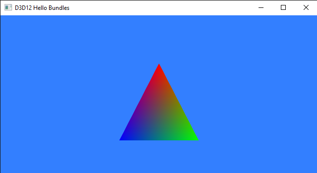

<br>

# 1 - Introduction

**D3D12HelloBundles** is the sample we are going to review in this tutorial. It is not much different from the sample we examined in the previous tutorial (**Hello Triangle**) as it uses the same vertex buffer, shaders and commands to render a triangle on the screen (I only changed the background color of the screenshot above to visually distinguish between them). However, as will we see in the last section, the main difference from the previous sample is the way we record some commands in the command list. In particular, we will use a bundle, that allows the GPU, in some specific cases, to speed up the execution of groups of commands. The online documentation is quite clear about bundles, so the first part of this tutorial will simply report some of the information you can also find on the Microsoft website.

<br>

<br>

# 2 - Bundles

So far, we used command lists to record commands to be executed by the GPU. For this reason, command lists are often called direct command list. However, the Direct3D 12 API also provides a second level of command lists, called bundles, that can be executed from within direct command lists. Bundles take advantage of functionality present in all graphics hardware to allow apps\programmers to group a small number of commands together for later, repeated execution from within direct command lists. At the time of creating a bundle, the driver will perform as much pre-processing as possible to make later execution (by the GPU) efficient. Bundles can then be executed from within multiple direct command lists or multiple times within the same direct command list. Since bundles are pre-processed, and can be submitted multiple times, there are certain restrictions on what operations can be performed within a bundle.

A direct command list can be submitted for execution multiple times, but the app\programmer is responsible for ensuring that the direct command list has finished executing on the GPU timeline before submitting it again. The reason is that when we record new commands in a command list to create a new frame, the memory region that contains the old commands gets overwritten. On the other hand, bundles have no concurrent-use restrictions, and can be executed multiple times in multiple direct command lists, as they always keep the same commands to be reused multiple times. However, remember that bundles can only be called from direct command lists and can't be submitted directly to a queue.

Both direct command lists and bundles are created by calling **ID3D12Device::CreateCommandList**, and both use a command allocator to manage the memory region containing the commands. The only difference is in the **D3D12_COMMAND_LIST_TYPE** enumeration, that indicates the type of command list that is being created (direct or bundle).
A direct command list can record the execution of a group of commands in a bundle by calling **ID3D12GraphicsCommandList::ExecuteBundle**.

The figure below shows an example of how to build up some commands into bundles, and how to build up bundles in different direct command lists in order to draw a frame. In this case, we bundle three commands in the bundle 1, and record it in the direct command list 2. On the other hand, we reuse the bundle 2 in the command lists 2 and 3.

>We can use multiple command lists, submitted from multiple thread, to create a frame (maybe to render different part of it, or to pre-compute rendering work for later re-use).  This allows to spread rendering work across multiple threads. We will cover multithreading in a later tutorial.

<br>


<br>

<br>

# 3 - Graphics pipeline state inheritance

Because direct command lists are generally intended for one use at a time, and bundles are intended to be used multiple times concurrently, there are different rules about how they inherit graphics pipeline state that was set by previous command lists or bundles.

For the graphics pipeline states that are set using PSOs, none of these states are inherited by either direct command lists or bundles. The initial graphics pipeline state for both direct command lists and bundles is set at creation time by passing a PSO to **ID3D12Device::CreateCommandList**. If no PSO is specified in the call, a default initial state is used. You can change the current PSO within a command list by calling **ID3D12GraphicsCommandList::SetPipelineState**.

Direct command lists also do not inherit non-PSO states that is set with command list methods like **RSSetViewports**, **RSSetScissorRects**, **OMSetStencilRef**, **OMSetBlendFactor**, etc.

Bundles inherit all graphics pipeline states that are not set with PSOs, except for the primitive topology type. The primitive topology is always set to **D3D12_PRIMITIVE_TOPOLOGY_TYPE_UNDEFINED** when a bundle begins executing.<br>
Any state that is set within a bundle (the PSO itself, non-PSO-based state, and resource bindings) affects the state of its parent direct command list. For example, if a **RSSetViewports** is called from within a bundle, the specified viewports will continue to be set in the parent direct command list for calls subsequent to the **ExecuteBundle** call that set the viewports.

Resource bindings that are set within a command list or bundle do persist. So, resource bindings modified in a direct command list will still be set within subsequent child bundle execution. And resource bindings modified from within a bundle will still be set for subsequent calls within the parent direct command list.

<br>

<br>

# 4 - Bundle restrictions

Restrictions on what operations can be performed within a bundle enable graphics drivers to do most of the work associated with bundles at record time, thus enabling **ExecuteBundle** to be run with low overhead. All pipeline state objects referenced by a bundle must have the same render target formats, depth buffer format, and sample descriptions. The following command list API calls (commands) are not allowed on command lists created with type: **D3D12_COMMAND_LIST_TYPE_BUNDLE**:

- Any Clear method
- Any Copy method
- **DiscardResource**
- **ExecuteBundle**
- **ResourceBarrier**
- **ResolveSubresource**
- **SetPredication**
- **BeginQuery**
- **EndQuery**
- **SOSetTargets**
- **OMSetRenderTargets**
- **RSSetViewports**
- **RSSetScissorRects**

<br>

**SetDescriptorHeaps** can be called on a bundle, but the bundle descriptor heaps must match the calling command list descriptor heap.
If any of these APIs are called on a bundle, the runtime will drop the call. The debug layer will issue an error whenever this occurs.

<br>

<br>

# 5 - D3D12HelloBundles: code review

So far, we used **PopulateCommandList** as the only function where to record commands in a command list. Let’s look back at this function from the previous sample (**D3D12HelloTriangle**).

<br>

```cpp
void D3D12HelloTriangle::PopulateCommandList()
{
    // Command list allocators can only be reset when the associated 
    // command lists have finished execution on the GPU; apps should use 
    // fences to determine GPU execution progress.
    ThrowIfFailed(m_commandAllocator->Reset());
 
    // However, when ExecuteCommandList() is called on a particular command 
    // list, that command list can then be reset at any time and must be before 
    // re-recording.
    ThrowIfFailed(m_commandList->Reset(m_commandAllocator.Get(), m_pipelineState.Get()));
 
    // Set necessary state.
    m_commandList->SetGraphicsRootSignature(m_rootSignature.Get());
    m_commandList->RSSetViewports(1, &m_viewport);
    m_commandList->RSSetScissorRects(1, &m_scissorRect);
 
    // Indicate that the back buffer will be used as a render target.
    m_commandList->ResourceBarrier(1, &CD3DX12_RESOURCE_BARRIER::Transition(m_renderTargets[m_frameIndex].Get(), D3D12_RESOURCE_STATE_PRESENT, D3D12_RESOURCE_STATE_RENDER_TARGET));
 
    CD3DX12_CPU_DESCRIPTOR_HANDLE rtvHandle(m_rtvHeap->GetCPUDescriptorHandleForHeapStart(), m_frameIndex, m_rtvDescriptorSize);
    m_commandList->OMSetRenderTargets(1, &rtvHandle, FALSE, nullptr);
 
    // Record commands.
    const float clearColor[] = { 0.0f, 0.2f, 0.4f, 1.0f };
    m_commandList->ClearRenderTargetView(rtvHandle, clearColor, 0, nullptr);
    m_commandList->IASetPrimitiveTopology(D3D_PRIMITIVE_TOPOLOGY_TRIANGLELIST);
    m_commandList->IASetVertexBuffers(0, 1, &m_vertexBufferView);
    m_commandList->DrawInstanced(3, 1, 0, 0);
 
    // Indicate that the back buffer will now be used to present.
    m_commandList->ResourceBarrier(1, &CD3DX12_RESOURCE_BARRIER::Transition(m_renderTargets[m_frameIndex].Get(), D3D12_RESOURCE_STATE_RENDER_TARGET, D3D12_RESOURCE_STATE_PRESENT));
 
    ThrowIfFailed(m_commandList->Close());
}
```
<br>

We call this function whenever the window needs repainting. So, the GPU always ends up executing the same commands. Let’s see if we can build up a bundle by grouping some of these commands. **SetGraphicsRootSignature**, **IASetPrimitiveTopology**, **IASetVertexBuffers** and **DrawInstanced** can be used in a bundle, while **RSSetViewports**, **RSSetScissorRects**, **ResourceBarrier**, and **OMSetRenderTargets** cannot (as stated in the previous section).

At this point, we can finally take a look at the code of **D3D12HelloBundles**.<br>
In the application class, we declare a bundle (as a simple **ID3D12GraphicsCommandList**) and the related allocator.

<br>

```cpp
class D3D12HelloBundles : public DXSample
{
public:
    D3D12HelloBundles(UINT width, UINT height, std::wstring name);
 
    virtual void OnInit();
    virtual void OnUpdate();
    virtual void OnRender();
    virtual void OnDestroy();
 
private:
    static const UINT FrameCount = 2;
 
    struct Vertex
    {
        XMFLOAT3 position;
        XMFLOAT4 color;
    };
 
    // Pipeline objects.
    CD3DX12_VIEWPORT m_viewport;
    CD3DX12_RECT m_scissorRect;
    ComPtr<IDXGISwapChain3> m_swapChain;
    ComPtr<ID3D12Device> m_device;
    ComPtr<ID3D12Resource> m_renderTargets[FrameCount];
    ComPtr<ID3D12CommandAllocator> m_commandAllocator;
    ComPtr<ID3D12CommandAllocator> m_bundleAllocator;
    ComPtr<ID3D12CommandQueue> m_commandQueue;
    ComPtr<ID3D12RootSignature> m_rootSignature;
    ComPtr<ID3D12DescriptorHeap> m_rtvHeap;
    ComPtr<ID3D12PipelineState> m_pipelineState;
    ComPtr<ID3D12GraphicsCommandList> m_commandList;
    ComPtr<ID3D12GraphicsCommandList> m_bundle;
    UINT m_rtvDescriptorSize;
 
    // App resources.
    ComPtr<ID3D12Resource> m_vertexBuffer;
    D3D12_VERTEX_BUFFER_VIEW m_vertexBufferView;
 
    // Synchronization objects.
    UINT m_frameIndex;
    HANDLE m_fenceEvent;
    ComPtr<ID3D12Fence> m_fence;
    UINT64 m_fenceValue;
 
    void LoadPipeline();
    void LoadAssets();
    void PopulateCommandList();
    void WaitForPreviousFrame();
};
```
<br>

**LoadPipeline** creates the allocators. We specify **BUNDLE** as command list type for **m_bundleAllocator**. That way, we are indicating that the allocator will manage storage for a bundle.

<br>

```cpp
// Load the rendering pipeline dependencies.
void D3D12HelloBundles::LoadPipeline()
{

 
    // ...

 
    ThrowIfFailed(m_device->CreateCommandAllocator(D3D12_COMMAND_LIST_TYPE_DIRECT, IID_PPV_ARGS(&m_commandAllocator)));
    ThrowIfFailed(m_device->CreateCommandAllocator(D3D12_COMMAND_LIST_TYPE_BUNDLE, IID_PPV_ARGS(&m_bundleAllocator)));
}
```
<br>

**LoadAssets** creates both the direct command list and the bundle. We also record the commands in the bundle to let the driver perform its work as soon as possible. Observe that we close the bundle as **ExecuteBundle** requires it.

<br>

```cpp
// Load the sample assets.
void D3D12HelloBundles::LoadAssets()
{

    // ...

 
    // Create the command list.
    ThrowIfFailed(m_device->CreateCommandList(0, D3D12_COMMAND_LIST_TYPE_DIRECT, m_commandAllocator.Get(), m_pipelineState.Get(), IID_PPV_ARGS(&m_commandList)));
 
    // Command lists are created in the recording state, but there is nothing
    // to record yet. The main loop expects it to be closed, so close it now.
    ThrowIfFailed(m_commandList->Close());

 
    // ...
    
 
    // Create and record the bundle.
    {
        ThrowIfFailed(m_device->CreateCommandList(0, D3D12_COMMAND_LIST_TYPE_BUNDLE, m_bundleAllocator.Get(), m_pipelineState.Get(), IID_PPV_ARGS(&m_bundle)));
        m_bundle->SetGraphicsRootSignature(m_rootSignature.Get());
        m_bundle->IASetPrimitiveTopology(D3D_PRIMITIVE_TOPOLOGY_TRIANGLELIST);
        m_bundle->IASetVertexBuffers(0, 1, &m_vertexBufferView);
        m_bundle->DrawInstanced(3, 1, 0, 0);
        ThrowIfFailed(m_bundle->Close());
    }
 
    // ...

}
```
<br>

And finally, we can see the code of our renewed version of **PopulateCommandList**.

<br>

```cpp
void D3D12HelloBundles::PopulateCommandList()
{
    // Command list allocators can only be reset when the associated 
    // command lists have finished execution on the GPU; apps should use 
    // fences to determine GPU execution progress.
    ThrowIfFailed(m_commandAllocator->Reset());
 
    // However, when ExecuteCommandList() is called on a particular command 
    // list, that command list can then be reset at any time and must be before 
    // re-recording.
    ThrowIfFailed(m_commandList->Reset(m_commandAllocator.Get(), m_pipelineState.Get()));
 
    // Set necessary state.
    //m_commandList->SetGraphicsRootSignature(m_rootSignature.Get());
    m_commandList->RSSetViewports(1, &m_viewport);
    m_commandList->RSSetScissorRects(1, &m_scissorRect);
 
    // Indicate that the back buffer will be used as a render target.
    m_commandList->ResourceBarrier(1, &CD3DX12_RESOURCE_BARRIER::Transition(m_renderTargets[m_frameIndex].Get(), D3D12_RESOURCE_STATE_PRESENT, D3D12_RESOURCE_STATE_RENDER_TARGET));
 
    CD3DX12_CPU_DESCRIPTOR_HANDLE rtvHandle(m_rtvHeap->GetCPUDescriptorHandleForHeapStart(), m_frameIndex, m_rtvDescriptorSize);
    m_commandList->OMSetRenderTargets(1, &rtvHandle, FALSE, nullptr);
 
    // Record commands.
    const float clearColor[] = { 0.2f, 0.5f, 1.0f, 1.0f };
    m_commandList->ClearRenderTargetView(rtvHandle, clearColor, 0, nullptr);
 
    // Execute the commands stored in the bundle.
    m_commandList->ExecuteBundle(m_bundle.Get());
 
    // Indicate that the back buffer will now be used to present.
    m_commandList->ResourceBarrier(1, &CD3DX12_RESOURCE_BARRIER::Transition(m_renderTargets[m_frameIndex].Get(), D3D12_RESOURCE_STATE_RENDER_TARGET, D3D12_RESOURCE_STATE_PRESENT));
 
    ThrowIfFailed(m_commandList->Close());
}
```
<br>

We call **ExecuteBundle** on the direct command list to record the execution of the group of commands previously recorded in the bundle.

>The sample records **SetGraphicsRootSignature** both in the bundle (see **LoadAssets**) and in the direct command list (see **PopulateCommandList**). I commented the latter since it should be redundant. Create a new issue, or a discussion, if you know this is not a mistake.

<br>

<br>

Source code: [D3D12HelloWorld (DirectX-Graphics-Samples)](https://github.com/microsoft/DirectX-Graphics-Samples/tree/master/Samples/Desktop/D3D12HelloWorld)


<br>

# References

[1] [DirectX graphics and gaming (Microsoft Docs)](https://docs.microsoft.com/en-us/windows/win32/directx)<br>
[2] [DirectX-Specs (Microsoft Docs)](https://microsoft.github.io/DirectX-Specs/)

<br>

***
If you found the content of this tutorial somewhat useful or interesting, please consider supporting this project by clicking on the **Sponsor** button.  Whether a small tip, a one time donation, or a recurring payment, it's all welcome! Thank you!<br><br>
<p align="center">
 <a href="https://github.com/sponsors/PAMinerva">
         
      </a>
</p><br>
