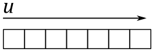
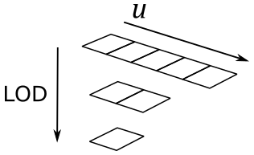
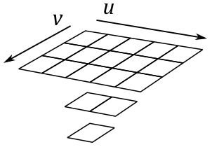
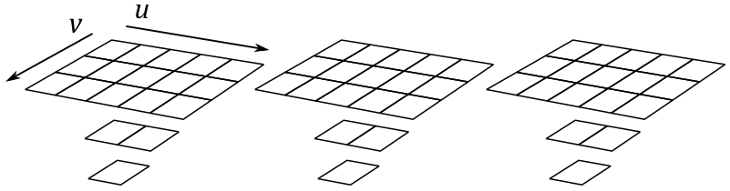
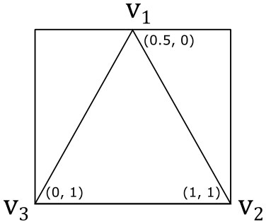
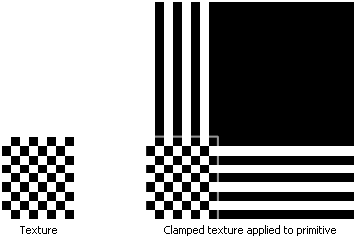

# 01.E - Hello Texture

<br>


<br>

# 1 - Introduction

So far, we simply set the color as a per-vertex attribute, and enjoyed the interpolated colors returned by the rasterizer for internal pixels. That’s definitely the easiest way to fill 3D primitives with colors. The downside is that the visual effect on the screen is far from realistic. In this tutorial we will learn how to map images to 3D geometries. That way, we can set colors per-pixel (instead of per-vertex) in order to increase the level of detail, and therefore the realism of our meshes. Usually, we simply use textures provided by graphic artists. However, in this tutorial we will create a simple texture programmatically. Although, before reviewing the code of **D3D12HelloTextures** (the sample examined in this tutorial), we first need to explore some of the theory behind texture mapping.<br>
Part of the theory illustrated in the following sections draws from the MS online documentation.

<br>

<br>

# 2 - Textures

A texture resource is a data structure to store texels (texture elements), which are the smallest unit of a texture that can be read or written to. When the texture is read by a shader, it can be filtered by texture samplers. Each texel contains 1 to 4 components (also called channels), arranged in one of the DXGI formats defined by the **DXGI_FORMAT** enumeration. For example, **DXGI_FORMAT_R8G8B8A8_UNORM** specifies that every texel is a 32-bit value composed of four 8-bit unsigned-normalized-integer channels. This means that the value of each channel is in the range $[0/255, 255/255]=[0, 1]$; that is, each channel can represent 256 different values (that’s the actual meaning of unsigned-normalized-integer).

<br>

## 2.1 - 1D Textures

A 1D texture, in its simplest form, contains texture data that can be addressed with a single texture coordinate (*u* in the image below); it can be visualized as an array of texels, as shown in the following illustration.

<br>



<br>

Adding more complexity, you can also create a 1D texture with mipmap levels, as shown in the following image.

<br>



<br>

Just think of it as a single resource that is made up of three subresources. A mipmap level is a texture that is a power-of-two smaller than the level above it. The topmost level contains the most detail, each subsequent level is smaller. For a 1D texture with mipmaps, the smallest level contains one texel. When mipmaps are generated for an odd sized texture, the next lower level is always an even size (except when the lowest level reaches 1). For example, the diagram illustrates a $5\times 1$ texture whose next lower level is a $2\times 1$ texture, whose next (and last) mip level is a $1\times 1$ sized texture. The levels are identified by an index called LOD (level-of-detail) which is used to access the proper subresource when rendering geometry based on the distance to the camera.

<br>

### 2.1.1 - 1D Texture arrays

Direct3D also supports arrays of textures. An array of 1D textures looks conceptually like the following illustration.

<br>


<br>

The above texture array contains three textures, each with a 3-layer mipmap (the texture width of the three textures is 5, the number of texture elements in the first layer). So, you can also consider it as a single resource that is made up of nine subresources.

<br>


<br>

All texture arrays in Direct3D are a homogeneous array of textures; this means that every texture in a texture array must have the same data format and size (including texture width and number of mipmap levels).

<br>

## 2.2 - 2D Textures and 2D Texture arrays

A 2D Texture resource contains a 2D grid of texels. Each texel is addressable with two texture coordinates (*u* and *v* in the image below). Since it is a texture resource, it may contain mipmap levels, and subresources. A fully populated 2D texture resource looks like the following illustration.

<br>



<br>

The texture above contains a single $3\times 5$ texture with two additional mipmap levels.

A 2D texture array resource is a homogeneous array of 2D textures; that is, each texture has the same data format and dimensions (including mipmap levels). It has a similar layout as the 1D texture array, except that the textures now contain 2D data, as shown in the following illustration.

<br>



<br>

This texture array contains three textures; each texture is $3\times 5$ with two additional mipmap levels. So, you can also consider it as a single resource that is made up of nine subresources.

Observe that 3D textures also exist, but we won't go any further into this topic right now.

<br>

<br>

# 3 - Texel Coordinate System

The texel coordinate system has its origin at the top-left corner of the texture, as shown in the following diagram. Texel coordinates are at integer locations, while texel centers are offset by $(0.5, 0.5)$ (at half-integer locations). Normalized coordinates in the following illustration help to understand the connection between texel and texture coordinate systems (we will cover the latter in the next section). 

<br>


<br>

<br>

# 4 - Texture Coordinate System

As stated in the previous section, each texel in a texture can be specified by its integer texel coordinates. However, in order to map texels onto primitives, Direct3D requires a uniform address range. That is, it uses a generic addressing scheme in which all texel addresses are in the range of $0.0$ to $1.0$ inclusive. Direct3D applications specify texture coordinates in terms of *u* and *v* values, much like 2D Cartesian coordinates are specified in terms of x- and y-coordinates.

<br>


<br>

>Technically, the system can actually process texture coordinates outside the range $[0, 1]$, and does so by using the parameters you set for texture addressing (more on this shortly).

With texture coordinates we can address texels without knowing the size of each texture. For example, in the following illustration, we can select the central texel of the last row of two different textures by using the texture coordinates $(0.5, 1.0)$.

<br>


<br>

Applying a texture to a primitive in 3D space actually means we are mapping texel coordinates onto primitive vertices. How can we map 2D coordinates to 3D positions? Since we can select texels with texture coordinates, we can imagine to unwrap a 3D mesh onto the $[0,1]\times [0,1]$ square that defines the texture coordinate system, similar to how we unwrap a Christmas chocolate on the table.

<br>


<br>

That way, we can establish a mapping between the vertices of a 3D mesh and the texels of a texture.

<br>


<br>

Here, for the sake of simplicity, we will only consider a single triangle.

<br>



<br>

If we associate the texture coordinates $(0.5, 0)$, $(1, 1)$ and $(0, 1)$ respectively with the vertices $\mathbf{v}_1$, $\mathbf{v}_2$ and $\mathbf{v}_3$ of a triangle in 3D space, then we established a connection between vertices and texture coordinates, from which we can calculate the related texel coordinates.

To calculate texel coordinates from texture coordinates you can just multiply each component of the texture coordinates by the corresponding dimension of the texture, minus 1, and round the result. For example, if we have an $8\times 8$ texture, the vertex $\mathbf{v}_1$ in the figure above is paired with the texel coordinates $\big(⌊(0.5∗(8-1)),\ ⌊(0.0∗(8-1))⌋\big)=(3,0)$. So, we associated the vertex $\mathbf{v}_1$ with the fourth texel of the first row of the texture. The same goes for the vertices $\mathbf{v}_2$ and $\mathbf{v}_3$, that would be associated respectively with the last and first texels of the last row. Then, we established a connection between vertices and texels.

Now, where is the increase of detail and realism in all of this? Well, in the first place, it should be noted that associating vertices with texture coordinates practically means that we must declare the texture coordinates as a vertex attribute. When the rasterizer interpolates the texture coordinates of a pixel, we can use it to select a texel from a texture as the pixel color. So, now we no longer have an interpolated color for the internal pixels of a primitive, but a color selected from a texture that portrays a real material. That way, we went from selecting a color per-vertex to selecting a color per-pixel. That’s exactly what leads to an increase of detail and realism.

<br>

<br>

# 5 - Sampling and Filtering

In this context, by sampling we mean selecting a texel (or rather, calculate its integer texel coordinates) starting from texture coordinates. In theory, we could associate vertices with texture coordinates which always translate to integer texel coordinates. Unfortunately, even in this case, the rasterizer will likely emit pixels with interpolated texture coordinates that do not translate to integer ones. 

<br>


<br>

For example, in the illustration above, we have $(82.12, 74.38)$ as texel coordinates (the grey point). What texel to select in this case? First of all, to sample we need a sampler which defines, among other things, a filter to select texels. Although, before we start talking about filters, we need to remember that physical texels are squares with an area that you can reference using integer coordinates, which refers to the top-left corner of a texel. However, sometimes it’s much better to use the texel center, especially in sampling operations. That said, we have three filters to select texels: point, linear and anisotropic (we will cover the anisotropic filter in a later tutorial).

**Point filtering** means that the selected texel is the nearest one, computed by simply truncating the fractional part from texel coordinates. So, in the case illustrated above, the selected texel will be the one with texel coordinates (82,74). That is, the one with center in $\mathbf{c}_4$.

**Linear filtering** means that we select the four nearest texels to interpolate their values. In this case we prefer to use texel centers. Why? Well, the selection of the four texels is computed by simply dropping the fractional part, and increasing the coordinates: $(⌊x⌋,\ ⌊y⌋)$, $(⌊x⌋+1,\ ⌊y⌋)$, $(⌊x⌋,\ ⌊y⌋+1)$ and $(⌊x⌋+1,\ ⌊y⌋+1)$. That way, if we simply use the texel coordinates we might not select the closest texels. For example, in the case illustrated above, the four selected texels would range from $(82, 74)$ to $(83, 75)$, that are not the nearest ones. The closest texels actually range from $(81, 73)$ to $(82, 74)$. So, how can we select them? We need to convert the texel coordinates to consider its location relative to the coordinate system formed by the four nearest texel centers. We can perform it by subtracting $0.5$ from both components of the texel coordinates. For example, $(82.12, 74.38)–(0.5, 0.5)=(81.62, 73.88)$. That way, the closest texels range exactly from $(81, 73)$ to $(82,74)$. Now, retaining only the fractional parts we have that $(81.62, 73.88)$ converts to $(0.62, 0.88)$. That’s the exact location of the texel coordinates in the $[0,1]\times [0,1]$ square formed by the four closest texel centers. Finally, we can interpolate their values in the following way.

$\mathbf{c}_A=38\\%$ of $\mathbf{c}_1+62\\%$ of $\mathbf{c}_2$ <br>
$\mathbf{c}_B=38\\%$ of $\mathbf{c}_3+62\\%$ of $\mathbf{c}_4$ <br>
$\mathbf{T}=88\\%$ of $\mathbf{c}_A+12%$ of $\mathbf{c}_B$

<br>

>The mapping from texture coordinates to texel ones is an operation performed by the GPU that is transparent to the programmer, which only need to specify a filter. However, knowing the low-level details might come in useful in the future.

<br>

## 5.1 - Magnification

The use of point filters can lead to ugly visual effects (artifacts) during magnification. <br>
Imagine zooming in on a 3D textured mesh until it covers an area of $1024\times 1024$ pixels on your screen. What happens if the texture of this mesh is, for example, $64\times 64$? That means that we have about $1024/64=16$ pixels for each texel, as shown in the following illustration.

<br>


<br>

Now, imagine that pixels on your screen were stickers you can shoot straight at the surface of a mesh. This means that, in the case illustrated above, you need to shoot around 16 pixels to cover a single texel. The distortion of the texel may depend on the shape of the mesh and the viewing angle, but fortunately we can ignore it right now. What’s important here is that, if we move from a pixel to the next one on the screen, we don’t necessarily move from a texel to another. That means that the texture coordinates of many pixels will be mapped to the same texel (coordinates).

>Another way you can think of it is as follows.<br>
If you zoom in on a 3D textured mesh, then big triangles will likely be projected onto the projection window. Since interpolation is computed using barycentric coordinates (more on this in a later tutorial), the texture coordinates of adjacent pixels won't change much. At that point, if the texture is small, many pixels will fall into the same texel area after the coordinate transformation from texture to texel space.

Visually, this can lead to a blocky effect, as shown in the following illustration (on the left), where many pixels display the same color sampled from the same texel.

<br>


<br>

You can mitigate the problem by using a linear filter (the result is shown in the figure above, on the right). That way, we don’t select the same texel, but rather we interpolate between four of the texels in the $3\times 3$ block around it. That is, the interpolated texture coordinates of the pixel translate to texel coordinates within four texel centers.

<br>


<br>

## 5.2 - Minification

It’s also interesting to consider what happens during minification, when you zoom out to expand the viewing area. Imagine shooting a pixel straight at a mesh that, this time, is far away from the camera. Now, a single pixel can cover lots of texels.

<br>


<br>

The color of a pixel depends on the selected texel, calculated from its interpolated texture coordinates. Since we have lots of texels mapped to a single pixel, then the selected texel can randomly vary from a frame to another, even if the mesh moves slightly (less than a pixel). For example, in the illustration above, if you move the primitive to the right or left by half a pixel you’ll change almost half of the texels covered by the pixel. That means the texel coordinates derived from the texture ones can select different texels during this movement. This can lead to display flickering and you’ll see the pixels on the screen change color like crazy. Using a linear filter can help, but it doesn’t solve the problem since the four nearest texels can rapidly change as well.

>Another way you can think of it is as follows.<br>
If you zoom out until a textured mesh is far away from the camera, then small triangles will likely be projected onto the projection window. Since interpolation is computed using barycentric coordinates, the texture coordinates of adjacent pixels will probably be very different from each other. At that point, if the texture is big enough, adjacent pixels will select distant texels in the texture. This means that if a mesh moves slightly (less than a pixel), the interpolated texture coordinates can vary enough to selected different texels for the same pixels on the screen, leading to display flickering.

Fortunately, mipmap levels allow us to select the texture that best matches with the area covered by the mesh on the render target in order to have a mapping as close as possible to 1:1 between pixels and texels. This can mitigate artifacts originating from minification. By the way, in the filter of a sampler we can also specify how to select mipmap levels. A point filter (for mipmap levels) specifies to select the texture whose texels are closest in size to screen pixels. A linear filter (for mipmap levels) specifies to select the two textures that provide the best match. With these two textures, we can sample two texels (one for each texture) using the filter for texel selection. Then, we interpolate these two texels to get the final result (color or whatever).

<br>

>Do you recall our discussion about how blocks of $2\times 2$ pixels are processed in parallel by the pixel shader? Well, this allows the GPU to calculate the change in interpolated texture coordinates of a pixel relative to its companion pixels in the block. As a result, a LOD index can be computed from this information to select the most appropriate mipmap level. Further details on this topic will be provided in a later tutorial.

<br>

<br>

# 6 - Addressing Modes

Typically, both *u* and *v* texture coordinates are in the range $[0.0, 1.0]$. However, with values outside that range, you can extend the $[0,1]\times [0,1]$ square of the texture coordinate system, which allows to create certain special texturing effects. We can control what Direct3D does with texture coordinates that are outside the range $[0.0, 1.0]$ by setting a texture addressing mode. For instance, you can have your application set the texture addressing mode so that a texture is tiled across a primitive. For this purpose, we need a way to map texture coordinates back to $[0.0, 1.0]$. There are many methods to restrict coordinates in a specific range.

In the remainder of this section we’ll only consider the u-coordinate. However, the same goes for the v-coordinate. Also, we will suppose we want to draw a quad composed of 2 triangles. We have $(0.0, 0.0)$, $(3.0, 0.0)$ and $(0.0, 3.0)$ as texture coordinates associated with the vertices of the first triangle $\triangle_1=(v0, v1, v2)$, while $(3.0, 0.0)$, $(3.0, 3.0)$ and $(0.0, 3.0)$ are the texture coordinates associated with the vertices of the second triangle $\triangle_2=(v1, v3, v2)$. As you can see, the vertices are in clockwise order. The following illustration shows the quad in the $[0,3]\times [0,3]$ square, the extension of the $[0,1]\times [0,1]$ one that represents the texture space.

<br>


<br>

## 6.1 - Wrap

Repeats the texture on every integer junction by using the following function to transform the u-coordinate.

$\text{wrap}(u) = u – \text{floor}(u)$

<br>

So, in our example, setting the texture addressing mode to "Wrap" results in the texture being applied three times in both the u and v directions, as shown in the following illustration. The reason is that when, for example, the interpolated texture coordinate u is $3.0$, $\text{wrap}(3.0)$ returns $1.0$. The same happens when u is $2.0$ and (obviously) $1.0$.

<br>


<br>

## 6.2 - Mirror

Mirrors the texture at every integer boundary by using the following function to transform the u coordinate.

$\text{mirror}(u)=\begin{cases}u-\text{floor}(u),\quad\quad\quad\text{floor}(u)\\% 2=0 \\\\ \text{floor}(u+1)-u,\quad\ \text{floor}(u)\\% 2=1\end{cases}$

  <br>

Setting the texture addressing mode to "Mirror" results in the texture being applied three times in both the u and v directions. Every other row and column that it is applied to is a mirror image of the preceding row or column, as shown in the following illustration. The reason is that when, for example, the interpolated texture coordinate u is $3.0$, $\text{mirror}(3.0)$ returns $1.0$ while when u is $2.0$ it returns $0.0$.

<br>


<br>

## 6.3 - Clamp

Clamps your texture coordinates to the $[0.0,\ 1.0]$ range by using the following function to transform the u-coordinate.

$\text{clamp}(u) = \text{max}(\text{min}(u, 1),  0)$

<br>

Setting the texture addressing mode to "Clamp" applies the texture once, then smears the color of edge texels. In the following illustration the edges of the texture are highlighted with a light grey color.

<br>



<br>

## 6.4 - Border

Setting the texture addressing mode to “Border” means we want to use an arbitrary color, known as the border color, for any texture coordinates outside the range of $0.0$ through $1.0$, inclusive. We can set the border color in the sampler. In the following illustration the application specifies that the texture be applied to the primitives with a red border.

<br>


<br>

<br>

# 7 - D3D12HelloTextures: code review

The sample we are going to review in this section simply draws a textured triangle. The following illustration shows the texture we will apply to this simple primitive. It’s a checkerboard texture that alternates between black and white cells.

>As stated at the beginning of the tutorial, usually we just use textures designed and created by graphic artists. However, the texture below shows a theme regular enough to be generated programmatically (more on this shortly).

<br>


<br>

Let’s start with the application class.

<br>

```cpp
class D3D12HelloTexture : public DXSample
{
public:
    D3D12HelloTexture(UINT width, UINT height, std::wstring name);
 
    virtual void OnInit();
    virtual void OnUpdate();
    virtual void OnRender();
    virtual void OnDestroy();
 
private:
    static const UINT FrameCount = 2;
    static const UINT TextureWidth = 256;
    static const UINT TextureHeight = 256;
    static const UINT TexturePixelSize = 4;    // The number of bytes used to represent a pixel in the texture.
 
    struct Vertex
    {
        XMFLOAT3 position;
        XMFLOAT2 uv;
    };
 
    // Pipeline objects.
    CD3DX12_VIEWPORT m_viewport;
    CD3DX12_RECT m_scissorRect;
    ComPtr<IDXGISwapChain3> m_swapChain;
    ComPtr<ID3D12Device> m_device;
    ComPtr<ID3D12Resource> m_renderTargets[FrameCount];
    ComPtr<ID3D12CommandAllocator> m_commandAllocator;
    ComPtr<ID3D12CommandQueue> m_commandQueue;
    ComPtr<ID3D12RootSignature> m_rootSignature;
    ComPtr<ID3D12DescriptorHeap> m_rtvHeap;
    ComPtr<ID3D12DescriptorHeap> m_srvHeap;
    ComPtr<ID3D12PipelineState> m_pipelineState;
    ComPtr<ID3D12GraphicsCommandList> m_commandList;
    UINT m_rtvDescriptorSize;
 
    // App resources.
    ComPtr<ID3D12Resource> m_vertexBuffer;
    D3D12_VERTEX_BUFFER_VIEW m_vertexBufferView;
    ComPtr<ID3D12Resource> m_texture;
 
    // Synchronization objects.
    UINT m_frameIndex;
    HANDLE m_fenceEvent;
    ComPtr<ID3D12Fence> m_fence;
    UINT64 m_fenceValue;
 
    void LoadPipeline();
    void LoadAssets();
    std::vector<UINT8> GenerateTextureData();
    void PopulateCommandList();
    void WaitForPreviousFrame();
};
```
<br>

We will use a texture of $256\times 256$ texels, where the size of each texel is 4 bytes. We will use this info to specify how much GPU heap space to allocate for the texture. <br>
The Vertex structure (that describe the elements of the vertex buffer) now uses texture coordinates (instead of a color) as a vertex attribute. That way, we can go from selecting a color per-vertex to selecting a color per-pixel, increasing the level of detail and realism.<br>
We will use **m_texture** to reference the texture from our C++ application, and **m_srvHeap** to create a descriptor heap that will hold a view to our texture.

<br>

**GenerateTextureData** is the method that programmatically generates the checkerboard texture data, texel by texel.

<br>

```cpp
// Generate a simple black and white checkerboard texture.
std::vector<UINT8> D3D12HelloTexture::GenerateTextureData()
{
    const UINT rowPitch = TextureWidth * TexturePixelSize;
    const UINT cellPitch = rowPitch >> 3;        // The width of a cell in the checkerboard texture.
    const UINT cellHeight = TextureWidth >> 3;   // The height of a cell in the checkerboard texture.
    const UINT textureSize = rowPitch * TextureHeight;
 
    std::vector<UINT8> data(textureSize);
    UINT8* pData = &data[0];
 
    for (UINT n = 0; n < textureSize; n += TexturePixelSize)
    {
        UINT x = n % rowPitch;
        UINT y = n / rowPitch;
        UINT i = x / cellPitch;
        UINT j = y / cellHeight;
 
        if (i % 2 == j % 2)
        {
            pData[n] = 0x00;        // R
            pData[n + 1] = 0x00;    // G
            pData[n + 2] = 0x00;    // B
            pData[n + 3] = 0xff;    // A
        }
        else
        {
            pData[n] = 0xff;        // R
            pData[n + 1] = 0xff;    // G
            pData[n + 2] = 0xff;    // B
            pData[n + 3] = 0xff;    // A
        }
    }
 
    return data;
}
```
<br>

**rowPitch** is the byte size of a row in the texture $(256∗4=1024)$. **cellPitch** is the byte size of the width of a cell in the checkerboard texture $(1024/8=128)$. So, we have rows with 8 cells where the width of each one includes $(128/4)= 32$ texels. The same goes for the height of the cells $(256/8=32)$. However, for the height we don’t need the byte size since we will use the local variable **j** to count the texels of a cell vertically while the local variable **i** to count the bytes of a cell horizontally. Using the local variable **i** and **j**, along with **n** (the number of bytes currently processed), we can alternate between black and white cells by setting 0x00 or 0xFF to each channel of a texel.

<br>

Now let’s take a look at **LoadPipeline**.

<br>

```cpp
// Load the rendering pipeline dependencies.
void D3D12HelloTexture::LoadPipeline()
{
 
    // ...

 
    // Create descriptor heaps.
    {
        // Describe and create a render target view (RTV) descriptor heap.
        D3D12_DESCRIPTOR_HEAP_DESC rtvHeapDesc = {};
        rtvHeapDesc.NumDescriptors = FrameCount;
        rtvHeapDesc.Type = D3D12_DESCRIPTOR_HEAP_TYPE_RTV;
        rtvHeapDesc.Flags = D3D12_DESCRIPTOR_HEAP_FLAG_NONE;
        ThrowIfFailed(m_device->CreateDescriptorHeap(&rtvHeapDesc, IID_PPV_ARGS(&m_rtvHeap)));
 
        // Describe and create a shader resource view (SRV) heap for the texture.
        D3D12_DESCRIPTOR_HEAP_DESC srvHeapDesc = {};
        srvHeapDesc.NumDescriptors = 1;
        srvHeapDesc.Type = D3D12_DESCRIPTOR_HEAP_TYPE_CBV_SRV_UAV;
        srvHeapDesc.Flags = D3D12_DESCRIPTOR_HEAP_FLAG_SHADER_VISIBLE;
        ThrowIfFailed(m_device->CreateDescriptorHeap(&srvHeapDesc, IID_PPV_ARGS(&m_srvHeap)));
 
        m_rtvDescriptorSize = m_device->GetDescriptorHandleIncrementSize(D3D12_DESCRIPTOR_HEAP_TYPE_RTV);
    }

 
    // ...


}
```
<br>

We need a descriptor heap to hold the SRV we are going to create as a view to the texture. This is not much different from what we have seen in the last tutorial (we just renamed **m_cbvHeap** to **m_srvHeap**). Remember that a descriptor heap of type **D3D12_DESCRIPTOR_HEAP_TYPE_CBV_SRV_UAV** can hold both CBVs and SRVs.

<br>

**LoadAssets** has become a huge function, but don't worry. We will review all the code in detail.

<br>

```cpp
// Load the sample assets.
void D3D12HelloTexture::LoadAssets()
{
    // Create the root signature.
    {
        D3D12_FEATURE_DATA_ROOT_SIGNATURE featureData = {};
 
        // This is the highest version the sample supports. If CheckFeatureSupport succeeds, the HighestVersion returned will not be greater than this.
        featureData.HighestVersion = D3D_ROOT_SIGNATURE_VERSION_1_1;
 
        if (FAILED(m_device->CheckFeatureSupport(D3D12_FEATURE_ROOT_SIGNATURE, &featureData, sizeof(featureData))))
        {
            featureData.HighestVersion = D3D_ROOT_SIGNATURE_VERSION_1_0;
        }
 
        CD3DX12_DESCRIPTOR_RANGE1 ranges[1];
        ranges[0].Init(D3D12_DESCRIPTOR_RANGE_TYPE_SRV, 1, 0, 0, D3D12_DESCRIPTOR_RANGE_FLAG_DATA_STATIC);
 
        CD3DX12_ROOT_PARAMETER1 rootParameters[1];
        rootParameters[0].InitAsDescriptorTable(1, &ranges[0], D3D12_SHADER_VISIBILITY_PIXEL);
 
        D3D12_STATIC_SAMPLER_DESC sampler = {};
        sampler.Filter = D3D12_FILTER_MIN_MAG_MIP_POINT;
        sampler.AddressU = D3D12_TEXTURE_ADDRESS_MODE_BORDER;
        sampler.AddressV = D3D12_TEXTURE_ADDRESS_MODE_BORDER;
        sampler.AddressW = D3D12_TEXTURE_ADDRESS_MODE_BORDER;
        sampler.MipLODBias = 0;
        sampler.MaxAnisotropy = 0;
        sampler.ComparisonFunc = D3D12_COMPARISON_FUNC_NEVER;
        sampler.BorderColor = D3D12_STATIC_BORDER_COLOR_TRANSPARENT_BLACK;
        sampler.MinLOD = 0.0f;
        sampler.MaxLOD = D3D12_FLOAT32_MAX;
        sampler.ShaderRegister = 0;
        sampler.RegisterSpace = 0;
        sampler.ShaderVisibility = D3D12_SHADER_VISIBILITY_PIXEL;
 
        CD3DX12_VERSIONED_ROOT_SIGNATURE_DESC rootSignatureDesc;
        rootSignatureDesc.Init_1_1(_countof(rootParameters), rootParameters, 1, &sampler, D3D12_ROOT_SIGNATURE_FLAG_ALLOW_INPUT_ASSEMBLER_INPUT_LAYOUT);
 
        ComPtr<ID3DBlob> signature;
        ComPtr<ID3DBlob> error;
        ThrowIfFailed(D3DX12SerializeVersionedRootSignature(&rootSignatureDesc, featureData.HighestVersion, &signature, &error));
        ThrowIfFailed(m_device->CreateRootSignature(0, signature->GetBufferPointer(), signature->GetBufferSize(), IID_PPV_ARGS(&m_rootSignature)));
    }
 
    // Create the pipeline state, which includes compiling and loading shaders.
    {
        ComPtr<ID3DBlob> vertexShader;
        ComPtr<ID3DBlob> pixelShader;
 
#if defined(_DEBUG)
        // Enable better shader debugging with the graphics debugging tools.
        UINT compileFlags = D3DCOMPILE_DEBUG | D3DCOMPILE_SKIP_OPTIMIZATION;
#else
        UINT compileFlags = 0;
#endif
 
        ThrowIfFailed(D3DCompileFromFile(GetAssetFullPath(L"shaders.hlsl").c_str(), nullptr, nullptr, "VSMain", "vs_5_0", compileFlags, 0, &vertexShader, nullptr));
        ThrowIfFailed(D3DCompileFromFile(GetAssetFullPath(L"shaders.hlsl").c_str(), nullptr, nullptr, "PSMain", "ps_5_0", compileFlags, 0, &pixelShader, nullptr));
 
        // Define the vertex input layout.
        D3D12_INPUT_ELEMENT_DESC inputElementDescs[] =
        {
            { "POSITION", 0, DXGI_FORMAT_R32G32B32_FLOAT, 0, 0, D3D12_INPUT_CLASSIFICATION_PER_VERTEX_DATA, 0 },
            { "TEXCOORD", 0, DXGI_FORMAT_R32G32_FLOAT, 0, 12, D3D12_INPUT_CLASSIFICATION_PER_VERTEX_DATA, 0 }
        };
 
        // Describe and create the graphics pipeline state object (PSO).
        D3D12_GRAPHICS_PIPELINE_STATE_DESC psoDesc = {};
        psoDesc.InputLayout = { inputElementDescs, _countof(inputElementDescs) };
        psoDesc.pRootSignature = m_rootSignature.Get();
        psoDesc.VS = CD3DX12_SHADER_BYTECODE(vertexShader.Get());
        psoDesc.PS = CD3DX12_SHADER_BYTECODE(pixelShader.Get());
        psoDesc.RasterizerState = CD3DX12_RASTERIZER_DESC(D3D12_DEFAULT);
        psoDesc.BlendState = CD3DX12_BLEND_DESC(D3D12_DEFAULT);
        psoDesc.DepthStencilState.DepthEnable = FALSE;
        psoDesc.DepthStencilState.StencilEnable = FALSE;
        psoDesc.SampleMask = UINT_MAX;
        psoDesc.PrimitiveTopologyType = D3D12_PRIMITIVE_TOPOLOGY_TYPE_TRIANGLE;
        psoDesc.NumRenderTargets = 1;
        psoDesc.RTVFormats[0] = DXGI_FORMAT_R8G8B8A8_UNORM;
        psoDesc.SampleDesc.Count = 1;
        ThrowIfFailed(m_device->CreateGraphicsPipelineState(&psoDesc, IID_PPV_ARGS(&m_pipelineState)));
    }
 
    // Create the command list.
    ThrowIfFailed(m_device->CreateCommandList(0, D3D12_COMMAND_LIST_TYPE_DIRECT, m_commandAllocator.Get(), m_pipelineState.Get(), IID_PPV_ARGS(&m_commandList)));
 
    // Create the vertex buffer.
    {
        // Define the geometry for a triangle.
        Vertex triangleVertices[] =
        {
            { { 0.0f, 0.25f * m_aspectRatio, 0.0f }, { 0.5f, 0.0f } },
            { { 0.25f, -0.25f * m_aspectRatio, 0.0f }, { 1.0f, 1.0f } },
            { { -0.25f, -0.25f * m_aspectRatio, 0.0f }, { 0.0f, 1.0f } }
        };
 
        const UINT vertexBufferSize = sizeof(triangleVertices);
 
        // Note: using upload heaps to transfer static data like vert buffers is not 
        // recommended. Every time the GPU needs it, the upload heap will be marshalled 
        // over. Please read up on Default Heap usage. An upload heap is used here for 
        // code simplicity and because there are very few verts to actually transfer.
        ThrowIfFailed(m_device->CreateCommittedResource(
            &CD3DX12_HEAP_PROPERTIES(D3D12_HEAP_TYPE_UPLOAD),
            D3D12_HEAP_FLAG_NONE,
            &CD3DX12_RESOURCE_DESC::Buffer(vertexBufferSize),
            D3D12_RESOURCE_STATE_GENERIC_READ,
            nullptr,
            IID_PPV_ARGS(&m_vertexBuffer)));
 
        // Copy the triangle data to the vertex buffer.
        UINT8* pVertexDataBegin;
        CD3DX12_RANGE readRange(0, 0);        // We do not intend to read from this resource on the CPU.
        ThrowIfFailed(m_vertexBuffer->Map(0, &readRange, reinterpret_cast<void**>(&pVertexDataBegin)));
        memcpy(pVertexDataBegin, triangleVertices, sizeof(triangleVertices));
        m_vertexBuffer->Unmap(0, nullptr);
 
        // Initialize the vertex buffer view.
        m_vertexBufferView.BufferLocation = m_vertexBuffer->GetGPUVirtualAddress();
        m_vertexBufferView.StrideInBytes = sizeof(Vertex);
        m_vertexBufferView.SizeInBytes = vertexBufferSize;
    }
 
    // Note: ComPtr's are CPU objects but this resource needs to stay in scope until
    // the command list that references it has finished executing on the GPU.
    // We will flush the GPU at the end of this method to ensure the resource is not
    // prematurely destroyed.
    ComPtr<ID3D12Resource> textureUploadHeap;
 
    // Create the texture.
    {
        // Describe and create a Texture2D.
        D3D12_RESOURCE_DESC textureDesc = {};
        textureDesc.MipLevels = 1;
        textureDesc.Format = DXGI_FORMAT_R8G8B8A8_UNORM;
        textureDesc.Width = TextureWidth;
        textureDesc.Height = TextureHeight;
        textureDesc.Flags = D3D12_RESOURCE_FLAG_NONE;
        textureDesc.DepthOrArraySize = 1;
        textureDesc.SampleDesc.Count = 1;
        textureDesc.SampleDesc.Quality = 0;
        textureDesc.Dimension = D3D12_RESOURCE_DIMENSION_TEXTURE2D;
 
        ThrowIfFailed(m_device->CreateCommittedResource(
            &CD3DX12_HEAP_PROPERTIES(D3D12_HEAP_TYPE_DEFAULT),
            D3D12_HEAP_FLAG_NONE,
            &textureDesc,
            D3D12_RESOURCE_STATE_COPY_DEST,
            nullptr,
            IID_PPV_ARGS(&m_texture)));
 
        const UINT64 uploadBufferSize = GetRequiredIntermediateSize(m_texture.Get(), 0, 1);
 
        // Create the GPU upload buffer.
        ThrowIfFailed(m_device->CreateCommittedResource(
            &CD3DX12_HEAP_PROPERTIES(D3D12_HEAP_TYPE_UPLOAD),
            D3D12_HEAP_FLAG_NONE,
            &CD3DX12_RESOURCE_DESC::Buffer(uploadBufferSize),
            D3D12_RESOURCE_STATE_GENERIC_READ,
            nullptr,
            IID_PPV_ARGS(&textureUploadHeap)));
 
        // Copy data to the intermediate upload heap and then schedule a copy 
        // from the upload heap to the Texture2D.
        std::vector<UINT8> texture = GenerateTextureData();
 
        D3D12_SUBRESOURCE_DATA textureData = {};
        textureData.pData = &texture[0];
        textureData.RowPitch = TextureWidth * TexturePixelSize;
        textureData.SlicePitch = textureData.RowPitch * TextureHeight;
 
        UpdateSubresources(m_commandList.Get(), m_texture.Get(), textureUploadHeap.Get(), 0, 0, 1, &textureData);
        m_commandList->ResourceBarrier(1, &CD3DX12_RESOURCE_BARRIER::Transition(m_texture.Get(), D3D12_RESOURCE_STATE_COPY_DEST, D3D12_RESOURCE_STATE_PIXEL_SHADER_RESOURCE));
 
        // Describe and create a SRV for the texture.
        D3D12_SHADER_RESOURCE_VIEW_DESC srvDesc = {};
        srvDesc.Shader4ComponentMapping = D3D12_DEFAULT_SHADER_4_COMPONENT_MAPPING;
        srvDesc.Format = textureDesc.Format;
        srvDesc.ViewDimension = D3D12_SRV_DIMENSION_TEXTURE2D;
        srvDesc.Texture2D.MipLevels = 1;
        m_device->CreateShaderResourceView(m_texture.Get(), &srvDesc, m_srvHeap->GetCPUDescriptorHandleForHeapStart());
    }
    
    // Close the command list and execute it to begin the initial GPU setup.
    ThrowIfFailed(m_commandList->Close());
    ID3D12CommandList* ppCommandLists[] = { m_commandList.Get() };
    m_commandQueue->ExecuteCommandLists(_countof(ppCommandLists), ppCommandLists);
 
    // Create synchronization objects and wait until assets have been uploaded to the GPU.
    {
        ThrowIfFailed(m_device->CreateFence(0, D3D12_FENCE_FLAG_NONE, IID_PPV_ARGS(&m_fence)));
        m_fenceValue = 1;
 
        // Create an event handle to use for frame synchronization.
        m_fenceEvent = CreateEvent(nullptr, FALSE, FALSE, nullptr);
        if (m_fenceEvent == nullptr)
        {
            ThrowIfFailed(HRESULT_FROM_WIN32(GetLastError()));
        }
 
        // Wait for the command list to execute; we are reusing the same command 
        // list in our main loop but for now, we just want to wait for setup to 
        // complete before continuing.
        WaitForPreviousFrame();
    }
}
```
<br>

The root signature has only a root parameter: a descriptor table with a range of a single descriptor (for the SRV that describes the texture). The shader visibility is used to avoid broadcasting the root table to all shader stages (since we will only use the SRV from the pixel shader to select a texel from our checkerboard texture as the per-pixel data to store in the render target). Also, setting root arguments to single shader stages allows the same bind name to be used at different stages. For example, an SRV binding of `t0,SHADER_VISIBILITY_VERTEX` and another SRV binding of `t0,SHADER_VISIBILITY_PIXEL` would be valid. But if the visibility setting was `t0,SHADER_VISIBILITY_ALL` for one of the bindings, the root signature would be invalid. That is, if you want each shader to see different textures bound to the same virtual register, the application can define 2 root parameters using the same slot, but with a different visibility (e.g., `VISIBILITY_VERTEX` and `_PIXEL`). On the other hand, if the you want both shaders to see the same texture, the application can make a single root signature binding to `t0,VISIBILITY_ALL`.<br>
In the third parameter of **CD3DX12_DESCRIPTOR_RANGE1::Init** we indicate that the view will be bound to the slot 0 reserved for SRVs, so we will bind to the virtual register **t0** in this case.

We won’t use dynamic samplers. As stated in a previous tutorial, static samplers are part of a root signature, but do not count towards the 64 DWORD limit. In the definition of the static sampler used by **D3D12HelloTextures**, we set **D3D12_FILTER_MIN_MAG_MIP_POINT** as a filter. This specifies to use a point filter both for texel and mipmap selection.<br>
We set the texture addressing mode to Border, and transparent black as border color (which simply means transparent color; observe that the alpha channel is set to 1.0). Please note that static samplers have some limitations about the border colors you can set. However, you don’t need to worry about that right now.<br>
In the static sampler we also set the shader visibility (pixel shader), and the slot where we want to bind it (slot 0 reserved for samplers, so we will bind to the virtual register **s0**). The rest of the fields you can set for a static sampler aren’t important right now.

In the input layout, we need to inform the input assembler that the second element\attribute refer to texture coordinates. **DXGI_FORMAT_R32G32_FLOAT** indicates the vertex attribute consists of two 32-bit floating point values. We mark it with the semantic name **TEXTURE**.

In the vertex buffer, we associate each vertex position to the related texture coordinates (as shown in the last image of the section "Texture Coordinate System").

At this point we can create the texture. Before going into the details, it’s interesting to know what’s the meaning of the comment on **textureUploadHeap**. As already stated in a previous tutorial, the comment points out that a local variable needs to stay in scope until the command list that references the related resource has finished executing on the GPU. Why? Well, so far we created resources on GPU heaps from our C++ application, receiving only interface pointers to COM objects to reference them. But, when a resource is destroyed? The answer to this question is relatively simple: when our application doesn’t have any reference to it. Then, if **textureUploadHeap** goes out of scope the destructor of **ComPtr** will call **Release** on the underlying pointer to the **ID3D12Resource** interface. If we have no other references to the resource from our application, then the related physical memory can be freed. If this happens before a command referencing the resource is executed in a command list, then bad things can happen. By the way, at the end of the **LoadAssets** we call **WaitForPreviousFrame**, where we wait that all the commands in the command list are executed. That means we are sure the GPU executed all the commands referencing the resource once we exit **LoadAssets**, so that **textureUploadHeap** can go out of scope without problems.

That said, to create the checkerboard texture, and allocate the related memory space, we initialize a **D3D12_RESOURCE_DESC** structure indicating some important information. We want a 2D texture of $256\times 256$ texels with a single mipmap level (the texture itself) where each texel is a 32-bit value composed of four 8-bit unsigned-normalized-integer channels (specified with **DXGI_FORMAT_R8G8B8A8_UNORM**). **DepthOrArraySize** indicates the number of textures (for texture arrays) or the depth (for 3D textures). In this case we want a single 2D texture, so we set 1. You can ignore **SampleDesc.Count** and **SampleDesc.Quality** right now.<br>
With the subsequent call to **CreateCommittedResource** we allocate enough memory space on the default heap to contain the texture. However, we need to initialize this memory location with the checkerboard texture data. So, we need to allocate the same memory space on the upload heap to load the texture data we created in **GenerateTextureData**, and then copy it to the allocated memory space on the default heap (remember that we can't directly access the default heap from the CPU). Observe that the resource on the default heap is created with **D3D12_RESOURCE_STATE_COPY_DEST**, indicating that this resource will be used as the destination of a copy operation. On the other hand, the resource on the upload heap is created with **D3D12_RESOURCE_STATE_GENERIC_READ**, indicating you can upload data from the CPU, and read it from the GPU, so that we can use this resource as the source of a copy operation. Once we copy the texture data from the upload to the default heap (more on this shortly), we no longer need the resource on the upload heap, so **textureUploadHeap** can go out of scope as stated earlier.

>You may wonder why we use **GetRequiredIntermediateSize** to compute the amount of memory space to allocate on the upload heap. Well, the intermediate resource on the upload heap is only used to store the texture data. That is, we don't need to create another texture, a buffer is more than enough. And indeed, **CD3DX12_RESOURCE_DESC::Buffer** is used to create a **D3D12_RESOURCE_DESC** that describe a buffer. **GetRequiredIntermediateSize** takes a **ID3DResource** to compute the amount of memory used by the related resource. That way, we can pass the texture on the default heap to calculate the necessary memory size to allocate on the upload heap.

We’ve already seen how **GenerateTextureData** generates the checkerboard texture data. We use it to initialize the only subresource that makes up the texture that will be applied to the triangle we want show on the screen (remember that we access resources in memory to a subresource granularity). **RowPitch** is the byte size of a row of the subresource. **SlicePitch** is the byte size of the whole subresource (at least for 2D subresources; for 3D subresources is the byte size of the depth).<br>
**UpdateSubresources** is a helper function defined in *d3dx12.h*. It maps a set of subresources from the upload heap to the virtual address space of our C++ application in order to initialize them with subresource data. Then, it records a copy operation on the command list to copy the subresource data from the subresources on the upload heap to the related subresources on the default heap. In this case we have a texture with a single subresource: the texture itself (without additional mipmap levels).

Then, we point out to the GPU (with a command in the command list) a resource state transition to indicate we want to read the texture on the default heap from the pixel shader. Please note that a (sub)resource must be in **D3D12_RESOURCE_STATE_PIXEL_SHADER_RESOURCE** before being read by the pixel shader via an SRV. Otherwise, you need to specify a transition to **D3D12_RESOURCE_STATE_NON_PIXEL_SHADER_RESOURCE** for resource used with a shader other than the pixel shader. This difference (between resources accessed by the pixel shader and the other shaders) can enable some optimizations. For example, a state transition from **D3D12_RESOURCE_STATE_RENDER_TARGET** to **D3D12_RESOURCE_STATE_NON_PIXEL_SHADER** will block all subsequent shader execution until the render target data is resolved (written). On the other hand, transitioning to **D3D12_RESOURCE_STATE_PIXEL_SHADER** will only block subsequent pixel shader execution, allowing the vertex processing pipeline to run concurrently with render target resolve.

At this point, we can create the view to the texture. For this purpose, a **D3D12_SHADER_RESOURCE_VIEW_DESC** structure is initialized to specify some important information.<br>
**Shader4ComponentMapping** indicates what values from memory should be returned when the texture is accessed in a shader via this shader resource view (SRV). It allows to select how memory gets routed to the four return components in a shader after a memory fetch. The options for each shader component [0..3] (corresponding to RGBA) are: component [0..3] from the SRV fetch result or force 0 or 1. In other words, you can map a channel value to another channel, or set it to 0 or 1, when you read a texel of the texture by using this view. The default 1:1 mapping can be specified with **D3D12_DEFAULT_SHADER_4_COMPONENT_MAPPING**, indicating you want (Red, Green, Blue, Alpha) as usual; that is, (component 0, component 1, component 2, component 3).<br>
**CreateShaderResourceView** creates the SRV and specifies to put it in the first descriptor of **m_srvHeap**. 

Now, the call to **WaitForPreviousFrame** at the end of **LoadAssets** starts to make sense since we indirectly recorded commands in the command list with the call to **UpdateSubresources**. It’s a good practice to flush the command queue at the end of the initialization phase, before starting to record commands in **OnRender** (called in the message handler of **WM_PAINT**). At this point, we no longer need **textureUploadHeap** as the copy operation from upload to default heap has been executed by the GPU (that is, we can exit **LoadAssets** without worry about the scope of **textureUploadHeap**).

<br>

In **PopulateCommandList**, we pass the GPU handle of the SRV stored in **m_srvHeap** as root argument for the root table in the root signature. Remember that root tables take byte offsets as root arguments, and indeed a GPU descriptor handle is just a byte offset from the start of a descriptor heap. <br>
Then, we draw the triangle with **DrawInstanced**. The remainder of the code is similar to that of the previous tutorials.

<br>

```cpp
void D3D12HelloTexture::PopulateCommandList()
{

    // ... 

 
    // Set necessary state.
    m_commandList->SetGraphicsRootSignature(m_rootSignature.Get());

    ID3D12DescriptorHeap* ppHeaps[] = { m_srvHeap.Get() };
    m_commandList->SetDescriptorHeaps(_countof(ppHeaps), ppHeaps);

    m_commandList->SetGraphicsRootDescriptorTable(0, m_srvHeap->GetGPUDescriptorHandleForHeapStart());
    m_commandList->RSSetViewports(1, &m_viewport);
    m_commandList->RSSetScissorRects(1, &m_scissorRect);
 
    // Indicate that the back buffer will be used as a render target.
    m_commandList->ResourceBarrier(1, &CD3DX12_RESOURCE_BARRIER::Transition(m_renderTargets[m_frameIndex].Get(), D3D12_RESOURCE_STATE_PRESENT, D3D12_RESOURCE_STATE_RENDER_TARGET));
 
    CD3DX12_CPU_DESCRIPTOR_HANDLE rtvHandle(m_rtvHeap->GetCPUDescriptorHandleForHeapStart(), m_frameIndex, m_rtvDescriptorSize);
    m_commandList->OMSetRenderTargets(1, &rtvHandle, FALSE, nullptr);
 
    // Record commands.
    const float clearColor[] = { 0.0f, 0.2f, 0.4f, 1.0f };
    m_commandList->ClearRenderTargetView(rtvHandle, clearColor, 0, nullptr);
    m_commandList->IASetPrimitiveTopology(D3D_PRIMITIVE_TOPOLOGY_TRIANGLELIST);
    m_commandList->IASetVertexBuffers(0, 1, &m_vertexBufferView);
    m_commandList->DrawInstanced(3, 1, 0, 0);
 
    // Indicate that the back buffer will now be used to present.
    m_commandList->ResourceBarrier(1, &CD3DX12_RESOURCE_BARRIER::Transition(m_renderTargets[m_frameIndex].Get(), D3D12_RESOURCE_STATE_RENDER_TARGET, D3D12_RESOURCE_STATE_PRESENT));
 
    ThrowIfFailed(m_commandList->Close());
}
```
<br>

Now, it’s interesting to see what happens in the shader code.

<br>

```hlsl
struct PSInput
{
    float4 position : SV_POSITION;
    float2 uv : TEXCOORD;
};
 

Texture2D g_texture : register(t0);
SamplerState g_sampler : register(s0);


 
PSInput VSMain(float4 position : POSITION, float4 uv : TEXCOORD)
{
    PSInput result;
 
    result.position = position;
    result.uv = uv;
 
    return result;
}


 
float4 PSMain(PSInput input) : SV_TARGET
{
    return g_texture.Sample(g_sampler, input.uv);
}

```
<br>

The shader code reflects the fact that the SRV that describes the checkerboard texture is bound to **t0**, while the sampler is bound to **s0**. Also, the **PSInput** structure now includes the texture coordinates associated with each vertex position (instead of a color).

In the vertex shader, we simply pass the vertex data to the rasterizer, which interpolate it and pass the result to the pixel shader. 

In the pixel shader, we sample the checkerboard texture with a sampler and the interpolated texture coordinates. Then, we return the sampled texel. That way, we set texels as colors of pixels covered by primitives. Although, in this case we have a single triangle.

<br>

<br>

Source code: [D3D12HelloWorld (DirectX-Graphics-Samples)](https://github.com/microsoft/DirectX-Graphics-Samples/tree/master/Samples/Desktop/D3D12HelloWorld)

<br>

# References

[1] [DirectX graphics and gaming (Microsoft Docs)](https://docs.microsoft.com/en-us/windows/win32/directx)<br>
[2] [DirectX-Specs (Microsoft Docs)](https://microsoft.github.io/DirectX-Specs/)

<br>

***
If you found the content of this tutorial somewhat useful or interesting, please consider supporting this project by clicking on the **Sponsor** button.  Whether a small tip, a one time donation, or a recurring payment, it's all welcome! Thank you!<br><br>
<p align="center">
 <a href="https://github.com/sponsors/PAMinerva">
         
      </a>
</p><br>
