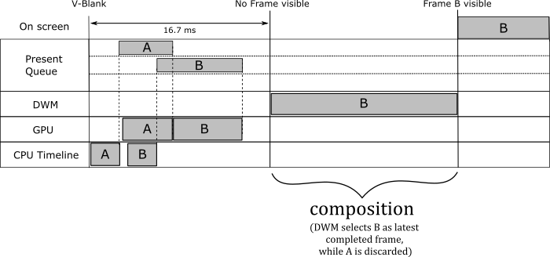
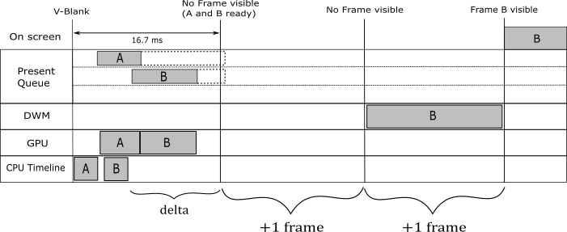

# 01.F - Hello Frame Buffering

<br>


<br>

# 1 - Introduction

**D3D12HelloFrameBuffering** is the sample we are going to review in this tutorial. It is not much different from the samples we examined so far, as it simply shows a triangle on the screen (I only changed the background color of the screenshot above to visually distinguish it from the screenshots of previous tutorials). However, for the first time, we will take advantage of the parallelism between CPU and GPU to create frames. Indeed, until now we used a single command allocator to record the drawing commands for the two buffers in the swap chain. This means we needed to flush the command queue before recording the commands to create a new frame (since all commands were recorded in the same memory space, and we couldn't overwrite commands still in use by the GPU). That is, CPU and GPU were not working sequentially: the CPU created a frame and waited for the GPU to complete it. In other words, we were not able to create frames in advance on the CPU timeline with respect to the GPU. In this tutorial we will try to fix the problem with a separate command allocator for each buffer in the swap chain.

<br>

<br>

# 2 - Unleashing parallelism between CPU and GPU

In order to explain how to unleash parallelism between CPU and GPU, it can be useful to reconsider how frames are presented on the screen. In a previous tutorial we provided the following explanation.

<br>

>**IDXGISwapChain::Present** allows to present on the screen the frame we just created on the CPU timeline (using the current back buffer as render target). How does it work? Present operations occur on the graphics queue associated with the swap chain. That is, when you call **Present**, a present operation is recorded in the command queue associated with the swap chain, and a request to present the frame is inserted in a queue called present queue, waiting for the GPU to execute the commands to draw on the related back buffer. Since this happens only after recording all the commands needed to create the frame, you are sure the GPU met the present operation in the command queue only at the very end (i.e., after executing all the other previous commands). At that point, the frame associated with the request in the present queue is done, ready to be shown on the screen at the next vertical interval, when the swap\flip between the back and present buffers takes place.<br><br>
<br><br>
>**Present** also updates the index of the current back buffer in the swap chain, so that the next frame will be created on the other buffer, when it becomes available again as back buffer.<br>
Observe that **Present** takes as first parameter (called *SyncInterval*) a value that specifies how to synchronize presentation of a frame with the vertical blank. For values greater than zero, it indicates the number of vertical intervals the frame waits in the present queue before getting ready to be presented on the screen, enabling v-sync. Usually, we pass 1 as an argument to this parameter to specify we want to wait a single vertical interval.

<br>

That's not totally wrong, but it is an oversimplified view of the frame presentation. The fact is that, when you present a frame, different things can happen depending on how you set the swap chain, if the window is full screen, or if v-sync is on. However, examining every possible combination goes well beyond the purpose of this tutorial. Then, I will simply explain what happens in **D3D12HelloFrameBuffering** (and previous samples as well), where we create a swap chain that uses the flip model to present frames on the screen, with a window that cannot be switched to full screen, and VSync enabled (that is, when we pass 1 to *SyncInterval*). Other combinations will be covered in later tutorials.

We have two buffers in the swap chain that, for convenience, we will call A and B. Also, the swap chain is created with the flag **DXGI_SWAP_EFFECT_FLIP_DISCARD** to specify we want to use the flip model to present frames on the screen. When this model is used with windowed applications (i.e., not full screen) a system service called **Desktop Window Manager** (DWM) wakes up at every vertical blank and get the latest completed back buffer in the swap chain of all graphics applications running on your desktop (as well as the offscreen buffer of all normal windowed applications) to compose the final image of the whole desktop into its own back buffer, that will be shown on the screen at the next vertical interval, when it becomes the present buffer.

<br>


<br>



<br>

Let's take an example to explain what we just stated above. At the beginning, we record the commands of the very first frame we want to draw on the buffer A. Then, we call **ExecuteCommandLists** to send the command list to the command queue and we call **Present** so that this first frame is inserted in the present queue. That way, a present operation is also added to the command queue after the command list.

>Untill now we only created a frame on the CPU timeline: when we record drawing commands in a command list and call **Present**, nothing actually happens on the related back buffer until the GPU starts executing drawing commands in the command queue

Then, provided that we don't overwrite the memory space managed by the command allocator for the command list associated with A (for example, using a new allocator for the command list associated with B), we can start creating (on the CPU timeline) a second frame with B as render target. We can queue this new frame with the confidence that the GPU won't write onto the related back buffer before it finishes drawing A (since command lists are executed sequentially in a command queue), or if B is not available.

>A buffer is said to be available if there are no outstanding presents that reference it, and it is currently not being displayed by the system. Otherwise, it is unavailable.<br>
A frame is considered ready to be shown on the screen when the GPU met the related present operation in the command queue, and if the synchronization time associated with the presentation of the frame in the present queue expired.<br>
A frame is retired from the present queue if discarded by the DWM (more on this shrtly), or when replaced by a new frame as the one displayed on the screen.

At this point, we need a way to know when we can start creating a new frame on the CPU timeline with A as render target. For this purpose, a fence must be appended after every command list submitted to the command queue (included the first two we have already submitted). That way, we can just wait for the GPU to signal a fence before creating a new frame. Indeed, at that point we are sure that no pending commands are left in a command list (or rather, in the related memory space managed by the command allocator). This means that we can keep presenting frames as long as there is place in the present queue (three slots is the default, but we can change it), and provided that the back buffer we want to use as render target is available. Otherwise, a call to **Present** will block until a frame is retired from the present queue, so that the related buffer becomes available again, and the present queue is ready to receive a new frame.

>As you send command lists to the command queue (with **ExecuteCommandLists**) before calling **Present**, the rendering work of the GPU could be paused\queued, and resume once the back buffer is available (that is, when the frame that use the back buffer as render target is retired from the present queue).

Regardless of how many frames you presented on the CPU timeline, and how many frames the GPU completed, at the next vertical interval the DWM wakes up and get the latest completed frame to start the composition of the whole desktop. In the context of **D3D12HelloFrameBuffering**, the composition implies a copy of the latest completed back buffer onto the back buffer the DWM renders and sends to display hardware at the next vertical interval (as present buffer). After this takes place, the frame is said to be queued, and finally displayed when the hardware gets around to displaying it. Once a new frame becomes queued, the displayed one can be retired from the present queue, along with other frames that missed the chance to be presented on the screen because a newer completed frame was available for the DWM. Observe that, in this case, the actual flip is between the present and back buffers of the DWM.

>Remember that frames get processed sequentially so, if a frame in the present queue is retired because a newer completed frame was available for the DWM, we are sure that the related command list has already been executed. That is, we can overwrite the memory space of the related command allocator, and the GPU can reuse the related buffer for drawing operations.<br>
Command lists are the only type of resource we need to explicitly synchronize during a presentation (with fences). On the other hand, buffers are automatically synchronized by the API and the driver for presentation purposes. However, we still need to synchronize render targets with resource transitions for rendering purposes.

We can start creating a new frame (the third, with A as current back buffer), on the CPU timeline, once the fence gets signaled the first time. Indeed, at that point we are sure the command list of the first frame, that used A as render target, has already been executed by the GPU. Observe that, if the first frame in the present queue has not yet been presented on the screen, the next call to **Present** (which presents the third frame) will block until the first frame is retired from the present queue. If that is the case, it is possible to have two frames in the present queue (both the first that uses A and the second that uses B). If the GPU is fast enough to complete both of them before the next vertical blank, the DWM will pick the second frame (the last completed one), while the first one is immediately retired from the present queue. Since the GPU has definitely executed the command lists of both the first two frames, at some point we were able to create the third frame on the CPU timeline with A as render target, and present it. Once the first frame becomes retired, the **Present** waiting on the CPU timeline can unblock to queue the third frame, and the GPU can execute the related command list. When this third frame will become queued, the second frame can be retired from the present queue. And so on.

Unfortunately, the help of the DWM in the presentation process comes with a price. It introduces a present latency (the time from when a frame is created on the CPU timeline to when it is displayed on the screen) of a bit more than a vertical interval (at least). Indeed, the DWM takes 1 vertical interval to compose the desktop image and show it on the screen, and to this you also have to add the time the GPU needs to complete the frame. But things can get worse when v-sync in on. In that case, you need to add at least another vertical interval to the present latency because each frame has to wait the synchronization time associated with its presentation before becoming ready. This means that the composition using a frame just completed will be the one executed by the DWM waked up at the next v-sync (that is, the frame misses a composition).

<br>



<br>

As stated above, **Present** takes, as first parameter, a value that specifies how to synchronize presentation of a frame with the vertical blank. We already know what happens if you pass 1 or greater values. If you pass 0, the remaining time on the previously presented frame in the present queue will be cancelled, while the frame you are presenting will be discarded if a newer one is queued.

To conclude this section, we can state that provided we use a different command allocator for each buffer in the swap chain, and synchronize them with a fence after each command list in the command queue, we can create frames on the CPU timeline in advance, unleashing parallelism between CPU and GPU. However, remember that creating frames in advance can also lead to annoying present latency (in a later tutorial we will see how to reduce present latency).

<br>

<br>

# 3 - D3D12HelloFrameBuffering: code review

Now, we are ready to review the code of the sample. Let’s start with the application class.

<br>

```cpp
class D3D12HelloFrameBuffering : public DXSample
{
public:
    D3D12HelloFrameBuffering(UINT width, UINT height, std::wstring name);
 
    virtual void OnInit();
    virtual void OnUpdate();
    virtual void OnRender();
    virtual void OnDestroy();
 
private:
    // In this sample we overload the meaning of FrameCount to mean both the maximum
    // number of frames that will be queued to the GPU at a time, as well as the number
    // of back buffers in the DXGI swap chain. For the majority of applications, this
    // is convenient and works well. However, there will be certain cases where an
    // application may want to queue up more frames than there are back buffers
    // available.
    // It should be noted that excessive buffering of frames dependent on user input
    // may result in noticeable latency in your app.
    static const UINT FrameCount = 2;
 
    struct Vertex
    {
        XMFLOAT3 position;
        XMFLOAT4 color;
    };
 
    // Pipeline objects.
    CD3DX12_VIEWPORT m_viewport;
    CD3DX12_RECT m_scissorRect;
    ComPtr<IDXGISwapChain3> m_swapChain;
    ComPtr<ID3D12Device> m_device;
    ComPtr<ID3D12Resource> m_renderTargets[FrameCount];
    ComPtr<ID3D12CommandAllocator> m_commandAllocators[FrameCount];
    ComPtr<ID3D12CommandQueue> m_commandQueue;
    ComPtr<ID3D12RootSignature> m_rootSignature;
    ComPtr<ID3D12DescriptorHeap> m_rtvHeap;
    ComPtr<ID3D12PipelineState> m_pipelineState;
    ComPtr<ID3D12GraphicsCommandList> m_commandList;
    UINT m_rtvDescriptorSize;
 
    // App resources.
    ComPtr<ID3D12Resource> m_vertexBuffer;
    D3D12_VERTEX_BUFFER_VIEW m_vertexBufferView;
 
    // Synchronization objects.
    UINT m_frameIndex;
    HANDLE m_fenceEvent;
    ComPtr<ID3D12Fence> m_fence;
    UINT64 m_fenceValues[FrameCount];
 
    void LoadPipeline();
    void LoadAssets();
    void PopulateCommandList();
    void MoveToNextFrame();
    void WaitForGpu();
};
```
<br>

The comment on the static variable **FrameCount** should be clear at this point. In particular, if you keep creating frames in advance on the CPU timeline, at some point either the CPU (the call to **Present**) or the GPU (the rendering work) will end up waiting for a back buffer to become available again, increasing the present latency.<br>
In this sample, we need two command allocators because we are going to queue two frames to the GPU (in the present queue) before waiting on the CPU timeline. As you know, we can reuse the same command list object provided that we don’t overwrite the memory holding commands that have not yet been executed by the GPU. Observe that we also need two different fence values to delimit (in the command queue) the command lists of the two frames we want to queue. That way, we can be notified when the GPU finishes drawing one of them, so that we can resume creating frames on the CPU timeline.<br>
We will use **WaitForGPU** to flush the command queue. On the other hand, **MoveToNextFrame** only waits until the GPU finishes drawing at least (the oldest) one of the two frames queued. In other words, it checks if we can continue creating frames on the CPU timeline.

<br>

As for **LoadPipeline**, since we need two command allocators, the call to **CreateCommandAllocator** is now inside a for loop.

<br>

```cpp
// Load the rendering pipeline dependencies.
void D3D12HelloFrameBuffering::LoadPipeline()
{

    // ...

 
    // Create frame resources.
    {
        CD3DX12_CPU_DESCRIPTOR_HANDLE rtvHandle(m_rtvHeap->GetCPUDescriptorHandleForHeapStart());
 
        // Create a RTV and a command allocator for each frame.
        for (UINT n = 0; n < FrameCount; n++)
        {
            ThrowIfFailed(m_swapChain->GetBuffer(n, IID_PPV_ARGS(&m_renderTargets[n])));
            m_device->CreateRenderTargetView(m_renderTargets[n].Get(), nullptr, rtvHandle);
            rtvHandle.Offset(1, m_rtvDescriptorSize);
 
            ThrowIfFailed(m_device->CreateCommandAllocator(D3D12_COMMAND_LIST_TYPE_DIRECT, IID_PPV_ARGS(&m_commandAllocators[n])));
        }
    }
}
```
<br>

Now, let’s see what's new in **LoadAssets**.

<br>

```cpp
// Load the sample assets.
void D3D12HelloFrameBuffering::LoadAssets()
{

    // ...
    
 
    // Create synchronization objects and wait until assets have been uploaded to the GPU.
    {
        ThrowIfFailed(m_device->CreateFence(m_fenceValues[m_frameIndex], D3D12_FENCE_FLAG_NONE, IID_PPV_ARGS(&m_fence)));
        m_fenceValues[m_frameIndex]++;
 
        // Create an event handle to use for frame synchronization.
        m_fenceEvent = CreateEvent(nullptr, FALSE, FALSE, nullptr);
        if (m_fenceEvent == nullptr)
        {
            ThrowIfFailed(HRESULT_FROM_WIN32(GetLastError()));
        }
 
        // Wait for the command list to execute; we are reusing the same command 
        // list in our main loop but for now, we just want to wait for setup to 
        // complete before continuing.
        WaitForGpu();
    }
}
```
<br>

We first create a fence with a value of 0 (**m_fenceValues** is initialized with `{0, 0}` in the constructor of **D3D12HelloFrameBuffering**). Then, we increase the value of the fence we will use to delimit the command list used in the initialization phase. That way, we can distinguish between the various command lists in the command queue. Lastly, we create an event and call **WaitForGpu** to flush the command queue after the initialization phase.

<br>

```cpp
// Wait for pending GPU work to complete.
void D3D12HelloFrameBuffering::WaitForGpu()
{
    // Schedule a Signal command in the queue.
    ThrowIfFailed(m_commandQueue->Signal(m_fence.Get(), m_fenceValues[m_frameIndex]));
 
    // Wait until the fence has been processed.
    ThrowIfFailed(m_fence->SetEventOnCompletion(m_fenceValues[m_frameIndex], m_fenceEvent));
    WaitForSingleObjectEx(m_fenceEvent, INFINITE, FALSE);
 
    // Increment the fence value for the current frame.
    m_fenceValues[m_frameIndex]++;
}
```
<br>

**WaitForGPU** is similar to the old **WaitForPreviousFrame** we used in previous samples, as its purpose is to flush the command queue. First, we put in the command queue a fence with the value associated with the command list of the current frame. Then, we wait for the GPU to meet this fence. At that point, we are sure there are no commands to execute in the command queue. At the end, we increase the fence value to delimit the command list of the (new) current frame.<br>
Observe that we “wasted” the fence value 1 to flush the command queue after the initialization phase. So, we need a new fence value for the first frame. At the moment, the first element of the array **m_fenceValues** has a value of 2, which will be used to delimit the command list of the first frame. The second element of **m_fenceValues** is still 0, which will be used to track the command list of the second frame.

<br>

At the end of **OnRender** we call **MoveToNextFrame** instead of the old **WaitForPreviousFrame**.

<br>

```cpp
// Render the scene.
void D3D12HelloFrameBuffering::OnRender()
{
    // Record all the commands we need to render the scene into the command list.
    PopulateCommandList();
 
    // Execute the command list.
    ID3D12CommandList* ppCommandLists[] = { m_commandList.Get() };
    m_commandQueue->ExecuteCommandLists(_countof(ppCommandLists), ppCommandLists);
 
    // Present the frame.
    ThrowIfFailed(m_swapChain->Present(1, 0));
 
    MoveToNextFrame();
}

```
<br>

```cpp
// Prepare to render the next frame.
void D3D12HelloFrameBuffering::MoveToNextFrame()
{
    // Schedule a Signal command in the queue.
    const UINT64 currentFenceValue = m_fenceValues[m_frameIndex];
    ThrowIfFailed(m_commandQueue->Signal(m_fence.Get(), currentFenceValue));
 
    // Update the frame index.
    m_frameIndex = m_swapChain->GetCurrentBackBufferIndex();
 
    // If the next frame is not ready to be rendered yet, wait until it is ready.
    if (m_fence->GetCompletedValue() < m_fenceValues[m_frameIndex])
    {
        ThrowIfFailed(m_fence->SetEventOnCompletion(m_fenceValues[m_frameIndex], m_fenceEvent));
        WaitForSingleObjectEx(m_fenceEvent, INFINITE, FALSE);
    }
 
    // Set the fence value for the next frame.
    m_fenceValues[m_frameIndex] = currentFenceValue + 1;
}
```
<br>

First, we initialize the local variable **currentFenceValue** with the fence value we will use to delimit the command list of the current frame. Then, we put a fence with that value in the command queue since the command list of the current frame has already been submitted in **OnRender**.<br>
**GetCurrentBackBufferIndex** returns the index of the back buffer where we will draw the next frame (**Present** updated it in **OnRender**). Although, we are still processing the current frame, so we can also use this index to get the fence value of the previous frame. Indeed, at this point with **m_fenceValues[m_frameIndex]** we get the fence value of the frame before the current one, since we will set the fence value of the next frame only at the end of the function. This makes sense as we can only alternate between 2 frames\buffers: the current and the previous ones (the next frame will overwrite the previous one, but at that point we can consider it the current frame).<br>
We don’t enter the **if** block if the value of the last fence the GPU met in the command queue is greater than or equal to the fence value of the previous frame. Indeed, only in that case we are sure the GPU finished drawing the previous frame (so that the related command list\allocator can be reused to create the next frame).<br>
At the end, we set the fence value of the next frame to the increased fence value of the current frame, so that we can always distinguish between the two frames we can queue to the GPU.<br>
Whenever **MoveToNextFrame** returns, we can create another frame on the CPU timeline.

Above I just explained the theory behind **MoveToNextFrame**. Now, it can be useful to see what happens in practice.<br>
On the first call to **MoveToNextFrame**, **currentFenceValue** is 2 (we will use this fence value to delimit the first frame) while **m_fenceValues[m_frameIndex]** is 0 after the call to **GetCurrentBackBufferIndex**, as this is still the fence value of the "previous" frame. Obviously, there are no frames before the first one, but we haven’t drawn the second frame yet, so we can use its fence value to reference a dummy previous frame.<br>
**GetCompletedValue** returns at least 1 since it was the value of the fence the GPU already met when we flushed the command queue on the first call to **WaitForGPU** in **LoadAssets**. So, we won't enter the **if** block. At the end, we set the fence value of the next frame to the increased fence value of the current frame (that is, we set 3 to **m_fenceValues[m_frameIndex]** because the fence value of the current frame is 2). On the next call, **currentFenceValue** will be 3, while the fence value of the previous frame will be 2. So, we won’t enter the **if** block only if **GetCompletedValue** returns at least 2, which indicates the GPU finished drawing the previous frame. And so on.

<br>

<br>

Source code: [D3D12HelloWorld (DirectX-Graphics-Samples)](https://github.com/microsoft/DirectX-Graphics-Samples/tree/master/Samples/Desktop/D3D12HelloWorld)

<br>

# References

[1] [DirectX graphics and gaming (Microsoft Docs)](https://docs.microsoft.com/en-us/windows/win32/directx)<br>
[2] [DirectX-Specs (Microsoft Docs)](https://microsoft.github.io/DirectX-Specs/)

<br>

***
If you found the content of this tutorial somewhat useful or interesting, please consider supporting this project by clicking on the **Sponsor** button.  Whether a small tip, a one time donation, or a recurring payment, it's all welcome! Thank you!<br><br>
<p align="center">
 <a href="https://github.com/sponsors/PAMinerva">
         
      </a>
</p><br>