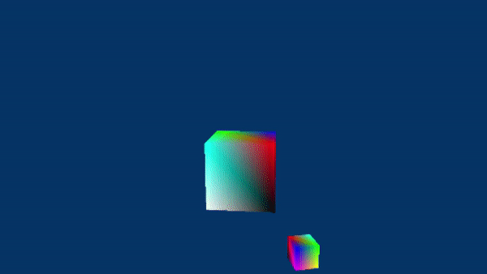
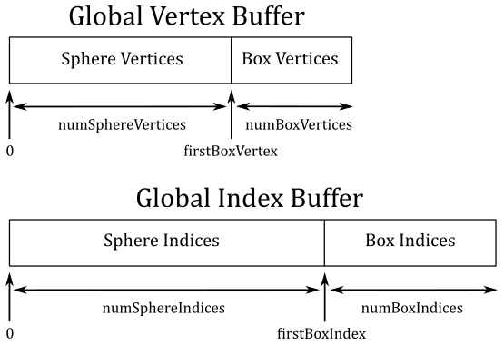

# 01.G - Hello Transformations

<br>



<br>

# 1 - Introduction

To fully understand this tutorial, you need to be comfortable with the basics of linear algebra (vectors, matrices, transformations, and so on). However, even if you are not familiar with this subject, appendices 01 through 04 provide all you need to know to apply transformations to 3D meshes in the scene. The demo examined in this tutorial draws two rotating cubes on the screen. In particular, the first cube is at the center of the scene, clockwise rotating on itself, while the second cube anticlockwise rotates about the first cube.

<br>

<br>

# 2 - D3D12HelloTransformations: code review

<br>

## 2.1 - C++ code

As usual, let’s start with the application class.

<br>

```cpp
class D3D12HelloTransformations : public DXSample
{
public:
    D3D12HelloTransformations(UINT width, UINT height, std::wstring name);

    virtual void OnInit();
    virtual void OnUpdate();
    virtual void OnRender();
    virtual void OnDestroy();

private:
    static const UINT FrameCount = 2;

    // Vertex attributes
    struct Vertex
    {
        XMFLOAT3 position;
        XMFLOAT4 color;
    };

    // Constant buffer
    struct ConstantBuffer
    {
        XMFLOAT4X4 worldMatrix;        // 64 bytes
        XMFLOAT4X4 viewMatrix;         // 64 bytes
        XMFLOAT4X4 projectionMatrix;   // 64 bytes
        XMFLOAT4 padding[4];           // Padding so the constant buffer is 256-byte aligned.
    };
    static_assert((sizeof(ConstantBuffer) % 256) == 0, "Constant Buffer size must be 256-byte aligned");

    // Pipeline objects.
    CD3DX12_VIEWPORT m_viewport;
    CD3DX12_RECT m_scissorRect;
    ComPtr<IDXGISwapChain3> m_swapChain;
    ComPtr<ID3D12Device> m_device;
    ComPtr<ID3D12Resource> m_renderTargets[FrameCount];
    ComPtr<ID3D12Resource> m_depthStencil;
    ComPtr<ID3D12CommandAllocator> m_commandAllocators[FrameCount];
    ComPtr<ID3D12CommandQueue> m_commandQueue;
    ComPtr<ID3D12RootSignature> m_rootSignature;
    ComPtr<ID3D12DescriptorHeap> m_rtvHeap;
    ComPtr<ID3D12DescriptorHeap> m_dsvHeap;
    ComPtr<ID3D12PipelineState> m_pipelineState;
    ComPtr<ID3D12GraphicsCommandList> m_commandList;

    // App resources.
    ComPtr<ID3D12Resource> m_vertexBuffer;
    ComPtr<ID3D12Resource> m_indexBuffer;
    ComPtr<ID3D12Resource> m_perFrameConstants;
    D3D12_VERTEX_BUFFER_VIEW m_vertexBufferView;
    D3D12_INDEX_BUFFER_VIEW m_indexBufferView;
    D3D12_GPU_VIRTUAL_ADDRESS m_constantDataGpuAddr;
    ConstantBuffer* m_mappedConstantData;
    UINT m_rtvDescriptorSize;

    // Synchronization objects.
    UINT m_frameIndex;
    HANDLE m_fenceEvent;
    ComPtr<ID3D12Fence> m_fence;
    UINT64 m_fenceValues[FrameCount];

    // Scene constants, updated per-frame
    float m_curRotationAngleRad;

    // In this simple sample, we know that there are two draw calls
    // and we will update the scene constants for each draw call.
    static const unsigned int c_numDrawCalls = 2;

    // These computed values will be loaded into a ConstantBuffer
    // during Render
    XMMATRIX m_worldMatrix;
    XMMATRIX m_viewMatrix;
    XMMATRIX m_projectionMatrix;

    void LoadPipeline();
    void LoadAssets();
    void PopulateCommandList();
    void MoveToNextFrame();
    void WaitForGpu();
};
```
<br>

We won’t make use of any optional stages before the rasterizer, so we need to transform every vertex of the two cubes from local space to clip space in the vertex shader. For this purpose, we define a structure (**ConstantBuffer**) to be used as a constant buffer to pass to the GPU the matrices associated with the related transformations.

We will use both a vertex and an index buffer to define the geometry of a cube mesh. Therefore, we declare three **ID3D12Resource**: one for the vertex buffer (**m_vertexBuffer**), another for the index buffer (**m_indexBuffer**), and a last one (**m_perFrameConstants**) for the constant buffers we need to load per frame (more on this shortly).

The class member **m_constantDataGpuAddr** will store the GPU starting address of the buffer containing the constant buffers we need per frame. That’s because, in this tutorial, we won’t use a descriptor heap to hold the constant buffer views. Indeed, for the first time, we will see how to use a root descriptor to pass a view as a root argument. In particular, with root descriptors we don’t explicitly create views with one of the methods **CreateXXXView** (a common parameter of these helper functions is the handle to a descriptor table element where to store the view). So, how can we pass a view as a root argument for a root descriptor without any view? Well, we will simply pass the GPU address of the constant buffer. That’s the only information the GPU needs to access the related resource. This implicitly means a minimal view with only the GPU virtual address of the resource will be bound to the related slot (that is, a view without other additional information, such as size, format, etc.). This also explains why you can’t use root descriptors for 2D textures: the GPU needs additional information to access the texels of a texture.

>The GPU can access constant buffers bound with root descriptors as it knows their definition in the shader code (which will be examined in the next section). However, be careful because if you pass the GPU virtual address of a smaller constant buffer than the shader code expects, bad things can happen as the GPU has no information on its size besides the one inferred from the definition. That’s a good reason not to use root descriptors only to avoid the creation of views.

We will use **m_curRotationAngleRad** to store the angle of rotation of the first cube, from which we will derive the one of the second cube.

The class member **c_numDrawCalls** stores the number of Draw commands recorded in a command list per frame. We draw two cubes per frame, then the value of this member will be 2. You may wonder why we need this information. Well, each cube needs its own world matrix (to describe a different location and\or orientation), so we need 2 constant buffers per frame because we have two cubes to draw on the render target. Also, we are going to compose 2 frames before waiting for the CPU to start recording commands again. Then, we need 2 * 2 * sizeof(**ConstantBuffer**) bytes to hold the constant buffers necessary to compose two frames on the CPU timeline. In general, we need to allocate **FrameCount** * **c_numDrawCalls** * sizeof(**ConstantBuffer**) bytes of GPU memory. That is, **m_perFrameConstants** will refer to a buffer which holds an array of **ConstantBuffer**s.

Lastly, we will use the class members **m_worldMatrix**, **m_viewMatrix** and **m_projectionMatrix** to store the results of our computations in calculating the transformation matrices. Then, we will use them to initialize the related members of the constant buffer, and pass data to the GPU.

<br>

In the constructor of the application class we initialize most of the class members.

<br>

```cpp
D3D12HelloTransformations::D3D12HelloTransformations(UINT width, UINT height, std::wstring name) :
DXSample(width, height, name),
m_viewport(0.0f, 0.0f, static_cast<float>(width), static_cast<float>(height)),
m_scissorRect(0, 0, static_cast<LONG>(width), static_cast<LONG>(height)),
m_constantDataGpuAddr(0),
m_mappedConstantData(nullptr),
m_rtvDescriptorSize(0),
m_frameIndex(0),
m_fenceValues{},
m_curRotationAngleRad(0.0f)
{
    // Initialize the world matrix
    m_worldMatrix = XMMatrixIdentity();

    // Initialize the view matrix
    static const XMVECTORF32 c_eye = { 0.0f, 3.0f, -10.0f, 0.0f };
    static const XMVECTORF32 c_at = { 0.0f, 1.0f, 0.0f, 0.0f };
    static const XMVECTORF32 c_up = { 0.0f, 1.0f, 0.0f, 0.0 };
    m_viewMatrix = XMMatrixLookAtLH(c_eye, c_at, c_up);

    // Initialize the projection matrix
    m_projectionMatrix = XMMatrixPerspectiveFovLH(XM_PIDIV4, width / (FLOAT)height, 0.01f, 100.0f);
}
```
<br>

In particular, we set the viewport so that the front face of the NDC parallelepiped is mapped onto the whole render target (that is, we will draw on the entire back buffer).

Then, we call the helper function **XMMatrixIdentity** to initialize the world matrix to an identity matrix. We will compute a proper world transformation for each cube later (to locate the cubes in world space at different locations).

As for the view matrix, right now we don’t have a moving camera, so we can set this matrix beforehand in the constructor by calling **XMMatrixLookAtLH**. The vector **c_eye** is the position of the view frame in world coordinates. We set it so that the camera can see what’s going on near the origin of the world space. Although, the camera won't look straight at that point since the target is defined by the vector **c_at** $= (0, 1, 0)$. However, the FOVs of the camera will be wide enough to watch the whole scene. The type **XMVECTORF32** (as explained in appendix 01) is used to declare constant **XMVECTOR**s.

Indeed, we opt for a perspective projection matrix with a vertical FOV of $\pi/4$ (i.e., $45°$), and an aspect ratio equal to the one of the back buffers in the swap chain (which means a horizontal FOV of approximately $72°$; see the equation $(1c)$ in appendix 04). Also, here we can set the distances of the near and far planes ignoring the depth precision problems because we will only draw objects close to the camera.

<br>

Now, let’s see what happens in LoadPipeline.

<br>

```cpp
// Load the rendering pipeline dependencies.
void D3D12HelloTransformations::LoadPipeline()
{

    // ...


    // Create descriptor heaps.
    {
        // Describe and create a render target view (RTV) descriptor heap.
        D3D12_DESCRIPTOR_HEAP_DESC rtvHeapDesc = {};
        rtvHeapDesc.NumDescriptors = FrameCount;
        rtvHeapDesc.Type = D3D12_DESCRIPTOR_HEAP_TYPE_RTV;
        rtvHeapDesc.Flags = D3D12_DESCRIPTOR_HEAP_FLAG_NONE;
        ThrowIfFailed(m_device->CreateDescriptorHeap(&rtvHeapDesc, IID_PPV_ARGS(&m_rtvHeap)));
 
        // Describe and create a depth stencil view (DSV) descriptor heap.
        D3D12_DESCRIPTOR_HEAP_DESC dsvHeapDesc = {};
        dsvHeapDesc.NumDescriptors = 1;
        dsvHeapDesc.Type = D3D12_DESCRIPTOR_HEAP_TYPE_DSV;
        dsvHeapDesc.Flags = D3D12_DESCRIPTOR_HEAP_FLAG_NONE;
        ThrowIfFailed(m_device->CreateDescriptorHeap(&dsvHeapDesc, IID_PPV_ARGS(&m_dsvHeap)));
 
        m_rtvDescriptorSize = m_device->GetDescriptorHandleIncrementSize(D3D12_DESCRIPTOR_HEAP_TYPE_RTV);
    }

 
    // ...


    // Create the depth stencil view.      
    // Performance tip: Deny shader resource access to resources that 
    // don't need shader resource views.
    {
        D3D12_DEPTH_STENCIL_VIEW_DESC depthStencilDesc = {};
        depthStencilDesc.Format = DXGI_FORMAT_D32_FLOAT;
        depthStencilDesc.ViewDimension = D3D12_DSV_DIMENSION_TEXTURE2D;
        depthStencilDesc.Flags = D3D12_DSV_FLAG_NONE;
 
        ThrowIfFailed(m_device->CreateCommittedResource(
            &CD3DX12_HEAP_PROPERTIES(D3D12_HEAP_TYPE_DEFAULT),
            D3D12_HEAP_FLAG_NONE,
            &CD3DX12_RESOURCE_DESC::Tex2D(DXGI_FORMAT_D32_FLOAT, 
                                          m_width, m_height, 
                                          1, 0, 1, 0, 
                                          D3D12_RESOURCE_FLAG_ALLOW_DEPTH_STENCIL | 
                                          D3D12_RESOURCE_FLAG_DENY_SHADER_RESOURCE), 
            D3D12_RESOURCE_STATE_DEPTH_WRITE,
            &CD3DX12_CLEAR_VALUE(DXGI_FORMAT_D32_FLOAT, 1.0f, 0),
            IID_PPV_ARGS(&m_depthStencil)
        ));
 
        m_device->CreateDepthStencilView(m_depthStencil.Get(), 
                                         &depthStencilDesc, 
                                         m_dsvHeap->GetCPUDescriptorHandleForHeapStart());
    }
}
```
<br>

In this sample we will draw "real" 3D objects (not just a single triangle already lying in the projection window). So, we need a depth buffer to store the normalized distance of the vertices from the camera (that is, the z-coordinate in NDC space). At that point we can enable the depth test in the output-merger stage to only draw the visible pixels onto the back buffer. Otherwise, we would see occluded objects if we draw them after the occluding ones. We will cover the OM stage in depth in a later tutorial.

Usually, we create a depth buffer together with a stencil buffer (although, we don’t need stencil information right now). The depth buffer must be a 2D texture of the same size of the buffers in the swap chain so that to each pixel in the render target corresponds a depth value in the depth buffer at the same position. For the format of this texture we specify **DXGI_FORMAT_D32_FLOAT**, which means that each texel is a single 32-bit component (channel) that can hold a depth value as a floating-point number of 32 bits.<br>
Observe that we specified 1 as array size, and 0 as mipmap levels because there’s no point in having more than one subresource in a depth buffer.<br>
The flag **D3D12_RESOURCE_FLAG_ALLOW_DEPTH_STENCIL** specifies we are allocating memory for a depth buffer, which allow us to create a proper view for this resource, and perform transitions to states specific to a depth buffer (that is, **D3D12_RESOURCE_STATE_DEPTH_WRITE** and/or **D3D12_RESOURCE_STATE_DEPTH_READ**). The initial state is set to **D3D12_RESOURCE_STATE_DEPTH_WRITE** because **ClearDepthStencilView** needs it to clear the depth-stencil buffer.<br>
The flag **D3D12_RESOURCE_FLAG_DENY_SHADER_RESOURCE** can only be used with **D3D12_RESOURCE_FLAG_ALLOW_DEPTH_STENCIL**. It disallows a shader resource view (SRV) to be created for resources that don’t need to be accessed in shader code, as well as disables the resource from transitioning into the state of **D3D12_RESOURCE_STATE_NON_PIXEL_SHADER_RESOURCE** or **D3D12_RESOURCE_STATE_PIXEL_SHADER_RESOURCE**. This can enable some optimizations. In particular, some adapter architectures experience increased bandwidth for depth stencil textures when shader resource views are precluded. Therefore, we should set this flag when the depth stencil buffer will never be used from shader resource views.

To create a depth-stencil view (DSV) we need a dedicated descriptor heap to hold it because RTVs and DSVs can’t share the same descriptor heap.

<br>

Then, we can take a look at **LoadAssets**.

<br>


```cpp
// Load the sample assets.
void D3D12HelloTransformations::LoadAssets()
{
     
    // ... 


    // Create a root signature with one constant buffer view.
    {
        CD3DX12_ROOT_PARAMETER1 rp[1] = {};
        rp[0].InitAsConstantBufferView(0, 0);
 
        // Allow input layout and deny uneccessary access to certain pipeline stages.
        D3D12_ROOT_SIGNATURE_FLAGS rootSignatureFlags =
            D3D12_ROOT_SIGNATURE_FLAG_ALLOW_INPUT_ASSEMBLER_INPUT_LAYOUT |
            D3D12_ROOT_SIGNATURE_FLAG_DENY_HULL_SHADER_ROOT_ACCESS |
            D3D12_ROOT_SIGNATURE_FLAG_DENY_DOMAIN_SHADER_ROOT_ACCESS |
            D3D12_ROOT_SIGNATURE_FLAG_DENY_GEOMETRY_SHADER_ROOT_ACCESS |
            D3D12_ROOT_SIGNATURE_FLAG_DENY_PIXEL_SHADER_ROOT_ACCESS;
 
        CD3DX12_VERSIONED_ROOT_SIGNATURE_DESC rootSignatureDesc = {};
        rootSignatureDesc.Init_1_1(_countof(rp), rp, 0, nullptr, rootSignatureFlags);
 
        ComPtr<ID3DBlob> signature;
        ComPtr<ID3DBlob> error;
        ThrowIfFailed(D3DX12SerializeVersionedRootSignature(&rootSignatureDesc, 
                                                            featureData.HighestVersion, 
                                                            &signature, &error));
        ThrowIfFailed(m_device->CreateRootSignature(0, 
                                                    signature->GetBufferPointer(), 
                                                    signature->GetBufferSize(), 
                                                    IID_PPV_ARGS(&m_rootSignature)));
    }
 
    // Create the constant buffer memory and map the resource
    {
        const D3D12_HEAP_PROPERTIES uploadHeapProperties = CD3DX12_HEAP_PROPERTIES(D3D12_HEAP_TYPE_UPLOAD);
        size_t cbSize = c_numDrawCalls * FrameCount * sizeof(ConstantBuffer);
 
        const D3D12_RESOURCE_DESC constantBufferDesc = CD3DX12_RESOURCE_DESC::Buffer( cbSize);
        ThrowIfFailed(m_device->CreateCommittedResource(
            &uploadHeapProperties,
            D3D12_HEAP_FLAG_NONE,
            &constantBufferDesc,
            D3D12_RESOURCE_STATE_GENERIC_READ,
            nullptr,
            IID_PPV_ARGS(m_perFrameConstants.ReleaseAndGetAddressOf())));
 
        ThrowIfFailed(m_perFrameConstants->Map(0, nullptr, reinterpret_cast<void**>(&m_mappedConstantData)));
 
        // GPU virtual address of the resource
        m_constantDataGpuAddr = m_perFrameConstants->GetGPUVirtualAddress();
    }
 
    // Create the pipeline state, which includes compiling and loading shaders.
    {
        ComPtr<ID3DBlob> vertexShader;
        ComPtr<ID3DBlob> pixelShader;
 
#if defined(_DEBUG)
        // Enable better shader debugging with the graphics debugging tools.
        UINT compileFlags = D3DCOMPILE_DEBUG | D3DCOMPILE_SKIP_OPTIMIZATION;
#else
        UINT compileFlags = 0;
#endif
 
        ThrowIfFailed(D3DCompileFromFile(GetAssetFullPath(L"shaders.hlsl").c_str(), 
                                                          nullptr, nullptr, 
                                                          "VSMain", "vs_5_0", 
                                                          CompileFlags, 0, 
                                                          &vertexShader, nullptr));
        ThrowIfFailed(D3DCompileFromFile(GetAssetFullPath(L"shaders.hlsl").c_str(), 
                                                          nullptr, nullptr, 
                                                          "PSMain", "ps_5_0", 
                                                          compileFlags, 0, 
                                                          &pixelShader, nullptr));
 
        // Define the vertex input layout.
        D3D12_INPUT_ELEMENT_DESC inputElementDescs[] =
        {
            { "POSITION", 0, DXGI_FORMAT_R32G32B32_FLOAT, 0, 0, D3D12_INPUT_CLASSIFICATION_PER_VERTEX_DATA, 0 },
            { "COLOR", 0, DXGI_FORMAT_R32G32B32A32_FLOAT, 0, 12, D3D12_INPUT_CLASSIFICATION_PER_VERTEX_DATA, 0 }
        };
 
        // Describe and create the graphics pipeline state object (PSO).
        D3D12_GRAPHICS_PIPELINE_STATE_DESC psoDesc = {};
        psoDesc.InputLayout = { inputElementDescs, _countof(inputElementDescs) };
        psoDesc.pRootSignature = m_rootSignature.Get();
        psoDesc.VS = CD3DX12_SHADER_BYTECODE(vertexShader.Get());
        psoDesc.PS = CD3DX12_SHADER_BYTECODE(pixelShader.Get());
        psoDesc.RasterizerState = CD3DX12_RASTERIZER_DESC(D3D12_DEFAULT);
        psoDesc.BlendState = CD3DX12_BLEND_DESC(D3D12_DEFAULT);
        psoDesc.DepthStencilState = CD3DX12_DEPTH_STENCIL_DESC(D3D12_DEFAULT);;
        psoDesc.DSVFormat = DXGI_FORMAT_D32_FLOAT;
        psoDesc.SampleMask = UINT_MAX;
        psoDesc.PrimitiveTopologyType = D3D12_PRIMITIVE_TOPOLOGY_TYPE_TRIANGLE;
        psoDesc.NumRenderTargets = 1;
        psoDesc.RTVFormats[0] = DXGI_FORMAT_R8G8B8A8_UNORM;
        psoDesc.SampleDesc.Count = 1;
        ThrowIfFailed(m_device->CreateGraphicsPipelineState(&psoDesc, IID_PPV_ARGS(&m_pipelineState)));
    }
 
    // Create the command list.
    ThrowIfFailed(m_device->CreateCommandList(0, D3D12_COMMAND_LIST_TYPE_DIRECT, 
                                              m_commandAllocators[m_frameIndex].Get(), 
                                              m_pipelineState.Get(), 
                                              IID_PPV_ARGS(&m_commandList)));
 
    // Command lists are created in the recording state, but there is nothing
    // to record yet. The main loop expects it to be closed, so close it now.
    ThrowIfFailed(m_commandList->Close());
 
    // Create the vertex and index buffers.
    {
        // Define the geometry for a cube (in local space).
        Vertex cubeVertices[] =
        {
            { XMFLOAT3(-1.0f, 1.0f, -1.0f), XMFLOAT4(0.0f, 0.0f, 1.0f, 1.0f) },
            { XMFLOAT3(1.0f, 1.0f, -1.0f), XMFLOAT4(0.0f, 1.0f, 0.0f, 1.0f) },
            { XMFLOAT3(1.0f, 1.0f, 1.0f), XMFLOAT4(0.0f, 1.0f, 1.0f, 1.0f) },
            { XMFLOAT3(-1.0f, 1.0f, 1.0f), XMFLOAT4(1.0f, 0.0f, 0.0f, 1.0f) },
            { XMFLOAT3(-1.0f, -1.0f, -1.0f), XMFLOAT4(1.0f, 0.0f, 1.0f, 1.0f) },
            { XMFLOAT3(1.0f, -1.0f, -1.0f), XMFLOAT4(1.0f, 1.0f, 0.0f, 1.0f) },
            { XMFLOAT3(1.0f, -1.0f, 1.0f), XMFLOAT4(1.0f, 1.0f, 1.0f, 1.0f) },
            { XMFLOAT3(-1.0f, -1.0f, 1.0f), XMFLOAT4(0.0f, 0.0f, 0.0f, 1.0f) },
        };
 
        const UINT vertexBufferSize = sizeof(cubeVertices);
 
        // Note: using upload heaps to transfer static data like vert buffers is not 
        // recommended. Every time the GPU needs it, the upload heap will be marshalled 
        // over. Please read up on Default Heap usage. An upload heap is used here for 
        // code simplicity and because there are very few verts to actually transfer.
        ThrowIfFailed(m_device->CreateCommittedResource(
            &CD3DX12_HEAP_PROPERTIES(D3D12_HEAP_TYPE_UPLOAD),
            D3D12_HEAP_FLAG_NONE,
            &CD3DX12_RESOURCE_DESC::Buffer(vertexBufferSize),
            D3D12_RESOURCE_STATE_GENERIC_READ,
            nullptr,
            IID_PPV_ARGS(&m_vertexBuffer)));
 
        // Copy the cube data to the vertex buffer.
        // We do not intend to read from this resource on the CPU.
        UINT8* pVertexDataBegin = nullptr;
        CD3DX12_RANGE readRange(0, 0);        
        ThrowIfFailed(m_vertexBuffer->Map(0, &readRange, reinterpret_cast<void**>(&pVertexDataBegin)));
        memcpy(pVertexDataBegin, cubeVertices, sizeof(cubeVertices));
        m_vertexBuffer->Unmap(0, nullptr);
 
        // Initialize the vertex buffer view.
        m_vertexBufferView.BufferLocation = m_vertexBuffer->GetGPUVirtualAddress();
        m_vertexBufferView.StrideInBytes = sizeof(Vertex);
        m_vertexBufferView.SizeInBytes = vertexBufferSize;

 
//    3________ 2
//    /|      /|
//   /_|_____/ |
//  0|7|_ _ 1|_|6
//   | /     | /
//   |/______|/
//  4       5
//
// Create index buffer
UINT16 indices[] =
{
    // TOP
    3,1,0,
    2,1,3,
 
    // FRONT
    0,5,4,
    1,5,0,
 
    // RIGHT
    3,4,7,
    0,4,3,
 
    // LEFT
    1,6,5,
    2,6,1,
 
    // BACK
    2,7,6,
    3,7,2,
 
    // BOTTOM
    6,4,5,
    7,4,6,
};
 
        const UINT indexBufferSize = sizeof(indices);
 
        ThrowIfFailed(m_device->CreateCommittedResource(
            &CD3DX12_HEAP_PROPERTIES(D3D12_HEAP_TYPE_UPLOAD),
            D3D12_HEAP_FLAG_NONE,
            &CD3DX12_RESOURCE_DESC::Buffer(indexBufferSize),
            D3D12_RESOURCE_STATE_GENERIC_READ,
            nullptr,
            IID_PPV_ARGS(&m_indexBuffer)));
 
        // Copy the cube data to the vertex buffer.
        ThrowIfFailed(m_indexBuffer->Map(0, &readRange, reinterpret_cast<void**>(&pVertexDataBegin)));
        memcpy(pVertexDataBegin, indices, sizeof(indices));
        m_indexBuffer->Unmap(0, nullptr);
 
        // Initialize the vertex buffer view.
        m_indexBufferView.BufferLocation = m_indexBuffer->GetGPUVirtualAddress();
        m_indexBufferView.Format = DXGI_FORMAT_R16_UINT;
        m_indexBufferView.SizeInBytes = indexBufferSize;
    }

 
    // ...

}
```
<br>

We create a root signature with a single root parameter: a root descriptor for the CBV to the constant buffer that holds the transformation matrices. Remember that we won’t create any CBV: we will simply pass the GPU virtual address of the constant buffer. The vertex shader will be the only one to read this constant buffer, so we can deny access to other shaders.

Then, we allocate enough GPU memory space for the constant buffers we need per frame, and map the related resource to the CPU virtual address space of our application, storing the CPU virtual address in **m_mappedConstantData**.<br>
**ID3D12Resource** provides the method **GetGPUVirtualAddress** that we call to get the GPU virtual address of the array of constant buffers. We will use it to compute the address of the current back buffer to pass as a root argument for a root descriptor (more on this shortly).

After compiling the shader code, and creating the input layout, we set a PSO. This time we need to enable the depth test and set some depth information. **CD3DX12_DEPTH_STENCIL_DESC** allow us to specify a default behavior for the depth test in the OM stage: a pixel (generated by the rasterizer and returned by the pixel shader) is written on the render target only if its depth value is less than the one stored in the depth buffer at the same position. In that case we say that the pixel passes the depth test, and its depth value is used to update the one in the depth buffer. That way, no pixel of occluded meshes will be visible to the camera.<br>
The format of the depth buffer is specified by setting a dedicated field (**DSVFormat**) of the **D3D12_GRAPHICS_PIPELINE_STATE_DESC** structure. Eventually, we use this PSO to create a command list.

The creation of the vertex buffer is a bit different from the previous tutorials: this time we will also use an index buffer to define the geometry of the meshes. Fortunately, we can easily describe a cube programmatically by defining its 8 vertices in local space (the vertex buffer), and 36 indices (the index buffer) which describe the cube as a triangle list: 12 triangles, two for each face of the cube. As you can see, the creation of the index buffer is similar to that of the vertex buffer. The only difference is in the creation of the view: for index buffers the **Format** field is used to specify the stride information instead of the **StrideInBytes** field (the substance does not change; the term **StrideInBytes** somewhat fits better to collection of data\attributes).

<br>

**OnUpdate** is responsible for updating, on a per frame basis, the angle of rotation (**m_curRotationAngleRad**) and the world matrix of the first cube to include a rotation about the y-axis, which considers the new updated angle. We will derive another world matrix from **m_curRotationAngleRad** for the second cube in **PopulateCommandList**.

<br>

```cpp
// Update frame-based values.
void D3D12HelloTransformations::OnUpdate()
{
    const float rotationSpeed = 0.015f;

    // Update the rotation constant
    m_curRotationAngleRad += rotationSpeed;
    if (m_curRotationAngleRad >= XM_2PI)
    {
        m_curRotationAngleRad -= XM_2PI;
    }

    // Rotate the cube around the Y-axis
    m_worldMatrix = XMMatrixRotationY(m_curRotationAngleRad);
}
```
<br>

Observe that we only use a rotation matrix for the world transformation (no scaling or translation), so the first cube will rotate at the center of the world space. **XMMatrixRotationY** builds a matrix that rotates around the y-axis (see appendix 03 to see how to build this matrix manually). Also, if the angle of rotation exceeds the value of $360°$ we set it to zero to start again from scratch. In theory there is no difference in rotating by an angle $\theta$ or $(2\pi+\theta)$, it’s the same rotation. However, if we keep offsetting **m_curRotationAngleRad**, at some point its value would overflow, which can result in a loss of smoothness for our rotation. 

<br>

At this point, the code of **PopulateCommandList** should be almost self-explanatory.

<br>

```cpp
// Record commands in command list
void D3D12HelloTransformations::PopulateCommandList()
{
    // Command list allocators can only be reset when the associated 
    // command lists have finished execution on the GPU; apps should use 
    // fences to determine GPU execution progress.
    ThrowIfFailed(m_commandAllocators[m_frameIndex]->Reset());

    // However, when ExecuteCommandList() is called on a particular command 
    // list, that command list can then be reset at any time and must be before 
    // re-recording.
    ThrowIfFailed(m_commandList->Reset(m_commandAllocators[m_frameIndex].Get(), m_pipelineState.Get()));

    // Set necessary state.
    m_commandList->SetGraphicsRootSignature(m_rootSignature.Get());
    m_commandList->RSSetViewports(1, &m_viewport);
    m_commandList->RSSetScissorRects(1, &m_scissorRect);

    // Index into the available constant buffers based on the number
    // of draw calls. We've allocated enough for a known number of
    // draw calls per frame times the number of back buffers
    unsigned int constantBufferIndex = c_numDrawCalls * (m_frameIndex % FrameCount);

    // Set the per-frame constants
    ConstantBuffer cbParameters = {};

    // Shaders compiled with default row-major matrices
    XMStoreFloat4x4(&cbParameters.worldMatrix, XMMatrixTranspose(m_worldMatrix));
    XMStoreFloat4x4(&cbParameters.viewMatrix, XMMatrixTranspose(m_viewMatrix));
    XMStoreFloat4x4(&cbParameters.projectionMatrix, XMMatrixTranspose(m_projectionMatrix));

    // Set the constants for the first draw call
    memcpy(&m_mappedConstantData[constantBufferIndex], &cbParameters, sizeof(ConstantBuffer));

    // Bind the constants to the shader
    auto baseGpuAddress = m_constantDataGpuAddr + sizeof(ConstantBuffer) * constantBufferIndex;
    m_commandList->SetGraphicsRootConstantBufferView(0, baseGpuAddress);

    // Indicate that the back buffer will be used as a render target.
    m_commandList->ResourceBarrier(1, &CD3DX12_RESOURCE_BARRIER::Transition(m_renderTargets[m_frameIndex].Get(), D3D12_RESOURCE_STATE_PRESENT, D3D12_RESOURCE_STATE_RENDER_TARGET));

    CD3DX12_CPU_DESCRIPTOR_HANDLE rtvHandle(m_rtvHeap->GetCPUDescriptorHandleForHeapStart(), m_frameIndex, m_rtvDescriptorSize);
    CD3DX12_CPU_DESCRIPTOR_HANDLE dsvHandle(m_dsvHeap->GetCPUDescriptorHandleForHeapStart());
    m_commandList->OMSetRenderTargets(1, &rtvHandle, FALSE, &dsvHandle);

    // Clear the render target and depth buffer
    const float clearColor[] = { 0.0f, 0.2f, 0.4f, 1.0f };
    m_commandList->ClearRenderTargetView(rtvHandle, clearColor, 0, nullptr);
    m_commandList->ClearDepthStencilView(dsvHandle, D3D12_CLEAR_FLAG_DEPTH, 1.0f, 0, 0, nullptr);

    // Set up the input assembler
    m_commandList->IASetPrimitiveTopology(D3D_PRIMITIVE_TOPOLOGY_TRIANGLELIST);
    m_commandList->IASetVertexBuffers(0, 1, &m_vertexBufferView);
    m_commandList->IASetIndexBuffer(&m_indexBufferView);

    // Draw the first cube
    m_commandList->DrawIndexedInstanced(36, 1, 0, 0, 0);
    baseGpuAddress += sizeof(ConstantBuffer);
    ++constantBufferIndex;

    // Update the World matrix of the second cube
    XMMATRIX scaleMatrix = XMMatrixScaling(0.2f, 0.2f, 0.2f);
    XMMATRIX rotationMatrix = XMMatrixRotationY(-2.0f * m_curRotationAngleRad);
    XMMATRIX translateMatrix = XMMatrixTranslation(0.0f, 0.0f, -5.0f);

    // Update the world variable to reflect the current light
    XMStoreFloat4x4(&cbParameters.worldMatrix, XMMatrixTranspose((scaleMatrix * translateMatrix) * rotationMatrix));

    // Set the constants for the draw call
    memcpy(&m_mappedConstantData[constantBufferIndex], &cbParameters, sizeof(ConstantBuffer));

    // Bind the constants to the shader
    m_commandList->SetGraphicsRootConstantBufferView(0, baseGpuAddress);

    // Draw the second cube
    m_commandList->DrawIndexedInstanced(36, 1, 0, 0, 0);

    // Indicate that the back buffer will now be used to present.
    m_commandList->ResourceBarrier(1, &CD3DX12_RESOURCE_BARRIER::Transition(m_renderTargets[m_frameIndex].Get(), D3D12_RESOURCE_STATE_RENDER_TARGET, D3D12_RESOURCE_STATE_PRESENT));

    ThrowIfFailed(m_commandList->Close());
}
```
<br>

We are going to compose two frames on the CPU timeline before waiting for the GPU. Each frame shows two cubes placed at different locations in the scene. Therefore, we need a world matrix for each cube, per frame. This means we need four constant buffers to avoid overwriting data that is still in use by the GPU. Indeed, in **LoadAssets** we allocated enough GPU memory to store an array of four constant buffers we can access with an index. For this purpose, we have the number of frames we want to compose in advance (**FrameCount**), the numbers of objects in the scene (**c_numDrawCalls**), and the index of the current frame (**m_frameIndex**), so we can easily calculate the index of the constant buffer associated with the object we are currently drawing.

As we know, the view matrix depends on the position and orientation of the camera with respect to the world space, while the projection matrix depends on the frustum associated with the camera (usually, we want the same aspect ratio for the projection window and the render target). This means that the view matrix only changes if we move or rotate the camera, while the projection matrix only changes if we change the frustum, or resize the window of our application. In the latter case we need to resize the render target and the projection window as well, so that their sizes always match that of the window’s client area. However, we can’t move the camera (at least not yet), and we still haven’t covered how to properly deal with resize messages the OS sends to our application, so we were able to build both the view and projection matrices in advance in the constructor of the application class since they won’t change for the entire time our application is running.<br>
We’ve already computed the world matrix of the first cube in **OnUpdate**, which is called before **OnRender**, so we can load the constant buffer data of the first cube in GPU memory by using our CPU mapped version of the constant buffer.

>We are working with matrices in C++, where the elements are stored in memory in a row-major order. As explained in appendix 02, whenever we pass matrix data to the GPU as a bit stream, we first need to transpose it to store the elements in a column-major order. For this purpose, **XMMatrixTranspose** can be used to compute the transpose of a matrix.

At that point we can bind the view of the constant buffer of the first cube. As stated earlier, we simply pass the related GPU virtual address since we are passing a view as a root argument to a root descriptor. The computation of the GPU virtual addresses of the various constant buffers is trivial when we have the GPU starting address of the array of constant buffers (**m_constantDataGpuAddr**), the size of each element (**ConstantBuffer**), and the index of the current constant buffer (**constantBufferIndex**).

Observe that we need to clear both the render target and depth stencil buffer. The call to **OMSetRenderTargets** now also specifies the (CPU handle to the) depth stencil view (DSV). Indeed, the OM stage is responsible for generating the final image we want to draw on the screen by writing onto the render target in accordance with the results of the tests performed by the OM stage on every pixel returned by the pixel shader. In this case we want the OM stage to perform a depth test, so we need to specify a depth buffer to compare the depth values of the pixels. We will cover the OM stage in detail in a later tutorial.

At this point we can bind both the vertex and index buffers to the slots of the input assembler, and draw the first cube. Observe that we only have a single slot to bind index buffers, so we don’t need to specify a slot number. Also, since we are using an index buffer, we need to call **DrawIndexedInstanced** instead of **DrawInstanced**.

<br>

```cpp
virtual void STDMETHODCALLTYPE DrawIndexedInstanced( 
         UINT IndexCountPerInstance,
         UINT InstanceCount,
         UINT StartIndexLocation,
         INT BaseVertexLocation,
         UINT StartInstanceLocation);
```
<br>

**IndexCountPerInstance** specifies the number of indices to read from the index buffer that are needed to draw each instance. We will cover the concept of instance in a later tutorial. Up to that time, we will simply call **DrawIndexedInstanced** to draw a single instance\object.

**InstanceCount** specifies the number of instances to draw (we can pass 1 right now).

**StartIndexLocation** specifies the starting index to read by the GPU from the index buffer.

**BaseVertexLocation** specifies a value added to each index before reading a vertex from the vertex buffer.

**StartInstanceLocation** specifies a value added to each index before reading per-instance data from a vertex buffer. At the moment we are not interested in this parameter, so we can pass 0.

<br>

**InstanceCount**, **StartIndexLocation** and **BaseVertexLocation** are useful if you have one vertex buffer and one index buffer shared by multiple objects\meshes. In the following illustration you can see an example.

<br>



<br>

Suppose you want to draw a sphere and a box, and you want to store their vertices in a shared, global vertex buffer. In a similar way, their indices are stored in a shared, global index buffer. Observe that the indices of the sphere and the box stored in the global index buffer are independent from each other. That is, the indices of the sphere are

<br>

$0,1,\ldots,(numSphereIndices-1)$

<br>

while the ones of the box are

<br>

$0,1,\ldots,(numBoxIndices-1)$

<br>

Now, how can we draw the box? We need to consider that the index 0 of the box refers to the first vertex in the global vertex buffer, which is actually the first vertex of the sphere, not the box. However, we know the number of vertices and indices of both the sphere and the box (because we generate them, or a 3D artist did it for us). So, to draw the box, we can pass *numBoxIndices* to the parameter **IndexCountPerInstance**, *firstBoxIndex=numSphereIndices* to **StartIndexLocation**, and *firstBoxVertex=numSphereVertices* to **BaseVertexLocation**.

<br>

To draw the second cube, first we have to update the GPU virtual address of the associated constant buffer, and the related index. We want the second cube to rotate around the first one, so we translate the second cube along the z-axis of the world space, and rotate it about the y-axis (again, of the world space). We scale and reverse the sign of the angle of rotation of the first cube (**m_curRotationAngleRad**) so that the second cube rotate at double speed in the reverse direction with respect to the first cube. For this purpose, **XMMatrixScaling** builds a matrix that scales along the x-axis, y-axis, and z-axis, while **XMMatrixTranslation** builds a translation matrix from the specified offsets (see appendix 03 to see how to build these matrices manually). Also, we scale the second cube so that it’s 20% of the first cube. Observe that, to achieve the desired effect, the first transformation to apply is the scaling. Then, we need to translate and, eventually, rotate the second cube (change the order of world transformations applied to the second cube to see what happens).

The code to load the constant buffer data, bind the related view, and draw the second cube is not much different from what we have already seen for the draw of the first cube.

<br>

## 2.2 - HLSL Code

In the shader code of this sample we need to transform the 3D vertices of the two cubes to get a 2D representation the rasterizer can use to generate the pixels covered by the primitives (the triangles which make up the faces of the cubes).

<br>

```hlsl
//--------------------------------------------------------------------------------------
// Constant Buffer Variables
//--------------------------------------------------------------------------------------
cbuffer ConstantBuffer : register(b0)
{
	matrix World;
	matrix View;
	matrix Projection;
}
 
//--------------------------------------------------------------------------------------
struct PSInput
{
    float4 position : SV_POSITION;
    float4 color : COLOR;
};


//--------------------------------------------------------------------------------------
// Vertex Shader
//--------------------------------------------------------------------------------------
PSInput VSMain(float4 position : POSITION, float4 color : COLOR)
{
    PSInput output = (PSInput)0;
    output.position = mul(position, World);
    output.position = mul(output.position, View);
    output.position = mul(output.position, Projection);
    output.color = color;
    
    return output;
}


//--------------------------------------------------------------------------------------
// Pixel Shader
//--------------------------------------------------------------------------------------
float4 PSMain(PSInput input) : SV_TARGET
{
    return input.color;
}
```
<br>

Here we don’t make use of any optional stages (hull, domain, geometry, etc.), so the vertex shader is the one before the rasterizer. Therefore, it is the stage that has to output vertices in homogeneous clip coordinates. Remember that vertices in a vertex buffer are in local space, so the input assembler pass the vertices to the vertex shader in local coordinates. As you can see, we first multiply each vertex in input by the world matrix to get its world coordinates. Then, we multiply the result by the view matrix to get its view (camera) coordinates. Lastly, we multiply the result by the projection matrix to get its clip coordinates.<br>
That is, the vertex shader receives the vertex positions in local space we defined in the application class (when we created the vertex buffer), and transform them to return homogeneous clip coordinates. This should explain why we can change the input parameter **position** of **VSMain** to **float3**, but the homonymous field of the struct **PSInput** has to be **float4**. Also, now we can finally state what the system-value semantic **SV_POSITION** means: it identifies the clip coordinates of a vertex. The rasterizer will use this information to identify the data on which to perform the perspective division, the clipping operations, etc.

<br>

<br>

Source code: [LearnDirectX](https://github.com/PAMinerva/LearnDirectX)

<br>

# References

[1] [A.01 - Vectors](https://paminerva.github.io/docs/LearnDirectX/A.01-Vectors)<br>
[2] [A.02 - Matrices](https://paminerva.github.io/docs/LearnDirectX/A.02-Matrices)<br>
[3] [A.03 - Transformations](https://paminerva.github.io/docs/LearnDirectX/A.03-Transformations)<br>
[4] [A.04 - Spaces](https://paminerva.github.io/docs/LearnDirectX/A.04-Spaces)

<br>

***
If you found the content of this tutorial somewhat useful or interesting, please consider supporting this project by clicking on the **Sponsor** button.  Whether a small tip, a one time donation, or a recurring payment, it's all welcome! Thank you!<br><br>
<p align="center">
 <a href="https://github.com/sponsors/PAMinerva">
         
      </a>
</p><br>