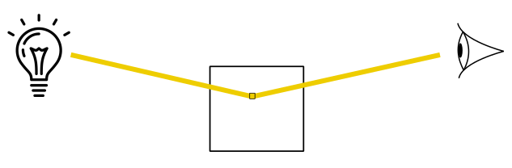
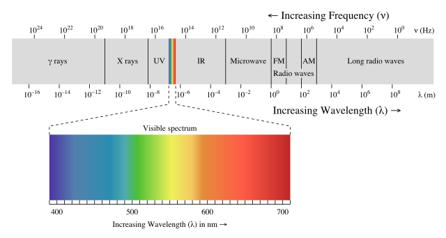
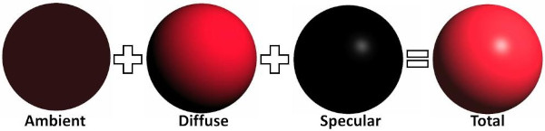
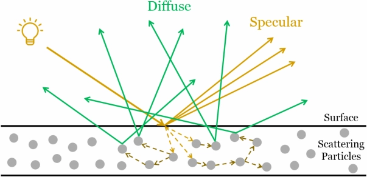
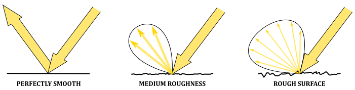
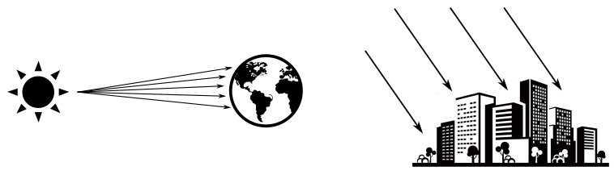
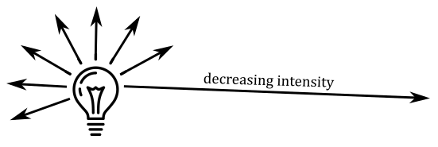
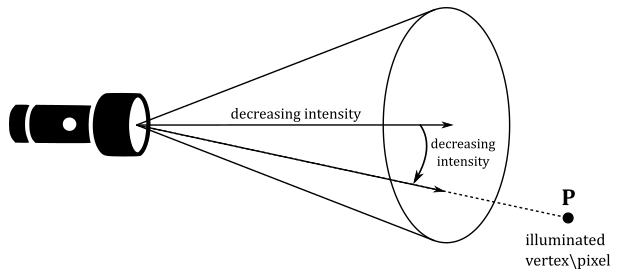
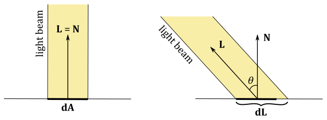

# 01.H - Hello Lighting

<br>


<br>

# 1 - Introduction

Until now, we simply set the color of the meshes as a per-vertex attribute, or as a per-pixel attribute (with the help of textures). Unfortunately, that's not how things work in real life. The color of an object is not an intrinsic property of the object. We can see an object only if there are light sources illuminating it. In that case, what we see is the amount of light reflected by the object that reaches our eye (or the camera).

<br>



<br>

By light source we mean an object that emits electromagnetic waves (produced by the motion of electrically charged particles) with frequencies and wavelengths that fall within the spectrum visible to the human eye in the form of light rays.

<br>



<br>

Each light ray is the sum of many electromagnetic waves of different wavelengths. What we just described is known as the wave nature of light, which best describes the propagation of light. However, light also has a particle nature, which best describes how light is reflected by (or refracted in) other objects when light hit their surfaces. In the particle nature of light, the particles are called photons, which are massless units of energy that depends on the wavelengths in the incoming light. That is, the energy of some photons depends on a wavelength A included in the incoming light, while the energy of other photons depends on a wavelength B, and so on.

When light rays reach an object, some photons hit the particles on its surface, and are reflected as a result of this interaction. On the other hand, other photons enter the object, and hit the internal particles close to the surface of the object. Depending on the type of material of the object, some of the photons that enter the object can be absorbed by its particles, while other photons emerge as reflected light after some bounces. However, the light reflected this way could miss some of the wavelengths in the incoming light due to the absorbation of the related photons. This results in a different color of the reflected light with respect to the color of the incoming light. That is, some of the reflected light will describe the color of the object.

In the context of computer graphics, we are interested in calculating the fraction of incoming light reflected in the camera by a vertex or pixel. Indeed, we have two choices here. We can compute the light reflected by each vertex of a mesh in the vertex shader, and welcome the interpolated colors of the pixels in the pixel shader. On the other hand, we can get a better result by computing the reflected light of each pixel in the pixel shader (even though, it is computationally more expensive).

In general, the contribution\effect of a light source in the illumination of an object can be considered as the sum of three components\terms.

<br>



<br>

- **Ambient**: The ambient component concerns the effects of indirect light, that reaches an object with low intensity after being bounced several times on other surfaces in the scene. Accounting for these multiple bounces to compute the actual indirect light that reach a vertex\pixel can be a difficult task in a real-time application. Considering the effects of both direct and indirect light, also taking into account the objects in the scene, leads to the implementation of a global illumination system. On the other hand, a local illumination system only considers the effects of direct light irrespective of other objects in the scene (that is, an object can be illuminated by a light source even if it is occluded by other objects). However, a local illumination system can't simply ignore the effect of indirect light just because it's computationally expensive. Therefore, a local illumination system usually roughly approximates the effect of indirect light with the help of the ambient term. For this purpose, in a local illumination model indirect light is considered coming from all directions with the same (low) intensity, and scattered in all directions as well. This means that the position of both the camera and vertices\pixels receiving the incoming light is irrelevant: indirect light hits all vertices\pixels, and a fraction of it is always reflected in the camera. In other words, indirect light uniformly illuminates every part of an object. The ambient term allows to see objects even if they are in shadow. Also, in a local illumination model the indirect light received by a vertex\pixel usually includes the indirect light produced by all light sources in the scene.

- **Diffuse**: The diffuse component specifies the light reflected in all directions due to the interaction between the photons of incoming light and the internal particles close to the surface of an object. This means that the diffuse component depends on the material of the object, and specifies its color. Similar to the ambient term, in the diffuse component the position of the camera is irrelevant because the light is reflected in all directions. However, here the position of the vertex\pixel that receives the incoming light can be useful to compute the light direction. Indeed, as we will see in the next section, the diffusely reflected light also depends on the direction of the incoming light (in addition to the material of the object). The light diffusely reflected by an object is often called diffuse reflection.

<br>



<br>

- **Specular**: The specular component specifies the light reflected due to the interaction between the photons of incoming light and the particles on the surface of an object. This means that the color of the specular reflection is the same as the color of the incoming light because we have few interactions, and less photons absorbed. The light rays of the specular reflection are all within a region called specular lobe, which is around the reflection vector that specifies the direction of reflection of the incoming light with respect to the macrosurface normal (that is, the normal of a surface computed without considering the roughness at microscopic level). The specular lobe varies depending on the smoothness of the object. Here the position of both the camera is important because the specular reflection is visible only if its light rays reach the camera. In particular, the nearer the camera is to the reflection vector, the more intensity reaches the camera.

<br>



<br>

However, not all light sources are the same. They can have different properties that affect the contribution of a light source in the illumination of an object. In computer graphics we usually have three types of light sources.

- **Directional**: In a directional (or parallel) light both direction and intensity of the incoming light rays are fixed (that is, all vertices\pixels receives the incoming light from the same direction and with equal intensity). A directional light is useful when we want the contribution of a light source so far away from the objects in the scene that its light rays can be considered parallel to each other. For example, the sun is a perfect choice for a directional light because, if you consider a small region on the Earth, the light rays hit the objects approximately with the same direction and intensity. Therefore, the position of a directional light source is irrelevant.

<br>



<br>

- **Point**: A point light works like a light bulb. It radiates light in all directions from its position, with an intensity that decreases with distance.

<br>



<br>

- **Spotlight**: A spotlight works like a flashlight. It radiates light through a cone, with an intensity that decreases with distance, and also depends on the angle between the light direction and the center of the cone.

<br>



<br>

<br>

<br>

# 2 - Lambertian shading model

Several local lighting\shading models have been created to approximate the computation of the light reflected by a vertex\pixel. However, in this tutorial we will use a simplified version of the most basic type of local shading model: the Lambertian lighting (or shading) model. This shading model omits both the ambient and specular terms, only considering the diffuse contribution of each light source. This means that the Lambertian shading model best approximates the light reflected by matte surfaces (rough at the microscopic level), where the light rays of the specular reflection are scattered in many directions with negligible intensity.

In this simplified version of the Lambertian shading model we will only use directional lights. This means that incoming light will have constant direction and intensity for all illuminated vertices\pixels. Also, the material of the objects will be irrelevant. That is, objects will reflect a fraction of the incoming light without absorbing photons from the incoming light. This means that the color of the objects will only depend on the color of the incoming light. Therefore, the amount of reflected light only depends on the direction of the incoming light. But, what exactly does it mean? Well, the amount of reflected light obviously depends on the amount of incoming light, and it turns out that this value depends on the direction of the incoming light. Consider the following illustration.

<br>



<br>

If a light beam perpendicularly hit a surface, the area $dA$ receives all the incoming light, which can be diffusely reflected in all directions. On the other hand, if the light beam is not perpendicular to the surface, the area $dL$ that receives all the incoming light is greater than the area $dA$. This means that $dA$ will reflect in all direction a smaller amount of light because it receives less incoming light.

The Lambertian shading model states that the intensity\color of the diffuse reflection (that is, the light diffusely reflected in all directions by a vertex\pixel) is $\mathbf{l} _d$, which is described by the following equation.

<br>

$\mathbf{l} _d=\text{max}(\cos\theta, 0)\ (\mathbf{l} _i\otimes \mathbf{m} _d)=\text{max}((\mathbf{L}\cdot \mathbf{N}), 0)\ (\mathbf{l} _i\otimes \mathbf{m} _d)$

<br>

In the equation above $m_d$ is called diffused albedo. It's a vector controlling the fraction of incoming light diffusely reflected by an object depending on its material. If you don't use textures, the diffuse albedo usually specifies the color of the object (or rather, the color of the diffuse reflection). That is, each component of $\mathbf{m} _d$ indicates the amount of red, green and blue in the diffuse reflection. On the other hand, if you use textures, the diffuse albedo simply specifies the fraction\percentage of incoming light that is diffusely reflected. That is, the ratio between the amount\intensity of light diffusely reflected and the amount\intensity of incoming light is stored in each component of the diffuse albedo, which needs to be combined with a color sampled by a texture to compute the color of the diffuse reflection $\mathbf{l} _d$.<br>
$\mathbf{l} _i$ is the intensity\color of the incoming light. That is, each component of $\mathbf{l} _i$ specifies the amount of red, green, and blue in the incoming light.<br>
$\mathbf{L}$ is the unit vector that specifies the inverse of the light direction (that is, from a vertex\pixel to the light source), while $\mathbf{N}$ is the normal to the mesh in the vertex\pixel that receives the incoming light.<br>
The **max** function is used to exclude the contribution of incoming light hitting a vertex\pixel from behind.<br>
The operator $\otimes$ specifies the product of two vectors performed component by component. That is, 

<br>

$\mathbf{c}=\mathbf{a}\otimes \mathbf{b}=(a_xb_x,\ a_yb_y,\ a_zb_z)$

<br>

Now, in our simplified version of the Lambertian model we stated that the material of the objects is irrelevant, so we set $m_d = 1$, so that the formula becomes

<br>

$\mathbf{l} _d=\text{max}((\mathbf{L}\cdot \mathbf{N}), 0)\ \mathbf{l} _i$

<br>

While this is physically inaccurate, it is still better than set the color of a mesh as a per-vertex attribute.

So, to compute the reflected light with this simplified Lambertian shading model, we need both direction and intensity of each directional light that illuminates the scene, and the normal in each vertex\pixel of a mesh as well.<br>
Obviously, light directions and normals need to be in the same space to calculate the diffuse reflection $\mathbf{l} _d$. For example, since we are only considering directional lights, we can set both direction and intensity of the light sources in the C++ application, with the light direction expressed in world coordinates. Then, we can pass this information to the shader code in a constant buffer since it will be constant for each vertex\pixel. <br>
We can set the normal as a per vertex attribute, so that we can get the normal of a vertex in the vertex shader, or the interpolated normal for a pixel in the pixel shader. Remember that vertex positions in a vertex buffer are expressed in local space, and the related normals should be in local space as well. This means that if you apply a transformation to a vertex position, you may need to apply the same transformation to the related normal as well if you want to ensure data consistency (that is, if you want both positions and normals in the same space). In the context of the example illustrated above (where light directions are expressed in world coordinates), we want normals in world space to compute the diffuse reflection $\mathbf{l} _d$. Therefore, we should apply the same world transformation to both vertex positions and normals. Then, we can apply other transformations to vertex positions only, as we are not interested in having normals in frames other than the world space.

>However, if a transformation contains a non-uniform scaling, we need to apply a slightly modified version of that transformation to normals. We will return to this issue in a later tutorial, but don't worry: the sample we will examine in this and upcoming tutorials won't use non-uniform scaling to transform vertex positions, so we only need to apply the same transformation to both vertex positions and normals.

<br>

<br>

# 3 - D3D12HelloLighting: code review

This sample will draw a cube at the origin of the world space, illuminated by a couple of directional lights. The first light source will emit white light rays from a fixed position between the camera and the cube. The second light source will emit red light rays while rotating around the cube. Usually, directional lights are not shown on the screen because their position is irrelevant. However, in this sample we will draw both as small colored blocks.<br>
Observe that we will compute the light reflected by the cube in the pixel shader. That is, we opted for a per-pixel lighting calculation which is a bit more expensive, but it gives better results. 

<br>

## 3.1 - C++ code

As usual, let’s start with the application class.

<br>

```cpp
class D3D12HelloLighting : public DXSample
{
public:
    D3D12HelloLighting(UINT width, UINT height, std::wstring name);

    virtual void OnInit();
    virtual void OnUpdate();
    virtual void OnRender();
    virtual void OnDestroy();

private:
    // In this sample we overload the meaning of FrameCount to mean both the maximum
    // number of frames that will be queued to the GPU at a time, as well as the number
    // of back buffers in the DXGI swap chain. For the majority of applications, this
    // is convenient and works well. However, there will be certain cases where an
    // application may want to queue up more frames than there are back buffers
    // available.
    // It should be noted that excessive buffering of frames dependent on user input
    // may result in noticeable latency in your app.
    static const UINT FrameCount = 2;

    struct Vertex
    {
        XMFLOAT3 position;
        XMFLOAT3 normal;
    };

    struct ConstantBuffer
    {
        XMMATRIX worldMatrix;        // 64 bytes
        XMMATRIX viewMatrix;         // 64 bytes
        XMMATRIX projectionMatrix;   // 64 bytes
        XMVECTOR lightDir[2];        // 32 bytes
        XMVECTOR lightColor[2];      // 32 bytes
        XMVECTOR outputColor;        // 16 bytes
    };

    // We'll allocate space for several of these and they will need to be padded for alignment.
    static_assert(sizeof(ConstantBuffer) == 272, "Checking the size here.");

    // D3D12_CONSTANT_BUFFER_DATA_PLACEMENT_ALIGNMENT < 272 < 2 * D3D12_CONSTANT_BUFFER_DATA_PLACEMENT_ALIGNMENT
    // Create a union with the correct size and enough room for one ConstantBuffer
    union PaddedConstantBuffer
    {
        ConstantBuffer constants;
        uint8_t bytes[2 * D3D12_CONSTANT_BUFFER_DATA_PLACEMENT_ALIGNMENT];
    };

    // Check the exact size of the PaddedConstantBuffer to make sure it will align properly
    static_assert(sizeof(PaddedConstantBuffer) == 2 * D3D12_CONSTANT_BUFFER_DATA_PLACEMENT_ALIGNMENT, "PaddedConstantBuffer is not aligned properly");

    // Pipeline objects.
    CD3DX12_VIEWPORT m_viewport;
    CD3DX12_RECT m_scissorRect;
    ComPtr<IDXGISwapChain3> m_swapChain;
    ComPtr<ID3D12Device> m_device;
    ComPtr<ID3D12Resource> m_renderTargets[FrameCount];
    ComPtr<ID3D12Resource> m_depthStencil;
    ComPtr<ID3D12CommandAllocator> m_commandAllocators[FrameCount];
    ComPtr<ID3D12CommandQueue> m_commandQueue;
    ComPtr<ID3D12RootSignature> m_rootSignature;
    ComPtr<ID3D12DescriptorHeap> m_rtvHeap;
    ComPtr<ID3D12DescriptorHeap> m_dsvHeap;
    ComPtr<ID3D12PipelineState>  m_lambertPipelineState;
    ComPtr<ID3D12PipelineState>  m_solidColorPipelineState;
    ComPtr<ID3D12GraphicsCommandList> m_commandList;

    // App resources.
    ComPtr<ID3D12Resource> m_vertexBuffer;
    ComPtr<ID3D12Resource> m_indexBuffer;
    ComPtr<ID3D12Resource> m_perFrameConstants;
    D3D12_VERTEX_BUFFER_VIEW m_vertexBufferView;
    D3D12_INDEX_BUFFER_VIEW m_indexBufferView;
    D3D12_GPU_VIRTUAL_ADDRESS m_constantDataGpuAddr;
    PaddedConstantBuffer* m_mappedConstantData;
    UINT m_rtvDescriptorSize;

    // Synchronization objects.
    UINT m_frameIndex;
    HANDLE m_fenceEvent;
    ComPtr<ID3D12Fence> m_fence;
    UINT64 m_fenceValues[FrameCount];

    // Scene constants, updated per-frame
    float m_curRotationAngleRad;

    // In this simple sample, we know that there are three draw calls
    // and we will update the scene constants for each draw call.
    static const unsigned int c_numDrawCalls = 3;

    // These computed values will be loaded into a ConstantBuffer
    // during Render
    DirectX::XMFLOAT4X4 m_worldMatrix;
    DirectX::XMFLOAT4X4 m_viewMatrix;
    DirectX::XMFLOAT4X4 m_projectionMatrix;
    DirectX::XMFLOAT4 m_lightDirs[2];
    DirectX::XMFLOAT4 m_lightColors[2];
    DirectX::XMFLOAT4 m_outputColor;

    void LoadPipeline();
    void LoadAssets();
    void PopulateCommandList();
    void MoveToNextFrame();
    void WaitForGpu();
};
```
<br>

As you can see, now the **Vertex** structure includes a normal as a per-vertex attribute instead of a color.

The **ConstantBuffer** structure includes both direction and color of the two directional lights in the scene. Remember that intensity and color have the same meaning here: incoming light is visible\colored light, and can be seen as a vector that specifies the intensity for each of the R, G and B channels in the incoming light (that is, the amount of red, green and blue). Also, observe that we will store the inverse of the light directions, as we are interested in the angle between the incoming light and the normal.<br>
The **outputColor** field will be used to store the color we will use to draw each of the two small blocks representing the directional lights.<br>
We use a union to pad the structure to a multiple of 256 bytes. This saves time from having to manually calculate the bytes to pad the structure.

This time we need two PSOs which differ in the pixel shader executed. **m_lambertPipelineState** will be used to draw\color the cube with the Lambertian shading model (using the related information in the **ConstantBuffer** structure), while **m_solidColorPipelineState** simply use the **outputColor** field to draw\color the small blocks that represent the directional lights.

Observe that **c_numDrawCalls** is 3 because we need to draw three objects: a cube and two directional lights.

<br>

In the constructor of the application class we set both direction and color of the two directional lights.

<br>

```cpp
D3D12HelloLighting::D3D12HelloLighting(UINT width, UINT height, std::wstring name) :
DXSample(width, height, name),
m_viewport(0.0f, 0.0f, static_cast<float>(width), static_cast<float>(height)),
m_scissorRect(0, 0, static_cast<LONG>(width), static_cast<LONG>(height)),
m_constantDataGpuAddr(0),
m_mappedConstantData(nullptr),
m_rtvDescriptorSize(0),
m_frameIndex(0),
m_fenceValues{},
m_curRotationAngleRad(0.0f)
{
    // Initialize the world matrix
    XMStoreFloat4x4(&m_worldMatrix, XMMatrixIdentity());

    // Initialize the view matrix
    static const XMVECTORF32 c_eye = { 0.0f, 3.0f, -10.0f, 0.0f };
    static const XMVECTORF32 c_at = { 0.0f, 1.0f, 0.0f, 0.0f };
    static const XMVECTORF32 c_up = { 0.0f, 1.0f, 0.0f, 0.0 };
    XMStoreFloat4x4(&m_viewMatrix, XMMatrixLookAtLH(c_eye, c_at, c_up));

    // Initialize the projection matrix
    XMStoreFloat4x4(&m_projectionMatrix, XMMatrixPerspectiveFovLH(XM_PIDIV4, width / (FLOAT)height, 0.01f, 100.0f));

    // Initialize the lighting parameters
    m_lightDirs[0] = XMFLOAT4(-0.577f, 0.577f, -0.577f, 0.0f);
    m_lightDirs[1] = XMFLOAT4(0.0f, 0.0f, -1.0f, 0.0f);

    m_lightColors[0] = XMFLOAT4(0.9f, 0.9f, 0.9f, 1.0f);
    m_lightColors[1] = XMFLOAT4(0.8f, 0.0f, 0.0f, 1.0f);

    // Initialize the scene output color
    m_outputColor = XMFLOAT4(0, 0, 0, 0);
}
```
<br>

The first light source will emit white light rays with a fixed direction expressed with a unit vector in world coordinates that specifies the incoming light comes from the top (from the point of view of the cube). Remember that we are storing the inverse of the light directions.<br>
The second light source will emit red light rays, while rotating around the cube. Therefore, the light direction needs to be updated over time frame by frame (the starting direction lies on the z-asix, and the related unit vector will be rotated in **OnUpdate**). <br>
**m_outputColor** is initialized to black, but we will set it to the color of each of the directional lights to draw\color the small blocks that represent them.

<br>

No significant changes were made in **LoadPipeline**, so we can move on to examine what's new in **LoadAssets**.

<br>

```cpp
void D3D12HelloLighting::LoadAssets()
{
    D3D12_FEATURE_DATA_ROOT_SIGNATURE featureData = {};

    // This is the highest version the sample supports. If CheckFeatureSupport succeeds, the HighestVersion returned will not be greater than this.
    featureData.HighestVersion = D3D_ROOT_SIGNATURE_VERSION_1_1;

    if (FAILED(m_device->CheckFeatureSupport(D3D12_FEATURE_ROOT_SIGNATURE, &featureData, sizeof(featureData))))
    {
        featureData.HighestVersion = D3D_ROOT_SIGNATURE_VERSION_1_0;
    }

    // Create a root signature with one constant buffer view.
    {
        CD3DX12_ROOT_PARAMETER1 rp[1] = {};
        rp[0].InitAsConstantBufferView(0, 0);

        // Allow input layout and deny uneccessary access to certain pipeline stages.
        D3D12_ROOT_SIGNATURE_FLAGS rootSignatureFlags =
            D3D12_ROOT_SIGNATURE_FLAG_ALLOW_INPUT_ASSEMBLER_INPUT_LAYOUT |
            D3D12_ROOT_SIGNATURE_FLAG_DENY_HULL_SHADER_ROOT_ACCESS |
            D3D12_ROOT_SIGNATURE_FLAG_DENY_DOMAIN_SHADER_ROOT_ACCESS |
            D3D12_ROOT_SIGNATURE_FLAG_DENY_GEOMETRY_SHADER_ROOT_ACCESS;

        CD3DX12_VERSIONED_ROOT_SIGNATURE_DESC rootSignatureDesc = {};
        rootSignatureDesc.Init_1_1(_countof(rp), rp, 0, nullptr, rootSignatureFlags);

        ComPtr<ID3DBlob> signature;
        ComPtr<ID3DBlob> error;
        ThrowIfFailed(D3DX12SerializeVersionedRootSignature(&rootSignatureDesc, featureData.HighestVersion, &signature, &error));
        ThrowIfFailed(m_device->CreateRootSignature(0, signature->GetBufferPointer(), signature->GetBufferSize(), IID_PPV_ARGS(&m_rootSignature)));
    }

    // Create the constant buffer memory and map the resource
    {
        const D3D12_HEAP_PROPERTIES uploadHeapProperties = CD3DX12_HEAP_PROPERTIES(D3D12_HEAP_TYPE_UPLOAD);
        size_t cbSize = c_numDrawCalls * FrameCount * sizeof(PaddedConstantBuffer);

        const D3D12_RESOURCE_DESC constantBufferDesc = CD3DX12_RESOURCE_DESC::Buffer(cbSize);
        ThrowIfFailed(m_device->CreateCommittedResource(
            &uploadHeapProperties,
            D3D12_HEAP_FLAG_NONE,
            &constantBufferDesc,
            D3D12_RESOURCE_STATE_GENERIC_READ,
            nullptr,
            IID_PPV_ARGS(m_perFrameConstants.ReleaseAndGetAddressOf())));

        ThrowIfFailed(m_perFrameConstants->Map(0, nullptr, reinterpret_cast<void**>(&m_mappedConstantData)));

        // GPU virtual address of the resource
        m_constantDataGpuAddr = m_perFrameConstants->GetGPUVirtualAddress();
    }

    // Create the pipeline state objects, which includes compiling and loading shaders.
    {
        ComPtr<ID3DBlob> triangleVS;
        ComPtr<ID3DBlob> lambertPS;
        ComPtr<ID3DBlob> solidColorPS;

#if defined(_DEBUG)
        // Enable better shader debugging with the graphics debugging tools.
        UINT compileFlags = D3DCOMPILE_DEBUG | D3DCOMPILE_SKIP_OPTIMIZATION;
#else
        UINT compileFlags = 0;
#endif

        ThrowIfFailed(D3DCompileFromFile(GetAssetFullPath(L"shaders.hlsl").c_str(), nullptr, nullptr, "TriangleVS", "vs_5_0", compileFlags, 0, &triangleVS, nullptr));
        ThrowIfFailed(D3DCompileFromFile(GetAssetFullPath(L"shaders.hlsl").c_str(), nullptr, nullptr, "LambertPS", "ps_5_0", compileFlags, 0, &lambertPS, nullptr));
        ThrowIfFailed(D3DCompileFromFile(GetAssetFullPath(L"shaders.hlsl").c_str(), nullptr, nullptr, "SolidColorPS", "ps_5_0", compileFlags, 0, &solidColorPS, nullptr));


        // Define the vertex input layout.
        D3D12_INPUT_ELEMENT_DESC inputElementDescs[] =
        {
            { "POSITION", 0, DXGI_FORMAT_R32G32B32_FLOAT, 0, 0, D3D12_INPUT_CLASSIFICATION_PER_VERTEX_DATA, 0 },
            { "NORMAL", 0, DXGI_FORMAT_R32G32B32_FLOAT, 0, 12, D3D12_INPUT_CLASSIFICATION_PER_VERTEX_DATA, 0 }
        };

        // Create the Pipeline State Object for the Lambert pixel shader
        {
            D3D12_GRAPHICS_PIPELINE_STATE_DESC psoDesc = {};
            psoDesc.InputLayout = { inputElementDescs, _countof(inputElementDescs) };
            psoDesc.pRootSignature = m_rootSignature.Get();
            psoDesc.VS = CD3DX12_SHADER_BYTECODE(triangleVS.Get());
            psoDesc.PS = CD3DX12_SHADER_BYTECODE(lambertPS.Get());
            psoDesc.RasterizerState = CD3DX12_RASTERIZER_DESC(D3D12_DEFAULT);
            psoDesc.BlendState = CD3DX12_BLEND_DESC(D3D12_DEFAULT);
            psoDesc.DepthStencilState = CD3DX12_DEPTH_STENCIL_DESC(D3D12_DEFAULT);
            psoDesc.DSVFormat = DXGI_FORMAT_D32_FLOAT;
            psoDesc.SampleMask = UINT_MAX;
            psoDesc.PrimitiveTopologyType = D3D12_PRIMITIVE_TOPOLOGY_TYPE_TRIANGLE;
            psoDesc.NumRenderTargets = 1;
            psoDesc.RTVFormats[0] = DXGI_FORMAT_R8G8B8A8_UNORM;
            psoDesc.SampleDesc.Count = 1;
            ThrowIfFailed(m_device->CreateGraphicsPipelineState(&psoDesc, IID_PPV_ARGS(&m_lambertPipelineState)));
        }

        // Create the Pipeline State Object for the solid color pixel shader
        {
            D3D12_GRAPHICS_PIPELINE_STATE_DESC psoDesc = {};
            psoDesc.InputLayout = { inputElementDescs, _countof(inputElementDescs) };
            psoDesc.pRootSignature = m_rootSignature.Get();
            psoDesc.VS = CD3DX12_SHADER_BYTECODE(triangleVS.Get());
            psoDesc.PS = CD3DX12_SHADER_BYTECODE(solidColorPS.Get());
            psoDesc.RasterizerState = CD3DX12_RASTERIZER_DESC(D3D12_DEFAULT);
            psoDesc.BlendState = CD3DX12_BLEND_DESC(D3D12_DEFAULT);
            psoDesc.DepthStencilState = CD3DX12_DEPTH_STENCIL_DESC(D3D12_DEFAULT);
            psoDesc.DSVFormat = DXGI_FORMAT_D32_FLOAT;
            psoDesc.SampleMask = UINT_MAX;
            psoDesc.PrimitiveTopologyType = D3D12_PRIMITIVE_TOPOLOGY_TYPE_TRIANGLE;
            psoDesc.NumRenderTargets = 1;
            psoDesc.RTVFormats[0] = DXGI_FORMAT_R8G8B8A8_UNORM;
            psoDesc.SampleDesc.Count = 1;
            ThrowIfFailed(m_device->CreateGraphicsPipelineState(&psoDesc, IID_PPV_ARGS(&m_solidColorPipelineState)));
        }
    }

    // Create the command list.
    ThrowIfFailed(m_device->CreateCommandList(0, D3D12_COMMAND_LIST_TYPE_DIRECT, m_commandAllocators[m_frameIndex].Get(), nullptr, IID_PPV_ARGS(&m_commandList)));

    // Command lists are created in the recording state, but there is nothing
    // to record yet. The main loop expects it to be closed, so close it now.
    ThrowIfFailed(m_commandList->Close());

    // Create the vertex and index buffers.
    {
        // Define the geometry for a cube.
        static const Vertex cubeVertices[] =
        {
            { XMFLOAT3(-1.0f, 1.0f, -1.0f), XMFLOAT3(0.0f, 1.0f, 0.0f) },
            { XMFLOAT3(1.0f, 1.0f, -1.0f), XMFLOAT3(0.0f, 1.0f, 0.0f) },
            { XMFLOAT3(1.0f, 1.0f, 1.0f), XMFLOAT3(0.0f, 1.0f, 0.0f) },
            { XMFLOAT3(-1.0f, 1.0f, 1.0f), XMFLOAT3(0.0f, 1.0f, 0.0f) },

            { XMFLOAT3(-1.0f, -1.0f, -1.0f), XMFLOAT3(0.0f, -1.0f, 0.0f) },
            { XMFLOAT3(1.0f, -1.0f, -1.0f), XMFLOAT3(0.0f, -1.0f, 0.0f) },
            { XMFLOAT3(1.0f, -1.0f, 1.0f), XMFLOAT3(0.0f, -1.0f, 0.0f) },
            { XMFLOAT3(-1.0f, -1.0f, 1.0f), XMFLOAT3(0.0f, -1.0f, 0.0f) },

            { XMFLOAT3(-1.0f, -1.0f, 1.0f), XMFLOAT3(-1.0f, 0.0f, 0.0f) },
            { XMFLOAT3(-1.0f, -1.0f, -1.0f), XMFLOAT3(-1.0f, 0.0f, 0.0f) },
            { XMFLOAT3(-1.0f, 1.0f, -1.0f), XMFLOAT3(-1.0f, 0.0f, 0.0f) },
            { XMFLOAT3(-1.0f, 1.0f, 1.0f), XMFLOAT3(-1.0f, 0.0f, 0.0f) },

            { XMFLOAT3(1.0f, -1.0f, 1.0f), XMFLOAT3(1.0f, 0.0f, 0.0f) },
            { XMFLOAT3(1.0f, -1.0f, -1.0f), XMFLOAT3(1.0f, 0.0f, 0.0f) },
            { XMFLOAT3(1.0f, 1.0f, -1.0f), XMFLOAT3(1.0f, 0.0f, 0.0f) },
            { XMFLOAT3(1.0f, 1.0f, 1.0f), XMFLOAT3(1.0f, 0.0f, 0.0f) },

            { XMFLOAT3(-1.0f, -1.0f, -1.0f), XMFLOAT3(0.0f, 0.0f, -1.0f) },
            { XMFLOAT3(1.0f, -1.0f, -1.0f), XMFLOAT3(0.0f, 0.0f, -1.0f) },
            { XMFLOAT3(1.0f, 1.0f, -1.0f), XMFLOAT3(0.0f, 0.0f, -1.0f) },
            { XMFLOAT3(-1.0f, 1.0f, -1.0f), XMFLOAT3(0.0f, 0.0f, -1.0f) },

            { XMFLOAT3(-1.0f, -1.0f, 1.0f), XMFLOAT3(0.0f, 0.0f, 1.0f) },
            { XMFLOAT3(1.0f, -1.0f, 1.0f), XMFLOAT3(0.0f, 0.0f, 1.0f) },
            { XMFLOAT3(1.0f, 1.0f, 1.0f), XMFLOAT3(0.0f, 0.0f, 1.0f) },
            { XMFLOAT3(-1.0f, 1.0f, 1.0f), XMFLOAT3(0.0f, 0.0f, 1.0f) },
        };

        const UINT vertexBufferSize = sizeof(cubeVertices);

        // Note: using upload heaps to transfer static data like vert buffers is not 
        // recommended. Every time the GPU needs it, the upload heap will be marshalled 
        // over. Please read up on Default Heap usage. An upload heap is used here for 
        // code simplicity and because there are very few verts to actually transfer.
        ThrowIfFailed(m_device->CreateCommittedResource(
            &CD3DX12_HEAP_PROPERTIES(D3D12_HEAP_TYPE_UPLOAD),
            D3D12_HEAP_FLAG_NONE,
            &CD3DX12_RESOURCE_DESC::Buffer(vertexBufferSize),
            D3D12_RESOURCE_STATE_GENERIC_READ,
            nullptr,
            IID_PPV_ARGS(&m_vertexBuffer)));

        // Copy the cube data to the vertex buffer.
        UINT8* pVertexDataBegin = nullptr;
        CD3DX12_RANGE readRange(0, 0);        // We do not intend to read from this resource on the CPU.
        ThrowIfFailed(m_vertexBuffer->Map(0, &readRange, reinterpret_cast<void**>(&pVertexDataBegin)));
        memcpy(pVertexDataBegin, cubeVertices, sizeof(cubeVertices));
        m_vertexBuffer->Unmap(0, nullptr);

        // Initialize the vertex buffer view.
        m_vertexBufferView.BufferLocation = m_vertexBuffer->GetGPUVirtualAddress();
        m_vertexBufferView.StrideInBytes = sizeof(Vertex);
        m_vertexBufferView.SizeInBytes = vertexBufferSize;

        // Create index buffer
        static const uint16_t indices[] =
        {
            // TOP
            3,1,0,
            2,1,3,

            // BOTTOM
            6,4,5,
            7,4,6,

            // RIGHT
            11,9,8,
            10,9,11,

            // LEFT
            14,12,13,
            15,12,14,

            // FRONT
            19,17,16,
            18,17,19,

            // BACK
            22,20,21,
            23,20,22
        };

        const UINT indexBufferSize = sizeof(indices);

        ThrowIfFailed(m_device->CreateCommittedResource(
            &CD3DX12_HEAP_PROPERTIES(D3D12_HEAP_TYPE_UPLOAD),
            D3D12_HEAP_FLAG_NONE,
            &CD3DX12_RESOURCE_DESC::Buffer(indexBufferSize),
            D3D12_RESOURCE_STATE_GENERIC_READ,
            nullptr,
            IID_PPV_ARGS(&m_indexBuffer)));

        // Copy the cube data to the vertex buffer.
        ThrowIfFailed(m_indexBuffer->Map(0, &readRange, reinterpret_cast<void**>(&pVertexDataBegin)));
        memcpy(pVertexDataBegin, indices, sizeof(indices));
        m_indexBuffer->Unmap(0, nullptr);

        // Initialize the vertex buffer view.
        m_indexBufferView.BufferLocation = m_indexBuffer->GetGPUVirtualAddress();
        m_indexBufferView.Format = DXGI_FORMAT_R16_UINT;
        m_indexBufferView.SizeInBytes = indexBufferSize;
    }

    // Create synchronization objects and wait until assets have been uploaded to the GPU.
    {
        ThrowIfFailed(m_device->CreateFence(m_fenceValues[m_frameIndex], D3D12_FENCE_FLAG_NONE, IID_PPV_ARGS(&m_fence)));
        m_fenceValues[m_frameIndex]++;

        // Create an event handle to use for frame synchronization.
        m_fenceEvent = CreateEvent(nullptr, FALSE, FALSE, nullptr);
        if (m_fenceEvent == nullptr)
        {
            ThrowIfFailed(HRESULT_FROM_WIN32(GetLastError()));
        }

        // Wait for the command list to execute; we are reusing the same command 
        // list in our main loop but for now, we just want to wait for setup to 
        // complete before continuing.
        WaitForGpu();
    }
}
```
<br>

We must omit the **D3D12_ROOT_SIGNATURE_FLAG_DENY_PIXEL_SHADER_ROOT_ACCESS** flag from the root signature because the pixel shader needs to access it. Indeed, as we will see in the next section, the pixel shader accesses to the constant buffer described in the root signature.

We create two pipeline state objects that differ in the pixel shader executed (the shader code will be examined in the next section).

A cube consist of 12 triangles, which means 36 vertices. However, in the previous tutorial we were able to define a cube as a triangle list with a vertex buffer of 8 elements because a vertex shared by more than a triangle had the same position and color. Although, in this sample we have a normal as a per-vertex attribute, which is not the same for every triangle sharing a vertex. In this case we have that a vertex has a different normal for every cube face sharing it. This means we need a vertex buffer with $8 * 3 = 24$ elements to describe a cube as a triangle list.

<br>

**OnUpdate** is responsible for updating, on a per frame basis, the angle of rotation (**m_curRotationAngleRad**) and the world matrix of the cube to include a rotation about the y-axis, by the new updated angle.

<br>

```cpp
// Update frame-based values.
void D3D12HelloLighting::OnUpdate()
{
    const float rotationSpeed = 0.015f;

    // Update the rotation constant
    m_curRotationAngleRad += rotationSpeed;
    if (m_curRotationAngleRad >= XM_2PI)
    {
        m_curRotationAngleRad -= XM_2PI;
    }

    // Rotate the cube around the Y-axis
    XMStoreFloat4x4(&m_worldMatrix, XMMatrixRotationY(m_curRotationAngleRad));

    // Initialize the direction of the second light (the rotating one)
    m_lightDirs[1] = XMFLOAT4(0.0f, 0.0f, -1.0f, 0.0f);

    // Rotate the second light around the origin
    XMMATRIX rotate = XMMatrixRotationY(-2.0f * m_curRotationAngleRad);
    XMVECTOR lightDir = XMLoadFloat4(&m_lightDirs[1]);
    lightDir = XMVector3Transform(lightDir, rotate);
    XMStoreFloat4(&m_lightDirs[1], lightDir);
}
```
<br>

We also rotate the (inverse) direction of the second directional light. For this purpose, we use **m_curRotationAngleRad** to rotate the related vector at double speed in the reverse direction with respect to the cube at the center of the scene. Observe that this means the position of the second light needs to be updated as well (we will see how in **PopulateCommandList**).

<br>

The following listing shows the code of **PopulateCommandList**.

<br>

```cpp
void D3D12HelloLighting::PopulateCommandList()
{
    // Command list allocators can only be reset when the associated 
    // command lists have finished execution on the GPU; apps should use 
    // fences to determine GPU execution progress.
    ThrowIfFailed(m_commandAllocators[m_frameIndex]->Reset());

    // However, when ExecuteCommandList() is called on a particular command 
    // list, that command list can then be reset at any time and must be before 
    // re-recording.
    ThrowIfFailed(m_commandList->Reset(m_commandAllocators[m_frameIndex].Get(), m_lambertPipelineState.Get()));

    // Set necessary state.
    m_commandList->SetGraphicsRootSignature(m_rootSignature.Get());
    m_commandList->RSSetViewports(1, &m_viewport);
    m_commandList->RSSetScissorRects(1, &m_scissorRect);

    // Index into the available constant buffers based on the number
    // of draw calls. We've allocated enough for a known number of
    // draw calls per frame times the number of back buffers
    unsigned int constantBufferIndex = c_numDrawCalls * (m_frameIndex % FrameCount);

    // Set the per-frame constants
    ConstantBuffer cbParameters = {};

    // Shaders compiled with default row-major matrices
    cbParameters.worldMatrix = XMMatrixTranspose(XMLoadFloat4x4(&m_worldMatrix));
    cbParameters.viewMatrix = XMMatrixTranspose(XMLoadFloat4x4(&m_viewMatrix));
    cbParameters.projectionMatrix = XMMatrixTranspose(XMLoadFloat4x4(&m_projectionMatrix));

    cbParameters.lightDir[0] = XMLoadFloat4(&m_lightDirs[0]);
    cbParameters.lightDir[1] = XMLoadFloat4(&m_lightDirs[1]);
    cbParameters.lightColor[0] = XMLoadFloat4(&m_lightColors[0]);
    cbParameters.lightColor[1] = XMLoadFloat4(&m_lightColors[1]);
    cbParameters.outputColor = XMLoadFloat4(&m_outputColor);

    // Set the constants for the first draw call
    memcpy(&m_mappedConstantData[constantBufferIndex], &cbParameters, sizeof(ConstantBuffer));

    // Bind the constants to the shader
    auto baseGpuAddress = m_constantDataGpuAddr + sizeof(PaddedConstantBuffer) * constantBufferIndex;
    m_commandList->SetGraphicsRootConstantBufferView(0, baseGpuAddress);

    // Indicate that the back buffer will be used as a render target.
    m_commandList->ResourceBarrier(1, &CD3DX12_RESOURCE_BARRIER::Transition(m_renderTargets[m_frameIndex].Get(), D3D12_RESOURCE_STATE_PRESENT, D3D12_RESOURCE_STATE_RENDER_TARGET));

    // Set render target and depth buffer in OM stage
    CD3DX12_CPU_DESCRIPTOR_HANDLE rtvHandle(m_rtvHeap->GetCPUDescriptorHandleForHeapStart(), m_frameIndex, m_rtvDescriptorSize);
    CD3DX12_CPU_DESCRIPTOR_HANDLE dsvHandle(m_dsvHeap->GetCPUDescriptorHandleForHeapStart());
    m_commandList->OMSetRenderTargets(1, &rtvHandle, FALSE, &dsvHandle);

    // Clear the render target and depth buffer
    const float clearColor[] = { 0.13f, 0.13f, 0.13f, 1.0f };
    m_commandList->ClearRenderTargetView(rtvHandle, clearColor, 0, nullptr);
    m_commandList->ClearDepthStencilView(dsvHandle, D3D12_CLEAR_FLAG_DEPTH, 1.0f, 0, 0, nullptr);

    // Set up the input assembler
    m_commandList->IASetPrimitiveTopology(D3D_PRIMITIVE_TOPOLOGY_TRIANGLELIST);
    m_commandList->IASetVertexBuffers(0, 1, &m_vertexBufferView);
    m_commandList->IASetIndexBuffer(&m_indexBufferView);

    // Draw the Lambert lit cube
    m_commandList->DrawIndexedInstanced(36, 1, 0, 0, 0);
    baseGpuAddress += sizeof(PaddedConstantBuffer);
    ++constantBufferIndex;

    // Render each light
    m_commandList->SetPipelineState(m_solidColorPipelineState.Get());

    for (int m = 0; m < 2; ++m)
    {
        XMMATRIX lightMatrix = XMMatrixTranslationFromVector(5.0f * cbParameters.lightDir[m]);
        XMMATRIX lightScaleMatrix = XMMatrixScaling(0.2f, 0.2f, 0.2f);
        lightMatrix = lightScaleMatrix * lightMatrix;

        // Update the world variable to reflect the current light
        cbParameters.worldMatrix = XMMatrixTranspose(lightMatrix);
        cbParameters.outputColor = cbParameters.lightColor[m];

        // Set the constants for the draw call
        memcpy(&m_mappedConstantData[constantBufferIndex], &cbParameters, sizeof(ConstantBuffer));

        // Bind the constants to the shader
        m_commandList->SetGraphicsRootConstantBufferView(0, baseGpuAddress);

        // Draw the second cube
        m_commandList->DrawIndexedInstanced(36, 1, 0, 0, 0);
        baseGpuAddress += sizeof(PaddedConstantBuffer);
        ++constantBufferIndex;
    }

    // Indicate that the back buffer will now be used to present.
    m_commandList->ResourceBarrier(1, &CD3DX12_RESOURCE_BARRIER::Transition(m_renderTargets[m_frameIndex].Get(), D3D12_RESOURCE_STATE_RENDER_TARGET, D3D12_RESOURCE_STATE_PRESENT));

    ThrowIfFailed(m_commandList->Close());
}
```
<br>

After initializing the constant buffer, we bind the related view, and draw the cube at the center of the scene by using the PSO that executes the pixel shader computing the reflected light of the pixels with our simplified Lambertian shading model. We will see the shader code in the next section.

Then we draw the small blocks that represent the two directional lights by using the PSO that executes the pixel shader that simply returns the **outputColor** field in the constant buffer. That way, we can draw the small blocks with a color consistent with the color of the emitted light rays. Observe that we set **outputColor** to the color of each light source. Also, we use **XMMatrixTranslationFromVector** to get a translation matrix from the light (inverse) directions. Then, we can use this matrix in the shader code to place the light sources in world space. This is how the position of the second light (that rotates around the cube) changes on a per frame basis.

<br>

<br>

## 3.2 - HLSL Code

In the shader code of this sample the vertex shader (**TriangleVS**) transforms both position and normal of the vertices to express them in world coordinates. Observe that converting a $4 \times 4$ matrix to **float3x3** results in the upper-left $3 \times 3$ matrix obtained excluding the last row and last column of the original $4 \times 4$ matrix. We transform normals with the upper-left $3 \times 3$ submatrix of the world matrix because normals are vectors, which can't be affected by translations (stored in the last row). Remember that vectors are only affected by affine transformations (stored in the upper-left $3 \times 3$ matrix). See appendix 04.

<br>

```hlsl
//--------------------------------------------------------------------------------------
// Constant Buffer Variables
//--------------------------------------------------------------------------------------
cbuffer Constants : register( b0 )
{
    float4x4 mWorld;
    float4x4 mView;
    float4x4 mProjection;
    float4   lightDir[ 2 ];
    float4   lightColor[ 2 ];
    float4   outputColor;
};


//--------------------------------------------------------------------------------------
struct VS_INPUT
{
    float4 Pos : POSITION;
    float3 Normal : NORMAL;
};

struct PS_INPUT
{
    float4 Pos : SV_POSITION;
    float3 Normal : NORMAL;
};


//--------------------------------------------------------------------------------------
// Name: TriangleVS
// Desc: Vertex shader
//--------------------------------------------------------------------------------------
PS_INPUT TriangleVS( VS_INPUT input )
{
    PS_INPUT output = ( PS_INPUT )0;
    output.Pos = mul( input.Pos, mWorld );
    output.Pos = mul( output.Pos, mView );
    output.Pos = mul( output.Pos, mProjection );
    output.Normal = mul( input.Normal, ( ( float3x3 ) mWorld ) );
    
    return output;
}


//--------------------------------------------------------------------------------------
// Name: LambertPS
// Desc: Pixel shader applying Lambertian lighting from two lights
//--------------------------------------------------------------------------------------
float4 LambertPS( PS_INPUT input ) : SV_Target
{
    float4 finalColor = 0;
    
    //do NdotL lighting for 2 lights
    for( int i=0; i< 2; i++ )
    {
        finalColor += saturate( dot( ( float3 ) lightDir[ i ], input.Normal ) * lightColor[ i ] );
    }
    finalColor.a = 1;
    return finalColor;
}


//--------------------------------------------------------------------------------------
// Name: SolidColorPS
// Desc: Pixel shader applying solid color
//--------------------------------------------------------------------------------------
float4 SolidColorPS( PS_INPUT input ) : SV_Target
{
    return outputColor;
}
```
<br>

We need two pixel shaders. <br>
**LambertPS** is used to compute the diffuse reflection of each pixel of the cube rotating at the center of the scene. We have two directional lights, so we need to sum the diffuse reflections of the related incoming lights. **dot** is an intrinsic function of the HLSL language that executes the dot product between two vectors passed in input as parameters. **saturate** is another intrinsic function, used to clamp the value passed in input within the range $[0,1]$. If the input is a vector, or a matrix, the same applies to all components\elements. The diffuse reflection is returned as the color of the currently processed pixel of the cube. For this purpose, observe that we have

<br>

$\mathbf{l} _d=\text{max}((\mathbf{L}\cdot \mathbf{N}), 0)\ \mathbf{l} _i=\text{saturate}((\mathbf{L}\cdot \mathbf{N})\ \mathbf{l} _i)$

<br>

**SolidColorPS** simply return the color in the constant buffer. This pixel shader is used to color the pixels of the small block that represent the directional lights.

<br>

<br>

Source code: [LearnDirectX](https://github.com/PAMinerva/LearnDirectX)

<br>

# References

[1] Introduction to 3D Game Programming with DirectX 12 (Luna)

<br>

***
If you found the content of this tutorial somewhat useful or interesting, please consider supporting this project by clicking on the **Sponsor** button.  Whether a small tip, a one time donation, or a recurring payment, it's all welcome! Thank you!<br><br>
<p align="center">
 <a href="https://github.com/sponsors/PAMinerva">
         
      </a>
</p><br>