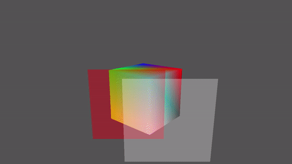
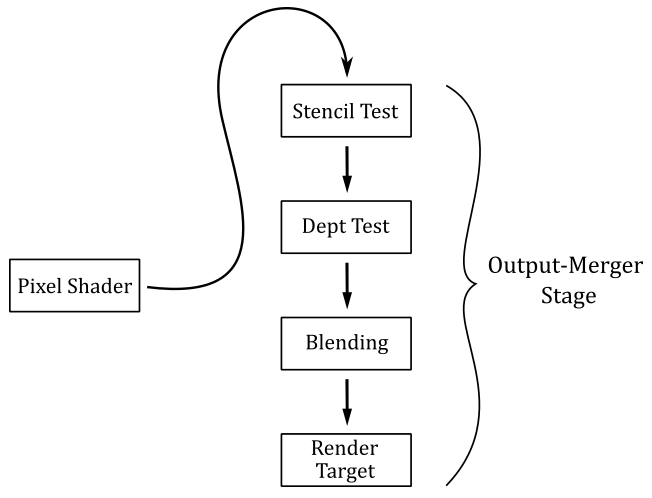
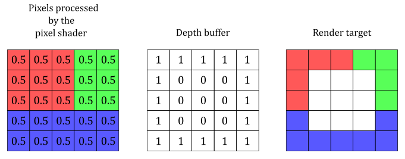
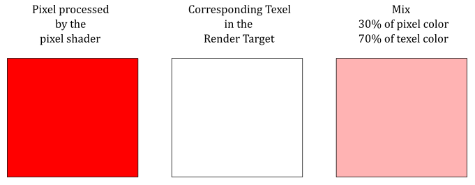

# 02.A - Blending

<br>



<br>

# 1 - Introduction

As we know, the per-pixel data returned by the pixel shader could be stored in the corresponding texel of the render target. It's up to the last stage of the pipeline, the Output-Merger, to decide if and how the per-pixel data is stored in the render target by using a combination of pipeline state, the per-pixel data returned by the pixel shader, the content of the render target, and the content of the depth-stencil buffer. Basically, the output merger performs two tasks:

- It can run a couple of tests (if enabled) on the pixels processed (and not discarded) by the pixel shader. The results of these tests determine if a pixel can continue on its path toward the end of the rendering pipeline, so that the related per-pixel data can be stored in the render target.

- It can overwrite the old data in the render target with the per-pixel data of the pixel processed by the pixel shader, or it can blend\combine these two values in some way. This defines how the per-pixel data should be stored.

<br>



<br>

We already enabled and used the depth test in a previous tutorial (**01.G - Hello Transformations**). In the next section we will cover the theory behind depth testing and blending in depth, then we will present the source code of a sample that enables both depth testing and blending to draw transparent objects.<br>
We will cover the stencil testing in the next tutorial. This is because implementing visual effects with the help of the stencil test often requires more mathematical knowledge.

<br>

<br>

# 2 - The Output-Merger Stage (part 1)

The output merger stage is the final stage of the pipeline. The pixels processed, and not discarded, by the pixel shader reach the output merger stage, which determines if and how the related per-pixel data are written to the render target. In particular, depending on the information we set in the pipeline state object, the output merger establishes if a pixel should be retained or discarded, and (if retained) how the related per-pixel data should be stored in the render target.

<br>

## 2.1 - Depth Test

A depth buffer is a texture associated with the render target. That is, both should be the same size so that to each texel of the render target corresponds a texel in the depth buffer at the same position (i.e., with the same texel coordinates). The depth buffer is used to store depth information that tells the output merger how deep each visible pixel is in the scene. <br>
If the depth test is enabled, the output merger performs a test on the contents of the depth buffer on a per-pixel basis. That is, for each pixel emitted by the rasterizer that is not discarded by the pixel shader, or the stencil test (if enabled), the output merger stage uses the depth buffer to determine how the pixels of rasterized polygons occlude one another. That way, occluded pixels can be discarded from the pipeline, preventing the related data returned by the pixel shader to be stored in the render target.

<br>


<br>

As we know, pixels in render target space hold in the z-coordinate their distance from the front face of the NDC parallelepiped, which is used as a projection window (see appendix 04). In the figure above, the highlighted texel of the render target will store the color of the pixel emitted by the rasterizer for the yellow square, which occludes the pixel of the red triangle. Indeed, the value stored in the corresponding texel of the depth buffer (that is, identified by the same texel coordinates) will be the depth of the nearest pixel: in this case, the one of the yellow square. Therefore, the pixel of the triangle will be discarded if the depth test is enabled. On the other hand, if the depth test is disabled, the texel of the render target will store the color of the last pixel processed by the pixel shader because it will always overwrite whatever color is stored in that texel. That is, when the depth test is disabled, occluded pixels can't be discarded based on the depth information, and the related data will always be stored in the render target.

The depth test is performed using the following formula.

<br>

```
if (CP   CompFunc   DT)
    retain pixel
else
    discard pixel
```
<br>

where **CompFunc** is a comparison function used to evaluate the depth test,  **CP** is the current pixel (passed by the pixel shader, and processed by the output merger), and **DT** is the corresponding texel in the depth buffer.<br>
If a pixel passes the depth test, then its z-coordinate will be stored in the corresponding texel of the depth buffer. That is, the depth buffer needs to be updated to always store the depth of the nearest\visible pixels. <br>

The comparison functions available are

<br>

```cpp
typedef enum D3D12_COMPARISON_FUNC {
  D3D12_COMPARISON_FUNC_NEVER = 1,
  D3D12_COMPARISON_FUNC_LESS = 2,
  D3D12_COMPARISON_FUNC_EQUAL = 3,
  D3D12_COMPARISON_FUNC_LESS_EQUAL = 4,
  D3D12_COMPARISON_FUNC_GREATER = 5,
  D3D12_COMPARISON_FUNC_NOT_EQUAL = 6,
  D3D12_COMPARISON_FUNC_GREATER_EQUAL = 7,
  D3D12_COMPARISON_FUNC_ALWAYS = 8
} ;
```
<br>

**D3D12_COMPARISON_FUNC_NEVER** specifies the comparison never passes. That is, the comparison function always return false.

**D3D12_COMPARISON_FUNC_ALWAYS** specifies the comparison always passes. That is, the comparison function always return true.

**D3D12_COMPARISON_FUNC_LESS** specifies that if the left operand is less than the right operand, the comparison passes.

**D3D12_COMPARISON_FUNC_EQUAL** specifies that if the left operand equal the right operand, the comparison passes.

And so on.

<br>

Usually, we want the depth test enabled. Fortunately, we can enable it by setting a default depth-stencil state in the PSO with the help of **CD3DX12_DEPTH_STENCIL_DESC**, which is a wrapper around the **D3D12_DEPTH_STENCIL_DESC** structure (more on this shortly). The default depth-stencil state specifies that **D3D12_COMPARISON_FUNC_LESS** will be used as the comparison function of the depth test. This allows to discard occluded pixels, which have a normalized distance greater than the depth value stored in the related texels of the depth buffer (that store the normalized distance of the nearest\visible pixels).

The following image shows a block of pixels, with the related colors returned by the pixel shader, and their normalized distances from the front face of the NDC parallelepiped.

<br>



<br>

With a default depth-stencil state, the pixels in the center are discarded because their normalized distances are greater than the related depth values in the depth buffer.

Most of the time, the default depth-stencil state is all we need to create our graphic samples. However, sometimes we might want to set a different comparison function, or enable the stencil test (which is disabled by setting a default depth-stencil state). In that case, we need to explicitly set up the fields of the **D3D12_DEPTH_STENCIL_DESC** structure.

<br>

```cpp
typedef struct D3D12_DEPTH_STENCIL_DESC
    {
    BOOL DepthEnable;
    D3D12_DEPTH_WRITE_MASK DepthWriteMask;
    D3D12_COMPARISON_FUNC DepthFunc;
    BOOL StencilEnable;
    UINT8 StencilReadMask;
    UINT8 StencilWriteMask;
    D3D12_DEPTH_STENCILOP_DESC FrontFace;
    D3D12_DEPTH_STENCILOP_DESC BackFace;
    } 	D3D12_DEPTH_STENCIL_DESC;
```
<br>

**DepthEnable** specifies whether to enable the depth test. Set this field to TRUE to enable depth testing.

**DepthWriteMask** specifies whether write operations are allowed on the depth buffer. If you pass **D3D12_DEPTH_WRITE_MASK_ZERO** the depth buffer won't be updated with the depth values of the pixels that pass the depth test. If you pass **D3D12_DEPTH_WRITE_MASK_ALL** the depth buffer will be updated with the depth values of the pixels that pass the depth test. Disabling write operations on the depth buffer can be useful for implementing certain special effects.

**DepthFunc** specifies the comparison function used in the depth test. We have already examined the **D3D12_COMPARISON_FUNC** structure.

**StencilEnable** specifies whether to enable the stencil test. Set this field to TRUE to enable stencil testing.

The remaining fields are used to set up the stencil test, which will be explained in the next tutorial.

<br>

<br>

## 2.2 - Blending

For each pixel emitted by the rasterizer that is not discarded by either the pixel shader or one between stencil and depth tests (if enabled), the output merger stage can combine its per-pixel data with related value stored in the render target. Most of the time blending is used to combine colors, so we will focus on this type of per-pixel data.

<br>



<br>

The illustration above shows an example of how the output merger can combine the color returned by the pixel shader with the color stored in the render target at the same position.

Blending is performed using the following formula.

<br>

$$(\mathbf{C}_ {s} \otimes \mathbf{F}_ {s})\ \oplus\ (\mathbf{C}_ {d} \otimes \mathbf{F}_ {d}) \tag{1}$$

<br>

where $\mathbf{C} _s$ is the color of the source (i.e., the color returned by the pixel shader), and $\mathbf{C} _d$ is the color of the destination (the color stored in the render target). In other words, $\mathbf{C} _s$ is a vector that holds the RGB components of the color of the current pixel, while $\mathbf{C} _d$ is a vector that holds the RGB components of the color stored in the related texel of the render target.<br>
$\mathbf{F} _s$ and $\mathbf{F} _s$ are called blend factors, and can be used to modulate $\mathbf{C} _s$ and $\mathbf{C} _d$. The $\otimes$ operator specifies the product of two vectors performed component by component. That is, 

<br>

$\mathbf{c}=\mathbf{a}\otimes \mathbf{b}=(a_xb_x,\ a_yb_y,\ a_zb_z)$

<br>

So, for example, if you want to blend the original source and destination colors without modulating their RGB components, you can set both blend factors to $(1, 1, 1)$. <br>
As you may have noticed, equation $(1)$ only blends the RGB channels. And indeed, to blend the alpha channel a separate formula is used.

<br>

$$A_s \ F_s\ \oplus\ A_d \ F_d \tag{2}$$

<br>

However, blending the alpha channel is not that common. That is, usually we can set whatever scalar value for both $F_s$ and $F_d$, as we don't care about the alpha channel stored in the render target (more on this in the next section, when we will examine the source code of the sample). Observe that when we modulate the source and destination colors with the blend factors, the original values don't change. That is, $(\mathbf{C} _s \otimes \mathbf{F} _s)$ doesn't change $\mathbf{C} _s$, as well as $(A_s \ F_s)$ doesn't change $A_s$. The same applies to $\mathbf{C} _d$ and $A_d$.

>The output merger can also blend the source and destination colors using a logic operator instead of the traditional blending equations above. Observe that we cannot use the traditional blending and logic operator blending at the same time. Also, logic operators can be applied only to render targets with an integer format. That is, if you are using a render target with a floating-point or an sRGB format, you cannot use logic operator blending. Therefore, we are not interested in looking into logic operator blending right now. 

In both equations $(1)$ and $(2)$, the $\oplus$ operator has a left operand and a right operand, and can represent one of the following operations.

<br>

```cpp
typedef enum D3D12_BLEND_OP {
  D3D12_BLEND_OP_ADD = 1,
  D3D12_BLEND_OP_SUBTRACT = 2,
  D3D12_BLEND_OP_REV_SUBTRACT = 3,
  D3D12_BLEND_OP_MIN = 4,
  D3D12_BLEND_OP_MAX = 5
} ;
```
<br>

**D3D12_BLEND_OP_ADD** specifies to add the operands.

**D3D12_BLEND_OP_SUBTRACT** specifies to subtract the left operand from the right operand.

**D3D12_BLEND_OP_REV_SUBTRACT** specifies to subtract the right operand from the left operand.

**D3D12_BLEND_OP_MIN** and **D3D12_BLEND_OP_MAX** return the minimum and maximum between the two operands, respectively.

<br>

To enable blending, and set the required parameters, we need to set the blend state, which is part of the pipeline state object.

<br>

```cpp
typedef struct D3D12_BLEND_DESC
    {
    BOOL AlphaToCoverageEnable;
    BOOL IndependentBlendEnable;
    D3D12_RENDER_TARGET_BLEND_DESC RenderTarget[ 8 ];
    } 	D3D12_BLEND_DESC;
```
<br>

**AlphaToCoverageEnable** specifies whether to use alpha-to-coverage as a multisampling technique when setting a pixel to a render target. That is, if you use an MSAA render target, and set this field to TRUE, the alpha channel of a pixel will indicate the percentage of subpixels covered by a primitive. This information can be used to combine the colors of the pixels with the values stored in the related texels of the render target, even without enabling blending. We will return to this in a later tutorial.

**IndependentBlendEnable** specifies whether to enable independent blending in simultaneous render targets. Set to TRUE to enable independent blending. If set to FALSE, only the RenderTarget[0] members are used; RenderTarget[1..7] are ignored.

**RenderTarget** is an array of **D3D12_RENDER_TARGET_BLEND_DESC** structures that describe the blend states for render targets; these correspond to the eight render targets that can be bound to the output-merger stage at one time.

<br>

```cpp
typedef struct D3D12_RENDER_TARGET_BLEND_DESC
    {
    BOOL BlendEnable;
    BOOL LogicOpEnable;
    D3D12_BLEND SrcBlend;
    D3D12_BLEND DestBlend;
    D3D12_BLEND_OP BlendOp;
    D3D12_BLEND SrcBlendAlpha;
    D3D12_BLEND DestBlendAlpha;
    D3D12_BLEND_OP BlendOpAlpha;
    D3D12_LOGIC_OP LogicOp;
    UINT8 RenderTargetWriteMask;
    } 	D3D12_RENDER_TARGET_BLEND_DESC;
```
<br>

**BlendEnable** specifies whether to enable blending. Set to TRUE to enable blending.

**LogicOpEnable** specifies whether to enable a logical operator blending. Set to TRUE to enable a logical operation.

**SrcBlend** is a **D3D12_BLEND**-typed value that specifies the operation to perform on the RGB value that the pixel shader outputs. That is, it is the blend factor $\mathbf{F} _s$.

**DestBlend** is a **D3D12_BLEND**-typed value that specifies the operation to perform on the current RGB value stored in the render target. That is, it is the blend factor $\mathbf{F} _d$.

**BlendOp** is a **D3D12_BLEND_OP**-typed value that defines how to combine **SrcBlend** and **DestBlend**. That is, it is the $\oplus$ operator in equation $(1)$.

**SrcBlendAlpha** is a **D3D12_BLEND**-typed value that specifies the operation to perform on the alpha value that the pixel shader outputs. That is, it is the alpha blend factor $F_s$. Blend options that end in _COLOR are not allowed.

**DestBlendAlpha** is a **D3D12_BLEND**-typed value that specifies the operation to perform on the current alpha value in the render target. That is, it is the alpha blend factor $F_d$. Blend options that end in _COLOR are not allowed.

**BlendOpAlpha** is a **D3D12_BLEND_OP**-typed value that defines how to combine **SrcBlendAlpha** and **DestBlendAlpha**. That is, it is the $\oplus$ operator in equation $(2)$.

**LogicOp** is a **D3D12_LOGIC_OP**-typed value that the logic operator to use for blending the source and destination colors (see the Microsoft documentation for more details on the **D3D12_LOGIC_OP** enumeration).

**RenderTargetWriteMask** is a flag built from the combination of one or more values defined in the **D3D12_COLOR_WRITE_ENABLE** enumeration. The resulting value specifies a write mask that controls which color channels in the texels of the render target are written to after blending. In particular, the RGBA channels correspond to the bit positions 0, 1, 2, and 3 of the mask. When a bit is set, the related channel is written to the render target. For example, we could disable writes to the entire render target by setting this flag to zero. This flexibility allows to implement advanced techniques. However, usually we will pass **D3D12_COLOR_WRITE_ENABLE_ALL**, that specifies we don't want to mask any color channel.

<br>

```cpp
typedef 
enum D3D12_BLEND
    {
        D3D12_BLEND_ZERO	= 1,
        D3D12_BLEND_ONE	= 2,
        D3D12_BLEND_SRC_COLOR	= 3,
        D3D12_BLEND_INV_SRC_COLOR	= 4,
        D3D12_BLEND_SRC_ALPHA	= 5,
        D3D12_BLEND_INV_SRC_ALPHA	= 6,
        D3D12_BLEND_DEST_ALPHA	= 7,
        D3D12_BLEND_INV_DEST_ALPHA	= 8,
        D3D12_BLEND_DEST_COLOR	= 9,
        D3D12_BLEND_INV_DEST_COLOR	= 10,
        D3D12_BLEND_SRC_ALPHA_SAT	= 11,
        D3D12_BLEND_BLEND_FACTOR	= 14,
        D3D12_BLEND_INV_BLEND_FACTOR	= 15,
        D3D12_BLEND_SRC1_COLOR	= 16,
        D3D12_BLEND_INV_SRC1_COLOR	= 17,
        D3D12_BLEND_SRC1_ALPHA	= 18,
        D3D12_BLEND_INV_SRC1_ALPHA	= 19
    } 	D3D12_BLEND;
```
<br>

**D3D12_BLEND_ZERO** specifies the blend factor is $(0, 0, 0, 0)$. That is, $\mathbf{F} _{s/d}=(0, 0, 0)$ and $A _{s/d}=0$.

**D3D12_BLEND_ONE** specifies the blend factor is $(1, 1, 1, 1)$. That is, $\mathbf{F} _{s/d}=(1, 1, 1)$ and $A _{s/d}=1$.

**D3D12_BLEND_SRC_COLOR** specifies the blend factor is $(\mathbf{C} _s, A_s)=(R_s, G_s, B_s, A_s)$. That is, $\mathbf{F} _{s/d}=(R_s, G_s, B_s)$ and $A _{s/d}=A_s$.

**D3D12_BLEND_INV_SRC_COLOR** specifies the blend factor is $(1-R_s,\ 1-G_s,\ 1-B_s,\ 1-A_s)$.

**D3D12_BLEND_SRC_ALPHA** specifies the blend factor is $(A_s, A_s, A_s, A_s)$.

**D3D12_BLEND_INV_SRC_ALPHA** specifies the blend factor is $(1-A_s,\ 1-A_s,\ 1-A_s,\ 1-A_s)$.

**D3D12_BLEND_DEST_ALPHA** specifies the blend factor is $(A_d, A_d, A_d, A_d)$.

**D3D12_BLEND_INV_DEST_ALPHA** specifies the blend factor is $(1-A_d,\ 1-A_d,\ 1-A_d,\ 1-A_d)$.

**D3D12_BLEND_DEST_COLOR** specifies the blend factor is $(\mathbf{C} _d, A_d)=(R_d, G_d, B_d, A_d)$.

**D3D12_BLEND_INV_DEST_COLOR** specifies the blend factor is $(1-R_d,\ 1-G_d,\ 1-B_d,\ 1-A_d)$.

**D3D12_BLEND_SRC_ALPHA_SAT** specifies the blend factor is $(A', A', A', 1)$, where $A'=min(A_s,\ 1-A_d)$.

**D3D12_BLEND_BLEND_FACTOR** specifies the blend factor will be set with **ID3D12GraphicsCommandList::OMSetBlendFactor**.

**D3D12_BLEND_INV_BLEND_FACTOR** specifies the blend factor is built inverting the values passed to **ID3D12GraphicsCommandList::OMSetBlendFactor**.

See the Microsoft documentation for the meaning of the remaining enumerators.

<br>

<br>

# 3 - D3D12Blending: code review

Having explored the theory in depth, it's pretty easy to present the code of a sample that enables blending in order to draw transparent objects. In particular, **D3D12Blending** draws a cube behind two transparent quads. We will use alpha blending to draw the quads. This means we will use the alpha channel of the colors returned by the pixel shader to establish the transparency of the related pixels (more on this shortly). 

>Observe that blending requires to draw opaque objects first, then transparent objects must be drawn in decreasing order of distance from the camera. This is because transparent objects need to show what's behind them, and blending works combining the color of a pixel with the color stored in the related texel of the render target. That is, when you draw a transparent object, the render target must already contain the colors of the objects behind it. We will see how to get round this restriction in later tutorials.

The code of the sample is similar to what we have seen in the previous tutorials, so we will only focus on what's new.

<br>

```cpp
// Load the sample assets.
void D3D12Blending::LoadAssets()
{

    // ...


    // Create the Pipeline State Object for drawing opaque objects
    {
        D3D12_GRAPHICS_PIPELINE_STATE_DESC psoDesc = {};
        psoDesc.InputLayout = { inputElementDescs, _countof(inputElementDescs) };
        psoDesc.pRootSignature = m_rootSignature.Get();
        psoDesc.VS = CD3DX12_SHADER_BYTECODE(vertexShader.Get());
        psoDesc.PS = CD3DX12_SHADER_BYTECODE(pixelShader.Get());
        psoDesc.RasterizerState = CD3DX12_RASTERIZER_DESC(D3D12_DEFAULT);
        psoDesc.BlendState = CD3DX12_BLEND_DESC(D3D12_DEFAULT);
        psoDesc.DepthStencilState = CD3DX12_DEPTH_STENCIL_DESC(D3D12_DEFAULT);
        psoDesc.DSVFormat = DXGI_FORMAT_D32_FLOAT;
        psoDesc.SampleMask = UINT_MAX;
        psoDesc.PrimitiveTopologyType = D3D12_PRIMITIVE_TOPOLOGY_TYPE_TRIANGLE;
        psoDesc.NumRenderTargets = 1;
        psoDesc.RTVFormats[0] = DXGI_FORMAT_R8G8B8A8_UNORM;
        psoDesc.SampleDesc.Count = 1;
        ThrowIfFailed(m_device->CreateGraphicsPipelineState(&psoDesc, IID_PPV_ARGS(m_defaultPipelineState)));
    }

    // Create the Pipeline State Object for drawing transparent objects
    {
        // Use alpha blending
        CD3DX12_BLEND_DESC blendDesc(D3D12_DEFAULT);
        blendDesc.RenderTarget[0].BlendEnable = TRUE;
        blendDesc.RenderTarget[0].SrcBlend = D3D12_BLEND_SRC_ALPHA;
        blendDesc.RenderTarget[0].DestBlend = D3D12_BLEND_ONE;
        blendDesc.RenderTarget[0].BlendOp = D3D12_BLEND_OP_ADD; // set by the default state, so you can omit it.

        D3D12_GRAPHICS_PIPELINE_STATE_DESC psoDesc = {};
        psoDesc.InputLayout = { inputElementDescs, _countof(inputElementDescs) };
        psoDesc.pRootSignature = m_rootSignature.Get();
        psoDesc.VS = CD3DX12_SHADER_BYTECODE(vertexShader.Get());
        psoDesc.PS = CD3DX12_SHADER_BYTECODE(solidColorPS.Get());
        psoDesc.RasterizerState = CD3DX12_RASTERIZER_DESC(D3D12_DEFAULT);
        psoDesc.BlendState = blendDesc;
        psoDesc.DepthStencilState = CD3DX12_DEPTH_STENCIL_DESC(D3D12_DEFAULT);
        psoDesc.DSVFormat = DXGI_FORMAT_D32_FLOAT;
        psoDesc.SampleMask = UINT_MAX;
        psoDesc.PrimitiveTopologyType = D3D12_PRIMITIVE_TOPOLOGY_TYPE_TRIANGLE;
        psoDesc.NumRenderTargets = 1;
        psoDesc.RTVFormats[0] = DXGI_FORMAT_R8G8B8A8_UNORM;
        psoDesc.SampleDesc.Count = 1;
        ThrowIfFailed(m_device->CreateGraphicsPipelineState(&psoDesc, IID_PPV_ARGS(m_blendingPipelineState)));
    }


    // ...

}
```
<br>

We need two PSOs: one for drawing opaque objects (in this case the cube), and the other for drawing transparent objects (the two quads).<br>
The PSO for drawing opaque objects specifies a default behaviour for most of the states (rasterizer, blending, and depth-stencil), and a pixel shader that returns the intermediate pixel color computed by the rasterizer from the vertex attributes.<br>
The PSO for drawing transparent objects enables blending, and uses a pixel shader returning the color specified in a constant buffer, so that the quads will be rendered with a solid (transparent) color.

The **CD3DX12_BLEND_DESC** structure is a wrapper around **D3D12_BLEND_DESC** which allows to set a default blend state for the eight render targets that can be bound to the output-merger stage at one time. The default blend state disables both traditional blending and logic operator blending.<br>
To implement alpha blending we set **SrcBlend** to **D3D12_BLEND_SRC_ALPHA**, and **DestBlend** to **D3D12_BLEND_INV_SRC_ALPHA**, so that the source alpha defines how transparent the current pixel is, and how much background it shows as well. For example, if the current pixel alpha is $0.3$, we use this value in equation $(1)$ to get a $30\%$ of the RGB components of the pixel color, and a $70\%$ of the color stored in the related texel of the render target. To combine source and destination we will use a sum (set by the default blend state as the blend operation) because we need to see both the source and destination colors.<br>
Observe that we only set the blend state of first render target (index 0) because we will bind a single render taget to the output-merger stage (see the call to **OMSetRenderTargets** in **PopulateCommandList**).

>We don't care about combining the alpha channels of source and destination colors because we won't use the alpha channel stored in the texels of the render target. Therefore, we can leave **SrcBlendAlpha**, **DestBlendAlpha**, and **BlendOpAlpha** to the values set by the default state.

<br>

Now we can see what happens in **PopulateCommandList**.

```cpp
void D3D12Blending::PopulateCommandList()
{
    // Command list allocators can only be reset when the associated 
    // command lists have finished execution on the GPU; apps should use 
    // fences to determine GPU execution progress.
    ThrowIfFailed(m_commandAllocators[m_frameIndex]->Reset());

    // However, when ExecuteCommandList() is called on a particular command 
    // list, that command list can then be reset at any time and must be before 
    // re-recording.
    ThrowIfFailed(m_commandList->Reset(m_commandAllocators[m_frameIndex].Get(), m_defaultPipelineState.Get()));

    // Set necessary state.
    m_commandList->SetGraphicsRootSignature(m_rootSignature.Get());
    m_commandList->RSSetViewports(1, &m_viewport);
    m_commandList->RSSetScissorRects(1, &m_scissorRect);

    // Index into the available constant buffers based on the number
    // of draw calls. We've allocated enough for a known number of
    // draw calls per frame times the number of back buffers
    unsigned int constantBufferIndex = c_numDrawCalls * (m_frameIndex % FrameCount);

    // Set the per-frame constants
    ConstantBuffer cbParameters = {};

    // Shaders compiled with default row-major matrices
    cbParameters.worldMatrix = XMMatrixTranspose(XMLoadFloat4x4(&m_worldMatrix));
    cbParameters.viewMatrix = XMMatrixTranspose(XMLoadFloat4x4(&m_viewMatrix));
    cbParameters.projectionMatrix = XMMatrixTranspose(XMLoadFloat4x4(&m_projectionMatrix));

    // Set the constants for the first draw call
    memcpy(&m_mappedConstantData[constantBufferIndex], &cbParameters, sizeof(ConstantBuffer));

    // Bind the constants to the shader
    auto baseGpuAddress = m_constantDataGpuAddr + sizeof(PaddedConstantBuffer) * constantBufferIndex;
    m_commandList->SetGraphicsRootConstantBufferView(0, baseGpuAddress);

    // Indicate that the back buffer will be used as a render target.
    m_commandList->ResourceBarrier(1, &CD3DX12_RESOURCE_BARRIER::Transition(m_renderTargets[m_frameIndex].Get(), D3D12_RESOURCE_STATE_PRESENT, D3D12_RESOURCE_STATE_RENDER_TARGET));

    CD3DX12_CPU_DESCRIPTOR_HANDLE rtvHandle(m_rtvHeap->GetCPUDescriptorHandleForHeapStart(), m_frameIndex, m_rtvDescriptorSize);
    CD3DX12_CPU_DESCRIPTOR_HANDLE dsvHandle(m_dsvHeap->GetCPUDescriptorHandleForHeapStart());
    m_commandList->OMSetRenderTargets(1, &rtvHandle, FALSE, &dsvHandle);

    // Clear the render target and depth buffer
    const float clearColor[] = { 0.33f, 0.33f, 0.33f, 1.0f };
    m_commandList->ClearRenderTargetView(rtvHandle, clearColor, 0, nullptr);
    m_commandList->ClearDepthStencilView(dsvHandle, D3D12_CLEAR_FLAG_DEPTH, 1.0f, 0, 0, nullptr);

    // Set up the input assembler
    m_commandList->IASetPrimitiveTopology(D3D_PRIMITIVE_TOPOLOGY_TRIANGLELIST);
    m_commandList->IASetVertexBuffers(0, 1, &m_vertexBufferView);
    m_commandList->IASetIndexBuffer(&m_indexBufferView);

    // Draw the cube
    m_commandList->DrawIndexedInstanced(36, 1, 0, 0, 0);
    baseGpuAddress += sizeof(PaddedConstantBuffer);
    ++constantBufferIndex;

    // Draw the quads
    m_commandList->SetPipelineState(m_blendingPipelineState.Get());

    for (int m = 0; m < 2; ++m)
    {
        // Compute the World matrix of the quads
        XMMATRIX scaleMatrix = XMMatrixScaling(2.0f, 2.0f, 2.0f);
        XMMATRIX rotationMatrix = XMMatrixRotationX(-XM_PIDIV2);
        // Translation to order quads in decreasing order of distance from the camera.
        // Set OffsetZ = (-5.0f + (m * 2)) to draw quads in reverse order.
        XMMATRIX translateMatrix = XMMatrixTranslation((-1.0f + (m * 2)), 1.0f, (-3.0f - (m * 2)));

        // Update world matrix and output color.
        cbParameters.worldMatrix = XMMatrixTranspose(rotationMatrix * (scaleMatrix * translateMatrix));
        cbParameters.outputColor = (m == 0) ? XMFLOAT4(1.0f, 0.0f, 0.0f, 0.4f) : XMFLOAT4(1.0f, 1.0f, 1.0f, 0.3f);

        // Set the constants for the draw call
        memcpy(&m_mappedConstantData[constantBufferIndex], &cbParameters, sizeof(ConstantBuffer));

        // Bind the constants to the shader
        m_commandList->SetGraphicsRootConstantBufferView(0, baseGpuAddress);

        // Draw a quad.
        m_commandList->DrawIndexedInstanced(6, 1, 0, 0, 0);
        baseGpuAddress += sizeof(PaddedConstantBuffer);
        ++constantBufferIndex;
    }

    // Indicate that the back buffer will now be used to present.
    m_commandList->ResourceBarrier(1, &CD3DX12_RESOURCE_BARRIER::Transition(m_renderTargets[m_frameIndex].Get(), D3D12_RESOURCE_STATE_RENDER_TARGET, D3D12_RESOURCE_STATE_PRESENT));

    ThrowIfFailed(m_commandList->Close());
}
```
<br>

We reset the command list, using **m_defaultPipelineState** as the associated PSO for drawing opaque objects. In this case we only have a single cube which is fully opaque.<br>

After drawing the cube, we set **m_blendingPipelineState** on the command list as the PSO for drawing transparent objects. In this case we have two transparent quads that we need to sort and draw in decreasing order of distance from the camera in order to see what's behind them. On this point, see what happens if you change the last argument passed to **XMMatrixTranslation** to draw quads in reverse order. If you draw the closer quad first, it will occlude the quad behind it, which won't pass the depth test (that is, it will be discarded from the pipeline). 

Observe that to draw the quads we use the same vertex and index buffers describing the cube. This is possible because the faces of a cube can be considered quads. Indeed, we use the first six indices of the index buffer to select the first two triangles of the top face of the cube described by the vertex buffer. To make sure the normal of the top quad is facing towards the camera, we need to counterclockwise rotate the quad by $90°$ (that is, we need to rotate its vertices by $-90°$; see appendix 03 for more details).

<br>

<br>

Source code: [LearnDirectX](https://github.com/PAMinerva/LearnDirectX)

<br>

# References

[1] Introduction to 3D Game Programming with DirectX 12 (Luna) <br>
[2] Microsoft online documentation

<br>

***
If you found the content of this tutorial somewhat useful or interesting, please consider supporting this project by clicking on the **Sponsor** button.  Whether a small tip, a one time donation, or a recurring payment, it's all welcome! Thank you!<br><br>
<p align="center">
 <a href="https://github.com/sponsors/PAMinerva">
         
      </a>
</p><br>