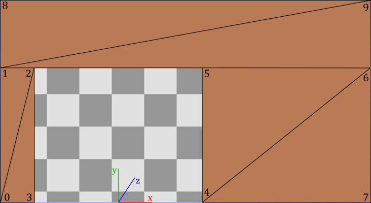

# 02.B - Stenciling

<br>


<br>

# 1 - Introduction

Stenciling is a technique for transferring a pattern to a surface by using an intermediate object with designed gaps in it which creates the pattern. 

<br>


<br>

In computer graphics, a texture called stencil buffer can be used as an intermediate object to control which pixels should continue their way along the rendering pipeline to be stored in the render target. The sample examined in this tutorial (**D3D12Stenciling**) makes use of a stencil buffer to create a reflective object (a mirror), and to cast a shadow on a planar surface, as shown in the image above. However, we first need to complete our overview of the output-merger stage.

<br>

> Nowadays, stenciling is no longer used to create reflective objects, or to implement shadowing. Of course, stenciling is still used is some advanced techniques. In any case, creating reflective objects and shadows with stenciling will allow us to practice with some of the theory presented in appendix 05. 

<br>


<br>

<br>

# 2 - The Output-Merger Stage (part 2)

In the previous tutorial we covered both depth test and blending. In this section we are concluding our investigation of the output merger by explaining the theory behind the stencil test.

<br>

## 2.1 - Stencil Test

The stencil buffer is a texture of the same size as the render target that can be considered as a mask to control whether the per-pixel data returned by the pixel shader should be stored or not in the render target depending on the outcome of a comparison between the value in the stencil buffer and a reference value. This is called stencil test, and enables applications to mask sections of the render target so that they are not displayed, allowing the implementation of special effects such as dissolves, decaling, and outlining.

<br>


<br>

The illustration above shows an example of how a stencil buffer can be used to mask the per-pixel data returned by the pixel shader: only data of pixels associated with a stencil value of 1 in the stencil buffer are stored in the render target. This is because the comparison test performed in this case checks if the stencil value equals the reference value. Indeed, if the stencil test is enabled, Direct3D performs a test on the contents of the stencil buffer on a per-pixel basis. That is, for each pixel processed (and not discarded) by the pixel shader, a test is performed using the corresponding value in the stencil buffer, a stencil reference value, and a stencil mask value. The following formula is used to perform the stencil test, where the ampersand symbol (&) represents the bitwise AND operation.

<br>

```
(StencilRef & StencilMask) CompFunc (StencilBufferValue & StencilMask)
```

<br>

**CompFunc** is the comparison function used in the stencil test. We can set a comparison function in the depth-stencil state, as part of the PSO (more on this shortly).

**StencilRef** is the stencil reference value, that can be set on the command list by calling **OMSetStencilRef**.

**StencilMask** is the value of the stencil mask, which can be set in the depth-stencil state, as part of the PSO (more on this shortly). Usually we set the stencil mask to 0xFF so that the bitwise AND operation doesn't change the original values of both **StencilRef** and **StencilBufferValue**. This allows a direct comparison is between **StencilRef** and **StencilBufferValue**.

**StencilBufferValue** is the content of the stencil buffer for the current pixel. That is, it is the value of the corresponding texel in the stencil buffer.

<br>

Usually, 1 byte is enough to represent **StencilBufferValue**, so the stencil buffer can be embedded in the depth buffer. In that case, a depth-stencil buffer is a texture of the same dimension as the render target, where each texel is a 32-bit value: the first 24 bits are used to store a depth value, while the reminder 8 bits are used to store a stencil value.

The comparison functions available are

<br>

```cpp
typedef enum D3D12_COMPARISON_FUNC {
  D3D12_COMPARISON_FUNC_NEVER = 1,
  D3D12_COMPARISON_FUNC_LESS = 2,
  D3D12_COMPARISON_FUNC_EQUAL = 3,
  D3D12_COMPARISON_FUNC_LESS_EQUAL = 4,
  D3D12_COMPARISON_FUNC_GREATER = 5,
  D3D12_COMPARISON_FUNC_NOT_EQUAL = 6,
  D3D12_COMPARISON_FUNC_GREATER_EQUAL = 7,
  D3D12_COMPARISON_FUNC_ALWAYS = 8
} ;
```
<br>

**D3D12_COMPARISON_FUNC_NEVER** specifies the comparison never passes. That is, the comparison function always return false.

**D3D12_COMPARISON_FUNC_ALWAYS** specifies the comparison always passes. That is, the comparison function always return true.

**D3D12_COMPARISON_FUNC_LESS** specifies that if the left operand is less than the right operand, the comparison passes.

**D3D12_COMPARISON_FUNC_EQUAL** specifies that if the left operand equals the right operand, the comparison passes.

And so on.

<br>

The stencil mask and the comparison function are part of the depth-stencil state, which in turn is part of the pipeline state object.

<br>

```cpp
typedef struct D3D12_DEPTH_STENCIL_DESC
    {
    BOOL DepthEnable;
    D3D12_DEPTH_WRITE_MASK DepthWriteMask;
    D3D12_COMPARISON_FUNC DepthFunc;
    BOOL StencilEnable;
    UINT8 StencilReadMask;
    UINT8 StencilWriteMask;
    D3D12_DEPTH_STENCILOP_DESC FrontFace;
    D3D12_DEPTH_STENCILOP_DESC BackFace;
    } 	D3D12_DEPTH_STENCIL_DESC;
```
<br>

**DepthEnable**, **DepthWriteMask** and **DepthFunc** are part of the depth state that we have already explained in the previous tutorial.

**StencilEnable** specifies whether to enable the stencil test. Set this field to TRUE to enable stencil testing.

**StencilReadMask** is the stencil mask. Usually we set it to 0xFF.

**StencilWriteMask** specifies a value used to mask specific bits when updating the stencil values in a stencil buffer (more on this shortly). In particular, **StencilWriteMask** is bitwise AND'ed with the stencil value used to update the related texel in the stencil buffer. Usually, we set this field to 0xFF so that all bits of a stencil value are updated.

**FrontFace** is a **D3D12_DEPTH_STENCILOP_DESC** structure that describes how to use the results of the stencil and depth tests for pixels on the front face of a primitive. That is, it specifies if and how to update the stencil values based on the results of the tests.

**BacktFace** is a **D3D12_DEPTH_STENCILOP_DESC** structure that describes how to use the results of the stencil and the depth tests for pixels on the back face of a primitive. That is, it specifies if and how to update the stencil values based on the results of the tests. If back face culling is enabled (as is usually the case when we set a default state for the rasterizer stage), this field is ignored.

<br>

```cpp
typedef struct D3D12_DEPTH_STENCILOP_DESC
    {
    D3D12_STENCIL_OP StencilFailOp;
    D3D12_STENCIL_OP StencilDepthFailOp;
    D3D12_STENCIL_OP StencilPassOp;
    D3D12_COMPARISON_FUNC StencilFunc;
    } 	D3D12_DEPTH_STENCILOP_DESC;
```
<br>

**StencilFailOp** specifies an operation used to update the stencil values in a stencil buffer when the stencil test fails.

**StencilDepthFailOp** specifies an operation used to update the stencil values in a stencil buffer when the stencil test passes and the depth test fails.

**StencilPassOp** specifies an operation used to update the stencil values in a stencil buffer when stencil test and depth test both pass.

**StencilFunc** specifies the comparison function used in the stencil test. We have already examined the **D3D12_COMPARISON_FUNC** structure.

<br>

So, we can update the stencil buffer even though the stencil test fails. Observe that the update of the stencil buffer can also depend on the result of the depth test. This means that the update of the stencil values is delayed until the depth test is completed. This is not a problem because updating the stencil buffer is secondary to the stencil test itself, which can discard pixels, preventing the related data returned by the pixel shader to be stored in the render target.

The update operations available are

<br>

```cpp
typedef 
enum D3D12_STENCIL_OP
    {
        D3D12_STENCIL_OP_KEEP	= 1,
        D3D12_STENCIL_OP_ZERO	= 2,
        D3D12_STENCIL_OP_REPLACE	= 3,
        D3D12_STENCIL_OP_INCR_SAT	= 4,
        D3D12_STENCIL_OP_DECR_SAT	= 5,
        D3D12_STENCIL_OP_INVERT	= 6,
        D3D12_STENCIL_OP_INCR	= 7,
        D3D12_STENCIL_OP_DECR	= 8
    } 	D3D12_STENCIL_OP;
```
<br>

**D3D12_STENCIL_OP_KEEP** specifies to keep the existing stencil value.

**D3D12_STENCIL_OP_ZERO** specifies to set the stencil value to 0.

**D3D12_STENCIL_OP_REPLACE** specifies to replace the stencil value with the stencil reference value set with **ID3D12GraphicsCommandList::OMSetStencilRef**.

**D3D12_STENCIL_OP_INCR_SAT** specifies to increment the stencil value by 1, and clamp the result. For stencil values of 1 byte, 255 is the maximum value that can be reached, which remains 255 even if incremented.

**D3D12_STENCIL_OP_DECR_SAT** specifies to decrement the stencil value by 1, and clamp the result. For stencil values of 1 byte, 0 is the minimum value that can be reached, which remains 0 even if decremented.

**D3D12_STENCIL_OP_INVERT** specifies to invert the bits of the stencil value.

**D3D12_STENCIL_OP_INCR** specifies to increment the stencil value by 1, and wrap the result if necessary. For stencil values of 1 byte, 255 is the maximum value that can be reached, which becomes 0 if incremented.

**D3D12_STENCIL_OP_DECR** specifies to decrement the stencil value by 1, and wrap the result if necessary. For stencil values of 1 byte, 0 is the minimum value that can be reached, which becomes 255 if decremented.

<br>

<br>

# 3 - D3D12Stenciling: code review

Compared with the samples of previous tutorials, here we have more objects to draw, and different PSOs to use. Also, since some of these PSOs enable blending, depth and/or stencil tests, we also need to draw objects in steps.

<br>

>The application framework we are using is ideal for drawing few objects. If you have several objects to draw (potentially hundreds, or even thousands of meshes) it's better to spend some of the initial time to design an application framework that allows to improve code readability and maintenance. We will return to this topic in a later tutorial.

<br>

### Step 1: draw opaque objects

First, we need to draw opaque objects because we also plan to draw transparent objects, which need to show objects behind them. In this case we only have three opaque objects in the scene: a wall, a floor, and a cube.

<br>


<br>

All the objects in the scene will share the same vertex and index buffers. We know how to draw cubes and quads. However, in this case we also need to draw a wall leaving some space for the mirror. We can create such geometry with only 10 vertices and 12 indices to select the six triangles composing it, as illustrated in the following image.

<br>



<br>

### Step 2: create a mask on the stencil buffer

To draw objects reflected by a mirror (more on this in the next step) we will use a simple trick: we can consider them as opaque objects reflected (translated) with respect to the mirror, as illustrated in the following image (see appendix 05 for more details).

<br>


<br>

However, suppose our scene consists of two rooms separated by a wall with a mirror. If we use the method explained above to draw objects reflected by the mirror, the trick will be exposed by entering the other room, as illustrated in the following image.

<br>


<br>

Here the problem is that we should see reflected object through the mirror only. Fortunately, we can use stenciling to achieve this result.

<br>


<br>

In particular, we can draw the mirror on the stencil buffer (from the point of view of the camera) to create a mask to be used to draw reflected objects. The following image shows both the render target (on the left) and stencil buffer (on the right) after the second step. Observe that the green color used to mark the mirror in the stencil buffer is only to visually show its state. In fact, a stencil buffer usually stores integer values in its texels as stencil values instead of colors.

<br>


<br>

To create our mask in the stencil buffer we first need to enable the stencil test by setting a depth-stencil state in the PSO. Then, we can specify that if a pixel of the mirror passes both stencil and depth tests, the stencil value stored in the corresponding texel of the stencil buffer must be updated from 0 to 1 (assuming that the stencil buffer has been already cleared to zero). <br>
Observe that the depth test also needs to be enabled because the mask should exclude non-visible objects reflected in the mirror. However, we must disable writes to the depth buffer so that we will able to draw reflected objects on the render target in the next step (otherwise they won't pass the depth test).<br>
We also need to disable writes to the render target since we are drawing on the stencil buffer. There are multiple ways to disable writes to a render target. In this case, we will set a blend state in the PSO that prevents pixel colors to be stored in the render target (more on this shortly).

<br>

### Step 3: draw reflected objects

To reflect an object with respect to a plane, we need to transform each of its vertices. For this purpose, we can take advantage of the theory exposed in appendix 05. In particular, we can multiply the world matrix associated with each opaque object rendered in step 1 by a matrix that reflects with respect to the mirror plane. The resultant matrix still represents a world transformation that can be used to reflect both vertices and normals of opaque objects in the vertex shader.

<br>


<br>

>**DirectXMath** provides the helper function **XMMatrixReflect**, which takes the coefficients of the equation of a plane in input, and returns the matrix of reflection with respect to that plane.

<br>


<br>


<br>

Please note that after reflecting meshes with respect to a plane, outer (front) faces become inner (back) faces, and vice versa, even though we reflect normals. That is, reflecting objects with respect to a plane, the winding order of the vertices is reversed, as shown in the images above. Therefore, we must draw the back faces of reflected objects to fix the problem. 

At this point we can draw the reflected object by using the mask in the stencil buffer created in step 2. In particular, we will draw pixel colors on the render target only if the corresponding texel in the stencil buffer equals the stencil reference value. This means that before drawing we must set the stencil reference value to the same value of the texels where we rendered the mirror in the stencil buffer in the previous step. In this case, we must set the stencil reference value to 1.

<br>

>Observe that mirrors reflect light as well. This means that we should reflect light directions to include additional light sources illuminating the faces of the objects reflected by the mirror. However, this won't affect the image reflected by the mirror because we can use the original light directions to illuminate the reflected objects, as shown in the following illustration.
>
><br>
>
>
>
><br>
>
>As you can see, we can use the original light direction to illuminate $\mathbf{p}'$, the reflection of $\mathbf{p}$. However, if the camera aimed at $\mathbf{p}$ directly, we would notice a mismatching between the incoming lights reaching $\mathbf{p}$ and $\mathbf{p}'$.
>
><br>
>
>
>
><br>
>
>In **D3D12Stenciling** we can't move the camera yet. Therefore, we can get by without reflect light directions.

<br>

### Step 4: draw planar shadows

In this sample the cube cast a shadow on the floor. 

<br>


<br>

To draw a planar shadow we can project the cube onto the floor from the point of view of the light source. In this case we have a directional light, so we need to project along the light direction, as illustrated on the right of the image below. A triangle projected onto a plane is always a triangle (provided that the normals to the triangle and to the plane are not perpendicular to each other). Therefore, we can use the projected cube as a new mesh to render on the screen as a shadow.

<br>


<br>

To project vertices onto a plane, we can take advantage of the theory exposed in appendix 05. In particular, we can multiply the world matrix associated with the cube by a matrix that project onto the floor. The resultant matrix still represents a world transformation that can be used to project the vertices of the cube in the vertex shader.

<br>

>**DirectXMath** provides the helper function **XMMatrixShadow**, which takes the coefficients of the equation of a plane and the light position in input, and returns the matrix of projection onto that plane with respect to the light source. 

<br>

Observe that we need to offset the shadow over the floor by a small amount to prevent z-fighting, where pixels with similar depth values compete to be visible due to the limited precision of the depth buffer (this can lead to annoying flickering artifacts). Solved the z-fighting, we can set a solid black color for the shadow mesh, and use alpha blending to make it transparent.

In the image below, we can see that a cube projected onto a plane never shows overlapping triangles if face culling is enabled in the rasterizer. That is, if you cull back face triangles, front ones won't overlap (as you can see on the left). The same applies if you want to draw back face triangles, culling front ones (as you can see on the right). 

<br>


<br>

However, projection of complex meshes can show overlapping triangles, which results in multiple blending, as illustrated in the image below (on the left). That is, the transparent black color of overlapping triangles is blended multiple times, resulting in annoying artifacts. <br>
Planar shadows can also lead to out of bounds shadows, as illustrated in the middle of the image below. Here the problem is that we are not calculating the projection onto a planar limited surface, but onto a plane (which has no bounds).<br>
Moreover, if a light source is between a mesh and the plane of projection, we can get fake shadows, as illustrated on the right of the following image.

<br>


<br>

Both multiple blending and out of bound shadows can be solved with stenciling again. On the other hand, we can prevent fake shadows by checking if the distance of the light source from the plane is greater than the distance of the mesh.

Remember that we hardly use stenciling to implement shadows in modern graphics applications. However, in the source code of the sample, we are going to fix multiple blending to show another use case for the stencil test. In particular, we can set the stencil test so that only one pixel passes through. For this purpose, we can specify that a pixel passes the stencil test only if the corresponding texel in the stencil buffer equals the stencil reference value. Also, we can specify that if the pixel also passes the depth buffer, the stencil value in the corresponding texel of the stencil buffer is incremented so that no other pixels can pass the stencil test later (that is, they will be discarded). <br>
Let's take a practical example. The state of the stencil buffer after step 3 is the one illustrated in the image below (on the left). All stencil values are zeros except the ones where we have drawn the mirror in step 2, which are all 1.

<br>


<br>

Therefore, we set the stencil reference value to zero, and the stencil operation to EQUAL, so that the pixels of the shadow are only rendered if the corresponding stencil values are zeros. If a pixel also passes the depth buffer, we increment the corresponding stencil value so that no other pixel of the shadow mesh will pass the stencil test later, preventing any overlap of the same area, as illustrated in the image above (on the right).<br>
Observe that the depth test can be enabled because the mask can exclude non-visible pixels of the shadow. However, this time we don't disable writes to the depth buffer and render target because we are using the stencil buffer as a live pass-through to draw on the render target.<br>

To draw the shadow reflected in the mirror, we first need to multiply the world matrix of the cube projected onto the floor by the matrix of reflection with respect to the mirror that we have already calculated in step 3. Then, we can use stenciling again to prevent multiple blending. For this purpose, we need to update the stencil reference value to 1 because the pixels of the reflected shadow take up the same area of the mirror in the stencil buffer, where the stencil values are all 1 already.

<br>

### Step 5: draw the mirror

In the last step we draw the mirror as a transparent quad.

<br>


<br>

<br>

At this point the source code of the sample should be self-explanatory. <br>
The application class includes the PSOs used to draw all the objects in the scene.

<br>

```cpp
class D3D12Stenciling : public DXSample
{
public:
    D3D12Stenciling(UINT width, UINT height, std::wstring name);

    virtual void OnInit();
    virtual void OnUpdate();
    virtual void OnRender();
    virtual void OnDestroy();

private:

    static const UINT FrameCount = 2;

    // Vertex attributes
    struct Vertex
    {
        XMFLOAT3 position;
        XMFLOAT3 normal;
    };

    // Constant buffer
    struct ConstantBuffer
    {
        XMFLOAT4X4 worldMatrix;        // 64 bytes
        XMFLOAT4X4 viewMatrix;         // 64 bytes
        XMFLOAT4X4 projectionMatrix;   // 64 bytes
        XMFLOAT4 lightDir;             // 16 bytes
        XMFLOAT4 lightColor;           // 16 bytes
        XMFLOAT4 outputColor;          // 16 bytes
    };

    // We'll allocate space for several of these and they will need to be padded for alignment.
    static_assert(sizeof(ConstantBuffer) == 240, "Checking the size here.");

    // 240 < D3D12_CONSTANT_BUFFER_DATA_PLACEMENT_ALIGNMENT
    // Create a union with the correct size and enough room for one ConstantBuffer
    union PaddedConstantBuffer
    {
        ConstantBuffer constants;
        uint8_t bytes[D3D12_CONSTANT_BUFFER_DATA_PLACEMENT_ALIGNMENT];
    };

    // Check the exact size of the PaddedConstantBuffer to make sure it will align properly
    static_assert(sizeof(PaddedConstantBuffer) == D3D12_CONSTANT_BUFFER_DATA_PLACEMENT_ALIGNMENT, "PaddedConstantBuffer is not aligned properly");

    // Pipeline objects.
    CD3DX12_VIEWPORT m_viewport;
    CD3DX12_RECT m_scissorRect;
    ComPtr<IDXGISwapChain3> m_swapChain;
    ComPtr<ID3D12Device> m_device;
    ComPtr<ID3D12Resource> m_renderTargets[FrameCount];
    ComPtr<ID3D12Resource> m_depthStencil;
    ComPtr<ID3D12CommandAllocator> m_commandAllocators[FrameCount];
    ComPtr<ID3D12CommandQueue> m_commandQueue;
    ComPtr<ID3D12RootSignature> m_rootSignature;
    ComPtr<ID3D12DescriptorHeap> m_rtvHeap;
    ComPtr<ID3D12DescriptorHeap> m_dsvHeap;
    ComPtr<ID3D12PipelineState> m_lambertPipelineState;
    ComPtr<ID3D12PipelineState> m_solidColorPipelineState;
    ComPtr<ID3D12PipelineState> m_blendingPipelineState;
    ComPtr<ID3D12PipelineState> m_stencilPipelineState;
    ComPtr<ID3D12PipelineState> m_reflectedLambertianPipelineState;
    ComPtr<ID3D12PipelineState> m_reflectedSolidColorPipelineState;
    ComPtr<ID3D12PipelineState> m_projectedPipelineState;
    ComPtr<ID3D12GraphicsCommandList> m_commandList;

    // App resources.
    ComPtr<ID3D12Resource> m_vertexBuffer;
    ComPtr<ID3D12Resource> m_indexBuffer;
    ComPtr<ID3D12Resource> m_perFrameConstants;
    D3D12_VERTEX_BUFFER_VIEW m_vertexBufferView;
    D3D12_INDEX_BUFFER_VIEW m_indexBufferView;
    D3D12_GPU_VIRTUAL_ADDRESS m_constantDataGpuAddr;
    PaddedConstantBuffer* m_mappedConstantData;
    UINT m_rtvDescriptorSize;

    // Synchronization objects.
    UINT m_frameIndex;
    HANDLE m_fenceEvent;
    ComPtr<ID3D12Fence> m_fence;
    UINT64 m_fenceValues[FrameCount];

    // Scene constants, updated per-frame
    float m_curRotationAngleRad;

    // In this sample we have nine draw calls.
    static const unsigned int c_numDrawCalls = 9;

    // These computed values will be loaded into a ConstantBuffer
    // during Render
    XMMATRIX m_cubeWorldMatrix;
    XMMATRIX m_viewMatrix;
    XMMATRIX m_projectionMatrix;
    XMVECTOR m_lightDir;
    XMVECTOR m_lightColor;
    XMVECTOR m_outputColor;

    void LoadPipeline();
    void LoadAssets();
    void PopulateCommandList();
    void MoveToNextFrame();
    void WaitForGpu();
};
```
<br>

**LoadAssets** creates the PSOs, and both the vertex and index buffers. 

<br>

```cpp
// Load the sample assets.
void D3D12Stenciling::LoadAssets()
{
    
    // ...

    // Create the pipeline state objects, which includes compiling and loading shaders.
    {
        ComPtr<ID3DBlob> triangleVS;
        ComPtr<ID3DBlob> lambertPS;
        ComPtr<ID3DBlob> solidColorPS;

#if defined(_DEBUG)
        // Enable better shader debugging with the graphics debugging tools.
        UINT compileFlags = D3DCOMPILE_DEBUG | D3DCOMPILE_SKIP_OPTIMIZATION;
#else
        UINT compileFlags = 0;
#endif

        ThrowIfFailed(D3DCompileFromFile(GetAssetFullPath(L"shaders.hlsl").c_str(), nullptr, nullptr, "TriangleVS", "vs_5_0", compileFlags, 0, &triangleVS, nullptr));
        ThrowIfFailed(D3DCompileFromFile(GetAssetFullPath(L"shaders.hlsl").c_str(), nullptr, nullptr, "LambertPS", "ps_5_0", compileFlags, 0, &lambertPS, nullptr));
        ThrowIfFailed(D3DCompileFromFile(GetAssetFullPath(L"shaders.hlsl").c_str(), nullptr, nullptr, "SolidColorPS", "ps_5_0", compileFlags, 0, &solidColorPS, nullptr));


        // Define the vertex input layout.
        D3D12_INPUT_ELEMENT_DESC inputElementDescs[] =
        {
            { "POSITION", 0, DXGI_FORMAT_R32G32B32_FLOAT, 0, 0, D3D12_INPUT_CLASSIFICATION_PER_VERTEX_DATA, 0 },
            { "NORMAL", 0, DXGI_FORMAT_R32G32B32_FLOAT, 0, 12, D3D12_INPUT_CLASSIFICATION_PER_VERTEX_DATA, 0 }
        };

        // Create the Pipeline State Objects
        {
            D3D12_GRAPHICS_PIPELINE_STATE_DESC psoDesc = {};

            //
            // Create the Pipeline State Object for drawing illuminated objects
            //
            psoDesc.InputLayout = { inputElementDescs, _countof(inputElementDescs) };
            psoDesc.pRootSignature = m_rootSignature.Get();
            psoDesc.VS = CD3DX12_SHADER_BYTECODE(triangleVS.Get());
            psoDesc.PS = CD3DX12_SHADER_BYTECODE(lambertPS.Get());
            psoDesc.RasterizerState = CD3DX12_RASTERIZER_DESC(D3D12_DEFAULT);
            psoDesc.BlendState = CD3DX12_BLEND_DESC(D3D12_DEFAULT);
            psoDesc.DepthStencilState = CD3DX12_DEPTH_STENCIL_DESC(D3D12_DEFAULT);
            psoDesc.DSVFormat = DXGI_FORMAT_D24_UNORM_S8_UINT;
            psoDesc.SampleMask = UINT_MAX;
            psoDesc.PrimitiveTopologyType = D3D12_PRIMITIVE_TOPOLOGY_TYPE_TRIANGLE;
            psoDesc.NumRenderTargets = 1;
            psoDesc.RTVFormats[0] = DXGI_FORMAT_R8G8B8A8_UNORM;
            psoDesc.SampleDesc.Count = 1;
            ThrowIfFailed(m_device->CreateGraphicsPipelineState(&psoDesc, IID_PPV_ARGS(&m_lambertPipelineState)));

            //
            // Create the Pipeline State Object for drawing objects with a solid color
            //
            psoDesc.PS = CD3DX12_SHADER_BYTECODE(solidColorPS.Get());
            ThrowIfFailed(m_device->CreateGraphicsPipelineState(&psoDesc, IID_PPV_ARGS(&m_solidColorPipelineState)));

            //
            // Create the Pipeline State Object for drawing transparent objects
            //
            // Use alpha blending
            CD3DX12_BLEND_DESC blendDesc(D3D12_DEFAULT);
            blendDesc.RenderTarget[0].BlendEnable = TRUE;
            blendDesc.RenderTarget[0].SrcBlend = D3D12_BLEND_SRC_ALPHA;
            blendDesc.RenderTarget[0].DestBlend = D3D12_BLEND_INV_SRC_ALPHA;
            blendDesc.RenderTarget[0].BlendOp = D3D12_BLEND_OP_ADD; // set by the default state, so you can omit it.

            psoDesc.BlendState = blendDesc;
            ThrowIfFailed(m_device->CreateGraphicsPipelineState(&psoDesc, IID_PPV_ARGS(&m_blendingPipelineState)));

            //
            // PSO for drawing on the stencil buffer (to create a mask)
            //             
            // Disable writes to the render target
            blendDesc.RenderTarget[0].BlendEnable = FALSE;
            blendDesc.RenderTarget[0].RenderTargetWriteMask = 0;

            // Enable depth and stencil tests, while disabling writes to the depth buffer
            CD3DX12_DEPTH_STENCIL_DESC depthdDesc(D3D12_DEFAULT);
            depthdDesc.DepthEnable = TRUE;
            depthdDesc.DepthWriteMask = D3D12_DEPTH_WRITE_MASK_ZERO;
            depthdDesc.StencilEnable = TRUE;
            // A pixel on the front face of a primitive will ALWAYS pass the stencil test, and the value in
            // the corresponding texel of the stencil buffer will be REPLACEed with the stencil reference value
            // if the pixel also passes the depth test.
            depthdDesc.FrontFace.StencilFailOp = D3D12_STENCIL_OP_KEEP;
            depthdDesc.FrontFace.StencilDepthFailOp = D3D12_STENCIL_OP_KEEP;
            depthdDesc.FrontFace.StencilPassOp = D3D12_STENCIL_OP_REPLACE;
            depthdDesc.FrontFace.StencilFunc = D3D12_COMPARISON_FUNC_ALWAYS;

            psoDesc.BlendState = blendDesc;
            psoDesc.DepthStencilState = depthdDesc;
            ThrowIfFailed(m_device->CreateGraphicsPipelineState(&psoDesc, IID_PPV_ARGS(&m_stencilPipelineState)));

            //
            // PSO for drawing reflected, illuminated objects (using the stencil buffer as a mask)
            //
            // Enable writes to the render target
            blendDesc.RenderTarget[0].RenderTargetWriteMask = D3D12_COLOR_WRITE_ENABLE_ALL;

            // Enable writes to the depth buffer
            depthdDesc.DepthWriteMask = D3D12_DEPTH_WRITE_MASK_ALL;
            // Enable both depth and stencil tests
            // A pixel on the front face of a primitive will pass the stencil test if the value
            // of the corresponding texel of the stencil buffer is EQUAL to the stencil reference value.
            // The texel KEEPs its value if the pixel also passes the depth test.
            depthdDesc.FrontFace.StencilPassOp = D3D12_STENCIL_OP_KEEP;
            depthdDesc.FrontFace.StencilFunc = D3D12_COMPARISON_FUNC_EQUAL;

            psoDesc.PS = CD3DX12_SHADER_BYTECODE(lambertPS.Get());
            psoDesc.BlendState = blendDesc;
            psoDesc.DepthStencilState = depthdDesc;
            psoDesc.RasterizerState.FrontCounterClockwise = TRUE; // The front is considered the side where the vertices are in counterclockwise order.
            ThrowIfFailed(m_device->CreateGraphicsPipelineState(&psoDesc, IID_PPV_ARGS(&m_reflectedLambertianPipelineState)));

            //
            // PSO for drawing reflected, NON-illuminated objects (using the stencil buffer as a mask)
            //
            psoDesc.PS = CD3DX12_SHADER_BYTECODE(solidColorPS.Get());
            ThrowIfFailed(m_device->CreateGraphicsPipelineState(&psoDesc, IID_PPV_ARGS(&m_reflectedSolidColorPipelineState)));

            //
            // PSO for drawing transparent objects projected on other surfaces like shadows.
            //
            // Use alpha blending
            blendDesc.RenderTarget[0].BlendEnable = TRUE;

            // Both depth and stencil tests are used. To prevent double blending:
            // A pixel on the front face of a primitive will pass the stencil test if the value
            // of the corresponding texel of the stencil buffer is EQUAL to the stencil reference value.
            // The texel value is INCRemented if the pixel also passes the depth test.
            depthdDesc.FrontFace.StencilPassOp = D3D12_STENCIL_OP_INCR;

            psoDesc.PS = CD3DX12_SHADER_BYTECODE(solidColorPS.Get());
            psoDesc.BlendState = blendDesc;
            psoDesc.DepthStencilState = depthdDesc;
            psoDesc.RasterizerState.FrontCounterClockwise = FALSE; // <-- irrelevant!
            ThrowIfFailed(m_device->CreateGraphicsPipelineState(&psoDesc, IID_PPV_ARGS(&m_projectedPipelineState)));
        }
    }

    // Create the command list.
    ThrowIfFailed(m_device->CreateCommandList(0, D3D12_COMMAND_LIST_TYPE_DIRECT, m_commandAllocators[m_frameIndex].Get(), nullptr, IID_PPV_ARGS(&m_commandList)));

    // Command lists are created in the recording state, but there is nothing
    // to record yet. The main loop expects it to be closed, so close it now.
    ThrowIfFailed(m_commandList->Close());

    // Create vertex and index buffers.
    {
        // Define all geometries in a single vertex buffer
        static const Vertex vertices[] =
        {
            // Cube (24 vertices: 0-23)
            { XMFLOAT3(-1.0f, 1.0f, -1.0f), XMFLOAT3(0.0f, 1.0f, 0.0f) },
            { XMFLOAT3(1.0f, 1.0f, -1.0f), XMFLOAT3(0.0f, 1.0f, 0.0f) },
            { XMFLOAT3(1.0f, 1.0f, 1.0f), XMFLOAT3(0.0f, 1.0f, 0.0f) },
            { XMFLOAT3(-1.0f, 1.0f, 1.0f), XMFLOAT3(0.0f, 1.0f, 0.0f) },

            { XMFLOAT3(-1.0f, -1.0f, -1.0f), XMFLOAT3(0.0f, -1.0f, 0.0f) },
            { XMFLOAT3(1.0f, -1.0f, -1.0f), XMFLOAT3(0.0f, -1.0f, 0.0f) },
            { XMFLOAT3(1.0f, -1.0f, 1.0f), XMFLOAT3(0.0f, -1.0f, 0.0f) },
            { XMFLOAT3(-1.0f, -1.0f, 1.0f), XMFLOAT3(0.0f, -1.0f, 0.0f) },

            { XMFLOAT3(-1.0f, -1.0f, 1.0f), XMFLOAT3(-1.0f, 0.0f, 0.0f) },
            { XMFLOAT3(-1.0f, -1.0f, -1.0f), XMFLOAT3(-1.0f, 0.0f, 0.0f) },
            { XMFLOAT3(-1.0f, 1.0f, -1.0f), XMFLOAT3(-1.0f, 0.0f, 0.0f) },
            { XMFLOAT3(-1.0f, 1.0f, 1.0f), XMFLOAT3(-1.0f, 0.0f, 0.0f) },

            { XMFLOAT3(1.0f, -1.0f, 1.0f), XMFLOAT3(1.0f, 0.0f, 0.0f) },
            { XMFLOAT3(1.0f, -1.0f, -1.0f), XMFLOAT3(1.0f, 0.0f, 0.0f) },
            { XMFLOAT3(1.0f, 1.0f, -1.0f), XMFLOAT3(1.0f, 0.0f, 0.0f) },
            { XMFLOAT3(1.0f, 1.0f, 1.0f), XMFLOAT3(1.0f, 0.0f, 0.0f) },

            { XMFLOAT3(-1.0f, -1.0f, -1.0f), XMFLOAT3(0.0f, 0.0f, -1.0f) },
            { XMFLOAT3(1.0f, -1.0f, -1.0f), XMFLOAT3(0.0f, 0.0f, -1.0f) },
            { XMFLOAT3(1.0f, 1.0f, -1.0f), XMFLOAT3(0.0f, 0.0f, -1.0f) },
            { XMFLOAT3(-1.0f, 1.0f, -1.0f), XMFLOAT3(0.0f, 0.0f, -1.0f) },

            { XMFLOAT3(-1.0f, -1.0f, 1.0f), XMFLOAT3(0.0f, 0.0f, 1.0f) },
            { XMFLOAT3(1.0f, -1.0f, 1.0f), XMFLOAT3(0.0f, 0.0f, 1.0f) },
            { XMFLOAT3(1.0f, 1.0f, 1.0f), XMFLOAT3(0.0f, 0.0f, 1.0f) },
            { XMFLOAT3(-1.0f, 1.0f, 1.0f), XMFLOAT3(0.0f, 0.0f, 1.0f) },

            // Floor (4 vertices: 24-27)
            { XMFLOAT3(-3.5f, 0.0f, -10.0f), XMFLOAT3(0.0f, 1.0f, 0.0f) },
            { XMFLOAT3(-3.5f, 0.0f, 0.0f), XMFLOAT3(0.0f, 1.0f, 0.0f) },
            { XMFLOAT3(7.5f, 0.0f, 0.0f), XMFLOAT3(0.0f, 1.0f, 0.0f) },
            { XMFLOAT3(7.5f, 0.0f, -10.0f), XMFLOAT3(0.0f, 1.0f, 0.0f) },

            // Wall (10 vertices: 28-37): we leave a gap in the middle for the mirror
            { XMFLOAT3(-3.5f, 0.0f, 0.0f), XMFLOAT3(0.0f, 0.0f, -1.0f) },
            { XMFLOAT3(-3.5f, 4.0f, 0.0f), XMFLOAT3(0.0f, 0.0f, -1.0f) },
            { XMFLOAT3(-2.5f, 4.0f, 0.0f), XMFLOAT3(0.0f, 0.0f, -1.0f) },
            { XMFLOAT3(-2.5f, 0.0f, 0.0f), XMFLOAT3(0.0f, 0.0f, -1.0f) },

            { XMFLOAT3(2.5f, 0.0f, 0.0f), XMFLOAT3(0.0f, 0.0f, -1.0f) },
            { XMFLOAT3(2.5f, 4.0f, 0.0f), XMFLOAT3(0.0f, 0.0f, -1.0f) },
            { XMFLOAT3(7.5f, 4.0f, 0.0f), XMFLOAT3(0.0f, 0.0f, -1.0f) },
            { XMFLOAT3(7.5f, 0.0f, 0.0f), XMFLOAT3(0.0f, 0.0f, -1.0f) },

            { XMFLOAT3(-3.5f, 6.0f, 0.0f), XMFLOAT3(0.0f, 0.0f, -1.0f) },
            { XMFLOAT3(7.5f, 6.0f, 0.0f), XMFLOAT3(0.0f, 0.0f, -1.0f) },

            // Mirror (4 vertices: 38-41)
            { XMFLOAT3(-2.5f, 0.0f, 0.0f), XMFLOAT3(0.0f, 0.0f, -1.0f) },
            { XMFLOAT3(-2.5f, 4.0f, 0.0f), XMFLOAT3(0.0f, 0.0f, -1.0f) },
            { XMFLOAT3(2.5f, 4.0f, 0.0f), XMFLOAT3(0.0f, 0.0f, -1.0f) },
            { XMFLOAT3(2.5f, 0.0f, 0.0f), XMFLOAT3(0.0f, 0.0f, -1.0f) },
        };

        const UINT vertexBufferSize = sizeof(vertices);

        // Note: using upload heaps to transfer static data like vert buffers is not 
        // recommended. Every time the GPU needs it, the upload heap will be marshalled 
        // over. Please read up on Default Heap usage. An upload heap is used here for 
        // code simplicity and because there are very few verts to actually transfer.
        ThrowIfFailed(m_device->CreateCommittedResource(
            &CD3DX12_HEAP_PROPERTIES(D3D12_HEAP_TYPE_UPLOAD),
            D3D12_HEAP_FLAG_NONE,
            &CD3DX12_RESOURCE_DESC::Buffer(vertexBufferSize),
            D3D12_RESOURCE_STATE_GENERIC_READ,
            nullptr,
            IID_PPV_ARGS(&m_vertexBuffer)));

        // Copy the cube data to the vertex buffer.
        UINT8* pVertexDataBegin = nullptr;
        CD3DX12_RANGE readRange(0, 0);        // We do not intend to read from this resource on the CPU.
        ThrowIfFailed(m_vertexBuffer->Map(0, &readRange, reinterpret_cast<void**>(&pVertexDataBegin)));
        memcpy(pVertexDataBegin, vertices, sizeof(vertices));
        m_vertexBuffer->Unmap(0, nullptr);

        // Initialize the vertex buffer view.
        m_vertexBufferView.BufferLocation = m_vertexBuffer->GetGPUVirtualAddress();
        m_vertexBufferView.StrideInBytes = sizeof(Vertex);
        m_vertexBufferView.SizeInBytes = vertexBufferSize;

        // Create index buffer
        static const uint16_t indices[] =
        {
            //
            // Cube (36 incides: 0-35)
            //  
            // TOP
            3,1,0,
            2,1,3,

            // BOTTOM
            6,4,5,
            7,4,6,

            // RIGHT
            11,9,8,
            10,9,11,

            // LEFT
            14,12,13,
            15,12,14,

            // FRONT
            19,17,16,
            18,17,19,

            // BACK
            22,20,21,
            23,20,22,

            // Floor (6 indices: 36-41)
            0, 1, 2,
            0, 2, 3,

            // Wall (18 indices: 42-59)
            0, 1, 2,
            0, 2, 3,

            4, 5, 6,
            4, 6, 7,

            1, 8, 9,
            1, 9, 6,

            // Mirror (6 indices: 60-65)
            0, 1, 2,
            0, 2, 3
        };

        const UINT indexBufferSize = sizeof(indices);

        ThrowIfFailed(m_device->CreateCommittedResource(
            &CD3DX12_HEAP_PROPERTIES(D3D12_HEAP_TYPE_UPLOAD),
            D3D12_HEAP_FLAG_NONE,
            &CD3DX12_RESOURCE_DESC::Buffer(indexBufferSize),
            D3D12_RESOURCE_STATE_GENERIC_READ,
            nullptr,
            IID_PPV_ARGS(&m_indexBuffer)));

        // Copy the cube data to the vertex buffer.
        ThrowIfFailed(m_indexBuffer->Map(0, &readRange, reinterpret_cast<void**>(&pVertexDataBegin)));
        memcpy(pVertexDataBegin, indices, sizeof(indices));
        m_indexBuffer->Unmap(0, nullptr);

        // Initialize the vertex buffer view.
        m_indexBufferView.BufferLocation = m_indexBuffer->GetGPUVirtualAddress();
        m_indexBufferView.Format = DXGI_FORMAT_R16_UINT;
        m_indexBufferView.SizeInBytes = indexBufferSize;
    }


    // ...

}
```
<br>

**PopulateCommandList** follows the steps mentioned above to draw the objects of our scene.

<br>

```cpp
void D3D12Stenciling::PopulateCommandList()
{
    // Command list allocators can only be reset when the associated 
    // command lists have finished execution on the GPU; apps should use 
    // fences to determine GPU execution progress.
    ThrowIfFailed(m_commandAllocators[m_frameIndex]->Reset());

    // However, when ExecuteCommandList() is called on a particular command 
    // list, that command list can then be reset at any time and must be before 
    // re-recording.
    ThrowIfFailed(m_commandList->Reset(m_commandAllocators[m_frameIndex].Get(), m_lambertPipelineState.Get()));

    // Set necessary state.
    m_commandList->SetGraphicsRootSignature(m_rootSignature.Get());
    m_commandList->RSSetViewports(1, &m_viewport);
    m_commandList->RSSetScissorRects(1, &m_scissorRect);

    // Index into the available constant buffers based on the number
    // of draw calls. We've allocated enough for a known number of
    // draw calls per frame times the number of back buffers
    unsigned int constantBufferIndex = c_numDrawCalls * (m_frameIndex % FrameCount);

    // Set the per-frame constants
    ConstantBuffer cbParameters = {};

    // Shaders compiled with default row-major matrices
    XMStoreFloat4x4(&cbParameters.worldMatrix, XMMatrixTranspose(m_cubeWorldMatrix));
    XMStoreFloat4x4(&cbParameters.viewMatrix, XMMatrixTranspose(m_viewMatrix));
    XMStoreFloat4x4(&cbParameters.projectionMatrix, XMMatrixTranspose(m_projectionMatrix));

    XMStoreFloat4(&cbParameters.lightDir, m_lightDir);
    XMStoreFloat4(&cbParameters.lightColor, m_lightColor);
    XMStoreFloat4(&cbParameters.outputColor, m_outputColor);

    // Set the constants for the first draw call
    memcpy(&m_mappedConstantData[constantBufferIndex], &cbParameters, sizeof(ConstantBuffer));

    // Bind the constants to the shader
    auto baseGpuAddress = m_constantDataGpuAddr + sizeof(PaddedConstantBuffer) * constantBufferIndex;
    m_commandList->SetGraphicsRootConstantBufferView(0, baseGpuAddress);

    // Indicate that the back buffer will be used as a render target.
    m_commandList->ResourceBarrier(1, &CD3DX12_RESOURCE_BARRIER::Transition(m_renderTargets[m_frameIndex].Get(), D3D12_RESOURCE_STATE_PRESENT, D3D12_RESOURCE_STATE_RENDER_TARGET));

    // Set render target and depth buffer in OM stage
    CD3DX12_CPU_DESCRIPTOR_HANDLE rtvHandle(m_rtvHeap->GetCPUDescriptorHandleForHeapStart(), m_frameIndex, m_rtvDescriptorSize);
    CD3DX12_CPU_DESCRIPTOR_HANDLE dsvHandle(m_dsvHeap->GetCPUDescriptorHandleForHeapStart());
    m_commandList->OMSetRenderTargets(1, &rtvHandle, FALSE, &dsvHandle);

    // Clear the render target and depth buffer
    const float clearColor[] = { 0.0f, 0.0f, 0.0f, 1.0f };
    m_commandList->ClearRenderTargetView(rtvHandle, clearColor, 0, nullptr);
    m_commandList->ClearDepthStencilView(dsvHandle, D3D12_CLEAR_FLAG_DEPTH | D3D12_CLEAR_FLAG_STENCIL, 1.0f, 0, 0, nullptr);

    // Set up the input assembler
    m_commandList->IASetPrimitiveTopology(D3D_PRIMITIVE_TOPOLOGY_TRIANGLELIST);
    m_commandList->IASetVertexBuffers(0, 1, &m_vertexBufferView);
    m_commandList->IASetIndexBuffer(&m_indexBufferView);

    // Draw the Lambert lit cube
    m_commandList->DrawIndexedInstanced(36, 1, 0, 0, 0);
    baseGpuAddress += sizeof(PaddedConstantBuffer);
    ++constantBufferIndex;

    // Set PSO for opaque objects
    m_commandList->SetPipelineState(m_solidColorPipelineState.Get());

    // Draw Floor and Wall
    for (int m = 0; m < 2; ++m)
    {
        // Update world matrix and output color
        XMStoreFloat4x4(&cbParameters.worldMatrix, XMMatrixIdentity());
        cbParameters.outputColor = m ? XMFLOAT4(0.6f, 0.3f, 0.0f, 1.0f) : XMFLOAT4(1.0f, 0.9f, 0.7f, 1.0f);

        // Set the constants for the draw call
        memcpy(&m_mappedConstantData[constantBufferIndex], &cbParameters, sizeof(ConstantBuffer));

        // Bind the constants to the shader
        m_commandList->SetGraphicsRootConstantBufferView(0, baseGpuAddress);

        if (m)
            m_commandList->DrawIndexedInstanced(18, 1, 42, 28, 0); // Wall
        else
            m_commandList->DrawIndexedInstanced(6, 1, 36, 24, 0);  // Floor

        baseGpuAddress += sizeof(PaddedConstantBuffer);
        ++constantBufferIndex;
    }

    // Set PSO for drawing on the stencil buffer
    m_commandList->SetPipelineState(m_stencilPipelineState.Get());

    // Set the stencil ref. value to 1
    m_commandList->OMSetStencilRef(1);

    // Draw on the stencil buffer to mark the mirror
    // We can re-use the constant buffer already bound to the pipeline
    m_commandList->DrawIndexedInstanced(6, 1, 60, 38, 0);
    baseGpuAddress += sizeof(PaddedConstantBuffer);
    ++constantBufferIndex;

    // Set PSO for reflected, lit objects (the cube)
    m_commandList->SetPipelineState(m_reflectedLambertianPipelineState.Get());

    // Update the world matrix of the cube to reflect it with respect to the mirror
    XMVECTOR mirrorPlane = XMVectorSet(0.0f, 0.0f, 1.0f, 0.0f); // xy-plane
    XMMATRIX R = XMMatrixReflect(mirrorPlane);
    XMStoreFloat4x4(&cbParameters.worldMatrix, XMMatrixTranspose(m_cubeWorldMatrix * R));

    // Set the constants for the draw call
    memcpy(&m_mappedConstantData[constantBufferIndex], &cbParameters, sizeof(ConstantBuffer));

    // Bind the constants to the shader
    m_commandList->SetGraphicsRootConstantBufferView(0, baseGpuAddress);

    // Draw the reflected, lit cube
    m_commandList->DrawIndexedInstanced(36, 1, 0, 0, 0);
    baseGpuAddress += sizeof(PaddedConstantBuffer);
    ++constantBufferIndex;

    // Set PSO for reflected, non-illuminated objects (floor and shadow)
    m_commandList->SetPipelineState(m_reflectedSolidColorPipelineState.Get());

    // Update world matrix and output color of the floor to reflect it with respect to the mirror
    XMStoreFloat4x4(&cbParameters.worldMatrix, XMMatrixTranspose(XMMatrixIdentity() * R));
    cbParameters.outputColor = XMFLOAT4(1.0f, 0.9f, 0.7f, 1.0f);

    // Set the constants for the draw call
    memcpy(&m_mappedConstantData[constantBufferIndex], &cbParameters, sizeof(ConstantBuffer));

    // Bind the constants to the shader
    m_commandList->SetGraphicsRootConstantBufferView(0, baseGpuAddress);

    // Draw the reflected floor
    m_commandList->DrawIndexedInstanced(6, 1, 36, 24, 0);
    baseGpuAddress += sizeof(PaddedConstantBuffer);
    ++constantBufferIndex;

    // Set PSO for transparent object projected on other surfaces (planar shadow of the cube)
    m_commandList->SetPipelineState(m_projectedPipelineState.Get());

    // Reset stencil ref. value to 0
    m_commandList->OMSetStencilRef(0);

    // Update world matrix and output color to project the cube onto the floor with respect to 
    // the light source, and raise it a little to prevent z-fighting.
    XMVECTOR shadowPlane = XMVectorSet(0.0f, 1.0f, 0.0f, 0.0f); // xz-plane
    XMMATRIX S = XMMatrixShadow(shadowPlane, m_lightDir);
    XMMATRIX shadowOffsetY = XMMatrixTranslation(0.0f, 0.003f, 0.0f);
    XMStoreFloat4x4(&cbParameters.worldMatrix, XMMatrixTranspose(m_cubeWorldMatrix * S * shadowOffsetY));
    cbParameters.outputColor = XMFLOAT4(0.0f, 0.0f, 0.0f, 0.2f);

    // Set the constants for the draw call
    memcpy(&m_mappedConstantData[constantBufferIndex], &cbParameters, sizeof(ConstantBuffer));

    // Bind the constants to the shader
    m_commandList->SetGraphicsRootConstantBufferView(0, baseGpuAddress);

    // Draw the shadow of the cube
    m_commandList->DrawIndexedInstanced(36, 1, 0, 0, 0);
    baseGpuAddress += sizeof(PaddedConstantBuffer);
    ++constantBufferIndex;

    // Set stencil ref. value to 1
    m_commandList->OMSetStencilRef(1);

    // Update world matrix and output color to draw the shadow of the cube
    // reflected into the mirror.
    XMStoreFloat4x4(&cbParameters.worldMatrix, XMMatrixTranspose(m_cubeWorldMatrix * S * shadowOffsetY * R));
    cbParameters.outputColor = XMFLOAT4(0.0f, 0.0f, 0.0f, 0.2f);

    // Set the constants for the draw call
    memcpy(&m_mappedConstantData[constantBufferIndex], &cbParameters, sizeof(ConstantBuffer));

    // Bind the constants to the shader
    m_commandList->SetGraphicsRootConstantBufferView(0, baseGpuAddress);

    // Draw the shadow of the cube reflected into the mirror
    m_commandList->DrawIndexedInstanced(36, 1, 0, 0, 0);
    baseGpuAddress += sizeof(PaddedConstantBuffer);
    ++constantBufferIndex;

    // Set PSO for transparent objects (mirror)
    m_commandList->SetPipelineState(m_blendingPipelineState.Get());

    // Update world matrix and output color.
    XMStoreFloat4x4(&cbParameters.worldMatrix, XMMatrixIdentity());
    cbParameters.outputColor = XMFLOAT4(0.5f, 1.0f, 1.0f, 0.15f);

    // Set the constants for the draw call
    memcpy(&m_mappedConstantData[constantBufferIndex], &cbParameters, sizeof(ConstantBuffer));

    // Bind the constants to the shader
    m_commandList->SetGraphicsRootConstantBufferView(0, baseGpuAddress);

    // Draw the mirror
    m_commandList->DrawIndexedInstanced(6, 1, 60, 38, 0);

    // Indicate that the back buffer will now be used to present.
    m_commandList->ResourceBarrier(1, &CD3DX12_RESOURCE_BARRIER::Transition(m_renderTargets[m_frameIndex].Get(), D3D12_RESOURCE_STATE_RENDER_TARGET, D3D12_RESOURCE_STATE_PRESENT));

    ThrowIfFailed(m_commandList->Close());
}
```
<br>

The shader code is the same we used in previous tutorials. However, this time the vertex shader also reflects normals when the world matrix includes a reflection with respect to a plane. This happens when we draw the objects reflected by the mirror, as explained in step 3.

<br>

```hlsl
//--------------------------------------------------------------------------------------
// Name: TriangleVS
// Desc: Vertex shader
//--------------------------------------------------------------------------------------
PS_INPUT TriangleVS(VS_INPUT input)
{
    PS_INPUT output = (PS_INPUT) 0;
    output.Pos = mul(input.Pos, mWorld);
    output.Pos = mul(output.Pos, mView);
    output.Pos = mul(output.Pos, mProjection);
    output.Normal = mul(input.Normal, ((float3x3) mWorld));
    
    return output;
}
```
<br>

<br>

<br>

Source code: [LearnDirectX](https://github.com/PAMinerva/LearnDirectX)

<br>

# References

[1] Introduction to 3D Game Programming with DirectX 12 (Luna) <br>
[2] Microsoft online documentation
[4] [A.05 - Analytic geometry](https://paminerva.github.io/docs/LearnDirectX/A.05-Analytic-Geometry)

<br>

***
If you found the content of this tutorial somewhat useful or interesting, please consider supporting this project by clicking on the **Sponsor** button.  Whether a small tip, a one time donation, or a recurring payment, it's all welcome! Thank you!<br><br>
<p align="center">
 <a href="https://github.com/sponsors/PAMinerva">
         
      </a>
</p><br>