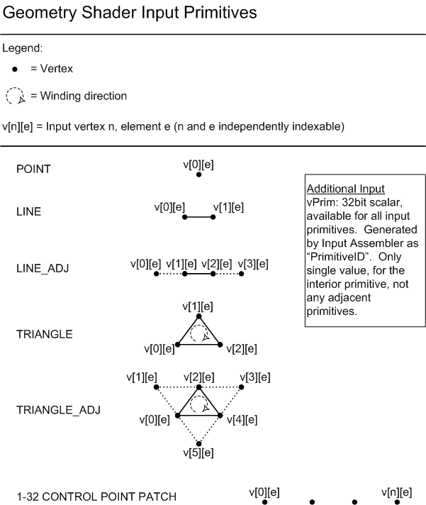
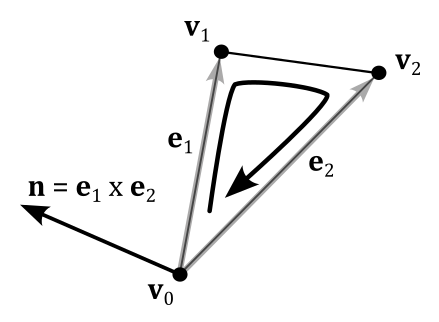

# 02.C - Drawing normals

<br>


<br>

# 1 - Introduction

In this tutorial we will introduce the geometry shader, an optional stage of the rendering pipeline that can be enabled to perform geometry amplification and de-amplification. For example, from a single point in input the geometry shader is able to return one or more triangles in output. On the other hand, it can de-amplify a geometry by emitting a line from a triangle. On this basis, it seems that the geometry shader is a unique, powerful stage that allows to implement new and funny rendering techniques. Unfortunately, most of the time its use it's difficult to justify since the power and uniqueness of the geometry shader come at such a cost that we should always avoid using it if there's another way to achieve the same result by using other stages of the pipeline. However, despite this, as graphics programmers we need to know how it works and how to use it. To this end, the sample examined in this tutorial will use the geometry shader to draw the normals to the triangles that compose a sphere, as illustrated in the image above. Drawing normals will serve little purpose in writing our graphics applications, but it allows to create a demo simple enough to cover all the details we need to know about the geometry shader.

<br>

<br>

# 2 - Geometry shader

The geometry shader is an optional programmable stage of the graphics pipeline located between the vertex and pixel shaders, but after the tessellation stages (which are optional as well, and will be examined in an upcoming tutorial). 

<br>


<br>

The geometry shader's inputs are the vertices for full primitives built by the input assembler, and processed by the vertex shader vertex by vertex. This means that each geometry shader invocation gets in input two vertices for lines, three vertices for triangles, or a single vertex for points. There's no difference between lists and strips (it doesn't matter how the input assembler built the primitives, a line always consists of two vertices, and a triangle is composed of three vertices). The image below shows the available geometry shader input primitives (right now you can set aside the primitives with adjacency information).

<br>



<br>

From each primitive in input, the geometry shader can emit a variable number of new vertices to build any type and number of primitives. For example, a geometry shader invocation can get a point in input, and amplify its geometry to a triangle list (one or more triangles) by emitting several vertices in output. Although, there are some limitations which must be complied. For example, the only available geometry shader output topologies are triangle strip, line strip, and point list (no line or triangle lists, but we can still emit them somehow). Also, although the number of primitives that a geometry shader emits can vary, the maximum number of vertices that a geometry shader can emit for each invocation must be declared statically. We will discuss the geometry shader limitations in the next section.

The output of the geometry shader can be sent to the rasterizer, and up to four GPU-visible vertex buffers as well if the Stream-Output stage is enabled (we will cover the stream output stage in the next tutorial).

The following listing shows the signature of a shader program in pseudocode.

<br>

```hlsl
[maxvertexcount(N)]
void  ShaderName(
PrimitiveType InputVertexType InputName[NumElements],
uint primID: SV_PrimitiveID,
inout StreamOutputObject<OutputVertexType> OutputName)
```
<br>

**[maxvertexcount(N)]** is an attribute that specifies the maximum number of vertices emitted by each geometry shader invocation to build the output primitives. We will see why we need to declare this info statically in the next section.

**ShaderName** specifies the entrypoint name of the shader program.

**PrimitiveType** specifies the input primitive type. It can be one of the following keywords:
- **point** (for point lists).
- **line** (for line lists and strips).
- **triangle** (for triangle lists and strips).
- **lineadj** (for line lists and strips with adiacency).
- **triangleadj** (for triangle lists and strips with adiacency).

**InputVertexType** specifies the type of the vertices of the input primitives. Usually, it's the structure defined to describe the output of the previous shader (vertex or domain).

**InputName** specifies the name of the array containing the **NumElements** vertices of the input primitive.

**primID** specifies the name of an optional parameter associated with the system-value semantic **SV_PrimitiveID**, which is used to identify the primitives built by the input assembler.

**StreamOutputObject** specifies the stream-output object type. A stream-output object is a templated object that streams data out of the geometry shader stage (to the rasterizer, and the stream output stage as well, if enabled). It can be one of the following keywords:

- **PointStream** (for a sequence of point primitives).
- **LineStream** (for a sequence of line primitives).
- **TriangleStream** (for a sequence of triangle primitives).

We can declare up to four stream-output objects in the signature of a geometry shader to stream data to as many GPU-visible input vertex buffers used by the Stream-Output stage, where the data can be stored in CPU-visible vertex buffers available to the application for reading, or storing in a file. However, only one of the stream-output objects can send data to the rasterizer (in addition to the stream output stage, if enabled). Multiple stream-output objects allow to split vertex attributes into multiple streams, and then selectively bound them to the input assembler stage later on, providing a very flexible method of binding only the vertex data that is required for a particular effect. Observe that with multiple stream-output objects, **StreamOutputObject** must be **PointStream** for all of them.

**OutputVertexType** specifies the type of the vertices of the output primitives. It's the structure defined to describe the type of the vertices emitted the geometry shader.

**OutputName** specifies the name of the stream-output object. We will use this name to add\emit vertices to the corresponding output stream by calling the method **Append**, which takes the instance of the vertex to append. As stated earlier, we can only pass line and triangle strips (in addition to point lists) in output, but we can simulate line and triangle lists with the help of **RestartStrip**, which ends the current primitive strip and starts a new strip. Therefore, if you want to output triangle lists from a geometry shader, you can call **RestartStrip** after every three calls to **Append**.

<br>

To conclude this section, it's interesting to note that, when used as a programmable stage of the pipeline, the geometry shader is the last stage before the rasterizer. For this reason, it is responsible for providing the homogeneous coordinates of the vertices by marking a vertex attribute with the system-value semantic **SV_POSITION**.

<br>

## 2.1 - Performance and limitations

Before enabling the geometry shader you need to be aware of some severe performance problems that arise from the use of this optiona lstage of the pipeline.

### Redundant vertex processing

We know that the vertex shader processes, one by one, the vertices of the primitives generated by the input assembler. Well, that's not the whole story. Actually, the last few vertices processed by the vertex shader are cached in memory so that, if a vertex is shared by more than a primitive, it is possible to avoid redundant processing by passing (if available) the cached version of the vertex to the next stage.<br>
On the other hand, the geometry shader is executed for each input primitive without exceptions. This means, for example, that for a quad (four vertices, two triangles) we would have four vertex shader invocations and two geometry shader invocations. However, each geometry shader invocation receives three vertices, so that we need six sets of calculations to transform the vertices of the quad instead of the four sets of calculations of the vertex shader.

<br>


<br>

### Primitive re-building and re-ordering

In a previous tutorial (**01.B - Hello Triangle**) we stated that the rendering pipeline can take advantage of the intrinsic parallelism provided by a GPU until it needs to perform a task depending on the order of the primitives. Unfortunately, the execution of a geometry shader is a task that breaks parallelism. Indeed, without the geometry shader the graphics pipeline can execute multiple shaders of the same stage in parallel relying on the work of the input assembler, which builds and orders the primitives from the vertex and index buffers. For example, if we have a quad (four vertices, two triangles), the input assembler associates a primitive ID equal to 0 with the first triangle, and a primitive ID equal to 1 for the second triangle. That way, it doesn't matter what triangle will be processed first by the next stages because the graphics pipeline knows their order.<br>
On the other hand, the geometry shader can emit an arbitrary number of primitives in oputput for each invocation. This means that there's no way for the graphics pipeline to know the order of the primitives emitted in output in advance. For example, suppose we have a geometry shader that receives a point in input. A first invocation emits a single triangle, and a second invocation emits two triangles. Well, these two invocations couldn't be executed in parallel because there's no easy way to generate a sequential ID for the output primitives and pass the result to the next stage. That is, the second invocation doesn't know how many primitives the first invocation could emit, so it can't generate any sequential IDs for the two triangles on the fly to pass to the next stage. However, the graphics pipeline still executes multiple invocations of the geometry shader by buffering their output in memory and reordering the primitives before passing the result to the next stages. This means that the geometry shader ends up repeating a task already performed by the a previous stage of the pipeline (the input assembler).

### Buffering

As stated above, in order to execute multiple invocations of the geometry shader in parallel, the GPU needs to buffer in memory the geometries emitted in output by each invocation before sending the ordered result to the next stage. This means that potentially a lot of memory could be allocated. So, the geometry shader is not only time consuming but also memory consuming.

### Limitations

Unfortunately, we don't have unlimited memory space available on our computers and GPUs, so we need a way to limit its use during the buffering operation of the geometry shader. First of all, we need to declare the maximum number of vertices emitted by each invocation of the geometry shader statically, at compile time. Also, each invocation of the geometry shader can stream up to 1024 scalars out of the geometry shader. This means that, to make sure we stay under this limit, we need to multiply the maximum number of vertices emitted by the geometry shader by the number of scalars in the structure defining the type of the emitted vertices. For example, suppose the maximum number of vertices emitted by each geometry shader invocation is N, with the following structure defining the type of the emitted vertices.

<br

```hlsl
struct GS_OUTPUT
{
    float4 Pos : SV_POSITION;
    float2 Tex : TEXTURE;
};


[maxvertexcount(N)]
void mainGS(...)
```
<br>

This means that we can stream a maximum of $N \times (4 + 2)$ scalars out of each geometry shader invocation. Therefore, it should be $N \le 1024 / (4 + 2) = 170$. That is, we cam emit a maximum of 170 vertices for each invocation. However, some technical resources and papers recommend to stream at most 1 to 20 scalars to prevent too much geometry amplification, which means a lot of memory space to allocate, as well as a lot of time to execute the shader programs and reorder the primitives. <br>
When multiple stream output objects exist, we can stream different types of vertices out of the geometry shader. In that case, the largest structure (among the ones defining the types of the emitted vertices) specifies the number of scalars to multiply by the maximum number of vertices.

<br>

To conclude this section, whenever you have an alternative in the implementation of a rendering technique, always pick the one that doesn't make use of the geometry shader.

<br>

<br>

# 3 - D3D12DrawingNormals: code review

Okay! You've had enough of cubes and quads. Therefore, in this sample we will create a sphere programmatically (that is, both vertex and index buffers will be created manually). We will draw this sphere at the center of the scene, showing the normals to its triangles with the help of the geometry shader.

<br>

In the application class we find a couple of arrays to store the vertices and indices describing the sphere. Also, we declare a helper function called **ComputeSphere** to fill these arrays depending on the diameter of the sphere, a and tessellation factor.

```cpp
class D3D12DrawingNormals : public DXSample
{
public:
    D3D12DrawingNormals(UINT width, UINT height, std::wstring name);

 
    // ...


private:
 

    // ...

    // Sphere vertices and indices
    std::vector<Vertex> sphereVertices;
    std::vector<UINT16> sphereIndices;

    void ComputeSphere(std::vector<Vertex>& vertices, std::vector<UINT16>& indices, FLOAT diameter, UINT16 tessellation);
};
```
<br>

**LoadAssets** creates two PSOS: one for drawing the sphere, and the other to draw the normals with the help of a geometry shader. This also means we must omit the **D3D12_ROOT_SIGNATURE_FLAG_DENY_GEOMETRY_SHADER_ROOT_ACCESS** flag in the root signature because the geometry shader needs to access the it. We use different vertex and pixel shaders to draw the normals because we will process the vertices of the sphere in the geometry shader (so the vertex shader will work like a simple pass-through), and we want to show the normals with a solid color. We will see the shader code at the end of this section. <br>
Then, we call **ComputeSphere** to create the sphere, building the vertex and index buffers.

<br>

```cpp
// Load the sample assets.
void D3D12DrawingNormals::LoadAssets()
{
    D3D12_FEATURE_DATA_ROOT_SIGNATURE featureData = {};

    // This is the highest version the sample supports. If CheckFeatureSupport succeeds, the HighestVersion returned will not be greater than this.
    featureData.HighestVersion = D3D_ROOT_SIGNATURE_VERSION_1_1;

    if (FAILED(m_device->CheckFeatureSupport(D3D12_FEATURE_ROOT_SIGNATURE, &featureData, sizeof(featureData))))
    {
        featureData.HighestVersion = D3D_ROOT_SIGNATURE_VERSION_1_0;
    }

    // Create a root signature with one constant buffer view.
    {
        CD3DX12_ROOT_PARAMETER1 rp[1] = {};
        rp[0].InitAsConstantBufferView(0, 0);

        // Allow input layout and deny uneccessary access to certain pipeline stages.
        D3D12_ROOT_SIGNATURE_FLAGS rootSignatureFlags =
            D3D12_ROOT_SIGNATURE_FLAG_ALLOW_INPUT_ASSEMBLER_INPUT_LAYOUT |
            D3D12_ROOT_SIGNATURE_FLAG_DENY_HULL_SHADER_ROOT_ACCESS |
            D3D12_ROOT_SIGNATURE_FLAG_DENY_DOMAIN_SHADER_ROOT_ACCESS;

        CD3DX12_VERSIONED_ROOT_SIGNATURE_DESC rootSignatureDesc = {};
        rootSignatureDesc.Init_1_1(_countof(rp), rp, 0, nullptr, rootSignatureFlags);

        ComPtr<ID3DBlob> signature;
        ComPtr<ID3DBlob> error;
        ThrowIfFailed(D3DX12SerializeVersionedRootSignature(&rootSignatureDesc, featureData.HighestVersion, &signature, &error));
        ThrowIfFailed(m_device->CreateRootSignature(0, signature->GetBufferPointer(), signature->GetBufferSize(), IID_PPV_ARGS(&m_rootSignature)));
    }

    // Create the constant buffer memory and map the resource
    {
        const D3D12_HEAP_PROPERTIES uploadHeapProperties = CD3DX12_HEAP_PROPERTIES(D3D12_HEAP_TYPE_UPLOAD);
        size_t cbSize = c_numDrawCalls * FrameCount * sizeof(PaddedConstantBuffer);

        const D3D12_RESOURCE_DESC constantBufferDesc = CD3DX12_RESOURCE_DESC::Buffer(cbSize);
        ThrowIfFailed(m_device->CreateCommittedResource(
            &uploadHeapProperties,
            D3D12_HEAP_FLAG_NONE,
            &constantBufferDesc,
            D3D12_RESOURCE_STATE_GENERIC_READ,
            nullptr,
            IID_PPV_ARGS(m_perFrameConstants.ReleaseAndGetAddressOf())));

        ThrowIfFailed(m_perFrameConstants->Map(0, nullptr, reinterpret_cast<void**>(&m_mappedConstantData)));

        // GPU virtual address of the resource
        m_constantDataGpuAddr = m_perFrameConstants->GetGPUVirtualAddress();
    }

    // Create the pipeline state objects, which includes compiling and loading shaders.
    {
        ComPtr<ID3DBlob> mainVS;
        ComPtr<ID3DBlob> passThroughVS;
        ComPtr<ID3DBlob> mainGS;
        ComPtr<ID3DBlob> lambertPS;
        ComPtr<ID3DBlob> solidColorPS;

#if defined(_DEBUG)
        // Enable better shader debugging with the graphics debugging tools.
        UINT compileFlags = D3DCOMPILE_DEBUG | D3DCOMPILE_SKIP_OPTIMIZATION;
#else
        UINT compileFlags = 0;
#endif

        ThrowIfFailed(D3DCompileFromFile(GetAssetFullPath(L"shaders.hlsl").c_str(), nullptr, nullptr, "MainVS", "vs_5_0", compileFlags, 0, &mainVS, nullptr));
        ThrowIfFailed(D3DCompileFromFile(GetAssetFullPath(L"shaders.hlsl").c_str(), nullptr, nullptr, "PassThroughVS", "vs_5_0", compileFlags, 0, &passThroughVS, nullptr));
        ThrowIfFailed(D3DCompileFromFile(GetAssetFullPath(L"shaders.hlsl").c_str(), nullptr, nullptr, "MainGS", "gs_5_0", compileFlags, 0, &mainGS, nullptr));
        ThrowIfFailed(D3DCompileFromFile(GetAssetFullPath(L"shaders.hlsl").c_str(), nullptr, nullptr, "LambertPS", "ps_5_0", compileFlags, 0, &lambertPS, nullptr));
        ThrowIfFailed(D3DCompileFromFile(GetAssetFullPath(L"shaders.hlsl").c_str(), nullptr, nullptr, "SolidColorPS", "ps_5_0", compileFlags, 0, &solidColorPS, nullptr));


        // Define the vertex input layout.
        D3D12_INPUT_ELEMENT_DESC inputElementDescs[] =
        {
            { "POSITION", 0, DXGI_FORMAT_R32G32B32_FLOAT, 0, 0, D3D12_INPUT_CLASSIFICATION_PER_VERTEX_DATA, 0 },
            { "NORMAL", 0, DXGI_FORMAT_R32G32B32_FLOAT, 0, 12, D3D12_INPUT_CLASSIFICATION_PER_VERTEX_DATA, 0 }
        };

        // Create the Pipeline State Objects
        {
            D3D12_GRAPHICS_PIPELINE_STATE_DESC psoDesc = {};

            //
            // PSO for drawing lambertian lit objects
            //
            psoDesc.InputLayout = { inputElementDescs, _countof(inputElementDescs) };
            psoDesc.pRootSignature = m_rootSignature.Get();
            psoDesc.VS = CD3DX12_SHADER_BYTECODE(mainVS.Get());
            psoDesc.PS = CD3DX12_SHADER_BYTECODE(lambertPS.Get());
            psoDesc.RasterizerState = CD3DX12_RASTERIZER_DESC(D3D12_DEFAULT);
            psoDesc.BlendState = CD3DX12_BLEND_DESC(D3D12_DEFAULT);
            psoDesc.DepthStencilState = CD3DX12_DEPTH_STENCIL_DESC(D3D12_DEFAULT);
            psoDesc.DSVFormat = DXGI_FORMAT_D32_FLOAT;
            psoDesc.SampleMask = UINT_MAX;
            psoDesc.PrimitiveTopologyType = D3D12_PRIMITIVE_TOPOLOGY_TYPE_TRIANGLE;
            psoDesc.NumRenderTargets = 1;
            psoDesc.RTVFormats[0] = DXGI_FORMAT_R8G8B8A8_UNORM;
            psoDesc.SampleDesc.Count = 1;
            ThrowIfFailed(m_device->CreateGraphicsPipelineState(&psoDesc, IID_PPV_ARGS(&m_lambertPipelineState)));

            //
            // PSO for drawing normals with a solid color
            //
            psoDesc.VS = CD3DX12_SHADER_BYTECODE(passThroughVS.Get());
            psoDesc.GS = CD3DX12_SHADER_BYTECODE(mainGS.Get());
            psoDesc.PS = CD3DX12_SHADER_BYTECODE(solidColorPS.Get());
            ThrowIfFailed(m_device->CreateGraphicsPipelineState(&psoDesc, IID_PPV_ARGS(&m_normalsPipelineState)));
        }
    }

    // Create the command list.
    ThrowIfFailed(m_device->CreateCommandList(0, D3D12_COMMAND_LIST_TYPE_DIRECT, m_commandAllocators[m_frameIndex].Get(), nullptr, IID_PPV_ARGS(&m_commandList)));

    // Command lists are created in the recording state, but there is nothing
    // to record yet. The main loop expects it to be closed, so close it now.
    ThrowIfFailed(m_commandList->Close());

    // Create the vertex and index buffers.
    {
        // Define the geometry for a sphere.
        ComputeSphere(sphereVertices, sphereIndices, 5, 20);

        // Note: using upload heaps to transfer static data like vert buffers is not 
        // recommended. Every time the GPU needs it, the upload heap will be marshalled 
        // over. Please read up on Default Heap usage. An upload heap is used here for 
        // code simplicity and because there are very few verts to actually transfer.
        ThrowIfFailed(m_device->CreateCommittedResource(
            &CD3DX12_HEAP_PROPERTIES(D3D12_HEAP_TYPE_UPLOAD),
            D3D12_HEAP_FLAG_NONE,
            &CD3DX12_RESOURCE_DESC::Buffer(sphereVertices.size() * sizeof(Vertex)),
            D3D12_RESOURCE_STATE_GENERIC_READ,
            nullptr,
            IID_PPV_ARGS(&m_vertexBuffer)));

        // Copy the cube data to the vertex buffer.
        UINT8* pVertexDataBegin = nullptr;
        CD3DX12_RANGE readRange(0, 0);        // We do not intend to read from this resource on the CPU.
        ThrowIfFailed(m_vertexBuffer->Map(0, &readRange, reinterpret_cast<void**>(&pVertexDataBegin)));
        memcpy(pVertexDataBegin, sphereVertices.data(), sphereVertices.size() * sizeof(Vertex));
        m_vertexBuffer->Unmap(0, nullptr);

        // Initialize the vertex buffer view.
        m_vertexBufferView.BufferLocation = m_vertexBuffer->GetGPUVirtualAddress();
        m_vertexBufferView.StrideInBytes = sizeof(Vertex);
        m_vertexBufferView.SizeInBytes = (UINT)sphereVertices.size() * sizeof(Vertex);

        ThrowIfFailed(m_device->CreateCommittedResource(
            &CD3DX12_HEAP_PROPERTIES(D3D12_HEAP_TYPE_UPLOAD),
            D3D12_HEAP_FLAG_NONE,
            &CD3DX12_RESOURCE_DESC::Buffer(sphereIndices.size() * sizeof(UINT16)),
            D3D12_RESOURCE_STATE_GENERIC_READ,
            nullptr,
            IID_PPV_ARGS(&m_indexBuffer)));

        // Copy the cube data to the vertex buffer.
        ThrowIfFailed(m_indexBuffer->Map(0, &readRange, reinterpret_cast<void**>(&pVertexDataBegin)));
        memcpy(pVertexDataBegin, sphereIndices.data(), sphereIndices.size() * sizeof(UINT16));
        m_indexBuffer->Unmap(0, nullptr);

        // Initialize the vertex buffer view.
        m_indexBufferView.BufferLocation = m_indexBuffer->GetGPUVirtualAddress();
        m_indexBufferView.Format = DXGI_FORMAT_R16_UINT;
        m_indexBufferView.SizeInBytes = (UINT)sphereIndices.size() * sizeof(UINT16);
    }


    // ...

}
```
<br>

**ComputeSphere** takes a diameter and a tesselletion factor to calculate both the vertices and indices describing a sphere. In particular, we can use spherical coordinates to compute the positions and normals for all vertices of a horizontal ring at a given latitude. See appendix 01 for more details about the spherical coordinate system (observe that this time $\phi$ is measured from the down direction, so we end up getting slightly different spherical coordinates which reflect this change).

<br>


<br>

To calculate the index buffer we can proceed as follows. <br>
Our sphere is composed by stacks and slices of quads. Each stack is delimited by two horizontal rings of vertices, and each slice is delimited by two vertical ring of vertices. This means we need to solve the general problem of computing the six indices of the quad at the intersection of the stack delimited by the i-th and (i+1)-th horizontal ring, and the slice delimited by the j-th and (j+1)-th vertical ring.

<br>


<br>

From the image above we have that 

<br>

$\triangle{_1} = (i,\ j),\ \ (i+1,\ j),\ \ (i+1,\ j+1)$

$\triangle{_2} = (i,\ j),\ \ (i+1,\ j+1),\ \ (i,\ j+1)$

<br>

```cpp
void D3D12DrawingNormals::ComputeSphere(std::vector<Vertex>& vertices, std::vector<UINT16>& indices, FLOAT diameter, UINT16 tessellation)
{
    vertices.clear();
    indices.clear();

    if (tessellation < 3)
        throw std::invalid_argument("tesselation parameter must be at least 3");

    //
    // Fill the array of vertices using spherical coordinates
    //

    CONST UINT16 stackCount = tessellation;
    CONST UINT16 sliceCount = tessellation * 2;

    CONST FLOAT radius = diameter / 2;

    // Create rings of vertices at progressively higher latitudes.
    // We have stackCount + 1 vertical rings of vertices (the first and last vert. rings degenerate to points).
    for (UINT16 i = 0; i <= stackCount; i++)
    {
        // -90° < latitude < +90°
        CONST FLOAT latitude = (FLOAT(i) * XM_PI / FLOAT(stackCount)) - XM_PIDIV2;
        FLOAT dy, dxz;

        // dy = sin(phi),  dxz = cos(phi)
        XMScalarSinCos(&dy, &dxz, latitude);

        // Create the vertices of the vertical ring at the i-th latitude.
        // We have sliceCount vertices for each vertical ring. However, we need to
        // distinguish between the first and last vertices, which are at the same
        // position but with different normals, texture coordinates, and so on.
        for (UINT16 j = 0; j <= sliceCount; j++)
        {
            // 0° < longitude < 360°
            CONST FLOAT longitude = FLOAT(j) * XM_2PI / FLOAT(sliceCount);
            FLOAT dx, dz;

            // dx = cos(theta),  dz = sin(theta)
            XMScalarSinCos(&dz, &dx, longitude);

            // dx = cos(phi)cos(theta)
            // dy = sin(phi)
            // dz = cos(phi)sin(theta)
            dx *= dxz;
            dz *= dxz;

            // normal = (dx, dy, dz)
            // position = r * (dx, dy, dz)
            XMFLOAT3 position, normal;
            XMStoreFloat3(&position, XMVectorScale(XMVectorSet(dx, dy, dz, 0), radius));
            XMStoreFloat3(&normal, XMVectorSet(dx, dy, dz, 0));

            vertices.push_back({ position, normal });
        }
    }

    //
    // Fill the array of indices of triangles joining each pair of vertical rings
    //

    // As noted above, we distinguish sliceCount + 1 vertices for each rings, 
    // so we must skip (sliceCount + 1) vertices every time we need to build 
    // the indices of the triangles that compose the sliceCount quads of each 
    // of the stackCount stacks.
    CONST UINT16 stride = sliceCount + 1;

    for (UINT16 i = 0; i < stackCount; i++)
    {
        for (UINT16 j = 0; j < sliceCount; j++)
        {
            CONST UINT16 nextI = (i + 1);
            CONST UINT16 nextJ = (j + 1) % stride;

            indices.push_back(i * stride + j);
            indices.push_back(nextI * stride + j);
            indices.push_back(nextI * stride + nextJ);

            indices.push_back(i * stride + j);
            indices.push_back(nextI * stride + nextJ);
            indices.push_back(i * stride + nextJ);
        }
    }
}
```
<br>

In **PopulateCommandList** we draw the sphere two times: the first time to draw the sphere as usual, and the second time to draw the normals with the help of the geometry shader, which returns the line segments representing the normals from the triangles of the sphere.

<br>

```cpp
void D3D12DrawingNormals::PopulateCommandList()
{
    // Command list allocators can only be reset when the associated 
    // command lists have finished execution on the GPU; apps should use 
    // fences to determine GPU execution progress.
    ThrowIfFailed(m_commandAllocators[m_frameIndex]->Reset());

    // However, when ExecuteCommandList() is called on a particular command 
    // list, that command list can then be reset at any time and must be before re-recording.
    // Set PSO for drawing lambertian lit objects.
    ThrowIfFailed(m_commandList->Reset(m_commandAllocators[m_frameIndex].Get(), m_lambertPipelineState.Get()));

    // Set necessary state.
    m_commandList->SetGraphicsRootSignature(m_rootSignature.Get());
    m_commandList->RSSetViewports(1, &m_viewport);
    m_commandList->RSSetScissorRects(1, &m_scissorRect);

    // Index into the available constant buffers based on the number
    // of draw calls. We've allocated enough for a known number of
    // draw calls per frame times the number of back buffers
    unsigned int constantBufferIndex = c_numDrawCalls * (m_frameIndex % FrameCount);

    // Bind the constants to the shader
    auto baseGpuAddress = m_constantDataGpuAddr + sizeof(PaddedConstantBuffer) * constantBufferIndex;
    m_commandList->SetGraphicsRootConstantBufferView(0, baseGpuAddress);

    // Indicate that the back buffer will be used as a render target.
    m_commandList->ResourceBarrier(1, &CD3DX12_RESOURCE_BARRIER::Transition(m_renderTargets[m_frameIndex].Get(), D3D12_RESOURCE_STATE_PRESENT, D3D12_RESOURCE_STATE_RENDER_TARGET));

    // Set render target and depth buffer in OM stage
    CD3DX12_CPU_DESCRIPTOR_HANDLE rtvHandle(m_rtvHeap->GetCPUDescriptorHandleForHeapStart(), m_frameIndex, m_rtvDescriptorSize);
    CD3DX12_CPU_DESCRIPTOR_HANDLE dsvHandle(m_dsvHeap->GetCPUDescriptorHandleForHeapStart());
    m_commandList->OMSetRenderTargets(1, &rtvHandle, FALSE, &dsvHandle);

    // Clear the render target and depth buffer
    const float clearColor[] = { 0.13f, 0.13f, 0.13f, 1.0f };
    m_commandList->ClearRenderTargetView(rtvHandle, clearColor, 0, nullptr);
    m_commandList->ClearDepthStencilView(dsvHandle, D3D12_CLEAR_FLAG_DEPTH, 1.0f, 0, 0, nullptr);

    // Set up the input assembler
    m_commandList->IASetPrimitiveTopology(D3D_PRIMITIVE_TOPOLOGY_TRIANGLELIST);
    m_commandList->IASetVertexBuffers(0, 1, &m_vertexBufferView);
    m_commandList->IASetIndexBuffer(&m_indexBufferView);

    // Set the per-frame constants
    ConstantBuffer cbParameters = {};

    // Shaders compiled with default row-major matrices
    XMStoreFloat4x4(&cbParameters.worldMatrix, XMMatrixTranspose(m_worldMatrix));
    XMStoreFloat4x4(&cbParameters.viewMatrix, XMMatrixTranspose(m_viewMatrix));
    XMStoreFloat4x4(&cbParameters.projectionMatrix, XMMatrixTranspose(m_projectionMatrix));

    XMStoreFloat4(&cbParameters.lightDir, m_lightDir);
    XMStoreFloat4(&cbParameters.lightColor, m_lightColor);
    XMStoreFloat4(&cbParameters.outputColor, m_outputColor);

    // Set the constants for the first draw call
    memcpy(&m_mappedConstantData[constantBufferIndex], &cbParameters, sizeof(ConstantBuffer));

    // Draw the Lambert lit sphere
    m_commandList->DrawIndexedInstanced((UINT)sphereIndices.size(), 1, 0, 0, 0);
    baseGpuAddress += sizeof(PaddedConstantBuffer);
    ++constantBufferIndex;

    // Set the PSO for drawing normals with a solid color
    m_commandList->SetPipelineState(m_normalsPipelineState.Get());

    // Set yellow as solid color
    m_outputColor = XMVectorSet(1, 1, 0, 0);
    XMStoreFloat4(&cbParameters.outputColor, m_outputColor);

    // Set the constants for the second draw call
    memcpy(&m_mappedConstantData[constantBufferIndex], &cbParameters, sizeof(ConstantBuffer));

    // Bind the constants to the shader
    baseGpuAddress = m_constantDataGpuAddr + sizeof(PaddedConstantBuffer) * constantBufferIndex;
    m_commandList->SetGraphicsRootConstantBufferView(0, baseGpuAddress);

    // Draw the normals of the sphere with the help of the GS.
    m_commandList->DrawIndexedInstanced((UINT)sphereIndices.size(), 1, 0, 0, 0);

    // Indicate that the back buffer will now be used to present.
    m_commandList->ResourceBarrier(1, &CD3DX12_RESOURCE_BARRIER::Transition(m_renderTargets[m_frameIndex].Get(), D3D12_RESOURCE_STATE_RENDER_TARGET, D3D12_RESOURCE_STATE_PRESENT));

    ThrowIfFailed(m_commandList->Close());
}
```
<br>

To draw the sphere we use the usual shader code. However, to draw the normals we need a vertex shader that simply passes the local vertex positions to the geometry shader. We don't need the normals because each vertex is shared by more than a triangle, so if you wanted to show the real normals the visual effect would be a mess (you'd have several line segments sticking out from the same vertex). On the other hand, from the vertex positions, the geometry shader can calculate the triangle center, and a line segment sticking out from that point, which represent the normal to the triangle.

<br>

```hlsl
struct VS_INPUT
{
    float4 Pos : POSITION;
    float3 Normal : NORMAL;
};

struct GS_INPUT
{
    float4 Pos : POSITION;
};

struct GS_OUTPUT
{
    float4 Pos : SV_POSITION;
};


//--------------------------------------------------------------------------------------
// Name: PassThroughVS
// Desc: VS that simply passes the position to the GS
//--------------------------------------------------------------------------------------
GS_INPUT PassThroughVS(VS_INPUT In)
{
    GS_INPUT Out;
    Out.Pos = In.Pos;
    return Out;
}


//--------------------------------------------------------------------------------------
// Name: MainGS
// Desc: Geometry shader for drawing normals to triangles
//--------------------------------------------------------------------------------------
[maxvertexcount(2)]
void MainGS(triangle GS_INPUT In[3], inout LineStream<GS_OUTPUT> stream)
{
    // Get the local positions of the vertices of the input triangle
    float4 v0 = In[0].Pos;
    float4 v1 = In[1].Pos;
    float4 v2 = In[2].Pos;
    
    // Sides of the input triangle
    float3 e1 = normalize(v1 - v0).xyz;
    float3 e2 = normalize(v2 - v0).xyz;
    
    // The normal is the cross product of the sides.
    // v0, v1 and v2 in clockwise order so it's e1 x e2
    float3 normal = normalize(cross(e1, e2));
    
    // Show the normal at the center of the triangle
    float4 center = (v0 + v1 + v2) / 3.0;
	
    // We need to transform the line segment (two points) representing
    // the normal from local to clip space.
    float4x4 mVP = mul(mWorld, mul(mView, mProjection));
    
    // Emit the two points of a line segment representing the normal to the input triangle
    for (int i = 0; i < 2; ++i)
    {
        GS_OUTPUT v;
        center.xyz += normal * 0.3 * i;
        v.Pos = mul(center, mVP);
        stream.Append(v);
    }
}
```
<br>

The center of a triangle (called centroid) is the point where the three medians of the triangle meet. We can compute this point as the arithmetic mean of the three vertex positions. 

<br>

>To proove that the centroid of a triangle is the arithmetic mean of the coordinates of its vertices, we first need to demonstrate the following theorem.
>
>**Theorem**: The centroid of a triangle divides each median in the ratio 2:1
>
><br>
>
>
>
><br>
>
>$D, E, F$ are mid-points of $BC, CA, AB$. <br>
$AD, BE$ and $CF$ are medians. <br>
The medians intersect each others at a point $G$ called centroid. <br>
We need to show that: $AG : GD = BG : GE = CG : GF = 2 : 1$
>
><br>
>
>***Proof***
>
>Building a similar triangle along $AC$, you get the following diagram
>
><br>
>
>
>
><br>
>
>$ABCB_1$  is a parallelogram. <br>
$BEB_1$  is a straight line. <br>
Since  $CD = AD_1$  and  $CD \parallel AD1$, then $DCD_1A$  is a parallelogram (opposite sides equal and parallel), so that $DG \parallel CG_1$. <br>
Since $BD = DC$ and $DG \parallel CG_1$, then $BG = GG_1$ (intercept theorem).
So, we have that $BG : GG_1 = 1 : 1$.
Now, since $GE = EG_1$, then $BG : GE = 2 : 1$.
>
>The same applies to the other two medians by building similar triangles along the other sides of $ABC$.
>
>$\Box$
>
><br>
>
>Therefore, we can state that $GE = 1/2$ of $BE$, while $BG = 2/3$ of $BE$.<br>
Now, considering the following image, we have that
>
><br>
>
>
>
><br>
>
>$\vec{OG}=\vec{OB}+\vec{BG}$
>
>$=\displaystyle\vec{OB}+\color{#FF6666}{\frac{2}{3}\vec{BE}}$
>
>$=\displaystyle\vec{OB}+\frac{2}{3}\big(\vec{BA}+\frac{1}{2}\vec{AC}\big)$
>
>$=\displaystyle\vec{OB}+\frac{2}{3}\bigg(\vec{OA}-\vec{OB}+\frac{1}{2}\big(\vec{OC}-\vec{OA}\big)\bigg)$
>
>$=\displaystyle\vec{OB}+\frac{2}{3}\bigg(\frac{1}{2}\vec{OA}+\frac{1}{2}\vec{OC}-\vec{OB}\bigg)$
>
>$=\displaystyle\frac{1}{3}\bigg(\vec{OA}+\vec{OB}+\vec{OC}\bigg)$


<br>

To calculate the normal to a triangle, we can compute the cross product of its two sides. For this purpose, knowing the winding order of the vertices, we can build the cross product so that the normal aims at the right direction, as illustrated in the following image (see appendix 01 for more details about the cross product).

<br>



<br>

<br>

<br>

Source code: [LearnDirectX](https://github.com/PAMinerva/LearnDirectX)

<br>

# References

[1] Microsoft online documentation <br>
[2] [A.01 - Vectors](https://paminerva.github.io/docs/LearnDirectX/A.01-Vectors)

<br>

***
If you found the content of this tutorial somewhat useful or interesting, please consider supporting this project by clicking on the **Sponsor** button.  Whether a small tip, a one time donation, or a recurring payment, it's all welcome! Thank you!<br><br>
<p align="center">
 <a href="https://github.com/sponsors/PAMinerva">
         
      </a>
</p><br>