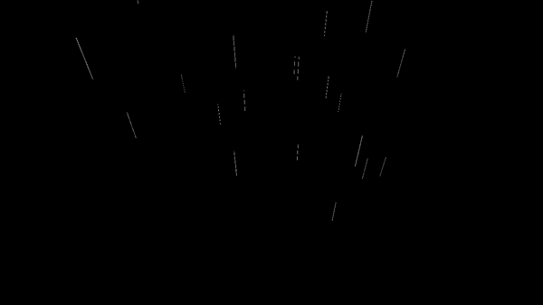
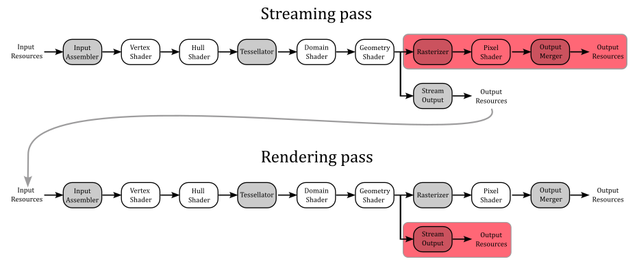
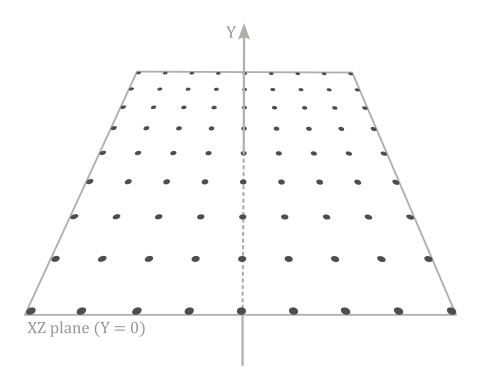
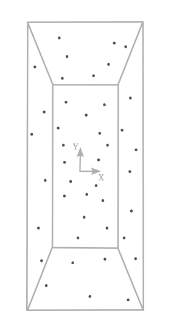
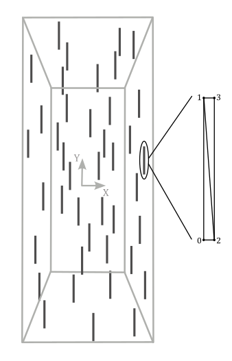
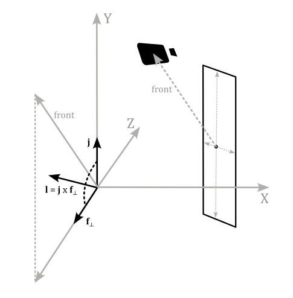

# 02.D - Simple rain effect

<br>



<br>

# 1 - Introduction

As stated in the previous tutorial (**02.C - Drawing normals**), the geometry shader can send data to the rasterizer, and up to four output streams used as input buffers by the Stream-Output stage, if enabled. In this tutorial we will cover the stream output stage, presenting a sample that uses it to implement a very basic rain effect. Observe that the geometry shader needs to be enabled and used to stream data in the input buffers of the stream output stage. Therefore, the stream output stage implies the same limitations and performance issues of the geometry shader apply.

<br>

<br>

# 2 - Stream-Output stage

The stream output is an optional, fixed stage of the pipeline. This means that we need to set its state in the current PSO to enable and use it, but we can't specify a shader program to be executed by this stage. Indeed, the only (fixed) task of the stream output stage is to stream data from an input vertex buffer (created by the geometry shader by appending vertices to the corresponding stream object) to the corresponding output vertex buffer, which can be used by our application later on. As we know, a stream output stage can have up to four input vertex buffers, and as many output vertex buffers. <br>
The general idea is to use the stream output as the final stage of the pipeline in a first streaming pass to create (at least) a new vertex buffer. Then, this new buffer can be used as input of the pipeline in a subsequent rendering pass, with the stream output stage disabled.

<br>



<br>

Even if we can't specify what a stream output stage executes, we still need to indicate a couple of things:

- The output vertex buffers used as output by the stream output stage.

- What type of data from an input vertex buffer should be written to the corresponding output vertex buffer, along with the index of the input vertex buffer that should be sent to the rasterizer, if any.

<br>

The output vertex buffers are commonly called stream output buffers, and to set them we call **ID3D12GraphicsCommandList::SOSetTargets**.

<br>

```cpp
void SOSetTargets(
  [in]           UINT                                  StartSlot,
  [in]           UINT                                  NumViews,
  [in, optional] const D3D12_STREAM_OUTPUT_BUFFER_VIEW *pViews
);
```
<br>

**StartSlot** specifies the starting index (in the range [0-3]) where to begin binding the stream output buffers. Indeed, we have at maximum four slots available for the stream output stage to bind our output vertex buffers.

**NumViews** indicates the number of elements in the **pViews** array.

**pViews** specifies an array of **D3D12_STREAM_OUTPUT_BUFFER_VIEW** structures.

<br>

```cpp
typedef struct D3D12_STREAM_OUTPUT_BUFFER_VIEW {
  D3D12_GPU_VIRTUAL_ADDRESS BufferLocation;
  UINT64                    SizeInBytes;
  D3D12_GPU_VIRTUAL_ADDRESS BufferFilledSizeLocation;
} D3D12_STREAM_OUTPUT_BUFFER_VIEW;
```
<br>

**BufferLocation** specifies the GPU virtual address of the stream output buffer.

**SizeInBytes** indicates the size of the stream output buffer in bytes.

**BufferFilledSizeLocation** specifies the GPU virtual address of a buffer (location) that stores  the value of how much data has been filled into the stream output buffer. This member can't be **NULL**; a filled size location must be supplied because the hardware will increment this value as data is output. 

<br>

At this point, all we have to do is to specify the type of data that should be written to the stream output buffers. This information is part of the stream output state in a PSO. Therefore, we first need to initialize an instance of the **D3D12_STREAM_OUTPUT_DESC** structure to be assigned to the **StreamOutput** member of the **D3D12_GRAPHICS_PIPELINE_STATE_DESC** structure.

<br>

```cpp
typedef struct D3D12_STREAM_OUTPUT_DESC {
  const D3D12_SO_DECLARATION_ENTRY *pSODeclaration;
  UINT                             NumEntries;
  const UINT                       *pBufferStrides;
  UINT                             NumStrides;
  UINT                             RasterizedStream;
} D3D12_STREAM_OUTPUT_DESC;
```
<br>

**pSODeclaration** specifies an array of **D3D12_SO_DECLARATION_ENTRY** structures, which describe what to write from a vertex buffer to another, attribute by attribute (more on this shortly).

**NumEntries** indicates the number of elements in the **pSODeclaration** array.

**pBufferStrides** specifies an array of buffer strides; each stride is the size of the vertex that will be streamed to each stream output buffer.

**NumStrides** indicates the number of elements in the **pBufferStrides** array.

**RasterizedStream** specifies the index of the input vertex buffer to send to the rasterizer. If you don't need\want to pass data to the rasterizer, then set this member to **D3D12_SO_NO_RASTERIZED_STREAM**.

<br>

```cpp
typedef struct D3D12_SO_DECLARATION_ENTRY {
  UINT   Stream;
  LPCSTR SemanticName;
  UINT   SemanticIndex;
  BYTE   StartComponent;
  BYTE   ComponentCount;
  BYTE   OutputSlot;
} D3D12_SO_DECLARATION_ENTRY;
```
<br>

**Stream** specifies the index of the input vertex buffer from which to read the vertices, attribute by attribute.

**SemanticName** indicates the semantic name associated with a vertex attribute in the input vertex buffer specified by **Stream**.  For example, "POSITION", "NORMAL", or "TEXCOORD".

**SemanticIndex** specifies an index to identify vertex attributes that shares the same semantic name.

**StartComponent** and **ComponentCount** indicate which portion of a four-component attribute will be streamed. Valid values for **StartComponent** are 0 to 3, while **ComponentCount** can be in the range 1 through 4. For example, for a position $(x,y,z,w)$, if we set **StartComponent** to 1 and **ComponentCount** to 2, then the two-component attribute $(y,z)$ would be streamed.

**OutputSlot** specifies the index (in the range [0-3]) of the stream output buffer where to stream the vertex attribute data.

<br>

<br>

# 3 - D3D12SimpleRainEffect: code review

Before the introduction of the compute pipeline, and shader (more on this in an upcoming tutorial), the Output-Stream stage was used to implement basic particle effects. Nowadays, this stage can be still used to split vertex attributes in multiple vertex buffers, maybe for debugging purposes. Anyway, implementing a simple rainfall effect will help us to grasp all the details we need to know about the stream output stage. First, let's define our rendering plan in three steps. 

<br>

### Step 1: Initialization

This step is performed only once (we are not in the render loop yet). We define and create a grid of vertices\particles lying in the xz-plane of the local space. In addition to the position, we associate size and speed as vertex attributes. This grid will be the vertex buffer initially bound to the input assembler. In particular, we will only use this vertex buffer the first time we execute the streaming pass (step 2) in the rendering of the first frame.

<br>



<br>

We also need to create a couple of buffers of the same size of the grid of vertices. <br>
The first buffer will be allocated on the default heap, and used as a stream output buffer in the streaming pass (step 2) to store the updated positions of the points\particles (a task that will be performed by the geometry shader). <br>
The second buffer will be allocated on the upload heap, and used as the destination of a copy operation, where the source is the first, updated vertex buffer. That is, this second buffer will be the actual vertex buffer bound to the input assembler after the streaming pass to render the first frame. <br>

<br>

>We can't use a single buffer allocated on the upload heap because the same resource can't be bound both as input and output of the rendering pipeline at the same time. Therefore, we need at least two different buffers.

<br>

### Step 2: Streaming pass

Now, we are in the render loop, and for the first frame the vertex buffer will be the one created in the previous step (the grid of points lying in the xz-plane). The geometry shader will update the local y-coordinate of the points over time, based on the speed attribute associated to each point\particle. Then, the result will be stored in the stream output buffer.

<br>



<br>

At that point, we can copy the stream output buffer to the buffer allocated on the upload heap, which will be the vertex buffer bound to the input assembler from this point onwards.

<br>

### Step 3: Rendering pass

We can bind the new vertex buffer to the input assembler by updating the vertex buffer view (that is, we need to set the corresponding GPU virtual address). Also, we need to disable the Stream-Output stage, and use a different geometry shader that amplifies a point to a couple of triangles in order to build a quad which will represent a raindrop located at the same position.

<br>



<br>

Then, we can transform the corresponding vertex positions as usual to provide the related homogeneous coordinates to the rasterizer.

<br>

And that's all. Finally, we can start reviewing the code of **D3D12SimpleRainEffect**. <br>
As stated earlier, in the streaming pass the geometry shader updates the local y-coordinate of the points/particles over time. This means we need a way to count time. In particular, we need to calculate the elapsed time between frames. Indeed, to implement an animation which is independent of the performance of our GPU, we need to bind the animation progression\speed to the elapsed time between the previous frame and the current one. Otherwise, suppose the animation progresses by a fixed amount every frame. With a high-end GPU, the animation will move quickly because the GPU is able to create several frames one after another. On the other hand, with a low-end GPU the animation will move slower because the GPU can't create the same number of frames in the same amount of time. Therefore, the ideal is to have small progressions when the frame-rate is high, and big progressions when the frame-rate is low. To summarize, we need a way to compute the elapsed time from a frame to another. For this purpose, we can use a helper class called **TimeStep**, provided by Microsoft and defined in *TimeStep.h*.

<br>

```cpp
// Helper class for animation and simulation timing.
class StepTimer
{
public:
    StepTimer() :
        m_elapsedTicks(0),
        m_totalTicks(0),
        m_leftOverTicks(0),
        m_frameCount(0),
        m_framesPerSecond(0),
        m_framesThisSecond(0),
        m_qpcSecondCounter(0)
    {
        QueryPerformanceFrequency(&m_qpcFrequency);
        QueryPerformanceCounter(&m_qpcLastTime);

        // Initialize max delta to 1/10 of a second.
        m_qpcMaxDelta = m_qpcFrequency.QuadPart / 10;
    }

    // Get elapsed time since the previous Update call.
    UINT64 GetElapsedTicks() const                        { return m_elapsedTicks; }
    double GetElapsedSeconds() const                    { return TicksToSeconds(m_elapsedTicks); }

    // Get total time since the start of the program.
    UINT64 GetTotalTicks() const                        { return m_totalTicks; }
    double GetTotalSeconds() const                        { return TicksToSeconds(m_totalTicks); }

    // Get total number of updates since start of the program.
    UINT32 GetFrameCount() const                        { return m_frameCount; }

    // Get the current framerate.
    UINT32 GetFramesPerSecond() const                    { return m_framesPerSecond; }

    // Set whether to use fixed or variable timestep mode.
    void SetFixedTimeStep(bool isFixedTimestep)            { m_isFixedTimeStep = isFixedTimestep; }


    // ...


    // Integer format represents time using 10,000,000 ticks per second.
    static const UINT64 TicksPerSecond = 10000000;

    static double TicksToSeconds(UINT64 ticks)            { return static_cast<double>(ticks) / TicksPerSecond; }
    static UINT64 SecondsToTicks(double seconds)        { return static_cast<UINT64>(seconds * TicksPerSecond); }


    // ...


    typedef void(*LPUPDATEFUNC) (void);

    // Update timer state, calling the specified Update function the appropriate number of times.
    void Tick(LPUPDATEFUNC update = nullptr)
    {
        // Query the current time.
        LARGE_INTEGER currentTime;

        QueryPerformanceCounter(&currentTime);

        UINT64 timeDelta = currentTime.QuadPart - m_qpcLastTime.QuadPart;

        m_qpcLastTime = currentTime;
        m_qpcSecondCounter += timeDelta;

        // Clamp excessively large time deltas (e.g. after paused in the debugger).
        if (timeDelta > m_qpcMaxDelta)
        {
            timeDelta = m_qpcMaxDelta;
        }

        // We now have the elapsed number of ticks, along with the number of ticks-per-second. 
        // We use these values to convert to the number of elapsed microseconds.
        // To guard against loss-of-precision, we convert to microseconds *before* dividing by ticks-per-second.
        // This cannot overflow due to the previous clamp.
        timeDelta *= TicksPerSecond;
        timeDelta /= m_qpcFrequency.QuadPart;

        UINT32 lastFrameCount = m_frameCount;

        // Variable timestep update logic.
        m_elapsedTicks = timeDelta;
        m_totalTicks += timeDelta;
        m_leftOverTicks = 0;
        m_frameCount++;
        
        if (update)
        {
            update();
        }

        // Track the current framerate.
        if (m_frameCount != lastFrameCount)
        {
            m_framesThisSecond++;
        }

        if (m_qpcSecondCounter >= static_cast<UINT64>(m_qpcFrequency.QuadPart))
        {
            m_framesPerSecond = m_framesThisSecond;
            m_framesThisSecond = 0;
            m_qpcSecondCounter %= m_qpcFrequency.QuadPart;
        }
    }

private:
    // Source timing data uses QPC units.
    LARGE_INTEGER m_qpcFrequency;
    LARGE_INTEGER m_qpcLastTime;
    UINT64 m_qpcMaxDelta;

    // Derived timing data uses a canonical tick format.
    UINT64 m_elapsedTicks;
    UINT64 m_totalTicks;
    UINT64 m_leftOverTicks;

    // Members for tracking the framerate.
    UINT32 m_frameCount;
    UINT32 m_framesPerSecond;
    UINT32 m_framesThisSecond;
    UINT64 m_qpcSecondCounter;


    // ...


};
```
<br>

In the constructor of **StepTimer**, the call to **QueryPerformanceCounter** returns the current performance-counter value, in counts. In this case the performance-counter is the Time Stamp Counter (TSC), a 64-bit register which is present in all modern processors. It stores the number of CPU cycles since its reset. The counting unit is often called tick, or count. <br>
**QueryPerformanceFrequency** returns the number of counts per second, which is fixed at system boot, and consistent across all cores. This value is useful to compute the seconds of a time interval expressed in counts. Which is exactly what **StepTimer::Tick** does. If you're struggling to understand what's the meaning of the comment on **TicksPerSecond**, just think of this variable as the number of microseconds in a second (you can also rename it **MicrosPerSecond**). <br>
We will call **StepTimer::Tick** in **OnUpdate** so that we can always get the elapsed time from a frame to another in seconds by calling **StepTimer::GetElapsedSeconds**.

<br>

>Implementing a performance counter on modern processors is not as straightforward as it might seem because
>
>- a modern processor can have multiple cores where
>- each core can work at different clock frequencies to execute instructions that
>- could be reordered for performance reason.
>
>The first and second points mean that the performance counter could return a different value for each core. To solve the first point, modern processors periodically synchronize performance counters on all cores. As for the second point, some performance counters can count at the processor's nominal frequency, regardless of the actual clock frequency. The third point means that the instruction reading a performance counter could be executed earlier than a program expects, producing a misleading count. To solve this problem modern processors provide specific instructions (to read a particular performance counter) that wait until all previous instructions have executed. <br>
The implementation of **QueryPerformanceCounter** takes into account the features provided by modern processors to read the performance counter, and return a consistent value.

<br>

The application class declares the vertex attributes for the points\particles in the initial vertex buffer (the grid of points in the xz-plane). We also need to include the elapsed time (from the previous frame) and the camera position in the constant buffer data, a **StepTimer** variable, a couple of PSOs for the streaming and rendering passes, and the additional resources needed to use the Stream-Output stage. 

<br>

```cpp
class D3D12SimpleRainEffect : public DXSample
{
public:

    // ...


    // Vertex attributes
    struct Vertex
    {
        XMFLOAT3 position;
        XMFLOAT2 size;
        FLOAT speed;
    };

    // Constant buffer
    struct ConstantBuffer
    {
        XMFLOAT4X4 worldMatrix;        // 64 bytes
        XMFLOAT4X4 viewMatrix;         // 64 bytes
        XMFLOAT4X4 projectionMatrix;   // 64 bytes
        XMFLOAT4 outputColor;          // 16 bytes
        XMFLOAT3 cameraWPos;           // 12 bytes
        FLOAT deltaTime;               //  4 bytes
    };
 
    union PaddedConstantBuffer
    {
        ConstantBuffer constants;
        uint8_t bytes[D3D12_CONSTANT_BUFFER_DATA_PLACEMENT_ALIGNMENT];
    };


    // ...


    // Pipeline objects.
    CD3DX12_VIEWPORT m_viewport;
    CD3DX12_RECT m_scissorRect;
    ComPtr<IDXGISwapChain3> m_swapChain;
    ComPtr<ID3D12Device> m_device;
    ComPtr<ID3D12Resource> m_renderTargets[FrameCount];
    ComPtr<ID3D12Resource> m_depthStencil;
    ComPtr<ID3D12CommandAllocator> m_commandAllocators[FrameCount];
    ComPtr<ID3D12CommandQueue> m_commandQueue;
    ComPtr<ID3D12RootSignature> m_rootSignature;
    ComPtr<ID3D12DescriptorHeap> m_rtvHeap;
    ComPtr<ID3D12DescriptorHeap> m_dsvHeap;
    ComPtr<ID3D12PipelineState>  m_streamPipelineState;
    ComPtr<ID3D12PipelineState>  m_pipelineState;
    ComPtr<ID3D12GraphicsCommandList> m_commandList;

    // App resources.
    ComPtr<ID3D12Resource> m_vertexBuffer;
    ComPtr<ID3D12Resource> m_indexBuffer;
    ComPtr<ID3D12Resource> m_perFrameConstants;
    D3D12_VERTEX_BUFFER_VIEW m_vertexBufferView;
    D3D12_INDEX_BUFFER_VIEW m_indexBufferView;
    D3D12_GPU_VIRTUAL_ADDRESS m_constantDataGpuAddr;
    PaddedConstantBuffer* m_mappedConstantData;
    UINT m_rtvDescriptorSize;

    StepTimer m_timer;
 
    // These computed values will be loaded into ConstantBuffer
    XMMATRIX m_worldMatrix;
    XMMATRIX m_viewMatrix;
    XMMATRIX m_projectionMatrix;
    XMVECTOR m_outputColor;
    XMVECTOR m_cameraWPos;


    // ...


    // Particle collection
    std::vector<Vertex> particleVertices;

    // Streaming resources
    ComPtr<ID3D12Resource>			m_streamOutputBuffer;
    D3D12_STREAM_OUTPUT_BUFFER_VIEW m_streamOutputBufferView;
    ComPtr<ID3D12Resource>			m_streamFilledSizeBuffer;
    ComPtr<ID3D12Resource>			m_streamFilledSizeUploadBuffer;
    ComPtr<ID3D12Resource>			m_streamFilledSizeReadBackBuffer;
    ComPtr<ID3D12Resource>			m_updatedVertexBuffer;
    UINT* m_pFilledSize;
};
```
<br>

In the constructor of the **D3D12SimpleRainEffect** class, we save the camera position (in world coordinates). As we will see at the end of this section, we need this information in the shader code to build a quad in front of the camera.

<br>

```cpp
D3D12SimpleRainEffect::D3D12SimpleRainEffect(UINT width, UINT height, std::wstring name) :
    DXSample(width, height, name),
    m_viewport(0.0f, 0.0f, static_cast<float>(width), static_cast<float>(height)),
    m_scissorRect(0, 0, static_cast<LONG>(width), static_cast<LONG>(height)),
    m_constantDataGpuAddr(0),
    m_mappedConstantData(nullptr),
    m_rtvDescriptorSize(0),
    m_frameIndex(0),
    m_fenceValues{},
    m_fenceEvent(nullptr),
    m_curRotationAngleRad(0.0f),
    m_indexBufferView{},
    m_vertexBufferView{}
{
    // Initialize the world matrix
    m_worldMatrix = XMMatrixIdentity();

    // Initialize the view matrix
    static const XMVECTORF32 c_eye = { 0.0f, 50.0f, -50.0f, 0.0f };
    static const XMVECTORF32 c_at = { 0.0f, 0.0f, 0.0f, 0.0f };
    static const XMVECTORF32 c_up = { 0.0f, 1.0f, 0.0f, 0.0 };
    m_viewMatrix = XMMatrixLookAtLH(c_eye, c_at, c_up);

    // Save camera position in world coordinates
    m_cameraWPos = c_eye;

    // Initialize the projection matrix
    m_projectionMatrix = XMMatrixPerspectiveFovLH(XM_PIDIV4, width / (FLOAT)height, 0.01f, 100.0f);

    // Initialize the scene output color
    m_outputColor = XMVectorSet(0, 0, 0, 0);
}
```
<br>

Now, let's take a look at the code of **LoadAssets**.

<br>

```cpp
// Load the sample assets.
void D3D12SimpleRainEffect::LoadAssets()
{
    D3D12_FEATURE_DATA_ROOT_SIGNATURE featureData = {};

    // This is the highest version the sample supports. If CheckFeatureSupport succeeds, the HighestVersion returned will not be greater than this.
    featureData.HighestVersion = D3D_ROOT_SIGNATURE_VERSION_1_1;

    if (FAILED(m_device->CheckFeatureSupport(D3D12_FEATURE_ROOT_SIGNATURE, &featureData, sizeof(featureData))))
    {
        featureData.HighestVersion = D3D_ROOT_SIGNATURE_VERSION_1_0;
    }

    // Create a root signature with one constant buffer view.
    {
        CD3DX12_ROOT_PARAMETER1 rp[1] = {};
        rp[0].InitAsConstantBufferView(0, 0);

        // Allow input layout and stream output, and deny uneccessary access to certain pipeline stages.
        D3D12_ROOT_SIGNATURE_FLAGS rootSignatureFlags =
            D3D12_ROOT_SIGNATURE_FLAG_ALLOW_INPUT_ASSEMBLER_INPUT_LAYOUT |
            D3D12_ROOT_SIGNATURE_FLAG_DENY_HULL_SHADER_ROOT_ACCESS |
            D3D12_ROOT_SIGNATURE_FLAG_DENY_DOMAIN_SHADER_ROOT_ACCESS |
            D3D12_ROOT_SIGNATURE_FLAG_ALLOW_STREAM_OUTPUT;

        CD3DX12_VERSIONED_ROOT_SIGNATURE_DESC rootSignatureDesc = {};
        rootSignatureDesc.Init_1_1(_countof(rp), rp, 0, nullptr, rootSignatureFlags);

        ComPtr<ID3DBlob> signature;
        ComPtr<ID3DBlob> error;
        ThrowIfFailed(D3DX12SerializeVersionedRootSignature(&rootSignatureDesc, featureData.HighestVersion, &signature, &error));
        ThrowIfFailed(m_device->CreateRootSignature(0, signature->GetBufferPointer(), signature->GetBufferSize(), IID_PPV_ARGS(&m_rootSignature)));
    }

    // Create the constant buffer memory and map the resource
    {
        const D3D12_HEAP_PROPERTIES uploadHeapProperties = CD3DX12_HEAP_PROPERTIES(D3D12_HEAP_TYPE_UPLOAD);
        size_t cbSize = c_numDrawCalls * FrameCount * sizeof(PaddedConstantBuffer);

        const D3D12_RESOURCE_DESC constantBufferDesc = CD3DX12_RESOURCE_DESC::Buffer(cbSize);
        ThrowIfFailed(m_device->CreateCommittedResource(
            &uploadHeapProperties,
            D3D12_HEAP_FLAG_NONE,
            &constantBufferDesc,
            D3D12_RESOURCE_STATE_GENERIC_READ,
            nullptr,
            IID_PPV_ARGS(m_perFrameConstants.ReleaseAndGetAddressOf())));

        ThrowIfFailed(m_perFrameConstants->Map(0, nullptr, reinterpret_cast<void**>(&m_mappedConstantData)));

        // GPU virtual address of the resource
        m_constantDataGpuAddr = m_perFrameConstants->GetGPUVirtualAddress();
    }

    // Create the pipeline state objects, which includes compiling and loading shaders.
    {
        ComPtr<ID3DBlob> vertexShader, geometryShader, streamGeometryShader, pixelShader;

#if defined(_DEBUG)
        // Enable better shader debugging with the graphics debugging tools.
        UINT compileFlags = D3DCOMPILE_DEBUG | D3DCOMPILE_SKIP_OPTIMIZATION;
#else
        UINT compileFlags = 0;
#endif

        ThrowIfFailed(D3DCompileFromFile(GetAssetFullPath(L"shaders.hlsl").c_str(), nullptr, nullptr, "MainVS", "vs_5_0", compileFlags, 0, &vertexShader, nullptr));
        ThrowIfFailed(D3DCompileFromFile(GetAssetFullPath(L"shaders.hlsl").c_str(), nullptr, nullptr, "MainGS", "gs_5_0", compileFlags, 0, &geometryShader, nullptr));
        ThrowIfFailed(D3DCompileFromFile(GetAssetFullPath(L"shaders.hlsl").c_str(), nullptr, nullptr, "MainGSSO", "gs_5_0", compileFlags, 0, &streamGeometryShader, nullptr));
        ThrowIfFailed(D3DCompileFromFile(GetAssetFullPath(L"shaders.hlsl").c_str(), nullptr, nullptr, "MainPS", "ps_5_0", compileFlags, 0, &pixelShader, nullptr));


        // Define the vertex input layout.
        D3D12_INPUT_ELEMENT_DESC inputElementDescs[] =
        {
            { "POSITION", 0, DXGI_FORMAT_R32G32B32_FLOAT, 0, 0, D3D12_INPUT_CLASSIFICATION_PER_VERTEX_DATA, 0 },
            { "SIZE", 0, DXGI_FORMAT_R32G32_FLOAT, 0, 12, D3D12_INPUT_CLASSIFICATION_PER_VERTEX_DATA, 0 },
            { "SPEED", 0, DXGI_FORMAT_R32_FLOAT, 0, 20, D3D12_INPUT_CLASSIFICATION_PER_VERTEX_DATA, 0 },
        };

        // Create the Pipeline State Objects
        {
            D3D12_GRAPHICS_PIPELINE_STATE_DESC psoDesc = {};

            //
            // PSO for moving particles
            //
            D3D12_SO_DECLARATION_ENTRY SODeclarationEntries[] =
            {
                { 0, "POSITION", 0, 0, 3, 0 },
                { 0, "SIZE", 0, 0, 2, 0 },
                { 0, "SPEED", 0, 0, 1, 0 }
            };

            UINT vertexStride = sizeof(Vertex);
            UINT SOBufferStrides[] = { vertexStride };

            // Specify to write all the vertex attributes from the input buffer 0 to the stream output buffer 0
            D3D12_STREAM_OUTPUT_DESC SODesc{};
            SODesc.NumEntries = 3;
            SODesc.pSODeclaration = SODeclarationEntries;
            SODesc.NumStrides = 1;
            SODesc.pBufferStrides = SOBufferStrides;
            SODesc.RasterizedStream = D3D12_SO_NO_RASTERIZED_STREAM;

            // Enable blending and use alpha blending
            CD3DX12_BLEND_DESC blendDesc{ D3D12_DEFAULT };
            blendDesc.RenderTarget[0].BlendEnable = TRUE;
            blendDesc.RenderTarget[0].SrcBlend = D3D12_BLEND_SRC_ALPHA;
            blendDesc.RenderTarget[0].DestBlend = D3D12_BLEND_INV_SRC_ALPHA;
            blendDesc.RenderTarget[0].BlendOp = D3D12_BLEND_OP_ADD;

            // Create a PSO that uses the SO stage
            psoDesc.InputLayout = { inputElementDescs, _countof(inputElementDescs) };
            psoDesc.pRootSignature = m_rootSignature.Get();
            psoDesc.VS = CD3DX12_SHADER_BYTECODE(vertexShader.Get());
            psoDesc.GS = CD3DX12_SHADER_BYTECODE(streamGeometryShader.Get());
            psoDesc.StreamOutput = SODesc;
            psoDesc.RasterizerState = CD3DX12_RASTERIZER_DESC(D3D12_DEFAULT);
            psoDesc.DepthStencilState = CD3DX12_DEPTH_STENCIL_DESC(D3D12_DEFAULT);
            psoDesc.BlendState = blendDesc;
            psoDesc.SampleMask = UINT_MAX;
            psoDesc.PrimitiveTopologyType = D3D12_PRIMITIVE_TOPOLOGY_TYPE_POINT;
            psoDesc.NumRenderTargets = 0;
            psoDesc.RTVFormats[0] = DXGI_FORMAT_UNKNOWN;
            psoDesc.DSVFormat = DXGI_FORMAT_D24_UNORM_S8_UINT;
            psoDesc.SampleDesc.Count = 1;
            ThrowIfFailed(m_device->CreateGraphicsPipelineState(&psoDesc, IID_PPV_ARGS(&m_streamPipelineState)));


            //
            // PSO for drawing normals with a solid color
            //
            psoDesc.GS = CD3DX12_SHADER_BYTECODE(geometryShader.Get());
            psoDesc.PS = CD3DX12_SHADER_BYTECODE(pixelShader.Get());
            psoDesc.StreamOutput = {};
            psoDesc.NumRenderTargets = 1;
            psoDesc.RTVFormats[0] = DXGI_FORMAT_R8G8B8A8_UNORM;
            ThrowIfFailed(m_device->CreateGraphicsPipelineState(&psoDesc, IID_PPV_ARGS(&m_pipelineState)));
        }
    }

    // Create the command list.
    ThrowIfFailed(m_device->CreateCommandList(0, D3D12_COMMAND_LIST_TYPE_DIRECT, m_commandAllocators[m_frameIndex].Get(), nullptr, IID_PPV_ARGS(&m_commandList)));

    // Command lists are created in the recording state, but there is nothing
    // to record yet. The main loop expects it to be closed, so close it now.
    ThrowIfFailed(m_commandList->Close());

    // Create the vertex and index buffers.
    {
        // Define a grid of 9 * 9 particles lying in the XZ plane of the local space inside the square [-20, 20] x [-20, 20].
        for (int i = 0; i < 81; ++i)
        {
            Vertex v;
            v.position = XMFLOAT3{ i % 9 * 5.0f - 20.0f, 0.0f, i / 9 * 5.0f - 20.0f };
            v.size = { 0.05f, 5.0f };
            v.speed = static_cast<float>(100 + rand() % 200);
            particleVertices.push_back(v);
        }

        // Note: using upload heaps to transfer static data like vert buffers is not 
        // recommended. Every time the GPU needs it, the upload heap will be marshalled 
        // over. Please read up on Default Heap usage. An upload heap is used here for 
        // code simplicity and because there are very few verts to actually transfer.
        ThrowIfFailed(m_device->CreateCommittedResource(
            &CD3DX12_HEAP_PROPERTIES(D3D12_HEAP_TYPE_UPLOAD),
            D3D12_HEAP_FLAG_NONE,
            &CD3DX12_RESOURCE_DESC::Buffer(particleVertices.size() * sizeof(Vertex)),
            D3D12_RESOURCE_STATE_GENERIC_READ,
            nullptr,
            IID_PPV_ARGS(&m_vertexBuffer)));

        // Copy the data to the vertex buffer.
        UINT8* pVertexDataBegin = nullptr;
        CD3DX12_RANGE readRange(0, 0);        // We do not intend to read from this resource on the CPU.
        ThrowIfFailed(m_vertexBuffer->Map(0, &readRange, reinterpret_cast<void**>(&pVertexDataBegin)));
        memcpy(pVertexDataBegin, particleVertices.data(), particleVertices.size() * sizeof(Vertex));
        m_vertexBuffer->Unmap(0, nullptr);

        // Initialize the vertex buffer view.
        m_vertexBufferView.BufferLocation = m_vertexBuffer->GetGPUVirtualAddress();
        m_vertexBufferView.StrideInBytes = sizeof(Vertex);
        m_vertexBufferView.SizeInBytes = (UINT)particleVertices.size() * sizeof(Vertex);
    }

    // Create the buffers required to use the stream output stage
    {
        // Stream output buffer
        ThrowIfFailed(m_device->CreateCommittedResource(
            &CD3DX12_HEAP_PROPERTIES(D3D12_HEAP_TYPE_DEFAULT),
            D3D12_HEAP_FLAG_NONE,
            &CD3DX12_RESOURCE_DESC::Buffer(particleVertices.size() * sizeof(Vertex)),
            D3D12_RESOURCE_STATE_STREAM_OUT,
            nullptr,
            IID_PPV_ARGS(&m_streamOutputBuffer)));

        // Filled size buffer
        ThrowIfFailed(m_device->CreateCommittedResource(
            &CD3DX12_HEAP_PROPERTIES(D3D12_HEAP_TYPE_DEFAULT),
            D3D12_HEAP_FLAG_NONE,
            &CD3DX12_RESOURCE_DESC::Buffer(sizeof(PUINT_PTR)),
            D3D12_RESOURCE_STATE_STREAM_OUT,
            nullptr,
            IID_PPV_ARGS(&m_streamFilledSizeBuffer)));

        // Upload buffer to initialize the filled size buffer
        ThrowIfFailed(m_device->CreateCommittedResource(
            &CD3DX12_HEAP_PROPERTIES(D3D12_HEAP_TYPE_UPLOAD),
            D3D12_HEAP_FLAG_NONE,
            &CD3DX12_RESOURCE_DESC::Buffer(sizeof(PUINT_PTR)),
            D3D12_RESOURCE_STATE_GENERIC_READ,
            nullptr,
            IID_PPV_ARGS(&m_streamFilledSizeUploadBuffer)));

        m_streamFilledSizeUploadBuffer->Map(0, NULL, reinterpret_cast<void**>(&m_pFilledSize));

        // Stream output buffer view
        m_streamOutputBufferView.BufferLocation = m_streamOutputBuffer->GetGPUVirtualAddress();
        m_streamOutputBufferView.SizeInBytes = particleVertices.size() * sizeof(Vertex);
        m_streamOutputBufferView.BufferFilledSizeLocation = m_streamFilledSizeBuffer->GetGPUVirtualAddress();

        // Readback buffer to read (from the CPU) the size of the data written to the stream output buffer by the GPU,
        // which writes that size in the filled size buffer.
        ThrowIfFailed(m_device->CreateCommittedResource(
            &CD3DX12_HEAP_PROPERTIES(D3D12_HEAP_TYPE_READBACK),
            D3D12_HEAP_FLAG_NONE,
            &CD3DX12_RESOURCE_DESC::Buffer(sizeof(PUINT_PTR)),
            D3D12_RESOURCE_STATE_COPY_DEST,
            nullptr,
            IID_PPV_ARGS(&m_streamFilledSizeReadBackBuffer)));

        // Buffer used as vertex buffer in the rendering pass
        ThrowIfFailed(m_device->CreateCommittedResource(
            &CD3DX12_HEAP_PROPERTIES(D3D12_HEAP_TYPE_DEFAULT),
            D3D12_HEAP_FLAG_NONE,
            &CD3DX12_RESOURCE_DESC::Buffer(particleVertices.size() * sizeof(Vertex)),
            D3D12_RESOURCE_STATE_VERTEX_AND_CONSTANT_BUFFER,
            nullptr,
            IID_PPV_ARGS(&m_updatedVertexBuffer)));
    }


    // ...

}
```
<br>

The flag **D3D12_ROOT_SIGNATURE_FLAG_ALLOW_STREAM_OUTPUT** in the root signature works like **D3D12_ROOT_SIGNATURE_FLAG_ALLOW_INPUT_ASSEMBLER_INPUT_LAYOUT**: it specifies we will use the stream output as a stage of the pipeline. On some GPUs, omitting this flag can save an additional **DWORD** in the root argument space to store our root arguments. <br>
Then, we create a PSO for the streaming pass, which uses a geometry shader that update the local y-coordinate of the point in input, and a Stream-Output that specifies to write all vertex attributes from the input vertex buffer identified by the index 0 to the stream output buffer identified by the index 0. Observe that we don't set any pixel shader and render target because the Stream-Ouptput will be the final stage of the pipeline. A second PSO will be used for the rendering pass, where we can disable the Stream-Output stage. However, we still make use of a geometry shader to amplify the points\particles to quads. So, both PSOs will use a geometry shader (different from each other, although). This means that the vertex shader in both passes can work as a simple pass-through.

The grid of points in the xz-plane is pretty simple to create. We also set a fixed size and a random speed for each point. Then, from this grid of points we create a vertex buffer and the corresponding view.

The stream output buffer and the filled size buffer are the output buffers of the Stream-Output stage. They need to be in the **D3D12_RESOURCE_STATE_STREAM_OUT** state when used by the Stream-Output stage. The view to the stream output buffer will be passed as a parameter to **SOSetTargets**. We also need to create some additional buffers to copy the stream output buffer, and to clear and read back the filled size buffer (to compute the number of points\particles written to the stream output buffer). Observe that once we copy the stream output buffer to a destination buffer, this latter is ready to be bound as the input of the pipeline (that is, to the input assembler). Also, we don't need to access the destination buffer from our application (CPU-side). That's why we can allocate it on the default heap, specifying **D3D12_RESOURCE_STATE_VERTEX_AND_CONSTANT_BUFFER**, which is a read-only state for a resource that need to be accessed by the GPU as a vertex buffer or constant buffer (**D3D12_RESOURCE_STATE_GENERIC_READ** is a logically OR'd combination of multiple read-states, included **D3D12_RESOURCE_STATE_VERTEX_AND_CONSTANT_BUFFER**).

<br>

**OnUpdate** calls **Tick** to update the elapsed time from the previous frame.

<br>

```cpp
// Update frame-based values.
void D3D12SimpleRainEffect::OnUpdate()
{
    m_timer.Tick(NULL);
}
```
<br>

At this point, the code of **PopulateCommandList** should be quite self-explanatory.

<br>

```cpp
void D3D12SimpleRainEffect::PopulateCommandList()
{
    // Command list allocators can only be reset when the associated 
    // command lists have finished execution on the GPU; apps should use 
    // fences to determine GPU execution progress.
    ThrowIfFailed(m_commandAllocators[m_frameIndex]->Reset());

    // However, when ExecuteCommandList() is called on a particular command 
    // list, that command list can then be reset at any time and must be before re-recording.
    // Set PSO for the streaming pass.
    ThrowIfFailed(m_commandList->Reset(m_commandAllocators[m_frameIndex].Get(), m_streamPipelineState.Get()));

    // Set necessary state.
    m_commandList->SetGraphicsRootSignature(m_rootSignature.Get());
    m_commandList->RSSetViewports(1, &m_viewport);
    m_commandList->RSSetScissorRects(1, &m_scissorRect);

    // Index into the available constant buffers based on the number
    // of draw calls. We've allocated enough for a known number of
    // draw calls per frame times the number of back buffers
    unsigned int constantBufferIndex = c_numDrawCalls * (m_frameIndex % FrameCount);

    // Bind the constants to the shader
    auto baseGpuAddress = m_constantDataGpuAddr + sizeof(PaddedConstantBuffer) * constantBufferIndex;
    m_commandList->SetGraphicsRootConstantBufferView(0, baseGpuAddress);

    // Indicate that the back buffer will be used as a render target.
    m_commandList->ResourceBarrier(1, &CD3DX12_RESOURCE_BARRIER::Transition(m_renderTargets[m_frameIndex].Get(), D3D12_RESOURCE_STATE_PRESENT, D3D12_RESOURCE_STATE_RENDER_TARGET));

    // Set render target and depth buffer in OM stage
    CD3DX12_CPU_DESCRIPTOR_HANDLE rtvHandle(m_rtvHeap->GetCPUDescriptorHandleForHeapStart(), m_frameIndex, m_rtvDescriptorSize);
    CD3DX12_CPU_DESCRIPTOR_HANDLE dsvHandle(m_dsvHeap->GetCPUDescriptorHandleForHeapStart());
    m_commandList->OMSetRenderTargets(1, &rtvHandle, FALSE, &dsvHandle);

    // Clear the render target and depth buffer
    const float clearColor[] = { 0.0f, 0.0f, 0.0f, 1.0f };
    m_commandList->ClearRenderTargetView(rtvHandle, clearColor, 0, nullptr);
    m_commandList->ClearDepthStencilView(dsvHandle, D3D12_CLEAR_FLAG_DEPTH, 1.0f, 0, 0, nullptr);

    // Set up the input assembler
    m_commandList->IASetPrimitiveTopology(D3D_PRIMITIVE_TOPOLOGY_POINTLIST);
    m_commandList->IASetVertexBuffers(0, 1, &m_vertexBufferView);
    m_commandList->IASetIndexBuffer(&m_indexBufferView);

    // Set the per-frame constants
    ConstantBuffer cbParameters = {};

    // Shaders compiled with default row-major matrices
    XMStoreFloat4x4(&cbParameters.worldMatrix, XMMatrixTranspose(m_worldMatrix));
    XMStoreFloat4x4(&cbParameters.viewMatrix, XMMatrixTranspose(m_viewMatrix));
    XMStoreFloat4x4(&cbParameters.projectionMatrix, XMMatrixTranspose(m_projectionMatrix));
    XMStoreFloat4(&cbParameters.outputColor, m_outputColor);
    XMStoreFloat3(&cbParameters.cameraWPos, m_cameraWPos);
    cbParameters.deltaTime = (FLOAT)m_timer.GetElapsedSeconds();

    // Set the constants for the first draw call
    memcpy(&m_mappedConstantData[constantBufferIndex], &cbParameters, sizeof(ConstantBuffer));

    // Initialize the filled size buffer to zero
    *m_pFilledSize = 0;
    m_commandList->ResourceBarrier(1, &CD3DX12_RESOURCE_BARRIER::Transition(m_streamFilledSizeBuffer.Get(), D3D12_RESOURCE_STATE_STREAM_OUT, D3D12_RESOURCE_STATE_COPY_DEST));
    m_commandList->CopyResource(m_streamFilledSizeBuffer.Get(), m_streamFilledSizeUploadBuffer.Get());
    m_commandList->ResourceBarrier(1, &CD3DX12_RESOURCE_BARRIER::Transition(m_streamFilledSizeBuffer.Get(), D3D12_RESOURCE_STATE_COPY_DEST, D3D12_RESOURCE_STATE_STREAM_OUT));

    // Set the stream output buffer view
    D3D12_STREAM_OUTPUT_BUFFER_VIEW streamOutputBufferViews[]{ m_streamOutputBufferView };
    m_commandList->SOSetTargets(0, _countof(streamOutputBufferViews), streamOutputBufferViews);
    
    // Streaming pass
    // "Draw" the particles to modify their y-coordinate with the help of GS and SO stages
    m_commandList->DrawInstanced((UINT)particleVertices.size(), 1, 0, 0);
    baseGpuAddress += sizeof(PaddedConstantBuffer);
    ++constantBufferIndex;

    // Copy from the filled size buffer to the read-back buffer, which is CPU-visible.
    m_commandList->ResourceBarrier(1, &CD3DX12_RESOURCE_BARRIER::Transition(m_streamFilledSizeBuffer.Get(), D3D12_RESOURCE_STATE_STREAM_OUT, D3D12_RESOURCE_STATE_COPY_SOURCE));
    m_commandList->CopyResource(m_streamFilledSizeReadBackBuffer.Get(), m_streamFilledSizeBuffer.Get());
    m_commandList->ResourceBarrier(1, &CD3DX12_RESOURCE_BARRIER::Transition(m_streamFilledSizeBuffer.Get(), D3D12_RESOURCE_STATE_COPY_SOURCE, D3D12_RESOURCE_STATE_STREAM_OUT));

    // Read from the read-back buffer how much data (in bytes) the SO written to the stream output buffer,
    // and use this info to compute the number of vertices stored in the stream output buffer.
    UINT64* pFilledSize = NULL;
    m_streamFilledSizeReadBackBuffer->Map(0, NULL, reinterpret_cast<void**>(&pFilledSize));
    UINT nVertices = UINT(*pFilledSize) / sizeof(Vertex);
    m_streamFilledSizeReadBackBuffer->Unmap(0, NULL);

    // Copy from the stream output buffer to the updated vertex buffer, which contains the particles with the new positions.
    m_commandList->ResourceBarrier(1, &CD3DX12_RESOURCE_BARRIER::Transition(m_updatedVertexBuffer.Get(), D3D12_RESOURCE_STATE_VERTEX_AND_CONSTANT_BUFFER, D3D12_RESOURCE_STATE_COPY_DEST));
    m_commandList->ResourceBarrier(1, &CD3DX12_RESOURCE_BARRIER::Transition(m_streamOutputBuffer.Get(), D3D12_RESOURCE_STATE_STREAM_OUT, D3D12_RESOURCE_STATE_COPY_SOURCE));
    m_commandList->CopyResource(m_updatedVertexBuffer.Get(), m_streamOutputBuffer.Get());
    m_commandList->ResourceBarrier(1, &CD3DX12_RESOURCE_BARRIER::Transition(m_updatedVertexBuffer.Get(), D3D12_RESOURCE_STATE_COPY_DEST, D3D12_RESOURCE_STATE_VERTEX_AND_CONSTANT_BUFFER));
    m_commandList->ResourceBarrier(1, &CD3DX12_RESOURCE_BARRIER::Transition(m_streamOutputBuffer.Get(), D3D12_RESOURCE_STATE_COPY_SOURCE, D3D12_RESOURCE_STATE_STREAM_OUT));

    // Set the PSO for drawing points with the help of the GS
    m_commandList->SetPipelineState(m_pipelineState.Get());

    // Set a half-transparent white color
    m_outputColor = XMVectorSet(1, 1, 1, 0.5);
    XMStoreFloat4(&cbParameters.outputColor, m_outputColor);

    // Set the constants for the second draw call
    memcpy(&m_mappedConstantData[constantBufferIndex], &cbParameters, sizeof(ConstantBuffer));

    // Bind the constants to the shader
    baseGpuAddress = m_constantDataGpuAddr + sizeof(PaddedConstantBuffer) * constantBufferIndex;
    m_commandList->SetGraphicsRootConstantBufferView(0, baseGpuAddress);

    // Update the vertex buffer view with the address of the updated vertex buffer
    m_vertexBufferView.BufferLocation = m_updatedVertexBuffer->GetGPUVirtualAddress();

    // Unbind the stream output buffer from the SO
    m_commandList->SOSetTargets(0, 1, NULL);

    // Rendering pass
    // "Draw" the particles with the help of the GS in order to amplify the geometry to a set of quads.
    m_commandList->DrawInstanced(nVertices, 1, 0, 0);

    // Indicate that the back buffer will now be used to present.
    m_commandList->ResourceBarrier(1, &CD3DX12_RESOURCE_BARRIER::Transition(m_renderTargets[m_frameIndex].Get(), D3D12_RESOURCE_STATE_RENDER_TARGET, D3D12_RESOURCE_STATE_PRESENT));

    ThrowIfFailed(m_commandList->Close());
}
```
<br>

To conclude this section, let's take a look at the shader code.

<br>

```hlsl
//--------------------------------------------------------------------------------------
// Constant Buffer Variables
//--------------------------------------------------------------------------------------
cbuffer Constants : register(b0)
{
	float4x4 mWorld;
	float4x4 mView;
	float4x4 mProjection;
	float4 outputColor;
    float3 cameraWPos;
	float deltaTime;
};

 
//--------------------------------------------------------------------------------------
struct VS_INPUT
{
	float3 Pos : POSITION;
	float2 Size : SIZE;
	float Speed : SPEED;
};

struct GS_OUTPUT
{
	float4 Pos : SV_POSITION;
};


//--------------------------------------------------------------------------------------
// Name: MainVS
// Desc: Pass-through Vertex shader
//--------------------------------------------------------------------------------------
VS_INPUT MainVS(VS_INPUT In)
{
	return In;
}


//--------------------------------------------------------------------------------------
// Name: MainGSSO
// Desc: Geometry shader for moving particles
//--------------------------------------------------------------------------------------
[maxvertexcount(4)]
void MainGSSO(point VS_INPUT input[1], inout PointStream<VS_INPUT> output)
{
	VS_INPUT particle = input[0];
    
    // Decrease the height of the point\particle over time based on its speed
	particle.Pos.y -= particle.Speed * deltaTime;
    
    // Reset the height of the point\particle
	if (particle.Pos.y < -50.0f)
	{
		particle.Pos.y = 50.0f;
	}
	
	// Emit the point\particle with the updated position
	output.Append(particle);
}


//--------------------------------------------------------------------------------------
// Name: MainGS
// Desc: Geometry shader for drawing quads from points\particles
//--------------------------------------------------------------------------------------
[maxvertexcount(4)]
void MainGS(point VS_INPUT input[1], inout TriangleStream<GS_OUTPUT> outputStream)
{
    // World coordinates of the input point\particle
	float3 positionW = mul(float4(input[0].Pos, 1.0f), mWorld).xyz;
    
	// We need the up direction of the world space, and left direction with respect to the quad.
	// We can use the projection of the front vector onto the xz-plane to calculate the left direction.
	float3 up = float3(0.0f, 1.0f, 0.0f);
	float3 front = cameraWPos - positionW;
	front.y = 0.0f;
	front = normalize(front);
	float3 left = cross(up, front);
    
	// Half-size of the input point\particle
	float hw = 0.5f * input[0].Size.x;
	float hh = 0.5f * input[0].Size.y;
    
	// Compute the world coordinates of the quad from the point\particle attributes
	float4 position[4] =
	{
		float4(positionW + (hw * left) - (hh * up), 1.0f), // Left-Bottom
        float4(positionW + (hw * left) + (hh * up), 1.0f), // Left-Top
        float4(positionW - (hw * left) - (hh * up), 1.0f), // Right-Bottom
        float4(positionW - (hw * left) + (hh * up), 1.0f)  // Rright-Top
	};

	// Transform the four vertices of the quad from world to clip space, and
	// emit them as a triangle strip.
	GS_OUTPUT output = (GS_OUTPUT)0;
    [unroll]
	for (int i = 0; i < 4; ++i)
	{
		output.Pos = mul(position[i], mView);
		output.Pos = mul(output.Pos, mProjection);
		outputStream.Append(output);
	}
}


//--------------------------------------------------------------------------------------
// Name: SolidColorPS
// Desc: Pixel shader applying solid color
//--------------------------------------------------------------------------------------
float4 MainPS(GS_OUTPUT input) : SV_Target
{
	return outputColor;
}
```
<br>

Most of the shader code should not be particularly difficult to understand. The only part that is worth explaining is the construction of the quad from the input point in the geometry shader of the rendering pass (**MainGS**). <br>
The quads representing the raindrops move along the y-axis of the world space, so we need the up direction of that space to compute the height of the top and bottom sides along this direction (starting from the input point position). On the other hand, to turn a quad in front of the camera we need a lateral direction in world coordinates to compute the width of the left and right sides along this direction (starting from the input point position).

<br>



<br>

That's why we need the camera position in world coordinate in the shader code: with this information we can calculate the difference between the camera and point positions. The resultant vector specifies the front direction to the camera, regardless of where the camera is aiming at. Resetting the y-coordinate of the front vector results in a new vector $\mathbf{f}_ \perp$ that is orthogonal to the unit vector $\mathbf{j}$ of the world space. Normalizing $\mathbf{f}_ \perp$ we get a unit vector. Then, we can compute a lateral direction (in world coordinates) with the cross product between $\mathbf{j}$ and $\mathbf{f}_ \perp$.

<br>

<br>

Source code: [LearnDirectX](https://github.com/PAMinerva/LearnDirectX)

<br>

# References

[1] Microsoft online documentation

<br>

***
If you found the content of this tutorial somewhat useful or interesting, please consider supporting this project by clicking on the **Sponsor** button.  Whether a small tip, a one time donation, or a recurring payment, it's all welcome! Thank you!<br><br>
<p align="center">
 <a href="https://github.com/sponsors/PAMinerva">
         
      </a>
</p><br>