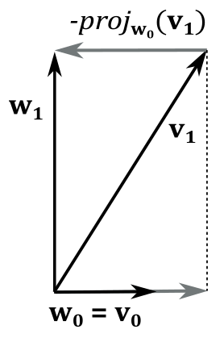
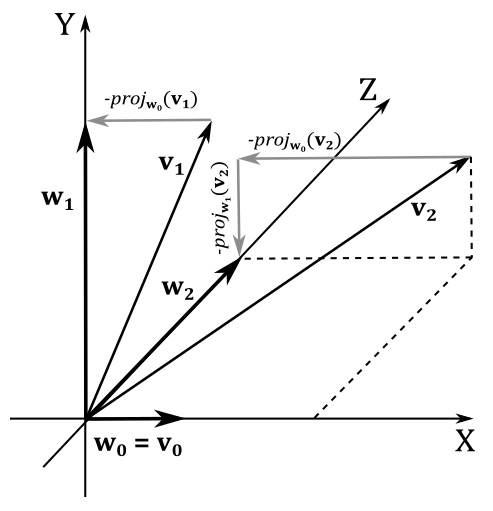
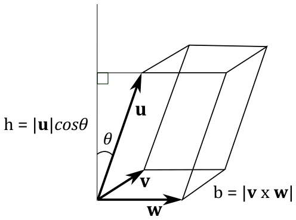

# A.01 - Vectors

<br>

# 1 - Coordinate systems

A coordinate system (or frame) is a system that uses one or more numbers (also called coordinates) to uniquely determine a position, provided that we define an origin, a unit of measurement and a positive direction. The use of a coordinate system allows problems in geometry to be translated into problems about numbers, and vice versa.

<br>

## 1.1 - 1D Coordinate system

We can determine a position $\mathbf{P}$ on a line (or a curve) with a single number (coordinate) $x$.

<br>


<br>

For example, $x=3$ specifies the position $\mathbf{P}$ is $3$ units away from the origin $\mathbf{O}$ in the positive direction along the line illustrated above. That way, each point\position of the line is given a unique coordinate, and each real number is the coordinate of a unique point on the line. So, the coordinate of a point $\mathbf{P}$ is defined as the signed distance between the origin $\mathbf{O}$ and the point.

## 1.2 - Cartesian coordinate system

In the plane, two perpendicular lines (also called axes) are chosen, and the coordinates $(x, y)$ of a point $\mathbf{P}$ are taken to be the signed distances between the origin $\mathbf{O}$ and the projection of $\mathbf{P}$ onto the axes.

<br>


<br>

For example, the point $\mathbf{P}$ in the illustration above has coordinates $(2, 3)$ since its projection is two units away from $\mathbf{O}$ along the x-axis, and three units away from $\mathbf{O}$ along the y-axis.

In three dimensions, three mutually orthogonal axes are chosen and the three coordinates $(x, y, z)$ of a point are the signed distances between the origin $\mathbf{O}$ and the projection of the point onto the axes. For this purpose, if you want to project a point $\mathbf{P}$ onto the x-axis, you can first project the point perpendicularly onto the xz-plane, so that we are in 2D once again. Then, you can project the result onto the x-axis.<br>
You can also see the coordinates $(x, y, z)$ as a sequence of movements from the origin $\mathbf{O}$ to the point $\mathbf{P}=(x, y, z)$. That is, starting from the origin $\mathbf{O}$, you move $x$ units along the x-axis. Then, from that position, you move $y$ units parallel to the y-axis. Finally, you move $z$ units parallel to the z-axis, as shown in the following illustration.

<br>


<br>

Depending on the direction and order of the axes, a three-dimensional system may be a right-handed or a left-handed system.

<br>


<br>

Usually the y-axis points up, the x-axis points right while the z-axis points forward in a left-handed coordinate system (backward in a right-handed frame). That’s not a strict rule, though. Sometimes, you can have the z-axis points up. In that case, the y-axis points backward in a left-handed system (forward in a right-handed one). You can always switch from a y-up to a z-up configuration with a simple transformation, but there's no point in providing further details here as we will mostly use a y-up configuration. Typically, with DirectX we will use a left-handed coordinate system. However, again, that’s not a strict rule: you can also use a right-handed coordinate system.

<br>

## 1.3 - Polar coordinate system

In the plane, a ray from the origin is chosen (the ray is often called polar axis, while the origin is called pole). The coordinates $(r,\theta)$ of a point $\mathbf{P}$ specify the distance $r$ from the origin and the angle $\theta$ from the polar axis. The distance $r$ from the origin is also called radius. Angles in polar notation are generally expressed in either degrees or radians $(2\pi$ rad being equal to $360°)$.

<br>


<br>

## 1.4 - Cylindrical and spherical coordinate systems 

In three dimensions, with the coordinates $(r, y, \theta)$ we extend the polar coordinate system with an additional coordinate to specify the height of a point. That way, we can locate all the points of a cylinder (that’s why we call them cylindrical coordinates).

<br>


<br>

Spherical coordinates take this a step further by converting the pair of cylindrical coordinates $r$ and $y$ to polar coordinates $r$ and $\varphi$, giving a triple $(r, \varphi, \theta)$. That way, we can identify all the points of a sphere. The following illustration shows how to convert from spherical to Cartesian coordinates, and back. Observe that the angle $\varphi$ is measured from the up direction.

<br>


<br>

## 1.5 - Homogeneous coordinate system

A point in the plane may be represented in homogeneous coordinates by a triple $(x, y, z)$, and we can calculate the related Cartesian coordinates by dividing by the z-coordinate: that is, $(x/z,\ y/z,\ z/z)$. This introduces an "extra" coordinate, as only two are commonly used to specify a point on a plane. Note that after the division to get the Cartesian coordinates, the last coordinate will be always 1. This extends to 3D spaces as well, so if we have the 3D Cartesian coordinates $(x, y, z)$, we can also write it as $(x, y, z, 1)$. In general, a homogeneous coordinate system is one where only the ratios of the coordinates are significant, and not the actual values.

<br>

<br>

# 2 - Vectors

Vectors describe quantities that have both a magnitude and a direction, such as displacements, forces and speed. In computer graphics, vectors are extensively used to specify the location of objects in the scene and the direction of their movements (as well as the direction of light rays, or the normal of surfaces). Moreover, vectors are also used to specify force and speed (especially if you are going to implement a physics engine).

<br>

## 2.1 - Definition

A vector can be represented geometrically by an arrow, where the length indicates the magnitude and the aim indicates the direction of the vector.

<br>


<br>

Since we need to manipulate vectors with a computer, we are not particularly interested in this geometric definition, although. Fortunately, we can also define vectors numerically with tuples (a finite sequence of numbers). To do that, we need to bind vectors to the origin of a Cartesian system (that is, you have to translate a vector without changing magnitude and direction until its tail coincides with the origin).

<br>


<br>

At that point, we can use the coordinates $(x, y, z)$ of the head of a vector $\mathbf{v}$ in a 3D Cartesian system as the numerical representation of the vector in that system. That is, we can write $\mathbf{v}=(x, y, z)$, with x, y and z called components of the vector. The same goes for a vector $\mathbf{v}$ in a 2D Cartesian system: the numerical representation is $(x, y)$. Then, we can use $\mathbf{v}$ to specify a point in a frame (maybe to set the position of an object, or the location you want to move it).

<br>


<br>

When only magnitude and direction of a vector matter, then the point of application is of no importance, and the vector is called free vector. On the other hand, a vector bound to a point is called bound vector. The numerical representation of a bound vector is only valid in the system where you bind it. If you bind the same free vector to different systems, the numerical representation changes as well.

<br>


<br>

This is an important point because if you define a vector by its coordinates, those coordinates are relative to a specific frame of reference. Then, we can conclude that two vectors $\mathbf{u}=(u_x, u_y, u_z)$ and $\mathbf{v}=(v_x, v_y, v_z)$ are equal only if $u_x=v_x$, $u_y=v_y$ and $u_z=v_z$. That is, they have the same coordinates if bound to the origin of a frame.

<br>

## 2.2 - Basic operations

We can also define some interesting operations that can be done with vectors. For example, addition, subtraction, and three different types of multiplication.

<br>

### 2.2.1 - Addition

Numerically, the sum of two vector $\mathbf{u}=(u_x, u_y, u_z)$ and $\mathbf{v}=(v_x, v_y, v_z)$ is defined as

<br>

$\mathbf{u}+\mathbf{v}=(u_x+v_x,\ u_y+v_y,\ u_z+v_z)$

<br>

The addition may be represented geometrically by placing the tail of the arrow $\mathbf{v}$ at the head of the arrow $\mathbf{u}$, and then drawing an arrow from the tail of $\mathbf{u}$ to the head of $\mathbf{v}$. This new arrow is the vector $\mathbf{u}+\mathbf{v}$, that represents (geometrically) the sum of the two vectors. Alternatively, we can bind $\mathbf{u}$ and $\mathbf{v}$ to a shared point and then draw the diagonal of the parallelogram with sides $\mathbf{u}$ and $\mathbf{v}$.

<br>


<br>

The difference of two vector $\mathbf{u}$ and $\mathbf{v}$ is defined as

<br>

$\mathbf{u}-\mathbf{v}=(u_x-v_x,\ u_y-v_y,\ u_z-v_z)$

<br>

The subtraction may be represented geometrically by bounding $\mathbf{u}$ and $\mathbf{v}$ to a shared point and then drawing an arrow from the head of $\mathbf{v}$ to the head of $\mathbf{u}$. Alternatively, we can place the tail of the inverse of $\mathbf{v}$ at the head of $\mathbf{u}$. At that point, we can draw an arrow from the tail of $\mathbf{u}$ to the head of $-\mathbf{v}$ (the inverse of a vector will be formally defined in the next section). The new arrow represents (geometrically) the vector $\mathbf{u}-\mathbf{v}$.

<br>


<br>

### 2.2.2 - Scalar multiplication

We can multiply a vector $\mathbf{v}=(x, y, z)$ with a scalar $k$ (a real number). Numerically, this operation is defined as

<br>

$k\mathbf{v}=k(x,y,z)=(kx,ky,kz)$

<br>

Geometrically, this is equivalent to scale a vector (that’s why real numbers are often called scalars). If $k$ is a negative number we have a change of direction as well (that is, the resultant vector aims in the opposite direction). If $k=−1$ we get the inverse $-\mathbf{v}$ of a vector $\mathbf{v}$. The inverse of a vector aims in the opposite direction without changing its length.

<br>


<br>

#### 2.2.2.1 - Properties of addition and scalar multiplication

Below are some of the properties of vector addition and scalar multiplication:

|                         |                                                                                                                      |
| ----------------------- | -------------------------------------------------------------------------------------------------------------------- |
| Commutative (vector)    | $\mathbf{u}+\mathbf{v}=\mathbf{v}+\mathbf{u}$                                                                        |
| Associative (vector)    | $(\mathbf{u}+\mathbf{v})+\mathbf{w}=\mathbf{u}+(\mathbf{v}+\mathbf{w})$                                              |
| Additive Identity       | $\mathbf{v}+\mathbf{0}=\mathbf{v}$  (where $\mathbf{0}$ is the zero (or null) vector, whose components are all zero) |
| Distributive (vector)   | $k(\mathbf{u}+\mathbf{v})=k\mathbf{u}+k\mathbf{v}$                                                                   |
| Distributive (scalar)   | $(k+t)\mathbf{v}=k\mathbf{v}+t\mathbf{v}$                                                                            |
| Associative (scalar)    | $k(t\mathbf{v})=(kt)\mathbf{v}$                                                                                      |
| Multiplicative Identity | $1\mathbf{v}=\mathbf{v}$   (where $k=1$ is a scalar)                                                                 |

<br>

#### 2.2.2.2 - Length of a vector

Now we can define the length of a vector $\|v\|$ (or $\|\|v\|\|$) as the scalar that indicates the magnitude of the vector. Consider the following illustration.

<br>


<br>

We have that $a$ is the length of the projection of the vector $\mathbf{v}$ onto the xz-plane. From the Pythagorean theorem, $a=\sqrt{x^2+z^2}$. From the same theorem, again, we have that

<br>

$\|\mathbf{v}\|=\sqrt{y^2+a^2}=\sqrt{y^2+(\sqrt{x^2+z^2})^2}=\sqrt{x^2+y^2+z^2}$

<br>

Sometimes, only the direction of a vector is important. In that case, we can normalize the vector so as to make its length 1. Usually, the symbol $\hat{\mathbf{v}}$ is used to indicate a unit vector (a vector with length 1). To normalize a vector $\mathbf{v}=(x, y, z)$ we can multiply it by the reciprocal of its magnitude.

<br>

$\displaystyle\hat{\mathbf{v}}=\frac{\mathbf{v}}{\|\mathbf{v}\|}=\left(\frac{x}{\|\mathbf{v}\|},\frac{y}{\|\mathbf{v}\|},\frac{z}{\|\mathbf{v}\|}\right)$

<br>

We can verify that $\hat{\mathbf{v}}$ is a unit vector by computing its length.

<br>

$\displaystyle\|\hat{\mathbf{v}}\|=\sqrt{\left(\frac{x}{\|\mathbf{v}\|}\right)^2+\left(\frac{y}{\|\mathbf{v}\|}\right)^2+\left(\frac{z}{\|\mathbf{v}\|}\right)^2}=\frac{\sqrt{x^2+y^2+z^2}}{\sqrt{\|\mathbf{v}\|^2}}=\frac{\|\mathbf{v}\|}{\|\mathbf{v}\|}=1$

<br>

Three unit vectors are of particular importance: $\mathbf{i}=(1,0,0)$, $\mathbf{j}=(0,1,0)$ and $\mathbf{k}=(0,0,1)$. These vectors have unit lengths, pointing up the x-, y-, and z-axis of a 3D Cartesian coordinate system, respectively. Often, we refer to these vectors as the standard basis vectors of a frame.

<br>


<br>

### 2.2.3 - Dot product

This form of vector multiplication results in a scalar value (that’s why it’s also called scalar product). The dot product of two vector $\mathbf{u}=(u_x, u_y, u_z)$ and $\mathbf{v}=(v_x, v_y, v_z)$ is defined as

<br>

$\mathbf{u}\cdot\mathbf{v}=u_xv_x+u_yv_y+u_zv_z$

<br>

So, the dot product of two vectors is a sum of products of the corresponding components.
Below are some of the properties of the dot product:

|                           |                                                                                                                                         |
| ------------------------- | --------------------------------------------------------------------------------------------------------------------------------------- |
| Commutative               | $\mathbf{u}\cdot\mathbf{v}=\mathbf{v}\cdot\mathbf{u}$                                                                                   |
| Distributive              | $(\mathbf{u}+\mathbf{v})\cdot\mathbf{w}=\mathbf{w}\cdot(\mathbf{u}+\mathbf{v})=(\mathbf{w}\cdot\mathbf{u})+(\mathbf{w}\cdot\mathbf{v})$ |
| Square of a vector length | $\|\mathbf{v}\|^2=v_x^2+v_y^2+v_z^2=\mathbf{v}\cdot\mathbf{v}$                                                                          |

<br>

The associative property doesn’t apply since $\mathbf{w}\cdot(\mathbf{u}\cdot\mathbf{v})$ isn’t defined. Indeed, the dot product is an operation between two vectors, but $(\mathbf{u}\cdot\mathbf{v})$ is a scalar. 

<br>

From the law of cosines $c^2=a^2+b^2-2ab\cos{\theta}$ (a proof is provided at the end of the section) we can show that

<br>

$$\begin{equation}\tag{1}\mathbf{v}\cdot\mathbf{u}=|\mathbf{v}| |\mathbf{u}|\cos{\theta}\end{equation}$$

<br>

Indeed, if we set $a=\|\mathbf{u}\|$, $b=\|\mathbf{v}\|$ and $c=\|\mathbf{u}-\mathbf{v}\|$ we have that

<br>

$$
\begin{align*} c^2 &= a^2 + b^2 - 2ab \cos{\theta} \\\ 
|\mathbf{u-v}|^2 &= |\mathbf{u}|^2 + |\mathbf{v}|^2 - 2|\mathbf{u}| |\mathbf{v}|\cos{\theta} \\\ 
(\mathbf{u} - \mathbf{v}) \cdot (\mathbf{u} - \mathbf{v}) &= \mathbf{u} \cdot \mathbf{u} + \mathbf{v} \cdot \mathbf{v} - 2|\mathbf{u}| |\mathbf{v}|\cos{\theta} \\\ 
\mathbf{u} \cdot\mathbf{u} -2(\mathbf{u} \cdot \mathbf{v}) + \mathbf{v} \cdot \mathbf{v} &= \mathbf{u} \cdot \mathbf{u} + \mathbf{v} \cdot \mathbf{v} - 2|\mathbf{u}| |\mathbf{v}|\cos{\theta} \\\
 \mathbf{u}\cdot \mathbf{v} &= |\mathbf{u}| |\mathbf{v}|\cos{\theta} \end{align*}
$$

<br>

From equation $(1)$ we can derive other properties. For example,

- If $(\mathbf{u}\cdot\mathbf{v}) = 0$ then the angle $\theta$ between $\mathbf{u}$ and $\mathbf{v}$ is $90°$ (that is, they are orthogonal: $\mathbf{u}\ \bot\ \mathbf{v}$)
- If $(\mathbf{u}\cdot\mathbf{v}) > 0$ then the angle $\theta$ between $\mathbf{u}$ and $\mathbf{v}$ is less than $90°$
- If $(\mathbf{u}\cdot\mathbf{v}) < 0$ then the angle $\theta$ between $\mathbf{u}$ and $\mathbf{v}$ is greater than $90°$

<br>

To conclude this section we will prove the law of cosines $c^2=a^2+b^2-2ab\cos{\theta}$.

<br>

>Let $\mathbf{a}$ be the vector from $C$ to $B$, $\mathbf{b}$ the vector from $C$ to $A$, and $\mathbf{c}$ the vector from $A$ to $B$.
>
><br>
>
>
>
><br>
>
>We have that 
>
>$\mathbf{c}=\mathbf{a}-\mathbf{b}\quad$ (subtration of two vectors)
>
>Squaring both sides and simplifying
>
>$\|\mathbf{c}\|^2=\|\mathbf{a}-\mathbf{b}\|^2$
>
>$\|\mathbf{c}\|^2=(\mathbf{a}-\mathbf{b})\cdot (\mathbf{a}-\mathbf{b})\quad\quad\quad\quad\quad\quad\quad\quad$ (square of a vector length)
>
>$\|\mathbf{c}\|^2=\|\mathbf{a}\|^2+\|\mathbf{b}\|^2-2\ \mathbf{a}\cdot\mathbf{b}\quad\quad\quad\quad\quad\quad\quad$ (distributive law of the dot product)
>
>$\|\mathbf{c}\|^2=\|\mathbf{a}\|^2+\|\mathbf{b}\|^2-2\|\mathbf{a}\|\|\mathbf{b}\| \cos{\theta}\quad\quad\quad\quad$ (equation (1))

<br>

#### 2.2.3.1 - Orthogonal projection

We can define the orthogonal projection of a vector $\mathbf{v}$ onto another vector $\mathbf{n}$ as the vector $\text{proj}_\mathbf{n}(\mathbf{v})$. Consider the following illustration.

<br>


<br>

From trigonometry, we know that the adjacent side can be derived from the hypotenuse, multiplied by the cosine of the angle between adjacent side and hypotenuse. In this case, we have $\text{adj}=\|\text{proj}_\mathbf{n}(\mathbf{v})\|$ and $\text{hyp}=\|\mathbf{v}\|$. So, if $\mathbf{n}$ is a unit vector, then we can write

<br>

$\text{proj}_\mathbf{n}(\mathbf{v})=(\|\mathbf{v}\|\cos{\theta})\mathbf{n}=(\|\mathbf{v}\|1\cos{\theta})\mathbf{n}=(\|\mathbf{v}\|\|\mathbf{n}\|\cos{\theta})\mathbf{n}=(\mathbf{v}\cdot\mathbf{n})\mathbf{n}$

<br>

with $(\mathbf{v}\cdot\mathbf{n})$ signed length of the projection, and with $\mathbf{n}$ that indicates its direction: This means that $(\mathbf{v}\cdot\mathbf{n})$ can invert the direction of projection if $\theta > 90°$. Anyway, this gives us a geometrical interpretation of the dot product, at least if $\mathbf{n}$ is a unit vector. If that's not the case, we can always normalize $\mathbf{n}$ to make it unit length. Then, we can replace $\mathbf{n}$ with its normalized version $\mathbf{n}/\|\mathbf{n}\|$, giving us the more general formula

<br>

$\text{proj}_\mathbf{n}(\mathbf{v})=\left(\mathbf{v}\cdot\displaystyle\frac{\mathbf{n}}{\|\mathbf{n}\|}\right)\displaystyle\frac{\mathbf{n}}{\|\mathbf{n}\|}=\displaystyle\frac{(\mathbf{v}\cdot\mathbf{n})}{\|\mathbf{n}\|^2}\mathbf{n}$

<br>

Thanks to the orthogonal projection, we can write a generic bound vector $\mathbf{v}$ as a sum of its projections onto the standard basis vectors.

<br>

$\mathbf{v}=(\mathbf{v}\cdot\mathbf{i})\mathbf{i}+(\mathbf{v}\cdot\mathbf{j})\mathbf{j}+(\mathbf{v}\cdot\mathbf{k})\mathbf{k}=x\mathbf{i}+y\mathbf{j}+z\mathbf{k}=x(1, 0, 0)+y(0, 1, 0)+z(0, 0, 1)=(x, y, z)$

<br>

Indeed, we have

<br>

$(\mathbf{v}\cdot\mathbf{i})=(x, y, z)\cdot(1, 0, 0)=x$ <br>
$(\mathbf{v}\cdot\mathbf{j})=(x, y, z)\cdot(0, 1, 0)=y$ <br>
$(\mathbf{v}\cdot\mathbf{k})=(x, y, z)\cdot(0, 0, 1)=z$

<br>

Also, note that $(x\mathbf{i}+z\mathbf{k})$ is the projection of $\mathbf{v}$ onto the xz-plane, so that we can sum this projection with $y\mathbf{j}$ to get $\mathbf{v}$.

<br>


<br>

You can also see it as a sum of scaled vectors: we scale $\mathbf{i}$, $\mathbf{j}$ and $\mathbf{k}$ with the components of $\mathbf{v}$. Indeed, the diagonal of the parallelogram defined by $x\mathbf{i}$ and $z\mathbf{k}$ is $(x\mathbf{i}+z\mathbf{k})$. Then, $\mathbf{v}$ is the diagonal of the parallelogram defined by $(x\mathbf{i}+z\mathbf{k})$ and $y\mathbf{j}$, that is $\ x\mathbf{i}+z\mathbf{k}+y\mathbf{j}$.<br>
Remember that you can also see it as a sequence of three translations: starting from the origin of the frame, we move $x$ units along the x-axis. Then, from that position, we move $y$ units in the same direction of the y-axis. Finally, we move $z$ units in the same direction of the z-axis. That’s the reason we call $\mathbf{i}$, $\mathbf{j}$ and $\mathbf{k}$ basis vectors: we can define every bound vector in a frame as a combination of these three unit vectors, with the components of the vector as coefficients.<br>
As stated earlier, the components of a bound vector are the coordinates of the arrowhead inside a frame. This implies we can use bound vectors to uniquely identify all the points of a frame. And indeed, we will use vectors to specify points as well. However, we still need a way to differentiate between vectors and points as they are not interchangeable. Observe that, for vectors, only direction and magnitude are important, so the point of application is irrelevant. On the other hand, points uniquely identify a location, so they only make sense if bound to the origin of a frame. Moreover, you can subtract points to get a vector that specifies how to move from a point to another. And you can also add a point and a vector to get a vector that specifies how to move a point to another location. However, unlike vectors, the addition of points doesn’t make any sense: you get the diagonal of a parallelogram, which doesn't mean anything geometrically. In short, think of vectors as free vectors, while considering points as bound vectors. So, if you have a vector $\mathbf{v}=(x, y, z)$, you need to know if it’s a point or a vector before to use it properly. We will return to the difference between points and vectors in a later tutorial.

<br>

#### 2.2.3.2 - Gram-Schmidt Orthogonalization

A computer cannot exactly represent all the elements in the infinite set of real numbers because it uses a finite number of bits to store values in memory. This means we have to settle for a good approximation. The downside is that, if you need to perform many calculations with approximate values, the outcome could differ significantly from the exact result. For example, a set of vectors $\\{\mathbf{v_0},\dots,\mathbf{v_{n-1}}\\}$ is called orthonormal if they are all unit vectors and orthogonal to each other. However, due to numerical precision issues, we might start off with an orthonormal set that gradually becomes un-orthonormal after some calculations. Fortunately, we can always orthogonalize the set and make it orthonormal again. We are mainly interested in the 3D case of this problem (sets with three basic vectors). However, it is simpler to examine the 2D case first.

Suppose we have an un-orthonormal set of vectors $\\{\mathbf{v_0},\mathbf{v_1}\\}$ that we want to orthogonalize into an orthonormal set $\\{\mathbf{w_0},\mathbf{w_1}\\}$. First, we can set $\mathbf{w_0}=\mathbf{v_0}$ since we can always assume one of the vectors is okay. Then we try to change $\mathbf{v_1}$ to make it orthogonal with $\mathbf{w_0}$. To do that, we need to subtract from $\mathbf{v_1}$ its projection onto $\mathbf{w_0}$. Indeed, in the following illustration you can verify that

<br>

$\mathbf{v_1}=\mathbf{w_1}+\text{proj}_{\mathbf{w_0}}(\mathbf{v_1})$

<br>



<br>

So, we have that

<br>

$\mathbf{w_1}=\mathbf{v_1}-\text{proj}_{\mathbf{w_0}}(\mathbf{v_1})$

<br>

where $\ \text{proj}_{\mathbf{w_0}}(\mathbf{v_1})=\displaystyle\frac{\mathbf{v_1}\cdot\mathbf{w_0}}{\|\mathbf{w_0}\|^2}\mathbf{w_0}$

<br>

To prove that $\mathbf{w_0}$ and $\mathbf{w_1}$ are orthogonal we can first observe that a projection is orthogonal if the direction of projection forms a right angle $(90°)$ with the vector we project onto (see the dashed line in the illustration above). Also, we know that the sum of two vectors is the diagonal of the parallelogram with sides the two vectors. In this case we have a rectangle since we just established that an angle of the parallelogram with diagonal $v_1$ is $90°$. So, we verified that $\mathbf{w_0}\ \bot\ \mathbf{w_1}$.

In the 3D case, we have a third vector $\mathbf{v_2}$ we must modify to make it orthogonal to both $\mathbf{w_0}$ and $\mathbf{w_1}$. Once again, we can set $\mathbf{w_0}=\mathbf{v_0}$, and to calculate $\mathbf{w_1}$ we can still subtract $\text{proj}\_{\mathbf{w_0}}(\mathbf{v_1})$ from $\mathbf{v_1}$ because we can always consider $\mathbf{v_0}$ and $\mathbf{v_1}$ as in the same plane (that is, we fall back into the 2D case). In a similar way, we can compute $\mathbf{w_2}$ by subtracting out $\text{proj}\_{\mathbf{w_0}}(\mathbf{v_2})$ from $\mathbf{v_2}$, and then subtracting $\text{proj}\_{\mathbf{w_1}}(\mathbf{v_2})$ from the resultant vector. 

<br>

$\mathbf{w_2}=\mathbf{v_2}-\text{proj}_{\mathbf{w_0}}(\mathbf{v_2}) -\text{proj}\_{\mathbf{w_1}}(\mathbf{v_2})$

<br>

Consider the following illustration. If we subtract $\text{proj}\_{\mathbf{w_0}}(\mathbf{v_2})$ from $\mathbf{v_2}$ the resultant vector is orthogonal to $\mathbf{w_0}$ and lies in the YZ-plane. Then, if we subtract $\text{proj}\_{\mathbf{w_1}}(\mathbf{v_2})$ from this temporary vector we get $\mathbf{w_2}$, which is orthogonal to both $\mathbf{w_0}$ and $\mathbf{w_1}$.

<br>



<br>

The last step is to normalize $\\{\mathbf{w_0},\mathbf{w_1},\mathbf{w_2}\\}$ to get an orthonormal set.

<br>

### 2.2.4 - Cross product

This type of multiplication is also called vector product as the result is a vector (unlike the dot product which evaluates to a scalar). The cross product is defined as

<br>

$\mathbf{w}=\mathbf{u}\times\mathbf{v}=(u_y v_z-u_z v_y,\ u_z v_x-u_x v_z,\ u_x v_y-u_y v_x)$

<br>

A way to remember this formula is to notice that the first component of the vector $\mathbf{w}$ is missing the subscript $x$, the second component is missing the subscript $y$, and the third component is missing the subscript $z$. Also, we use the subscripts $\\{x,y,z\\}$ as a circular sequence. For example, in the first component of $\mathbf{w}$ we exclude the subscript $x$, so we start with $y$ and $z$ in the minuend, inverting the subscripts in the subtrahend. In the second component we exclude the subscript $y$, so we start with $z$ and $x$ in the minuend, inverting the subscripts in the subtrahend. You can easily conclude that the third component starts with $x$, followed by $y$.<br>
We can also use matrices to calculate the cross product. For example, the cross product $\mathbf{u}\times\mathbf{v}$ is equal to the determinant of the $3\times 3$ matrix with $\mathbf{i}$, $\mathbf{j}$ and $\mathbf{k}$ as elements of the first row, and the components of the two vectors $\mathbf{u}$ and $\mathbf{v}$ as elements of the other two rows.

<br>

$\mathbf{w}=\mathbf{u}\times\mathbf{v}=\left\lvert\matrix{\mathbf{i} & \mathbf{j} & \mathbf{k} \cr u_x & u_y & u_z \cr v_x & v_y & v_z}\right\rvert=$<br><br>
$(u_y v_z-u_z v_y)\mathbf{i}-(u_x v_z-u_z v_x)\mathbf{j}+(u_x v_y-u_y v_x)\mathbf{k}=$<br><br>
$(u_y v_z-u_z v_y,\ u_z v_x-u_x v_z,\ u_x v_y-u_y v_x)$

<br>

Also, the cross product can be computed multiplying a row by a matrix.

<br>

$\mathbf{w}=\mathbf{u}\times\mathbf{v}=\left\lbrack\matrix{v_x&v_y&v_z}\right\rbrack\left\lbrack\matrix{0&u_z&-u_y \cr -u_z&0&u_x \cr u_y&-u_x&0}\right\rbrack=$<br><br>
$(u_yv_z-u_zv_y,\ u_zv_x-u_xv_z,\ u_xv_y-u_yv_x)$

<br>

We will cover matrices in the next appendix, where we will show that the determinant of a matrix is related to the concept of hypervolume (that is, length in 1D, area in 2D, and volume in 3D). In this section we can use this information to find something interesting. We know that two vectors always lie in a plane (that is, we are in 2D), and that to calculate the area of a parallelogram we multiply its base times the height. Then, we are supposed to find a similar formula for the cross product because, to compute it, we can use the determinant of a matrix, which is related to the concept of hypervolume. Indeed, we can also write the cross product as

<br>

$\mathbf{w}=\mathbf{u}\times\mathbf{v}=\mathbf{n}\|\mathbf{u}\|\|\mathbf{v}\|\sin{\theta}$

<br>

with $\mathbf{n}$ unit vector indicating the direction of $\mathbf{w}$, and with $\|\mathbf{u}\|\|\mathbf{v}\|\sin{\theta}$ indicating the length of $\mathbf{w}$. We call $\mathbf{n}$ normal, which means it’s orthogonal to the plane it refers to (in this case, the plane defined by $\mathbf{u}$ and $\mathbf{v}$). Now, we need to find a connection between the above formula and the area $A_p$ of the parallelogram with sides $\mathbf{u}$ and $\mathbf{v}$. Consider the following illustration.

<br>


<br>

We know that $A_p=b\times h$, so we should have something like

<br>

$A_p=\|\mathbf{w}\|=\|\mathbf{u}\times\mathbf{v}\|=\|\mathbf{u}\|\|\mathbf{v}\|\sin{\theta}$

<br>

since $\|\mathbf{n}\|=1$, and the area of a parallelogram is a scalar value (then we have to use the length of the cross product). As you can see in the illustration above, we have $\|\mathbf{v}\|=b$ and $\|\mathbf{u}\|\sin{\theta}=h$. So, it’s $A_p=\|\mathbf{w}\|=\|\mathbf{u}\times\mathbf{v}\|$ as expected. Then, we just found a geometric representation of the length of the cross product.

As stated above, the vector $\mathbf{n}$ is orthogonal to the plane defined by $\mathbf{u}$ and $\mathbf{v}$. So, the resultant vector $\mathbf{w}$ of the cross product is orthogonal to both $\mathbf{u}$ and $\mathbf{v}$. Ok, but we have two sides that $\mathbf{w}$ could aim at. Which side is the right one? In left-handed systems, it’s the one that makes $\mathbf{u}$, $\mathbf{v}$ and $\mathbf{w}$ a left-handed system. Alternatively, you can verify that the correct side is the one where $\mathbf{w}$ "sees" the first operand (in this case $\mathbf{u}$) rotates clockwise toward the second operand $(\mathbf{v})$ with an angle of rotation $0≤θ≤\pi$. You can also use your left hand: aim the fingers in the same direction of $\mathbf{u}$, and curl your fingers toward $\mathbf{v}$, then your thumb points in the direction of $\mathbf{w}$; this is called the left-hand-thumb rule.<br>
In right-handed systems, the correct side is the one that makes $\mathbf{u}$, $\mathbf{v}$ and $\mathbf{w}$ a right-handed system.

<br>


<br>

The commutative property doesn’t apply $(\mathbf{u}\times\mathbf{v}\ne\mathbf{v}\times\mathbf{u})$ as if you swap the vectors $\mathbf{u}$ and $\mathbf{v}$ the direction of $\mathbf{w}$ changes as well (you can check it with the left-hand-thumb rule). However, you can easily verify that the following equivalence is true.

<br>

$\mathbf{u}\times\mathbf{v}=-(\mathbf{v}\times\mathbf{u})$

<br>

And we also have that

<br>

$\mathbf{i}\times\mathbf{j}=\mathbf{k}$<br>
$\mathbf{j}\times\mathbf{k}=\mathbf{i}$<br>
$\mathbf{k}\times\mathbf{i}=\mathbf{j}$<br>

$\mathbf{j}\times\mathbf{i}=\mathbf{-k}$<br>
$\mathbf{k}\times\mathbf{j}=\mathbf{-i}$<br>
$\mathbf{i}\times\mathbf{k}=\mathbf{-j}$<br>

$\mathbf{i}\times\mathbf{i}=\mathbf{0}$<br>
$\mathbf{j}\times\mathbf{j}=\mathbf{0}$<br>
$\mathbf{k}\times\mathbf{k}=\mathbf{0}$<br>

<br>

A way to remember the above equivalences is to consider the unit vectors $\\{\mathbf{i},\mathbf{j},\mathbf{k}\\}$ as a circular sequence. If you cross multiply a vector by the next one, you get the third vector with a positive sign. Otherwise, you get a negative sign. Observe that if you cross multiply a vector by itself the result is the zero vector as you can’t build a parallelogram with two equal vectors: you get a segment, so the area is zero.

<br>

### 2.2.5 - Scalar and vector triple product

The scalar triple product is nothing really new, as it’s just a mix of the dot and cross products. It’s defined as

<br>

$V=\mathbf{u}\cdot(\mathbf{v}\times\mathbf{w})$

<br>

where $V$ is the volume of the parallelepiped made up of the bound vectors $\mathbf{u}$, $\mathbf{v}$ and $\mathbf{w}$. Consider the following illustration.

<br>



<br>

As you know, the length of the cross product is the area of a parallelogram. Also, the volume of a parallelepiped is $V=b\times h$. So, in order to compute the volume of the parallelepiped illustrated above, we need to write

<br>

$V=\|\mathbf{u}\| \|\mathbf{v}\times\mathbf{w}\|\cos{\theta}$

<br>

with $\|\mathbf{v}\times\mathbf{w}\|=b$ and $\|\mathbf{u}\|\cos{\theta}=h$.<br>
From equation $(1)$ we can also write it as

<br>

$V=\mathbf{u}\cdot (\mathbf{v}\times\mathbf{w})$

<br>

which is the scalar triple product. If you expand it you have

<br>

$\mathbf{u}\cdot(\mathbf{v}\times\mathbf{w})=\mathbf{u}\cdot(v_yw_z-v_zw_y, v_zw_x-v_xw_z, v_xw_y-v_yw_x)=$


$u_x v_y w_z - u_x v_z w_y + u_y v_z w_x - u_y v_x w_z + u_z v_x w_y - u_z v_y w_x$

<br>

which is exactly the determinant of the $3\times 3$ matrix with $\mathbf{u}$, $\mathbf{v}$ and $\mathbf{w}$ as rows. We will prove this result in the next appendix, where we will cover matrices.

We conclude this section pointing out that a vector triple product $\mathbf{a}\times(\mathbf{b}\times \mathbf{c})$ also exists. However, we will only demonstrate the following identity, called the BAC-CAB identity.

<br>

$\mathbf{a}\times(\mathbf{b}\times\mathbf{c})=\mathbf{b}(\mathbf{a}\cdot\mathbf{c})-\mathbf{c}(\mathbf{a}\cdot\mathbf{b})$

<br>

>$\mathbf{a}\times (\mathbf{b}\times\mathbf{c})=(a_x, a_y, a_z)\times [(b_x, b_y, b_z)\times (c_x, c_y, c_z)]=$
>
>$(a_x,\, a_y,\, a_z)\times (b_yc_z-b_zc_y,\; b_zc_x-b_xc_z,\; b_xc_y-b_yc_x)=$
>
>$\big({\color{#FF6666}{a_y (b_xc_y-b_yc_x)-a_z (b_zc_x-b_xc_z)}},\ {\color{#44FF66}{a_z (b_yc_z-b_zc_y)-a_x\ (b_xc_y-b_yc_x)}},\ {\color{#44AAFF}{a_x (b_zc_x-b_xc_z)-a_y(b_yc_z-b_zc_y)}}\big)$
>
><br>
>
>Below we can see that the first component of $\mathbf{b}(\mathbf{a}\cdot\mathbf{c})-\mathbf{c}(\mathbf{a}\cdot\mathbf{b})$ is equivalent to the first component of $\mathbf{a}\times(\mathbf{b}\times\mathbf{c})$
>
><br>
>
>$(\mathbf{b}(\mathbf{a}\cdot\mathbf{c})-\mathbf{c}(\mathbf{a}\cdot\mathbf{b}))_x = b_x (a_xc_x+a_yc_y+a_zc_z)-c_x (a_xb_x+a_yb_y+a_zb_z)=$
>
>$a_xb_xc_x+a_yb_xc_y+a_zb_xc_z-a_xb_xc_x-a_yb_yc_x-a_zb_zc_x=$
>
>${\color{#FF6666}{a_y (b_xc_y-b_yc_x)-a_z (b_zc_x-b_xc_z)}}$
>
><br>
>
>The same applies to the other two components.

<br>

<br>

# 3 - Vectors in DirectX

In HLSL, we simply use the built-in types **float2**, **float3** and **float4** to represent vectors of two, three and four floating-point components, respectively. Similarly, we use **int2**, **int3** and **int4** for vectors of integers. Alternatively, we can use the keyword **vector** to declare vectors of various components and types. The shader model defines 128-bit shader core registers to hold both integer and floating-point vectors to perform SIMD operations (more on this shortly). <br>
To access a specific component of a vector we can use indexing, or one of two naming sets:

 The position set:  $\ x,y,z,w$<br>
 The color set: $\ r,g,b,a$

Specifying one or more vector components is called swizzling. For example:

<br>

```hlsl
vector<int, 1> iVector = 1;                             // int iVector = 1;
vector<double, 4> dVector = { 0.2, 0.3, 0.4, 0.5 };     // float4 dVector = { 0.2, 0.3, 0.4, 0.5 };  
  
float4 u = { 1.0f, 2.0f, 3.0f, 0.0f };
float f0 = u.x;         // f0 = 1.0f
float f1 = u.g;         // f1 = 2.0f
float f2 = u[2];        // f2 = 3.0f
u.a = 4.0f;             // u = (1.0f, 2.0f, 3.0f, 4.0f)
 
float4 v = { 1.0f, 2.0f, 3.0f, 4.0f };
float3 vec1 = v.xyz;            // vec1 = (1.0f, 2.0f, 3.0f)
float2 vec2 = v.rb;             // vec2 = (1.0f, 3.0f)
float4 vec3 = v.zzxy;           // vec3 = (3.0f, 3.0f, 1.0f, 2.0f)
vec3.wxyz = vec3;               // vec3 = (3.0f, 1.0f, 2.0f, 3.0f)
vec3.yw = vec1.zz;              // vec3 = (3.0f, 3.0f, 2.0f, 3.0f)
 
float4 w = float4(vec1, 5.0);   // w = (1.0f, 2.0f, 3.0f, 5.0f)

```
<br>

In C++, the following definition specifies we can use the type **XMVECTOR** to define variables that can be mapped to 128-bit CPU registers.

<br>

```cpp
typedef __m128 XMVECTOR;
```
<br>

That is, a variable of type **__m128** is backed by a memory region of 128 bits that the compiler can use as a source\destination to load\store data in\from XMM[0-7] registers, which are used in SIMD instructions. SIMD (single instruction multiple data) allows us to perform more operations with a single instruction. To better understand how SIMD works, it’s useful to consider a practical example. First, it is worth noting that in DirectX it is common to use vectors of four components, where each of them is a 4-byte floating point or integer value. 

>You may wonder why we have vectors of four components if we mostly work in 3D space (where only 3 coordinates are needed). Well, as we will see in a later tutorial, at some point we will introduce an extra coordinate to distinguish between free vectors and bound vectors. That is, we will work in a special homogeneous coordinate system to use both points and vectors.

Now consider the following sum of vectors, which means four sums of the corresponding components.

<br>

$\mathbf{u}+\mathbf{v}=(u_x+v_x,\ u_y+v_y,\ u_z+v_z,\ u_w+v_w)$

<br>

With SIMD we can perform the four sums in a single instruction. In general, the math API of DirectX, called DirectXMath, takes advantage of SIMD to let the CPU perform four operations (OPs) in a single instruction. That is, DirectXMath can use SIMD instructions to perform the same operation on the corresponding components of a couple of **XMVECTOR**s used as operands\sources, as shown in the following illustration.

<br>


<br>

The only problem is that **__m128** variables need to be aligned on 16-byte boundaries in memory. That’s not really an issue if you declare a global or local variable of this type because the compiler will automatically align them. Problems arise when you use a **XMVECTOR** (which is an alias for **__m128**) as a member of a structure or a class, where the C++ packing rules can misalign it. For this purpose, DirectXMath provides the following types, which allow us to use integer or floating-point vectors as class members.

<br>

```cpp
// 32-bit signed floating-point components
struct XMFLOAT2
{
    float x;
    float y;
};
 
 
struct XMFLOAT3
{
    float x;
    float y;
    float z;
};
 
 
struct XMFLOAT4
{
    float x;
    float y;
    float z;
    float w;
};
```
<br>

```cpp
// 32-bit signed integer components
struct XMINTT2
{
    int x;
    int y;
};
 
 
struct XMINT3
{
    int x;
    int y;
    int z;
};
 
 
struct XMINT4
{
    int x;
    int y;
    int z;
    int w;
};
```
<br>

These types can be used without worrying about alignment issues. However, we can’t take advantage of SIMD if you use them, as they don’t map to XMM registers. So, you must remember to convert to **XMVECTOR** before performing any calculations on vectors. DirectXMath also provides some helper functions to convert from **XMFLOAT** to **XMVECTOR**.

<br>

```cpp
XMVECTOR XMLoadFloat2(const XMFLOAT2* pSource);
 
XMVECTOR XMLoadFloat3(const XMFLOAT3* pSource);
 
XMVECTOR XMLoadFloat4(const XMFLOAT4* pSource);
```
<br>

And back from **XMVECTOR** to **XMFLOAT** (similar functions are defined for **XMINT** as well).

<br>

```cpp
void XMStoreFloat2(XMFLOAT2* pDestination, FXMVECTOR  V);
 
void XMStoreFloat3(XMFLOAT3* pDestination, FXMVECTOR  V);
 
void XMStoreFloat4(XMFLOAT4* pDestination, FXMVECTOR  V);
```
<br>

If a function takes one or more **XMVECTOR**s as parameters then:

- **FXMVECTOR** must be used for the first three parameters.
- **GXMVECTOR** must be used for the fourth parameter.
- **HXMVECTOR** must be used for the remaining ones.

<br>

This allows to use the appropriate calling conventions for each platform supported by the DirectXMath Library. To learn more about calling convections you can refer to the official documentation (see [3] and [4] in the reference list at the end of the tutorial). 

As stated above, **XMVECTOR** is just an alias for **__m128**, which identify a type mapped to XMM registers. This means we can't simply use **XMVECTOR** to operate with vectors without using SIMD instructions. For this reason, DirectXMath provides many helper functions that take advantage of SIMD to initialize **XMVECTOR**s and operate with them. We will examine most of these functions in the upcoming tutorials.

If you want to declare a vectorized-constant (const **XMVECTOR**) then it is recommended to use **XMVECTORF32** for floating-point values, and **XMVECTORU32** (or **XMVECTORI32**) for integer values. That’s because these types are defined as the union of a **XMVECTOR** and an array. This allows us to use the initialization syntax, and let the compiler use SIMD instructions for other operations.

<br>

```cpp
__declspec(align(16)) struct XMVECTORF32
{
    union
    {
        float f[4];
        XMVECTOR v;
    };
 
    inline operator XMVECTOR() const { return v; }
    inline operator const float* () const { return f; }
};
 
 
static const XMVECTORF32 vZero = { 0.0f, 0.0f, 0.0f, 0.0f };
```
<br>

<br>

# References
[1] Practical Linear Algebra: A Geometry Toolbox (Farin, Hansford)<br>
[2] [Library Internals (Microsoft Docs)](https://docs.microsoft.com/en-us/windows/win32/dxmath/pg-xnamath-internals)<br>
[3] [__vectorcall (Microsoft Docs)](https://docs.microsoft.com/en-us/cpp/cpp/vectorcall?view=msvc-170)

<br>

***
If you found the content of this tutorial somewhat useful or interesting, please consider supporting this project by clicking on the **Sponsor** button.  Whether a small tip, a one time donation, or a recurring payment, it's all welcome! Thank you!<br><br>
<p align="center">
 <a href="https://github.com/sponsors/PAMinerva">
         
      </a>
</p><br>