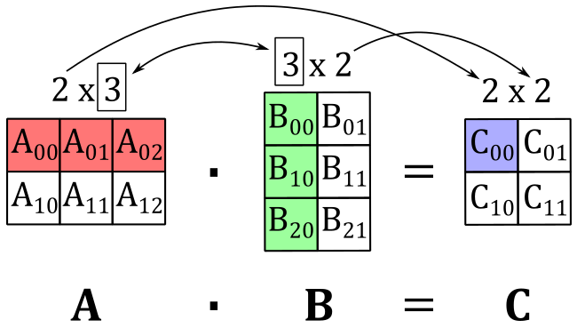
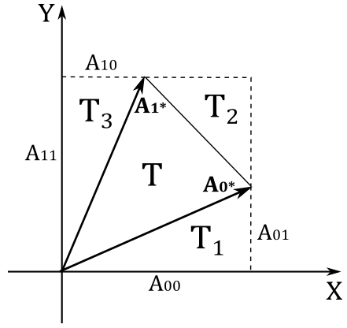

# A.02 - Matrices

<br>

# A.02 - Matrices

<br>

# 1 - Introduction

A matrix is a mathematical object associated with a function. This means a matrix can represent a transformation we can use to change the coordinates of points and vectors to go from a frame to another. Common transformations are scaling, rotation, translation, or any composition of them.

<br>

<br>

# 2 - Definition

Basically, a matrix is just a rectangular table of numbers arranged in rows and columns.<br>
The product of rows and columns gives the dimension of the matrix. For example, an $m\times n$ matrix has $m$ rows and $n$ columns. The numbers in a matrix are called elements or entries. To refer to a particular entry of a matrix $\mathbf{M}$, a double subscript notation $M_{ij}$ is often used to indicate the element in the i-th row and j-th column. Matrices are commonly written in square brackets.

<br>

$\mathbf{M}=\left\lbrack\matrix{M_{00}&M_{01}&\cdots&M_{0(n-1)} \cr M_{10}&M_{11}&\cdots&M_{1(n-1)} \cr \vdots&\vdots&\ddots&\vdots \cr M_{(m-1)1}&\cdots&M_{(m-1)0}&M_{0(n-1)}}\right\rbrack$

<br>

In computer graphics, we usually deal with square matrices $n\times n$, where the numbers of rows and columns are the same. Also, we’ll widely use row vectors and the column vectors, which are matrices of dimensions $1\times n$ and $n\times 1$, respectively. Lowercase letters are normally used to identify row and vector matrices because they can be used as operands in some vector operation (more on this shortly).

<br>

$\mathbf{u}=\left\lbrack\matrix{u_0&u_1&\cdots&u_{n-1}}\right\rbrack\quad\quad\quad\quad\mathbf{v}=\left\lbrack\matrix{v_0 \cr v_1 \cr \vdots \cr v_{n-1}}\right\rbrack$

<br>

We can also use them to specify the rows or columns of a matrix. For example, we can write the following $3\times 3$ matrix $\mathbf{M}$ with 3 row vectors, or 3 column vectors.

<br>

$\mathbf{A}=\left\lbrack\matrix{M_{00}&M_{01}&M_{02}\cr M_{10}&M_{11}&M_{12}\cr M_{20}&M_{21}&M_{22}}\right\rbrack=\left\lbrack\matrix{\gets&\mathbf{u}_0&\rightarrow\cr \gets&\mathbf{u}_1&\rightarrow\cr \gets&\mathbf{u}_2&\rightarrow}\right\rbrack=\left\lbrack\matrix{\uparrow&\uparrow&\uparrow\cr \mathbf{v}_0&\mathbf{v}_1&\mathbf{v}_2\cr \downarrow&\downarrow&\downarrow}\right\rbrack$

<br>

where $\mathbf{u_i}=\left\lbrack\matrix{M_{i0}&M_{i1}&M_{i2}}\right\rbrack$, $\ \mathbf{v_i}=\left\lbrack\matrix{M_{0i}&M_{1i}&M_{2i}}\right\rbrack$ and $0\le i<3$.

<br>

<br>

# 3 - Basic matrix operations

We can define some interesting operations that can be done with matrices. For example, addition, subtraction, and two types of multiplications.

<br>

## 3.1 - Addition

We can sum two matrices $\mathbf{A}$ and $\mathbf{B}$ only if they have the same dimension. In that case we simply sum the corresponding elements.

<br>

$\mathbf{A}+\mathbf{B}=\left\lbrack\matrix{A_{00}&A_{01}&A_{02}\cr A_{10}&A_{11}&A_{12}\cr A_{20}&A_{21}&A_{22}}\right\rbrack+\left\lbrack\matrix{B_{00}&B_{01}&B_{02}\cr B_{10}&B_{11}&B_{12}\cr B_{20}&B_{21}&B_{22}}\right\rbrack=\left\lbrack\matrix{A_{00}+B_{00}&A_{01}+B_{01}&A_{02}+B_{02}\cr A_{10}+B_{10}&A_{11}+B_{11}&A_{12}+B_{12}\cr A_{20}+B_{20}&A_{21}+B_{21}&A_{22}+B_{22}}\right\rbrack$

<br>

The difference of two matrices is defined in a similar way.

<br>

$\mathbf{A}-\mathbf{B}=\left\lbrack\matrix{A_{00}&A_{01}&A_{02}\cr A_{10}&A_{11}&A_{12}\cr A_{20}&A_{21}&A_{22}}\right\rbrack-\left\lbrack\matrix{B_{00}&B_{01}&B_{02}\cr B_{10}&B_{11}&B_{12}\cr B_{20}&B_{21}&B_{22}}\right\rbrack=\left\lbrack\matrix{A_{00}-B_{00}&A_{01}-B_{01}&A_{02}-B_{02}\cr A_{10}-B_{10}&A_{11}-B_{11}&A_{12}-B_{12}\cr A_{20}-B_{20}&A_{21}-B_{21}&A_{22}-B_{22}}\right\rbrack$

<br>

## 3.2 Scalar multiplication

We can multiply a matrix $\mathbf{M}$ with a scalar $k$ by scaling the elements of the matrix.

<br>

$k\mathbf{A}=\left\lbrack\matrix{kM_{00}&kM_{01}&kM_{02}\cr kM_{10}&kM_{11}&kM_{12}\cr kM_{20}&kM_{21}&kM_{22}}\right\rbrack$

<br>

### 3.2.1 - Properties of addition and scalar multiplications

Since addition and scalar multiplications are done element-wise, matrices inherit the following properties from real numbers:

|                       |                                                                         |
| --------------------- | ----------------------------------------------------------------------- |
| Commutative           | $\mathbf{A}+\mathbf{B} = \mathbf{B}+\mathbf{A}$                         |
| Associative           | $(\mathbf{A}+\mathbf{B})+\mathbf{C}=\mathbf{A}+(\mathbf{B}+\mathbf{C})$ |
| Distributive (scalar) | $(k+t)\mathbf{A} = k\mathbf{A}+t\mathbf{A}$                             |
| Distributive (matrix) | $k(\mathbf{A}+\mathbf{B}) = k\mathbf{A}+k\mathbf{B}$                    |

<br>

## 3.4 - Matrix multiplication

We can multiply two matrices $\mathbf{A}$ and $\mathbf{B}$ only if the number of columns in $\mathbf{A}$ equals the number of rows in $\mathbf{B}$. That’s because each element $C_{ij}$ of the resultant matrix $\mathbf{C}$ is the dot product of the i-th row of $\mathbf{A}$ and the j-th column of $\mathbf{B}$. This means that, if the $\mathbf{A}$ is an $m\times n$ matrix and $\mathbf{B}$ is an $n\times p$ matrix, we can multiply them and the resultant matrix $\mathbf{C}$ will have dimension $m\times p$ since we have to multiply each of the $m$ rows of $\mathbf{A}$ by each of the $p$ columns of $\mathbf{B}$ to get all the elements of $\mathbf{C}$. That is,

<br>

$$\tag{1}C_{ij}=\mathbf{A}_{i*}\cdot\mathbf{B}_{*j}$$

<br>

where $\mathbf{A}\_{i*}$ is the i-th row of $\mathbf{A}$, and $\mathbf{B}_{*j}$ is the j-th column of $\mathbf{B}$.<br>
For example, the following illustration shows that if we multiply a $2\times 3$ matrix $\mathbf{A}$ and a $3\times 2$ matrix $\mathbf{B}$, we get a $2\times 2$ matric $\mathbf{C}$ where the top-left element $C_{00}$ is computed with the dot product of the 0-th row of $\mathbf{A}$ and the 0th column of $\mathbf{B}$.

<br>



<br>

The matrix multiplication is always defined with square matrices, and the resultant matrix will have the same dimension of the operands.

<br>

### 3.4.1 - Vector-Matrix multiplication

A row vector is a $1\times n$ matrix, so we can multiply it by a generic $n\times p$ matrix. For example, if $\mathbf{u}=\left\lbrack\matrix{x&y&z}\right\rbrack$ is a row vector of three elements and $\mathbf{A}$ is a $3\times 3$ matrix, applying the equation $(1)$ we have that

<br>

$\mathbf{uA}=\left\lbrack\matrix{x&y&z}\right\rbrack\left\lbrack\matrix{A_{00}&A_{01}&A_{02}\cr A_{10}&A_{11}&A_{12}\cr A_{20}&A_{21}&A_{22}}\right\rbrack=\left\lbrack\matrix{\mathbf{u}\cdot\mathbf{A}\_{\ast 0}&\mathbf{u}\cdot\mathbf{A}\_{\ast 1}&\mathbf{u}\cdot\mathbf{A}\_{\ast 2}}\right\rbrack$

<br>

The result is a row vector of three elements (just like $\mathbf{u}$) where each entry is the dot product of $\mathbf{u}$ and a column of $\mathbf{A}$. Now, if we actually perform the dot product we have

<br>

$\mathbf{uA}=\left\lbrack\matrix{\mathbf{u}\cdot\mathbf{A}\_{\ast 0}&\mathbf{u}\cdot\mathbf{A}\_{\ast 1}&\mathbf{u}\cdot\mathbf{A}\_{\ast 2}}\right\rbrack=$ 

$\left\lbrack\matrix{xA_{00}+yA_{10}+zA_{20}&\quad xA_{01}+yA_{11}+zA_{21}&\quad xA_{02}+yA_{12}+zA_{22}}\right\rbrack=$

$\left\lbrack\matrix{xA_{00}&xA_{01}&xA_{02}}\right\rbrack+\left\lbrack\matrix{yA_{10}&yA_{11}&yA_{12}}\right\rbrack+\left\lbrack\matrix{zA_{20}&zA_{21}&zA_{22}}\right\rbrack=$

$x\mathbf{A}\_{0\ast}+y\mathbf{A}\_{1\ast}+z\mathbf{A}\_{2\ast}$

<br>

So, the vector-matrix multiplication can be seen as a sum of the rows of the matrix, scaled by the elements of the row vector. This is an example of linear combination: a sum of vectors multiplied (scaled) by scalar coefficients. In this case the vectors are the row vectors of the matrix while the scalar coefficients are the elements of the row vector. We can also write this linear combination as the product of a row vector and a column vector.

<br>

$\mathbf{uA}=x\mathbf{A}\_{0\ast}+y\mathbf{A}\_{1\ast}+z\mathbf{A}\_{2\ast}=\left\lbrack\matrix{x&y&z}\right\rbrack\left\lbrack\matrix{\mathbf{A}\_{0\ast}\cr \mathbf{A}\_{1\ast}\cr \mathbf{A}\_{2\ast}}\right\rbrack$

<br>

As you may have noticed, the product of a row vector and a column vector is related to the dot product. Indeed, we have that

<br>

$\mathbf{u}\cdot\mathbf{v}=\left\lbrack\matrix{u_x&u_y&u_z}\right\rbrack\left\lbrack\matrix{v_x\cr v_y\cr v_z}\right\rbrack=u_xv_x+u_yv_y+u_zv_z$

<br>

That is, we can consider the operands of a dot product as row and column vectors instead of simple vectors. <br>
What we’ve covered so far in this section is true in general. That is, with a $1\times n$ row vector $\mathbf{u}$ and an $n\times p$ matrix $\mathbf{A}$, we have that $\mathbf{uA}$ is a linear combination of the row vectors of $\mathbf{A}$ with scalar coefficients given by the components of $\mathbf{u}$.

<br>

$\mathbf{uA}=\left\lbrack\matrix{u_0&u_1&\cdots&u_{n-1}}\right\rbrack\left\lbrack\matrix{A_{00}&\cdots&A_{0(n-1)}\cr \vdots&\ddots&\cdots\cr A_{(n-1)0}&\cdots&A_{(n-1)(n-1)}}\right\rbrack=u_0\mathbf{A}\_{0\ast}+u_1\mathbf{A}\_{1\ast}+\cdots+u_{n-1}\mathbf{A}\_{(n-1)\ast}$

<br>

We can also multiply an $m\times n$ matrix by an $n\times 1$ column vector. For example, if $\mathbf{A}$ is a $3\times 3$ matrix and $\mathbf{u}$ is a column vector with three elements, we have that

<br>

$\mathbf{Au}=\left\lbrack\matrix{A_{00}&A_{01}&A_{02}\cr A_{10}&A_{11}&A_{12}\cr A_{20}&A_{21}&A_{22}}\right\rbrack\left\lbrack\matrix{x\cr y\cr z}\right\rbrack=\left\lbrack\matrix{\mathbf{u}\cdot\mathbf{A}\_{1\ast}\cr \mathbf{u}\cdot\mathbf{A}\_{2\ast}\cr \mathbf{u}\cdot\mathbf{A}\_{3\ast}}\right\rbrack$

<br>

The result is a column vector of three elements where each entry is the dot product of $\mathbf{u}$ and a row of $\mathbf{A}$. Now, if we perform the dot product we have

<br>

$\mathbf{Au}=x\mathbf{A}\_{\ast 0}+y\mathbf{A}\_{\ast 1}+z\mathbf{A}\_{\ast 2}=\left\lbrack\matrix{\mathbf{A}\_{\ast 0}&\mathbf{A}\_{\ast 1}&\mathbf{A}\_{\ast 2}}\right\rbrack\left\lbrack\matrix{x\cr y\cr z}\right\rbrack$

<br>

Then, the product of a matrix and a column vector is a linear combination of the columns of the matrix, scaled by the elements of the column vector.

<br>

### 3.4.2 - Properties of matrix multiplication

Since matrix multiplication is performed element-wise, matrices inherit the following properties from real numbers:

|              |                                                             |
| ------------ | ----------------------------------------------------------- |
| Associative  | $(\mathbf{AB})\mathbf{C}=\mathbf{A}(\mathbf{BC})$           |
| Distributive | $\mathbf{A}(\mathbf{B}+\mathbf{C})=\mathbf{AB}+\mathbf{AC}$ |

<br>

The commutative property doesn’t apply for two reasons. First, as stated earlier, the matrix multiplication is defined only if the number of columns in the left matrix equals the number of rows in the right matrix. Also, even with square matrices (that is, when the matrix multiplication is always defined) if you swap the operands the resultant matrix can change; see the equation $(1)$.

To conclude this section, in appendix 01 we stated that the cross product can be computed multiplying a row by matrix. Now, we can verify it with the following equation.

<br>

$\mathbf{w}=\mathbf{u}\times\mathbf{v}=\left\lbrack\matrix{v_x&v_y&v_z}\right\rbrack\left\lbrack\matrix{0&u_z&-u_y\cr -u_z&0&u_x\cr u_y&-u_x&0}\right\rbrack=(u_yv_z-u_zv_y,\ u_zv_x-u_xv_z,\ u_xv_y-u_yv_x)$

<br>

Also, it’s interesting to note that we can compute the orthogonal projection of a vector $\mathbf{v}$ onto a unit vector $\mathbf{n}$ by multiplying a row by matrix.

<br>

$\text{proj}_{\mathbf{n}}(\mathbf{v})=(\mathbf{v}\cdot\mathbf{n})\mathbf{n}=\left\lbrack\matrix{v_x&v_y&v_z}\right\rbrack\left\lbrack\matrix{n_x^2&n_xn_y&n_xn_z\cr n_xn_y&n_y^2&n_yn_z\cr n_xn_z&n_yn_z&n_z^2}\right\rbrack$

<br>

Observe that the i-th component of $(\mathbf{v}\cdot\mathbf{n})\mathbf{n}$ is computed by multiplying $n_i$ by $(\mathbf{v}\cdot\mathbf{n})$. For example, the first component of $(\mathbf{v}\cdot\mathbf{n})\mathbf{n}$ is $n_x(v_xn_x, v_yn_y, v_zn_z)=(v_xn_x^2, v_yn_xn_y, v_zn_xn_z)$. As you can check, the same is valid in the above row by matrix multiplication.

<br>

<br>

# 4 - The transpose of a matrix

The transpose of a matrix $\mathbf{M}$ is often denoted with $\mathbf{M}^T$. The transpose can be derived from the original matrix by simply interchanging its rows and columns.

<br>

$\mathbf{M}=\left\lbrack\matrix{1&2&3\cr 4&5&6\cr 7&8&9}\right\rbrack\quad\quad\quad\quad\mathbf{M^T}=\left\lbrack\matrix{1&4&7\cr 2&5&8\cr 3&6&9}\right\rbrack$

<br>

As you can see, interchanging rows and columns is equivalent to flip the matrix over its diagonal. This means that, if you have a matrix $\mathbf{M}$, to get the ij-th entry of its transpose you can simply flip the subscripts, specifying the ji-th entry.

<br>

Below are the properties of the matrix transpose.

- $(\mathbf{A}^T)^T=\mathbf{A}$
- $(k\mathbf{A}^T)=k\mathbf{A}^T$
- $(\mathbf{A}+\mathbf{B})^T=\mathbf{A}^T+\mathbf{B}^T$
- $(\mathbf{AB})^T=\mathbf{B}^T\mathbf{A}^T$

<br>

>The first three properties are quite trivial to prove. The last one can be proven computing the ji-th entry of both $(\mathbf{AB})^T$ and $\mathbf{B}^T\mathbf{A}^T$, and showing they are equal. Indeed, we have
>
>$\lparen\mathbf{AB}\rparen_{ij}^T=\lparen\mathbf{AB}\rparen_{ji}=\mathbf{A}\_{j\ast}\cdot\mathbf{B}\_{\ast i}$<br>
$\lparen\mathbf{B}^T\mathbf{A}^T\rparen_{ij}=\mathbf{B}\_{i\ast}^T\cdot\mathbf{A}\_{\ast j}^T=\mathbf{B}\_{\ast i}\cdot\mathbf{A}\_{j\ast}$
>
>The two expressions are the same since the dot product is commutative. Also, observe how we flipped the subscripts to refer to the same entry in the transpose.

<br>

<br>

# 5 - The identity matrix

The identity matrix is a square matrix whose elements are all zeros except the entries on the main diagonal, which are all 1.  The elements on the main diagonal are the elements $M_{ij}$ where $i=j$.

<br>

$\left\lbrack\matrix{1&0\cr 0&1}\right\rbrack\quad\quad\quad\quad\left\lbrack\matrix{1&0&0\cr 0&1&0\cr 0&0&1}\right\rbrack\quad\quad\quad\quad\left\lbrack\matrix{1&0&0&0\cr 0&1&0&0\cr 0&0&1&0\cr 0&0&0&1}\right\rbrack$

<br>

It’s called identity matrix since it is used as multiplicative identity. That is, with an $n\times n$ matrix $\mathbf{M}$ and an identity matrix $\mathbf{I}$ of the same dimension, you have that

$\mathbf{MI} = \mathbf{IM} = \mathbf{M}$

Observe that the multiplication with the identity matrix is commutative by definition (the multiplicative identity always returns the other operand). That’s an exception to the operation of matrix multiplication.

<br>

<br>

# 6 - The determinant of a matrix

The determinant of a matrix is related to the concept of hypervolume (length in 1D, area in 2D and volume in 3D). Also, the determinant is a signed value that is only defined for square matrices. Now, you may wonder what does it mean a length, an area, or a volume with a sign? Well, as already stated at the beginning of this tutorial (and as we will formally prove in a later appendix), matrices are associated with transformations, so the sign simply shows whether a transformation preserves or reverses the orientation of the standard basis vectors. In other words, if you multiply (transform) $\mathbf{i}$, $\mathbf{j}$ and $\mathbf{k}$ by a square matrix with a positive determinant, the handedness of the resultant frame won't change. Before discussing how to calculate the determinant of a matrix, we first need to introduce the concept of matrix minors.

By matrix minor of an $n\times n$ matrix $\mathbf{A}$ we mean the $(n−1)\times(n−1)$ matrix $\bar{\mathbf{A}}_{ij}$ derived from $\mathbf{A}$ by deleting the i-th row and j-th column. For example,

<br>

$\mathbf{A}=\left\lbrack\matrix{A_{00}&A_{01}&A_{02}\cr A_{10}&A_{11}&A_{12}\cr A_{20}&A_{21}&A_{22}}\right\rbrack$

<br>

${\bar{\mathbf{A}}}\_{00}=\left\lbrack\matrix{A_{11}&A_{12}\cr A_{21}&A_{22}}\right\rbrack$

${\bar{\mathbf{A}}}\_{01}=\left\lbrack\matrix{A_{10}&A_{12}\cr A_{20}&A_{22}}\right\rbrack$

<br>

Now we can see how to calculate the determinant $\lvert\mathbf{A}\rvert$ (or $det\mathbf{A}$) of a square matrix $\mathbf{A}$. First of all, the determinant of a $1\times 1$ matrix is simply the only element in the matrix: $\lvert\mathbf{A}\rvert=A_{00}$, where $\mathbf{A}=\left\lbrack\matrix{A_{00}}\right\rbrack$. As for matrices of higher dimensions, we have the following recursive formula.

<br>

$$\begin{equation}\tag{2}det\mathbf{A}=\sum_{j=0}^{n-1}\ [(-1)^{i+j}\cdot A_{ij}\cdot det{\bar{\mathbf{A}}}\_{ij}]\end{equation}
$$

<br>

Observe that the dot in the above equation means a multiplication between scalars, not a dot product. The only variable is $j$, so you can choose whatever i-th row of the matrix A and apply the equation $(2)$. In a similar way, you can choose whatever j-th column of the matrix and apply the $(2)$ provided that you change the variable under the summation symbol to $i$ instead of $j$.

The equation $(2)$ specifies we can calculate the determinant of a matrix recursively, computing the determinants of the matrix minors, and using them in a linear combination where the coefficients are the elements of the i-th row. For example, we know by definition how to calculate the determinants of $1\times 1$ matrices, so we can calculate the determinants of $2\times 2$ matrices as well by applying the formula above (we will use the elements of the first row of A as coefficients; that is, we set $i=0$).

<br>

$$\tag{3}
det\left\lbrack\matrix{A_{00}&A_{01}\cr A_{10}&A_{11}}\right\rbrack=A_{00}\ det[A_{11}]-A_{01}\ det\,[A_{10}]=A_{00}A_{11}-A_{01}A_{10}
$$

<br>

Now that we know how to calculate the determinants of $2\times 2$ matrices, we can compute the determinants of $3\times 3$ matrices as well.

<br>

$det\left\lbrack\matrix{A_{00}&A_{01}&A_{02}\cr A_{10}&A_{11}&A_{12}\cr A_{20}&A_{21}&A_{22}}\right\rbrack=A_{00}\ det\left\lbrack\matrix{A_{11}&A_{12}\cr A_{21}&A_{22}}\right\rbrack-A_{01}\ det\left\lbrack\matrix{A_{10}&A_{12}\cr A_{20}&A_{22}}\right\rbrack+A_{02}\ det\left\lbrack\matrix{A_{10}&A_{11}\cr A_{20}&A_{21}}\right\rbrack=$

$A_{00}A_{11}A_{22}-A_{00}A_{12}A_{21}-A_{01}A_{10}A_{22}+A_{01}A_{12}A_{20}+A_{02}A_{10}A_{11}-A_{02}A_{10}A_{21}$

<br>

As you can check, we get a result similar to the one we got for the scalar triple product in appendix 01. This means the determinant of a $3\times 3$ matrix $\mathbf{A}$ is the signed volume of the parallelepiped made up of its three row vectors. In particular, if the row vectors are $\mathbf{A}\_{0*}$, $\mathbf{A}\_{1*}$ and $\mathbf{A}\_{2*}$, the sign of the determinant is positive if the vectors $\mathbf{A}\_{0*}$ and $(\mathbf{A}\_{1*}\times\mathbf{A}\_{2*})$ are on the same side (half-space) with respect to the plane defined by $\mathbf{A}\_{1*}$ and $\mathbf{A}\_{2*}$. As we will see in a later tutorial, this ensures that handedness of the frame doesn’t change if you use $\mathbf{A}$ to transform the standard basis vectors.

On the other hand, it’s much easier to prove that the determinant of a $2\times 2$ matrix $\mathbf{A}$ is the signed area of the parallelogram made up of its two row vectors $\mathbf{A}\_{0*}$ and $\mathbf{A}\_{1*}$.

<br>



<br>

In the illustration above, we have that the area $T$ of the triangle formed by $\mathbf{A}\_{0*}$ and $\mathbf{A}\_{1*}$ is

<br>

$T=A_{00}A_{11}-T_1-T_2-T_3$

<br>

where

<br>

$T_1=\frac{1}{2}A_{00}A_{01}$

$T_2=\frac{1}{2}(A_{11}-A_{01})(A_{00}-A_{10})$

$T_3=\frac{1}{2}A_{10}A_{11}$

<br>

Substituting and simplifying, we get

<br>

$T=\frac{1}{2}A_{00}A_{11}-\frac{1}{2}A_{01}A_{10}$

<br>

However, we want to calculate the area of the parallelogram $A_p$, formed by $\mathbf{A}\_{0*}$ and $\mathbf{A}\_{1*}$. We know that $A_p=2T$, so we have that $A_p$ is equal to the equation $(3)$, the determinant of the $2\times 2$ matrix whose rows are $\mathbf{A}\_{0*}$ and $\mathbf{A}\_{1*}$. If you can rotate $\mathbf{A}\_{0*}$ toward $\mathbf{A}\_{1*}$ in the same way as $\mathbf{i}$ rotate towards $\mathbf{j}$ then the area is positive, otherwise is negative.

At this point, you may have already guessed how to compute the determinant of a $4\times 4$ matrix.

<br>

$det\left\lbrack\matrix{A_{00}&A_{01}&A_{02}&A_{03}\cr A_{10}&A_{11}&A_{12}&A_{13}\cr A_{20}&A_{21}&A_{22}&A_{23}\cr A_{30}&A_{31}&A_{32}&A_{33}}\right\rbrack=$

<br>

$A_{00}\ det\left\lbrack\matrix{A_{11}&A_{12}&A_{13}\cr A_{21}&A_{22}&A_{23}\cr A_{31}&A_{32}&A_{33}}\right\rbrack-A_{01}\ det\left\lbrack\matrix{A_{10}&A_{12}&A_{13}\cr A_{20}&A_{22}&A_{23}\cr A_{30}&A_{32}&A_{33}}\right\rbrack +\ A_{02}\ det\left\lbrack\matrix{A_{10}&A_{11}&A_{13}\cr A_{20}&A_{21}&A_{23}\cr A_{30}&A_{31}&A_{33}}\right\rbrack-A_{03}\ det\left\lbrack\matrix{A_{10}&A_{11}&A_{12}\cr A_{20}&A_{21}&A_{22}\cr A_{30}&A_{31}&A_{32}}\right\rbrack$

<br>

It can be proven that if we add a scaled row (or column) to another row (or column) of a matrix, the determinant does not change. However, we won’t provide a formal proof here as a practical example is more than enough. Indeed, below you can verify that if we scale the second column of a simple $2\times 2$ matrix by $3$, and add the result to the first column, the determinant doesn't change.

<br>

$det\left\lbrack\matrix{1&2\cr 3&4}\right\rbrack=(1)(4)-(2)(3)=4-6=-2$

$det\left\lbrack\matrix{(1+3(2))&2\cr (3+3(4))&4}\right\rbrack=(7)(4)-(2)(15)=28-30=-2$

<br>

# 7 - The adjoint of a matrix

Given an $n\times n$ matrix $\mathbf{A}$ we can define the cofactor $C_{ij}$ of the entry $A_{ij}$ in the matrix $\mathbf{A}$

<br>

$C_{ij}=(-1)^{i+j}\ det{\bar{\mathbf{A}}}_{ij}$

<br>

If you compute the cofactor of every element of $\mathbf{A}$ then we can create the cofactor matrix $\mathbf{C}\_\mathbf{A}$ of $\mathbf{A}$, where $C_{ij}$ is the element of $\mathbf{C}\_\mathbf{A}$ at the ij-th position.

<br>

$\mathbf{C}\_\mathbf{A}=\left\lbrack\matrix{C_{00}&\cdots&C_{0n}\cr \vdots&\ddots&\vdots\cr C_{n0}&\cdots&C_{nn}}\right\rbrack$

<br>

The adjoint $\mathbf{A}^\ast$ of the matrix $\mathbf{A}$ is simply the transpose of its cofactor matrix: $\mathbf{A}^\ast=\mathbf{C}\_\mathbf{A}^T$. 
So, we have that the ij-th element of $\mathbf{A}^\ast$ is

<br>

$$\tag{4}
C_{ij}^T=(-1)^{i+j}\ det\bar{\mathbf{A}}\_{ji}
$$

<br>

Please note the swap between subscripts in the matrix minor.<br>
The adjoint, and in particular the equation $(4)$, is useful to compute the inverse of a matrix.

<br>

<br>

# 8 - The inverse of a matrix

In matrix algebra, the concept of inverse only applies to square matrices, and is similar to the one of inverse (or reciprocal) for real numbers. In particular, given an $n\times n$  matrix $\mathbf{M}$, we can compute its inverse $\mathbf{M}^{-1}$, which is still $n\times n$, so that

<br>

$\mathbf{M}\mathbf{M}^{-1}=\mathbf{M}^{-1}\mathbf{M}=\mathbf{I}$

<br>

That is, similar to real numbers, if we multiply a matrix by its inverse we get the identity matrix (the multiplicative identity). Observe that the inverse of $\mathbf{M}^{-1}$ is $\mathbf{M}$, so the commutative property applies by definition (this is the second exception to matrix multiplication).<br> A relevant difference from real numbers is that not every square matrix has an inverse. If the inverse $\mathbf{M}^{-1}$ exists, it is unique and we say that $\mathbf{M}$ is invertible, otherwise we call it singular. It can be proven that we can use the equations $(2)$ and $(4)$ to compute the ij-th entry of the inverse $\mathbf{A}^{-1}$ of a matrix $\mathbf{A}$.

<br>

$$
\tag{5} A_{ij}^{-1}=\displaystyle {C_{ij}^T \over det\mathbf{A}}
$$

<br>

>Given a $2\times 2$ matrix $\mathbf{A}$ and its inverse $\mathbf{A}^{-1}$, defined as
>
><br>
>
>$\mathbf{A}=\left\lbrack\matrix{a&b\cr c&d}\right\rbrack\quad\quad\quad\quad\mathbf{A}^{-1}=\left\lbrack\matrix{v\_{00}&v_{01}\cr v_{10}&v_{11}}\right\rbrack$
>
><br>
>
>Since $\mathbf{A}\mathbf{A}^{-1}=\mathbf{I}$ we have that
>
><br>
>
>$\left\lbrack\matrix{a&b}\right\rbrack\ \mathbf{A}^{-1}=\left\lbrack\matrix{1&0}\right\rbrack$<br>
>$\left\lbrack\matrix{c&d}\right\rbrack\ \mathbf{A}^{-1}=\left\lbrack\matrix{0&1}\right\rbrack$
>
><br>
>
>From these two expressions, we can derive the following system of four equations with four unknowns >$v_{ij}$.
>
><br>
>
>$$
>\begin{flalign}
>& \begin{cases}
>a\ v_{00}+b\ v_{01} &=1 \cr 
>a\ v_{10}+b\ v_{11} &=0 \cr 
>c\ v_{00}+d\ v_{01} &=0 \cr 
>c\ v_{10}+d\ v_{11} &=1\end{cases} &
>\end{flalign}
>$$
>
><br>
>
>If we solve this system for $v_{00}$ we get
>
><br>
>
>$v_{00}=\displaystyle {d \over ad-bc}$
>
><br>
>
>That’s exactly the ratio between the cofactor of the 00-th element of $\mathbf{A}$ and the its >determinant. The same applies to the other unknowns, and to matrices of higher dimensions as well, >since it always ends up with a system of $n$ equations with $n$ unknowns.

<br>

As you may have noticed, in $(5)$ we have a determinant in the denominator, which can also be null. This explains why not all the square matrices have an inverse. In particular, a matrix is invertible if its determinant is not zero.

<br>

Below are the properties of the matrix transpose.

- $(\mathbf{A}^{-1})^T=(\mathbf{A}^T)^{-1}$
- $(\mathbf{AB})^{-1}=\mathbf{B}^{-1}\mathbf{A}^{-1}$

<br>

>As for the first property, we need to show that $(\mathbf{A}^{-1})^T$ is the inverse of $\mathbf{A}^T$. And indeed, from $(\mathbf{AB})^T=\mathbf{B}^T\mathbf{A}^T$ we have that
>
>$(\mathbf{A}^{-1})^T\mathbf{A}^T=(\mathbf{A}\mathbf{A}^{-1})^T=\mathbf{I}^T=\mathbf{I}$
>
>As for the second property, assuming that $\mathbf{A}$ and $\mathbf{B}$ are square and invertible matrices, we need to show that $(\mathbf{AB})(\mathbf{B}^{-1}\mathbf{A}^{-1})=\mathbf{I}$ and $(\mathbf{B}^{-1}\mathbf{A}^{-1})(\mathbf{AB})=\mathbf{I}$. Indeed, with the help of the associative property of matrix multiplication, we have that
>
>$(\mathbf{AB})(\mathbf{B}^{-1}\mathbf{A}^{-1})=\mathbf{A}(\mathbf{B}\mathbf{B}^{-1})\mathbf{A}^{-1}=\mathbf{AI}\mathbf{A}^{-1}=\mathbf{A}\mathbf{A}^{-1}=\mathbf{I}$
>
>$\mathbf{B}^{-1}\mathbf{A}^{-1})(\mathbf{AB})=\mathbf{B}^{-1}(\mathbf{A}\mathbf{A}^{-1})\mathbf{B}=\mathbf{B}^{-1}\mathbf{IB}=\mathbf{B}^{-1}\mathbf{B}=\mathbf{I}$

<br>

<br>

# 9 - Memory layout

The elements of matrices used in C++ applications are stored contiguously row by row in CPU memory (RAM), as illustrated below.

<br>

$\left\lbrack\matrix{A_{00}&A_{01}&A_{02}&A_{03}\cr A_{10}&A_{11}&A_{12}&A_{13}\cr A_{20}&A_{21}&A_{22}&A_{23}\cr A_{30}&A_{31}&A_{32}&A_{33}}\right\rbrack\quad\longrightarrow\quad |A_{00}|A_{01}|A_{02}|A_{03}|A_{10}|A_{11}|A_{12}|A_{13}|A_{20}|A_{21}|A_{22}|A_{23}|A_{30}|A_{31}|A_{32}|A_{33}|$

<br>

We refer to this arrangement of elements as row-major order. <br>
Of course, the elements of matrices used in shader code are stored contiguously as well. However, by default, they are considered as stored column by column. We refer to this arrangement as column-major order. Then, to represent the same matrix in shader code, its elements should have the following layout when stored in GPU heaps.

<br>

$\left\lbrack\matrix{A_{00}&A_{01}&A_{02}&A_{03}\cr A_{10}&A_{11}&A_{12}&A_{13}\cr A_{20}&A_{21}&A_{22}&A_{23}\cr A_{30}&A_{31}&A_{32}&A_{33}}\right\rbrack\quad\longrightarrow\quad |A_{00}|A_{10}|A_{20}|A_{30}|A_{01}|A_{11}|A_{21}|A_{31}|A_{02}|A_{12}|A_{22}|A_{32}|A_{03}|A_{13}|A_{23}|A_{33}|$

<br>

Now, a problem arises whenever we have to pass matrix data from our C++ applications to shader programs. As stated in a previous tutorial, data transfer from CPU to GPU is just a bit stream. Then, if you just copy the matrix data from CPU memory to a GPU heap, you actually get the transpose of the matrix because the contiguous elements of the rows in CPU memory will be considered columns in GPU memory by the shader code.

<br>

$|A_{00}|A_{01}|A_{02}|A_{03}|A_{10}|A_{11}|A_{12}|A_{13}|A_{20}|A_{21}|A_{22}|A_{23}|A_{30}|A_{31}|A_{32}|A_{33}\quad\longrightarrow\quad\left\lbrack\matrix{A_{00}&A_{10}&A_{20}&A_{30}\cr A_{01}&A_{11}&A_{21}&A_{31}\cr A_{02}&A_{12}&A_{22}&A_{32}\cr A_{03}&A_{13}&A_{23}&A_{33}}\right\rbrack$

<br>

Fortunately, we showed that $(\mathbf{A}^T)^T=\mathbf{A}$, so we only need to transpose a matrix before passing it to the GPU in order to fix the problem. Alternatively, we can point out to the shader code that the elements are stored row by row with **#pragma pack_matrix(row_major)** at the start of your shader program (we can also specify a row-major order for a single matrix by prefixing its declaration with the keyword **row_major**). We will simply transpose the matrices in our C++ applications just before passing them to the GPU. That way, we can work with matrices by using the default orders in both C++ and HLSL.

To conclude this section, it’s interesting to see how we can use the intrinsic function mul (available in HLSL), which multiplies two operands using matrix math.

<br>

```
ret  mul(x, y)
```
<br>

The **x** input value is a matrix. If **x** is a vector, it treated as a row vector.<br>
The **y** input value is a matrix. If **y** is a vector, it treated as a column vector.

The number of columns of **x** and the number of rows of **y** must be equal.<br>
The result **ret** has the dimension (**x**-rows $\times$ **y**-columns).

Now, if we want to multiply two matrices, or a vector and a matrix, what’s the best way to do that with **mul**? <br>
Let’s assume we are using a column-major order in the shader code. If you want to multiply two $n\times n$ matrices $\mathbf{A}$ and $\mathbf{B}$ then, in the C++ code, we transpose them before passing the matrix data to the GPU. At that point, we simply pass $\mathbf{A}$ to the first parameter, and $\mathbf{B}$ to the second parameter of **mul**, which will return a matrix where each element is the dot product of a row of $\mathbf{A}$ with a column of $\mathbf{B}$.<br>
On the other hand, what happens if you want to multiply a vector and a matrix? Well, it depends on how you want to perform that operation. If you want to multiply the row vector by each column of the matrix, then you should pass the row vector to the first parameter, and the transpose of the matrix to the second parameter of **mul**. That’s because, after copying the transpose of the matrix in a GPU heap, the layout of its elements in memory will be 

<br>

$|A_{00}|A_{10}|A_{20}|A_{30}|A_{01}|A_{11}|A_{21}|A_{31}|A_{02}|A_{12}|A_{22}|A_{32}|A_{03}|A_{13}|A_{23}|A_{33}|$

<br>

Then, the columns can be easily loaded into shader core registers since their entries are contiguous in memory.

<br>

$reg_1: |A_{00}|A_{10}|A_{20}|A_{30}|$<br>
$reg_2: |A_{01}|A_{11}|A_{21}|A_{31}|$<br>
$reg_3: |A_{02}|A_{12}|A_{22}|A_{32}|$<br>
$reg_4: |A_{03}|A_{13}|A_{23}|A_{33}|$

<br>

The row vector is loaded in a register as well.

<br>

$reg_0: |x|y|z|w|$

<br>

At that point, the GPU can simply compute the dot product of $reg_0$ with the other registers to compute the four elements of the resultant vector.

If, under the same conditions, you want to multiply a column vector by each row of the matrix, then you can pass the transpose of the matrix to the first parameter, and the vector to the second parameter of **mul**. At that point, the GPU could execute more instructions to execute the dot product of the vector with the rows of the matrix since the elements are ordered column by column. The conditional is used because the real GPU instructions (not the bytecode) could be similar in both cases. The following listings show both the bytecode and a possible translation in machine code of the multiplication between a row vector (**vpos**) and a matrix (**World**), passed as arguments to **mul**.

<br>

```
BYTECODE (DXBC\DXIL)
output.position = mul(vpos, World);
 
dp4 r0.x, v0.xyzw, World[0].xyzw  // dot product of vpos with the 1st column of World
dp4 r0.y, v0.xyzw, World[1].xyzw  // dot product of vpos with the 2nd column of World
dp4 r0.z, v0.xyzw, World[2].xyzw  // dot product of vpos with the 3rd column of World
dp4 r0.w, v0.xyzw, World[3].xyzw  // dot product of vpos with the 4th column of World 
```
<br>

```
BYTECODE (DXBC\DXIL)
output.position = mul(World, vpos);
 
mul r0.xyzw, v0.xxxx, World[0].xyzw  // scale the 1st column of World by vpos.x and put the result in r0
mul r1.xyzw, v0.yyyy, World[1].xyzw  // scale the 2st column of World by vpos.y and put the result in r1
add r0.xyzw, r0.xyzw, r1.xyzw        // r0 += r1; sum of the first 2 addends
mul r1.xyzw, v0.zzzz, World[2].xyzw  // scale the 3rd column of World by vpos.z and put the result in r1
add r0.xyzw, r0.xyzw, r1.xyzw        // r0 += r1; add the third addend
mul r1.xyzw, v0.wwww, World[3].xyzw  // scale the 4th column of World by vpos.z and put the result in r1
add r0.xyzw, r0.xyzw, r1.xyzw        // r0 += r1; add the fourth addend
```
<br>

```
ISA Disassembly
output.position = mul(vpos, World);
 
v_mul_f32 v0, s0, v4            // 000000000018: 0A000800             v0 = ax
v_mul_f32 v1, s4, v4            // 00000000001C: 0A020804             v1 = bx
v_mul_f32 v2, s8, v4            // 000000000020: 0A040808             v2 = cx
v_mul_f32 v3, s12, v4           // 000000000024: 0A06080C             v3 = dx
v_mac_f32 v0, s1, v5            // 000000000028: 2C000A01             v0 = ey + ax
v_mac_f32 v1, s5, v5            // 00000000002C: 2C020A05             v1 = fy + bx
v_mac_f32 v2, s9, v5            // 000000000030: 2C040A09             v2 = gy + cx
v_mac_f32 v3, s13, v5           // 000000000034: 2C060A0D             v3 = hy + dx
v_mac_f32 v0, s2, v6            // 000000000038: 2C000C02             v0 = iz + ey + ax
v_mac_f32 v1, s6, v6            // 00000000003C: 2C020C06             v1 = jz + fy + bx
v_mac_f32 v2, s10, v6           // 000000000040: 2C040C0A             v2 = kz + gy + cx
v_mac_f32 v3, s14, v6           // 000000000044: 2C060C0E             v3 = lz + hy + dx
v_mac_f32 v0, s3, v7            // 000000000048: 2C000E03             v0 = mw + iz + ey + ax
v_mac_f32 v1, s7, v7            // 00000000004C: 2C020E07             v1 = nw + jz + fy + bx
v_mac_f32 v2, s11, v7           // 000000000050: 2C040E0B             v2 = ow + kz + gy + cx
v_mac_f32 v3, s15, v7           // 000000000054: 2C060E0F             v3 = pw + lz + hy + dx
exp pos0, v0, v1, v2, v3 done   // 000000000058: C40008CF 03020100    output.position = {v0, v1, v2, v3}
```
<br>


```
ISA Disassembly
output.position = mul(World, vpos);
 
v_mul_f32 v0, s4, v5            // 000000000018: 0A000A04             v0 = by
v_mul_f32 v1, s5, v5            // 00000000001C: 0A020A05             v1 = fy
v_mul_f32 v2, s6, v5            // 000000000020: 0A040A06             v2 = jy
v_mul_f32 v3, s7, v5            // 000000000024: 0A060A07             v3 = ny
v_mac_f32 v0, s0, v4            // 000000000028: 2C000800             v0 = ax + by
v_mac_f32 v1, s1, v4            // 00000000002C: 2C020801             v1 = ex + fy
v_mac_f32 v2, s2, v4            // 000000000030: 2C040802             v2 = ix + jy
v_mac_f32 v3, s3, v4            // 000000000034: 2C060803             v3 = mx + ny
v_mac_f32 v0, s8, v6            // 000000000038: 2C000C08             v0 = cz + ax + by
v_mac_f32 v1, s9, v6            // 00000000003C: 2C020C09             v1 = gz + ex + fy
v_mac_f32 v2, s10, v6           // 000000000040: 2C040C0A             v2 = kz + ix + jy
v_mac_f32 v3, s11, v6           // 000000000044: 2C060C0B             v3 = oz + mx + ny
v_mac_f32 v0, s12, v7           // 000000000048: 2C000E0C             v0 = dw + cz + ax + by
v_mac_f32 v1, s13, v7           // 00000000004C: 2C020E0D             v1 = hw + gz + ex + fy
v_mac_f32 v2, s14, v7           // 000000000050: 2C040E0E             v2 = lw + kz + ix + jy
v_mac_f32 v3, s15, v7           // 000000000054: 2C060E0F             v3 = pw + oz + mx + ny
exp pos0, v0, v1, v2, v3 done   // 000000000058: C40008CF 03020100    output.position = {v0, v1, v2, v3}
```
<br>

To understand the listings above, observe how we compute the multiplication of a row vector by a matrix.

<br>

$\mathbf{uA}=\left\lbrack\matrix{x&y&z&w}\right\rbrack\left\lbrack\matrix{a&b&c&d\cr e&f&g&h\cr i&j&k&l\cr m&n&o&p}\right\rbrack=\left\lbrack\matrix{ax+ey+iz+mw\cr bx+fy+jz+nw\cr cx+gy+kz+ow\cr dx+hy+lz+pw}\right\rbrack$

<br>

And the multiplication of a matrix by a column vector as well.

<br>

$\mathbf{Au}=\left\lbrack\matrix{a&b&c&d\cr e&f&g&h\cr i&j&k&l\cr m&n&o&p}\right\rbrack\left\lbrack\matrix{x\cr y\cr z\cr w}\right\rbrack=\left\lbrack\matrix{ax+by+cz+dw\cr ex+fy+gz+hw\cr ix+jy+kz+lw\cr mx+ny+oz+pw}\right\rbrack$

<br>

In matrix by column vector multiplication, the first column is scaled by $x$, the second by $y$, the third by $z$ and the fourth by $w$. Then, the sum of corresponding components in scaled columns gives us the components of the resultant vector. 

<br>

>The ISA disassembly unveils what GPUs mean by SIMD operations. GPU hardware cores commonly include 32-bit registers and ALUs which execute single operations on 32-bit data. However, GPUs are perfectly capable of performing the same instruction in parallel on different hardware cores (usually 64) for different data (e.g., vertex or pixel data). The shader model hides\abstracts these hardware details with 128-bit shader registers and SIMD instructions to mimic the CPU behaviour. 
We will return to the actual hardware architecture and design of GPUs in a later tutorial.

<br>

<br>

# 10 - Matrices in DirectX

In HLSL, we simply use the built-in types **float2x2**, **float3x3** and **float4x4** to represent $2\times 2$, $3\times 3$ and $4\times 4$ matrices of floating-point elements. Similarly, we can use **int2x2**, **int3x3** and **int4x4** for matrices of integers. We can also use the keyword **matrix** to declare matrices of various types and dimensions. To access a specific element of a matrix we can use indexing, or the structure operator ".", followed by one of two naming sets:

<br>

The zero-based row-column position:

<br>

```
_m00,  _m01,  _m02,  _m03
_m10,  _m11,  _m12,  _m13
_m20,  _m21,  _m22,  _m23
_m30,  _m31,  _m32,  _m33
```
<br>

The one-based row-column position:

<br>

```
_11,  _12,  _13,  _14
_21,  _22,  _23,  _24
_31,  _32,  _33,  _34
_41,  _42,  _43,  _44
```
<br>

Just like vectors, we can specify one or more components from either naming set. However, we can’t use swizzling with array notation (indexing). As you can see in the following code, initialization and indexing always work with rows, even if we use a column-major order in HLSL. That way, we can mimic the usual C++ style to access matrix elements from HLSL code.

<br>

```hlsl
// float2x2 fMatrix = {0.0f, 0.1f,2.1f, 2.2f};
matrix<float, 2, 2> fMatrix =
{
    0.0f, 0.1f, // row 1
    2.1f, 2.2f  // row 2
};
 
 
float4x4 M;
M = {                    // Initialize M
1.0f, 2.0f, 3.0f, 4.0f,  // first row
5.0f, 6.0f, 7.0f, 8.0f,  // second row
// ...                   // third row
// ...                   // fourth row
};                 
 
 
// Initialize T
// {0.0f, 0.0f, 0.0f} first row
// {1.0f, 1.0f, 1.0f} second row
// {2.0f, 2.0f, 2.0f} third row
float3x3 T = { { 0.0f, 0.0f, 0.0f }, { 1.0f, 1.0f, 1.0f }, { 2.0f, 2.0f, 2.0f } };
 
 
float4 v = { 4.0f, 3.0f, 2.0f, 1.0f };
 
float f0 = M[0][1];     // f0 = 0|1-th element of M
float f1 = M._m01;      // equivalent to f1 = M[0][1]
float f2 = M._12;       // equivalent to f2 = M[0][1]
 
M[0] = v;               // First row of M = v
M._m11 = v[0];          // equivalent to M[1][1] = v[0]
float4 f3 = M._11_12;   // equivalent to f3 = (M[0][0], M[0][1])
M._12_21 = M._21_12;    // equivalent to the following pseudocode:
                        // float2 vec = (M[0][1], M[1][0])
                        // vec = vec.yx
```
<br>

In C++ we can use **XMMATRIX** to represent $4\times 4$ matrices. If you need matrices of lower dimensions, you can use **XMMATRIX** as well by only initializing and using the related elements.

<br>

```cpp
__declspec(align(16)) struct XMMATRIX
{
    XMVECTOR r[4];
 
    XMMATRIX() XM_CTOR_DEFAULT
 
    constexpr XMMATRIX(FXMVECTOR R0, FXMVECTOR R1, FXMVECTOR R2, CXMVECTOR R3) :
        r{ R0,R1,R2,R3 } {}
 
    XMMATRIX(float m00, float m01, float m02, float m03,
        float m10, float m11, float m12, float m13,
        float m20, float m21, float m22, float m23,
        float m30, float m31, float m32, float m33);
 
    explicit XMMATRIX(_In_reads_(16) const float* pArray);
 
    XMMATRIX& operator= (const XMMATRIX& M)
    {
        r[0] = M.r[0]; r[1] = M.r[1]; r[2] = M.r[2]; r[3] = M.r[3]; return *this;
    }
 
    XMMATRIX    operator+ () const { return *this; }
    XMMATRIX    operator- () const;
 
    XMMATRIX& operator+= (FXMMATRIX M);
    XMMATRIX& operator-= (FXMMATRIX M);
    XMMATRIX& operator*= (FXMMATRIX M);
    XMMATRIX& operator*= (float S);
    XMMATRIX& operator/= (float S);
 
    XMMATRIX    operator+ (FXMMATRIX M) const;
    XMMATRIX    operator- (FXMMATRIX M) const;
    XMMATRIX    operator* (FXMMATRIX M) const;
    XMMATRIX    operator* (float S) const;
    XMMATRIX    operator/ (float S) const;
 
    friend XMMATRIX operator* (float S, FXMMATRIX M);
};
```
<br>

As you can see, **XMMATRIX** includes an **XMVECTOR** field, so we can’t use it as a class member. Fortunately, DirectXMath provides the following types which allow us to use matrices as class members.

<br>

```cpp
struct XMFLOAT4X4
{
    union
    {
        struct
        {
            float _11, _12, _13, _14;
            float _21, _22, _23, _24;
            float _31, _32, _33, _34;
            float _41, _42, _43, _44;
        };
        float m[4][4];
    };
 
    XMFLOAT4X4() XM_CTOR_DEFAULT

    XM_CONSTEXPR XMFLOAT4X4(float m00, float m01, float m02, float m03,
                            float m10, float m11, float m12, float m13,
                            float m20, float m21, float m22, float m23,
                            float m30, float m31, float m32, float m33)
        : _11(m00), _12(m01), _13(m02), _14(m03),
        _21(m10), _22(m11), _23(m12), _24(m13),
        _31(m20), _32(m21), _33(m22), _34(m23),
        _41(m30), _42(m31), _43(m32), _44(m33) {}

    explicit XMFLOAT4X4(_In_reads_(16) const float* pArray);
 
    float       operator() (size_t Row, size_t Column) const { return m[Row][Column]; }
    float& operator() (size_t Row, size_t Column) { return m[Row][Column]; }
 
    XMFLOAT4X4& operator= (const XMFLOAT4X4& Float4x4);
};
```
<br>

```cpp
struct XMFLOAT3X3
{
    union
    {
        struct
        {
            float _11, _12, _13;
            float _21, _22, _23;
            float _31, _32, _33;
        };
        float m[3][3];
    };
 
    XMFLOAT3X3() XM_CTOR_DEFAULT

    XM_CONSTEXPR XMFLOAT3X3(float m00, float m01, float m02,
                            float m10, float m11, float m12,
                            float m20, float m21, float m22)
        : _11(m00), _12(m01), _13(m02),
        _21(m10), _22(m11), _23(m12),
        _31(m20), _32(m21), _33(m22) {}

    explicit XMFLOAT3X3(_In_reads_(9) const float* pArray);
 
    float       operator() (size_t Row, size_t Column) const { return m[Row][Column]; }
    float& operator() (size_t Row, size_t Column) { return m[Row][Column]; }
 
    XMFLOAT3X3& operator= (const XMFLOAT3X3& Float3x3);
};

```
<br>

To conclude this section, observe that if a function takes one or more **XMMATRIX**s as parameters then: 

- **FXMMATRIX** must be used for the first parameter.
- **CXMMATRIX** must be used for the remaining ones.

<br>

This allows to use the appropriate calling conventions for each platform supported by the DirectXMath Library. The math API exposed by DirectXMath also provides many helper functions to initialize and operate with matrices. We will examine most of these functions in the upcoming tutorials.

<br>

<br>

# References
[1] Practical Linear Algebra: A Geometry Toolbox (Farin, Hansford)<br>
[2] [Library Internals (Microsoft Docs)](https://docs.microsoft.com/en-us/windows/win32/dxmath/pg-xnamath-internals)<br>
[3] [__vectorcall (Microsoft Docs)](https://docs.microsoft.com/en-us/cpp/cpp/vectorcall?view=msvc-170)

<br>

***
If you found the content of this tutorial somewhat useful or interesting, please consider supporting this project by clicking on the **Sponsor** button.  Whether a small tip, a one time donation, or a recurring payment, it's all welcome! Thank you!<br><br>
<p align="center">
 <a href="https://github.com/sponsors/PAMinerva">
         
      </a>
</p><br>