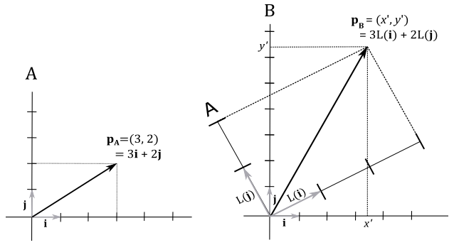

# A.03 - Transformations

 

# 1 - Introduction

In graphics applications it's common to scale, rotate, and translate the objects of the scene before displaying them on screen. For example, let's say you want to move a mesh to another position. You need to move all the vertices of the mesh by performing a matrix multiplication of each vertex position $\mathbf{v}=(x,y,z)$ with a translation matrix $T$.

 

$T(\mathbf{v})=(x\textrm', y\textrm', z\textrm')=\mathbf{w}$

 

That is, $\mathbf{w}$ is the new position of a vertex $\mathbf{v}$ after the transformation $T$.  Now, it’s interesting how we can visualize it in two different ways. Obviously, we can translate $\mathbf{v}$ until its coordinate become the ones of $\mathbf{w}$. On the other hand, we can also translate the whole frame to get the same result. In appendix 01 we stated that points (and therefore positions as well) are just bound vectors applied to the origin of a frame that can be described by the coordinates of the related arrowheads. In the following illustration, on the left, we translate the arrowhead of $\mathbf{v}$ by changing its coordinates, and the resultant vector\position is $\mathbf{w}$. On the right of the illustration below, we apply the same translation to the origin of the frame. As you can see, the coordinates of $\mathbf{v}$ with respect to the transformed frame A are still the same, because the vector shares the same fate (transformation) as its frame of reference. However, now the original frame B "sees" $\mathbf{v}$ as applied to the origin of A. So, the coordinates of $\mathbf{v}$ with respect to the original frame are the ones of $\mathbf{w}$. Then, we can consider the transformed frame A as the starting one, while the original frame B as the new frame.

 

 

The same applies if you want to rotate or scale a vertex position. As we will see in this tutorial, transformations of vectors and change of coordinate systems are mathematically equivalent. That is, if you want to transform an object you can transform its frame of reference, and vice versa.

 

 

# 2 -	Linear transformations

A transformation $L$ is linear if, for any two vectors $\mathbf{u}$ and $\mathbf{v}$, and a scalar $k$, the following two conditions are satisfied

 

$L(\mathbf{u}+\mathbf{v})=L(\mathbf{u})+L(\mathbf{v})$

$L(k\mathbf{v})=kL(\mathbf{v})$

 

In appendix 01 we showed that a bound vector $\mathbf{v}$ can be written as

 

$\mathbf{v}=x\mathbf{i}+y\mathbf{j}+z\mathbf{k}$

 

where $\mathbf{i}$, $\mathbf{j}$ and $\mathbf{k}$ are the standard basis vectors that describe a frame where we can define every bound vector. Then, we can write

 

$L(\mathbf{v})=L(x\mathbf{i}+y\mathbf{j}+z\mathbf{k})=xL(\mathbf{i})+yL(\mathbf{j})+zL(\mathbf{k})=x\mathbf{f}+y\mathbf{g}+z\mathbf{h}=\mathbf{w}$

 

where $\mathbf{f}$, $\mathbf{g}$ and $\mathbf{h}$ are the transformed standard basis vectors. That is, $\mathbf{f}$, $\mathbf{g}$ and $\mathbf{h}$ are the standard basis vectors of the transformed frame. It’s important to understand that the coordinates of $\mathbf{f}$, $\mathbf{g}$ and $\mathbf{h}$ are expressed with respect to the original frame. For example, in the following illustration a linear transformation $L$ is applied to the unit vector $\mathbf{i}=(1,0)$ of a frame B. This changes the original frame as well, because the standard basis vectors describe a coordinate system. However, in the transformed frame A the coordinates of the transformed $\mathbf{i}$ are still $(1,0)$. On the other hand, we have $L(\mathbf{i})=\mathbf{f}=(x\textrm',y\textrm')$ in B, which is the original frame.

 

 

Then, it can be stated that applying a linear transformation to a vector $\mathbf{v}$ is equivalent to apply the same transformation to the starting frame (that is, to its standard basis vectors). That’s an important conclusion as it means that to transform a vector $\mathbf{v}$ with a linear transformation we can simply transform the standard basis vectors. Also, we showed that the coordinates of the transformed vector $\mathbf{w}$ can be computed as a linear combination of the transformed basis vectors, with the components of $\mathbf{v}$ as coefficients. As we know, we can write a linear combination as the product of a row vector and a column vector, which is related to the dot product as well. So, we have that

 

$\mathbf{w}=L(\mathbf{v})=L(x\mathbf{i}+y\mathbf{j}+z\mathbf{k})=xL(\mathbf{i})+yL(\mathbf{j})+zL(\mathbf{k})=x\mathbf{f}+y\mathbf{g}+z\mathbf{h}=$

$\mathbf{v}\cdot\mathbf{l}=\left\lbrack\matrix{x&y&z}\right\rbrack\left\lbrack\matrix{\gets&\mathbf{f}&\rightarrow\cr \gets&\mathbf{g}&\rightarrow\cr \gets&\mathbf{h}&\rightarrow}\right\rbrack=$

$\mathbf{vM}=\left\lbrack\matrix{x&y&z}\right\rbrack\left\lbrack\matrix{M_{00}&M_{01}&M_{02}\cr M_{10}&M_{11}&M_{12}\cr M_{20}&M_{21}&M_{22}}\right\rbrack=\left\lbrack\matrix{\mathbf{v}\cdot\mathbf{M}_ {\ast 0}&\mathbf{v}\cdot\mathbf{M}_ {\ast 1}&\mathbf{v}\cdot\mathbf{M}_ {\ast 2}}\right\rbrack$

 

where $\mathbf{v}=(x, y, z)$, $\mathbf{l}=(\mathbf{f},\mathbf{g},\mathbf{h})$, $\mathbf{f}=\left\lbrack\matrix{M_{00}&M_{01}&M_{02}}\right\rbrack$, $\mathbf{g}=\left\lbrack\matrix{M_{10}&M_{11}&M_{12}}\right\rbrack$ and $\mathbf{h}=\left\lbrack\matrix{M_{20}&M_{21}&M_{22}}\right\rbrack$.  
That’s exactly what we have seen in appendix 02. Indeed, if we perform the multiplication between the row vector $\mathbf{v}$ and the matrix $\mathbf{M}$, we have

 

$\mathbf{vM} = \left\lbrack\matrix{\mathbf{v}\cdot\mathbf{M}_ {\ast0}&\mathbf{v}\cdot\mathbf{M}_ {\ast1}&\mathbf{v}\cdot\mathbf{M}_ {\ast2}}\right\rbrack =$

$\left\lbrack\matrix{xM_{00}+yM_{10}+zM_{20}&xM_{01}+yM_{11}+zM_{21}&xM_{02}+yM_{12}+zM_{22}}\right\rbrack=$

$\left\lbrack\matrix{xM_{00}&xM_{01}&xM_{02}}\right\rbrack+\left\lbrack\matrix{yM_{10}&yM_{11}&yM_{12}}\right\rbrack+\left\lbrack\matrix{zM_{20}&zM_{21}&zM_{22}}\right\rbrack=$

$$
\begin{flalign}&
x\mathbf{M}_ {0\ast}+y\mathbf{M}_ {1\ast}+z\mathbf{M}_ {2\ast}=x\mathbf{f}+y\mathbf{g}+z\mathbf{h} =\mathbf{w}\tag{1}
&\end{flalign}
$$

 

We just found that to transform a vector $\mathbf{v}$ we need to multiply it by a matrix $\mathbf{M}$ whose rows are the transformed standard basis vectors. That is,

 

$\mathbf{w}=\mathbf{vM}$

 

where $\mathbf{M}$ is the matrix that transforms a vector $\mathbf{v}$ into another vector $\mathbf{w}$. 
However, we can also see $\mathbf{M}$ as the matrix to go from a frame A (the starting one) to a frame B (the new one). First of all, observe that $\mathbf{M}$ describes the transformed frame (the starting one) with respect to the original frame (the new one). Indeed, its rows are the transformed basis vectors whose coordinates are expressed with respect to the original frame. This means that $\mathbf{M}$ can be used to transform a vector $\mathbf{v}$ bound to a starting frame A so that its coordinates can be expressed with respect to a new frame B. We can demonstrate it with a simple illustration.

 

 

Here we have a vector $\mathbf{p}_A=(3,2)$ applied to the origin of a frame A. Remember that a vector can be represented as a linear combination of the standard basis vectors, with the components of the vector as coefficients. So, in the frame A we have

 

$\mathbf{p}_A=3\mathbf{i}+2\mathbf{j}$

 

As we know, this is the diagonal of the parallelogram defined by the vectors $\mathbf{i}$ and $\mathbf{j}$, scaled with the components of the vector. Now, imagine scaling the frame A two times on both the x- and y-axes, and then rotating it about the origin. The vector $\mathbf{p}_A$ will result doubled in size and rotated with respect to the original frame, which can therefore be considered as a new frame B because in the transformed one (A) the coordinates of $\mathbf{p}_A$ are still $(3,2)$. As stated earlier, $L(\mathbf{i})$, $L(\mathbf{j})$ and $L(\mathbf{k})$ are expressed in coordinates with respect to the original frame B. Now we want to demonstrate that, if we build a matrix with these transformed basis vectors, we can compute the coordinates of $\mathbf{p}_A$ with respect to the frame B. That is, we can go from the frame A to the frame B. Indeed, as you can see on the right of the illustration above, we have

 

$\mathbf{p}_B=3L(\mathbf{i})+2L(\mathbf{j})$

 

That is, the coordinates of $\mathbf{p}_A$ with respect to the frame B can be expressed as a linear combination of the transformed basis vectors, with the components of $\mathbf{p}_A$ as coefficients. That’s exactly what we formally proved in the equation $(1)$, where we used the transformed basis vectors as rows of $\mathbf{M}$. This means we just showed that $\mathbf{M}$ is the matrix to go from a frame A (the starting one) to a frame B (the new one). That is, we showed how to express the coordinates of a vector in a frame A with respect to another frame B. 
At this point, it should be no surprise that the inverse $\mathbf{M}^{-1}$ is the matrix to go from B to A.

Observe that in the equation $\mathbf{w}=\mathbf{vM}$ we perform the dot product between the row vector $\mathbf{v}$ and the columns of $\mathbf{M}$. That’s exactly what happens if we transpose $\mathbf{M}$ in our C++ application before copying its elements to a GPU heap, and then pass $\mathbf{v}$ and $\mathbf{M}$, respectively, as the first and second arguments of **mul** in the shader code, as we explained in appendix 02.

 

## 2.1 - Scaling

In a 3D Cartesian coordinate system we can scale vectors with respect to three directions by scaling the related components. That is, given a scaling $S$ and a vector $\mathbf{v}=(x,y,z)$ we have

 

$S(\mathbf{v})=(s_xx, s_yy, s_zz)$

 

The scaling is uniform if the scaling factors are equal $(s_x=s_y=s_z)$, otherwise it’s non-uniform. We can formally prove the scaling is a linear transformation by showing that it satisfies the two conditions of linearity.

 

>$S(\mathbf{u}+\mathbf{v})=\big( s_x(u_x+v_x),\ s_y(u_y+v_y),\ s_z(u_z+v_z) \big)=$
>
>$(s_xu_x+s_xv_x,\ s_yu_y+s_yv_y,\ s_zu_z+s_zv_z)=$
>
>$(s_xu_x,\ s_yu_y,\ s_zu_z)+(s_xv_x,\ s_yv_y,\ s_zv_z)=$
>
>$S(\mathbf{u})+S(\mathbf{v})$
>
> 
>
>$S(k\mathbf{v})=(s_xkv_x,\ s_ykv_y,\ s_zkv_z)=$
>
>$k(s_xv_x,\ s_yv_y,\ s_zv_z)=$
>
>$kS(\mathbf{v})$

 

We know that a linear transformation can be associated with a matrix whose rows are the transformed standard basis vectors. In 3D Cartesian coordinate systems, we have

 

$S(\mathbf{i})=(s_x1,\ s_y0,\ s_z0)=(s_x,0,0)$

$S(\mathbf{j})=(s_x0,\ s_y1,\ s_z0)=(0,s_y,0)$

$S(\mathbf{k})=(s_x0,\ s_y0,\ s_z1)=(0,0,s_z)$

 

Then, the matrix $\mathbf{S}$ associated with a scaling is

 

$\mathbf{S}=\left\lbrack\matrix{s_x&0&0\cr 0&s_y&0\cr 0&0&s_z}\right\rbrack$

 

We refer to this matrix as scaling matrix. So, we can scale every 3D vector by simply multiplying it with $\mathbf{S}$. If you want to bring back the vector to its original size you can multiply the scaled vector by the inverse $\mathbf{S}^{-1}$ of the scaling matrix.

 

$S^{-1}=\left\lbrack\matrix{1/s_x&0&0\cr 0&1/s_y&0\cr 0&0&1/s_z}\right\rbrack$

 

***Example***:

Given a minimum point $\mathbf{p}=(-2,0,-2)$ and a maximum point $\mathbf{q}=(2,0,2)$ of a square, suppose you want to scale it $2$ units along the x-axis, $0.5$ units along the z-axis, and leave the y-coordinate unchanged. The corresponding scaling matrix is

 

$\mathbf{S}=\left\lbrack\matrix{2&0&0\cr 0&1&0\cr 0&0&0.5}\right\rbrack$

 

To scale the square we need to multiply both $\mathbf{p}$ and $\mathbf{q}$ by $\mathbf{S}$.

 

$\left\lbrack\matrix{-2&0&-2}\right\rbrack\left\lbrack\matrix{2&0&0\cr 0&1&0\cr 0&0&0.5}\right\rbrack=\left\lbrack\matrix{-4&0&-1}\right\rbrack$

$\ \quad\left\lbrack\matrix{2&0&2}\right\rbrack\left\lbrack\matrix{2&0&0\cr 0&1&0\cr 0&0&0.5}\right\rbrack=\left\lbrack\matrix{4&0&1}\right\rbrack$

 

The following illustration shows the result of these transformations

 

$\square$

 

## 2.2	Rotation

A rotation is a linear transformation, but we won’t provide a formal proof here because it is simpler to observe that the rotation of the sum of two vectors (that is, the rotation of the diagonal of the parallelogram defined by the two vectors) is equivalent to the sum of rotations of the two vectors (that is, the diagonal of the rotated parallelogram). At the same time, rotating a uniformly scaled vector is equivalent to rotate a vector before uniformly scaling it.

 

 

Finding the matrix associated with a rotation is a little trickier this time. However, without loss of generality, we will consider $R_\mathbf{n}(\mathbf{v})$ as a clockwise rotation of a vector $\mathbf{v}$, about a unit vector $\mathbf{n}$, by an angle $\theta$. That is, you will see $\mathbf{v}$ rotate clockwise by looking down the unit vector $\mathbf{n}$, which defines the direction of the axis of rotation (so we can determine the direction of rotation as well). Obviously, the result of $R_\mathbf{n}(\mathbf{v})$ is the rotated vector $\mathbf{v}$ passed as an argument. Observe that, to rotate counterclockwise, we can simply negate the angle $\theta$. Also, if $\mathbf{n}$ is not a unit vector we can always normalize it. That way, we can extend our results to the more general case. 
Now consider the left side of the following illustration.

 

 

As we know, $\mathbf{n}\times\mathbf{v}$ is orthogonal to the plane defined by $\mathbf{n}$ and $\mathbf{v}$. During rotation, $\mathbf{v}$ draws an arc of a circle which is also orthogonal to the plane defined by $\mathbf{n}$ and $\mathbf{v}$. As a result, the vector $\mathbf{n}\times\mathbf{v}$ and the circle drawn by $\mathbf{v}$ lie in the same plane.
The projection of the vector $\mathbf{v}$ onto $\mathbf{n}$ can be written as a difference of two vectors (this result can also be derived from appendix 02, section **2.2.3.2**).

 

$\text{proj}_ \mathbf{n}(\mathbf{v})=\mathbf{v}-\mathbf{v}_ \bot$

 

where $\mathbf{v}_ \bot$ is the orthogonal component of $\mathbf{v}$ with respect to $\mathbf{n}$. So, we have that

 

$\mathbf{v}_ \bot\ =\ \mathbf{v}-\text{proj}_\mathbf{n}(\mathbf{v})$

 

Then, $\mathbf{v}_ \bot$ lies in the plane defined by $\mathbf{n}$ and $\mathbf{v}$ (since it’s the subtraction of these two vectors), and therefore it’s orthogonal to $\mathbf{n}\times\mathbf{v}$. $\ R_\mathbf{n}(\mathbf{v}_ \bot)$ is the orthogonal component of $R_\mathbf{n}(\mathbf{v})$ with respect to $\mathbf{n}$. Also, we have

 

$\vert\mathbf{n}\times\mathbf{v}\vert=\vert\mathbf{n}\vert\vert\mathbf{v}\vert\sin a=\vert\mathbf{v}\vert\sin a =\vert\mathbf{v}_\bot\vert$

 

That is, $\mathbf{n}\times\mathbf{v}$ and $\mathbf{v}_ \bot$ have the same length, and are orthogonal to each other. So, they can define a 2D frame (just like the standard basis vectors $\mathbf{i}$ and $\mathbf{j}$) where we can compute the coordinates of $R_\mathbf{n}(\mathbf{v}_ \bot)$, which can be considered as the rotation of the basis vector $\mathbf{v}_ \bot$ about $\mathbf{n}$. This means that $R_\mathbf{n}(\mathbf{v}_ \bot)$ has the same length of both $\mathbf{n}\times\mathbf{v}$ and $\mathbf{v}_ \bot$. As you can see in the figure above (on the right), the orthogonal projection of $R_\mathbf{n}(\mathbf{v}_ \bot)$ onto $\mathbf{v}_ \bot$ is

 

$\displaystyle\frac{(R_\mathbf{n}(\mathbf{v}_ \bot)\cdot\mathbf{v}_ \bot)}{\vert\mathbf{v}_ \bot\vert^2}\mathbf{v}_ \bot=\frac{\vert R_\mathbf{n}(\mathbf{v}_ \bot)\vert\vert\mathbf{v}_ \bot\vert\cos\theta}{\vert\mathbf{v}_ \bot\vert^2}\mathbf{v}_ \bot=\frac{\vert\mathbf{v}_ \bot\vert\vert\mathbf{v}_ \bot\vert\cos\theta}{\vert\mathbf{v}_ \bot\vert^2}\mathbf{v}_ \bot=\cos{\mathbf{\theta}}\ \mathbf{v}_ \bot$

 

In a similar way, the orthogonal projection of $R_\mathbf{n}(\mathbf{v} _\bot)$ onto $\mathbf{n}\times\mathbf{v}$ is

 

$\displaystyle\frac{(R_\mathbf{n}(\mathbf{v}_ \bot)\cdot\mathbf{n}\times\mathbf{v})}{\vert\mathbf{n}\times\mathbf{v}\vert^2}\mathbf{n}\times\mathbf{v}=\frac{\vert R_\mathbf{n}(\mathbf{v}_ \bot)\vert\vert\mathbf{n}\times\mathbf{v}\vert\cos{(90°-\theta)}}{\vert\mathbf{n}\times\mathbf{v}\vert^2}\mathbf{n}\times\mathbf{v}=\frac{\vert\mathbf{n}\times\mathbf{v}\vert\vert\mathbf{n}\times\mathbf{v}\vert\sin\theta}{\vert\mathbf{n}\times\mathbf{v}\vert^2}\mathbf{n}\times\mathbf{v}=\sin\theta\ \mathbf{n}\times\mathbf{v}$

 

Then, we have that

 

$R_\mathbf{n}(\mathbf{v}_ \bot)=\cos\theta\ \mathbf{v}_ \bot+\sin\theta\ (\mathbf{n}\times\mathbf{v})$

 

Now, we can compute $R_\mathbf{n}(\mathbf{v})$ as a sum of $\text{proj}_ \mathbf{n}(\mathbf{v})$ and $R_\mathbf{n}(\mathbf{v}_ \bot)$.

 

$R_{\mathbf{n}}(\mathbf{v})=\text{proj}_ \mathbf{n}(\mathbf{v})+R_{\mathbf{n}}(\mathbf{v_T})=$

$(\mathbf{n}\cdot \mathbf{v})\mathbf{n}+\cos\theta\ \mathbf{v}_ \bot+\sin\theta\ (\mathbf{n}\times\mathbf{v})=$

$(\mathbf{n}\cdot \mathbf{v})\mathbf{n}+\cos\theta\ (\mathbf{v}-(\mathbf{n}\cdot\mathbf{v})\mathbf{n})+\sin\theta\ (\mathbf{n}\times\mathbf{v})=$

$\cos\theta\ \mathbf{v}+(1-\cos\theta)(\mathbf{n}\cdot\mathbf{v})\mathbf{n}+\sin\theta\ (\mathbf{n}\times\mathbf{v})$

 

As you can see, $\mathbf{v}_ \bot$ disappeared, so we can compute any rotation by knowing only the vector $\mathbf{v}$ to rotate, the angle of rotation $\theta$, and the unit vector $\mathbf{n}$. At this point, we can transform the standard basis vectors to compute the row vectors that make up the rotation matrix $\mathbf{R}_\mathbf{n}$.

 

$R_\mathbf{n}(\mathbf{i})=\big(\cos\theta+(1-\cos\theta)\ x^2,\quad(1-\cos\theta)\ xy+\sin\theta\ z,\quad(1-\cos\theta)\ xz-\sin\theta\ y\big)$

$R_\mathbf{n}(\mathbf{j})=((1-\cos\theta)\ xy-\sin\theta\ z,\quad \cos\theta+(1-\cos\theta)\ y^2,\quad(1-\cos\theta)\ yz+\sin\theta\ x)$

$R_\mathbf{n}(\mathbf{k})=((1-\cos\theta)\ xz+\sin\theta\ y,\quad(1-\cos\theta)\ yz-\sin\theta\ x,\quad\cos\theta+(1-\cos\theta)\ z^2)$

 

where $\mathbf{n}=(x, y, z)$, $\mathbf{i}=(1,0,0)$, $\mathbf{j}=(0,1,0)$, and $\mathbf{k}=(0,0,1)$. Then, we have that

 

$\mathbf{R}_\mathbf{n}=\left\lbrack\matrix{c+(1-c)x^2&(1-c)xy+sz&(1-c)xz-sy\cr (1-c)xy-sz&c+(1-c)y^2&(1-c)yz+sx\cr (1-c)xz+sy&(1-c)yz-sx&c+(1-c)z^2}\right\rbrack$

 

where $c=\cos\theta$, and $s=sin\theta$. 
For example, if we want to rotate about the x-, y- and z-axes, we need to set $\mathbf{n}=\mathbf{i}=(1,0,0)$, $\mathbf{n}=\mathbf{j}=(0,1,0)$, and $\mathbf{n}=\mathbf{k}=(0,0,1\)$, respectively. So, the related rotation matrices are

 

$\mathbf{R}_ x=\left\lbrack\matrix{1&0&0\cr 0&\cos\theta&\sin\theta\cr 0&-\sin\theta&\cos\theta}\right\rbrack\quad\quad\quad\mathbf{R}_ y=\left\lbrack\matrix{\cos\theta&0&-\sin\theta\cr 0&1&0\cr \sin\theta&0&\cos\theta}\right\rbrack\quad\quad\quad\mathbf{R}_ z=\left\lbrack\matrix{\cos\theta&\sin\theta&0\cr -\sin\theta&\cos\theta&0\cr 0&0&1}\right\rbrack$

 

***Example***:

Given a minimum point $\mathbf{p}=(-2,0,-2)$ and a maximum point $\mathbf{q}=(2,0,2)$ of a square, suppose you want to rotate it $-45°$ clockwise (that is, $45°$ counterclockwise ) about the y-axis. The corresponding rotation matrix is:

 

$\mathbf{R}_ y=\left\lbrack\matrix{\cos\theta&0&-\sin\theta\cr 0&1&0\cr \sin\theta&0&\cos\theta}\right\rbrack=\left\lbrack\matrix{\cos{(-45°)}&0&-\sin{(-45°)}\cr 0&1&0\cr \sin{(-45°)}&0&\cos{(-45°)}}\right\rbrack=\left\lbrack\matrix{1/\sqrt{2}&0&1/\sqrt{2}\cr 0&1&0\cr -1/\sqrt{2}&0&1/\sqrt{2}}\right\rbrack$

 

To rotate the square we need to multiply $\mathbf{p}$ and $\mathbf{q}$ by the rotation matrix $\mathbf{R}_ y$.

 

$\left\lbrack\matrix{-2&0&-2}\right\rbrack\left\lbrack\matrix{1/\sqrt{2}&0&1/\sqrt{2}\cr 0&1&0\cr -1/\sqrt{2}&0&1/\sqrt{2}}\right\rbrack=\left\lbrack\matrix{0&0&-2.83}\right\rbrack$

$\ \quad\left\lbrack\matrix{2&0&2}\right\rbrack\left\lbrack\matrix{1/\sqrt{2}&0&1/\sqrt{2}\cr 0&1&0\cr -1/\sqrt{2}&0&1/\sqrt{2}}\right\rbrack=\left\lbrack\matrix{0&0&2.83}\right\rbrack$

 

$\square$

 

You can easily verify that the rows of $\mathbf{R}_ x$ are unit vectors and orthogonal to each other (i.e., they make up an orthonormal set). The same applies to the rows of $\mathbf{R}_ y$, $\mathbf{R}_ z$, and the general rotation matrix $\mathbf{R}_\mathbf{n}$ (although, this last one is a little trickier to prove). A matrix whose rows compose an orthonormal set is called orthogonal. Orthogonal matrices are of particular interest since their inverse is equal to their transpose. That is, we have that

 

$\mathbf{R}_ \mathbf{n}^{-1}=\mathbf{R}_ \mathbf{n}^T=\left\lbrack\matrix{c+(1-c)x^2 & (1-c)xy-sz & (1-c)xz+sy \cr  (1-c)xy+sz & c+(1-c)y^2 & (1-c)yz-sx \cr  (1-c)xz-sy & (1-c)yz+sx & c+(1-c)z^2}\right\rbrack$

 

 

# 3 - Affine transformations

Now we know how to scale and rotate vectors, but we also need to move points. Maybe you've already heard (or read) about a transformation called translation that allows to relocate objects. However, when you need to move vectors, two problems arise:

- we certainly want to move points (vertex positions) as we need to relocate meshes. However, for free vectors this transformation doesn’t make any sense since direction and magnitude don’t change after a translation (the point of application for a free vector is irrelevant). So, we need to distinguish between points and vectors.

- moving a point can’t be expressed as a linear combination of the standard basis vectors. That is, a translation is not a linear transformation, so you can’t associate a $3\times 3$ matrix with a translation. Fortunately, we can get around this problem to include translations in our matrix equation $\mathbf{w}=\mathbf{vM}$.

 

Affine transformations extend linear ones by adding translations. In the next section we are going to introduce this type of transformation, trying to solve the above issues.

 

## 3.1 - Translation

Applying a translation $T$ to a bound vector (point) $\mathbf{p}=(p_x, p_y, p_z)$ simply means you have to add a displacement vector $\mathbf{t}=(t_x, t_y, t_z)$ to the point.

 

$T(\mathbf{p})=\mathbf{p}+\mathbf{t}=(p_x+t_x,\ p_y+t_y,\ p_z+t_z)$

 

For example, given a 2D point $\mathbf{p}=(3, 3)$, suppose you want to translate it $+5$ unit along the x-axis and $+2$ units along the y-axis: that is, $\mathbf{t}=(5, 2)$. Obviously, you can add $\mathbf{p}$ and $\mathbf{t}$ to get the new coordinates of the translated point $\mathbf{w}$, as illustrated in the following illustration.

 

 

At the same time, we can translate the frame by using the same displacement vector $\mathbf{t}$, that now specifies the offset where to move the origin of the translated frame A (the starting one) with respect to the original frame B (the new one). In A the coordinates of the bound vector (point) $\mathbf{p}$ are still the same, while in B the coordinates of $\mathbf{p}$ can be seen as the sum of $\mathbf{p}$ and $\mathbf{t}$.

 

 

So, it seems that translation of vectors and translation of coordinate systems are mathematically equivalent (in the next section we will formally prove that this is true in general for affine transformations). This means that we can translate a frame to apply the same transformation to a vector. So far so good, but the question is: can we find a $3\times 3$ matrix $\mathbf{T}$ to associate with translations? Unfortunately, the answer is no. To understand why, just take a look at the definition of $T(\mathbf{p})$ above. It’s a simple sum of vectors. On the other hand, in a row by matrix multiplication, we have the dot product of two vectors (the row vector and a column of the matrix). So, there is no way we can find a $3\times 3$  matrix $\mathbf{T}$ so that $\mathbf{w}=\mathbf{p}+\mathbf{t}=\mathbf{pT}$. This is due to the fact that translations are not linear transformations. Indeed, we have

 

>$T(\mathbf{u}+\mathbf{v})=(u_x+v_x+t_x,\ u_y+v_y+t_y,\ u_z+v_z+t_z)$
>
> 
>
>while
>
> 
>
>$T(\mathbf{u})+T(\mathbf{v})=(u_x+t_x,\ u_y+t_y,\ u_z+t_z)+(v_x+t_x,\ v_y+t_y,\ v_z+t_z)=$
>
>$(u_x+v_x+2t_x,\ u_y+v_y+2t_y,\ u_z+v_z+2t_z)$

 

Then, $T(\mathbf{u}+\mathbf{v}) \neq T(\mathbf{u})+T(\mathbf{v})$. 
However, we can still find a way to include translations in our matrix equation $\mathbf{w}=\mathbf{vM}$ by using homogeneous coordinates, so that we can write $\mathbf{w}=\mathbf{p}+\mathbf{t}=\mathbf{pT}$.

 

 

# 4 - Homogeneous coordinates

As we already know, homogeneous coordinates introduce an "extra" coordinate. This means that in 3D Cartesian systems we step into the 4-th dimension. Fortunately, we just pop in to pick up what we need, and leave immediately after.

A point in 3D space can be represented in homogeneous coordinates by the tuple $(x,y,z,w)$, where the related 3D Cartesian coordinates are $(x/w,\ y/w,\ z/w,\ w/w)$. So, the generic 3D Cartesian coordinates $(x, y, z)$ can be written as $(x, y, z, 1)$ in homogeneous coordinates. That way, we can use the first three components as 3D Cartesian coordinates, and the last component to differentiate between points and vectors.

 

Points: $\ (x, y, z, 1)$

Vectors: $\ (x, y, z, 0)$

 

We need this distinction between points and vectors as we want to apply translations to points without affecting vectors. Now, since we are using four components, we can try to find a $4\times 4$ matrix $\mathbf{T}$ associated with translations. Let’s start with the identity matrix, using the offset of the translated frame $\mathbf{t}=(t_x, t_y, t_z, 1)$ as last row.

 

$\mathbf{T}=\left\lbrack\matrix{1&0&0&0\cr 0&1&0&0\cr 0&0&1&0\cr t_x&t_y&t_z&1}\right\rbrack$

 

Let’s see what happens if we multiply a generic point $\mathbf{p}=(p_x, p_y, p_z, 1)$ by $\mathbf{T}$.

 

$\mathbf{w}=\mathbf{pT}=\left\lbrack\matrix{p_x & p_y & p_z & 1}\right\rbrack\left\lbrack\matrix{1&0&0&0\cr 0&1&0&0\cr 0&0&1&0\cr t_x & t_y & t_z & 1}\right\rbrack=(p_x+t_x,\ p_y+t_y,\ p_z+t_z,\ 1)=\mathbf{p}+\mathbf{t}$

 

That’s exactly the definition of $T(\mathbf{p})$, but in homogeneous coordinates (that is, with the last component $1$). Now, let’s see what happens if we multiply a generic vector $\mathbf{v}=(v_x, v_y, v_z, 0)$ by $\mathbf{T}$.

 

$\mathbf{w}=\mathbf{vT}=\left\lbrack\matrix{v_x & v_y & v_z & 0}\right\rbrack\left\lbrack\matrix{1&0&0&0\cr 0&1&0&0\cr 0&0&1&0\cr t_x & t_y & t_z & 1}\right\rbrack=(v_x, v_y, v_z, 0)=\mathbf{v}$

 

The vector $\mathbf{v}$ is not affected by the translation. It looks like we just found a matrix associated with the translation of points, and that doesn’t affect directions. Of course, the inverse of the translation matrix is

 

$\mathbf{T}^{-1}=\left\lbrack\matrix{1&0&0&0\cr 0&1&0&0\cr 0&0&1&0\cr -t_x&-t_y&-t_z&1}\right\rbrack$

 

However, we'd like to include linear transformations as well. For this purpose, we can try to embed the $3\times 3$ matrix $\mathbf{A}$ associated with linear transformations (scaling and rotation) in the upper left position of $\mathbf{T}$.

 

$\mathbf{M}=\left\lbrack\matrix{A_{00}&A_{01}&A_{02}&0\cr A_{10}&A_{11}&A_{12}&0\cr A_{20}&A_{21}&A_{22}&0\cr t_x&t_y&t_z&1}\right\rbrack$

 

Now, if we multiply a generic vector $\mathbf{v}=(x, y, z, 0)$ by $\mathbf{M}$ we have

 

$\mathbf{w}=\mathbf{vM}=\left\lbrack\matrix{x&y&z&0}\right\rbrack.\left\lbrack\matrix{\mathbf{f}\cr \mathbf{g}\cr \mathbf{h}\cr \mathbf{t}}\right\rbrack=x\mathbf{f}+y\mathbf{g}+z\mathbf{h}+0\mathbf{t}=x\mathbf{f}+y\mathbf{g}+z\mathbf{h}$

 

where $\mathbf{f}=(A_{00}, A_{01}, A_{02}, 0)$, $\mathbf{g}=(A_{10}, A_{11}, A_{12}, 0)$ and $\mathbf{h}=(A_{20}, A_{21}, A_{22}, 0)$ are the linearly transformed standard basis vectors $\mathbf{i}=(1,0,0,0)$, $\mathbf{j}=(0,1,0,0)$ and $\mathbf{k}=(0,0,1,0)$, while $\mathbf{t}=(t_x, t_y, t_z, 1)$ is still the position of the translated frame (the starting one) with respect to the original frame (the new one).  
As you can see, the translation doesn’t affect the vector, and the result is the same we showed in equation $(1)$: $\mathbf{w}=\mathbf{vM}$. Indeed, when you transform vectors with $\mathbf{M}$, they can only be affected by the linear transformation embedded within the matrix. Moreover, the result is still a vector: the last component is zero because it's the dot product of $\mathbf{v}=(v_x, v_y, v_z, 0)$ and $(0,0,0,1)$, the last column of $\mathbf{M}$.

On the other hand, if we multiply a generic point $\mathbf{q}=(x, y, z, 1)$ by $\mathbf{M}$ we have

 

$\mathbf{p}=\mathbf{q}\mathbf{M}=\left\lbrack\matrix{x&y&z&1}\right\rbrack.\left\lbrack\matrix{\mathbf{f}\cr \mathbf{g}\cr \mathbf{h}\cr \mathbf{t}}\right\rbrack=x\mathbf{f}+y\mathbf{g}+z\mathbf{h}+1\mathbf{t}=x\mathbf{f}+y\mathbf{g}+z\mathbf{h}+\mathbf{t}$

 

Here we transform $\mathbf{q}$ with a linear transformation, which results in an intermediate vector $\mathbf{q}_1=x\mathbf{f}+y\mathbf{g}+z\mathbf{h}$ to which we add the translation $\mathbf{t}$. That’s exactly what we stated earlier: a translation is a sum of a point ad a vector. In this case the point is $\mathbf{t}$ because it specifies the origin of the starting frame with respect to the new one. Also, the result is still a point: the last component is $1$ because it's the dot product of $\mathbf{q}=(x, y, z, 1)$ and $(0, 0, 0, 1)$, the last column of $\mathbf{M}$. As we know, the difference of two points is the vector from a point to the other one. Indeed, from the equation above, we have

 

$\mathbf{p}-\mathbf{t}=x\mathbf{f}+y\mathbf{g}+z\mathbf{h}$

 

which is a vector, as it’s not a bound to the origin of the frame of reference (see the illustration below, on the left). On the other hand, the sum of two points is a point as well, but it doesn’t make any sense geometrically (unlike the sum of two vectors, which is the resultant force, direction or speed).

 

 

Then, $\mathbf{M}$ is the matrix that transforms both vectors and points with an affine transformation. It embeds a linear transformation, plus a translation. Its rows are the transformed standard basis vectors, and a displacement that specifies the origin of the starting frame with respect to a new one. Therefore, $\mathbf{M}$ describes the transformed frame (the starting one) with respect to the original frame (the new one). As stated at the beginning of the tutorial, this means $\mathbf{M}$ is a matrix that allows to go from a frame to another. That is, change of coordinates and change of coordinate system are still mathematically equivalent with affine transformations.

 

 

# 5 - Composition of transformations

Imagine you want to scale, rotate and translate a vector $\mathbf{v}$. That is,

 

$\mathbf{w}=((\mathbf{vS})\mathbf{R})\mathbf{T})$

 

The vector $\mathbf{v}$ and the resultant vector $\mathbf{w}$ can be considered row vectors of dimension $1\times n$, while the matrices are all $n\times n$. 
In a vector by matrix multiplication we need to perform $(2n-1)$ operations for each component of the resultant vector: $(n-1)$ sums and $n$ products. Then, we must multiply $(2n-1)$ by the $n$ components of the resultant vector. So, we have $n(2n-1)$ operations to perform a vector by matrix multiplication. In the equation above we have three vector by matrix multiplications, so the total cost is $3n(2n-1)=6n^2-3n=O(n^2)$. 
However, thanks to the associative property of matrix multiplication we can write

 

$\mathbf{w}=(((\mathbf{vS})\mathbf{R})\mathbf{T})=(\mathbf{v}(\mathbf{SR})\mathbf{T})=\mathbf{v}(\mathbf{SRT})$

 

Now, we have two matrix by matrix multiplications and a vector by matrix multiplication. 
Each matrix by matrix multiplication needs $(2n-1)$ operations for each element of the resultant matrix. So, we have to multiply $(2n-1)$ by the $n^2$ elements of the resultant matrix. Then, we need $(2n-1)n^2$ operations to perform a matrix by matrix multiplication. In the equation above we have two of these multiplications, plus a vector by matrix multiplication, so the total cost is $2(2n^3-n^2)+n(2n-1)=4n^3-n=O(n^3)$. 

It seems that we need more operation to perform if we first multiply the matrices. However, imagine you want to transform 10 thousand vectors by the same matrices $\mathbf{S}$, $\mathbf{R}$ and $\mathbf{T}$. In the first case we need to perform $10000(3n(2n-1))$ operations, while in the second case we only need $10000(n(2n-1))+2(2n^3-n^2)$ operations, as the double matrix by matrix multiplication must be computed only once. That is, we can reuse $(\mathbf{SRT})$ to multiply every vector. For example, if $n=4$ we have $10000(3n(2n-1))=840\text{k}$, while $10000(n(2n-1))+2(2n^3-n^2)=280\text{k}$.

Then, it is strongly recommended to transform vectors with a matrix which is a composition of all the transformations you want to apply to the vectors.

 

 

# References
[1] Practical Linear Algebra: A Geometry Toolbox (Farin, Hansford)

 

***
If you found the content of this tutorial somewhat useful or interesting, please consider supporting this project by clicking on the **Sponsor** button.  Whether a small tip, a one time donation, or a recurring payment, it's all welcome! Thank you!  

 

 