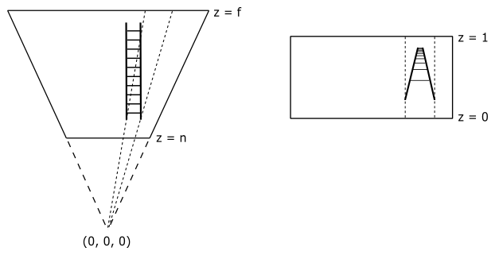

# A.04 - Spaces

<br>

# 1 - Introduction

In appendix 03 we showed that to transform a vector we can transform the starting frame so that we can express its coordinates with respect to a new coordinate system. Then, it’s interesting to look at the common spaces the pipeline uses to render a 3D scene on the screen, and how to go from a space to another as well.

<br>

<br>

# 2 - Object space

The object space (also called local space) is the frame in which 3D meshes are defined. Usually, 3D graphic artists create meshes in a convenient space where it’s simpler to model vertices, maybe to get some symmetry with respect to the origin of the system. That's why the local space exists.

<br>


<br>

Indeed, it’s easier to model a sphere by placing all the vertices at the same distance from the origin rather than using a random point as the center of the sphere. We can also verify it mathematically.

<br>

Equation of the sphere with center in $(0,0,0)$: $\quad x^2+y^2+z^2=r^2$

Equation of the Sphere with center in $(x_0, y_0, z_0)$: $\quad (x-x_0)^2+(y-y_0)^2+(z-z_0)^2=r^2$

<br>

Anyway, the local space is the frame where the vertices of a mesh are defined in the first place.
Often these vertices are stored in a file on disk that we can load into memory in order to create the vertex buffer to send to the input assembler. Indeed, the vertex buffer contains vertices in local space that the graphics pipeline transforms to get a 2D representation of 3D objects.

<br>

<br>

# 3 - World space and World matrix

When the input assembler sends its output to the next stage (the vertex shader), we have vertices in local space that we want to place in a 3D global scene shared by all meshes. The space of the global scene is called world space, and the transformation to go from local to world space is called world transformation.

<br>


<br>

As we know, to go from a frame to another we need to express the basis vectors of the starting frame with respect to the new frame. So, we can build a matrix $\mathbf{W}=\mathbf{SRT}$ (a composition of three trasformations: a scaling, a rotation, and a translation) associated with the world transformation we want to apply to the local frame to get the coordinates of its basis vectors with respect to the world space. Therefore, $\mathbf{W}$ is the matrix to go from local to world space, and that allow us to put a mesh (or rather, its vertices) in the global scene. For this reason, we call $\mathbf{W}$ the world matrix. We hardly place every mesh in the same location of the world space, so $\mathbf{W}$ will likely be different from mesh to mesh.

<br>


<br>

Then, we can define $\mathbf{W}$ as 

<br>

$\mathbf{W}=\mathbf{SRT}=\left\lbrack\matrix{f_x&f_y&f_z&0\cr g_x&g_y&g_z&0\cr h_x&h_y&h_z&0\cr t_x&t_y&t_z&1}\right\rbrack$

<br>

where the first three rows of $\mathbf{W}$ are the scaled and rotated basis vectors of the local space (with respect to the world space), while the last row is the translation of the origin of the local space (again, with respect to the world space).

<br>

***Example:***

Given a cube in local space, suppose you want to double its size, clockwise rotate it by $45°$ about the y-axis, and move it at $(10,0,5)$ in the world space. Then, we have to transform all the vertices of the square with the following world matrix.

<br>

$\mathbf{W}=\mathbf{SRT}=\left\lbrack\matrix{2&0&0&0\cr 0&2&0&0\cr 0&0&2&0\cr 0&0&0&1}\right\rbrack\left\lbrack\matrix{\sqrt2/2&0&-\sqrt2/2&0\cr 0&1&0&0\cr \sqrt2/2&0&\sqrt2/2&0\cr 0&0&0&1}\right\rbrack\left\lbrack\matrix{1&0&0&0\cr 0&1&0&0\cr 0&0&1&0\cr 10&0&5&1}\right\rbrack=\left\lbrack\matrix{\sqrt2&0&-\sqrt2&0\cr 0&2&0&0\cr \sqrt2&0&\sqrt2&0\cr 10&0&5&1}\right\rbrack$

<br>

As you can see in the following illustration, the first three rows of $\mathbf{W}$ are the scaled and rotated basis vectors of the local space in world coordinates (that is, whose coordinates are with respect to the world space), while the fourth row is the position (point) of the origin of the local space (again, in world coordinates). Now, to put the cube in the global scene we have to transform its vertices with $\mathbf{W}$.

<br>


$\square$

<br>

<br>

# 4 - View space and View matrix

After the world transformation, our meshes are all in world space. Now, we want a point of view from which to look at the 3D scene. This new space is called view space, or camera space. Again, we need to transform all the vertices of our meshes with another transformation (called view transformation) to go from world space to view space. We call a matrix $\mathbf{V}$, associated with the view transformation, the view matrix.

<br>


<br>

However, unlike the world transformation, we will use the same view matrix to transform all the vertices of our meshes because we (usually) don’t want to change the scene. That is, we only need a different point of view, so we must apply the same transformation to all vertices. You can consider the whole scene (the collection of all meshes) as a single large mesh we want to transform from world space to view space. Now, to build the view matrix, we can start considering the camera as an ordinary mesh we can place in world space. So, we could use a world matrix $\mathbf{W}_ c$ to put the camera in the global space as the point of view from which to look at the scene.

<br>

$\mathbf{W}_ c=\left\lbrack\matrix{f_x&f_y&f_z&0\cr g_x&g_y&g_z&0\cr h_x&h_y&h_z&0\cr t_x&t_y&t_z&1}\right\rbrack$

<br>

$\mathbf{W}_ c$ is the matrix to go from the local space of the camera to the world space. However, the local space of the camera is exactly the view space with respect to which we want to look at the scene. This means $\mathbf{W}_ c$ is the matrix to go from view space to world space. Therefore, we can compute the inverse $\mathbf{W}_ c^{-1}$ to get the view matrix, which allows to go from world space to view space. It’s not too difficult to compute the inverse of $\mathbf{W}_ c$ because it’s the composition of a rotation and a translation: $\mathbf{W}_ c=\mathbf{RT}$. Indeed, it doesn’t make any sense to scale the camera since it’s a dummy object (we are only interested in the position and orientation of the view space). We don’t need a scaling in the inverse transformation as well because we’ve already scaled the meshes during the world transformations (that is, we wish to keep the size of the meshes in world space). Then, the first three rows of $\mathbf{W}_ c$ are the rotations of the standard basis vectors of the view space with respect to the world space (that is, in world coordinates), while the last row is the position of (the origin of) the view space (in world coordinates as well). So, we have

<br>

$\mathbf{V}=\mathbf{W}_c^{-1}=(\mathbf{RT})^{-1}=\mathbf{T}^{-1}\mathbf{R}^{-1}=\mathbf{T}^{-1}\mathbf{R}^{-T}=\left\lbrack\matrix{1&0&0&0\cr 0&1&0&0\cr 0&0&1&0\cr {-t}_x&-t_y&-t_z&1}\right\rbrack\left\lbrack\matrix{f_x&g_x&h_x&0\cr f_y&g_y&h_y&0\cr f_z&g_z&h_z&0\cr 0&0&0&1}\right\rbrack$

<br>

Indeed, remember that the inverse of a rotation matrix is equal of its transpose (see appendix 03). Then, the view matrix $\mathbf{V}$ to go from world space to view space is

<br>

$\mathbf{V}=\left\lbrack\matrix{f_x&g_x&h_x&0\cr f_y&g_y&h_y&0\cr f_z&g_z&h_z&0\cr -\mathbf{t}\cdot\mathbf{f}&-\mathbf{t}\cdot\mathbf{g}&-\mathbf{t}\cdot\mathbf{h}&1}\right\rbrack$

<br>

It’s interesting to note that, since $\mathbf{f}$, $\mathbf{g}$, $\mathbf{h}$ and $\mathbf{t}$ are in world coordinates, we can compute the view matrix $\mathbf{V}$ from scratch with only two points in world coordinates: the origin $\mathbf{O}_v$ of the view space, and a target point $\mathbf{T}$ indicating where the camera is aimed at. Indeed, to start with, we have

<br>

$\mathbf{t}=\mathbf{O}_v$

<br>

because both $\mathbf{O}_v$ and $\mathbf{t}$ represent the same value: the position of the view space in world coordinates.<br>
Now, we need to calculate $\mathbf{f}$, $\mathbf{g}$ and $\mathbf{h}$, transformations (actually only rotations in this case) of the standard basis vectors $\mathbf{i}$, $\mathbf{j}$ and $\mathbf{k}$ of the local space of the camera. As for $\mathbf{h}$ (transformation of $\mathbf{k}$), it specifies the direction the camera is aimed at. Therefore, we can simply compute the difference between $\mathbf{T}$ and $\mathbf{O}_v$.

<br>

$\mathbf{h}=\displaystyle\frac{\mathbf{T}-\mathbf{O}_v}{\vert\mathbf{T}-\mathbf{O}_v\vert}$

<br>

Please note that we are considering $\mathbf{h}$ as the transformation of $\mathbf{k}$ because both specify the forward direction.<br>
To compute $\mathbf{f}$ (rotation of $\mathbf{i}$) we will use $\mathbf{j}$, the unit vector which points up in every local space (object, world, camera, etc.). That's because we usually don’t rotate the camera vertically more than 90° about $\mathbf{i}$ (we will explain why in another tutorial). So, the angle between $\mathbf{j}$ and its rotated version $\mathbf{g}$ will be less than $90°$, while the angle between $\mathbf{j}$ and $\mathbf{h}$ will be less than $180°$, since $\mathbf{g}$ and $\mathbf{h}$ must be orthogonal.

<br>


<br>

Then, we can calculate $\mathbf{f}$ with the following cross product.

<br>

$\mathbf{f}=\displaystyle\frac{\mathbf{j}\times\mathbf{h}}{\vert\mathbf{j}\times\mathbf{h}\vert}$

<br>

Observe that $\mathbf{j}$ is $(0,1,0)$ in world space as well, so both the $\mathbf{j}$ and $\mathbf{h}$ can be considered as expressed with respect to the world space, which is a left-handed system. This means the direction of $\mathbf{f}$ will be the one that makes $\mathbf{f}$, $\mathbf{j}$ and $\mathbf{h}$ a left-handed system. We can take advantage of this because, as stated earlier, the angle between $\mathbf{j}$ and $\mathbf{g}$ is less than 90° (that is, they are both in the same half-space with respect to the plane defined by $\mathbf{h}$ and $\mathbf{f}$) so $\mathbf{f}$, $\mathbf{g}$ and $\mathbf{h}$ will make up a left-handed system as well. That’s exactly the expected result when we go from world space to view space, as we don’t want to change the handedness of the system we are working with.<br>
Finally, to compute $\mathbf{g}$ (rotation of $\mathbf{j}$) we can simply calculate the cross product between $\mathbf{h}$ and $\mathbf{f}$.

<br>

$\mathbf{g}=\mathbf{h}\times\mathbf{f}$

<br>


Both $\mathbf{h}$ and $\mathbf{f}$ are unit vectors, so we don’t need to normalize the result. Remember what we stated in appendix 01: the length of the vector resulting from the cross product between $\mathbf{u}$ and $\mathbf{v}$ is $\vert\mathbf{u}\times\mathbf{v}\vert=\vert\mathbf{u}\vert\vert\mathbf{v}\vert\sin{\theta}$. In this case we have $\vert\mathbf{h}\vert=\vert\mathbf{f}\vert=1$ and $\sin{90°}=1$.

DirectXMath provides the helper function **XMMatrixLookAtLH** to build a view matrix. You can pass the view space position and target point as arguments to this function, which returns the related view matrix.

<br>

```cpp
// pos: position (in world coordinates) of the (origin of the) view space.
// target: position (in world coordinates) where we want the camera is aimed at.
// up == j (unit basis vector which points up).
XMVECTOR pos = XMVectorSet(x, y, z, 1.0f);
XMVECTOR target = XMVectorZero();
XMVECTOR up = XMVectorSet(0.0f, 1.0f, 0.0f, 0.0f);
 

// Compute the View matrix.
XMMATRIX V = XMMatrixLookAtLH(pos, target, up);
```
<br>

**XMVectorSet** and **XMVectorZero** are also helper functions which allow us to initialize an **XMVECTOR** variable. As explained in appendix 01, **XMVECTOR** is an alias for **__m128**, so we can’t initialize it with a simple assignment, or the usual array initialization, because it would require multiple instructions. On the other hand, **XMVectorSet** and **XMVectorZero** use a single SIMD instruction to load four values in a 16-byte aligned **__m128** variable.

<br>

<br>

# 5 - NDC space and Projection matrix

Once we have the whole scene in camera space, we need to project it onto a 2D plane. That is, we want a 2D representation of a 3D scene. If we place a plane in front of the camera, and take a ray from the camera to a mesh vertex, then a 2D representation of a 3D vertex is the intersection between the ray and the plane. If the projection rays are parallel to each other, and orthogonal to the plane of projection, the position of the camera is irrelevant.

<br>


<br>

However, in the first case we have that distant objects will appear smaller. This mimics the human vision in real life. We refer to this type of projection as perspective.<br> 
On the other hand, if the projection rays are parallel, we lost the perspective effect, and the size of the objects is independent of their distance from the camera. We refer to this type of projection as orthographic.<br>
You can see the difference in the following illustration, where two segments of the same size are placed at different distances from the camera. In the perspective projection, the closer segment is longer when projected onto the projection plane.

<br>


<br>

Fortunately, this is almost transparent to the programmer, who is only required to define the region of 3D scene to project (usually, we are not interested in capturing the whole scene). For orthographic projections the region is a box. For perspective projections, it is a frustum: the portion of a pyramid between two parallel planes cutting it. For frustums the camera position is at the apex of the related pyramid. We refer to the plane closer to the camera as near plane, while the other one is the far plane. The intersection of a pyramid and a plane parallel to the base of the pyramid result in a window. So, we can intersect a plane and a pyramid somewhere between the camera and the near plane to get a projection window. Although, for this purpose, we can also use the upper face of the frustum (i.e., the intersection of the near plane and the related pyramid). In computer graphic literature the terms near plane and far plane are generally used to indicate the related windows as well.

<br>


<br>

As you can see in the following illustration, the green ball is outside the region in both perspective and orthographic projections, so it’s not projected onto the projection window. Also, in the orthographic projection the red and yellow balls are the same size, while in the perspective projection the red ball is smaller because it is further from the camera.

<br>


<br>

To define a frustum, or a box, we need to set the distances of both near and far planes from the camera. So, it is convenient to define the frustum in view space, where the camera position is at the origin. We also need to set the dimension of the projection window. With this information we can call a helper function provided by DirectXMath to create a projection matrix we can use to transform 3D vertices from view space to another one, called NDC (Normalized Device Coordinates) space. The frustum defined in view space becomes a parallelepiped in NDC space, whose origin is at the center of the front face of the parallelepiped (transformation of the near plane). The most important thing about the NDC space is that the meshes inside the parallelepiped (the same ones that were inside the frustum) have vertices with coordinates in the following ranges.

<br>

$-1\le x\le 1$

$-1\le y\le 1$

$\ \ \ 0\le z\le 1$

<br>

The following illustration shows the frustum in view space (on the left), and the related parallelepiped in NDC space (on the right). The z-axis is always orthogonal to both front and back faces of the parallelepiped in NDC space, and pass through their centers. The same can also apply in view space, but it's not a strict rule (the z-axis can be non-orthogonal to both near and far planes, and can pass through a point different from their centers).

<br>


<br>

Now, you may wonder what’s the point of this transformation. The following illustration shows a 2D representation from the top that explains what happens if you transform a frustum to a parallelepiped. The meshes inside the frustum are transformed accordingly, and the projection rays become parallel to each other. That way, we can orthographically project the mesh vertices onto a projection window (for example, the front face of the parallelepiped in NDC space), and mimic the perspective vision we are used to in real life, where the sides of a long road (or a railway) seem to meet at infinity, and where near objects appear bigger than distant ones. 

<br>



<br>

Actually, we don’t really need to project 3D vertices onto the projection window because we already have a 2D representation of them once we are in NDC space. Indeed, as stated earlier, the projection rays are parallel, while the z-axis is orthogonal to the front face of the NDC parallelepiped, and passes through its center (the origin of the NDC space). This means that the x- and y-coordinates of vertices in NDC space are constant along the projection rays (only the z-coordinate can change). That is, the x- and y-coordinates of a vertex in NDC space are the same both inside the NDC parallelepiped and projected onto the front face (which lies in the plane $z=0$). The following illustration shows a 2D representation from the top. The x-coordinate of a vertex is constant along the projection ray. The same applies to the y-coordinate if you look at the NDC space sideways.

<br>


<br>

Most of the time, that’s all we need to know in order to write applications that renders 3D objects on the screen. However, as graphics programmers, we are expected to know how things work under the hood. In particular, knowing how to build a projection matrix might come in useful in the future.

As stated earlier, once we go from view space to NDC space, we implicitly get a 2D representation of 3D mesh vertex positions. So, this transformation is definitely related to the concept of projection. Indeed, the associated matrix is called projection matrix, that can vary depending on the type of projection we are interested in. We will start with a couple of matrices associated with the perspective projection, and then we will show the matrix associated with the orthographic projection.

<br>

## 5.1 - Perspective projection

In the previous section we stated that a helper function is provided by DirectXMath to automatically create the projection matrix from the frustum information. Let’s see how to build this matrix manually. For this purpose, first we will try to find a way to derive NDC coordinates from view coordinates. Then, we will see if we can express the resultant equations in a matrix form. That is, we want to find the projection matrix to go from the view space to the NDC space. Consider the following illustration.

<br>


<br>

First of all, we need to define a frustum in order to retrieve its information for a later use. As for the projection window, we know that we can intersect a pyramid in view space with whatever plane between the camera (placed at the origin $\mathbf{O}_v$ of the view space) and the near plane. So, for example, we could choose the plane at distance $d$ from the camera along the z-axis so that the height of the projection window is $2$. The angle $\theta$ is called vertical FOV (field of view) because it allows to control the vertical extent of the observable scene in view space. Observe that if we set the angle $\theta$ between the top and bottom sides of the frustum, we are also implicitly setting the distance $d$ because we established the height of the projection window must be $2$. The angle $\phi$ controls the horizontal FOV. This means we can zoom-in by simply decreasing $\theta$ and\or $\phi$ since the region gets smaller, and we have fewer objects projected onto the projection window. On the other hand, if we increase $\theta$ and\or $\phi$ we have a zoom-out because more objects are projected onto the projection window. Although, we usually don’t use the horizontal FOV $\phi$ to control the width of the projection window: we prefer to set its aspect ratio $r$ so that we won’t have any distortion in mapping it onto the render target (which in turn is mapped to the window’s client area). So, we have that $r=w/h=w/2$, where usually $w$ and $h$ are the width and length of the render target. Therefore, the width of the projection window is $w=2r$. As you can see in the illustration above, the horizontal FOV $\phi$ depends on both the aspect ratio $r$ and the distance $d$ of the projection window (that, in turn, depends on the vertical FOV $\theta$). Observe that the z-axis is orthogonal to the projection window, and passes through its center. This means the z-axis divides the height of the projection window in two parts of unit lengths. Also, near and far planes are respectively $n$ and $f$ units from the camera. This is the most commonly used type of frustum, but it’s only a particular case. We will examine a more general case in the next section.

Since the z-axis is orthogonal to the projection window, and passes through its center, then every 3D vertex projected onto its surface has the y-coordinate already in NDC space (that is, in the range $[-1, 1]$). You can verify it in the following illustrations: the perspective projection $y_w$ of the y-coordinate $y_v$ of a 3D vertex in view space will be always in the range $[-1, 1]$. On the other hand, the perspective projection $x_w$ of the x-coordinate $x_v$ of the same vertex in view space needs to be scaled by $1/r$ to fall within the same range. As for the z-coordinate, it deserves a separate discussion (more on this shortly).

<br>


<br>

Let’s start with $y_w$, the perspective projection of the y-coordinate of a 3D vertex $\mathbf{v}_ v=(x_v, y_v, z_v, w_v)$ in view coordinates. The projection window lies in the plane $z=d$. As stated earlier, we want to find a formula to derive the NDC coordinates from the view coordinates of a vertex. First of all, observe that the triangles $\triangle_1=(\mathbf{O}_v, d, y_w)$ and $\triangle_2=(\mathbf{O}_v, z_v, y_v)$ are similar because they share an angle (the one in $\mathbf{O}_v$), and both have a right angle. So, we have

<br>

$$\frac{y_w}{d}=\frac{y_v}{z_v}$$

$$y_{ndc} = y_w = \frac{dy_v}{z_v}\tag{1}$$

<br>

Also, we know that $d$ depends on the vertical FOV $\theta$. Indeed, you can check in the first illustration of this section that 

<br>

$$\frac{1}{d}=\tan{\left({\frac{\theta}{2}}\right)}$$

$$\tag{1b} d=\frac{1}{\tan{(\theta/2)}}=\cot{\left(\frac{\theta}{2}\right)} $$

<br>

If you want to compute the horizontal FOV $\phi$, we have that

<br>

$$ tan{(\phi/2)}=r/d=r/cot{(\theta/2)}=r\ tan{(\theta/2)} $$

$$\tag{1c} \phi=2\ {tan}^{-1}{(r\ tan{(\theta/2)})} $$

<br>

As for $x_w$, we have a similar calculation. However, we need to consider the width of the projection window, and the final scaling by $1/r$, to derive the related NDC coordinate.

<br>

$$ \frac{x_w}{d}=\frac{x_v}{z_v} $$

$$ x_w=\frac{dx_v}{z_v} $$

$$\tag{2} x_{ndc}=\frac{x_w}{r}=\frac{dx_v}{rz_v} $$

<br>

Observe that a vertex in view space $\mathbf{v}_ v=(x_v, y_v, z_v, w_v)$ is inside the frustum if and only if

<br>

$-r\ \le\ x_w\ \le\ r$

$-1\ \le\ y_w\ \le\ 1$

$\ \ \ n\ \le\ z_v\ \le\ f$

<br>

where $x_w$ and $y_w$ are the first two coordinates of the projection of $\mathbf{v}_ v$ onto the projection window. As for the other two NDC coordinates, we have

<br>

$$\tag{3} z_{ndc}=z_{ndc} $$

$$\tag{4} w_{ndc}=w_v=1 $$

<br>

As we know, a vertex position is a point, so the w-coordinate is 1. As for $z_{ndc}$, there are more considerations to be aware of before deriving this NDC coordinate from the view one, so we will temporarily write a dummy $z_{ndc}=z_{ndc}$. 

However, before deriving $z_{ndc}$ from $z_v$, we can draw our first, unfortunate, conclusion: we can’t use a matrix form to convert a vertex from view space to NDC space, at least using equations $(1)$ through $(4)$. The reason is that a matrix form can be used if we have a linear combination of the rows of the matrix with the components of the vector as coefficients, as explained in appendices 02 and 03. Although, in this case we have $z_v$ (the third coordinate of the vertex $\mathbf{v}_ v$ in view space) in the denominator of both $x_{ndc}$ and $y_{ndc}$. Unfortunately, there’s no way we can multiply a vector by a matrix and get a component of the vector in the denominator of one of the coefficients in the linear combination of the rows of the matrix. So, we need to come up with something else to get a matrix form anyway. <br>
Observe that if we multiply the NDC coordinates by $z_v$ (equations $(1)$ through $(4))$ we could derive a matrix form to transform a vertex from view space to a temporary space which is similar to the NDC one, except for a division by $z_v$. The trick is to put $z_v$ in the w-component of the temporary coordinates, and let the rasterizer perform the division by $z_v$ on our behalf. This operation is called perspective division, as it is related to the perspective projection. Observe that we are using the last coordinate to hold a value to divide the other components with, so this temporary space is an homogeneous space, as explained in appendix 01. Usually, we refer to this homogeneous space as clip space (and the related coordinates as clip coordinates) since it is a convenient space where to discard primitives outside the frustum, and clip primitives that intersect the boundary of the frustum (more on this shortly).<br>
Well, it turns out that clip coordinates are exactly what the rasterizer expects before executing the perspective division, so we can take advantage of this trick to find a matrix form to transform view coordinates to clip coordinates.

>The rasterizer receives in input primitives with vertices in clip coordinates. This means the last stage before the rasterizer has to output vertices in clip space. If no optional stage is enabled, the last stage before the rasterizer is the vertex shader. Otherwise, it can be one between geometry and domain shader.

With the perspective division automatically performed by the rasterizer, we are able to transform the coordinates of a vertex from clip to NDC space. Now, we need to find a matrix form to go from view space to clip space. First of all, we need to multiply equations $(1)$ through $(4)$ by $z_v$ to get the clip coordinates of $\mathbf{v}_c$, the vertex in clip space.

<br>

$$
\begin{align*}
x_c&=\frac{d\ x_v}{r} \cr \cr
y_c&=d\ y_v \cr \cr
z_c&=z_{ndc}\ z_v \cr \cr
w_c&=z_v
\end{align*}
$$

<br>

Observe that we still need to derive $z_{ndc}$ from the view coordinates of the vertex. Meanwhile, we can write the above equations in the following matrix form

<br>

$$\tag{5} \mathbf{v}_ c= \left\lbrack\matrix{x_v&y_v&z_v&w_v}\right\rbrack\left\lbrack\matrix{d/r&0&0&0\cr 0&d&0&0\cr 0&0&z_ {ndc}&1\cr 0&0&0&0}\right\rbrack $$

<br>

Then, to get the NDC coordinates, we simply need to divide all the components of $\mathbf{v}_ c$ by $z_v$ (operation automatically performed by the rasterizer; we will simply enjoy the result in the pixel shader).

Now, we can eventually focus on deriving a formula for $z_{ndc}$ starting from $z_v$. Actually, we simply need to re-map $z_v$ from $[n, f]$ (the range defined by the near and far planes of a frustum in view space) to $[0, 1]$ (the range defined by front and back faces of the corresponding parallelepiped in NDC space). That is, we want a normalized distance of the vertex from the front face of the NDC parallelepiped, which will be used as the projection window. For this purpose, observe that $n$ is mapped to $0$, while $f$ to $1$. Therefore, we need a scaling $S$ to resize the range $[n, f]$ from $(f-n)$ to $1$ (the size of the range $[0, 1]$), and a translation $T$ to shift the scaled range in order to cover exactly the values in $[0, 1]$. So, the generic equation is

<br>

$z_{ndc}=Sz_v+T$

<br>

The matrix in $(5)$ becomes

<br>

$$\tag{6} \left\lbrack\matrix{d/r&0&0&0\cr 0&d&0&0\cr 0&0&S&1\cr 0&0&T&0}\right\rbrack $$

<br>

because the third column is the only one that can scale and translate the third coordinate of $\mathbf{v}_ v$, that is $z_v$. To find $S$ and $T$ we can multiply this matrix by a couple of vertices in view space which we already know the results in NDC space. For example, we know that for a vertex in view space that lies in the near plane we have $z_{ndc}=0$ (since $z_v=n$, and we know that $n$ maps to $0$). So, if we multiply the vertex $\mathbf{v}_ v=(0, 0, n, 1)$ (which lies in the near plane) by the matrix $(6)$, we have

<br>

$\mathbf{v}_ c=\left\lbrack\matrix{0&0&n&1}\right\rbrack\left\lbrack\matrix{d/r&0&0&0\cr 0&d&0&0\cr 0&0&S&1\cr 0&0&T&0}\right\rbrack=\left\lbrack\matrix{0\cr 0\cr Sn+T\cr n}\right\rbrack^T$

<br>

Observe that the result it's a row vector, but I wrote it as a (transposed) column row to better highlight its components. The coordinates of $\mathbf{v}_ c$ are in clip space, and after the perspective division (by $w_c=n$) we have

<br>

$\displaystyle z_{ndc}=S+\frac{T}{n}$

<br>

However, in this case we know that $z_{ndc}=0$ so,

<br>

$$ 0=S+\frac{T}{n} $$

$$\tag{7} T=-Sn $$

<br>

We also know that for a vertex in view space that lies in the far plane we have $z_{ndc}=1$ (since $z_v=f$, and we know that $f$ maps to $1$). So, if we multiply the vertex $\mathbf{v}_ v=(0,0,f,1)$  (which lies in the far plane) by the matrix $(6)$, we have

<br>

$\mathbf{v}_ c=\left\lbrack\matrix{0&0&f&1}\right\rbrack\left\lbrack\matrix{d/r&0&0&0\cr 0&d&0&0\cr 0&0&S&1\cr 0&0&-Sn&0}\right\rbrack=\left\lbrack\matrix{0\cr 0\cr Sf-Sn\cr f}\right\rbrack^T$

<br>

where we used $T=-Sn$. After the perspective division (by $w_c=f$) we have

<br>

$\displaystyle z_{ndc}=Sf-Sn=S-S\ \frac{n}{f}=S\left(1-\frac{n}{f}\right)$

<br>

However, in this case we know that $z_{ndc}=1$ so,

<br>

$$ 1=S\left(1-\frac{n}{f}\right) $$

$$ S=\frac{1}{1-\displaystyle\frac{n}{f}}=\frac{1}{\displaystyle\frac{f-n}{f}}=\frac{f}{f-n} $$

<br>

Substituting this into equation $(7)$ we have

<br>

$$ T=-\left(\frac{f}{f-n}\right)n=-\frac{fn}{f-n} $$

<br>

So, we just found the values of $S$ and $T$ in the third row of the matrix $(6)$, that now depends only on the distances of the near and far planes. This means that the following matrix can be built from the frustum information, and used to go from view space to homogeneous clip space.

<br>

$$\tag{8} \mathbf{P}=\left\lbrack\matrix{d/r\ &0&0&0\cr 0&d&0&0\cr 0&0&\frac{f}{f-n}&1\cr 0&0&-\frac{nf}{f-n}&0}\right\rbrack $$

<br>

Although, that’s not what we wanted to find at the start of this section (the matrix to go from view to NDC space). However, since we get the perspective division for free at the end of the rasterizer stage, we can actually consider $\mathbf{P}$ as the perspective projection matrix to go from the view space to NDC space.

<br>

### 5.1.1 - General case

We built the perspective projection matrix $(8)$ under the condition that the z-axis passes through the center of the projection window. In a more general case, we have a scenario similar to the one showed in the following illustration.

<br>


<br>

Deriving a perspective projection matrix for this general case won't be too difficult given that we’ve already examined and solved the particular case. Indeed, after the perspective projection of the mesh vertices, we only need to translate the projection window so that the z-axis passes through its center again. However, we first need to make some preliminary observations.

In the general case the frustum is no longer symmetric with respect to the z-axis, so we can’t use the vertical FOV and the aspect ratio to define its extent. We need to explicitly set the width and height of the projection window by specifying the view coordinates of its top, bottom, left, and right sides. Also, we will project 3D vertices onto the projection window that lies in the near plane (that is, we have $d=n$). That’s not a real restriction because we can project onto whatever projection window between the camera (esclusive) and the near plane (inclusive).

In the general case a vertex $\mathbf{v}_ v=(x_v, y_v, z_v)$ in view space is inside the frustum if and only if

<br>

$l\ \le\ x_w\ \le\ r$

$b\ \le\ y_w\ \le\ t$

$n\ \le\ z_v\ \le\ f$

<br>

Therefore, we need to translate the first two coordinates of $\mathbf{v}_ w$ (projection of $\mathbf{v}_ v$) so that the z-axis passes through the center of the projection window. That way, the problem falls within the particular case we’ve already examined.

<br>

$$\tag{9} x_w=x_w-\frac{r+l}{2} $$

$$\tag{10} y_w=y_w-\frac{t+b}{2} $$

<br>

Observe that we used the mid-point formula to subtract the corresponding coordinate of the center (of the projection window) from $x_w$ and $y_w$. Now, to get the NDC coordinates, we need to scale their ranges. That is, $x_w$ is in $[l, r]$, $y_w$ is in $[b,t]$, and we need to re-map both to $[-1, 1]$. If we multiply $x_w$ by $(t-b)^{-1}$ and $y_w$ by $(r-l)^{-1}$ then both ranges are in $[-0.5, 0.5]$. At that point, we only need to multiply by 2 to scale both ranges to $[-1, 1]$.

<br>

$$\tag{11} x_{ndc}=\frac{2\ x_w}{r-l}-\frac{2(r+l)}{2(r-l)} $$

$$\tag{12} y_{ndc}=\frac{2\ y_w}{t-b}-\frac{2(t+b)}{2(t-b)} $$

<br>

Since we are back in the particular case, we can substitute equation $(1)$ into equation $(12)$, remembering that now we have $d=n$.

<br>

$$ y_{ndc}=\frac{2(ny_v/z_v)}{t-b}-\frac{2(t+b)}{2(t-b)}=\frac{2n(y_v/z_v)}{t-b}-\frac{(t+b)(z_v/z_v)}{(t-b)}=\frac{2ny_v}{t-b}\cdot\frac{1}{z_v}-\frac{z_v(t+b)}{(t-b)}\cdot\frac{1}{z_v}= $$

$$\tag{13} \frac{1}{z_v}\left(\frac{2n}{t-b}y_v-\frac{t+b}{t-b}z_v\right) $$

<br>

Similarly, we can substitute equation $(2)$ (in particular, the second one of the three equations) into equation $(11)$.

<br>

$$ x_{ndc}=\frac{2(nx_v/z_v)}{r-l}-\frac{2(r+l)}{2(r-l)}=\frac{2n(x_v/z_v)}{r-l}-\frac{(r+l)(z_v/z_v)}{(r-l)}=\frac{2nx_v}{r-l}\cdot\frac{1}{z_v}-\frac{z_v(r+l)}{(r-l)}\cdot\frac{1}{z_v}= $$

$$\tag{14} \frac{1}{z_v}\left(\frac{2n}{r-l}x_v-\frac{r+l}{r-l}z_v\right) $$

<br>

So, with equations $(13)$ and $(14)$ we just found a way to compute the first two NDC coordinates from the related view coordinates. As for $z_{ndc}$, the equation doesn’t change with respect to the one we derived for the particular case because we still need to re-map $[n,f]$ to $[0,1]$.<br>
If we omit the perspective division in $(13)$ and $(14)$, we can express the clip coordinates as a linear combination of the view coordinates. This means the perspective projection matrix $(8)$ becomes

<br>

$$\tag{15} \mathbf{P}=\left\lbrack\matrix{\frac{2n}{r-l}&0&0&0\cr 0&\frac{2n}{t-b}&0&0\cr -\frac{r+l}{r-l}&-\frac{t+b}{t-b}&\frac{f}{f-n}&1\cr 0&0&-\frac{nf}{f-n}&0}\right\rbrack $$

<br>

### 5.1.2 - Perspective division and clipping

After the perspective division by the w-component, the vertices inside the NDC parallelepiped are the ones with NDC coordinates within the following ranges

<br>

$-1\le x/w\le 1$

$-1\le y/w\le 1$

$\ \ \ 0\le z/w\le 1$

<br>

So, the vertices in clip space inside the frustum were the ones with homogeneous coordinates within the following ranges

<br>

$-w\le x\le w$

$-w\le y\le w$

$\ \ \ 0\le z\le w$

<br>

That is, the vertices inside the frustum are the ones bounded by the following homogeneous planes (that is, 4D planes expressed in homogeneous coordinates). 

<br>

Left: $\quad\quad w = -x$

Right: $\quad\ w = x$

Bottom: $\ w = -y$

Top: $\quad\quad w = y$

Near: $\quad\ w = 0$

Far: $\quad\quad w = z$

<br>

The following illustration shows a 2D representation of the frustum in the homogeneous zw-plane.

<br>


<br>

If $w\ne 0$, we know that after the perspective division we always have $w=1$. That is, the perspective division is essentially a projection onto the line $w=1$. This means a 2D object is projected to reduce its dimension to 1D. The same applies to objects in clip space: the perspective division projects object in a 4D space (the clip space) onto a 3D Cartesian space (the NDC space).

We have $w=0$ if a vertex lies in the near plane. Indeed, in that case we have $w=z_v=0$, which is the value the rasterizer uses to divide the other coordinates. To avoid divide-by-zero exceptions, as well as processing objects outside the visible region for nothing, the rasterizer clips primitives intersecting the planes of the frustum before executing the perspective division. Clipping is automatically performed by the rasterizer, so we won't cover the implementation of an efficient clipping algorithm here. However, in general a rasterizer could simply clip primitives intersecting the near plane before the perspective division (in clip space), and discard non-visible pixels after the perspective division.

<br>


<br>

As you can see in the image above, a clipped primitive might no longer be a triangle. Therefore, the rasterizer also needs to triangulate clipped primitives, and re-inserts them in the pipeline.

<br>

### 5.1.3 - Depth buffer precision

Whatever perspective projection matrix you decide to use (between $(8)$ and $(15)$), after the perspective division we have

<br>

$\displaystyle z_{ndc}=\frac{f}{f-n}-\frac{nf}{(f-n)z_v}$

<br>

If you set $n$ and $f$, this equation represents a strictly increasing function of $z_v$, where $z_{ndc}=1$ is a horizontal asymptote. Mathematically, this means that for any $z_v$ we have a unique $z_{ndc}$. Unfortunately, we can’t rely on this property when we work with computers, as they can’t represent endless numbers with infinite precision (due to the finite amount of memory). The following graph shows what happens if you set $n=1$ and $f=100$. About $80\\%$ of the NDC values in $[0, 1]$ are available to less than $5\\%$ of view values in $[n,f]$. This means the remaining $95\\%$ of the view values have to share the remaining $20\\%$ of the NDC values. So, there's a good chance that two different view values close to $100$ can't be represented by unique NDC values. That is, different $z_v$ can get the same $z_{ndc}$ if the related vertices are close enough to each other, and distant from the camera.

<br>


<br>

This can be a problem because if a far mesh A is in front of another mesh B, but A is rendered after B, then A could be considered at the same distance as B with respect to the camera, and discarded from the pipeline if the depth test is enabled. We will return to the depth test in a later tutorial. <br>
To mitigate the problem, we can set $n$ and $f$ to make the near and far planes as close as possible. In the illustration above, you can see what happens if we set $n=10$ and $f=100$. The function grows slower, so we have a more even distribution of NDC values. Another mitigation technique is to redesign the projection matrix so that the clip space depths $z_c$ are still mapped to $[0,1]$, but in reverse order. That is, after the perspective division we have that $z_{ndc}$ is a strictly decreasing function where the NDC values are much more evenly distributed between near and far planes. We will return to the reverse projection matrix in a later tutorial.

<br>

## 5.2 - Orthographic projection

In an orthographic projection we also want the z-axis passes through the center of the projection window, as in the general case of a perspective projection. However, in an orthographic projection we can move the projection window wherever we want because its location doesn’t really matter. This in an interesting property that we will use to derive an equation for $z_{ndc}$.

<br>


<br>

Indeed, we can reuse equations $(9)$ through $(12)$ to make the z-axis pass through the center of the projection window, and derive the first two NDC coordinates. However, this time we can’t reuse the $z_{ndc}$ of the previous sections since it was derived in the context of a perspective projection (i.e., we found the variable $S$ and $T$ inside a perspective projection matrix). With an orthographic projection we can derive an equation for $z_{ndc}$ by considering that we can move the projection window along the z-axis without consequences. So, to map $[n,f]$ to $[0,1]$ we can translate the coordinate $z_w$ (similar to how we did with $x_w$ and $y_w$) to make both the x- and y-axes pass through the center of the region (box) between the near and far planes. Then, we can scale the result by $(f-n)^{-1}$ (to normalize the range), and eventually translate it by $1/2$ to shift from $[-0.5, 0.5]$ to $[0, 1]$.

<br>

$$ z_w=z_w-\frac{f+n}{2} $$

$$\tag{16} z_{ndc}=\frac{z_w}{f-n}-\frac{f+n}{2\left(f-n\right)}+\frac{1}{2} $$

<br>

Also, with an orthographic projection we can’t substitute $(1)$ and $(2)$ into $(12)$ and $(11)$ because now we have $x_w=x_v$, $y_w=y_v$, and $z_w=z_v$. These are the values we need to plug into $(12)$, $(11)$, and $(16)$. The result is that we no longer have $z_v$ in the denominators of the NDC coordinates. This means the NDC coordinates can be expressed as a linear combination of the view coordinates, so that we can build our orthographic projection matrix directly from the equations defining the NDC coordinates.

<br>

$$\tag{17} \mathbf{P}=\left\lbrack\matrix{\frac{2}{r-l}&0&0&0\cr 0&\frac{2}{t-b}&0&0\cr 0&0&\frac{1}{f-n}&0\cr -\frac{r+l}{r-l}&-\frac{t+b}{t-b}&-\frac{n}{f-n}&1}\right\rbrack $$

<br>

This means the matrix above allows us to go straight from view space to NDC space, without passing through the homogeneous clip space. Although, the rasterizer still expects vertices in clip coordinates. Then, we need a way to make the rasterizer believe we are passing clip coordinates, while also avoiding the perspective division. As you can see in the fourth column of the orthographic projection matrix, the unitary value has moved in the last element. This means that if you multiply a vertex by an orthographic projection matrix you will get 1 in the last component of the resultant vector. That way, the rasterizer will divide the remaining components by 1, which nullifies the effect of the perspective division.

<br>

## 5.3 - Projection matrices in DirectX

DirectXMath provides many helper functions to build various projection matrices, depending on the type of projection and the handedness of the frame. In this tutorial series we will only work with left-handed coordinate systems, so, for example, to build a perspective projection matrix we can use the helper function **XMMatrixPerspectiveFovLH**.

<br>

```cpp
XMMATRIX XMMatrixPerspectiveFovLH(
 float FovAngleY,
 float AspectRatio,
 float NearZ,
 float FarZ
);
```
<br>

As you can see, we only need to pass the vertical FOV, the aspect ratio, and the distances of the near and far planes. This means that with this function we can build the matrix $(8)$, related to the particular case of a perspective projection, as discussed in section 5.1. Observe that $d$ can be derived from the vertical FOV (see equation $(1b))$.<br>
As for the general case of a perspective projection, we can use the helper function **XMMatrixPerspectiveOffCenterLH**.

<br>

```cpp
XMMATRIX XMMatrixPerspectiveOffCenterLH(
 float ViewLeft,
 float ViewRight,
 float ViewBottom,
 float ViewTop,
 float NearZ,
 float FarZ
);
```
<br>

As for the orthographic projection, we can use the helper function **XMMatrixOrthographicOffCenterLH**.

<br>

```cpp
XMMATRIX XMMatrixOrthographicOffCenterLH(
 float ViewLeft,
 float ViewRight,
 float ViewBottom,
 float ViewTop,
 float NearZ,
 float FarZ
);
```
<br>

DirectXMath also provides **XMMatrixPerspectiveLH**. Please refer to the official API documentation for more details.

<br>

<br>

# 6 - Render target space and Viewport

After the perspective division, all vertices are in NDC space, and if we only consider the first two NDC coordinates, we also have their 2D representations. Although, we are in a normalized 2D space (the $[-1,1]\times [-1,1]$ front face of the NDC parallelepiped), and we need to map it on the render target surface to let the rasterizer detect the pixels covered by the primitives at specific render target positions (usually the centers of the texels).

<br>


<br>

The rasterizer automatically transforms the vertices from NDC to render target space by using the viewport information we set with **ID3D12GraphicsCommandList::RSSetViewports**. Observe that, in computer graphics literature, the render target space is also called screen space (along with the related screen coordinates) since it will be eventually mapped to a window’s client area on the screen.<br>
In a previous tutorial (**02 - D3D12HelloTriangle**) we stated that a viewport can be thought of as a structure that defines a rectangle on the back buffer where we are going to map the 2D projection window. Now, we can be more specific in stating that a viewport is a structure with information used by the rasterizer to build a matrix which transforms vertices from NDC space to a selected rectangle on the render target. That way, we are actually mapping the 2D (normalized) projection window to a rectangle on the back buffer.

<br>


<br>

In order to not to leave anything to chance, let’s see how we can manually build this matrix from viewport information. Suppose we want to draw on a selected $w\times h$ rectangle on the render target (that is, we want to map the front face of the NDC parallelepiped onto a rectangular area of the back buffer). This means that we want to map the following NDC ranges

<br>

$-1\le x\le 1$

$-1\le y\le 1$

$\ \ \ 0\le z\le 1$

<br>

to the following render target ranges

<br>

$0\le x\le w$

$0\le y\le y$

$z_{min}\le z\le z_{max}$

<br>

Starting with the x-coordinate, we need to map $[-1, 1]$ to $[0,w]$. For this purpose, we can divide $[-1, 1]$ by $2$ to normalize the range, which becomes $[-0.5, 0.5]$. Then, we can multiply by $w$ to get $[-w/2, w/2]$. Lastly, we add $w/2$ to get $[0, w]$.

As for the y-coordinate, we need to consider the change of direction between NDC and screen space. That is, $y=1$ in NDC space is $y=0$ in screen space, while $y=-1$ in NDC space is $y=w$ in screen space. So, we need to map $[-1, 1]$ to $[h, 0]$. Like we did for the x-coordinate, we start dividing $[-1, 1]$ by $2$ to normalize the range, which becomes $[-0.5, 0.5]$. Then, we multiply by $w$ to get $[-h/2, h/2]$, and then by $-1$ to reverse the range, which becomes $[h/2,-h/2]$. Lastly, we add $h/2$ to get $[h, 0]$.

As for the z-coordinate, we only need to scale $[0, 1]$ by $(z_{max}-z_{min})$ to get $[0,\ (z_{max}-z_{min})]$, and then add $z_{min}$ to get $[z_{min}, z_{max}]$.

At this point, we only need to translate the resulting coordinates to shift the origin of the $w\times h$ rectangle to the position $(s_x,s_y)$ on the render target. So, the range $[0, w]$ becomes $[s_x,\ w+s_x]$, while the range $[0,h]$ becomes $[s_y,\ h+s_y]$. That way, we map the 2D (normalized) projection window starting from the position $(s_x,s_y)$ on the render target for $w$ units along the x-axis, and $h$ units along the y-axis.

Now, we can derive our screen coordinates $(x_s,y_s)$ with respect to the NDC ones.

<br>

$$ x_s=\frac{w}{2}x_{ndc}+\frac{w}{2}+s_x $$

$$ y_s=-\frac{h}{2}y_{ndc}+\frac{h}{2}+s_y $$

$$ z_s=\left(z_{max}-z_{min}\right)z_{ndc}+z_{min} $$

<br>

which in matrix form becomes

<br>

$$ \left\lbrack\matrix{x_{ndc}&y_{ndc}&z_{ndc}}\right\rbrack\left\lbrack\matrix{w/2&0&0&0\cr 0&-h/2&0&0\cr 0&0&z_{max}-z_{min}&0\cr w/2+s_x&h/2+s_y&z_{min}&1}\right\rbrack $$

<br>

Although, most of the time we don’t want to rescale the NDC z-coordinate, so we have $z_{min}=0$ and $z_{max}=1$.

>To avoid stretching in the final image on the screen, it is advisable to set $w$ and $h$ so that we have the same aspect ratio of the projection window which, in turn, should be equal to the aspect ratio of the render target, and the window’s client area as well.

Once mesh vertices are in render target space the rasterizer can identify the texels covered by the primitives, and emit pixels at the related positions to be consumed by the pixel shader.

<br>

<br>

# References
[1] Introduction to 3D Game Programming with DirectX 12 (Luna)

<br>

***
If you found the content of this tutorial somewhat useful or interesting, please consider supporting this project by clicking on the **Sponsor** button.  Whether a small tip, a one time donation, or a recurring payment, it's all welcome! Thank you!<br><br>
<p align="center">
 <a href="https://github.com/sponsors/PAMinerva">
         
      </a>
</p><br>