# A.05 - Analytic Geometry

 

# 1 - Introduction

Analytic geometry is the study of geometry using a coordinate system. As explained in appendix 01, we can represent vectors both geometrically and numerically. In analytic geometry we can use vectors in equations to numerically define geometries as set of points in a Cartesian coordinate system.
This also allows to numerically solve geometric problems such as measuring distances, calculating intersections and projections, and so on.  
In this tutorial we will only scratch the surface to explain what we need to build the graphic applications presented in upcoming tutorials. However, additional information will be provided in later appendices. Also, more details can be found in the references listed at the end of this tutorial.

 

 

# 2 - Points and directions

From appendix 01, we know that points and directions can be represented by vectors.

 

 

 

# 3 - Lines, rays, and segments

Lines can be described by a point $\mathbf{p} _0$ and a direction $\mathbf{u}$ with the following parametric equation

 

$\mathbf{p}(t)=\mathbf{p} _0+t\mathbf{u}$

 

where $\mathbf{p}(t)$ is a function of $t \in \mathbb{R}$ that can be used to calculate all points of a line. Indeed, setting $t$ we scale the vector $\mathbf{u}$, which summed to the point $\mathbf{p} _0$ result in a translation of the point (see appendix 03). This translation allows to specify a new point of the line, as shown in the figure below.

 

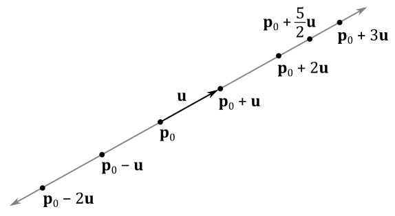

 

If we restrict the parameter $t$ to be a positive real number (that is, $t \in \mathbb{R} _+$), we can define a ray starting in $\mathbf{p} _0$ (the origin of the ray) that never changes direction.

We need two points $\mathbf{p} _0$ and $\mathbf{p} _1$ to specify the ends of a line segment. At that point we can define the vector $\mathbf{u}=\mathbf{p} _1 - \mathbf{p} _0$ between the ends of the line segment. This vector specifies the direction of the line segment, so that we can use it to derive the equation of the line where the line segment lies.

 

$\mathbf{p}(t)=\mathbf{p} _0+t\mathbf{u}=\mathbf{p} _0+t(\mathbf{p} _1 - \mathbf{p} _0)$

 

Restricting $t$ in the range $[0, 1]$ we can specify all points of the line segment, as shown in the figure below.

 

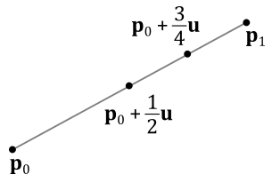

 

## 3.1 - Distance between a point and a line

To measure the distance $d$ of a point $\mathbf{q}$ from a line $\mathbf{p}(t)=\mathbf{p}+t\mathbf{u}$ we can use the following formula.

 

$d=\displaystyle\frac{\vert(\mathbf{q}-\mathbf{p})\times \mathbf{u}\vert}{\vert\mathbf{u}\vert}$

 

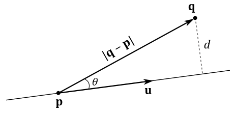

 

Indeed, from trigonometry, and considering the figure above, we have that

 

$d=\displaystyle\frac{\vert(\mathbf{q}-\mathbf{p})\times\mathbf{u}\vert}{\vert\mathbf{u}\vert}=\frac{\vert(\mathbf{q}-\mathbf{p})\vert\ \vert\mathbf{u}\vert\sin\theta}{\vert\mathbf{u}\vert}=\vert(\mathbf{q}-\mathbf{p})\vert\sin\theta=d$

 

 

# 4 - Parallelograms and triangles

Given a point $\mathbf{q}$ and two non-parallel directions $\mathbf{u}$ and $\mathbf{v}$ (that is, $\mathbf{u}\ne k\mathbf{v}$), we can define the parametric equation of a parallelogram as follows

 

$\mathbf{p}(s,t)=\mathbf{q}+s\mathbf{u}+t\mathbf{v}$

 

where the parameters $s$ and $t$ are real numbers in the range $[0,1]$. 
Indeed, all points of a parallelogram can be specified as the sum of the scaled sides applied to a point, as shown in the figure below.

 

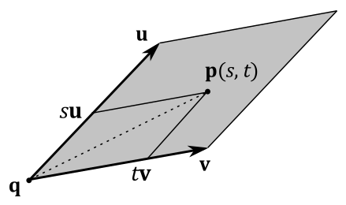

 

If we restrict $s$ and $t$ so that $s\ge 0,\ t\ge 0,\ s+t\le 1$ then $\mathbf{p}(s,t)$ becomes the parametric equation of a triangle. Indeed, considering the image above (as well as the one in the next section), if we set $s=1$ and $t\ne 0$ then the point $\mathbf{p}(s,t)$ will cross the minor diagonal of the parallelogram, specifying a point outside the triangle with sides $\mathbf{u}$ and $\mathbf{v}$.

 

## 4.1 - Barycentric coordinates

Most of the time, to define a triangle we will use three points $\mathbf{p} _0$, $\mathbf{p} _1$ and $\mathbf{p} _2$, to specify its vertices. Then, we can define the vectors $\mathbf{u}=\mathbf{p} _1 - \mathbf{p} _0$ and $\mathbf{v}=\mathbf{p} _2 - \mathbf{p} _0$. Substituting into the parametric equation of a triangle (that is, with $s\ge 0,\ t\ge 0,\ s+t\le 1$) we have

 

$\mathbf{p}(s,t)=\mathbf{p} _0 + s(\mathbf{p} _1 -\mathbf{p} _0) + t(\mathbf{p} _2 - \mathbf{p} _0)$

$=\mathbf{p} _0+s\mathbf{p} _1 - s\mathbf{p} _0 + t\mathbf{p} _2 - t\mathbf{p} _0$

$=(1-s-t)\mathbf{p} _0+s\mathbf{p} _1 + t\mathbf{p} _2$

$=r\mathbf{p} _0+s\mathbf{p} _1 + t\mathbf{p} _2$

 

where $r=(1-s-t)$, so that $r+s+t=1$.  
In this case we call $(r, s, t)$ the barycentric coordinates of a generic point $\mathbf{p}(s,t)$ inside a triangle defined by three points $\mathbf{p} _0$, $\mathbf{p} _1$ and $\mathbf{p} _2$.

 

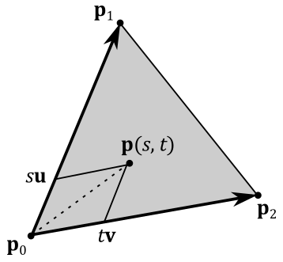

 

Barycentric coordinates allow to specify a generic point $\mathbf{p}(s,t)$ inside a triangle as a linear combination (weighted sum) of its vertices. The higher the value of a barycentric coordinate, the more the point $\mathbf{p}(s,t)$ is attracted by the related vertex.

 

 

# 5 - Planes

A plane can be specified by a point $\mathbf{p} _0$ on the plane and a direction $\mathbf{n}$ perpendicular to the plane called normal vector (or simply normal). A plane divides the 3D space in two half-spaces: an upper (or positive) halp-space and a lower (or negative) halp-space. The normal to a plane always points towards the upper half-space. If a point $\mathbf{q}$ is in the upper half-space, then $\mathbf{q}$ is in front of the plane, otherwise it is behind it.

 

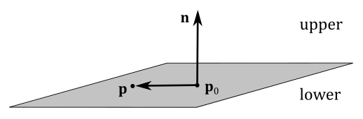

 

As you can verify in the image above, a generic point $\mathbf{p}$ of the plane must solve the following equation since the vectors $(\mathbf{p}-\mathbf{p} _0)$ and $\mathbf{n}$ have to be orthogonal to each other for every point $\mathbf{p}$ on the plane.

 

$\mathbf{n}\cdot (\mathbf{p}-\mathbf{p} _0)=0$

 

This is called equation of the plane because the set of points satisfying this equation represents the plane. The equation of the plane can also be written as follows

 

$\mathbf{n}\cdot (\mathbf{p}-\mathbf{p} _0)=\mathbf{n}\cdot\mathbf{p}-\mathbf{n}\cdot\mathbf{p} _0=\mathbf{n}\cdot \mathbf{p}+d=0$

 

where $d=-\mathbf{n}\cdot\mathbf{p} _0$.  
If $\mathbf{n}=(a,b,c)$ and $\mathbf{p}=(x,y,z)$, the equation of the plane can also be rewritten as

 

$ax+by+cz+d=0$

 

which is the well-know algebraic formula used to specify a plane in a 3D Cartesian coordinate system. Observe that here $\mathbf{p}=(x,y,z)$ is the only unknown because we already know $\mathbf{p} _0$ and $\mathbf{n}$, so that we also know $d=-\mathbf{n}\cdot\mathbf{p} _0$.

 

## 5.1 - Distance between a point and a plane

Often we will use the vector $(\mathbf{n},d)=(n_x,n_y,n_z,d)$ to specify a plane. As explained in appendix 01, if $\mathbf{n}$ is a unit vector then $\mathbf{n}\cdot\mathbf{p} _0$ is the signed length of the orthogonal projection of $\mathbf{p} _0$ onto $\mathbf{n}$. In that case, $d=-\mathbf{n}\cdot\mathbf{p} _0$ represents the signed distance between the plane and the origin of the 3D Cartesian coordinate system in which the plane is defined, as shown in the figure below.

 

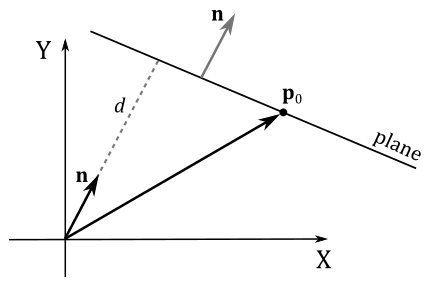

 

In general, we have a negative distance between a point and a plane if the point is behind the plane (that is, the point is in the negative\lower half-space). Indeed, the distance $k$ of a point $\mathbf{p}$ from a plane $(\mathbf{n},d)$ is given by the following equation

 

$k=\mathbf{n}\cdot (\mathbf{p}-\mathbf{p} _0)=\mathbf{n}\cdot\mathbf{p}-\mathbf{n}\cdot\mathbf{p} _0=\mathbf{n}\cdot \mathbf{p}+d$

 

which makes sense since this distance is calculated subtracting the length of the projection of $\mathbf{p}$ onto $\mathbf{n}$ (that is, $\mathbf{n}\cdot \mathbf{p}$) from the length of the projection of $\mathbf{p} _0$ onto $\mathbf{n}$ (that is, $\mathbf{n}\cdot \mathbf{p} _0$), as illustrated in the figure below.

 

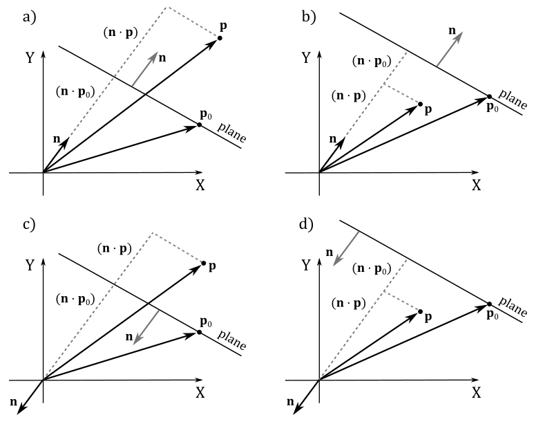

 

Observe that in the Cartesian systems c and d of the image above both $(\mathbf{n}\cdot \mathbf{p})$ and $\mathbf{n}\cdot \mathbf{p} _0$ are negative because the angles are greater than $90°$. 
Therefore, if $\mathbf{p}$ is in the lower half-space, then $k$ is negative, otherwise it is positive. So, we can conclude that

- If $\mathbf{n}\cdot (\mathbf{p}-\mathbf{p} _0)=\mathbf{n}\cdot \mathbf{p}+d>0$, then $\mathbf{p}$ is in front of the plane.

- If $\mathbf{n}\cdot (\mathbf{p}-\mathbf{p} _0)=\mathbf{n}\cdot \mathbf{p}+d<0$, then $\mathbf{p}$ is behind the plane.

- If $\mathbf{n}\cdot (\mathbf{p}-\mathbf{p} _0)=\mathbf{n}\cdot \mathbf{p}+d=0$, then $\mathbf{p}$ lies in the plane.

 

## 5.2 - Normalizing a Plane

If we have a plane $(\mathbf{n},d)$ where $\mathbf{n}$ is not a unit vector, we can't simply normalize $\mathbf{n}$ because $d=-\mathbf{n}\cdot\mathbf{p} _0$ (that is, $d$ depends on $\mathbf{n}$). This means that to normalize $\mathbf{n}$ we must change $d$ as well. For this purpose, we just need to divide both $\mathbf{n}$ and $d$ by $1/\vert\mathbf{n}\vert$.

 

$\hat{\mathbf{n}}=\displaystyle\frac{\mathbf{n}}{\vert\mathbf{n}\vert}$

$d'=\displaystyle\frac{d}{\vert\mathbf{n}\vert}=-\frac{\mathbf{n}}{\vert\mathbf{n}\vert}\cdot \mathbf{p} _0$

 

## 5.3 - Line/Plane Intersection

To check if a line, a ray, or a line segment intersects a plane we can proceed as follows.  
Given a line $\mathbf{p}(t)=\mathbf{p} _0+t\mathbf{u}$ (the equation is the same for rays and segments, as shown in section 3) and a plane $\mathbf{n}\cdot \mathbf{p}+d=0$, we can substitute the equation of the line into the equation of the plane to find out if both have a shared point (that is, if the line intersects the plane). For this purpose, we need to find a value for the parameter $t$ which is both finite and different from zero.

 

$\mathbf{n}\cdot \mathbf{p}(t)+d=0$

$\mathbf{n}\cdot(\mathbf{p} _0+t\mathbf{u})+d=0$

$\mathbf{n}\cdot\mathbf{p} _0+t\mathbf{n}\cdot\mathbf{u}+d=0$

$t\mathbf{n}\cdot\mathbf{u}=-\mathbf{n}\cdot\mathbf{p} _0-d$

 

$t=\displaystyle\frac{-\mathbf{n}\cdot\mathbf{p} _0-d}{\mathbf{n}\cdot\mathbf{u}}$

 

If $\mathbf{n}\cdot\mathbf{u}=0$ either there are no solutions (line and plane are parallel) or there are infinite solutions (the line lies in the plane). If we find a unique, finite solution for $t$, we can substitute this value into the equation of the line to compute the coordinates of the point of intersection. Observe that solutions for $t$ outside the range $[0,+\infty)$ and $[0, 1]$ are invalid with rays and line segments, respectively. 

 

## 5.4 - Reflecting directions and points with respect to a plane

Directions are free vectors (that is, it doesn't matter where we apply them). However, often to perform calculations on directions it can be useful to apply them to a common point. The figure below shows that to calculate the reflection $\mathbf{r}$ of a direction $\mathbf{l}$ with respect to the normal $\mathbf{n}$ to a plane, we can add to $\mathbf{l}$ the inverse of its projection onto $\mathbf{n}$, doubled in size. That is,

 

$\mathbf{r}=\mathbf{l}-2(\mathbf{n}\cdot \mathbf{l})\mathbf{n}$

 

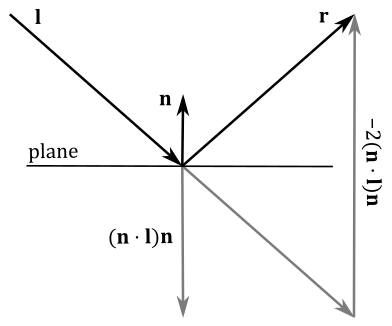

 

Observe that the normal $\mathbf{n}$ needs to be a unit vector because we used the orthogonal projection of $\mathbf{l}$ onto $\mathbf{n}$ to calculate $\mathbf{r}$ (see appendix 01). However, we can always normalize the normal vector using the method presented in section 5.2.

To reflect points with respect to a plane, we need a point on the plane in addition to its normal (that is, we need the vector $(\mathbf{n},d)$ that represents the plane). Indeed, as you can see in the figure below, to calculate the reflection $\mathbf{q}$ of a point $\mathbf{p}$ with respect to the plane $(\mathbf{n},d)$, we can add to $\mathbf{p}$ the inverse of the projection of $(\mathbf{p}-\mathbf{p} _0)$ onto $\mathbf{n}$, doubled in size. That is,

 

$\mathbf{q}=\mathbf{p}-2\ \text{proj} _{\mathbf{n}}(\mathbf{p}-\mathbf{p} _0)$

 

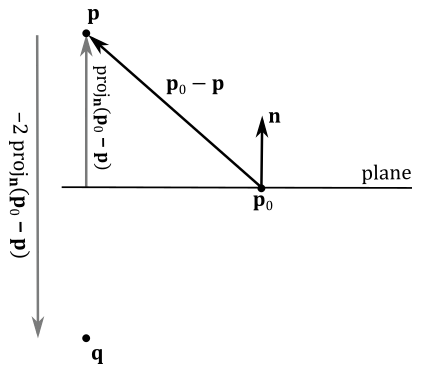

 

Observe that the reflection $\mathbf{q}$ can be considered as a translation of $\mathbf{p}$ along the inverse direction of the normal. In this case the normal $\mathbf{n}$ doesn't need to be a unit vector. However, if that's the case, we have

 

$\mathbf{q}=\mathbf{p}-2\ \text{proj} _{\mathbf{n}}(\mathbf{p}-\mathbf{p} _0)$

$=\color{#FF6666}\mathbf{p}-2[\mathbf{n}\cdot (\mathbf{p}-\mathbf{p0} _0)]\mathbf{n}$

$=\mathbf{p}-2(\mathbf{n}\cdot\mathbf{p}-\mathbf{n}\cdot\mathbf{p} _0)\mathbf{n}$

$=\mathbf{p}-2(\mathbf{n}\cdot\mathbf{p}+d)\mathbf{n}$

 

As you can see, the reflection of directions is very similar to the reflection of points (especially if you look at the red expression above). And indeed, we can handle both these cases in the same way with the help of the following matrix of reflection with respect to a plane $(\mathbf{n},d)=(n_x,n_y,n_z,d)$.

 

$\mathbf{R}=\left\lbrack\matrix{ 1-2n_xn_x & -2n_xn_y & -2n_xn_z & 0 \cr  -2n_xn_y & 1-2n_yn_y & -2n_yn_z & 0 \cr  -2n_xn_z &  -2n_yn_z & 1-2n_zn_z & 0 \cr  -2dn_x & -2dn_y & -2dn_z & 1 }\right\rbrack$

 

Multiplying a point $\mathbf{p}=(p_x,p_y,p_z,1)$ by $\mathbf{R}$ we can check that the result is the reflected point $\mathbf{q}$.

 

$\left\lbrack\matrix{ p_x & p_y & p_z & 1 }\right\rbrack \left\lbrack\matrix{ 1-2n_xn_x & -2n_xn_y & -2n_xn_z & 0 \cr  -2n_xn_y & 1-2n_yn_y & -2n_yn_z & 0 \cr  -2n_xn_z &  -2n_yn_z & 1-2n_zn_z & 0 \cr  -2dn_x & -2dn_y & -2dn_z & 1 }\right\rbrack$

$=\left\lbrack\matrix{  (p_x-2p_xn_xn_x-2p_yn_xn_y-2p_zn_xn_z-2dn_x) \cr  (-2p_xn_xn_y+p_y-2p_yn_yn_y-2p_zn_yn_z-2dn_y) \cr  (-2p_xn_xn_z-2p_yn_yn_z+p_z-2p_zn_zn_z-2dn_z) \cr  1 }\right\rbrack^T$

$=\left\lbrack\matrix{ p_x \cr p_y \cr p_z \cr 1 }\right\rbrack^T + \left\lbrack\matrix{  -2n_x(p_xn_x+p_yn_y+p_zn_z+d) \cr  -2n_y(p_xn_x+p_yn_y+p_zn_z+d) \cr  -2n_z(p_xn_x+p_yn_y+p_zn_z+d) \cr  0 }\right\rbrack^T$

$=\left\lbrack\matrix{ p_x \cr p_y \cr p_z \cr 1 }\right\rbrack^T + \left\lbrack\matrix{  -2n_x(\mathbf{n}\cdot\mathbf{p}+d) \cr  -2n_y(\mathbf{n}\cdot\mathbf{p}+d) \cr  -2n_z(\mathbf{n}\cdot\mathbf{p}+d) \cr  0 }\right\rbrack^T$

$=\mathbf{p}-2(\mathbf{n}\cdot\mathbf{p}+d)\mathbf{n}$

$=\mathbf{p}-2\,\text{proj}_{\mathbf{n}}(\mathbf{p}-\mathbf{p_0})=\mathbf{q}$

 

In a similar way, multiplying a direction $\mathbf{l}=(l_x,l_y,l_z,0)$ by $\mathbf{R}$ we can check that the result is the reflected direction $\mathbf{r}$.

 

$\left\lbrack\matrix{ l_x & l_y & l_z & 0 }\right\rbrack \left\lbrack\matrix{ 1-2n_xn_x & -2n_xn_y & -2n_xn_z & 0 \cr  -2n_xn_y & 1-2n_yn_y & -2n_yn_z & 0 \cr  -2n_xn_z &  -2n_yn_z & 1-2n_zn_z & 0 \cr  -2dn_x & -2dn_y & -2dn_z & 1 }\right\rbrack$

$=\mathbf{l}-2(\mathbf{n}\cdot \mathbf{l})\mathbf{n}=\mathbf{r}$

 

Therefore, the matrix $\mathbf{R}$ allows to reflect both points and directions with respect to a plane $(\mathbf{n},d)$, provided $\mathbf{n}$ is a unit vector (remember that you can always normalize it).

 

## 5.5 - Projecting points onto a plane

A point $\mathbf{p}$ can be projected onto a plane $(\mathbf{n},d)$ along a particular direction $\mathbf{l}=(l_x,l_y,l_z,0)$, as illustrated in the following image. 

 

 

In this case, we have all the necessary information to build the equation of the plane $(\mathbf{n}\cdot \mathbf{p}+d=0)$, and the equation of the line passing through the point $\mathbf{p}$ as well $(\mathbf{r}(t)=\mathbf{p}+t\mathbf{l})$. Therefore, we can simply calculate their point of intersection $\mathbf{s}$ using the method presented in section 5.3. Suppose we find a valid solution $t_s$ for the parameter $t$, then we can substitute $t_s$ into the equation of the line to compute the coordinates of the point of intersection $\mathbf{s}=(s_x,s_y,s_z)$.

 

$$\mathbf{s}=\mathbf{r}(t_s)=\mathbf{p}-\displaystyle\frac{\mathbf{n}\cdot\mathbf{p}+d}{\mathbf{n}\cdot\mathbf{l}}\mathbf{l}\tag{1}$$

 

On the other hand, a point $\mathbf{p}$ can also be projected onto a plane with respect to another point $\mathbf{l}=(l_x,l_y,l_z,1)$ (observe that the w-component now is 1). 

 

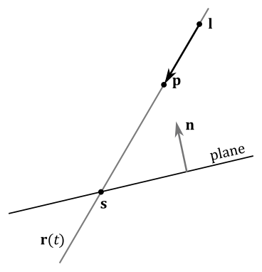

 

In this case, the direction of projection is $(\mathbf{p}-\mathbf{l})$, so that equation $(1)$ becomes

 

$$\tag{2}\mathbf{s}=\mathbf{r}(t_s)=\mathbf{p}-\displaystyle\frac{\mathbf{n}\cdot\mathbf{p}+d}{\mathbf{n}\cdot(\mathbf{p}-\mathbf{l})}(\mathbf{p}-\mathbf{l})$$

 

Fortunately, we can still handle both these cases in the same way with the help of the following matrix of projection onto a plane $(\mathbf{n},d)=(n_x,n_y,n_z,d)$, provided that the multiplication by this matrix is followed by a perspective division (that is, we consider it as a perspective projection matrix, as explained in appendix 04; more on this shortly).

 

$\mathbf{S}=\left\lbrack\matrix{ \mathbf{n}\cdot\mathbf{l}+dl_w-l_xn_x & -l_yn_x & -l_zn_x & -l_wn_x \cr  -l_xn_y & \mathbf{n}\cdot\mathbf{l}+dl_w-l_yn_y & -l_zn_y & -l_wn_y \cr  -l_xn_z & -l_yn_z & \mathbf{n}\cdot\mathbf{l}+dl_w-l_zn_z & -l_wn_z \cr  -l_xd & -l_yd & -l_zd & \mathbf{n}\cdot\mathbf{l} }\right\rbrack$

 

Multiplying a point $\mathbf{p}=(p_x,p_y,p_z,1)$ by $\mathbf{S}$, and considering $\mathbf{l}=(l_x,l_y,l_z,0)$, we have

 

$\mathbf{s}'=\left\lbrack\matrix{ p_x & p_y & p_z & 1 }\right\rbrack\left\lbrack\matrix{ \mathbf{n}\cdot\mathbf{l}-l_xn_x & -l_yn_x & -l_zn_x & 0 \cr  -l_xn_y & \mathbf{n}\cdot\mathbf{l}-l_yn_y & -l_zn_y & 0 \cr  -l_xn_z & -l_yn_z & \mathbf{n}\cdot\mathbf{l}-l_zn_z & 0 \cr  -l_xd & -l_yd & -l_zd & \mathbf{n}\cdot\mathbf{l} }\right\rbrack$

 

Computing the i-th component of $\mathbf{s}'$ we get

 

$s'_i=(\mathbf{n}\cdot\mathbf{l})p_i-l_in_xp_x-l_in_yp_y-l_in_zp_z-l_id$

$=(\mathbf{n}\cdot\mathbf{l})p_i-(\mathbf{n}\cdot\mathbf{p}+d)l_i$

 

Therefore, we have that

 

$\mathbf{s}'=(\mathbf{n}\cdot\mathbf{l})\mathbf{p}-(\mathbf{n}\cdot\mathbf{p}+d)\mathbf{l}$

 

As you can see, $\mathbf{s}'$ differs from $\mathbf{s}$ (equation $(1)$ ) by a factor of $(\mathbf{n}\cdot\mathbf{l})$. That is, we need to divide $\mathbf{s}'$ by $\mathbf{n}\cdot\mathbf{l}$ to get $\mathbf{s}$. Fortunately, the last component of $\mathbf{s}'$ is 

 

$s'_w=(\mathbf{n}\cdot\mathbf{l})p_w-(\mathbf{n}\cdot\mathbf{p}+d)l_w=(\mathbf{n}\cdot\mathbf{l})1-(\mathbf{n}\cdot\mathbf{p}+d)0=(\mathbf{n}\cdot\mathbf{l})$

 

so that, considering $\mathbf{S}$ as a perspective projection matrix, we can get $\mathbf{s}$ after the rasterizer stage, which automatically performs the perspective division (that is, it divides the components of each vertex in input by its w-component; see appendix 04). This means that, if we have objects we want to project onto a plane, we can multiply their world matrix by $\mathbf{S}$ in the vertex shader to take advantage of the following perspective division performed by the rasterizer.

 

>Multiplying a vertex $\mathbf{v}$ by $\mathbf{WS}$ (the composition between world matrix and $\mathbf{S}$) we get $\mathbf{s}'$, the projection of $\mathbf{v}$ in world coordinates. It does not matter if we also multiply $\mathbf{s}'$ by $\mathbf{V}$ and\or $\mathbf{P}$ (the view and perspective projection matrices, respectively). Indeed, it ends up being a simple matrix composition where we add transformations without affecting the effect of each transformation (see appendix 03). In other word, the perspective division will take into account the term $(\mathbf{n}\cdot\mathbf{l})$, and the terms of any other possible projections as well, because the w-component in homogeneous clip space will contain all of them.  
However, we need to solve a problem: when we use the perspective division to calculate the projection of a vertex onto a plane (in addition to its perspective projection onto the projection window), the vertex could be incorrectly clipped by the rasterizer. Indeed, as explained in appendix 04, clipping is performed in homogeneous clip space, where if the w-coordinate is negative, the related vertex is considered outside the visible region, and discarded by the clipping algorithm.
>
> 
>
>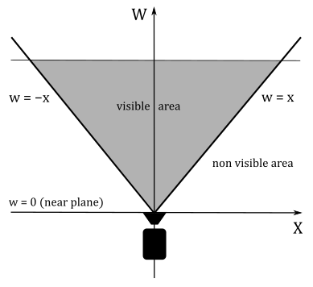
>
> 
>
>Unfortunately, in this case we have that the w-coordinate contains the cosine between two vectors $(\mathbf{n}\cdot\mathbf{l})$, so that we can often get a negative value, as illustrated in the following image.
>
> 
>
>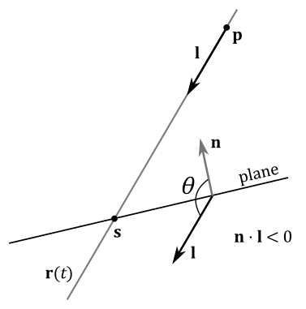
>
> 
>
>To solve this problem we can simply reverse the direction of projection $\mathbf{l}$ when it forms an angle greater than $90°$ with $\mathbf{n}$. That's not a big problem because the equation of the line $\mathbf{r}(t)$ is still the same, as well as the point of intersection. However, we will get a different solution $t_s$ for the parameter $t$ in equation $(1)$ to take into account the change of direction. Substituting $t_s$ into the equation of the line, still returns the point of intersection $\mathbf{s}$.

 

On the other hand, multiplying a point $\mathbf{p}=(p_x,p_y,p_z,1)$ by $\mathbf{S}$, and considering $\mathbf{l}=(l_x,l_y,l_z,1)$ as a point, we have

 

$\mathbf{s}'=\left\lbrack\matrix{ \mathbf{n}\cdot\mathbf{l}+d-l_xn_x & -l_yn_x & -l_zn_x & n_x \cr  -l_xn_y & \mathbf{n}\cdot\mathbf{l}+d-l_yn_y & -l_zn_y & -n_y \cr  -l_xn_z & -l_yn_z & \mathbf{n}\cdot\mathbf{l}+d-l_zn_z & -n_z \cr  -l_xd & -l_yd & -l_zd & \mathbf{n}\cdot\mathbf{l} }\right\rbrack$

 

Computing the i-th component of $\mathbf{s}'$ we get

 

$s'_i=(\mathbf{n}\cdot\mathbf{l})p_i+p_id-l_in_xp_x-l_in_yp_y-l_in_zp_z-l_id$

$=(\mathbf{n}\cdot\mathbf{l})p_i+p_id-(\mathbf{n}\cdot\mathbf{p})l_i+l_id$

$=(\mathbf{n}\cdot\mathbf{l})p_i+p_id$ $\color{#FF6666}+\ (\mathbf{n}\cdot\mathbf{p})p_i-(\mathbf{n}\cdot\mathbf{p})p_i$ $-\ (\mathbf{n}\cdot\mathbf{p})l_i+l_id$

$=(\mathbf{n}\cdot\mathbf{l})p_i-(\mathbf{n}\cdot\mathbf{p})p_i+(\mathbf{n}\cdot\mathbf{p}+d)p_i-(\mathbf{n}\cdot\mathbf{p}+d)l_i$

$=\mathbf{n}\cdot(\mathbf{l}-\mathbf{p})p_i+(\mathbf{n}\cdot\mathbf{p}+d)p_i-(\mathbf{n}\cdot\mathbf{p}+d)l_i$

$=-\mathbf{n}\cdot(\mathbf{p}-\mathbf{l})p_i+(\mathbf{n}\cdot\mathbf{p}+d)(p_i-l_i)$

 

Therefore, we have that

 

$\mathbf{s'}=-\mathbf{n}\cdot(\mathbf{p}-\mathbf{l})\mathbf{p}+(\mathbf{n}\cdot\mathbf{p}+d)(\mathbf{p}-\mathbf{l})$

 

As you can see, $\mathbf{s}'$ differs from $\mathbf{s}$ (equation $(2)$ ) by a factor of $-\mathbf{n}\cdot(\mathbf{p}-\mathbf{l})$, which is exactly the value of the last component of $\mathbf{s}'$

 

$s'_w=-\mathbf{n}\cdot(\mathbf{p}-\mathbf{l})p_w+(\mathbf{n}\cdot\mathbf{p}+d)(p_w-l_w)=-\mathbf{n}\cdot(\mathbf{p}-\mathbf{l})1+(\mathbf{n}\cdot\mathbf{p}+d)(1-1)=-\mathbf{n}\cdot(\mathbf{p}-\mathbf{l})$

 

This means that after the perspective division we get $\mathbf{s}$, the projection of $\mathbf{p}$ with respect to the point $\mathbf{l}$. Observe that in this case $s'_w$ won't be negative if $(\mathbf{p}-\mathbf{l})$ forms an angle greater than $90°$ with $\mathbf{n}$ because the dot product is between $(\mathbf{p}-\mathbf{l})$ and the inverse of the normal. Obviously, $s'_w$ will be negative if the angle is less than $90°$. However, even in this case we hardly reverse one of the two vectors because usually we are mainly interested in projecting onto the front face of the plane.

Therefore, we just showed we can handle both cases (projection onto a plane along a direction and with respect to a point) with the help of the matrix $\mathbf{S}$. 

 

 

# 6 - Cramer's rule

A general system of $m$ linear equations with $n$ unknowns and coefficients can be written as

 

$$\begin{flalign}
& \begin{cases}
a_{11}x_1 + a_{12}x_2 + a_{13}x_3 + \cdots + a_{1n}x_n = b_1 \cr a_{20}x_1 + a_{21}x_2 + a_{22}x_3 + \cdots + a_{2n}x_n = b_2 \cr a_{30}x_1 + a_{31}x_2 + a_{32}x_3 + \cdots + a_{3n}x_n = b_3 \cr \cdots \cr a_{n0}x_1 + a_{n1}x_2 + a_{n2}x_3 + \cdots + a_{nn}x_n = b_n
\end{cases} &
\end{flalign}$$

 

where $x_{1},x_{2},\dots ,x_{n}$ are the unknowns, $a_{11},a_{12},\dots ,a_{mn}$ are the coefficients of the system, and $b_{1},b_{2},\dots ,b_{m}$ are the constant terms.  
We can also write it in matrix form as follows

 

$\left\lbrack\matrix{ a_{11} & a_{12} & a_{13} & \cdots & a_{1n} \cr a_{20} & a_{21} & a_{23} & \cdots & a_{2n} \cr a_{30} & a_{31} & a_{33} & \cdots & a_{3n} \cr \vdots & \vdots & \ddots & \vdots \cr a_{n1} & a_{n2} & a_{n3} & \cdots & a_{nn} }\right\rbrack \left\lbrack\matrix{ x_{1}\cr x_{2} \cr \vdots \cr x_{n} }\right\rbrack = \left\lbrack\matrix{ b_{1}\cr b_{2} \cr \vdots \cr b_{n} }\right\rbrack$

 

$\mathbf{A}\mathbf{x}=\mathbf{b}$

 

where $\mathbf{A}$ is an $m\times n$ matrix consisting of the coefficients of the system, $\mathbf{x}$ is a column vector with the $n$ unknowns, and $\mathbf{b}$ is a column vector with the $m$ constant terms.

If $m=n$ (i.e., if $\mathbf{A}$ is a square matrix), then we can find the i-th unknown $x_i$ by dividing the determinat of $\mathbf{A} _i$ by the determinant of $\mathbf{A}$. We can build the matrix $\mathbf{A} _i$ starting from $\mathbf{A}$, and replacing its i-th column with $\mathbf{b}$, the column vector of the constant terms.

 

$x_i=\displaystyle\frac{det(\mathbf{A} _i)}{det(\mathbf{A})}$

 

Below is a practical demonstration showing the validity of this formula. 
Suppose we have a system of 3 linear equations with 3 unknowns $(x,y,z)$.

 

$$\begin{flalign} & \begin{cases} 
a_1x+b_1y+c_1z=d_1 \cr 
a_2x+b_2y+c_2z=d_2 \cr 
a_3x+b_3y+c_3z=d_3
\end{cases} & \end{flalign}
$$

 

Assuming the matrix $\mathbf{A}$ has a non-zero determinant $(det(\mathbf{A})\ne 0
)$, and remembering that if we add a scaled column to another column of a matrix the determinant does not change (see appendix 03), we have

 

$det(\mathbf{A} _1)=\left\lbrack\matrix{d_1 & b_1 & c_1 \cr d_2 & b_2 & c_2 \cr d_3 & b_3 & c_3 }\right\rbrack$

$=\left\lbrack\matrix{ (a_1x+b_1y+c_1z) & b_1 & c_1 \cr (a_2x+b_2y+c_2z) & b_2 & c_2 \cr (a_3x+b_3y+c_3z) & b_3 & c_3 }\right\rbrack$

$=\left\lbrack\matrix{ (a_1x+b_1y+c_1z)-(b_1y+c_1z) & b_1 & c_1 \cr (a_2x+b_2y+c_2z)-(b_2y+c_2z) & b_2 & c_2 \cr (a_3x+b_3y+c_3z)-(b_3y+c_3z) & b_3 & c_3 }\right\rbrack$

$=\left\lbrack\matrix{ a_1x & b_1 & c_1 \cr a_2x & b_2 & c_2 \cr a_3x & b_3 & c_3 }\right\rbrack$

$=x\left\lbrack\matrix{ a_1 & b_1 & c_1 \cr a_2 & b_2 & c_2 \cr a_3 & b_3 & c_3 }\right\rbrack$

$=x\ det(\mathbf{A})$

 

Therefore, the first unknown $(x)$ is

 

$x=\displaystyle\frac{det(\mathbf{A} _1)}{det(\mathbf{A})}$

 

By similar calculations we can compute the other two unknowns ($y$ and $z$).

 

 

# References

[1] Practical Linear Algebra: A Geometry Toolbox (Farin, Hansford)  
[2] Introduction to 3D Game Programming with DirectX 12 (Luna)  
[3] Real-Time Rendering (Haines, Möller, Hoffman)  
[4] Jim Blinn's Corner: A Trip Down the Graphics Pipeline (Blinn)

 

***
If you found the content of this tutorial somewhat useful or interesting, please consider supporting this project by clicking on the **Sponsor** button.  Whether a small tip, a one time donation, or a recurring payment, it's all welcome! Thank you!  

 

 