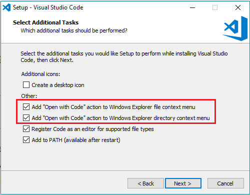

# 00 - Introduction and Prerequisites

<br>


<br>

# 1 - Introduction

Vulkan has a reputation for being difficult to learn for beginners. The main reason is that it hides less to the programmer than the old API (OpenGL), so you just end up studying low-level details even to draw a single triangle. However, learning Vulkan also has some advantages as it designed to make full use of multi-threading, and to provide finer control over resource management and CPU/GPU synchronization. <br>
Thanks to better support for multi-threading, the CPU workload is more evenly distributed across all cores, which can lead to increased GPU workload, enhancing the overall performance of your graphics applications. And if you understand the use and re-use of resources, then you can minimize data transferts (uploading and copying of data) and reduce the total memory footprint of the application by recycling the same physical memory.

<br>

> Observe that if the bottleneck of your application is not CPU-side (that is, if the GPU never waits for the CPU to send work to execute) then Vulkan is not necessarily going to give you a performance boost. Indeed, the functionality exposed by Vulkan is almost identical to that found in OpenGL, and if your application is limited by GPU rendering performance, then it is unlikely that Vulkan will give you better results. However, even if your application isn't CPU-limited, using Vulkan still allows you to free up CPU time, improving the overall system energy efficiency.

<br>

Currently, you have three ways to learn Vulkan from scratch: books, online tutorials, and official documentation, each with its own strengths and weaknesses, but with a common thread that binds them together. Indeed, the intended audience of these resources are graphics programmers (that is, they assume you have basic knowledge of computer graphics), so the focus is on the API, leaving little room for the math and theory behind rendering techniques. <br>
Actually, even if you are not a graphics programmer, nothing prevents you from learning Vulkan from resources that are currently available, provided that you are motivated enough to jump from a math textbook to another, and to read dozens of documentation pages and tutorials to collect all the information you need about every single subject.

With this tutorial series I'll try to fill the gap, providing a resource  which covers both theory (maths, computer graphics, rendering techniques) and practice (Vulkan API and code samples) in depth. And the only possibility of doing that effectively is to prevent the reader from getting bored, intimidated or discouraged by the amount of information they need to learn and master in order to write even the simplest graphics application. Usually, when people start studying computer graphics, they want to see something on their screen as a reward. For this reason, in every tutorial I will review a different sample to only explain the theory needed to implement it. That way, the reader feels like they are studying to understand the implementation of that specific sample. This allows a gradual and progressive acquisition of new information on which to build knowledge like a puzzle: whenever you read a tutorial, you add another piece.

I’m not claiming this will be the ultimate resource to learn the Vulkan API. By the way, the official documentation (see [1] and [2] in the reference list at the end of this tutorial) will always be the most important and fundamental resource to refer to during your studies. Here, I will simply try to provide as many details as possible to minimize the number of resources you need to look at.

As a reference for writing the samples of this tutorial series, I used the source code already available and maintained by The Khronos Group and Sascha Willems in their repositories. In particular, I will use a minimal framework, trying to follow the [Orthodox C++ guidelines](https://gist.github.com/bkaradzic/2e39896bc7d8c34e042b) as much as possible to increase readability, and therefore to facilitate understanding of the source code.

<br>

[Khronos Group on GitHub](https://github.com/KhronosGroup) <br>
[Sascha Willems on GitHub](https://github.com/SaschaWillems) <br>

<br>

In conclusion, if you are looking for a comprehensive, updated resource to learn how to program with the Vulkan API from scratch, then give this tutorial series a chance.

<br>

<br>

# 2 - Prerequisites

## 2.1 - Background knowledge

Of course I can’t explain everything, so you need basic math skills to completely understand the content of the tutorials, as well as the techniques used in the related samples. Fortunately, college math (algebra, trigonometry and single variable calculus) covers about 90% of the math used in this tutorial series. If your math got a bit rusty, don't worry: you can consider [3] as a brilliant math review from scratch for everyone. As for the remaining 10%, I’m going to write dedicated math appendices. However, if you prefer a book, you can consider [4] (for self-study) or [5] (for a formal education) as a reference for advanced topics. Additional textbook recommendations will be provided at the appropriate time.

If you need an introductory textbook on C++ you can take a look at [6] and [7], then use [8] as a reference, and [9] to really understand the low-level details.

<br>

## 2.1 - Hardware

Obviously, you need system with a Vulkan-capable graphics card if you want to run the samples examined in this tutorial series. Actually, most of the GPUs produced in the last decade should be compatible. However, you can directly verify it by running **vkcube**, a simple Vulkan test program you can find in the Vulkan-Tools repo, or in the Vulkan SDK (more on this shortly). <br>
Also, make sure to update the drivers for your graphics card to the latest version.

<br>

## 2.2 - Software

### 2.2.1 - Supported platforms

Windows, Linux and Android provide native support for Vulkan. This means that an OS is able to execute a Vulkan driver (released by a GPU hardware vendor), which is in charge of getting the Vulkan API calls mapped to the hardware. MacOS and iOS don't provide native support for Vulkan, but you can still execute Vulkan applications on those platforms somehow. However, I won't delve into much detail here since the source code of this tutorial series is written to only run on Windows and Linux. This is because I want to avoid code bloat from conditional compilation to support several platforms, and I don't event want to use a multi-platform library just to create a simple window (I won't hide anything to the reader). 

<br>

> The focus of this tutorial series is to learn how to write graphics applications with the Vulkan API from scratch, rather than a cross-platform development guide.

<br>

### 2.2.2 - Headers, libraries and tools

The repository that hosts the code of this tutorial series also includes the header files, libraries and tools needed to write and build Vulkan applications. Therefore, you don't need anything else except cloning the repo locally on your PC using the following command:

<br>

```
git clone https://github.com/PAMinerva/LearnVulkan
```

<br>

However, you also need the Vulkan Loader to execute Vulkan applications. On Windows, the Vulkan Loader is delivered with the hardware vendor driver update packages. On Linux, it should be the same if hardware vendor drivers are installed. Otherwise, you need to explicitly install it. For this purpose, you can download the Vulkan SDK from the following link.

<br>

https://vulkan.lunarg.com/sdk/home

<br>

Personally, I still recommend installing the Vulkan SDK on both Windows and Linux because it includes the Loader, and others interesting tools, already compiled (included the **vkcube** program test). Alternatively, you can refer to the Khronos Group repositories to get updated header files, and build the Loader and tools directly from the source code.

><br>
>
> 
>
> <br>
> 
>Alternatively, you can install the Vulkan SDK, which includes both the header files and binaries already compiled (included the **vkcube** program test), from the following link.
>
> https://vulkan.lunarg.com/sdk/home

<br>

### 2.2.3 - IDE

I will use Visual Studio Code to develop the samples presented in this tutorial series, so you are encouraged to install and use it as well, making sure to check the following additional tasks during installation setup.

<br>



<br>

You need to install the C/C++ extension for VS Code. You can install it by searching for 'c++' in the Extensions view.

<br>


<br>

On Windows you also need to install the Microsoft Visual C++ (MSVC) compiler toolset. <br>
If you have a recent version of Visual Studio, open the Visual Studio Installer from the Windows Start menu and verify that Desktop development with C++ is checked. If it's not installed, then check the box and select the Modify button in the installer.

<br>


<br>

> You can also install the Desktop development with C++ workload without a full Visual Studio IDE installation. From the Visual Studio Downloads page, scroll down until you see Tools for Visual Studio 2022 under the All Downloads section and select the download for Build Tools for Visual Studio 2022. This will launch the Visual Studio Installer.
>
><br>
>
>

<br>

On linux you need to check if GCC and GDB are already installed. To verify whether they are, open a Terminal window and enter the following commands:

<br>

```
gcc -v
gdb -help
```

<br>

If GCC and\or GDB aren't installed, refer to the appropriate documentation for instructions on installing them for your specific Linux distribution. Also, make sure the libx11 development package is installed as well.

To open a sample, right-click on the related folder and select "Open with Code" from the context menu.

<br>


<br>

If the option to "Open with Code" is not present in the context menu, you can alternatively navigate to File and select "Open Folder...".

<br>


<br>

<br>

## 2.3 - Graphics Debugger

In addition to an application debugger, such as GDB or the one included in the MSVC toolset, it's also necessary to have a graphics debugger that allows you to capture a frame of your Vulkan application for inspecting every individual event involved in generating the frame. For this purpose, I recommend installing RenderDoc and/or NVIDIA Nsight Graphics, which can be found at the following links.
<br>

[RenderDoc](https://renderdoc.org/) <br>
[NVIDIA Nsight Graphics](https://developer.nvidia.com/nsight-graphics/)

<br>


<br>

<br>

# References
[1] [Vulkan API Specifications](https://registry.khronos.org/vulkan/) <br>
[2] [Khronos APIs Specifications](https://registry.khronos.org/) <br>
[3] Engineering Mathematics (Stroud, Booth) <br>
[4] Advanced Engineering Mathematics (Stroud, Booth) <br>
[5] Advanced Engineering Mathematics (Kreyszig) <br>
[6] Beginning C++ Through Game Programming (Dawson) <br>
[7] A Tour of C++ (Stroustrup) <br>
[8] The C++ Programming Language (Stroustrup) <br>
[9] Write Great Code - Vol. 1 and 2 (Randall Hyde)