<br>

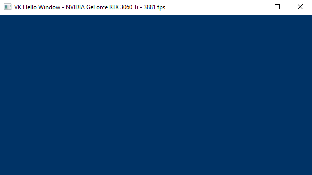

<br>

# 1 - Introduction

This section provides an overview of the most importan Vulkan concepts. It includes information that is already available in the official documentation and other resources. Observe that this section can be quite dense with information, and may contain some references that require some prior knowledge. Therefore, I also included basic computer graphics concepts (rendering pipeline, stages, shaders, etc.) to help keep this section as self-contained as possible. However, if you still have doubts, I recommend coming back to this section after going through the next tutorial, where general computer graphics concepts will be explained in detail from scratch.

<br>

## 1.1 - What is Vulkan?

Vulkan is an API Specification created and maintained by The Khronos Group, an open consortium of leading hardware and software companies. The Vulkan specification outlines a low-level API that is designed to expose the GPU to application developers with a minimal level of abstraction provided by the device driver. This allows Vulkan applications to take advantage of lower CPU overhead, reduced memory usage, and increased performance stability.

For a GPU to be compatible with Vulkan, it requires a hardware vendor-supplied driver that maps Vulkan API calls to the hardware, which of course must be capable of executing the corresponding operations. NVIDIA, AMD, and Intel offer their Vulkan implementations through driver update packages for a variety of GPU architectures and platforms, including Windows, Linux, and Android.

The Khronos Group provides C99 header files that are derived from the Vulkan Specification, and can be used by developers to interface with a hardware-specific implementation of the Vulkan API. Additionally, multiple language bindings are available for developers who do not work with C code.

<br>

## 1.2 - Why Vulkan?

You may be wondering why The Khronos Group didn't just release a new version of the OpenGL API and why you should choose Vulkan over OpenGL.

To answer the first question, the fact is that after the launch of Vulkan, a new version of OpenGL was indeed released. However, OpenGL and Vulkan offer the same functionality but with different levels of abstraction in their communication with the GPU. The differences in design between OpenGL and Vulkan are so significant that updating OpenGL without fundamentally changing it was nearly impossible. Hence, Vulkan was created.

Regarding the second question, Vulkan is a low-level API that provides applications with a lot of power, but in return it also requires applications to take on a lot of responsibility in ensuring proper functionality. Before you begin learning or working with Vulkan, it's important to evaluate its pros and cons to determine if it's the right choice for your projects.

<br>

### 1.2.1 - Advantages

Despite being more difficult to learn and use, Vulkan still brings some advantages compared to OpenGL, as outlined in the following sections.

<br>

**State management**

OpenGL uses a single global state which is known at draw time, meaning that it can be challenging and/or costly to implement certain optimizations.

<br>

> The term "state" refer to the set of information the GPU needs to execute its work. It specifies the behaviour\setup of every stage in the pipeline when we are going to draw something: shader code (that is, the code the GPU executes for programmable stages), input and output resources (of the pipeline stages), primitive topology (that is, if you want to draw points, lines, or triangles), etc.
>
>Graphics operations are performed through a rendering pipeline composed of stages. Some of these stages are called shaders and are programmable, which means we can set the tasks performed by writing special programs (shader code) to run on GPU cores for programmable stages. <br>
>Other stage are fixed, which means they perform predefined operations. However, we can still configure fixed stages to set how they should perform their tasks.
>
><br>
>
>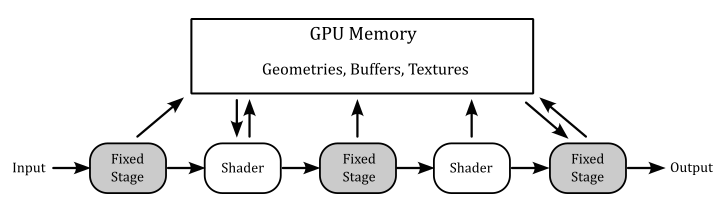
>
><br>
>
>Each stage outputs its results as input of the next stage. Additionally, memory resources (such as buffers and textures) can be accessed in GPU memory by pipeline stages to perform their tasks. However, if programs executed by programmable stages make use of memory resources, we need to bind resource variables in the shader code to actual resources in memory. <br>
>Additional details will be provided in the next tutorial.

<br>

Vulkan uses pipeline objects to store used states ahead of time, allowing more predictable application of shader-based optimizations and reducing runtime costs.

This difference results in a notable decrease in the CPU overhead of graphics drivers, but it requires applications to determine the necessary states upfront to construct the state objects and benefit from the reduced overhead.

<br>

**API execution model**

OpenGL uses a synchronous rendering model, which implies that each API call has to act as if all prior API calls have already been executed. However, in practice no modern GPU works in this way, as rendering workloads are processed asynchronously. The synchronous model is just an illusion maintained by the device driver. To maintain this illusion, the driver has to monitor which resources are being read or written by each rendering operation, guarantee that the workloads are carried out in a valid order to avoid rendering issues, and ensure that API calls which need a data resource wait until that resource is safely available.

Vulkan uses an asynchronous rendering model that mirrors how the modern GPUs work. Applications queue rendering commands into a queue, manages the execution order of workloads through explicit scheduling dependencies, and explicitly synchronize access to resources.

This difference results in a notable decrease in the CPU overhead of graphics drivers, but it requires applications to handle command recording and queuing, and resource synchronization.

<br>

>GPUs have queues to store list of commands called command buffers submitted by applications. The command buffer is the GPU unit of execution. That is, a GPU doesn't execute single commands sent from the application, as suggested by the synchronous model exposed by OpenGL. On the other hand, the execution model of Vulkan is asynchronous in the sense that CPU (through a Vulkan application) and GPU have different timelines (that is, the time when they execute something). For example, a Vulkan application can record graphics commands into command buffers and submitting them into a queue (CPU timeline). Then, this queue is read by the device (GPU) that executes the command buffers (GPU timeline). Also, several command buffers can be built simultaneously in parallel using multiple threads in an application. The following diagram shows a simplified representation of this execution model.
>
><br>
>
>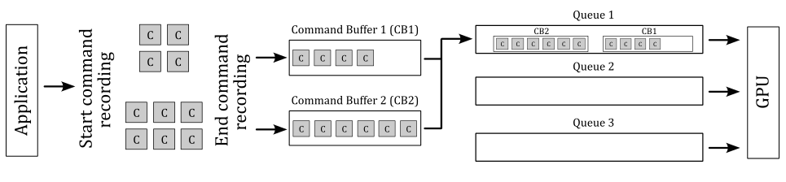
>
><br>
>
>In the image above, the application records two command buffers containing several commands. These commands are then submitted to one or more queues depending upon the workload nature. The device accesses its queues to process command buffer workloads and either displays them on the output display or returns them to the application for further processing.

<br>

**API threading model**

OpenGL uses a single-threaded rendering model, which greatly restricts applications from using multiple CPU cores to parallelize rendering operations.

Vulkan uses a multi-threaded rendering model, which allows applications to parallelize rendering operations across multiple CPU cores.

This difference allow Vulkan applications to benefit from systems with a multi-core CPU.

<br>

**API error checking**

OpenGL use extensive run-time error checking which increases driver overheads in all applications.

Vulkan does not require the driver to implement runtime error checking. This implies that incorrect use of the API may result in rendering corruption or application crashes. Instead of the constant error checking of OpenGL, Vulkan offers a framework that permits layer drivers to be placed between the application and the native Vulkan driver. These layers can introduce error checking and other debugging functionality and have a significant advantage since they can be removed when not needed.

This difference results in a notable decrease in the CPU overhead of graphics drivers, at the expense of making many errors undetectable unless a layer driver is used.

<br>

**Memory allocation**

OpenGL uses a client-server memory model. This means the application (the client) cannot directly allocate or manage the memory backing GPU (the server) resources. The driver manages all of these resources individually using internal memory allocators, and synchronizes resources between client and server.

Vulkan is designed to give the application more direct control over memory resources, how they are allocated, and how they are updated.

This difference results in a notable decrease in the CPU overhead of graphics drivers, and gives the application more control over memory management. The application can further reduce CPU load: for example, by grouping objects with the same lifetime into a single allocation and tracking them collectively instead of tracking them individually.

<br>

**Memory usage**

OpenGL uses a typed object model, which tightly couples a logical resource with the physical memory which backs it. While this model is easy to use, it prevents reusing the same physical memory for different resources (whenever possible).

Vulkan separates the concept of a resource from the physical memory which backs it. This makes it possible to reuse the same physical memory for multiple different resources at different points in the rendering pipeline.

The ability to alias memory resources can be used to reduce the total memory footprint of the application by recycling the same physical memory for multiple uses at different points in a frame creation.

<br>

### 1.2.2 - Disadvantages

One of the major drawbacks of Vulkan is that it places a significant amount of responsibility on the application, including memory allocation and resource synchronization. While this provides a greater level of control and customization, it also increases the risk of suboptimal application behavior, resulting in decreased performance.

<br>

### 1.2.3 - Conclusions

The primary benefits of using Vulkan are associated with a lower CPU overhead, which is attributed to the minimal level of abstraction provided by the Vulkan drivers. It is important to note that Vulkan does not necessarily guarantee a performance enhancement. The GPU hardware remains the same, and the rendering capabilities made available by Vulkan are similar to those offered by OpenGL. If your application's performance is restricted by GPU rendering speed, it is improbable that Vulkan will result in improved performance.

However, If you're looking for an API that better exposes how GPUs really work, with an high degree of control over resource management, and available for cross-platform (both Desktop and mobile), multi-threaded applications, then you should definitely consider using Vulkan.

<br>

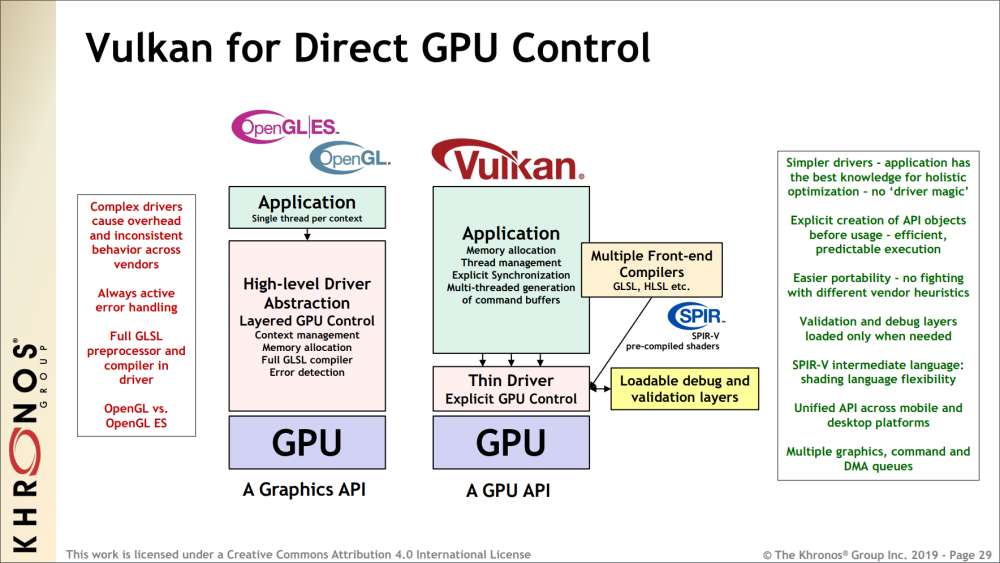

<br>

Applications which use Vulkan well can take advantage of multi-threading, and benefit from reduced CPU load and memory footprint, as well as smoother rendering with fewer hitches caused by thicker driver abstractions.

In the image above you can also see that OpenGL includes a complete shader compiler in the driver, which increases the level of abstraction and complexity of the driver, leading to additional CPU overhead. <br>
The predicable execution specified in the image refers to the fact that, by using Vulkan, we can set up the rendering work ahead of time, which allows for better holistic (overall) optimization by the driver. <br>
Vulkan is an explicit API with a thin driver abstraction, making it easier to develop and port to different platforms. This also means that vendor implementations don't have to rely on advanced heuristics to guess what the application is trying to do. <br> 
SPIR-V is a binary intermediate representation for shader programs. In Vulkan, you can still write the shader code for programmable stages in a high-level shading language such as GLSL or HLSL, but a SPIR-V binary representation is needed when setting the pipeline state. Since it is pre-compiled, the driver can easily convert SPIR-V binary blob to shader machine (GPU) code.

<br>

## 1.3 - Important Vulkan concepts and components

Vulkan defines a layered API in a layered architecture. <br>
The components of the layered architecture are:

- Vulkan Applications
  
- The Vulkan Loader
  
- Vulkan Layers
  
- Drivers
  
- VkConfig

<br>

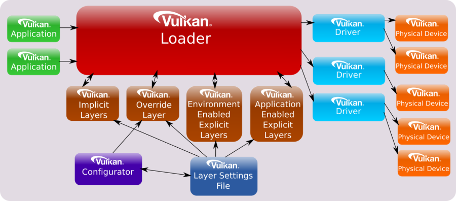

<br>

These component interact with the Vulkan API by using, implementing, extentind, or interpcepting its functions. The Vulkan API is designed in a layered manner, which means that applications can use a subset of its functions that all Vulkan implementation have to support as part of the Vulkan core specification. Then, applications can also use additional layers above the core one for debugging, validation, and other purposes.

<br>

### 1.3.1 - Vulkan Applications

To use the functionality specified in the Vulkan specification, applications use the function prototypes included in the header files provided by the Khronos Group. These files can be found in the Vulkan-Headers repository on GitHub, or in the Vulkan SDK. Vulkan functions are somewhat defined in the Vulkan Loader module (more on this shortly), which is installed via driver update packages or the Vulkan SDK. Alternatively, the Vulkan loader can be compiled from source code. Anyway, linking the Vulkan loader module is required for Vulkan applications.

Generally, a Vulkan application uses the Vulkan API to perform the following sequence of tasks:

- Initialize the hardware and software (to detect the available devices and let the loader start its job).
- Create a presentation surface using a Window System Integration (WSI) extension.
- Set the pipeline state.
- Create resources to bind to the stages of the pipeline using descriptors.
- Record commands in command buffers in a render loop.
- Submit the command buffers to GPU queues for processing.

<br>

We will cover each of the above issues in detail, both in this tutorial and in upcoming ones.

<br>

**Direct Exports**

The Vulkan loader module exports all core entry-points and some additional platform-specific functions (more on this shortly). Therefore, most of the time we can simply link the loader and call the Vulkan functions using the prototypes declared in the related header files.

On Linux, using GCC, we can link the Vulkan loader with the following command, which links "libvulkan.so". This file is a symbolic link to "libvulkan.so.1", which in turn is a symbolic link to the latest installed Vulkan loader (e.g., "libvulkan.so.1.0.42.0", which is the actual shared library).

```
g++ main.cpp -o main.out -lvulkan
```

<br>

On Windows, we can implicitly link the Vulkan loader with the help of the related import library "vulkan-1.lib". This file includes a table where each element stores the name of a function and the module where to find the related definition. An import library simply tells the linker not to panic if it cannot find a definition, because the Windows loader will be able to dynamically resolve\fix it at run-time by loading the related shared module ("vulkan-1.dll", which is just a copy to the latest Vulkan loader installed (e.g. "vulkan-1-999-0-0-0.dll").

<br>

**Dynamic linking**

Alternatively, we can load the Vulkan Loader module at runtime with **dlopen** (Linux) or **LoadLibrary** (Windows). Then, we only need to query the addresses of **vkGetInstanceProcAddr** and **vkGetDeviceProcAddr** with **dlsym** (Linux) or **GetProcAddress** (Windows). At that point, with **vkGetInstanceProcAddr** and **vkGetDeviceProcAddr** we can query the addresses of other Vulkan functions.

In the next section we will see what's the difference between using direct exports and dynamic linking, as well as the difference between **vkGetInstanceProcAddr** and **vkGetDeviceProcAddr**.

Static linking was possible in the past, but it is no longer an option now.

<br>

### 1.3.2 - Vulkan Loader

It was previously stated that the loader somewhat define Vulkan functions, but what exactly does it means? Well, you can think of the definitions in the loader as trampolines that redirect application calls to the appropriate implementations in the graphics drivers, passing through an arbitrary number of layers. <br>
The loader can insert optional layers between the application and the drivers, which can offer specialized functionality. The loader is essential for ensuring that Vulkan functions are dispatched to the correct set of layers and drivers. By inserting layers into a call-chain, the loader can enable them to process Vulkan functions before the driver is invoked.

To understand how the loader directs API calls, it is necessary to have a basic knowledge of certain key concepts. The most important one is that many objects and functions in Vulkan can be separated into two groups:

- Instance-specific
  
- Device-specific

<br>

"Instance-specific" refers to functions or objects that can be used to provide system-level information and functionality (i.e., something that can be applied to all available GPUs, and their drivers, installed on a user's system). <br>
"Device-specific" means something which applies to a particular physical device on the user's system.

Examples of instance objects are **VkInstance** and **VkPhysicalDevice**. We will use these objects as interfaces to call instance functions. Instance functions are functions that take either an instance object as their first parameter, or nothing at all.

Examples of device objects are **VkDevice** **VkQueue**, and **VkCommandBuffer**. We will use these objects as interfaces to call device functions. Device functions are functions that take a device objec as their first parameter.

**VkInstance**, **VkPhysicalDevice**, **VkDevice** **VkQueue**, and **VkCommandBuffer** are called dispatchable objects, which means they contain a pointer to a dispatch table. A dispatch table is an array of function pointers (including core and possibly extension functions) used to step to the next entity in a call chain. An entity could be the loader, a layer or a driver (more on this shortly).

<br>

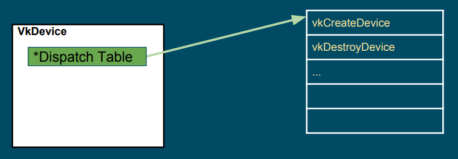

<br>

The loader maintains two types of dispatch tables: instance specific, created during the call to **vkCreateInstance** (which creates a **VkInstance**), and device specific, created during the call to **vkCreateDevice** (which creates a **VkDevice**). Thus, the loader builds an instance call chain for each **VkInstance** that is created, and a device call chain for each **VkDevice** that is created (that is, the actual instance function called depends on the **VkInstance** object passed as its first parameter, which points to its own dispatch table; the same applies to device functions). The pointer to the dispatch table stored in **VkPhysicalDevice**, **VkQueue**, and **VkCommandBuffer** is a duplicate of the pointer from the existing parent object of the same level (**VkInstance** versus **VkDevice**). For example, the dispatch table pointer in a **VkPhysicalDevice** object is a duplicate of the pointer in the corresponding **VkInstance** object, while the dispatch table pointer in a **VkQueue** or **VkCommandBuffer** object is a duplicate of the pointer in the corresponding **VkDevice** object. <br>
At the time of calling **vkCreateInstance** or **vkCreateDevice**, the application and the system can each specify optional layers to be included. The loader will initialize the specified layers to create a call chain for each Vulkan function, and each entry of the dispatch table in the first entity of the call chain will point to the corresponding entry in the next entity of the same chain. Further information will be provided in the next section.

After an application makes a Vulkan function call, this is usually directed to a trampoline function in the loader. Trampoline functions are small, simple functions that jump to the appropriate dispatch table entry, which is located in the loader, layer, or device driver, depending on the pointer to the dispatch table of the dispatchable object passed as the first parameter. Then, the first dispatch table entry can point to the corresponding entry in the next entity in the call chain (layer or device driver), which calls the corresponding entry in the next entity, and so on. <br>
Additionally, for functions in the instance call chain, the loader has an additional function called a terminator. This function is called after all enabled layers to marshal the appropriate information to all available drivers.

<br>

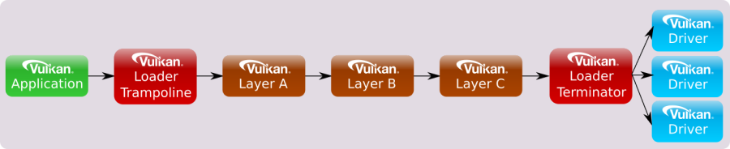

<br>

Device call chains are generally simpler because they deal with only a single device. As a result, the specific driver that exposes this device can always be the terminator of the chain.

<br>


<br>

The functions exported by the loader are trampolines to function pointers stored in the dispatch tables mantained by the loader itself. <br>
However, it is possible to set up a custom dispatch table by querying instance functions using **vkGetInstanceProcAddr**, and device functions using **vkGetDeviceProcAddr**. The main difference between the two is that **vkGetInstanceProcAddr** may return the address of the same trampoline function exported by the loader, whereas **vkGetDeviceProcAddr** returns the actual function pointer stored in the dispatch table of the loader, whenever possible. This can optimize the call chain even further by removing the loader altogether in most scenarios:

<br>


<br>

In this tutorial series, we will use the function prototypes declared in the header files provided by the Khronos Group to directly call the functions exported by the loader. However, we will also use **vkGetInstanceProcAddr** and **vkGetDeviceProcAddr** to query the addresses of instance and device functions exposed but not exported by the loader.

<br>

>At this point, it can be explained why a physical device (**vkPhysicalDevice**) is an instance object (instead of a device object). A physical device can be considered a stand-alone object representing a generic GPU installed on the user's system. On the other hand, a device object is considered as a logical accessor to a particular physical device through a particular ICD (driver). Indeed, **VkDevice** objects are also called logical device objects. Multiple logical devices can be created from the same physical device, each with its own state and resources independent of other logical devices.
>
><br>
>
>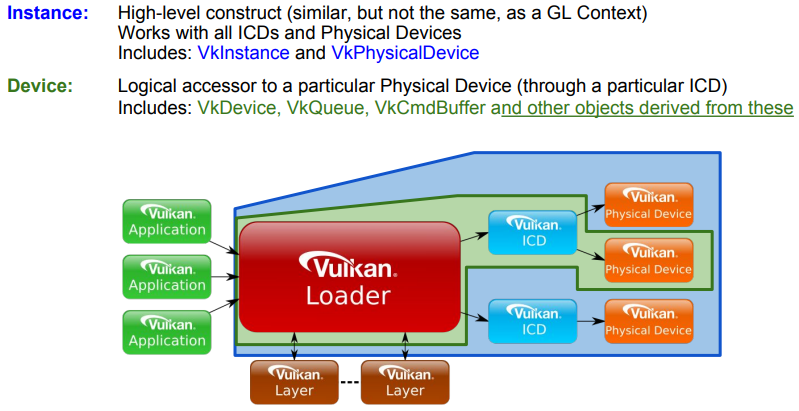

<br>

**Extensions**

Extensions in Vulkan refer to additional functionalities that can be provided by a layer, the loader, or a driver to extend the core Vulkan functionality. They can introduce new features that may be experimental, specific to a particular platform or device, or come with a performance cost. Consequently, extensions are not enabled by default and must be explicitly enabled by an application before they can be used. This approach ensures that applications only pay for the functionalities they need, and that the use of extensions is intentional, which helps improve performance and portability.

Extensions can introduce new functions, enums, structs, or feature bits to enhance the core functionality of Vulkan. While the related definitions are included in the Vulkan Headers by default, using them without enabling the corresponding extensions can result in undefined behavior. Therefore, to ensure correct and predictable behavior, applications must explicitly enable the required extensions before using any extended Vulkan functionality.

Vulkan extensions are categorized based on the type of functions they offer. This categorization results in extensions being divided into instance or device extensions where the majority of functions in the extension correspond to the respective type. For instance, an "instance extension" mainly comprises "instance functions," which accept instance objects as their first parameter to introduce new general functionality accessible to the whole system. On the other hand, a "device extension" mainly includes "device functions," which accept device objects as their first parameter to provide new functionality to a particular device.

Usually, Vulkan extensions include an author prefix or suffix modifier to every structure, enumeration entry, command entry-point, or define that is associated with it. For example, the "KHR" prefix indicates Khronos-authored extensions, and it can also be found on structures, enumeration entries, and commands associated with those extensions. The "EXT" suffix is used for multi-company authored extensions, while "AMD," "ARM," and "NV" are used for extensions authored by AMD, ARM, and Nvidia, respectively.

Windows System Integration (WSI) extensions are well known Vulkan extensions targeting a particular Windowing system and designed to interface between the Windowing system and Vulkan. Some WSI extensions are valid for all windowing system, but others are particular to a given execution environment. The loader only enables and directly exports those WSI extensions that are appropriate to the current environment (Windows, Linux, etc.). <br>
It's worth noting that although the loader can export entry points directly for these extensions, an application can use them only under certain conditions:

- At least one physical device must support the extension(s)
- The application must use such a physical device when creating a logical device
- The application must request the extension(s) be enabled while creating the instance or logical device (this depends on whether or not the given extension works with an instance or a device)
  
Only then the WSI extension can be properly used in a Vulkan program.

<br>

>Showing the results of rendering operations on the screen is a fundamental operation. So, why is it provided as an extension instead of a core functionality? Well, there are at least two reasons:
> - Vulkan is a platform-agnostic API, and each platform may use different window systems that interact with the operating system in different ways. Therefore, Vulkan cannot provide a generic interface that works for all window systems on all platforms.
>
> - A Vulkan application is not obligated to show the result of graphics operations on the screen. Instead, the specification states that we must store the result on a render target (usually a texture). Then, we can save the render target to a disk file or display it to the user on the screen. Additionally, rendering to a render target is a platform-specific operation that depends on the window system.

<br>

>As Vulkan can be easily expanded, there may be extensions that the loader is not aware of, but that it still needs to create. In such cases, if the extension is a device extension, the loader will pass the unknown entry-point down the device call chain until it reaches the appropriate driver entry-points (more on this in the next section). The same will happen if the extension is an instance extension that takes a physical device as its first parameter. <br>
However, for all other instance extensions the loader will fail to dispatch the call. The reason is that the loader need information on the physical devices that support the extension (it can't simply pass the call to all the device drivers available in the system in the hope that the extension is supported by all of them).

<br>

>At times, enabling an extension may also require enabling an optional device feature. Vulkan features define functionality that may not be supported on all physical devices. If a device advertises support for a feature, it still needs to be enabled (similar to an extension). However, once enabled, the feature becomes core functionality instead of an extension. <br>
the difference between features and extensions is that features refer to functionality that may be supported by a physical device, whereas extensions refer to functionality that is either implemented by a Vulkan implementation or can be injected into the call chains (instance or device) by loading the appropriate Vulkan layers.

<br>

### 1.3.3 - Vulkan Layers

Applications desiring Vulkan functionality beyond what Vulkan drivers on their system already expose, may use various layers to augment the API. Each layer can choose to hook (intercept) Vulkan functions to be inspected, augmented or simply ignored. However, any function a layer does not hook is skipped for that layer, and the control flow will continue on to the next layer, or driver. As a result, a layer has the option to intercept all Vulkan functions, or only a specific subset that it finds relevant. <br>
Vulkan layers allow applications to use additional functionalities, mainly for development purposes. For example:

- Validating API usage
  
- Tracing API calls

- Debugging aids

- Profiling
  
- Overlay

<br>

Layers are unable to introduce new Vulkan core API entry-points that are not already available in the vulkan.h header file. However, they can provide implementations of extensions that introduce additional entry-points that are beyond what is available without those layers. These extra extension entry-points can be accessed through specific extension header files.

Layers are packaged as shared libraries the loader can find and dynamically load using some manifest files (data files in JSON format) installed by the Vulkan SDK. Since layers are optional and loaded dynamically, they can be enabled or disabled based on requirements. During application development and debugging, enabling certain layers can help ensure the proper usage of the Vulkan API. However, when releasing the application, those layers become redundant and can be disabled, resulting in a faster performance of the application.

Layers can be classified into two categories:

- Implicit Layers
  
- Explicit Layers

<br>

Explicit layers need to be explicitly enabled by an application.

Implicit layers are enabled by default, unless an additional manual enable step is required. These layers have an additional requirement compared to explicit layers, as they need to be disabled by an environmental variable. This is because implicit layers are not visible to the application and may potentially create issues. That way, users have the option to disable an implicit layer if it causes problems.

On any system, the loader searches specific areas for information about the layers that it can load, both implicitly and explicitly. That is why it is crucial to install the Vulkan SDK as it configures the system by generating the necessary keys (in the Windows registry) and files that contain information about where to locate the layers, or more precisely, the shared libraries that implement them.

<br>

>Please note that layers are typically not enabled when releasing an application. Hence, users do not require installing the Vulkan SDK. They only need to have the Vulkan Loader and drivers installed through the vendor driver update packages.

<br>

A layer has the capability to intercept instance functions, device functions, or both. To intercept instance functions, a layer must participate in the instance call chain. To intercept device functions, a layer must participate in the device call chain. However, as mentioned earlier, a layer is not required to intercept all instance or device functions. It can instead choose to intercept only a subset of those functions.

When a layer intercepts a particular Vulkan function, it generally calls down the instance or device call chain as required. The loader, along with all layer libraries that participate in a call chain, work together to ensure the correct sequencing of calls from one entity to the next. This coordinated effort for call chain sequencing is known as distributed dispatch. Under distributed dispatch, each layer is responsible for correctly calling the subsequent entity in the call chain. Consequently, a dispatch mechanism is necessary for all Vulkan functions that a layer intercepts.

For example, if only specific instance functions were intercepted by the enabled layers, then the instance call chain would appear as follows:

<br>

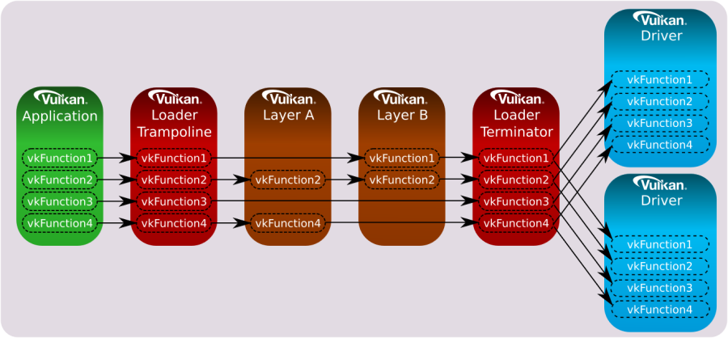

<br>

Likewise, if only specific device functions were intercepted by the enabled layers, then the device call chain would appear as follows:


<br>

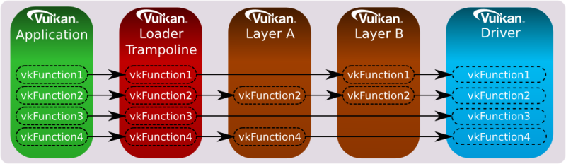

<br>

The loader is responsible for dispatching all core and instance extension functions to the first entity in the call chain.

<br>

>If you're curious about the dispatch mechanism that allows a layer to know the next entity in the call chain, along with the address of an intercepted Vulkan function in the next entity. Well, long story short, the loader is aware of all the enabled layers beacause this information is required before calling **vkCreateInstance**. Additionally, each layer must intercept **vkCreateInstance**, and provide implementations for **vkGetInstanceProcAddr** and **vkGetDeviceProcAddr**, which return the addresses of intercepted functions in (the shared module\library of) the layer. These two functions must also be exported symbols in (the shader module\library of) the layer, allowing the loader to get their addresses to create a linked list where each element stores the addresses of both these functions for each layer in the call chain.<br>
When an application calls **vkCreateInstance**, the corresponding function in the loader is invoked. During initialization, the loader creates the linked list and stores it in a field of a structure passed as an input parameter to **vkCreateInstance**. Then, the loader uses the first element of the linked list to retrieve the address of **vkGetInstanceProcAddr** in the first entity of the call chain, and uses this address to build its own dispatch table, where each element is the address of a function intercepted in the first entity. At that point, the loader pops the first element off the front of the linked list and calls **vkCreateInstance** into the first entity, passing the same arguments it received in input by the application. The implementation of **vkCreateInstance** in the first entity performs the same task as the loader: it uses the first element in the linked list to retrieve the address of **vkGetInstanceProcAddr** in the second entity of the call chain, and uses this address to build its own dispatch table, where each element is the address of a function intercepted in the second entity. At that point the first entity pops off the front of the linked list, and calls the **vkCreateInstance** of the third entity. And so on. <br>
Now, what happens if a layer doesn't intercept a function? In other words, what address should return **vkGetInstanceProcAddr** for non-intercepted functions? Well, in that case a layer can use the address of **vkGetInstanceProcAddr** in the next entity to forward the call down the call chain. Observe that **vkCreateInstance** is the first function invoked in a layer, so that the address of **vkGetInstanceProcAddr** in the next entity is always available for a layer when other Vulkan functions are invoked in the call chain. <br>
Implementing **vkGetDeviceProcAddr** and **vkCreateDevice** in a layer follows almost the same pattern as the instance versions, with the layers on a different call chain, although - the device call chain instead of the instance call chain). <br>
Additional information can be found in [2].

<br>

The loader supports filter environment variables that can forcibly enable and disable the layers that are already detected by the loader based on default search paths and other environment variables. The filter variables are compared against the layer name provided in the layer's manifest file.

Meta-layers consist of a collection of layers that are arranged in a specific order to ensure proper interaction between them. This approach was initially used to group Vulkan Validation layers together in a specific order to prevent conflicts. The reason for this was that validation layers was divided into multiple component layers. However, the new validation layer pull everything into a single layer, thereby eliminating the need for meta-layers.

<br>

### 1.3.4 - Vulkan Configurator

**VkConfig** is a tool included in the Vulkan SDK that uses meta-layers to group layers together based on user's preferences. It can be used to find layers, enable or disable them, change layer settings, and other useful features.

VkConfig creates three configuration files, two of which are intended to operate in conjunction with the Vulkan loader and layers. These files are:

- The Vulkan Override Layer
- The Vulkan Layer Settings File
- VkConfig Configuration Settings

<br>

The "Override Layer" is a special implicit meta-layer created by VkConfig, and available by default when the tool is running. Once VkConfig exits, the override layer is removed, and the system should return to standard Vulkan behavior. Whenever the override layer is present, the loader will pull it into the layer call stack along with all (implicit and explicit) layers to load. This layer forces the loading of the desired layers that were enabled inside of VkConfig, and disables those layers that were intentionally disabled (including implicit layers).

The Vulkan Layer Settings file can be used to tell each enabled layer which settings to use. Per-layer settings are loaded by each layer library and stored in the `vk_layer_settings.txt` file. This file is either located next to the Vulkan application executable or set globally and applied to all Vulkan applications thanks to Vulkan Configurator.

The VkConfig Configuration Settings file stores the application settings for VkConfig.

The Vulkan Configurator does not make any system-wide changes to a system, but it does make user-specific changes.

<br>

### 1.3.5 - Vulkan Drivers

A module that implements the Vulkan specification, either through supporting a physical hardware device directly, converting Vulkan commands into native graphics commands (like **MoltenVK** for macOS and iOS), or simulating Vulkan through software, is considered "a driver". The most common type of driver is the Installable Client Driver (or ICD). These are drivers that are provided by hardware vendors to interact with the hardware they provide.

The loader is responsible for discovering available Vulkan drivers on the system. Given a list of available drivers, the loader can enumerate all the available physical devices and provide this information to applications.

Vulkan allows multiple ICDs, each supporting one or more devices. Each of these devices is represented by a **VkPhysicalDevice** object. The loader is responsible for discovering available Vulkan ICDs on the system.

<br>

<br>

# 2 - GUI applications

In order to develop graphics applications, it is necessary to create a window for rendering. However, before proceeding, it is required to have a basic understanding of how applications with a graphical user interface (GUI) operate on both Windows and Linux.

<br>

## 2.1 - Windows applications

The content of this section has been heavily inspired by "Programming Microsoft Visual C++, Fifth Edition" by David J. Kruglinski, George Shepherd and Scott Wingo.

Windows applications use an event-driven programming model (illustrated in the following image) in which programs respond to events by processing messages sent by the operating system. In this context, an event is a keystroke, a mouse click, or a command for a window to repaint itself. The entry point of a Windows application is a function called WinMain, but most of the action takes place in a function known as the window procedure. The window procedure processes messages sent by the OS to the application a window belongs to. WinMain creates that window and then enters a message loop, retrieving messages and dispatching them to the window procedure. Messages wait in a message queue until they are retrieved. The main occupation of a Windows application is to respond to the messages it receives, and in between messages, it does little except wait for the next message to arrive. You exit the message loop when a WM_QUIT message is retrieved from the message queue, signaling that the application is about to end. This message is sent by the OS when the user closes the window. When the message loop ends, WinMain returns, and the application terminates.

<br>


<br>

Observe that window messages can also be directly sent to a window procedure, bypassing the message queue. If the sending thread is sending a message to a window created by the same thread, the specified window’s window procedure is called. However, if a thread is sending a message to a window created by another thread, things become more complicated. Fortunately, we don’t need to know the low-level details right now.

<br>

### 2.1.1 - Window Procedure

As stated earlier, a window procedure is a function that receives and processes messages sent by the OS to the application a window belongs to. A window class defines important characteristics of a window such as its window procedure address, its default background color, and its icon. Every window created with a particular class will use that same window procedure to respond to messages. <br>
When the application dispatches a message to a window procedure, it also passes additional information on the message as arguments in its input parameters. That way, the window procedure can perform an appropriate action for a message by consuming the related message data. If a window procedure does not process a message, it must send the message back to the system for default processing by calling the DefWindowProc function, which performs a default action and returns a message result. The window procedure must then return this value as its own message result. <br>
Since a window procedure is shared by all windows belonging to the same class, it can process messages for different windows. To identify the specific window a message is addressed to, a window procedure can examine the window handle passed as input parameter. The code provided in the window procedure to process a particular message is known as message handler.

<br>

### 2.1.2 - Messages

Windows defines many different message types. Usually, messages have names that begin with the letters “**WM_**”, as in **WM_CREATE** and **WM_PAINT**. The following table shows ten of the most common messages. For example, a window receives a **WM_PAINT** message when its interior needs repainting. You can think of a Windows program as a collection of message handlers.

<br>

| Message        | Sent when                                                                      |
| -------------- | ------------------------------------------------------------------------------ |
| WM_CHAR        | A character is input from the keyboard.                                        |
| WM_COMMAND     | The user selects a menu item, or a control sends a notification to its parent. |
| WM_CREATE      | A window is created.                                                           |
| WM_DESTROY     | A window is destroyed.                                                         |
| WM_LBUTTONDOWN | The left mouse button is pressed.                                              |
| WM_LBUTTONUP   | The left mouse button is released.                                             |
| WM_MOUSEMOVE   | The mouse pointer is moved.                                                    |
| WM_PAINT       | A window needs repainting.                                                     |
| WM_QUIT        | The application is about to terminate.                                         |
| WM_SIZE        | A window is resized.                                                           |

<br>

When the message loop dispatches a message, the window procedure is called, and you can retrieve the information on the message from its four input parameters:

<br>

* The handle of the window to which the message is directed,

* A message ID, and

* Two 32-bit parameters known as **wParam** and **lParam**.

<br>

The window handle is a 32-bit value that uniquely identifies a window. Internally, the value references a data structure in which the OS stores relevant information about the window such as its size, style, and location on the screen.<br>
The message ID is a numeric value that identifies the message type: **WM_CREATE**, **WM_PAINT**, and so on.<br>
**wParam** and **lParam** contain information specific to the message type. For example, when a **WM_LBUTTONDOWN** message arrives, **wParam** holds a series of bit flags identifying the state of the <kbd>Ctrl</kbd> and <kbd>Shift</kbd> keys and of the mouse buttons. **lParam** holds two 16-bit values identifying the location of the mouse pointer (in screen coordinates) when the click occurred. At that point, you have all you need to know to process the **WM_LBUTTONDOWN** message in the window procedure. Conventionally, **WinMain** should return the value stored in the **wParam** of the **WM_QUIT** message.

The only criticism to the above explanation is that a graphics application performs the bulk of its processing exactly in between messages. Although, the sample we will examine in this tutorial is an exception as its only purpose is to show a window on the screen (i.e., no relevant graphics operations are involved).

<br>

### 2.1.3 - How to create a window

The following listing demonstrates how to create and show a window on the screen.

<br>

```cpp
#include <windows.h>

int WINAPI WinMain(HINSTANCE hInstance, HINSTANCE, char*, int nCmdShow)
{
    ApplicationClass* pApp();

    // Size of the client area
    uint32_t width = 1280;
    uint32_t height = 1280;

    // Initialize the window class.
    WNDCLASSEX windowClass = { 0 };
    windowClass.cbSize = sizeof(WNDCLASSEX);
    windowClass.style = CS_HREDRAW | CS_VREDRAW;
    windowClass.lpfnWndProc = WindowProc;
    windowClass.hInstance = (HINSTANCE)hInstance;
    windowClass.hCursor = LoadCursor(NULL, IDC_ARROW);
    windowClass.lpszClassName = "ClassName";
    RegisterClassEx(&windowClass);

    RECT windowRect = { 0, 0, width, height };
    AdjustWindowRect(&windowRect, WS_OVERLAPPEDWINDOW, FALSE);

    // Create the window and store a handle to it.
    winParams.hWindow = CreateWindow(
        windowClass.lpszClassName,
        "Window name",
        WS_OVERLAPPEDWINDOW,
        CW_USEDEFAULT,
        CW_USEDEFAULT,
        windowRect.right - windowRect.left,
        windowRect.bottom - windowRect.top,
        nullptr,        // We have no parent window.
        nullptr,        // We aren't using menus.
        (HINSTANCE)hInstance,
        pApp);

    // Show the window
    ShowWindow(winParams.hWindow, nCmdShow);

    // Enter the message loop
    return ApplicationClass::MessageLoop();
}
```
<br>

To create a window, we first need an instance of a window class (structure **WNDCLASSEX**) to specify some basic information about all the windows created using that instance. Below is a list of the most important fields of **WNDCLASSEX**. 

**style** specifies some additional information about the window. **CS_HREDRAW&nbsp;&#124;&nbsp;CS_VREDRAW** indicates to redraw the entire window if a size adjustment changes the width and\or height of the client area.

**hCursor** specifies the cursor showed when this is over the window’s client area.

**hInstance** specifies the application a window belongs to. This information is passed as an argument to the first parameter of **WinMain**.

**lpszClassName** specifies the name we want to give to the window class.

**lpfnWndProc** specifies the address of the window procedure.

<br>

**RegisterClassEx** registers the window class so that we can use an instance of this class to create one or more windows with a specific style, window procedure, etc.

**CreateWindow**, as the name suggests, creates a window and returns its handle. It takes the name of a window class and some additional information. In particular, it needs the size of the entire window, so we must calculate it because in graphics application we tipically set the size of the window's client area where we want to draw rather than the size of the whole window area. The client area of a window is where we are allowed to draw.

<br>

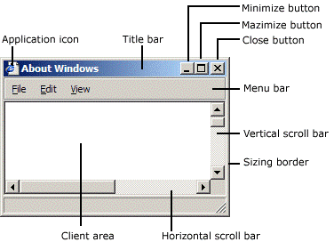

<br>

**AdjustWindowRect** returns such information if you pass the size of the client area and the style of the window you’re going to create with **CreateWindow**. **WS_OVERLAPPEDWINDOW** specifies a window with a title bar and no menu.

With the last parameter of **CreateWindow** we can specify a pointer the OS will return to us in response to a **WM_CREATE** message (sent by the OS to an application as soon as a window is created; that is, when **CreateWindow** returns). We will use this last parameter to save an instance of the application class with the purpose to access it later. The following listing shows an example of a window procedure.

<br>

```cpp
// Main message handler for the application.
LRESULT CALLBACK WindowProc(HWND hWnd, UINT message, WPARAM wParam, LPARAM lParam)
{
    ApplicationClass* pApp = reinterpret_cast<ApplicationClass*>(GetWindowLongPtr(hWnd, GWLP_USERDATA));

    switch (message)
    {
        case WM_CREATE:
        {
            // Save the ApplicationClass pointer passed in to CreateWindow.
            LPCREATESTRUCT pCreateStruct = reinterpret_cast<LPCREATESTRUCT>(lParam);
            SetWindowLongPtr(hWnd, GWLP_USERDATA, reinterpret_cast<LONG_PTR>(pCreateStruct->lpCreateParams));
        }
        return 0;

        case WM_PAINT:
            if (pApp && pApp->IsInitialized())
            {
                pApp->OnUpdate();
                pApp->OnRender();
            }
            return 0;

        case WM_KEYDOWN:
            switch (wParam) 
            {
                case VK_ESCAPE:
                    PostQuitMessage(0);
                    break;
            }
            if (pApp)
            {
                pApp->OnKeyDown(static_cast<UINT8>(wParam));
            }
            return 0;

        case WM_KEYUP:
            if (pApp)
            {
                pApp->OnKeyUp(static_cast<UINT8>(wParam));
            }
            return 0;

        case WM_DESTROY:
            PostQuitMessage(0);
            return 0;
    }

    // Handle any messages the switch statement didn't.
    return DefWindowProc(hWnd, message, wParam, lParam);
}
```
<br>

Before returning, **CreateWindow** sends a **WM_CREATE** message to the window procedure. In the **WM_CREATE** message handler, **lParam** is a pointer to **CREATESTRUCT**. The **lpCreateParams** field of this structure contains the last parameter passed to **CreateWindow**. This means we can call **SetWindowLongPtr** to save the instance of the application class in the user data associated with the window (an extra memory space reserved to the user), and retrieve it with **GetWindowLongPtr** later.

A **WM_DESTROY** is sent to the window procedure of the window being destroyed after the user closes it. The **WM_DESTROY** message handler calls **PostQuitMessage**, which queues a **WM_QUIT** message. That way, we can exit the message loop (more on this shortly).

Generally, **WM_PAINT** messages are both sent to the window procedure, and posted to the message queue throughout the application’s lifetime. That way, we can use the **WM_PAINT** message handler for updating and rendering purposes.

<br>

At the end of **WinMain** we call **MessageLoop**, and the application enters a message loop where **PeekMessage** retrieves a message from the message queue, and save the related information in the **MSG** structure passed in the first parameter before returning **TRUE** (otherwise it returns **FALSE** to indicate no message were available). **DispatchMessage** dispatches a message to the window procedure. **TranslateMessage** translates virtual-key messages (**WM_KEYDOWN**, **WM_KEYUP**) into character messages (**WM_CHAR**) containing ASCII characters. That way you can better distinguish the various keys of the keyboard.

<br> 

```cpp
int ApplicationClass::MessageLoop()
{
    // Message loop

    MSG msg;
    bool quitMessageReceived = false;
    while (!quitMessageReceived) 
    {
        if (PeekMessage(&msg, NULL, 0, 0, PM_REMOVE)) 
        {
            TranslateMessage(&msg);
            DispatchMessage(&msg);
            if (msg.message == WM_QUIT) {
                quitMessageReceived = true;
                break;
            }
        }
    }

    // Return this part of the WM_QUIT message to Windows.
    return static_cast<char>(msg.wParam);
}
```
<br>

<br>

## 2.2 - Linux applications

The content of this section has been heavily inspired by "Xlib Programming Manual, for version 11" by Adrian Nye, as well as additional information gathered from Wikipedia and other online resources.

On linux we have different kernel versions, display servers, windows managers, communication protocols, and protocol client libraries. In this section, I will just explain the necessary requirements for creating a window using the Xlib library, which is easier and cleaner to use for our purposes (while I am aware that Xlib has some limitations and drawbacks, they are not significant within the scope of this tutorial series, which is solely intended to provide guidance on programming with the Vulkan API).

<br>

### 2.2.1 - X Window System

The X Window System (X11, or simply X) is a windowing system based on a client-server model that provides basic GUI support for creating and moving windows on the display device, and interacting with a mouse and keyboard. It also supports basic drawing of graphical primitives. This model has a main X server providing a display service that clients can interact with, even over a network. This means the server and its clients need to communicate via a network-transparent protocol. For this purpose, the X protocol makes the network transparent, so that the server and its clients may run on the same machine or different ones (including across various architectures and operating systems).

<br>

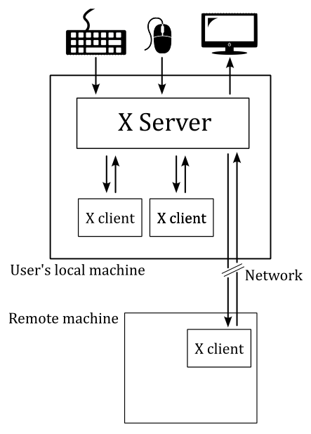

<br>

The X Window System mainly defines a protocol (called X protocol) and some graphics primitives. It contains no specification for application user-interface design, such as button, menu, or window title-bar styles. Rather, the responsibility of defining and supplying these details falls on application software such as window managers, GUI widget toolkits and desktop environments, or application-specific graphical user interfaces. As a result, there is no typical X interface, and several different desktop environments have become popular among users.

The X Window System uses certain terms in a specific manner that sometimes can diverge from their common usage - particularly "display" and "screen". The following is a subset of the common used terms, presented for convenience:

**device**: A graphics device such as a computer graphics card or a computer motherboard's integrated graphics chipset.

**monitor**: A physical device such as a CRT or a flat screen computer display.

**screen**: An area into which graphics may be rendered, either into system memory or within a graphics device.

**display**: A collection of screens, even involving multiple monitors, generally configured to allow the mouse to move the pointer to any position within them.

<br>

### 2.2.2 - Xlib

Xlib (also known as libX11) is an X Window System protocol client library written in C language. It contains functions for interacting with an X server. These functions allow programmers to write applications without knowing the details of the X protocol: Xlib calls are automatically translated to X protocol requests sent to the server.

<br>

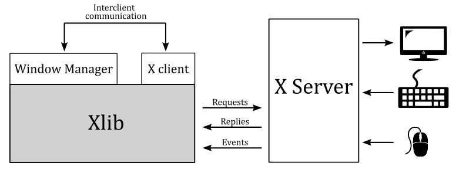

<br>

>In the context of the X Window System, a window manager is a special type of X client that controls the placement and appearance of windows to help provide them a desktop environment. It typically decorate the windows with a title bar and various tools for iconifying and resizing applications. Much of the communication between clients and the window manager (and vice versa) occurs through properties (the rest occurring through events). Many of the properties are known as hints because they may not necessarily be honored by the window manager.

<br>

The Xlib functions that send requests to the server, typically do not immediately do it. Instead, they store the requests in a buffer referred to as the request buffer. The request buffer may contain a variety of requests to the server, not only those that have a visible effect on the screen. The request buffer is guaranteed to be flushed (which means that all pending requests are transmitted to the server) after a call to either the **XSync** or **XFlush** functions, after a function call that returns a value from the server (these functions block until a response is received), or under certain conditions.

For each application, the X server provides a queue where it stores events that are generated for any of the application's windows. These events are dispatched by the X server asynchronously in the appropriate queue. Events include user input (key press, mouse click and movements over a window, or window resizing) as well as interaction with other programs (for example, if an obscured portion of a window is exposed when another overlapping window is moved, closed, or resized, the client must redraw it). <br>
Client applications can inspect and retrieve events from the event queue by calling specific Xlib functions. Some of these functions may block, in which case they also flush the request buffer. Errors are instead received and treated asynchronously: applications can provide an error handler that will be called whenever an error message from the server is received.

The content of a window is not guaranteed to be preserved if the window or part of it is made not visible. If this occurs, the application is sent an **Expose** event when the invisible region of the window is made visible again. The aplication is then supposed to draw the window content again.

The functions in the Xlib library can be grouped in:

- connection operations (**XOpenDisplay**, **XCloseDisplay**, ...)
  
- requests to the server, including requests for operations (**XCreateWindow**, **XSetWindowProperty**, ...) and requests for information (**XGetWindowProperty**, ...)
  
- operations that are local to the client: operations on the event queue (**XNextEvent**, **XPeekEvent**, ...) and other operations on local data (**XLookupKeysym**, **XParseGeometry**, **XSetRegion**, **XCreateImage**, **XSaveContext**, ...)

<br>

In Xlib, the primary data types include the 'Display' structure and several identifiers.

The **Display** structure of the Xlib library not only provides information about the display, but also contains significant details regarding the communication channel between the client and the server. On Unix-like operating systems, this structure includes the file handle of the socket of this channel. Most Xlib functions require a **Display** structure as an argument because they either operate on the channel or are relative to a specific channel. In particular, all Xlib functions that interact with the server need this structure for accessing the channel. Some other functions need this structure, even if they operate locally, as they operate on data relative to a specific channel. Operations of this kind include for example operations on the event queue.

Windows, colormaps, and other similar objects are managed by the server, which means that the implementation details are all stored in the server. The client can only interact with these objects through their identifiers. It is not possible for the client to directly manipulate an object, but it can request the server to perform operations on the object by specifying its identifier.

<br>

> A colormap is a lookup table used to map pixel values from a frame buffer (a memory buffer containing data representing all the pixels in a complete video frame) to pixel colors at the corresponding location on the screen.
>
><br>
>
>
>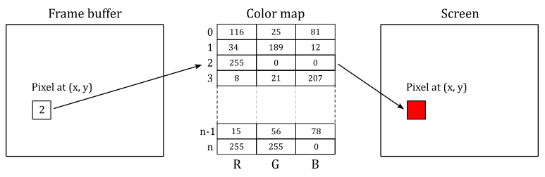
>
><br>

The types Windows, Pixmap, Font, Colormap, etc. are all identifiers, which are 32-bit integers. To create a window, a client sends a request to the server via an Xlib function call. The server responds with a unique identifier for the new window. The client can then use this identifier to perform additional operations on the same window, such as resizing or moving it.

Every window has a predefined set of attributes and a set of properties, all stored in the X server and accessible to the clients via appropriate requests. Attributes are data about the appearance and response of a window, such as its size, position, background color, which event types are received, etc. Properties are pieces of data that are attached to a window.

You can think of properties as global variables associated with a particular window and made available to all clients running under a server. Properties are used by clients to store information that other clients, including the window manager, might need or want to know. <br>
Properties have a string name and a numerical identifier called atom. An atom is an ID that uniquely identifies a particular property where clients can store arbitrary data, usually to inform the window manager about its preferences. For example, the **WM_NAME** property is used to store the name of a window, which is typically displayed by the window manager at the top of the window. Therefore, a client can use the atom corresponding to **WM_NAME** to set a string that the window manager will read to set the window title. <br>
Property name strings are typically all upper case, with words separated by underscores, such as **WM_COLORMAP_WINDOWS**. Atoms are used to refer to properties in function calls. This avoid the need to send arbitrary-length property name strings over the network, that it's easier and reduce network traffic. An application gets the atom for a property by calling **XInternAtom**. You can specify the string name for a property as an argument to **XInternAtom**, and it returns the atom. From this point on, the application can use the atom to refer to that property. <br>
Some atoms, called predefined atoms, are defined when the server initializes. These atoms are available as symbolic constants starting with **XA_** and can be used directly by applications without the need to call the **XInternAtom** function. <br>
**XSetStandardProperties** and **XSetWMProperties** can be used to give the window manager some information about your window's preferences. In particular, these functions can set some essential window properties that are required for a typical application. For example, the window title (**WM_NAME** property), the icon, and the size hints for the window in its normal state. <br>
The **WM_PROTOCOLS** property is used to enable applications to receive notifications of specific events or conditions. It contains a list of atoms (that is, it is a property that can refer to other properties through its atoms), each identifying a protocol that represent a condition the application want to be notified with a **ClientMessage** event. By registering for a protocol, an application can indicate that it is capable of handling certain events, such as window close or iconify requests, from the window manager. The **xclient** field of the event will contain the atoms for both the **WM_PROTOCOLS** property and one of the properties listed below

- **WM_TAKE_FOCUS**: Assignment of keyboard focus.
- **WM_SAVE_YOURSELF**: Save client state warning.
- **WM_DELETE_WINDOW**: Request to delete top−level window.

<br>

The **NET_WM_STATE** property is also a list of atoms, each describing a specific window state although. For example, **NET_WM_STATE_FULLSCREEN** is the property that correspond to an atom included in **NET_WM_STATE** that specify a window in full screen.

Unlike properties, window attributes are defined in regular structures. In particular, the **XWindowAttributes** and **XSetWindowAttributes** structures include information about about how a window is to look and act. The window attributes defined in **XSetWindowAttributes** can be set by calling **XChangeWindowAttributes**. On the other hand, **XWindowAttributes** is a read-only structure, and to change the window attributes associated to its field we need to using specific Xlib functions. For example, the window position can be set by calling **XMoveWindow** that inform the window manager how to move a top-level window. In the same way, the functions to resize a top-level window are **XMoveWindow**, **XMoveResizeWindow**, and **XResizeWindow**, while the function to change the border width of a window is **XSetWindowBorderWidth**. <br>
However, it is not essential that you set any window attributes other than the window background and border. Therefore, if you need more information, refer to the Xlib documentation.

<br>

>If you want to set the position of a window, remember that you need to distinguish between the coordinate system of the parent window, and the coordinate system of the root window (the screen). Fortunately, **XTranslateCoordinates** allows to translate coordinates in one window to the coordinate space of another window (more on this shortly).

<br>

### 2.2.3 - How to create a window

The following listing demonstrates how to create and show a window on the screen using the Xlib library.

<br>

```cpp
#include <X11/Xlib.h>
#include <X11/Xutil.h>
#include <X11/Xatom.h>

Display* pDisplay = nullptr;
Atom wm_delete_window = 0;
bool quit = false;

int main(const int argc, const char* argv[])
{
    ApplicationClass* pApp();

    // Size of the client area
    uint32_t width = 1280;
    uint32_t height = 720;

    // Check if DISPLAY is set as an environment variable, and stores a valid value.
    const char *display_envar = getenv("DISPLAY");
    if (display_envar == nullptr || display_envar[0] == '\0') {
        printf("Environment variable DISPLAY requires a valid value.\nExiting ...\n");
        fflush(stdout);
        exit(1);
    }

    // Open a connection to the X server
    pDisplay = XOpenDisplay(nullptr);

    // Create the window
    unsigned long white = WhitePixel(pDisplay, DefaultScreen(pDisplay));
    Window win = XCreateSimpleWindow(pDisplay, DefaultRootWindow(pDisplay), 0, 0, width, height, 0, white, white);

    // Set the event types the window wants to be notified by the X Server.
    XSelectInput(pDisplay, win, KeyPressMask | KeyReleaseMask);

    // Also request to be notified when the window is deleted.
    Atom wm_protocols = XInternAtom(pDisplay, "WM_PROTOCOLS", true);
    wm_delete_window = XInternAtom(pDisplay, "WM_DELETE_WINDOW", true);

    XSetWMProtocols(pDisplay, win, &wm_delete_window, 1);

    // Set window and icon names
    XSetStandardProperties(pDisplay, win, "Window name", "Icon name", None, nullptr, 0, nullptr);

    // Setup the Size Hints with the minimum window size.
    XSizeHints sizehints;
    sizehints.flags = PMinSize;
    sizehints.min_width = 640;
    sizehints.min_height = 360;

    // Tell the Window Manager our hints about the minimum window size.
    XSetWMSizeHints(pDisplay, win,  &sizehints, XA_WM_NORMAL_HINTS);

    // Request to display the window on the screen, and flush the request buffer.
    XMapWindow(pDisplay, win);
    XFlush(pDisplay);

    // Enter the event loop
    return ApplicationClass::EventLoop();
}
```
<br>

**XOpenDisplay** connect the client to the X server through the channel contained in the **Display** structure. **XOpenDisplay** takes the display name as its first parameter, but you can also pass **nullptr** so that it defaults to the value of the **DISPLAY** environment variable. That's why we check if **DISPLAY** is set as an environment variable, and stores a valid value.

**XCreateSimpleWindow** creates an unmapped child window for a specified parent window, returns the window ID of the created window, and causes the X server to generate a **CreateNotify** event. **DefaultRootWindow** returns the root window (which fills the entire screen) of the default screen for the display passed as a parameter. The position coordinates are expressed relative to the parent window (in this case, the root window). **WhitePixel** returns the pixel value that maps to white using the default colormap for the specified screen: we use this value as the background and borded colors of the window.

<br>

>Almost certainly the window manager will ignore the position coordinates passed to **XCreateSimpleWindow**. Therefore, if you need to create a window at a specific position, first you must translate the $(0,0)$ position of the window (passed as a parameter to **XCreateSimpleWindow**) to a screen position by calling **XTranslateCoordinates**. At that point, you can call **XMoveWindow** to specify a new location for the window.

<br>

**XSelectInput** sets the types of events the window wants to be notified by the X Server. In this case, we are interested in key press and release. We are also interested in being notified with a **ClientMessage** event when the window is closed. That's why we use **XSetWMProtocols** to set the **WM_DELETE_WINDOW** property through the array of atoms included in **WM_PROTOCOLS**.

The window name displayed in the title bar can be set by calling **XSetStandardProperties**, which also sets the string displayed when the client is iconified.

**XSetWMSizeHints** tells the window manager our hints about the look of a window. In this case we want to set a minimum size for our window, which means we need to set the **WM_NORMAL_HINTS** property, that maps to a **XSizeHints** structure. The **flags** field of this structure specifies the fields in the structure we are going to set.

**XMapWindow** maps the window. That is, it requests to display the window on the screen. **XFlush** flushes the request buffer.

<br>

At the end of the **main** function we call **EventLoop**, which enters the event loop.

```cpp
int ApplicationClass::EventLoop()
{
    // Event loop

    while (!quit)
    {
        XEvent event;
        while ((XPending(pDisplay) > 0))
        {
            XNextEvent(pDisplay, &event);
            HandleX11Event(event);
        }

        if (!quit && IsInitialized())
        {
            OnUpdate();
            OnRender();
        }
    }

    return 0;
}
```
<br>

The application will continue to process events from the event queue as long as there are events pending. Once the event queue is empty, the application can perform updating and rendering operations.

**XPending** returns the number of events that have been received from the X server but have not been removed from the event queue. This means that when the event queue is empty, the application can move on to other tasks, such as updating an animation and rendering a new frame on the screen.

**XNextEvent** copies the first event from the event queue into the specified **XEvent** structure and then removes it from the queue. If the event queue is empty, **XNextEvent** flushes the request buffer and blocks until an event is received.

<br>

**HandleX11Event** is our event handler.

```cpp
void HandleX11Event(XEvent& event)
{
    ApplicationClass* pApp = VKApplication::GetApplication();

    switch (event.type)
    {
        case ClientMessage:
            if ((Atom)event.xclient.data.l[0] == wm_delete_window) 
            {
                quit = true;
            }
            break;

        case KeyPress:
        {
            switch (event.xkey.keycode)
            {
                case 0x9:  // Escape
                    quit = true;
                    break;
            }
            if (pApp)
            {
                pApp->OnKeyDown(static_cast<uint8_t>(event.xkey.keycode));
            }
        }
        break;

        case KeyRelease:
        {
            if (pApp)
            {
                pApp->OnKeyDown(static_cast<uint8_t>(event.xkey.keycode));
            }
        }
        break;
        
        default:
            break;
    }
}
```
<br>

In this case, we are calling specific application functions to handle key press and release events.

Also, we check the **xclient** field of the event to verify that it contains the ID of the atom associated with the **WM_DELETE_WINDOW** property. In that case, we set **quit** to **true** in order to exit the event loop. <br> 
Observe that **data** is a field of **xclient**, and it is defined as a union of 160-bit values where **l** represents an array of five long (32-bit) values. Also, the **type** field of **xclient** will contain the ID of the atom associated with the **WM_PROTOCOLS** property.

<br>

<br>

# 3 - Framework overview

The framework presented in this section is common to almost any samples we will review in the upcoming tutorials. This means that, by the end of this tutorial, you will know how to write a generic Vulkan application (or at least the backbone of a complete Vulkan application).

The following listing show the entry point of our Vulkan applications.

<br>

```cpp
#include "stdafx.h"
#include "VKApplication.hpp"
#include "VKHelloWindow.hpp"

#if defined (_WIN32)
_Use_decl_annotations_
int WINAPI WinMain(HINSTANCE hInstance, HINSTANCE, char*, int nCmdShow)
{
    for (size_t i = 0; i < __argc; i++)
    {
        VKApplication::GetArgs()->push_back(__argv[i]);
    };

    VKHelloWindow sample(1280, 720, "VK Hello Window");
    VKApplication::Setup(&sample, true, hInstance, nCmdShow);
    return VKApplication::RenderLoop();
}
#elif defined (VK_USE_PLATFORM_XLIB_KHR)
int main(const int argc, const char* argv[])
{
    for (int i = 0; i < argc; i++)
    {
        VKApplication::GetArgs()->push_back(argv[i]);
    };

    VKHelloWindow sample(1280, 720, "VK Hello Window");
    VKApplication::Setup(&sample, true);
    return VKApplication::RenderLoop();
}
#endif
```
<br>

**WinMain** is the Windows entrypoint, while **main** is the Linux entrypoint. Both are called by the C/C++ runtime startup and takes some parameters.

On Windows, we are only interested in two of the four parameters passed to **WinMain** (the named ones). <br>
**hInstance** is the base virtual address of the executable loaded in memory. <br>
**nCmdShow** is an integer value that controls how to show the window we are going to create. As shown earlier in section **2.1.3**, this parameter is passed as an argument to **ShowWindow**, which activates the window and displays it on the screen.

On Linux, **main** takes the number of command-line arguments entered by the user after the name of the Vulkan application, and an array of null-terminated strings representing the actual argument list.

The header file *stdafx.h* includes others platform-specific header files, as well as headers for using functionality from the C/C++ standard library.. Most importantly, it includes *vulkan.h* that provides the functions, enumerations and structures defined in the Vulkan specification.

<br>

```cpp
#ifdef _WIN32
#include <windows.h>
#include <shellapi.h>
#elif defined(VK_USE_PLATFORM_XLIB_KHR)
#include <X11/Xlib.h>
#include <X11/Xutil.h>
#include <X11/Xatom.h>
#endif

#include <iostream>
#include <assert.h>
#include <string>
#include <vector>
#include <array>
#include <string.h>
#include <algorithm>

#include "vulkan.h"
```
<br>

The class **VKHelloWindow** is derived from **VKSample**, and defines data and methods required for a specific Vulkan sample.

<br>

```cpp
#include "VKSample.hpp"

class VKHelloWindow : public VKSample
{
public:
    VKHelloWindow(uint32_t width, uint32_t height, std::string name);

    virtual void OnInit();
    virtual void OnUpdate();
    virtual void OnRender();
    virtual void OnDestroy();

private:
    void InitVulkan();
    void SetupPipeline();

    void PopulateCommandBuffer(uint32_t currentBufferIndex, uint32_t currentIndexImage);
    void SubmitCommandBuffer(uint32_t currentBufferIndex);
    void PresentImage(uint32_t imageIndex);

    uint32_t m_commandBufferIndex = 0;
};
```
<br>

The base class **VKSample** defines data and methods used by all Vulkan samples.

<br>

```cpp
class VKSample
{
public:
    VKSample(uint32_t width, uint32_t height, std::string name);
    virtual ~VKSample();

    virtual void OnInit() = 0;
    virtual void OnUpdate() = 0;
    virtual void OnRender() = 0;
    virtual void OnDestroy() = 0;

    virtual void WindowResize(uint32_t width, uint32_t height);

    // Samples override the event handlers to handle specific messages.
    virtual void OnKeyDown(uint8_t /*key*/) {}
    virtual void OnKeyUp(uint8_t /*key*/) {}

    // Accessors.
    uint32_t GetWidth() const { return m_width; }
    void SetWidth(uint32_t width) { m_width = width; }
    uint32_t GetHeight() const { return m_height; }
    void SetHeight(uint32_t height) { m_height = height; }
    const char* GetTitle() const { return m_title.c_str(); }
    const std::string GetStringTitle() const { return m_title; }
    const std::string GetAssetsPath() const { return m_assetsPath; };
    const std::string GetWindowTitle();
    void SetAssetsPath(std::string assetPath) { m_assetsPath = assetPath; }
    uint64_t GetFrameCounter() const{ return m_frameCounter; }
    bool IsInitialized() const { return m_initialized; }

protected:
    virtual void CreateInstance();
    virtual void CreateSurface();
    virtual void CreateSynchronizationObjects();
    virtual void CreateDevice(VkQueueFlags requestedQueueTypes);
    virtual void CreateSwapchain(uint32_t* width, uint32_t* height, bool vsync);
    virtual void CreateRenderPass();
    virtual void CreateFrameBuffers();
    virtual void AllocateCommandBuffers();

    // Viewport dimensions.
    uint32_t m_width;
    uint32_t m_height;
    float m_aspectRatio;

    // Sentinel variable to check sample initialization completion.
    bool m_initialized;

    // Vulkan and pipeline objects.
    VulkanCommonParameters  m_vulkanParams;
    SampleParameters m_sampleParams;

    // Stores physical device properties (for e.g. checking device limits)
    VkPhysicalDeviceProperties m_deviceProperties;
    // Stores all available memory (type) properties for the physical device
    VkPhysicalDeviceMemoryProperties m_deviceMemoryProperties;
    // Stores the features available on the selected physical device (for e.g. checking if a feature is available)
    VkPhysicalDeviceFeatures m_deviceFeatures;

    // Frame count
    StepTimer m_timer;
    uint64_t m_frameCounter;
    char m_lastFPS[32];

    // Number of command buffers
    uint32_t m_commandBufferCount = 0;

private:
    // Root assets path.
    std::string m_assetsPath;

    // Window title.
    std::string m_title;
};
```
<br>

**SampleParameters** and **VulkanCommonParameters** are defined as follow.

<br>

```cpp
struct VulkanCommonParameters {
    VkInstance                    Instance;
    VkPhysicalDevice              PhysicalDevice;
    VkDevice                      Device;
    QueueParameters               GraphicsQueue;
    QueueParameters               PresentQueue;
    VkSurfaceKHR                  PresentationSurface;
    SwapChainParameters           SwapChain;

    VulkanCommonParameters() :
        Instance(VK_NULL_HANDLE),
        PhysicalDevice(VK_NULL_HANDLE),
        Device(VK_NULL_HANDLE),
        GraphicsQueue(),
        PresentQueue(),
        PresentationSurface(VK_NULL_HANDLE),
        SwapChain() {
    }
};


struct SampleParameters {
    VkRenderPass                        RenderPass;
    std::vector<VkFramebuffer>          Framebuffers;
    VkPipeline                          GraphicsPipeline;
    VkPipelineLayout                    PipelineLayout;
    VkSemaphore                         ImageAvailableSemaphore;
    VkSemaphore                         RenderingFinishedSemaphore;
    VkCommandPool                       GraphicsCommandPool;
    std::vector<VkCommandBuffer>        GraphicsCommandBuffers;

    SampleParameters() :
        RenderPass(VK_NULL_HANDLE),
        Framebuffers(),
        GraphicsCommandPool(VK_NULL_HANDLE),
        GraphicsCommandBuffers(),
        GraphicsPipeline(VK_NULL_HANDLE),
        ImageAvailableSemaphore(VK_NULL_HANDLE),
        RenderingFinishedSemaphore(VK_NULL_HANDLE) {
    }
};
```
<br>

**VKApplication** defines data and methods used by all GUI/window applications.

<br>

```cpp
struct Settings {
    bool validation = false;
    bool fullscreen = false;
    bool vsync = false;
    bool overlay = true;
    };

struct WindowParameters {
#if defined(_WIN32)
    HWND hWindow;
    HINSTANCE hInstance;
#elif defined(VK_USE_PLATFORM_XLIB_KHR)
    bool quit = false;
    Display *DisplayPtr;
    Window Handle;
    Atom xlib_wm_delete_window = 0;
#endif
};


class VKApplication
{
public:
    static void Setup(VKSample* pSample, bool enableValidation, void* hInstance = nullptr, int nCmdShow = 0);
    static int RenderLoop();
    static std::vector<const char*>* GetArgs() { return &m_args; }
    static VKSample* GetVKSample() { return m_pVKSample; }
    static Settings settings;
    static WindowParameters winParams;
    static bool resizing;

private:
    static VKSample* m_pVKSample;
    static std::vector<const char*> m_args;
};
```
<br>

It’s perfectly fine if you don’t understand the meaning of every single class member or structure field. I’ll explain each of them both in the next section and upcoming tutorials.

<br>

As you might have noticed in the first listing that describes the entrypoint, we first save the command-line arguments in a vector of strings maintained by the application class. Then, we call the constructor of the sample, and finally we enter the event\message loop.

The constructor of the sample simply calls the contructor of the base class, which initializes the name of our graphics sample (that will be displayed in the window's title bar), as well as the width, height and aspect ratio of the window’s client area.

The aspect ratio is the proportional relationship between the width and height of the window’s client area. The client area of a window is where we are allowed to draw. Technically speaking, it’s where the render target will be mapped once the GPU finishes drawing a frame on it. Usually, you can think of a render target as an image\texture that a GPU uses for rendering\drawing purposes. Additional details will be provided in the next tutorial.

The following code listing shows the constructors of the sample and application classes.

<br>

```cpp
VKHelloWindow::VKHelloWindow(uint32_t width, uint32_t height, std::string name) :
VKSample(width, height, name)
{
}
```
<br>

```cpp
VKSample::VKSample(unsigned int width, unsigned int height, std::string name) :
    m_width(width),
    m_height(height),
    m_title(name),
    m_initialized(false),
    m_deviceProperties{},
    m_frameCounter(0),
    m_lastFPS{}
{
    m_aspectRatio = static_cast<float>(width) / static_cast<float>(height);
}
```
<br>

Then, the entrypoint calls **VKApplication::Setup**, which creates a window for our sample and shows it on the screen. Finally, the entrypoint call **VKApplication::RenderLoop**, which enters the event\message loop. The code is omitted as it contains irrelevant details for our current discussion. All you need to know about GUI applications has already been covered in section 2. Additional details will be provided in later tutorials.

<br>

<br>

# 4 - VkHelloWindow: code review

Here's the code listing for the entry point of **VkHelloWindow**.

<br>

```cpp
#include "stdafx.h"
#include "VKApplication.hpp"
#include "VKHelloWindow.hpp"

#if defined (_WIN32)
_Use_decl_annotations_
int WINAPI WinMain(HINSTANCE hInstance, HINSTANCE, char*, int nCmdShow)
{
    for (size_t i = 0; i < __argc; i++)
    {
        VKApplication::GetArgs()->push_back(__argv[i]);
    };

    VKHelloWindow sample(1280, 720, "VK Hello Window");
    VKApplication::Setup(&sample, true, hInstance, nCmdShow);
    return VKApplication::RenderLoop();
}
#elif defined (VK_USE_PLATFORM_XLIB_KHR)
int main(const int argc, const char* argv[])
{
    for (int i = 0; i < argc; i++)
    {
        VKApplication::GetArgs()->push_back(argv[i]);
    };

    VKHelloWindow sample(1280, 720, "VK Hello Window");
    VKApplication::Setup(&sample, true);
    return VKApplication::RenderLoop();
}
#endif
```
<br>

It's the same code we saw earlier, but now we'll examine it from a different perspective and in more detail.<br>
As you might have noticed, **VKApplication::Setup** takes an instance of a **VKHelloWindow** class and a boolean.

At the start of **VKApplication::Setup**, we save the instance of our Vulkan sample in the application class for later use. The same occurs to the boolean parameter, which will be used to enable\disable the validation layer.

<br>

```cpp
void VKApplication::Setup(VKSample* pSample, bool enableValidation, void* hInstance, int nCmdShow)
{
    m_pVKSample = pSample;
    settings.validation = enableValidation;


    // Create a window
    // ...


    pSample->OnInit();

}
```
<br>

At the end of **VKApplication::Setup**, we call **VKSample::OnInit**, which is a virtual function that must be redefined in derived classes. Indeed, we have done it in the definition of the **VKHelloWindow** class.

<br>

```cpp
void VKHelloWindow::OnInit()
{
    InitVulkan();
    SetupPipeline();
}
```
<br>

**VKHelloWindow::OnInit** simply calls **InitVulkan** and **SetupPipeline**.

<br>

## 4.1 - Initializing Vulkan

Let's start by examining the **InitVulkan** function.

<br>

```cpp
void VKHelloWindow::InitVulkan()
{
    CreateInstance();
    CreateSurface();
    CreateDevice(VK_QUEUE_GRAPHICS_BIT);
    GetDeviceQueue(m_vulkanParams.Device, m_vulkanParams.GraphicsQueue.FamilyIndex, m_vulkanParams.GraphicsQueue.Handle);
    CreateSwapchain(&m_width, &m_height, VKApplication::settings.vsync);
    CreateRenderPass();
    CreateFrameBuffers();
    AllocateCommandBuffers();
    CreateSynchronizationObjects();
}
```
<br>

**InitVulkan** is responsible for creating some important Vulkan objects that are not directly related to the rendering pipeline. 

>Most Vulkan objects are created using the following pattern. <br>
If you want to create a **VkXXX** object, first you have to create an instance of a **VkXXXCreateInfo** to store information and values used to initialize the **VkXXX** object during its creation. Then, you call **vkCreateXXX** to create the **VkXXX** object. <br>
Every object created using the pattern just described need to be explicitly deleted with **vkDestroyXXX**.

<br>

>Other Vulkan objects are allocated rather than created. Therefore, we will initialize a structure like **VkXXXAllocateInfo** to pass as a parameter to a **vkAllocateXXX** funtion that allocates the memory for a **VkXXX** object that we should free by calling **vkFreeXXX** when we don't need it anymore.

<br>

> In Vulkan we have the following naming conventions.
>
> - Types (structures and enumerations) are prefixed with **Vk**, such as **VkInstanceCreateInfo**.
>
> - Functions are prefixed with **vk**, like in **vkCreateInstance**.
>
> - Preprocessor definitions and enumerators (enumeration values) are prefixed with **VK_**, such as **VK_STRUCTURE_TYPE_INSTANCE_CREATE_INFO**.
>
> - Extensions have an author prefix or suffix modifier to every structure, enumeration, or define that is associated with it. For example, **KHR** is used for Khronos authored extensions, and **EXT** is used for multi-company authored extensions.

<br>

### 4.1.1 - Creating a Vulkan instance

**CreateInstance** creates a Vulkan instance we can use to call instance functions of the Vulkan API (see sections **1.3.2** and **1.3.3**).

<br>

```cpp
void VKSample::CreateInstance()
{
    // Application info
    VkApplicationInfo appInfo = {};
    appInfo.sType = VK_STRUCTURE_TYPE_APPLICATION_INFO;
    appInfo.pApplicationName = GetTitle(); // "VK Hello Window"
    appInfo.pEngineName = GetTitle();      // "VK Hello Window"
    appInfo.apiVersion = VK_API_VERSION_1_0;

    // Include a generic surface extension, which specifies we want to render on the screen
    std::vector<const char*> instanceExtensions = { 
        VK_KHR_SURFACE_EXTENSION_NAME 
    };

    // However we also need to include platform-specific surface extensions as well.
#if defined(_WIN32)
    instanceExtensions.push_back(VK_KHR_WIN32_SURFACE_EXTENSION_NAME);
#elif defined(VK_USE_PLATFORM_XLIB_KHR)
    instanceExtensions.push_back(VK_KHR_XLIB_SURFACE_EXTENSION_NAME);
#endif

    // Include extension for enabling the validation layer
    if (VKApplication::settings.validation)
        instanceExtensions.push_back(VK_EXT_DEBUG_UTILS_EXTENSION_NAME);

    // Get supported instance extensions
    uint32_t extCount = 0;
    std::vector<std::string> extensionNames;
    vkEnumerateInstanceExtensionProperties(nullptr, &extCount, nullptr);
    if (extCount > 0)
    {
        std::vector<VkExtensionProperties> supportedInstanceExtensions(extCount);
        if (vkEnumerateInstanceExtensionProperties(nullptr, &extCount, &supportedInstanceExtensions.front()) == VK_SUCCESS)
        {
            for (const VkExtensionProperties& extension : supportedInstanceExtensions)
            {
                extensionNames.push_back(extension.extensionName);
            }
        }
        else
        {
            printf("vkEnumerateInstanceExtensionProperties did not return VK_SUCCESS.\n");
            assert(0);
        }
    }

    //
    // Create our vulkan instance
    // 

    VkInstanceCreateInfo instanceCreateInfo = {};
    instanceCreateInfo.sType = VK_STRUCTURE_TYPE_INSTANCE_CREATE_INFO;
    instanceCreateInfo.pNext = NULL;
    instanceCreateInfo.pApplicationInfo = &appInfo;

    // Check that the instance extensions we want to enable are supported
    if (instanceExtensions.size() > 0)
    {
        for (const char* instanceExt : instanceExtensions)
        {
            // Output message if requested extension is not available
            if (std::find(extensionNames.begin(), extensionNames.end(), instanceExt) == extensionNames.end())
            {
                printf("Instance extension not present!\n");
                assert(0);
            }
        }

        // Set extension to enable
        instanceCreateInfo.enabledExtensionCount = (uint32_t)instanceExtensions.size();
        instanceCreateInfo.ppEnabledExtensionNames = instanceExtensions.data();
    }

    // The VK_LAYER_KHRONOS_validation contains all current validation functionality.
    const char* validationLayerName = "VK_LAYER_KHRONOS_validation";
    if (VKApplication::settings.validation)
    {
        // Check if this layer is available at instance level
        uint32_t instanceLayerCount;
        vkEnumerateInstanceLayerProperties(&instanceLayerCount, nullptr);
        std::vector<VkLayerProperties> instanceLayerProperties(instanceLayerCount);
        vkEnumerateInstanceLayerProperties(&instanceLayerCount, instanceLayerProperties.data());
        bool validationLayerPresent = false;
        for (const VkLayerProperties& layer : instanceLayerProperties) {
            if (strcmp(layer.layerName, validationLayerName) == 0) {
                validationLayerPresent = true;
                break;
            }
        }
        if (validationLayerPresent) { // Enable validation layer
            instanceCreateInfo.ppEnabledLayerNames = &validationLayerName;
            instanceCreateInfo.enabledLayerCount = 1;
        }
        else
        {
            printf("Validation layer VK_LAYER_KHRONOS_validation not present, validation is disabled\n");
            assert(0);
        }
    }

    // Create the Vulkan instance
    VK_CHECK_RESULT(vkCreateInstance(&instanceCreateInfo, nullptr, &m_vulkanParams.Instance));
    
    // Set callback to handle validation messages
    if (VKApplication::settings.validation)
        setupDebugUtil(m_vulkanParams.Instance);
}
```
<br>

**VkApplicationInfo** is a structure specifying application information, such as its name and version, as well as the highest Vulkan API version it uses. Also, we can set the name and version of the engine (if any) used to create the application. This can help Vulkan implementations to perform ad-hoc optimizations. <br>
For our educational purposes, specifying this information is irrelevant since we are not creating AAA games that hardware vendors are aware of. However, it's still good to know what the **VkApplicationInfo** structure is used for.

<br>

>Many Vulkan structures include two common fields: **sType** and **pNext**. <br>
>**sType** is an enumeration defining the type of the structure. It may seem somewhat redundant, but this information can be useful for the loader, layers, and implementations to know what type of structure was passed in through **pNext**. <br>
>**pNext** allows to create a linked list between structures. It is mostly used when dealing with extensions that expose new structures to provide additional information to the loader, layers, and implementations, which can use the **sType** field to know the type of the elements in the linked list. <br>
>Recall the dispatch mechanism mentioned in section **1.3.1**, which enables a layer to determine the next entity in a call chain.
>Further details will be provided in later tutorials. Until then, only the **sType** field will be set.

<br>

To specify that we want to show our rendering operations on the screen, we first need to enable a generic WSI extension which abstract native platform surfaces (usually, the client area of windows) for use with Vulkan. For this purpose, **VK_KHR_surface** is an instance extension that introduces and allows to use generic **VkSurfaceKHR** objects. However, we must also enable platform-specific WSI extensions for creating platform-specific surfaces, but once created they may be used as platform-independet **VkSurfaceKHR** objects. Additional details on Vulkan surfaces will be provided in the next section. <br>
In combination with a validation layer (more on this shortly), we can also enable **VK_EXT_debug_utils**, an instance extension that allows to create a debug messenger which will pass debug messages to an application supplied callback (we'll delve deeper into this soon).

The Vulkan API can be used to develop on multiple platforms and devices. This means an application is responsible for querying information from each physical device and then basing decisions on the returned responses. That is, we can't just enable layers, extensions and features without querying if at least one GPU supports the functionality we want to use. In the same way, we can't assume a GPU provides enough memory to store our resources. Just as we cannot assume a GPU can store a resource in a given format, which specifies the GPU memory required to store it and how its texels should be interpreted. Therefore, we must query device limits and supported formats as well.

A commonn way to query information in Vulkan is to call the same Vulkan function two times: once to get the number of layers, extensions, formats, etc., and once to collect the information. For example,
**vkEnumerateInstanceExtensionProperties** query the available instance extensions.

<br>

```cpp
VkResult vkEnumerateInstanceExtensionProperties(
    const char*                                 pLayerName,
    uint32_t*                                   pPropertyCount,
    VkExtensionProperties*                      pProperties);
```
<br>

- **pLayerName** is either **NULL** or a pointer to a null-terminated UTF-8 string naming the layer to retrieve extensions from.

- **pPropertyCount** is a pointer to an integer related to the number of extension properties available or queried.

- **pProperties** is either **NULL** or a pointer to an array of **VkExtensionProperties** structures.

<br>

When **pLayerName** parameter is **NULL**, only extensions provided by the Vulkan implementation or by implicitly enabled layers are returned (extensions may be provided by layers as well as by a Vulkan implementation installed on the user's system). When **pLayerName** is the name of a layer, the instance extensions provided by that layer are returned. <br>
If **pProperties** is **NULL**, then the number of extensions properties available is returned in **pPropertyCount**. Otherwise, **pPropertyCount** must point to a variable set by the user to the number of elements in the **pProperties** array, and on return the variable is overwritten with the number of structures actually written to **pProperties**. <br>
Many Vulkan functions return a **VkResult**, that is either **VK_SUCCESS** or an error code. See the Vulkan specification for the error codes each function can return, and what they mean.

The **VkInstanceCreateInfo** is a data structure used to provide essential parameters for creating a new instance. These parameters include the instance layers and extensions we want to be enabled, as well as additional application information that is passed through the **VkApplicationInfo** structure. By providing this information during instance creation, we inform the loader of the shader libraries to be loaded, the layers that partecipate in the instance call chain, and the instance extensions our application is going to use.

In Vulkan development, it's important to enable the validation layers to catch any invalid behavior, as Vulkan does not perform error checking. However, these validation layers should never be enabled in the final shipped application, as they significantly impact performance and are only intended for use during development and debugging. <br>
The **VK_LAYER_KHRONOS_validation** layer provides support for validation in many areas, including parameter validation, object lifetime management, synchronization, shader code checking, adherence to best practices, etc. 

<br>

>Most Khronos Validation layer features can be used simultaneously, but this could result in noticeable performance degradation. Therefore, the validation layer behavior can be controlled through either a layer settings file or an extension. The layer settings file allows a user to control various layer features and behaviors by providing easily modifiable settings. The **VK_EXT_validation_features** extension provides layer controls, while the previously mentioned **VK_EXT_debug_utils** extension provides methods to capture and filter debug reporting information (more on this shortly). 

<br>

To get the supported instance layers, we use **vkEnumerateInstanceLayerProperties**, which works similar to **vkEnumerateInstanceExtensionProperties** but for layers instead of extensions.

**vkCreateInstance** creates our dispatchable object we can use to call other Vulkan function in the instance call chain (see section **1.3.3**).

**setupDebug** create a debug messanger which redirects warning and error messages to a callback function in order to handle invalid behaviors that occur during validation, and other general events. The callback function specified in this case is **debugUtilsMessengerCallback**, which simply writes the messages to the standard output (see the complete source code of the sample). Observe that the functions in the **VK_EXT_debug_utils** extension are likely not exported by the loader, so their addresses must be explicitly obtained by calling **vkGetInstanceProcAddr**.

<br>

```cpp
void setupDebugUtil(VkInstance instance)
{
    pfnCreateDebugUtilsMessengerEXT = reinterpret_cast<PFN_vkCreateDebugUtilsMessengerEXT>(vkGetInstanceProcAddr(instance, "vkCreateDebugUtilsMessengerEXT"));
    pfnDestroyDebugUtilsMessengerEXT = reinterpret_cast<PFN_vkDestroyDebugUtilsMessengerEXT>(vkGetInstanceProcAddr(instance, "vkDestroyDebugUtilsMessengerEXT"));

    VkDebugUtilsMessengerCreateInfoEXT debugUtilsMessengerCI{};
    debugUtilsMessengerCI.sType = VK_STRUCTURE_TYPE_DEBUG_UTILS_MESSENGER_CREATE_INFO_EXT;
    debugUtilsMessengerCI.messageSeverity = VK_DEBUG_UTILS_MESSAGE_SEVERITY_WARNING_BIT_EXT | VK_DEBUG_UTILS_MESSAGE_SEVERITY_ERROR_BIT_EXT;
    debugUtilsMessengerCI.messageType = VK_DEBUG_UTILS_MESSAGE_TYPE_GENERAL_BIT_EXT | VK_DEBUG_UTILS_MESSAGE_TYPE_VALIDATION_BIT_EXT;
    debugUtilsMessengerCI.pfnUserCallback = debugUtilsMessengerCallback;
    VkResult result = pfnCreateDebugUtilsMessengerEXT(instance, &debugUtilsMessengerCI, nullptr, &debugUtilsMessenger);
    assert(result == VK_SUCCESS);
}
```
<br>

### 4.1.2 - Creating a Vulkan surface

We can now proceed to examining **CreateSurface**, which is the second function called by **InitVulkan**. <br>

<br>

```cpp
void VKSample::CreateSurface()
{
    VkResult err = VK_SUCCESS;

    // Create the os-specific surface
#if defined(VK_USE_PLATFORM_WIN32_KHR)
    VkWin32SurfaceCreateInfoKHR surfaceCreateInfo = {};
    surfaceCreateInfo.sType = VK_STRUCTURE_TYPE_WIN32_SURFACE_CREATE_INFO_KHR;
    surfaceCreateInfo.hinstance = VKApplication::winParams.hInstance;
    surfaceCreateInfo.hwnd = VKApplication::winParams.hWindow;
    err = vkCreateWin32SurfaceKHR(m_vulkanParams.Instance, &surfaceCreateInfo, nullptr, &m_vulkanParams.PresentationSurface);
#elif defined(VK_USE_PLATFORM_XLIB_KHR)
    VkXlibSurfaceCreateInfoKHR surfaceCreateInfo = {};
    surfaceCreateInfo.sType = VK_STRUCTURE_TYPE_XLIB_SURFACE_CREATE_INFO_KHR;
    surfaceCreateInfo.dpy = VKApplication::winParams.DisplayPtr;
    surfaceCreateInfo.window = VKApplication::winParams.Handle;
    err = vkCreateXlibSurfaceKHR(m_vulkanParams.Instance, &surfaceCreateInfo, nullptr, &m_vulkanParams.PresentationSurface);
#endif

    VK_CHECK_RESULT(err);
}
```
<br>

**CreateSurface** creates a surface that abstract the platform-specific window's client area. Indeed, we set the handle of our window to a field of the **VkXXXSurfaceCreateInfoKHR** structure passed as second parameter to **vkCreateXXXSurfaceKHR**. Observe that we set the os-specific surface returned by **vkCreateXXXSurfaceKHR** to the **VulkanCommonParameters::PresentationSurface** field, which is a generic **VkSurfaceKHR**.

<br>

### 4.1.3 - Selecting a physical device and creating the corresponding logical device

 Now, we can move on to examing **CreateDevice**.

 <br>

```cpp
void VKSample::CreateDevice(VkQueueFlags requestedQueueTypes)
{
    //
    // Select physical device
    //

    unsigned int gpuCount = 0;
    // Get number of available physical devices
    vkEnumeratePhysicalDevices(m_vulkanParams.Instance, &gpuCount, nullptr);
    if (gpuCount == 0)
    {
        printf("No device with Vulkan support found\n");
        assert(0);
    }

    // Enumerate devices
    std::vector<VkPhysicalDevice> physicalDevices(gpuCount);
    VkResult err = vkEnumeratePhysicalDevices(m_vulkanParams.Instance, &gpuCount, physicalDevices.data());
    if (err)
    {
        printf("Could not enumerate physical devices\n");
        assert(0);
    }

    // Select a physical device that provides a graphics queue which allows to present on our surface
    for (unsigned int i = 0; i < gpuCount; ++i) {
        if (CheckPhysicalDeviceProperties(physicalDevices[i], m_vulkanParams)) 
        {
            m_vulkanParams.PhysicalDevice = physicalDevices[i];
            vkGetPhysicalDeviceProperties(m_vulkanParams.PhysicalDevice, &m_deviceProperties);
            break;
        }
    }

    if (m_vulkanParams.PhysicalDevice == VK_NULL_HANDLE || m_vulkanParams.GraphicsQueue.FamilyIndex == UINT32_MAX)
    {
        printf("Could not select physical device based on the chosen properties!\n");
        assert(0);
    }
    else // Get device features and properties
    {
        vkGetPhysicalDeviceFeatures(m_vulkanParams.PhysicalDevice, &m_deviceFeatures);
        vkGetPhysicalDeviceMemoryProperties(m_vulkanParams.PhysicalDevice, &m_deviceMemoryProperties);
    }

    // Desired queues need to be requested upon logical device creation.
    std::vector<VkDeviceQueueCreateInfo> queueCreateInfos{};

    // Array of normalized floating point values (between 0.0 and 1.0 inclusive) specifying priorities of 
    // work to each requested queue. 
    // Higher values indicate a higher priority, with 0.0 being the lowest priority and 1.0 being the highest.
    // Within the same device, queues with higher priority may be allotted more processing time than 
    // queues with lower priority.
    const float queuePriorities[] = {1.0f};

    // Request a single Graphics queue
    VkDeviceQueueCreateInfo queueInfo{};
    queueInfo.sType = VK_STRUCTURE_TYPE_DEVICE_QUEUE_CREATE_INFO;
    queueInfo.queueFamilyIndex = m_vulkanParams.GraphicsQueue.FamilyIndex;
    queueInfo.queueCount = 1;
    queueInfo.pQueuePriorities = queuePriorities;
    queueCreateInfos.push_back(queueInfo);

    // Add swapchain extension
    std::vector<const char*> deviceExtensions = {
      VK_KHR_SWAPCHAIN_EXTENSION_NAME
    };

    // Get list of supported device extensions
    uint32_t extCount = 0;
    std::vector<std::string> supportedDeviceExtensions;
    vkEnumerateDeviceExtensionProperties(m_vulkanParams.PhysicalDevice, nullptr, &extCount, nullptr);
    if (extCount > 0)
    {
        std::vector<VkExtensionProperties> extensions(extCount);
        if (vkEnumerateDeviceExtensionProperties(m_vulkanParams.PhysicalDevice, nullptr, &extCount, &extensions.front()) == VK_SUCCESS)
        {
            for (const VkExtensionProperties& ext : extensions)
            {
                supportedDeviceExtensions.push_back(ext.extensionName);
            }
        }
    }

    //
    // Create logical device
    //

    VkDeviceCreateInfo deviceCreateInfo = {};
    deviceCreateInfo.sType = VK_STRUCTURE_TYPE_DEVICE_CREATE_INFO;
    deviceCreateInfo.queueCreateInfoCount = static_cast<uint32_t>(queueCreateInfos.size());;
    deviceCreateInfo.pQueueCreateInfos = queueCreateInfos.data();

    // Check that the device extensions we want to enable are supported
    if (deviceExtensions.size() > 0)
    {
        for (const char* enabledExtension : deviceExtensions)
        {
            // Output message if requested extension is not available
            if (std::find(supportedDeviceExtensions.begin(), supportedDeviceExtensions.end(), enabledExtension) == supportedDeviceExtensions.end())
            {
                printf("Device extension not present!\n");
                assert(0);
            }
        }

        deviceCreateInfo.enabledExtensionCount = (uint32_t)deviceExtensions.size();
        deviceCreateInfo.ppEnabledExtensionNames = deviceExtensions.data();
    }

    VK_CHECK_RESULT(vkCreateDevice(m_vulkanParams.PhysicalDevice, &deviceCreateInfo, nullptr, &m_vulkanParams.Device));
}
```
 <br>

Before analyzing **CreateDevice**, a brief digression on how GPUs execute commands is necessary. <br>
GPUs include some engines that can execute commands in parallel. Usually, a GPU have at least a main engine, a compute engine, and one or more transfer engines. The main engine is capable of executing many types of commands, while the other engines can execute specific types of commands. GPUs spend a significant amount of time executing commands in command buffers consumed from GPU queues. Stated differently, GPUs can have an arbitrary number of queues to hold command buffers which are allowed to only store specific types of commands\operations to be executed by the proper engines. <br>
In the illustration below, you can see that some queues can drive multiple engines. For example, GPU queue 1 holds command buffers storing multiple types of commands and can drive all the engines, while GPU queue 2 holds command buffers storing compute and transfer commands, so that it can drive compute and transfer engine. On the other hand, GPU queue 3 holds command buffers of transfer commands and can only drive the transfer engine.

<br>

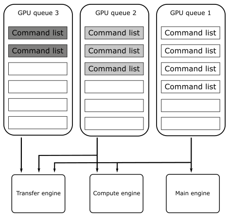

<br>

However, Vulkan abstracts the hardware details as follow. <br>
A Vulkan application submits work to a queue, normally in the form of command buffer objects. Each physical device can have one or more queues, and each of those queues belongs to one of the device’s queue families. A queue family is a group of queues that have identical capabilities. The number of queue families, the capabilities of each family, and the number of queues belonging to each family are all properties of the physical device. <br>
There are different types of commands, but the main ones are four: graphics, compute, transfer and sparse binding. 

<br>

>Right now, we are mainly interested in graphics commands, which are the only ones that our first sample (and upcoming ones) will send to the GPU to execute graphics operations in the context of the Vulkan rendering pipeline (more on this in the next tutorial). 

<br>

Each queue family can be composed of one or more queues, and each of those queues is able to store command buffers including one or more types of commands. For example, consider a device that has two queue families, A and B. Queue family A could be composed of two queues that can hold command buffers for graphics, compute, and transfer operations. On the other hand, queue family B could be composed of five queues that can only hold command buffers for transfer operations. 

<br>

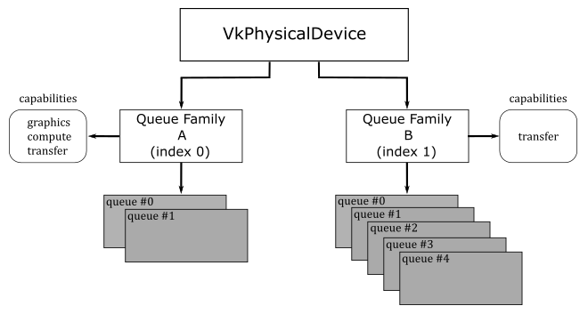

<br>

In practice, almost every GPU supporting modern APIs, such as Vulkan and DirectX12, include at least a queue family with queues for command buffers that can hold the main four command types: graphics, compute, transfer and sparse binding. 

<br>

>How a Vulkan queue is mapped to an underlying hardware queue is implementation-defined. Some implementations will do scheduling at a kernel driver level before submitting work to the hardware. That is, if your application submits work to two different queues, it is the Vulkan implementation that decides how those vulkan queues should be mapped to hardware queues, and if they can be executed in parallel by different GPU engines. In simpler terms, even if your application uses two queue of the same queue family, the Vulkan implementation will try to map them to GPU queues to be executed in parallel by different engines whenever possible. For example, if one of these two queues is used to submit command buffers holding various types of commands, while the other queue is used to submit command buffers holding only compute commands, it is likely that the Vulkan implementation can map them to GPU queues to be executed in parallel by the main engine and the compute engine.

<br>

Getting back to **CreateDevice**, we wanto to know how many GPUs are installed on the user's system. For this purpose, we call **vkEnumeratePhysicalDevices**, which enumerates the physical devices accessible to the Vulkan instance passed as the first parameter. 

Among the GPUs available, we want to select one that provides a queue that allows us to both store graphics commands and present the rendering result on the surface we just created. Indeed, the capability of a queue to present is dependent on the surface. That's why we pass our surface to **CheckPhysicalDeviceProperties** (more on this shortly). <br>
Once a device has been selected, we can retrieve some of its properties by calling **vkGetPhysicalDeviceProperties**, which returns information such as the device's name and a structure reporting implementation-dependent physical device limits. Additional useful device information can be queried with **vkGetPhysicalDeviceFeatures** and **vkGetPhysicalDeviceMemoryProperties** (refer to the Vulkan specification for further details).

Our first sample (**VKHelloWindow**) simply displays a window with a bluish client area. This means we have a limited number of graphics commands to record in the command buffer for each frame created on the CPU timeline (more on this shortly). Despite this, we still need a queue to submit command buffers that contains these (few) commands.

During instance creation, we enabled surface extensions to abstract native platform windows for use with Vulkan. Now, we need to enable a device extension specifying that we want to map a render target to a surface (that is, the client area of a window). For this purpose, **VK_KHR_swapchain** is a WSI extension that introduces **VkSwapchainKHR** objects, which provide the ability to present rendering results to a surface. 

<br>

>Observe that **VK_KHR_surface** is an instance extension, which means **VkSurfaceKHR** is exposed to all Vulkan devices in the context of our application. On the other hand, **VK_KHR_swapchain** is a device extension, which means **VkSwapchainKHR** is only exposed to the selected device.

<br>

To create a logical device for the selected physical device, we need to specify the device extensions we want to enable, as well as the type (family) and number of Vulkan queues the device need to create. At that point, **vkCreateDevice** can create a dispatchable object we can use to call other Vulkan function in the device call chain (see section **1.3.3**).

<br>

Now, we can take a look at how **CheckPhysicalDeviceProperties** works.

```cpp
bool CheckPhysicalDeviceProperties(const VkPhysicalDevice& physicalDevice,  VulkanCommonParameters& vulkan_param)
{
    // Get list of supported device extensions
    uint32_t extCount = 0;
    std::vector<std::string> extensionNames;
    vkEnumerateDeviceExtensionProperties(physicalDevice, nullptr, &extCount, nullptr);
    if (extCount > 0)
    {
        std::vector<VkExtensionProperties> extensions(extCount);
        if (vkEnumerateDeviceExtensionProperties(physicalDevice, nullptr, &extCount, &extensions.front()) == VK_SUCCESS)
        {
            for (const VkExtensionProperties& ext : extensions)
            {
                extensionNames.push_back(ext.extensionName);
            }
        }
    }

    std::vector<const char*> deviceExtensions = {
      VK_KHR_SWAPCHAIN_EXTENSION_NAME
    };

    // Check that the device extensions we want to enable are supported
    if (deviceExtensions.size() > 0)
    {
        for (const char* deviceExt : deviceExtensions)
        {
            // Output message if requested extension is not available
            if (std::find(extensionNames.begin(), extensionNames.end(), deviceExt) == extensionNames.end())
            {
                printf("Device extension not present!\n");
                assert(0);
            }
        }
    }

    // Get device queue family properties
    unsigned int queueFamilyCount = 0;
    vkGetPhysicalDeviceQueueFamilyProperties(physicalDevice, &queueFamilyCount, nullptr);
    if (queueFamilyCount == 0)
    {
        printf("Physical device doesn't have any queue families!\n");
        assert(0);
    }

    std::vector<VkQueueFamilyProperties> queueFamilyProperties(queueFamilyCount);
    std::vector<VkBool32> queuePresentSupport(queueFamilyCount);

    vkGetPhysicalDeviceQueueFamilyProperties(physicalDevice, &queueFamilyCount, queueFamilyProperties.data());

    // for each queue family...
    for (uint32_t i = 0; i < queueFamilyCount; ++i) {

        // Query if presentation is supported on a specific surface
        vkGetPhysicalDeviceSurfaceSupportKHR(physicalDevice, i, vulkan_param.PresentationSurface, &queuePresentSupport[i]);

        if ((queueFamilyProperties[i].queueCount > 0) && (queueFamilyProperties[i].queueFlags & VK_QUEUE_GRAPHICS_BIT))
        {
            // If the queue family supports both graphics operations and presentation on our surface - prefer it
            if (queuePresentSupport[i])
            {
                vulkan_param.GraphicsQueue.FamilyIndex = i;
                return true;
            }
        }
    }

    return false;
}
```
 <br>

After verifying that the swapchain extension is supported by the current physical device, we use **vkGetPhysicalDeviceQueueFamilyProperties** to get the properties of its queue families. Then, for each queue family, we check if its queues can store command buffers of graphics commands and whether they support presentation on a given surface as well. If we find such a queue family, we save its index for later use.

Note that the execution of commands in command buffers can generate images that can be mapped to surfaces to be presented to the user. Thus, an image can only be displayed on the screen if it can actually be mapped to a surface and only after the GPU finishes executing the corresponding commands. This means that presentation is an operation that somewhat depends on the surface and requires tracking the state of completion of an image. To accomplish this last task, additional operations are queued at the end of a command buffer creating a frame. As a result, while a device in a system may have multiple queues, it is not necessary for all of them to support presentation. Also, the capability of a queue to present is dependent on the surface. For example, some queues may be able to present into windows owned by the operating system but have no direct access to physical hardware that controls full-screen surfaces. This should provide further explanation regarding our earlier statement about whether an image can be mapped to a surface or not, and why presentation is a surface-dependent operation. <br>
Therefore, to use a queue for presenting to a surface, you first need to determine if that queue supports presentation to that surface. However, queues are part of a queue family and all queue within a queue family are considered to have the same properties. Therefore, only the family of a queue is needed to determine whether that queue supports presentation. 

<br>

>Surface extensions are typically used to render onto a window that is visible on the desktop. Although, it is often possible to render directly to the entire display, which can be more efficient. This functionality is provided by the **VK_KHR_display** extension, which is a WSI extension that allows to detect displays attached to a system, checking their properties and supported modes, and so on. Refer to the Vulkan specification for further details.

<br>

Thus, we need to pass a surface as a parameter to **vkGetPhysicalDeviceSurfaceSupportKHR**, which sets an array of booleans to indicate whether presentation on that surface is supported by the corresponding queue family. Thanks to this information, we can select a queue family that provides queues supporting presentation on our surface.

<br>

### 4.1.4 - Getting a Vulkan queue

At this point, we can get a queue from the selected queue family.

<br>

```cpp
void GetDeviceQueue(const VkDevice& device, unsigned int graphicsQueueFamilyIndex, VkQueue& graphicsQueue)
{
    vkGetDeviceQueue(device, graphicsQueueFamilyIndex, 0, &graphicsQueue);
}
```
<br>

**GetDeviceQueue**, which is called by **InitVulkan**, is essentially a wrapper around **vkGetDeviceQueue**. This function returns a handle to a queue from a device's queue family. In this particular case, we are interested in retrieving the first queue (index 0) from the queue family that was selected in **CheckPhysicalDeviceProperties**.

<br>

### 4.1.5 - Creating a Swapchain

Now, we're ready to create a swapchain.

<br>

```cpp
void VKSample::CreateSwapchain(uint32_t* width, uint32_t* height, bool vsync)
{
    // Store the current swap chain handle so we can use it later on to ease up recreation
    VkSwapchainKHR oldSwapchain = m_vulkanParams.SwapChain.Handle;

    // Get physical device surface capabilities
    VkSurfaceCapabilitiesKHR surfCaps;
    VK_CHECK_RESULT(vkGetPhysicalDeviceSurfaceCapabilitiesKHR(m_vulkanParams.PhysicalDevice, m_vulkanParams.PresentationSurface, &surfCaps));

    // Get available present modes
    uint32_t presentModeCount;
    VK_CHECK_RESULT(vkGetPhysicalDeviceSurfacePresentModesKHR(m_vulkanParams.PhysicalDevice, m_vulkanParams.PresentationSurface, &presentModeCount, NULL));
    assert(presentModeCount > 0);

    std::vector<VkPresentModeKHR> presentModes(presentModeCount);
    VK_CHECK_RESULT(vkGetPhysicalDeviceSurfacePresentModesKHR(m_vulkanParams.PhysicalDevice, m_vulkanParams.PresentationSurface, &presentModeCount, presentModes.data()));

    //
    // Select a present mode for the swapchain
    //
    // The VK_PRESENT_MODE_FIFO_KHR mode must always be present as per spec.
    // This mode waits for the vertical blank ("v-sync").
    VkPresentModeKHR swapchainPresentMode = VK_PRESENT_MODE_FIFO_KHR;

    // If v-sync is not requested, try to find a mailbox mode.
    // It's the lowest latency non-tearing present mode available.
    if (!vsync)
    {
        for (size_t i = 0; i < presentModeCount; i++)
        {
            if (presentModes[i] == VK_PRESENT_MODE_MAILBOX_KHR)
            {
                swapchainPresentMode = VK_PRESENT_MODE_MAILBOX_KHR;
                break;
            }
            if (presentModes[i] == VK_PRESENT_MODE_IMMEDIATE_KHR)
            {
                swapchainPresentMode = VK_PRESENT_MODE_IMMEDIATE_KHR;
            }
        }
    }

    // Determine the number of images and set the number of command buffers.
    uint32_t desiredNumberOfSwapchainImages = m_commandBufferCount = surfCaps.minImageCount + 1;
    if ((surfCaps.maxImageCount > 0) && (desiredNumberOfSwapchainImages > surfCaps.maxImageCount))
    {
        desiredNumberOfSwapchainImages = surfCaps.maxImageCount;
    }

    // Find a surface-supported transformation to apply to the image prior to presentation.
    VkSurfaceTransformFlagsKHR preTransform;
    if (surfCaps.supportedTransforms & VK_SURFACE_TRANSFORM_IDENTITY_BIT_KHR)
    {
        // We prefer a non-rotated transform
        preTransform = VK_SURFACE_TRANSFORM_IDENTITY_BIT_KHR;
    }
    else
    {
        // otherwise, use the current transform relative to the presentation engine’s natural orientation
        preTransform = surfCaps.currentTransform;
    }

    VkExtent2D swapchainExtent = {};
    // If width (and height) equals the special value 0xFFFFFFFF, the size of the surface is undefined
    if (surfCaps.currentExtent.width == (uint32_t)-1)
    {
        // The size is set to the size of window's client area.
        swapchainExtent.width = *width;
        swapchainExtent.height = *height;
    }
    else
    {
        // If the surface size is defined, the size of the swapchain images must match
        swapchainExtent = surfCaps.currentExtent;

        // Save the result in the sample's members in case the inferred surface size and
        // the size of the client area mismatch.
        *width = surfCaps.currentExtent.width;
        *height = surfCaps.currentExtent.height;
    }
    
    // Save the size of the swapchain images
    m_vulkanParams.SwapChain.Extent = swapchainExtent;

    // Get list of supported surface formats
    uint32_t formatCount;
    VK_CHECK_RESULT(vkGetPhysicalDeviceSurfaceFormatsKHR(m_vulkanParams.PhysicalDevice, m_vulkanParams.PresentationSurface, &formatCount, NULL));
    assert(formatCount > 0);

    std::vector<VkSurfaceFormatKHR> surfaceFormats(formatCount);
    VK_CHECK_RESULT(vkGetPhysicalDeviceSurfaceFormatsKHR(m_vulkanParams.PhysicalDevice, m_vulkanParams.PresentationSurface, &formatCount, surfaceFormats.data()));

    // Iterate over the list of available surface format and check for the presence of a four-component, 32-bit unsigned normalized format
    // with 8 bits per component.
    bool preferredFormatFound = false;
    for (auto&& surfaceFormat : surfaceFormats)
    {
        if (surfaceFormat.format == VK_FORMAT_B8G8R8A8_UNORM || surfaceFormat.format == VK_FORMAT_R8G8B8A8_UNORM)
        {
            m_vulkanParams.SwapChain.Format = surfaceFormat.format;
            m_vulkanParams.SwapChain.ColorSpace = surfaceFormat.colorSpace;
            preferredFormatFound = true;
            break;
        }
    }

    // Can't find our preferred formats... Falling back to first exposed format. Rendering may be incorrect.
    if (!preferredFormatFound)
    {
        m_vulkanParams.SwapChain.Format = surfaceFormats[0].format;
        m_vulkanParams.SwapChain.ColorSpace = surfaceFormats[0].colorSpace;
    }

    // Find a supported composite alpha mode (not all devices support alpha opaque)
    VkCompositeAlphaFlagBitsKHR compositeAlpha = VK_COMPOSITE_ALPHA_OPAQUE_BIT_KHR;
    // Simply select the first composite alpha mode available
    std::vector<VkCompositeAlphaFlagBitsKHR> compositeAlphaFlags = {
        VK_COMPOSITE_ALPHA_OPAQUE_BIT_KHR,
        VK_COMPOSITE_ALPHA_PRE_MULTIPLIED_BIT_KHR,
        VK_COMPOSITE_ALPHA_POST_MULTIPLIED_BIT_KHR,
        VK_COMPOSITE_ALPHA_INHERIT_BIT_KHR,
    };
    for (auto& compositeAlphaFlag : compositeAlphaFlags) {
        if (surfCaps.supportedCompositeAlpha & compositeAlphaFlag) {
            compositeAlpha = compositeAlphaFlag;
            break;
        };
    }

    VkSwapchainCreateInfoKHR swapchainCI = {};
    swapchainCI.sType = VK_STRUCTURE_TYPE_SWAPCHAIN_CREATE_INFO_KHR;
    swapchainCI.surface = m_vulkanParams.PresentationSurface;
    swapchainCI.minImageCount = desiredNumberOfSwapchainImages;
    swapchainCI.imageFormat = m_vulkanParams.SwapChain.Format;
    swapchainCI.imageColorSpace = m_vulkanParams.SwapChain.ColorSpace;
    swapchainCI.imageExtent = { swapchainExtent.width, swapchainExtent.height };
    swapchainCI.imageUsage = VK_IMAGE_USAGE_COLOR_ATTACHMENT_BIT;
    swapchainCI.preTransform = (VkSurfaceTransformFlagBitsKHR)preTransform;
    swapchainCI.imageArrayLayers = 1;
    swapchainCI.imageSharingMode = VK_SHARING_MODE_EXCLUSIVE;
    swapchainCI.presentMode = swapchainPresentMode;
    // Setting oldSwapChain to the saved handle of the previous swapchain aids in resource reuse and makes sure that we can still present already acquired images
    swapchainCI.oldSwapchain = oldSwapchain;
    // Setting clipped to VK_TRUE allows the implementation to discard rendering outside of the surface area
    swapchainCI.clipped = VK_TRUE;
    swapchainCI.compositeAlpha = compositeAlpha;

    // Enable transfer source on swap chain images if supported
    if (surfCaps.supportedUsageFlags & VK_IMAGE_USAGE_TRANSFER_SRC_BIT) {
        swapchainCI.imageUsage |= VK_IMAGE_USAGE_TRANSFER_SRC_BIT;
    }

    // Enable transfer destination on swap chain images if supported
    if (surfCaps.supportedUsageFlags & VK_IMAGE_USAGE_TRANSFER_DST_BIT) {
        swapchainCI.imageUsage |= VK_IMAGE_USAGE_TRANSFER_DST_BIT;
    }

    VK_CHECK_RESULT(vkCreateSwapchainKHR(m_vulkanParams.Device, &swapchainCI, nullptr, &m_vulkanParams.SwapChain.Handle));

    // If an existing swap chain is re-created, destroy the old swap chain.
    // This also cleans up all the presentable images.
    if (oldSwapchain != VK_NULL_HANDLE)
    {
        for (uint32_t i = 0; i < m_vulkanParams.SwapChain.Images.size(); i++)
        {
            vkDestroyImageView(m_vulkanParams.Device, m_vulkanParams.SwapChain.Images[i].View, nullptr);
        }
        vkDestroySwapchainKHR(m_vulkanParams.Device, oldSwapchain, nullptr);
    }

    // Get the swap chain images
    uint32_t imageCount = 0;
    VK_CHECK_RESULT(vkGetSwapchainImagesKHR(m_vulkanParams.Device, m_vulkanParams.SwapChain.Handle, &imageCount, NULL));

    m_vulkanParams.SwapChain.Images.resize(imageCount);
    std::vector<VkImage> images(imageCount);
    VK_CHECK_RESULT(vkGetSwapchainImagesKHR(m_vulkanParams.Device, m_vulkanParams.SwapChain.Handle, &imageCount, images.data()));

    // Get the swapchain buffers containing the image and imageview
    VkImageViewCreateInfo colorAttachmentView = {};
    colorAttachmentView.sType = VK_STRUCTURE_TYPE_IMAGE_VIEW_CREATE_INFO;
    colorAttachmentView.format = m_vulkanParams.SwapChain.Format;
    colorAttachmentView.components = { // Equivalent to:
        VK_COMPONENT_SWIZZLE_R,        // VK_COMPONENT_SWIZZLE_IDENTITY
        VK_COMPONENT_SWIZZLE_G,        // VK_COMPONENT_SWIZZLE_IDENTITY
        VK_COMPONENT_SWIZZLE_B,        // VK_COMPONENT_SWIZZLE_IDENTITY
        VK_COMPONENT_SWIZZLE_A         // VK_COMPONENT_SWIZZLE_IDENTITY
    };
    colorAttachmentView.subresourceRange.aspectMask = VK_IMAGE_ASPECT_COLOR_BIT;
    colorAttachmentView.subresourceRange.baseMipLevel = 0;
    colorAttachmentView.subresourceRange.levelCount = 1;
    colorAttachmentView.subresourceRange.baseArrayLayer = 0;
    colorAttachmentView.subresourceRange.layerCount = 1;
    colorAttachmentView.viewType = VK_IMAGE_VIEW_TYPE_2D;

    // Create the image views, and save them (along with the image objects).
    for (uint32_t i = 0; i < imageCount; i++)
    {
        m_vulkanParams.SwapChain.Images[i].Handle = images[i];
        colorAttachmentView.image = m_vulkanParams.SwapChain.Images[i].Handle;
        VK_CHECK_RESULT(vkCreateImageView(m_vulkanParams.Device, &colorAttachmentView, nullptr, &m_vulkanParams.SwapChain.Images[i].View));
    }
}
```
<br>

Before exploring **CreateSwapchain**, it is essential to have a brief understanding of what swapchains are and how they work. <br>
As stated earlier, **VkSurfaceKHR** simply abstracts a native platform window. However, to actually present anything to a surface, it’s necessary to create special images (textures) that can be used to store the data to map to the window's client area. On most platforms, this type of images are owned by the presentation engine, which is an abstraction for the platform’s window manager (more on this shortly). A swapchain is simply an abstraction for an array of presentable images (in the presentation engine) that are associated with a specific surface. During swapchain creation, an application can ask the presentation engine to create one or more images that can be used to present rendering results onto a Vulkan surface. For this purpose, the **VK_KHR_swapchain** extension (that we enabled in **CreateDevice**) introduces the **VkSwapchainKHR** type that represents a swapchain object providing the ability to present rendering results to a surface - that is, it allows to map presentable images in the swapchain to a window's client area. 

<br>

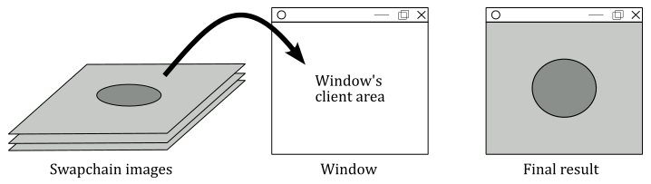

<br>

The application can ask the presentation engine for the next available image (in a given swapchain) to render into it, and then it can hand the image back to the presentation engine, ready for display. This allows one image (usually called front buffer) to be shown while the application is drawing another one (called back buffer, or render target), creating a smooth, continuous presentation.

Getting back to **CreateSwapchain**, during the creation of the swapchain, we need to provide some crucial information, such as the number of presentable images in the swapchain, their size, format, and usage. However, we cannot simply pass arbitrary values, as they must fit into supported limits that depend on both the surface and the physical device. This means that before creating a swapchain, we need to query the basic capabilities of our surface by calling **vkGetPhysicalDeviceSurfaceCapabilitiesKHR**, which returns some useful information, such as the minimum and maximum number of image supported by a swapchain for a given combination of surface and device.

<br>

>The reason for saving the old swapchain at the beginning of the **CreateSwapchain** function in order to use it to create a new one will be explained at the end of this tutorial, once we have covered the necessary information on how to acquire images from the swapchain and why it may be necessary to recreate the swapchain.

<br>

The ways a presentation engine can present images on a surface is another important detail that depends on the surface and physical device. This means we need to query the presentation modes supported for a given combination of surface and device. For this purpose, we can use **vkGetPhysicalDeviceSurfacePresentModesKHR**. A presentation mode controls synchronization with the window system, and the rate at which the images are presented to the surface. Currently, the Vulkan API defines four presentation modes:

- Immediate (**VK_PRESENT_MODE_IMMEDIATE_KHR**): specifies that the presentation engine does not wait for a vertical interval to update the image currently displayed on the screen, meaning this mode may result in visible tearing. Minimal or no internal queuing of presentation requests is needed, as the requests are applied immediately. That is, after presenting an image, if the GPU has finished rendering on it and the presentation engine has scheduled its presentation on a surface, then the image is presented to the user as soon as possible.

<br>

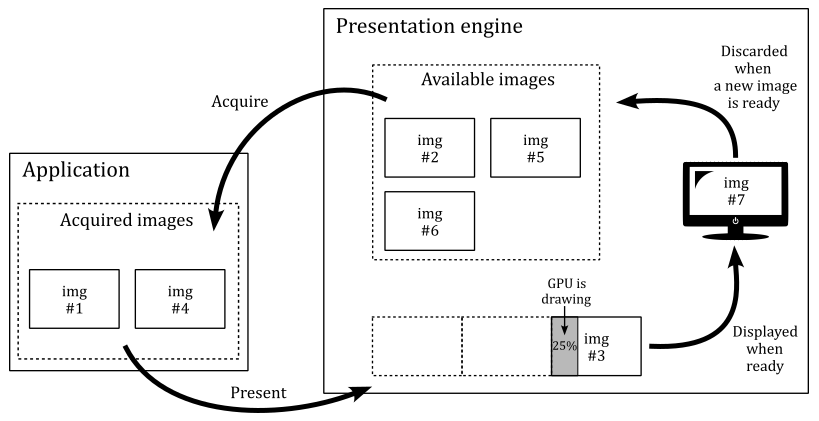

<br>

- FIFO (**VK_PRESENT_MODE_FIFO_KHR**): specifies that the presentation engine waits for the next vertical interval to update the current image. Tearing cannot be observed. An internal queue (called present queue) is used to hold pending presentation requests. New requests are appended to the end of the queue, and one request is removed from the beginning of the queue and processed during each vertical interval if the GPU has finished rendering on the related image. This can result in annoying frame latency if the application presents images faster than the GPU can render on them. We will cover this topic in detail in an upcoming tutorial. <br>
FIFO is the only presentation mode that is required to be supported by all Vulkan implementations.

<br>

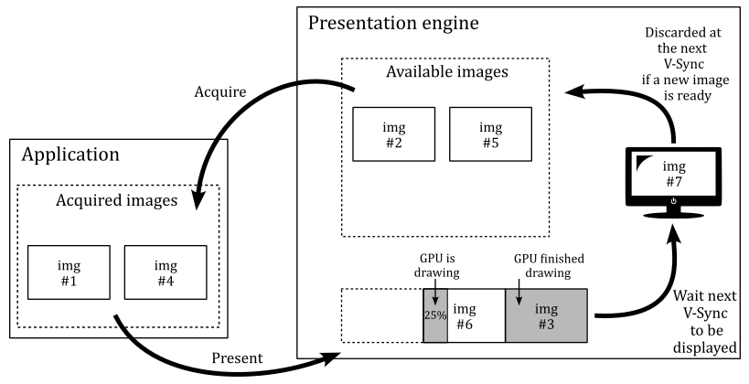

<br>


- FIFO Relaxed (**VK_PRESENT_MODE_FIFO_RELAXED_KHR**): It works similar to the FIFO mode, except if the present queue is empty and a v-sync occurs, then the next presented image in the present queue that has been completed by the GPU will be displayed immediately. Therefore, with the FIFO relaxed mode the user won't experience image tearing unless the application presents images (and the GPU renders on them) at a lower frame rate than the refresh rate.

<br>

- Mailbox (**VK_PRESENT_MODE_MAILBOX_KHR**): specifies that the presentation engine waits for the next vertical interval to update the current image. Therefore, tearing cannot be observed. Moreover, at each vertical sync, the latest image completed by the GPU will be selected by the presentation engine to be displayed on the screen. That is, if there is more than a presented image in the present queue that the GPU finishes rendering before the next vertical sync, the older images will be discarded from the present queue and will become available for re-use by the application. Thisi is the lowest latency, non-tearing presentation mode. Frame latency will be covered in an upcoming tutorial.

<br>

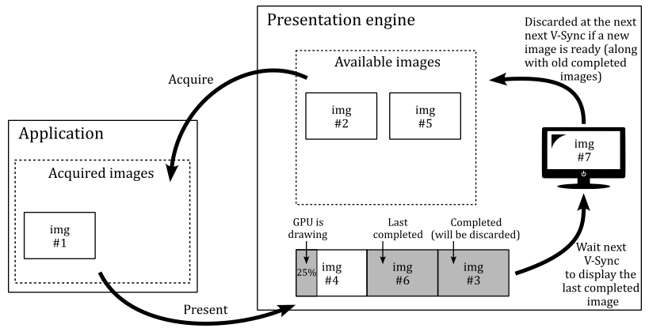

<br>

>As stated earlier, the presentation engine is an abstraction for the platform’s window manager. If the window manager use a compositor, applications are provided with an off-screen buffer for each window, so that the window manager can composite the window buffers into a single image representing the entire screen (the user desktop) and writes the result into the display memory.
>
><br>
>
>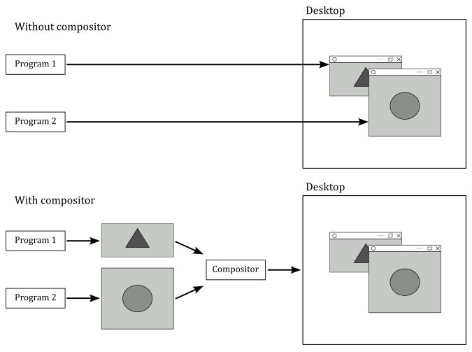
>
><br>
>
>The presentation engine also controls the order in which presentable images are acquired for use by the application (more on this shortly).

<br>

>A vertical interval (or vertical blank; shown as a dashed diagonal in the image below) is the time the scanning process takes to restart the refresh of your monitor.
>
><br>
>
>
>
><br>
>
>A vertical synchronization signal (or simply v-sync) occurs at end of the scanning process to inform the window manager that it can replace the image shown on the screen with another one, if ready to be displayed. Indeed, in the following images you can see that if the GPU isn’t fast enough in drawing on an image, the frames per second (FPS) can drop by half. If a new image is not ready to be shown, the previous one continues to be displayed on the screen. That is, no swap can occur between images in the swapchain at the next v-sync since the GPU has not finished drawing on the image.
>
><br>
>
>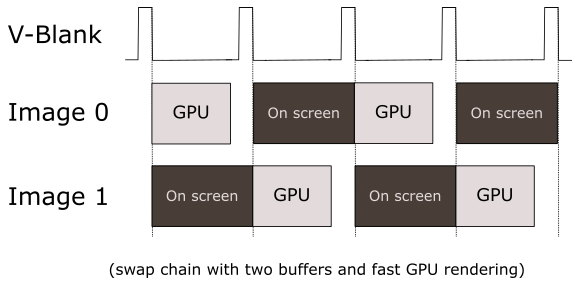
>
><br>
>
><br>
>
>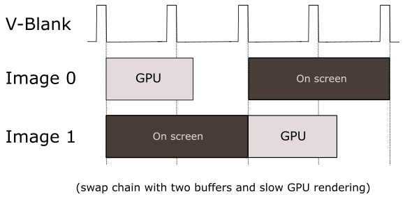

<br>

>By now, it should be clear that we are dealing with two different timelines. The term timeline in this context means the time when code is executed. Presenting images occurs on the CPU timeline. That is, our application (which runs on the CPU) records commands in a command buffer to create a frame, and at the end of this recording process, the image of the swapchain where we want to render the frame onto is presented. Observe that, up to this point, nothing has been drawn on the image yet. Indeed, by presenting an image, the application (CPU) lets the GPU know that the commands to draw on that image are ready. Then, the GPU can starts executing those commands on its own timeline to actually draw on that image, if it is available (an image is available if there are no outstanding presents that reference it, and it is currently not being displayed on the screen. Otherwise, it is unavailable).

<br>

The surface capabilities we obtained by calling **vkGetPhysicalDeviceSurfaceCapabilitiesKHR** can now be used to determine the number of images we want in the swapchain. In this case, we set this number to the minimum number of image supported by the swapchain (for a given surface), plus 1. Observe that we also check that this number doesn't exceed the maximum number of images supported.

Some surfaces support transformations, in the sense that a surface can be transformed (for example rotated) before presenting the rendering result to the user in order to accomodate the presentation to display orientation. In this case, we prefer to appy an identity to the surface (that is, a transformation with no effect).

At this point, we need to provide the size of the images in the swapchain. <br>
When we created the surface in **CreateSurface**, we passed the window handle as a parameter. This means the surface size should be inferred and returned in the surface capabilities. If that's the case, we can set the size of the image to match the size of the surface. <br>
However, if for any reason width and height of the surface are undefined (that is, if their values is -1; 0xFFFFFFFF in hexadecimal), then we need to explicitly set the image size to match the size of the window's client area.

We also need to provide a format for the images in the swapchain. That is, we must specify the GPU memory required to store them and how its elements (texels) should be interpreted. Indeed, as stated previously, an image can be considered as a texture. And a texture can be visualized as a grid composed of cells known as texels whose type and layout in memory is specified by a **VK_FORMAT** value; If the texture is an image of a swapchain, the texels are also called pixels. <br>
**vkGetPhysicalDeviceSurfaceFormatsKHR** queries the formats and color spaces supported by a surface for a given physical device. In this case, we want that each pixel is a 32-bit value composed of four 8-bit unsigned-normalized-integer components (also called channels), each in the range $[0/255, 255/255]=[0, 1]$ - this means that each channel can have 256 different values. Usually, the four channels are called R, G, B and A to mimic the RGB color model, where a color is linearly defined by the amount of red, green and blue it contains. The channel A (called alpha) is used to control the transparency or the opacity of the color. As a result, each pixel can display over 16 milion unique colors. <br>
As for the color space, it provides additional information to the presentation engine on how to interpret the image data. Vulkan requires that all implementations support at least **VK_COLOR_SPACE_SRGB_NONLINEAR_KHR**, which means that the window manager can expect sRGB nonlinear data if an sRGB format has been indicated for the images in a given swapchain. However, in our case, we have specified an UNORM format, which means that the color space is irrelevant for the presentation engine to interpret the image data. We will learn more about the SRGB color space and how to use the sRGB formats in a later tutorial.

The surface capabilities also include the supported alpha composition. This information can be provided to the swapchain, allowing window managers that support alpha composition to utilize the alpha channel of the pixels to make the surface partially or fully transparent. <br>
**VK_COMPOSITE_ALPHA_OPAQUE_BIT_KHR** indicates that the alpha component of the images, if it exists, is ignored in the compositing process. Instead, the image is treated as if it has a constant alpha of 1.0.

Now, we can finally initialize a **VkSwapchainCreateInfoKHR** structure specifying the parameters of a newly created swapchain. In particular, we need to set:

- The surface onto which the images in the swapchain will presented (mapped). If the creation succeeds, the swapchain becomes associated with that surface.

- The number of images in the swapchain. In particular, we must set **minImageCount**, which specifies the minimum number of presentable images that the application needs. The implementation will either create the swapchain with at least that many images, or it will fail to create the swapchain.

- A value specifying the format of the the swapchain images, along with a color space specifying the way the presentation engine interprets image data.

-  The size (in pixels) of the swapchain images. The behavior is platform-dependent if the image extent does not match the surface’s **currentExtent** as returned by **vkGetPhysicalDeviceSurfaceCapabilitiesKHR**.

-  The transformation, relative to the presentation engine’s natural orientation, applied to the image prior to presentation.

-  The alpha compositing mode to use when this surface is composited together with other surfaces on certain window systems.

-  The presentation mode used to display the swapchain images. A swapchain’s present mode determines how incoming present requests will be processed and queued internally.

- **imageArrayLayers** is the number of views in a multiview/stereo surface. For non-stereoscopic-3D applications, this value is 1.

- **imageSharingMode** is the sharing mode used for the images of the swapchain. Some implementations need to know whether an image will be used by multiple queue families at the same time. **VK_SHARING_MODE_EXCLUSIVE** indicates that the images will only be used on a single queue family. If concurrent access to any image from multiple queue families is supported, we must specify **VK_SHARING_MODE_CONCURRENT**, as well as the number of the queue families having access to the image(s), along with their family indices.

- **clipped** is a boolean that specifies whether the Vulkan implementation is allowed to discard rendering operations that affect regions of the surface that are not visible.

- **imageUsage** is a bitmask describing the intended usage of the swapchain images. In general we will use swapchain images as render targets, so we set **VK_IMAGE_USAGE_COLOR_ATTACHMENT_BIT** which means that an image can be bound as a color attachment in a framebuffer to be used as a render target for graphics operations (more on this shortly). If supported by the surface, we can also set the image to be used as both the source and destination in transfer commands, which allows us to read from or write to the image. For example, we could render an image and then copy its contents to another image. Alternatively, we could render an image and then save its contents to a file on disk (such as to take a screenshot).

<br>

Then, we call **vkCreateSwapchainKHR** to create a swapchain. If the call succeeds, **vkCreateSwapchainKHR** returns a handle to a swapchain containing an array of at least **minImageCount** presentable images.

<br>

Usually, swapchain images are created in GPU's local memory (VRAM). This means we cannot directly reference them from our application, which accesses CPU's local memory using a CPU virtual address space. Indeed, GPU's local memory is (typically) not visible to our application running on the CPU.

<br>

>Actually, a small portion of the GPU's local memory is visible to some extent by the CPU. However, applications usually do not reference swapchain images in this portion of memory. More information on memory management in Vulkan will be provided in an upcoming tutorial.

<br>

However, we still need a way to reference them because we must tell the GPU what's the image to draw on. That is, we need to bind an image as the output (render target) of the rendering pipeline.
Fortunately, in Vulkan we can use image views, which allow to describe and specify swapchain images to the GPU from our CPU application. That is, we can use image views to bind swapchain images to the pipeline.

<br>

>The same applies to other resources such as textures, buffers, etc. We need to create a view to describe the corresponding resource to the GPU from our application. By using resource views, we can specify different portions of the same resource, which are called subresources, as well as different formats to access it. Further details will be provided in later tutorials.

<br>

To get the swapchain images that have just been created, we can call **vkGetSwapchainImagesKHR**. To create the corresponding views we use **vkCreateImageView**, which takes a **VkImageViewCreateInfo** structure specifying the parameters of the image view to be created. In particular, the following fields must be initialized:

- **image** specifies the image (**VkImage** object) on which the view will be created.

- **viewType** specifies the type of the image view. In this case we set **VK_IMAGE_VIEW_TYPE_2D** to indicate it is a view describing a 2D image (a grid of pixels).

- **format** specifies how to interpret the pixels of the image. We have the option to use whatever format, as long as it is compatible with the format used to create the actual image. However, in this case we will use the same format of the image.

- **subresourceRange** specifies the set of mipmap levels and array layers accessible to the view. Further information will be given in an upcoming tutorial.

- **components** specifies a remapping of color components. This requires a brief explanation. As you may have noticed, we allow both **VK_FORMAT_B8G8R8A8_UNORM** and **VK_FORMAT_R8G8B8A8_UNORM** as formats for interpreting the pixels of the swapchain images. However, when creating an image view, this ambiguity must be resolved. The reason is that, if a pipeline stage accesses an image (by using the related view bound from our application) to read a specific pixel, it needs to know what it will find in the first component/channel of the pixel fetched from the image: R (red) or B (blue)? The same applies to the remaining channels. For this purpose, the **components** field can be used to describe a remapping from components of the image to components of the vector returned as a result of reading a pixel through the related image view.

  - **VK_COMPONENT_SWIZZLE_R** specifies that the component is set to the value of the R component of the image.
  - **VK_COMPONENT_SWIZZLE_G** specifies that the component is set to the value of the G component of the image.
  - **VK_COMPONENT_SWIZZLE_B** specifies that the component is set to the value of the B component of the image.
  - **VK_COMPONENT_SWIZZLE_A** specifies that the component is set to the value of the A component of the image.
  - **VK_COMPONENT_SWIZZLE_ZERO** specifies that the component is set to zero.
  - **VK_COMPONENT_SWIZZLE_ONE** specifies that the component is set to either one.
  - **VK_COMPONENT_SWIZZLE_IDENTITY** specifies that the component is set to the identity swizzle. That is, if you set the first element of the components field to **VK_COMPONENT_SWIZZLE_IDENTITY** than it is equivalent to **VK_COMPONENT_SWIZZLE_R**. If you set the second element to **VK_COMPONENT_SWIZZLE_IDENTITY** than it is equivalent to **VK_COMPONENT_SWIZZLE_G**. If you set the third element to **VK_COMPONENT_SWIZZLE_IDENTITY** than it is equivalent to **VK_COMPONENT_SWIZZLE_B**. And if you set the fourth element to **VK_COMPONENT_SWIZZLE_IDENTITY** than it is equivalent to **VK_COMPONENT_SWIZZLE_A**.

<br>

### 4.1.6 - Creating a Render Pass

Now that we have the image views, we need to bind them as render targets of the rendering pipeline. This is one of the most convoluted parts of the Vulkan specification, especially for those who are just starting out. Indeed, an extension is available to simplify things, but until it is promoted to core functionality, we still need to learn how to deal with the more intricate one. With that said, let's take a look at the **CreateRenderPass** function.

<br>

```cpp
// Create a Render Pass object.
void VKSample::CreateRenderPass()
{
    // This example will use a single render pass with one subpass

    // Descriptors for the attachments used by this renderpass
    std::array<VkAttachmentDescription, 1> attachments = {};

    // Color attachment
    attachments[0].format = m_vulkanParams.SwapChain.Format;                        // Use the color format selected by the swapchain
    attachments[0].samples = VK_SAMPLE_COUNT_1_BIT;                                 // We don't use multi sampling in this example
    attachments[0].loadOp = VK_ATTACHMENT_LOAD_OP_CLEAR;                            // Clear this attachment at the start of the render pass
    attachments[0].storeOp = VK_ATTACHMENT_STORE_OP_STORE;                          // Keep its contents after the render pass is finished (for displaying it)
    attachments[0].stencilLoadOp = VK_ATTACHMENT_LOAD_OP_DONT_CARE;                 // Similar to loadOp, but for stenciling (we don't use stencil here)
    attachments[0].stencilStoreOp = VK_ATTACHMENT_STORE_OP_DONT_CARE;               // Similar to storeOp, but for stenciling (we don't use stencil here)
    attachments[0].initialLayout = VK_IMAGE_LAYOUT_UNDEFINED;                       // Layout at render pass start. Initial doesn't matter, so we use undefined
    attachments[0].finalLayout = VK_IMAGE_LAYOUT_PRESENT_SRC_KHR;                   // Layout to which the attachment is transitioned when the render pass is finished
                                                                                    // As we want to present the color attachment, we transition to PRESENT_KHR

    // Setup attachment references
    VkAttachmentReference colorReference = {};
    colorReference.attachment = 0;                                    // Attachment 0 is color
    colorReference.layout = VK_IMAGE_LAYOUT_COLOR_ATTACHMENT_OPTIMAL; // Attachment layout used as color during the subpass

    // Setup a single subpass reference
    VkSubpassDescription subpassDescription = {};
    subpassDescription.pipelineBindPoint = VK_PIPELINE_BIND_POINT_GRAPHICS;
    subpassDescription.colorAttachmentCount = 1;                            // Subpass uses one color attachment
    subpassDescription.pColorAttachments = &colorReference;                 // Reference to the color attachment in slot 0
    subpassDescription.pDepthStencilAttachment = nullptr;                   // (Depth attachments not used by this sample)
    subpassDescription.inputAttachmentCount = 0;                            // Input attachments can be used to sample from contents of a previous subpass
    subpassDescription.pInputAttachments = nullptr;                         // (Input attachments not used by this example)
    subpassDescription.preserveAttachmentCount = 0;                         // Preserved attachments can be used to loop (and preserve) attachments through subpasses
    subpassDescription.pPreserveAttachments = nullptr;                      // (Preserve attachments not used by this example)
    subpassDescription.pResolveAttachments = nullptr;                       // Resolve attachments are resolved at the end of a sub pass and can be used for e.g. multi sampling

    // Setup subpass dependencies
    std::array<VkSubpassDependency, 1> dependencies = {};

    // Setup dependency and add implicit layout transition from final to initial layout for the color attachment.
    // (The actual usage layout is preserved through the layout specified in the attachment reference).
    dependencies[0].srcSubpass = VK_SUBPASS_EXTERNAL;
    dependencies[0].dstSubpass = 0;
    dependencies[0].srcStageMask = VK_PIPELINE_STAGE_COLOR_ATTACHMENT_OUTPUT_BIT;
    dependencies[0].dstStageMask = VK_PIPELINE_STAGE_COLOR_ATTACHMENT_OUTPUT_BIT;
    dependencies[0].srcAccessMask = VK_ACCESS_NONE;
    dependencies[0].dstAccessMask = VK_ACCESS_COLOR_ATTACHMENT_WRITE_BIT | VK_ACCESS_COLOR_ATTACHMENT_READ_BIT;

    // Create the render pass object
    VkRenderPassCreateInfo renderPassInfo = {};
    renderPassInfo.sType = VK_STRUCTURE_TYPE_RENDER_PASS_CREATE_INFO;
    renderPassInfo.attachmentCount = static_cast<uint32_t>(attachments.size());  // Number of attachments used by this render pass
    renderPassInfo.pAttachments = attachments.data();                            // Descriptions of the attachments used by the render pass
    renderPassInfo.subpassCount = 1;                                             // We only use one subpass in this example
    renderPassInfo.pSubpasses = &subpassDescription;                             // Description of that subpass
    renderPassInfo.dependencyCount = static_cast<uint32_t>(dependencies.size()); // Number of subpass dependencies
    renderPassInfo.pDependencies = dependencies.data();                          // Subpass dependencies used by the render pass

    VK_CHECK_RESULT(vkCreateRenderPass(m_vulkanParams.Device, &renderPassInfo, nullptr, &m_sampleParams.RenderPass));
}
```
<br>

To understand the code of **CreateRenderPass**, it is necessary a brief introduction to some fundamental concepts. <br>
As stated in section **1.2.1** (see "API execution model") a Vulkan application is responsible for recording commands into a command buffer to be submitted to a GPU queue. Among the various commands that can be recorded in a command buffer, Draw commands are special because each of these commands triggers the execution of the rendering pipeline. 

Draw commands must be recorded within a render pass instance on a per-subpass basis. A render pass instance defines the use of a render pass in a command buffer. A render pass can be thought of as a template that includes a collection of descriptions for the attachments that will be used throughout the various subpasses that compose a render pass instance. In this context, the render pass instance is the actual instantiation that provides the actual data: the attachments used by the subpasses. Additionally, a render pass includes information on the dependencies between the various subpasses.

An attachment is an image view used in a framebuffer, which is a collection of image views and a set of dimensions that, in conjunction with a render pass instance, define the inputs and outputs used by drawing commands recorded in one or more subpasses in the render pass instance.

A subpass represents a single phase of rendering that reads and writes a subset of the attachments associated with a render pass instance (through the related framebuffer). After beginning a render pass instance, the command buffer is ready to record the commands for the first subpass of that render pass.

GPUs execute drawing commands (in command buffers) in parallel whenever possible. This means that drawing commands in adjacent subpasses can be executed in parallel if there aren't synchronization or concurrency problems. Subpass dependencies describe execution and memory dependencies between subpasses, allowing the GPU to know up-front the drawing commands that can be executed in parallel.

By describing a complete set of subpasses in advance, render passes provide the implementation an opportunity to optimize the storage and transfer of attachment data between subpasses, especially on tile-based rendering architectures. However, it is also quite common for a render pass to only contain a single subpass, and that is exactly our case. In fact, almost all the samples examined in this tutorial series use only one subpass.

The following illustration shows a render pass instance that uses a render pass object to specify the subpass dependencies and the attachments used by the various subpasses during the execution of their rendering operations. However, a render pass object only describes the types of attachments that will be used. The actual images will be provided by a framebuffer associated with the render pass instance.

<br>

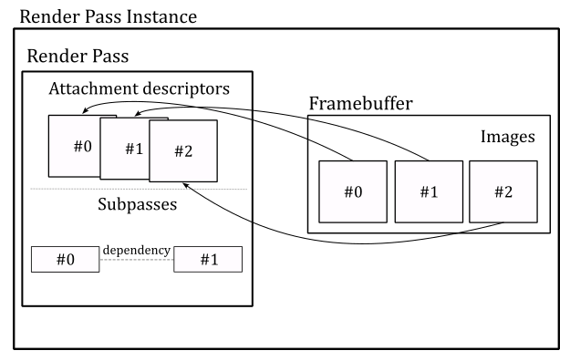

<br>

>Embedded GPUs with limited on-chip memory and bandwidth can break an image into smaller regions, called tiles, and render each one separately. This approach reduces the amount of memory required during the execution of the pipeline stages, as well as the amount of data being transferred between them. 
>
><br>
>
>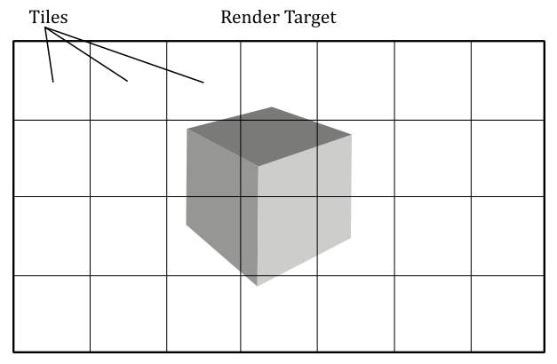
>
><br>
>
>Render passes and subpasses enable the application to divide drawing commands into subpasses representing the tiles where the corresponding geometries will be drawn. If a piece of geometry overlaps multiple tiles, subpass dependencies can determine whether multiple drawing commands can be executed in parallel or not. <br>
If you're wondering whether you need to use render passes and subpasses even on non-embedded GPUs, unfortunately the answer is yes if you want to stick with the core functionality of Vulkan. The fact is that this Vulkan feature should have been designed to be more versatile and usable in various contexts. Sadly, this goal has not yet been achieved, and for many developers render passes and subpasses do not provide any practical benefits, and instead, they tend to get in the way. That's why an extension has been developed to instruct the Vulkan API to begin rendering without using any render pass or subpasses. However, since render passes and subpasses are a core feature, we must learn to work with them. Fortunately, we won't use more than a subpass in our render passes, so things should be simpler.

<br>

Enough with the theory! Now, let's take a closer look at the **CreateRenderPass** code to better explain what we just discussed. <br>
In **VkHelloWindow** (and upcoming samples), we will use one render pass with a single subpass to record all the necessary commands for rendering a complete frame of our Vulkan application. This means that the view of an available image must be attached as render target whenever our application create a frame on the CPU timeline. An attachment in the framebuffer used as render target is called color attachment. However, we will attach image views to the render pass instance later. Here, we are only creating the render pass object that will be used to begin an instance of (more on this shortly). 

Therefore, we start creating an array of **VkAttachmentDescription**, each of which represent an attachment description that includes binding information about the actual image view that will be attached later - for example, its format, sample count, and how its contents will be treated at the beginning and end of a render pass instance. In this case, we need a single attachment descriptor for the image view that will be used as render target (color attachment) in the render pass instance.

Then, we create a attachment reference which indexes the attachment descriptor just created. In particular, we set the value 0 to index the only element in the array of attachemnt descriptions (the color attachment). The **layout** field specifies how the image pixels are organized in memory. This affects how the image is accessed, as each layout has limitations on what kinds of operations are supported. For example, an image with a layout of **VK_IMAGE_LAYOUT_COLOR_ATTACHMENT_OPTIMAL** may provide optimal performance for use as a color attachment, but be unsupported for use in transfer commands. Applications can transition an image from one layout to another in order to achieve optimal performance when the image is used for multiple kinds of operations.

The **VkSubpassDescription** describes a subpass, which involves a subset of attachments. These attachments can be used as input attachments that the subpass reads from, color attachments or depth/stencil attachments that the subpass writes to, or attachments that the subpass performs shader or multisample resolve operations on. In addition, a subpass description can specify a set of preserve attachments that the subpass does not read or write to, but their contents must be preserved throughout the subpass. <br>
The **pipelineBindPoint** field specifies the pipeline type supported for this subpass. According to the Vulkan specification, subpasses can only be used in graphics operations. Therfore, we must set this field to **VK_PIPELINE_BIND_POINT_GRAPHICS**.

Usually, a Vulkan implementation can determine the dependencies between subpasses by analyzing the attachment references and identifying inputs and outputs that make subpasses dependent on one another. However, there are cases where the driver cannot figure this out automatically. For example, this can happen if a subpass directly access a shared resource (that is, if it hides its purpose of using the shader resource by not referencing the related attachment references). In a similar way, a driver cannot easily establish an input-to-output relationship if a subpass depends on operations which were submitted outside the current render pass instance. This can occur because, after the GPU finishes executing the drawing commands in a command buffer for a given render pass instance, it may begin executing the commands for the next render pass instance without waiting for pipeline execution to complete (provided that a new command buffer is available for processing in the GPU queue). <br>
Using subpass dependencies also adds implicit layout transitions for the attachment used, which eliminates the need for explicit image memory barriers to transform them. <br>
In general, we need to create an array of **VkSubpassDependency**, each of which describes a subpass dependency. The **VkSubpassDependency** structure includes the following fields:

- **srcSubpass** is the subpass index of the first subpass in the dependency, or **VK_SUBPASS_EXTERNAL**. It specifies the subpass that produces data.

- **dstSubpass** is the subpass index of the second subpass in the dependency, or **VK_SUBPASS_EXTERNAL**. It specifies the dependent subpass that consumes the data produced by **srcSubpass**.

- **srcStageMask** is a bitmask specifying the source stages. It specifies the set of pipeline stages which produce data.

- **dstStageMask** is a bitmask specifying the destination stages. It specifies the set of pipeline stages that consume the data produced by **srcStageMask**.

- **srcAccessMask** is a bitmask specifying a source access mask. It specifies the types of memory operations that occurred for producing data by **srcStageMask**.

- **dstAccessMask** is a bitmask specifying a destination access mask. It specifies the types of memory operations that occurred for consuming the data by **dstStageMask**.

<br>

Here, we create an array of **VkSubpassDependency** with a single element to specify that our subpass (**srcSubpass** = 0) will depend on drawing commands executed outside (**srcSubpass** = **VK_SUBPASS_EXTERNAL** here means before) the current render pass instance.
**VK_PIPELINE_STAGE_COLOR_ATTACHMENT_OUTPUT_BIT** refers to the pipeline stage where the final color values are written to the color attachment (the render target). Indeed, in this case the dependecy between the subpass of the current render pass instance and the subpass of the previous render pass instance concerns the concurrent access to the color attachment. This informs the GPU that it does not have complete permission to execute drawing commands from different command buffers in parallel. In particular, in this case it can start processing drawing commands in a new command buffer if possible, but it cannot execute the fragment shader in parallel with other fragment shaders triggered by drawing commands from previous command buffers.

**VkRenderPassCreateInfo** is a structure describing the parameters (attachments, subpasses and subpass dependecies) of the render pass object we want to create. <br>
**vkCreateRenderPass** creates the render pass object that will be used to begin an instance of.

<br>

### 4.1.7 - Creating FrameBuffers

**CreateFrameBuffers** is responsible for creating the framebuffers that hold the actual color attachments. 

<br>

```cpp
void VKSample::CreateFrameBuffers()
{
    VkImageView attachments[1] = {};

    VkFramebufferCreateInfo frameBufferCreateInfo = {};
    frameBufferCreateInfo.sType = VK_STRUCTURE_TYPE_FRAMEBUFFER_CREATE_INFO;
    frameBufferCreateInfo.pNext = NULL;
    frameBufferCreateInfo.renderPass = m_sampleParams.RenderPass;
    frameBufferCreateInfo.attachmentCount = 1;
    frameBufferCreateInfo.pAttachments = attachments;
    frameBufferCreateInfo.width = m_width;
    frameBufferCreateInfo.height = m_height;
    frameBufferCreateInfo.layers = 1;

    // Create a framebuffer for each swapchain image view
    m_sampleParams.Framebuffers.resize(m_vulkanParams.SwapChain.Images.size());
    for (uint32_t i = 0; i < m_sampleParams.Framebuffers.size(); i++)
    {
        attachments[0] = m_vulkanParams.SwapChain.Images[i].View;
        VK_CHECK_RESULT(vkCreateFramebuffer(m_vulkanParams.Device, &frameBufferCreateInfo, nullptr, &m_sampleParams.Framebuffers[i]));
    }
}
```
<br>

We need as many framebuffers as there are swapchain image views. Indeed, we will attach a different color attachment for each frame created by our application. <br>
**VkFramebufferCreateInfo** specifies the parameters of a newly created framebuffer. In particular:

- **renderPass** is a render pass object defining what render pass instances the framebuffer will be compatible with. A framebuffer is compatible with a render pass instance if it was created using the corresponding render pass object or a compatible one. Two render passes are compatible if their corresponding color, input, resolve, and depth/stencil attachment references are compatible. Two attachment references are compatible if they have matching format and sample count.

- **attachmentCount** is the number of attachments in the framebuffer.

- **pAttachments** is a pointer to an array of **VkImageView**, each of which will be used as an attachment in a render pass instance.

- **width**, **height** and **layers** define the dimensions of the framebuffer. Although each of the images in a framebuffer has its own native width, height, and layer count, we must still specify the dimensions of the framebuffer, that should be less than or equal to the smallest image in the framebuffer (although, it is common for the images in a framebuffer to have the same size, and for the dimensions of the framebuffer to match the size of those images). **layers** must be one despite the number of views in the image (see the explaination provided earlier for **VkSwapchainCreateInfoKHR::imageArrayLayers**).

<br>

**vkCreateFramebuffer** creates a new framebuffer. In this case, each framebuffer has a single color attachment: an image view to be bound as the render target for the current frame creation.

<br>

### 4.1.8 - Allocating command buffers

Now, we need to allocate some command buffers in which our application can record commands that will be submitted to a device queue for execution.

<br>

```cpp
void VKSample::AllocateCommandBuffers()
{
    if (!m_sampleParams.GraphicsCommandPool)
    {
        VkCommandPoolCreateInfo cmdPoolInfo = {};
        cmdPoolInfo.sType = VK_STRUCTURE_TYPE_COMMAND_POOL_CREATE_INFO;
        cmdPoolInfo.queueFamilyIndex = m_vulkanParams.GraphicsQueue.FamilyIndex;
        cmdPoolInfo.flags = VK_COMMAND_POOL_CREATE_RESET_COMMAND_BUFFER_BIT;
        VK_CHECK_RESULT(vkCreateCommandPool(m_vulkanParams.Device, &cmdPoolInfo, nullptr, m_sampleParams.GraphicsCommandPool));
    }

    // Create one command buffer for each swap chain image
    m_sampleParams.GraphicsCommandBuffers.resize(m_commandBufferCount);

    VkCommandBufferAllocateInfo commandBufferAllocateInfo{};
    commandBufferAllocateInfo.sType = VK_STRUCTURE_TYPE_COMMAND_BUFFER_ALLOCATE_INFO;
    commandBufferAllocateInfo.commandPool = m_sampleParams.GraphicsCommandPool;
    commandBufferAllocateInfo.level = VK_COMMAND_BUFFER_LEVEL_PRIMARY;
    commandBufferAllocateInfo.commandBufferCount = static_cast<uint32_t>(m_sampleParams.GraphicsCommandBuffers.size());

    VK_CHECK_RESULT(vkAllocateCommandBuffers(m_vulkanParams.Device, &commandBufferAllocateInfo, m_sampleParams.GraphicsCommandBuffers.data()));
}
```
<br>

Since we will be using a different color attachment for each frame created by our application, we need to create as many command buffers as there are swapchain images. This will allow our application to record commands in different command buffers for different frames created on the CPU timeline in advance with respect to the GPU. 

<br>

>It is worth noting that while this is the ideal practice, for the sake of simplicity, in this sample and upcoming ones, we won't create frames in advance on the CPU timeline. Further details will be provided later in this tutorial and in future ones as well.

<br>

Anyway, command buffers themselves cannot be created directly. We need to allocate them from command pools. A command pool is a memory block that command buffers are allocated from, and which allow the implementation to amortize the cost of resource creation across multiple command buffers. Command pool objects (**VkCommandPool**) are externally synchronized, meaning that they must not be used concurrently in multiple threads.

**VkCommandPoolCreateInfo** specifies some important parameters of the command pool we want to create with **vkCreateCommandPool**. In particular, 

- **queueFamilyIndex** specifies a queue family. All command buffers allocated from this command pool must be submitted on queues from the same queue family.

- **flags** is a bitmask indicating usage behavior for the pool and command buffers allocated from it. **VK_COMMAND_POOL_CREATE_RESET_COMMAND_BUFFER_BIT** allows any command buffer allocated from a pool to be individually reset to the initial state; either by calling **vkResetCommandBuffer**, or via the implicit reset when calling **vkBeginCommandBuffer**. If this flag is not set on a pool, then **vkResetCommandBuffer** must not be called for any command buffer allocated from that pool before starting recording commands.

<br>

>Obviously, a command buffer need to be visible\accessible from both CPU (to record commands) and the GPU (to fetch the commands for execution). We will cover memory managment in the next tutorial.

<br>

**VkCommandBufferAllocateInfo** specifies the allocation parameters for **vkAllocateCommandBuffers**. In particular, 

- **commandPool** is the command pool from which the command buffers are allocated.

- **commandBufferCount** is the number of command buffers to allocate from the pool.

- **level** specifies the command buffer level. There are two levels of command buffers. Primary command buffers are submitted to device queues, and can record secondary command buffers to be executed. Secondary command buffers are not directly submitted to device queues, but can be recorded by primary command buffers to be executed. **VK_COMMAND_BUFFER_LEVEL_PRIMARY** specifies a primary command buffer. We will cover secondary command buffers in an upcoming tutorial.

<br>

### 4.1.9 - Creating synchronization objects

The last function invoked by **InitVulkan** is **CreateSynchronizationObjects**, which creates a pair of semaphores that will be used to synchronize the rendering and presentation of images (more on this shortly).

<br>

```cpp
void VKSample::CreateSynchronizationObjects()
{
    // Create semaphores to synchronize acquiring presentable images before rendering and 
    // waiting for drawing to be complete before presenting
    VkSemaphoreCreateInfo semaphoreCreateInfo = {};
    semaphoreCreateInfo.sType = VK_STRUCTURE_TYPE_SEMAPHORE_CREATE_INFO;
    semaphoreCreateInfo.pNext = nullptr;

    // Return an unsignaled semaphore
    VK_CHECK_RESULT(vkCreateSemaphore(m_vulkanParams.Device, &semaphoreCreateInfo, nullptr, &m_sampleParams.ImageAvailableSemaphore));

    // Return an unsignaled semaphore
    VK_CHECK_RESULT(vkCreateSemaphore(m_vulkanParams.Device, &semaphoreCreateInfo, nullptr, &m_sampleParams.RenderingFinishedSemaphore));
}
```
<br>

At this point, **InitVulkan** returns to **OnInit**, which in turn calls **SetupPipeline**. 
**VkHelloWindow** simply displays a window with a blueish background. Since this is a basic graphics operation, we won't require the full rendering pipeline. Thus, **SetupPipeline** simply sets **m_initialized** to true and returns to **VKApplication::Setup**, which returns to the entrypoint.
With that, the initialization phase of **VkHelloWindow** is officially complete. The same operations performed in **InitVulkan** will also be executed by all the other samples we examine in the next tutorials, where we will just include additional initializations to setup the rendering pipeline. This means that by studying the code of this sample, you'll be able to write the core of any complex Vulkan application.

<br>

## 4.2 - The rendering loop

At this point, we can finally call **RenderLoop** to begin the rendering operations, or to handle the events\messages the OS dispatches to our window.

Usually, before recording rendering commands, we need to update per-frame values, such as the timestep, frame count, or transformation matrices. **OnUpdate** is responsible for performing this task.

<br>

```cpp
// Update frame-based values.
void VKHelloWindow::OnUpdate()
{
    m_timer.Tick(nullptr);
    
    // Update FPS and frame count.
    snprintf(m_lastFPS, (size_t)32, "%u fps", m_timer.GetFramesPerSecond());
    m_frameCounter++;
}
```
<br>

In this case, we simply update the timestep to calculate the frames per second to be shown on the window's title bar. Additional information will be provided in an upcoming tutorial.

**OnRender** is responsible for acquiring an available image from the presentation engine, recording the commands in a command buffer to create the a frame, submitting the command buffer to a GPU queue for execution, and presenting the corresponding image. Observe that these operations are performed on the CPU timeline. Indeed, the GPU will execute the commands and present the image on its own timeline later.

<br>

```cpp
// Render the scene.
void VKHelloWindow::OnRender()
{
    // Get the index of the next available image in the swap chain
    uint32_t imageIndex;
    VkResult acquire = vkAcquireNextImageKHR(m_vulkanParams.Device, m_vulkanParams.SwapChain.Handle, UINT64_MAX, m_sampleParams.ImageAvailableSemaphore, nullptr, &imageIndex);
    if (!((acquire == VK_SUCCESS) || (acquire == VK_SUBOPTIMAL_KHR)))
    {
        if (acquire == VK_ERROR_OUT_OF_DATE_KHR)
            WindowResize(m_width, m_height);
        else
            VK_CHECK_RESULT(acquire);
    }

    PopulateCommandBuffer(m_commandBufferIndex, imageIndex);

    SubmitCommandBuffer(m_commandBufferIndex);

    PresentImage(imageIndex);

    // WAITING FOR THE GPU TO COMPLETE THE FRAME BEFORE CONTINUING IS NOT BEST PRACTICE.
    // vkQueueWaitIdle is used for simplicity.
    // (so that we can reuse the command buffer indexed with m_commandBufferIndex)
    VK_CHECK_RESULT(vkQueueWaitIdle(m_vulkanParams.GraphicsQueue.Handle));

    // Update command buffer index
    m_commandBufferIndex = (m_commandBufferIndex + 1) % m_commandBufferCount;
}
```
<br>

**vkAcquireNextImageKHR** retrieves the index of the next available image in a swapchain to be used as the render target for creating the current frame. If an image is acquired successfully, **vkAcquireNextImageKHR** must either return **VK_SUCCESS** or **VK_SUBOPTIMAL_KHR**, which can happen, for example, if the window has been resized but the platform's presentation engine is still able to scale the presented images to the new size to produce valid surface updates. It is up to the application to decide whether it prefers to continue using the current swapchain in this state, or to re-create the swapchain to better match the platform surface properties. If **VK_ERROR_OUT_OF_DATE_KHR** is returned, the images in the swapchain no longer matches the surface properties (e.g., the window was resized) and the presentation engine can't present them, so that the application needs to create a new swapchain that matches the surface properties. <br>
When **vkAcquireNextImageKHR** succeeds, the order in which the images are acquired is implementation-dependent, and may be different from the order in which the images were presented. In particular, it is the presentation engine that decides the order of the images acquired by the application. 

<br>

>Note that it is possible for an application to acquire an image while the presentation engine is still reading from it. For example, when an image is currently being displayed on the screen and another image is ready to replace it, the presentation engine discards the current image, which becomes available, but continues to show (read) it on the screen until the new image actually replaces the old one, which can take some time. Therefore, the application must use semaphores and/or fences to ensure that the image layout and contents are not modified until the presentation engine has completed its reads. 

<br>

>The use of the old swapchain in the CreateSwapchain function can now be explained. If a swapchain needs to be recreated, providing a valid old swapchain can facilitate resource reuse and enables the application to continue presenting images that were already acquired from it. In other words, the application can present an already acquired image from the old swapchain before an image from the new swapchain is ready to be presented.

<br>

Once **vkAcquireNextImageKHR** successfully acquires an image, the semaphore and\or the fence passed as its parameters, if not both **VK_NULL_HANDLE**, are submitted for execution, and signaled once the acquired image is no longer in use by the presentation engine. Further details will be provided in an upcoming tutorial. <br>
**vkAcquireNextImageKHR** also takes a timeout period specifying how long the function waits (in nanoseconds) if no image is immediately available. If the specified timeout period expires before an image is acquired, **vkAcquireNextImageKHR** returns **VK_TIMEOUT**. If timeout is **UINT64_MAX**, the timeout period is treated as infinite, and **vkAcquireNextImageKHR** will block until an image is acquired or an error occurs.

After populating a command buffer (**PopulateCommandBuffer**), submitting it to a GPU queue (**SubmitCommandBuffer**), and presenting the acquired image (**PresentImage**; more on these functions shortly), **vkQueueWaitIdle** is called to wait for the GPU queue to finish executing all previously submitted commands (so that it becomes idle). This means that, when **vkQueueWaitIdle** returns, we can be sure that the GPU has finished rendering the frame onto the image just presented, and that we can reuse the corresponding command buffer and all other resources used by the GPU during the rendering operations executed on the GPU timeline. Using **vkQueueWaitIdle** to synchronize the CPU and GPU introduces a sequential processing model where the CPU creates a frame and then waits for the GPU to complete it. However, this approach is not optimal because, if the swapchain contains more than one image, we can create frames in advance on the CPU timeline, as long as there is an available image and a command buffer that is not being used by the GPU or pending in a GPU queue, waiting to be executed.
Using **vkQueueWaitIdle** can limit the overall performance of the application, and alternative synchronization methods such as using semaphores or fences can be used to achieve better parallelism. However, for the purposes of simplifying synchronization between the CPU and GPU, we will still use **vkQueueWaitIdle** in this tutorial. We will cover frame buffering, latency, and presentation in a dedicated tutorial to come, where we will explore how to unleash parallelism between the CPU and GPU while minimizing frame latency.

At the end of **OnRender**, we update the command buffer index so that the next command buffer can be selected to create the following frame in the next iteration of the rendering loop.

<br>

Now, let's take a look at the code of the **PopulateCommandBuffer** function.

<br>

```cpp
void VKHelloWindow::PopulateCommandBuffer(uint32_t currentBufferIndex, uint32_t currentIndexImage)
{
    VkCommandBufferBeginInfo cmdBufInfo = {};
    cmdBufInfo.sType = VK_STRUCTURE_TYPE_COMMAND_BUFFER_BEGIN_INFO;
    cmdBufInfo.pNext = nullptr;
    cmdBufInfo.flags = VK_COMMAND_BUFFER_USAGE_ONE_TIME_SUBMIT_BIT;

    // We use a single color attachment that is cleared at the start of the subpass.
    VkClearValue clearValues[1];
    clearValues[0].color = { { 0.0f, 0.2f, 0.4f, 1.0f } };

    VkRenderPassBeginInfo renderPassBeginInfo = {};
    renderPassBeginInfo.sType = VK_STRUCTURE_TYPE_RENDER_PASS_BEGIN_INFO;
    renderPassBeginInfo.pNext = nullptr;
    // Set the render area that is affected by the render pass instance.
    renderPassBeginInfo.renderArea.offset.x = 0;
    renderPassBeginInfo.renderArea.offset.y = 0;
    renderPassBeginInfo.renderArea.extent.width = m_width;
    renderPassBeginInfo.renderArea.extent.height = m_height;
    // Set clear values for all framebuffer attachments with loadOp set to clear.
    renderPassBeginInfo.clearValueCount = 1;
    renderPassBeginInfo.pClearValues = clearValues;
    // Set the render pass object used to begin an instance of.
    renderPassBeginInfo.renderPass = m_sampleParams.RenderPass;
    // Set the frame buffer to specify the color attachment (render target) where to draw the current frame.
    renderPassBeginInfo.framebuffer = m_sampleParams.Framebuffers[currentIndexImage];

    VK_CHECK_RESULT(vkBeginCommandBuffer(m_sampleParams.GraphicsCommandBuffers[currentBufferIndex], &cmdBufInfo));

    // Begin the render pass instance.
    // This will clear the color attachment.
    vkCmdBeginRenderPass(m_sampleParams.GraphicsCommandBuffers[currentBufferIndex], &renderPassBeginInfo, VK_SUBPASS_CONTENTS_INLINE);

    // Update dynamic viewport state
    VkViewport viewport = {};
    viewport.height = (float)m_height;
    viewport.width = (float)m_width;
    viewport.minDepth = (float)0.0f;
    viewport.maxDepth = (float)1.0f;
    vkCmdSetViewport(m_sampleParams.GraphicsCommandBuffers[currentBufferIndex], 0, 1, &viewport);

    // Update dynamic scissor state
    VkRect2D scissor = {};
    scissor.extent.width = m_width;
    scissor.extent.height = m_height;
    scissor.offset.x = 0;
    scissor.offset.y = 0;
    vkCmdSetScissor(m_sampleParams.GraphicsCommandBuffers[currentBufferIndex], 0, 1, &scissor);

    // Ending the render pass will add an implicit barrier, transitioning the frame buffer color attachment to
    // VK_IMAGE_LAYOUT_PRESENT_SRC_KHR for presenting it to the windowing system
    vkCmdEndRenderPass(m_sampleParams.GraphicsCommandBuffers[currentBufferIndex]);

    VK_CHECK_RESULT(vkEndCommandBuffer(m_sampleParams.GraphicsCommandBuffers[currentBufferIndex]));
}
```
<br>

Observe that we pass two arguments to **PopulateCommandBuffer**: the index of the command buffer holding the commands to create the current frame, and the index of the swapchain image where the GPU will draw the next frame.

To begin recording a command buffer, we need to call **vkBeginCommandBuffer**, which puts the command buffer passed as a parameter in recording state. The **VkCommandBufferBeginInfo** structure allows to specify additional information about how the command buffer will be used in recording commands. The flag **VK_COMMAND_BUFFER_USAGE_ONE_TIME_SUBMIT_BIT** specifies that each recording of the command buffer will only be submitted once, and the command buffer will be reset and recorded again between each submission. <br>
Observe that we use the first parameter passed to **PopulateCommandBuffer** as an index in the command buffer array. This allows to select a different command buffer to "create" (record the commands of) the next frame during the current iteration of the rendering loop.

**vkCmdBeginRenderPass** begins a render pass instance. <br>
The render pass instance provided the actual image views for the attachment descriptors in the render pass object. After beginning a render pass instance, the command buffer is ready to record the commands for the first subpass of that render pass. Then, the application can record the commands one subpass at a time (if the render pass is composed of multiple subpasses) before ending the render pass instance. The first parameter passed to **vkCmdBeginRenderPass** specifies the command buffer in which to record the commands. <br>
Tha last parameter specifies how commands in the first subpass of a render pass are provided: **VK_SUBPASS_CONTENTS_INLINE** specifies that the commands will be recorded inline in the primary command buffer, and secondary command buffers won't be executed within the first subpass. <br>
The **VkRenderPassBeginInfo** structure specifies the parameters for beginning the render pass instance. In particular,

- **renderPass** is the render pass object to begin an instance of.

- **framebuffer** is the framebuffer containing the attachments that are used with the render pass.

- **renderArea** specifies the area that is affected by the render pass instance. In other words, **renderArea** indicates a rectangle contained within the framebuffer dimensions where all rendering operations should be confined. The application must ensure that all rendering is contained within the render area, using scissor if necessary. Also, the effects of attachment load, store and multisample resolve operations are restricted to the render area on all attachments. This means that the render area is not directly used to delimit the rendering operations; it simply suggests the region of the framebuffer attachments that will be affected by drawing operations.

- **pClearValues** is a pointer to an array of **VkClearValue** structures containing clear values for each attachment, if the attachment uses a **loadOp** value of **VK_ATTACHMENT_LOAD_OP_CLEAR**. The array is indexed by attachment number. Only elements corresponding to cleared attachments are used. 

<br>

The only visible rendering operation performed by **VKHelloWindow** is the setting of clear values for the color attachment, which allows to display the client area of the window in a blueish color. This is a consequence of the load operation executed on the color attachment at the beginning of the first subpass, which assigns $(0.0f, 0.2f, 0.4f, 1.0f)$ as RGB color to every pixel of the color attachment. The last component of $1.0$ indicates a fully opaque color (no transparency).

<br>

>Observe that **vkCmdBeginRenderPass** is the first commad recorded in our command buffer. Indeed, any **vkCmdXXX** function records a specific command in the command buffer passed as its first parameter. In this case, **vkCmdBeginRenderPass** provides the GPU with information about the attachments of the render pass. That is, once the GPU executes this command on its own timeline, it will be able to identify the image on which to draw the next frame.

<br>

Then, we set the viewport and scissor rectangles. The viewport defines a rectangular area within the framebuffer where rendering operations will be mapped. On the other hand, the scissor defines a rectangular area within the framebuffer where rendering operations will be restricted. The following illustration shows an example of how the viewport and scissor can affect rendering operations. Further information will be provided in the next tutorial. For now, we will simply set both the viewport and scissor to rectangles covering the entire framebuffer.

<br>

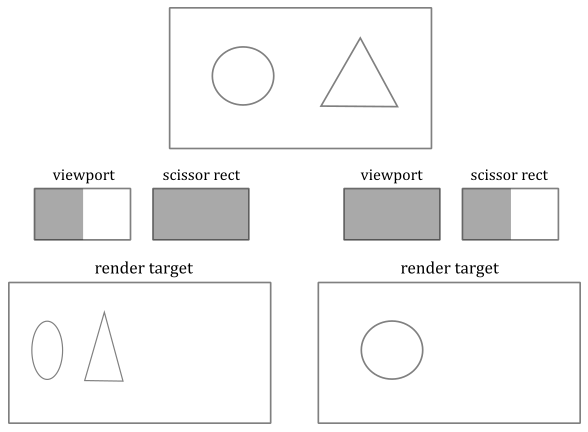

<br>

>The Vulkan specification states that viewport and scissor can be set in a command buffer (by recording the corresponding commands as illustrated in the code above) when the graphics pipeline is created specifying that both will be treated as dynamic states of the pipeline. Fortunately, this also applies when a graphics pipeline is not used at all, as in the sample examined in this tutorial.

<br>

After recording the commands for the last subpass, we call **vkCmdEndRenderPass** to record a command that marks the end of the render pass instance. This triggers a transition for the framebuffer attachments to the final layout. In this case, the color attachment transitions from **VK_IMAGE_LAYOUT_COLOR_ATTACHMENT_OPTIMAL** to **VK_IMAGE_LAYOUT_PRESENT_SRC_KHR** for presentation to the windowing system.

**vkEndCommandBuffer** records a command that marks the end of recording for a command buffer.

<br>

**SubmitCommandBuffer** is responsible for submitting the command buffer just recorded to a GPU queue.

<br>

```cpp
void VKHelloWindow::SubmitCommandBuffer(uint32_t currentBufferIndex)
{
    // Pipeline stage at which the queue submission will wait (via pWaitSemaphores)
    VkPipelineStageFlags waitStageMask = VK_PIPELINE_STAGE_COLOR_ATTACHMENT_OUTPUT_BIT;
    // The submit info structure specifies a command buffer queue submission batch
    VkSubmitInfo submitInfo = {};
    submitInfo.sType = VK_STRUCTURE_TYPE_SUBMIT_INFO;
    submitInfo.pWaitDstStageMask = &waitStageMask;                                           // Pointer to the list of pipeline stages that the semaphore waits will occur at
    submitInfo.waitSemaphoreCount = 1;                                                       // One wait semaphore
    submitInfo.signalSemaphoreCount = 1;                                                     // One signal semaphore
    submitInfo.pCommandBuffers = &m_sampleParams.GraphicsCommandBuffers[currentBufferIndex]; // Command buffers(s) to execute in this batch (submission)
    submitInfo.commandBufferCount = 1;                                                       // One command buffer

    submitInfo.pWaitSemaphores = &m_sampleParams.ImageAvailableSemaphore;          // Semaphore(s) to wait upon before the submitted command buffers start executing
    submitInfo.pSignalSemaphores = &m_sampleParams.RenderingFinishedSemaphore;     // Semaphore(s) to be signaled when command buffers have completed

    VK_CHECK_RESULT(vkQueueSubmit(m_vulkanParams.GraphicsQueue.Handle, 1, &submitInfo, VK_NULL_HANDLE));
}
```

<br>

The **VkSubmitInfo** structure specifies the submission parameters for **vkQueueSubmit**. In particular,

- **commandBufferCount** is the number of command buffers to submit.

- **pCommandBuffers** is a pointer to an array of command buffer to submit, which is also referred to as a submission batch or simply a batch. The order in which command buffers appear in this array is used to determine their submission order, which does not itself define any execution order or memory dependency. That is, the GPU can execute the command buffers out of order unless explicit synchronization mechanisms are used (for example, semaphores, fences, pipeline barriers, or render passes).

- **waitSemaphoreCount** is the number of semaphores upon which to wait before executing the command buffers specified in **pCommandBuffers**.

- **pWaitSemaphores** is a pointer to an array of semaphore upon which to wait before the command buffer specified in **pCommandBuffers** begin execution.

- **signalSemaphoreCount** is the number of semaphores to be signaled once the commands specified in **pCommandBuffers** have completed execution.

- **pSignalSemaphores** is a pointer to an array of semaphore which will be signaled once all the command buffers specified in **pCommandBuffers** have completed execution.

- **pWaitDstStageMask** is a pointer to an array of pipeline stages at which each corresponding semaphore wait will occur.

<br>

**vkQueueSubmit** submits an array of command buffers to the queue passed as its first parameter. <br>
The third parameter is a pointer to an array of **VkSubmitInfo** structures, each specifying a command buffer submission batch. Batches begin execution in the order they appear in this array, but may complete out of order. If any command buffer submitted to this queue is in the executable state, it is moved to the pending state. And once the execution of a command buffer complete, it moves from the pending state, back to the executable state. <br>
The last parameter is an optional fence to be signaled once all submitted command buffers have completed execution.

<br>

>Observe that if **pWaitSemaphores** is not **NULL**, the command buffers in **pCommandBuffers** may start executing, but their execution may become blocked at some point, depending on the specified pipeline stages in **pWaitDstStageMask**, waiting for the semaphores specified in **pWaitSemaphores** to be signaled. <br>
If **pSignalSemaphores** is not **NULL**, the semaphores will not be signaled until all command buffers in **pCommandBuffers** have completed execution. <br>
After being signaled, semaphores are automatically reset to an unsignaled state, which enables us to reuse them again at the next submission.

<br>

Here, we have a single command buffer submitted to a queue belonging to the selected queue family. The GPU can begin executing the commands in the command buffer at any time after its submission. However, it must wait for the **pWaitSemaphores** to be signaled before proceeding to write the color attachment. This is crucial because, as previously explained, the image may still be in use by the presentation manager. <br>
We also set a semaphore for the **pSignalSemaphores** field to allow the presentation manager to determine when the GPU has finished executing the commands in the command buffer. This ensures that an image is not presented to the windowing system until all commands have been executed. 

<br>

**PresentImage** is responsible for presenting images to the presentation engine.

<br>

```cpp
void VKHelloWindow::PresentImage(uint32_t imageIndex)
{
    // Present the current image to the presentation engine.
    // Pass the semaphore from the submit info as the wait semaphore for swap chain presentation.
    // This ensures that the image is not presented to the windowing system until all commands have been executed.
    VkPresentInfoKHR presentInfo = {};
    presentInfo.sType = VK_STRUCTURE_TYPE_PRESENT_INFO_KHR;
    presentInfo.pNext = NULL;
    presentInfo.swapchainCount = 1;
    presentInfo.pSwapchains = &m_vulkanParams.SwapChain.Handle;
    presentInfo.pImageIndices = &imageIndex;
    // Check if a wait semaphore has been specified to wait for before presenting the image
    if (m_sampleParams.RenderingFinishedSemaphore != VK_NULL_HANDLE)
    {
        presentInfo.waitSemaphoreCount = 1;
        presentInfo.pWaitSemaphores = &m_sampleParams.RenderingFinishedSemaphore;
    }

    VkResult present = vkQueuePresentKHR(m_vulkanParams.GraphicsQueue.Handle, &presentInfo);
    if (!((present == VK_SUCCESS) || (present == VK_SUBOPTIMAL_KHR))) 
    {
        if (present == VK_ERROR_OUT_OF_DATE_KHR)
            WindowResize(m_width, m_height);
        else
            VK_CHECK_RESULT(present);
    }
}
```
<br>

The **VkPresentInfoKHR** structure specifies the presentation parameters for **vkQueuePresentKHR**. In particular,

- **pSwapchains** is a pointer to an array of swapchains to which the images specified in **pImageIndices** will be presented. A given swapchain must not appear in this list more than once.

- **pImageIndices** is a pointer to an array of indices into the array of each swapchain’s presentable images. Each entry in this array identifies the image to present on the corresponding entry in the **pSwapchains** array.

- **pWaitSemaphores** is **NULL** or a pointer to an array of semaphores to wait for before issuing the present request.

<br>

In this case we pass the semaphore from the submit info as the wait semaphore for swapchain presentation. This ensures that the image is not presented to the presentation engine until all commands in the command buffer have been executed. Observe that before an application can present an image, the image’s layout must be transitioned to the **VK_IMAGE_LAYOUT_PRESENT_SRC_KHR** layout. That's why we set the color attachment to automatically transition to **VK_IMAGE_LAYOUT_PRESENT_SRC_KHR** at the end of the render pass.

**vkQueuePresentKHR** queues images for presentation. <br>
Queueing an image for presentation defines a set of queue operations (that is, additional commands appended to the GPU queue), including waiting on the semaphores and submitting a presentation request to the presentation engine. However, the scope of this set of queue operations does not include the actual processing of the image by the presentation engine. That's why we pass a queue handle as the first parameter of **vkQueuePresentKHR**: for queuing these additional operations to be executed. And that's why we need a queue that support presentation to a surface.

If the presentation request is rejected by the presentation engine with an error **VK_ERROR_OUT_OF_DATE_KHR** (which can happen if the window is resized), the images in the swapchain no longer matches the surface properties and the presentation engine can't present them, so that the application needs to create a new swapchain that matches the surface properties.

<br>

When the user close the window of the Vulkan sample, the application calls **OnDestroy** and exits the render loop.

<br>

```cpp
void VKHelloWindow::OnDestroy()
{
    m_initialized = false;

    // Ensure all operations on the device have been finished before destroying resources
    vkDeviceWaitIdle(m_vulkanParams.Device);

    // Destroy frame buffers
    for (uint32_t i = 0; i < m_sampleParams.Framebuffers.size(); i++) {
        vkDestroyFramebuffer(m_vulkanParams.Device, m_sampleParams.Framebuffers[i], nullptr);
    }

    // Destroy swapchain and its images
    for (uint32_t i = 0; i < m_vulkanParams.SwapChain.Images.size(); i++)
    {
        vkDestroyImageView(m_vulkanParams.Device, m_vulkanParams.SwapChain.Images[i].View, nullptr);
    }
    vkDestroySwapchainKHR(m_vulkanParams.Device, m_vulkanParams.SwapChain.Handle, nullptr);

    // Free allocated command buffers
    vkFreeCommandBuffers(m_vulkanParams.Device, 
                         m_sampleParams.GraphicsCommandPool,
                          static_cast<uint32_t>(m_sampleParams.GraphicsCommandBuffers.size()), 
                          m_sampleParams.GraphicsCommandBuffers.data());

    vkDestroyRenderPass(m_vulkanParams.Device, m_sampleParams.RenderPass, NULL);

    // Destroy semaphores
    vkDestroySemaphore(m_vulkanParams.Device, m_sampleParams.ImageAvailableSemaphore, NULL);
    vkDestroySemaphore(m_vulkanParams.Device, m_sampleParams.RenderingFinishedSemaphore, NULL);

    // Destroy command pool
    vkDestroyCommandPool(m_vulkanParams.Device, m_sampleParams.GraphicsCommandPool, NULL);

    // Destroy device
    vkDestroyDevice(m_vulkanParams.Device, NULL);

    // Destroy surface
    vkDestroySurfaceKHR(m_vulkanParams.Instance, m_vulkanParams.PresentationSurface, NULL);

    // Destroy debug messanger
    if ((VKApplication::settings.validation)) 
    {
        pfnDestroyDebugUtilsMessengerEXT(m_vulkanParams.Instance, debugUtilsMessenger, NULL);
    }

#if defined(VK_USE_PLATFORM_XLIB_KHR)
    XDestroyWindow(VKApplication::winParams.DisplayPtr, VKApplication::winParams.Handle);
    XCloseDisplay(VKApplication::winParams.DisplayPtr);
#endif

    // Destroy Vulkan instance
    vkDestroyInstance(m_vulkanParams.Instance, NULL);
}
```
<br>

Here, we need to destroy the Vulkan objects that were created during initialization and deallocate any allocated resources. <br>
At that point, the control flow returns to the entrypoint, which terminates the application.

<br>

<br>

# 5 - Conclusions

And that's it. As you may have noticed, even creating a simple window as the basis for Vulkan rendering operations can be quite involved, as it requires a significant amount of knowledge and code. However, once you've learned how to display a window on the screen, you will have a solid foundation for building any Vulkan application.

Although this tutorial may have presented some challenges, if you've made it through, you'll be pleased to know that you've already made significant progress in learning Vulkan. Indeed, it is often said that Vulkan has a steep learning curve, but I like to think of it more as a staircase with decreasingly smaller steps. By completing this first tutorial, you have climbed the first step and overcome the most significant obstacle. From this point onward, things can only get easier.

<br>

>If you set **Settings::vsync** to **true**, then the presentation mode selected will be FIFO. In that case, the title bar will display an FPS count that matches the refresh rate of the monitor. However, if **vsync** is set to **false**, the FPS count will be much higher, even if the selected presentation mode id Mailbox, which still requires the presentation manager to wait for the next v-sync before showing a new image on the screen. This is because the FPS counter implemented in this demo counts the frames created on the CPU timeline, rather than those actually displayed on the screen. Additional information will be provided in an upcoming tutorial, where we will also discuss frame buffering and latency.

<br>

<br>

Source code: [LearnVulkan](https://github.com/PAMinerva/LearnVulkan)

<br>

# References

[1] [Vulkan API Specifications](https://registry.khronos.org/vulkan/) <br>
[2] [Vulkan Guide](https://github.com/KhronosGroup/Vulkan-Guide) <br>
[3] [Vulkan Loader](https://github.com/KhronosGroup/Vulkan-Loader) <br>
[4] [Vulkan Tools](https://github.com/KhronosGroup/Vulkan-Tools) <br>
[5] [Vulkan Samples](https://github.com/KhronosGroup/Vulkan-Samples) <br>
[6] [Sascha Willems on GitHub](https://github.com/SaschaWillems) <br>

<br>

***
If you found the content of this tutorial somewhat useful or interesting, please consider supporting this project by clicking on the **Sponsor** button.  Whether a small tip, a one time donation, or a recurring payment, it's all welcome! Thank you!<br><br>
<p align="center">
 <a href="https://github.com/sponsors/PAMinerva">
         
      </a>
</p><br>