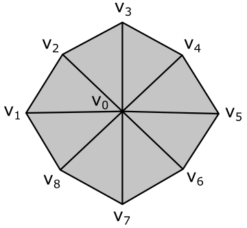
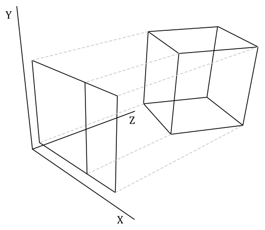
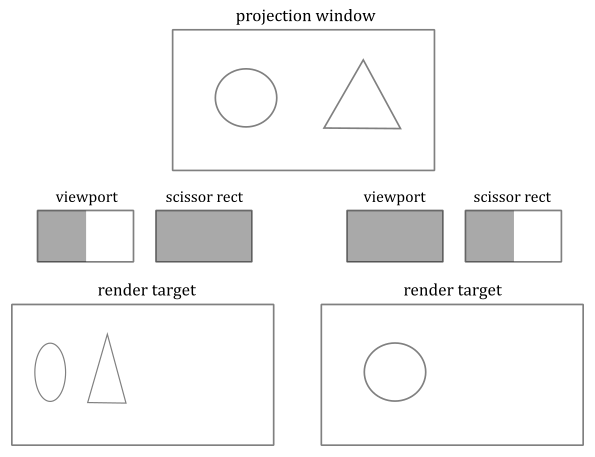
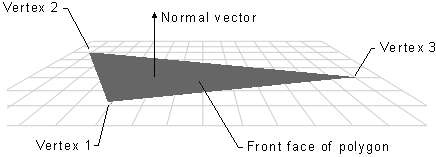
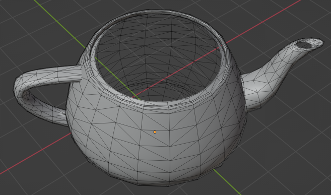

# vk01.B - Hello Triangle

<br>


<br>

# 1 - Introduction

This tutorial builds on the concepts covered in the previous one. Therefore, to get the most out of this tutorial, I highly recommend completing the previous one first, if you haven't already done so.

In this tutorial, we will be examining a sample called **VKHelloTriangle** that draws a triangle on the render target and present it to the user's screen. The related source code can be found in the repository hosting the code for this tutorial series (the link is provided at the end of the tutorial). Although the code for this sample is very similar to that of **VKHelloWindow**, there is still much to explain. This is because we will be using a graphics pipeline to draw on the render target.

If you are familiar with video games, you know that the image you see on the screen is only a 2D representation of 3D geometries composed of polygons, often triangles, defined by vertex locations in a 3D space.

<br>


<br>

It can be stated that the essence of computer graphics is to create a 2D representation of a 3D scene. This is achieved by processing 3D geometries through a graphics pipeline, which will be briefly discussed in the next section.

In the figure below, you can see a 3D scene projected onto a 2D rectangle called projection window that lies on a plane in front of a special viewpoint called camera. You can think of a 2D projection window as the film of a camera, or the retina of the human eye, that captures light and allows to create a 2D representation of a 3D scene. Ultimately, this 2D representation is mapped to a render target, which in turn is mapped to a window's client area.

<br>


<br>

You can easily guess that the camera should only capture a particular region of the 3D scene (i.e., usually we won't capture the entire 3D scene). The extent of the region captured can be controlled in a similar way to how we set the field of view of a camera lens when we want to take a picture. However, in computer graphics, the film is usually in front of the camera lens, not behind.

Eventually, the image captured by a projection window can be displayed on the user's monitor, which is a raster display. This means that the screen can be viewed as a two-dimensional grid of small dots called pixels. Each pixel displays a color that is independent of other pixels. When we render a triangle on the screen, we don't actually render the triangle as a single entity. Instead, we light up the group of pixels that are covered by the triangle's area.

<br>


<br>

<br>

>Note that a physical pixel is a square with an area, but its coordinates refer to a specific point (usually the top-left corner of the pixel). However, GPU calculations and sampling operations often occur at the center of the pixels. When we describe a monitor as a 2D grid of dots, we are actually referring to rows and columns intersecting at pixel coordinates. The same considerations also apply to textures, which can be seen as grids of texels (texture elements) with an area, whose coordinates refer to a specific point within the texel's area. The terms image and texture are often synonymous. However, in the jargon of Vulkan, an image refers to a multidimensional array of data that can be used for various purposes, such as attachments and textures. Additional information will be provided in an upcoming tutorial.

<br>

In the next section, we will briefly discuss what a graphics pipeline is and how it can be used to draw on a render target.

<br>

<br>

# 2 - Vulkan pipelines

GPUs are equipped with thousands of programmable cores, which means that they can execute programs in the form of instructions provided by a programmer, much like how CPU cores run C++ applications. As illustrated below, CPUs typically have fewer cores than GPUs. However, GPU cores are smaller and more specialized in processing tasks that can be divided up and processed across many cores. In other words, GPUs leverage parallelism to execute the same instructions on multiple cores simultaneously, resulting in high-speed processing of vast amounts of data. On the other hand, CPUs excel at executing many sequential instructions on each core to execute multiple tasks on small data really fast.

<br>

 <br>
CPU (on the left) versus GPU (on the right)

<br>

However, the way GPUs actually work doesn't often make it easy for programmers to create graphics applications. To simplify the process, Vulkan provides various pipelines, which can be considered as levels of abstraction to hide the low-level details and allow programmers to create graphics applications in a more convenient way. Here, by graphics applications, I mean any application that is able to use the GPU to perform its tasks, which can go far beyond merely rendering 3D geometries on the screen.

In the previous tutorial, it was mentioned that there are various types of commands that can be recorded in a command buffer: graphics, compute, transfer, sparse binding, etc. Graphics and compute commands are recorded to be ideally sent through a processing pipeline. The Vulkan specifications defines three pipelines: graphics pipeline, compute pipeline and ray tracing pipeline. The following figure shows a block diagram of the Vulkan pipelines.

<br>


<br>

On the left, you can see the graphics pipeline, which provides the highest level of abstraction for how GPUs work. The graphics pipeline is ideal for applications that need to render geometries on a render target to be presented to the user. This pipeline will be the main focus of this tutorial series. Later in this section, I will briefly explain each of the stages that compose it. <br>
In the middle (in gray), you can see the resources used by the stages of the various pipelines. <br>
Then, we have another type of graphics pipeline, called mesh shading graphics pipeline, which provides a lower level of abstraction than the previous one. I will cover this graphics pipeline in a later tutorial. <br>
Lastly, we have the compute pipeline, which includes a single shader stage and offers the lowest level of abstraction. Indeed, the term compute is used instead of graphics because this pipeline allows to execute the same operations on different GPU cores, potentially in parallel, regardless of whether the end goal is to draw geometries and present the result to the user. I will also cover this pipeline in a later tutorial. <br>
The ray tracing pipeline is not illustrated in the figure above, and we are not interested in this pipeline right now.

<br>

**Pipeline States**

Each pipeline is represented by a pipeline object created from a description of the programmable and fixed-function stages the pipeline needs to use. A pipeline object is bound to a command buffer during command recording to define the pipeline states at the time of the execution of that command buffer by the GPU. Indeed, pipeline states are stored in the context of a command buffer and referred to as command buffer state (which includes the shader programs of the programmable stages, the settings of the fixed-function stages, the render pass and the associated framebuffer with the input and output attachments, etc.). <br>
The pipeline object is large and complex, as it holds numerous pipeline states. However, in many graphics applications, it is essential to change some states frequently. Creating a new pipeline object for every state change would lead to managing a very large number of objects in your application. To make fine-grained state changes more manageable, Vulkan allows marking specific parts of the pipeline as dynamic, which enables updating them on the fly by recording commands directly into the command buffer rather than using a pipeline object. However, by doing so, it reduces Vulkan's opportunity to optimize or absorb parts of the state. Therefore, it's necessary to specify precisely which state you want to make dynamic. <br>
Any pipeline state that is specified as dynamic doesn’t overwrite the command buffer state when the pipeline object is bound but is instead applied to the command buffer state when the corresponding commands are executed on the GPU timeline. On the other hand, any static state is stored in the pipeline object and overwrites the command buffer state when the pipeline object is bound. No state, static or dynamic, is inherited from one command buffer to another. <br>
If you set a dynamic state when a pipeline object with that state set as static is currently bound, the results are undefined if you draw with that pipeline. Setting dynamic state and then binding a pipeline object with that state marked as dynamic should cause the dynamic state to be used. However, it’s good practice to bind the pipeline first and then set any state to avoid the possibility of undefined behavior.

<br>

## 2.1 - The graphics pipeline: an overview

GPUs that support Vulkan can execute programs on their cores to perform the work of the stages that compose the graphics pipeline. In this context, the cores of the GPU are often referred to as shader cores, since they run specific programs known as shader programs, or simply shaders, for the programmable stages of the pipeline. At times, the term shader can refer to both the programmable stage and the program it executes, but the context of use should make the distinction clear. Anyway, a graphics pipeline defines the steps needed to draw something on a render target. In particular, the following image shows all the stages that a graphics pipeline can use to draw on a render target by using the Vulkan API.

<br>


<br>

Programmable stages are capable of executing programs written in a shader language such as GLSL or HLSL, which are similar to the C language. Configurable stages, represented by the gray rectangles with gear wheels in the illustration above, cannot be programmed; they always execute the same code, but their state can be configured. This means that you cannot specify what a configurable stage does, but you can still specify how it performs its task. For this reason, they are often referred to as fixed-function stages.

Data flows from the input to the output of each stage. In other words, each stage consumes input from the previous stage and provides its output to the next stage, which can then use it as input.

- **Input-Assembler Stage** - The input assembler is responsible for supplying data to the pipeline in a specific order. This stage takes its input from user-filled buffers in memory that contain arrays of vertices (and often also indices), and from those buffers it assembles primitives (triangles, lines and points) to pass to the next stage, vertex by vertex.
  
- **Vertex Shader Stage** - The vertex shader processes vertices from the input assembler, potentially in parallel. It typically performs operations such as transformations, skinning, and per-vertex lighting. A vertex shader always takes one vertex as input and return one vertex as output. So, a vertex shader needs to run multiple times to process all the vertices of the primitives assembled by the input assembler. Although, the last processed vertices are typically cached in memory. This caching mechanism improves performance by avoiding redundant processing. Indeed, if a vertex in input to the vertex shader has already been processed and cached, the cached version of the vertex is retrieved to pass vertex data to the next stage instead of executing the vertex shader again. This optimization can significantly reduce the processing workload and improve the overall performance of the graphics pipeline.

- **Tessellation Control Shader Stage** - The tessellation control shader (TCS) is an optional stage that operates per patch. A patch is a set of control points whose interpolation defines a piece of curve or surface. You can use this stage with patches from the input assembler (after all control points in the patch are processed by a vertex shader). The tessellation control shader can transform input control points into output control points. Indeed, it is invoked at least once for each point in the output patch. The invocations corresponding to a given patch execute logically in parallel, with undefined relative execution order. Also, the TCS can perform other setup for the fixed-function Tessellation Primitive Generator stage. For example, the TCS can output tessellation levels, which are numbers that indicate how much to tessellate.

- **Tessellation Primitive Generator Stage** - The Tessellation Primitive Generator (TPG) is an optional fixed-function stage whose operation is defined by the Tessellation Control Shader. That is, the TPG operates once per patch that is output by the TCS. The purpose of the TGP stage is to sample the domain (quad, triangle, or line) of the patch by tessellating it. The tessellation levels specified by the TCS notify the TGP how much to tessellate (that is, dividing a geometric shape into smaller pieces) over the domain of the patch.

- **Tessellation Evaluation Shader Stage** - The Tessellation Evaluation Shader (TES) is an optional stage invoked once per sample produced by the TGP. Each invocation gets the coordinates of the sample over the domain of the patch, as well as output control points produced by the TCS. The role of the TES is to turn the sample coordinates into something tangible (such as, a vertex position in 3D space), which can be sent down the pipeline for further processing.

- **Geometry Shader Stage** - The geometry shader is an optional stage that processes entire primitives. That is, its input can be three vertices for a triangle, two vertices for a line, or a single vertex for a point. The geometry shader supports limited geometry amplification and de-amplification. Given an input primitive, the geometry shader can discard the primitive, or emit one or more new primitives.

- **Transform Feedback** - The transform feedback must be explicitly activated as a fixed stage of the pipeline. In that case, vertex outputs from the last shader before rasterization can be written out to one or more transform feedback buffers bound to the command buffer. Data streamed out to transform feedback buffers can be recirculated back into the pipeline as input data for the input assembler, or read-back from the application.

- **Rasterizer Stage** -  The rasterizer is responsible for converting primitives into raster images consisting of fragments, a process known as rasterization. These fragments are then passed on to the subsequent stages of the pipeline for processing, which determines how and whether they can be stored as pixels in the render target. As part of the rasterization process, the per-vertex attributes are interpolated to calculate the per-fragment attributes across each primitive (a vertex is essentially a collection of attributes). Additionally, the rasterizer takes into account the viewport and scissor rectangles when performing its task. Further details will be provided in later sections of this tutorial.

- **Fragment Shader Stage** - The fragment shader receives interpolated attributes for each fragment of a rasterized primitive generated by the rasterizer and returns per-fragment data, such as a color, that can be possibly stored as a pixel in the render target; it depends on the last stage of the pipeline. The fragment shader allows to enable sophisticated shading techniques, including per-pixel lighting and post-processing, to enhance the overall visual quality of the rendered image.

- **Per-Fragment Operations** - This is the final step in determining which fragments are visible, through depth-stencil testing, and how to blend them with the pixel colors in the render target, if at all. Specifically, it is responsible for combining various types of output data, such as the fragment shader returned values, depth, stencil, and blend information, with the contents of the render target and depth/stencil buffer to generate the final result of the pipeline.

<br>

As shown in the figure above, many stages can read resources from GPU memory as part of their input, in addition to the data received from the previous stage. Some stages can also write their output to GPU memory. The small squares at the bottom right of some stages represent the binding points where GPU resources can be bound to be accessed by the shader programs. Indeed, the presence of terms like **VSMAIN**, **PSMAIN**, etc. suggests that programmable stages execute shader code. On the left of each stage, you can find a visual description of the task that the stage typically performs.

<br>

>Please note that binding points are not physical blocks of memory or registers that the GPU can access to read resources. They are simply numbers used for linkage purposes to associate descriptors with resource declarations in shader programs (more on this shortly). However, I still have included them as small squares associated with pipeline stages in the illustration above for convenience.

<br>

>Tessellation Control Shader, Tessellation Primitive Generator and Tessellation Evaluation Shader together form the Tessellation stage. They are optional and we won’t use them for a while. The same goes for the Geometry Shader and the Transform Feedback stages. So, don't worry if you didn't fully grasp the definitions provided above. We will cover each of these stages in depth in dedicated tutorials later.

<br>

The depth buffer is a image used as an attachment for a render pass, similar to a swapchain image (in fact, both should be the same size and included in a framebuffer object describing the input and outputs of a render pass, as explained in the previous tutorial). The depth buffer stores depth information that indicates the distance of each visible pixel from the projection window. When we use the graphics pipeline to render 3D primitives on a render target, the Per-Fragment Ops stage can utilize the depth buffer to determine how the fragments of rasterized polygons occlude one another. <br>
Usually, the stencil buffer is paired with the depth buffer, meaning that both can share the same buffer in memory by using different bits. The stencil buffer stores stencil information that can mask the rendering operations onto a render target to produce special effects like dissolves, decaling, and outlining. We will discuss the stencil buffer in more detail in a later tutorial.

<br>


<br>

We already know that the projection window is eventually mapped to a render target. Let's assume for a moment that we are directly drawing on the render target (that is, without passing through the projection window). In that case, the render target lies in the plane defined by the X- and Y-axes as it acts as a projection window, which always lies in the XY-plane of a particular 3D space (we will discuss this in more detail in a later tutorial). The Z-axis is used to measure the depth of both pixels and fragments, representing their distance from the XY-plane. <br>
As you can see, the pixel of the render target in the figure above will store the color of the yellow square, which occludes the fragment of the red triangle. Indeed, the value stored in the corresponding texel of the depth buffer (i.e., at the same position of the pixel in the render target) represents the depth of the nearest fragment, which in this case is the one of yellow square. Therefore, if the depth test is enabled in the Per-Fragments Ops stage, the fragment of the triangle will be discarded. However, if the depth test is disabled, the pixel of the render target will store the last fragment processed by the fragment shader, since it will always overwrite whatever color is stored in that pixel. Note that if blending is also enabled, the fragment color will be blended with the corresponding pixel color in the render target instead of being stored (overwritting the old value).

The following figure shows a generic programmable stage.

<br>


<br>

- **Input Data**: A vertex shader receives its input from the input assembler stage; geometry and fragment shaders receive their inputs from the previous stage. Usually, this input consists of multiple values called attributes that describe, for example, the position, color, or texture coordinates for a vertex or a fragment. A shader can also have some built-in input variables that can be used to communicate with fixed-function pipeline stages, and optionally with other shaders. Additional information will be provided in this and upcoming tutorials.

- **Output Data**: Shaders generate output results to be passed on to the subsequent stage in the pipeline. A shader can also have some built-in output variables that can be used to communicate with fixed-function pipeline stages, and optionally with other shaders.

- **Shader Code**: Shader programs can read from memory, perform vector floating point and integer arithmetic operations, or flow control operations. Shader programs can be written in a high-level shader language such as GLSL or HLSL, which are procedural languages that share similarities with the C programming language.

- **Buffers**: A buffer is a group of fully-typed data organized into a block that can be accessed for reading or writing by a shader.

- **Uniforms**: An uniform is essentially a variable or buffer that remains constant across multiple invocations of the same shader program as a result of the execution of a draw command.

- **Samplers**: Samplers define how to sample and filter textures.

- **Textures**: Textures are multidimensional arrays of data (1D, 2D, or 3D) that can be accessed from a shader using a sampler that defines how to sample and filter the texture.

<br>

This section has provided only a brief overview of the graphics pipeline, so don't worry if you're feeling a bit confused at the moment. We will delve deeper into each stage that makes up the graphics pipeline in the following sections and upcoming tutorials to provide a more comprehensive explanation.

<br>

<br>

# 3 - Resource management

In Vulkan applications, we can create objects representing specific resources, such as buffers and images. Typically, this is a two-step process. Firstly, we create the Vulkan object that represents a resource from the perspective of our application. Then, we allocate device memory to store that resource. If necessary, we must also create the corresponding view that enables our application to describe the resource to the GPU. Additionally, we declare resource variables in the shader code and bind the actual resources to these variables in some way. In this section, I will provide a brief overview of the key concepts involved in creating and binding resources.

<br>

## 3.1 - Memory

Vulkan provides two types of memory: host and device. <br>
Host memory is CPU-visible memory that may be used to store the implementation’s representation and state of Vulkan objects. Vulkan provides applications the opportunity to perform host memory allocations on behalf of the Vulkan implementation. If you are not interested in taking advantage of this opportunity, the implementation will perform its own memory allocations. Right now, we are not interested in managing host memory, and that's why we will pass **nullptr** to every Vulkan function requiring a **pAllocator** parameter, which tells Vulkan to use its own internal allocator. <br>
On the other hand, vulkan objects representing resources such as buffers and images require some amount of device memory to be explicitly allocated from the application. This is the GPU-visible memory where the resource data is stored.

<br>

### 3.1.1 - Device memory

Device memory denotes memory that is available to the device and can be used to store textures and other shader resources (that is, resources used by shader programs) that require fast GPU access. This memory is classified into types, each of which has a set of properties that describes caching flags and coherency behavior between the host (the CPU upon which the Vulkan application is running) and the device. Each memory type is backed by a region within a memory heap, and a system can have several such heaps. At the same time, each memory heap can include more than one memory type, so that we can use the same heap with a variety of different properties.

<br>


<br>

If you have a discrete GPU installed on your computer, which is usually found in the form of a graphics card connected to a PCI-Express slot, it will come with its own dedicated memory that is physically built into the graphics board. Some of this memory may only be accessible to the device, while another portion of the memory can be accessed by the host through the PCI-e bus. Additionally, the GPU can access some or all of the host's system memory through the same bus. All of these pools of memory will appears as heaps in the GPU-visible memory, each including different memory regions with different properties that can be mapped into different memory types. For example, in the image above, device memory consists of at least three memory heaps: system memory, device-local memory, and CPU-visible device-local memory. Each of these memory heaps can, in turn, include one or more memory types.

On the other hand, integrated GPUs such as those found in embedded systems, mobile devices, or even laptops, typically share memory with the host processor. That is, CPU and GPU will share the only memory available: usually the system memory (RAM). This configuration is referred to as a unified memory architecture, which may result in fewer memory heaps being exposed (probably just one). Therefore, if you are using an integrated graphics card, it is likely that your GPU will use the system's RAM as VRAM. This can result in slower access times compared to dedicated VRAM since GPUs typically use wider buses at a higher memory clock rates, which maximize memory bandwidth more effectively than CPUs.

Vulkan provide some bit values that can be combined in a flag to describe the properties of several memory types. In particular:

- **VK_MEMORY_PROPERTY_DEVICE_LOCAL_BIT** indicates that the memory is physically located on the graphics card (i.e., it is dedicated VRAM). Device local memory is the most efficient for the device to access, which is why we will use it to allocate memory for shader resources exclusively accessed by the GPU via shader programs. If this bit is not set, then the memory can be assumed to be local to the host.

- **VK_MEMORY_PROPERTY_HOST_VISIBLE_BIT** indicates that memory allocated from this type can be mapped by the host for reading or writing operations on the CPU timeline. The lack of this bit indicates a memory type that cannot be accessed directly by the host, as it is reserved exclusively for the use of the device.

- **VK_MEMORY_PROPERTY_HOST_COHERENT_BIT** indicates that the memory can be accessed concurrently by both the host and device, and any access made by either will be coherent. This means that writes performed by the device will be visible to the host, and vice versa, without requiring the explicit flushing of cached memory. Indeed, the absence of this flag may result in the device or host not being able to see the results of each other's writes until cache lines are explicitly flushed.

- **VK_MEMORY_PROPERTY_HOST_CACHED_BIT** indicates that the data in this memory is cached by the host. As a result, read accesses by the host to this type of memory are typically faster compared to cases where this bit is not set. However, device accesses may be slower since cache lines need to be flushed (before a GPU read) or invalidated (after a GPU write).

<br>

## 3.2 - Resources and views

In Vulkan there are two primary resource types: buffers and images. <br>
A buffer is a basic, linear block of data that can be used to store data structures, raw arrays, and even image data, if desired. In contrast, images are complex, multidimensional arrays of data with a specif memory layout, which require type and format information to enable shader programs to access their elements through advanced functions for reading from and writing to them.

As stated earlier, both buffer and image resources are created in two steps: first, the vulkan object representing the resource is created, and then the physical memory backing it needs to be allocated. This design allows the application to take control of memory management by supplying its own memory allocator when necessary. While images are more complex structures, the process for creating them is similar to that of buffers. We will explore the different uses of these resources and the techniques for creating them as we introduce the sample code analyzed later in this tutorial.

Resource views can be created and used to select a specific portion of the corresponding resources, reinterpret their contents, or use them for multiple purposes. While buffers are relatively simple resources and do not have any intrisic understanding of the format of their contained data, buffer views do allow for the inclusion of such information for buffers when required. Indeed, part of the information included in buffer and image views describes the format of the resource data, which specifies the memory required to store the resource and how to interpret its elements (known as texels if the resource represents a texture). Certain formats have unique requirements or limitations on their use in various parts of the pipeline. For instance, some formats may be readable but not writable, which is common for compressed formats. <br>
Buffer views are used to permit shaders to access buffer contents as if they were images consisting of texels, which is why they are also referred to as texel buffer views. However, in many cases, it is unnecessary to create buffer views since buffers are often fully defined in the shader code, which allows the device to know how to access it. More information on this topic will be covered in an upcoming tutorial. <br>
On the other hand, images are not fully defined in shader programs. As a result, it is typically necessary to create an image view for each image used by our application, in order to inform the device how to access the corresponding image through resource declarations in the shader code.

<br>

**Image layouts**

Images are stored in implementation-dependent opaque layouts in memory. Each layout may provide optimal performance for a specific usage of image memory. For instance, an image used as a color attachment should have a memory layout that offers optimal performance for rendering, which may differ from an image used as a source or destination in transfer operations. Typically, the image layout is per-image subresource: separate image subresources of the same image can be in different layouts simultaneously. At any given time, the data representing an image subresource in memory exists in a particular layout, which is determined by the most recent layout transition that was performed on that image subresource. Applications have control over the layout of each image subresource and can transition an image subresource from one layout to another to achieve optimal performance when the image subresource is used for multiple types of operations. Transitions can occur with an image memory barrier or as part of a subpass dependency within a render pass (as explained in the previous tutorial).

The image below shows some of the layouts that Vulkan implementations can use to store images in memory. However, Vulkan hides the low-level details by letting applications only specify the image usage and an image memory barrier for a set of access operations. This allows a Vulkan implementation determine the most efficient memory layout for that usage.

<br>


<br>

## 3.3 - Binding

Of course, shader programs also need to access resources stored in device memory. For example, in GLSL (the OpenGL Shading Language used to write the shader programs in this tutorial series) you can declare the following variable:

<br>

```glsl
layout(set = 0, binding=0) uniform sample2D diffuseTex;
```
<br>

This declaration specifies that **diffuseTex** is a uniform variable of type **sample2D**. This means that we can use this variable to read from a 2D texture using a 2D sampler, as **sample2D** allows to combine both a texture and a sample in a single declaration. The **layout** qualifier helps to indicate where the variable's data come from. In this case, the **layout** qualifier specifies that **diffuseTex** is backed by memory that stores a descriptor from the first descriptor set (index 0) bound to the command buffer. And in particular, the descriptor associated with the first binding point (index 0) of the shader stages that will execute the shader programs including the declaration above.

<br>

### 3.3.1 - Descriptors

A descriptor is an opaque data structure representing a resource in a shader program executed by the GPU. It includes information about the type, dimensions, GPU virtual address, and other hardware-specific details. In Vulkan, there are various descriptor types available to represent different types of resources and their usage. In particular:

- A **storage image** is a descriptor type associated with an image resource via an image view that load, store, and atomic operations can be performed on.

- A **sampler descriptor** is a descriptor type associated with a sampler object, used to control the behavior of sampling operations performed on a sampled image.

- A **sampled image** is a descriptor type associated with an image resource via an image view that sampling operations can be performed on.

- A **combined image sampler** is a single descriptor type associated with both a sampler and an image resource, combining both a sampler and sampled image into a single descriptor.

- A **uniform texel buffer** is a descriptor type associated with a buffer resource via a buffer view that image sampling operations can be performed on. Uniform texel buffers define a tightly-packed 1-dimensional linear array of texels.

- A **storage texel buffer** is a descriptor type associated with a buffer resource via a buffer view that image load, store, and atomic operations can be performed on. Storage texel buffers define a tightly-packed 1-dimensional linear array of texels.

- A **storage buffer** is a descriptor type that is directly associated with a buffer resource, using the corresponding vulkan object instead of a buffer view. This buffer resource is described in a shader program as a structure with various members that load, store, and atomic operations can be performed on.

- A **uniform buffer** is a descriptor type that is directly associated with a buffer resource, using the corresponding vulkan object instead of a buffer view. This buffer resource is described in a shader program as a structure with various members that load operations can be performed on.

- An **inline uniform block** is almost identical to a uniform buffer, and differs only in taking its storage directly from the descriptor instead of being backed by buffer memory. That is, the uniform data is inlined in the descriptor.

- A **dynamic uniform buffer** is almost identical to a uniform buffer, and differs only in how the offset into the buffer is specified. To a base offset provided during descriptor creation is added a dynamic offset when binding the corresponding descriptor set. This allows to offset into one or more uniform buffers stored in a single, large memory buffer described by a single descriptor. By doing so, we can reduce the number of descriptors required in a descriptor set and optimize memory writes by only performing partial updates to that memory.

- A **dynamic storage buffer** is almost identical to a storage buffer, and differs only in how the offset into the buffer is specified. To a base offset provided during descriptor creation is added a dynamic offset when binding the corresponding descriptor set. This allows to offset into one or more storage buffers stored in a single, large memory buffer described by a single descriptor. By doing so, we can reduce the number of descriptors required in a descriptor set and optimize memory writes by only performing partial updates to that memory.

- An **input attachment** is a descriptor type associated with an image resource via an image view that can be used within a framebuffer for load operations performed in fragment shaders.

<br>

As shown in the code snippet at the beginning of this section, shaders can access resources through variables decorated with set and binding numbers, which allow the variables to be connected to descriptors within descriptor sets. Indeed, descriptors are organized into descriptor sets, which are attached to a command buffer during command recording to be used in subsequent drawing commands. In other words, the resources that shaders access during a drawing command depend on the descriptor sets that are currently bound to the command buffer being executed by the GPU.

In Vulkan, it is not possible to create descriptor sets directly. Instead, they must be allocated from a designated pool known as a descriptor pool. Descriptor pools are externally synchronized, meaning that the application should not allocate and/or free descriptor sets from the same pool in multiple threads simultaneously. Once allocated, descriptor sets can be updated with a combination of write and copy operations on the CPU timeline to store\update the actual descriptors, or copy them from other descriptor sets.

The types and number of descriptors in each descriptor set is specified by a descriptor set layout, which is used to calculate the size of memory to allocate for the actual descriptor set. A descriptor set layout object is defined as an array of descriptor bindings, each specifying a descriptor type, the number of descriptors (of that type) that are associated with a specific binding point, and a set of shader stages in the pipeline that can access the corresponding resources from that binding point. This means that in the shader code you can also declare arrays of homogeneous resources. Additional information will be provided in this and later tutorials.

<br>

>If the descriptor type specified in a descriptor binding is a sampler descriptor or a combined image sampler, then you can optionally specify an array of sampler handles as part of the descriptor binding information. In that case, the sampler handles will be copied into the descriptor set layout and used to bind those samplers to descriptors automatically created in some static slots within the descriptor set. The application must not either create or update those descriptors explicitly because the sampler objects they refer to are considered immutable. Observe that only the sampler handles are copied; the sampler objects must not be destroyed before the final use of the set layout and any descriptor pools and sets created using it. Anyway, we are not interested in these low-level details righ now. I mention it here so that it is available for future reference.

<br>

### 3.3.2 - Pipeline Layout

A pipeline layout is composed by combining zero or more descriptor set layouts and zero or more push constant ranges (which will be discussed shortly). It describes the complete set of resources that can be accessed by a pipeline (i.e, by the shader programs executed by its stages). A pipeline layout is used to create one or more pipeline objects, and define the interface between the programmable stages of a pipeline and the shader resources used by those stages. Here, the term interface is used to indicate that a pipeline layout simply describes the type of resource variables declared in the shader programs executed by the programmable stages in a pipeline and where the data for those variables come from. <br>
As mentioned earlier, a pipeline object needs to be bound to the command buffer along with the descriptor sets holding the actual descriptors. This provide the GPU with all the information required to associate shader resource variables with descriptors that reference the actual resources in memory.

<br>


<br>

The figure above shows an example of a pipeline layout where the first descriptor set layout describes the descriptors within the first descriptor set bound to the command buffer (index $0$). In this case, there are three descriptor bindings in the first descriptor set layout. The first descriptor binding describes three sampled images that refer to three textures stored in device memory by using the binding point $0$. The second descriptor binding describes two sampler descriptors by using the binding point $1$, while the last descriptor binding describes a uniform buffer by using the binding point $2$. Therefore, you must have at least a shader program that interfaces those resources through some variable declarations, as shown in the listing below. As mentioned earlier, we can also have arrays of resources. Uniform buffers will be covered in an upcoming tutorial.

<br>

```glsl
layout(set=0, binding=0) uniform texture2D textures[3];
layout(set=0, binding=1) uniform sampler samp[2];

layout(std140, set=0, binding=2) uniform buff {
        mat4 MVP;
        vec4 position;
        vec4 color;
} ubuf;
```
<br>

>Remember that, once bound to the command buffer, the descriptor sets affects rendering of subsequent drawing commands. That is, they determine the actual resources accessed by the shaders via shader variables.

<br>

Descriptor sets compatible with the same descriptor set layout are considered to be interchangeable. As a result, an application can switch to a compatible descriptor set to allow the same pipeline stages (of the pipeline object currently bound to the command buffer) to access different resources.

An application can also switch between different pipeline objects and still use the same descriptor sets (currently associated with the command buffer) as long as the corresponding pipeline layouts are compatible. Two pipeline layouts are considered "compatible for push constants" if they were created with identical push constant ranges. Two pipeline layouts are considered "compatible for set N" if they were created with identically defined descriptor set layouts for sets zero through N, and if they were created with identical push constant ranges. Therefore, if you have a set of resources that you want to be available for multiple pipeline objects (maybe because they provide different shader programs to be executed for different operations), reference them from descriptors within the first set(s). On the other hand, resources that may change more frequently can be referenced from descriptors within higher-numbered sets. Push constants will be covered later in this section.

The pipeline layout allows the application to provide a consistent set of bindings across multiple pipeline compiles, which enables those pipelines to be compiled in a way that the implementation may cheaply switch pipelines without re-programming the bindings.

<br>

>As mentioned earlier, pipeline objects also include the shader code executed by programmable stages, which is provided in SPIR-V format, a binary intermediate representation for shader programs. Since it's pre-compiled, the driver can easily convert it to shader machine (GPU) code for a specific device during pipeline object creation. If an application creates multiple pipeline objects with the same pipeline layout, the driver can embed the same traversal details in the machine code to let the GPU know how to access resources through variable declarations. <br>
However, this pipeline construction can be computationally expensive, especially if the application needs to create lot of pipeline objects. For this reason, pipeline cache objects allow the result of pipeline constructions to be reused between pipelines and even between runs of an application. Reusing between pipelines is achieved by passing the same pipeline cache object when creating multiple related pipelines. Reusing across runs of an application is achieved by retrieving pipeline cache contents in one run of an application, saving them to a disk file, and then using that file to pre-initialize the pipeline cache on a subsequent run.

<br>


<br>

The above image should illustrate the general idea: we create descriptors of resources organized in one or more sets allocated in memory. Then we create a pipeline layout as an array of descriptor set layouts that describe how to bind descriptors to resource variables in the shader code. Then we create a pipeline object from that pipeline layout and bind it to the command buffer during command recording, along with the descriptor sets holding the actual descriptors. At that point, the subsequent drawing commands will start the execution of the pipeline, and its stages will be able to access the shader resources.

This mechanism allows a large number of resources to be bound with minimal computational cost because the exact set of resources used by a particular drawing command can be determined in advance, and the descriptor sets referring them created up front.

<br>

**Push constants**

Push constants allow the application to set values for shader variables without creating memory buffers. That is, a push constant can be used just like a uniform block, but rather than being backed by memory, its data can be pushed into the pipeline directly from a command buffer (rather than by write or copy operations on the CPU timeline to store the resource data; hence the term push constant).

Push constants are considered normal resources used by the pipeline stages, and therefore must be declared along with descriptor sets in the pipeline layout used for creating pipeline objects. When push constants are included in a pipeline layout, they may consume some of the resources that would otherwise use for descriptor bindings, which allow to bind even array of resources. As a result, for larger data structures, normal uniform blocks should be used instead, and push constants should be reserved for single integers or data that is updated very frequently.

In GLSL, a push constant declaration can be produced by declaring a uniform block with the **push_constant** layout qualifier. There can be only one such block declaration available per shader.

<br>

>Specialization constants are a mechanism whereby constants in a SPIR-V module can have their constant values specified at the time the pipeline object is created. Therefore, they are not part of the pipeline layout since the constants values are directly stored in the SPIR-V module compiled during pipeline object creation.

<br>

>Earlier we explained that shader SPIR-V bytecode is compiled into GPU machine code. While we won't delve into the specifics of how the driver performs this task, as it is implementation-specific and beyond the scope of this tutorial, we can briefly discuss the traversal details that the driver embeds in the machine code to let the GPU know how to access resources. <br>
In the case of push constants, there is typically no indirection involved. This means that an implementation may choose to load the constant data directly into GPU core registers, allowing the device to access the related values during the execution of the shader code without having to read memory. However, this approach can be resource-intensive as the constant data may need to be broadcasted to registers of all GPU cores executing the shader program that uses push constants. <br>
On the other hand, with descriptor sets we have a double level of indirection. This means that an implementation may load the GPU virtual address of a descriptor set into a register and the byte offset to a particular descriptor into another register, resulting in the device needing to read memory twice. First, to retrieve a descriptor, and second, to retrieve the related resource. As a result, accessing resources may take more time compared to push constants. However, descriptor sets offer more flexibility since they allow for the reference of multiple resources of different types. <br>
By using inline uniform blocks, you can reduce the indirection of descriptors by one. However, it's important to note that inline uniform blocks are provided as an extension in the current Vulkan specification.

<br>

<br>

# 4 - Graphics pipeline stages

This section will provide an overview of some of the stages in the graphics pipeline that were briefly discussed in section **2.1**. Specifically, we will focus on the stages used by the sample examined in this tutorial.

<br>

## 4.1 - Input Assembler

The input assembler is the initial stage of the pipeline. It assembles primitives (points, lines, triangles) from a couple of user-defined arrays (known as vertex and index buffers) and passes those primitives to the vertex shader, vertex by vertex. It’s a fixed-function stage, so we can only set up its state. In particular, we need to bind at least an array of vertices (the vertex buffer) and, optionally, an array of indices (the index buffer) that describe (primitive by primitive) one or more meshes we want to render. As we progress through this section, we will observe that the input assembler also requires additional information to execute its task effectively.

<br>

>Observe that the input assembler doesn't actually assemble primitives from the vertex buffer. Its main role is to pass vertex data to the vertex shader in a specific order, according to the input assembler state saved in the graphics pipeline object (more on this will be discussed shortly). As a result, the vertex shader will receive and process, one by one, the vertices of each primitive described in the vertex buffer, in the specific order designated by the input assembler. However, remember that the GPU can run the vertex shaders for the vertices of multiple primitives simultaneously in parallel.

<br>

### 4.1.1 - Meshes

A mesh is a geometrical structure composed of polygons\primitives (often triangles) which are defined by their vertices. Regardless of whether it is a complex model made with graphic modeling tools such as 3ds Max or Blender, or a straightforward cube created programmatically, the structure used to represent them in memory remains identical: an array of vertices (known as the vertex buffer) that describes the primitives that constitute the mesh. Hence, it is beneficial to comprehend what vertices are and how they can be arranged in memory as a vertex buffer.

<br>


<br>

### 4.1.2 - Vertex buffer

When you think of a vertex, position is the first thing that comes to mind. However, in the context of computer graphics, a vertex is more like a structure whose fields describe some important attributes of the vertex such as position, color, and so on. A vertex buffer is simply a buffer that contains an array (that is, a contiguous collection) of vertices.

<br>


<br>

However, the vertex buffer illustrated in the image above is the logical representation from our point of view, which reflects how we expect the input assembler to interpret the vertex buffer. However, if we were to bind an array of vertices without providing additional information, the input assembler would have no clue about how to interpret the data in the buffer. Indeed, the vertex buffer alone is a simple collection of contiguous, generic data. This means that the input assembler cannot determine the number of attributes contained in each vertex, or their types, by reading from the vertex buffer alone. This makes it impossible for the input assembler to identify the end of one vertex or the start of a new one in the vertex buffer. Therefore, we must also provide the memory layout of the vertices in the vertex buffer as information to the input assembler (which we will discuss shortly).

Vertex buffers are bound to the command buffer for use in subsequent drawing commands. However, applications also need to specify additional information such as a primitive topology, and vertex attribute and vertex binding descriptions. This additional information is included as part of a graphics pipeline object to assists the input assembler in determining the location of vertex data, how to interpret it, and how to pass vertex attributes to vertex shader input variables, also called vertex shader input attributes as they represent vertex attributes passed in input to the vertex shader by the input assembler.

<br>

>A vertex binding description specifies the binding number to associate a vertex buffer in the command buffer with a binding point in the context of the input assembler (more on this shortly). It also specifies the byte stride between consecutive vertices within the vertex buffer. This allows the input assembler to locate the vertex buffer and assemble primitives from it based on the primitive topology specified in the pipeline object. <br>
A vertex attribute description specifies the memory layout of each vertex attribute and its byte offset within the vertex data, so that the input assembler can intepret the vertex buffer data. For each vertex attribute, it also specifies the binding point which each vertex shader input attribute should take its data from, along with its shader input attribute location. That way, the input assembler can properly pass the data to each input attribute declared in the vertex shader. <br>
The vertex buffers are bound to the command buffer using a command that specifies the corresponding binding points. This allows to establish a connection between a vertex buffer in the command buffer and a vertex binding description in the pipeline object, so that the input assembler is able to fetch the correct vertex data from a specific buffer in order to perform its task. <br>
These concepts will be repeated and become clearer once the source code of the sample presented in this tutorial is reviewed.

<br>

>Vertex attribute and vertex binding descriptions are stored in a field of the graphics pipeline object which is separate from the field that stores the input assembler state (which only stores the primitive topology). This design in the Vulkan specification is intended to treat the vertex buffer as an input to the entire graphics pipeline. Although, the first stage of the pipeline is the input assembler, so it's reasonable to consider both fields together as the input assembler state. In other words, we can assume that the vertex binding points can be specified in the context of the input assembler, as shown in the image below. <br>
This approach differs from what is described in the Vulkan specifications, but I personally prefer it because it involves the input assembler more as the first stage of the pipeline, and it follows the same design used in DirectX.

<br>

We can have vertex buffers of homogeneous attributes by splitting up the attributes of the vertices in separated buffers.

<br>


<br>

However, most of the time we will bind a single buffer of heterogeneous attributes for all vertices: the whole vertex buffer.

<br>


<br>

Separated buffers of homogeneous attributes are useful if you need to only access some of the attributes. In that case, you can get better cache and bandwidth performance with separated buffers of homogeneous attributes, which allows cache lines and registers to only fetch the relevant data. Anyway, we don’t need to worry about these low-level details right now.

<br>

### 4.1.2 - Primitive topologies

In order to assemble primitives, the input assembler needs to know their basic type (point, line, triangle or patch) and topology, which allows to define a relationship between the primitives defined in a vertex buffer (connection, adiacency, and so on). We must provide this information, along with other details, to ensure that the input assembler properly interprets the vertex buffer data. The following image shows the main primitive types that the input assembler can generate from the vertex buffer data.

<br>


<br>

- **Point list**: indicates a collection of vertices that are rendered as isolated points. The order of the vertices in the vertex buffer is not important as it describes a set of separated points.

- **Line List**: indicates a collection of lines. The two vertices that represent the extremes of each line must be contiguous in the vertex buffer.

- **Line Strip**: indicates a connected series of line segments. In the vertex buffer, the vertices are ordered so that the first vertex represents the starting point of the first segment of the line strip, the second vertex represents both the end point of the first segment and the starting point of the second segment, and so on.

- **Triangle List**: indicates a series of triangles that make up a mesh. The three vertices of each triangle must be contiguous in the vertex buffer, in clockwise or counterclockwise order.

- **Triangle Strip**: indicates a series of connected triangles that make up a mesh. The three vertices of the $i$-th triangle in the strip can be determined according to the formula: $\triangle_i=\\{i,\quad i+(1+i\\%2),\quad i+(2-i\\% 2)\\}$. <br>
As you can see in the image above, this allows to have an invariant winding order (clockwise in this case) of the vertices of each triangle in the strip.

- **Triangle Fan**: indicates a series of connected triangles that make up a mesh. The triangle primitives are defined around a shared common vertex, according to the formula: $\triangle_i=\\{i+1,\quad i+2, \quad 0\\}$.

- **Patch List**: indicates a set of control points, typically used in interpolation to define a piece of curve or surface.

<br>

>The relative order in which vertices are defined within a primitive is known as winding order, which can be clockwise or counterclockwise. The winding order is used in face determination (front or back) in the rasterizer stage. <br>
Adjacent primitives are intended to provide more information about a geometry and are only visible through a geometry shader. We will return to adjacent primitives in a later tutorial.

<br>

>

<br>

### 4.1.3 - Index buffer

Consider the following figure.

<br>



<br>

Here, we have a geometry composed of 8 primitives (triangles) and 9 vertices. However, the vertex buffer that describes this geometry as a triangle list contains 24 vertices with lots of repetitions.

<br>

```cpp
Vertex octagon[24] = {
v0, v1, v2, // Triangle 0
v0, v2, v3, // Triangle 1
v0, v3, v4, // Triangle 2
v0, v4, v5, // Triangle 3
v0, v5, v6, // Triangle 4
v0, v6, v7, // Triangle 5
v0, v7, v8, // Triangle 6
v0, v8, v1  // Triangle 7
};
```
<br>

To avoid duplication in the vertex buffer, we can build an index buffer that describes the geometry as a triangle list by picking up vertices in the vertex buffer. For example,

<br>

```cpp
Vertex v[9] = { v0, v1, v2, v3, v4, v5, v6, v7, v8 };

UINT indexList[24] = {
0, 1, 2, // Triangle 0
0, 2, 3, // Triangle 1
0, 3, 4, // Triangle 2
0, 4, 5, // Triangle 3
0, 5, 6, // Triangle 4
0, 6, 7, // Triangle 5
0, 7, 8, // Triangle 6
0, 8, 1  // Triangle 7
};
```
<br>

Now, the vertex buffer only contains 9 vertices. Although we have repeated some vertices in the index buffer, it's important to note that indices are usually stored as short integers (2 bytes), whereas vertices are complex structures that require more memory. Using an index buffer can help save memory space. However, since the vertex buffer in use for this tutorial only contains 3 vertices to describe a triangle, we will not be using an index buffer. Anyway, an index buffer can be bound to the command buffer just like a vertex buffer. However, unlike a vertex buffer, it doesn't require any additional information to be bound to the pipeline since it only contains integer values (that is, the input assembler knows how to interpret the data from an index buffer).

<br>

## 4.2 - Vertex shader

<br>

The vertex shader processes, one by one, the vertices of the primitives generated by the input assembler. For this purpose, the input assembler passes vertex attributes to input variables declared in the vertex shader. These input variables are bound to vertex attributes within vertex buffers via an indirect binding where the vertex shader associates a vertex attribute number with each input variable, vertex attributes are associated to binding points on a per-pipeline basis (the input assembler state discussed in the previous section), and binding points are associated with specific vertex buffers on a per-draw basis (the command recorded in the command buffer to bind the vertex buffer, as explained in the previous section). In GLSL, a vertex shader associates input variables with a vertex attribute number using the **location** layout qualifier.

<br>

```glsl
// Assign location 0 to InputVariableName to receive a vertex attribute
// from the vertex buffer by the Input Assembler
layout (location=0) in vec2 inputVariableName;

// outVariableName will be used to pass a vertex attribute or other data to the next stage,
// and that stage will need to declare an input variable associated with location 0.
layout (location=0) out vec4 outVariableName;
```
<br>

Typically, the vertex shader is responsible for transforming vertices to scale, rotate, or translate a mesh before passing the results to the next stage using output variables, which of course will be input variables in that stage.

<br>

>The following image shows a generic programmable stage. <br>
Four-component vectors are used to output data to the next stage, which will receive it as input data through four-component vectors as well. Binding points are used to associate resources in memory with variable declarations.
>
><br>
>
>
>
><br>
>
>An important thing to remember is that GPUs have no idea what pipelines, stages, and shader cores are because they typically have hardware cores with 32-bit registers that execute the same instruction in parallel on different 32-bit data within different threads. This is known as a SIMT (Single Instruction Multiple Threads) architecture. On the other hand, a graphics pipeline runs on shader cores, which provide an abstraction to enable a SIMD (Single Instruction Multiple Data) architecture. This means that each shader core can execute a single instruction on multiple data within a single thread. Also, a graphics pipeline is required a theoretical sequential processing of the primitives generated by the input assembler. However, in practice this restriction applies only when necessary. That is, a GPU can execute shaders in parallel on its cores for different primitives (in any order) until it needs to perform a task depending on the order of such primitives. We will return to these low-level details in later tutorials.
>
>So, in the end, input and output locations, along with binding numbers, are simply names used for linkage purposes, which allows to dispatch resource references or actual data to GPU core registers.

<br>

If no optional stage is used between the vertex shader and the rasterizer, the vertex shader must also compute a 2D representation from the 3D vertex positions passed as input by the input assembler. This information must be sent to the rasterizer through the built-in output variable **gl_Position** by the last programmable stage before the rasterizer.

<br>



<br>

However, in the sample examined in this tutorial, the vertex buffer contains vertex positions that are already in 2D and projected onto the projection window (additional information will be provided in the last section). Moreover, we do not need to apply any transformations to the triangle that we will show on the screen. Therefore, the vertex shader used in the sample will function as a simple pass-through. I will cover transformations and projections in a later tutorial.

<br>

## 4.3 - Rasterizer

The rasterizer takes vertices of 2D primitives projected onto the projection window (by the previous stages) and passes to the next stage the fragments covered by these 2D representations. To accomplish this, the rasterizer first uses the viewport to transform the 2D vertex positions into framebuffer coordinates. This allows the rasterizer to consider the 2D primitives received as input with respect to the space of the framebuffer.

<br>

>As explained in the previous tutorial, the viewport defines a rectangular area within the framebuffer where rendering operations will be mapped to. On the other hand, the scissor defines a rectangular area within the framebuffer where rendering operations will be restricted to. The following illustration shows an example of how the viewport and scissor can affect rendering operations on the render target.
>
><br>
>
>
>
<br>

At that point, the rasterizer can compute the fragments covered by the 2D primitives such that each fragment corresponds to a pixel at the same location in the image used as the render target. Then, it uses the scissor to discard the fragments falling outside a rectangular region within the framebuffer to restrict drawing operations onto the render target.

You can think of a fragment as a potential pixel, meaning it is a pixel in the framebuffer space covered by a 2D primitive that requires further processing to determine whether it can be stored in the color attachment. Indeed, every fragment is passed to the fragment shader by the rasterizer for further processing. The calculation that the rasterizer performs to check if a 2D primitive in the framebuffer space covers a pixel of the render target is made with respect to its center. In other words, a pixel is covered if a primitive covers its center. Additionally, if two or more primitives overlap, the rasterizer generates and passes several fragments for the same pixel position. However, which pixel is actually stored in the render target and how it is stored depends on whether blending, or depth and stencil tests are enabled. Additional details about this topics will be provided in a later tutorial, when we discuss the Per-Fragment Operations.

<br>


<br>

In the image above, light grey and dark grey colors are used for distinguishing between fragments generated for adjacent primitives. For example, in the top center of the figure, only two pixels (the dark grey ones) belong to the upper triangle. Despite the edge shared by the two triangles passes through the center of four pixels, the rasterizer can decide they belong to the lower triangle. Fortunately, we don’t need to know the rules that govern the rasterizer’s decisions. We usually just set the rasterizer state and enjoy the result in the fragment shader.

Behind the scene the rasterizer always passes to the fragment shader quads of $2\times 2$ fragments. Therefore, even if a single pixel of a quad is covered by a 2D primitive, the rasterizer will pass the fragments for all four pixels in the quad. This behavior will be explained in another tutorial. However, we can anticipate that all the fragments in a single quad will be processed by fragment shaders executed in parallel, and multiple quads of $2\times 2$ fragments can generally be processed in parallel.

<br>


<br>

It is worth mentioning that if a fragment is processed by the fragment shader but not covered by a primitive, it will be discarded when attempting to generate per-fragment data to write to the render target (which occurs when a value, such as a color, is sent in output from the fragment shader).

<br>

### 4.3.1 - Face culling

If specified in the rasterizer state stored in the graphics pipeline object, the rasterizer can selectively pass to the next stage only fragments corresponding to pixels covered by front or back face triangles. This can optimize the rendering process by eliminating the rendering of faces that are not visible to the viewer, reducing the number of polygons that need to be processed and rendered.

<br>



<br>

The front face of a triangle is the face that is oriented towards the normal vector. This vector is perpendicular to the triangle and points away from its front face. The rasterizer receives the vertices of each primitive in a specific order, which is determined by the input assembler state based on the primitive type and topology. Therefore, the rasterizer can determine whether a triangle is back-facing or front-facing by checking the sign of the triangle's area computed in framebuffer coordinates. In a later tutorial, we will see how to derive a formula to compute the signed area of a triangle and how it can be used to establish whether a triangle is back-facing or front-facing.

The following image demonstrates the effect of setting the rasterizer state to cull the back face of every triangle. In that case, the rasterizer will not generate fragments for primitives showing their back face. This means that subsequent stages won't process any fragments for those primitives, and you will see through them as if they were transparent.

<br>



<br>

### 4.3.1 - Attribute interpolation

We know that vertex attributes are data associated with vertices, but the rasterizer generates fragments from primitives. This raises a question: what color is a fragment inside a triangle? In other words, given the three vertices of a triangle storing color information, what is the color of a point within the triangle? Fortunately, the rasterizer can calculate this for us by interpolating the attributes of the vertices of a primitive using barycentric coordinates, and adjusting the result to account for the problems that arise when obtaining a 2D representation from a 3D primitive. Don't worry if the last sentence seemed confusing. The rasterizer is a fixed-function stage, and we can simply welcome the result in the fragment shader without getting too caught up in the low-level details. However, the following image should help to illustrate why the rasterizer needs to adjust the interpolation.

<br>


<br>

Consider an oblique line segment in 3D, defined by its two endpoints as vertices that hold both position and color attributes. If one vertex is black and the other is white, the center of the segment in 3D will appear gray. When this segment is projected onto the projection window, it will still appear as a line segment. However, if the rasterizer were to interpolate only the colors of the two projected endpoint vertices, the resulting gray pixel would be positioned at the center of the projected segment, rather than at the point where the center of the 3D segment is projected.

<br>

## 4.4 - Fragment shader

The fragment shader processes, one by one, the fragments sent by the rasterizer. It takes interpolated attributes as input and produces per-fragment data as output, which can be stored in the render target at the corresponding position (i.e., at the corresponding pixel in the color attachment if the output is a color). The fragment shader is typically used to compute per-pixel lighting and post-processing effects.

However, it's important to note that the sample examined in this tutorial does not implement per-pixel lighting or any special effects. Rather, it simply outputs the interpolated color received as input as per-fragment data, which can be either stored in the render target or discarded. To understand this, we must consider that we are only drawing a single triangle, which cannot be occluded by any other geometries or meshes. This means that the fragments generated by the rasterizer for this triangle will be the only ones processed by the fragment shader. Furthermore, we will not enable blending, depth testing, or stencil testing in the Per-Fragment Ops (PFO) stage. As a result, most of the per-fragment data output by the fragment shader will definitely be stored in the render target, as the corresponding pixels will be covered by the triangle. Regarding the remaining fragments (the discarded ones), as we know, GPUs typically process quads of fragments in parallel. However, fragments that correspond to pixels not covered by primitives but still processed by the fragment shader will be discarded when attempting to generate per-fragment data to write to the render target. Therefore, in the case of our sample, the per-fragment data sent in output by the fragment shader for the fragments in the quad corresponding to pixels not covered by the triangle will be simply discarded.

<br>


<br>

>If blending, depth testing, and stencil testing are disabled in the PFO stage, per-fragment data is always stored in the render target, unless the center of the corresponding pixel is not covered by a primitive, in which case the fragment is simply discarded by the fragment shader. <br>
It should be noted that the sample examined in this tutorial does not use the functionalities provided by the PFO stage directly. However, valid color blend information must still be defined in the pipeline object to specify a bitmask controlling which components\channels of the pixels in the color attachment can be written to (more on this in the next section). We will delve into the PFO stage in detail in a later tutorial.

<br>

By running **VKHelloTriangle**, the sample analyzed in this tutorial, you can verify that the colors of the pixels inside the triangle, as well as those on its edges, are interpolated from the colors associated with the three vertices that describe the triangle in the vertex buffer.

<br>


<br>

<br>

# 5 - VKHelloTriangle: code review

The figure below provides a visual representation of a simple Vulkan application that can be built using the concepts covered in this tutorial and previous one. This will be helpful to keep an overall perspective in mind while reviewing the code of **VKHelloTriangle**.

<br>


<br>

Generally, an application creates a swapchain that includes some images typically stored in device memory to be used as render targets. As a result, the application receives image objects that represent those images, and from those image objects it can create the corresponding image views. These image views can be included in a framebuffer to define the color attachments used as render target of draw commands in a command buffer. If depth testing is enabled, a depth image must also be created, and the corresponding image needs to be included in the framebuffer to define the output of the depth test. <br>
Draw commands must be recorded in the context of a render pass instance, which can be created from a framebuffer and a render pass object that describes how the attachments in the framebuffer will be used over the course of the various subpasses in a render pass instance. <br>
At that point, the application can create the resources it needs, such as buffers and textures. From these resources, the application can create descriptors in descriptor sets to let the GPU know how to access them from resource variables declared in shader programs. <br>
A graphics pipeline must be created to define the shader programs to execute and the settings of the fixed-function stages. <br>
To draw something, the GPU must first begin a render pass to determine the output of its drawing operations. A pipeline object must be bound to the command buffer in order to define the state of the pipeline. However, a pipeline object only contains static states specified during pipeline creation. Some other states, such as the viewport and scissor rectangles, can also be set dynamically during the execution of the command buffer. To draw a mesh, the GPU also needs to know its geometry information included in the vertex buffer. If external resources are also required, at least one descriptor set must be bound to the command buffer. At that point, the GPU has all the information it needs to execute a draw command.

<br>

## 5.1 - Application code

Now, we can finally analyze some code. First, let's take a look at the definition of the **VKHelloTriangle** class.

<br>

```cpp
class VKHelloTriangle : public VKSample
{
public:
    VKHelloTriangle(uint32_t width, uint32_t height, std::string name);

    virtual void OnInit();
    virtual void OnUpdate();
    virtual void OnRender();
    virtual void OnDestroy();

private:
    
    void InitVulkan();
    void SetupPipeline();
    
    void PopulateCommandBuffer(uint32_t currentBufferIndex, uint32_t currentIndexImage);
    void SubmitCommandBuffer(uint32_t currentBufferIndex);
    void PresentImage(uint32_t imageIndex);
    
    void CreateVertexBuffer();          // Create a vertex buffer
    void CreatePipelineLayout();        // Create a pipeline layout
    void CreatePipelineObjects();       // Create a pipeline object
    
    // Vertex layout used in this sample
    struct Vertex {
    	float position[3];
    	float color[4];
    };
    
    // Vertex buffer
    struct {
    	VkDeviceMemory memory; // Handle to the device memory backing the vertex buffer
    	VkBuffer buffer;       // Handle to the Vulkan buffer object that the memory is bound to
    } m_vertices;
    
    uint32_t m_commandBufferIndex = 0;
};
```
<br>

Any new additions are annotated with comments in the listing above. We have a couple of new structures: **Vertex** holds vertex attributes and defines the vertex layout in memory, while the other structure stores information about the vertex buffer. The **CreateVertexBuffer** function will use both these structures to create a vertex buffer containing three vertices (the minimum required for a single triangle). **CreatePipelineLayout** and **CreatePipelineObjects** are quite self-explanatory.

<br>

**VKHelloTriangle::SetupPipeline** is responsible for creating Vulkan objects that represent or support a pipeline object. Moreover, it also create resources that the pipeline needs to function as expected.

<br>

```cpp
void VKHelloTriangle::SetupPipeline()
{
    CreateVertexBuffer();
    CreatePipelineLayout();
    CreatePipelineObjects();
    m_initialized = true;
}
```
<br>

For example, **CreatePipelineLayout** creates a pipeline layout that **CreatePipelineObjects** uses to create the pipeline objects we need to bind (one by one) to the command buffer in order to draw an entire frame. **CreateVertexBuffer** creates a vertex buffer used as input for one or more of those pipelines. Let's start by examining this last function.

<br>

```cpp
// Create a vertex buffer that describe a single triangle
void VKHelloTriangle::CreateVertexBuffer()
{
    // While it's fine for an example application to request small individual memory allocations, that is not
    // what should be done a real-world application, where you should allocate large chunks of memory at once instead.
    
    // Setup vertices in the Z = 0 plane, and in counterclockwise order
    //
    //       Y
    //      |
    //      v0
    //     /|\
    //    / |_\_________ X
    //   /     \
    //  v1 ---- v2
    std::vector<Vertex> vertexBuffer =
    {
        { { 0.0f, 0.25f * m_aspectRatio, 0.0f }, { 1.0f, 0.0f, 0.0f, 1.0f } },     // v0 (red)
    	{ { -0.25f, -0.25f * m_aspectRatio, 0.0f }, { 0.0f, 1.0f, 0.0f, 1.0f } },  // v1 (green)
        { { 0.25f, -0.25f * m_aspectRatio, 0.0f }, { 0.0f, 0.0f, 1.0f, 1.0f } }    // v2 (blue)
    };
    uint32_t vertexBufferSize = static_cast<uint32_t>(vertexBuffer.size()) * sizeof(Vertex);

    //
    // Create the vertex buffer in host-visible device memory. 
    // This is not recommended as it can often result in lower rendering performance
    //
    
    // Used to request an allocation of a specific size from a certain memory type.
    VkMemoryAllocateInfo memAlloc = {};
    memAlloc.sType = VK_STRUCTURE_TYPE_MEMORY_ALLOCATE_INFO;
    VkMemoryRequirements memReqs;
    
    // Pointer used to map host-visible device memory to the virtual address space of the application.
    // The application can copy data to host-visible device memory only using this pointer.
    void *data;    
    
    // Create the vertex buffer object
    VkBufferCreateInfo vertexBufferInfo = {};
    vertexBufferInfo.sType = VK_STRUCTURE_TYPE_BUFFER_CREATE_INFO;
    vertexBufferInfo.size = vertexBufferSize;
    vertexBufferInfo.usage = VK_BUFFER_USAGE_VERTEX_BUFFER_BIT;    
    VK_CHECK_RESULT(vkCreateBuffer(m_vulkanParams.Device, &vertexBufferInfo, nullptr, &m_vertices.buffer));

    // Request a memory allocation from coherent, host-visible device memory that is large 
    // enough to hold the vertex buffer.
    // VK_MEMORY_PROPERTY_HOST_COHERENT_BIT makes sure writes performed by the host (application)
    // will be directly visible to the device without requiring the explicit flushing of cached memory.
    vkGetBufferMemoryRequirements(m_vulkanParams.Device, m_vertices.buffer, &memReqs);
    memAlloc.allocationSize = memReqs.size;
    memAlloc.memoryTypeIndex = GetMemoryTypeIndex(memReqs.memoryTypeBits, VK_MEMORY_PROPERTY_HOST_VISIBLE_BIT | VK_MEMORY_PROPERTY_HOST_COHERENT_BIT, m_deviceMemoryProperties);
    VK_CHECK_RESULT(vkAllocateMemory(m_vulkanParams.Device, &memAlloc, nullptr, &m_vertices.memory));

    // Map the host-visible device memory and copy the vertex data. 
    // Once finished, we can unmap it since we no longer need to access the vertex buffer from the application.
    VK_CHECK_RESULT(vkMapMemory(m_vulkanParams.Device, m_vertices.memory, 0, memAlloc.allocationSize, 0, &data));
    memcpy(data, vertexBuffer.data(), vertexBufferSize);
    vkUnmapMemory(m_vulkanParams.Device, m_vertices.memory);

    // Bind the vertex buffer object to the backing host-visible device memory just allocated.
    VK_CHECK_RESULT(vkBindBufferMemory(m_vulkanParams.Device, m_vertices.buffer, m_vertices.memory, 0));
}
```
<br>

We create an array of vertices that includes position and color attributes. It's worth noting that we use the aspect ratio to adjust the height of the triangle. Additionally, observe that the vertices are positioned on the z-plane and their relative order in the **std::vector** is counterclockwise. Then, we calculate its size because we need to allocate enough device memory to store this array of vertices and use it as a vertex buffer. 

<br>

>In a later tutorial, we will learn that a projected primitive will be inside the render area of the framebuffer space as long as the x- and y-coordinates of its vertex positions fall within the range $[-1, 1]$, while the z-coordinate falls within the range $[0, 1]$. This means that the rasterizer will generate fragments for this primitive (face culling permitting). Moreover, this also implies that the projection window is somehow mapped to a $[-1, 1]\times [-1, 1]$ square with origin located in its center. Additional details will be provided in a later tutorial. Anyway, as you can see in the definition of the vertex array above, this is exactly the case for our triangle. Therefore, our triangle will be rendered in the render target for sure, so that it will be visible in the client area of the window.

<br>

For the sake of simplicity, we will store the vertex buffer in host-visible device memory, which can be accessed by both the application (CPU) and device (GPU). However, this may result in slower access times if the GPU has to access it through the PCI-e bus. In a later tutorial, we will discuss more efficient ways to store vertex buffers.

<br>

>Host-visible device memory should be used only for storing data required to initialize a resource in device local memory, and generally for transferring data from CPU to GPU. However, in this case we have a vertex buffer that doesn't change per frame (meaning that the application doesn't need to access it to update the vertex data). Therefore, we should store it in host-visible memory only to be able to copy it to device local memory, which is more efficient to access by the GPU. <br>
Remember that the application (CPU) typically cannot access the device local memory where shader resources are stored. Therefore, we still need host-visible memory to transfer data between the CPU and GPU.

<br>

**vkCreateBuffer** creates a vulkan object that will represent the vertex buffer from the point of view of our application. However, we still need to allocate host-visible device memory to actually store the vertex buffer. For this purpose, we first call **vkGetBufferMemoryRequirements** to query the memory requirements for the vulkan buffer object we just created. This function returns the size (in bytes) of the memory allocation required for the buffer, the alignment of its offset (in bytes) within the allocation, and the memory types supported (i.e., the memory types that can be used to store the buffer). In particular, we get a bitmask that contains one bit set for every supported memory type for the buffer. That is, bit $i$ in the bitmask is set if and only if the memory type $i$ in the **VkPhysicalDeviceMemoryProperties** structure for the physical device is supported for the buffer (refer to the previous tutorial to see how to query device features and properties). **GetMemoryTypeIndex** loops over all memory types supported by the device to verify that the buffer can be stored in at least one of them, returning the corresponding memory type index. Once this index is obtained, it can be used to allocate host-visible device memory by calling **vkAllocateMemory**. Refer to the source code of the sample in the official repository to see how **GetMemoryTypeIndex** is implemented. Once we have a buffer object and the corresponding memory allocation, we can associate them together using the function **vkBindBufferMemory**.

However, we cannot use the buffer object from our application to directly access the corresponding resource stored in device memory. To access the buffer from CPU, we need to map the host-visible device memory to the virtual address space of our application. To achieve this, we call **vkMapMemory** and pass a pointer as the last parameter which can be used to copy vertex data from system memory to device memory. Once the copying is done, we can unmap the memory because the application doesn't need to access it anymore. Observe that we have requested the host-visible device memory to be coherent as well. This means that once the CPU writes data to this memory, the GPU can immediately access and use the data without needing any synchronization mechanisms to ensure data coherence.

<br>

**VKHelloTriangle** doesn't make use of shader resources (textures, uniform buffers, etc.) so we don't need a descriptor set layout to create a pipeline layout. However, we still need a pipeline layout to create a pipeline object.

<br>

```cpp
void VKHelloTriangle::CreatePipelineLayout()
{
    //
    // If you have pipeline stages that use shader resources, 
    // you must first create a Descriptor Set Layout to connect resource declarations
    // to descriptors in memory (within descriptor sets).
    // In this case, since no stage accesses resources stored in device memory, 
    // we don't need a descriptor set layout to create a pipeline layout object.
    //
    
    // Create a pipeline layout that will be used to create one or more pipeline objects.
    VkPipelineLayoutCreateInfo pPipelineLayoutCreateInfo = {};
    pPipelineLayoutCreateInfo.sType = VK_STRUCTURE_TYPE_PIPELINE_LAYOUT_CREATE_INFO;
    pPipelineLayoutCreateInfo.pNext = nullptr;
    pPipelineLayoutCreateInfo.setLayoutCount = 0;
    pPipelineLayoutCreateInfo.pSetLayouts = VK_NULL_HANDLE;
    
    VK_CHECK_RESULT(vkCreatePipelineLayout(m_vulkanParams.Device, &pPipelineLayoutCreateInfo, nullptr, &m_sampleParams.PipelineLayout));
}
```
<br>

**VKHelloTriangle** uses a single graphics pipeline to draw a triangle using the only two mandatory programmable stages: vertex and fragment shaders. However, we also need to set up the input assembler and raterizer states.

<br>

```cpp
void VKHelloTriangle::CreatePipelineObjects()
{
    //
    // Construct the different states making up the only graphics pipeline needed by this sample
    //

    //
    // Input assembler state
    //    
    // Vertex binding descriptions describe the input assembler binding points where vertex buffers will be bound.
    // This sample uses a single vertex buffer at binding point 0 (see vkCmdBindVertexBuffers).
    VkVertexInputBindingDescription vertexInputBinding = {};
    vertexInputBinding.binding = 0;
    vertexInputBinding.stride = sizeof(Vertex);
    vertexInputBinding.inputRate = VK_VERTEX_INPUT_RATE_VERTEX;
    
    // Vertex attribute descriptions describe the vertex shader attribute locations and memory layouts, 
    // as well as the binding points from which the input assembler should retrieve data to pass to the 
    // corresponding vertex shader input attributes.
    std::array<VkVertexInputAttributeDescription, 2> vertexInputAttributs;
    // These match the following shader layout (see triangle.vert):
    //	layout (location = 0) in vec3 inPos;
    //	layout (location = 1) in vec3 inColor;
    //
    // Attribute location 0: Position from vertex buffer at binding point 0
    vertexInputAttributs[0].binding = 0;
    vertexInputAttributs[0].location = 0;
    // Position attribute is three 32-bit signed floats (R32 G32 B32)
    vertexInputAttributs[0].format = VK_FORMAT_R32G32B32_SFLOAT;
    vertexInputAttributs[0].offset = offsetof(Vertex, position);
    // Attribute location 1: Color from vertex buffer at binding point 0
    vertexInputAttributs[1].binding = 0;
    vertexInputAttributs[1].location = 1;
    // Color attribute is four 32-bit signed floats (R32 G32 B32 A32)
    vertexInputAttributs[1].format = VK_FORMAT_R32G32B32A32_SFLOAT;
    vertexInputAttributs[1].offset = offsetof(Vertex, color);
    
    // Vertex input state used for pipeline creation.
    // The Vulkan specification uses it to specify the input of the entire pipeline, 
    // but since the first stage is almost always the input assembler, we can consider it as 
    // part of the input assembler state.
    VkPipelineVertexInputStateCreateInfo vertexInputState = {};
    vertexInputState.sType = VK_STRUCTURE_TYPE_PIPELINE_VERTEX_INPUT_STATE_CREATE_INFO;
    vertexInputState.vertexBindingDescriptionCount = 1;
    vertexInputState.pVertexBindingDescriptions = &vertexInputBinding;
    vertexInputState.vertexAttributeDescriptionCount = 2;
    vertexInputState.pVertexAttributeDescriptions = vertexInputAttributs.data();
    
    // Input assembly state describes how primitives are assembled by the input assembler.
    // This pipeline will assemble vertex data as a triangle lists (though we only use one triangle).
    VkPipelineInputAssemblyStateCreateInfo inputAssemblyState = {};
    inputAssemblyState.sType = VK_STRUCTURE_TYPE_PIPELINE_INPUT_ASSEMBLY_STATE_CREATE_INFO;
    inputAssemblyState.topology = VK_PRIMITIVE_TOPOLOGY_TRIANGLE_LIST;
    
    //
    // Rasterization state
    //
    VkPipelineRasterizationStateCreateInfo rasterizationState = {};
    rasterizationState.sType = VK_STRUCTURE_TYPE_PIPELINE_RASTERIZATION_STATE_CREATE_INFO;
    rasterizationState.polygonMode = VK_POLYGON_MODE_FILL;
    rasterizationState.cullMode = VK_CULL_MODE_BACK_BIT;
    rasterizationState.frontFace = VK_FRONT_FACE_COUNTER_CLOCKWISE;
    rasterizationState.lineWidth = 1.0f;
    
    //
    // Per-Fragment Operations state
    //
    // Color blend state describes how blend factors are calculated (if used)
    // We need a blend state per color attachment (even if blending is not used)
    // because the pipeline needs to know the components\channels of the pixels in the color
    // attachemnts that can be written to.
    VkPipelineColorBlendAttachmentState blendAttachmentState[1] = {};
    blendAttachmentState[0].colorWriteMask = 0xf;
    blendAttachmentState[0].blendEnable = VK_FALSE;
    VkPipelineColorBlendStateCreateInfo colorBlendState = {};
    colorBlendState.sType = VK_STRUCTURE_TYPE_PIPELINE_COLOR_BLEND_STATE_CREATE_INFO;
    colorBlendState.attachmentCount = 1;
    colorBlendState.pAttachments = blendAttachmentState;

    // Depth and stencil state containing depth and stencil information (compare and write 
    // operations; more on this in a later tutorial).
    // This sample won't make use of depth and stencil tests, and we could pass a 
    // nullptr to the graphics pipeline. However, we can also explicitly define a 
    // state indicating that the depth and stencil tests are disabled.
    VkPipelineDepthStencilStateCreateInfo depthStencilState = {};
    depthStencilState.sType = VK_STRUCTURE_TYPE_PIPELINE_DEPTH_STENCIL_STATE_CREATE_INFO;
    depthStencilState.depthTestEnable = VK_FALSE;
    depthStencilState.depthWriteEnable = VK_FALSE;
    depthStencilState.depthCompareOp = VK_COMPARE_OP_LESS_OR_EQUAL;
    depthStencilState.depthBoundsTestEnable = VK_FALSE;
    depthStencilState.back.failOp = VK_STENCIL_OP_KEEP;
    depthStencilState.back.passOp = VK_STENCIL_OP_KEEP;
    depthStencilState.back.compareOp = VK_COMPARE_OP_ALWAYS;
    depthStencilState.stencilTestEnable = VK_FALSE;
    depthStencilState.front = depthStencilState.back;
    
    //
    // Enable dynamic states
    //
    // Most states are stored into the pipeline, but there are still a few dynamic states 
    // that can be changed within a command buffer.
    // To be able to change these state dynamically we need to specify which ones in the pipeline object. 
    // At that point, we can set the actual states later on in the command buffer.
    //
    // For this example we will set the viewport and scissor using dynamic states
    std::vector<VkDynamicState> dynamicStateEnables;
    dynamicStateEnables.push_back(VK_DYNAMIC_STATE_VIEWPORT);
    dynamicStateEnables.push_back(VK_DYNAMIC_STATE_SCISSOR);
    VkPipelineDynamicStateCreateInfo dynamicState = {};
    dynamicState.sType = VK_STRUCTURE_TYPE_PIPELINE_DYNAMIC_STATE_CREATE_INFO;
    dynamicState.pDynamicStates = dynamicStateEnables.data();
    dynamicState.dynamicStateCount = static_cast<uint32_t>(dynamicStateEnables.size());

    // Viewport state sets the number of viewports and scissor used in this pipeline.
    // We still need to set this information statically in the pipeline object.
    VkPipelineViewportStateCreateInfo viewportState = {};
    viewportState.sType = VK_STRUCTURE_TYPE_PIPELINE_VIEWPORT_STATE_CREATE_INFO;
    viewportState.viewportCount = 1;
    viewportState.scissorCount = 1;
    
    //
    // Multi sampling state
    //
    // This example does not make use of multi sampling (for anti-aliasing), 
    // but the state must still be set and passed to the pipeline.
    VkPipelineMultisampleStateCreateInfo multisampleState = {};
    multisampleState.sType = VK_STRUCTURE_TYPE_PIPELINE_MULTISAMPLE_STATE_CREATE_INFO;
    multisampleState.rasterizationSamples = VK_SAMPLE_COUNT_1_BIT;
    multisampleState.pSampleMask = nullptr;
    
    //
    // Shaders
    //
    // This sample will only use two programmable stage: Vertex and Fragment shaders
    std::array<VkPipelineShaderStageCreateInfo, 2> shaderStages{};
    
    // Vertex shader
    shaderStages[0].sType = VK_STRUCTURE_TYPE_PIPELINE_SHADER_STAGE_CREATE_INFO;
    // Set pipeline stage for this shader
    shaderStages[0].stage = VK_SHADER_STAGE_VERTEX_BIT;
    // Load binary SPIR-V shader module
    shaderStages[0].module = LoadSPIRVShaderModule(m_vulkanParams.Device, GetAssetsPath() + "/data/shaders/triangle.vert.spv");
    // Main entry point for the shader
    shaderStages[0].pName = "main";
    assert(shaderStages[0].module != VK_NULL_HANDLE);
    
    // Fragment shader
    shaderStages[1].sType = VK_STRUCTURE_TYPE_PIPELINE_SHADER_STAGE_CREATE_INFO;
    // Set pipeline stage for this shader
    shaderStages[1].stage = VK_SHADER_STAGE_FRAGMENT_BIT;
    // Load binary SPIR-V shader module
    shaderStages[1].module = LoadSPIRVShaderModule(m_vulkanParams.Device, GetAssetsPath() + "/data/shaders/triangle.frag.spv");
    // Main entry point for the shader
    shaderStages[1].pName = "main";
    assert(shaderStages[1].module != VK_NULL_HANDLE);

    //
    // Create the graphics pipeline used in this sample
    //
    
    VkGraphicsPipelineCreateInfo pipelineCreateInfo = {};
    pipelineCreateInfo.sType = VK_STRUCTURE_TYPE_GRAPHICS_PIPELINE_CREATE_INFO;
    // The pipeline layout used for this pipeline (can be shared among multiple pipelines using the same layout)
    pipelineCreateInfo.layout = m_sampleParams.PipelineLayout;
    // Render pass object defining what render pass instances the pipeline will be compatible with
    pipelineCreateInfo.renderPass = m_sampleParams.RenderPass;
    
    // Set pipeline shader stage info
    pipelineCreateInfo.stageCount = static_cast<uint32_t>(shaderStages.size());
    pipelineCreateInfo.pStages = shaderStages.data();
    
    // Assign the pipeline states to the pipeline creation info structure
    pipelineCreateInfo.pVertexInputState = &vertexInputState;
    pipelineCreateInfo.pInputAssemblyState = &inputAssemblyState;
    pipelineCreateInfo.pRasterizationState = &rasterizationState;
    pipelineCreateInfo.pColorBlendState = &colorBlendState;
    pipelineCreateInfo.pMultisampleState = &multisampleState;
    pipelineCreateInfo.pViewportState = &viewportState;
    pipelineCreateInfo.pDepthStencilState = &depthStencilState;
    pipelineCreateInfo.pDynamicState = &dynamicState;
    
    // Create a graphics pipeline using the specified states
    VK_CHECK_RESULT(vkCreateGraphicsPipelines(m_vulkanParams.Device, VK_NULL_HANDLE, 1, &pipelineCreateInfo, nullptr, &m_sampleParams.GraphicsPipeline));
    
    // SPIR-V shader modules are no longer needed once the graphics pipeline has been created
    // since the SPIR-V modules are compiled during pipeline creation.
    vkDestroyShaderModule(m_vulkanParams.Device, shaderStages[0].module, nullptr);
    vkDestroyShaderModule(m_vulkanParams.Device, shaderStages[1].module, nullptr);
}
```
<br>

As for the Input Assembler state, all we need to know can be found in the comments of the listing above and in the concepts that has already been explained in section **4.1.2**.

The rasterizer state specify some important parameters of the rasterizer stage. In particular, we can specify a poligon mode that controls the method of rasterization for polygons. **VK_POLYGON_MODE_FILL** specifies that every point inside a triangle will generate a fragment, which will be processed to output some data (usually a color) that can be stored in the render target, resulting in a solid appearance of the triangle. <br>
We can also specifies a polygon front-facing orientation that allows the rasterizer to determine whether a triangle is back-facing or front-facing. **VK_FRONT_FACE_COUNTER_CLOCKWISE** specifies that a triangle with vertices in counterclockwise order is considered front-facing. <br>
When a polygon front-facing orientation is set, it is possible to specify a culling mode as well: **VK_CULL_MODE_BACK_BIT** specifies that back-facing triangles will be discarded. That is, the rasterizer won't generate fragments for back-facing triangles. <br>
**lineWidth** specifies the width of rasterized line segments when lines are specified by the primitive topology, or when the geometry or tessellation shaders turn input primitives into lines. While our sample does not use lines, the Vulkan specification requires that this field be set to $1.0$.

In the Per-Fragment Ops state, we must specify the blending information for each color attachment even if blending is not used because the pipeline needs to know which components/channels of the pixels in the color attachments can be written to. To accomplish this, we use the bitmask **colorWriteMask**, which specifies which of the R, G, B, and/or A components are enabled for writing. The hexadecimal value 0xF indicates that all components can be written to. <br>
We could have chosen not to pass depth-stencil information, but we decided to pass it anyway to explicitly disable both depth testing and stencil testing.

After specifying that viewport and scissor will be treated as dynamic states of the pipeline (to be set during command recording in the command buffer), we need to specify the shader programs executed by the vertex and fragment shaders. **LoadSPIRVShaderModule** creates a SPIR-V shader module from a disk file that contains SPIR-V binary code. Refer to the official repository's source code of the sample to see how **LoadSPIRVShaderModule** is implemented. A SPIR-V shader module can contain multiple shader programs for different programmable stages, so we also need to specify the entry point name for each shader program used by the corresponding graphics pipeline stage.

At this point, we can create a graphics pipeline that stores the static pipeline states and the shader programs for the programmable stages. Additionally, we need to specify a render pass object to define what render pass instances the pipeline will be compatible with. Indeed, remember that draw commands are stored per-subpass and trigger the execution of the graphics pipeline. At the same time, a render pass object defines the dependencies between pipeline stages of different subpasses. Therefore, the pipeline object we bind to the command buffer must be somehow compatible with the render pass instance used by the same command buffer.

<br>

In **PopulateCommandBuffer**, among the other things we already know, we record commands to bind both the graphics pipeline and the vertex buffer, followed by a command to draw our triangle.

<br>

```cpp
void VKHelloTriangle::PopulateCommandBuffer(uint32_t currentBufferIndex, uint32_t currentIndexImage)
{
    VkCommandBufferBeginInfo cmdBufInfo = {};
    cmdBufInfo.sType = VK_STRUCTURE_TYPE_COMMAND_BUFFER_BEGIN_INFO;
    cmdBufInfo.pNext = nullptr;
    cmdBufInfo.flags = VK_COMMAND_BUFFER_USAGE_ONE_TIME_SUBMIT_BIT;

    // We use a single color attachment that is cleared at the start of the subpass.
    VkClearValue clearValues[1];
    clearValues[0].color = { { 0.0f, 0.2f, 0.4f, 1.0f } };

    VkRenderPassBeginInfo renderPassBeginInfo = {};
    renderPassBeginInfo.sType = VK_STRUCTURE_TYPE_RENDER_PASS_BEGIN_INFO;
    renderPassBeginInfo.pNext = nullptr;
    // Set the render area that is affected by the render pass instance.
    renderPassBeginInfo.renderArea.offset.x = 0;
    renderPassBeginInfo.renderArea.offset.y = 0;
    renderPassBeginInfo.renderArea.extent.width = m_width;
    renderPassBeginInfo.renderArea.extent.height = m_height;
    // Set clear values for all framebuffer attachments with loadOp set to clear.
    renderPassBeginInfo.clearValueCount = 1;
    renderPassBeginInfo.pClearValues = clearValues;
    // Set the render pass object used to begin an instance of.
    renderPassBeginInfo.renderPass = m_sampleParams.RenderPass;
    // Set the frame buffer to specify the color attachment (render target) where to draw the current frame.
    renderPassBeginInfo.framebuffer = m_sampleParams.Framebuffers[currentIndexImage];

    VK_CHECK_RESULT(vkBeginCommandBuffer(m_sampleParams.GraphicsCommandBuffers[currentBufferIndex], &cmdBufInfo));

    // Begin the render pass instance.
    // This will clear the color attachment.
    vkCmdBeginRenderPass(m_sampleParams.GraphicsCommandBuffers[currentBufferIndex], &renderPassBeginInfo, VK_SUBPASS_CONTENTS_INLINE);

    // Update dynamic viewport state
    VkViewport viewport = {};
    viewport.height = (float)m_height;
    viewport.width = (float)m_width;
    viewport.minDepth = (float)0.0f;
    viewport.maxDepth = (float)1.0f;
    vkCmdSetViewport(m_sampleParams.GraphicsCommandBuffers[currentBufferIndex], 0, 1, &viewport);

    // Update dynamic scissor state
    VkRect2D scissor = {};
    scissor.extent.width = m_width;
    scissor.extent.height = m_height;
    scissor.offset.x = 0;
    scissor.offset.y = 0;
    vkCmdSetScissor(m_sampleParams.GraphicsCommandBuffers[currentBufferIndex], 0, 1, &scissor);

    // Bind the graphics pipeline.
    // The pipeline object contains all states of the graphics pipeline, 
    // binding it will set all the states specified at pipeline creation time
    vkCmdBindPipeline(m_sampleParams.GraphicsCommandBuffers[currentBufferIndex], VK_PIPELINE_BIND_POINT_GRAPHICS, m_sampleParams.GraphicsPipeline);
    
    // Bind triangle vertex buffer (contains position and colors)
    VkDeviceSize offsets[1] = { 0 };
    vkCmdBindVertexBuffers(m_sampleParams.GraphicsCommandBuffers[currentBufferIndex], 0, 1, &m_vertices.buffer, offsets);
    
    // Draw triangle
    vkCmdDraw(m_sampleParams.GraphicsCommandBuffers[currentBufferIndex], 3, 1, 0, 0);
    
    // Ending the render pass will add an implicit barrier, transitioning the frame buffer color attachment to
    // VK_IMAGE_LAYOUT_PRESENT_SRC_KHR for presenting it to the windowing system
    vkCmdEndRenderPass(m_sampleParams.GraphicsCommandBuffers[currentBufferIndex]);
    
     VK_CHECK_RESULT(vkEndCommandBuffer(m_sampleParams.GraphicsCommandBuffers[currentBufferIndex]));
}
```
<br>

**vkCmdBindPipeline** bind a pipeline object to a command buffer. It takes a pipeline binding point as its second parameter, which specifies the type of pipeline that will be bound (graphics or compute). **VK_PIPELINE_BIND_POINT_GRAPHICS** is the binding point for graphics pipelines, which means that drawing commands in the command buffer will trigger the execution of the graphics pipeline passed as the third parameter.

**vkCmdBindVertexBuffers** allows multiple vertex buffers to be bound at once to different vertex binding points, which can be useful when there are different buffers for each vertex attribute. However, in most cases, a single vertex buffer containing all vertex attributes is enough. The second parameter specifies the binding point at which the input assembler should expect to find the vertex data of the first vertex buffer. The last parameter is a pointer to an array of byte offsets into the vertex buffers at which the vertex data for each binding starts.

**vkCmdDraw** executes the bound graphics pipeline to draw primitives. The second parameter specifies the number of consecutive vertices in the vertex buffer to be fed into the graphics pipeline, where the input assembler use them for assembling primitives using the current primitive topology. The fourth parameter is the index of the first vertex to consider in the vertex buffer. The third and fifth parameters are used for controlling instancing, which enables drawing the same set of vertices repeatedly with slightly different parameters. Instancing will be covered in a later tutorial. In this case, we only want to draw a triangle, therefore we pass $3$ as the second parameter and $0$ as the fourth parameter to indicate that we want to consider the first three vertices in the vertex buffer. Additionally, we pass $1$ as the third parameter to specify that we want to draw a single instance of this set of vertices.

<br>

## 5.2 - Shader code

To conclude this section, let’s take a look at the shader code. The following listing shows the shader program of the vertex shader expressed in GLSL. This program will be executed for each of the three vertices in the vertex buffer.

<br>

```glsl
#version 450

layout (location = 0) in vec3 inPos;
layout (location = 1) in vec4 inColor;

layout (location = 0) out vec4 outColor;

void main() 
{
	outColor = inColor;
	gl_Position = vec4(inPos, 1.0);
	gl_Position.y = -gl_Position.y;	// Flip y-coords.
}
```
<br>

The **version** directive specifies the minimum version of GLSL that should be used to compile or link the shader program. Indeed, the OpenGL Shading Language has gone through several revisions to introduce new functionalities and capabilities over time. <br>
The use of the **in** and **location** qualifiers in the declarations of both **inPos** and **inColor** indicates that these variables are used to receive the corresponding input vertex attributes from the vertex buffer. The **out** qualifier specifies that **outColor** will be used to send data to the next stage through a specific **location**. <br>
In this case, we simply pass the input color attribute through to the next stage, which is the rasterizer since no optional stages are enabled. However, this is not the only information we send to the rasterizer. The built-in variable **gl_Position** is used to output the homogeneous clip coordinates of the vertex currently processed by the last stage before the rasterizer. We will cover homogeneous clip space and coordinates in a later tutorial. For now, it is enough to know that the vertices in our vertex buffer can be easily expressed in homogeneous clip coordinates by adding an additional coordinate of $1.0$. This implies that our 3D positions are now in the 4th dimension.. However, we don't need to worry about it right now. <br>
Here, we need to flip the y-coordinate of the input position attribute because the rasterizer, which works in framebuffer space, has the y-axis pointing down, while the vertices in the vertex buffer are defined in a space where the y-axis points upward. Unfortunately, we cannot rely on the viewport transformation to fix this difference, which means that the projection window space has the y-coordinate pointing down as well. The image below shows what would happen if the y-coordinate in the vertex shader is not flipped.

<br>


<br>

As previously mentioned, our triangle is within the render area of the framebuffer space because its vertex coordinates fall within the range of $[-1, 1]$ for the x- and y-coordinates and $[0, 1]$ for the z-coordinate. However, we did not achieve this by applying any transformation in the vertex shader. Instead, we provided the vertex coordinates in the vertex buffer so that, even when using a simple pass-through vertex shader, the triangle is always projected onto the projection window. This means that, without flipping the y-coordinate, vertex $v_0$ in the projection window will appear behind $v_1$ and $v_2$ due to its higher y-coordinate value. And this doesn't even change after the viewport transformation, which allows the vertices to be expressed in framebuffer space. In a later tutorial we will explain why the projection window is depicted as a unit square in the image above. Anyway, by flipping the y-coordinate, we ensure that the triangle is rendered in the correct orientation.

<br>

The fragment shader used by **VKHelloTriangle** simply takes the interpolated input color calculated by the rasterizer for the currently processed fragment and returns it as the output color of the fragment. 

<br>

```glsl
#version 450

layout (location = 0) in vec4 inColor;

layout (location = 0) out vec4 outFragColor;

void main() 
{
  outFragColor = inColor;
}
```
<br>

Since no Per-Fragment Operations are enabled, this output color is then directly stored in the color attachment used as the output resource of the entire pipeline (this attachment is specified in the framebuffer object used by the current render pass instance). Observing the listing above, we can see that the interpolated input color is passed through the same location established by the vertex shader for its output color. In general, when a programmable stage outputs data through a specific location, the next programmable stage can receive the same data type through the same location as input, even if it is intercepted by a fixed-function stage in between.

However, we cannot use GLSL shader programs directly in the pipeline static state to specify the functionality of the programmable stages. First, we need to compile the textual code into SPIR-V binary code. This can be done at runtime using the **glslang** library, but it is recommended to perform this task beforehand using a tool such as **glslangValidator**, unless you have a specific reason not to. **glslangValidator** is a command-line tool used to translate GLSL or HLSL textual code to SPIR-V binary code. The following commands translate the vertex and fragment shaders used by the **VKHelloTriangle** sample in SPIR-V binary code and save the result in a disk file to be used to create SPIR-V shader modules.

<br>

```
glslangValidator -V triangle.vert -o triangle.vert.spv
glslangValidator -V triangle.frag -o triangle.frag.spv
```
<br>

<br>

Source code: [LearnVulkan](https://github.com/PAMinerva/LearnVulkan)

<br>

# References

[1] [Vulkan API Specifications](https://registry.khronos.org/vulkan/) <br>

<br>

***
If you found the content of this tutorial somewhat useful or interesting, please consider supporting this project by clicking on the **Sponsor** button.  Whether a small tip, a one time donation, or a recurring payment, it's all welcome! Thank you!<br><br>
<p align="center">
 <a href="https://github.com/sponsors/PAMinerva">
         
      </a>
</p><br>