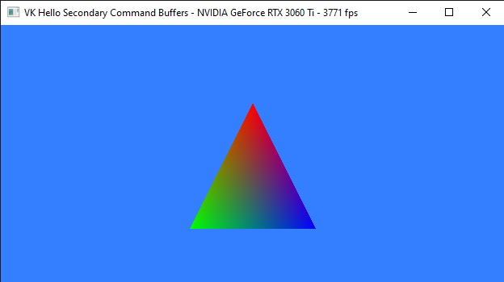
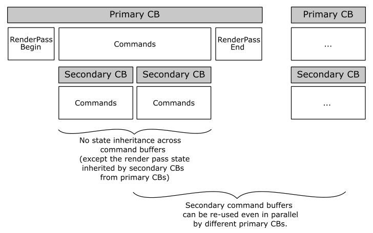

<br>



<br>

# 1 - Introduction

You may have noticed that in the previous tutorial we simply recorded the same rendering commands in the command buffer at each iteration of the rendering loop. However, it is possible to avoid this repetition by creating a permanent secondary command buffer (outside the rendering loop) that stores a sequence of commands which can be reused multiple times by one or more primary command buffers.

<br>

>The samples examined so far record very few commands in the command buffer. As a result, using secondary command buffers may not provide a significant performance boost in those cases. Indeed, secondary command buffers are beneficial when an application has a large number of commands to execute in sequence repeatedly. Additionally, they can be used in concurrent programming, where multiple threads can record rendering commands of a frame into separate secondary command buffers. We will cover concurrent programming in a later tutorial. Here, we will only provides an introduction to secondary command buffers without delving into the details of how to achieve optimal performance.

<br>

<br>

# 2 - Secondary Command Buffers

Command buffers are objects used to record commands which can be subsequently submitted to a device queue for execution. There are two types of command buffers available - primary and secondary. Primary command buffers can contain both commands and secondary command buffers, and they are submitted directly to queues. On the other hand, secondary command buffers contain commands but can only be executed by primary command buffers and are not directly submitted to queues.

Secondary command buffers can be recorded to be executed as part of a primary command buffer using **vkCmdExecuteCommands**. This partially ties the lifecycle of the two command buffers together: when the primary buffer is submitted to a queue, both the primary buffer and any secondaries recorded to it are moved to the pending state. Once the execution of the primary buffer is complete, so is the execution of any secondary buffers recorded within it. <br>
Resetting or freeing a primary command buffer removes the lifecycle linkage to all secondary command buffers that were recorded into it. As a result, secondary command buffers can be reused since the commands they contain are not discarded when the primary command buffer is reset.

<br>

>Resetting a command buffer is an operation that discards any previously recorded commands and puts a command buffer in the initial state. Resetting occurs as a result of **vkResetCommandBuffer** or as part of **vkBeginCommandBuffer** (which additionally puts the command buffer in the recording state).

<br>

A secondary command buffer is created in a similar way as a primary command buffer: we allocate device memory with **vkAllocateCommandBuffers** but we use **aVkCommandBufferAllocateInfo** with a level member of **VK_COMMAND_BUFFER_LEVEL_SECONDARY**. Once created, a command buffer (primary or secondary) is in its initial state, where no commands are recorded and all state is undefined.

When secondary command buffers are recorded to execute on a primary command buffer, they do not inherit any state from the primary command buffer. Similarly, a primary command buffer does not inherit any state from a secondary command buffer after a **vkCmdExecuteCommands** is recorded. <br>
There is one exception to this rule: if a primary command buffer is inside a render pass instance, then the render pass and subpass state is not disturbed by secondary command buffers recorded in the primary command buffer - that is, the secondary command buffers inherits the render pass state the primary command buffer is recorded with. This is because the secondary command buffer needs to know at least the render target where the rendering operations are to be performed, and this information is stored in the render pass instance associated with the primary command buffer currently in recording state. Therefore, when recording secondary command buffers, it is important to ensure that they contain all the necessary state to execute correctly, since they do not inherit any state from the primary command buffer except for the render pass state.

<br>



<br>

>In general, each command buffer manages its own state and is independent of other command buffers. State is not inherited between primary and secondary command buffers or between different secondary command buffers. When a command buffer enters the recording state, all state values within that buffer are undefined. This means that for commands that are dependent on specific states (such as draw or dispatch commands), those states must be defined and cannot be left undefined.

<br>

Secondary command buffers are typically useful for:

- Creating permanent command buffers: by recording a sequence of commands outside the rendering loop in a secondary command buffer that need to be executed multiple time.

- Multi-threading rendering operations: when many rendering operations need to be performed on the same render target, secondary command buffers can be used to split the recording of commands across different threads. The resultant secondary command buffer can then be recorded to a primary command buffer for later execution.

<br>

Regarding the first point, as stated in the introduction of this tutorial, recording a small number of commands in a permanent secondary command buffer that need to be executed repeatedly may not yield noticeable performance improvements. Furthermore, even if a secondary command buffer has a large number of commands, it is important to evaluate the actual performance gain by testing it in practice. In general, recording a **vkCmdExecuteCommands** command in a primary command buffer should faster than recording a large number of commands in secondary command buffers. However, there may still be some overhead, especially for implementations that require copying the secondary command buffers into the primary command buffer instead of referencing them.

As for the second point, primary command buffers can also be recorded in parallel and then submited to a queue, so a question arises: when do we really need to use secondary command buffers? Well, it depends on the rendering work performed by your application. For example, if you want to build a frame in parallel, secondary command buffers are more convenient because you can combine them into a primary command buffer for a single execution. If primary command buffers were used instead, multiple command buffer submissions would be necessary to build a single frame, which can be costly.

<br>

>If you are planning on recording commands in parallel to a single command buffer, keep in mind that command pools are externally synchronized. This means that the memory region used to store commands in a command buffer must not be accessed concurrently by multiple threads, unless you use an explicit synchronization mechanism.

<br>

By now, it shoud be clear that secondary command buffers are yet another way to efficiently use GPUs while minimizing the CPU load. Therefore, it is crucial for Vulkan implementations to implement secondary buffers as efficiently as possible.

<br>

<br>

# 3 - VKHelloSCB: code review

The sample presented in this tutorial involves moving the recording of the rendering commands used in the previous tutorial (to draw a triangle) from the primary command buffer built within the rendering loop to a permanent secondary buffer built outside the rendering loop.

<br>

Let's start by examining the **VKHelloSCB** class.

<br>

```cpp
class VKHelloSCB : public VKSample
{
public:
    VKHelloSCB(uint32_t width, uint32_t height, std::string name);

    virtual void OnInit();
    virtual void OnUpdate();
    virtual void OnRender();
    virtual void OnDestroy();

    virtual void WindowResize(uint32_t width, uint32_t height);

private:
    
    void InitVulkan();
    void SetupPipeline();
    
    void PopulateCommandBuffer(uint32_t currentBufferIndex, uint32_t currentIndexImage);
    void SubmitCommandBuffer(uint32_t currentBufferIndex);
    void PresentImage(uint32_t imageIndex);
    
    void CreateVertexBuffer();          // Create a vertex buffer
    void CreatePipelineLayout();        // Create a pipeline layout
    void CreatePipelineObjects();       // Create a pipeline object

    // Allocate and record secondary Command Buffers;
    void AllocateSCBs();
    void PopulateSCBs();
    
    // Secondary Command Buffers;
     std::vector<VkCommandBuffer> m_secondaryCommandBuffers;

    // Vertex layout used in this sample
    struct Vertex {
    	float position[3];
    	float color[4];
    };
    
    // Vertex buffer
    struct {
    	VkDeviceMemory memory; // Handle to the device memory backing the vertex buffer
    	VkBuffer buffer;       // Handle to the Vulkan buffer object that the memory is bound to
    } m_vertices;
    
    uint32_t m_commandBufferIndex = 0;
};
```
<br>

We declared a vector of command buffers to be used as secondary command buffers and a couple of helper functions to allocate memory and record commands. We could also have used a single secondary command buffer since the rendering commands to draw a triangle are always the same for each frame, but we opted for an array. The reasons behind this choice will be explained later in this section.

<br>

**AllocateSCBs** and **PopulateSCBs** are called by **SetupPipeline** outside the rendering loop.

<br>

```cpp
void VKHelloSCB::SetupPipeline()
{
    CreateVertexBuffer();
    CreatePipelineLayout();
    CreatePipelineObjects();
    AllocateSCBs();
    PopulateSCBs();
    m_initialized = true;
}
```
<br>

**AllocateSCBs** resizes **m_secondaryCommandBuffers** so that it contains the same number of secondary command buffers as framebuffer objects (more on this shortly). Then, it allocates enough memory space to store those secondary command buffers. Note that we set **VK_COMMAND_BUFFER_LEVEL_SECONDARY** to specify that we want secondary level command buffers.

<br>

```cpp
void VKHelloSCB::AllocateSCBs()
{
    // Allocates as many SCBs as framebuffer objects
    m_secondaryCommandBuffers.resize(m_sampleParams.Framebuffers.size());

    VkCommandBufferAllocateInfo commandBufferAllocateInfo{};
    commandBufferAllocateInfo.sType = VK_STRUCTURE_TYPE_COMMAND_BUFFER_ALLOCATE_INFO;
    commandBufferAllocateInfo.commandPool = m_sampleParams.GraphicsCommandPool;
    commandBufferAllocateInfo.level = VK_COMMAND_BUFFER_LEVEL_SECONDARY;
    commandBufferAllocateInfo.commandBufferCount = static_cast<uint32_t>(m_secondaryCommandBuffers.size());

    VK_CHECK_RESULT(vkAllocateCommandBuffers(m_vulkanParams.Device, &commandBufferAllocateInfo, m_secondaryCommandBuffers.data()));
}
```
<br>

**PopulateSCBs** populates the permanent secondary command buffers with the necessary commands to draw a triangle.

<br>

```cpp
void VKHelloSCB::PopulateSCBs()
{
    // Secondary CBs will be executed by primary CBs inside a (specific subpass of a) render pass instance.
    VkCommandBufferBeginInfo cmdBufInfo = {};
    cmdBufInfo.sType = VK_STRUCTURE_TYPE_COMMAND_BUFFER_BEGIN_INFO;
    cmdBufInfo.pNext = nullptr;
    cmdBufInfo.flags = VK_COMMAND_BUFFER_USAGE_RENDER_PASS_CONTINUE_BIT;

    // Set the render pass object defining what render pass instances the SCBs will be compatible with.
    // Specifying the exact framebuffer that the SCBs will be executed with may result in better performance at command buffer execution time.
    VkCommandBufferInheritanceInfo inheritanceInfo = {};
    inheritanceInfo.sType = VK_STRUCTURE_TYPE_COMMAND_BUFFER_INHERITANCE_INFO;
    inheritanceInfo.renderPass = m_sampleParams.RenderPass;
    inheritanceInfo.subpass = 0;

    // Record SCBs
    for (uint32_t i = 0; i < m_sampleParams.Framebuffers.size(); i++)
    {
        inheritanceInfo.framebuffer = m_sampleParams.Framebuffers[i];
        cmdBufInfo.pInheritanceInfo = &inheritanceInfo;

        // Begin secondary command buffer recording
        VK_CHECK_RESULT(vkBeginCommandBuffer(m_secondaryCommandBuffers[i], &cmdBufInfo));

        // Update dynamic viewport state
        VkViewport viewport = {};
        viewport.height = (float)m_height;
        viewport.width = (float)m_width;
        viewport.minDepth = (float)0.0f;
        viewport.maxDepth = (float)1.0f;
        vkCmdSetViewport(m_secondaryCommandBuffers[i], 0, 1, &viewport);

        // Update dynamic scissor state
        VkRect2D scissor = {};
        scissor.extent.width = m_width;
        scissor.extent.height = m_height;
        scissor.offset.x = 0;
        scissor.offset.y = 0;
        vkCmdSetScissor(m_secondaryCommandBuffers[i], 0, 1, &scissor);

        // Bind the graphics pipeline.
        // The pipeline object contains all states of the graphics pipeline, 
        // binding it will set all the states specified at pipeline creation time
        vkCmdBindPipeline(m_secondaryCommandBuffers[i], VK_PIPELINE_BIND_POINT_GRAPHICS, m_sampleParams.GraphicsPipeline);
        
        // Bind triangle vertex buffer (contains position and colors)
        VkDeviceSize offsets[1] = { 0 };
        vkCmdBindVertexBuffers(m_secondaryCommandBuffers[i], 0, 1, &m_vertices.buffer, offsets);
        
        // Draw triangle
        vkCmdDraw(m_secondaryCommandBuffers[i], 3, 1, 0, 0);

        // End secondary command buffer recording
        VK_CHECK_RESULT(vkEndCommandBuffer(m_secondaryCommandBuffers[i]));
    }
}
```
<br>

Note that we don't use a render pass instance. That is, commands are not recorded within a subpass of a render pass instance. Indeed, this information will be inherited from the primary command buffers that will actually execute the secondary command buffers. Here, we need to explicitly express the intention to inherit the render pass instance state by setting **VK_COMMAND_BUFFER_USAGE_RENDER_PASS_CONTINUE_BIT** as a flag of **VkCommandBufferBeginInfo**. <br>
Additionally, we need to specify a subpass index in the render pass instance that the secondary command buffers will be executed within (i.e., the subpass where the commands will be recorded). This is why we also set a render pass object to define the render pass instances that the secondary command buffers will be compatible with.

Finally, we can explain the reason behind declaring an array that holds as many secondary command buffers as framebuffer objects. According to the Vulkan specification, specifying the exact framebuffer that a secondary command buffer will be executed with can result in better performance during command buffer execution. Therefore, by using an array of secondary command buffers, we can assign each secondary command buffer to a specific framebuffer object and optimize their execution. That said, it's worth noting that specifying this information is optional. This means that we could have declared a single secondary command buffer to be used by various primary command buffers within different render pass instances. However, using only one secondary command buffer may prevent the driver from making full optimizations.

<br>

>A framebuffer object is part of the render pass state stored in the command buffer state, which includes several states (pipeline render pass, etc.). However, GPUs have no knowledge of pipelines, render passes, etc. As a result, the Vulkan driver must translate the command buffer state into hardware state. When you specify the framebuffer object for a secondary command buffer, the Vulkan implementation can perform as much pre-processing as possible to translate the command buffer state to the corresponding hardware state during command recording. This avoids delaying the task until you call **vkCmdExecuteCommands** to record a secondary command buffer into a primary one.

<br>

As you can see in the for loop, we simply moved the rendering commands from the primary to the secondary command buffers.

<br>

In **PopulateCommandBuffer** we call **vkCmdExecuteCommands** to execute rendering commands from a secondary command buffer within a primary command buffer.

<br>

```cpp
void VKHelloSCB::PopulateCommandBuffer(uint32_t currentBufferIndex, uint32_t currentIndexImage)
{
    VkCommandBufferBeginInfo cmdBufInfo = {};
    cmdBufInfo.sType = VK_STRUCTURE_TYPE_COMMAND_BUFFER_BEGIN_INFO;
    cmdBufInfo.pNext = nullptr;
    cmdBufInfo.flags = VK_COMMAND_BUFFER_USAGE_ONE_TIME_SUBMIT_BIT;

    // We use a single color attachment that is cleared at the start of the subpass.
    VkClearValue clearValues[1];
    clearValues[0].color = { { 0.2f, 0.5f, 1.0f, 1.0f } };

    VkRenderPassBeginInfo renderPassBeginInfo = {};
    renderPassBeginInfo.sType = VK_STRUCTURE_TYPE_RENDER_PASS_BEGIN_INFO;
    renderPassBeginInfo.pNext = nullptr;
    // Set the render area that is affected by the render pass instance.
    renderPassBeginInfo.renderArea.offset.x = 0;
    renderPassBeginInfo.renderArea.offset.y = 0;
    renderPassBeginInfo.renderArea.extent.width = m_width;
    renderPassBeginInfo.renderArea.extent.height = m_height;
    // Set clear values for all framebuffer attachments with loadOp set to clear.
    renderPassBeginInfo.clearValueCount = 1;
    renderPassBeginInfo.pClearValues = clearValues;
    // Set the render pass object used to begin an instance of.
    renderPassBeginInfo.renderPass = m_sampleParams.RenderPass;
    // Set the frame buffer to specify the color attachment (render target) where to draw the current frame.
    renderPassBeginInfo.framebuffer = m_sampleParams.Framebuffers[currentIndexImage];

    VK_CHECK_RESULT(vkBeginCommandBuffer(m_sampleParams.GraphicsCommandBuffers[currentBufferIndex], &cmdBufInfo));

    // Begin a render pass instance specifying that the contents are recorded in secondary command buffers.
    // vkCmdExecuteCommands is the only valid command on the primary command buffer.
    // This will clear the color attachment.
    vkCmdBeginRenderPass(m_sampleParams.GraphicsCommandBuffers[currentBufferIndex], &renderPassBeginInfo, VK_SUBPASS_CONTENTS_SECONDARY_COMMAND_BUFFERS);

    // Execute render commands from a secondary command buffer
    vkCmdExecuteCommands(m_sampleParams.GraphicsCommandBuffers[currentBufferIndex], 1, &m_secondaryCommandBuffers[currentIndexImage]);

    // Ending the render pass will add an implicit barrier, transitioning the frame buffer color attachment to
    // VK_IMAGE_LAYOUT_PRESENT_SRC_KHR for presenting it to the windowing system
    vkCmdEndRenderPass(m_sampleParams.GraphicsCommandBuffers[currentBufferIndex]);
    
     VK_CHECK_RESULT(vkEndCommandBuffer(m_sampleParams.GraphicsCommandBuffers[currentBufferIndex]));
}
```
<br>

<br>

Source code: [LearnVulkan](https://github.com/PAMinerva/LearnVulkan)

<br>

# References

[1] [Vulkan API Specifications](https://registry.khronos.org/vulkan/) <br>

<br>

***
If you found the content of this tutorial somewhat useful or interesting, please consider supporting this project by clicking on the **Sponsor** button.  Whether a small tip, a one time donation, or a recurring payment, it's all welcome! Thank you!<br><br>
<p align="center">
 <a href="https://github.com/sponsors/PAMinerva">
         
      </a>
</p><br>