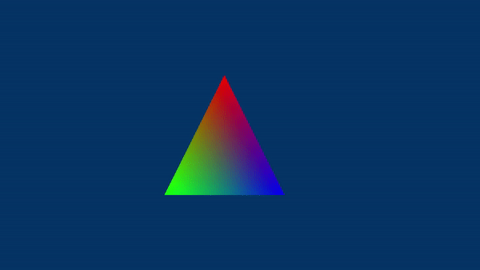

<br>



<br>

# 1 - Introduction

As we learned in earlier tutorials, shaders require input data from previous stages in order to perform their tasks. For example, we demonstrated how vertex data stored in a vertex buffer is passed from one stage to the next for processing. However, programmable stages can also access resources stored in device memory, referred to as shader resources, using descriptor sets and pipeline layouts. We discussed the theory of this in a previous tutorial (refer to **01.B-Hello-Triangle**, section **3.3.1**), and now it's time to put that knowledge into practice. <br>
The sample we will be reviewing in this tutorial (**VkHelloUniforms**) uses a uniform buffer that enables the vertex shader to access a buffer allocated in device memory. If the buffer is host visible, it can be written from our application, allowing us to transfer data from the CPU system memory to GPU-visible memory. But why would we need to do that? Well, there can be several reasons. For example, in this sample, we will pass data to relocate the position of a triangle over time, enabling us to simulate a basic animation (as shown in the image above).

<br>

<br>

# 2 - Uniform Buffers

The two primary types of resources that can be used in shader code are buffers and images. In this tutorial, we will focus on buffers that are optimized for constant-variable usage by programmable stages. These buffers are characterized by lower-latency access and more frequent updates from the CPU. As a result, even though the application can write to such buffers, the shader code can only read from them. This allows the buffer data to change on a per-frame basis while remaining constant (uniform) throughout the execution of the shader programs that access it.

In shader code, to use a buffer with read-only access, we need to define a uniform block, which is similar to a C structure. The following code snippet shows an example of a uniform block that contains a $4\times 4$ matrix and two vectors, each consisting of four floating-point values.

<br>

```glsl
layout(std140, set=0, binding=2) uniform buff {
        mat4 MVP;
        vec4 position;
        vec4 color;
} uBuf;
```
<br>

The **layout** qualifier specifies where the variable’s data come from. In this case, the uniform block **buff** will be backed by memory that stores a descriptor from the first descriptor set (index 0) bound to the command buffer. And in particular, the descriptor associated with the binding point $2$. Indeed, although we fully define the uniform block in the shader code, when we use the **uBuf** variable, we are actually referring to a descriptor that points to the corresponding resource in memory, rather than the resource itself. You might be wondering why we need to fully define the uniform block in shader code if we only refer to a descriptor. Well, as explained in a previous tutorial (refer to **01.B-Hello-Triangle**, section **3.3.1**), uniform buffers are descriptor types that are directly associated with a buffer resource (using the corresponding Vulkan object), rather than a buffer view. This means that we don't have a view that describes the resource in detail (format, size, etc.), but only a GPU-virtual address to the resource that can be retrieved from the Vulkan object and saved in the descriptor. By fully defining the uniform block in the shader code, the device can know how to access the corresponding resource using only the address stored in the descriptor.

**std140** defines the set of storage layout rules used by the GLSL compiler to place members in an std140-qualified uniform block. The **std140** layout rules for a uniform block state that:

1. If the member is a scalar consuming N basic machine units, the base alignment is N. For example, for a **float** member the alignemnt is **sizeof**(**float**).
2. If the member is a two- or four-component vector with components consuming N basic machine units, the base alignment are 2N or 4N, respectively. For example, for a **vec2** member the base alignemnt is $2\ \times$ **sizeof**(**float**). In GLSL, a **vecX** is an array of X **float**s.
3. If the member is a three-component vector with components consuming N basic machine units, the base alignment is 4N. This means that for **vec3** and **vec4** members both the base alignemnt is $4\ \times$ **sizeof**(**float**).
4. If the member is an array of scalars or vectors, the base alignment of both the array and each of its elements is set to match the base alignment of a single array element, according to rules (1), (2), and (3), and rounded up to the base alignment of a **vec4**. The base alignment of each element is rounded up to the base alignment of a **vec4**.
5. If the member is a column-major matrix with C columns and R rows, the matrix is stored identically to an array of C column vectors with R components each, according to rule (4).
6. If the member is an array of S column-major matrices with C columns and R rows, the matrix is stored identically to a row of S × C column vectors with R components each, according to rule (4).
7. If the member is a row-major matrix with C columns and R rows, the matrix is stored identically to an array of R row vectors with C components each, according to rule (4).
8. If the member is an array of S row-major matrices with C columns and R rows, the matrix is stored identically to a row of S × R row vectors with C components each, according to rule (4).
9. If the member is a structure, the base alignment of the structure is N, where N is the largest base alignment value of any of its members, and rounded up to the base alignment of a **vec4**. The members of the structure are assigned offsets by applying the **std140** set of rules recursively, where the offset of the first member is equal to the offset of the structure within the uniform block. The structure may have padding at the end, so that the base offset of the member following the structure in the uniform block is rounded up to the next multiple of the base alignment of the structure.
10. If the member is an array of S structures, the S elements of the array are laid
out in order, according to rule (9).

<br>

To pass buffer data from the CPU to the GPU, we need to define a structure in our application that matches the memory layout of the uniform block defined in the shader code.

<br>

```cpp
// A vec4 is an array of four floating point values.
// A mat4 is a 4x4 matrix that, according to the rules (5) and (7), is stored as an array of four vec4 in a uniform block.
struct buff {
      float MVP[4][4];      
      float position[4];
      float color[4];
} uBuf;
```
<br>

With a structure defined in C++ that matches the corresponding uniform block in GLSL, we can allocate the necessary device memory space using **vkAllocateMemory** and call **vkCreateBuffer** to create a Vulkan object representing the buffer in our application. Obviously, we need to allocate memory that is host-visible so that can be mapped to the virtual address space of the application, allowing for writing buffer data from the CPU.

From the Vulkan object just created we can create a descriptor: a uniform buffer within a descriptor set to bind to the command buffer. This descriptor will allow the device to access the buffer in memory through the uniform block in GLSL. To achieve this, we must also create a pipeline layout that includes a descriptor set layout with a descriptor binding describing the connection between the binding point of the uniform block in GLSL and the uniform buffer in the descriptor set. The following section will examine the source code in detail.

<br>

>A buffer created in host-visible device memory for a uniform block in shader code requires a specific base alignment that depends both on the device and Vulkan implementation. When allocating a single buffer, the Vulkan implementation takes care of the proper alignment during memory allocation. However, when working with an array of buffers, a problem arises when we allocate memory for the entire array. In that case, it is important to ensure that each element (buffer) in the array has the proper alignment. We will cover this topic in more detail in a later tutorial. In this tutorial, we will focus on allocating memory for a single buffer.

<br>

>Based on the **std140** layout rules, it's clear that using **vec3** members in a uniform block can lead to some problems. This is because the alignment rules for C++ structures are different from the **std140** layout storage rules. For example, if you have a uniform block in the shader code with a **vec3** position member and a **vec4** color member, as shown in the following listing
>
><br>
>
>```glsl
>layout(std140, set=0, binding=2) uniform buff {
>    vec3 position;
>    vec4 color;
>} uBuf;
>```
><br>
>
>and you define the following structure in your application to match the uniform block in the shader code,
>
><br>
>
>```cpp
>struct buff {
>    float position[3];  // (X, Y, Z)
>    float color[4];     // (R, G, B, A)
>} uBuf;
>```
><br>
>
>you might get some nasty surprises. Indeed, both the **position** and **color** members have a base alignment of 16 bytes in the shader code. However, the C++ packing rules state that the **color** member starts at a byte offset of 12. In other words, the memory layout of the buffer will be interpreted differently by our application and the shader program, as shown in the following listing
>
><br>
>
>```
>C++:  [0]:X, [4]:Y, [8]:Z, [12]:R, [16]:G, [20]:B, [24]:A
>GLSL: [0]:X, [4]:Y, [8]:Z, [12]:PAD, [16]:R, [20]:G, [24]:B, [28]:A
>```
><br>
>
>This means that if you use **memcpy** to transfer the buffer data from your application (system memory) to host-visible device memory, you will end up with the following data accessible from the uniform block by the device:
>
><br>
>
>```
>position: X, Y, Z, R
>color: G, B, A, GarbageData
>```
><br>
>
>The reason for this is that the virtual addresses used by the application (CPU) and the device (GPU) are different, but they are mapped to the same physical address, meaning that both the CPU and GPU access the same physical memory. As a result, since **memcpy** transfers data as a bit stream, the source data starting at byte offset 12 will be interpreted as the last component of the **position** member in the shader code.
>
><br>
>
>To solve this problem, three possible solutions are:
>
> - Avoid using **vec3** members, or matrices with a three-component column or row, in a uniform block. Instead, use **vec4** and **mat4** (that is $4\times 4$ matrices).
> - Pad C++ structures according to the **std140** layout rules.
> - Use the **alignas** specifier (C++11) to ensure manual alignment of members in C++ structures.
>
> <br>
>
>In this tutorial series, we will opt for the first solution whenever possible as it is less error-prone. Indeed, this approach minimizes the chance of manual padding or alignment operations for each structure defined in the C++ code, making it easier to use.
>
><br>
>
>Special attention should be also paid when using arrays or structures as members of a uniform block. In fact, according to rules 4 of the **std140** layout, the elements of an array are aligned to the base alignment of **vec4**. This means that if you have a uniform block like the following
>
>```glsl
>layout(std140, set=0, binding=2) uniform buff {
>    vec2 position[12];    // each vec2 aligned to vec4 - that is, 4 * sizeof(float) = 16
>    vec4 color;           // offset 16 * 12 = 192 (not 8 * 12)
>} uBuf;
>```
><br>
>
>the corresponding C++ structure should be
>
><br>
>
>```cpp
>struct buff {
>    float position[12][4];  // (X, Y, PAD, PAD) - (X, Y, PAD, PAD) - (X, Y, PAD, PAD) - ect...
>    float color[4];         // (R, G, B, A) at offset 192
>} uBuf;
>```
><br>
>
>On the other hand, according to rule 9, the size of a structure is rounded up to the next multiple of the base alignment. This means that if you have a uniform block like the following
>
>```glsl
>struct posCol
>{
>    vec2 position;  // offset 0; a vec2 takes up 2 * sizeof(float) = 8 bytes
>    vec3 color;     // offset 16; a vec3 is 16-byte aligned and takes up 3 * sizeof(float) = 12 bytes
>}; // size 32; 8 (vec2) + 8 (pad) + 12 (vec3) = 28 which is rounded up to 32 
>    // as the the base alignment of posCol is 16, according to rule 9.
>
>layout(std140, set=0, binding=2) uniform buff {
>        posCol data;
>} uBuf;
>```
><br>
>
>the corresponding C++ structures should be
>
><br>
>
>```cpp
>struct posCol {
>    float position[2];  // (X, Y) at offset 0
>    float pad1[2];      // padding at offset 8
>    float color[3];     // (R, G, B) at offset 16
>    float pad2;         // padding at offset 28
>}; // sizeof(posCol): 32
>
>struct buff {
>     posCol data;       // (X, Y, PAD, PAD, R, G, B, PAD)
>} uBuf;
>```
><br>
>
>In a future tutorial, we will explore how to use RenderDoc as a tool to verify the memory layout of uniform blocks in shader code, allowing us to properly define our C++ structures with minimal effort.

<br>

<br>

# 3 - VKHelloUniforms: code review

Let’s start with the vertex shader code.

<br>

```glsl
#version 450

layout (location = 0) in vec3 inPos;
layout (location = 1) in vec4 inColor;

layout(std140, set = 0, binding = 0) uniform buf {
        vec4 displacement;
} uBuf;

layout (location = 0) out vec4 outColor;

void main() 
{
	outColor = inColor;                                  // Pass color to the next stage
	gl_Position = vec4(inPos, 1.0) + uBuf.displacement;  // Shift vertex position
	gl_Position.y = -gl_Position.y;	                     // Flip y-coords.
}
```
<br>

Here, we have a uniform block backed by a descriptor associated with binding number 0 in the first descriptor set (index 0) that will be bound to the command buffer. The uniform block includes a vector of four floating-point values used as a displacement to shift the vertex positions.

<br>

>In certain scenarios, using a uniform block to store an array of four floats may not be the most efficient approach. In such cases, push constants can be a better alternative, as they enable data to be directly stored in the command buffer. Typically, uniform blocks are used to store large amounts of data, such as matrices and other structures. However, since matrices have not yet been covered and push constants will be addressed in a later tutorial, this sample may seem contrived with no practical use. Nonetheless, it still provides a good introduction to uniform buffers.

<br>

The **VKHelloUniforms** class includes a structure with the same memory layout as the uniform block and some helper functions to create a buffer, the corresponding descriptor, and the related pipeline resources (descriptor pool, set, layout, etc.).
<br>

```cpp
class VKHelloUniforms : public VKSample
{
public:
    VKHelloUniforms(uint32_t width, uint32_t height, std::string name);

    virtual void OnInit();
    virtual void OnUpdate();
    virtual void OnRender();
    virtual void OnDestroy();

private:
    
    void InitVulkan();
    void SetupPipeline();
    
    void PopulateCommandBuffer(uint32_t currentBufferIndex, uint32_t currentIndexImage);
    void SubmitCommandBuffer(uint32_t currentBufferIndex);
    void PresentImage(uint32_t imageIndex);
    
    void CreateVertexBuffer();          // Create a vertex buffer
    void CreateStagingBuffer();         // Create a buffer in host-visible memory
    void CreateDescriptorPool();        // Create a descriptor pool
    void CreateDescriptorSetLayout();   // Create a descriptor set layout
    void CreateDescriptorSet();         // Create a descriptor set
    void CreatePipelineLayout();        // Create a pipeline layout
    void CreatePipelineObjects();       // Create a pipeline object

    void UpdateStagingBufferData();     // Update uniform buffer data

    // For simplicity we use the same uniform block layout as in the vertex shader:
    //
    // layout(set = 0, binding = 0) uniform buf {
    //         vec4 displacement;
    // } uBuf;
    //
    // This way we can just memcopy the uBufVS data to match the uBuf memory layout.
    // Note: You should use data types that align with the GPU in order to avoid manual padding (vec4, mat4)
    struct {
        float displacement[4] = {0.0f, 0.0f, 0.0f, 0.0f};
    } uBufVS;
    
    // Vertex layout used in this sample
    struct Vertex {
        float position[3];
        float color[4];
    };
    
    // Vertex buffer
    struct {
        VkDeviceMemory memory; // Handle to the device memory backing the vertex buffer
        VkBuffer buffer;       // Handle to the Vulkan buffer object that the memory is bound to
    } m_vertices;
    
    uint32_t m_commandBufferIndex = 0;
};
```
<br>

**CreateStagingBuffer** creates a buffer in host-visible device memory.

<br>

```cpp
void VKHelloUniforms::CreateHostVisibleBuffer()
{
    //
    // Create a buffer in host-visible device memory
    // since it needs to be updated from the CPU on a per-frame basis.
    //
    
    // Used to request an allocation of a specific size from a certain memory type.
    VkMemoryAllocateInfo memAlloc = {};
    memAlloc.sType = VK_STRUCTURE_TYPE_MEMORY_ALLOCATE_INFO;
    VkMemoryRequirements memReqs;
    
    // Create the buffer object
    VkBufferCreateInfo bufferInfo = {};
    bufferInfo.sType = VK_STRUCTURE_TYPE_BUFFER_CREATE_INFO;
    bufferInfo.size = sizeof(uBufVS);
    bufferInfo.usage = VK_BUFFER_USAGE_UNIFORM_BUFFER_BIT;
    VK_CHECK_RESULT(vkCreateBuffer(m_vulkanParams.Device, &bufferInfo, nullptr, &m_sampleParams.HostVisibleBuffer.Handle));

    // Request a memory allocation from coherent, host-visible device memory that is large 
    // enough to hold the buffer.
    // VK_MEMORY_PROPERTY_HOST_COHERENT_BIT makes sure writes performed by the host (application)
    // will be directly visible to the device without requiring the explicit flushing of cached memory.
    vkGetBufferMemoryRequirements(m_vulkanParams.Device,m_sampleParams.HostVisibleBuffer.Handle, &memReqs);
    memAlloc.allocationSize = memReqs.size;
    memAlloc.memoryTypeIndex = GetMemoryTypeIndex(memReqs.memoryTypeBits, VK_MEMORY_PROPERTY_HOST_VISIBLE_BIT | VK_MEMORY_PROPERTY_HOST_COHERENT_BIT, m_deviceMemoryProperties);
    VK_CHECK_RESULT(vkAllocateMemory(m_vulkanParams.Device, &memAlloc, nullptr, &m_sampleParams.HostVisibleBuffer.Memory));

    // Map the host-visible device memory just allocated.
    // Leave it mapped so that we don't have to map and unmap it every time we want to update the buffer data.
    VK_CHECK_RESULT(vkMapMemory(m_vulkanParams.Device, m_sampleParams.HostVisibleBuffer.Memory, 0, memAlloc.allocationSize, 0, &m_sampleParams.HostVisibleBuffer.MappedMemory));

    // Bind the buffer object to the backing host-visible device memory just allocated.
    VK_CHECK_RESULT(vkBindBufferMemory(m_vulkanParams.Device, m_sampleParams.HostVisibleBuffer.Handle, m_sampleParams.HostVisibleBuffer.Memory, 0));

    // Store information needed to write\update the corresponding descriptor (uniform buffer) in the descriptor set later.
    m_sampleParams.HostVisibleBuffer.Descriptor.buffer = m_sampleParams.HostVisibleBuffer.Handle;
    m_sampleParams.HostVisibleBuffer.Descriptor.offset = 0;
    m_sampleParams.HostVisibleBuffer.Descriptor.range = sizeof(uBufVS);
}
```
<br>

Compared to the vertex buffer creation code we have used so far, the only difference is the storing of the buffer information required to create the corresponding descriptor later. For this purpose, we use the **VkDescriptorBufferInfo** structure (refer to the full source code) that includes the following members:

- **buffer** is **VK_NULL_HANDLE** or the buffer object from which to create the descriptor.
- **offset** is the offset in bytes from the start of buffer. Access to buffer memory via this descriptor uses addressing that is relative to this starting offset.
- **range** is the size in bytes that is used for this descriptor update, or **VK_WHOLE_SIZE** to use the range from offset to the end of the buffer.

<br>

**CreateDescriptorPool** creates a global descriptor pool used to allocate descriptor sets. Everything you need to know about this function is explained in the code comments.

<br>

```cpp
void VKHelloUniforms::CreateDescriptorPool()
{
    //
    // To calculate the amount of memory required for a descriptor pool, the implementation needs to know
    // the max numbers of descriptor sets we will request from the pool, and the number of descriptors 
    // per type we will include in those descriptor sets.
    //

    // Describe the number of descriptors per type
    // This sample only uses one descriptor type (uniform buffer) and only requests one descriptor of this type
    VkDescriptorPoolSize typeCounts[1];
    typeCounts[0].type = VK_DESCRIPTOR_TYPE_UNIFORM_BUFFER;
    typeCounts[0].descriptorCount = 1;
    // For additional types you need to add new entries in the type count list
    // E.g. for two combined image samplers:
    // typeCounts[1].type = VK_DESCRIPTOR_TYPE_COMBINED_IMAGE_SAMPLER;
    // typeCounts[1].descriptorCount = 4;

    // Create a global descriptor pool
    // All descriptors set used in this sample will be allocated from this pool
    VkDescriptorPoolCreateInfo descriptorPoolInfo = {};
    descriptorPoolInfo.sType = VK_STRUCTURE_TYPE_DESCRIPTOR_POOL_CREATE_INFO;
    descriptorPoolInfo.pNext = nullptr;
    descriptorPoolInfo.poolSizeCount = 1;
    descriptorPoolInfo.pPoolSizes = typeCounts;
    // Set the max. number of descriptor sets that can be requested from this pool (requesting beyond this limit will result in an error)
    descriptorPoolInfo.maxSets = 1;

    VK_CHECK_RESULT(vkCreateDescriptorPool(m_vulkanParams.Device, &descriptorPoolInfo, nullptr, &m_sampleParams.DescriptorSet.Pool));
}
```
<br>

**CreateDescriptorSetLayout** creates a descriptor set layout that includes a descriptor binding that associates the binding point 0 in the vertex shader with a generic uniform buffer associated with the same binding point in a generic descriptor set. Observe that we have not a uniform buffer yet, and we still need to allocate a descriptor set from the descriptor pool.

<br>

```cpp
void VKHelloUniforms::CreateDescriptorSetLayout()
{
    //
    // Create a Descriptor Set Layout to connect binding points (resource declarations)
    // in the shader code to descriptors within descriptor sets.
    //
    // Binding 0: Uniform buffer (Vertex shader)
    VkDescriptorSetLayoutBinding layoutBinding = {};
    layoutBinding.binding = 0;
    layoutBinding.descriptorType = VK_DESCRIPTOR_TYPE_UNIFORM_BUFFER;
    layoutBinding.descriptorCount = 1;
    layoutBinding.stageFlags = VK_SHADER_STAGE_VERTEX_BIT;
    layoutBinding.pImmutableSamplers = nullptr;

    VkDescriptorSetLayoutCreateInfo descriptorLayout = {};
    descriptorLayout.sType = VK_STRUCTURE_TYPE_DESCRIPTOR_SET_LAYOUT_CREATE_INFO;
     descriptorLayout.pNext = nullptr;
    descriptorLayout.bindingCount = 1;
    descriptorLayout.pBindings = &layoutBinding;

    VK_CHECK_RESULT(vkCreateDescriptorSetLayout(m_vulkanParams.Device, &descriptorLayout, nullptr, &m_sampleParams.DescriptorSet.Layout));
}
```
<br>

**AllocateDescriptorSet** allocates a descriptor set from the global descriptor pool where we can store our descriptors.

<br>

```cpp
void VKHelloUniforms::AllocateDescriptorSet()
{
    // Allocate a new descriptor set from the global descriptor pool.
    // Use the descriptor set layout to calculate the amount on memory required to store the descriptor set.
    VkDescriptorSetAllocateInfo allocInfo = {};
    allocInfo.sType = VK_STRUCTURE_TYPE_DESCRIPTOR_SET_ALLOCATE_INFO;
    allocInfo.descriptorPool = m_sampleParams.DescriptorSet.Pool;
    allocInfo.descriptorSetCount = 1;
    allocInfo.pSetLayouts = &m_sampleParams.DescriptorSet.Layout;

    VK_CHECK_RESULT(vkAllocateDescriptorSets(m_vulkanParams.Device, &allocInfo, &m_sampleParams.DescriptorSet.Handle));

    //
    // Write the descriptors, updating the corresponding descriptor set.
    // For every binding point used in a shader code there needs to be at least a descriptor 
    // in a descriptor set matching that binding point.
    //

    VkWriteDescriptorSet writeDescriptorSet = {};

    // Write the descriptor of the uniform buffer.
    // We need to pass the descriptor set where it is store and 
    // the binding point associated with descriptor in the descriptor set.
    writeDescriptorSet.sType = VK_STRUCTURE_TYPE_WRITE_DESCRIPTOR_SET;
    writeDescriptorSet.dstSet = m_sampleParams.DescriptorSet.Handle;
    writeDescriptorSet.descriptorCount = 1;
    writeDescriptorSet.descriptorType = VK_DESCRIPTOR_TYPE_UNIFORM_BUFFER;
    writeDescriptorSet.pBufferInfo = &m_sampleParams.HostVisibleBuffer.Descriptor;
    writeDescriptorSet.dstBinding = 0;

    vkUpdateDescriptorSets(m_vulkanParams.Device, 1, &writeDescriptorSet, 0, nullptr);
}
```
<br>

To create a uniform buffer, we need to provide the descriptor set where it should be stored and the buffer information that we stored in **CreateHostVisibleBuffer**. Additionally, we need to specify the binding point associated with the descriptor we want to create\write in the descriptor set. Here, we set the binding point to 0, the same as the one we specified in the descriptor binding created in **CreateDescriptorSetLayout**. This allows to connect the binding point 0 in the shader code to the uniform buffer in the descriptor set.

<br>

Compared to the previous tutorials where we used **VK_NULL_HANDLE**, in this sample we create a pipeline object from a pipeline layout.

<br>

```cpp
void VKHelloUniforms::CreatePipelineLayout()
{
    // Create a pipeline layout that will be used to create one or more pipeline objects.
    // In this case we have a pipeline layout with a single descriptor set layout.
    VkPipelineLayoutCreateInfo pPipelineLayoutCreateInfo = {};
    pPipelineLayoutCreateInfo.sType = VK_STRUCTURE_TYPE_PIPELINE_LAYOUT_CREATE_INFO;
    pPipelineLayoutCreateInfo.pNext = nullptr;
    pPipelineLayoutCreateInfo.setLayoutCount = 1;
    pPipelineLayoutCreateInfo.pSetLayouts = &m_sampleParams.DescriptorSet.Layout;
    
    VK_CHECK_RESULT(vkCreatePipelineLayout(m_vulkanParams.Device, &pPipelineLayoutCreateInfo, nullptr, &m_sampleParams.PipelineLayout));
}
```
<br>

In **PopulateCommandBuffer**, we bind the pipeline object and the descriptor set (which includes our uniform buffer). This enables the device to access the buffer in device memory through the uniform block in the shader code, as all the necessary information is provided. Observe that, similar to **vkCmdBindPipeline**, **vkCmdBindDescriptorSets** takes a binding point as its second parameter, which specifies the type of pipeline (compute or graphics) that will use the descriptor sets - there is a separate set of binding points for each pipeline type, so binding one does not disturb the others. The third parameter is the pipeline layout used by pipelines that will access the descriptors in the sets. Obviously, both the pipelines and descriptor sets must have matching descriptor set layouts. The fourth parameter specifies the set number of the first descriptor set being bound - in this case, we pass zero to match the **set** qualifier of the uniform block in the shader code. The fifth parameter specifies the number of descriptor sets in the sixth parameter, which specifies the descriptor sets to bind to the command buffer. Additional details about the last two parameters will be provided in a later tutorial.

<br>

```cpp
void VKHelloUniforms::PopulateCommandBuffer(uint32_t currentBufferIndex, uint32_t currentIndexImage)
{

    // ...


    VK_CHECK_RESULT(vkBeginCommandBuffer(m_sampleParams.GraphicsCommandBuffers[currentBufferIndex], &cmdBufInfo));

    // Begin the render pass instance.
    // This will clear the color attachment.
    vkCmdBeginRenderPass(m_sampleParams.GraphicsCommandBuffers[currentBufferIndex], &renderPassBeginInfo, VK_SUBPASS_CONTENTS_INLINE);


    // ...


    // Bind descriptor sets
    vkCmdBindDescriptorSets(m_sampleParams.GraphicsCommandBuffers[currentBufferIndex], 
                            VK_PIPELINE_BIND_POINT_GRAPHICS, 
                            m_sampleParams.PipelineLayout, 
                            0, 1, 
                            &m_sampleParams.DescriptorSet.Handle, 
                            0, nullptr);

    // Bind the graphics pipeline.
    // The pipeline object contains all states of the graphics pipeline, 
    // binding it will set all the states specified at pipeline creation time
    vkCmdBindPipeline(m_sampleParams.GraphicsCommandBuffers[currentBufferIndex], 
                      VK_PIPELINE_BIND_POINT_GRAPHICS, 
                      m_sampleParams.GraphicsPipeline);
    
    // Bind triangle vertex buffer (contains position and colors)
    VkDeviceSize offsets[1] = { 0 };
    vkCmdBindVertexBuffers(m_sampleParams.GraphicsCommandBuffers[currentBufferIndex], 0, 1, &m_vertices.buffer, offsets);
    
    // Draw triangle
    vkCmdDraw(m_sampleParams.GraphicsCommandBuffers[currentBufferIndex], 3, 1, 0, 0);
    
    // Ending the render pass will add an implicit barrier, transitioning the frame buffer color attachment to
    // VK_IMAGE_LAYOUT_PRESENT_SRC_KHR for presenting it to the windowing system
    vkCmdEndRenderPass(m_sampleParams.GraphicsCommandBuffers[currentBufferIndex]);
    
     VK_CHECK_RESULT(vkEndCommandBuffer(m_sampleParams.GraphicsCommandBuffers[currentBufferIndex]));
}
```
<br>

To simulate an animation, we need to update the displacement of the vertex positions over time. This is achieved by **UpdateHostVisibleBufferData**, which updates the buffer data in the host-visible device memory. Therefore, we call this function in **OnUpdate**.

<br>

```cpp
// Update frame-based values.
void VKHelloUniforms::OnUpdate()
{
    m_timer.Tick(nullptr);
    
    // Update FPS and frame count.
    snprintf(m_lastFPS, (size_t)32, "%u fps", m_timer.GetFramesPerSecond());
    m_frameCounter++;

    // Update buffer data.
    UpdateHostVisibleBufferData();
}
```
<br>

**UpdateHostVisibleBufferData** updates the buffer data stored in device memory using a pointer to the mapped version of the buffer, so that the CPU can access it within its own virtual address space. Observe that, even though the virtual addresses to the buffer of both the CPU and the GPU are different, the physical memory of the buffer is the same. As a result, any changes made by the CPU are automatically detected by the device, which will use the updated data during its operations.

<br>

```cpp
void VKHelloUniforms::UpdateHostVisibleBufferData()
{
    const float translationSpeed = 0.8f;    // speed
    const float offsetBounds = 1.25f;       // bound the displacement within the range [-1.25, +1.25]
 
    // From speed = (displacement / time) you can derive that: displacement = (speed * time)
    uBufVS.displacement[0] += translationSpeed * m_timer.GetElapsedSeconds();
    if (uBufVS.displacement[0] > offsetBounds)
    {
        uBufVS.displacement[0] = -offsetBounds;
    }

    // Update uniform buffer data
    // Note: Since we requested a host coherent memory type for the uniform buffer, the write is instantly visible to the GPU
    memcpy(m_sampleParams.HostVisibleBuffer.MappedMemory, &uBufVS, sizeof(uBufVS));
}
```
<br>

Observe that we are only setting the value of the first element in the displacement array. This allows us to shift the vertex positions along the x-axis.

As mentioned in a previous tutorial, a primitive is rendered on the screen as long as the x- and y-coordinates fall within the range of $[-1, +1]$. In **UpdateHostVisibleBufferData**, we restrict both of these coordinates to the interval of $[-1.25, +1.25]$ to ensure that the triangle exits one side of the screen and re-enters from the opposite side.

<br>

<br>

Source code: [LearnVulkan](https://github.com/PAMinerva/LearnVulkan)

<br>

# References

[1] [Vulkan API Specifications](https://registry.khronos.org/vulkan/) <br>

<br>

***
If you found the content of this tutorial somewhat useful or interesting, please consider supporting this project by clicking on the **Sponsor** button.  Whether a small tip, a one time donation, or a recurring payment, it's all welcome! Thank you!<br><br>
<p align="center">
 <a href="https://github.com/sponsors/PAMinerva">
         
      </a>
</p><br>