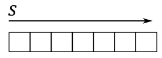
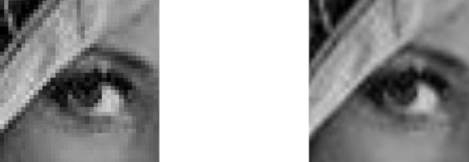
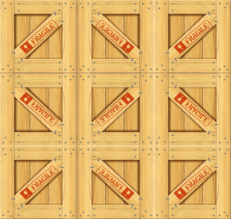

<br>


<br>

# 1 - Introduction

Up until now, we relied on per-vertex attributes to provide color information for our triangle. This approach involve associating a color with each vertex of the triangle, which allows the rasterizer to interpolate colors for internal fragments. While this method offers a straightforward way to fill 3D primitives with colors, the visual effect may lack realism. <br>
In this tutorial, our aim is to learn how to enhance the level of detail and realism in our meshes by mapping 2D textures onto 3D geometries. For this purpose, we need to transition from setting colors per-vertex to setting colors per-fragment. The upcoming sections of the tutorial will guide us through the necessary steps to achieve this transition. <br>
Typically, textures are created by skilled graphic artists and provided as assets for our rendering. However, for the purpose of simplicity, we will create a basic texture programmatically.

Before we delve into the code of the sample, it's important to understand some fundamental theory behind texture mapping. Texture mapping is a technique that enables us to apply an image or pattern onto a 3D mesh, enriching its visual appearance and adding fine-grained details. By leveraging texture mapping, we can achieve more realistic and visually appealing renderings.

<br>

<br>

# 2 - Textures

A texture is a resource that can be thought of as an array of contiguous texels (texture elements) stored in memory. Texels are the smallest units of a texture that can be read or written to. A sampler can be used to filter accesses to the texels of a texture. Each texel contains 1 to 4 components, also known as channels, arranged in one of the formats defined by the **VkFormat** enumeration. For example, the **VK_FORMAT_R8G8B8A8_UNORM** format specifies that each texel is a 32-bit value composed of four 8-bit unsigned-normalized-integer channels. This means that each channel can represent 256 different values in the range $[0/255,\ 255/255]=[0,\ 1]$.

**VkImage** is the type used to represents textures in our applications. We used **VkImage** to create and represent swapchain images, which can be thought of as textures used as render targets by the graphics pipeline. However, a **VkImage** only represents the raw texture data as an array of texels. To provide additional information such as the format and type (i.e., 1D, 2D, etc.) or to select a portion of the texture (a subresource), we need to create an image view.

Textures are often created by graphic artists and provided as JPEG or PNG files, which are two of the most popular image file formats. However, to use these files in a Vulkan application, we need additional code to convert the image data into a supported Vulkan format. Alternatively, graphic artists or programmers can convert the image data and store it in a special container file that can hold texture data in one of the supported Vulkan formats (either compressed or uncompressed). The header of a container file also contains various information about the texture, such as the format and size, which makes it easier for graphic programmers to use textures in their programs. Further information on texture containers will be provided in a later tutorial.

<br>

## 2.1 - 1D Textures

A 1D texture, in its simplest form, can be visualized as an array of contiguous texels in memory. In this case, the texture data that can be addressed with a single coordinate (*s* in the image below).

<br>



<br>

Adding more complexity, you can also create a 1D texture with mipmap levels, as shown in the following image.

<br>


<br>

Just think of it as a single resource that is made up of three subresources. Mipmaps play a crucial role in texture sampling and filtering by providing smaller versions of the original image. The highest level, known as level 0, include the original image and holds the finest level of detail. As we move down the hierarchy, each subsequent level contains a progressively smaller mipmap with reduced details. <br>
For a 1D texture with mipmaps, the smallest level contains a mipmap composed of one texel. Mipmaps are generated by halving the size of the previous level, rounding up to the nearest integer, until we get a mipmap of a single texel. For example, the illustration above shows a $5\times 1$ texture whose next lower mipmap is a $2\times 1$ texture, whose next (and last) mipmap is a $1\times 1$ sized texture. <br>
To facilitate identification and retrieval of specific subresources during geometry rendering based on camera distance, each level is assigned an index, commonly referred to as LOD (level-of-detail). This LOD index serves as a useful tool for accessing the appropriate mipmap level when required.

<br>

### 2.1.1 - 1D Array texture

Vulkan also supports multiple 1D textures stored in a single texture object called array texture, whose elements are usually referred to as layers. An array texture of 1D textures looks conceptually like the following illustration.

<br>


<br>

The above array texture includes three layers, each containing three mipmaps. So, you can also consider it as a single resource that is made up of nine subresources.

<br>


<br>

Typically, array textures include homogeneous elements. This means that all layers in an array texture should have the same format, size, and number of mipmap levels. The size of an array texture is set to the dimension of the topmost mipmap level. For example, the size of the array texture illustrated above is 5 because the topmost mipmap of each layer includes five texels.

<br>

## 2.2 - 2D Textures and 2D array textures

A 2D Texture can be conceptually visualized as a 2D grid of texels - although physically stored as an array of contiguous texels, just like 1D textures. This grid-like (logical) arrangement facilitates addressing individual texels using two coordinates (*s* and *t* in the image below), enabling  efficient access and manipulation of texels within the texture. Similar to 1D textures, 2D textures may contain mipmap levels, and subresources. A fully populated 2D texture resource (with layers and mipmaps) can be visualized in the following illustration.

<br>


<br>

The texture above has a $3\times 5$ mipmap at the topmost level, along with two other smaller mipmaps that at lower levels.

A 2D array texture is an array of 2D textures included in a single texture object. Like 1D array textures, all layers should have the same format, size, and number of mipmap levels.
<br>


<br>

The array texture illustrated above contains three layers, each with a $3\times 5$ mipmap at the topmost level, and with two additional smaller mipmaps at lower levels. So, you can also consider it as a single resource made up of nine subresources.

It’s worth noting that 3D textures exist as well, but we'll leave the discussion of 3D textures for a later tutorial.

<br>

<br>

# 3 - Texel Coordinates

Textures are addressed by texel coordinates. There are three texel coordinate systems:

- unnormalized texel coordinates $[0.0,\ width/height)$

- normalized texel coordinates $[0.0,\ 1.0]$

- integer texel coordinates $[0,\ width/height)$

<br>


<br>

The unnormalized texel coordinates $(s, t)$ are expressed with respect to the bottom-left corner of the texture. For the $8\times 4$ texture illustrated above, the $s$ coordinate is within the texture if it falls within the range of $0.0$ to $8.0$, otherwise it is outside. The same applies to the $t$ coordinate, but considering the range of $0.0$ to $4.0$.

The Integer texel coordinates $(i, j)$ can be considered as a tuple to index into a texture to select its texels. This means that the coordinates $(i, j)$ correspond to the texel located in the $i$-th column and $j$-th row of the texture, starting from the bottom-left corner. For example, in the $8\times 4$ texture illustrated above, the texel at the bottom-left corner would have integer texel coordinates $(0,0)$ and the texel at the top-right corner would have integer texel coordinates $(7, 3)$.

The normalized texel coordinates $(u, v)$ are expressed with respect to the bottom-left corner of the texture, just like the unnormalized coordinates. However, unlike unnormalized coordinates, normalized coordinates are always in the range of $0.0$ to $1.0$. Normalized coordinates are obtained by dividing the unnormalized coordinates by the corresponding dimension of the texture. For example, for the $8\times 4$ texture illustrated above, the unnormalized texel coordinate $(4,2)$ would correspond to the normalized texel coordinate $(0.5, 0.5)$ since we divide $4$ by $8$, and $2$ by $4$.

<br>

Of course, we can select a texel in a texture by specifying its integer texel coordinates. However, in order to map textures onto primitives, Vulkan requires normalized texel coordinates in the range $[0.0, 1.0]$. This is because, by using normalized texel coordinates, we can address texels without knowing the size of a texture. For example, in the following illustration, we can select the central texel in the first row of texels for two different textures by using the normalized texel coordinates $(0.5, 0.0)$.

<br>


<br>

>Actually, a Vulkan device can still process and use normalized texel coordinates outside the range of $0.0$ to $1.0$. The way it handles these coordinates depends on the addressing mode set in the sampler object. Indeed, the addressing mode determines how a device should map texel coordinates that fall outside the range $[0.0, 1.0]$ to texels within the texture. Common addressing modes include clamp-to-edge, repeat, and mirrored-repeat. Additional information will be provided shortly.

<br>

Applying a texture to a 3D primitive involves mapping texel coordinates to the vertices of the primitive. However, how can we map 2D texel coordinates to 3D positions? One way to do that is through a technique called UV mapping, which conceptually involves unwrapping the 3D mesh onto the unit square $[0.0, 1.0]\times [0.0, 1.0]$ that defines the coordinate system for normalized texel coordinates. This process is similar to unwrapping a Christmas chocolate on a table.

<br>


<br>

UV mapping allows vertex positions to be associated with unnormalized texel coordinates within the unit square defined above. This allows us to determine which texel from the texture will be mapped to a specific vertex position. We’ll demonstrate this soon with a straightforward example.

<br>


<br>

Here, for the sake of semplicity, we will consider a single triangle that is mapped to the normalized texel space, as our mesh consists of only one triangle.

<br>


<br>

By associating the normalized texel coordinates $(0.5, 1.0)$, $(0.0, 0.0)$, and $(1.0, 0.0)$ respectively with the vertices $\mathbf{v}_0$, $\mathbf{v}_1$, and $\mathbf{v}_2$ of a triangle in 3D space (as described in the corresponding vertex buffer), we establish a connection between vertex position and normalized texture coordinates. To obtain the integer texel coordinates that allow us to select a texel from the texture, we can multiply each component of the normalized texel coordinates by the corresponding dimension of the texture in texels, minus 1, and round the result. 

For example, if we have an $8\times 4$ texture, the vertex $\mathbf{v}_0$ in the figure above would be paired with the integer texel coordinates $\big(⌊(0.5∗(8-1))⌋,\ ⌊(1.0∗(4-1))⌋\big)=(⌊7/2⌋, 3)=(3, 3)$. This way, we associated the vertex position $\mathbf{v}_0$ with the fourth texel of the last row of the texture. The same goes for the vertices $\mathbf{v}_1$ and $\mathbf{v}_2$, which would be associated respectively with the first and last texels of the first row. Eventually, we established a connection between vertices and texels.

This association between vertices and texels allows us to enhance the level of detail and realism in our rendering. How? Well, first of all, it should be noted that associating vertices with texels practically means that we must declare the normalized texel coordinates as a vertex attribute to associate them with vertex positions in 3D space. When the rasterizer interpolates the normalized texel coordinates of a fragment, we can use the result in the shader code to select a texel from a texture as the per-fragment color (more on this shortly). This means that instead of having an interpolated color for each fragment within a primitive, we now have a color selected from a texture that represents a real material. This allows us to select a color per-fragment rather than per-vertex, leading to an higher level of detail and realism.

<br>

<br>

# 4 - Sampling

In the context of texture mapping, sampling refers to the process of retrieving data from a texture using a sampler, which allows to look up texel values from their normalized texel coordinates. <br>
In theory, it would be possible to associate vertex positions in the vertex buffer with normalized texel coordinates that always translate to integer texel coordinates. However, even in that case, the rasterizer will likely emit fragments with interpolated normalized texel coordinates that do not translate to integer texel coordinates.

<br>


<br>

For example, consider the generic interpolated normalized texel coordinates $(u,v)$ which translate to the unnormalized texel coordinates $(s,t)=(6.12, 1.28)$ as shown in the illustration above. Now, the question arises: which texel should be selected in this case? To address this issue, we require a sampler that, among its various properties, specifies a filter for texel selection. <br>
There are three filters available for texel selection: nearest, linear and anisotropic (we will cover the anisotropic filter in a later tutorial).

**Nearest filtering** involve selecting the nearest texel by simply truncating the fractional part from the unnormalized texel coordinates. So, in the case illustrated above, the selected texel will be the one with integer texel coordinates $(6,1)$.

**Linear filtering** involves selecting the four nearest texels and interpolating their values. In this case, it is preferable to consider the centers of the texels for the texel selection. The reason for this is that the calculation of the four texels is computed by simply dropping the fractional part and increasing the component of the unnormalized texel coordinates: $(⌊x⌋,\ ⌊y⌋)$, $(⌊x⌋+1,\ ⌊y⌋)$, $(⌊x⌋,\ ⌊y⌋+1)$ and $(⌊x⌋+1,\ ⌊y⌋+1)$. That way, if we were to use the unnormalized texel coordinates in this calculation, we might not select the nearest texels. For example, in the case illustrated above, the four selected texels would range from $(6, 1)$ to $(7, 2)$, which are not the nearest ones. The nearest texels actually range from $(5, 0)$ to $(6, 1)$. So how can we select them? We need to convert the unnormalized texel coordinates to consider their location relative to the coordinate system formed by the four nearest texel centers. This can be done by subtracting $0.5$ from both components of the unnormalized texel coordinates. For example, $(6.12, 1.28)–(0.5, 0.5)=(5.62, 0.78)$. This way, the nearest texels range exactly from $(5, 0)$ to $(6,1)$. Now, retaining only the fractional parts we have that $(5.62, 0.78)$ converts to $(0.62, 0.78)$. That’s the exact location of $(s,t)$ in the $[0.0, 1.0]\times [0.0, 1.0]$ square formed by the four nearest texel centers. Eventually, we can interpolate their values as follows.

$C_1=38\\%$ of $(5,0)+62\\%$ of $(6,0)$ <br>
$C_2=38\\%$ of $(5,1)+62\\%$ of $(6,1)$ <br>
$C=78\\%$ of $C_1+12%$ of $C_2$

<br>

In this way, we can obtain a color $C$ starting from the interpolated texel coordinates provided by the rasterizer. Observe that we linearly interpolated between the horizontal texels in the $4\times 4$ block of nearest texels using the fractional part that corresponds to the $s$ coordinate, and then we linearly interpolated the results ($C_1$​ and $C_2$​) vertically using the fractional part that corresponds to the $t$ coordinate. In other words, we performed a bilinear interpolation. Additional information on linear and bilinear interpolation will be provided in a later tutorial.

<br>

>The mapping from normalized texel coordinates to the color returned by a texture fetch instruction is an operation automatically performed by the GPU and is transparent to the programmer, who only needs to specify a filter in a sampler. However, knowing the low-level details can prove to be beneficial in the future.

<br>

## 4.1- Magnification

Using a nearest filter can lead to ugly visual effects (artifacts) during magnification. <br>
Imagine zooming in on a 3D textured mesh until it covers an area of $1024\times 1024$ pixels on your screen. What happens if the texture of this mesh is, for example, $64\times 64$? Well, that means that we have approximately $1024/64=16$ pixels for each texel, as shown in the following illustration.

<br>


<br>

Now, imagine that pixels on your screen were stickers you can shoot straight at the surface of a mesh. This means that, in the case illustrated above, you need to shoot about 16 pixels to cover a single texel. The distortion of the texel may depend on the shape of the mesh and the viewing angle, but we can ignore that for now. What’s important here is that, if we move from a pixel to the next one on the screen, we don’t necessarily move from a texel to another in the texture. That means that the normalized texture coordinates of many fragments will be mapped to the same texel (integer texel coordinates).

<br>

>Another way to think about it is this: if you zoom in on a 3D textured mesh, then big triangles will likely be projected onto the projection window. Since interpolation is performed by the rasterizer using barycentric coordinates (more on this in a later tutorial), normalized texture coordinates of adjacent fragments won't change much. Therefore, if the texture is small, many fragments will fall into the same texel area after being converted from normalized to unnormalized texel coordinates.

<br>

Visually, this can lead to a blocky effect, as shown in the following illustration (on the left), where many pixels display the same color sampled from the same texel.

<br>



<br>

You can mitigate this problem by using a linear filter (the result is shown in the figure above, on the right). That way, we don’t select the same texel, but rather we interpolate between four texels in the $3\times 3$ block surrounding it. That is, the interpolated normalized texture coordinates of a fragment translate to unnormalized texel coordinates within four texel centers that can vary, as shown in the illustration below. This results in a smoother transition between texels and can improve the visual quality of magnified textures.

<br>


<br>

## 4.2 - Minification

It’s also interesting to consider what happens when using a nearest filter during minification, when you zoom out to expand the viewing area. Imagine shooting a pixel straight at a mesh that, this time, is far away from the camera. Now, a single pixel can cover lots of texels.

<br>


<br>

As we know, the color of a fragment depends on the selected texel, calculated from the interpolated normalized texture coordinates associated with the fragment. If we have lots of texels mapped to a single pixel, then the selected texel can randomly vary from a frame to another, even if the mesh moves only slightly (less than a pixel). For example, in the case illustrated above, moving the primitive to the right or left by half a pixel would change approximately half of the texels covered by the pixel. This means that the normalized texture coordinates of the fragment visualized by the pixel can be mapped to different texels (integer texel coordinates) during this little movement. This can lead to display flickering caused by pixels that rapidly change their color. Using a linear filter can help mitigate this issue, but it doesn’t completely solve it since the four nearest texels can also change rapidly.

<br>

>Another way to think about it is this: if you zoom out until a textured mesh is far away from the camera, then small triangles will likely be projected onto the projection window. Since interpolation is performed by the rasterizer using barycentric coordinates (more on this in a later tutorial), normalized texture coordinates of adjacent fragments will likely differ significantly from each other. At that point, if the texture is big enough, adjacent fragments can select distant texels in the texture. This means that if a mesh moves slightly (less than a pixel), the interpolated normalized texture coordinates can vary enough to selected different texels for the same pixel on the screen, leading to display flickering.

<br>

Fortunately, mipmap levels provide a way to select the texture that best matches the area covered by the mesh on the screen, allowing for a mapping as close to 1:1 as possible between pixels and texels. This can help reduce artifacts caused by minification. For this purpose, a sampler can also specify a mipmap mode for mipmap selection. A nearest mipmap mode selects the mipmap whose texels are closest in size to screen pixels, while a linear mipmap mode selects the two mipmaps that provide the best match. From these two mipmaps, two texels (one from each mipmap) are sampled using the filter for texel selection. These two texels are then interpolated to return the final result (color or other data).

<br>

>Do you recall our discussion about how blocks of $2\times 2$ fragments are processed in parallel by the fragment shader? Well, this allows the GPU to calculate the change in interpolated texel coordinates of a fragment relative to its companion fragments in the block. As a result, a LOD index can be computed from this information to select the most appropriate mipmap level. Further details on this topic will be provided in a later tutorial.

<br>

<br>

# 5 - Addressing Modes

Typically, the u and v components of normalized texel coordinates range from $0.0$ to $1.0$. However, extending beyond this range can create unique texturing effects. To control how the device will handle normalized texel coordinates outside of the range, we can set a texture addressing mode for each component. For example, you can set the texture addressing mode so that a texture is tiled across a primitive. For this purpose, the device only need to find a way to map texel coordinates outside the unit square back to $[0.0, 1.0]\times [0.0, 1.0]$. There are various methods to restrict coordinates in a specific range.

In this section we will only focus on the u-coordinate, but the same applies to the v-coordinate. Additionally, we will assume that we want to draw a quad consisting of two triangles. The vertex positions of the first triangle, $\triangle_1=(v_0, v_1, v_2)$, are associated with texel coordinates of $(0.0, 0.0)$, $(0.0, 3.0)$, and $(3.0, 3.0)$ respectively, while the positions of the second triangle, $\triangle_2=(v_0, v_3, v_1)$, are associated with texel coordinates of $(0.0, 0.0)$, $(3.0, 0.0)$, and $(3.0, 3.0)$. The vertices are in counterclockwise order. The following illustration shows the quad in a $[0.0, 3.0]\times [0.0, 3.0]$ square, which extends the normalized texel space of $[0.0, 1.0]\times [0.0, 1.0]$.

<br>


<br>

## 5.1 - Repeat

This addressing mode repeats the texture on every integer junction by using the following function to transform the u-coordinate.

$\text{repeat}(u) = u – \text{floor}(u)$

<br>

So, in our example, setting the addressing mode to "Repeat" for both the u- and v-coordinates results in the texture being applied three times in both the u and v directions, as shown in the following illustration. The reason is that when, for example, the interpolated texel coordinate u is $3.0$, $\text{repeat}(3.0)$ returns $1.0$. The same happens when u is $2.0$ and (obviously) $1.0$.

<br>


<br>

## 5.2 - Mirrored  repeat

This addressing mode mirrors and repeats the texture at every integer boundary by using the following function to transform the u-coordinate.

$\text{mirror}(u)=\begin{cases}u-\text{floor}(u),\quad\quad\quad\text{if}\quad\text{floor}(u)\\% 2=0 \\\\ \text{floor}(u+1)-u,\quad\ \text{if}\quad\\text{floor}(u)\\% 2=1\end{cases}$

<br>

Setting the addressing mode to "Mirror repeat" for both the u- and v-coordinates results in the texture being applied three times in both the u and v directions. Observe that every other row and column that it is applied to is a mirror image of the preceding row or column, as shown in the following illustration. The reason is that when, for example, the interpolated texel coordinate u is $3.0$, $\text{mirror}(3.0)$ returns $1.0$ while when u is $2.0$ it returns $0.0$.

<br>



<br>

## 5.3 - Clamp to edge

This addressing mode clamps the u-component of the normalized texel coordinate to the $[0.0,\ 1.0]$ range by using the following function.

$\text{clamp}(u) = \text{max}(\text{min}(u, 1),  0)$

<br>

Setting the addressing mode to "Clamp to edge" for both the u- and v-coordinates applies the texture once, then smears the color of edge texels. In the following illustration the edges of the texture are delimited with a light grey square.

<br>


<br>

## 5.4 - Clamp to border

Setting the addressing mode to "Clamp to border" means we want to use an arbitrary color, known as the border color, for any normalized texel coordinates outside the range of $0.0$ through $1.0$. We can set the border color in the sampler object. The following illustration shows a texture on the left, and its mapping on our quad when "Clamp to border" is specified with a red border color.

<br>


<br>

## 5.3 - Mirror clamp to edge

This addressing mode is a combination of the mirror repeat and clamp to edge addressing modes. It causes the u-coordinate to be repeated as in mirrored repeat for one repetition of the texture, after which the coordinate is clamped as in clamp to edge.

<br>

<br>

# 6 - VKHelloTextures: code review

In this section, we will explore a sample that involves rendering a textured triangle. The image below shows the texture we will map to this basic mesh.  The texture showcases a classic checkerboard pattern, alternating between black and white squares. As mentioned earlier in the tutorial, textures are typically crafted by skilled graphic artists. However, in this case, the pattern of the texture is regular enough to be generated programmatically, which we will discuss in more detail shortly.

<br>


<br>

In the **VKHelloTextures** class, we need to made some updates to facilitate the transition from per-vertex color selection to per-pixel color selection, enhancing the level of detail and realism in our rendering. For this purpose, the vertex layout now incorporates normalized texel coordinates as a vertex attribute, replacing the previous color attribute. <br>
The **m_texture** variable stores important information about the texture, including dimensions, staging buffer, texture image, sampler, and more. In particular, we will use a texture that has $256\times 256$ texels, where each texel occupies 4 bytes of memory. This information is crucial in determining the required memory allocation for the texture. <br>


In the **VKHelloTextures** class, we’ve updated the vertex layout to include normalized texel coordinates (instead of a color) as a vertex attribute. This way, we can go from selecting a color per-vertex to selecting a color per-pixel, increasing the level of detail and realism. <br>
The **m_texture** variable stores important information about the texture, such as the dimensions, staging buffer, texture image, sampler, and more. In particular, we will use a texture that has $256\times 256$ texels, with each texel being 4 bytes in size. This information will help us determine how much memory we need to allocate for the texture. <br>
We have also included some helper functions to generate texture data and create the texture image. This time, we need to use an intermediary (staging) buffer to transfer the texture data from host-visible memory to local device memory.

<br>

>While certain devices may have access to specific types of textures stored in host-visible memory, it is generally more efficient for GPUs to access textures stored in local device memory. However, as direct access to local device memory from our applications is not possible, we must use a temporary buffer allocated in host-visible device memory, commonly referred to as a staging buffer, to store the texture data. To initiate the transfer process, we need to record a copy command in the command buffer to instruct the GPU to autonomously perform the transfer operation from the staging buffer to a buffer in local device memory, which is faster for the GPU to access.

<br>

```cpp
class VKHelloTextures : public VKSample
{

    // ...

private:
    
    // ...

    std::vector<uint8_t> GenerateTextureData();  // Generate texture data
    void CreateStagingBuffer();                  // Create a staging buffer
    void CreateTexture();                        // Create a texture
    
    // Vertex layout used in this sample
    struct Vertex {
        float position[3];
        float texCoord[2];
    };

    // Texture
    struct {
        BufferParameters StagingBuffer;    // Staging buffer
        ImageParameters  TextureImage;     // Texture image

        // Texture and texel dimensions
        const uint32_t TextureWidth = 256;
        const uint32_t TextureHeight = 256;
        const uint32_t TextureTexelSize = 4;  // The number of bytes used to represent a texel in the texture.
    } m_texture;
};
```
<br>

**CreateStagingBuffer** creates a staging buffer in host-visible device memory that’s large enough to hold the texture data. We specify that this buffer will be used as a source in a transfer operation. The function then maps the staging buffer to the application’s virtual address space, allowing us to copy the texture data generated by **GenerateTextureData** from the system memory used by the application to the staging buffer, that can be accessed by both the host and the device.

<br>

```cpp
void VKHelloTextures::CreateStagingBuffer()
{
    // Create a buffer object
    VkBufferCreateInfo bufferInfo = {};
    bufferInfo.sType = VK_STRUCTURE_TYPE_BUFFER_CREATE_INFO;
    bufferInfo.size = m_texture.TextureWidth * m_texture.TextureHeight * m_texture.TextureTexelSize,
    bufferInfo.usage = VK_BUFFER_USAGE_TRANSFER_SRC_BIT;
    VK_CHECK_RESULT(vkCreateBuffer(m_vulkanParams.Device, &bufferInfo, nullptr, &m_texture.StagingBuffer.Handle));

    // Used to request an allocation of a specific size from a certain memory type.
    VkMemoryAllocateInfo memAlloc = {};
    memAlloc.sType = VK_STRUCTURE_TYPE_MEMORY_ALLOCATE_INFO;
    VkMemoryRequirements memReqs;

    // Request a memory allocation from coherent, host-visible device memory that is large 
    // enough to hold the staging buffer.
    // VK_MEMORY_PROPERTY_HOST_COHERENT_BIT makes sure writes performed by the host (application)
    // will be directly visible to the device without requiring the explicit flushing of cached memory.
    vkGetBufferMemoryRequirements(m_vulkanParams.Device, m_texture.StagingBuffer.Handle, &memReqs);
    memAlloc.allocationSize = memReqs.size;
    memAlloc.memoryTypeIndex = GetMemoryTypeIndex(memReqs.memoryTypeBits, VK_MEMORY_PROPERTY_HOST_VISIBLE_BIT | VK_MEMORY_PROPERTY_HOST_COHERENT_BIT, m_deviceMemoryProperties);
    VK_CHECK_RESULT(vkAllocateMemory(m_vulkanParams.Device, &memAlloc, nullptr, &m_texture.StagingBuffer.Memory));

    // Bind the buffer object to the backing host-visible device memory just allocated.
    VK_CHECK_RESULT(vkBindBufferMemory(m_vulkanParams.Device, 
                                        m_texture.StagingBuffer.Handle, 
                                        m_texture.StagingBuffer.Memory, 0));

    // Map the host-visible device memory just allocated.
    VK_CHECK_RESULT(vkMapMemory(m_vulkanParams.Device, 
                                m_texture.StagingBuffer.Memory, 
                                0, memAlloc.allocationSize, 
                                0, &m_texture.StagingBuffer.MappedMemory));

    // Copy texture data in the staging buffer
    std::vector<uint8_t> texData = GenerateTextureData();
    memcpy(m_texture.StagingBuffer.MappedMemory, texData.data(), texData.size());

    // Unmap staging buffer
    vkUnmapMemory(m_vulkanParams.Device, m_texture.StagingBuffer.Memory);
}
```
<br>

The function **GenerateTextureData** is responsible for generating the texture data, texel by texel, applying a checkerboard pattern.

<br>

```cpp
std::vector<uint8_t> VKHelloTextures::GenerateTextureData()
{
    const size_t rowPitch = m_texture.TextureWidth * m_texture.TextureTexelSize;
    const size_t cellPitch = rowPitch >> 3;                        // The width of a cell in the checkerboard texture.
    const size_t cellHeight = m_texture.TextureWidth >> 3;         // The height of a cell in the checkerboard texture.
    const size_t textureSize = rowPitch * m_texture.TextureHeight;
 
    std::vector<uint8_t> data(textureSize);
    uint8_t* pData = &data[0];
 
    for (size_t n = 0; n < textureSize; n += m_texture.TextureTexelSize)
    {
        size_t x = n % rowPitch;
        size_t y = n / rowPitch;
        size_t i = x / cellPitch;
        size_t j = y / cellHeight;
 
        if (i % 2 == j % 2)
        {
            pData[n] = 0x00;        // R
            pData[n + 1] = 0x00;    // G
            pData[n + 2] = 0x00;    // B
            pData[n + 3] = 0xff;    // A
        }
        else
        {
            pData[n] = 0xff;        // R
            pData[n + 1] = 0xff;    // G
            pData[n + 2] = 0xff;    // B
            pData[n + 3] = 0xff;    // A
        }
    }
 
    return data;
}
```
<br>

The **rowPitch** variable represents the byte size of a texture row, calculated as ```m_texture.TextureWidth * m_texture.TextureTexelSize``` $(256∗4=1024)$. The **cellPitch** variable represents the width of a checkerboard cell in bytes, calculated as ```rowPitch / 8``` $(1024/8=128)$. This means that each row has 8 cells, where each cell includes $(128/4)= 32$ texels. The height of each cell is calculated as ```m_texture.TextureWidth / 8``` $(256/8=32)$, which means each cell includes $32$ texels as well. Observe that the cell height is measured in texels, not bytes like the cell width. This is because we will use the local variable *j* to count the texels of a cell vertically while the local variable *i* to count the bytes of a cell horizontally. These two variables, along with the loop counter *n*, play a crucial role in alternating between black and white cells. In partcular, for each texel, the function sets the RGBA values to either 0x00 or 0xFF depending on whether ```(i % 2 == j % 2)```. This creates a checkerboard pattern with black and white cells.

<br>

**CreateTexture** is responsible for creating a texture in local device memory. It also records some commands to transfer the texture data from the staging buffer to the texture resource. Additionally, it creates an image view and a sampler, which are essential for sampling the texture during rendering. We will examine the **CreateTexture** function in more detail after presenting its code in the following listing.

<br>

```cpp
void VKHelloTextures::CreateTexture()
{
    const VkFormat tex_format = VK_FORMAT_R8G8B8A8_UNORM;
    VkFormatProperties props;

    vkGetPhysicalDeviceFormatProperties(m_vulkanParams.PhysicalDevice, tex_format, &props);

    // Check if the device can sample from R8G8B8A8 textures in local device memory
    if (props.optimalTilingFeatures & VK_FORMAT_FEATURE_SAMPLED_IMAGE_BIT)
    {
        // Create a texture image
        VkImageCreateInfo imageCreateInfo = {};
        imageCreateInfo.sType = VK_STRUCTURE_TYPE_IMAGE_CREATE_INFO;
        imageCreateInfo.imageType = VK_IMAGE_TYPE_2D;
        imageCreateInfo.format = tex_format;
        imageCreateInfo.extent = {m_texture.TextureWidth, m_texture.TextureHeight, 1};
        imageCreateInfo.mipLevels = 1;
        imageCreateInfo.arrayLayers = 1;
        imageCreateInfo.samples = VK_SAMPLE_COUNT_1_BIT;
        imageCreateInfo.tiling = VK_IMAGE_TILING_OPTIMAL;
        imageCreateInfo.usage = VK_IMAGE_USAGE_TRANSFER_DST_BIT | VK_IMAGE_USAGE_SAMPLED_BIT;
        imageCreateInfo.initialLayout = VK_IMAGE_LAYOUT_UNDEFINED;
        imageCreateInfo.sharingMode = VK_SHARING_MODE_EXCLUSIVE;

        VK_CHECK_RESULT(vkCreateImage(m_vulkanParams.Device, &imageCreateInfo, nullptr, &m_texture.TextureImage.Handle));

        // Used to request an allocation of a specific size from a certain memory type.
        VkMemoryAllocateInfo memAlloc = {};
        memAlloc.sType = VK_STRUCTURE_TYPE_MEMORY_ALLOCATE_INFO;
        VkMemoryRequirements memReqs;

        // Request a memory allocation from local device memory that is large 
        // enough to hold the texture image.
        vkGetImageMemoryRequirements(m_vulkanParams.Device, m_texture.TextureImage.Handle, &memReqs);
        memAlloc.allocationSize = memReqs.size;
        memAlloc.memoryTypeIndex = GetMemoryTypeIndex(memReqs.memoryTypeBits, VK_MEMORY_PROPERTY_DEVICE_LOCAL_BIT, m_deviceMemoryProperties);
        VK_CHECK_RESULT(vkAllocateMemory(m_vulkanParams.Device, &memAlloc, nullptr, &m_texture.TextureImage.Memory));

        // Bind the image object to the backing local device memory just allocated.
        VK_CHECK_RESULT(vkBindImageMemory(m_vulkanParams.Device, 
                                            m_texture.TextureImage.Handle, 
                                            m_texture.TextureImage.Memory, 0));

        // We need to record some commands to copy staging buffer data to texture image in local device memory
        VkCommandBufferBeginInfo cmdBufferInfo = {};
        cmdBufferInfo.sType = VK_STRUCTURE_TYPE_COMMAND_BUFFER_BEGIN_INFO;
        vkBeginCommandBuffer(m_sampleParams.FrameRes.GraphicsCommandBuffers[0], &cmdBufferInfo);

        // Transition the image layout to provide optimal performance for transfering operations that use the image as a destination
        TransitionImageLayout(m_sampleParams.FrameRes.GraphicsCommandBuffers[0],
                                m_texture.TextureImage.Handle, VK_IMAGE_ASPECT_COLOR_BIT, 
                                VK_IMAGE_LAYOUT_UNDEFINED, VK_IMAGE_LAYOUT_TRANSFER_DST_OPTIMAL,
                                VK_ACCESS_NONE, VK_PIPELINE_STAGE_TOP_OF_PIPE_BIT, 
                                VK_PIPELINE_STAGE_TRANSFER_BIT);

        // Copy from staging buffer to texture image
        VkBufferImageCopy copyRegion = {};
        copyRegion.bufferOffset = 0;
        copyRegion.bufferRowLength = m_texture.TextureWidth;
        copyRegion.bufferImageHeight = m_texture.TextureHeight;
        copyRegion.imageSubresource = {VK_IMAGE_ASPECT_COLOR_BIT, 0, 0, 1};
        copyRegion.imageOffset = {0, 0, 0};
        copyRegion.imageExtent = {m_texture.TextureWidth, m_texture.TextureHeight, 1};

        vkCmdCopyBufferToImage(m_sampleParams.FrameRes.GraphicsCommandBuffers[0], 
                                m_texture.StagingBuffer.Handle, m_texture.TextureImage.Handle, 
                                VK_IMAGE_LAYOUT_TRANSFER_DST_OPTIMAL, 1, &copyRegion);

        // Transition the image layout to provide optimal performance for reading by shaders
        TransitionImageLayout(m_sampleParams.FrameRes.GraphicsCommandBuffers[0],
                        m_texture.TextureImage.Handle, VK_IMAGE_ASPECT_COLOR_BIT, 
                        VK_IMAGE_LAYOUT_TRANSFER_DST_OPTIMAL, VK_IMAGE_LAYOUT_SHADER_READ_ONLY_OPTIMAL,
                        VK_ACCESS_TRANSFER_WRITE_BIT, VK_PIPELINE_STAGE_TRANSFER_BIT, 
                        VK_PIPELINE_STAGE_FRAGMENT_SHADER_BIT);

        // Save the last image layout
        m_texture.TextureImage.Descriptor.imageLayout = VK_IMAGE_LAYOUT_SHADER_READ_ONLY_OPTIMAL;

        //
        // Create a sampler and a view
        //

        VkSamplerCreateInfo samplerInfo = {};
        samplerInfo.sType = VK_STRUCTURE_TYPE_SAMPLER_CREATE_INFO;
        samplerInfo.magFilter = VK_FILTER_NEAREST;
        samplerInfo.minFilter = VK_FILTER_NEAREST;
        samplerInfo.mipmapMode = VK_SAMPLER_MIPMAP_MODE_NEAREST;
        samplerInfo.addressModeU = VK_SAMPLER_ADDRESS_MODE_CLAMP_TO_BORDER;
        samplerInfo.addressModeV = VK_SAMPLER_ADDRESS_MODE_CLAMP_TO_BORDER;
        samplerInfo.addressModeW = VK_SAMPLER_ADDRESS_MODE_CLAMP_TO_BORDER;
        samplerInfo.anisotropyEnable = VK_FALSE;
        samplerInfo.compareOp = VK_COMPARE_OP_NEVER;
        samplerInfo.minLod = 0.0f;
        samplerInfo.maxLod = 0.0f;
        samplerInfo.mipLodBias = 0.0f;
        samplerInfo.borderColor = VK_BORDER_COLOR_FLOAT_TRANSPARENT_BLACK;
        samplerInfo.unnormalizedCoordinates = VK_FALSE;

        VkImageViewCreateInfo viewInfo = {};
        viewInfo.sType = VK_STRUCTURE_TYPE_IMAGE_VIEW_CREATE_INFO;
        viewInfo.image = m_texture.TextureImage.Handle;
        viewInfo.viewType = VK_IMAGE_VIEW_TYPE_2D;
        viewInfo.format = tex_format;
        viewInfo.components =
            {
                VK_COMPONENT_SWIZZLE_IDENTITY,  // R
                VK_COMPONENT_SWIZZLE_IDENTITY,  // G
                VK_COMPONENT_SWIZZLE_IDENTITY,  // B
                VK_COMPONENT_SWIZZLE_IDENTITY,  // A
            };
        viewInfo.subresourceRange = {VK_IMAGE_ASPECT_COLOR_BIT, 0, 1, 0, 1}; // The texture includes one mipmap level (index 0) and one array layer (index 0)

        // Create a sampler
        VK_CHECK_RESULT(vkCreateSampler(m_vulkanParams.Device, &samplerInfo, NULL, &m_texture.TextureImage.Descriptor.sampler));

        // Create an image view
        VK_CHECK_RESULT(vkCreateImageView(m_vulkanParams.Device, &viewInfo, NULL, &m_texture.TextureImage.Descriptor.imageView));
    }
    else {
        /* Can't support VK_FORMAT_R8G8B8A8_UNORM !? */
        assert(!"No support for R8G8B8A8_UNORM as texture image format");
    }

    // Flush the command buffer
    FlushInitCommandBuffer(m_vulkanParams.Device, m_vulkanParams.GraphicsQueue.Handle, m_sampleParams.FrameRes.GraphicsCommandBuffers[0], m_sampleParams.FrameRes.Fences[0]);
}
```
<br>

First, we call **vkGetPhysicalDeviceFormatProperties** to query the physical device’s format capabilities. This enables us to verify whether the device supports accessing a texture with a particular format when it is stored in memory using an optimal layout for texture sampling. As previously mentioned, some devices can also access textures stored in host-visible memory, even if they are stored as an array of texels, which may not be the most efficient way for the device to access them during texture lookups.

Then, we create an image object and allocate local device memory for an **R8G8B8A8** 2D texture. Observe that we only need one mipmap level and one array layer to represent our texture. <br>
**VK_SAMPLE_COUNT_1_BIT** specifies that there is one sampling point per texel. Multiple sampling points per texel can be used in antialiasing techniques, which will be discussed in a later tutorial. <br>
**VK_IMAGE_TILING_OPTIMAL** specifies optimal tiling, where texels are laid out in an implementation-dependent arrangement, for more efficient memory access. On the other hand, **VK_IMAGE_TILING_LINEAR** specifies linear tiling, where texels are laid out in memory row by row. Images created with tiling equal to **VK_IMAGE_TILING_LINEAR** have further restrictions on their limits and capabilities compared to images created with tiling equal to **VK_IMAGE_TILING_OPTIMAL**. <br>
**VK_IMAGE_USAGE_TRANSFER_DST_BIT | VK_IMAGE_USAGE_SAMPLED_BIT** specifies that the texture will be used as a destination in transfer operations and as a texture for sampling operations. <br>
**VK_IMAGE_LAYOUT_UNDEFINED** specifies that the initial layout is unknown. It is not necessary to specify an initial layout at the time of image creation, especially for images created with **VK_IMAGE_TILING_OPTIMAL**, for which there is not a standard initial layout. <br>
**VK_SHARING_MODE_EXCLUSIVE** specifies that access to any range of image subresources will be exclusive to a single queue family at a time.

We use one of the command buffers (allocated to implement frame buffering) to record the commands the GPU needs to execute to perform the copy of the texture data from the staging buffer to the texture in local device memory. Observe that I used the plural form "commands" because, before proceeding with the transfer operation, the GPU must first perform an image layout transition from **VK_IMAGE_LAYOUT_UNDEFINED** to **VK_IMAGE_LAYOUT_TRANSFER_DST_OPTIMAL**. This transition ensures optimal performance for the device that use our texture as the destination for transfer operations. We will examine the code of the **TransitionImageLayout** function in detail later on. <br>
The **vkCmdCopyBufferToImage** function is used to record a command that copies data from a buffer to an image (and even vice versa). It requires the command buffer in which the copy command will be recorded, the source (buffer in this case) and destination (image in this case), the layout of the destination image, and an array of **VkBufferImageCopy** structures that specify the regions to be copied. The **VkBufferImageCopy** structure includes the following fields:

- **bufferOffset** is the byte offset from the start of the buffer object where the image data begins.
  
- **bufferRowLength** and **bufferImageHeight** allow us to select a subregion of a larger image in buffer memory. The **bufferRowLength** field specifies the number of texels in a row of the buffer, while **bufferImageHeight** specifies the number of rows in the image represented by the buffer - the data in the buffer is laid out left to right, top to bottom, as illustrated in the image below. However, observe that it is the **imageExtent** field (more on this shortly) that determines how much data to write\read to\from the image memory. If **bufferRowLength** is zero, it indicates that the image data is tightly packed in the buffer, making it equal to **imageExtent.width**. Similarly, if **bufferImageHeight** is zero, it implies that the number of rows in the image represented by the buffer is equal to **imageExtent.height**.

- **imageSubresource** specifies the subresources of the image involved in the copy operation. We can copy the same buffer data to\from multiple mipmaps at the same level. Therefore, we need to specify one mipmap level and one or more array layers, if the image is an array texture. We must also specify the aspects affected by the copy operation. For textures that store colors, this information is not as crucial. However, when copying data to\from a texture that stores depth and stencil information, specifying the aspects to be copied allows the device to know which part of the texel data is affected by the copy operation.

- **imageOffset** and **imageExtent** specify the initial offsets and size (both in texels) of a subregion of the image subresources where to copy the source data. Indeed, a copy region can target either an entire mipmap at a specific level or a smaller subregion within each mipmap.


<br>


<br>

Once the texture data has been successfully copied from the staging buffer to the texture in local device memory, the GPU needs to perform another image layout transition. This transition is necessary to ensure optimal performance when the device uses the texture as a read-only shader resource in the shader code. We will review the GLSL code at the end of the tutorial. Note that we store the previous image layout to provide flexibility for potential future operations or different rendering scenarios that may require a different image layout for the texture.

Next, we proceed to create an image view and a sampler for the texture. <br>
When creating the image view, we need to specify its subresources - the set of mipmap levels and array layers accessible through the view. Additionally, we need to specify the aspect(s) of the image that will be included in the view. For color images, we must specify **VK_IMAGE_ASPECT_COLOR_BIT**, indicating that the color components of the image will be visible through the image view. Again, this information is particularly relevant for textures that store multiple types of data, such as textures storing both depth and stencil information. That way, we can create separate views to include specific aspects, such as one view for the depth part and another for the stencil part. <br>
In the sampler, we set a nearest filter for texture lookups during both magnification and minification, ensuring that the closest texel is used. For mipmap selection, we use the nearest mipmap mode. Additionally, we specify "Clamp to border" as the addressing mode for both the u and v directions. The border color we set in this case is **VK_BORDER_COLOR_FLOAT_TRANSPARENT_BLACK**, which represents black with a fully transparent alpha component.

<br>

>If the LOD index calculated by the GPU is less than or equal to zero, the texture is said to be magnified, and the filter used for texel selection within a mip level is the one specified by the **magFilter** field in the sampler. If LOD index is greater than zero, the texture is said to be minified, and the filterused for texel selection within a mip level is the one specified by the **minFilter** field in the sampler.

<br>

At the end of the **CreateTexture** function, we call **FlushInitCommandBuffer** to flush the command buffer, which allows the GPU to execute the copy operation from the staging buffer to the texture image in local device memory, along with the image layout transitions surrounding this transfer operation. The following listing shows the implementation of the **FlushInitCommandBuffer** function.

<br>

```cpp
void FlushInitCommandBuffer(VkDevice device, VkQueue queue, VkCommandBuffer cmd, VkFence fence)
{
    VK_CHECK_RESULT(vkEndCommandBuffer(cmd));
    VK_CHECK_RESULT(vkResetFences(device, 1, &fence));

    VkSubmitInfo submitInfo = {};
    submitInfo.sType = VK_STRUCTURE_TYPE_SUBMIT_INFO;
    submitInfo.pCommandBuffers = &cmd;
    submitInfo.commandBufferCount = 1;

    VK_CHECK_RESULT(vkQueueSubmit(queue, 1, &submitInfo, fence));

    VK_CHECK_RESULT(vkWaitForFences(device, 1, &fence, VK_TRUE, UINT64_MAX));
}
```
<br>

Observe that we reset the fence before submitting the command buffer. This step is necessary because we created the fences in a signaled state, which is not suitable in this case. By resetting the fence, we ensure that the CPU wait for the GPU to complete the copy operation before continuing with the frame creation. Also note that we don't reset the fence at the end of the function because it needs to be in a signaled state for the first iteration of the rendering loop, as explained in the previous tutorial (**01.E - Hello Frame Buffering**). <br>
Also, observe that we submit the command buffer containing the copy operation to the graphics queue. Indeed, according to the Vulkan specification, if a queue supports graphics operations, it implicitly supports transfer operations as well.

Now, let's take a look at the code for the **TransitionImageLayout** function.

<br>

```cpp
void TransitionImageLayout(VkCommandBuffer cmd, 
                            VkImage image, VkImageAspectFlags aspectMask, 
                            VkImageLayout oldImageLayout, VkImageLayout newImageLayout, 
                            VkAccessFlagBits srcAccessMask, VkPipelineStageFlags srcStages, 
                            VkPipelineStageFlags dstStages)
{
    VkImageMemoryBarrier imageMemoryBarrier = {};
     imageMemoryBarrier.sType = VK_STRUCTURE_TYPE_IMAGE_MEMORY_BARRIER;
     imageMemoryBarrier.srcAccessMask = srcAccessMask;
     imageMemoryBarrier.dstAccessMask = 0;
     imageMemoryBarrier.srcQueueFamilyIndex = VK_QUEUE_FAMILY_IGNORED;
     imageMemoryBarrier.dstQueueFamilyIndex = VK_QUEUE_FAMILY_IGNORED;
     imageMemoryBarrier.oldLayout = oldImageLayout;
     imageMemoryBarrier.newLayout = newImageLayout;
     imageMemoryBarrier.image = image;
     imageMemoryBarrier.subresourceRange = {aspectMask, 0, 1, 0, 1};

    switch (newImageLayout) {
    case VK_IMAGE_LAYOUT_TRANSFER_DST_OPTIMAL:
        imageMemoryBarrier.dstAccessMask = VK_ACCESS_TRANSFER_WRITE_BIT;
        break;

    case VK_IMAGE_LAYOUT_COLOR_ATTACHMENT_OPTIMAL:
        imageMemoryBarrier.dstAccessMask = VK_ACCESS_COLOR_ATTACHMENT_WRITE_BIT;
        break;

    case VK_IMAGE_LAYOUT_DEPTH_STENCIL_ATTACHMENT_OPTIMAL:
        imageMemoryBarrier.dstAccessMask = VK_ACCESS_DEPTH_STENCIL_ATTACHMENT_WRITE_BIT;
        break;

    case VK_IMAGE_LAYOUT_SHADER_READ_ONLY_OPTIMAL:
        imageMemoryBarrier.dstAccessMask = VK_ACCESS_SHADER_READ_BIT | VK_ACCESS_INPUT_ATTACHMENT_READ_BIT;
        break;

    case VK_IMAGE_LAYOUT_TRANSFER_SRC_OPTIMAL:
        imageMemoryBarrier.dstAccessMask = VK_ACCESS_TRANSFER_READ_BIT;
        break;

    case VK_IMAGE_LAYOUT_PRESENT_SRC_KHR:
        imageMemoryBarrier.dstAccessMask = VK_ACCESS_MEMORY_READ_BIT;
        break;

    default:
        imageMemoryBarrier.dstAccessMask = 0;
        break;
    }

    vkCmdPipelineBarrier(cmd, srcStages, dstStages, 0, 0, NULL, 0, NULL, 1, &imageMemoryBarrier);
}
```
<br>

Before diving into the details of the code provided above, it is essential to take a moment to introduce the concept of pipeline barriers.

<br>

### Pipeline barriers

As stated in previous tutorials, GPUs execute commands in parallel whenever possible, even when those commands come from different command buffers within the same queue. In general, tasks that are not explicitly synchronized in Vulkan can be considered to execute concurrently. However, there are situations where we need more control over this unrestrained parallelism of the GPU to ensure that some tasks complete before others are executed. To manage synchronization and ensure proper execution order, Vulkan provides mechanisms such as subpass dependencies, semaphores, fences, and pipeline barriers. We already used subpass dependencies to synchronize subpass executions and manage the layout transition of framebuffer attachments. We also used semaphores and fences to synchronize frame creation and presentation. Additionally, we can also synchronize pipeline stages and manage layout transition of pipeline resources. For example, consider a scenario where one pipeline stage writes to a resource while another stage reads from that same resource. Since Vulkan is an explicit API, we must synchronize access to the resource to ensure that the GPU knows that it should complete the execution of stages that write to the resource before executing stages that read from it.

Pipeline barriers provide developers with a powerful tool for synchronizing various aspects of a pipeline, including execution and memory access. Pipeline barriers are recorded into a command buffer as a command, but they offer synchronization control over the entire queue.

Execution barriers ensure that action commands (commands that alter framebuffer attachments, read/write buffer or image memory, such as draw, copy, etc.) submitted before the barrier reach their specified pipeline stages before any action commands submitted after the barrier start executing their specified pipeline stages. We can define an execution barrier as part of a pipeline barrier, and record it in a command buffer using the **vkCmdPipelineBarrier** function. For now, we will focus on the first three parameters of this function. The first parameter specifies the command buffer where the pipeline barrier will be inserted. The second parameter is a bitmask defining the source stages, which are the stages that must be completed by the GPU before it can begin executing the destination stages indicated in the third parameter, which is a bitmask indicating the stages that need to wait for the completion of the source stages.

However, it’s important to note that execution barriers only manage execution dependencies and not memory dependencies. Both CPUs and GPUs use caching mechanisms to speed up memory access. The main difference is that CPU caches are typically coherent while GPU caching are not. This means that when accessing memory from a C++ application, we don’t need to worry about flushing or invalidating cache lines because read operations will automatically see the results of previous completed write operations. On the other hand, GPUs need to be explicitly instructed when to flush and invalidate caches to make the most up-to-date data available and visible. For example, if we have a shader that writes to a resource and another stage that reads from it, we need to set an execution barrier to synchronize access to the resource between the two shaders. Additionally, we need to tell the GPU to flush the cache lines of the GPU core executing the shader that writes to the resource so that it can be made available in shared memory. At the same time, we must inform the GPU that it also needs to invalidate the cache lines of the GPU core running the shader that reads from the resource so that it can be visible in shared memory and pulled into cache. <br>
That’s where memory barriers come into play. We can define one or more memory barriers within a pipeline barrier by setting the last parameters of the **vkCmdPipelineBarrier** function. We can specify global memory barriers, buffer barriers, and image barriers. Global memory barriers are more general as they are applied to all memory objects. Buffer and image barriers are more specific as they are applied to device memory bound to buffer and image objects, respectively. The definition of a memory barrier consists of specifying the access types of the stages in the execution barrier so that the device can exactly know where flushing and invalidation should occur. <br>
Image barriers can also include layout transitions to reorder image data in memory, optimizing access for different pipeline stages. The layout transition needs to be performed in the middle of an image barrier to ensure that the new layout is available to the shaders that need to access it later on.

<br>

>In Vulkan, when it comes to synchronization, accessing a resource in host-visible device memory from the application is considered to be performed by a pipeline stage, even if it’s not part of the common Vulkan pipelines such as graphics, compute, and ray tracing. This also applies to transfer operations.

<br>

At this point, we can take a closer look at the **TransitionImageLayout** function, which defines a memory barrier, that includes a transition layout, within a pipeline barrier to be inserted into the command buffer. Let’s examine what happens when we call this function for the first time in **CreateTexture**.

<br>

```cpp
// Transition the image layout to provide optimal performance for 
// transfering operations that use the image as a destination
TransitionImageLayout(m_sampleParams.FrameRes.GraphicsCommandBuffers[0],
                        m_texture.TextureImage.Handle, VK_IMAGE_ASPECT_COLOR_BIT, 
                        VK_IMAGE_LAYOUT_UNDEFINED, VK_IMAGE_LAYOUT_TRANSFER_DST_OPTIMAL,
                        VK_ACCESS_NONE, VK_PIPELINE_STAGE_TOP_OF_PIPE_BIT, 
                        VK_PIPELINE_STAGE_TRANSFER_BIT);
```
<br>

In this case, we want to transition the layout of the texture we just created. This is because its current layout is undefined and we want to use it as the destination for a transfer operation. As a result, we set the old and new image layouts accordingly. <br>
Additionally, we need to set the source stages that need to be completed, along with their access types. **VK_PIPELINE_STAGE_TOP_OF_PIPE_BIT** practically means “no stage” in the sense that it refers to a dummy stage hit when an action command is parsed by the GPU to be executed. Since all commands before the pipeline barrier have already been parsed, setting **TOP_OF_PIPE** for a source stage simply tells the GPU not to worry about completing any stage. In this case, it makes sense to set **TOP_OF_PIPE** because we don’t have any command in the command buffer that accesses the texture, so we don’t need to wait before executing the destination stages (in this case, the transfer operation). With **TOP_OF_PIPE**, we should always set **VK_ACCESS_NONE** because it’s a dummy stage that doesn’t do any work - so it cannot access any resource. <br>
We also need to set the destination stages that need to wait for the source stages to be completed, along with the corresponding access types. In this case, we set **VK_PIPELINE_STAGE_TRANSFER_BIT** as the following command recorded in the command buffer is a copy to the device memory backing the texture - as stated earlier, this transfer operation is executed by a stage in its own pipeline. As you can see, the access type for destination stages is set in **TransitionImageLayout** based on the new image layout. In this case, we set **VK_ACCESS_TRANSFER_WRITE_BIT** because the copy operation writes to the device memory of the texture image, which is the resource we are synchronizing. This tells the GPU to invalidate the cache lines before executing the copy. This way, the new layout of the device memory backing the texture will be visible to the destination stage (**VK_PIPELINE_STAGE_TRANSFER_BIT**). Remember that the image layout transition is performed in the middle of the memory barrier - after the make availabe and before the make visible. <br>
Observe that an image memory barrier can affect an image subresource range within an image, so we also need to specify the aspects of the image affected by the barrier.

After executing the copy command to transfer data from the staging buffer to the texture image, we record a new pipeline barrier to perform another layout transition for the texture image. This transition is necessary because the image will transition from being used as the destination of a transfer operation to being used as a read-only shader resource.

<br>

```cpp
// Transition the image layout to provide optimal performance for reading by shaders
TransitionImageLayout(m_sampleParams.FrameRes.GraphicsCommandBuffers[0],
                m_texture.TextureImage.Handle, VK_IMAGE_ASPECT_COLOR_BIT, 
                VK_IMAGE_LAYOUT_TRANSFER_DST_OPTIMAL, VK_IMAGE_LAYOUT_SHADER_READ_ONLY_OPTIMAL,
                VK_ACCESS_TRANSFER_WRITE_BIT, VK_PIPELINE_STAGE_TRANSFER_BIT, 
                VK_PIPELINE_STAGE_FRAGMENT_SHADER_BIT);
```
<br>

In this case, we set **VK_ACCESS_TRANSFER_WRITE_BIT** as the access type of our transfer (source) stage (**VK_PIPELINE_STAGE_TRANSFER_BIT**) because we have a copy operation potentially in progress that needs to be completed before executing the layout transition. This also tells the GPU to flush the cache lines to make the copy available for the destination stages. In this case, we have a single destination stage that is **VK_PIPELINE_STAGE_FRAGMENT_SHADER_BIT** since the texture will be used as a read-only resource in the fragment shader. The layout transition from **VK_IMAGE_LAYOUT_TRANSFER_DST_OPTIMAL** to **VK_IMAGE_LAYOUT_SHADER_READ_ONLY_OPTIMAL** occurs in the middle of the memory barrier, after completing the source stage (the transfer operation) and before the destination stage (the texture lookup in the fragment shader). The destination stage access mask (**VK_ACCESS_SHADER_READ_BIT**) tells the GPU to invalidate the cache lines to make the texture in its new memory layout visible to the fragment shader.

<br>

>The fields **srcQueueFamilyIndex** and **dstQueueFamilyIndex** are used to support sharing buffers or images among multiple device queues from different queue families, which requires additional care to synchronize memory accesses. For resources created with **VK_SHARING_MODE_EXCLUSIVE**, pipeline barriers must be submitted to both the source and destination queues to release/acquire ownership. We will return to this advanced topic in a later tutorial.

<br>

Now, let’s take a look at the shader code. In particular, we need to examine the fragment shader.

<br>

```glsl
#version 450
layout (set = 0, binding = 1) uniform sampler2D tex;

layout (location = 0) in vec2 inTexCoord;
layout (location = 0) out vec4 outFragColor;

void main() 
{
  outFragColor = texture(tex, inTexCoord.xy);
}
```
<br>

Here, we define a combined image sampler named **tex**, which is backed by a descriptor associated with the binding point 1 within the first descriptor set bound to the command buffer currently executed. At this point, you should have no problem understanding the changes made to the application code to create this descriptor and include it in the descriptor set. For the complete source code, please refer to the official repository of the tutorial series.

Note that we no longer set an interpolated color as the per-fragment data returned by the fragment shader. Instead, we use the built-in GLSL function **texture** to sample a texture. This allow us to return a per-fragment color sampled from our texture by using the sampler included in the descriptor and the interpolated texel coordinates associated with the current fragment, generated and provided by the rasterizer.

<br>

<br>

Source code: [LearnVulkan](https://github.com/PAMinerva/LearnVulkan)

<br>

# References

[1] [Vulkan API Specifications](https://registry.khronos.org/vulkan/) <br>

<br>

***
If you found the content of this tutorial somewhat useful or interesting, please consider supporting this project by clicking on the **Sponsor** button.  Whether a small tip, a one time donation, or a recurring payment, it's all welcome! Thank you!<br><br>
<p align="center">
 <a href="https://github.com/sponsors/PAMinerva">
         
      </a>
</p><br>