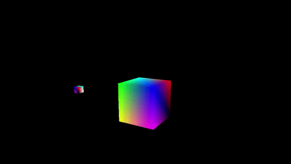
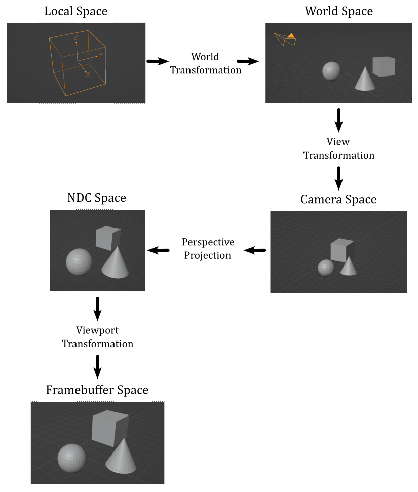
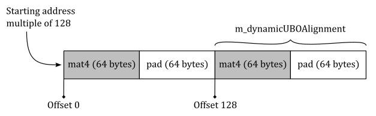
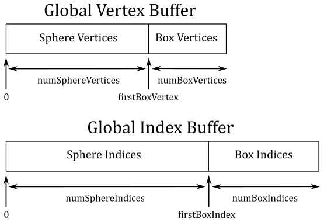

<br>



<br>

# 1 - Introduction

To fully grasp the concepts covered in this tutorial, you need to be comfortable with the basic of linear algebra. However, even if you are not familiar with the subject, the appendices 01 through 03 offer a detailed introduction to vectors, matrices, and transformations. Additionally, appendix 04 is a good starting point for learning about the coordinate systems commonly used in the graphics pipeline. I would recommend taking a look at the appendices, even if you are already familiar with the subject, to ensure that you are comfortable with the concepts covered in those sections.

The demo presented in this tutorial draw two rotating cubes on the screen. The first cube is positioned at the center of the scene and rotates counterclockwise around its own up axis. Meanwhile, the second cube rotates clockwise around the first cube, as shown in the image above.

<br>

<br>

# 2 - VKHelloTrianformations: code review

Transformations are essential in computer graphics to position and manipulate objects in a 3D environment. The graphics pipeline employs various coordinate spaces, and 3D objects must be transformed between these spaces to obtain a 2D representation to present to the user on the screen. These transformations are represented by matrices that can be used to manipulate vertex positions, typically in the shader code, to express 3D objects from one space to another until the final 2D representations can be displayed on the screen.

<br>



<br>

The image above provides a concise overview of how this process works. <br>
Tipically, we start with some 3D meshes expressed in their local space and stored in the vertex and index buffers. To bring these meshes into a global, shared space known as the world space, we apply a world transformation to the vertex positions of each mesh. Once in the world space, we can apply a view transformation to establish a specific point of view from which to observe the entire scene. In many cases, it is desirable to have a perspective view of the scene, which provides a sense of depth and realism. To achieve this, we can perform a perspective projection, which not only creates the desired perspective effect but also generates a normalized 2D representation of the 3D scene. Lastly, a viewport transformation is applied to map this normalized 2D representation onto the color attachment, which can be displayed on the screen by mapping it to the window's client area. <br>
For more detailed information on these transformations and their implementation, please refer to Appendix 04 - see the reference section at the end of this tutorial.

The sample examined in this tutorial, **VKHelloTrianformations**, uses transformations to render two rotating cubes, as described in the previuos section and illustrated in the image presented at the beginning of the tutorial.

<br>

## 2.1 - C++ code:

Let's start our analysis of the sample by taking a closer look at the **VKHelloTrianformations** class

<br>

```cpp
#define GLM_FORCE_DEPTH_ZERO_TO_ONE
#include "glm/glm.hpp"

class VKHelloTransformations : public VKSample
{
public:
    VKHelloTransformations(uint32_t width, uint32_t height, std::string name);
    ~VKHelloTransformations();

    virtual void OnInit();
    virtual void OnUpdate();
    virtual void OnRender();
    virtual void OnDestroy();

    virtual void OnResize();

private:
    
    void InitVulkan();
    void SetupPipeline();
    
    void PopulateCommandBuffer(uint32_t currentImageIndex);
    void SubmitCommandBuffer();
    void PresentImage(uint32_t currentImageIndex);
    
    void CreateVertexBuffer();              // Create a vertex buffer
    void CreateHostVisibleBuffers();        // Create a buffer in host-visible memory
    void CreateHostVisibleDynamicBuffers(); // Create a dynamic buffer
    void CreateDescriptorPool();            // Create a descriptor pool
    void CreateDescriptorSetLayout();       // Create a descriptor set layout
    void AllocateDescriptorSets();          // Allocate a descriptor set
    void CreatePipelineLayout();            // Create a pipeline layout
    void CreatePipelineObjects();           // Create a pipeline object

    // Update buffer data
    void UpdateHostVisibleBufferData();
    void UpdateHostVisibleDynamicBufferData();

    // For simplicity we use the same uniform block layout as in the vertex shader:
    //
    // layout(std140, set = 0, binding = 0) uniform buf {
    //     mat4 View;
    //     mat4 Projection;
    // } uBuf;
    //
    // This way we can just memcopy the uBufVS data to match the uBuf memory layout.
    // Note: You should use data types that align with the GPU in order to avoid manual padding (vec4, mat4)
    struct {
        glm::mat4 viewMatrix;         // 64 bytes
        glm::mat4 projectionMatrix;   // 64 bytes
    } uBufVS;

    // Uniform block defined in the vertex shader to be used as a dynamic uniform buffer:
    //
    //layout(std140, set = 0, binding = 1) uniform dynbuf {
    //     mat4 World;
    // } dynBuf;
    //
    // Allow the specification of different world matrices for different objects by offsetting
    // into the same buffer.
    struct {
        glm::mat4 *worldMatrix;        // pointer to an array of world matrices
    } dynUBufVS;
    
    // Vertex layout used in this sample
    struct Vertex {
        glm::vec3 position;
        glm::vec4 color;
    };
    
    // Vertex and index buffers
    struct {
        VkDeviceMemory VBmemory; // Handle to the device memory backing the vertex buffer
        VkBuffer VBbuffer;       // Handle to the Vulkan buffer object that the memory is bound to
        VkDeviceMemory IBmemory; // Handle to the device memory backing the index buffer
        VkBuffer IBbuffer;       // Handle to the Vulkan buffer object that the memory is bound to
        size_t indexBufferCount; // Number of indices
    } m_vertexindexBuffer;

    // In this sample we have two draw calls for each frame.
    const unsigned int m_numDrawCalls = 2;

    // Sample members
    float m_curRotationAngleRad;
    size_t m_dynamicUBOAlignment;
};
```
<br>

The *glm.hpp* header file includes the core functionalities of the GLM library. The **GLM_FORCE_DEPTH_ZERO_TO_ONE** macro allows selecting the correct projection matrix - in this case, the one that uses a depth range of $[0, 1]$ in NDC space, according to the Vulkan specifications. Indeed, by default GLM uses a depth range of $[-1, 1]$, which is used by OpenGL.

The **OnResize** function is a new virtual function that is called by **WindowResize**. Its purpose is to update the projection matrix if the user resizes of the window of the sample. As discussed in appendix 04, the projection matrix depends on the size of the projection window, which should always be proportional to the window's client area. This ensures that the final rendered result on the screen does not appear stretched or distorted. By updating the projection matrix in response to window resizing, we maintain the correct aspect ratio and proportions of the rendered scene.

Unless you need to draw a single triangle, it is more efficient to use an index buffer to avoid duplication in the vertex buffer and save memory space, as discussed in a previous tutorial (**01.B - Hello Triangle**). For this reason, in this sample, we will create and use an index buffer, in addition to the usual vertex buffer.

The framework application used in this tutorial series is designed to simplify the implementation of basic Vulkan applications without the need to worry about design principles and details typically involved in building a fully-fledged rendering engine. However, this doesn't mean that we cannot render "complex" scenes using the capabilities provided by Vulkan. For instance, although our framework currently lacks a class for representing and managing objects in the scene, we can still render multiple objects, such as a couple of cubes. We can achieve this by providing the corresponding world matrices as elements of an array stored in a dedicated buffer. The function **UpdateHostVisibleDynamicBufferData** creates this array, and we can allow the GPU to access specific elements (world matrices) in the array by using a dynamic uniform buffer that describes the entire buffer (more on this shortly). <br>
The variable **dynUBufVS.worldMatrix** will hold the address of the array of world matrices stored in system memory. We will use this address later as the source for a **memcpy** operation to transfer it to host-visible device memory, making it accessible to the GPU.

The variable **m_numDrawCalls** stores the number of draw commands recorded in a command buffer per frame. As stated earlier, each cube requires its onw world matrix. Therefore, we need this information to establish the amount of memory to allocate for the array of world matrices, both in system and host-visible memory.

As we will explain in more detail shortly, each world matrix in the array pointed to by **dynUBufVS.worldMatrix** needs to be aligned in memory according to a specific value, which can vary depending on the implementation. We will query the physical device to obtain this alignment value, storing it in the variable **m_dynamicUBOAlignment**.

The variable **m_curRotationAngleRad** will be used to store the rotation angle (in radians) of the first cube. We will derive the rotation angle for the second cube from this value.

<br>

```cpp
VKHelloTransformations::VKHelloTransformations(uint32_t width, uint32_t height, std::string name) :
VKSample(width, height, name),
m_curRotationAngleRad(0.0f),
m_dynamicUBOAlignment(0)
{
    // Initialize the pointer to the memory region that will store the array of world matrices.
    dynUBufVS.worldMatrix = nullptr;

    // Initialize the view matrix
    glm::vec3 c_pos = { 0.0f, -10.0f, 3.0f };
    glm::vec3 c_at =  { 0.0f, 0.0f, 1.0f };
    glm::vec3 c_down =  { 0.0f, 0.0f, -1.0f };
    uBufVS.viewMatrix = glm::lookAtLH(c_pos, c_at, c_down);

    // Initialize the projection matrix by setting the frustum information
    uBufVS.projectionMatrix = glm::perspectiveLH(glm::quarter_pi<float>(), (float)width/height, 0.01f, 100.0f);
}
```
<br>

In the constructor of the **VKHelloTransformations** class, we call the **glm::lookAtLH** function to build the view matrix. Note that we set the downward direction of the z-axis in the camera space, which is why we use the left-handed version of the **lookAt** function, as explained in appendix 04. The view transformation is typically updated only when there are changes in the position or orientation of the camera. However, since a camera has not yet been implemented, this will be the only place where we build the view matrix. In other words, the matrix transformation remains fixed throughout the execution of the sample.

Then, we call the **glm::perspectiveLH** function to build the projection matrix - we use the left-handed version for the same reason as the left-handed version of the **lookAt** function is used. As the aspect ratio of the projection window typically matches the aspect ratios of the color attachment and the window's client area, we need to rebuild the projection matrix whenever the user resizes the window of the sample. This happens in the **OnResize** function, which is called by the **WindowResize** function in response to a resize event. For the complete source code, please refer to the official repository of the tutorial series.

<br>

In this sample, we have two rotating cubes that could occlude each other. This means that we need a depth image to store the depth values (the normalized distance in NDC space) of the fragments generated by the rasterizer. By enabling the depth test (more on this shortly), the Per-Fragment Ops stage can determine which fragments are occluded and discard them. This ensure that only the visible fragments are displayed on the screen. The Per-Fragment Ops stage will be covered in detail in a later tutorial.

<br>

```cpp
void VKSample::CreateDepthStencilImage(uint32_t width, uint32_t height)
{
    VkFormat depthFormat = VK_FORMAT_UNDEFINED;
    VkFormatProperties props;

    // Find the highest precision depth-stencil (combined) format
    std::vector<VkFormat> depthFormats = {
        VK_FORMAT_D32_SFLOAT_S8_UINT,
        VK_FORMAT_D32_SFLOAT,
        VK_FORMAT_D24_UNORM_S8_UINT,
        VK_FORMAT_D16_UNORM_S8_UINT,
        VK_FORMAT_D16_UNORM
    };

    VkFormatProperties formatProps;
    for (auto& format : depthFormats)
    {
        vkGetPhysicalDeviceFormatProperties(m_vulkanParams.PhysicalDevice, format, &formatProps);
        // Format must support depth stencil attachment for optimal tiling
        if (formatProps.optimalTilingFeatures & VK_FORMAT_FEATURE_DEPTH_STENCIL_ATTACHMENT_BIT)
        {
            depthFormat = format;
        }
    }

    if (depthFormat == VK_FORMAT_UNDEFINED)
        assert(!"No Depth-Stencil format supported!"); 
    else // Save the depth-stencil format for later use
        m_vulkanParams.DepthStencilImage.Format = depthFormat;

    // Check if the device can sample from the depth-stencil image when stored in optimal layout.
    if (formatProps.optimalTilingFeatures & VK_FORMAT_FEATURE_SAMPLED_IMAGE_BIT)
    {
        // Create a depth-stencil image
        VkImageCreateInfo imageCreateInfo = {};
        imageCreateInfo.sType = VK_STRUCTURE_TYPE_IMAGE_CREATE_INFO;
        imageCreateInfo.imageType = VK_IMAGE_TYPE_2D;
        imageCreateInfo.format = depthFormat;
        imageCreateInfo.extent = {width, height, 1};
        imageCreateInfo.mipLevels = 1;
        imageCreateInfo.arrayLayers = 1;
        imageCreateInfo.samples = VK_SAMPLE_COUNT_1_BIT;
        imageCreateInfo.tiling = VK_IMAGE_TILING_OPTIMAL;
        imageCreateInfo.usage = VK_IMAGE_USAGE_DEPTH_STENCIL_ATTACHMENT_BIT;
        imageCreateInfo.initialLayout = VK_IMAGE_LAYOUT_UNDEFINED;
        VK_CHECK_RESULT(vkCreateImage(m_vulkanParams.Device, &imageCreateInfo, nullptr, &m_vulkanParams.DepthStencilImage.Handle));

        // Used to request an allocation of a specific size from a certain memory type.
        VkMemoryAllocateInfo memAlloc = {};
        memAlloc.sType = VK_STRUCTURE_TYPE_MEMORY_ALLOCATE_INFO;
        VkMemoryRequirements memReqs;

        // Request a memory allocation from local device memory that is large enough to hold the depth-stencil image.
        vkGetImageMemoryRequirements(m_vulkanParams.Device, m_vulkanParams.DepthStencilImage.Handle, &memReqs);
        memAlloc.allocationSize = memReqs.size;
        memAlloc.memoryTypeIndex = GetMemoryTypeIndex(memReqs.memoryTypeBits, VK_MEMORY_PROPERTY_DEVICE_LOCAL_BIT, m_deviceMemoryProperties);
        VK_CHECK_RESULT(vkAllocateMemory(m_vulkanParams.Device, &memAlloc, nullptr, &m_vulkanParams.DepthStencilImage.Memory));

        // Bind the image object to the backing local device memory just allocated.
        VK_CHECK_RESULT(vkBindImageMemory(m_vulkanParams.Device, 
                                            m_vulkanParams.DepthStencilImage.Handle, 
                                            m_vulkanParams.DepthStencilImage.Memory, 0));

        //
        // Create a depth-stencil image view
        //

        VkImageViewCreateInfo viewInfo = {};
        viewInfo.sType = VK_STRUCTURE_TYPE_IMAGE_VIEW_CREATE_INFO;
        viewInfo.image = m_vulkanParams.DepthStencilImage.Handle;
        viewInfo.viewType = VK_IMAGE_VIEW_TYPE_2D;
        viewInfo.format = depthFormat;
		viewInfo.subresourceRange = {};
		viewInfo.subresourceRange.aspectMask = VK_IMAGE_ASPECT_DEPTH_BIT;
		// Stencil aspect should only be set on depth + stencil formats (VK_FORMAT_D16_UNORM_S8_UINT..VK_FORMAT_D32_SFLOAT_S8_UINT)
		if (depthFormat >= VK_FORMAT_D16_UNORM_S8_UINT)
			viewInfo.subresourceRange.aspectMask |= VK_IMAGE_ASPECT_STENCIL_BIT;
		viewInfo.subresourceRange.baseMipLevel = 0;
		viewInfo.subresourceRange.levelCount = 1;
		viewInfo.subresourceRange.baseArrayLayer = 0;
		viewInfo.subresourceRange.layerCount = 1;

        // Create a view for the depth-stencil image
        VK_CHECK_RESULT(vkCreateImageView(m_vulkanParams.Device, &viewInfo, NULL, &m_vulkanParams.DepthStencilImage.View));
    }
    else
        assert(!"No support for the depth-stencil buffer?!");
}
```
<br>

We will attempt to create an image that stores both depth and stencil information, although we don't currently need the stencil information. The depth image should be a 2D texture with the same dimensions as the images in the swapchain, so that each pixel in the color attachment corresponds to a depth value in the depth image at the corresponding texel position. This way, the Per-Fragment Ops stage can determine the visibility of a fragment by comparing its depth value with the depth value stored in the depth image at the corresponding texel position (i.e., accessed using the integer texel coordinates of the fragment). <br>
We query the device to select the depth-stencil format with the highest precision available. For instance, if our device supports **D32_SFLOAT_S8_UINT** depth-stencil images, we have 32 bits to store the depth value as a signed floating point and 8 bits to store the stencil information as an unsigned integer. In particular, we need to check if a depth stencil image with a particular format can be used as a framebuffer depth/stencil attachment when it is stored in memory using an optimal layout. Also, we check if the device can sample from it.

After determining an appropriate depth-stencil format, we proceed to create the depth-stencil image in local device memory. We specify the usage flag **VK_IMAGE_USAGE_DEPTH_STENCIL_ATTACHMENT_BIT** to indicate that the image will be used as a depth-stencil attachment. Observe that we don't require multiple mipmap levels or layers for storing depth-stencil information.

Once the depth-stencil image is created, we also create an image view for it. We specify the appropriate format and aspects, indicating that the view exposes both the depth and stencil information if the stencil component is present in the image.

<br>

>Note that we don't require multiple depth images because the GPU doesn't need to maintain a reference to them beyond the rendering process. This is in contrast to swapchain images, which need to be presented on the screen. Additionally, as we will soon see, we can ensure explicit synchronization of depth image accesses within the render pass object by setting up a subpass dependency. 

<br>

As a result, the functions responsible for creating the render pass and framebuffers need to be modified as follows.

<br>

```cpp
void VKSample::CreateFrameBuffers()
{
    VkImageView attachments[2] = {};
    attachments[1] = m_vulkanParams.DepthStencilImage.View; // Depth-stemcil view\attachment is the same for each framebuffer

    VkFramebufferCreateInfo frameBufferCreateInfo = {};
    frameBufferCreateInfo.sType = VK_STRUCTURE_TYPE_FRAMEBUFFER_CREATE_INFO;
    frameBufferCreateInfo.pNext = NULL;
    frameBufferCreateInfo.renderPass = m_sampleParams.RenderPass;
    frameBufferCreateInfo.attachmentCount = 2;
    frameBufferCreateInfo.pAttachments = attachments;
    frameBufferCreateInfo.width = m_width;
    frameBufferCreateInfo.height = m_height;
    frameBufferCreateInfo.layers = 1;

    // Create a framebuffer for each swapchain image view
    m_sampleParams.Framebuffers.resize(m_vulkanParams.SwapChain.Images.size());
    for (uint32_t i = 0; i < m_sampleParams.Framebuffers.size(); i++)
    {
        attachments[0] = m_vulkanParams.SwapChain.Images[i].View;  // Color view\attachment is different for each framebuffer
        VK_CHECK_RESULT(vkCreateFramebuffer(m_vulkanParams.Device, &frameBufferCreateInfo, nullptr, &m_sampleParams.Framebuffers[i]));
    }
}
```
<br>

The **CreateFrameBuffers** function includes the depth-stencil view as an attachment for the framebuffers used by the application. This is necessary because the depth-stencil image will be used as an output by the drawing commands recorded in the context of the render pass instance. For additional details, please refer to the tutorial "**01.A - Hello Window**".

<br>

```cpp
void VKSample::CreateRenderPass()
{
    // This example will use a single render pass with one subpass

    // Descriptors for the attachments used by this renderpass
    std::array<VkAttachmentDescription, 2> attachments = {};

    // Color attachment
    attachments[0].format = m_vulkanParams.SwapChain.Format;                        // Use the color format selected by the swapchain
    attachments[0].samples = VK_SAMPLE_COUNT_1_BIT;                                 // We don't use multi sampling in this example
    attachments[0].loadOp = VK_ATTACHMENT_LOAD_OP_CLEAR;                            // Clear this attachment at the start of the render pass
    attachments[0].storeOp = VK_ATTACHMENT_STORE_OP_STORE;                          // Keep its contents after the render pass is finished (for displaying it)
    attachments[0].stencilLoadOp = VK_ATTACHMENT_LOAD_OP_DONT_CARE;                 // Similar to loadOp, but for stenciling (we don't use stencil here)
    attachments[0].stencilStoreOp = VK_ATTACHMENT_STORE_OP_DONT_CARE;               // Similar to storeOp, but for stenciling (we don't use stencil here)
    attachments[0].initialLayout = VK_IMAGE_LAYOUT_UNDEFINED;                       // Layout at render pass start. Initial doesn't matter, so we use undefined
    attachments[0].finalLayout = VK_IMAGE_LAYOUT_PRESENT_SRC_KHR;                   // Layout to which the attachment is transitioned when the render pass is finished
                                                                                    // As we want to present the color attachment, we transition to PRESENT_KHR

    // Depth-stencil attachment
    attachments[1].format = m_vulkanParams.DepthStencilImage.Format;                // Use the format selected for the depth-stencil image
    attachments[1].samples = VK_SAMPLE_COUNT_1_BIT;                                 // We don't use multi sampling in this example
    attachments[1].loadOp = VK_ATTACHMENT_LOAD_OP_CLEAR;                            // Clear this attachment at the start of the render pass
    attachments[1].storeOp = VK_ATTACHMENT_STORE_OP_DONT_CARE;                      // Discard its contents after the render pass is finished
    attachments[1].stencilLoadOp = VK_ATTACHMENT_LOAD_OP_DONT_CARE;                 // Similar to loadOp, but for stenciling (we don't use stencil here)
    attachments[1].stencilStoreOp = VK_ATTACHMENT_STORE_OP_DONT_CARE;               // Similar to storeOp, but for stenciling (we don't use stencil here)
    attachments[1].initialLayout = VK_IMAGE_LAYOUT_UNDEFINED;                       // Layout at render pass start. Initial doesn't matter, so we use undefined
    attachments[1].finalLayout = VK_IMAGE_LAYOUT_DEPTH_STENCIL_ATTACHMENT_OPTIMAL;  // Layout to which the attachment is transitioned when the render pass is finished

    // Setup attachment references
    //
    // Color
    VkAttachmentReference colorReference = {};
    colorReference.attachment = 0;                                    // Attachment 0 is color
    colorReference.layout = VK_IMAGE_LAYOUT_COLOR_ATTACHMENT_OPTIMAL; // Attachment layout used as color during the subpass
    // Depth-stencil
    VkAttachmentReference depthReference = {};
    depthReference.attachment = 1;                                            // Attachment 1 is depth-stencil
    depthReference.layout = VK_IMAGE_LAYOUT_DEPTH_STENCIL_ATTACHMENT_OPTIMAL; // Attachment layout used as depth-stencil during the subpass

    // Setup subpass references
    VkSubpassDescription subpassDescription = {};
    subpassDescription.pipelineBindPoint = VK_PIPELINE_BIND_POINT_GRAPHICS;
    subpassDescription.colorAttachmentCount = 1;                            // Subpass uses one color attachment
    subpassDescription.pColorAttachments = &colorReference;                 // Reference to the color attachment in slot 0
    subpassDescription.pDepthStencilAttachment = &depthReference;           // Reference to the depth-stencil attachment in slot 1
    subpassDescription.inputAttachmentCount = 0;                            // Input attachments can be used to sample from contents of a previous subpass
    subpassDescription.pInputAttachments = nullptr;                         // (Input attachments not used by this sample)
    subpassDescription.preserveAttachmentCount = 0;                         // Preserved attachments can be used to loop (and preserve) attachments through subpasses
    subpassDescription.pPreserveAttachments = nullptr;                      // (Preserve attachments not used by this sample)
    subpassDescription.pResolveAttachments = nullptr;                       // Resolve attachments are resolved at the end of a sub pass and can be used for e.g. multi sampling

    // Setup subpass dependencies
    std::array<VkSubpassDependency, 2> dependencies = {};

    // Setup dependency and add implicit layout transition from final to initial layout for the color attachment.
    // (The actual usage layout is preserved through the layout specified in the attachment reference).
    dependencies[0].srcSubpass = VK_SUBPASS_EXTERNAL;
    dependencies[0].dstSubpass = 0;
    dependencies[0].srcStageMask = VK_PIPELINE_STAGE_COLOR_ATTACHMENT_OUTPUT_BIT;
    dependencies[0].dstStageMask = VK_PIPELINE_STAGE_COLOR_ATTACHMENT_OUTPUT_BIT;
    dependencies[0].srcAccessMask = VK_ACCESS_NONE;
    dependencies[0].dstAccessMask = VK_ACCESS_COLOR_ATTACHMENT_WRITE_BIT | VK_ACCESS_COLOR_ATTACHMENT_READ_BIT;

    // Setup dependency and add implicit layout transition from final to initial layout for the depth-stencil attachment.
    // (The actual usage layout is preserved through the layout specified in the attachment reference).
    dependencies[1].srcSubpass = VK_SUBPASS_EXTERNAL;
    dependencies[1].dstSubpass = 0;
    dependencies[1].srcStageMask = VK_PIPELINE_STAGE_EARLY_FRAGMENT_TESTS_BIT | VK_PIPELINE_STAGE_LATE_FRAGMENT_TESTS_BIT;
    dependencies[1].dstStageMask = VK_PIPELINE_STAGE_EARLY_FRAGMENT_TESTS_BIT | VK_PIPELINE_STAGE_LATE_FRAGMENT_TESTS_BIT;
    dependencies[1].srcAccessMask = VK_ACCESS_DEPTH_STENCIL_ATTACHMENT_WRITE_BIT;
    dependencies[1].dstAccessMask = VK_ACCESS_DEPTH_STENCIL_ATTACHMENT_READ_BIT | VK_ACCESS_DEPTH_STENCIL_ATTACHMENT_WRITE_BIT;

    // Create the render pass object
    VkRenderPassCreateInfo renderPassInfo = {};
    renderPassInfo.sType = VK_STRUCTURE_TYPE_RENDER_PASS_CREATE_INFO;
    renderPassInfo.attachmentCount = static_cast<uint32_t>(attachments.size());  // Number of attachments used by this render pass
    renderPassInfo.pAttachments = attachments.data();                            // Descriptions of the attachments used by the render pass
    renderPassInfo.subpassCount = 1;                                             // We only use one subpass in this example
    renderPassInfo.pSubpasses = &subpassDescription;                             // Description of that subpass
    renderPassInfo.dependencyCount = static_cast<uint32_t>(dependencies.size()); // Number of subpass dependencies
    renderPassInfo.pDependencies = dependencies.data();                          // Subpass dependencies used by the render pass

    VK_CHECK_RESULT(vkCreateRenderPass(m_vulkanParams.Device, &renderPassInfo, nullptr, &m_sampleParams.RenderPass));
}
```
<br>

The code for the **CreateRenderPass** function is quite self-explanatory. However, it is worth mentioning the setup of the subpass dependency, which is used to synchronize concurrent access to the depth-stencil attachment. In this case, our subpass (**srcSubpass** = 0) will also depend on drawing commands executed outside of the current render pass instance (**srcSubpass** = **VK_SUBPASS_EXTERNAL**) that operate on the depth stencil image. <br>
The **VK_PIPELINE_STAGE_EARLY_FRAGMENT_TESTS_BIT** specifies the stage of the pipeline where early fragment tests (depth and stencil tests before fragment shading) are performed. The **VK_PIPELINE_STAGE_LATE_FRAGMENT_TESTS_BIT** specifies the stage of the pipeline where late fragment tests (depth and stencil tests after fragment shading) are performed. <br>
Additional information will be provided in a later tutorial when we discuss the Per-Fragment Ops stage in more detail.

<br>

Unless you need to draw a simple triangle, it is recommended to use an index buffer to avoid duplicating vertices and optimize memory usage. Let's see how the **CreateVertexBuffer** function has been updated to accomodate this approach.

```cpp
// Create vertex and index buffers
void VKHelloTransformations::CreateVertexBuffer()
{
    //
    // Create the vertex and index buffers.
    //

    // Define the geometry for a cube in local space (Z points up in this case).
    //
    // The eight vertices of the cube
    std::vector<Vertex> cubeVertices =
    {
        { { -1.0f, 1.0f, 1.0f },   {0.0f, 0.0f, 1.0f, 1.0f} },
        { { 1.0f, -1.0f, 1.0f },   {0.0f, 1.0f, 1.0f, 1.0f} },
        { { 1.0f, 1.0f, 1.0f },    {0.0f, 1.0f, 0.0f, 1.0f} },
        { { -1.0f, -1.0f, 1.0f },  {1.0f, 0.0f, 0.0f, 1.0f} },
        { { -1.0f, 1.0f, -1.0f },  {1.0f, 0.0f, 1.0f, 1.0f} },
        { { 1.0f, -1.0f, -1.0f },  {1.0f, 1.0f, 1.0f, 1.0f} },
        { { 1.0f, 1.0f, -1.0f },   {1.0f, 1.0f, 0.0f, 1.0f} },
        { { -1.0f, -1.0f, -1.0f }, {0.0f, 0.0f, 0.0f, 1.0f} }
    };
    size_t vertexBufferSize = static_cast<size_t>(cubeVertices.size()) * sizeof(Vertex);

    //    0________ 2
    //    /|      /|
    //   /_|_____/ |
    //  3|4|_ _ 1|_|6
    //   | /     | /
    //   |/______|/
    //  7       5
    //
    // The indices defining the two triangle for each of the six faces of the cube
    // The vertices of each triangle are selected in counter-clockwise order.
    std::vector<uint16_t> indexBuffer =
    {
        // TOP
        0,1,2,
        0,3,1,
    
        // FRONT
        3,5,1,
        3,7,5,
    
        // RIGHT
        0,4,7,
        0,7,3,
    
        // LEFT
        1,6,2,
        1,5,6,
    
        // BACK
        2,6,4,
        2,4,0,
    
        // BOTTOM
        6,7,4,
        6,5,7,
    };
    size_t indexBufferSize = static_cast<size_t>(indexBuffer.size()) * sizeof(uint16_t);
    m_vertexindexBuffer.indexBufferCount = indexBuffer.size();

    //
    // Create the vertex and index buffers in host-visible device memory for convenience. 
    // This is not recommended as it can result in lower rendering performance.
    //
    
    // ...

}
```
<br>

The vertex buffer now only defines the positions (and corresponding colors) of the eight corners of the cube in its local space. The mesh itself is described by the index buffer, which defines each of the six faces of the cube using two triangles, whose vertices are provided in counterclockwise order. Note that in the local space of the cube, the z-axis points upwards, the x-axis points in the right direction, and the y-axis points forwards.

<br>

The **CreateHostVisibleDynamicBuffers** function is responsible for creating the buffer that stores the array of world matrices for the objects in our scene - I'll occasionally refer to it as a dynamic buffer since it will be described by a dynamic uniform buffer. This enables us to dynamically offset into the buffer and select the world matrix to use in the shader code, which we’ll discuss more shortly.

<br>

```cpp
void VKHelloTransformations::CreateHostVisibleDynamicBuffers()
{
    // Allocate memory space for the buffer that stores the array of world matrices.
	// Uniform block alignment differs between GPUs.

	// Calculate required alignment based on minimum device offset alignment
	size_t minUBOAlignment = m_deviceProperties.limits.minUniformBufferOffsetAlignment;
	m_dynamicUBOAlignment = sizeof(glm::mat4); // 64 bytes
	if (minUBOAlignment > 0)
		m_dynamicUBOAlignment = (m_dynamicUBOAlignment + minUBOAlignment - 1) & ~(minUBOAlignment - 1);
    
	size_t dynBufferSize = m_numDrawCalls * m_dynamicUBOAlignment;

    dynUBufVS.worldMatrix = (glm::mat4*)AlignedAlloc(dynBufferSize, m_dynamicUBOAlignment);
	assert(dynUBufVS.worldMatrix);

    // Used to request an allocation of a specific size from a certain memory type.
    VkMemoryAllocateInfo memAlloc = {};
    memAlloc.sType = VK_STRUCTURE_TYPE_MEMORY_ALLOCATE_INFO;
    VkMemoryRequirements memReqs;
    
    // Create the buffer object
    VkBufferCreateInfo bufferInfo = {};
    bufferInfo.sType = VK_STRUCTURE_TYPE_BUFFER_CREATE_INFO;
    bufferInfo.size = dynBufferSize;
    bufferInfo.usage = VK_BUFFER_USAGE_UNIFORM_BUFFER_BIT;

    m_sampleParams.FrameRes.HostVisibleDynamicBuffers.resize(MAX_FRAME_LAG);
    for (size_t i = 0; i < MAX_FRAME_LAG; i++)
    {
        // Create a buffer in coherent, host-visible device memory that is large enough to hold the array of world matrices.
        CreateBuffer(m_vulkanParams.Device, 
                        bufferInfo, 
                        m_sampleParams.FrameRes.HostVisibleDynamicBuffers[i],
                        VK_MEMORY_PROPERTY_HOST_VISIBLE_BIT | VK_MEMORY_PROPERTY_HOST_COHERENT_BIT,
                        m_deviceMemoryProperties);

        // Store information needed to write\update the corresponding descriptor (dynamic uniform buffer) in the descriptor set later.
        // In this case:
        // offset is the base offset (into the buffer) from which dynamic offsets will be applied
        // range is the static size used for all dynamic offsets; describe a region of sizeof(glm::mat4) bytes in the buffer, depending on the dynamic offset provided
        m_sampleParams.FrameRes.HostVisibleDynamicBuffers[i].Descriptor.buffer = m_sampleParams.FrameRes.HostVisibleDynamicBuffers[i].Handle;
        m_sampleParams.FrameRes.HostVisibleDynamicBuffers[i].Descriptor.offset = 0;
        m_sampleParams.FrameRes.HostVisibleDynamicBuffers[i].Descriptor.range = sizeof(glm::mat4);

        // Save buffer size for later use
        m_sampleParams.FrameRes.HostVisibleDynamicBuffers[i].Size = dynBufferSize;
    }    
}
```
<br>

In Vulkan, uniform blocks need to be properly aligned in device memory according to device-dependent alignment requirements. So far, we have been relying on **vkAllocateMemory** to allocate device memory for buffers without worrying about alignment issues. This approach works fine when allocating memory for a single uniform block because **vkAllocateMemory** ensures that the allocated memory starts at an address aligned to the required alignment for uniform blocks on the target device. However, when working with an array of uniform blocks, it becomes our responsibility to ensure that each uniform block in the buffer is properly aligned to the correct alignment value. <br>
Therefore, we first need to get the alignment value for uniform blocks from the device’s properties. This value is called **minUniformBufferOffsetAlignment** as it provides the minimum required alignment, in bytes, for the **offset** member of the **VkDescriptorBufferInfo** structure for uniform buffers (see "**01.D-Hello-Uniforms**"). Similarly, dynamic offsets for dynamic uniform buffers must be multiples of this limit. This means that when we use a dynamic uniform buffer to describe a buffer containing an array of uniform blocks, we can pass a dynamic offset to **vkCmdBindDescriptorSets** to add to the **offset** member of **VkDescriptorBufferInfo** and offset into the buffer to select the appropriate uniform block (we’ll discuss this more shortly).

<br>

>The present box provides a practical explanation for the following instruction:
>
>```m_dynamicUBOAlignment = (m_dynamicUBOAlignment + minUBOAlignment - 1) & ~(minUBOAlignment - 1);```
>
>Consider a system where **minUniformBufferOffsetAlignment** is 128. If each uniform block in an array represents a world matrix, then we need at least 64 bytes for each of the uniform blocks in the array, as a world matrix is a contiguous collection of 16 floating-point values of 4 bytes each. From this information, we can calculate the alignment value for our uniform blocks by using the instruction above, which results in
>
> ```m_dynamicUBOAlignment = (64 + 128 - 1) & ~(128 - 1) = 191 & ~(127) = 191 & -128 = 0000 0000 1011 1111 & 1111 1111 1000 0000 = 0000 0000 1000 0000 = 128```
>
> In short, ```(m_dynamicUBOAlignment + minUBOAlignment - 1)``` avoids cutting off uniform block data, while the AND operation with ```& ~(minUBOAlignment - 1)``` rounds up to the next minimum alignment value. For example, suppose you have a uniform block of 129 bytes with **minUniformBufferOffsetAlignment** that is 128. We need to add 127 to 129 to include the 129th byte of the uniform block, which is part of the second multiple of 128 (up to 256), without exceeding the third multiple (i.e., stay below 384). So, we have (129 + 127) = 256, which when ANDed with -128 gives us 256. You can verify that the same value (256) is returned with uniform blocks from 129 up to 256 bytes.
>
>The following image provides a visual representation of the expected buffer layout when allocated on the system considered in this box.
>
><br>
>
>

<br>

**AlignedAlloc** is an helper function that compensates for the lack of a suitable cross-platform function in the C++ standard library. It allows to allocate system memory starting from an address aligned to a certain value. **CreateBuffer** is another helper function that I implemented to minimize code duplication when creating a buffer object and allocating the associated device memory. For the complete source code, refer to the official repository of the tutorial series.

Note that we use **m_numDrawCalls** to determine the required memory size for storing the array of world matrices of our cubes, while also ensuring alignment to the value specified by **minUniformBufferOffsetAlignment**. In this case, we need two world matrices, one for each cube.

**dynUBufVS.worldMatrix** points to the aligned buffer in system memory allocated using **AlignedAlloc**. We then proceed to call **CreateBuffer** to allocate a buffer of the same size in device memory - recall that we must duplicate frame resources, so we usually need more than one of these buffers in device memory to preserve frame resources. <br>
Observe that **CreateBuffer** uses **vkAllocateMemory** to allocate device memory, which ensure automatic alignment. However, we allocate system memory by using **AlignedAlloc** to ensure that each world matrix will be properly aligned after a copy operation (more on this shortly).

We set the **offset** member of the **VkDescriptorBufferInfo** structure to zero since the first world matrix will be stored at the beginning of the buffer. Additionally, we set the **range** member to the size of a **glm::mat4**, which ensures that the memory region includes a world matrix in the uniform buffer. A dynamic uniform buffer is typically used as a descriptor to describe a buffer that contains multiple (aligned) uniform blocks because it allows us to select a specific uniform block specifying a dynamic offset during the binding of descriptor sets (more details on this will be provided soon).

As you may have guessed, we will use **dynUBufVS.worldMatrix** as the source in a **memcpy** operation to update the world matrices of the cubes at each frame, enabling us to rotate the cubes. This approach ensures that each world matrix is stored in device memory starting from an address that is a multiple of **minUniformBufferOffsetAlignment**.

<br>

The code for creating the descriptor pool, descriptor set layout, and descriptor set will be presented without further explanations, assuming that by this point you have the necessary knowledge to understand the modifications made in these functions. In particular, we need to create a descriptor set containing a uniform buffer to describe the buffer with the view and projection matrices, as well as a dynamic uniform buffer to describe the buffer representing the array of world matrices.

<br>

```cpp
void VKHelloTransformations::CreateDescriptorPool()
{
    //
    // To calculate the amount of memory required for a descriptor pool, the implementation needs to know
    // the max numbers of descriptor sets we will request from the pool, and the number of descriptors 
    // per type we will include in those descriptor sets.
    //

    // Describe the number of descriptors per type.
    // This sample uses two descriptor types (uniform buffer and dynamic uniform buffer)
    VkDescriptorPoolSize typeCounts[2];
    typeCounts[0].type = VK_DESCRIPTOR_TYPE_UNIFORM_BUFFER;
    typeCounts[0].descriptorCount = static_cast<uint32_t>(MAX_FRAME_LAG);
    typeCounts[1].type = VK_DESCRIPTOR_TYPE_UNIFORM_BUFFER_DYNAMIC;
    typeCounts[1].descriptorCount = static_cast<uint32_t>(MAX_FRAME_LAG);

    // Create a global descriptor pool
    // All descriptors set used in this sample will be allocated from this pool
    VkDescriptorPoolCreateInfo descriptorPoolInfo = {};
    descriptorPoolInfo.sType = VK_STRUCTURE_TYPE_DESCRIPTOR_POOL_CREATE_INFO;
    descriptorPoolInfo.pNext = nullptr;
    descriptorPoolInfo.poolSizeCount = 2;
    descriptorPoolInfo.pPoolSizes = typeCounts;
    // Set the max. number of descriptor sets that can be requested from this pool (requesting beyond this limit will result in an error)
    descriptorPoolInfo.maxSets = static_cast<uint32_t>(MAX_FRAME_LAG);

    VK_CHECK_RESULT(vkCreateDescriptorPool(m_vulkanParams.Device, &descriptorPoolInfo, nullptr, &m_sampleParams.DescriptorPool));
}
```

```cpp
void VKHelloTransformations::CreateDescriptorSetLayout()
{
    //
    // Create a Descriptor Set Layout to connect binding points (resource declarations)
    // in the shader code to descriptors within descriptor sets.
    //
    // Binding 0: Uniform buffer (Vertex shader)
    VkDescriptorSetLayoutBinding layoutBinding[2] = {};
    layoutBinding[0].binding = 0;
    layoutBinding[0].descriptorType = VK_DESCRIPTOR_TYPE_UNIFORM_BUFFER;
    layoutBinding[0].descriptorCount = 1;
    layoutBinding[0].stageFlags = VK_SHADER_STAGE_VERTEX_BIT;
    layoutBinding[0].pImmutableSamplers = nullptr;

    // Binding 1: Dynamic uniform buffer (Vertex shader)
    layoutBinding[1].binding = 1;
    layoutBinding[1].descriptorType = VK_DESCRIPTOR_TYPE_UNIFORM_BUFFER_DYNAMIC;
    layoutBinding[1].descriptorCount = 1;
    layoutBinding[1].stageFlags = VK_SHADER_STAGE_VERTEX_BIT;
    layoutBinding[1].pImmutableSamplers = nullptr;

    VkDescriptorSetLayoutCreateInfo descriptorLayout = {};
    descriptorLayout.sType = VK_STRUCTURE_TYPE_DESCRIPTOR_SET_LAYOUT_CREATE_INFO;
    descriptorLayout.pNext = nullptr;
    descriptorLayout.bindingCount = 2;
    descriptorLayout.pBindings = layoutBinding;

    VK_CHECK_RESULT(vkCreateDescriptorSetLayout(m_vulkanParams.Device, &descriptorLayout, nullptr, &m_sampleParams.DescriptorSetLayout));
}
```

```cpp
void VKHelloTransformations::AllocateDescriptorSets()
{
    // Allocate MAX_FRAME_LAG descriptor sets from the global descriptor pool.
    // Use the descriptor set layout to calculate the amount on memory required to store the descriptor sets.
    VkDescriptorSetAllocateInfo allocInfo = {};
    allocInfo.sType = VK_STRUCTURE_TYPE_DESCRIPTOR_SET_ALLOCATE_INFO;
    allocInfo.descriptorPool = m_sampleParams.DescriptorPool;
    allocInfo.descriptorSetCount = static_cast<uint32_t>(MAX_FRAME_LAG);
    std::vector<VkDescriptorSetLayout> DescriptorSetLayouts(MAX_FRAME_LAG, m_sampleParams.DescriptorSetLayout);
    allocInfo.pSetLayouts = DescriptorSetLayouts.data();

    m_sampleParams.FrameRes.DescriptorSets.resize(MAX_FRAME_LAG);
    VK_CHECK_RESULT(vkAllocateDescriptorSets(m_vulkanParams.Device, &allocInfo, m_sampleParams.FrameRes.DescriptorSets.data()));

    //
    // Write the descriptors updating the corresponding descriptor sets.
    // For every binding point used in a shader code there needs to be at least a descriptor 
    // in a descriptor set matching that binding point.
    //
    VkWriteDescriptorSet writeDescriptorSet[2] = {};

    for (size_t i = 0; i < MAX_FRAME_LAG; i++)
    {
        // Write the descriptor of the uniform buffer.
        // We need to pass the descriptor set where it is store and 
        // the binding point associated with the descriptor in the descriptor set.
        writeDescriptorSet[0].sType = VK_STRUCTURE_TYPE_WRITE_DESCRIPTOR_SET;
        writeDescriptorSet[0].dstSet = m_sampleParams.FrameRes.DescriptorSets[i];
        writeDescriptorSet[0].descriptorCount = 1;
        writeDescriptorSet[0].descriptorType = VK_DESCRIPTOR_TYPE_UNIFORM_BUFFER;
        writeDescriptorSet[0].pBufferInfo = &m_sampleParams.FrameRes.HostVisibleBuffers[i].Descriptor;
        writeDescriptorSet[0].dstBinding = 0;

        // Write the descriptor of the dynamic uniform buffer.
        writeDescriptorSet[1].sType = VK_STRUCTURE_TYPE_WRITE_DESCRIPTOR_SET;
        writeDescriptorSet[1].dstSet = m_sampleParams.FrameRes.DescriptorSets[i];
        writeDescriptorSet[1].descriptorCount = 1;
        writeDescriptorSet[1].descriptorType = VK_DESCRIPTOR_TYPE_UNIFORM_BUFFER_DYNAMIC;
        writeDescriptorSet[1].pBufferInfo = &m_sampleParams.FrameRes.HostVisibleDynamicBuffers[i].Descriptor;
        writeDescriptorSet[1].dstBinding = 1;

        vkUpdateDescriptorSets(m_vulkanParams.Device, 2, writeDescriptorSet, 0, nullptr);
    }
}
```
<br>

During the creation of the pipeline object, we enable the depth test and write operations to the depth image. This allows the Per-Fragment Ops stage to compare the depth values of fragments generated by the rasterizer (or returned by the fragment shader; it depends on wether early or late fragment test is performed) with the depth values stored in the depth image at the corresponding texel position. If the depth value of a fragment is less than or equal to the corresponding depth value in the depth image, the fragment is considered visible and its depth value replaces the old depth value in the depth image. This ensures that only the fragments with the closest depth values are rendered, while occluded fragments are discarded. More detailed explanations on depth testing and depth write operations will be provided in a future tutorial.

<br>

```cpp
void VKHelloTransformations::CreatePipelineObjects()
{

    // ...

    //
    // Per-Fragment Operations state
    //

    // Depth and stencil state containing depth and stencil information (compare and write operations; more on this in a later tutorial).
    // We also need to specify if the depth and stencil tests are enabled or disabled.
    VkPipelineDepthStencilStateCreateInfo depthStencilState = {};
    depthStencilState.sType = VK_STRUCTURE_TYPE_PIPELINE_DEPTH_STENCIL_STATE_CREATE_INFO;
    depthStencilState.depthTestEnable = VK_TRUE;
    depthStencilState.depthWriteEnable = VK_TRUE;
    depthStencilState.depthCompareOp = VK_COMPARE_OP_LESS_OR_EQUAL;
    depthStencilState.depthBoundsTestEnable = VK_FALSE;
    depthStencilState.back.failOp = VK_STENCIL_OP_KEEP;
    depthStencilState.back.passOp = VK_STENCIL_OP_KEEP;
    depthStencilState.back.compareOp = VK_COMPARE_OP_ALWAYS;
    depthStencilState.stencilTestEnable = VK_FALSE;
    depthStencilState.front = depthStencilState.back;
    

    // ...

}
```
<br>

The following listing shows the **PopulateCommandBuffer** function implemented in this sample.

<br>

```cpp
void VKHelloTransformations::PopulateCommandBuffer(uint32_t currentImageIndex)
{
    VkCommandBufferBeginInfo cmdBufInfo = {};
    cmdBufInfo.sType = VK_STRUCTURE_TYPE_COMMAND_BUFFER_BEGIN_INFO;
    cmdBufInfo.flags = VK_COMMAND_BUFFER_USAGE_ONE_TIME_SUBMIT_BIT;

    // Values used to clear the framebuffer attachments at the start of the subpasses that use them.
    VkClearValue clearValues[2];
    clearValues[0].color = { { 0.0f, 0.0f, 0.0f, 1.0f } };
    clearValues[1].depthStencil = { 1.0f, 0 };

    VkRenderPassBeginInfo renderPassBeginInfo = {};
    renderPassBeginInfo.sType = VK_STRUCTURE_TYPE_RENDER_PASS_BEGIN_INFO;
    // Set the render area that is affected by the render pass instance.
    renderPassBeginInfo.renderArea.offset.x = 0;
    renderPassBeginInfo.renderArea.offset.y = 0;
    renderPassBeginInfo.renderArea.extent.width = m_width;
    renderPassBeginInfo.renderArea.extent.height = m_height;
    // Set clear values for all framebuffer attachments with loadOp set to clear.
    renderPassBeginInfo.clearValueCount = 2;
    renderPassBeginInfo.pClearValues = clearValues;
    // Set the render pass object used to begin an instance of.
    renderPassBeginInfo.renderPass = m_sampleParams.RenderPass;
    // Set the frame buffer to specify the color attachment (render target) where to draw the current frame.
    renderPassBeginInfo.framebuffer = m_sampleParams.Framebuffers[currentImageIndex];

    VK_CHECK_RESULT(vkBeginCommandBuffer(m_sampleParams.FrameRes.GraphicsCommandBuffers[m_frameIndex], &cmdBufInfo));

    // Begin the render pass instance.
    // This will clear the color attachment.
    vkCmdBeginRenderPass(m_sampleParams.FrameRes.GraphicsCommandBuffers[m_frameIndex], &renderPassBeginInfo, VK_SUBPASS_CONTENTS_INLINE);

    // Update dynamic viewport state
    VkViewport viewport = {};
    viewport.height = (float)m_height;
    viewport.width = (float)m_width;
    viewport.minDepth = 0.0f;
    viewport.maxDepth = 1.0f;
    vkCmdSetViewport(m_sampleParams.FrameRes.GraphicsCommandBuffers[m_frameIndex], 0, 1, &viewport);

    // Update dynamic scissor state
    VkRect2D scissor = {};
    scissor.extent.width = m_width;
    scissor.extent.height = m_height;
    scissor.offset.x = 0;
    scissor.offset.y = 0;
    vkCmdSetScissor(m_sampleParams.FrameRes.GraphicsCommandBuffers[m_frameIndex], 0, 1, &scissor);

    // Bind the graphics pipeline.
    // The pipeline object contains all states of the graphics pipeline, 
    // binding it will set all the states specified at pipeline creation time
    vkCmdBindPipeline(m_sampleParams.FrameRes.GraphicsCommandBuffers[m_frameIndex], 
                      VK_PIPELINE_BIND_POINT_GRAPHICS, 
                      m_sampleParams.GraphicsPipeline);
    
    // Bind the vertex buffer (contains positions and colors)
    VkDeviceSize offsets[1] = { 0 };
    vkCmdBindVertexBuffers(m_sampleParams.FrameRes.GraphicsCommandBuffers[m_frameIndex], 0, 1, &m_vertexindexBuffer.VBbuffer, offsets);

    // Bind the index buffer
	vkCmdBindIndexBuffer(m_sampleParams.FrameRes.GraphicsCommandBuffers[m_frameIndex], m_vertexindexBuffer.IBbuffer, 0, VK_INDEX_TYPE_UINT16);

    // Render multiple objects using different world matrices by dynamically offsetting into one uniform buffer
    for (uint32_t j = 0; j < m_numDrawCalls; j++)
    {
        // Dynamic offset used to offset into the uniform buffer described by the dynamic uniform buffer and containing all world matrices
        uint32_t dynamicOffset = j * static_cast<uint32_t>(m_dynamicUBOAlignment);

        // Bind descriptor sets for drawing a mesh using a dynamic offset
        vkCmdBindDescriptorSets(m_sampleParams.FrameRes.GraphicsCommandBuffers[m_frameIndex], 
                                VK_PIPELINE_BIND_POINT_GRAPHICS, 
                                m_sampleParams.PipelineLayout, 
                                0, 1, 
                                &m_sampleParams.FrameRes.DescriptorSets[m_frameIndex], 
                                1, &dynamicOffset);

        // Draw a cube
        vkCmdDrawIndexed(m_sampleParams.FrameRes.GraphicsCommandBuffers[m_frameIndex], m_vertexindexBuffer.indexBufferCount, 1, 0, 0, 0);
    }
    
    // Ending the render pass will add an implicit barrier, transitioning the frame buffer color attachment to
    // VK_IMAGE_LAYOUT_PRESENT_SRC_KHR for presenting it to the windowing system
    vkCmdEndRenderPass(m_sampleParams.FrameRes.GraphicsCommandBuffers[m_frameIndex]);
    
     VK_CHECK_RESULT(vkEndCommandBuffer(m_sampleParams.FrameRes.GraphicsCommandBuffers[m_frameIndex]));
}
```
<br>

We need to set the clear values for both the framebuffer attachments (color and depth) in the render pass instance.

The viewport information remains the same as in previous tutorials, but with the knowledge acquired from Appendix 04, you should now be able to get what it means.

After binding the vertex and index buffers, we proceed to draw the two cubes by using the same descriptor set, but with different dynamic offsets. This allows us to use the appropriate world matrix for each cube. In the shader code, we will see that only a descriptor that describes a single world matrix is required for transforming the vertices of the respective cube. Although a dynamic uniform buffer enables us to describe different uniform blocks within a single buffer, we still need to specify which element in the array of uniform blocks the device will use as the uniform block declared in the shared code. In the code above, you can observe that the local variable **dynamicOffset** is set to a multiple of **m_dynamicUBOAlignment**, ensuring that the correct world matrix is selected as the data for the uniform block declared in the shader code.

<br>

>The last two parameters of **vkCmdBindDescriptorSets** enable the specification of multiple dynamic offsets, arranged in an order that corresponds to the sequence of sets, bindings, and elements within bindings. For more information, please consult the Vulkan specification.

<br>

>While reviewing the code in **PopulateCommandBuffer**, you may have noticed that I often use expressions like "We bind" or "We draw" for simplicity. However, remember that at this point, we are only recording commands in the command buffer on the CPU timeline. These commands will be executed by the GPU once the command buffer is submitted to a GPU queue later. <br>
I will not emphasize this distinction any further, and it should be considered implicit from now on.

<br>

**vkCmdDrawIndexed** allows to draw primitives with indexed vertices.

<br>

```cpp
void vkCmdDrawIndexed(
    VkCommandBuffer                             commandBuffer,
    uint32_t                                    indexCount,
    uint32_t                                    instanceCount,
    uint32_t                                    firstIndex,
    int32_t                                     vertexOffset,
    uint32_t                                    firstInstance);
```
<br>

- **indexCount** is the number of vertices to draw.

- **instanceCount** is the number of instances to draw.

- **firstIndex** is the base index within the index buffer.

- **vertexOffset** is the value added to the vertex index before indexing into the vertex buffer.

- **firstInstance** is the instance ID of the first instance to draw.

<br>

**firstIndex** and **vertexOffset** are useful if you have one vertex buffer and one index buffer shared by multiple objects\meshes. In the following illustration you can see an example.

<br>



<br>

Suppose you want to draw a sphere and a box, and you want to store their vertices in a shared, global vertex buffer. In a similar way, their indices are stored in a shared, global index buffer. Observe that the indices of the sphere and the box stored in the global index buffer are independent from each other. That is, the indices of the sphere are

<br>

$0,1,\ldots,(numSphereIndices-1)$

<br>

while the ones of the box are

<br>

$0,1,\ldots,(numBoxIndices-1)$

<br>

Now, how can we draw the box? Well, we need to consider that the index 0 of the box refers to the first vertex in the global vertex buffer, which is actually the first vertex of the sphere, not the box. However, we know the number of vertices and indices of both the sphere and the box (because we generate them, or a 3D artist did it for us). So, to draw the box, we can pass *numBoxIndices* to the parameter **indexCount**, *firstBoxIndex=numSphereIndices* to **firstIndex**, and *firstBoxVertex=numSphereVertices* to **vertexOffset**.

The parameters of **vkCmdDrawIndexed** that are used to set instancing information will be explained in more detail in a later tutorial.

<br>

Now, we can review the **UpdateHostVisibleDynamicBufferData** funtion, which is called by **OnUpdate** and updates the buffer holding the array of world matrices at each frame to simulate the rotation of the cubes.

<br>

```cpp
void VKHelloTransformations::UpdateHostVisibleDynamicBufferData()
{
    const float rotationSpeed = 0.8f;

    // Update the rotation angle
    m_curRotationAngleRad += rotationSpeed * m_timer.GetElapsedSeconds();
    if (m_curRotationAngleRad >= glm::two_pi<float>())
    {
        m_curRotationAngleRad -= glm::two_pi<float>();
    }

    for (size_t i = 0; i < m_numDrawCalls; i++)
    {
        glm::mat4* worldMat = (glm::mat4*)((uint64_t)dynUBufVS.worldMatrix + (i * m_dynamicUBOAlignment));

        if (!i)
        {
            // Rotate the cube at the center of the scene around the z-axis
            glm::mat4 RotZ = glm::rotate(glm::identity<glm::mat4>(), m_curRotationAngleRad, glm::vec3(0.0f, 0.0f, 1.0f));
            *worldMat = RotZ;
        }
        else
        {
            // Rotate the second cube around the first cube at double velocity and in reverse direction.
            glm::mat4 RotZ = glm::rotate(glm::identity<glm::mat4>(), -2.0f * m_curRotationAngleRad, glm::vec3(0.0f, 0.0f, 1.0f));
            glm::mat4 Tran = glm::translate(glm::identity<glm::mat4>(), glm::vec3(0.0f, 5.0f, 0.0f));
            glm::mat4 Scale = glm::scale(glm::mat4(1.0f), glm::vec3(0.2f, 0.2f, 0.2f)); // both glm::mat4(1.0f) and glm::identity<glm::mat4>() build a 4x4 identity matrix
            *worldMat = RotZ * Tran * Scale;

            // Equivalent to:
            // glm::mat4 RotZ = glm::rotate(glm::identity<glm::mat4>(), -2.0f * m_curRotationAngleRad, glm::vec3(0.0f, 0.0f, 1.0f));
            // glm::mat4 TranRotZ = glm::translate(RotZ, glm::vec3(0.0f, 5.0f, 0.0f));
            // glm::mat4 TranRotZScale = glm::scale(TranRotZ, glm::vec3(0.2f, 0.2f, 0.2f));
            // *worldMat = TranRotZScale;
        }
    }

    // Update dynamic uniform buffer data
    // Note: Since we requested a host coherent memory type for the uniform buffer, the write is instantly visible to the GPU
    memcpy(m_sampleParams.FrameRes.HostVisibleDynamicBuffers[m_frameIndex].MappedMemory,
           dynUBufVS.worldMatrix, 
           m_sampleParams.FrameRes.HostVisibleDynamicBuffers[m_frameIndex].Size);
}
```
<br>

At each frame we need to know the position and orientation of each cube, so we update the corresponding world matrix.

We want the second cube to rotate around the first one, so we translate the second cube along the y-axis of the world space, and rotate it about the z-axis (again, of the world space). We scale and reverse the sign of the angle of rotation of the first cube (**m_curRotationAngleRad**) so that the second cube rotate at double speed in the reverse direction with respect to the first cube. We also scale the second cube so that it’s 20% of the first cube. Observe that, to achieve the desired effect, scaling must be applied as the first transformation to the second cube, followed by translation and finally rotation. This means that we need to build each world matrix as a composition of this three transformations according to information provided in Appendix 04.

Finally, at the end of the function, the array of world matrices is copied from system memory to host-visible device memory. This ensures that the changes made to the world matrices are visible to the GPU.

<br>

## 2.2 - GLSL code:

In the shader code, we simply transform each vertex from local to clip space by using the matrices in the unforms blocks declared in the GLSL code. This will allow to get a 2D representation of the 3D scene that the rasterizer can use to generate fragments that are then passed to the fragment shader for further processing.

<br>

```glsl
#version 450

layout (location = 0) in vec3 inPos;
layout (location = 1) in vec4 inColor;

layout(std140, set = 0, binding = 0) uniform buf {
    mat4 View;
    mat4 Projection;
} uBuf;

layout(std140, set = 0, binding = 1) uniform dynbuf {
    mat4 World;
} dynBuf;

layout (location = 0) out vec4 outColor;

void main() 
{
    outColor = inColor;                                  // Pass color to the next stage
    vec4 worldPos = dynBuf.World * vec4(inPos, 1.0);     // Local to World
    vec4 viewPos = uBuf.View * worldPos;                 // World to View
    gl_Position = uBuf.Projection * viewPos;             // View to Clip
}
```
<br>

Observe that we have a distinct uniform block for the world matrix, which in our case must be selected using a dynamic offset to index into a buffer storing an array of world matrices described by a dynamic uniform buffer.

<br>

<br>

Source code: [LearnVulkan](https://github.com/PAMinerva/LearnVulkan)

<br>

# References

[1] [A.01 - Vectors](https://paminerva.github.io/docs/LearnVulkan/A.01-Vectors) <br>
[2] [A.02 - Matrices](https://paminerva.github.io/docs/LearnVulkan/A.02-Matrices) <br>
[3] [A.03 - Transformations](https://paminerva.github.io/docs/LearnVulkan/A.03-Transformations) <br>
[4] [A.04 - Spaces](https://paminerva.github.io/docs/LearnVulkan/A.04-Spaces)  <br>
[5] [Vulkan API Specifications](https://registry.khronos.org/vulkan/) <br>

<br>

***
If you found the content of this tutorial somewhat useful or interesting, please consider supporting this project by clicking on the **Sponsor** button.  Whether a small tip, a one time donation, or a recurring payment, it's all welcome! Thank you!<br><br>
<p align="center">
 <a href="https://github.com/sponsors/PAMinerva">
         
      </a>
</p><br>