<br>

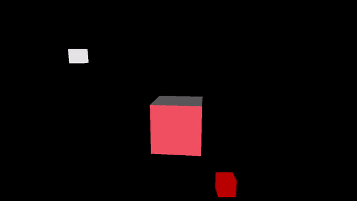

<br>

# 1 - Introduction

So far, we have been using vertex attributes and textures to store the color information for the meshes in the scene. However, this approach does not accurately reflect how things work in the real world. In reality, the color of an object is not an inherent property of the object itself. We are only able to perceive an object when it is illuminated by light sources. What we actually see is the amount of light that is reflected by the object and reaches our eyes (or the camera).

<br>

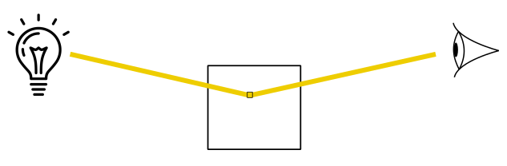

<br>

## 1.1 - What is light?

According to modern atomic theory, electrons orbit around a nucleus. When a photon interacts with an atom, if its energy precisely matches the energy difference between two electron orbits, then the electron can absorb the energy of the photon and be promoted to a higher energy state. However, this excited state is highly unstable, and the electron quickly returns to its original, stable orbit within a very short period of time (less than a second). During this transition, it emits a photon. The energy of a photon depends on the frequency of the radiation. Photons can have a wide range of energies, from high-energy gamma and X-rays, through visible light, to low-energy infrared and radio waves. As pointed out in the image below, an increase in frequency corresponds to a decrease in wavelength. All photons travel at the speed of light in a vacuum, while in a specific material they travel at the maximum possible speed allowed.

<br>

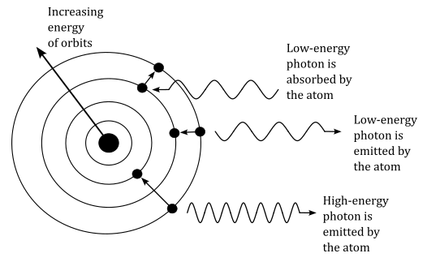

<br>

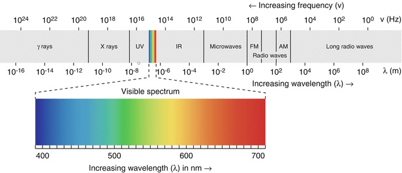

<br>

Although photons are considered particles, they have no mass or charge and can be thought of as field particles that carry the electromagnetic field, where electric and magnetic fields vibrate orthogonally to each other.

<br>

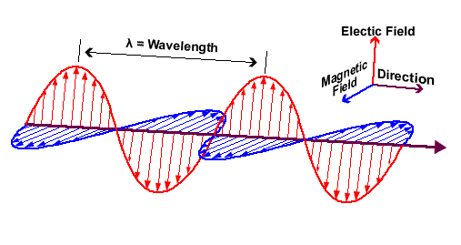

<br>

This phenomenon of energy propagation can be described both as wave radiation and particle motion. In both cases, energy travels in a straight line, while electromagnetic waves and photons vibrate in all directions perpendicular to the direction of propagation.

<br>

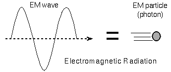

<br>

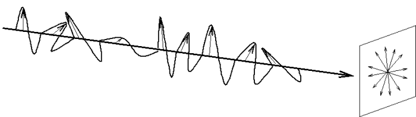

<br>

When the electric field is restricted to vibrate in a specific direction and its opposite (that is, in a specific plane), we say that the electromagnetic radiation is polarized.

<br>

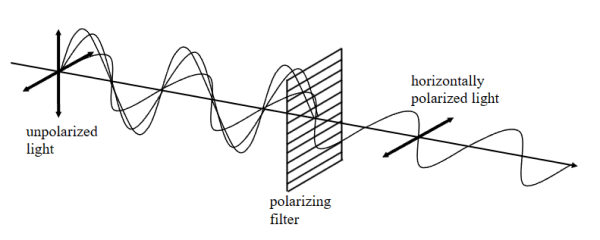

<br>

By light source we mean an object that emits electromagnetic waves with frequencies and wavelengths that fall within the spectrum visible to the human eye. When light reach an object, different light-material interactions can happen. 

- Absorption occurs when a photon is absorbed by an atom of the object, which can then emit a photon with radiation frequency that depend on the material of the object. This process is responsible for the colors we perceive when light interacts with different materials.

- Reflection takes place when light encounters a surface and bounces back. The incident photons interact with the atoms in the material, and depending on the properties of the surface and the angle of incidence, some or all of the light can be reflected. This is why we can see objects and their images in mirrors or other reflective surfaces.

- Transmission, also known as propagation, occurs when light passes through a material without being absorbed or reflected. As photons interact with the atoms in the material, they can either be transmitted without any change in direction or undergo a slight change in direction known as refraction. Transparent materials such as glass or water allow light to pass through, enabling us to see objects on the other side.


<br>

## 1.2 - Light models in computer graphics

While the above discussion about light is indeed fascinating, its practical utility in the field of computer graphics is limited. Representing light as an electromagnetic field or a beam of photons interacting with matter would enable detailed simulation of light polarization and reflected energy. However, adopting such an approach would require computationally expensive calculations to solve complex equations.

In computer graphics, we rarely need this level of detail. Instead, it is preferable to represent light as rays traveling in straight lines, shifting the complexity to the materials of objects to approximately describe how much of the incident light is reflected or transmitted. In this context, we are not typically interested in the absorbed energy, as color information can be retrieved (sampled) from textures.

There are two main lighting models we can use in computer graphics: local illumination and global illumination. <br>
A local illumination model simplify the lighting simulation by considering only the direct interaction between light sources and objects, as if every mesh were the only object in the scene along with the ligt sources. Therefore,  This approach allows for real-time rendering and is commonly used in applications like video games and interactive graphics.

<br>

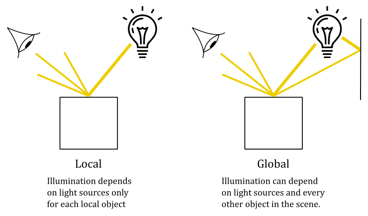

<br>

On the other hand, global illumination models aim to account for more realistic lighting effects by simulating indirect lighting and the interaction of light between objects. This approach considers the complex interplay of light within a scene and can produce more accurate and visually appealing results. However, global illumination calculations are computationally intensive and often require longer rendering times, making them more suitable for pre-rendered content in film, animation, and architectural visualization. Nevertheless, in some cases, global illumination can be employed in real-time applications as well, particularly in static scenes where it is feasible to execute the algorithms as a preprocessing step and store the results for later use during rendering.

<br>

### 1.2.1 - Local models

It should come as no surprise that in this tutorial, we will be implementing a local lighting model, where we are interested in calculating the fraction of incoming light reflected in the camera by a vertex or fragment. Indeed, we have two options at our disposal. One approach involves computing the light reflection for each vertex of a mesh within the vertex shader, enjoying the interpolated colors of the fragments in the fragment shader. On the other hand, we can achieve a more accurate result by calculating the reflected light for each fragment directly within the fragment shader, even though it may incur higher computational costs.

In a local model, the fraction on incoming light reflected by each point of an object in the scene can be usually considered as the sum of three components\terms:

<br>

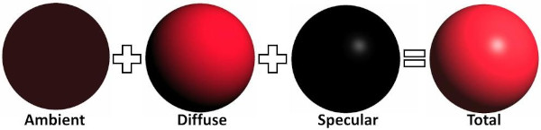

<br>

- **Ambient**: The ambient component concerns the effects of indirect light that reaches an object with low intensity after being bounced several times on other surfaces in the scene. Accounting for these multiple bounces to compute the actual indirect light reaching a vertex\fragment can be a difficult task in a real-time application. As stated earlier, a local illumination model only considers the effects of direct light irrespective of other objects in the scene (that is, an object can be illuminated by a light source even if it is occluded by other objects). However, the impact of indirect light cannot be ignored entirely just because it’s computationally expensive. Therefore, a local illumination model typically approximates the effect of indirect light using the ambient term. In a local illumination model, indirect light is considered coming from all directions with the same (low) intensity, and scattered by a point in all directions as well. This means that the position of both the camera and vertices\fragments receiving the incoming light is irrelevant: indirect light hits all vertices\fragments, and a fraction of it is always reflected in the camera. In other words, the ambient term illuminates every part of the scene uniformly with a low intensity. This allows to see objects even if they are in shadow. Tipically, in a local illumination model, the indirect light received by a vertex\fragment includes the contribution of indirect light produced by all light sources in the scene.

- **Diffuse**: The diffuse component describes the light that is scattered in all directions when photons are emitted after absorbing the photons from the incident light. This means that the diffuse component depends on the material of the object, and specifies its color. Similar to the ambient term, in the diffuse component the position of the camera is irrelevant because the light is scattered in all directions. However, the position of the vertex\fragment that receives the incoming light can be useful to compute the light direction. Indeed, as we will see in the next section, the diffusely reflected light also depends on the direction of the incoming light (in addition to the material of the object). The light diffusely reflected by an object is often called diffuse reflection.

- **Specular**: The specular component describes the specular reflection: the light reflected due to the interaction between the photons of incoming light and the particles on the surface of an object. This means that the color of the specular reflection is similar to the color of the incoming light because the photons are mostly reflected, rather than absorbed and emitted. The light rays of the specular reflection lie within a region called specular lobe, which surrounds the reflection vector that specifies the direction of reflection of the incoming light with respect to the macrosurface normal (that is, the normal of a surface computed without considering the roughness at microscopic level). The specular lobe varies depending on the smoothness of the object. In contrast to the ambient and diffuse components, the position of the camera is important because the specular reflection is visible only if its light rays reach the camera. In particular, the intensity of the specular reflection reaching the camera increases as the camera gets closer to the reflection vector.

<br>

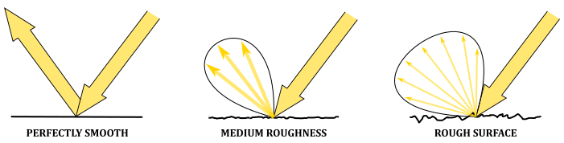

<br>

### 1.2.2 - Light sources

However, not all light sources are the same. They can have different properties that affect the contribution of a light source in the illumination of an object. In a lighting model, we usually have three types of light sources.

- **Directional**: A directional (or parallel) light source emits light rays with a fixed direction and intensity (that is, all vertices\fragments receives the incoming light from the same direction and with equal intensity). A directional light is useful when we want the contribution of a light source so far away from the objects in the scene that its light rays can be considered parallel to each other. For example, the sun is a perfect choice for a directional light because, if you consider a small region on the Earth, the light rays hit the objects approximately with the same direction and intensity. Therefore, the position of a directional light source is irrelevant.

<br>

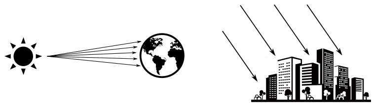

<br>

- **Point**: A point light behaves like a light bulb, radiating light in all directions from its position. The intensity of the light decreases with increasing distance from the light source.

<br>

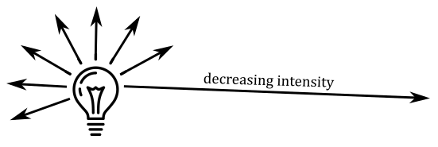

<br>

- **Spotlight**: A spotlight works like a flashlight. It radiates light within a cone-shaped region, and the intensity of the light decreases with distance. The angle between the light direction and the center of the cone also affects the radiation's intensity. Spotlight sources are useful when you want to focus the light in a specific direction or area.

<br>

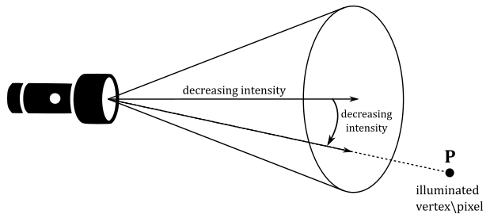

<br>

<br>

# 2 - Lambertian shading model

Several local lighting\shading models have been developed to approximate the computation of light reflection from a vertex\fragment. In this tutorial, however, we will focus on a simplified version of the most basic type of local shading model: the Lambertian lighting (or shading) model. This shading model provides a good approximation for the light reflected by matte surfaces, which exhibit roughness at microscopic level. Indeed, in the Lambertian shading model, the incoming light is reflected in all directions, and the amount of reflection only depends on the incident angle of the incoming light. As a result, As a result, we can ignore or neglect both the ambient and specular terms for now and mainly focus on the diffuse reflection.

In this simplified version of the Lambertian shading model, we will only use directional lights. This means that the incoming light will have a constant direction and intensity for all illuminated vertices\fragments in the scene. Moreover, for the sake of simplicity, we will not delve into the material properties of objects in this introductory lighting tutorial. Instead, objects will reflect a portion of the incoming light, and their color will only depend on the color of the incoming light. As mentioned earlier, the amount of reflected light depends on the incident angle of the incoming light. Indeed, while the intensity of the incoming light plays an important role, its direction also affects the amount of reflected light. Consider the following illustration. 

<br>

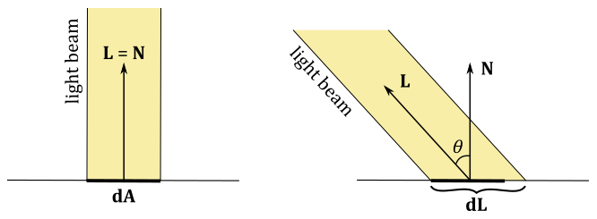

<br>

If a light beam perpendicularly hit a surface, an area $dA$ receives all the incoming light, which can be diffusely reflected in all directions. On the other hand, if the light beam is not perpendicular to the surface, the area $dL$ that receives all the incoming light will be greater than the area $dA$. This means that $dA$ will reflect in all direction a smaller amount of light because it receives less intensity from the incoming light.

The Lambertian shading model specifies that the intensity and color information of the diffuse reflection (that is, the light diffusely reflected in all directions by a vertex\fragment) is described by the vector $\mathbf{l} _d$ as follows.

<br>

$\mathbf{l} _d=\text{max}(\cos\theta, 0)\ (\mathbf{l} _i\otimes \mathbf{m} _d)=\text{max}((\mathbf{L}\cdot \mathbf{N}), 0)\ (\mathbf{l} _i\otimes \mathbf{m} _d)$

<br>


In the given equation, $\mathbf{m} _d$ represents the diffuse albedo, which is a vector that controls the fraction of incoming light that is diffusely reflected by an object based on its material properties. When textures are not used, the diffuse albedo typically specifies the color of the object or, more specifically, the color of the diffuse reflection - each component of $\mathbf{m} _d$ represents the amount of red, green, and blue in the diffuse reflection. On the other hand, when textures are used, the diffuse albedo indicates the percentage of incoming light that is diffusely reflected - the ratio between the intensity of the diffusely reflected light and the intensity of the incoming light is stored in each component of the diffuse albedo, which needs to be combined with a color sampled from a texture to determine the color of the diffuse reflection $\mathbf{l} _d$. <br>
$\mathbf{l} _i$ is a vector that stores the intensity and color information of the incoming light. That is, each component of $\mathbf{l} _i$ specifies the amount of red, green, and blue in the incoming light. <br>
$\mathbf{L}$ is a unit vector that defines the inverse direction of the incoming light, originating from a vertex\fragment and directed towards a light source. $N$ represents the normal vector of the mesh at the vertex\fragment position where the incoming light is received. <br>
The **max** function is used to exclude the contribution of incoming light that strikes a vertex\fragment from behind, ensuring that only the light coming from the front is considered. <br>
The operator $\otimes$ specifies the product of two vectors performed component by component. That is, 

<br>

$\mathbf{c}=\mathbf{a}\otimes \mathbf{b}=(a_xb_x,\ a_yb_y,\ a_zb_z)$

<br>

As mentioned before, in our simplified version of the Lambertian shading model, we assume that the material of the objects is irrelevant. Therefore, we set $\mathbf{m} _d = (1.0, 1.0, 1.0)$, so that the formula becomes

<br>

$\mathbf{l} _d=\text{max}((\mathbf{L}\cdot \mathbf{N}), 0)\ \mathbf{l} _i$

<br>

As approximate as it may be, this approach is still more physically accurate than setting the color of a vertex statically in the vertex buffer or sampling the final color of a fragment from a texture.

So, to compute the reflected light using this simplified Lambertian shading model, we only need the direction and intensity of the light emitted by each directional light source that illuminates the scene, along with the normal at each vertex\fragment of a mesh. <br>
Obviously, light directions and mesh normals need to be in the same space to calculate the diffuse reflection $\mathbf{l} _d$. For example, since we are only considering directional lights, we can set both direction and intensity of the light sources in the C++ application, with the light directions expressed in world coordinates. Then, we can pass this information to the shader code through a uniform buffer, as it remains constant for each object in the scene. <br>
As for the normals, we can set them as per-vertex attributes. This allows us to retrieve the normal of a vertex in the vertex shader, or obtain the interpolated normal for a fragment in the fragment shader, ensuring smooth shading across the mesh.

<br>

>Remember that, in a vertex buffer, the vertex positions are typically expressed in local space, and the corresponding normals should also be in local space as well. This means that if a transformation is applied to a vertex position, the same transformation should be applied to the related normal, ensuring that both positions and normals are in the same coordinate space. <br>
In the example scenario mentioned earlier, where light directions are expressed in world coordinates, we require the normals to be in world space for computing the diffuse reflection $\mathbf{l} _d$. Therefore, we should apply the same world transformation to both vertex positions and normals. Any additional transformations can then be applied to vertex positions only, as we are not concerned with having normals in any coordinate frame other than world space. <br>
However, it is worth noting that if the world transformation includes non-uniform scaling, a slightly modified version of that transformation needs to be applied to the normals. We will address this issue in a later tutorial. For now, rest assured that the samples examined in this and subsequent tutorials do not involve non-uniform scaling for transforming vertex positions, so applying the same transformation to both vertex positions and normals will suffice.

<br>

<br>

# 3 - VKHelloLighting: code review

This sample demonstrates the rendering of a cube positioned at the origin of the world space, illuminated by two directional lights. The first light source emits white light rays from a fixed position between the camera and the cube, while the second light source emits red light rays while rotating around the cube. Usually, directional lights are not visually represented on the screen since their position does not affect their illumination. However, in this sample, both light sources will be rendered as small colored blocks. <br>
Observe that the computation of the light reflected by the cube will be performed in the fragment shader. This approach uses per-fragment lighting calculation, which is more computationally expensive but provides higher-quality results compared to per-vertex lighting.

<br>

## 2.1 - C++ code:

Let's start our analysis of the sample by taking a closer look at the **VKHelloLighting** class

<br>

```cpp
class VKHelloLighting : public VKSample
{
public:

    // ...

private:

    // ...

    // For simplicity we use the same uniform block layout as in the vertex shader:
    //
    // layout(std140, set = 0, binding = 0) uniform buf {
    //     mat4 View;
    //     mat4 Projection;
    //     vec4 lightDirs[2];
    //     vec4 lightColors[2];
    // } uBuf;
    //
    // This way we can just memcopy the uBufVS data to match the uBuf memory layout.
    // Note: You should use data types that align with the GPU in order to avoid manual padding (vec4, mat4)
    struct {
        glm::mat4 viewMatrix;         // 64 bytes
        glm::mat4 projectionMatrix;   // 64 bytes
        glm::vec4 lightDirs[2];       // 32 bytes
        glm::vec4 lightColors[2];     // 32 bytes
    } uBufVS;

    // Uniform block defined in the vertex shader to be used as a dynamic uniform buffer:
    //
    //layout(std140, set = 0, binding = 1) uniform dynbuf {
    //     mat4 World;
    //     vec4 solidColor;
    // } dynBuf;
    //
    // Allow the specification of different world matrices for different objects by offsetting
    // into the same buffer.
    struct MeshInfo{
        glm::mat4 worldMatrix;        // pointer to an array of world matrices
        glm::vec4 solidColor;
    };

    struct {
        MeshInfo *meshInfo;        // pointer to an array of mesh info
    } dynUBufVS;
    
    // Vertex layout used in this sample
    struct Vertex {
        glm::vec3 position;
        glm::vec3 normal;
    };

    // In this sample we have three draw calls for each frame.
    const unsigned int m_numDrawCalls = 3;


    // ...

};
```
<br>

The structure containing the view and projection matrices now also includes information about the light direction and color for the two directional light sources present in the scene. Note that all the data within this structure is valid per-frame, meaning it remains constant for each mesh rendered within that frame. Indeed, remember that directional lights emits light rays with a fixed direction and intensity for each vertex\fragment in the scene.

Observe that intensity and color have the same meaning here: incoming light is visible\colored light that can be represented as a vector specifying the intensity for each of the red (R), green (G), and blue (B) channels in the incoming light. Also, note that we will store the inverse of the light directions, as we are primarly interested in the angle between the incoming light and the fragment normal.

The **solidColor** field in the **MeshInfo** structure is a four-component vector that specifies the color of the small blocks representing the directional lights. Indeed, we won't be using the Lambertian shading model to determine the color of the light sources on the screen. This means that we will need two pipeline objects with different fragment shader to draw the cube and the light sources (more on this shortly). Observe that this information is included in the dynamic uniform block, as it contains per-mesh information. Alternatively, we could have also used a push constant to index into the **lightColors** array contained in the uniform buffer. The use of push constants will be covered in a later tutorial.

Now, the **Vertex** structure includes a normal as a vertex attribute instead of a color. This will allow to compute the diffuse reflection at each fragment of the cube in the fragment shader from the interpolated information.

**m_numDrawCalls** is set to three, as we have a cube and the two light source to draw for each frame.

<br>

```cpp
VKHelloLighting::VKHelloLighting(uint32_t width, uint32_t height, std::string name) :
VKSample(width, height, name),
m_curRotationAngleRad(0.0f),
m_dynamicUBOAlignment(0)
{

    // ...

    // Initialize the lighting parameters (directions and emitted colors)
    uBufVS.lightDirs[0] = {-0.577f, -0.577f, 0.577f, 0.0f};
    uBufVS.lightDirs[1] = {0.0f, -1.0f, 0.0f, 0.0f};
    uBufVS.lightColors[0] = {0.9f, 0.9f, 0.9f, 1.0f};
    uBufVS.lightColors[1] = {0.8f, 0.0f, 0.0f, 1.0f};
}
```
<br>

The first light source emits white light rays with a fixed direction expressed as a unit vector in world coordinates. The direction of this light source is initialized so that that the incoming light comes from the top-left behind the cube - remember that we store the inverse of the light directions. <br>
On the other hand, the second light source emits red light rays and rotates around the cube. This means that the light direction needs to be updated over time, frame by frame. The initial direction points towards the negative side of the y-axis, and we will rotated it in the **OnUpdate** function to fix the light direction based on the position of the light source.

<br>

>The position of a directional light source is not important as long as it remains unchanged. However, if we modify its position, the light direction must be updated accordingly. A good example to consider is how the sun illuminates the Earth during daylight. As the Earth rotates and orbits around the sun, the position of the sun relative to the Earth changes, resulting in different directions of the sunlight throughout the day and year.

<br>

Using normals as vertex attributes implies that we need to modify the vertex buffer definition as follows.

<br>

```cpp
void VKHelloLighting::CreateVertexBuffer()
{
    //
    // Create the vertex and index buffers.
    //

    // Define the geometry for a cube in local space (Z points up in this case).
    //
    // The 24 vertices of the cube
    std::vector<Vertex> cubeVertices =
    {
        // TOP: normal aims upwards (positive z-axis) in local space
        {{-1.0f, -1.0f, 1.0f\}, {0.0f, 0.0f, 1.0f\}\},
        {{1.0f, -1.0f, 1.0f},  {0.0f, 0.0f, 1.0f}},
        {{1.0f, 1.0f, 1.0f},   {0.0f, 0.0f, 1.0f}},
        {{-1.0f, 1.0f, 1.0f},  {0.0f, 0.0f, 1.0f}},

        // BOTTOM: normal aims downwards (negative z-axis) in local space
        {{-1.0f, -1.0f, -1.0f}, {0.0f, 0.0f, -1.0f}},
        {{-1.0f, 1.0f, -1.0f},  {0.0f, 0.0f, -1.0f}},
        {{1.0f, 1.0f, -1.0f},   {0.0f, 0.0f, -1.0f}},
        {{1.0f, -1.0f, -1.0f},  {0.0f, 0.0f, -1.0f}},

        // LEFT: normal aims left (negative x-axis) in local space
        {{-1.0f, -1.0f, 1.0f\},  {-1.0f, 0.0f, 0.0f\}\},
        {{-1.0f, 1.0f, 1.0f},   {-1.0f, 0.0f, 0.0f}},
        {{-1.0f, 1.0f, -1.0f},  {-1.0f, 0.0f, 0.0f}},
        {{-1.0f, -1.0f, -1.0f}, {-1.0f, 0.0f, 0.0f}},

        // RIGHT: normal aims right (positive x-axis) in local space
        {{1.0f, -1.0f, 1.0f},  {1.0f, 0.0f, 0.0f}},
        {{1.0f, -1.0f, -1.0f}, {1.0f, 0.0f, 0.0f}},
        {{1.0f, 1.0f, -1.0f},  {1.0f, 0.0f, 0.0f}},
        {{1.0f, 1.0f, 1.0f},   {1.0f, 0.0f, 0.0f}},

        // FRONT: normal aims forwards (positive y-axis) in local space
        {{-1.0f, 1.0f, 1.0f},  {0.0f, 1.0f, 0.0f}},
        {{1.0f, 1.0f, 1.0f},   {0.0f, 1.0f, 0.0f}},
        {{1.0f, 1.0f, -1.0f},  {0.0f, 1.0f, 0.0f}},
        {{-1.0f, 1.0f, -1.0f}, {0.0f, 1.0f, 0.0f}},

        // BACK: normal aims backwards (negative y-axis) in local space
        {{1.0f, -1.0f, 1.0f},   {0.0f, -1.0f, 0.0f}},
        {{-1.0f, -1.0f, 1.0f\},  {0.0f, -1.0f, 0.0f\}\},
        {{-1.0f, -1.0f, -1.0f}, {0.0f, -1.0f, 0.0f}},
        {{1.0f, -1.0f, -1.0f},  {0.0f, -1.0f, 0.0f}},
    };
    size_t vertexBufferSize = static_cast<size_t>(cubeVertices.size()) * sizeof(Vertex);

    //    3________ 2        9________ 15       16_______ 17
    //    /|      /|         /|      /|         /|      /| 
    // 0 /_|____1/ |      8 /_|___12/ |      21/_|___20/ | 
    //   | |5_ _ |_|6       | |10_ _|_|14      | |19_ _|_|18
    //   | /     | /        | /     | /        | /     | / 
    //   |/______|/         |/______|/         |/______|/  
    //   4       7         11       13        22       23
    //
    // The indices defining the two triangle for each of the six faces of the cube
    // The vertices of each triangle are selected in counter-clockwise order.
    std::vector<uint16_t> indexBuffer =
    {
        // TOP
        0,1,2,
        0,2,3,
    
        // BOTTOM
        4,5,6,
        4,6,7,
    
        // LEFT
        8,9,10,
        8,10,11,
    
        // RIGHT
        12,13,14,
        12,14,15,
    
        // FRONT
        16,17,18,
        16,18,19,
    
        // BACK
        20,21,22,
        20,22,23
    };
    size_t indexBufferSize = static_cast<size_t>(indexBuffer.size()) * sizeof(uint16_t);
    m_vertexindexBuffer.indexBufferCount = indexBuffer.size();


    // ...

}
```
<br>

A cube is made up of 12 triangles, which means it has 36 vertices. In the previous tutorial, we were able to define a cube using a triangle list with only 8 elements in the vertex buffer because the vertices shared by multiple triangles had the same position and color. However, in this example, we have a normal as a vertex attribute, which is not the same for every triangle sharing a vertex. This means that a vertex has a different normal for each cube face that shares it. As a result, we need a vertex buffer with $8*3=24$ elements to describe a cube as a triangle list. Alternatively, you can think of it this way: each of the four vertices on the six faces of the triangle shares the same normal, but from different positions. Therefore, we require a total of $4*6=24$ vertices, each with its corresponding normal information.

<br>

The code for creating the descriptor set layout specifies that both the uniform buffer and the dynamic uniform buffer will be accessed from both the vertex and fragment shaders. Indeed, the vertex shader will access the world matrix through the dynamic uniform buffer, and the view and projection matrices through the uniform buffer. Moreover, in this sample, we will use two different shader programs as the fragment shader: one for drawing the light sources with a solid color (which is stored in the dynamic uniform buffer along with the world matrix), and the other for drawing the cube with the Lambertian shading model (using the light direction and color information from the uniform buffer). Therefore, both the uniform buffer and the dynamic one are accessed by at least one of the fragment shaders, and this needs to be specified in the descriptor set layout. We’ll look at the shader code at the end of the tutorial.

<br>

```cpp
void VKHelloLighting::CreateDescriptorSetLayout()
{
    //
    // Create a Descriptor Set Layout to connect binding points (resource declarations)
    // in the shader code to descriptors within descriptor sets.
    //
    // Binding 0: Uniform buffer (vertex and fragment shader)
    VkDescriptorSetLayoutBinding layoutBinding[2] = {};
    layoutBinding[0].binding = 0;
    layoutBinding[0].descriptorType = VK_DESCRIPTOR_TYPE_UNIFORM_BUFFER;
    layoutBinding[0].descriptorCount = 1;
    layoutBinding[0].stageFlags = VK_SHADER_STAGE_VERTEX_BIT | VK_SHADER_STAGE_FRAGMENT_BIT;
    layoutBinding[0].pImmutableSamplers = nullptr;

    // Binding 1: Dynamic uniform buffer (vertex and fragment shader)
    layoutBinding[1].binding = 1;
    layoutBinding[1].descriptorType = VK_DESCRIPTOR_TYPE_UNIFORM_BUFFER_DYNAMIC;
    layoutBinding[1].descriptorCount = 1;
    layoutBinding[1].stageFlags = VK_SHADER_STAGE_VERTEX_BIT | VK_SHADER_STAGE_FRAGMENT_BIT;
    layoutBinding[1].pImmutableSamplers = nullptr;

    VkDescriptorSetLayoutCreateInfo descriptorLayout = {};
    descriptorLayout.sType = VK_STRUCTURE_TYPE_DESCRIPTOR_SET_LAYOUT_CREATE_INFO;
    descriptorLayout.pNext = nullptr;
    descriptorLayout.bindingCount = 2;
    descriptorLayout.pBindings = layoutBinding;

    VK_CHECK_RESULT(vkCreateDescriptorSetLayout(m_vulkanParams.Device, &descriptorLayout, nullptr, &m_sampleParams.DescriptorSetLayout));
}
```
<br>

In the **CreatePipelineObjects** function, we create two pipeline objects with different fragment shaders. Remember that the SPIR-V binary code is compiled into GPU machine code during pipeline creation. This means that when creating a new pipeline object that only differs in the shader code of a programmable stage, we only need to specify the pre-compiled SPIR-V code in the corresponding SPIR-V module of that pipeline object.

<br>

```cpp
void VKHelloLighting::CreatePipelineObjects()
{

    // ...
    
    //
    // Shaders
    //
    // This sample will only use two programmable stage: Vertex and Fragment shaders
    std::array<VkPipelineShaderStageCreateInfo, 2> shaderStages{};
    
    // Vertex shader
    shaderStages[0].sType = VK_STRUCTURE_TYPE_PIPELINE_SHADER_STAGE_CREATE_INFO;
    // Set pipeline stage for this shader
    shaderStages[0].stage = VK_SHADER_STAGE_VERTEX_BIT;
    // Load binary SPIR-V shader module
    shaderStages[0].module = LoadSPIRVShaderModule(m_vulkanParams.Device, GetAssetsPath() + "/data/shaders/main.vert.spv");
    // Main entry point for the shader
    shaderStages[0].pName = "main";
    assert(shaderStages[0].module != VK_NULL_HANDLE);
    
    // Fragment shader
    shaderStages[1].sType = VK_STRUCTURE_TYPE_PIPELINE_SHADER_STAGE_CREATE_INFO;
    // Set pipeline stage for this shader
    shaderStages[1].stage = VK_SHADER_STAGE_FRAGMENT_BIT;
    // Load binary SPIR-V shader module
    shaderStages[1].module = LoadSPIRVShaderModule(m_vulkanParams.Device, GetAssetsPath() + "/data/shaders/lambertian.frag.spv");
    // Main entry point for the shader
    shaderStages[1].pName = "main";
    assert(shaderStages[1].module != VK_NULL_HANDLE);

    //
    // Create the graphics pipelines used in this sample
    //
    
    VkGraphicsPipelineCreateInfo pipelineCreateInfo = {};
    pipelineCreateInfo.sType = VK_STRUCTURE_TYPE_GRAPHICS_PIPELINE_CREATE_INFO;
    // The pipeline layout used for this pipeline (can be shared among multiple pipelines using the same layout)
    pipelineCreateInfo.layout = m_sampleParams.PipelineLayout;
    // Render pass object defining what render pass instances the pipeline will be compatible with
    pipelineCreateInfo.renderPass = m_sampleParams.RenderPass;
    
    // Set pipeline shader stage info
    pipelineCreateInfo.stageCount = static_cast<uint32_t>(shaderStages.size());
    pipelineCreateInfo.pStages = shaderStages.data();
    
    // Assign the pipeline states to the pipeline creation info structure
    pipelineCreateInfo.pVertexInputState = &vertexInputState;
    pipelineCreateInfo.pInputAssemblyState = &inputAssemblyState;
    pipelineCreateInfo.pRasterizationState = &rasterizationState;
    pipelineCreateInfo.pColorBlendState = &colorBlendState;
    pipelineCreateInfo.pMultisampleState = &multisampleState;
    pipelineCreateInfo.pViewportState = &viewportState;
    pipelineCreateInfo.pDepthStencilState = &depthStencilState;
    pipelineCreateInfo.pDynamicState = &dynamicState;
    
    // Create a graphics pipeline for lambertian illumination
    VK_CHECK_RESULT(vkCreateGraphicsPipelines(m_vulkanParams.Device, VK_NULL_HANDLE, 1, &pipelineCreateInfo, nullptr, &m_sampleParams.GraphicsPipelines["Lambertian"]));

    // Specify a different fragment shader
	shaderStages[1].module = LoadSPIRVShaderModule(m_vulkanParams.Device, GetAssetsPath() + "/data/shaders/solid.frag.spv");
	// Create a graphics pipeline to draw using a solid color
	VK_CHECK_RESULT(vkCreateGraphicsPipelines(m_vulkanParams.Device, VK_NULL_HANDLE, 1, &pipelineCreateInfo, nullptr, &m_sampleParams.GraphicsPipelines["SolidColor"]));
    
    // SPIR-V shader modules are no longer needed once the graphics pipeline has been created
    // since the SPIR-V modules are compiled during pipeline creation.
    vkDestroyShaderModule(m_vulkanParams.Device, shaderStages[0].module, nullptr);
    vkDestroyShaderModule(m_vulkanParams.Device, shaderStages[1].module, nullptr);
}
```
<br>

The following listing shows the loop in the **PopulateCommandBuffer** function responsible for drawing the objects of the sample.

<br>

```cpp
void VKHelloTransformations::PopulateCommandBuffer(uint32_t currentImageIndex)
{

    // ...


    // Render multiple objects by using different pipelines and dynamically offsetting into a uniform buffer
    for (uint32_t j = 0; j < m_numDrawCalls; j++)
    {
        // Dynamic offset used to offset into the uniform buffer described by the dynamic uniform buffer and containing mesh information
        uint32_t dynamicOffset = j * static_cast<uint32_t>(m_dynamicUBOAlignment);

        // Bind the graphics pipeline
        vkCmdBindPipeline(m_sampleParams.FrameRes.GraphicsCommandBuffers[m_frameIndex], 
                            VK_PIPELINE_BIND_POINT_GRAPHICS, 
                            (!j) ? m_sampleParams.GraphicsPipelines["Lambertian"] : m_sampleParams.GraphicsPipelines["SolidColor"]);

        // Bind descriptor sets for drawing a mesh using a dynamic offset
        vkCmdBindDescriptorSets(m_sampleParams.FrameRes.GraphicsCommandBuffers[m_frameIndex], 
                                VK_PIPELINE_BIND_POINT_GRAPHICS, 
                                m_sampleParams.PipelineLayout, 
                                0, 1, 
                                &m_sampleParams.FrameRes.DescriptorSets[m_frameIndex], 
                                1, &dynamicOffset);

        // Draw a cube
        vkCmdDrawIndexed(m_sampleParams.FrameRes.GraphicsCommandBuffers[m_frameIndex], m_vertexindexBuffer.indexBufferCount, 1, 0, 0, 0);
    }
    
    // Ending the render pass will add an implicit barrier, transitioning the frame buffer color attachment to
    // VK_IMAGE_LAYOUT_PRESENT_SRC_KHR for presenting it to the windowing system
    vkCmdEndRenderPass(m_sampleParams.FrameRes.GraphicsCommandBuffers[m_frameIndex]);
    
    VK_CHECK_RESULT(vkEndCommandBuffer(m_sampleParams.FrameRes.GraphicsCommandBuffers[m_frameIndex]));
}
```
<br>

As you can see, we are simply drawing three cubes using different pipeline objects and dynamic offsets.

<br>

In this sample, the **UpdateHostVisibleBufferData** function is also called by **OnUpdate** in order to update the light direction (of the rotating light source) within the buffer that holds per-frame information.

<br>

```cpp
void VKHelloLighting::UpdateHostVisibleBufferData()
{
    // Initialize the light direction of the second light source (the rotating one)
    uBufVS.lightDirs[1] = {0.0f, -1.0f, 0.0f, 0.0f};

    // Rotate the light direction of the second light source around the z-axis
    glm::mat4 RotZ = glm::rotate(glm::identity<glm::mat4>(), -2.0f * m_curRotationAngleRad, glm::vec3(0.0f, 0.0f, 1.0f));
    uBufVS.lightDirs[1] = RotZ * uBufVS.lightDirs[1];

    // Update uniform buffer data
    // Note: Since we requested a host coherent memory type for the uniform buffer, the write is instantly visible to the GPU
    memcpy(m_sampleParams.FrameRes.HostVisibleBuffers[m_frameIndex].MappedMemory, &uBufVS, sizeof(uBufVS));
}
```
<br>

```cpp
void VKHelloLighting::UpdateHostVisibleDynamicBufferData()
{
    const float rotationSpeed = 0.8f;

    // Update the rotation angle
    m_curRotationAngleRad += rotationSpeed * m_timer.GetElapsedSeconds();
    if (m_curRotationAngleRad >= glm::two_pi<float>())
    {
        m_curRotationAngleRad -= glm::two_pi<float>();
    }

    for (size_t i = 0; i < m_numDrawCalls; i++)
    {
        MeshInfo* mesh_info = (MeshInfo*)((uint64_t)dynUBufVS.meshInfo + (i * m_dynamicUBOAlignment));

        if (!i)
        {
            // Rotate the cube at the center of the scene around the z-axis
            glm::mat4 RotZ = glm::rotate(glm::identity<glm::mat4>(), m_curRotationAngleRad, glm::vec3(0.0f, 0.0f, 1.0f));
            mesh_info->worldMatrix = RotZ;
        }
        else
        {
            // Set light positions using the corresponding light directions.
            glm::mat4 Tran = glm::translate(glm::identity<glm::mat4>(), 5.0f * glm::vec3(uBufVS.lightDirs[i-1]));
            glm::mat4 Scale = glm::scale(glm::mat4(1.0f), glm::vec3(0.2f, 0.2f, 0.2f));
            mesh_info->worldMatrix = Tran * Scale;
            mesh_info->solidColor = uBufVS.lightColors[i-1];
        }
    }

    // Update dynamic uniform buffer data
    // Note: Since we requested a host coherent memory type for the uniform buffer, the write is instantly visible to the GPU
    memcpy(m_sampleParams.FrameRes.HostVisibleDynamicBuffers[m_frameIndex].MappedMemory,
           dynUBufVS.meshInfo, 
           m_sampleParams.FrameRes.HostVisibleDynamicBuffers[m_frameIndex].Size);
}
```
<br>

On the other hand, **UpdateHostVisibleDynamicBufferData** function updates the world matrices for all objects in the scene and the solid colors used to render the two light sources on the screen.

<br>

## 2.2 - GLSL code:

In the shader code of this sample, the vertex shader applies the same linear transformation (i.e., no translation) to both the position and normal of the vertices to express them in world coordinates. Note that using a $4 \times 4$ matrix to construct a **mat3** results in the upper-left $3 \times 3$ matrix obtained by excluding the last row and last column of the original $4 \times 4$ matrix. We use the upper-left $3 \times 3$ submatrix of the world matrix to transform normals because normals are vectors, which are unaffected by translations (stored in the last column). Remember that vectors are only influenced by linear transformations stored in the upper-left $3 \times 3$ matrix, as explained in appendix 04.

<br>

```glsl
#version 450

layout (location = 0) in vec3 inPos;
layout (location = 1) in vec3 inNormal;

layout(std140, set = 0, binding = 0) uniform buf {
    mat4 View;
    mat4 Projection;
    vec4 lightDirs[2];
    vec4 lightColors[2];
} uBuf;

layout(std140, set = 0, binding = 1) uniform dynbuf {
    mat4 World;
    vec4 solidColor;
} dynBuf;

layout (location = 0) out vec3 outNormal;

void main() 
{
    outNormal = mat3(dynBuf.World) * inNormal;           // Transforms the normal vector and pass it to the next stage
    vec4 worldPos = dynBuf.World * vec4(inPos, 1.0);     // Local to World
    vec4 viewPos = uBuf.View * worldPos;                 // World to View
    gl_Position = uBuf.Projection * viewPos;             // View to Clip
}
```
<br>

The fragment shader for drawing the small blocks representing the directional light sources is straightforward. We simply set a solid color as the per-fragment data to be stored in the color attachment for the corresponding light source.

<br>

```glsl
#version 450

layout (location = 0) in vec3 inNormal;
layout (location = 0) out vec4 outFragColor;

layout(std140, set = 0, binding = 0) uniform buf {
    mat4 View;
    mat4 Projection;
    vec4 lightDirs[2];
    vec4 lightColors[2];
} uBuf;

layout(std140, set = 0, binding = 1) uniform dynbuf {
    mat4 World;
    vec4 solidColor;
} dynBuf;

// Fragment shader applying solid color
void main() 
{
  outFragColor = dynBuf.solidColor;
}
```
<br>

The fragment shader used to draw the cube at the center of the scene, using the Lambertian shading model, calculates the diffuse reflection for each fragment of the cube. Since there are two directional lights in the scene, we need to sum up the diffuse reflections from both lights.

The shader code makes use of the **dot** function, which is a built-in GLSL function that computes the dot product between two input vectors. Additionally, the **clamp** function is used to restrict the value passed as the first parameter within a specified range, determined by the second and third parameters. If the value being clamped is a vector, **clamp** operates on each component of the vector individually.

In this sample, the diffuse reflection is used as the per-fragment data to store in the color attachment as it also includes the color information, as explained in section 2. Indeed, we have that

<br>

$\mathbf{l} _d=\text{max}((\mathbf{L}\cdot \mathbf{N}), 0)\ \mathbf{l} _i=\text{clamp}((\mathbf{L}\cdot \mathbf{N})\ \mathbf{l} _i,\ 0.0,\ 1.0)$

<br>

```cpp
#version 450

layout (location = 0) in vec3 inNormal;
layout (location = 0) out vec4 outFragColor;

layout(std140, set = 0, binding = 0) uniform buf {
    mat4 View;
    mat4 Projection;
    vec4 lightDirs[2];
    vec4 lightColors[2];
} uBuf;

layout(std140, set = 0, binding = 1) uniform dynbuf {
    mat4 World;
    vec4 solidColor;
} dynBuf;

// Fragment shader applying Lambertian lighting using two directional lights
void main() 
{
    vec4 finalColor = {0.0, 0.0, 0.0, 0.0};
    
    //do N-dot-L lighting for 2 light sources
    for( int i=0; i< 2; i++ )
    {
        finalColor += clamp(dot(uBuf.lightDirs[i].xyz, inNormal) * uBuf.lightColors[i], 0.0, 1.0);
    }
    finalColor.a = 1;

  outFragColor = finalColor;
}
```
<br>

<br>

Source code: [LearnVulkan](https://github.com/PAMinerva/LearnVulkan)

<br>

# References

[1] [Vulkan API Specifications](https://registry.khronos.org/vulkan/) <br>

<br>

***
If you found the content of this tutorial somewhat useful or interesting, please consider supporting this project by clicking on the **Sponsor** button.  Whether a small tip, a one time donation, or a recurring payment, it's all welcome! Thank you!<br>
***