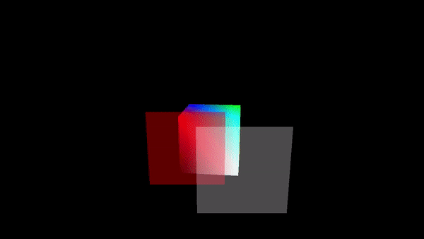
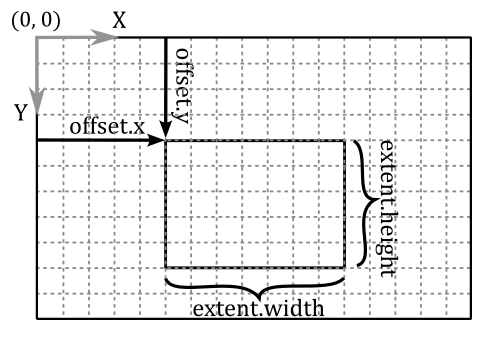
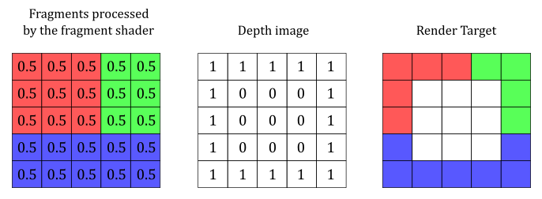
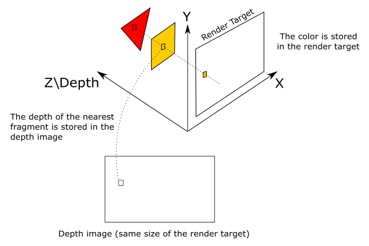
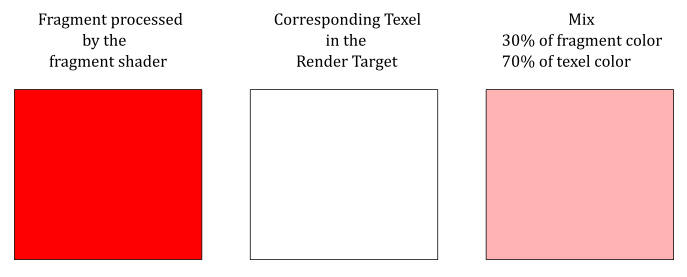

<br>



<br>

# 1 - Introduction

As we know, the fragment shader outputs per-fragment data, which can potentially find its place in the corresponding texel of the render target. The Per-Fragment Operations is a fixed stage situated at the end of the pipeline and plays a crucial role in determining whether and how the per-fragment data is stored in the render target. This is accomplished through a series of tests and operations applied to each fragment generated by the rasterizer. The process obviously involves the per-fragment data returned as an output by the fragment shader, but it also requires information from the pipeline state and the current contents stored in both the depth-stencil image and render target (usually a swapchain image described by a color attachment in the framebuffer). <br>
If a fragment successfully passes all the tests and operations conducted during the Per-Fragment Ops stage, the associated per-fragment data can either replace the existing value in the corresponding texel of the render target or blend with it, based on the blending information specified in the pipeline state.

In this tutorial, we’ll start by examing the per-fragment operations that have been used and enabled so far to implement the sample examined in previous tutorials. Then, we’ll move on to blending, which happens at the end of the rendering process, after the Per-Fragment Ops stage. We will reserve the presentation of the remaining tests and operations that compose the Per-Fragment Ops stage for future tutorials, ensuring that they are introduced at the appropriate moment for a more comprehensive understanding.

<br>

<br>

# 2 - Per-Fragments Ops (part 1)

Per-fragments operations are typically executed in a well-established order, either before or after the fragment shader. However, it's important to note that in certain situations, a Vulkan implementation is allowed to perform some of the operations that would typically occur after the fragment shader earlier. This optimization allows the implementation to avoid executing the fragment shader for fragments that would eventually be discarded by subsequent per-fragment tests. Furthermore, there is the option to intentionally enforce the early execution of specific operations, although we will not go into detail on this at this time.

<br>

## 2.1 - Scissor test

This is the first operation performed by the Per-Fragment Ops stage, before the fragment shader. <br>
There is not much more to add regarding the scissor test beyond what has already been covered in one of the earlier tutorials (**01.B - Hello Triangle**). Once the rasterizer generates fragments for a primitive, the scissor test verifies that the coordinates of these fragments fall within a specified rectangle of texels in the framebuffer space. A scissor rectangle is defined by a **VkRect2D**, which defines the offset and extent of the rectangle in the framebuffer space. The scissor rectangle can be set either during pipeline creation using the **VkPipelineViewportStateCreateInfo** structure or dynamically using the **vkCmdSetScissor** command.

If a fragment fails the scissor test, its traversal through the graphics pipeline comes to an end, and the fragment shader will not be executed. 

The scissor test is used to restrict the drawing operations on a specific rectangle of the render target.

<br>



<br>

## 2.2 - Depth test

Typically, the depth test occurs after the fragment shader in the graphics pipeline. However, in Vulkan, there is flexibility for a Vulkan implementation to execute the depth test earlier when there are no side effects and when the fragment shader does not directly update the depth value of the fragment currently processed.

<br>

>In this context, side effects refer to operations that need to be carried out by the fragment shader, even if the fragment ends up being discarded by a fragment operation. In such cases, if the depth test were to be executed earlier and failed, the fragment shader would not be executed. <br>
Similarly, if the fragment shader does update the depth value of a fragment, the depth test should not be performed earlier. This is because the test would be conducted using the outdated interpolated depth value generated by the rasterizer, which would not reflect the updated depth value from the fragment shader.

<br>

The depth test compares the depth value of the fragment with the corresponding depth value in the depth image. 

If there is no depth attachment describing a depth image then the depth test is skipped. Similarly, if the depth test is not explicitly enabled, using the **vkCmdSetDepthTestEnable** command or through the **VkPipelineDepthStencilStateCreateInfo::depthTestEnable** field, then this test is also skipped.

The comparison operation performed is determined either during pipeline creation by the **VkPipelineDepthStencilStateCreateInfo::depthCompareOp** field or dynamically by the **VkCompareOp** value set by the **vkCmdSetDepthCompareOp** command. If enabled, the depth test is performed as follow

<br>

```
if (Zf   VkCompareOp   Zd)
    retain fragment
else
    discard fragment
```
<br>

where Zf is the depth value of the fragment and Zd is the depth value in the corresponding texel of the depth image. Obviously, if a fragment is discarded by the depth test, it will not have the opportunity to be used as a source in any subsequent copy or blending operation with the corresponding texel of the render target. The comparison operators available are:

<br>

```cpp
// Provided by VK_VERSION_1_0
typedef enum VkCompareOp {
    VK_COMPARE_OP_NEVER = 0,
    VK_COMPARE_OP_LESS = 1,
    VK_COMPARE_OP_EQUAL = 2,
    VK_COMPARE_OP_LESS_OR_EQUAL = 3,
    VK_COMPARE_OP_GREATER = 4,
    VK_COMPARE_OP_NOT_EQUAL = 5,
    VK_COMPARE_OP_GREATER_OR_EQUAL = 6,
    VK_COMPARE_OP_ALWAYS = 7,
} VkCompareOp;
```
<br>

We will often use **VK_COMPARE_OP_LESS** or **VK_COMPARE_OP_LESS_OR_EQUAL** as the comparison operators of the depth test. This allows to discard occluded fragments, which have normalized distances greater than the depth values stored in the corresponding texels of the depth image.

The following image shows a block of fragments, along with the related colors and depth values, after being processed by the fragment shader.

<br>



<br>

Using **VK_COMPARE_OP_LESS**, the fragments in the center are discarded because their normalized distances are greater than the corresponding depth values in the depth image.

If depth writes are enabled, as specified dynamically by the **vkCmdSetDepthWriteEnable** command or statically by the **VkPipelineDepthStencilStateCreateInfo::depthWriteEnable** field, and the comparison evaluated to true, the depth value of the fragment overwrites the corresponding value in the depth image. From that moment onwards, the new depth value will be used as a reference for comparing with other fragments. As a result, the comparison is consistently executed with the nearest fragment, ensuring accurate depth evaluation.

<br>



<br>

<br>

# 3 - Blending

When a fragment successfully passes all the tests in the Per-Fragment Ops stage, the associated per-fragment data can be combined with the value in the corresponding texel of the render target based on the blend state information. In most cases, the render target is a swapchain image, so combining per-fragment data and texels essentially means blending colors. <br>
The illustration below shows an example of how the color output by the fragment shader can be blended with the color stored in the render target at the same position.

<br>



<br>

Blending is performed using the following formula.

<br>

$(\mathbf{C}_ {s} \otimes \mathbf{F}_ {s})\ \oplus\ (\mathbf{C}_ {d} \otimes \mathbf{F}_ {d}) \tag{1}$

<br>

where $\mathbf{C} _s$ is the source color (i.e., the output of the fragment shader), and $\mathbf{C} _d$ is the destination color (the color stored in the render target at the same position). In other words, $\mathbf{C} _s$ is a vector $(R_s, G_s, B_s)$ that holds the RGB components of the color of the current fragment, while $\mathbf{C} _d$ is a vector $(R_d, G_d, B_d)$ that holds the RGB components of the color stored in the corresponding texel of the render target. <br>
$\mathbf{F} _s$ and $\mathbf{F} _d$ are vectors called blend factors, and can be used to scale $\mathbf{C} _s$ and $\mathbf{C} _d$, respectively. The $\otimes$ operator specifies the product of two vectors performed component by component. That is, 

<br>

$\mathbf{c}=\mathbf{a}\otimes \mathbf{b}=(a_xb_x,\ a_yb_y,\ a_zb_z)$

<br>

So, for example, if you want to blend the original source and destination colors without scaling their RGB components, you can set both blend factors $\mathbf{F} _s$ and $\mathbf{F} _d$ to $(1, 1, 1)$. <br>
As you may have noticed, equation $(1)$ only blends the RGB channels. And indeed, to blend the alpha channel a separate formula is used.

<br>

$$A_s \ F_s\ \oplus\ A_d \ F_d \tag{2}$$

<br>

where $F_s$ and $F_d$ are scalar values used to scale $A_s$ and $A_d$, the alpha channels of source and destination, respectively. <br>
However, blending the alpha channel is not as common. In other words, we typically don’t use the alpha channel of the texels in the render target, so setting relevant values for both $F_s$ and $F_d$ is not as important.

Observe that if we scale the source and destination colors with the blend factors, the original values remain unchanged. That is, $(\mathbf{C} _s \otimes \mathbf{F} _s)$ does not change $\mathbf{C} _s$, just as $(A_s \ F_s)$ does not change $A_s$. The same applies to $\mathbf{C} _d$ and $A_d$.

In both equations $(1)$ and $(2)$, the $\oplus$ operator has a left operand and a right operand, and can represent one of the following operations.

<br>

```cpp
typedef enum VkBlendOp {
    VK_BLEND_OP_ADD = 0,
    VK_BLEND_OP_SUBTRACT = 1,
    VK_BLEND_OP_REVERSE_SUBTRACT = 2,
    VK_BLEND_OP_MIN = 3,
    VK_BLEND_OP_MAX = 4,

    // ... others advanced blend ops...

} VkBlendOp;
```
<br>

- **VK_BLEND_OP_ADD** specifies to add the operands.

- **VK_BLEND_OP_SUBTRACT** specifies to subtract the left operand from the right operand.

- **VK_BLEND_OP_REVERSE_SUBTRACT** specifies to subtract the right operand from the left operand.

- **VK_BLEND_OP_MIN** and VK_BLEND_OP_MAX return the minimum and maximum between the two operands, respectively.

<br>

>These blending operations are only defined for floating-point: UNORM, SNORM, and sRGB formats. Instead, for integer formats, we can blend the source and destination colors using logic operators (AND, OR, XOR, etc.). Observe that we cannot use the blending and logic operations at the same time. In this case, we are using render targets with a floating-point format, so we are not interested in looking into logic operators further right now. 

<br>

In both equations $(1)$ and $(2)$, source, destination and alpha blending factors are selected from the following enum:

<br>

```cpp
typedef enum VkBlendFactor {
    VK_BLEND_FACTOR_ZERO = 0,
    VK_BLEND_FACTOR_ONE = 1,
    VK_BLEND_FACTOR_SRC_COLOR = 2,
    VK_BLEND_FACTOR_ONE_MINUS_SRC_COLOR = 3,
    VK_BLEND_FACTOR_DST_COLOR = 4,
    VK_BLEND_FACTOR_ONE_MINUS_DST_COLOR = 5,
    VK_BLEND_FACTOR_SRC_ALPHA = 6,
    VK_BLEND_FACTOR_ONE_MINUS_SRC_ALPHA = 7,
    VK_BLEND_FACTOR_DST_ALPHA = 8,
    VK_BLEND_FACTOR_ONE_MINUS_DST_ALPHA = 9,
    VK_BLEND_FACTOR_CONSTANT_COLOR = 10,
    VK_BLEND_FACTOR_ONE_MINUS_CONSTANT_COLOR = 11,
    VK_BLEND_FACTOR_CONSTANT_ALPHA = 12,
    VK_BLEND_FACTOR_ONE_MINUS_CONSTANT_ALPHA = 13,
    VK_BLEND_FACTOR_SRC_ALPHA_SATURATE = 14,
    VK_BLEND_FACTOR_SRC1_COLOR = 15,
    VK_BLEND_FACTOR_ONE_MINUS_SRC1_COLOR = 16,
    VK_BLEND_FACTOR_SRC1_ALPHA = 17,
    VK_BLEND_FACTOR_ONE_MINUS_SRC1_ALPHA = 18,
} VkBlendFactor;
```
<br>

- **VK_BLEND_FACTOR_ZERO** specifies the blend factor is $(0, 0, 0, 0)$. That is, $\mathbf{F} _{s/d}=(0, 0, 0)$ and $A _{s/d}=0$.

- **VK_BLEND_FACTOR_ONE** specifies the blend factor is $(1, 1, 1, 1)$. That is, $\mathbf{F} _{s/d}=(1, 1, 1)$ and $A _{s/d}=1$.

- **VK_BLEND_FACTOR_SRC_COLOR** specifies the blend factor is $(\mathbf{C} _s, A_s)=(R_s, G_s, B_s, A_s)$. That is, $\mathbf{F} _{s/d}=(R_s, G_s, B_s)$ and $A _{s/d}=A_s$.

- **VK_BLEND_FACTOR_ONE_MINUS_SRC_COLOR** specifies the blend factor is $(1-R_s,\ 1-G_s,\ 1-B_s,\ 1-A_s)$. That is, $\mathbf{F} _{s/d}=(1-R_s,\ 1-G_s,\ 1-B_s)$ and $A _{s/d}=1-A_s$.

- **VK_BLEND_FACTOR_DST_COLOR** specifies the blend factor is $(\mathbf{C} _d, A_d)=(R_d, G_d, B_d, A_d)$.

- **VK_BLEND_FACTOR_ONE_MINUS_DST_COLOR** specifies the blend factor is $(1-R_d,\ 1-G_d,\ 1-B_d,\ 1-A_d)$.

- **VK_BLEND_FACTOR_SRC_ALPHA** specifies the blend factor is $(A_s, A_s, A_s, A_s)$.

- **VK_BLEND_FACTOR_ONE_MINUS_SRC_ALPHA** specifies the blend factor is $(1-A_s,\ 1-A_s,\ 1-A_s,\ 1-A_s)$.

- **VK_BLEND_FACTOR_DST_ALPHA** specifies the blend factor is $(A_d, A_d, A_d, A_d)$.

- **VK_BLEND_FACTOR_ONE_MINUS_DST_ALPHA** specifies the blend factor is $(1-A_d,\ 1-A_d,\ 1-A_d,\ 1-A_d)$.

- **VK_BLEND_FACTOR_CONSTANT_COLOR** specifies the blend factor is $(R_c, G_c, B_c, A_c)$, which can be set with the **vkCmdSetBlendConstants** command.

- **VK_BLEND_FACTOR_ONE_MINUS_CONSTANT_COLOR** specifies the blend factor is $(1-R_c,\ 1-G_c,\ 1-B_c,\ 1-A_c)$, which can be derived from the constant blending factor set with the **vkCmdSetBlendConstants** command.

- **VK_BLEND_FACTOR_CONSTANT_ALPHA** specifies the blend factor is $(A_c, A_c, A_c, A_c)$, which can be derived from the constant blending factor set with the **vkCmdSetBlendConstants** command.

- **VK_BLEND_FACTOR_CONSTANT_ALPHA** specifies the blend factor is $(1-A_c,\ 1-A_c,\ 1-A_c,\ 1-A_c)$, which can be derived from the constant blending factor set with the **vkCmdSetBlendConstants** command.

- **VK_BLEND_FACTOR_SRC_ALPHA_SATURATE** specifies the blend factor is $(A', A', A', 1)$, where $A'=min(A_s,\ 1-A_d)$.

See the Vulkan documentation for the meaning of the remaining enumerators.

<br>

Blending is computed and applied separately to each color attachment used by a subpass, with separate controls for each attachment. The pipeline blend state is included in the **VkPipelineColorBlendStateCreateInfo** structure during graphics pipeline creation.

<br>

```cpp
typedef struct VkPipelineColorBlendStateCreateInfo {
    VkStructureType                               sType;
    const void*                                   pNext;
    VkPipelineColorBlendStateCreateFlags          flags;
    VkBool32                                      logicOpEnable;
    VkLogicOp                                     logicOp;
    uint32_t                                      attachmentCount;
    const VkPipelineColorBlendAttachmentState*    pAttachments;
    float                                         blendConstants[4];
} VkPipelineColorBlendStateCreateInfo;
```
<br>

- **logicOpEnable** and **logicOp** are only used if you want to apply Logical Operations.

- **pAttachments** is a pointer to an array of **VkPipelineColorBlendAttachmentState** structures defining blend state for each color attachment.
  
- **blendConstants** is a pointer to an array of four floating-point values used as the R, G, B, and A components of the blend factor if you set one of the _**CONSTANT** blend factors in the **VkBlendFactor** enumeration.

<br>

```cpp
typedef struct VkPipelineColorBlendAttachmentState {
    VkBool32                 blendEnable;
    VkBlendFactor            srcColorBlendFactor;
    VkBlendFactor            dstColorBlendFactor;
    VkBlendOp                colorBlendOp;
    VkBlendFactor            srcAlphaBlendFactor;
    VkBlendFactor            dstAlphaBlendFactor;
    VkBlendOp                alphaBlendOp;
    VkColorComponentFlags    colorWriteMask;
} VkPipelineColorBlendAttachmentState;
```
<br>

- **blendEnable** controls whether blending is enabled for the corresponding color attachment. If blending is not enabled, the source fragment’s color for that attachment is passed through unmodified.

- **srcColorBlendFactor** selects which blend factor is used to scale the source color.

- **dstColorBlendFactor** selects which blend factor is used to scale the destination color.

- **colorBlendOp** selects which blend operation is used to blend source and destination colors for the color attachment.

- **srcAlphaBlendFactor** selects which blend factor is used to scale the source alpha channel.

 - **dstAlphaBlendFactor** selects which blend factor is used to scale the destination alpha channel.

- **alphaBlendOp** selects which blend operation is used to blend source and destination alpha values for the color attachment.

- **colorWriteMask** is a bitmask of **VkColorComponentFlagBits** specifying which of the R, G, B, and/or A channels in the texels of the render target are enabled for writing.

<br>

The color write mask operation is applied regardless of whether blending is enabled. That's why we specified a blend state even if blending was disabled in previous tutorials.

To dynamically set and change the blend constants, you can use the **vkCmdSetBlendConstants** command.

<br>

<br>

# 4 - VKAlphaBlending: code review


After delving deep into the theory, it becomes straightforward to present the code for a sample that enables blending to render transparent objects. Specifically, the **VKAlphaBlending** sample draws a cube positioned behind two transparent quads. We will use alpha blending to draw the quads. This means we will use the alpha channel of the colors returned by the fragment shader to determine the transparency of the corresponding fragments (more details on this will follow shortly).

Alpha blending is simple to implement but it requires that opaque objects must be drawn first, followed by transparent objects in decreasing order of distance from the camera. This is necessary as transparent objects need to reveal what is situated behind them, and blending involves combining the colors of fragments with the colors stored in the corresponding texels of the render target. Thus, when rendering a transparent object, the render target must already contain the colors of the objects situated behind it. This approach is not the most efficient way to render transparent objects as it requires to order transparent objects and draw them in that order. In later tutorials, we will explore order-independent transparency techniques, that offer greater efficiency for real-time applications.

The code for this sample is quite similar to what we have encountered in previous tutorials, so our focus will be on highlighting the new elements.

<br>

```cpp
void VKHelloLighting::CreatePipelineObjects()
{
    //
    // Construct the different states making up the only graphics pipeline needed by this sample
    //


    // ...
    

    //
    // Per-Fragment Operations state
    //
    // Color blend state describes how blend factors are calculated (if used)
    // We need a blend state per color attachment (even if blending is not used)
    // because the pipeline needs to know the components\channels of the pixels in the color
    // attachemnts that can be written to.
    VkPipelineColorBlendAttachmentState opaqueBlendAttachmentState[1] = {};
    opaqueBlendAttachmentState[0].colorWriteMask = 0xf;
    opaqueBlendAttachmentState[0].blendEnable = VK_FALSE;

    VkPipelineColorBlendStateCreateInfo colorBlendState = {};
    colorBlendState.sType = VK_STRUCTURE_TYPE_PIPELINE_COLOR_BLEND_STATE_CREATE_INFO;
    colorBlendState.attachmentCount = 1;
    colorBlendState.pAttachments = opaqueBlendAttachmentState;

    // Depth and stencil state containing depth and stencil information (compare and write operations; more on this in a later tutorial).
    // We also need to specify if the depth and stencil tests are enabled or disabled.
    VkPipelineDepthStencilStateCreateInfo depthStencilState = {};
    depthStencilState.sType = VK_STRUCTURE_TYPE_PIPELINE_DEPTH_STENCIL_STATE_CREATE_INFO;
    depthStencilState.depthTestEnable = VK_TRUE;
    depthStencilState.depthWriteEnable = VK_TRUE;
    depthStencilState.depthCompareOp = VK_COMPARE_OP_LESS_OR_EQUAL;
    
    //
    // Enable dynamic states
    //
    // Most states are stored into the pipeline, but there are still a few dynamic states 
    // that can be changed within a command buffer.
    // To be able to change these state dynamically we need to specify which ones in the pipeline object. 
    // At that point, we can set the actual states later on in the command buffer.
    //
    // For this example we will set the viewport and scissor using dynamic states
    std::vector<VkDynamicState> dynamicStateEnables;
    dynamicStateEnables.push_back(VK_DYNAMIC_STATE_VIEWPORT);
    dynamicStateEnables.push_back(VK_DYNAMIC_STATE_SCISSOR);
    VkPipelineDynamicStateCreateInfo dynamicState = {};
    dynamicState.sType = VK_STRUCTURE_TYPE_PIPELINE_DYNAMIC_STATE_CREATE_INFO;
    dynamicState.pDynamicStates = dynamicStateEnables.data();
    dynamicState.dynamicStateCount = static_cast<uint32_t>(dynamicStateEnables.size());

    // Viewport state sets the number of viewports and scissor used in this pipeline.
    // We still need to set this information statically in the pipeline object.
    VkPipelineViewportStateCreateInfo viewportState = {};
    viewportState.sType = VK_STRUCTURE_TYPE_PIPELINE_VIEWPORT_STATE_CREATE_INFO;
    viewportState.viewportCount = 1;
    viewportState.scissorCount = 1;
    

    // ...

    
    //
    // Shaders
    //
    // This sample will only use two programmable stage: Vertex and Fragment shaders
    std::array<VkPipelineShaderStageCreateInfo, 2> shaderStages{};
    
    // Vertex shader
    shaderStages[0].sType = VK_STRUCTURE_TYPE_PIPELINE_SHADER_STAGE_CREATE_INFO;
    // Set pipeline stage for this shader
    shaderStages[0].stage = VK_SHADER_STAGE_VERTEX_BIT;
    // Load binary SPIR-V shader module
    shaderStages[0].module = LoadSPIRVShaderModule(m_vulkanParams.Device, GetAssetsPath() + "/data/shaders/main.vert.spv");
    // Main entry point for the shader
    shaderStages[0].pName = "main";
    assert(shaderStages[0].module != VK_NULL_HANDLE);
    
    // Fragment shader
    shaderStages[1].sType = VK_STRUCTURE_TYPE_PIPELINE_SHADER_STAGE_CREATE_INFO;
    // Set pipeline stage for this shader
    shaderStages[1].stage = VK_SHADER_STAGE_FRAGMENT_BIT;
    // Load binary SPIR-V shader module
    shaderStages[1].module = LoadSPIRVShaderModule(m_vulkanParams.Device, GetAssetsPath() + "/data/shaders/interpolated.frag.spv");
    // Main entry point for the shader
    shaderStages[1].pName = "main";
    assert(shaderStages[1].module != VK_NULL_HANDLE);

    //
    // Create the graphics pipelines used in this sample
    //
    
    VkGraphicsPipelineCreateInfo pipelineCreateInfo = {};
    pipelineCreateInfo.sType = VK_STRUCTURE_TYPE_GRAPHICS_PIPELINE_CREATE_INFO;
    // The pipeline layout used for this pipeline (can be shared among multiple pipelines using the same layout)
    pipelineCreateInfo.layout = m_sampleParams.PipelineLayout;
    // Render pass object defining what render pass instances the pipeline will be compatible with
    pipelineCreateInfo.renderPass = m_sampleParams.RenderPass;
    
    // Set pipeline shader stage info
    pipelineCreateInfo.stageCount = static_cast<uint32_t>(shaderStages.size());
    pipelineCreateInfo.pStages = shaderStages.data();
    
    // Assign the pipeline states to the pipeline creation info structure
    pipelineCreateInfo.pVertexInputState = &vertexInputState;
    pipelineCreateInfo.pInputAssemblyState = &inputAssemblyState;
    pipelineCreateInfo.pRasterizationState = &rasterizationState;
    pipelineCreateInfo.pColorBlendState = &colorBlendState;
    pipelineCreateInfo.pMultisampleState = &multisampleState;
    pipelineCreateInfo.pViewportState = &viewportState;
    pipelineCreateInfo.pDepthStencilState = &depthStencilState;
    pipelineCreateInfo.pDynamicState = &dynamicState;
    
    // Create a graphics pipeline for opaque objects
    VK_CHECK_RESULT(vkCreateGraphicsPipelines(m_vulkanParams.Device, VK_NULL_HANDLE, 1, &pipelineCreateInfo, nullptr, &m_sampleParams.GraphicsPipelines["Opaque"]));

    // Create a new blend attachment state for alpha blending
    VkPipelineColorBlendAttachmentState transparentBlendAttachmentState[1] = {};
    transparentBlendAttachmentState[0].colorWriteMask = 0xf;
    transparentBlendAttachmentState[0].blendEnable = VK_TRUE;
    transparentBlendAttachmentState[0].srcColorBlendFactor = VK_BLEND_FACTOR_SRC_ALPHA;
    transparentBlendAttachmentState[0].dstColorBlendFactor = VK_BLEND_FACTOR_ONE_MINUS_SRC_ALPHA;
    transparentBlendAttachmentState[0].colorBlendOp = VK_BLEND_OP_ADD;
    // Set the blend attachment state for alpha blending
    colorBlendState.pAttachments = transparentBlendAttachmentState;
    // Specify a different fragment shader
    vkDestroyShaderModule(m_vulkanParams.Device, shaderStages[1].module, nullptr);
	shaderStages[1].module = LoadSPIRVShaderModule(m_vulkanParams.Device, GetAssetsPath() + "/data/shaders/solid.frag.spv");
	// Create a graphics pipeline to draw using a solid color with blending enabled
	VK_CHECK_RESULT(vkCreateGraphicsPipelines(m_vulkanParams.Device, VK_NULL_HANDLE, 1, &pipelineCreateInfo, nullptr, &m_sampleParams.GraphicsPipelines["Transparent"]));
    
    // SPIR-V shader modules are no longer needed once the graphics pipeline has been created
    // since the SPIR-V modules are compiled during pipeline creation.
    vkDestroyShaderModule(m_vulkanParams.Device, shaderStages[0].module, nullptr);
    vkDestroyShaderModule(m_vulkanParams.Device, shaderStages[1].module, nullptr);
}
```
<br>

While we previously touched upon the depth-stencil state in previous tutorials, we now possess the theoretical foundation to comprehend the significance of the different fields within the **VkPipelineDepthStencilStateCreateInfo** structure, specifically those pertaining to the depth test. In the next tutorial, we will delve into the stencil test and explain the remaining fields.

As always, we enable the scissor and viewport states to be set dynamically.

Regarding the blend state, we first create a blend state that disables blending for opaque objects. This allows to eanble writes on the render target by specifying a proper color write mask. <br>
Then, we configure a separate blend attachment state for the same render target to enable blending for drawing transparent objects. To implement alpha blending, we set **srcColorBlendFactor** to **VK_BLEND_FACTOR_SRC_ALPHA**, and **dstColorBlendFactor** to **VK_BLEND_FACTOR_ONE_MINUS_SRC_ALPHA**. This way, the alpha channel of the fragment shader's output color defines how transparent the corresponding fragment is, and how much background it should reveal as well. For example, if the alpha channel of the fragment color is $0.3$, according to equation $(1)$, the resulting color will be $30\%$ of the fragment color and $70\%$ of the color stored in the corresponding texel of the render target. To combine the source and destination colors, we will use **VK_BLEND_OP_ADD** as the blending operation, as it ensures both the source and destination colors are visible.

<br>

>We don't care about combining the alpha channels of source and destination colors because we won't use the alpha channel stored in the texels of the render target in this sample. Therefore, there is no need to explicitly set **alphaBlendOp**, **srcAlphaBlendFactor**, and **dstAlphaBlendFactor**.

<br>

Consequently, we require two distinct pipeline objects: one for rendering opaque objects and the other for transparent ones. Observe that we also set a different fragment shader for transparent objects. The purpose is to draw the two quads with a uniform color, without relying on the interpolated colors generated by the rasterizer from the color information in the vertex buffer. Therefore, we need a fragment shader that use the interpolated colors to draw the cube, and a different fragment shader that use a solid color to draw the quads.

<br>

The **UpdateHostVisibleDynamicBufferData** function set the positions of the transparent quads in decreasing distance from the camera. That is, we are establishing an order for drawing the quads.

<br>

```cpp
void VKHelloLighting::UpdateHostVisibleDynamicBufferData()
{
    const float rotationSpeed = 0.8f;

    // Update the rotation angle
    m_curRotationAngleRad += rotationSpeed * m_timer.GetElapsedSeconds();
    if (m_curRotationAngleRad >= glm::two_pi<float>())
    {
        m_curRotationAngleRad -= glm::two_pi<float>();
    }

    for (size_t i = 0; i < m_numDrawCalls; i++)
    {
        MeshInfo* mesh_info = (MeshInfo*)((uint64_t)dynUBufVS.meshInfo + (i * m_dynamicUBOAlignment));

        if (!i)
        {
            // Scale and rotate the cube at the center of the scene around the z-axis
            glm::mat4 RotZ = glm::rotate(glm::identity<glm::mat4>(), m_curRotationAngleRad, glm::vec3(0.0f, 0.0f, 1.0f));
            glm::mat4 Scale = glm::scale(glm::mat4(1.0f), glm::vec3(1.5f, 1.5f, 1.5f));
            mesh_info->worldMatrix = RotZ * Scale;
        }
        else
        {
            // Set quad positions, orientations and colors
            // Quads are placed in decreasing distance from the camera.
            // Set the second component of the vec3 passed to glm::translate to (-5.0f + (i-1) * 2) to draw quads in reverse order.
            glm::mat4 Tran = glm::translate(glm::identity<glm::mat4>(), glm::vec3(-1.0f + (i-1) * 2, -3.0f - (i-1) * 2, 1.0f));
            glm::mat4 RotX = glm::rotate(glm::mat4(1.0f), glm::half_pi<float>(), glm::vec3(1.0f, 0.0f, 0.0f));
            glm::mat4 Scale = glm::scale(glm::mat4(1.0f), glm::vec3(1.5f, 1.5f, 1.5f));
            mesh_info->worldMatrix = Tran * RotX * Scale;
            mesh_info->solidColor = (i-1) ? glm::vec4(1.0f, 1.0f, 1.0f, 0.3f) : glm::vec4(1.0f, 0.0f, 0.0f, 0.4f);
        }
    }

    // Update dynamic uniform buffer data
    // Note: Since we requested a host coherent memory type for the uniform buffer, the write is instantly visible to the GPU
    memcpy(m_sampleParams.FrameRes.HostVisibleDynamicBuffers[m_frameIndex].MappedMemory,
           dynUBufVS.meshInfo, 
           m_sampleParams.FrameRes.HostVisibleDynamicBuffers[m_frameIndex].Size);
}
```
<br>

As an experiment, you can try reversing the order of the quads by modifying the second component of the **vec3** passed as the last argument to **glm::translate**, as indicated in the code comment. By drawing the closer quad first, it will occlude the quad positioned behind it. Consequently, the occluded quad will fail the depth test and be discarded from the graphics pipeline.

<br>

Observe that we also rotate and scale the quads. The reason for these transformations will be clear after examining the code of the **PopulateCommandBuffer** funcion.

<br>

```cpp
void VKHelloLighting::PopulateCommandBuffer(uint32_t currentImageIndex)
{

    // ...


    // Update dynamic viewport state
    VkViewport viewport = {};
    viewport.height = (float)m_height;
    viewport.width = (float)m_width;
    viewport.minDepth = 0.0f;
    viewport.maxDepth = 1.0f;
    vkCmdSetViewport(m_sampleParams.FrameRes.GraphicsCommandBuffers[m_frameIndex], 0, 1, &viewport);

    // Update dynamic scissor state
    VkRect2D scissor = {};
    scissor.extent.width = m_width;
    scissor.extent.height = m_height;
    scissor.offset.x = 0;
    scissor.offset.y = 0;
    vkCmdSetScissor(m_sampleParams.FrameRes.GraphicsCommandBuffers[m_frameIndex], 0, 1, &scissor);
    
    // Bind the vertex buffer (contains positions and colors)
    VkDeviceSize offsets[1] = { 0 };
    vkCmdBindVertexBuffers(m_sampleParams.FrameRes.GraphicsCommandBuffers[m_frameIndex], 0, 1, &m_vertexindexBuffer.VBbuffer, offsets);

    // Bind the index buffer
	vkCmdBindIndexBuffer(m_sampleParams.FrameRes.GraphicsCommandBuffers[m_frameIndex], m_vertexindexBuffer.IBbuffer, 0, VK_INDEX_TYPE_UINT16);

    // Render multiple objects by using different pipelines and dynamically offsetting into a uniform buffer
    for (uint32_t j = 0; j < m_numDrawCalls; j++)
    {
        // Dynamic offset used to offset into the uniform buffer described by the dynamic uniform buffer and containing mesh information
        uint32_t dynamicOffset = j * static_cast<uint32_t>(m_dynamicUBOAlignment);

        // Bind the graphics pipeline
        vkCmdBindPipeline(m_sampleParams.FrameRes.GraphicsCommandBuffers[m_frameIndex], 
                            VK_PIPELINE_BIND_POINT_GRAPHICS, 
                            (!j) ? m_sampleParams.GraphicsPipelines["Opaque"] : m_sampleParams.GraphicsPipelines["Transparent"]);

        // Bind descriptor sets for drawing a mesh using a dynamic offset
        vkCmdBindDescriptorSets(m_sampleParams.FrameRes.GraphicsCommandBuffers[m_frameIndex], 
                                VK_PIPELINE_BIND_POINT_GRAPHICS, 
                                m_sampleParams.PipelineLayout, 
                                0, 1, 
                                &m_sampleParams.FrameRes.DescriptorSets[m_frameIndex], 
                                1, &dynamicOffset);

        // Draw a cube
        if (!j)
            vkCmdDrawIndexed(m_sampleParams.FrameRes.GraphicsCommandBuffers[m_frameIndex], m_vertexindexBuffer.indexBufferCount, 1, 0, 0, 0);
        else
            vkCmdDrawIndexed(m_sampleParams.FrameRes.GraphicsCommandBuffers[m_frameIndex], 6, 1, 0, 0, 0);
    }
    
    // Ending the render pass will add an implicit barrier, transitioning the frame buffer color attachment to
    // VK_IMAGE_LAYOUT_PRESENT_SRC_KHR for presenting it to the windowing system
    vkCmdEndRenderPass(m_sampleParams.FrameRes.GraphicsCommandBuffers[m_frameIndex]);
    
    VK_CHECK_RESULT(vkEndCommandBuffer(m_sampleParams.FrameRes.GraphicsCommandBuffers[m_frameIndex]));
}
```
<br>

We first draw the cube because it is an opaque object, followed by the quads in decreasing order of distance from the camera, as they are transparent objects. As explained earlier, the ordering of the quads is determined by the **UpdateHostVisibleDynamicBufferData** function, which incorporates translations in the world matrix of the quads.

As you can see, to draw the quads we use the same vertex and index buffers describing the cube.  This is possible due to the fact that the faces of a cube can be considered as quads. Specifically, we use the first six indices from the index buffer to select the two triangles of the top face of the cube described in the vertex buffer. To ensure that the normal of the top quad is facing towards the camera, we need to rotate it counterclockwise by $90°$ around the x-axis; see appendix 03 for more details.

The shader code is not included here, as it does not introduce anything new beyond what has already been discussed in previous tutorials.

<br>

<br>

Source code: [LearnVulkan](https://github.com/PAMinerva/LearnVulkan)

<br>

# References

[1] [Vulkan API Specifications](https://registry.khronos.org/vulkan/) <br>

<br>

***
If you found the content of this tutorial somewhat useful or interesting, please consider supporting this project by clicking on the **Sponsor** button.  Whether a small tip, a one time donation, or a recurring payment, it's all welcome! Thank you!<br><br>
<p align="center">
 <a href="https://github.com/sponsors/PAMinerva">
         
      </a>
</p><br>