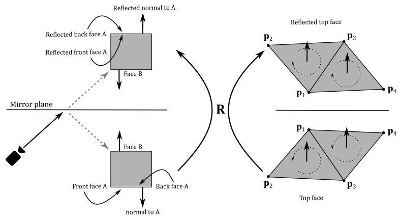
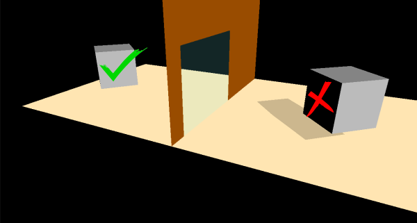
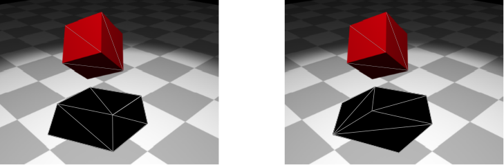

<br>


<br>

# 1 - Introduction

Stenciling is a technique in the visual arts for transferring a pattern to a surface (such as paper or fabric) by applying ink or paint over an intermediate object, called stencil, with designed gaps in it to create the pattern.

<br>


<br>

In computer graphics, a texture called stencil image can be used as an intermediate object to control which fragments should proceed through the graphics pipeline and be stored in the render target. The sample examined in this tutorial uses a stencil image to create a reflective object (a mirror) and to cast a shadow on a planar surface, as illustrated in the image above. However, before delving into the implementation details, we must first continue our overview of the per-fragment operations stage to introduce the stencil test.

<br>

>In modern computer graphics, stenciling is no longer commonly employed for creating reflective objects or implementing shadowing. However, stenciling is still used in specific cases, and employing it to create reflective objects and shadows will offer an opportunity to apply the theory presented in appendix 05 and gain practical experience in the stenciling technique.

<br>

<br>

# 2 - Per-Fragments Ops (part 2)

## 2.1 - Stencil test

The stencil test occurs on a per-fragment basis, typically after the fragment shader and before the depth test in the graphics pipeline. However, in Vulkan, there is flexibility for a Vulkan implementation to execute the stencil and depth tests earlier under certain conditions (for more details, refer to the previous tutorial).

The stencil test compares the value stored in the stencil image, at the same position of the fragment currently processed in the pipeline (depth and stencil images should have the same size as the render target), against a stencil reference value. If the stencil test fails, the corresponding fragment is discarded. This enables graphics applications to mask regions of the render target where to restrict drawing operetions, allowing the implementation of special effects such as decaling and outlining.

<br>


<br>

The illustration above shows an example of how the stencil test can be used to mask some texels in the render target: only fragments associated with a stencil value of 1 in the stencil image will stored in the render target. This is because the comparison test performed in this case checks if the stencil value EQUALs the stencil reference value.

The stencil test can be enabled dynamically using the **vkCmdSetStencilTestEnable** command, or statically during pipeline creation through the **VkPipelineDepthStencilStateCreateInfo::stencilTestEnable** field.

The stencil test is controlled by one of two sets of stencil-related state, the front stencil state and the back stencil state. Stencil tests use the back stencil state when processing fragments generated by back-facing polygons, and the front stencil state when processing fragments generated by front-facing polygons or any other primitives.

 The following pseudo-formula is used to perform the stencil test, where the ampersand symbol (&) represents the bitwise AND operator.

 <br>

```
 (StencilReferenceValue & CompareMask) VkCompareOp (StencilImageValue & CompareMask)
```
<br>

**VkCompareOp** is the comparison function used in the stencil test. This function can be specified independently for both front and back faces. A comparison can be set it dynamically using the **vkCmdSetStencilOp** command, or during pipeline creation through the **VkStencilOpState::compareOp** field through the **VkPipelineDepthStencilStateCreateInfo** structure used to create the currently active pipeline.

**StencilReferenceValue** represents the stencil reference value, that can be set dynamically for each face by the **vkCmdSetStencilReference** command when the graphics pipeline is created with **VK_DYNAMIC_STATE_STENCIL_REFERENCE** set in **VkPipelineDynamicStateCreateInfo::pDynamicStates**. Otherwise, this value can be specified, for both front and back faces, by the **VkStencilOpState::reference** field through the **VkPipelineDepthStencilStateCreateInfo** structure.

**StencilImageValue** represents the content of the stencil image for the current fragment. In other words, it denotes the value stored in the stencil image for the specific fragment being processed.

**CompareMask** is a value used to mask the bits of both the stencil reference value and stencil image value. It can be set by the **VkPipelineDepthStencilStateCreateInfo** structure during pipeline creation, or by the **vkCmdSetStencilCompareMask** command. Usually, we will set the compare mask to 0xFF, so that the bitwise AND operation doesn't change the values of both **StencilReferenceValue** and **StencilImageValue**, allowing a direct comparison between the original values.

<br>

Typically, 1 byte is enough to represent both **StencilReferenceValue** and **StencilImageValue**, allowing the stencil image to be embedded in the depth image. In this scenario, a depth-stencil image is a texture of the same dimension as the render target, where each texel contains a value. The first N bits are used to store a depth value, while the remaining 8 bits are used to store a stencil value.

The comparison functions available are the same used in the depth test:

<br>

```cpp
// Provided by VK_VERSION_1_0
typedef enum VkCompareOp {
    VK_COMPARE_OP_NEVER = 0,
    VK_COMPARE_OP_LESS = 1,
    VK_COMPARE_OP_EQUAL = 2,
    VK_COMPARE_OP_LESS_OR_EQUAL = 3,
    VK_COMPARE_OP_GREATER = 4,
    VK_COMPARE_OP_NOT_EQUAL = 5,
    VK_COMPARE_OP_GREATER_OR_EQUAL = 6,
    VK_COMPARE_OP_ALWAYS = 7,
} VkCompareOp;
```
<br>

**VK_COMPARE_OP_NEVER** specifies the comparison never passes. That is, the comparison function always return false.

**VK_COMPARE_OP_ALWAYS** specifies the comparison always passes. That is, the comparison function always return true.

**VK_COMPARE_OP_LESS** specifies that if the stencil reference value is less than the value stored in the stencil image (at the same position of the corresponding fragment), the comparison passes.

**VK_COMPARE_OP_EQUAL** specifies that if the stencil reference value equals the value stored in the stencil image (at the same position of the corresponding fragment), the comparison passes.

And so on.

<br>

Let's examine the fields of the **VkPipelineDepthStencilStateCreateInfo** structure that are relevant to the stencil test.

<br>

```cpp
// Provided by VK_VERSION_1_0
typedef struct VkPipelineDepthStencilStateCreateInfo {
    VkStructureType                           sType;
    const void*                               pNext;
    VkPipelineDepthStencilStateCreateFlags    flags;
    VkBool32                                  depthTestEnable;
    VkBool32                                  depthWriteEnable;
    VkCompareOp                               depthCompareOp;
    VkBool32                                  depthBoundsTestEnable;
    VkBool32                                  stencilTestEnable;
    VkStencilOpState                          front;
    VkStencilOpState                          back;
    float                                     minDepthBounds;
    float                                     maxDepthBounds;
} VkPipelineDepthStencilStateCreateInfo;
```
<br>

**stencilTestEnable** controls whether stencil testing is enabled.

**front** and **back** represent the state of the stencil test for front and back-facing primitives, respectively.

**depthBoundsTestEnable**, **minDepthBounds**, and **maxDepthBounds** are not part of the stencil test state and will be covered in a later tutorial. 

**depthTestEnable**, **depthWriteEnable**, and **depthCompareOp** are part of the depth test state and have already been discussed in the previous tutorial.

<br>

The **VkStencilOpState** structure is defined as follows:

<br>

```cpp
// Provided by VK_VERSION_1_0
typedef struct VkStencilOpState {
    VkStencilOp    failOp;
    VkStencilOp    passOp;
    VkStencilOp    depthFailOp;
    VkCompareOp    compareOp;
    uint32_t       compareMask;
    uint32_t       writeMask;
    uint32_t       reference;
} VkStencilOpState;
```
<br>

**failOp** is a **VkStencilOp** value specifying the action performed on fragments that fail the stencil test.

**passOp** is a **VkStencilOp** value specifying the action performed on fragments that pass both the depth and stencil tests.

**depthFailOp** is a **VkStencilOp** value specifying the action performed on fragments that pass the stencil test and fail the depth test.

**compareOp** is a **VkCompareOp** value specifying the comparison operator used in the stencil test.

**compareMask** selects the bits of the unsigned integer stencil values participating in the stencil test (**StencilReferenceValue** and **StencilImageValue** in the pseudo-formula discussed above)

**writeMask** selects the bits of the unsigned integer stencil values updated by the stencil test in the stencil framebuffer attachment (more on this shortly).

**reference** is an integer value used as stencil reference value in the unsigned stencil comparison.

<br>

The value *sv* in the stencil image is updated with a generated stencil value *sg* according to the write mask *sw*, defined by the **writeMask** field, as follows:

<br>

```
sv = (sv & ~sw) | (sg & sw)
```

<br>

where the tilde symbol (~) indicates the bitwise NOT operator. <br>
The write mask can also be dynamically set for each face by using the **vkCmdSetStencilWriteMask** command.

As just mentioned above, a new stencil value is generated based on a stencil operation defined by **VkStencilOp** parameters that can be set using the **vkCmdSetStencilOp** command or through the **VkStencilOpState** fields in the **VkPipelineDepthStencilStateCreateInfo** structure. Note that these operations can be specified for front and back faces independently.

There are three possible outcomes between the stencil and depth tests. If the stencil test fails, **failOp** defines the stencil operation used to update the stencil value stored in the stencil image. If the stencil test passes however, the stencil operation used is based on the depth test: if it passes, **passOp** is used, otherwise **depthFailOp** is used.

Possible values of the **failOp**, **passOp**, and **depthFailOp** (members of the **VkStencilOpState** structure), specifying what happens to the stored stencil value if this or certain subsequent tests fail or pass, are:

<br>

```cpp
// Provided by VK_VERSION_1_0
typedef enum VkStencilOp {
    VK_STENCIL_OP_KEEP = 0,
    VK_STENCIL_OP_ZERO = 1,
    VK_STENCIL_OP_REPLACE = 2,
    VK_STENCIL_OP_INCREMENT_AND_CLAMP = 3,
    VK_STENCIL_OP_DECREMENT_AND_CLAMP = 4,
    VK_STENCIL_OP_INVERT = 5,
    VK_STENCIL_OP_INCREMENT_AND_WRAP = 6,
    VK_STENCIL_OP_DECREMENT_AND_WRAP = 7,
} VkStencilOp;
```
<br>

**VK_STENCIL_OP_KEEP** keeps the current value.

**VK_STENCIL_OP_ZERO** sets the value to 0.

**VK_STENCIL_OP_REPLACE** sets the value to reference.

**VK_STENCIL_OP_INCREMENT_AND_CLAMP** increments the current value and clamps to the maximum representable unsigned value.

**VK_STENCIL_OP_DECREMENT_AND_CLAMP** decrements the current value and clamps to 0.

**VK_STENCIL_OP_INVERT** bitwise-inverts the current value.

**VK_STENCIL_OP_INCREMENT_AND_WRAP** increments the current value and wraps to 0 when the maximum value would have been exceeded.

**VK_STENCIL_OP_DECREMENT_AND_WRAP** decrements the current value and wraps to the maximum possible value when the value would go below 0.

<br>

<br>

# 3 - VKStenciling: code review

In contrast to the samples presented in previous tutorials, this time we have a greater number of objects to draw and different pipeline objects to use. Additionally, as we enable blending, depth, and stencil testing, we must draw objects in a step-by-step manner, following a specific order.

<br>

### Step 1: draw opaque objects

To start, we must draw the opaque objects first since we intend to render transparent objects later, which should show the objects positioned behind them. In the scene, we have three opaque objects: a wall, a floor, and a cube.

<br>


<br>

All objects in the scene will share the same vertex and index buffers. We already know hot to draw cubes and quads, but in this case, we also need to draw a wall leaving some space for the mirror. This can be achieved by creating a geometry with only 10 vertices and 12 indices to select the six triangles that compose it, as shown in the image below.

<br>


<br>

### Step 2: create a mask on the stencil image

To draw objects reflected by a mirror, we can use a simple trick: consider them as opaque objects reflected (translated) with respect to the mirror, as shown in the image below (see appendix 05 for more details).

<br>


<br>

However, if the scene consists of two rooms separated by a wall with a mirror, using this method alone would expose the trick when entering the other room, as illustrated in the following image.

<br>


<br>

The problem is that we should only see the reflected objects through the mirror. Fortunately, we can use stenciling to achieve the desired result.

<br>


<br>

Specifically, we can "draw" the mirror on the stencil image (from the camera's perspective) to create a mask that will be used to draw the reflected objects. The image below shows both the render target (on the left) and the stencil image (on the right) after the second step. Please note that the green color used to mark the mirror in the stencil image is purely for visualization purposes. In practice, a stencil image typically stores integer values in its texels as stencil values rather than colors.

<br>


<br>

To create our mask on the stencil image, we first need to enable the stencil test. Then, we can "draw" the mirror by specifying that if a fragment of the mirror passes both the stencil and depth tests, the stencil value stored in the corresponding texel of the stencil image must be updated from 0 to 1 (assuming that the stencil image has been cleared to zero at the beginning of the render pass). <br>
It's important to enable the depth test as well because the mask should exclude non-visible objects that would be reflected in the mirror. However, we must disable writes to the depth image, so that we will be able to draw the reflected objects on the render target in the next step (otherwise, they won't pass the depth test). <br>
Furthermore, we need to disable writes to the render target since we are "drawing" on the stencil image. To accomplish this, we can set a blend state in the pipeline object that prevents fragment colors from being stored in the render target. This can be achieved by setting the write mask of the color attachment in the blend state to zero (refer to tutorials **01.B Hello Triangle** and **02.A Alpha Blending** for more details).

<br>

### Step 3: draw reflected objects

To reflect an object with respect to a plane, we need to transform each of its vertices. For this purpose, we can take advantage of the theory presented in appendix 05. Specifically, we can multiply the world matrix associated with each opaque object rendered in step 1 by a matrix that reflects with respect to the mirror plane. The resulting matrix still represents a world transformation that can be used to reflect both vertices and normals of opaque objects in the vertex shader.

<br>


<br>

>**GLM** does not provides a built-in function to create a matrix that reflects with respect to a plane. However, it is not too difficult to implement one ourselves after reading appendix 05.

<br>

Please note that after reflecting mesh objects with respect to a plane, outer (front) faces become inner (back) faces, and vice versa, even though we reflect normals. In other words, reflecting objects with respect to a plane reverses the winding order of the vertices, as shown in the images below. Therefore, we must consider (draw) the back faces of reflected objects to fix this problem.

<br>



<br>


<br>

At this point, we can draw the reflected objects by using the mask created on the stencil image in step 2. Specifically, we will draw fragment colors on the render target only if the corresponding texel in the stencil image is equal to the stencil reference value. Therefore, before drawing, we must set the stencil reference value to the same value as the texels where we rendered the mirror in the stencil image during the previous step. In this case, we need to set the stencil reference value to 1.

<br>

>Observe that mirrors reflect light as well. This means that we should reflect light directions to account for additional light sources illuminating the faces of objects in the scene. However, this reflection of light directions won't affect the image reflected by the mirror because we can use the original light directions to illuminate the reflected objects, as shown in the following illustration.
>
><br>
>
>
>
><br>
>
>As you can see, we can use the original light direction to illuminate $\mathbf{p}'$, the reflection of $\mathbf{p}$. However, if the camera were aimed directly at $\mathbf{p}$, we would notice a mismatch between the incoming lights reaching $\mathbf{p}$ and $\mathbf{p}'$.
>
><br>
>
>
>
><br>
>
>Since the camera position is fixed and we cannot change it in this sample, we don't need to worry about reflecting light directions because we cannot view the scene from the perspective of the mirror. Thus, the simplified approach of using the original light directions to illuminate the reflected objects is sufficient to achieve the desired effect.

<br>

### Step 4: draw planar shadows

In this sample, the cube casts a shadow on the floor.

<br>


<br>

To create a planar shadow, we can project the cube onto the floor from the perspective of the light source. In this case, since we have a directional light, we need to project along the direction of the light, as shown on the right side of the image below. When a triangle is projected onto a plane, it remains a triangle (assuming that the normals to the triangle and the plane are not perpendicular to each other). Thus, we can use the projected cube as a new mesh object to render on the screen using alpha blending, effectively displaying it as a shadow.

<br>


<br>

To project vertices onto a plane, we can use the concepts discussed in appendix 05. Specifically, we can multiply the world matrix associated with the cube by a matrix that performs the projection onto the floor. The resulting matrix still represents a world transformation that can be used in the vertex shader to project the vertices of the cube onto the floor.

<br>

>**GLM** does not provide a built-in function that takes the coefficients of a plane's equation and the light position as input, and that returns the projection matrix onto that plane from the perspective of the light source. However, implementing such a matrix ourselves based on the information provided in appendix 05 is not too difficult.

<br>

Observe that we need to apply a small offset to the shadow projected on the floor to prevent z-fighting, where fragments with similar depth values compete to be visible due to their limited precision when stored in the depth image, leading to undesirable flickering artifacts. Once the z-fighting is resolved, we can set a solid black color for the shadow mesh object and use alpha blending to give it a transparent appearance, resembling a shadow.

In the image below, we can observe that a cube projected onto a plane does not present overlapping triangles when face culling is enabled in the rasterizer. Indeed, if back face triangles are culled, front ones will not overlap (as shown on the left). Similarly, if back face triangles are drawn, while front ones are culled, the overlap is avoided (as seen on the right).

<br>



<br>

However, projecting complex mesh objects can lead to overlapping triangles, resulting in multiple blending, as shown in the image below (on the left). This can cause annoying artifacts as the transparent black color of overlapping triangles gets blended multiple times. <br>
Planar shadows can also suffer from out-of-bounds shadows, as illustrated in the middle of the image below. The problem arises when we project onto a plane without considering its boundaries, leading to shadows extending beyond the intended surface. <br>
Furthermore, if a light source is positioned between a mesh object and the projection plane, fake shadows may appear, as depicted on the right of the following image.

<br>


<br>

Both multiple blending and out-of-bounds shadows can be addressed using stenciling. To prevent fake shadows caused by a light source between a mesh and the plane of projection, we can check if the distance from the light source to the plane is greater than the distance of the mesh object.

Remember that stenciling is not commonly used to create shadows in modern graphics applications, so solving these issues is not our main concern. However, to demonstrate another application of the stencil test, we will still fix multiple blending, even though it is not necessary in this particular case, as culling back faces prevents overlapping triangles in a cube mesh. To achieve this, we set the stencil reference value to zero and the stencil operation to EQUAL. If a fragment also passes the depth test, we increment the corresponding stencil value to 1 to prevent any further fragment to be rendered for the same position. This way, fragments of the shadow will only rendered once. <br>
Let's take a practical example. The state of the stencil image after step 3 is the one illustrated in the image below (on the left). All stencil values are zeros except the ones where we have drawn the mirror in step 2, which are all 1.

<br>


<br>

By setting the stencil reference value to zero and using the EQUAL operation for stenciling, only the fragments of the shadow with a stencil value of zero are rendered. If a fragment passes both the stencil and depth tests, we increment the stencil value to 1, ensuring no further fragments pass the stencil test for the same area, as illustrated in the image above (on the right). <br>
Observe that the depth test can be enabled because we don't want to include non-visible fragments of the shadow. However, this time we don't need to disable writes to either the depth image or the render target, as we want to use the stencil image as a mask for drawing on the render target. And this means that we also need to update the depth values in the depth image.

To draw the shadow reflected in the mirror, we first need to multiply the world matrix of the cube projected onto the floor by the matrix of reflection with respect to the mirror plane calculated in step 3. Then, we can use stenciling again to prevent multiple blending. To achieve this, we update the stencil reference value to 1 since the fragments of the reflected shadow occupy the same area in the stencil buffer as the mirror, which already has stencil values of 1.

<br>

### Step 5: draw the mirror

In the last step, we draw the mirror as a transparent quad.

<br>


<br>

<br>

## 3.1 - C++ code:

At this point, with the explanations provided in the text and illustrations above, the source code of the sample should be self-explanatory.

To begin, we must create a combined depth-stencil image and set the appropriate operations to be executed at the start and end of the render pass for synchronization purposes.

<br>

```cpp
void VKSample::CreateDepthStencilImage(uint32_t width, uint32_t height)
{
    VkFormat depthFormat = VK_FORMAT_UNDEFINED;
    VkFormatProperties props;

    // Find the highest precision depth-stencil (combined) format
    std::vector<VkFormat> depthFormats = {
        VK_FORMAT_D32_SFLOAT_S8_UINT,
        VK_FORMAT_D24_UNORM_S8_UINT,
        VK_FORMAT_D16_UNORM_S8_UINT
    };

    VkFormatProperties formatProps;
    for (auto& format : depthFormats)
    {
        vkGetPhysicalDeviceFormatProperties(m_vulkanParams.PhysicalDevice, format, &formatProps);
        // Format must support depth stencil attachment for optimal tiling
        if (formatProps.optimalTilingFeatures & VK_FORMAT_FEATURE_DEPTH_STENCIL_ATTACHMENT_BIT)
        {
            depthFormat = format;
            break;
        }
    }

    // ...

}
```
<br>

```cpp
// Create a Render Pass object.
void VKSample::CreateRenderPass()
{
    // This example will use a single render pass with one subpass

    // Descriptors for the attachments used by this renderpass
    std::array<VkAttachmentDescription, 2> attachments = {};

    // Color attachment
    // ...


    // Depth-stencil attachment
    attachments[1].format = m_vulkanParams.DepthStencilImage.Format;                // Use the format selected for the depth-stencil image
    attachments[1].samples = VK_SAMPLE_COUNT_1_BIT;                                 // We don't use multi sampling in this example
    attachments[1].loadOp = VK_ATTACHMENT_LOAD_OP_CLEAR;                            // Clear this attachment at the start of the render pass
    attachments[1].storeOp = VK_ATTACHMENT_STORE_OP_DONT_CARE;                      // Discard its contents after the render pass is finished
    attachments[1].stencilLoadOp = VK_ATTACHMENT_LOAD_OP_CLEAR;                     // Similar to loadOp, but for stenciling
    attachments[1].stencilStoreOp = VK_ATTACHMENT_STORE_OP_STORE;                   // Similar to storeOp, but for stenciling
    attachments[1].initialLayout = VK_IMAGE_LAYOUT_UNDEFINED;                       // Layout at render pass start. Initial doesn't matter, so we use undefined
    attachments[1].finalLayout = VK_IMAGE_LAYOUT_DEPTH_STENCIL_ATTACHMENT_OPTIMAL;  // Layout to which the attachment is transitioned when the render pass is finished

    // ...

}
```
<br>

Compared to the examples discussed in previous tutorials, we now have more objects to draw and a variety of pipeline objects to utilize. As a result, we will be using the map implementation provided by the C++ standard library to conveniently manage the creation of mesh and pipeline objects. <br>
Observe that all mesh objects will share the same index and vertex buffers. Therefore, the **MeshObject** structure provides all the necessary information to be passed as parameters to **vkCmdDrawIndexed**.

<br>

```cpp
struct SampleParameters {
    VkRenderPass                         RenderPass;
    std::vector<VkFramebuffer>           Framebuffers;
    std::map<std::string, VkPipeline>    GraphicsPipelines;
    VkDescriptorPool                     DescriptorPool;
    VkDescriptorSetLayout                DescriptorSetLayout;
    VkPipelineLayout                     PipelineLayout;
    VkCommandPool                        GraphicsCommandPool;
    FrameResources                       FrameRes;
};
```
<br>

```cpp
class VKStenciling : public VKSample
{

    // ...


    // Uniform block defined in the vertex shader to be used as a dynamic uniform buffer:
    //
    //layout(std140, set = 0, binding = 1) uniform dynbuf {
    //     mat4 World;
    //     vec4 solidColor;
    // } dynBuf;
    //
    // Allow the specification of different world matrices for different objects by offsetting
    // into the same buffer.
    struct MeshInfo{
        glm::mat4 worldMatrix;
        glm::vec4 solidColor;
    };

    struct {
        MeshInfo *meshInfo;        // pointer to an array of mesh info
    } dynUBufVS;

    // Mesh object info
    struct MeshObject
    {
        uint32_t dynIndex;
        uint32_t indexCount;
        uint32_t firstIndex;
        uint32_t vertexOffset;
        uint32_t vertexCount;
        MeshInfo *meshInfo;
    };

    // Mesh objects to draw
    std::map<std::string, MeshObject> m_meshObjects;

    // In this sample we have nine draw calls for each frame.
    const unsigned int m_numDrawCalls = 9;

    // Sample members
    float m_curRotationAngleRad;
    size_t m_dynamicUBOAlignment;
};
```
<br>

In the constructor of the **VKStenciling** class, the mesh objects are initialized by setting the information that will be passed as parameters to the **vkCmdDrawIndexed** funtion. As you can see, the information for many mesh objects is determined by the previous ones. This is because all mesh objects share the same index and vertex buffers.

<br>

```cpp
VKStenciling::VKStenciling(uint32_t width, uint32_t height, std::string name) :
VKSample(width, height, name),
m_curRotationAngleRad(0.0f),
m_dynamicUBOAlignment(0)
{
    // Initialize the pointer to the memory region that will store the array of world matrices.
    dynUBufVS.meshInfo = nullptr;

    // Initialize mesh objects
    m_meshObjects["cube"] = {0, 36, 0, 0, 24, nullptr};

    m_meshObjects["floor"] = {1, 6, 
                              m_meshObjects["cube"].indexCount, 
                              m_meshObjects["cube"].vertexCount, 
                              4, nullptr};

    m_meshObjects["wall"] = {2, 18, 
                             m_meshObjects["cube"].indexCount + m_meshObjects["floor"].indexCount,
                             m_meshObjects["cube"].vertexCount + m_meshObjects["floor"].vertexCount,
                             10, nullptr};

    m_meshObjects["mirror"] = {3, 6, 
                               m_meshObjects["cube"].indexCount + m_meshObjects["floor"].indexCount + m_meshObjects["wall"].indexCount, 
                               m_meshObjects["cube"].vertexCount + m_meshObjects["floor"].vertexCount + m_meshObjects["wall"].vertexCount, 
                               4, nullptr};

    m_meshObjects["reflectedCube"] = {4, 36, 0, 0, 24, nullptr};

    m_meshObjects["reflectedFloor"] = {5, m_meshObjects["floor"].indexCount, m_meshObjects["floor"].firstIndex, 
                                       m_meshObjects["floor"].vertexOffset, m_meshObjects["floor"].vertexCount, nullptr};

    m_meshObjects["shadowCube"] = {6, 36, 0, 0, 24, nullptr};
    m_meshObjects["shadowReflectedCube"] = {7, 36, 0, 0, 24, nullptr};

    // Initialize the view matrix
    glm::vec3 c_pos = { 3.0f, -10.0f, 4.0f };
    glm::vec3 c_at =  { 0.0f, 0.0f, 1.0f };
    glm::vec3 c_down =  { 0.0f, 0.0f, -1.0f };
    uBufVS.viewMatrix = glm::lookAtLH(c_pos, c_at, c_down);

    // Initialize the projection matrix by setting the frustum information
    uBufVS.projectionMatrix = glm::perspectiveLH(glm::quarter_pi<float>(), (float)width/height, 0.01f, 100.0f);

    // Initialize the lighting parameters (directions and colors)
    uBufVS.lightDir = {-0.577f, -0.577f, 0.577f, 0.0f};
    uBufVS.lightColor = {0.9f, 0.9f, 0.9f, 1.0f};
}
```
<br>

The shared index and vertex buffer is created as follows:

<br>

```cpp
// Create vertex and index buffers describing all mesh geometries
void VKStenciling::CreateVertexBuffer()
{
    // While it's fine for an example application to request small individual memory allocations, that is not
    // what should be done a real-world application, where you should allocate large chunks of memory at once instead.

    //
    // Create the vertex and index buffers.
    //

    // Define the combined geometries in local space (Z points up in this case).
    //
    std::vector<Vertex> cubeVertices =
    {
        // Cube (24 vertices: 0-23)
        { {-1.0f, -1.0f, 1.0f}, {0.0f, 0.0f, 1.0f} },
        { {1.0f, -1.0f, 1.0f},  {0.0f, 0.0f, 1.0f} },
        { {1.0f, 1.0f, 1.0f},   {0.0f, 0.0f, 1.0f} },
        { {-1.0f, 1.0f, 1.0f},  {0.0f, 0.0f, 1.0f} },

        { {-1.0f, -1.0f, -1.0f}, {0.0f, 0.0f, -1.0f} },
        { {-1.0f, 1.0f, -1.0f},  {0.0f, 0.0f, -1.0f} },
        { {1.0f, 1.0f, -1.0f},   {0.0f, 0.0f, -1.0f} },
        { {1.0f, -1.0f, -1.0f},  {0.0f, 0.0f, -1.0f} },

        { {-1.0f, -1.0f, 1.0f},  {-1.0f, 0.0f, 0.0f} },
        { {-1.0f, 1.0f, 1.0f},   {-1.0f, 0.0f, 0.0f} },
        { {-1.0f, 1.0f, -1.0f},  {-1.0f, 0.0f, 0.0f} },
        { {-1.0f, -1.0f, -1.0f}, {-1.0f, 0.0f, 0.0f} },

        { {1.0f, -1.0f, 1.0f},  {1.0f, 0.0f, 0.0f} },
        { {1.0f, -1.0f, -1.0f}, {1.0f, 0.0f, 0.0f} },
        { {1.0f, 1.0f, -1.0f},  {1.0f, 0.0f, 0.0f} },
        { {1.0f, 1.0f, 1.0f},   {1.0f, 0.0f, 0.0f} },

        { {-1.0f, 1.0f, 1.0f},  {0.0f, 1.0f, 0.0f} },
        { {1.0f, 1.0f, 1.0f},   {0.0f, 1.0f, 0.0f} },
        { {1.0f, 1.0f, -1.0f},  {0.0f, 1.0f, 0.0f} },
        { {-1.0f, 1.0f, -1.0f}, {0.0f, 1.0f, 0.0f} },

        { {1.0f, -1.0f, 1.0f},   {0.0f, -1.0f, 0.0f} },
        { {-1.0f, -1.0f, 1.0f},  {0.0f, -1.0f, 0.0f} },
        { {-1.0f, -1.0f, -1.0f}, {0.0f, -1.0f, 0.0f} },
        { {1.0f, -1.0f, -1.0f},  {0.0f, -1.0f, 0.0f} },

        // Floor (4 vertices: 24-27)
        { {-3.5f, -10.0f, 0.0f}, {0.0f, 0.0f, 1.0f} },
        { {7.5f, -10.0f, 0.0f},  {0.0f, 0.0f, 1.0f} },
        { {7.5f, 0.0f, 0.0f},    {0.0f, 0.0f, 1.0f} },
        { {-3.5f, 0.0f, 0.0f},   {0.0f, 0.0f, 1.0f} },

        // Wall (10 vertices: 28-37): we leave a gap in the middle for the mirror
        { {-3.5f, 0.0f, 0.0f}, {0.0f, 0.0f, -1.0f} },
        { {-2.5f, 0.0f, 0.0f}, {0.0f, 0.0f, -1.0f} },
        { {-2.5f, 0.0f, 4.0f}, {0.0f, 0.0f, -1.0f} },
        { {-3.5f, 0.0f, 4.0f}, {0.0f, 0.0f, -1.0f} },

        { {2.5f, 0.0f, 0.0f}, {0.0f, 0.0f, -1.0f} },
        { {7.5f, 0.0f, 0.0f}, {0.0f, 0.0f, -1.0f} },
        { {7.5f, 0.0f, 4.0f}, {0.0f, 0.0f, -1.0f} },
        { {2.5f, 0.0f, 4.0f}, {0.0f, 0.0f, -1.0f} },

        { {7.5f, 0.0f, 6.0f},  {0.0f, 0.0f, -1.0f} },
        { {-3.5f, 0.0f, 6.0f}, {0.0f, 0.0f, -1.0f} },

        // Mirror (4 vertices: 38-41)
        { {-2.5f, 0.0f, 0.0f}, {0.0f, 0.0f, -1.0f} },
        { {2.5f, 0.0f, 0.0f}, {0.0f, 0.0f, -1.0f} },
        { {2.5f, 0.0f, 4.0f}, {0.0f, 0.0f, -1.0f} },
        { {-2.5f, 0.0f, 4.0f}, {0.0f, 0.0f, -1.0f} }
    };
    size_t vertexBufferSize = static_cast<size_t>(cubeVertices.size()) * sizeof(Vertex);

    // The indices defining the two triangle for each quad in the combined geometry
    // The vertices of each triangle are selected in counter-clockwise order.
    std::vector<uint16_t> indexBuffer =
    {
        //
        // Cube (36 incides: 0-35)
        //
        0,1,2,
        0,2,3,

        4,5,6,
        4,6,7,

        8,9,10,
        8,10,11,

        12,13,14,
        12,14,15,

        16,17,18,
        16,18,19,

        20,21,22,
        20,22,23,

        // Floor (6 indices: 36-41)
        0, 1, 2,
        0, 2, 3,

        // Wall (18 indices: 42-59)
        0, 1, 2,
        0, 2, 3,

        4, 5, 6,
        4, 6, 7,

        3, 8, 9,
        3, 6, 8,

        // Mirror (6 indices: 60-65)
        0, 1, 2,
        0, 2, 3
    };
    size_t indexBufferSize = static_cast<size_t>(indexBuffer.size()) * sizeof(uint16_t);

    
    // ...

}
```
<br>

The pipeline objects used in this sample are created to support the step-by-step drawing process described earlier at the beginning of this section. 

<br>

```cpp
void VKStenciling::CreatePipelineObjects()
{
    //
    // Construct the different states making up the only graphics pipeline needed by this sample
    //


    // ...

    
    //
    // Rasterization state
    //
    VkPipelineRasterizationStateCreateInfo rasterizationState = {};
    rasterizationState.sType = VK_STRUCTURE_TYPE_PIPELINE_RASTERIZATION_STATE_CREATE_INFO;
    rasterizationState.polygonMode = VK_POLYGON_MODE_FILL;
    rasterizationState.cullMode = VK_CULL_MODE_BACK_BIT;
    rasterizationState.frontFace = VK_FRONT_FACE_COUNTER_CLOCKWISE;
    rasterizationState.lineWidth = 1.0f;
    
    //
    // Per-Fragment Operations state
    //
    // Color blend state describes how blend factors are calculated (if used)
    // We need a blend state per color attachment (even if blending is not used)
    // because the pipeline needs to know the components\channels of the pixels in the color
    // attachemnts that can be written to.
    VkPipelineColorBlendAttachmentState blendAttachmentState[1] = {};
    blendAttachmentState[0].colorWriteMask = 0xf;
    blendAttachmentState[0].blendEnable = VK_FALSE;
    VkPipelineColorBlendStateCreateInfo colorBlendState = {};
    colorBlendState.sType = VK_STRUCTURE_TYPE_PIPELINE_COLOR_BLEND_STATE_CREATE_INFO;
    colorBlendState.attachmentCount = 1;
    colorBlendState.pAttachments = blendAttachmentState;

    // Depth and stencil state containing depth and stencil information (compare and write operations; more on this in a later tutorial).
    // We also need to specify if the depth and stencil tests are enabled or disabled.
    VkPipelineDepthStencilStateCreateInfo depthStencilState = {};
    depthStencilState.sType = VK_STRUCTURE_TYPE_PIPELINE_DEPTH_STENCIL_STATE_CREATE_INFO;
    depthStencilState.depthTestEnable = VK_TRUE;
    depthStencilState.depthWriteEnable = VK_TRUE;
    depthStencilState.depthCompareOp = VK_COMPARE_OP_LESS_OR_EQUAL;
    depthStencilState.depthBoundsTestEnable = VK_FALSE;
    depthStencilState.back.failOp = VK_STENCIL_OP_KEEP;
    depthStencilState.back.passOp = VK_STENCIL_OP_KEEP;
    depthStencilState.back.compareOp = VK_COMPARE_OP_ALWAYS;
    depthStencilState.stencilTestEnable = VK_FALSE;
    depthStencilState.front = depthStencilState.back;
    
    //
    // Enable dynamic states
    //
    // Most states are stored into the pipeline, but there are still a few dynamic states 
    // that can be changed within a command buffer.
    // To be able to change these state dynamically we need to specify which ones in the pipeline object. 
    // At that point, we can set the actual states later on in the command buffer.
    std::vector<VkDynamicState> dynamicStateEnables;
    dynamicStateEnables.push_back(VK_DYNAMIC_STATE_VIEWPORT);
    dynamicStateEnables.push_back(VK_DYNAMIC_STATE_SCISSOR);
    dynamicStateEnables.push_back(VK_DYNAMIC_STATE_STENCIL_REFERENCE); // Stencil reference value will be set dinamically.
    VkPipelineDynamicStateCreateInfo dynamicState = {};
    dynamicState.sType = VK_STRUCTURE_TYPE_PIPELINE_DYNAMIC_STATE_CREATE_INFO;
    dynamicState.pDynamicStates = dynamicStateEnables.data();
    dynamicState.dynamicStateCount = static_cast<uint32_t>(dynamicStateEnables.size());

    
    // ...

    
    //
    // Shaders
    //
    VkShaderModule mainVS = LoadSPIRVShaderModule(m_vulkanParams.Device, GetAssetsPath() + "/data/shaders/main.vert.spv");
    VkShaderModule lambertianFS = LoadSPIRVShaderModule(m_vulkanParams.Device, GetAssetsPath() + "/data/shaders/lambertian.frag.spv");
    VkShaderModule solidFS = LoadSPIRVShaderModule(m_vulkanParams.Device, GetAssetsPath() + "/data/shaders/solid.frag.spv");

    // This sample will only use two programmable stage: Vertex and Fragment shaders
    std::array<VkPipelineShaderStageCreateInfo, 2> shaderStages{};
    
    // Vertex shader
    shaderStages[0].sType = VK_STRUCTURE_TYPE_PIPELINE_SHADER_STAGE_CREATE_INFO;
    // Set pipeline stage for this shader
    shaderStages[0].stage = VK_SHADER_STAGE_VERTEX_BIT;
    // Load binary SPIR-V shader module
    shaderStages[0].module = mainVS;
    // Main entry point for the shader
    shaderStages[0].pName = "main";
    assert(shaderStages[0].module != VK_NULL_HANDLE);
    
    // Fragment shader
    shaderStages[1].sType = VK_STRUCTURE_TYPE_PIPELINE_SHADER_STAGE_CREATE_INFO;
    // Set pipeline stage for this shader
    shaderStages[1].stage = VK_SHADER_STAGE_FRAGMENT_BIT;
    // Load binary SPIR-V shader module
    shaderStages[1].module = lambertianFS;
    // Main entry point for the shader
    shaderStages[1].pName = "main";
    assert(shaderStages[1].module != VK_NULL_HANDLE);

    //
    // Create the graphics pipelines used in this sample
    //
    
    //
    // Lambertian
    //

    VkGraphicsPipelineCreateInfo pipelineCreateInfo = {};
    pipelineCreateInfo.sType = VK_STRUCTURE_TYPE_GRAPHICS_PIPELINE_CREATE_INFO;
    // The pipeline layout used for this pipeline (can be shared among multiple pipelines using the same layout)
    pipelineCreateInfo.layout = m_sampleParams.PipelineLayout;
    // Render pass object defining what render pass instances the pipeline will be compatible with
    pipelineCreateInfo.renderPass = m_sampleParams.RenderPass;
    
    // Set pipeline shader stage info
    pipelineCreateInfo.stageCount = static_cast<uint32_t>(shaderStages.size());
    pipelineCreateInfo.pStages = shaderStages.data();
    
    // Assign the pipeline states to the pipeline creation info structure
    pipelineCreateInfo.pVertexInputState = &vertexInputState;
    pipelineCreateInfo.pInputAssemblyState = &inputAssemblyState;
    pipelineCreateInfo.pRasterizationState = &rasterizationState;
    pipelineCreateInfo.pColorBlendState = &colorBlendState;
    pipelineCreateInfo.pMultisampleState = &multisampleState;
    pipelineCreateInfo.pViewportState = &viewportState;
    pipelineCreateInfo.pDepthStencilState = &depthStencilState;
    pipelineCreateInfo.pDynamicState = &dynamicState;
    
    // Create a graphics pipeline for lambertian illumination
    VK_CHECK_RESULT(vkCreateGraphicsPipelines(m_vulkanParams.Device, 
                                              VK_NULL_HANDLE, 1, 
                                              &pipelineCreateInfo, nullptr, 
                                              &m_sampleParams.GraphicsPipelines["Lambertian"]));

    //
    // SolidColor
    //

    // Specify a fragment shader for shading using a solid color
	shaderStages[1].module = solidFS;
	// Create a graphics pipeline to draw using a solid color
	VK_CHECK_RESULT(vkCreateGraphicsPipelines(m_vulkanParams.Device, 
                                              VK_NULL_HANDLE, 1, 
                                              &pipelineCreateInfo, nullptr, 
                                              &m_sampleParams.GraphicsPipelines["SolidColor"]));

    //
    // Transparent
    //

    // Create a new blend attachment state for alpha blending
    blendAttachmentState[0].colorWriteMask = 0xf;
    blendAttachmentState[0].blendEnable = VK_TRUE;
    blendAttachmentState[0].srcColorBlendFactor = VK_BLEND_FACTOR_SRC_ALPHA;
    blendAttachmentState[0].dstColorBlendFactor = VK_BLEND_FACTOR_ONE_MINUS_SRC_ALPHA;
    blendAttachmentState[0].colorBlendOp = VK_BLEND_OP_ADD;
	// Create a graphics pipeline to draw using a solid color with blending enabled
	VK_CHECK_RESULT(vkCreateGraphicsPipelines(m_vulkanParams.Device, 
                                              VK_NULL_HANDLE, 1, 
                                              &pipelineCreateInfo, nullptr, 
                                              &m_sampleParams.GraphicsPipelines["Transparent"]));

    //
    // Stencil
    //

    // Disable both blending and writes to the render target
    blendAttachmentState[0].blendEnable = VK_FALSE;
    blendAttachmentState[0].colorWriteMask = 0x0;
    // Enable depth and stencil tests, while disabling writes to the depth image
    depthStencilState.stencilTestEnable = VK_TRUE;
    depthStencilState.depthWriteEnable = VK_FALSE;
    // A fragment on the front face of a primitive will ALWAYS pass the stencil test, and the value in
    // the corresponding texel of the stencil image will be REPLACEed with the stencil reference value
    // if the fragment also passes the depth test.
    depthStencilState.front.failOp = VK_STENCIL_OP_KEEP;
    depthStencilState.front.depthFailOp = VK_STENCIL_OP_KEEP;
    depthStencilState.front.passOp = VK_STENCIL_OP_REPLACE;
    depthStencilState.front.compareOp = VK_COMPARE_OP_ALWAYS;
    depthStencilState.front.reference = 1;
    depthStencilState.front.compareMask = 0xff;
    depthStencilState.front.writeMask = 0xff;
    // Create a graphics pipeline for drawing on the stencil image (to create a mask)
    VK_CHECK_RESULT(vkCreateGraphicsPipelines(m_vulkanParams.Device, 
                                              VK_NULL_HANDLE, 1, 
                                              &pipelineCreateInfo, nullptr, 
                                              &m_sampleParams.GraphicsPipelines["Stencil"]));

    //
    // ReflectedLambertian
    //

    // Enable writes to the render target
    blendAttachmentState[0].colorWriteMask = 0xf;
    // Enable writes to the depth image
    depthStencilState.depthWriteEnable = VK_TRUE;
    // Both depth and stencil tests are enabled.
    // A fragment on the front face of a primitive will pass the stencil test if the value
    // of the corresponding texel of the stencil image is EQUAL to the stencil reference value.
    // The texel KEEPs its value if the fragment passes both depth and stencil tests.
    depthStencilState.front.passOp = VK_STENCIL_OP_KEEP;
    depthStencilState.front.compareOp = VK_COMPARE_OP_EQUAL;
    // The front face will be considered the side where the vertices are in clockwise order.
    rasterizationState.frontFace = VK_FRONT_FACE_CLOCKWISE;
    // Specify a fragment shader for shading using the semplified lambertian model.
	shaderStages[1].module = lambertianFS;
    // Create a graphics pipeline for drawing reflected, illuminated objects (using the stencil image as a mask)
    VK_CHECK_RESULT(vkCreateGraphicsPipelines(m_vulkanParams.Device, 
                                              VK_NULL_HANDLE, 1, 
                                              &pipelineCreateInfo, nullptr, 
                                              &m_sampleParams.GraphicsPipelines["ReflectedLambertian"]));

    //
    // ReflectedSolidColor
    //

    // Specify a fragment shader for shading using a solid color
	shaderStages[1].module = solidFS;
    // Create a graphics pipeline for drawing reflected, NON-illuminated objects (using the stencil image as a mask)
    VK_CHECK_RESULT(vkCreateGraphicsPipelines(m_vulkanParams.Device, 
                                              VK_NULL_HANDLE, 1, 
                                              &pipelineCreateInfo, nullptr, 
                                              &m_sampleParams.GraphicsPipelines["ReflectedSolidColor"]));

    //
    // Shadow
    //

    // Enable blending to implement alpha blending
    blendAttachmentState[0].blendEnable = VK_TRUE;
    // Both depth and stencil tests are enabled. To prevent double blending:
    // A fragment on the front face of a primitive will pass the stencil test if the value
    // of the corresponding texel of the stencil image is EQUAL to the stencil reference value.
    // The texel value is INCRemented if the fragment passes both depth and stencil tests.
    depthStencilState.front.passOp = VK_STENCIL_OP_INCREMENT_AND_CLAMP;
    // Create a graphics pipeline for drawing transparent objects projected onto other surfaces, like shadows.
    VK_CHECK_RESULT(vkCreateGraphicsPipelines(m_vulkanParams.Device, 
                                              VK_NULL_HANDLE, 1, 
                                              &pipelineCreateInfo, nullptr, 
                                              &m_sampleParams.GraphicsPipelines["Shadow"]));

    // SPIR-V shader modules are no longer needed once the graphics pipeline has been created
    // since the SPIR-V modules are compiled during pipeline creation.
    vkDestroyShaderModule(m_vulkanParams.Device, mainVS, nullptr);
    vkDestroyShaderModule(m_vulkanParams.Device, lambertianFS, nullptr);
    vkDestroyShaderModule(m_vulkanParams.Device, solidFS, nullptr);
}
```
<br>

The function **UpdateHostVisibleDynamicBufferData** is responsible for updating the world matrices and colors of the mesh objects. Observe that the mirror and shadows are set to be transparent.

<br>

```cpp
void VKStenciling::UpdateHostVisibleDynamicBufferData()
{
    const float rotationSpeed = 0.8f;

    // Update the rotation angle
    m_curRotationAngleRad += rotationSpeed * m_timer.GetElapsedSeconds();
    if (m_curRotationAngleRad >= glm::two_pi<float>())
    {
        m_curRotationAngleRad -= glm::two_pi<float>();
    }

    // Rotate the cube at the center of the scene around the z-axis
    m_meshObjects["cube"].meshInfo = (MeshInfo*)((uint64_t)dynUBufVS.meshInfo + 
                                        (m_meshObjects["cube"].dynIndex * static_cast<uint32_t>(m_dynamicUBOAlignment)));
    glm::mat4 transl = glm::translate(glm::mat4(1.0f), glm::vec3(0.0f, -6.0f, 2.0f));
    glm::mat4 rotZTransl = glm::rotate(transl, m_curRotationAngleRad, glm::vec3(0.0f, 0.0f, 1.0f));
    m_meshObjects["cube"].meshInfo->worldMatrix = rotZTransl;

    // Set color of wall and floor
    m_meshObjects["floor"].meshInfo = (MeshInfo*)((uint64_t)dynUBufVS.meshInfo +
                                        (m_meshObjects["floor"].dynIndex * static_cast<uint32_t>(m_dynamicUBOAlignment)));
    m_meshObjects["floor"].meshInfo->worldMatrix = glm::identity<glm::mat4>();
    m_meshObjects["floor"].meshInfo->solidColor = { 1.0f, 0.9f, 0.7f, 1.0f };
    m_meshObjects["wall"].meshInfo = (MeshInfo*)((uint64_t)dynUBufVS.meshInfo + 
                                        (m_meshObjects["wall"].dynIndex * static_cast<uint32_t>(m_dynamicUBOAlignment)));
    m_meshObjects["wall"].meshInfo->worldMatrix = glm::identity<glm::mat4>();
    m_meshObjects["wall"].meshInfo->solidColor = { 0.6f, 0.3f, 0.0f, 1.0f };

    // Set color of mirror
    m_meshObjects["mirror"].meshInfo = (MeshInfo*)((uint64_t)dynUBufVS.meshInfo + 
                                            (m_meshObjects["mirror"].dynIndex * static_cast<uint32_t>(m_dynamicUBOAlignment)));
    m_meshObjects["mirror"].meshInfo->worldMatrix = glm::identity<glm::mat4>();
    m_meshObjects["mirror"].meshInfo->solidColor = { 0.5f, 1.0f, 1.0f, 0.15f };

    // Use the world matrix of the cube to reflect it with respect to the mirror plane
    m_meshObjects["reflectedCube"].meshInfo = (MeshInfo*)((uint64_t)dynUBufVS.meshInfo + 
                                                    (m_meshObjects["reflectedCube"].dynIndex * static_cast<uint32_t>(m_dynamicUBOAlignment)));
    glm::vec4 mirrorPlane = {0.0f, 1.0f, 0.0f, 0.0f}; // xz-plane
    glm::mat4 R = MatrixReflect(mirrorPlane);
    m_meshObjects["reflectedCube"].meshInfo->worldMatrix = R * m_meshObjects["cube"].meshInfo->worldMatrix;

    // Use the world matrix of the floor to reflect it with respect to the mirror plane
    m_meshObjects["reflectedFloor"].meshInfo = (MeshInfo*)((uint64_t)dynUBufVS.meshInfo + 
                                                    (m_meshObjects["reflectedFloor"].dynIndex * static_cast<uint32_t>(m_dynamicUBOAlignment)));
    m_meshObjects["reflectedFloor"].meshInfo->worldMatrix = R * m_meshObjects["floor"].meshInfo->worldMatrix;
    m_meshObjects["reflectedFloor"].meshInfo->solidColor = m_meshObjects["floor"].meshInfo->solidColor;

    // Use the world matrix of the cube to project it onto the floor with respect to the light source,
    // and raise it a little to prevent z-fighting.
    m_meshObjects["shadowCube"].meshInfo = (MeshInfo*)((uint64_t)dynUBufVS.meshInfo + 
                                                (m_meshObjects["shadowCube"].dynIndex * static_cast<uint32_t>(m_dynamicUBOAlignment)));
    glm::vec4 shadowPlane = {0.0f, 0.0f, 1.0f, 0.0f}; // xy-plane
    glm::mat4 S = MatrixShadow(shadowPlane, uBufVS.lightDir);
    glm::mat4 T = glm::translate(glm::identity<glm::mat4>(), glm::vec3(0.0f, 0.0f, 0.003f));
    m_meshObjects["shadowCube"].meshInfo->worldMatrix = T * S * m_meshObjects["cube"].meshInfo->worldMatrix;
    m_meshObjects["shadowCube"].meshInfo->solidColor = { 0.0f, 0.0f, 0.0f, 0.2f };

    // Use the world matrix of the shadow above to reflect it with respect to the mirror plane.
    m_meshObjects["shadowReflectedCube"].meshInfo = (MeshInfo*)((uint64_t)dynUBufVS.meshInfo + 
                                                        (m_meshObjects["shadowReflectedCube"].dynIndex * static_cast<uint32_t>(m_dynamicUBOAlignment)));
    m_meshObjects["shadowReflectedCube"].meshInfo->worldMatrix = R * m_meshObjects["shadowCube"].meshInfo->worldMatrix;
    m_meshObjects["shadowReflectedCube"].meshInfo->solidColor = m_meshObjects["shadowCube"].meshInfo->solidColor;

    // Update dynamic uniform buffer data
    // Note: Since we requested a host coherent memory type for the uniform buffer, the write is instantly visible to the GPU
    memcpy(m_sampleParams.FrameRes.HostVisibleDynamicBuffers[m_frameIndex].MappedMemory,
           dynUBufVS.meshInfo, 
           m_sampleParams.FrameRes.HostVisibleDynamicBuffers[m_frameIndex].Size);
}
```
<br>

As mentioned earlier, GLM does not have built-in functions for reflecting and projecting vertices with respect to a plane. As a result, we implement the **MatrixReflect** and **MatrixShadow** functions to achieve these operations.

<br>

```cpp
// Return a matrix that reflect points or directions with respect to a plane
inline glm::mat4 MatrixReflect(glm::vec4 plane)
{
    glm::mat4 refl;
    refl[0] = { 1-2*plane.x*plane.x, -2*plane.x*plane.y, -2*plane.x*plane.z, 0 };
    refl[1] = { -2*plane.y*plane.x, 1-2*plane.y*plane.y, -2*plane.y*plane.z, 0 };
    refl[2] = { -2*plane.z*plane.x, -2*plane.z*plane.y, 1-2*plane.z*plane.z, 0 };
    refl[3] = { -2*plane.x*plane.w, -2*plane.y*plane.w, -2*plane.z*plane.w, 1 };

    return refl;
}
```

```cpp
// Return a matrix that project points onto a plane along a specific direction
inline glm::mat4 MatrixShadow(glm::vec4 plane, glm::vec4 light)
{
    float dot = glm::dot(plane, light);
    glm::mat4 shadow;
    shadow[0] = { dot+plane.w*light.w-plane.x*light.x, -plane.x*light.y, -plane.x*light.z, -plane.x*light.w };
    shadow[1] = { -plane.y*light.x, dot+plane.w*light.w-plane.y*light.y, -plane.y*light.z, -plane.y*light.w };
    shadow[2] = { -plane.z*light.x, -plane.z*light.y, dot+plane.w*light.w-plane.z*light.z, -plane.z*light.w };
    shadow[3] = { -plane.w*light.x, -plane.w*light.y, -plane.w*light.z, dot };

    return shadow;
}
```
<br>

The function **PopulateCommandList** follows the step-by-step process described above to draw the objects of our scene.

<br>

```cpp
void VKStenciling::PopulateCommandBuffer(uint32_t currentImageIndex)
{
    VkCommandBufferBeginInfo cmdBufInfo = {};
    cmdBufInfo.sType = VK_STRUCTURE_TYPE_COMMAND_BUFFER_BEGIN_INFO;
    cmdBufInfo.flags = VK_COMMAND_BUFFER_USAGE_ONE_TIME_SUBMIT_BIT;

    // Values used to clear the framebuffer attachments at the start of the subpasses that use them.
    VkClearValue clearValues[2];
    clearValues[0].color = { { 0.0f, 0.0f, 0.0f, 1.0f } };
    clearValues[1].depthStencil = { 1.0f, 0 };

    VkRenderPassBeginInfo renderPassBeginInfo = {};
    renderPassBeginInfo.sType = VK_STRUCTURE_TYPE_RENDER_PASS_BEGIN_INFO;
    // Set the render area that is affected by the render pass instance.
    renderPassBeginInfo.renderArea.offset.x = 0;
    renderPassBeginInfo.renderArea.offset.y = 0;
    renderPassBeginInfo.renderArea.extent.width = m_width;
    renderPassBeginInfo.renderArea.extent.height = m_height;
    // Set clear values for all framebuffer attachments with loadOp set to clear.
    renderPassBeginInfo.clearValueCount = 2;
    renderPassBeginInfo.pClearValues = clearValues;
    // Set the render pass object used to begin an instance of.
    renderPassBeginInfo.renderPass = m_sampleParams.RenderPass;
    // Set the frame buffer to specify the color attachment (render target) where to draw the current frame.
    renderPassBeginInfo.framebuffer = m_sampleParams.Framebuffers[currentImageIndex];

    VK_CHECK_RESULT(vkBeginCommandBuffer(m_sampleParams.FrameRes.GraphicsCommandBuffers[m_frameIndex], &cmdBufInfo));

    // Begin the render pass instance.
    // This will clear the color attachment.
    vkCmdBeginRenderPass(m_sampleParams.FrameRes.GraphicsCommandBuffers[m_frameIndex], &renderPassBeginInfo, VK_SUBPASS_CONTENTS_INLINE);

    // Update dynamic viewport state
    VkViewport viewport = {};
    viewport.height = (float)m_height;
    viewport.width = (float)m_width;
    viewport.minDepth = 0.0f;
    viewport.maxDepth = 1.0f;
    vkCmdSetViewport(m_sampleParams.FrameRes.GraphicsCommandBuffers[m_frameIndex], 0, 1, &viewport);

    // Update dynamic scissor state
    VkRect2D scissor = {};
    scissor.extent.width = m_width;
    scissor.extent.height = m_height;
    scissor.offset.x = 0;
    scissor.offset.y = 0;
    vkCmdSetScissor(m_sampleParams.FrameRes.GraphicsCommandBuffers[m_frameIndex], 0, 1, &scissor);
    
    // Bind the vertex buffer (contains positions and colors)
    VkDeviceSize offsets[1] = { 0 };
    vkCmdBindVertexBuffers(m_sampleParams.FrameRes.GraphicsCommandBuffers[m_frameIndex], 0, 1, &m_vertexindexBuffer.VBbuffer, offsets);

    // Bind the index buffer
	vkCmdBindIndexBuffer(m_sampleParams.FrameRes.GraphicsCommandBuffers[m_frameIndex], m_vertexindexBuffer.IBbuffer, 0, VK_INDEX_TYPE_UINT16);

    // Dynamic offset used to offset into the uniform buffer described by the dynamic uniform buffer and containing mesh information

    //
    // Cube
    //

    uint32_t dynamicOffset = m_meshObjects["cube"].dynIndex * static_cast<uint32_t>(m_dynamicUBOAlignment);

    // Bind the graphics pipeline for drawing with the semplified lambertian shading model
    vkCmdBindPipeline(m_sampleParams.FrameRes.GraphicsCommandBuffers[m_frameIndex], 
                        VK_PIPELINE_BIND_POINT_GRAPHICS, 
                        m_sampleParams.GraphicsPipelines["Lambertian"]);

    // Bind descriptor sets for drawing a mesh using a dynamic offset
    vkCmdBindDescriptorSets(m_sampleParams.FrameRes.GraphicsCommandBuffers[m_frameIndex], 
                            VK_PIPELINE_BIND_POINT_GRAPHICS, 
                            m_sampleParams.PipelineLayout, 
                            0, 1, 
                            &m_sampleParams.FrameRes.DescriptorSets[m_frameIndex], 
                            1, &dynamicOffset);

    // Draw a cube
    vkCmdDrawIndexed(m_sampleParams.FrameRes.GraphicsCommandBuffers[m_frameIndex], m_meshObjects["cube"].indexCount, 1, 0, 0, 0);

    //
    // Floor and Wall
    //

    // Bind the graphics pipeline for drawing opaque objects with a solid color
    vkCmdBindPipeline(m_sampleParams.FrameRes.GraphicsCommandBuffers[m_frameIndex], 
                    VK_PIPELINE_BIND_POINT_GRAPHICS, 
                    m_sampleParams.GraphicsPipelines["SolidColor"]);

    // Update dynamic offset
    dynamicOffset = m_meshObjects["floor"].dynIndex * static_cast<uint32_t>(m_dynamicUBOAlignment);

    // Bind descriptor sets for drawing a mesh using a dynamic offset
    vkCmdBindDescriptorSets(m_sampleParams.FrameRes.GraphicsCommandBuffers[m_frameIndex], 
                            VK_PIPELINE_BIND_POINT_GRAPHICS, 
                            m_sampleParams.PipelineLayout, 
                            0, 1, 
                            &m_sampleParams.FrameRes.DescriptorSets[m_frameIndex], 
                            1, &dynamicOffset);

    // Draw the floor
    vkCmdDrawIndexed(m_sampleParams.FrameRes.GraphicsCommandBuffers[m_frameIndex], 
                        m_meshObjects["floor"].indexCount, 1, 
                        m_meshObjects["floor"].firstIndex, 
                        m_meshObjects["floor"].vertexOffset, 0);


    // Update dynamic offset
    dynamicOffset = m_meshObjects["wall"].dynIndex * static_cast<uint32_t>(m_dynamicUBOAlignment);

    // Bind descriptor sets for drawing a mesh using a dynamic offset
    vkCmdBindDescriptorSets(m_sampleParams.FrameRes.GraphicsCommandBuffers[m_frameIndex], 
                            VK_PIPELINE_BIND_POINT_GRAPHICS, 
                            m_sampleParams.PipelineLayout, 
                            0, 1, 
                            &m_sampleParams.FrameRes.DescriptorSets[m_frameIndex], 
                            1, &dynamicOffset);

    // Draw the floor
    vkCmdDrawIndexed(m_sampleParams.FrameRes.GraphicsCommandBuffers[m_frameIndex], 
                        m_meshObjects["wall"].indexCount, 1, 
                        m_meshObjects["wall"].firstIndex, 
                        m_meshObjects["wall"].vertexOffset, 0);

    //
    // Draw the mirror on the stencil image to create a mask
    //

    // Bind the graphics pipeline for drawing onto the stencil image
    vkCmdBindPipeline(m_sampleParams.FrameRes.GraphicsCommandBuffers[m_frameIndex], 
                    VK_PIPELINE_BIND_POINT_GRAPHICS, 
                    m_sampleParams.GraphicsPipelines["Stencil"]);

    // Update dynamic offset
    dynamicOffset = m_meshObjects["mirror"].dynIndex * static_cast<uint32_t>(m_dynamicUBOAlignment);

    // Bind descriptor sets for drawing a mesh using a dynamic offset
    vkCmdBindDescriptorSets(m_sampleParams.FrameRes.GraphicsCommandBuffers[m_frameIndex], 
                            VK_PIPELINE_BIND_POINT_GRAPHICS, 
                            m_sampleParams.PipelineLayout, 
                            0, 1, 
                            &m_sampleParams.FrameRes.DescriptorSets[m_frameIndex], 
                            1, &dynamicOffset);

    // Set the stencil reference value to 1
    vkCmdSetStencilReference(m_sampleParams.FrameRes.GraphicsCommandBuffers[m_frameIndex], VK_STENCIL_FACE_FRONT_BIT, 1);

    // Draw the mirror
    vkCmdDrawIndexed(m_sampleParams.FrameRes.GraphicsCommandBuffers[m_frameIndex], 
                        m_meshObjects["mirror"].indexCount, 1, 
                        m_meshObjects["mirror"].firstIndex, 
                        m_meshObjects["mirror"].vertexOffset, 0);

    //
    // Reflected Cube
    //

    // Bind the graphics pipeline for drawing reflected objects using the semplified lambertian model
    vkCmdBindPipeline(m_sampleParams.FrameRes.GraphicsCommandBuffers[m_frameIndex], 
                    VK_PIPELINE_BIND_POINT_GRAPHICS, 
                    m_sampleParams.GraphicsPipelines["ReflectedLambertian"]);

    // Update dynamic offset
    dynamicOffset = m_meshObjects["reflectedCube"].dynIndex * static_cast<uint32_t>(m_dynamicUBOAlignment);

    // Bind descriptor sets for drawing a mesh using a dynamic offset
    vkCmdBindDescriptorSets(m_sampleParams.FrameRes.GraphicsCommandBuffers[m_frameIndex], 
                            VK_PIPELINE_BIND_POINT_GRAPHICS, 
                            m_sampleParams.PipelineLayout, 
                            0, 1, 
                            &m_sampleParams.FrameRes.DescriptorSets[m_frameIndex], 
                            1, &dynamicOffset);

    // Draw the reflected cube
    vkCmdDrawIndexed(m_sampleParams.FrameRes.GraphicsCommandBuffers[m_frameIndex], 
                        m_meshObjects["reflectedCube"].indexCount, 1, 
                        m_meshObjects["reflectedCube"].firstIndex, 
                        m_meshObjects["reflectedCube"].vertexOffset, 0);

    //
    // Reflected opaque objects (in this case, the floor only)
    //

    // Bind the graphics pipeline for drawing reflected objects with a solid color
    vkCmdBindPipeline(m_sampleParams.FrameRes.GraphicsCommandBuffers[m_frameIndex], 
                    VK_PIPELINE_BIND_POINT_GRAPHICS, 
                    m_sampleParams.GraphicsPipelines["ReflectedSolidColor"]);

    // Update dynamic offset
    dynamicOffset = m_meshObjects["reflectedFloor"].dynIndex * static_cast<uint32_t>(m_dynamicUBOAlignment);

    // Bind descriptor sets for drawing a mesh using a dynamic offset
    vkCmdBindDescriptorSets(m_sampleParams.FrameRes.GraphicsCommandBuffers[m_frameIndex], 
                            VK_PIPELINE_BIND_POINT_GRAPHICS, 
                            m_sampleParams.PipelineLayout, 
                            0, 1, 
                            &m_sampleParams.FrameRes.DescriptorSets[m_frameIndex], 
                            1, &dynamicOffset);

    // Draw the reflected cube
    vkCmdDrawIndexed(m_sampleParams.FrameRes.GraphicsCommandBuffers[m_frameIndex], 
                        m_meshObjects["reflectedFloor"].indexCount, 1, 
                        m_meshObjects["reflectedFloor"].firstIndex, 
                        m_meshObjects["reflectedFloor"].vertexOffset, 0);

    //
    // Shadow of the cube
    //

    // Bind the graphics pipeline for drawing shadows
    vkCmdBindPipeline(m_sampleParams.FrameRes.GraphicsCommandBuffers[m_frameIndex], 
                    VK_PIPELINE_BIND_POINT_GRAPHICS, 
                    m_sampleParams.GraphicsPipelines["Shadow"]);

    // Update dynamic offset
    dynamicOffset = m_meshObjects["shadowCube"].dynIndex * static_cast<uint32_t>(m_dynamicUBOAlignment);

    // Bind descriptor sets for drawing a mesh using a dynamic offset
    vkCmdBindDescriptorSets(m_sampleParams.FrameRes.GraphicsCommandBuffers[m_frameIndex], 
                            VK_PIPELINE_BIND_POINT_GRAPHICS, 
                            m_sampleParams.PipelineLayout, 
                            0, 1, 
                            &m_sampleParams.FrameRes.DescriptorSets[m_frameIndex], 
                            1, &dynamicOffset);

    // Set the stencil reference value to 0
    vkCmdSetStencilReference(m_sampleParams.FrameRes.GraphicsCommandBuffers[m_frameIndex], VK_STENCIL_FACE_FRONT_BIT, 0);

    // Draw the reflected cube
    vkCmdDrawIndexed(m_sampleParams.FrameRes.GraphicsCommandBuffers[m_frameIndex], 
                        m_meshObjects["shadowCube"].indexCount, 1, 
                        m_meshObjects["shadowCube"].firstIndex, 
                        m_meshObjects["shadowCube"].vertexOffset, 0);

    //
    // Shadow of the reflected cube
    //

    // Update dynamic offset
    dynamicOffset = m_meshObjects["shadowReflectedCube"].dynIndex * static_cast<uint32_t>(m_dynamicUBOAlignment);

    // Bind descriptor sets for drawing a mesh using a dynamic offset
    vkCmdBindDescriptorSets(m_sampleParams.FrameRes.GraphicsCommandBuffers[m_frameIndex], 
                            VK_PIPELINE_BIND_POINT_GRAPHICS, 
                            m_sampleParams.PipelineLayout, 
                            0, 1, 
                            &m_sampleParams.FrameRes.DescriptorSets[m_frameIndex], 
                            1, &dynamicOffset);

    // Set the stencil reference value to 1
    vkCmdSetStencilReference(m_sampleParams.FrameRes.GraphicsCommandBuffers[m_frameIndex], VK_STENCIL_FACE_FRONT_BIT, 1);

    // Draw the reflected cube
    vkCmdDrawIndexed(m_sampleParams.FrameRes.GraphicsCommandBuffers[m_frameIndex], 
                        m_meshObjects["shadowReflectedCube"].indexCount, 1, 
                        m_meshObjects["shadowReflectedCube"].firstIndex, 
                        m_meshObjects["shadowReflectedCube"].vertexOffset, 0);

    //
    // Mirror
    //
    
    // Bind the graphics pipeline for drawing transparent objects
    vkCmdBindPipeline(m_sampleParams.FrameRes.GraphicsCommandBuffers[m_frameIndex], 
                    VK_PIPELINE_BIND_POINT_GRAPHICS, 
                    m_sampleParams.GraphicsPipelines["Transparent"]);

    // Update dynamic offset
    dynamicOffset = m_meshObjects["mirror"].dynIndex * static_cast<uint32_t>(m_dynamicUBOAlignment);

    // Bind descriptor sets for drawing a mesh using a dynamic offset
    vkCmdBindDescriptorSets(m_sampleParams.FrameRes.GraphicsCommandBuffers[m_frameIndex], 
                            VK_PIPELINE_BIND_POINT_GRAPHICS, 
                            m_sampleParams.PipelineLayout, 
                            0, 1, 
                            &m_sampleParams.FrameRes.DescriptorSets[m_frameIndex], 
                            1, &dynamicOffset);

    // Set the stencil reference value to 0
    vkCmdSetStencilReference(m_sampleParams.FrameRes.GraphicsCommandBuffers[m_frameIndex], VK_STENCIL_FACE_FRONT_BIT, 0);

    // Draw the reflected cube
    vkCmdDrawIndexed(m_sampleParams.FrameRes.GraphicsCommandBuffers[m_frameIndex], 
                        m_meshObjects["mirror"].indexCount, 1, 
                        m_meshObjects["mirror"].firstIndex, 
                        m_meshObjects["mirror"].vertexOffset, 0);

    // Ending the render pass will add an implicit barrier, transitioning the frame buffer color attachment to
    // VK_IMAGE_LAYOUT_PRESENT_SRC_KHR for presenting it to the windowing system
    vkCmdEndRenderPass(m_sampleParams.FrameRes.GraphicsCommandBuffers[m_frameIndex]);
    
     VK_CHECK_RESULT(vkEndCommandBuffer(m_sampleParams.FrameRes.GraphicsCommandBuffers[m_frameIndex]));
}
```
<br>

The shader code is similar to what we used in previous tutorials.

<br>

<br>

Source code: [LearnVulkan](https://github.com/PAMinerva/LearnVulkan)

<br>

# References

[1] [Vulkan API Specifications](https://registry.khronos.org/vulkan/) <br>
[2] [A.05 - Analytic Geometry](https://paminerva.github.io/docs/LearnVulkan/A.05-Analytic-Geometry) <br>

<br>

***
If you found the content of this tutorial somewhat useful or interesting, please consider supporting this project by clicking on the **Sponsor** button.  Whether a small tip, a one time donation, or a recurring payment, it's all welcome! Thank you!<br><br>
<p align="center">
 <a href="https://github.com/sponsors/PAMinerva">
         
      </a>
</p><br>