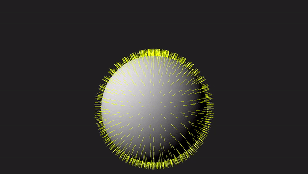
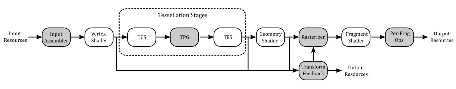
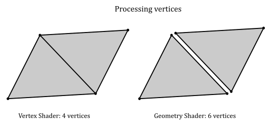
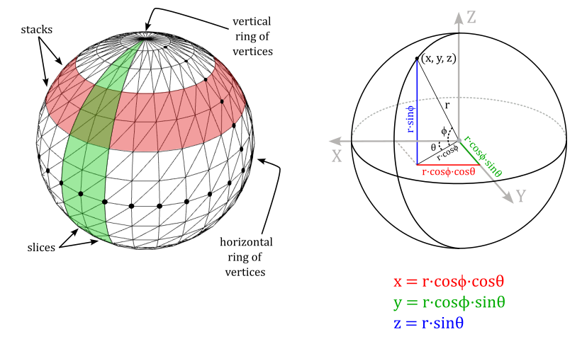
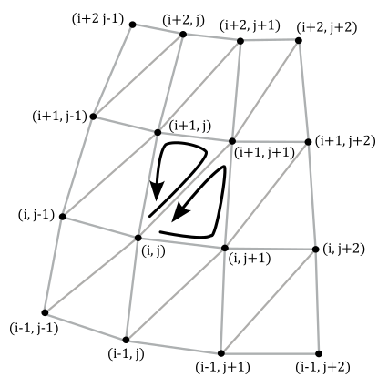
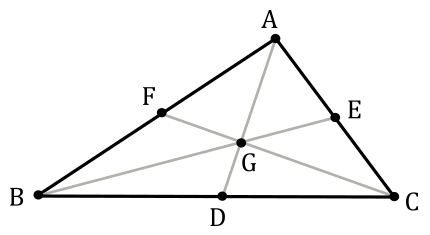
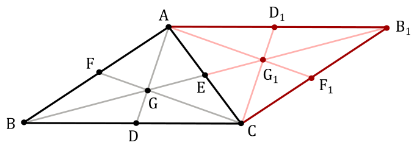
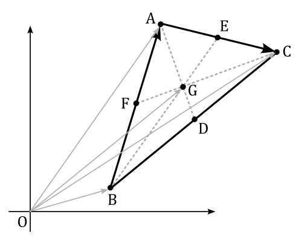
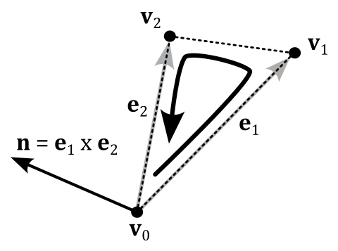

<br>



<br>

# 1 - Introduction

In this tutorial, we will examine the geometry shader, an optional stage of the graphics pipeline that enables geometry amplification and de-amplification. For instance, from a single point in input the geometry shader can output one or more triangles. Conversely, it can de-amplify a geometry by emitting a line from a triangle. This makes the geometry shader a unique and powerful stage that (especially in the past) enabled the implementation of new and interesting rendering techniques. 

However, it's important to note that the geometry shader comes with a significant cost, making its use difficult to justify. In most cases, it's advisable to explore alternative approaches using other stages of the pipeline to achieve similar results whenever possible. 

Nevertheless, as graphics programmers, we still need to understand how the geometry shader works and how to use it. To facilitate learning, the sample in this tutorial will use the geometry shader to draw normals to the triangles forming a sphere, as depicted in the image above. Although drawing normals may serve minimal practical purpose in our graphics applications, it provides a simple yet comprehensive demonstration of the intricacies involved in working with the geometry shader.

<br>

<br>

# 2 - Geometry Shader

The geometry shader is an optional, programmable stage of the graphics pipeline, located between the vertex and pixel shaders. However, it comes after the tessellation stages, which are also optional and will be covered in an upcoming tutorial.

<br>



<br>

As the geometry shader is an optional feature in Vulkan, GPU support for it may vary. Therefore, to use this stage, we must first verify that our physical device supports it. At that point, we can create a logical device while informing the driver of our intention to use this optional stage of the pipeline.

Once confirmed that our GPU supports it, enabling geometry shading simply involves including the pre-compiled code of a geometry shader in a pipeline object during its creation.

The geometry shader operates on full primitives (by processing the related vertices) and output zero or more primitives (by emitting the associated vertices).

The geometry shader can output the emitted vertices to multiple streams\buffers. By default, emitted vertices are directed to vertex stream\buffer zero, which is sent on down the graphics pipeline for further processing, typically handled by the rasterizer. <br>
We won't explore the details of emitting vertices to multiple streams in this tutorial. It's worth noting that using the geometry shader can lead to significant performance issues. Therefore, it is advisable to find alternative solutions that utilize different stages of the pipeline whenever possible. For this reason, I won't provide further details on this topic in the rest of the tutorial. However, if you need to delve into these details, please refer to the Vulkan and GLSL specifications for more comprehensive information.

<br>

## 2.1 - Input Primitives

Each geometry shader invocation has access to all vertices of the input primitive, which are presented to the shader as an array of inputs storing data from the previous stage (vertex attributes or built-in variables available to the geometry shader, such as **gl_Position**).

<br>

>[!NOTE] <br>
>The geometry shader can use the built-in variables **gl_in** as an array to read **gl_Position** and other built-in variables. On the other hand, the geometry shader emits vertices one by one, eliminating the need for an array to set the same built-in variables. In other words, you can directly write to **gl_Position** and other built-in variables as usual.

<br>

The specific input primitive type expected by the geometry shader is determined by an input layout qualifier specified in the geometry shader code. This type must match the incoming primitive type defined by either the pipeline's primitive topology (if tessellation is inactive) or the tessellation mode (if tessellation is active). For more information, refer to section **4.1.2** of **01.B - Hello Triangle**.

The geometry shader can handle the following input primitives:

- **Points**: only used with a pipeline topology of **VK_PRIMITIVE_TOPOLOGY_POINT_LIST**, or with a tessellation shader specifying an input layout qualifier with **point_mode** in the GLSL code. The input arrays always contain one element (the vertex that represents the point in input).

- **Lines**: only used with a pipeline topology of **VK_PRIMITIVE_TOPOLOGY_LINE_LIST** or **VK_PRIMITIVE_TOPOLOGY_LINE_STRIP**, or with a tessellation shader specifying an input layout qualifier with **isolines** in the GLSL code. The input arrays always contain two elements (the vertices representing the endpoints of the line in input).

- **Triangles**: only used with a pipeline topology of **VK_PRIMITIVE_TOPOLOGY_TRIANGLE_LIST**, **VK_PRIMITIVE_TOPOLOGY_TRIANGLE_STRIP**, or **VK_PRIMITIVE_TOPOLOGY_TRIANGLE_FAN**; or with a tessellation shader specifying an input layout qualifier with **quads** or **triangles** in the GLSL code. The input arrays always contain three elements (the vertices of the triangle in input; these vertices may be in a different absolute order than specified by the topology, but must adhere to the specified winding order).

<br>

There’s no distintion between lists, strips and fans. That is, it doesn’t matter how the input primitives were created by previous stages (input assembler or tessellation stages): a line in a line list or strip always consists of two vertices. Similarly, each triangle in a triangle list, strip or fan is composed of three vertices.

While the geometry shader can also operate on primitives that provide adjacency information, it is not necessary to worry about on this aspect at the moment.

<br>

## 2.2 - Output Primitives

From each input primitive, the geometry shader can emit a variable number of new vertices to build zero or more output primitives that may also differ in type from the input primitive. For example, a geometry shader invocation can get a point in input and amplify its geometry to a triangle list (one or more triangles) by emitting the corresponding vertices in output.

However, there are some limitations you must aware of when using the geometry shader. For example, the only available geometry shader output topologies are triangle strip, line strip, and point list (no line or triangle lists are available, but we can still emit them somehow). Also, although the number of primitives that a geometry shader emits can vary, the maximum number of vertices that a geometry shader can emit for each invocation must be declared statically in the shader code. We will discuss these and others limitations in section **2.4**.

If the number of vertices emitted by the geometry shader is not sufficient to produce a single primitive, vertices corresponding to incomplete primitives are not processed by subsequent pipeline stages.

 <br>

## 2.3 - Multiple Invocations

Geometry shaders can be invoked more than one time for each input primitive. This is known as geometry shader instancing and can be controlled by including an input layout qualifier that specifies the number of **invocations** as an integer literal.

This way, the geometry shader will execute at least *n* times for each input primitive, where *n* is the number of invocations specified in the corresponding input layout qualifier. The built-in input variable **gl_InvocationID** can be used in the GLSL code of the geometry shader to index into arrays using the instance number, which identify a specific invocation executed for the same primitive.

<br>

## 2.4 - Limitations and Performance

Before enabling the geometry shader, you need to be aware of some severe limitations and performance problems that arise from the use of this optional stage of the pipeline.

<br>

### Redundant vertex processing

As mentioned in a previous tutorial (**01.B - Hello Triangle**), the last vertices processed by the vertex shader are typically cached in memory. This caching mechanism helps to avoid redundant processing by passing the cached version of a vertex (if available) to the next stage.

On the other hand, the geometry shader is executed for each input primitive and processes the corresponding vertices without relying on a caching mechanism (since each invocation can perform different calculations on the same vertices). This means that, for example, for a quad (four vertices, two triangles), there would be four vertex shader invocations and two geometry shader invocations. However, each geometry shader invocation receives three vertices, meaning that six sets of calculations would be needed to transform the vertices of the quad, instead of the four sets of calculations required to transform the same vertices in the vertex shader.

<br>



<br>

### Primitive re-building and re-ordering

In tutorial 01.B - Hello Triangle, we mentioned that the graphics pipeline can take advantage of the intrinsic parallelism provided by a GPU until it needs to perform a task that depends on the order of the primitives being processed. Unfortunately, the execution of a geometry shader is one such task that breaks parallelism.

Indeed, without the geometry shader, the GPU can execute multiple shaders of the same stage in parallel for different primitives, relying on the work of the input assembler that builds and orders the primitives from the vertex and index buffers currently bound to the pipeline. For example, in the case of a quad (two triangles, four vertices), the input assembler can assign a primitive ID equal to 0 to the first triangle and a primitive ID equal to 1 to the second triangle. As a result, it doesn’t matter what triangle will be processed first by the subsequent programmable stages, the graphics pipeline knows their order and can complete its tasks based on this ordered information.

<br>

>Even though the GPU can execute most of the programmable stages in parallel, even for different drawing commands, the graphics pipeline must be implemented in such a way that its completion respects both the primitive order (as described in the vertex and index buffers) and the recording order of the drawing commands in the command buffer. This ensures that critical operations executed at the end of the pipeline, such as depth testing and color blending, are performed as expected. For example, if you want to draw both a transparent quad and an opaque one, the order in which they update the depth image and are rendered in the render target matters.

<br>

On the other hand, the geometry shader can emit an arbitrary number of primitives in output for each invocation. Consequently, the subsequent stages of the graphics pipeline cannot predict the order of emitted primitives in advance. For example, consider a geometry shader that takes a point as input. A first invocation emits a single triangle, and a second invocation emits two triangles. In this scenario, these two invocations could not be executed in parallel because there is no straightforward way to generate sequential IDs for the output primitives and pass them to the next stage. That is, the second invocation cannot determine how many primitives the first invocation might emit, preventing it from generating sequential IDs for the two triangles dynamically.

However, by using the geometry shader you still have the limited guarantee that all output primitives generated from a given input primitive are passed to subsequent pipeline stages before any output primitives generated from subsequent input primitives. Also, for instanced geometry shaders, the output primitives generated from each input primitive are passed to subsequent pipeline stages using the invocation number to order the primitives, from least to greatest.

Nevertheless, the GPU still executes multiple invocations of the geometry shader for different primitives in parallel by buffering their output in memory, reordering the primitives once all invocations are complete, and passing the result to the next stage. This means that the geometry shader ends up repeating a task that was already performed by a previous stage of the pipeline, namely the input assembler.

<br>

### Buffering

As mentioned earlier, in order to execute multiple invocations of the geometry shader in parallel for various primitives, the GPU must buffer the emitted geometries in memory until the ordered results can be sent to the next stage. This process can potentially allocate a significant amount of memory. As a result, it is clear that the geometry shader is not only time-consuming but also memory-intensive.

<br>

### Limitations

Unfortunately, our systems and GPUs do not have unlimited memory space, so hardware vendors impose limitations on the usage of memory during the buffering operation of the geometry shader. As a result, it becomes essential to check for such limits and declare our intentions in the source code to ensure proper memory management and avoid potential performance issues.

For example, we must declare the maximum number of vertices emitted by each invocation of the geometry shader statically in the shader code. The limit of this value is device-dependent and can be determined by checking the **maxGeometryOutputVertices** field of the **VkPhysicalDeviceLimits** structure, which can be retrieved by calling **VkPhysicalDeviceProperties**. So, the maximum number of vertices emitted by each invocation of the geometry shader must be less than **maxGeometryOutputVertices**. However, **maxGeometryOutputVertices** is guaranteed to be at least 256 (provided that our device supports geometry shading).

There are also limits on the maximum number of component\scalar values that a geometry shader can stream both per vertex and per invocation. These limits are device-dependent and can be determined by checking the **maxGeometryOutputComponents** and **maxGeometryTotalOutputComponents** fields of the **VkPhysicalDeviceLimits** structures, which can be retrieved by calling **VkPhysicalDeviceProperties**. **maxGeometryOutputComponents** is the limit per vertex and it is guaranteed to be at least 64, while **maxGeometryTotalOutputComponents** is the limit per invocation and it is guaranteed to be at least 1024.

This means that, for example, if our geometry shader emits 256 vertices per invocation, each vertex emitted can include at least a **vec4** (a vector of four floating-point components) since $256\times 4 = 1024$. However, many devices support emitting a larger number of vertices that may include several components. As a result, always check for these limits on the selected device if you need more guarantees than the minimum ones.

The **VkPhysicalDeviceLimits** structure also includes the following fields:

 - **maxGeometryShaderInvocations**: the maximum invocation count supported for instanced geometry shaders. The value provided in the Invocations execution mode of shader modules must be less than or equal to this limit.

- **maxGeometryInputComponents**: the maximum number of components of input variables which can be provided as inputs to the geometry shader stage.

<br>

## 2.5 - Conclusions

Let's examine a minimal geometry shader code to practically explain the theory discussed in the previous sections:

<br>

```glsl
#version 450 core

layout (triangles, invocations = 1) in; // invocations qualifier can be omitted if 1
layout (triangle_strip, max_vertices = 3) out;

layout (location = 0) in vec4 inPos[];

void main(void)
{
    // Do nothing
}

```
<br>

This geometry shader is legal, but it will discard all the primitives that are passed down as input to a graphics pipeline with the geometry shader enabled and set to execute the above code.

Specifically, this geometry shader will be invoked once (no instancing) for each primitive (triangle). Even though the shader code defines a maximum of three vertices in the output (to produce a triangle strip of a single triangle), this geometry shader does not emit any vertices, resulting in no primitives being able to proceed through the subsequent stages of the pipeline. <br>
Observe that we declared **inPos** as an array. It will receive input data from the output associated with location zero in the previous stage. In this specific case, the **inPos** array will contain the three vertex positions of the input triangle if vertex positions are associated with the same location number in the previous stage as output data. The number of elements in **inPos** is automatically deduced from the input layout qualifier specifying the input primitive in the geometry shader, which, in this case, is **triangles**.

Unless a geometry shader explicitly produces output data, it effectively does nothing. The shader can emit individual vertices one at a time, and the vertices will then be assembled into primitives after the shader has executed. To emit a vertex, the shader code must initialize the corresponding attributes, and eventually the **gl_Position** built-in variable, before calling the GLSL built-in function **EmitVertex**. Indeed, if the geometry shader is enabled, it is responsible for providing the homogeneous clip coordinates of the vertices to the rasterizer, but this resposibility is only required for the stream\buffer of the geometry shader that is actually sent to the rasterizer for further processing. In that case, if the previous stage before the geometry shader did not initialize **gl_Position** with the homogeneous clip coordinates of the current vertex, it becomes the responsibility of the geometry shader to ensure that this information is provided to the next stage.

As previously mentioned, a geometry shader can only output line and triangle strips (in addition to point lists). However, we can simulate the output of line and triangle lists with the help of the built-in function **EndPrimitive**. This function ends the current primitive strip (or list for points) and starts a new one. Therefore, if you wish to output triangle lists from a geometry shader, you can call **EndPrimitive** after every three calls to **EmitVertex**. This will ensure that the vertices are grouped into individual triangles.

<br>

<br>

# 3 - VKGeometryShader: code review

Up until now, we have been creating the vertex and index buffers statically in our code. However, in this sample, we will generate a sphere programmatically, meaning that both the vertex and index buffers will be created gradually, vertex by vertex and index by index. We will draw this sphere at the center of the scene and use the geometry shader to display the normals of its triangles.

<br>

## 3.1 - C++ code

The **VKGeometryShader** class includes two arrays to store the vertices and indices that define the sphere. Additionally, it declares a helper function called **ComputeSphere**, which is responsible for populating these arrays based on a diameter and a tessellation factor passed as arguments.

<br>

```cpp
class VKGeometryShader : public VKSample
{
public:
    VKGeometryShader(uint32_t width, uint32_t height, std::string name);
    ~VKGeometryShader();


    // ...


    virtual void EnableFeatures(VkPhysicalDeviceFeatures& features);

private:

    
    // ...


    // List of vertices and indices 
    std::vector<Vertex> vertices;
    std::vector<uint16_t> indices;

    // Create a sphere
    void ComputeSphere(std::vector<Vertex>& vertices, std::vector<uint16_t>& indices, float diameter, uint16_t tessellation);
};
```
<br>

**EnableFeatures** is a virtual function called by **VKSample::CreateDevice** that verifies whether our device supports specific features before setting the corresponding fields in the **VkPhysicalDeviceFeatures** structure to **TRUE**. Once **EnableFeatures** returns, **VKSample::CreateDevice** proceeds to create a logical device, notifying the driver of the features we intend to use (please refer to the complete source code in the tutorial's repository for further details).

<br>

>The geometry shader used in this sample is simple enough that we can rely on the minimum guarantees provided by any device that supports the geometry shader. Therefore, we can proceed without additional checks for other limits specific to this optional stage of the graphics pipeline, such as the maximum number of vertices and components per invocation.

<br>

```cpp
void VKGeometryShader::EnableFeatures(VkPhysicalDeviceFeatures& features)
{
    if (m_deviceFeatures.geometryShader)
    {
        m_vulkanParams.EnabledFeatures.geometryShader = VK_TRUE;
    }
    else
    {
        assert(!"Selected device does not support geometry shaders!");
    }
}
```
<br>

As previously mentioned, if the geometry shader is enabled, it is responsible for providing the homogeneous clip coordinates of the vertices to the rasterizer. As a result, it also needs to access the matrices declared in the uniform blocks used by the vertex and fragment shaders executed during the rendering of the sphere. Consequently, we must add the **VK_SHADER_STAGE_GEOMETRY_BIT** value as a flag to the corresponding descriptor bindings.

<br>

```cpp
void VKGeometryShader::CreateDescriptorSetLayout()
{
    //
    // Create a Descriptor Set Layout to connect binding points (resource declarations)
    // in the shader code to descriptors within descriptor sets.
    //
    // Binding 0: Uniform buffer (vertex, geometry and fragment shader)
    VkDescriptorSetLayoutBinding layoutBinding[2] = {};
    layoutBinding[0].binding = 0;
    layoutBinding[0].descriptorType = VK_DESCRIPTOR_TYPE_UNIFORM_BUFFER;
    layoutBinding[0].descriptorCount = 1;
    layoutBinding[0].stageFlags = VK_SHADER_STAGE_VERTEX_BIT | VK_SHADER_STAGE_GEOMETRY_BIT | VK_SHADER_STAGE_FRAGMENT_BIT;
    layoutBinding[0].pImmutableSamplers = nullptr;

    // Binding 1: Dynamic uniform buffer (vertex, geometry and fragment shader)
    layoutBinding[1].binding = 1;
    layoutBinding[1].descriptorType = VK_DESCRIPTOR_TYPE_UNIFORM_BUFFER_DYNAMIC;
    layoutBinding[1].descriptorCount = 1;
    layoutBinding[1].stageFlags = VK_SHADER_STAGE_VERTEX_BIT | VK_SHADER_STAGE_GEOMETRY_BIT | VK_SHADER_STAGE_FRAGMENT_BIT;
    layoutBinding[1].pImmutableSamplers = nullptr;

    VkDescriptorSetLayoutCreateInfo descriptorLayout = {};
    descriptorLayout.sType = VK_STRUCTURE_TYPE_DESCRIPTOR_SET_LAYOUT_CREATE_INFO;
    descriptorLayout.pNext = nullptr;
    descriptorLayout.bindingCount = 2;
    descriptorLayout.pBindings = layoutBinding;

    VK_CHECK_RESULT(vkCreateDescriptorSetLayout(m_vulkanParams.Device, &descriptorLayout, nullptr, &m_sampleParams.DescriptorSetLayout));
}
```
<br>

In this sample, we will only require two pipeline objects. One pipeline will be used to draw the sphere using the lambertian shading model, and the other pipeline will draw the normals to the triangles that form the sphere. To achieve this, we will use the usual shader programs for the vertex and fragment shaders to draw the sphere. However, for drawing the normals, we need a new vertex shader that will act as a pass-through shader that forwards the vertex positions to the geometry shader, which will emit the endpoints of the line segments representing the normals. We also need a different fragment shader to draw the normals with a solid color. In total, we will use five different shader programs in this sample. The shader code of the sample will be  examined in the next section.

Observe that to draw the normals, we will simply draw the sphere a second time, passing the vertices of the triangles composing the sphere to the geometry shader. The geometry shader will then calculate the normals from the vertex positions of each triangle, emitting the vertices of the endpoints of the line segments representing the correspoinding normals.

<br>

```cpp
void VKGeometryShader::CreatePipelineObjects()
{
    //
    // Set the various states for the graphics pipeline used by this sample
    //

    
    // ...

    
    //
    // Shaders
    //
    VkShaderModule mainVS = LoadSPIRVShaderModule(m_vulkanParams.Device, GetAssetsPath() + "/data/shaders/main.vert.spv");
    VkShaderModule passThroughVS = LoadSPIRVShaderModule(m_vulkanParams.Device, GetAssetsPath() + "/data/shaders/passthrough.vert.spv");
    VkShaderModule mainGS = LoadSPIRVShaderModule(m_vulkanParams.Device, GetAssetsPath() + "/data/shaders/main.geom.spv");
    VkShaderModule lambertianFS = LoadSPIRVShaderModule(m_vulkanParams.Device, GetAssetsPath() + "/data/shaders/lambertian.frag.spv");
    VkShaderModule solidFS = LoadSPIRVShaderModule(m_vulkanParams.Device, GetAssetsPath() + "/data/shaders/solid.frag.spv");

    // This sample will use three programmable stage: Vertex, Geometry and Fragment shaders
    std::array<VkPipelineShaderStageCreateInfo, 3> shaderStages{};
    
    // Vertex shader
    shaderStages[0].sType = VK_STRUCTURE_TYPE_PIPELINE_SHADER_STAGE_CREATE_INFO;
    // Set pipeline stage for this shader
    shaderStages[0].stage = VK_SHADER_STAGE_VERTEX_BIT;
    // Load binary SPIR-V shader module
    shaderStages[0].module = mainVS;
    // Main entry point for the shader
    shaderStages[0].pName = "main";
    assert(shaderStages[0].module != VK_NULL_HANDLE);
    
    // Fragment shader
    shaderStages[1].sType = VK_STRUCTURE_TYPE_PIPELINE_SHADER_STAGE_CREATE_INFO;
    // Set pipeline stage for this shader
    shaderStages[1].stage = VK_SHADER_STAGE_FRAGMENT_BIT;
    // Load binary SPIR-V shader module
    shaderStages[1].module = lambertianFS;
    // Main entry point for the shader
    shaderStages[1].pName = "main";
    assert(shaderStages[1].module != VK_NULL_HANDLE);

    // Geometry shader
    shaderStages[2].sType = VK_STRUCTURE_TYPE_PIPELINE_SHADER_STAGE_CREATE_INFO;
    // Set pipeline stage for this shader
    shaderStages[2].stage = VK_SHADER_STAGE_GEOMETRY_BIT;
    // Load binary SPIR-V shader module
    shaderStages[2].module = mainGS;
    // Main entry point for the shader
    shaderStages[2].pName = "main";
    assert(shaderStages[2].module != VK_NULL_HANDLE);

    //
    // Create the graphics pipelines used in this sample
    //
    
    //
    // Lambertian
    //

    VkGraphicsPipelineCreateInfo pipelineCreateInfo = {};
    pipelineCreateInfo.sType = VK_STRUCTURE_TYPE_GRAPHICS_PIPELINE_CREATE_INFO;
    // The pipeline layout used for this pipeline (can be shared among multiple pipelines using the same layout)
    pipelineCreateInfo.layout = m_sampleParams.PipelineLayout;
    // Render pass object defining what render pass instances the pipeline will be compatible with
    pipelineCreateInfo.renderPass = m_sampleParams.RenderPass;
    
    // Set pipeline shader stage info
    pipelineCreateInfo.stageCount = static_cast<uint32_t>(shaderStages.size() - 1);
    pipelineCreateInfo.pStages = shaderStages.data();
    
    // Assign the pipeline states to the pipeline creation info structure
    pipelineCreateInfo.pVertexInputState = &vertexInputState;
    pipelineCreateInfo.pInputAssemblyState = &inputAssemblyState;
    pipelineCreateInfo.pRasterizationState = &rasterizationState;
    pipelineCreateInfo.pColorBlendState = &colorBlendState;
    pipelineCreateInfo.pMultisampleState = &multisampleState;
    pipelineCreateInfo.pViewportState = &viewportState;
    pipelineCreateInfo.pDepthStencilState = &depthStencilState;
    pipelineCreateInfo.pDynamicState = &dynamicState;
    
    // Create a graphics pipeline for lambertian illumination
    VK_CHECK_RESULT(vkCreateGraphicsPipelines(m_vulkanParams.Device, 
                                              VK_NULL_HANDLE, 1, 
                                              &pipelineCreateInfo, nullptr, 
                                              &m_sampleParams.GraphicsPipelines["Lambertian"]));

    //
    // SolidColor
    //

    // Specify different shaders for rendering using a solid color
    pipelineCreateInfo.stageCount = static_cast<uint32_t>(shaderStages.size());
    shaderStages[0].module = passThroughVS;
    shaderStages[1].module = solidFS;
    shaderStages[2].module = mainGS;
    // Create a graphics pipeline to draw using a solid color
    VK_CHECK_RESULT(vkCreateGraphicsPipelines(m_vulkanParams.Device, 
                                              VK_NULL_HANDLE, 1, 
                                              &pipelineCreateInfo, nullptr, 
                                              &m_sampleParams.GraphicsPipelines["SolidColor"]));

    //
    // Destroy shader modules
    //

    // SPIR-V shader modules are no longer needed once the graphics pipeline has been created
    // since the SPIR-V modules are compiled during pipeline creation.
    vkDestroyShaderModule(m_vulkanParams.Device, mainVS, nullptr);
    vkDestroyShaderModule(m_vulkanParams.Device, passThroughVS, nullptr);
    vkDestroyShaderModule(m_vulkanParams.Device, mainGS, nullptr);
    vkDestroyShaderModule(m_vulkanParams.Device, lambertianFS, nullptr);
    vkDestroyShaderModule(m_vulkanParams.Device, solidFS, nullptr);
}
```
<br>

The **ComputeSphere** function is called by **VKGeometryShader::CreateVertexBuffer** and takes a diameter and a tessellation factor as input parameters. Using these values, it calculates both the vertices and indices required to describe a sphere.

To generate the sphere's geometry, **ComputeSphere** uses spherical coordinates to compute the positions and normals for all the vertices within a horizontal ring at a specific longitude. Please refer to Appendix 01 for additional details about spherical coordinates. Observe that in this specific case, the z-axis points upward, and the angle $\phi$ is measured from the xy-plane, resulting in slightly different spherical coordinates.

<br>



<br>

To calculate the index buffer we can proceed as follows.
The sphere can be considered as composed of stacks and slices of quads. Each stack is delimited by two horizontal rings of vertices, and each slice is delimited by two vertical rings of vertices. Thus, we need to solve the general problem of computing the six indices that select the two triangles composing the quad at the intersection of the stack delimited by the i-th and (i+1)-th horizontal rings, and the slice delimited by the j-th and (j+1)-th vertical rings.

<br>



<br>

From the image above, we have that

<br>

$\triangle{_1} = (i,\ j),\ \ (i+1,\ j+1),\ \ (i+1,\ j)$

$\triangle{_2} = (i,\ j),\ \ (i,\ j+1),\ \ (i+1,\ j+1)$

<br>

```cpp
void VKGeometryShader::ComputeSphere(std::vector<Vertex>& vertices, std::vector<uint16_t>& indices, float diameter, uint16_t tessellation)
{
    vertices.clear();
    indices.clear();

    if (tessellation < 3)
        assert(!"tesselation parameter must be at least 3");

    //
    // Populate the array of vertices using spherical coordinates
    //

    // The tessellation factor is used to define the number of stack and slices
    uint16_t stackCount = tessellation;
    uint16_t sliceCount = tessellation * 2;

    float radius = diameter / 2;

    // Create rings of vertices at progressively higher longitudes.
    // We have stackCount + 1 vertical rings of vertices (the first and last vertical rings degenerate to points).
    for (uint16_t i = 0; i <= stackCount; i++)
    {
        // longitude in [-90°, +90°]
        float longitude = (float(i) * glm::pi<float>() / float(stackCount)) - glm::half_pi<float>();

        // dz = sin(phi),  dxy = cos(phi)
        float dz = glm::sin(longitude);
        float dxy = glm::cos(longitude);

        // Create the vertices of the vertical ring at the i-th longitude.
        // We have sliceCount vertices for each vertical ring. However, we need to
        // distinguish between the first and last vertices, which are at the same
        // position but with different normals, texture coordinates, and so on.
        for (uint16_t j = 0; j <= sliceCount; j++)
        {
            // latitude in [0°, 360°]
            float latitude = float(j) * glm::two_pi<float>() / float(sliceCount);

            // dx = cos(theta),  dy = sin(theta)
            float dx = glm::cos(latitude);
            float dy = glm::sin(latitude);

            // dx = cos(phi)cos(theta)
            // dy = cos(phi)sin(theta)
            // dz = sin(phi)
            dx *= dxy;
            dy *= dxy;

            // normal = (dx, dy, dz)
            // position = r * (dx, dy, dz)
            glm::vec3 normal = glm::vec3(dx, dy, dz);
            glm::vec3 position = radius * normal;

            vertices.push_back({ position, normal });
        }
    }

    //
    // Populate the array of indices considering the triangles within each pair of vertical rings
    //

    // As noted above, we need to distinguish between sliceCount + 1 different vertices for each ring. 
    // , we must skip (sliceCount + 1) vertices every time we need to build 
    // the indices of the triangles that compose the sliceCount quads of each 
    // of the stackCount stacks.
    uint16_t stride = sliceCount + 1;

    for (uint16_t i = 0; i < stackCount; i++)
    {
        for (uint16_t j = 0; j < sliceCount; j++)
        {
            uint16_t nextI = (i + 1);
            uint16_t nextJ = (j + 1) % stride;

            indices.push_back(i * stride + j);
            indices.push_back(nextI * stride + nextJ);
            indices.push_back(nextI * stride + j);

            indices.push_back(i * stride + j);
            indices.push_back(i * stride + nextJ);
            indices.push_back(nextI * stride + nextJ);
        }
    }
}
```
<br>

In the **PopulateCommandBuffer** function, we draw the sphere two times. The first time to draw the sphere using a simplified lambertian shading model. The second time to draw the normals with the help of the geometry shader, which will output, vertex by vertex, the line segments representing the normals from the triangles of the sphere received as input.

<br>

```cpp
void VKGeometryShader::PopulateCommandBuffer(uint32_t currentImageIndex)
{

    // ...

    
    // Bind the vertex buffer (contains positions and normals)
    VkDeviceSize offsets[1] = { 0 };
    vkCmdBindVertexBuffers(m_sampleParams.FrameRes.GraphicsCommandBuffers[m_frameIndex], 0, 1, &m_vertexindexBuffer.VBbuffer, offsets);

    // Bind the index buffer
	vkCmdBindIndexBuffer(m_sampleParams.FrameRes.GraphicsCommandBuffers[m_frameIndex], m_vertexindexBuffer.IBbuffer, 0, VK_INDEX_TYPE_UINT16);

    // Dynamic offset used to offset into the uniform buffer described by the dynamic uniform buffer and containing mesh information

    //
    // Sphere
    //

    uint32_t dynamicOffset = m_meshObjects["sphere"].dynIndex * static_cast<uint32_t>(m_dynamicUBOAlignment);

    // Bind the graphics pipeline for drawing with the semplified lambertian shading model
    vkCmdBindPipeline(m_sampleParams.FrameRes.GraphicsCommandBuffers[m_frameIndex], 
                        VK_PIPELINE_BIND_POINT_GRAPHICS, 
                        m_sampleParams.GraphicsPipelines["Lambertian"]);

    // Bind descriptor sets for drawing a mesh using a dynamic offset
    vkCmdBindDescriptorSets(m_sampleParams.FrameRes.GraphicsCommandBuffers[m_frameIndex], 
                            VK_PIPELINE_BIND_POINT_GRAPHICS, 
                            m_sampleParams.PipelineLayout, 
                            0, 1, 
                            &m_sampleParams.FrameRes.DescriptorSets[m_frameIndex], 
                            1, &dynamicOffset);

    // Draw the sphere using the lambertian shading model
    vkCmdDrawIndexed(m_sampleParams.FrameRes.GraphicsCommandBuffers[m_frameIndex], m_meshObjects["sphere"].indexCount, 1, 0, 0, 0);

    //
    // Draw the sphere a second time passing its triangles to the geometry shader,
    // which will emit line segments representing the normals of the input triangles.
    //

    // Bind the graphics pipeline for drawing opaque objects with a solid color, 
    // passing through a geometry shader that emits lines from triangles
    vkCmdBindPipeline(m_sampleParams.FrameRes.GraphicsCommandBuffers[m_frameIndex], 
                    VK_PIPELINE_BIND_POINT_GRAPHICS, 
                    m_sampleParams.GraphicsPipelines["SolidColor"]);

    // Draw the sphere
    vkCmdDrawIndexed(m_sampleParams.FrameRes.GraphicsCommandBuffers[m_frameIndex], m_meshObjects["sphere"].indexCount, 1, 0, 0, 0);

    // Ending the render pass will add an implicit barrier, transitioning the frame buffer color attachment to
    // VK_IMAGE_LAYOUT_PRESENT_SRC_KHR for presenting it to the windowing system
    vkCmdEndRenderPass(m_sampleParams.FrameRes.GraphicsCommandBuffers[m_frameIndex]);
    
    VK_CHECK_RESULT(vkEndCommandBuffer(m_sampleParams.FrameRes.GraphicsCommandBuffers[m_frameIndex]));
}
```
<br>

<br>

## 3.2 - GLSL code

To draw the lighted sphere, we can use the same shader code that we examined in the previous tutorials. However, for drawing the normals, we require a different vertex shader that simply passes the local vertex positions to the geometry shader. We don't need the normals stored in the vertex buffer (provided as vertex attributes) because each vertex is shared by multiple triangles. If we were to show the real normals by drawing line segments sticking out from each vertex, it would create a visual mess.

On the other hand, from the local vertex positions of each triangle, the geometry shader can calculate its center and output a line segment sticking out from that point to represent the normal to the input triangle.

The new vertex shader works like a simple pass-through shader.

<br>

```glsl
#version 450

layout (location = 0) in vec3 inPos; // we don't need the normal information
layout (location = 0) out vec4 outPos;

void main()
{
    outPos = vec4(inPos, 1.0); // pass the local position of the vertex to the GS
}
```
<br>

The following listing shows the geometry shader used in this sample.

<br>

```glsl
#version 450

layout(std140, set = 0, binding = 0) uniform buf {
    mat4 View;
    mat4 Projection;
    vec4 lightDir;
    vec4 lightColor;
} uBuf;

layout(std140, set = 0, binding = 1) uniform dynbuf {
    mat4 World;
    vec4 solidColor;
} dynBuf;

layout(triangles) in;
layout(line_strip, max_vertices = 2) out;

layout (location = 0) in vec4 inPos[];

void main()
{
    // Get the vertex local positions of the input triangle
    vec4 v0 = inPos[0];
    vec4 v1 = inPos[1];
    vec4 v2 = inPos[2];

    // Calculate the sides of the input triangle
    vec3 e1 = normalize(v1 - v0).xyz;
    vec3 e2 = normalize(v2 - v0).xyz;

    // The normal is the cross product of the sides.
    // v0, v1 and v2 in counterclockwise order so it's e1 x e2
    vec3 normal = normalize(cross(e1, e2));

    // Calculate the center of the input triangle as the arithmetic 
    // mean of the three vertex positions.
    // (the normal will be displayed at this point)
    vec4 center = (v0 + v1 + v2) / 3.0f;

    // We need to transform the two points of the line segment representing
    // the normal from local to homogeneous clip space.
    mat4 mVP = ((uBuf.Projection * uBuf.View) * dynBuf.World);

    // Build a line segment representing the normal of the input triangle.
    // The first iteration of the loop will emit a vertex at the center of the input 
    // triangle as the first endpoint of the line segment.
    // The second iteration will emit a vertex at a small offset from the center along 
    // the normal as the second endpoint of the line segment.
    for (int i = 0; i < 2; ++i)
    {
        center.xyz += normal * 0.3f * float(i);
        gl_Position = (mVP * center);
        EmitVertex();
    }
}
```
<br>

We define the uniform blocks as usual. We then statically declare that the geometry shader will output a single line for each triangle received as input. This is achieved by declaring an input layout qualifier specifying **triangles**, and an output layout qualifier specifying **max_vertices** with a value of two, which indicates that the geometry shader will emit a maximum of two vertices per invocation.

We declare **inPos** as an array for receiving the three vertex positions of the input triangle from the pass-through vertex shader.

The center of a triangle (called centroid) is the point where the three medians of the triangle meet. We can compute this point as the arithmetic mean of the three vertex positions.

<br>

>To proove that the centroid of a triangle is the arithmetic mean of the coordinates of its vertices, we first need to demonstrate the following theorem.
>
>**Theorem**: The centroid of a triangle divides each median in the ratio 2:1
>
><br>
>
>
>
><br>
>
>$D, E, F$ are mid-points of $BC, CA, AB$. <br>
$AD, BE$ and $CF$ are medians. <br>
The medians intersect each others at a point $G$ called centroid. <br>
We need to show that: $AG : GD = BG : GE = CG : GF = 2 : 1$
>
><br>
>
>***Proof***
>
>Reflecting the triangle with respect to the side $AC$, we get the following diagram
>
><br>
>
>
>
><br>
>
>$ABCB_1$  is a parallelogram. <br>
$BEB_1$  is a straight line. <br>
Since  $CD = AD_1$  and  $CD \parallel AD_1$ (opposite sides equal and parallel), then $DCD_1A$  is a parallelogram and $DG \parallel CG_1$. <br>
Since $BD = DC$ and $DG \parallel CG_1$, then $BG = GG_1$ (intercept theorem).
So, we have that $BG : GG_1 = 1 : 1$.
Now, since $GE = EG_1$, then $BG : GE = 2 : 1$.
>
>The same applies to the other two medians by building similar triangles along the other sides of $ABC$.
>
>$\Box$
>
><br>
>
>Therefore, we can state that $GE = 1/2$ of $BE$, while $BG = 2/3$ of $BE$.<br>
Now, considering the following image, we have that
>
><br>
>
>
>
><br>
>
>$\vec{OG}=\vec{OB}+\vec{BG}$
>
>$=\displaystyle\vec{OB}+\color{#FF6666}{\frac{2}{3}\vec{BE}}$
>
>$=\displaystyle\vec{OB}+\frac{2}{3}\big(\vec{BA}+\frac{1}{2}\vec{AC}\big)$
>
>$=\displaystyle\vec{OB}+\frac{2}{3}\bigg(\vec{OA}-\vec{OB}+\frac{1}{2}\big(\vec{OC}-\vec{OA}\big)\bigg)$
>
>$=\displaystyle\vec{OB}+\frac{2}{3}\bigg(\frac{1}{2}\vec{OA}+\frac{1}{2}\vec{OC}-\vec{OB}\bigg)$
>
>$=\displaystyle\frac{1}{3}\bigg(\vec{OA}+\vec{OB}+\vec{OC}\bigg)$
>
><br>
>
>where $\vec{OG}$ is the centroid of the triangle. As you can see, we can calculate it as the arithmetic mean of the three vertices.

<br>

To calculate the normal to a triangle, we can compute the cross product of its two sides. To ensure that the normal points in the correct direction, we must take into account the winding order of the vertices when building the cross product, as illustrated in the following image (refer to Appendix 01 for more details about the cross product).

<br>



<br>

<br>

Source code: [LearnVulkan](https://github.com/PAMinerva/LearnVulkan)

<br>

# References

[1] [Vulkan API Specifications](https://registry.khronos.org/vulkan/) <br>
[2] [A trip through the Graphics Pipeline 2011, part 10](https://fgiesen.wordpress.com/2011/07/20/a-trip-through-the-graphics-pipeline-2011-part-10/) <br>
[3] [Transform feedback is terrible, so why are we doing it?](https://www.gfxstrand.net/faith/blog/2018/10/transform-feedback-is-terrible-so-why/)
<br>

<br>

***
If you found the content of this tutorial somewhat useful or interesting, please consider supporting this project by clicking on the **Sponsor** button.  Whether a small tip, a one time donation, or a recurring payment, it's all welcome! Thank you!<br><br>
<p align="center">
 <a href="https://github.com/sponsors/PAMinerva">
         
      </a>
</p><br>