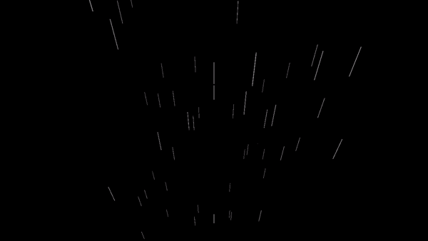
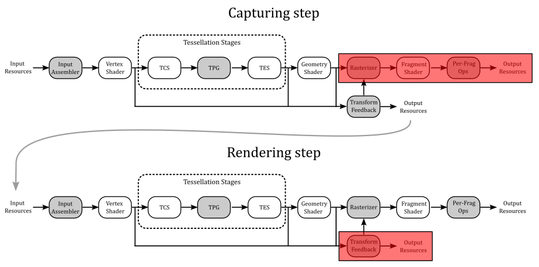
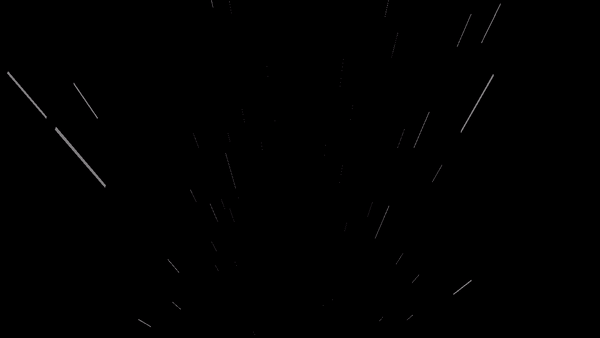
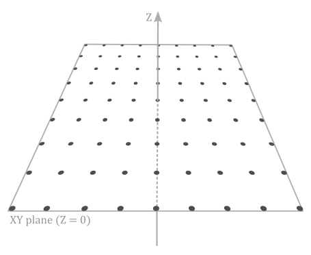
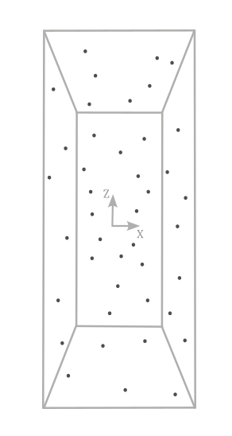
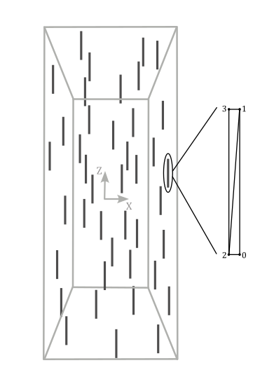
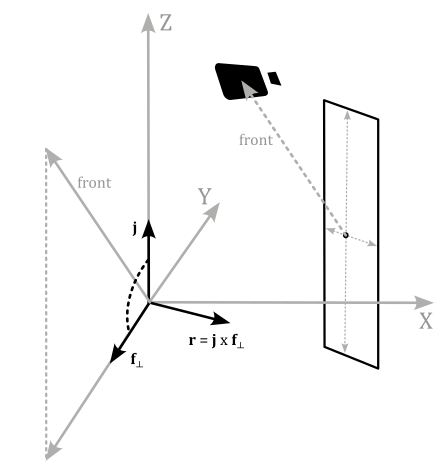

<br>



<br>

>[!WARNING]  
>Using transform feedback is strongly discouraged due to its legacy nature and potential performance issues (refer to [2] for further information). Although it was introduced to aid in porting old projects and translating from different APIs, it is almost never recommended to use it and it is better to explore alternative solutions when programming with the Vulkan API. In fact, anything that can be achieved with transform feedback can be done more efficiently and often more straightforwardly using a compute shader. We will explore the compute pipeline in an upcoming tutorial.

<br>

# 1 - Introduction

Transform feedback, when enabled, is the first fixed-function stage of the pipeline. It is an optional stage that is specified in Vulkan as a device extension. This means that we not only need to verify that our device supports transform feedback before enabling it, but we also must inform the Vulkan implementation of our intention to use this stage by including the corresponding extension during device creation. This allows all the functionalities included in the extension to be exposed to the client through the Vulkan API, along with the core functionalities.

The rationale behind offering transform feedback as a device extension is perfectly summarized in the warning box at the beginning of this tutorial (see [2] for more details). As a result, it is reasonable to expect that the transform feedback will likely never become core Vulkan functionality.

In this tutorial, we will create a basic particle effect using the transform feedback stage, a technique that was commonly employed in the past. Nowadays, this application of transform feedback has become outdated with the introduction of the compute pipeline, which provides better performance and more control over the executed code, as it is a programmable stage.

<br>

<br>

# 2 - Transform Feedback

Usually, the vertex attributes processed by pre-rasterization shaders (Vertex, Tessellation, or Geometry shader) are sent down the graphics pipeline for further processing, typically handled by the rasterizer. However, vertex outputs from the last programmable stage in the pre-rasterization shaders can also be intercepted to be written out to one or more transform feedback buffers bound to the command buffer.

<br>

>[!NOTE]  
>Remember that the geometry shader can emit vertices to multiple streams\buffers and that, by default, vertex stream zero is sent to the rasterizer for further processing.
Transform feedback, on the other hand, offers the ability to capture vertex information from all the vertex streams used by the geometry shader. Additional information will be provided shortly.

<br>

One of the transform feedback buffers storing the captured vertex data can be sent to the rasterizer for further processing. By default, this is the transform feedback buffer capturing from vertex stream zero, but we can also specify a different trasform feedback buffer to be redirected to the rasterizer. <br>
Alternatively, the rasterization stage can be turned off entirely and the transform feedback can be considered as the last stage of the pipeline, used for non-graphical purposes. The transform feedback buffers with the captured vertex attributes can then be sent back through the graphics pipeline, allowing for iterative processing of vertex data that can be used for simulating basic animation and particle effects.

<br>



<br>

## 2.1 - Capturing vertex attributes

To capture vertex attributes using the transform feedback stage, the last pre-rasterization shader must declare the corresponding output variables or output block members using one of the **xfb_** layout qualifiers in the GLSL code. More information about the GLSL code used to capture vertex attributes will be provided shortly. For now, we will focus on the part of the Vulkan API that allows us to bind transform feedback buffers to the command buffer and begin the capturing process for each of those buffers.

<br>

### 2.1.1 - C++ code

Transform feedback buffers are bound to the command buffer by using the **vkCmdBindTransformFeedbackBuffersEXT** command provided by the **VK_EXT_transform_feedback** extension.

<br>

```cpp
// Provided by VK_EXT_transform_feedback
void vkCmdBindTransformFeedbackBuffersEXT(
    VkCommandBuffer                             commandBuffer,
    uint32_t                                    firstBinding,
    uint32_t                                    bindingCount,
    const VkBuffer*                             pBuffers,
    const VkDeviceSize*                         pOffsets,
    const VkDeviceSize*                         pSizes);
```
<br>

- **commandBuffer** is the command buffer into which the command is recorded.

- **firstBinding** is the binding point to which the initial transform feedback buffer will be bound. It's important to note that multiple transform feedback buffers can be bound if supported by the device; this information must be queried and can be found in the the device properties.

- **bindingCount** is the number of transform feedback bindings used by the command. That is, it is the number of transform feedback buffers you want to bound to the command buffer.

- **pBuffers** is a pointer to an array of transform feedback buffer handles.

- **pOffsets** is a pointer to an array of byte offsets indicating where to start capturing vertex data from the corresponding transform feedback buffer. 

- **pSizes** is **NULL** or a pointer to an array of **VkDeviceSize** buffer sizes, specifying the maximum number of bytes to capture for the corresponding transform feedback buffer. If **pSizes** is **NULL**, or the value of the **pSizes** array element is **VK_WHOLE_SIZE**, then the maximum number of bytes captured will be the size of the corresponding buffer minus the buffer offset.

<br>

To start capturing vertex data, transform feedback must be activated in the command buffer by using the **vkCmdBeginTransformFeedbackEXT** command provided by the **VK_EXT_transform_feedback** extension.

<br>

```cpp
// Provided by VK_EXT_transform_feedback
void vkCmdBeginTransformFeedbackEXT(
    VkCommandBuffer                             commandBuffer,
    uint32_t                                    firstCounterBuffer,
    uint32_t                                    counterBufferCount,
    const VkBuffer*                             pCounterBuffers,
    const VkDeviceSize*                         pCounterBufferOffsets);
```
<br>

- **commandBuffer** is the command buffer into which the command is recorded.

- **firstCounterBuffer** is the index of the first counter buffer (more on this shortly).

- **counterBufferCount** is the number of counter buffers; that is, the size of the **pCounterBuffers** and **pCounterBufferOffsets** arrays.

- **pCounterBuffers** is **NULL** or a pointer to an array of **VkBuffer** handles to counter buffers. Each buffer contains a 4 byte integer value representing the byte offset from the start of the corresponding transform feedback buffer from where to start capturing vertex data. If the byte offset stored to the counter buffer location was done using **vkCmdEndTransformFeedbackEXT** it can be used to resume transform feedback from the previous location (more on this shortly). If **pCounterBuffers** is **NULL**, then transform feedback will begin capturing vertex data from the start of the transform feedback buffers, as specified by the byte offsets in **vkCmdBindTransformFeedbackBuffersEXT::pOffsets**.

- **pCounterBufferOffsets** is **NULL** or a pointer to an array of **VkDeviceSize** values specifying byte offsets within each of the **pCounterBuffers** where the counter values were previously written. The location in each counter buffer at these offsets must be large enough to contain 4 bytes of data. If **pCounterBufferOffsets** is **NULL**, then it is assumed the offsets are zero.

<br>

When transform feedback is inactive, no vertex data is captured. If there is a valid counter buffer handle and counter buffer offset in the **pCounterBuffers** and **pCounterBufferOffsets** arrays, writes to the corresponding transform feedback buffer will start at the byte offset represented by the value stored in the counter buffer location.

The active transform feedback buffers will capture vertex data from the corresponding **xfb_buffer** in the GLSL code of the last pre-rasterization stage. **xfb_buffer** allow to associate binding points of the command buffer (where transform feedbacks are bound) to vertex streams. Any **xfb_buffer** that does not output to an active transform feedback buffer will not be captured. The GLSL code for capturing vertex attributes will be examined in the next section.

The transform feedback stage captures vertices from the last pre-rasterization shader, organizing them in pipeline primitive order. That is, the vertices of the pipeline input primitive N must be stored before the input primitive N+1. Also, for multi-vertex primitives, all values for a given vertex are written before writing values for any other vertex in a consistent winding order defined as follows:

- If neither geometry or tessellation shading is active, vertices within a primitive are appended according to the winding order described by the primitive topology defined by the **VkPipelineInputAssemblyStateCreateInfo:topology** used to execute the drawing command.

- If geometry shading is active, vertices within a primitive are appended according to the winding order of the emitted vertices in the corresponding vertex stream.

- If tessellation shading is active but geometry shading is not, vertices within a primitive are appended according to the winding order specified by the corresponding input layout qualifier in the Tessellation Evaluation shader code. Additional information will be provided in an upcoming tutorial.

<br>

>[!NOTE]  
>When capturing output variables that are arrays or structures, individual array elements or structure members are written tightly packed in order. For vector types, individual components are written in order. For matrix types, outputs are written as an array of column vectors.

<br>

Transform feedback can be made inactive by using the **vkCmdBeginTransformFeedbackEXT** command provided by the **VK_EXT_transform_feedback** extension.

<br>

```cpp
// Provided by VK_EXT_transform_feedback
void vkCmdEndTransformFeedbackEXT(
    VkCommandBuffer                             commandBuffer,
    uint32_t                                    firstCounterBuffer,
    uint32_t                                    counterBufferCount,
    const VkBuffer*                             pCounterBuffers,
    const VkDeviceSize*                         pCounterBufferOffsets);
```
<br>

- **commandBuffer** is the command buffer into which the command is recorded.

- **firstCounterBuffer** is the index of the first counter buffer.

- **counterBufferCount** is the number of counter buffers; that is, the size of the **pCounterBuffers** and **pCounterBufferOffsets** arrays.

- **pCounterBuffers** is **NULL** or a pointer to an array of **VkBuffer** handles to counter buffers. The counter buffers are used to record the current byte positions of each transform feedback buffer where the next vertex output data would be captured. This can be used by a subsequent **vkCmdBeginTransformFeedbackEXT** call to resume transform feedback capture from this position. It can also be used by **vkCmdDrawIndirectByteCountEXT** to determine the vertex count for a draw call.

- **pCounterBufferOffsets** is **NULL** or a pointer to an array of **VkDeviceSize** values specifying offsets within each of the pCounterBuffers where the counter values can be written. The location in each counter buffer at these offsets must be large enough to contain 4 bytes of data. If **pCounterBufferOffsets** is NULL, then it is assumed the offsets are zero.

<br>

### 2.1.2 - GLSL code

Any shader making use of any of the **xfb_** output layout qualifiers will cause the shader to be in a transform feedback capturing mode and hence responsible for describing the transform feedback setup. This mode will capture any output qualified by **xfb_offset**, directly or indirectly, from the vertex stream associated with **xfb_buffer** to the corresponding transform feedback buffer.

The **xfb_stride** output layout qualifier can be specified in the GLSL code for single output variables or output blocks to indicate the number of bytes of storage reserved for each vertex in the transform feedback buffer. For every vertex captured, any output attribute associated with a **xfb_offset** layout qualifier will be captured to be written to the storage reserved for the vertex in the corresponding transform feedback buffer. This means that we can selectively capture certain vertex attributes while ignoring others.

Shaders in the transform feedback capturing mode have an initial global default of

<br>

```glsl
layout(xfb_buffer = 0) out;
```
<br>

which is inherited by every output variable or output block declared without an **xfb_buffer** qualifier.

When a variable or output block is declared with an **xfb_buffer** qualifier, it has that declared buffer. All members of a block inherit the block’s buffer. A member is allowed to declare an **xfb_buffer**, but it must match the buffer inherited from its block, or a compile-time error results.

<br>

```glsl
layout(xfb_buffer=2, xfb_offset=0) out block1 { // block's buffer is 2
  layout(xfb_buffer = 2) vec4 v; // okay, matches the inherited 2
  layout(xfb_buffer = 3) vec4 u; // ERROR, mismatched buffer
  vec4 w; // inherited
};

layout(xfb_offset=16) out vec4 t; // initial default is buffer 0

layout(xfb_buffer=1) out; // new global default of 1

out block2 { // block has buffer 1
  vec4 x; // x has buffer 1 (not captured)
  layout(xfb_buffer = 1) vec4 y; // okay (not captured)
  layout(xfb_buffer = 0) vec4 z; // ERROR, mismatched buffer
};

layout(xfb_offset=0) out vec4 g; // g has buffer 1
layout(xfb_buffer=2) out vec4 h; // does not change global default
layout(xfb_offset=16) out vec4 j; // j has buffer 1
```
<br>

The **xfb_offset** qualifier assigns a byte offset in the storage reserved for the corresponding vertex in the associated transform feedback buffer. Only output variables, block, or block members can be qualified with **xfb_offset**. If a block is qualified with **xfb_offset**, all its members are automatically offsets with a proper value starting from the one specified at block level. If a block is not qualified with **xfb_offset**, any members of that block not qualified with an **xfb_offset** will not be assigned offsets. Only variables and block members that are assigned offsets will be captured. Thus, a proper subset of a block members (vertes attributes) can be captured. In the listing above, none of the members within the second block (**block2**) are captured since **xfb_offset** is not defined at either the block level or for any of its members.

<br>

```glsl
layout(xfb_buffer = 3, xfb_offset = 12) out block3 {
  vec4 v; // v will be written to byte offsets 12 through 27
  float u; // u will be written to offset 28 through 31
  layout(xfb_offset = 40) vec4 w; // w will be written to offset 40 through 55
  vec4 x; // x will be written to offset 56, the next available offset
};
```
<br>

The **xfb_stride** qualifier specifies how many bytes are consumed by each captured vertex. It can be applied to variables, blocks, block members. If the buffer is capturing any outputs with double-precision components, the stride must be a multiple of 8, otherwise it must be a multiple of 4, or a compile-time or link-time error results. 

<br>

```glsl
layout(xfb_buffer = 2, xfb_stride = 32) out block4 {
  layout(xfb_offset = 12) vec3 c;
  layout(xfb_offset = 24) vec3 d; // ERROR, requires stride of 36
  layout(xfb_offset = 0) vec3 g; // okay, increasing offset order not required
};
```
<br>

When no **xfb_stride** is specified for a buffer, the stride of the buffer will be the smallest needed to hold the variable placed at the highest offset, including any required padding. For example:

<br>

```glsl
// if there no other declarations for buffer 3, it has stride 32
layout(xfb_buffer = 3) out block5 {
  layout(xfb_offset = 0) vec4 e;
  layout(xfb_offset = 16) vec4 f;
};
```
<br>

## 2.2 - Drawing Transform Feedback

It is possible to draw vertex data that was previously captured during active transform feedback by binding one or more of the transform feedback buffers as vertex buffers. A pipeline barrier is required between using the buffers as transform feedback buffers and vertex buffers to ensure all writes to the transform feedback buffers are visible when the data is read as vertex attributes. The source access is **VK_ACCESS_TRANSFORM_FEEDBACK_WRITE_BIT_EXT** and the destination access is **VK_ACCESS_VERTEX_ATTRIBUTE_READ_BIT** for the pipeline stages **VK_PIPELINE_STAGE_TRANSFORM_FEEDBACK_BIT_EXT** and **VK_PIPELINE_STAGE_VERTEX_INPUT_BIT** respectively. The value written to the counter buffer by **vkCmdEndTransformFeedbackEXT** can be used to determine the vertex count for the draw. A pipeline barrier is required between using the counter buffer for **vkCmdEndTransformFeedbackEXT** and **vkCmdDrawIndirectByteCountEXT** where the source access is **VK_ACCESS_TRANSFORM_FEEDBACK_COUNTER_WRITE_BIT_EXT** and the destination access is **VK_ACCESS_INDIRECT_COMMAND_READ_BIT** for the pipeline stages **VK_PIPELINE_STAGE_TRANSFORM_FEEDBACK_BIT_EXT** and **VK_PIPELINE_STAGE_DRAW_INDIRECT_BIT** respectively.

To record a non-indexed draw call, where the vertex count is based on a byte count read from a counter buffer and the vertex stride parameter, call:

<br>

```cpp
// Provided by VK_EXT_transform_feedback
void vkCmdDrawIndirectByteCountEXT(
    VkCommandBuffer                             commandBuffer,
    uint32_t                                    instanceCount,
    uint32_t                                    firstInstance,
    VkBuffer                                    counterBuffer,
    VkDeviceSize                                counterBufferOffset,
    uint32_t                                    counterOffset,
    uint32_t                                    vertexStride);
```
<br>

- **commandBuffer** is the command buffer into which the command is recorded.

- **instanceCount** is the number of instances to draw.

- **firstInstance** is the instance ID of the first instance to draw.

- **counterBuffer** is the counter buffer handle from where the byte count is read.

- **counterBufferOffset** is the offset into the counter buffer used to read the byte count, which is used to calculate the vertex count for this draw call.

- **counterOffset** is subtracted from the byte count read from the **counterBuffer** at the **counterBufferOffset**.

- **vertexStride** is the stride in bytes between each vertex in the transform feedback buffer that is used to calculate the vertex count from the counter value. This value is typically the same value as the **xfb_stride** layout qualifier.

<br>

When this command is executed, primitives are assembled in the same way as done with **vkCmdDraw**, except the **vertexCount** parameter is calculated based on the byte count read from **counterBuffer** at offset **counterBufferOffset**.

<br>

<br>

# 3 - VKTransformFeedback: code review

The sample presented in this tutorial implements a simple rainfall effect, but with a few minor modifications to the source code, you can also achieve an interstellar travel effect.

<br>



<br>

Before examining the source code, let’s first define our rendering plan in three simple steps.

<br>

**Step 1: Initialization**

This step is performed only once, outside the render loop, to create a grid of vertices\particles located in the xy-plane of the local space. Along with position, size and speed are included as vertex attributes. This grid will be used as the initial vertex buffer bound to the graphics pipeline. Specifically, this vertex buffer will be only used the first time we execute the capturing step (the next one) when rendering the first frame.

<br>



<br>

In this preliminary step, we will also create two additional buffers allocated on device local memory. One for the transform feedback buffer used as a vertex buffer in the next step to capture the updated positions of the points\particles modified by the vertex shader. This means that this buffer should match the size of the vertex grid. The second buffer is the counter buffer, responsible for storing the current byte position within the transform feedback buffer.

<br>

**Step 2: Capturing step**

Within the render loop, the vertex buffer for rendering the first frame will be the one created in the previous step (the grid of points located in the xy-plane). The vertex shader will continuously adjust the local z-coordinate of the points over time, taking into account the speed attribute associated to each point\particle. Then, the result will be captured and stored within the transform feedback buffer.

<br>



<br>

By ensuring that write operations to the transform feedback buffer are completed through synchronization (such as using a pipeline barrier), we can use it as the vertex buffer bound to the graphics pipeline to generate subsequent frames.

<br>

**Step 3: Rendering step**

Here, we bind the transform feedback buffer (which stores the updated vertex positions) as the new vertex buffer, while also ending the capture phase to prevent the same buffer from being used as both input and output of the pipeline. <br>
In this step, we use a pass-through vertex buffer and a geometry shader that amplifies a point to a pair of triangles in order to build a quad that represents a raindrop positioned at the same location.

<br>



<br>

Then, we can transform the corresponding vertex positions as usual to provide the corresponding homogeneous coordinates to the rasterizer.

<br>

<br>

## 3.1 - C++ code

And that’s all. Now, we can proceed to review the code of the sample. Let's start examining the **VKTransformFeedback** class.

<br>

```cpp
class VKTransformFeedback : public VKSample
{
public:

    // ...

    // Redefine base class function members
    virtual void EnableInstanceExtensions(std::vector<const char*>& instanceExtensions);
    virtual void EnableDeviceExtensions(std::vector<const char*>& deviceExtensions);
    virtual void EnableFeatures(VkPhysicalDeviceFeatures& features);

private:

    // Extension functions and structs
    PFN_vkCmdBindTransformFeedbackBuffersEXT     vkCmdBindTransformFeedbackBuffersEXT;
    PFN_vkCmdBeginTransformFeedbackEXT           vkCmdBeginTransformFeedbackEXT;
    PFN_vkCmdEndTransformFeedbackEXT             vkCmdEndTransformFeedbackEXT;
    PFN_vkCmdDrawIndirectByteCountEXT            vkCmdDrawIndirectByteCountEXT;
    VkPhysicalDeviceTransformFeedbackFeaturesEXT featuresTF;
    

    // ...


    // Vertex layout used in this sample (stride: 24 bytes)
    struct Vertex {
        glm::vec3 position;
        glm::vec2 size;
        float     speed;
    };

    // For simplicity we use the same uniform block layout as in the vertex shader:
    //
    // layout(std140, set = 0, binding = 0) uniform buf {
    //     mat4 View;
    //     mat4 Projection;
    //     vec3 cameraPos;
    //     float deltaTime;
    // } uBuf;
    //
    // This way we can just memcopy the uBufVS data to match the uBuf memory layout.
    // Note: You should use data types that align with the GPU in order to avoid manual padding (vec4, mat4)
    struct {
        glm::mat4 viewMatrix;         // 64 bytes
        glm::mat4 projectionMatrix;   // 64 bytes
        glm::vec3 cameraPos;          // 12 bytes
        float     deltaTime;          // 4 bytes
    } uBufVS;

    
    // ...


    // Particle collection
    std::vector<Vertex> particles;

    // Create buffers for the Transform Feedback stage
    void CreateTransformFeedbackBuffers();

    // Transform Feedback buffers
    struct {
        VkDeviceMemory TFmemory;        // Handle to the device memory backing the Transform Feedback buffer
        VkBuffer TFbuffer;              // Handle to the Transform Feedback buffer
        VkDeviceMemory CounterMemory;   // Handle to the device memory backing the Counter buffer
        VkBuffer CounterBuffer;         // Handle to the Counter buffer
    } m_transformFeedbackBuffers;
};
```
<br>

The extension functions supporting trasnform feedback are likely exposed but not directly exported by the vulkan loader, so we need to explicitly retrieve their addresses using **vkGetInstanceProcAddr** (see tutorial **01.A - Hello Window** for more details). <br>
The **VkPhysicalDeviceTransformFeedbackFeaturesEXT** structure will be examined shortly.

Each vertex\particle has position, size and speed attributes, which can be used in the shader code to move particles and modify their geometry.

To move particles in the shader code over time, we include a **deltaTime** member in the structure representing the uniform block in the GLSL code. The **cameraPos** member will store the camera position and will be used to align the raindrops towards the camera.

In the constructor of the **VKTransformFeedback** class, we save the camera position (in world coordinates). As we will see at the end of this tutorial, we need this information in the shader code to build a quad in front of the camera.

<br>

```cpp
VKTransformFeedback::VKTransformFeedback(uint32_t width, uint32_t height, std::string name) :
VKSample(width, height, name),
m_dynamicUBOAlignment(0),
featuresTF{}
{
    // Initialize mesh objects
    m_meshObjects["particleGrid"] = {};

    // Initialize the pointer to the memory region that will store the array of world matrices.
    dynUBufVS.meshInfo = nullptr;

    // Initialize the view matrix
    glm::vec3 c_pos = { 0.0f, -50.0f, 50.0f }; // { 0.0f, -30.0f, 50.0f } for the interstellar travel effect
    glm::vec3 c_at =  { 0.0f, 0.0f, 0.0f };
    glm::vec3 c_down =  { 0.0f, 0.0f, -1.0f };
    uBufVS.viewMatrix = glm::lookAtLH(c_pos, c_at, c_down);

    // Save camera position in world coordinates
    uBufVS.cameraPos = c_pos;

    // Initialize the projection matrix by setting the frustum information
    uBufVS.projectionMatrix = glm::perspectiveLH(glm::quarter_pi<float>(), (float)width/height, 0.01f, 100.0f);
}
```
<br>

In **VKTransformFeedback::InitVulkan** we retrieve the addresses of the extension functions.

<br>

```cpp
void VKTransformFeedback::InitVulkan()
{
    CreateInstance();
    CreateSurface();
    CreateDevice(VK_QUEUE_GRAPHICS_BIT);
    GetDeviceQueue(m_vulkanParams.Device, m_vulkanParams.GraphicsQueue.FamilyIndex, m_vulkanParams.GraphicsQueue.Handle);
    CreateSwapchain(&m_width, &m_height, VKApplication::settings.vsync);
    CreateDepthStencilImage(m_width, m_height);
    CreateRenderPass();
    CreateFrameBuffers();
    AllocateCommandBuffers();
    CreateSynchronizationObjects();

    // Get extension function adresses 
    vkCmdBindTransformFeedbackBuffersEXT = reinterpret_cast<PFN_vkCmdBindTransformFeedbackBuffersEXT>(vkGetInstanceProcAddr(m_vulkanParams.Instance, "vkCmdBindTransformFeedbackBuffersEXT"));
    vkCmdBeginTransformFeedbackEXT = reinterpret_cast<PFN_vkCmdBeginTransformFeedbackEXT>(vkGetInstanceProcAddr(m_vulkanParams.Instance, "vkCmdBeginTransformFeedbackEXT"));
    vkCmdEndTransformFeedbackEXT = reinterpret_cast<PFN_vkCmdEndTransformFeedbackEXT>(vkGetInstanceProcAddr(m_vulkanParams.Instance, "vkCmdEndTransformFeedbackEXT"));
    vkCmdDrawIndirectByteCountEXT = reinterpret_cast<PFN_vkCmdDrawIndirectByteCountEXT>(vkGetInstanceProcAddr(m_vulkanParams.Instance, "vkCmdDrawIndirectByteCountEXT"));
}
```
<br>

As explined at the beginning of the tutorial, transform feedback is provided as a Vulkan extension, so we need to specify the required extension during instance and device creation.

<br>

```cpp
void VKTransformFeedback::EnableInstanceExtensions(std::vector<const char*>& instanceExtensions)
{
    instanceExtensions.push_back(VK_KHR_GET_PHYSICAL_DEVICE_PROPERTIES_2_EXTENSION_NAME);
}
```
```cpp
void VKTransformFeedback::EnableDeviceExtensions(std::vector<const char*>& deviceExtensions)
{
    deviceExtensions.push_back(VK_EXT_TRANSFORM_FEEDBACK_EXTENSION_NAME);
}
```
```cpp
void VKTransformFeedback::EnableFeatures(VkPhysicalDeviceFeatures& features)
{
    featuresTF.sType = VK_STRUCTURE_TYPE_PHYSICAL_DEVICE_TRANSFORM_FEEDBACK_FEATURES_EXT;
    VkPhysicalDeviceFeatures2 features2{};
    features2.sType = VK_STRUCTURE_TYPE_PHYSICAL_DEVICE_FEATURES_2;
    features2.pNext = &featuresTF;
    
    vkGetPhysicalDeviceFeatures2(m_vulkanParams.PhysicalDevice, &features2);

    // We need both geometry shader and transform feedback for this sample
    if (m_deviceFeatures.geometryShader && featuresTF.transformFeedback)
    {
        m_vulkanParams.EnabledFeatures.geometryShader = VK_TRUE;
                
        featuresTF.geometryStreams = VK_FALSE;
        m_vulkanParams.ExtFeatures = &featuresTF;
    }
    else
    {
        assert(!"Selected device does not transform feedback!");
    }
}
```
<br>

**VK_EXT_TRANSFORM_FEEDBACK_EXTENSION_NAME** is a macro defining the string `VK_EXT_transform_feedback`, which need to be specified during device creation to provide functions and structures supporting transform feedback.

Besides the functions we examined in section 2, the **VkPhysicalDeviceTransformFeedbackFeaturesEXT** structure is provided to describe transform feedback features that can be supported by an implementation.

<br>

```cpp
// Provided by VK_EXT_transform_feedback
typedef struct VkPhysicalDeviceTransformFeedbackFeaturesEXT {
    VkStructureType    sType;
    void*              pNext;
    VkBool32           transformFeedback;
    VkBool32           geometryStreams;
} VkPhysicalDeviceTransformFeedbackFeaturesEXT;
```
<br>

- **transformFeedback** indicates whether the implementation supports transform feedback.

- **geometryStreams** indicates whether the implementation supports streaming to multiple vertex streams from the geometry shader.

<br>

In the Vulkan specification you can find that the `VK_EXT_transform_feedback` device extension depends on the `VK_KHR_get_physical_device_properties2` instance extension, which provides useful structures and functions to query for specific device features, including transform feedback.

In particular, if the **VkPhysicalDeviceTransformFeedbackFeaturesEXT** structure is included in the **pNext** chain of the **VkPhysicalDeviceFeatures2** structure passed to the **vkGetPhysicalDeviceFeatures2** function, it is filled in to indicate whether each corresponding feature is supported. **VkPhysicalDeviceTransformFeedbackFeaturesEXT** can also be used in the **pNext** chain of **VkDeviceCreateInfo** to selectively enable these features.

In the **CreateVertexBuffer** function, we create a grid of vertices/particles, each with a different speed to better simulate a dynamic effect.

<br>

```cpp
// Create vertex and index buffers describing all mesh geometries
void VKTransformFeedback::CreateVertexBuffer()
{
    // While it's fine for an example application to request small individual memory allocations, that is not
    // what should be done a real-world application, where you should allocate large chunks of memory at once instead.

    //
    // Create the vertex and index buffers.
    //

    // Define a grid of 9 * 9 particles lying in the XY plane of the local space inside the square [-20, 20] x [-20, 20].
    for (int i = 0; i < 81; ++i)
    {
        Vertex v;
        v.position = glm::vec3{ i % 9 * 5.0f - 20.0f, i / 9 * 5.0f - 20.0f, 0.0f };
        v.size = { 0.05f, 5.0f }; // { 0.3f, 5.0f } for the interstellar travel effect
        v.speed = static_cast<float>(100 + rand() % 200);
        particles.push_back(v);
    }

    m_meshObjects["particleGrid"].vertexCount = static_cast<uint32_t>(particles.size());

    //
    // Create the vertex and index buffers in host-visible device memory for convenience. 
    // This is not recommended as it can result in lower rendering performance.
    //
    

    // ...

}
```
<br>

**CreateTransformFeedbackBuffers** creates the transform feedback and counter buffers. Observe that we specify that the transform feedback buffer will be also used as a vertex buffer, while the counter buffer will be used by an indirect draw command.

<br>

```cpp
void VKTransformFeedback::CreateTransformFeedbackBuffers()
{
    //
    // Create buffers required to use the transform feedback stage in this sample
    //

    // Used to request an allocation of a specific size from a certain memory type.
    VkMemoryAllocateInfo memAlloc = {};
    memAlloc.sType = VK_STRUCTURE_TYPE_MEMORY_ALLOCATE_INFO;
    VkMemoryRequirements memReqs;
    
    // Transform feedback buffer
    VkBufferCreateInfo bufferInfo = {};
    bufferInfo.sType = VK_STRUCTURE_TYPE_BUFFER_CREATE_INFO;
    bufferInfo.size = particles.size() * sizeof(Vertex);
    bufferInfo.usage = VK_BUFFER_USAGE_TRANSFORM_FEEDBACK_BUFFER_BIT_EXT | VK_BUFFER_USAGE_VERTEX_BUFFER_BIT;

    // Create the transform feedback buffer in local device memory.
    CreateBuffer(m_vulkanParams.Device, 
                    bufferInfo, 
                    m_transformFeedbackBuffers.TFbuffer,
                    m_transformFeedbackBuffers.TFmemory,
                    nullptr,
                    VK_MEMORY_PROPERTY_DEVICE_LOCAL_BIT,
                    m_deviceMemoryProperties);

    // Counter buffer
    bufferInfo.size = sizeof(uint32_t);
    bufferInfo.usage = VK_BUFFER_USAGE_TRANSFORM_FEEDBACK_COUNTER_BUFFER_BIT_EXT | VK_BUFFER_USAGE_INDIRECT_BUFFER_BIT;

    // Create the counter buffer in local device memory.
    CreateBuffer(m_vulkanParams.Device, 
                    bufferInfo, 
                    m_transformFeedbackBuffers.CounterBuffer,
                    m_transformFeedbackBuffers.CounterMemory,
                    nullptr,
                    VK_MEMORY_PROPERTY_DEVICE_LOCAL_BIT,
                    m_deviceMemoryProperties);
}
```
<br>

In **CreatePipelineObjects** we create two pipeline objects. One for capturing vertex attributes and the other to draw raindorps (quads) with blending enabled.

<br>

```cpp
void VKTransformFeedback::CreatePipelineObjects()
{
    //
    //  Set the various states for the graphics pipeline used by this sample
    //

    //
    // Input assembler state
    //    
    // Vertex binding descriptions describe the input assembler binding points where vertex buffers will be bound.
    // This sample uses a single vertex buffer at binding point 0 (see vkCmdBindVertexBuffers).
    VkVertexInputBindingDescription vertexInputBinding = {};
    vertexInputBinding.binding = 0;
    vertexInputBinding.stride = sizeof(Vertex);
    vertexInputBinding.inputRate = VK_VERTEX_INPUT_RATE_VERTEX;
    
    // Vertex attribute descriptions describe the vertex shader attribute locations and memory layouts, 
    // as well as the binding points from which the input assembler should retrieve data to pass to the 
    // corresponding vertex shader input attributes.
    std::array<VkVertexInputAttributeDescription, 3> vertexInputAttributs;
    // These match the following shader layout (see vertex shader):
    //	layout (location = 0) in vec3 inPos;
    //	layout (location = 1) in vec3 inSize;
    //  layout (location = 2) in float inSpeed;
    //
    // Attribute location 0: Position from vertex buffer at binding point 0
    vertexInputAttributs[0].binding = 0;
    vertexInputAttributs[0].location = 0;
    // Position attribute is three 32-bit signed (SFLOAT) floats (R32 G32 B32)
    vertexInputAttributs[0].format = VK_FORMAT_R32G32B32_SFLOAT;
    vertexInputAttributs[0].offset = offsetof(Vertex, position);
    // Attribute location 1: Side from vertex buffer at binding point 0
    vertexInputAttributs[1].binding = 0;
    vertexInputAttributs[1].location = 1;
    // Size attribute is two 32-bit signed (SFLOAT) floats (R32 G32)
    vertexInputAttributs[1].format = VK_FORMAT_R32G32_SFLOAT;
    vertexInputAttributs[1].offset = offsetof(Vertex, size);
    // Attribute location 2: Speed from vertex buffer at binding point 0
    vertexInputAttributs[2].binding = 0;
    vertexInputAttributs[2].location = 2;
    // Speed attribute is a 32-bit signed float (R32)
    vertexInputAttributs[2].format = VK_FORMAT_R32_SFLOAT;
    vertexInputAttributs[2].offset = offsetof(Vertex, speed);
    
    // Vertex input state used for pipeline creation.
    // The Vulkan specification uses it to specify the input of the entire pipeline, 
    // but since the first stage is almost always the input assembler, we can consider it as 
    // part of the input assembler state.
    VkPipelineVertexInputStateCreateInfo vertexInputState = {};
    vertexInputState.sType = VK_STRUCTURE_TYPE_PIPELINE_VERTEX_INPUT_STATE_CREATE_INFO;
    vertexInputState.vertexBindingDescriptionCount = 1;
    vertexInputState.pVertexBindingDescriptions = &vertexInputBinding;
    vertexInputState.vertexAttributeDescriptionCount = 3;
    vertexInputState.pVertexAttributeDescriptions = vertexInputAttributs.data();
    
    // Input assembly state describes how primitives are assembled by the input assembler.
    // This pipeline will assemble vertex data as a point lists.
    VkPipelineInputAssemblyStateCreateInfo inputAssemblyState = {};
    inputAssemblyState.sType = VK_STRUCTURE_TYPE_PIPELINE_INPUT_ASSEMBLY_STATE_CREATE_INFO;
    inputAssemblyState.topology = VK_PRIMITIVE_TOPOLOGY_POINT_LIST;
    
    //
    // Rasterization state
    //
    VkPipelineRasterizationStateCreateInfo rasterizationState = {};
    rasterizationState.sType = VK_STRUCTURE_TYPE_PIPELINE_RASTERIZATION_STATE_CREATE_INFO;
    rasterizationState.polygonMode = VK_POLYGON_MODE_FILL;
    rasterizationState.cullMode = VK_CULL_MODE_BACK_BIT;
    rasterizationState.frontFace = VK_FRONT_FACE_COUNTER_CLOCKWISE;
    rasterizationState.lineWidth = 1.0f;
    rasterizationState.rasterizerDiscardEnable = VK_TRUE; // Primitives are discarded before rasterization stage
  
    
    // ...

    
    //
    // Shaders
    //
    VkShaderModule transformFeedbackVS = LoadSPIRVShaderModule(m_vulkanParams.Device, GetAssetsPath() + "/data/shaders/transformFeedback.vert.spv");
    VkShaderModule renderVS = LoadSPIRVShaderModule(m_vulkanParams.Device, GetAssetsPath() + "/data/shaders/render.vert.spv");
    VkShaderModule renderGS = LoadSPIRVShaderModule(m_vulkanParams.Device, GetAssetsPath() + "/data/shaders/render.geom.spv");
    VkShaderModule renderFS = LoadSPIRVShaderModule(m_vulkanParams.Device, GetAssetsPath() + "/data/shaders/render.frag.spv");

    // This sample will use three programmable stage: Vertex, Geometry and Fragment shaders
    std::array<VkPipelineShaderStageCreateInfo, 3> shaderStages{};
    
    // Vertex shader
    shaderStages[0].sType = VK_STRUCTURE_TYPE_PIPELINE_SHADER_STAGE_CREATE_INFO;
    // Set pipeline stage for this shader
    shaderStages[0].stage = VK_SHADER_STAGE_VERTEX_BIT;
    // Load binary SPIR-V shader module
    shaderStages[0].module = transformFeedbackVS;
    // Main entry point for the shader
    shaderStages[0].pName = "main";
    assert(shaderStages[0].module != VK_NULL_HANDLE);
    
    // Fragment shader
    shaderStages[1].sType = VK_STRUCTURE_TYPE_PIPELINE_SHADER_STAGE_CREATE_INFO;
    // Set pipeline stage for this shader
    shaderStages[1].stage = VK_SHADER_STAGE_FRAGMENT_BIT;
    // Load binary SPIR-V shader module
    shaderStages[1].module = renderFS;
    // Main entry point for the shader
    shaderStages[1].pName = "main";
    assert(shaderStages[1].module != VK_NULL_HANDLE);

    // Geometry shader
    shaderStages[2].sType = VK_STRUCTURE_TYPE_PIPELINE_SHADER_STAGE_CREATE_INFO;
    // Set pipeline stage for this shader
    shaderStages[2].stage = VK_SHADER_STAGE_GEOMETRY_BIT;
    // Load binary SPIR-V shader module
    shaderStages[2].module = renderGS;
    // Main entry point for the shader
    shaderStages[2].pName = "main";
    assert(shaderStages[2].module != VK_NULL_HANDLE);

    //
    // Create the graphics pipelines used in this sample
    //
    
    //
    // Transform Feedback
    //

    VkGraphicsPipelineCreateInfo pipelineCreateInfo = {};
    pipelineCreateInfo.sType = VK_STRUCTURE_TYPE_GRAPHICS_PIPELINE_CREATE_INFO;
    // The pipeline layout used for this pipeline (can be shared among multiple pipelines using the same layout)
    pipelineCreateInfo.layout = m_sampleParams.PipelineLayout;
    // Render pass object defining what render pass instances the pipeline will be compatible with
    pipelineCreateInfo.renderPass = m_sampleParams.RenderPass;
    
    // Set pipeline shader stage info (it only includes the VS shader for capturing the result in the TF stage)
    pipelineCreateInfo.stageCount = static_cast<uint32_t>(shaderStages.size() - 2);
    pipelineCreateInfo.pStages = shaderStages.data();
    
    // Assign the pipeline states to the pipeline creation info structure
    pipelineCreateInfo.pVertexInputState = &vertexInputState;
    pipelineCreateInfo.pInputAssemblyState = &inputAssemblyState;
    pipelineCreateInfo.pRasterizationState = &rasterizationState;
    pipelineCreateInfo.pColorBlendState = &colorBlendState;
    pipelineCreateInfo.pMultisampleState = &multisampleState;
    pipelineCreateInfo.pViewportState = &viewportState;
    pipelineCreateInfo.pDepthStencilState = &depthStencilState;
    pipelineCreateInfo.pDynamicState = &dynamicState;
    
    // Create a graphics pipeline for capturing particles updated by the VS work
    VK_CHECK_RESULT(vkCreateGraphicsPipelines(m_vulkanParams.Device, 
                                              VK_NULL_HANDLE, 1, 
                                              &pipelineCreateInfo, nullptr, 
                                              &m_sampleParams.GraphicsPipelines["TransformFeedback"]));

    //
    // Rainfall
    //

    // Enable rasterization stage
    rasterizationState.rasterizerDiscardEnable = VK_FALSE;

    // Specify different shaders for rendering raindrops
    pipelineCreateInfo.stageCount = static_cast<uint32_t>(shaderStages.size());
    shaderStages[0].module = renderVS;
    shaderStages[1].module = renderFS;
    shaderStages[2].module = renderGS;

    // Create a new blend attachment state for alpha blending
    blendAttachmentState[0].colorWriteMask = 0xf;
    blendAttachmentState[0].blendEnable = VK_TRUE;
    blendAttachmentState[0].srcColorBlendFactor = VK_BLEND_FACTOR_SRC_ALPHA;
    blendAttachmentState[0].dstColorBlendFactor = VK_BLEND_FACTOR_ONE_MINUS_SRC_ALPHA;
    blendAttachmentState[0].colorBlendOp = VK_BLEND_OP_ADD;

    // Create a graphics pipeline to draw using a solid color
    VK_CHECK_RESULT(vkCreateGraphicsPipelines(m_vulkanParams.Device, 
                                              VK_NULL_HANDLE, 1, 
                                              &pipelineCreateInfo, nullptr, 
                                              &m_sampleParams.GraphicsPipelines["Rainfall"]));


    // ...

}
```
<br>

As you can see, we set `POINT_LIST` as input primitive topology. <br>
We disable rasterization in the first pipeline object used to capture vertex attributes using transform feedback, since forwarding vertex data to the subsequent pipeline stage is unnecessary. Also, only a vertex shader is defined, as the focus is solely on updating vertex positions and capturing results.

For the second pipeline object, rasterization and blending are both enabled to render the raindrops with a transparent white color. The vertex shader will simply pass the updates vertices to the geometry shader, which will amplify the points to quads. The result is then passed to the fragment shader, where a solid color is output to be alpha blended with the corresponding color stored in the color attachment to create a transparent effect. For this purpose, we set a semi-transparent white color as the color of the particle grid.

<br>

```cpp
void VKTransformFeedback::UpdateHostVisibleDynamicBufferData()
{
    // Grid of particle is not affect by world transformations
    m_meshObjects["particleGrid"].meshInfo = (MeshInfo*)((uint64_t)dynUBufVS.meshInfo + 
                                        (m_meshObjects["particleGrid"].dynIndex * static_cast<uint32_t>(m_dynamicUBOAlignment)));
    m_meshObjects["particleGrid"].meshInfo->worldMatrix = glm::identity<glm::mat4>();

    // Set a half-transparent white color
    m_meshObjects["particleGrid"].meshInfo->solidColor = glm::vec4(1.0f, 1.0f, 1.0f, 0.5f);

    // Update dynamic uniform buffer data
    // Note: Since we requested a host coherent memory type for the uniform buffer, the write is instantly visible to the GPU
    memcpy(m_sampleParams.FrameRes.HostVisibleDynamicBuffers[m_frameIndex].MappedMemory,
           dynUBufVS.meshInfo, 
           m_sampleParams.FrameRes.HostVisibleDynamicBuffers[m_frameIndex].Size);
}
```
<br>

Remember that we need to move particles over time, so we must update the **deltaTime** member of the uniform buffer.

<br>

```cpp
void VKTransformFeedback::UpdateHostVisibleBufferData()
{
    // Update time
    uBufVS.deltaTime = static_cast<float>(m_timer.GetElapsedSeconds());

    // Update uniform buffer data
    // Note: Since we requested a host coherent memory type for the uniform buffer, the write is instantly visible to the GPU
    memcpy(m_sampleParams.FrameRes.HostVisibleBuffers[m_frameIndex].MappedMemory, &uBufVS, sizeof(uBufVS));
}
```
<br>

Given what we've discussed thus far, the code of **PopulateCommandBuffer** should not too difficult to understand.

<br>

```cpp
void VKTransformFeedback::PopulateCommandBuffer(uint32_t currentImageIndex)
{
    static bool first = true;

    VkCommandBufferBeginInfo cmdBufInfo = {};
    cmdBufInfo.sType = VK_STRUCTURE_TYPE_COMMAND_BUFFER_BEGIN_INFO;
    cmdBufInfo.flags = VK_COMMAND_BUFFER_USAGE_ONE_TIME_SUBMIT_BIT;


    // ...


    VK_CHECK_RESULT(vkBeginCommandBuffer(m_sampleParams.FrameRes.GraphicsCommandBuffers[m_frameIndex], &cmdBufInfo));

    // Begin the render pass instance.
    // This will clear the color attachment.
    vkCmdBeginRenderPass(m_sampleParams.FrameRes.GraphicsCommandBuffers[m_frameIndex], &renderPassBeginInfo, VK_SUBPASS_CONTENTS_INLINE);


    // ...

    
    // Bind the vertex buffer (with position, size and normal attributes)
    VkDeviceSize offsets[1] = { 0 };
    if (first)
        vkCmdBindVertexBuffers(m_sampleParams.FrameRes.GraphicsCommandBuffers[m_frameIndex], 0, 1, &m_vertexindexBuffers.VBbuffer, offsets);
    else
        vkCmdBindVertexBuffers(m_sampleParams.FrameRes.GraphicsCommandBuffers[m_frameIndex], 0, 1, &m_transformFeedbackBuffers.TFbuffer, offsets);

    //
    // Update and capture particles
    //

    // Dynamic offset used to offset into the uniform buffer described by the dynamic uniform buffer and containing mesh information
    uint32_t dynamicOffset = m_meshObjects["particleGrid"].dynIndex * static_cast<uint32_t>(m_dynamicUBOAlignment);

    // Bind the graphics pipeline for capturing updated particles
    vkCmdBindPipeline(m_sampleParams.FrameRes.GraphicsCommandBuffers[m_frameIndex], 
                        VK_PIPELINE_BIND_POINT_GRAPHICS, 
                        m_sampleParams.GraphicsPipelines["TransformFeedback"]);

    // Bind descriptor sets for drawing a mesh using a dynamic offset
    vkCmdBindDescriptorSets(m_sampleParams.FrameRes.GraphicsCommandBuffers[m_frameIndex], 
                            VK_PIPELINE_BIND_POINT_GRAPHICS, 
                            m_sampleParams.PipelineLayout, 
                            0, 1, 
                            &m_sampleParams.FrameRes.DescriptorSets[m_frameIndex], 
                            1, &dynamicOffset);

    // Bind the transform feedback buffer to the command buffer specifying zero as binding point
    vkCmdBindTransformFeedbackBuffersEXT(m_sampleParams.FrameRes.GraphicsCommandBuffers[m_frameIndex], 0, 1, &m_transformFeedbackBuffers.TFbuffer, offsets, nullptr);

    // Active the Transform Feedback for the Transform Feedback buffer bound to the command buffer
    vkCmdBeginTransformFeedbackEXT(m_sampleParams.FrameRes.GraphicsCommandBuffers[m_frameIndex], 0, 0, nullptr, nullptr);

    // Draw the grid of particles to update their position in the VS and capture them in the transform feedback buffer
    vkCmdDraw(m_sampleParams.FrameRes.GraphicsCommandBuffers[m_frameIndex], m_meshObjects["particleGrid"].vertexCount, 1, 0, 0);

    // Made the Transform Feedback inactive for the Transform Feedback buffer bound to the command buffer.
    // Specify the counter buffer where to store the current byte position in the transform feedback buffer.
    vkCmdEndTransformFeedbackEXT(m_sampleParams.FrameRes.GraphicsCommandBuffers[m_frameIndex], 0, 1, &m_transformFeedbackBuffers.CounterBuffer, offsets);

    //
    // Raindrops render
    // Draw the grid of particle passing its points to the geometry shader,
    // which will emit two triangle to build a quad for each point.
    //

    // Bind the graphics pipeline for drawing raindrops with a transparent, white color, 
    // Use the geometry shader for emitting two triangle (quad) from points (grid particles).
    vkCmdBindPipeline(m_sampleParams.FrameRes.GraphicsCommandBuffers[m_frameIndex], 
                    VK_PIPELINE_BIND_POINT_GRAPHICS, 
                    m_sampleParams.GraphicsPipelines["Rainfall"]);

    // Use the updated particle positions by binding the transform feedback buffer as vertex buffer
    if (first)
    {
        vkCmdBindVertexBuffers(m_sampleParams.FrameRes.GraphicsCommandBuffers[m_frameIndex], 0, 1, &m_transformFeedbackBuffers.TFbuffer, offsets);
        first = false;
    }

    // Set pipeline barrier for the counter buffer
    vkCmdPipelineBarrier(m_sampleParams.FrameRes.GraphicsCommandBuffers[m_frameIndex], 
                        VK_PIPELINE_STAGE_TRANSFORM_FEEDBACK_BIT_EXT, VK_PIPELINE_STAGE_DRAW_INDIRECT_BIT, 
                        0, 0, nullptr, 0, nullptr, 0, nullptr);

    // Set pipeline barrier for the transform feecback buffer
    // vkCmdPipelineBarrier(m_sampleParams.FrameRes.GraphicsCommandBuffers[m_frameIndex], 
    //                 VK_PIPELINE_STAGE_TRANSFORM_FEEDBACK_BIT_EXT, VK_PIPELINE_STAGE_VERTEX_INPUT_BIT,
    //                 0, 0, nullptr, 0, nullptr, 0, nullptr);

    // Draw the raindrops 
    vkCmdDrawIndirectByteCountEXT(m_sampleParams.FrameRes.GraphicsCommandBuffers[m_frameIndex], 1, 0, m_transformFeedbackBuffers.CounterBuffer, 0, 0, sizeof(Vertex));

    // Ending the render pass will add an implicit barrier, transitioning the frame buffer color attachment to
    // VK_IMAGE_LAYOUT_PRESENT_SRC_KHR for presenting it to the windowing system
    vkCmdEndRenderPass(m_sampleParams.FrameRes.GraphicsCommandBuffers[m_frameIndex]);
    
    VK_CHECK_RESULT(vkEndCommandBuffer(m_sampleParams.FrameRes.GraphicsCommandBuffers[m_frameIndex]));
}
```
<br>

We use a static local variable to switch between binding the original vertex buffer and binding the transform feedback buffer as the vertex buffer.

To set the pipeline barrier for the counter buffer, we need to define a self-dependency for subpass zero in the render pass, as shown in the following listing.

<br>

```cpp
// Create a Render Pass object.
void VKSample::CreateRenderPass()
{

    // ...


    // Setup subpass dependencies
    std::array<VkSubpassDependency, 3> dependencies = {};


    // ...


    // Setup self-dependency for synchronizing transform feedback and counter buffers in subpass 0.
    dependencies[2].srcSubpass = 0;
    dependencies[2].dstSubpass = 0;
    dependencies[2].srcStageMask = VK_PIPELINE_STAGE_TRANSFORM_FEEDBACK_BIT_EXT; 
    dependencies[2].dstStageMask = VK_PIPELINE_STAGE_VERTEX_INPUT_BIT | VK_PIPELINE_STAGE_DRAW_INDIRECT_BIT;
    dependencies[2].srcAccessMask = VK_ACCESS_TRANSFORM_FEEDBACK_WRITE_BIT_EXT | VK_ACCESS_TRANSFORM_FEEDBACK_COUNTER_WRITE_BIT_EXT;
    dependencies[2].dstAccessMask = VK_ACCESS_VERTEX_ATTRIBUTE_READ_BIT | VK_ACCESS_INDIRECT_COMMAND_READ_BIT;

    // ...


    VK_CHECK_RESULT(vkCreateRenderPass(m_vulkanParams.Device, &renderPassInfo, nullptr, &m_sampleParams.RenderPass));
}
```
<br>

>[!WARNING]  
>Although the documentation states that a pipeline barrier is needed to wait for the completion of write operations to the transform feedback buffer, the validation layer may return an error message if you record such a pipeline barrier. This is another good reason not to use transform feedback in Vulkan.

<br>

<br>

## 3.2 - GLSL code

Let's start examining the vertex shader used in the capturing step.

<br>

```glsl
#version 450

layout (location = 0) in vec3 inPos;
layout (location = 1) in vec2 inSize;
layout (location = 2) in float inSpeed;

// all xfb_ layout qualifiers except xfb_offset can be omitted in this case 
// (xfb_buffer = 0 global default, xfb_stride can be inferred)
layout(location = 0, xfb_buffer = 0, xfb_offset = 0, xfb_stride = 24) out outVS
{
    vec3 outPos;    // location 0, TF buffer 0, offset = 0
    vec2 outSize;   // location 1, TF buffer 0, offset = 12
    float outSpeed; // location 2, TF buffer 0, offset = 20
}; // If no instance name is defined, the variables in the block are scoped at the global level

// Equivalent to:
//layout (location = 0, xfb_buffer = 0, xfb_offset = 0) out vec3 outPos;
//layout (location = 1, xfb_buffer = 0, xfb_offset = 12) out vec2 outSize;
//layout (location = 2, xfb_buffer = 0, xfb_offset = 20) out float outSpeed;

layout(std140, set = 0, binding = 0) uniform buf {
    mat4 viewMatrix;
    mat4 projMatrix;
    vec3 cameraPos;
    float deltaTime;
} uBuf;

layout(std140, set = 0, binding = 1) uniform dynbuf {
    mat4 worldMatrix;
    vec4 solidColor;
} dynBuf;

void main()
{
    gl_PointSize = 1.0f;
    
    // Decrease the height of the point\particle over time based on its speed
    outPos = inPos;
    outPos.z -= (inSpeed * uBuf.deltaTime);
    
    // Reset the height of the point\particle
    if (outPos.z < -50.0f)
    {
    	outPos.z = 50.0f;
    }

    outSize = inSize;
    outSpeed = inSpeed;
}
```
<br>

As you can see, the vertical position of each vertex\particle is updated over time using the speed attribute. When the particle's height reaches a value of -50, it's reset to the top for a continuous animation loop.

<br>

>[!NOTE]  
>Up to this point, we've been using output variables to pass results to the next stage. Nevertheless, another approach is to use output blocks that wrap around these variables. This approach can be beneficial since various layout qualifiers are automatically applied to the block members with appropriate values.

<br>

The documentation specifies that when the pipeline topology is set to **VK_PRIMITIVE_TOPOLOGY_POINT_LIST**, the final pre-rasterization shader must declare the size of the point. This is crucial for the rasterizer to determine how many fragments to generate for each point. In our scenario, this information is somewhat irrelevant, as rasterization is turned off in the pipeline object used to capture vertex data in the transform feedback buffer. Nonetheless, we must still provide this information in the vertex shader. This can be accomplished using the **gl_PointSize** built-in variable, which defines the size of the point primitive in pixels.

The vertex shader used for the rendering step is a simple pass-through shader. What is more interesting, however, is the construction of the quad by the geometry shader from the input point primitive.

<br>

```glsl
#version 450

layout(points) in;
layout(triangle_strip, max_vertices = 4) out;

layout (location = 0) in inGS
{
    vec3 inPos;
    vec2 inSize;
    float inSpeed;
} inPoints[];

layout(std140, set = 0, binding = 0) uniform buf {
    mat4 viewMatrix;
    mat4 projMatrix;
    vec3 cameraPos;
    float deltaTime;
} uBuf;

layout(std140, set = 0, binding = 1) uniform dynbuf {
    mat4 worldMatrix;
    vec4 solidColor;
} dynBuf;


void main()
{
    // World coordinates of the input point\particle
    vec3 worldPos = (dynBuf.worldMatrix * vec4(inPoints[0].inPos, 1.0f)).xyz;

    // We need the up direction of the world space, and right direction with respect to the quad.
    // We can use the projection of the front vector onto the xy-plane to calculate the right direction.
    vec3 up = vec3(0.0f, 0.0f, 1.0f);
    vec3 front = uBuf.cameraPos - worldPos;
    front.z = 0.0f; // front.y = 0.0f; for the interstellar travel effect
    front = normalize(front);
    vec3 right = cross(up, front);

    // Half-size of the input point\particle
    float hw = 0.5f * inPoints[0].inSize.x;
    float hh = 0.5f * inPoints[0].inSize.y;

    // Compute the world coordinates of the four corners of the quad from the point\particle position.
    // The vertices of the two triangles composing the quad are included in the array in a counter-clockwise order, 
    // according to the triangle strip order.
    vec4 quadVertices[4] = 
    {
        vec4(worldPos + (hw * right) - (hh * up), 1.0f), 
        vec4(worldPos + (hw * right) + (hh * up), 1.0f), 
        vec4(worldPos - (hw * right) - (hh * up), 1.0f), 
        vec4(worldPos - (hw * right) + (hh * up), 1.0f)
    };

    // Transform the four vertices of the quad from world to clip space, and
    // emit them as a triangle strip.
    for (int i = 0; i < 4; ++i)
    {
        gl_Position = (uBuf.viewMatrix * quadVertices[i]);
        gl_Position = (uBuf.projMatrix * gl_Position);
        EmitVertex();
    }
}
```
<br>

The raindrop quads move vertically along the z-axis of the world space. This means we can compute the heights of the top and bottom sides along this axis, starting from the input point position. On the other hand, to orient a quad towards the camera, a lateral direction in world coordinates is required to calculate the widths of the left and right sides.

<br>



<br>

This is why we need the camera position in world coordinates in the shader code. With this information, we can calculate the difference between the camera and point positions. The resulting vector specifies the front direction of the quad, ensuring it always faces the camera, regardless of the camera's orientation. By setting the z-coordinate of the front vector to zero, a new vector $\mathbf{f}_ \perp$ that is orthogonal to the unit vector $\mathbf{j}$ of the world space. Normalizing $\mathbf{f}_ \perp$ yields a unit vector that facilitates calculating a lateral direction (in world coordinates) via the cross product between $\mathbf{j}$ and $\mathbf{f}_ \perp$.

Once the quad's corners are computed, the usual transformations can be applied to generate clip coordinates for the rasterizer.

<br>

>[!NOTE]  
>Despite the pipeline topology is still **VK_PRIMITIVE_TOPOLOGY_POINT_LIST**, we don’t need to provide a point size because the geometry shader changes the output primitive topology to a triangle strip.

<br>

The fragment shader is trivial and simply outputs the color of the particle grid stored in the uniform block. Please refer to the complete source code in the tutorial’s repository for further details.

<br>

<br>

Source code: [LearnVulkan](https://github.com/PAMinerva/LearnVulkan)

<br>

# References

[1] [Vulkan API Specifications](https://registry.khronos.org/vulkan/) <br>
[2] [Transform feedback is terrible, so why are we doing it?](https://www.gfxstrand.net/faith/blog/2018/10/transform-feedback-is-terrible-so-why/)
<br>

<br>

***
If you found the content of this tutorial somewhat useful or interesting, please consider supporting this project by clicking on the **Sponsor** button.  Whether a small tip, a one time donation, or a recurring payment, it's all welcome! Thank you!<br><br>
<p align="center">
 <a href="https://github.com/sponsors/PAMinerva">
         
      </a>
</p><br>