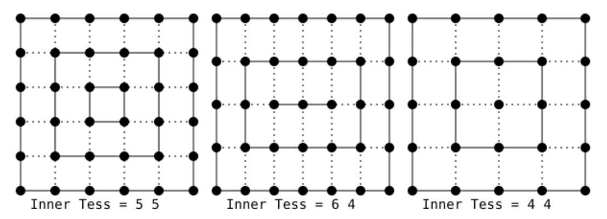

<br>


<br>

# 1 - Introduction

Appendix 06 (**Bézier curves and surfaces**) explains how a surface can be expressed as a weighted sum of control points. This method can be particularly useful when representing detailed mesh objects that would otherwise require a ton of vertices to be stored in a vertex buffer. Instead, by using a connected collection of patches, we can represent the same object using only a few control points to be processed\transformed by the initial stages of the pipeline.

However, it’s important to remember that the graphics pipeline still operates with primitives such as triangles, lines, and points. Therefore, at some point, we need to tessellate the patch so it can be represented as a collection of primitives (a mesh). The general concept is illustrated in the image below.

<br>


<br>

The vertex shader processes the control points describing an input patch as they were normal vertices stored in a vertex buffer containing the corresponding vertex attributes. Then, the tessellation operations can be performed through two programmable stages and a fixed one. In short, the Tessellation Control Shader (TCS) receives the control points (and their associated attributes) from the vertex shader and produces some control points describing an output patch (i.e., it can modify the input patch and pass the result to the next programmable stage). Then, a fixed-stage called Tessellation Primitive Generator (TPG, or simply tessellator) tessellates\subdivides the patch domain and generate sample points based on some tessellation settings determined by the TCS. Following this, the Tessellation Evaluation Shader (TES) uses the output control points from the TCS and the samples generated by the TPG to emit the vertices of the triangulated patch.

The tessellation stages are optional in the graphics pipeline. This means that, to use them, we must first verify that our physical device supports tessellation. At that point, we can create a logical device while informing the driver of our intention to use this optional stages of the pipeline.

<br>


<br>

Once confirmed that our GPU supports it, enabling tessellation simply involves including the corresponding pre-compiled code in a pipeline object during its creation.

The remainder of this tutorial will provide more detailed information, providing a comprehensive understanding of tessellation in computer graphics.

<br>

<br>

# 2 - Tessellation Control Shader

<br>


<br>

The tessellation control shader (TCS) is the first stage of the pipeline that recognizes a set of control points describing a patch as an input primitive. Its purpose is to establish the tessellation levels for the Tessellation Primitive Generator (TPG) and transmit the control points to the subsequent programmable stage (the TES), along with any additional per-patch data if required. 

The first image in the previous section illustrates a set of 16 control points as the input to the TCS, which is then transformed into a set of only 4 control points passed to the Tessellation Evaluation Shader (TES). In other words, the TCS has the capability to modify the control points of the input patch before outputting them, one by one, to the TES. Consequently, the TCS needs to be executed as many times as there are control points describing the output patch. Nevertheless, each invocation of the TCS can access all control points of the input patch, allowing for computation of output control points based on the input ones, if necessary.

The number of control points describing the input patch must be specified through the Vulkan API in C++ by setting the **patchControlPoints** field of the **VkPipelineTessellationStateCreateInfo** structure as part of the pipeline object. On the other hand, in the shader code, an output layout qualifier specifying the number of control points describing the output patch must be included. <br>
The maximum number of control points for both input and output patches must be less than or equal to **VkPhysicalDeviceLimits::maxTessellationPatchSize**. For GPUs supporting tessellation, this value is guaranteed to be at least 32, so checking this value is necessary if patches with more than 32 control points are required.

Each invocation of the TCS can read all control points of the input patch, presented to the shader code as an array of inputs storing data from the previous stage (vertex attributes from the vertex shader and built-in variables available to the TCS, such as **gl_Position**, **gl_PointSize**, etc). <br>
The TCS can also use the **patch** layout qualifier to define per-patch output data shared by all invocations (which essentially means that per-patch data is not provided as an array but, instead, as a single output variable or block). <br>
The invocations corresponding to a given input patch execute logically in parallel, with undefined relative execution order. However, the GLSL **barrier** instruction can be used to ensure control flow and memory synchronization. Indeed, the TCS will read undefined values if one invocation reads a per-vertex or per-patch output written by another invocation at the same time, or if two invocations attempt to write different values to the same per-patch output. Refer to the Vulkan documentation for further details.

For each input patch, both inner and outer tessellation levels for the TPG can be set. The outer tessellation levels control the level of tessellation along the outer edges of the patch, allowing seamless joins with adjacent patches in a larger geometry. The inner tessellation levels control the level of tessellation in the center of the patch. <br>
The TCS provides an output built-in variable called **gl_TessLevelOuter**, as an array of floating-point values, to set a maximum of four outer tessellation levels. Similarly, the output built-in variable **gl_TessLevelInner** can be used to set two inner tessellation levels. Further details will be provided in the section covering the TPG later in this tutorial.

A TCS provide the following built-in input variables:

- **gl_PatchVerticesIn**: the number of vertices in the input patch.

- **gl_PrimitiveID**: the index of the current patch in a series of patches being processed for the same draw call.
  
- **gl_InvocationID**: the index of the TCS invocation within this patch. A TCS invocation uses this value to index into per-vertex output variables (which are arrays).

<br>

The TCS also provides the built-in input variable **gl_in** as an array to read **gl_Position** and other built-in variables (available to the TCS) that are associated to the input control points (this requires the use of **gl_InvocationID** to index into this array). Similarly, the TCS provides the built-in output variable **gl_out** as an array to set the same built-in variables for the output control points.

<br>

<br>

# 3 - Tessellation Evaluation Shader

<br>


<br>

The tessellation evaluation shader (TES) is responsible for creating, vertex by vertex, the primitives that compose the output patch. For this purpose, the TES uses the control points from the TCS and a sample (in domain coordinates) from the TPG to produce a vertex of a primitive composing the patch. This means that the TES is executed as many times as samples generated by the TPG, and each invocation needs a parametric equation that represents the patch to compute (at least) a vertex position from the input control points.

The type of domain the TPG will subdivide can be specified as an attribute of an input layout qualifier in the TES. In particular, we can specify one of the following attributes:

- **quads**: the patch domain is a unary quad. In this case, the TCS must set all the elements in both the **gl_TessLevelOuter** and **gl_TessLevelInner** arrays.

- **triangles**: the patch domain is a triangle. In this case, the TCS must set the first three elements in the **gl_TessLevelOuter** array and only the first element in the **gl_TessLevelInner** array.

- **isolines**: the patch domain is a unary quad but, differently from **quads**, it informs the TPG to tessellate a collection of line segments within the quad. The TCS must only set the first two elements in the **gl_TessLevelOuter** array, and no element in the **gl_TessLevelInner** array needs to be set.

- **point_mode**: the patch domain is a unary quad or a triangle, informing the TPG that no tessellation is required: the samples are computed as usual and used to produce points (instead of triangles or lines) to be sent to subsequent stages of the pipeline.

<br>

In addition to the type of domain, a TES must also specify (as an attribute of an input layout qualifier) a spacing mode for the subdivision operation. This information, along with the tessellation levels provided by the TCS, informs the TPG how to perform the subdivision of the domain and compute the samples for the TES. The tessellation levels are provided as floating-point values in the TCS code, and we can specify among three spacing modes in the TES code to inform the TPG how to interpret these values. In particular, we can use:

- **equal_spacing**: indicates that a floating-point outer tessellation level is first clamped to $[1, \text{maxLevel}]$, where $\text{maxLevel}$ is the maximum tessellation level supported by the device (check **VkPhysicalDeviceLimits::maxTessellationGenerationLevel**). Then, the result is rounded up to the nearest larger integer $n$, and the corresponding edge of the domain is divided into $n$ segments of equal length.

- **fractional_even_spacing**: indicates that a floating-point outer tessellation level is first clamped to $[2, \text{maxLevel}]$ and then rounded up to the nearest larger even integer $n$. The corresponding edge of the domain will be divided into $(n - 2)$ segments of equal length, with two additional segments of equal length that are typically shorter than the other segments. The length of the two additional segments relative to the others will decrease monotonically with $(n - f)$, where $f$ is the clamped floating-point outer tessellation level. When $(n - f)$ is zero, the additional segments will have equal length to the other segments. As $(n - f)$ approaches $2.0$, the relative length of the additional segments approaches zero. The two additional segments will be placed symmetrically on opposite sides of the subdivided edge. The relative location of these two segments is implementation-dependent, but must be identical for any pair of subdivided edges with identical values of $f$.

- **fractional_odd_spacing**: it is similar to **fractional_even_spacing**, but with the clamped floating-point tessellation level rounded up to the nearest odd integer $n$ instead of the nearest even integer value.

<br>


<br>

The image above illustrates examples of edge subdivision with different tessellation levels and spacing modes. For instance, in the second row, the tessellation level (starting from $1.5$) is rounded up to $2.0$ for equal and even spacing, while for odd spacing, it is rounded up to $3.0$. In this last case, there is $(3 - 2) = 1$ segment, along with two additional segments. These additional segments are considerably smaller than the other segment, as $(3.0 - 1.5) = 1.5$, which is very close to $2.0$.

Why do we have floating-point tessellation levels? One answer is that floating-point tessellation levels, combined with **fractional_even_spacing** and **fractional_odd_spacing**, allow a smooth transition between different levels of tessellation (useful for LOD algorithms). As you can see in the image above, the subdivision of the line segments changes less abruptly using even and odd spacing compared to equal one.

If the type of domain is specified as **triangles** or **quads**, the output primitives of the tessellation process are triangles. In such a case, we also need to specify (as an attribute of an input layout qualifier) the winding order for the corresponding vertices. In particular, we can use **cw** to indicate clockwise order and **ccw** to indicate counterclockwise order.

<br>

>[!NOTE] 
>Type of domain, spacing mode and winding order can also be specified as attributes of an output layout qualifier in the TCS when using pipeline objects. However, with shader objects, you must specify this information in the TES code. We will cover shader objects in a later tutorial.

<br>

>[!NOTE] 
>The TES that provides data to the TPG might seem a bit misleading and confusing when examining the graphics pipeline of Vulkan. Looking at the images in the previous section, it appears as if the data is moving in the opposite direction, from the TES to the TPG, but this is not the case. Actually, the shader compiler collects all the necessary information from the shader programs of both the TCS and TES and handles the configuration of the TPG accordingly.

<br>

Observe that each invocation of the TES has access to all control points, presented to the shader code as an array of inputs storing data from the previous stage (including vertex attributes from the TCS and built-in variables available to the TES, such as **gl_Position**, **gl_PointSize**, etc). The TES can also use the **patch** layout qualifier to define per-patch input data (from the TCS) shared by all invocations. This essentially means that per-patch data is not provided as an array but, instead, as a single input variable or block.

The invocations (each corresponding to a given sample from the TPG) execute logically in parallel, with an undefined relative execution order. However, the GLSL **barrier** instruction can be used to ensure control flow and memory synchronization. Indeed, a TES will read undefined values if one invocation reads a per-vertex or per-patch output written by another invocation at the same time, or if two invocations attempt to write different values to the same per-patch output. Refer to the Vulkan documentation for further details.

A TES provide the following built-in input variables:

- **gl_TessCoord**:  a **vec3** specifying the location within the patch domain for the current sample. Every input parameter other than this one will be identical for all TES invocations within a patch. The components of this **vec3** that have valid values depend on the type of domain. For **isolines** and **quads**, only the first two components have valid values. For **triangles**, all three components have valid values since barycentric coordinates are required to represent all the points within a triangle. All valid values are normalized floats (in the range $[0, 1]$).

- **gl_PatchVerticesIn**: the number of output control points specified by the TCS. Attempts to index per-vertex inputs by a value greater than or equal to **gl_PatchVerticesIn** result in undefined behavior.
- 
**gl_PrimitiveID**: the index of the current patch in a series of patches being processed for the same draw call.

<br>

A TES also has access to the tessellation levels (**gl_TessLevelOuter** and **gl_TessLevelInner**) provided for edge subdivision purposes to the TPG by the TCS. <br>
Additionally, a TES also provides the built-in variable **gl_in** as an array to read the built-in per-vertex variables provided as output by the TCS.

On the other hand, a TES outputs vertices one by one, so there is not need for an array like **gl_out** to set the same built-in variables. That is, we can directly write to **gl_Position** and the other built-in per-vertex variables associated with the vertex emitted by current invocation of the TES.

<br>

<br>

# 4 - Tessellation Primitive Generator

The Tessellation Primitive Generator (TPG) generates some sample points within the patch domain and uses them for the tessellation of the domain. The samples are then used in the TES to create effective vertices for the tessellated version of the input patch. But why do we need to tessellate the domain? An answer is that the graphics pipeline operates with primitives such as triangles, lines, and points. Therefore, the TPG must build these primitives from the samples it generates in the patch domain space.

For this purpose, if a parametric representation of the patch is available, a mapping from 3D vertices of the patch to 2D points within its domain can be established. In simpler terms, you can ideally unwrap the patch onto the domain space, associating 2D points within the domain to 3D vertices of the patch. This process is similar to what we discussed in tutorial **01.F - Hello Textures** regarding texture mapping. In other words, having a tessellated version of the domain automatically provides a tessellated version of the patch. That is, a triangle formed by three samples in the patch domain space can be mapped to a triangle in the tessellated patch. Hence, the TPG tessellates the domain to build primitives from sample points in the domain space, facilitating the creation of a tessellated version of the patch in the TES. To some extent, the TPG acts like an input assembler.

The process of tessellating the domain is largely implementation-dependent, so we won’t delve into specific details about how it’s achieved under the hood. In this section, we’ll only introduce guidelines that are indicated by the specification for the TPG to compute samples from the input data by both TCS and TES, which includes aspects such as type of domain, spacing mode, and outer and inner tessellation levels.

Observe that if any of the relevant outer tessellation levels is less than or equal to zero, the TPG discards the patch. For discarded patches, no vertices or primitives are generated by the TES.

<br>

## 4.1 - Triangle tessellation

When the domain type is a triangle, each sample generated by the TPG has barycentric coordinates $(u, v, w)$, with components in the range $[0, 1]$. Only the first three outer tessellation levels contribute to the subdivision of the edges of the domain, as illustrated in the image below (where OL stands for Outer Level and IL stands for Inner Level). The first inner tessellation level is primarily used to build concentric inner triangles that aid in computing the sample points from which to tessellate the triangular domain.

<br>

  <br>
(image from: khronos.org)

<br>

The first step in tessellating a triangular domain involves temporarily subdividing the triangle’s edges using the inner level provided by the TCS to build the inner triangles. For example, the image below shows the result of having an inner level of three (on the left) and four (on the right).

<br>

 <br>
(image from: khronos.org)

<br>

To build the inner triangles, a dotted line can be ideally drawn from each vertex that (temporarily) subdivides the triangle’s edges, excluding the corner vertices. These dotted lines must be perpendicular to the edge that the vertex belongs to, pointing inside the triangle. The intersection of dotted lines from two neighboring vertices of a corner vertex will form a vertex at a corner of an inner triangle. Perpendicular lines from the remaining vertices define the subdivision of the edges of the inner triangle.

Continue building inner triangles until you have a triangle whose edges cannot be subdivided further or until you have a degenerated triangle (a single point).

Next, remove tessellation from the edges of the main outermost triangle and re-tessellate them according to three effective outer tessellation levels and spacing mode provided by TCS and TES.

That’s it! We now have all sample points for the TES. It’s up to specific implementation of the TPG to tessellate the triangular domain using these sample points. The TES will receive these points one by one to build the actual vertices of the triangulated patch.

The image below shows the result for a triangle where OL = $\\{6, 1, 4\\}$ and IL = $\\{5\\}$.

<br>

 <br>
(image from: khronos.org)

<br>

## 4.2 - Quad tessellation

When the domain type is a quad, each sample generated by TPG has coordinates $(u, v)$ with components in the range of $[0, 1]$. All four outer tessellation levels contribute to the subdivision of the edges of the domain, as depicted in the image below. Similarly, both inner tessellation levels are used to build concentric inner quads, aiding in computing the sample points used to tessellate the rectangular domain.

<br>

 <br>
(image from: khronos.org)

<br>

The first step in tessellating a rectangular domain involves temporarily subdividing the four edges of the quad using the inner levels provided by the TCS. Inner level 0 is applied to the horizontal edges, while level 1 is applied to the vertical edges. For example, the image below displays the results with IL = $\\{5, 5\\}$ (on the left), IL = $\\{6, 4\\}$ (at the center), and IL = $\\{4, 4\\}$ (on the right).

<br>

 <br>
(image from: khronos.org)

<br>

To build the inner quads, a dotted line can be ideally drawn from each vertex that (temporarily) subdivides the edges of the quad (excluding the corner vertices). These dotted lines must be perpendicular to the edges to which the vertices belong, pointing inside the quad. The intersection of the dotted lines from two neighboring vertices of a corner vertex results in the vertex at a corner of the inner quad. Perpendicular lines from the remaining vertices define the subdivision of the edges of the inner quad.

Continue building inner quads until you reach a quad with edges that cannot be further subdivided or a degenerate quad (a line segment or a single point).

Remove the tessellation from the edges of the primary outermost quad and re-tessellate them according to the four effective outer tessellation levels and the spacing mode provided by the TCS and TES.

That’s it! We now have all sample points for the TES. It’s up to specific implementation of the TPG to tessellate the rectangular domain using these sample points. The TES will receive these points one by one to build the actual vertices of the triangulated patch.

The image below shows the result for a quad where OL = $\\{4, 3, 9, 2\\}$ and IL = $\\{6, 7\\}$.

<br>

 <br>
(image from: khronos.org)

<br>

<br>

## 4.3 - Isoline tessellation

Up until now, with quad and triangle tessellations, the TPG acted like an input assembler where the primitive topology was a triangle list. However, we can also work with line lists by setting the domain type of the patch to **isolines**.

In the case of isolines, the domain is a collection of line segments within a quad. Each sample generated by the TPG has coordinates $(u, v)$, with components in the range of $[0, 1]$. The $v$-component specifies the line segment, and the $u$-component represents the distance along that line.

Only the first two outer tessellation levels are used with isolines. The first level indicates how the lateral edges of the quad containing the line segments are equally subdivided (that is, the effective spacing mode is ignored and treated as **equal_spacing**). The second level specifies the subdivision of the line segments using the actual spacing mode.

Observe that no inner tessellation level is used with isolines. Additionally, the bottom edge of the quad contains no edge.

<br>

 <br>
(image from: khronos.org)

<br>

That’s it! We now have all sample points as endpoints of tessellated line segments (within the main line segment they belongs to in the quad) that the TES will receive one by one to build the actual vertices of a tessellated patch. Isoline tessellation is useful in rendering single curves or to represent surfaces as a collection of curves. We will return on this in a later tutorial when we discuss hair rendering.

The image below shows a couple of examples illustrating isoline tessellation where OL = $\\{3, 4\\}$ (on the left) and OL = $\\{6, 2\\}$.

<br>

 <br>
(image from: khronos.org)

<br>

Observe that, if the **VK_KHR_portability_subset** extension is enabled, and **VkPhysicalDevicePortabilitySubsetFeaturesKHR::tessellationIsolines** is **VK_FALSE**, then isoline tessellation is not supported by the implementation.

<br>

<br>

## 4.3 - Point mode tessellation

Point mode tessellation applies on top of other tessellation modes (that is, **point_mode** must be specified as an attribute of a layout qualifier in the shader code along with **quads** or **triangles**) and can be used to produce point lists instead of triangle or line lists. Specifically, point mode tessellation operates similarly to quad and triangle tessellation. However, instead of assembling triangles or lines, the samples are forwarded to the subsequent pipeline stages as if they were point lists, except that the order in which the points are generated for each input primitive is undefined.

Observe that, if the **VK_KHR_portability_subset** extension is enabled, and **VkPhysicalDevicePortabilitySubsetFeaturesKHR::tessellationPointMode** is **VK_FALSE**, then tessellation point mode is not supported by the implementation.

<br>

<br>

# 5 - VKTessellation: code review

The sample presented in this tutorial shows how to use a set of control points as a pipeline primitive to render a simple Bézier patch in wireframe mode.

<br>

<br>

## 5.1 - C++ code

In the declaration of the **VKTessellation** class, the only thing worth noting is that we only need a position attribute in the vertex shader and a single draw call to render the Bézier surface in wireframe mode. The remaining code is somewhat similar to what we’ve reviewed in earlier tutorials.

<br>

```cpp
class VKTessellation : public VKSample
{
public:

    // ...

    
    // Vertex layout used in this sample (stride: 12 bytes)
    struct Vertex {
        glm::vec3 position;
    };

    // In this sample we have only one draw call for each frame.
    const unsigned int m_numDrawCalls = 1;


    // ...


};
```
<br>

**EnableFeatures** verifies whether our device supports tessellation and sets the corresponding field in the **VkPhysicalDeviceFeatures** structure to **TRUE**. We also check that wireframe rendering is suppoorted.

<br>


```cpp
void VKTessellation::EnableFeatures(VkPhysicalDeviceFeatures& features)
{
    // We need both tessellation and wireframe rendering support for this sample
    if (m_deviceFeatures.tessellationShader && m_deviceFeatures.fillModeNonSolid)
    {
        m_vulkanParams.EnabledFeatures.tessellationShader = VK_TRUE;
        m_vulkanParams.EnabledFeatures.fillModeNonSolid = VK_TRUE;
    }
    else
    {
        assert(!"Selected device does not support tessellation or wireframe!");
    }
}
```
<br>

>[!NOTE] 
>The tessellation level provided by this sample is straightforward enough that we can depend on the minimum guarantees offered by any device that supports tessellation. Consequently, we can move forward without additional checks for other device limits specific to tessellation, such as the maximum number of control points in both the input and output patch of the TCS.

<br>

**CreateVertexBuffer** creates a vertex buffer that contains 16 control points describing a bicubic Bézier patch (refer to Appendix 06 for additional details). The index buffer stores the indices of these control points in order, as traditional primitives like triangles, lines, or points aren't used to define a mesh. Instead, the control points describing a patch will be used as the input primitive for the graphics pipeline.

<br>

```cpp
void VKTessellation::CreateVertexBuffer()
{
    // While it's fine for an example application to request small individual memory allocations, that is not
    // what should be done a real-world application, where you should allocate large chunks of memory at once instead.

    //
    // Create the vertex and index buffers.
    //

    // 4 x 4 contro points defining a bicubic Bézier patch
    std::vector<Vertex> patchVertices =
    {
        // Row 1
        { { -10.0f, 15.0f, -10.0f } },
        { { -5.0f,  15.0f, 0.0f } },
        { { 5.0f,  15.0f, 0.0f } },
        { { 10.0f, 15.0f, 0.0f } },

        // Row 2
        { { -15.0f, 5.0f, 0.0f } },
        { { -5.0f,  5.0f, 0.0f } },
        { { 5.0f, 5.0, 20.0 } },
        { { 15.0f, 5.0f, 0.0f } },

        // Row 3
        { { -15.0f, -5.0f, 0.0f } },
        { { -5.0f, -5.0f, 0.0f } },
        { { 5.0f, -5.0f, 0.0f } },
        { { 15.0f, -5.0f, 0.0f } },

        // Row 4
        { { -10.0f, -15.0f, 10.0f } },
        { { -5.0f, -15.0f,  0.0f } },
        { { 5.0f, -15.0f,  0.0f } },
        { { 25.0f, -15.0f, 10.0f } }
    };

    size_t vertexBufferSize = static_cast<size_t>(patchVertices.size()) * sizeof(Vertex);
    m_meshObjects["patchControlPoints"].vertexCount = static_cast<uint32_t>(patchVertices.size());

    // The indices of the control points are provided in order.
    std::vector<uint16_t> indices =
    {
        0, 1, 2, 3,
        4, 5, 6, 7,
        8, 9, 10, 11, 
        12, 13, 14, 15
    };

    size_t indexBufferSize = static_cast<size_t>(indices.size()) * sizeof(uint16_t);
    m_meshObjects["patchControlPoints"].indexCount = indices.size();


    // ...


}
```
<br>

The image below shows the control points from both a top view (on the left) and a side view (in the center). Observe that most of the control points lie on the same plane, except for four points: three at the corners and one at the center of the patch. The resulting patch is illustrated on the right side of the image. As detailed in Appendix 06, a Bézier curve passes through the control points at the endpoints, while the other control points act as attractors for the curve. The same applies for Bézier surfaces, where a patch passes through the control points at the corners.

<br>


<br>

In **CreatePipelineObjects**, a pipeline object is created to draw our Bézier patch in wireframe mode while disabling back-face culling. This ensures that both the back and front faces of the patch are drawn.

<br>

```cpp
void VKTessellation::CreatePipelineObjects()
{
    //
    //  Set the various states for the graphics pipeline used by this sample
    //


    // ...

    
    // Input assembly state describes how primitives are assembled by the input assembler.
    // This pipeline will assemble vertex data as a patch lists.
    VkPipelineInputAssemblyStateCreateInfo inputAssemblyState = {};
    inputAssemblyState.sType = VK_STRUCTURE_TYPE_PIPELINE_INPUT_ASSEMBLY_STATE_CREATE_INFO;
    inputAssemblyState.topology = VK_PRIMITIVE_TOPOLOGY_PATCH_LIST;
    
    //
    // Rasterization state
    //
    VkPipelineRasterizationStateCreateInfo rasterizationState = {};
    rasterizationState.sType = VK_STRUCTURE_TYPE_PIPELINE_RASTERIZATION_STATE_CREATE_INFO;
    rasterizationState.polygonMode = VK_POLYGON_MODE_LINE; // Wireframe
    rasterizationState.cullMode = VK_CULL_MODE_NONE;       // Draw both front and back faces
    rasterizationState.frontFace = VK_FRONT_FACE_COUNTER_CLOCKWISE;
    rasterizationState.lineWidth = 1.0f;

    //
    // Tessellation state
    //
    VkPipelineTessellationStateCreateInfo tessellationState {};
    tessellationState.sType = VK_STRUCTURE_TYPE_PIPELINE_TESSELLATION_STATE_CREATE_INFO;
    tessellationState.patchControlPoints = 16; // number of control points in the input patch


    // ...
    

    //
    // Shaders
    //
    VkShaderModule renderVS = LoadSPIRVShaderModule(m_vulkanParams.Device, GetAssetsPath() + "/data/shaders/render.vert.spv");
    VkShaderModule renderTCS = LoadSPIRVShaderModule(m_vulkanParams.Device, GetAssetsPath() + "/data/shaders/render.tesc.spv");
    VkShaderModule renderTES = LoadSPIRVShaderModule(m_vulkanParams.Device, GetAssetsPath() + "/data/shaders/render.tese.spv");
    VkShaderModule renderFS = LoadSPIRVShaderModule(m_vulkanParams.Device, GetAssetsPath() + "/data/shaders/render.frag.spv");


    // This sample will use three programmable stage: Vertex, Geometry and Fragment shaders
    std::array<VkPipelineShaderStageCreateInfo, 4> shaderStages{};
    
    // Vertex shader
    shaderStages[0].sType = VK_STRUCTURE_TYPE_PIPELINE_SHADER_STAGE_CREATE_INFO;
    // Set pipeline stage for this shader
    shaderStages[0].stage = VK_SHADER_STAGE_VERTEX_BIT;
    // Load binary SPIR-V shader module
    shaderStages[0].module = renderVS;
    // Main entry point for the shader
    shaderStages[0].pName = "main";
    assert(shaderStages[0].module != VK_NULL_HANDLE);
    
    // Fragment shader
    shaderStages[1].sType = VK_STRUCTURE_TYPE_PIPELINE_SHADER_STAGE_CREATE_INFO;
    // Set pipeline stage for this shader
    shaderStages[1].stage = VK_SHADER_STAGE_FRAGMENT_BIT;
    // Load binary SPIR-V shader module
    shaderStages[1].module = renderFS;
    // Main entry point for the shader
    shaderStages[1].pName = "main";
    assert(shaderStages[1].module != VK_NULL_HANDLE);

    // Tessellation Control shader
    shaderStages[2].sType = VK_STRUCTURE_TYPE_PIPELINE_SHADER_STAGE_CREATE_INFO;
    // Set pipeline stage for this shader
    shaderStages[2].stage = VK_SHADER_STAGE_TESSELLATION_CONTROL_BIT;
    // Load binary SPIR-V shader module
    shaderStages[2].module = renderTCS;
    // Main entry point for the shader
    shaderStages[2].pName = "main";
    assert(shaderStages[2].module != VK_NULL_HANDLE);

    // Tessellation Evaluation shader
    shaderStages[3].sType = VK_STRUCTURE_TYPE_PIPELINE_SHADER_STAGE_CREATE_INFO;
    // Set pipeline stage for this shader
    shaderStages[3].stage = VK_SHADER_STAGE_TESSELLATION_EVALUATION_BIT;
    // Load binary SPIR-V shader module
    shaderStages[3].module = renderTES;
    // Main entry point for the shader
    shaderStages[3].pName = "main";
    assert(shaderStages[3].module != VK_NULL_HANDLE);

    //
    // Create the graphics pipelines used in this sample
    //
    
    //
    // Wireframe with no culling
    //

    VkGraphicsPipelineCreateInfo pipelineCreateInfo = {};
    pipelineCreateInfo.sType = VK_STRUCTURE_TYPE_GRAPHICS_PIPELINE_CREATE_INFO;
    // The pipeline layout used for this pipeline (can be shared among multiple pipelines using the same layout)
    pipelineCreateInfo.layout = m_sampleParams.PipelineLayout;
    // Render pass object defining what render pass instances the pipeline will be compatible with
    pipelineCreateInfo.renderPass = m_sampleParams.RenderPass;
    
    // Set pipeline shader stage info (it only includes the VS shader for capturing the result in the TF stage)
    pipelineCreateInfo.stageCount = static_cast<uint32_t>(shaderStages.size());
    pipelineCreateInfo.pStages = shaderStages.data();
    
    // Assign the pipeline states to the pipeline creation info structure
    pipelineCreateInfo.pVertexInputState = &vertexInputState;
    pipelineCreateInfo.pInputAssemblyState = &inputAssemblyState;
    pipelineCreateInfo.pRasterizationState = &rasterizationState;
    pipelineCreateInfo.pColorBlendState = &colorBlendState;
    pipelineCreateInfo.pMultisampleState = &multisampleState;
    pipelineCreateInfo.pViewportState = &viewportState;
    pipelineCreateInfo.pDepthStencilState = &depthStencilState;
    pipelineCreateInfo.pDynamicState = &dynamicState;
    pipelineCreateInfo.pTessellationState = &tessellationState;
    
    // Create a graphics pipeline for capturing particles updated by the VS work
    VK_CHECK_RESULT(vkCreateGraphicsPipelines(m_vulkanParams.Device, 
                                              VK_NULL_HANDLE, 1, 
                                              &pipelineCreateInfo, nullptr, 
                                              &m_sampleParams.GraphicsPipelines["WireframeNoCull"]));


    // ...


}
```
<br>

Observe that we set the number of control points in the input patch, as well as the code for both TES and TCS in the pipeline object. The shader code for the sample will be examined in the next section.

<br>

The code of the **PopulateCommandBuffer** function is trivial and should not too difficult to understand.

<br>

```cpp
void VKTessellation::PopulateCommandBuffer(uint32_t currentImageIndex)
{
    VkCommandBufferBeginInfo cmdBufInfo = {};
    cmdBufInfo.sType = VK_STRUCTURE_TYPE_COMMAND_BUFFER_BEGIN_INFO;
    cmdBufInfo.flags = VK_COMMAND_BUFFER_USAGE_ONE_TIME_SUBMIT_BIT;


    // ...


    VK_CHECK_RESULT(vkBeginCommandBuffer(m_sampleParams.FrameRes.GraphicsCommandBuffers[m_frameIndex], &cmdBufInfo));

    // Begin the render pass instance.
    // This will clear the color attachment.
    vkCmdBeginRenderPass(m_sampleParams.FrameRes.GraphicsCommandBuffers[m_frameIndex], &renderPassBeginInfo, VK_SUBPASS_CONTENTS_INLINE);


    // ...

    
    // Bind the vertex buffer (with positions)
    VkDeviceSize offsets[1] = { 0 };
    vkCmdBindVertexBuffers(m_sampleParams.FrameRes.GraphicsCommandBuffers[m_frameIndex], 0, 1, &m_vertexindexBuffers.VBbuffer, offsets);

    // Bind the index buffer
    vkCmdBindIndexBuffer(m_sampleParams.FrameRes.GraphicsCommandBuffers[m_frameIndex], m_vertexindexBuffers.IBbuffer, 0, VK_INDEX_TYPE_UINT16);

    //
    // Draw patch
    //

    // Dynamic offset used to offset into the uniform buffer described by the dynamic uniform buffer and containing mesh information
    uint32_t dynamicOffset = m_meshObjects["patchControlPoints"].dynIndex * static_cast<uint32_t>(m_dynamicUBOAlignment);

    // Bind the graphics pipeline for capturing updated particles
    vkCmdBindPipeline(m_sampleParams.FrameRes.GraphicsCommandBuffers[m_frameIndex], 
                        VK_PIPELINE_BIND_POINT_GRAPHICS, 
                        m_sampleParams.GraphicsPipelines["WireframeNoCull"]);

    // Bind descriptor sets for drawing a mesh using a dynamic offset
    vkCmdBindDescriptorSets(m_sampleParams.FrameRes.GraphicsCommandBuffers[m_frameIndex], 
                            VK_PIPELINE_BIND_POINT_GRAPHICS, 
                            m_sampleParams.PipelineLayout, 
                            0, 1, 
                            &m_sampleParams.FrameRes.DescriptorSets[m_frameIndex], 
                            1, &dynamicOffset);

    // "Draw" the grid of control points describing the patch
    vkCmdDrawIndexed(m_sampleParams.FrameRes.GraphicsCommandBuffers[m_frameIndex], m_meshObjects["patchControlPoints"].indexCount, 1, 0, 0, 0);

    // Ending the render pass will add an implicit barrier, transitioning the frame buffer color attachment to
    // VK_IMAGE_LAYOUT_PRESENT_SRC_KHR for presenting it to the windowing system
    vkCmdEndRenderPass(m_sampleParams.FrameRes.GraphicsCommandBuffers[m_frameIndex]);
    
    VK_CHECK_RESULT(vkEndCommandBuffer(m_sampleParams.FrameRes.GraphicsCommandBuffers[m_frameIndex]));
}
```
<br>

<br>

## 5.2 - GLSL code

The vertex shader used in this sample operates as a passthrough shader, simply passing the control points to the TCS without applying any transformations. Refer to the complete source code in the tutorial’s repository for further details.

The TCS takes the control points, one by one, and uses them to build the output patch, which, in this case, remains the same as the input patch.

The listing below show the TCS used in this sample. Observe that we specify the number of control points describing the output patch as an attribute of an output layout qualifier. Additionally, we use the **gl_InvocationID** variable to set both the outer and inner tessellation levels in the first invocation of the TCS, as there is no need to reset them for each invocation.

<br>

```glsl
#version 450

layout (vertices = 16) out;

layout (location = 0) in vec3 inPos[];

layout (location = 0) out vec3 outPos[16];


void main()
{
    if (gl_InvocationID == 0)
    {
        gl_TessLevelInner[0] = 25.0;
        gl_TessLevelInner[1] = 25.0;

        gl_TessLevelOuter[0] = 25.0;
        gl_TessLevelOuter[1] = 25.0;
        gl_TessLevelOuter[2] = 25.0;
        gl_TessLevelOuter[3] = 25.0;
    }

    outPos[gl_InvocationID] = inPos[gl_InvocationID];
}
```
<br>

The code snippet below shows the TES used in this sample. Each invocation uses the parametric equation of the bicubic Bézier surface, the control points of the output patch, and a sample position in domain space generated by the TPG to compute a vertex of a triangle composing the tessellated patch. To understand how to derive a formula for computing a bicubic Bézier surface from $(u, v)$ coordinates (in the range $[0, 1]$) and a set of control points, refer to appendix 06.

We specify the domain type, spacing mode, and winding orientation as attributes of an input layout qualifier.

In the context of the sample examinated in this tutorial, the TES is the last pre-rasterization shader of the pipeline, so it also provides the homogeneous coordinates of the current vertex.

<br>

```glsl
#version 450

layout (quads, fractional_odd_spacing, ccw) in;

layout (location = 0) in vec3 inPos[];

layout(std140, set = 0, binding = 0) uniform buf {
    mat4 viewMatrix;
    mat4 projMatrix;
} uBuf;

layout(std140, set = 0, binding = 1) uniform dynbuf {
    mat4 worldMatrix;
    vec4 solidColor;
} dynBuf;


void BernsteinBasis(in float t, out vec4 basis)
{
    float invT = 1.0f - t;

    basis = vec4(invT * invT * invT, 3.0 * t * invT * invT, 3.0 * t * t * invT, t * t * t);
}

void main()
{
    vec4 basisU, basisV;
    BernsteinBasis(gl_TessCoord.x, basisU);
    BernsteinBasis(gl_TessCoord.y, basisV);

    vec3 pos = basisU.x * (basisV.x * inPos[0]  + basisV.y * inPos[1]  + basisV.z * inPos[2]  + basisV.w * inPos[3] );
    pos += basisU.y * (basisV.x * inPos[4] + basisV.y * inPos[5] + basisV.z * inPos[6] + basisV.w * inPos[7] );
    pos += basisU.z * (basisV.x * inPos[8] + basisV.y * inPos[9] + basisV.z * inPos[10] + basisV.w * inPos[11]);
    pos += basisU.w * (basisV.x * inPos[12] + basisV.y * inPos[13] + basisV.z * inPos[14] + basisV.w * inPos[15]);
    
    vec4 worldPos = dynBuf.worldMatrix * vec4(pos, 1.0);     // Local to World
    vec4 viewPos = uBuf.viewMatrix * worldPos;               // World to View
    gl_Position = uBuf.projMatrix * viewPos;                 // View to Clip
}
```
<br>

The fragment shader is trivial and simply outputs the color stored in the uniform block for the vertices of the tessellated patch. Please refer to the complete source code in the tutorial’s repository for further details.

<br>

<br>

Source code: [LearnVulkan](https://github.com/PAMinerva/LearnVulkan)

<br>

# References

[1] [Vulkan API Specifications](https://registry.khronos.org/vulkan/) <br>
<br>

<br>

***
If you found the content of this tutorial somewhat useful or interesting, please consider supporting this project by clicking on the **Sponsor** button.  Whether a small tip, a one time donation, or a recurring payment, it's all welcome! Thank you!<br><br>
<p align="center">
 <a href="https://github.com/sponsors/PAMinerva">
         
      </a>
</p><br>