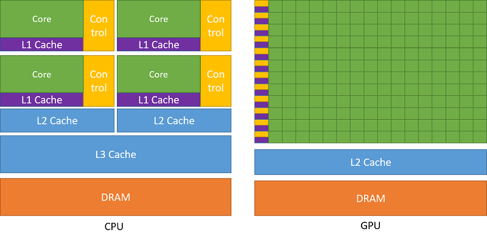

<br>


<br>

# 1 - Introduction

Up until now, we used the graphics pipeline to develop the samples examined in the previous tutorials. However, as explained in **01.B - Hello Triangle** and illustrated in the following image, there are other types of pipelines that can be used in Vulkan as well.

<br>

 <br>
(source: khronos.org)

<br>

We have already seen that the graphics pipeline provides the highest level of abstraction regarding how the GPU operates, proving much more convenient when rendering something on screen.

Conversely, the compute pipeline offers the lowest level of abstraction, enabling the utilization of the GPU for highly efficient parallel computation, regardless of whether the result needs to be displayed on the user's screen. In fact, this pipeline provides developers with the opportunity to leverage the computing power of GPUs for purposes other than traditional graphics-related tasks, such as scientific simulation, machine learning, encryption, and many other computationally intensive tasks.

In other words, Vulkan's compute pipeline allows for GPGPU programming, where GPGPU stands for General-Purpose Graphics Processing Unit. This implies that the graphic processing units of GPUs are not exclusively used for graphical purposes but can be employed to solve complex computational problems. To take advantage of the power of GPUs for generic computations, specific programming APIs such as OpenCL or CUDA can be used. Vulkan's Compute Pipeline offers an alternative to these APIs, enabling developers to use the same Vulkan API for GPGPU programming.

<br>

<br>

# 2 - Compute Pipeline

The compute pipeline is much simpler compared to the graphics pipeline as it only includes one programmable stage, the compute shader. This simplification also extends to the pipeline states, which include only the pipeline layout (to describe the resources the pipeline will access) and the compute shader (the pipeline stage that actually accesses these resources).

As observed in the image from the previous section, the resources described through descriptor sets are used by all types of pipelines.Therefore, what has been seen so far regarding the description of resources through descriptor sets and their connection to pipeline shaders remains valid even when working with the compute pipeline.

Before delving into the specifics of working with the compute shader, it's useful to better understand the architecture and functioning of GPUs to explain why the compute pipeline offers the lowest level of abstraction regarding how the GPU operates compared to other pipelines. The following is a brief overview of GPU architecture that only focuses on general concepts without delving deeply into implementation details, which is more than enough for the purposes of this tutorial.

<br>

## 2.1 - GPU architecture

GPUs are composed of thousands of processing cores specialized in executing individual tasks processed by many cores simultaneously. In other words, GPUs exploit parallelism to execute the same sequence of instructions (describing a specific task) across multiple cores simultaneously on different data, resulting in high-speed processing of vast amounts of data. This enables significant performance acceleration compared to execution on traditional CPUs, which have fewer cores that can process different instruction sequences on each core to execute multiple tasks on small data really fast.

<br>

 <br>
(source: nvidia.com)

<br>

The cores are organized into multiprocessors (rows of cores in the image above on the right) capable of executing the same instruction in parallel across multiple threads running on these cores. For this reason, this hardware model is called SIMT architecture (Single-Instruction, Multiple-Thread).

<br>

 <br>
(source: nvidia.com)

<br>

As illustrated in the image above, each multiprocessor includes on-chip memory of the following four types:

- A set of 32-bit registers that are partitioned among the cores.

- Shared memory that is shared by all cores.

- Read-only constant cache that is shared by cores and speeds up reads from the constant memory space, which is a read-only region of device memory.

- Read-only texture cache that is shared by all cores and speeds up reads from the texture memory space, which is a read-only region of device memory.

- Local and global memory spaces, which are read-write regions of the device memory.

<br>

The multiprocessors creates, manages, schedules and executes threads in groups of typically 32 or 64 parallel threads called warps (or wavefronts). Threads within a warp start at the same program address, but they have their own instruction address counter and register state and are therefore free to branch and execute independently. Each warp executes one common instruction at a time, achieving maximum efficiency when all threads within a warp follow the same execution path. In cases where threads within a warp diverge due to a data-dependent conditional branch, the warp executes each branch path serially, deactivating threads not on that path. Once all paths complete, the threads reconverge on the same execution path.

When a multiprocessor receives one or more thread blocks for execution from a global scheduler, it divides them into warps, managed and scheduled by a warp scheduler (included in each multiprocessor) for execution. Threads within a warp can run concurrently on a single multiprocessor, and multiple warps can be concurrently executed on a single multiprocessor as well. Once a multiprocessor terminates the execution of thread blocks, new blocks can be assigned to it.

The partitioning of a thread block into warps remains consistent: each warp contains threads with consecutive, increasing thread IDs, with the first warp containing thread 0.

The execution context (program counters, registers, and so on) for each warp processed by a multiprocessor is maintained on-chip during the entire lifetime of the warp. Therefore, switching from one execution context to another has no cost. At each instruction issue time, a warp scheduler can select a warp containing threads ready to execute the next instruction (referred to as the active threads of the warp) and issue the instruction to those threads.

The number of thread blocks and warps that can reside and be processed together on the multiprocessor depends on the amount of registers and shared memory used for their execution, in addition to the amount of registers and shared memory available on the multiprocessor.

It is considered advantageous to have a number of thread blocks greater than the number of multiprocessors, particularly if multiple thread blocks can fit within a single multiprocessor. This approach maximizes occupancy, which means that a warp scheduler can select a new warp for execution if the current one is stalling. This practice mitigates having threads idling on multiprocessor cores, wasting potential parallel computation. For the same reason, thread blocks should be divisible by the number of threads in a warp (typically 32 or 64). Indeed, if a warp created by a multiprocessor from a thread block includes fewer threads, the remaining threads will idle on multiprocessor cores during warp execution.

<br>

 <br>
(source: realtimerendering.com)

<br>

The image above illustrates the execution of a simple shader program consisting of five instructions to render a triangle on a semplified GPU that consist of a single multiprocessor with four cores, and where the thread blocks are subdivided in warps of four threads. The triangle covers 12 fragments so we have a thread block of 12 threads (one for each fragment) to execute, resulting in three warps. This conveniently fits the fact that the fragment shader is executed in parallel for 2x2 blocks of fragments.

The first warp is scheduled to be executed on the cores of the multiprocessor. Each instruction is executed in parallel on the threads of the warp in execution. Both the **mad** (multiply and add) and **mul** (multiply) istructions work on 32-bit data and, in this case, are very fast and simple to execute as they probably use data stored in registers. Then a **txr** (texture read) instruction is executed, which leads to a stall as some time is required to fetch texture data from device memory. However, instead of simply stalling, the warp is swapped out for the second warp, which is executed from the beginning until the **txr** instruction that leads to a new stall, where the third warps is swapped in and stalls again executing the same instruction. At that point, if the data of first fetch operation is available, the first warp can be swapped in to execute the last two instructions. Otherwise, execution truly stalls until data is available. Once the multiprocessor complete the execution for the first warp, the second warp is swapped in, and so on.

The explanation just provided should clarify the distinction between the GPU's SIMT architecture and the SIMD abstraction presented by the programmable stages of the graphics pipeline, a difference previously mentioned in an earlier tutorial (**01.B - Hello-Triangle**). <br>
GPU hardware cores execute the same instruction concurrently on scalar values across different threads using 32-bit registers. Conversely, shader cores can process a single instruction across multiple data (vectors) within a single thread. How is this achievable? Well, if one were to examine the machine code of a shader program actually executed by the GPU, it becomes apparent that vector operations are essentially broken down into operations on each component of the vector. <br>
In other words, unlike CPUs, GPUs do not provide hardware support implementing an SIMD architecture. In the realm of GPUs, parallelism simply involves executing the same instruction across multiple threads to process homogeneous scalar values (vertex attributes, fields of uniform buffers, texture texels, etc.).

<br>

## 2.2 - Compute Shader

Using the compute pipeline, there are no vertex buffers bound to the pipeline, as the only stage is the compute shader (no input assembler is provided). Consequently, we cannot rely on texture coordinates (or vertex attributes in general) to access textures or other resources that represent an array of elements requiring indexing for access.

<br>

>[!NOTE] 
> As explained at the beginning of the tutorial, the resources accessible from a compute shader are the same as those available to the programmable stages of the graphics pipeline. Therefore, we still use descriptors stored in descriptor sets and definitions in the shader code to declare shader resources. However, when dealing with resources representing arrays, we need a way to index these resources through indices provided in the shader code.

<br>

For this purpose, the compute shader uses a geometric representation (derived from the hardware architecture described in the previous section) that enables the indexing of array elements by mapping thread IDs to thread indices.

In particular, we can ideally create 1D, 2D, or 3D thread blocks in a space where the origin is at the left-bottom corner of the block, the x-axis is horizontal, the y-axis is vertical, and the z-axis is orthogonal to the first two. Thread blocks are passed to multiprocessors for warp partition and execution. <br>
For a one-dimensional block, the thread index and thread ID are the same. When considering a two-dimensional blocks of size $(D_x, D_y)$, the thread index $(x, y)$ (representing a thread in the block) can be mapped to the thread ID $(x + y\cdot D_x)$. Similarly, for a three-dimensional block of size $(D_x, D_y, D_z)$, the thread index $(x, y, z)$ can be mapped to the thread ID $(x + y\cdot D_x + z\cdot D_x\cdot D_y)$. This mapping allows for the specification of neighboring threads to a specific thread within a thread block using appropriate indices. For instance, within a $3\times 3$ thread block, the thread in the center has an index of $(1, 1)$ (with a thread ID of 4), while the thread above it has an index of $(1, 2)$ (with a thread ID of 7).

We can dispatch to the GPU groups of thread blocks organized geometrically in one, two or three dimensions as well. As an example, the image below illustrates the dispatch of a compute work consisting of six work groups (referred to as thread groups in GLSL) organized as a $(3, 2)$ block. Each work group includes eight invocations (referred to as threads in GLSL) organized as a $(4, 2)$ block.

<br>

 <br>
(source: khronos.org)

<br>

In the example just described, the shader program of the compute shader bound to the pipeline will be invoked $(4\times 2)\times (3\times 2)=48$ times, once for each invocation in the dispatch.

At each invocation of the compute shader, we can use the built-in variables listed in the image above to identify the specific invocation (thread index) currently running and the work group (thread block index) to which the invocation belongs. In particular, we have the following built-in input variables available for a compute shader:

- **uvec3 gl_NumWorkGroups**: Indicates the number of work groups in each dimension of the dispatch, where the first dimension refers to the horizontal direction and the second to the vertical direction. The third dimension indicates how many times the work groups specified in the first two dimensions are duplicated in the orthogonal direction.

- **uvec3 gl_WorkGroupID**: Represents the index of the work group to which the current invocation belongs.

- **uvec3 gl_LocalInvocationID**: Identifies the index of the current invocation within the work group it's part of.

- **uvec3 gl_GlobalInvocationID**: Represents the index across all invocations in the work groups of the current dispatch. This index  is computed using the following formula:
<pre>gl_GlobalInvocationID = gl_WorkGroupID * gl_WorkGroupSize + gl_LocalInvocationID;</pre>

- **uint  gl_LocalInvocationIndex**: Represent the one-dimensional version of **gl_LocalInvocationID**. It linearly identifies the current invocation within its own work group. This scalar value is computed as follows (which is similar to how thread indices are mapped to thread IDs):
<pre>
gl_LocalInvocationIndex = gl_LocalInvocationID.x +
                          gl_LocalInvocationID.y * gl_WorkGroupSize.x +
                          gl_LocalInvocationID.z * gl_WorkGroupSize.x * gl_WorkGroupSize.y;
</pre>

In addition, the following built-in constant vector is available for a compute shaders:

- **const vec3 gl_WorkGroupSize**: Indicates the number of invocations in each dimension for each work group in the current dispatch. It is defined by the attributes **local_size_x**, **local_size_y** and **local_size_z** within an input layout qualifier declared in the compute shader code.

<br>

Ok, it’s all very interesting, but how can we use this geometric model to access resources that need to be indexed from a compute shader? Let’s see a concrete example on a 2D texture of size $24\times 16$, just like the one shown in the following image.

<br>


<br>

Let's idealy divide the texture into $2\times 3$ grid of $8\times 8$ pixels as illustrated in the image above. This means that we will dispatch 6 work groups with 64 invocations each, organized so that **gl_NumWorkGroups** is $(3, 2, 1)$ and **gl_WorkGroupSize** is $(8, 8, 1)$. This way, we will have an invocation of the compute shader for each texel in the texture. The question is: how can we map an invocation to a specific texel? Well, that's what **gl_LocalInvocationIndex** is for. As an example, if we wanted to access the texel highlighted in black in the image above, we should be able to compute its texture coordinates $(12, 10)$. And indeed, we have that:

<pre>

gl_GlobalInvocationID = gl_WorkGroupID * gl_WorkGroupSize + gl_LocalInvocationID
                      = (1, 1, 0) * (8, 8, 1) + (4, 2, 0)
                      = (8, 8, 0) * (4, 2, 0)
                      = (12, 10, 0)

</pre>
<br>

where $(1, 1, 0)$ is the index of the work group in which the invocation corresponding to the texel with coordinates $(12, 10)$ is located, and $(4, 2, 0)$ is the local index of the invocation within that work group.

For completeness, in this example, gl_LocalInvocationIndex would be $4 + 2 * 8 + 0 * 8 * 8 = 20$, which is indeed the linear index of the texel within its work group. You can verify this by counting the texels, starting at the bottom-left corner of the work group (where the linear index is 0). Then, move across each row from left to right, progressing upwards once you reach the rightmost texel in a row.

The following GLSL code shows an example of a compute shader that doubles the values of the texels in a texture of size $24\times 16$, where the texels contain floating-point scalar values.

<br>

```glsl
#version 450

// Input and output images
layout(set = 0, binding = 0, r32f) uniform readonly image2D InputTex;
layout(set = 0, binding = 1, r32f) uniform writeonly image2D OutputTex;

// gl_WorkGroupSize = (8, 8, 1)
// Check maxComputeWorkGroupInvocations and maxComputeWorkGroupSize in VkPhysicalDeviceLimits 
// to know the maximum number of invocations in a work group and per-dimension, respectively.
layout(local_size_x = 8, local_size_y = 8, local_size_z = 1) in;

//
// Six work groups organized in a 2 x 3 grid are dispatched by the
// application through the Vulkan API, so that gl_NumWorkGroups = (3, 2, 1);
// dispatches are registered as commands in the command buffer (similar to draw commands).
// Check VkPhysicalDeviceLimits::maxComputeWorkGroupCount to know the maximum number of
// work groups per dispatch.
//

void main()
{
    ivec2 textureLocation = ivec2(0, 0);

    textureLocation.x = int(gl_GlobalInvocationID.x);
    textureLocation.y = int(gl_GlobalInvocationID.y);

    float texValue = imageLoad(InputTex, textureLocation).r
    imageStore(OutputTex, textureLocation, vec4(2.0 * texValue, 0.0, 0.0, 0.0));
}
```
<br>

Also in this case, the texture is ideally divided into six blocks of 64 texels, as illustrated in the image above. Therefore, we need to dispatch 6 work groups organized in a $2\times 3$ grid. This arrangement sets **gl_NumWorkGroups** to $(3, 2, 1)$. Each work group is structured as an $8\times 8$ grid of invocations, one for each texel in the texture. As we'll explore in the next section, dispatch information is recorded as commands in the command buffer. On the other hand, as previously mentioned, the number of invocations per dimension for each work group is determined by attributes within a layout qualifier declared in the compute shader.

When using images (simple textures) rather than combined image samplers (textures containing sampling information), it's essential to specify the texture format as an attribute of the corresponding layout qualifier. In the case of **r32f**, it simply indicates texels storing a 32-bit floating-point value. **readonly** and **writeonly** disallow read and write operations on image-type resources, respectively.

**imageLoad** and **imageStore** are functions that allow to read and write a **vec4** from\to images, respectively. **imageStore** returns a **vec4** while **imageStore** takes a **vec4** as a parameter.

For 1D textures, Vulkan's GLSL variant offers options like **textureBuffer** and **imageBuffer** as built-in types, supporting image operations on buffers. For more comprehensive insights, consult the Vulkan documentation.

The listing below shows how a compute shader can double values on buffers instead of textures.

<br>

```glsl
#version 450

layout (constant_id = 0) const uint BUFFER_ELEMENTS = 2000;

// Input uniform buffer
layout(std140, set = 0, binding = 0) uniform InputBuf
{
    float values[BUFFER_ELEMENTS];
} inBuffer;

// Output storage buffer 
// (see tutorial "01.B - Hello Triangle" for a description on storage buffers)
layout(std140, set = 0, binding = 1) buffer OutputBuf
{
    float values[BUFFER_ELEMENTS];
} outBuffer;

// gl_WorkGroupSize = (20, 1, 1)
// Check maxComputeWorkGroupInvocations and maxComputeWorkGroupSize in VkPhysicalDeviceLimits 
// to know the maximum number of invocations in a work group and per-dimension, respectively.
layout(local_size_x = 20, local_size_y = 1, local_size_z = 1) in;

//
// 100 work groups in a single dimension are dispatched by the application
// through the Vulkan API, so that gl_NumWorkGroups = (100, 1, 1);
// dispatches are registered as commands in the command buffer (similar to draw commands).
// Check VkPhysicalDeviceLimits::maxComputeWorkGroupCount to know the maximum number of
// work groups per dispatch.
//

void main()
{
    outBuffer.values[gl_GlobalInvocationID.x] = outBuffer.values[gl_GlobalInvocationID.x] * 2.0;
}
```
<br>

BUFFER_ELEMENTS is declared as a specialized constant. <br>
With 100 work groups, each composed of 20 invocations, the compute shader can effectively handle all 2000 elements within the buffers. Indeed, given that the range of **gl_WorkGroupID** spans from $(0, 0, 0)$ to $(99, 0, 0)$ and **gl_LocalInvocationID** ranges from $(0, 0, 0)$ to $(19, 0, 0)$, the resulting **gl_GlobalInvocationID** will cover the range from $(0, 0, 0)$ to $(1999, 0, 0)$. 

<br>

## 2.2.1 - Synchronization in Compute Work

Up to this point, we've used the built-in input variables to access the resource element associated with the current invocation. However, there's no restriction against accessing elements associated with different invocations for a resource shared by all invocations. Consider the following listing:

<br>

```glsl
#version 450

// Array allocated in shared memory to be shared by all invocations in a work group.
// Check VkPhysicalDeviceLimits::maxComputeSharedMemorySize for the maximum 
// total storage size, in bytes, available for variables shared by all invocations in a work group.
shared vec4 gCache_0[256];

// Input image (it is assumed to be 256x256)
layout(set = 0, binding = 0, rgba32f) uniform readonly image2D InputTex;


// Assume gl_NumWorkGroups = (1, 256, 1);
// gl_WorkGroupSize = (256, 1, 1)
layout(local_size_x = 256, local_size_y = 1, local_size_z = 1) in;
void main()
{
    ivec2 textureLocation = ivec2(gl_GlobalInvocationID.xy);

    // Read texel from input image at mipmap level 0 and
    // save the result in the shared memory
    gCache_0[gl_LocalInvocationID.x] = imageLoad(InputTex, textureLocation);

    // WARNING!
    vec4 left = gCache_0[gl_LocalInvocationID.x - 1];
    vec4 right = gCache_0[gl_LocalInvocationID.x + 1];

    // ...
}
```
<br>

This compute shader reads the texel corresponding to the current invocation and saves it in a shared array (accessible by all invocations within the same work group) at the index corresponding to the current invocation. Subsequently, it reads the shared array at positions different from the one associated with the current invocation.

<br>

>[!WARNING] 
>We know that invocations within the same warp can execute in parallel, instruction by instruction. However, there's no guarantee on which invocations of the same work group have actually reached a certain point in the execution. Indeed, as explained in the previous sections, the scheduler can select a new warp for execution if the current one is stalling. In other words, there's no assurance that invocations associated with resource elements other than the current one have already been executed. In the case examined in the listing above, accessing the shared array at positions different from the one associated with the current invocation is risky because it might read memory that has not yet been initialized if the respective invocations have not yet been executed.

<br>

To address this issue, various memory and/or control flow barrier built-in functions are provided to synchronize the resources and execution of computational work within a compute shader executed by multiple invocations within a work group split across several warps. The following listing resolves the synchronization issue highlighted in the previous listing.

<br>

```glsl
#version 450

// Array allocated in shared memory to be shared by all invocations in a work group.
// Check VkPhysicalDeviceLimits::maxComputeSharedMemorySize for the maximum 
// total storage size, in bytes, available for variables shared by all invocations in a work group.
shared vec4 gCache_0[256];

// Input image (it is assumed to be 256x256)
layout(set = 0, binding = 0, rgba32f) uniform readonly image2D InputTex;


// gl_NumWorkGroups = (1, 256, 1);
// gl_WorkGroupSize = (256, 1, 1)
layout(local_size_x = 256, local_size_y = 1, local_size_z = 1) in;
void main()
{
    ivec2 textureLocation = ivec2(gl_GlobalInvocationID.xy);

    // Read texel from input image at mipmap level 0 and
    // save the result in the shared memory
    gCache_0[gl_LocalInvocationID.x] = imageLoad(InputTex, textureLocation);

    // Wait for all invocations in the work group
    barrier();

    // OK!
    vec4 left = gCache_0[gl_LocalInvocationID.x - 1];
    vec4 right = gCache_0[gl_LocalInvocationID.x + 1];

    // ...
}
```
<br>

For any given static instance of **barrier**(), all compute shader invocations for a single workgroup must invoke it before any will continue beyond it. The same function can be used in a tessellation control shader to synchronize all invocations for a single input patch (refer to the Vulkan documentation for more details). You can use **barrier**() in a compute shader provided that the control flow is uniform: that is, if any shader invocation enters a conditional statement, then all invocations will enter it.

A **barrier**() affects control flow and synchronizes memory accesses to shared variables (as well as tessellation control output variables). For other memory accesses, **barrier**() does not ensure that values written by one invocation prior to a given static instance of **barrier**() can be safely read by other invocations after their call to the same static instance of **barrier**(). To achieve this requires the use of both **barrier**() and a specific memory barrier function. The memory barrier built-in functions can be used to order reads and writes to variables stored in memory accessible to other shader invocations. When called, these functions will wait for the completion of all reads and writes previously performed by the caller that access selected variable types, and then return with no other effect. In particular, the built-in functions **memoryBarrierAtomicCounter**(), **memoryBarrierBuffer**(), **memoryBarrierImage**(), and **memoryBarrierShared**() wait for the completion of accesses to atomic counter, buffer, image, and shared variables, respectively. The built-in functions **memoryBarrier**() and **groupMemoryBarrier**() wait for the completion of accesses to all of the above variable types. The functions **memoryBarrierShared**() and **groupMemoryBarrier**() are available only in compute shaders; the other functions are available in all shader types.

<br>

<br>

# 3 - VKComputeShader: code review

The sample examined in this tutorial displays a texture on the left side of the corresponding application window, calculates the relative luminance (indicating how bright a surface appears to the human eye) of the texels in this texture using a compute shader, and shows the result on the right side of the window, as depicted in the image below.

<br>


<br>

To achieve this result, the compute pipeline will be used to compute the relative luminance of each texel in the input texture. The outcome will be stored in a new texture, which will be rendered on the screen alongside the original texture using the regular graphics pipeline.

We won't delve into the implementation details of each function as these have been already covered in previous tutorials. Instead, we'll focus on code related to the compute work of the sample.

To this purpose, let's begin by examining the shader code.

<br>

<br>

## 3.1 - GLSL code

We first need to execute the compute shader computing the relative luminance of texels within the input texture and then storing the result in the output texture.

<br>

```glsl
#version 450

layout (binding = 0, rgba8) uniform readonly image2D inputImage;
layout (binding = 1, rgba8) uniform image2D outputImage;

layout (local_size_x = 16, local_size_y = 16, local_size_z = 1) in;


void main()
{
    ivec2 texCoord = ivec2(gl_GlobalInvocationID.xy);
    vec4 color = imageLoad(inputImage, texCoord);
    float luminance = dot(vec3(0.2126, 0.7152, 0.0722), color.rgb);
    imageStore(outputImage, texCoord, vec4(luminance, luminance, luminance, color.a));
}
```
<br>

The compute shader is designed for a work group comprising $16 \times 16$ invocations. As we will see in the application code, we will dispatch $(256 / 16) = 16$ work groups in each of the first two dimensions. This allows complete access to all texels within a texture of size $256\times 256$, subdivided into $16 \times 16$ grids, each containing $16 \times 16$ texels.

The **gl_GlobalInvocationID** built-in variable is used to retrieve the 2D texture coordinates of the texel associated with the running invocation. Subsequently, the color stored the input texture is loaded from that position, and the computed relative luminance is stored in the output texture at the same position.

<br>

>[!NOTE] 
> To compute relative luminance, a simple approach might involve summing the RGB components' intensities and dividing the total by three, obtaining their average intensity. However, this method is not technically accurate because the human eye perceives colors differently. Relative luminance, essentially a linear combination of RGB components, requires distinct weights for each of these components. Specifically, the human eye is more sensitive to green light compared to red and blue light. As a result, we perceive green as brighter compared to other colors, even at the same luminosity. When converting a color to grayscale, the aim is to remove color information while retaining brightness information. So, by giving more weight to green, we are preserving the brightness information so that it more closely matches how the human eye perceives it. The coefficients $(0.2126, 0.7152, 0.0722)$ are derived from the linear-RGB -> XYZ space transformation matrix.

<br>

The vertex shader simply passes the texture coordinates to the fragment shader and computes the clip coordinates from the local ones.

<br>

```glsl
#version 450

layout (location = 0) in vec3 inPos;
layout (location = 1) in vec2 inTextCoord;

layout (location = 0) out vec2 outTextCoord;

layout(std140, set = 0, binding = 0) uniform buf {
    mat4 View;
    mat4 Projection;
} uBuf;

layout(std140, set = 0, binding = 1) uniform dynbuf {
    mat4 World;
} dynBuf;


void main() 
{
	outTextCoord = inTextCoord;                          // Pass texture coordinates to the next stage
    vec4 worldPos = dynBuf.World * vec4(inPos, 1.0);     // Local to World
    vec4 viewPos = uBuf.View * worldPos;                 // World to View
    gl_Position = uBuf.Projection * viewPos;             // View to Clip
}
```
<br>

The fragment shader uses the texture coordinates from the vertex shader to map the texture to the quad.

<br>

```glsl
#version 450

layout (location = 0) in vec2 inTexCoord;
layout (location = 0) out vec4 outFragColor;

layout (set = 0, binding = 2) uniform sampler2D tex;


void main() 
{
  outFragColor = texture(tex, inTexCoord.xy);
}
```
<br>

<br>

## 3.2 - C++ code

Let's begin by examining the definition of the **VKComputeShader** class.

<br>

```cpp
class VKComputeShader : public VKSample
{
public:


    // ...


private:
    

    // ...


    // Texture creation
    std::vector<uint8_t> GenerateTextureData();  // Generate texture data
    void CreateStagingBuffer();                  // Create a staging buffer
    void CreateInputTexture();                   // Create input texture
    void CreateOutputTextures();                 // Create output textures

    // Compute setup and operations
    void PrepareCompute();
    void PopulateComputeCommandBuffer();
    void SubmitComputeCommandBuffer();


    // ...

    
    // Vertex layout used in this sample (stride: 20 bytes)
    struct Vertex {
        glm::vec3 position;
        glm::vec2 texCoord;
    };
    
    // Texture info and data
    struct Texture2D {
        BufferParameters StagingBuffer;    // Staging buffer
        ImageParameters  TextureImage;     // Texture image

        // Texture and texel dimensions
        const uint32_t TextureWidth = 256;
        const uint32_t TextureHeight = 256;
        const uint32_t TextureTexelSize = 4;  // The number of bytes used to represent a texel in the texture.
    };

    // In this sample we have two draw calls for each frame.
    // However, the drawing parameters will be the same so we can set m_numDrawCalls to 1.
    const unsigned int m_numDrawCalls = 1;

    // Input texture and a set of output textures used to store the result of compute processing (one for each frame in flight).
    Texture2D m_inputTexture;
    std::vector<Texture2D> m_outputTextures;

    // Compute resources and variables
    SampleParameters m_sampleComputeParams;
};
```
<br>

We declare a variable of type **SampleParameters** (in addition to the one defined in the **VKSample** class) so that separate pipeline resources and frame resources can be created for the compute and the graphics pipelines. This is because the compute shader accesses different types of resources from those required by the stages of the graphics pipeline, as you can verify from the shader code examined in the previous section, making it more complex to create resources common to both.

Furthermore, we'll have separate queues for graphics and compute work (at least at a logical level, as it's up to the Vulkan implementation to decide how to map them to actual GPU queues) to which we can queue command buffers. This implies that it's possible to create only one input texture but as many output textures as there are frames in flight. This is because the input texture will be accessed only for reading, while the output texture will be accessed for writing by each command buffer in the compute queue. Considering that we have a command buffer performing the compute work to generate the output texture required as an input texture for the rendering work recorded in each command buffer queued in the graphics queue, it's evident that a separate compute command buffer and output texture are required for each frame in flight. This also means that we need to duplicate all other resources (involved in the compute work) which are subject to write operations during execution.

In this sample we will draw two quads to which to map the input and output textures. This requires specifying only the position and texture coordinates for each vertex in the vertex buffer. Moreover, the parameters required to draw these two quads will remain consistent (such as the vertex buffer, world matrix, etc.). To render the quads at distinct positions within the application window, we'll modify the viewport parameters for each draw command to shift the viewport rectangle (more on this shortly).

<br>

After creating the frame and pipeline resources required to execute the rendering tasks by the graphics pipeline, we proceed to examine the code of the **PrepareCompute** function, which is responsible for creating the resources essential to execute the compute work.

<br>

```cpp
void VKComputeShader::PrepareCompute()
{
    //
    // Get a compute queue from the same queue family used for recording graphics commands
    //

    // We already checked that the queue family used for graphics also supports compute work
    m_vulkanParams.ComputeQueue.FamilyIndex = m_vulkanParams.GraphicsQueue.FamilyIndex;

    // Get a compute queue from the device
	vkGetDeviceQueue(m_vulkanParams.Device, m_vulkanParams.ComputeQueue.FamilyIndex, 0, &m_vulkanParams.ComputeQueue.Handle);

    //
    // Create descriptor set layout
    //

    VkDescriptorSetLayoutBinding layoutBinding[2] = {};

    // Binding 0: Input texture
    layoutBinding[0].binding = 0;
    layoutBinding[0].descriptorType = VK_DESCRIPTOR_TYPE_STORAGE_IMAGE;
    layoutBinding[0].descriptorCount = 1;
    layoutBinding[0].stageFlags = VK_SHADER_STAGE_COMPUTE_BIT;
    layoutBinding[0].pImmutableSamplers = nullptr;

    // Binding 1: Output texture
    layoutBinding[1].binding = 1;
    layoutBinding[1].descriptorType = VK_DESCRIPTOR_TYPE_STORAGE_IMAGE;
    layoutBinding[1].descriptorCount = 1;
    layoutBinding[1].stageFlags = VK_SHADER_STAGE_COMPUTE_BIT;
    layoutBinding[1].pImmutableSamplers = nullptr;

    VkDescriptorSetLayoutCreateInfo descriptorLayout = {};
    descriptorLayout.sType = VK_STRUCTURE_TYPE_DESCRIPTOR_SET_LAYOUT_CREATE_INFO;
    descriptorLayout.pNext = nullptr;
    descriptorLayout.bindingCount = 2;
    descriptorLayout.pBindings = layoutBinding;

    VK_CHECK_RESULT(vkCreateDescriptorSetLayout(m_vulkanParams.Device, &descriptorLayout, nullptr, &m_sampleComputeParams.DescriptorSetLayout));

    //
    // Create a pipeline layout
    //

    VkPipelineLayoutCreateInfo pPipelineLayoutCreateInfo = {};
    pPipelineLayoutCreateInfo.sType = VK_STRUCTURE_TYPE_PIPELINE_LAYOUT_CREATE_INFO;
    pPipelineLayoutCreateInfo.setLayoutCount = 1;
    pPipelineLayoutCreateInfo.pSetLayouts = &m_sampleComputeParams.DescriptorSetLayout;
    
    VK_CHECK_RESULT(vkCreatePipelineLayout(m_vulkanParams.Device, &pPipelineLayoutCreateInfo, nullptr, &m_sampleComputeParams.PipelineLayout));

    //
    // Allocate descriptor sets and update descriptors
    //
        
    // Allocate MAX_FRAME_LAG descriptor sets from the global descriptor pool.
    // Use the descriptor set layout to calculate the amount on memory required to store the descriptor sets.
    VkDescriptorSetAllocateInfo allocInfo = {};
    allocInfo.sType = VK_STRUCTURE_TYPE_DESCRIPTOR_SET_ALLOCATE_INFO;
    allocInfo.descriptorPool = m_sampleParams.DescriptorPool;
    allocInfo.descriptorSetCount = static_cast<uint32_t>(MAX_FRAME_LAG);
    std::vector<VkDescriptorSetLayout> DescriptorSetLayouts(MAX_FRAME_LAG, m_sampleComputeParams.DescriptorSetLayout);
    allocInfo.pSetLayouts = DescriptorSetLayouts.data();

    m_sampleComputeParams.FrameRes.DescriptorSets[DESC_SET_COMPUTE].resize(MAX_FRAME_LAG);

    VK_CHECK_RESULT(vkAllocateDescriptorSets(m_vulkanParams.Device, &allocInfo, m_sampleComputeParams.FrameRes.DescriptorSets[DESC_SET_COMPUTE].data()));

    // Write the descriptors updating the corresponding descriptor sets.
    VkWriteDescriptorSet writeDescriptorSet[2] = {};

    for (size_t i = 0; i < MAX_FRAME_LAG; i++)
    {
        // Write the descriptor of the input texture.
        writeDescriptorSet[0].sType = VK_STRUCTURE_TYPE_WRITE_DESCRIPTOR_SET;
        writeDescriptorSet[0].dstSet = m_sampleComputeParams.FrameRes.DescriptorSets[DESC_SET_COMPUTE][i];
        writeDescriptorSet[0].descriptorCount = 1;
        writeDescriptorSet[0].descriptorType = VK_DESCRIPTOR_TYPE_STORAGE_IMAGE;
        writeDescriptorSet[0].pImageInfo = &m_inputTexture.TextureImage.Descriptor;
        writeDescriptorSet[0].dstBinding = 0;

        // Write the descriptor of the output texture.
        writeDescriptorSet[1].sType = VK_STRUCTURE_TYPE_WRITE_DESCRIPTOR_SET;
        writeDescriptorSet[1].dstSet = m_sampleComputeParams.FrameRes.DescriptorSets[DESC_SET_COMPUTE][i];
        writeDescriptorSet[1].descriptorCount = 1;
        writeDescriptorSet[1].descriptorType = VK_DESCRIPTOR_TYPE_STORAGE_IMAGE;
        writeDescriptorSet[1].pImageInfo = &m_outputTextures[i].TextureImage.Descriptor;
        writeDescriptorSet[1].dstBinding = 1;

        vkUpdateDescriptorSets(m_vulkanParams.Device, 2, writeDescriptorSet, 0, nullptr);
    }

    //
    // Shaders
    //

    VkShaderModule luminanceCS = LoadSPIRVShaderModule(m_vulkanParams.Device, GetAssetsPath() + "/data/shaders/luminance.comp.spv");

    VkPipelineShaderStageCreateInfo shaderStage{};
    
    // Compute shader
    shaderStage.sType = VK_STRUCTURE_TYPE_PIPELINE_SHADER_STAGE_CREATE_INFO;
    // Set pipeline stage for this shader
    shaderStage.stage = VK_SHADER_STAGE_COMPUTE_BIT;
    // Load binary SPIR-V shader module
    shaderStage.module = luminanceCS;
    // Main entry point for the shader
    shaderStage.pName = "main";
    assert(shaderStage.module != VK_NULL_HANDLE);

    //
    // Create the compute pipeline used in this sample
    //

    VkComputePipelineCreateInfo pipelineCreateInfo = {};
    pipelineCreateInfo.sType = VK_STRUCTURE_TYPE_COMPUTE_PIPELINE_CREATE_INFO;
    // The pipeline layout used for this pipeline
    pipelineCreateInfo.layout = m_sampleComputeParams.PipelineLayout;    
    // Set pipeline shader stage
    pipelineCreateInfo.stage = shaderStage;
    
    // Create a compute pipeline for computing the luminance of the input texture
    VK_CHECK_RESULT(vkCreateComputePipelines(m_vulkanParams.Device, 
                                              VK_NULL_HANDLE, 1, 
                                              &pipelineCreateInfo, nullptr, 
                                              &m_sampleComputeParams.Pipelines[PIPELINE_LUMINANCE]));

    // Destroy shader modules
    vkDestroyShaderModule(m_vulkanParams.Device, luminanceCS, nullptr);

    //
    // Allocate command buffers to store compute commands
    //

    m_sampleComputeParams.FrameRes.CommandBuffers.resize(MAX_FRAME_LAG);

    VkCommandBufferAllocateInfo commandBufferAllocateInfo{};
    commandBufferAllocateInfo.sType = VK_STRUCTURE_TYPE_COMMAND_BUFFER_ALLOCATE_INFO;
    commandBufferAllocateInfo.commandPool = m_sampleParams.CommandPool;
    commandBufferAllocateInfo.level = VK_COMMAND_BUFFER_LEVEL_PRIMARY;
    commandBufferAllocateInfo.commandBufferCount = static_cast<uint32_t>(MAX_FRAME_LAG);

    VK_CHECK_RESULT(vkAllocateCommandBuffers(m_vulkanParams.Device, &commandBufferAllocateInfo, m_sampleComputeParams.FrameRes.CommandBuffers.data()));

    //
    // Create fences and semaphores
    //

    m_sampleComputeParams.FrameRes.Semaphores[SEMAPHORE_COMP_COMPLETE].resize(MAX_FRAME_LAG);
    m_sampleComputeParams.FrameRes.Fences.resize(MAX_FRAME_LAG);

    VkSemaphoreCreateInfo semaphoreCreateInfo = {};
    semaphoreCreateInfo.sType = VK_STRUCTURE_TYPE_SEMAPHORE_CREATE_INFO;
    semaphoreCreateInfo.pNext = nullptr;

    // Create fences to synchronize CPU and GPU timelines.
    VkFenceCreateInfo fenceCreateInfo{};
    fenceCreateInfo.sType = VK_STRUCTURE_TYPE_FENCE_CREATE_INFO;
    fenceCreateInfo.flags = VK_FENCE_CREATE_SIGNALED_BIT;

    for (size_t i = 0; i < MAX_FRAME_LAG; i++)
    {
        // Semaphore synchronizing graphics and compute operations
        VK_CHECK_RESULT(vkCreateSemaphore(m_vulkanParams.Device, &semaphoreCreateInfo, nullptr, &m_sampleComputeParams.FrameRes.Semaphores[SEMAPHORE_COMP_COMPLETE][i]));

        // Signaled fence for synchronizing frames in compute queue
        VK_CHECK_RESULT(vkCreateFence(m_vulkanParams.Device, &fenceCreateInfo, nullptr, &m_sampleComputeParams.FrameRes.Fences[i]));
    }

    //
    // Create and signal the graphics semaphores (to immediately submit the compute work during the creation of the first frame)
    //

    m_sampleComputeParams.FrameRes.Semaphores[SEMAPHORE_GRAPH_COMPLETE].resize(MAX_FRAME_LAG);

    for (size_t i = 0; i < MAX_FRAME_LAG; i++)
    {
        // Create an unsignaled semaphore
        VK_CHECK_RESULT(vkCreateSemaphore(m_vulkanParams.Device, &semaphoreCreateInfo, nullptr, &m_sampleComputeParams.FrameRes.Semaphores[SEMAPHORE_GRAPH_COMPLETE][i]));
    }

    VkSubmitInfo submitInfo = {};
    submitInfo.sType = VK_STRUCTURE_TYPE_SUBMIT_INFO;
    submitInfo.signalSemaphoreCount = 2;
    submitInfo.pSignalSemaphores = m_sampleComputeParams.FrameRes.Semaphores[SEMAPHORE_GRAPH_COMPLETE].data();
    VK_CHECK_RESULT(vkQueueSubmit(m_vulkanParams.GraphicsQueue.Handle, 1, &submitInfo, VK_NULL_HANDLE));
    VK_CHECK_RESULT(vkQueueWaitIdle(m_vulkanParams.GraphicsQueue.Handle));
}
```
<br>

A compute queue is obtained to queue the command buffers containing the compute work. In this case, we will pick the compute queue from the same queue family used to pick the graphics queue, as the Vulkan specification indicates that there must be at least one queue family supporting both graphic and compute operations. Observing the complete code available in the official repository, you'll notice that, unlike the samples examined in the previous tutorials, this time the method **CreateDevice** is invoked using the combination (**VK_QUEUE_GRAPHICS_BIT** | **VK_QUEUE_COMPUTE_BIT**) as an argument to select a queue family capable of supporting both operation types.

Next, descriptor sets and pipeline layouts are created to describe the resources accessed by the compute shader through the descriptors declared in the GLSL code. Additionally, descriptor sets are created to hold these descriptors. In this case, the descriptors used are two storage images to describe the input and output textures. A descriptor combining an image and sampler isn’t used here because there is no need to sample or filter textures from the compute shader. Using built-in variables like **gl_GlobalInvocationID** allows to retrieve the integer coordinates of the texels.

Subsequently, the shader module containing the compute shader code and the compute pipeline object are created. Notice the use of the **VkComputePipelineCreateInfo** structure and the **vkCreateComputePipelines** method instead of **VkGraphicsPipelineCreateInfo** and **vkCreateGraphicsPipelines**, since graphics and compute pipelines expose different states.

Following this, command buffers are created, along with fences to synchronize their usage, since we will queue as many command buffers in the compute queue as there are frames in flight in the graphics queue. Each command buffer in the compute queue will provide the input (the texture containing the relative luminance values) for a frame recorded in a command buffer in the graphics queue.

On the other hand, semaphores are used to synchronize compute and graphics works. Specifically, the semaphores labeled "**comp complete**" will wait in the graphics queue to be signaled in the compute queue, indicating that the compute work has been processed in the compute queue and rendering can proceed. Conversely, the semaphores labeled "**graph complete**" will wait in the compute queue to be signaled in the graphics queue, indicating that the rendering of a frame has been processed in the graphics queue, allowing the compute shader to recalculate the texture containing the relative luminance. <br>
Note that the "**graph complete**" semaphores are signaled in advance to prevent waiting before processing the compute work during the creation of the first frame.

<br>

At this point, we are ready to examine the implementation of the **OnRender** method.

<br>

```cpp
void VKComputeShader::OnRender()
{
    //
    // Compute work
    //

    // Ensure no more than MAX_FRAME_LAG command buffers are queued to the compute queue.
    VK_CHECK_RESULT(vkWaitForFences(m_vulkanParams.Device, 1, &m_sampleComputeParams.FrameRes.Fences[m_frameIndex], VK_TRUE, UINT64_MAX));
    VK_CHECK_RESULT(vkResetFences(m_vulkanParams.Device, 1, &m_sampleComputeParams.FrameRes.Fences[m_frameIndex]));

    PopulateComputeCommandBuffer();
    SubmitComputeCommandBuffer();

    //
    // Graphics work
    //

    // Ensure no more than MAX_FRAME_LAG frames are queued to the graphics queue.
    VK_CHECK_RESULT(vkWaitForFences(m_vulkanParams.Device, 1, &m_sampleParams.FrameRes.Fences[m_frameIndex], VK_TRUE, UINT64_MAX));
    VK_CHECK_RESULT(vkResetFences(m_vulkanParams.Device, 1, &m_sampleParams.FrameRes.Fences[m_frameIndex]));

    // Get the index of the next available image in the swap chain
    uint32_t imageIndex;
    VkResult acquire = vkAcquireNextImageKHR(m_vulkanParams.Device, 
                                             m_vulkanParams.SwapChain.Handle, 
                                             UINT64_MAX, 
                                             m_sampleParams.FrameRes.ImageAvailableSemaphores[m_frameIndex], 
                                             nullptr, &imageIndex);

    if (!((acquire == VK_SUCCESS) || (acquire == VK_SUBOPTIMAL_KHR)))
    {
        if (acquire == VK_ERROR_OUT_OF_DATE_KHR)
            WindowResize(m_width, m_height);
        else
            VK_CHECK_RESULT(acquire);
    }

    PopulateCommandBuffer(imageIndex);
    SubmitCommandBuffer();

    PresentImage(imageIndex);

    // Update command buffer index
    m_frameIndex = (m_frameIndex + 1) % MAX_FRAME_LAG;
}
```
<br>

Here, fences are used to synchronize the usage of various command buffers in the compute queue. The methods **PopulateComputeCommandBuffer** and **SubmitComputeCommandBuffer** are invoked to record the compute work commands into the corresponding command buffer and submit the command buffer into the compute queue, respectively.

Let's start by examining the **PopulateComputeCommandBuffer** method.

<br>

```cpp
void VKComputeShader::PopulateComputeCommandBuffer()
{
    VkCommandBufferBeginInfo cmdBufInfo = {};
    cmdBufInfo.sType = VK_STRUCTURE_TYPE_COMMAND_BUFFER_BEGIN_INFO;
    cmdBufInfo.flags = VK_COMMAND_BUFFER_USAGE_ONE_TIME_SUBMIT_BIT;

    VK_CHECK_RESULT(vkBeginCommandBuffer(m_sampleComputeParams.FrameRes.CommandBuffers[m_frameIndex], &cmdBufInfo));

    // Bind the compute pipeline to a compute bind point of the command buffer
    vkCmdBindPipeline(m_sampleComputeParams.FrameRes.CommandBuffers[m_frameIndex], 
                        VK_PIPELINE_BIND_POINT_COMPUTE, 
                        m_sampleComputeParams.Pipelines[PIPELINE_LUMINANCE]);

    // Bind descriptor set
    vkCmdBindDescriptorSets(m_sampleComputeParams.FrameRes.CommandBuffers[m_frameIndex], 
                            VK_PIPELINE_BIND_POINT_COMPUTE, 
                            m_sampleComputeParams.PipelineLayout, 
                            0, 1, 
                            &m_sampleComputeParams.FrameRes.DescriptorSets[DESC_SET_COMPUTE][m_frameIndex], 
                            0, nullptr);

    // Dispatch compute work
    vkCmdDispatch(m_sampleComputeParams.FrameRes.CommandBuffers[m_frameIndex], 
                            m_outputTextures[m_frameIndex].TextureWidth / 16, 
                            m_outputTextures[m_frameIndex].TextureHeight / 16, 1);

    VK_CHECK_RESULT(vkEndCommandBuffer(m_sampleComputeParams.FrameRes.CommandBuffers[m_frameIndex]));
}
```
<br>

What is done here is quite simple: the compute pipeline and descriptor set are bound to the related compute bind points of the command buffer, and then the compute work is dispatched. In this case, both **TextureWidth** and **TextureHeight** are 256, so the compute work consists of a grid of $(16\times 16)$ work groups where each, as we know from the code of the compute shader, is organized as a grids of $(16\times 16)$ invocations. Observe that when using the compute pipeline, it is not necessary to record dispatch commands in the context of a render pass instance.

<br>

```cpp
void VKComputeShader::PopulateComputeCommandBuffer()
{
    VkCommandBufferBeginInfo cmdBufInfo = {};
    cmdBufInfo.sType = VK_STRUCTURE_TYPE_COMMAND_BUFFER_BEGIN_INFO;
    cmdBufInfo.flags = VK_COMMAND_BUFFER_USAGE_ONE_TIME_SUBMIT_BIT;

    VK_CHECK_RESULT(vkBeginCommandBuffer(m_sampleComputeParams.FrameRes.CommandBuffers[m_frameIndex], &cmdBufInfo));

    // "Transition" the image layout of the output texture to only set a memory barrier
     TransitionImageLayout(m_sampleComputeParams.FrameRes.CommandBuffers[m_frameIndex],
                    m_outputTextures[m_frameIndex].TextureImage.Handle, VK_IMAGE_ASPECT_COLOR_BIT, 
                    VK_IMAGE_LAYOUT_GENERAL, VK_IMAGE_LAYOUT_GENERAL,
                    VK_ACCESS_SHADER_READ_BIT, VK_PIPELINE_STAGE_FRAGMENT_SHADER_BIT, 
                    VK_PIPELINE_STAGE_COMPUTE_SHADER_BIT);

    // Bind the compute pipeline to a compute bind point of the command buffer
    vkCmdBindPipeline(m_sampleComputeParams.FrameRes.CommandBuffers[m_frameIndex], 
                        VK_PIPELINE_BIND_POINT_COMPUTE, 
                        m_sampleComputeParams.Pipelines[PIPELINE_LUMINANCE]);

    // Bind descriptor set
    vkCmdBindDescriptorSets(m_sampleComputeParams.FrameRes.CommandBuffers[m_frameIndex], 
                            VK_PIPELINE_BIND_POINT_COMPUTE, 
                            m_sampleComputeParams.PipelineLayout, 
                            0, 1, 
                            &m_sampleComputeParams.FrameRes.DescriptorSets[DESC_SET_COMPUTE][m_frameIndex], 
                            0, nullptr);

    // Dispatch compute work
    vkCmdDispatch(m_sampleComputeParams.FrameRes.CommandBuffers[m_frameIndex], 
                            m_outputTextures[m_frameIndex].TextureWidth / 16, 
                            m_outputTextures[m_frameIndex].TextureHeight / 16, 1);

    VK_CHECK_RESULT(vkEndCommandBuffer(m_sampleComputeParams.FrameRes.CommandBuffers[m_frameIndex]));
}
```
<br>

The **SubmitComputeCommandBuffer** function sends the command buffer created in **PopulateComputeCommandBuffer** to the compute queue, setting the "**graph complete**" semaphore as the one to wait for at the beginning of the compute work and the "**comp complete**" semaphore as the one to signal once the GPU has finished processing the compute work in the command buffer.

A memory barrier is inserted in the command buffer to synchronize the graphics and compute works on the output texture. Indeed, the output texture is used for writing by the compute shader and for reading by the fragment shader of the graphics pipeline.

<br>

Let's now examine the code of the **PopulateCommandBuffer** and **SubmitCommandBuffer** methods.

<br>

```cpp
void VKComputeShader::PopulateCommandBuffer(uint32_t currentImageIndex)
{
    VkCommandBufferBeginInfo cmdBufInfo = {};
    cmdBufInfo.sType = VK_STRUCTURE_TYPE_COMMAND_BUFFER_BEGIN_INFO;
    cmdBufInfo.flags = VK_COMMAND_BUFFER_USAGE_ONE_TIME_SUBMIT_BIT;

    // Values used to clear the framebuffer attachments at the start of the subpasses that use them.
    VkClearValue clearValues[2];
    clearValues[0].color = { { 0.0f, 0.0f, 0.0f, 1.0f } };
    clearValues[1].depthStencil = { 1.0f, 0 };

    VkRenderPassBeginInfo renderPassBeginInfo = {};
    renderPassBeginInfo.sType = VK_STRUCTURE_TYPE_RENDER_PASS_BEGIN_INFO;
    // Set the render area that is affected by the render pass instance.
    renderPassBeginInfo.renderArea.offset.x = 0;
    renderPassBeginInfo.renderArea.offset.y = 0;
    renderPassBeginInfo.renderArea.extent.width = m_width;
    renderPassBeginInfo.renderArea.extent.height = m_height;
    // Set clear values for all framebuffer attachments with loadOp set to clear.
    renderPassBeginInfo.clearValueCount = 2;
    renderPassBeginInfo.pClearValues = clearValues;
    // Set the render pass object used to begin an instance of.
    renderPassBeginInfo.renderPass = m_sampleParams.RenderPass;
    // Set the frame buffer to specify the color attachment (render target) where to draw the current frame.
    renderPassBeginInfo.framebuffer = m_sampleParams.Framebuffers[currentImageIndex];

    VK_CHECK_RESULT(vkBeginCommandBuffer(m_sampleParams.FrameRes.CommandBuffers[m_frameIndex], &cmdBufInfo));

    // "Transition" the image layout of the output texture to only set a memory barrier
     TransitionImageLayout(m_sampleParams.FrameRes.CommandBuffers[m_frameIndex],
                    m_outputTextures[m_frameIndex].TextureImage.Handle, VK_IMAGE_ASPECT_COLOR_BIT, 
                    VK_IMAGE_LAYOUT_GENERAL, VK_IMAGE_LAYOUT_GENERAL,
                    VK_ACCESS_SHADER_WRITE_BIT, VK_PIPELINE_STAGE_COMPUTE_SHADER_BIT, 
                    VK_PIPELINE_STAGE_FRAGMENT_SHADER_BIT);

    // Begin the render pass instance.
    // This will clear the color attachment.
    vkCmdBeginRenderPass(m_sampleParams.FrameRes.CommandBuffers[m_frameIndex], &renderPassBeginInfo, VK_SUBPASS_CONTENTS_INLINE);

    // Update dynamic viewport state
    VkViewport viewport = {};
    viewport.height = (float)m_height;
    viewport.width = (float)m_width * 0.5f; // select the left part of the render target
    viewport.minDepth = 0.0f;
    viewport.maxDepth = 1.0f;
    vkCmdSetViewport(m_sampleParams.FrameRes.CommandBuffers[m_frameIndex], 0, 1, &viewport);

    // Update dynamic scissor state
    VkRect2D scissor = {};
    scissor.extent.width = m_width;
    scissor.extent.height = m_height;
    scissor.offset.x = 0;
    scissor.offset.y = 0;
    vkCmdSetScissor(m_sampleParams.FrameRes.CommandBuffers[m_frameIndex], 0, 1, &scissor);
    
    // Bind the vertex buffer
    VkDeviceSize offsets[1] = { 0 };
    vkCmdBindVertexBuffers(m_sampleParams.FrameRes.CommandBuffers[m_frameIndex], 0, 1, &m_vertexindexBuffers.VBbuffer, offsets);

    // Bind the index buffer
    vkCmdBindIndexBuffer(m_sampleParams.FrameRes.CommandBuffers[m_frameIndex], m_vertexindexBuffers.IBbuffer, 0, VK_INDEX_TYPE_UINT16);

    // Dynamic offset used to offset into the uniform buffer described by the dynamic uniform buffer and containing mesh information
    uint32_t dynamicOffset = m_meshObjects[MESH_QUAD].dynIndex * static_cast<uint32_t>(m_dynamicUBOAlignment);

    // Bind the graphics pipeline
    vkCmdBindPipeline(m_sampleParams.FrameRes.CommandBuffers[m_frameIndex], 
                        VK_PIPELINE_BIND_POINT_GRAPHICS, 
                        m_sampleParams.Pipelines[PIPELINE_RENDER]);

    //
    // Pre compute
    //

    // Bind descriptor set with the input texture
    vkCmdBindDescriptorSets(m_sampleParams.FrameRes.CommandBuffers[m_frameIndex], 
                            VK_PIPELINE_BIND_POINT_GRAPHICS, 
                            m_sampleParams.PipelineLayout, 
                            0, 1, 
                            &m_sampleParams.FrameRes.DescriptorSets[DESC_SET_PRE_COMPILE][m_frameIndex], 
                            1, &dynamicOffset);

    // Draw the quad where the input texture will be mapped
    vkCmdDrawIndexed(m_sampleParams.FrameRes.CommandBuffers[m_frameIndex], m_meshObjects[MESH_QUAD].indexCount, 1, 0, 0, 0);

    //
    // Post compute
    //

    // Bind descriptor set with the output texture
    vkCmdBindDescriptorSets(m_sampleParams.FrameRes.CommandBuffers[m_frameIndex], 
                            VK_PIPELINE_BIND_POINT_GRAPHICS, 
                            m_sampleParams.PipelineLayout, 
                            0, 1, 
                            &m_sampleParams.FrameRes.DescriptorSets[DESC_SET_POST_COMPILE][m_frameIndex], 
                            1, &dynamicOffset);

    // Shift viewport rectangle to select the right part of the render target
    viewport.x = (float)m_width / 2.0f;
    vkCmdSetViewport(m_sampleParams.FrameRes.CommandBuffers[m_frameIndex], 0, 1, &viewport);

    // Draw the quad where the output texture will be mapped
    vkCmdDrawIndexed(m_sampleParams.FrameRes.CommandBuffers[m_frameIndex], m_meshObjects[MESH_QUAD].indexCount, 1, 0, 0, 0);

    // Ending the render pass will add an implicit barrier, transitioning the frame buffer color attachment to
    // VK_IMAGE_LAYOUT_PRESENT_SRC_KHR for presenting it to the windowing system
    vkCmdEndRenderPass(m_sampleParams.FrameRes.CommandBuffers[m_frameIndex]);
    
    VK_CHECK_RESULT(vkEndCommandBuffer(m_sampleParams.FrameRes.CommandBuffers[m_frameIndex]));
}
```
<br>

A memory barrier is recorded to synchronize the write operations from the compute shader with the read operations from the fragment shader. This barrier is inserted outside the render pass instance because barriers within a subpass are used to synchronize operations within that subpass. On the other hand, in this case synchronization occurs between operations executed by the compute shader, which isn’t part of any subpass, and operations executed in the only subpass present in the render pass, responsible for the rendering operations.

Then, the viewport rectangle is adjusted to render two squares: the first one on the left side of the render target to display the original input texture, and the second one on the right side of the render target to display the output texture containing the relative luminance values.

<br>

```cpp
void VKComputeShader::SubmitCommandBuffer()
{
    // Pipeline stages at which the queue submission will wait (via pWaitSemaphores)
    VkPipelineStageFlags waitStageMasks[] = {VK_PIPELINE_STAGE_VERTEX_INPUT_BIT, VK_PIPELINE_STAGE_COLOR_ATTACHMENT_OUTPUT_BIT};
    // Wait Semaphores
    VkSemaphore waitSemaphores[] = { m_sampleComputeParams.FrameRes.Semaphores[SEMAPHORE_COMP_COMPLETE][m_frameIndex], m_sampleParams.FrameRes.ImageAvailableSemaphores[m_frameIndex] };
    VkSemaphore signalSemaphores[] = { m_sampleComputeParams.FrameRes.Semaphores[SEMAPHORE_GRAPH_COMPLETE][m_frameIndex], m_sampleParams.FrameRes.RenderingCompleteSemaphores[m_frameIndex] };
    // The submit info structure specifies a command buffer queue submission batch
    VkSubmitInfo submitInfo = {};
    submitInfo.sType = VK_STRUCTURE_TYPE_SUBMIT_INFO;
    submitInfo.pWaitDstStageMask = waitStageMasks;                                        // Pointer to the list of pipeline stages where the semaphore waits will occur
    submitInfo.waitSemaphoreCount = 2;                                                    // Two wait semaphores
    submitInfo.signalSemaphoreCount = 2;                                                  // Two signal semaphores
    submitInfo.pCommandBuffers = &m_sampleParams.FrameRes.CommandBuffers[m_frameIndex];   // Command buffers(s) to execute in this batch (submission)
    submitInfo.commandBufferCount = 1;                                                    // One command buffer

    submitInfo.pWaitSemaphores = waitSemaphores;        // Semaphore(s) to wait upon before the pWaitDstStageMask stagess start executing
    submitInfo.pSignalSemaphores = signalSemaphores;    // Semaphore(s) to be signaled when command buffers have completed

    VK_CHECK_RESULT(vkQueueSubmit(m_vulkanParams.GraphicsQueue.Handle, 1, &submitInfo, m_sampleParams.FrameRes.Fences[m_frameIndex]));
}
```
<br>

The **SubmitCommandBuffer** function submits the command buffer created in **PopulateComputeCommandBuffer** to the graphics queue, setting the "**comp complete**" semaphore as the one to wait for the start of rendering operations and the "**graph complete**" semaphore as the one to signal once the GPU has finished processing the command buffer.

Note that the usual semaphores to synchronize the rendering and presentation operations are still used.

<br>

<br>

Source code: [LearnVulkan](https://github.com/PAMinerva/LearnVulkan)

<br>

# References

[1] [Vulkan API Specifications](https://registry.khronos.org/vulkan/) <br>
<br>

<br>

***
If you found the content of this tutorial somewhat useful or interesting, please consider supporting this project by clicking on the **Sponsor** button.  Whether a small tip, a one time donation, or a recurring payment, it's all welcome! Thank you!<br><br>
<p align="center">
 <a href="https://github.com/sponsors/PAMinerva">
         
      </a>
</p><br>