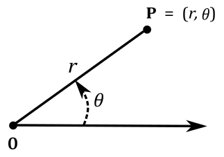
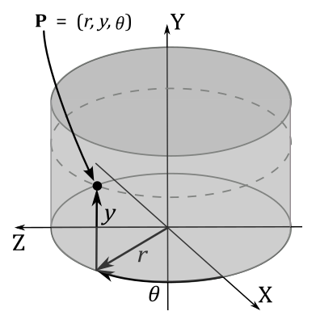
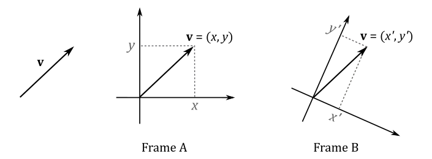
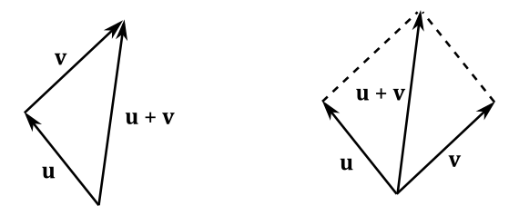

<br>

# 1 - Coordinate systems

A coordinate system, also called frame, is a fundamental concept in mathematics and geometry. It provides a way to uniquely determine a position in space by using one or more numbers called coordinates. <br>
To define a coordinate system, we need three key components: an origin, a unit of measurement, and a positive direction. The origin is a reference point from which all positions are measured. The unit of measurement determines the scale or size of each coordinate value. The positive direction indicates which way the coordinates increase from the origin. <br>
By using a coordinate system, we can bridge the gap between geometry and numerical problems. Geometrical problems involving positions, distances, angles, and shapes can be translated into numerical problems by assigning coordinates to the geometric elements. Similarly, numerical problems can be visualized and understood geometrically by mapping the numbers that represent points and other geometric entities onto a coordinate system.

<br>

## 1.1 - 1D Coordinate system

A 1D coordinate system is a simplified version of a coordinate system that operates along a single dimension, typically represented by a straight line or a curve. In a 1D coordinate system, we typically define an origin point as a reference point on the line. This origin point serves as the starting point from which positions are measured. We also must establish a unit of measurement, that determines the scale or increment used to quantify distances or positions along the line, and a potitive direction, that indicates the direction in which the values increase from the origin. In this type of coordinate system, we can determine a position $\mathbf{P}$ on a line (or a curve) with a single number (coordinate) $x$.

<br>


<br>

For example, $x=3$ specifies that the position $\mathbf{P}$ is $3$ units away from the origin $\mathbf{O}$ in the positive direction along the line illustrated above. That way, each point\position of the line is given a unique coordinate, and each real number is the coordinate of a unique point on the line. So, the coordinate of a point $\mathbf{P}$ is defined as the signed distance between the origin $\mathbf{O}$ and the point.

<br>

## 1.2 - Cartesian coordinate system

In the plane, two perpendicular lines (also called axes) are chosen, and the coordinates $(x, y)$ of a point $\mathbf{P}$ are taken to be the signed distances between the origin $\mathbf{O}$ and the projection of $\mathbf{P}$ onto the axes.

<br>


<br>

For example, the point $\mathbf{P}$ in the illustration above has coordinates $(2, 3)$ since its projection is two units away from $\mathbf{O}$ along the x-axis, and three units away from $\mathbf{O}$ along the y-axis.

In three dimensions, three mutually orthogonal axes are chosen and the three coordinates $(x, y, z)$ of a point are the signed distances between the origin $\mathbf{O}$ and the projection of the point onto the axes. For this purpose, if you want to project a point $\mathbf{P}$ onto the x-axis, you can first project the point perpendicularly onto the xz-plane, so that we are in 2D once again. Then, you can project the result onto the x-axis.<br>
You can also see the coordinates $(x, y, z)$ as a sequence of movements from the origin $\mathbf{O}$ to the point $\mathbf{P}=(x, y, z)$. That is, starting from the origin $\mathbf{O}$, you move $x$ units along the x-axis. Then, from that position, you move $y$ units parallel to the y-axis. Finally, you move $z$ units parallel to the z-axis, as shown in the following illustration.

<br>


<br>

Depending on the direction and order of the axes, a three-dimensional system may be a right-handed or a left-handed system.

<br>


<br>

Usually the y-axis points up, the x-axis points right while the z-axis points backward in a right-handed coordinate system (forward in a left-handed one). That’s not a strict rule, though. Sometimes, you can have the z-axis points up. In that case, the y-axis points forward in a right-handed (backward in a left-handed one). You can always switch from a y-up to a z-up configuration with a simple transformation, but there's no point in providing further details here as we will mostly use a y-up configuration. Apparently, it seems that right-handed coordinate systems are commonly used by Vulkan programmers, so we will follow this convention in this tutorial series as well. However, again, it is not a strict rule and left-handed coordinate systems can also be used.

<br>

## 1.3 - Polar coordinate system

In a two-dimensional plane, we can define a coordinate system known as polar coordinate system. This system is based on a reference point called origin or pole and a ray extending from the origin called polar axis. A point $\mathbf{P}$ can be specified by its polar coordinates $(r,\theta)$, where $r$ represents the distance from the origin to the point $\mathbf{P}$, and $\theta$ represents the angle between the polar axis and the line segment connecting the origin and $\mathbf{P}$. The distance $r$ from the origin to the point $\mathbf{P}$ is often referred to as the radius. The angle $\theta$ is generally expressed in degrees or radians, with $2\pi$ rad being equivalent to $360°$

<br>



<br>

## 1.4 - Cylindrical and spherical coordinate systems 

In three dimensions, we extend the polar coordinate system with an additional y-coordinate to specify the height of a point. That way, we can locate all the points of a cylinder. That’s why we call $(r, y, \theta)$ cylindrical coordinates.

<br>



<br>

Spherical coordinates use a similar approach by adding another angle $\varphi$ in place of the y-coordinate, resulting in a triple $(r, \varphi, \theta)$. This allows us to identify any point on a sphere. The following illustration shows how to convert between spherical and Cartesian coordinates. Note that the angle θ is measured from the upward direction. Observe that the angle $\theta$ is measured from the upward direction.

<br>


<br>

## 1.5 - Homogeneous coordinate system

In homogeneous coordinates, a point in the plane can be represented by a triple $(x, y, z)$. By dividing each coordinate by the z-coordinate, we can obtain the related Cartesian coordinates: $(x/z,\ y/z,\ z/z)$. This approach introduces an additional coordinate, as typically only two coordinates are used to specify a point on a plane. It's worth noting that after performing the division to obtain the Cartesian coordinates, the last coordinate will always be 1. This concept extends to three-dimensional spaces as well. Therefore, if we have the 3D Cartesian coordinates $(x, y, z)$, we can express them as $(x, y, z, 1)$. In general, a homogeneous coordinate system is a frame where only the ratios of the coordinates are significant, rather than their actual values.

<br>

<br>

# 2 - Vectors

Vectors are mathematical objects that represent quantities with both magnitude and direction. They are used in many fields, including physics and computer graphics. For example, vectors can be used to specify the position and displacement of objects in space, as well as their speed. They can also describe the direction and intensity of forces acting on objects or light rays emitted by a light source, as well as the surface normal.

<br>

## 2.1 - Definition

Geometrically, a vector can be visualized as an arrow. The length of the arrow represents the magnitude or size of the vector, while the direction in which the arrow points indicates the direction of the vector.

<br>


<br>
When working with vectors on a computer, the geometric definition provided above is not as important, although. Fortunately, we can express vectors numerically using tuples, which are finite sequences of numbers. To establish this numerical representation, we need to bind vectors to the origin of a Cartesian coordinate system. In other words, we translate a vector while maintaining its magnitude and direction until its starting point aligns with the origin.

<br>


<br>

At that point, we can use the coordinates $(x, y, z)$ of the head of a generic vector $\mathbf{v}$ in a 3D Cartesian system as the numerical representation of the vector in that system. That is, we can write $\mathbf{v}=(x, y, z)$, with x, y and z called components of the vector. Similarly, for a vector $\mathbf{v}$ in a 2D Cartesian system, the numerical representation would be $(x, y)$. Then, we can use $\mathbf{v}$ to specify a point in a frame (maybe to set the position of an object, or a target location for movement).

<br>


<br>

When only magnitude and direction of a vector matter, then the point of application is of no importance, and the vector is called free vector. On the other hand, a vector bound to the origin of a system is called bound vector. The numerical representation of a bound vector is only valid in the system where it is bound. If the same free vector is bound to different systems, its numerical representation will change accordingly.

<br>



<br>

This is an important point to remember: if you define a vector numerically, its coordinates are relative to a specific frame of reference. Therefore, we can conclude that two vectors $\mathbf{u}=(u_x, u_y, u_z)$ and $\mathbf{v}=(v_x, v_y, v_z)$ are equal only if $u_x=v_x$, $u_y=v_y$ and $u_z=v_z$. In other words, they have the same coordinates if bound to the origin of a frame.

<br>

## 2.2 - Basic operations

Numerically, the sum of two vectors $\mathbf{u}=(u_x, u_y, u_z)$ and $\mathbf{v}=(v_x, v_y, v_z)$ is defined as

<br>

$\mathbf{u}+\mathbf{v}=(u_x+v_x,\ u_y+v_y,\ u_z+v_z)$

<br>

The addition may be represented geometrically by placing the tail of the arrow representing $\mathbf{v}$ at the head of the arrow representing $\mathbf{u}$, and then drawing an arrow from the tail of $\mathbf{u}$ to the head of $\mathbf{v}$. This arrow represent a new vector as the sum of $\mathbf{u}$ and $\mathbf{v}$. Alternatively, we can bind $\mathbf{u}$ and $\mathbf{v}$ to a shared point and then draw the diagonal of the parallelogram with sides $\mathbf{u}$ and $\mathbf{v}$.

<br>



<br>

The difference between two vectors $\mathbf{u}$ and $\mathbf{v}$ is defined as

<br>

$\mathbf{u}-\mathbf{v}=(u_x-v_x,\ u_y-v_y,\ u_z-v_z)$

<br>

Geometrically, the vector subtraction can be defined by bounding $\mathbf{u}$ and $\mathbf{v}$ to a shared point and drawing an arrow from the head of $\mathbf{v}$ to the head of $\mathbf{u}$. Alternatively, it can be treated as a sum by placing the tail of the inverse of $\mathbf{v}$ at the head of $\mathbf{u}$. At that point, we can draw an arrow from the tail of $\mathbf{u}$ to the head of $-\mathbf{v}$. This arrow represent a new vector as the difference between $\mathbf{u}$ and $\mathbf{v}$. The inverse of a vector will be formally defined in the next section.

<br>


<br>

### 2.2.2 - Scalar multiplication

We can multiply a vector $\mathbf{v}=(x, y, z)$ by a real number $k$ called scalar. Numerically, this operation is defined as

<br>

$k\mathbf{v}=k(x,y,z)=(kx,ky,kz)$

<br>

Geometrically, this is equivalent to scaling a vector, which is why real numbers are often called scalars.. If $k$ is a negative, the resulting vector will aim in the opposite direction as well. In particular, if $k=−1$ we get the inverse $-\mathbf{v}$ of a vector $\mathbf{v}$, which aims in the opposite direction without changing its length.

<br>


<br>

#### 2.2.2.1 - Properties of addition and scalar multiplication

Here are some of the properties of vector addition and scalar multiplication:

|                         |                                                                                                                      |
| ----------------------- | -------------------------------------------------------------------------------------------------------------------- |
| Commutative (vector)    | $\mathbf{u}+\mathbf{v}=\mathbf{v}+\mathbf{u}$                                                                        |
| Associative (vector)    | $(\mathbf{u}+\mathbf{v})+\mathbf{w}=\mathbf{u}+(\mathbf{v}+\mathbf{w})$                                              |
| Additive Identity       | $\mathbf{v}+\mathbf{0}=\mathbf{v}$  (where $\mathbf{0}$ is the zero (or null) vector, whose components are all zero) |
| Distributive (vector)   | $k(\mathbf{u}+\mathbf{v})=k\mathbf{u}+k\mathbf{v}$                                                                   |
| Distributive (scalar)   | $(k+t)\mathbf{v}=k\mathbf{v}+t\mathbf{v}$                                                                            |
| Associative (scalar)    | $k(t\mathbf{v})=(kt)\mathbf{v}$                                                                                      |
| Multiplicative Identity | $1\mathbf{v}=\mathbf{v}$   (where $k=1$ is a scalar)                                                                 |

<br>

#### 2.2.2.2 - Length of a vector

Now we can define the length of a vector $\|v\|$ (or $\|\|v\|\|$) as a scalar value that represents the magnitude of the vector. Consider the following illustration.

<br>


<br>

We have that $a$ is the length of the projection of the vector $\mathbf{v}$ onto the xz-plane. From the Pythagorean theorem, $a=\sqrt{x^2+z^2}$. Applying the same theorem again, we have that

<br>

$\|\mathbf{v}\|=\sqrt{y^2+a^2}=\sqrt{y^2+(\sqrt{x^2+z^2})^2}=\sqrt{x^2+y^2+z^2}$

<br>

Sometimes, only the direction of a vector is relevant. In such cases, we can normalize the vector to ensure its length becomes 1. Usually, the symbol $\hat{\mathbf{v}}$ is used to indicate a unit vector (a vector with length 1). To normalize a vector $\mathbf{v}=(x, y, z)$ we can multiply it by the reciprocal of its magnitude.

<br>

$\displaystyle\hat{\mathbf{v}}=\frac{\mathbf{v}}{\|\mathbf{v}\|}=\left(\frac{x}{\|\mathbf{v}\|},\frac{y}{\|\mathbf{v}\|},\frac{z}{\|\mathbf{v}\|}\right)$

<br>

We can verify that $\hat{\mathbf{v}}$ is a unit vector by computing its length.

<br>

$\displaystyle\|\hat{\mathbf{v}}\|=\sqrt{\left(\frac{x}{\|\mathbf{v}\|}\right)^2+\left(\frac{y}{\|\mathbf{v}\|}\right)^2+\left(\frac{z}{\|\mathbf{v}\|}\right)^2}=\frac{\sqrt{x^2+y^2+z^2}}{\sqrt{\|\mathbf{v}\|^2}}=\frac{\|\mathbf{v}\|}{\|\mathbf{v}\|}=1$

<br>

Three significant unit vectors are: $\mathbf{i}=(1,0,0)$, $\mathbf{j}=(0,1,0)$ and $\mathbf{k}=(0,0,1)$. These vectors have unit lengths and are aligned with the x-, y-, and z-axes, respectively, in a 3D Cartesian coordinate system. They are commonly referred to as the standard basis vectors of a coordinate system.

<br>


<br>

### 2.2.3 - Dot product

The dot product is a form of vector multiplicatio that results in a scalar value. It is also known as the scalar product for this reason. The dot product of two vector $\mathbf{u}=(u_x, u_y, u_z)$ and $\mathbf{v}=(v_x, v_y, v_z)$ is defined as

<br>

$\mathbf{u}\cdot\mathbf{v}=u_xv_x+u_yv_y+u_zv_z$

<br>

So, the dot product of two vectors is obtained by summing the products of their corresponding components. Below are some of the properties of the dot product:

|                           |                                                                                                                                         |
| ------------------------- | --------------------------------------------------------------------------------------------------------------------------------------- |
| Commutative               | $\mathbf{u}\cdot\mathbf{v}=\mathbf{v}\cdot\mathbf{u}$                                                                                   |
| Distributive              | $(\mathbf{u}+\mathbf{v})\cdot\mathbf{w}=\mathbf{w}\cdot(\mathbf{u}+\mathbf{v})=(\mathbf{w}\cdot\mathbf{u})+(\mathbf{w}\cdot\mathbf{v})$ |
| Square of a vector length | $\|\mathbf{v}\|^2=v_x^2+v_y^2+v_z^2=\mathbf{v}\cdot\mathbf{v}$                                                                          |

<br>

The associative property doesn’t apply because $\mathbf{w}\cdot(\mathbf{u}\cdot\mathbf{v})$ is not defined. Indeed, the dot product is defined as an operation between two vectors, but $(\mathbf{u}\cdot\mathbf{v})$ yields a scalar value.

<br>

From the law of cosines $c^2=a^2+b^2-2ab\cos{\theta}$ (a proof is provided at the end of the section), we can show that

<br>

$$\begin{equation}\tag{1}\mathbf{v}\cdot\mathbf{u}=|\mathbf{v}| |\mathbf{u}|\cos{\theta}\end{equation}$$

<br>

Indeed, if we set $a=\|\mathbf{u}\|$, $b=\|\mathbf{v}\|$ and $c=\|\mathbf{u}-\mathbf{v}\|$ we have that

<br>

$$
\begin{align*} c^2 &= a^2 + b^2 - 2ab \cos{\theta} \\\ 
|\mathbf{u-v}|^2 &= |\mathbf{u}|^2 + |\mathbf{v}|^2 - 2|\mathbf{u}| |\mathbf{v}|\cos{\theta} \\\ 
(\mathbf{u} - \mathbf{v}) \cdot (\mathbf{u} - \mathbf{v}) &= \mathbf{u} \cdot \mathbf{u} + \mathbf{v} \cdot \mathbf{v} - 2|\mathbf{u}| |\mathbf{v}|\cos{\theta} \\\ 
\mathbf{u} \cdot\mathbf{u} -2(\mathbf{u} \cdot \mathbf{v}) + \mathbf{v} \cdot \mathbf{v} &= \mathbf{u} \cdot \mathbf{u} + \mathbf{v} \cdot \mathbf{v} - 2|\mathbf{u}| |\mathbf{v}|\cos{\theta} \\\
 \mathbf{u}\cdot \mathbf{v} &= |\mathbf{u}| |\mathbf{v}|\cos{\theta} \end{align*}
$$

<br>

From equation $(1)$ we can derive other properties. For example,

- If $(\mathbf{u}\cdot\mathbf{v}) = 0$ then the angle $\theta$ between $\mathbf{u}$ and $\mathbf{v}$ is $90°$ (that is, they are orthogonal: $\mathbf{u}\ \bot\ \mathbf{v}$)
- If $(\mathbf{u}\cdot\mathbf{v}) > 0$ then the angle $\theta$ between $\mathbf{u}$ and $\mathbf{v}$ is less than $90°$
- If $(\mathbf{u}\cdot\mathbf{v}) < 0$ then the angle $\theta$ between $\mathbf{u}$ and $\mathbf{v}$ is greater than $90°$

<br>

To conclude this section, we will prove the law of cosines $c^2=a^2+b^2-2ab\cos{\theta}$.

<br>

>Let $\mathbf{a}$ be the vector from $C$ to $B$, $\mathbf{b}$ the vector from $C$ to $A$, and $\mathbf{c}$ the vector from $A$ to $B$.
>
><br>
>
>
>
><br>
>
>We have that 
>
>$\mathbf{c}=\mathbf{a}-\mathbf{b}\quad$ (subtration of two vectors)
>
>Squaring both sides and simplifying
>
>$\|\mathbf{c}\|^2=\|\mathbf{a}-\mathbf{b}\|^2$
>
>$\|\mathbf{c}\|^2=(\mathbf{a}-\mathbf{b})\cdot (\mathbf{a}-\mathbf{b})\quad\quad\quad\quad\quad\quad\quad\quad$ (square of a vector length)
>
>$\|\mathbf{c}\|^2=\|\mathbf{a}\|^2+\|\mathbf{b}\|^2-2\ \mathbf{a}\cdot\mathbf{b}\quad\quad\quad\quad\quad\quad\quad$ (distributive law of the dot product)
>
>$\|\mathbf{c}\|^2=\|\mathbf{a}\|^2+\|\mathbf{b}\|^2-2\|\mathbf{a}\|\|\mathbf{b}\| \cos{\theta}\quad\quad\quad\quad$ (equation (1))

<br>

#### 2.2.3.1 - Orthogonal projection

The orthogonal projection of a vector $\mathbf{v}$ onto another vector $\mathbf{n}$ is defined as the vector $\text{proj}_\mathbf{n}(\mathbf{v})$. Consider the following illustration.

<br>


<br>

From trigonometry, we know that in a right triangle, the cosine of an angle is equal to the ratio of the length of the adjacent side to the length of the hypotenuse. Therefore, we can calculate the length of the adjacent side by multiplying the length of the hypotenuse by the cosine of the angle between the adjacent side and the hypotenuse. Considering the illustration above, we have that $\|\text{adj}\|=\|\text{proj}_\mathbf{n}(\mathbf{v})\|$ and $\|\text{hyp}\|=\|\mathbf{v}\|$. So, if $\mathbf{n}$ is a unit vector, then we can write

<br>

$\text{proj}_\mathbf{n}(\mathbf{v})=(\|\mathbf{v}\|\cos{\theta})\mathbf{n}=(\|\mathbf{v}\|1\cos{\theta})\mathbf{n}=(\|\mathbf{v}\|\|\mathbf{n}\|\cos{\theta})\mathbf{n}=(\mathbf{v}\cdot\mathbf{n})\mathbf{n}$

<br>

with $(\mathbf{v}\cdot\mathbf{n})$ signed length of the projection, and $\mathbf{n}$ that indicates its direction. This means that $(\mathbf{v}\cdot\mathbf{n})$ can invert the direction of projection if $\theta > 90°$. Anyway, this gives us a geometrical interpretation of the dot product, at least if $\mathbf{n}$ is a unit vector. If that's not the case, we can always normalize $\mathbf{n}$ to make it unit length. Then, we can replace $\mathbf{n}$ with its normalized version $\mathbf{n}/\|\mathbf{n}\|$, giving us the more general formula

<br>

$\text{proj}_\mathbf{n}(\mathbf{v})=\left(\mathbf{v}\cdot\displaystyle\frac{\mathbf{n}}{\|\mathbf{n}\|}\right)\displaystyle\frac{\mathbf{n}}{\|\mathbf{n}\|}=\displaystyle\frac{(\mathbf{v}\cdot\mathbf{n})}{\|\mathbf{n}\|^2}\mathbf{n}$

<br>

Thanks to the concept of orthogonal projection, we can express any bound vector $\mathbf{v}$ as the sum of its projections onto the standard basis vectors.

<br>

$\mathbf{v}=(\mathbf{v}\cdot\mathbf{i})\mathbf{i}+(\mathbf{v}\cdot\mathbf{j})\mathbf{j}+(\mathbf{v}\cdot\mathbf{k})\mathbf{k}=x\mathbf{i}+y\mathbf{j}+z\mathbf{k}=x(1, 0, 0)+y(0, 1, 0)+z(0, 0, 1)=(x, y, z)$

<br>

Indeed, we have

<br>

$(\mathbf{v}\cdot\mathbf{i})=(x, y, z)\cdot(1, 0, 0)=x$ <br>
$(\mathbf{v}\cdot\mathbf{j})=(x, y, z)\cdot(0, 1, 0)=y$ <br>
$(\mathbf{v}\cdot\mathbf{k})=(x, y, z)\cdot(0, 0, 1)=z$

<br>

Also, note that $(x\mathbf{i}+z\mathbf{k})$ is the projection of $\mathbf{v}$ onto the xz-plane, so that we can sum this projection with $y\mathbf{j}$ to get $\mathbf{v}$.

<br>


<br>

You can also see it as a sum of scaled vectors: we scale $\mathbf{i}$, $\mathbf{j}$ and $\mathbf{k}$ with the corresponding components of $\mathbf{v}$. Indeed, the diagonal of the parallelogram defined by $x\mathbf{i}$ and $z\mathbf{k}$ is $(x\mathbf{i}+z\mathbf{k})$. Then, $\mathbf{v}$ is the diagonal of the parallelogram defined by $(x\mathbf{i}+z\mathbf{k})$ and $y\mathbf{j}$, that is $\ x\mathbf{i}+z\mathbf{k}+y\mathbf{j}$.<br>
Remember that you can also see it as a sequence of three translations: starting from the origin of the frame, we move $x$ units along the x-axis. Then, from that position, we move $y$ units in the y-axis direction, and finally, you move $z$ units in the z-axis direction. This is why we refer to $\mathbf{i}$, $\mathbf{j}$, and $\mathbf{k}$ as basis vectors: any bound vector in a frame can be expressed as a combination of these three unit vectors, with the components of the vector acting as coefficients.<br>
As stated earlier, the components of a bound vector represent the coordinates of its arrowhead within the frame. This allows us to uniquely identify all points within a frame using vectors. However, we still need a way to distinguish between vectors and points, as they are not interchangeable. For vectors, only their direction and magnitude matter, making the point of application irrelevant. On the other hand, points uniquely represent a location and only make sense when bound to the origin of a frame. Subtracting points yields a vector that specifies the movement from one point to another, while adding a point and a vector gives a vector that specifies how to move a point to a different location. However, unlike vectors, adding two points does not have a meaningful interpretation - geometrically it's the diagonal of a parallelogram, but this interpretation is not particularly useful or relevant when working with points. <br>
In summary, consider vectors as free vectors and points as bound vectors. When working with a generic vector $\mathbf{v}=(x, y, z)$, it is crucial to determine whether it represents a point or a vector to use it appropriately. The distinction between points and vectors will be further explored in a later tutorial.

<br>

#### 2.2.3.2 - Gram-Schmidt Orthogonalization

A computer cannot exactly represent all the elements in the infinite set of real numbers because it uses a finite number of bits to store values in memory. This means we have to settle for a good approximation. The downside is that, if you need to perform many calculations with approximate values, the outcome could differ significantly from the exact result. For example, a set of vectors $\\{\mathbf{v_0},\dots,\mathbf{v_{n-1}}\\}$ is called orthonormal if they are all unit vectors and orthogonal to each other. However, due to numerical precision issues, we might start off with an orthonormal set that gradually becomes un-orthonormal after some calculations. Fortunately, there are methods available to orthogonalize a set of vectors to restore its orthonormality. While our primary focus will be on the 3D case, it is often helpful to start by examining the simpler 2D case.

Suppose we have an initial set of vectors $\{\mathbf{v_0},\mathbf{v_1}\}$ that is not orthonormal, and we want to orthogonalize it to obtain an orthonormal set $\{\mathbf{w_0},\mathbf{w_1}\}$. To begin the orthogonalization process, we can set $\mathbf{w_0}=\mathbf{v_0}$, as we can always assume one of the vectors in the set is already acceptable. Next, we aim to make $\mathbf{v_1}$ orthogonal to $\mathbf{w_0}$. This can be achieved by subtracting from $\mathbf{v_1}$ its projection onto $\mathbf{w_0}$. By doing so, we obtain a new vector $\mathbf{w_1}$ that is orthogonal to $\mathbf{w_0}$. Indeed, in the following illustration you can verify that

<br>

$\mathbf{v_1}=\mathbf{w_1}+\text{proj}_{\mathbf{w_0}}(\mathbf{v_1})$

<br>


<br>

So, we have that

<br>

$\mathbf{w_1}=\mathbf{v_1}-\text{proj}_{\mathbf{w_0}}(\mathbf{v_1})$

<br>

where $\ \text{proj}_{\mathbf{w_0}}(\mathbf{v_1})=\displaystyle\frac{\mathbf{v_1}\cdot\mathbf{w_0}}{\|\mathbf{w_0}\|^2}\mathbf{w_0}$

<br>

To prove that $\mathbf{w_0}$ and $\mathbf{w_1}$ are orthogonal to each other, we can first observe that a projection is orthogonal if the direction of projection forms a right angle $(90°)$ with the vector we project onto (see the dashed line in the illustration above). Also, we know that the sum of two vectors is the diagonal of the parallelogram with sides the two vectors. In this case we obtain a rectangle since we just established that an angle of the parallelogram with diagonal $v_1$ is $90°$. So, we verified that $\mathbf{w_0}$ and $\mathbf{w_1}$ are orthogonal: $\mathbf{w_0}\ \bot\ \mathbf{w_1}$.


In the 3D case, we introduce a third vector $\mathbf{v_2}$ that we need to modify in order to make it orthogonal to both $\mathbf{w_0}$ and $\mathbf{w_1}$. As before, we start by setting $\mathbf{w_0}=\mathbf{v_0}$, and we can still use the method of subtracting the projection of $\mathbf{v_1}$ onto $\mathbf{w_0}$ to compute $\mathbf{w_1}$. This is possible because we can consider $\mathbf{v_0}$ and $\mathbf{v_1}$ as lying in the same plane, thereby reducing the problem to the 2D case. <br>
To calculate $\mathbf{w_2}$, we proceed similarly. We subtract the projection of $\mathbf{v_2}$ onto $\mathbf{w_0}$ from $\mathbf{v_2}$, obtaining an intermediate vector. Then, we can subtract the projection of $\mathbf{v_2}$ onto $\mathbf{w_1}$ from this intermediate vector. By doing this, we ensure that the resultant vector $\mathbf{w_2}$ is orthogonal to both $\mathbf{w_0}$ and $\mathbf{w_1}$.

<br>

$\mathbf{w_2}=\mathbf{v_2}-\text{proj}_{\mathbf{w_0}}(\mathbf{v_2}) -\text{proj}\_{\mathbf{w_1}}(\mathbf{v_2})$

<br>

Consider the following illustration. If we subtract $\text{proj}\_{\mathbf{w_0}}(\mathbf{v_2})$ from $\mathbf{v_2}$ the resultant vector is orthogonal to $\mathbf{w_0}$ and lies in the YZ-plane. Then, if we subtract $\text{proj}\_{\mathbf{w_1}}(\mathbf{v_2})$ from this intermediate vector, we get $\mathbf{w_2}$, which is orthogonal to both $\mathbf{w_0}$ and $\mathbf{w_1}$.

<br>


<br>

The final step in the process of orthogonalization is to normalize the vectors $\mathbf{w_0}$, $\mathbf{w_1}$, and $\mathbf{w_2}$ to obtain an orthonormal set.

<br>

### 2.2.4 - Cross product

This type of multiplication is also called vector product as the result is a vector (unlike the dot product which evaluates to a scalar). The cross product is defined as

<br>

$\mathbf{w}=\mathbf{u}\times\mathbf{v}=(u_y v_z-u_z v_y,\ u_z v_x-u_x v_z,\ u_x v_y-u_y v_x)$

<br>

A way to remember this formula is to notice that the first component of the vector $\mathbf{w}$ is missing the subscript $x$, the second component is missing the subscript $y$, and the third component is missing the subscript $z$. Also, we use the subscripts $\\{x,y,z\\}$ as a circular sequence. For example, in the first component of $\mathbf{w}$ we exclude the subscript $x$, so we start with $y$ and $z$ in the minuend, inverting the subscripts in the subtrahend. In the second component we exclude the subscript $y$, so we start with $z$ and $x$ in the minuend, inverting the subscripts in the subtrahend. You can easily conclude that the third component starts with $x$, followed by $y$.

<br>

>We can also use matrices to calculate the cross product. For example, the cross product $\mathbf{u}\times\mathbf{v}$ is equal to the determinant of the $3\times 3$ matrix with $\mathbf{i}$, $\mathbf{j}$ and $\mathbf{k}$ as elements of the first row, and the components of the two vectors $\mathbf{u}$ and $\mathbf{v}$ as elements of the other two rows.
>
><br>
>
>$\mathbf{w}=\mathbf{u}\times\mathbf{v}=\left\lvert\matrix{\mathbf{i} & \mathbf{j} & \mathbf{k} \cr u_x & u_y & u_z \cr v_x & v_y & v_z}\right\rvert=$<br><br>
$(u_y v_z-u_z v_y)\mathbf{i}-(u_x v_z-u_z v_x)\mathbf{j}+(u_x v_y-u_y v_x)\mathbf{k}=$<br><br>
$(u_y v_z-u_z v_y,\ u_z v_x-u_x v_z,\ u_x v_y-u_y v_x)$
>
><br>
>
>Also, the cross product can be computed multiplying a matrix by a column.
>
><br>
>
>$\mathbf{w}=\mathbf{u}\times\mathbf{v}=\left\lbrack\matrix{0&-u_z&u_y \cr u_z&0&-u_x \cr -u_y&u_x&0}\right\rbrack\left\lbrack\matrix{v_x\cr v_y\cr v_z}\right\rbrack=$<br><br>
$(u_yv_z-u_zv_y,\ u_zv_x-u_xv_z,\ u_xv_y-u_yv_x)$

<br>

We will cover matrices in the next appendix, where we will show that the determinant of a matrix is related to the concept of hypervolume (that is, length in 1D, area in 2D, and volume in 3D). However, in this section we can use the information provided in the box above to find something interesting. We know that two vectors always lie in a plane, and that to calculate the area of a parallelogram we multiply its base times the height. Then, we are supposed to find a similar formula for the cross product because, to compute it, we can use the determinant of a matrix, which is related to the concept of hypervolume. Indeed, we can also write the cross product as follows

<br>

$\mathbf{w}=\mathbf{u}\times\mathbf{v}=\mathbf{n}\|\mathbf{u}\|\|\mathbf{v}\|\sin{\theta}$

<br>

with $\mathbf{n}$ unit vector indicating the direction of $\mathbf{w}$, and with $\|\mathbf{u}\|\|\mathbf{v}\|\sin{\theta}$ indicating the length of $\mathbf{w}$. The vector $\mathbf{n}$ is often called normal, which means it is orthogonal to the plane it refers to (in this case, the plane defined by $\mathbf{u}$ and $\mathbf{v}$). Now, we need to find a connection between the above formula and the area $A_p$ of the parallelogram with sides $\mathbf{u}$ and $\mathbf{v}$. Consider the following illustration.

<br>


<br>

We know that $A_p=b\times h$, so we should have something like

<br>

$A_p=\|\mathbf{w}\|=\|\mathbf{u}\times\mathbf{v}\|=\|\mathbf{u}\|\|\mathbf{v}\|\sin{\theta}$

<br>

since $\|\mathbf{n}\|=1$ and the area of a parallelogram is a scalar value, so that we must consider the length of the cross product. As you can see in the illustration above, we have $\|\mathbf{v}\|=b$ and $\|\mathbf{u}\|\sin{\theta}=h$. So, it’s $A_p=\|\mathbf{w}\|=\|\mathbf{u}\times\mathbf{v}\|$ as expected. We just found a geometric representation of the length of the cross product.

As just stated above, the vector $\mathbf{n}$ is orthogonal to the plane defined by $\mathbf{u}$ and $\mathbf{v}$. So, the resultant vector $\mathbf{w}$ of the cross product is orthogonal to both $\mathbf{u}$ and $\mathbf{v}$ as well. Ok, but we have two sides that $\mathbf{w}$ could aim at. Which side is the right one? In right-handed systems, it’s the one that makes $\mathbf{u}$, $\mathbf{v}$ and $\mathbf{w}$ a right-handed system. While we don't have a formal definition yet to establish if a set of three vector system is right-handed system, you can still identify the correct side.This is the side where $\mathbf{w}$ "sees" the first operand (in this case $\mathbf{u}$) rotate counter-clockwise toward the second operand $(\mathbf{v})$ with an angle of rotation $θ$ between $0$ and $\pi$. Alternatively, you can also use your right hand: align your fingers with the direction of $\mathbf{u}$, curl them towards $\mathbf{v}$, and your thumb will point in the direction of $\mathbf{w}$.; this is called the right-hand-thumb rule. <br>
In left-handed systems, the correct side is the one that makes $\mathbf{u}$, $\mathbf{v}$ and $\mathbf{w}$ a left-handed system.

<br>


<br>

The commutative property doesn’t apply $(\mathbf{u}\times\mathbf{v}\ne\mathbf{v}\times\mathbf{u})$ as if you swap the vectors $\mathbf{u}$ and $\mathbf{v}$ the direction of $\mathbf{w}$ changes as well (you can check it with the right-hand-thumb rule). However, you can easily verify that the following equivalence is true.

<br>

$\mathbf{u}\times\mathbf{v}=-(\mathbf{v}\times\mathbf{u})$

<br>

And we also have that

<br>

$\mathbf{i}\times\mathbf{j}=\mathbf{k}$<br>
$\mathbf{j}\times\mathbf{k}=\mathbf{i}$<br>
$\mathbf{k}\times\mathbf{i}=\mathbf{j}$<br>

$\mathbf{j}\times\mathbf{i}=\mathbf{-k}$<br>
$\mathbf{k}\times\mathbf{j}=\mathbf{-i}$<br>
$\mathbf{i}\times\mathbf{k}=\mathbf{-j}$<br>

$\mathbf{i}\times\mathbf{i}=\mathbf{0}$<br>
$\mathbf{j}\times\mathbf{j}=\mathbf{0}$<br>
$\mathbf{k}\times\mathbf{k}=\mathbf{0}$<br>

<br>

A way to remember the above equivalences is to consider the unit vectors $\\{\mathbf{i},\mathbf{j},\mathbf{k}\\}$ as a circular sequence. If you cross multiply a vector by the next one, you get the third vector with a positive sign. Otherwise, you get a negative sign. Observe that if you cross multiply a vector by itself the result is the zero vector as you can’t build a parallelogram with two equal vectors: you get a segment, so the area is zero.

<br>

### 2.2.5 - Scalar and vector triple product

The scalar triple product is nothing really new, as it simply combines the dot product and the cross product. It is defined as:

<br>

$V=\mathbf{u}\cdot(\mathbf{v}\times\mathbf{w})$

<br>

where $V$ represents the volume of the parallelepiped formed by the bound vectors $\mathbf{u}$, $\mathbf{v}$, and $\mathbf{w}$. Consider the following illustration.

<br>


<br>

As you know, the length of the cross product is the area of a parallelogram. Also, the volume of a parallelepiped is $V=b\times h$. Therefore, in order to compute the volume of the parallelepiped illustrated above, we can to write

<br>

$V=\|\mathbf{u}\| \|\mathbf{v}\times\mathbf{w}\|\cos{\theta}$

<br>

with $\|\mathbf{v}\times\mathbf{w}\|=b$ and $\|\mathbf{u}\|\cos{\theta}=h$.<br>
From equation $(1)$ we can also write it as

<br>

$V=\mathbf{u}\cdot (\mathbf{v}\times\mathbf{w})$

<br>

which is the scalar triple product. If you expand it you have

<br>

$\mathbf{u}\cdot(\mathbf{v}\times\mathbf{w})=\mathbf{u}\cdot(v_yw_z-v_zw_y, v_zw_x-v_xw_z, v_xw_y-v_yw_x)=$


$u_x v_y w_z - u_x v_z w_y + u_y v_z w_x - u_y v_x w_z + u_z v_x w_y - u_z v_y w_x$

<br>

which is exactly the determinant of the $3\times 3$ matrix with $\mathbf{u}$, $\mathbf{v}$ and $\mathbf{w}$ as columns, or rows. The upcoming appendix on matrices will provide further details of this result and illustrate how the scalar triple product can be used to determine if a set of three vectors forms a right-handed system. In brief, if the triple scalar product of three bound vectors defined in a right-handed system is positive, then they form a right-hand system.

We conclude this section pointing out that a vector triple product $\mathbf{a}\times(\mathbf{b}\times \mathbf{c})$ also exists. However, we will only demonstrate the following identity, called the BAC-CAB identity.

<br>

$\mathbf{a}\times(\mathbf{b}\times\mathbf{c})=\mathbf{b}(\mathbf{a}\cdot\mathbf{c})-\mathbf{c}(\mathbf{a}\cdot\mathbf{b})$

<br>

>$\mathbf{a}\times (\mathbf{b}\times\mathbf{c})=(a_x, a_y, a_z)\times [(b_x, b_y, b_z)\times (c_x, c_y, c_z)]=$
>
>$(a_x,\, a_y,\, a_z)\times (b_yc_z-b_zc_y,\; b_zc_x-b_xc_z,\; b_xc_y-b_yc_x)=$
>
>$\big({\color{#FF6666}{a_y (b_xc_y-b_yc_x)-a_z (b_zc_x-b_xc_z)}},\ {\color{#44FF66}{a_z (b_yc_z-b_zc_y)-a_x\ (b_xc_y-b_yc_x)}},\ {\color{#44AAFF}{a_x (b_zc_x-b_xc_z)-a_y(b_yc_z-b_zc_y)}}\big)$
>
><br>
>
>Below we can see that the first component of $\mathbf{b}(\mathbf{a}\cdot\mathbf{c})-\mathbf{c}(\mathbf{a}\cdot\mathbf{b})$ is equivalent to the first component of $\mathbf{a}\times(\mathbf{b}\times\mathbf{c})$
>
><br>
>
>$(\mathbf{b}(\mathbf{a}\cdot\mathbf{c})-\mathbf{c}(\mathbf{a}\cdot\mathbf{b}))_x = b_x (a_xc_x+a_yc_y+a_zc_z)-c_x (a_xb_x+a_yb_y+a_zb_z)=$
>
>$a_xb_xc_x+a_yb_xc_y+a_zb_xc_z-a_xb_xc_x-a_yb_yc_x-a_zb_zc_x=$
>
>${\color{#FF6666}{a_y (b_xc_y-b_yc_x)-a_z (b_zc_x-b_xc_z)}}$
>
><br>
>
>The same applies to the other two components.

<br>

<br>

# 3 - Vectors in Vulkan

Vectors play a crucial role in computer graphics, making them a fundamental tool to use in Vulkan as well. They are widely used in both C++ (within the application code) and in GLSL (within shader code).

In GLSL, vectors of two, three and four floating-point components are represented by the built-in types **vec2**, **vec3** and **vec4**, respectively. For vectors of signed integers, we use **ivec2**, **ivec3** and **ivec4** - the unsigned version can be specified by replacing the prefix **i** with **u**. <br>
The components of a vector can be accessed using array subscripting syntax to provide numeric indexing. Alternatively, one of the following naming sets can be used:

 The position set:  $\ x,y,z,w$ <br>
 The color set: $\ r,g,b,a$ <br>
 The texel set: $\ s,t,p,q$

Specifying one or more vector components is called swizzling. For example:

<br>

```glsl
ivec2 a = ivec2(1, 2);            // init using vector constructor
uvec3 b = { 1, 2, 3 };            // init using an initializer-list
uvec4 c = uvec4(b, 4);            // init using the component of another vector
vec4 d = vec4(c);                 // makes a vec4 with component-wise conversion (uint to float)

vec4 e = { 1.0, 2.0, 3.0, 0.0 };  // 1.0 means 1.0f (f suffix is implicit for floats)
float f0 = e.x;                   // f0 = 1.0f
float f1 = e.g;                   // f1 = 2.0f
float f2 = e[2];                  // f2 = 3.0f
e.a = 4.0f;                       // e = (1.0f, 2.0f, 3.0f, 4.0f)
 
vec4 f = { 1.0f, 2.0f, 3.0f, 4.0f };
vec3 g = f.xyz;                      // g = (1.0f, 2.0f, 3.0f)
vec2 h = f.rb;                       // h = (1.0f, 3.0f)
vec4 m = f.zzxy;                     // m = (3.0f, 3.0f, 1.0f, 2.0f)
m.wxyz = m;                          // m = (3.0f, 1.0f, 2.0f, 3.0f)
m.yw = g.zz;                         // m = (3.0f, 3.0f, 2.0f, 3.0f)
 
vec4 w = vec4(g, 5.0);               // w = (1.0f, 2.0f, 3.0f, 5.0f)

```
<br>

Using vectors in C++ is not as straightforward as in GLSL because there are no built-in types available. Indeed, while the header files provided by the Khronos Group include the graphical functionalities described in the Vulkan specification, they do not include the implementation of mathematical entities such as vectors. Therefore, we have to make a choice between implementing a mathematical library from scratch or using an existing and well-established one. Implementing such a library correctly is not a straightforward task, so we will rely on a proven library like GLM (OpenGL Mathematics), which is a header only C++ mathematics library for graphics software based on the OpenGL Shading Language (GLSL) specifications. However, as stated at the beginning of this tutorial series, I will not assume that the reader has any previous knowledge of computer graphics. Therefore, we will analyze the code of the structures and methods implemented in GLM to explain their theoretical foundations. <br>
GLM provides the following types, which allow us to use integer or floating-point vectors.

<br>

```cpp
typedef vec<1, float, defaultp>  vec1;
typedef vec<2, float, defaultp>  vec2;
typedef vec<3, float, defaultp>  vec3;
typedef vec<4, float, defaultp>  vec4;

typedef vec<1, int, defaultp>  ivec1;
typedef vec<2, int, defaultp>  ivec2;
typedef vec<3, int, defaultp>  ivec3;
typedef vec<4, int, defaultp>  ivec4;

typedef vec<1, uint, defaultp>	uvec1;
typedef vec<2, uint, defaultp>	uvec2;
typedef vec<3, uint, defaultp>	uvec3;
typedef vec<4, uint, defaultp>	uvec4;

// Similar structures are provided for vectors of one, two and three components
template<typename T, qualifier Q>
struct vec<4, T, Q>
{

    // ...


    // -- Data --

    union { T x, r, s; };
    union { T y, g, t; };
    union { T z, b, p; };
    union { T w, a, q; };

    // ...

}
```
<br>

Refer to the complete source code to see how conversions and constructors are implemented to mimic the GLSL behaviour. This approach will allow you to understand the practical implementation details without necessarily consulting the GLSL specification directly. For example,
the following explicit conversion means that we can construct a **vec4** from four components of different types, both in C++ and GLSL.

<br>

GLM
```cpp
/// Explicit conversions (From section 5.4.1 Conversion and scalar constructors of GLSL 1.30.08 specification)
template<typename X, typename Y, typename Z, typename W>
GLM_FUNC_DECL GLM_CONSTEXPR vec(X _x, Y _y, Z _z, W _w);


template<typename T, qualifier Q>
template<typename X, typename Y, typename Z, typename W>
GLM_FUNC_QUALIFIER GLM_CONSTEXPR vec<4, T, Q>::vec(X _x, Y _y, Z _z, W _w)
    : x(static_cast<T>(_x))
    , y(static_cast<T>(_y))
    , z(static_cast<T>(_z))
    , w(static_cast<T>(_w))
{}
```

C++
```cpp
// vec4 built from a signed int, a float, a double and a unsigned int; no suffix defined for doubles in C++
glm::vec4 a(-1, 2.0f, 3.0, 4u); // a = (1.0f, 2.0f, 3.0f, 4.0f)
```

GLSL
```glsl
// vec4 built from a signed int, a float, a double and a unsigned int
vec4 a = vec4(-1, 2.0, 3.0lf, 4u); // doubles in GLSL need lf suffix (f for floats is implicit)
```
<br>

Obviously, all the basic vector operations discussed in this tutorial (sum, difference and various types of multiplication) are both defined in GLSL and implemented GLM, along with other geometric functions that can be performed on vectors such as normalization, length\magnitude calculation, reflection and many more. For example, the sum of two **vec3** in GLM is defined exactly as per the definition (sum of the corresponding components).

<br>

```cpp
template<typename U>
GLM_FUNC_DECL GLM_CONSTEXPR vec<3, T, Q> & operator+=(vec<3, U, Q> const& v);

// 
template<typename T, qualifier Q>
template<typename U>
GLM_FUNC_QUALIFIER GLM_CONSTEXPR vec<3, T, Q> & vec<3, T, Q>::operator+=(vec<3, U, Q> const& v)
{
    this->x += static_cast<T>(v.x);
    this->y += static_cast<T>(v.y);
    this->z += static_cast<T>(v.z);
    return *this;
}
```
<br>

Similarly, you can verify that the normalization and the length of a vector $\mathbf{v}$ are defined as per the definition. From the properties of the dot product, we have that $\mathbf{v}\cdot\mathbf{v}=v_x^2+v_y^2+v_z^2$. As a result, we can present the pseudocode for these two operations as follow.

```
norm(v) = v * inversesqrt(dot(v, v));
```

```
length(v) = sqrt(dot(v, v));
```

Refer to the GLM code to verify that they are actually implemented this way. <br>
In a later appendix, we will discuss other geometric functions that operate on vectors, such as reflection and projection.

<br>

<br>

Source code: [LearnVulkan](https://github.com/PAMinerva/LearnVulkan)

<br>

# References

[1] Practical Linear Algebra: A Geometry Toolbox (Farin, Hansford) <br>

<br>

***
If you found the content of this tutorial somewhat useful or interesting, please consider supporting this project by clicking on the **Sponsor** button.  Whether a small tip, a one time donation, or a recurring payment, it's all welcome! Thank you!<br><br>
<p align="center">
 <a href="https://github.com/sponsors/PAMinerva">
         
      </a>
</p><br>