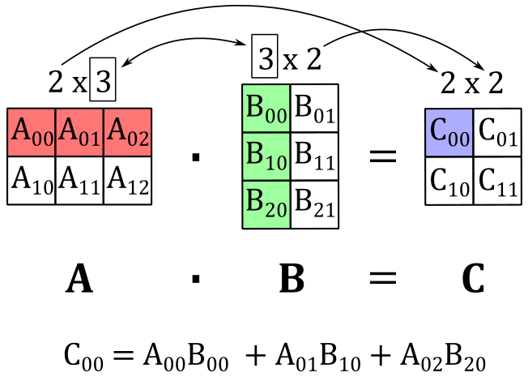
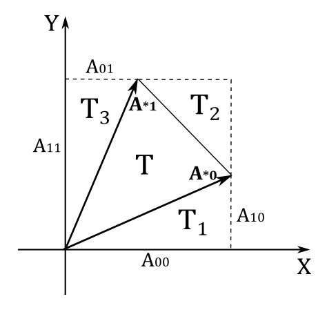

<br>

# 1 - Introduction

Matrices are mathematical objects associated with functions. This means that a matrix can represent a transformation we can use to manipulate the coordinates of points and vectors, allowing us to change the position, orientation, or size of 3D objects within a rendering scene.

<br>

<br>

# 2 - Definition

Basically, a matrix is just a rectangular table of real numbers arranged in rows and columns.<br>
The dimensions of a matrix are determined by the number of its rows and columns. For instance, an $m\times n$ matrix consists of $m$ rows and $n$ columns. The individual numbers within a matrix are referred to as elements or entries. To indicate a specific entry within a matrix $\mathbf{M}$, a double subscript notation, such as $M_{ij}$, is often used to specify the element located in the i-th row and j-th column. Matrices are conventionally denoted using square brackets.

<br>

$\mathbf{M}=\left\lbrack\matrix{M_{00}&M_{01}&\cdots&M_{0(n-1)} \cr M_{10}&M_{11}&\cdots&M_{1(n-1)} \cr \vdots&\vdots&\ddots&\vdots \cr M_{(m-1)1}&\cdots&M_{(m-1)0}&M_{0(n-1)}}\right\rbrack$

<br>

In computer graphics, it is common to work with square matrices $n\times n$, where the number of rows and columns are equal. Row and column vectors, which are matrices with dimensions of $1\times n$ and $n\times 1$ respectively, are also widely used. When it comes to row and column vectors, a different naming convention is typically used: lowercase letters are used instead of uppercase ones. This is because these vectors can be used as operands in certain vector operations.

<br>

$\mathbf{u}=\left\lbrack\matrix{u_0&u_1&\cdots&u_{n-1}}\right\rbrack\quad\quad\quad\quad\mathbf{v}=\left\lbrack\matrix{v_0 \cr v_1 \cr \vdots \cr v_{n-1}}\right\rbrack$

<br>

We can also use them to specify the rows or columns of a matrix. For example, we can write the following $3\times 3$ matrix $\mathbf{M}$ with 3 row vectors, or 3 column vectors.

<br>

$\mathbf{M}=\left\lbrack\matrix{M_{00}&M_{01}&M_{02}\cr M_{10}&M_{11}&M_{12}\cr M_{20}&M_{21}&M_{22}}\right\rbrack=\left\lbrack\matrix{\gets&\mathbf{u}_0&\rightarrow\cr \gets&\mathbf{u}_1&\rightarrow\cr \gets&\mathbf{u}_2&\rightarrow}\right\rbrack=\left\lbrack\matrix{\uparrow&\uparrow&\uparrow\cr \mathbf{v}_0&\mathbf{v}_1&\mathbf{v}_2\cr \downarrow&\downarrow&\downarrow}\right\rbrack$

<br>

where $\mathbf{u_i}=\left\lbrack\matrix{M_{i0}&M_{i1}&M_{i2}}\right\rbrack$, $\ \mathbf{v_i}=\left\lbrack\matrix{M_{0i}&M_{1i}&M_{2i}}\right\rbrack$ and $0\le i<3$.

<br>

<br>

# 3 - Basic matrix operations

There are several interesting operations that can be performed with matrices, including addition, subtraction, and two different types of multiplication.

<br>

## 3.1 - Addition

The addition of two matrices $\mathbf{A}$ and $\mathbf{B}$ can only be performed if the matrices have the same dimensions. If this condition is met, the corresponding elements of the matrices are added together.

<br>

$\mathbf{A}+\mathbf{B}=\left\lbrack\matrix{A_{00}&A_{01}&A_{02}\cr A_{10}&A_{11}&A_{12}\cr A_{20}&A_{21}&A_{22}}\right\rbrack+\left\lbrack\matrix{B_{00}&B_{01}&B_{02}\cr B_{10}&B_{11}&B_{12}\cr B_{20}&B_{21}&B_{22}}\right\rbrack=\left\lbrack\matrix{A_{00}+B_{00}&A_{01}+B_{01}&A_{02}+B_{02}\cr A_{10}+B_{10}&A_{11}+B_{11}&A_{12}+B_{12}\cr A_{20}+B_{20}&A_{21}+B_{21}&A_{22}+B_{22}}\right\rbrack$

<br>

The difference of two matrices is defined in a similar way.

<br>

$\mathbf{A}-\mathbf{B}=\left\lbrack\matrix{A_{00}&A_{01}&A_{02}\cr A_{10}&A_{11}&A_{12}\cr A_{20}&A_{21}&A_{22}}\right\rbrack-\left\lbrack\matrix{B_{00}&B_{01}&B_{02}\cr B_{10}&B_{11}&B_{12}\cr B_{20}&B_{21}&B_{22}}\right\rbrack=\left\lbrack\matrix{A_{00}-B_{00}&A_{01}-B_{01}&A_{02}-B_{02}\cr A_{10}-B_{10}&A_{11}-B_{11}&A_{12}-B_{12}\cr A_{20}-B_{20}&A_{21}-B_{21}&A_{22}-B_{22}}\right\rbrack$

<br>

## 3.2 Scalar multiplication

We can multiply a matrix $\mathbf{M}$ with a scalar $k$ by scaling the elements of the matrix.

<br>

$k\mathbf{M}=\left\lbrack\matrix{kM_{00}&kM_{01}&kM_{02}\cr kM_{10}&kM_{11}&kM_{12}\cr kM_{20}&kM_{21}&kM_{22}}\right\rbrack$

<br>

### 3.2.1 - Properties of addition and scalar multiplications

Since addition and scalar multiplication are performed element-wise on matrices, they inherit the following properties from real numbers:

|                       |                                                                         |
| --------------------- | ----------------------------------------------------------------------- |
| Commutative           | $\mathbf{A}+\mathbf{B} = \mathbf{B}+\mathbf{A}$                         |
| Associative           | $(\mathbf{A}+\mathbf{B})+\mathbf{C}=\mathbf{A}+(\mathbf{B}+\mathbf{C})$ |
| Distributive (scalar) | $(k+t)\mathbf{A} = k\mathbf{A}+t\mathbf{A}$                             |
| Distributive (matrix) | $k(\mathbf{A}+\mathbf{B}) = k\mathbf{A}+k\mathbf{B}$                    |

<br>

## 3.3 - Matrix multiplication

In order to multiply two matrices $\mathbf{A}$ and $\mathbf{B}$, it is necessary for the number of columns in $\mathbf{A}$ to be equal to the number of rows in $\mathbf{B}$. This requirement arises because each element $C_{ij}$ of the resulting matrix $\mathbf{C}$ is obtained by taking the dot product of the i-th row of $\mathbf{A}$ and the j-th column of $\mathbf{B}$. This means that, if $\mathbf{A}$ is an $m\times n$ matrix and $\mathbf{B}$ is an $n\times p$ matrix, the resulting matrix $\mathbf{C}$ will have dimensions $m\times p$. This is because we need to multiply each of the $m$ rows of $\mathbf{A}$ by each of the $p$ columns of $\mathbf{B}$ in order to obtain all the elements of $\mathbf{C}$. That is,

<br>

$$\tag{1}C_{ij}=\mathbf{A}_ {i\ast}\cdot\mathbf{B}_ {\ast j}$$

<br>

where $\mathbf{A}_ {i\ast}$ is the i-th row of $\mathbf{A}$, and $\mathbf{B}_ {\ast j}$ is the j-th column of $\mathbf{B}$.<br>
As an example, the following illustration shows that if we multiply a $2\times 3$ matrix $\mathbf{A}$ with a $3\times 2$ matrix $\mathbf{B}$, we get a $2\times 2$ matric $\mathbf{C}$ where the top-left element $C_{00}$ is computed by taking the dot product of the 0-th row of $\mathbf{A}$ and the 0-th column of $\mathbf{B}$.

<br>



<br>

Observe that matrix multiplication is always defined for square matrices of the same dimension, and the resulting matrix will have the same dimension as the operands, with both the number of rows and columns remaining unchanged.

<br>

### 3.3.1 - Matrix-vector multiplication

A column vector is a $n\times 1$ matrix, so we can multiply it with a generic $m\times n$ matrix. For example, if $\mathbf{u}=(x, y, z)$ is a three-component vector that represent a column vector and $\mathbf{A}$ is a $3\times 3$ matrix, applying the equation $(1)$ we have that

<br>

$\mathbf{Au}=\left\lbrack\matrix{A_{00}&A_{01}&A_{02}\cr A_{10}&A_{11}&A_{12}\cr A_{20}&A_{21}&A_{22}}\right\rbrack\left\lbrack\matrix{x\cr y\cr z}\right\rbrack=\left\lbrack\matrix{\mathbf{A}_ {0\ast}\cdot\mathbf{u}&\mathbf{A}_ {1\ast}\cdot\mathbf{u}&\mathbf{A}_ {2\ast}\cdot\mathbf{u}}\right\rbrack$

<br>

The result is a column vector with three elements (just like $\mathbf{u}$) where each entry is the dot product of a row of $\mathbf{A}$ and $\mathbf{u}$. Now, if we actually perform the dot product we have

<br>

$\mathbf{Au}=\left\lbrack\matrix{\mathbf{A}_ {0\ast}\cdot\mathbf{u}&\mathbf{A}_ {1\ast}\cdot\mathbf{u}&\mathbf{A}_ {2\ast}\cdot\mathbf{u}}\right\rbrack=$ 

$\left\lbrack\matrix{xA_{00}+yA_{01}+zA_{02}&\quad xA_{10}+yA_{11}+zA_{12}&\quad xA_{20}+yA_{21}+zA_{22}}\right\rbrack=$

$\left\lbrack\matrix{xA_{00}&xA_{10}&xA_{20}}\right\rbrack+\left\lbrack\matrix{yA_{01}&yA_{11}&yA_{21}}\right\rbrack+\left\lbrack\matrix{zA_{02}&zA_{12}&zA_{22}}\right\rbrack=$

$x\mathbf{A}_ {\ast 0}+y\mathbf{A}_ {\ast 1}+z\mathbf{A}_ {\ast 2}$

<br>

So, the matrix-vector multiplication can be seen as a sum of the columns of the matrix, scaled by the elements of the column vector. This is an example of linear combination: a sum of vectors multiplied (scaled) by scalar coefficients. In this case, the vectors are the column vectors of the matrix, while the scalar coefficients are the elements of the column vector. We can also write this linear combination as the product of a row vector and a column vector.

<br>

$\mathbf{Au}=x\mathbf{A}_ {\ast 0}+y\mathbf{A}_ {\ast 1}+z\mathbf{A}_ {\ast 2}=\left\lbrack\matrix{\mathbf{A}_ {\ast 0}&\mathbf{A}_ {\ast 1}&\mathbf{A}_ {\ast 2}}\right\rbrack\left\lbrack\matrix{x\cr y\cr z}\right\rbrack$

<br>

As you may have observed, the multiplication of a row vector and a column vector is closely related to the concept of dot product. Indeed, we have that

<br>

$\mathbf{a}\cdot\mathbf{b}=\left\lbrack\matrix{a_x&a_y&a_z}\right\rbrack\left\lbrack\matrix{b_x\cr b_y\cr b_z}\right\rbrack=a_xb_x+a_yb_y+a_zb_z$

<br>

That is, we can consider the operands of a dot product as row and column vectors, rather than just ordinary vectors.

What we have discussed so far in this section applies in general. That is, if we have a $1\times n$ column vector $\mathbf{u}$ and an $n\times p$ matrix $\mathbf{A}$, then the product $\mathbf{Au}$ is a linear combination of the columns of $\mathbf{A}$, with scalar coefficients given by the elements of $\mathbf{u}$.

<br>

$\mathbf{Au}=\left\lbrack\matrix{A_{00}&\cdots&A_{0(n-1)}\cr \vdots&\ddots&\cdots\cr A_{(n-1)0}&\cdots&A_{(n-1)(n-1)}}\right\rbrack\left\lbrack\matrix{u_0\cr u_1 \cr \vdots\cr u_{n-1}}\right\rbrack=u_0\mathbf{A}_ {\ast 0}+u_1\mathbf{A}_ {\ast 1}+\cdots+u_{n-1}\mathbf{A}_ {\ast (n-1)}$

<br>

We can also multiply a $1\times n$ row vector by an $m\times n$ matrix. For example, if $\mathbf{A}$ is a $3\times 3$ matrix and $\mathbf{u}$ is a three-component vector that represent a row vector, we have that

<br>

$\mathbf{uA}=\left\lbrack\matrix{x&y&z}\right\rbrack\left\lbrack\matrix{A_{00}&A_{01}&A_{02}\cr A_{10}&A_{11}&A_{12}\cr A_{20}&A_{21}&A_{22}}\right\rbrack=\left\lbrack\matrix{\mathbf{u}\cdot\mathbf{A}_ {\ast 0}&\mathbf{u}\cdot\mathbf{A}_ {\ast 1}&\mathbf{u}\cdot\mathbf{A}_ {\ast 2}}\right\rbrack$

<br>

The result is a row vector with three elements where each entry is the dot product of $\mathbf{u}$ and a column of $\mathbf{A}$. Now, if we perform the dot product we have that

<br>

$\mathbf{uA}=x\mathbf{A}_ {0\ast}+y\mathbf{A}_ {1\ast}+z\mathbf{A}_ {2\ast}=\left\lbrack\matrix{x&y&z}\right\rbrack\left\lbrack\matrix{\mathbf{A}_ {0\ast}\cr \mathbf{A}_ {1\ast}\cr \mathbf{A}_ {2\ast}}\right\rbrack$

<br>

Therefore, the product of a row vector and a matrix is a linear combination of the rows of the matrix, scaled by the elements of the row vector.

<br>

### 3.3.2 - Properties of matrix multiplication

Since matrix multiplication is performed element-wise, it inherits the following properties from real numbers:

|              |                                                             |
| ------------ | ----------------------------------------------------------- |
| Associative  | $(\mathbf{AB})\mathbf{C}=\mathbf{A}(\mathbf{BC})$           |
| Distributive | $\mathbf{A}(\mathbf{B}+\mathbf{C})=\mathbf{AB}+\mathbf{AC}$ |

<br>

The commutative property does not apply for two reasons. Firstly, as mentioned earlier, matrix multiplication is only defined when the number of columns in the left matrix is equal to the number of rows in the right matrix. Secondly, even with square matrices of the same dimension (where matrix multiplication is always defined), swapping the order of the operands can lead to a different resultant matrix. Consider equation $(1)$ and observe how each element of the resulting matrix is computed.

To conclude this section, as mentioned in Appendix 01 on Vectors, we stated that the cross product can be computed by multiplying a matrix and a column vector. We can now verify this statement using the following equation.

<br>

$\mathbf{w}=\mathbf{u}\times\mathbf{v}=\left\lbrack\matrix{0&-u_z&u_y \cr u_z&0&-u_x \cr -u_y&u_x&0}\right\rbrack\left\lbrack\matrix{v_x\cr v_y\cr v_z}\right\rbrack=(u_yv_z-u_zv_y,\ u_zv_x-u_xv_z,\ u_xv_y-u_yv_x)$

<br>

Also, it’s interesting to note that we can compute the orthogonal projection of a vector $\mathbf{v}$ onto a unit vector $\mathbf{n}$ by multiplying a matrix by a column vector.

<br>

$\text{proj}_{\mathbf{n}}(\mathbf{v})=(\mathbf{v}\cdot\mathbf{n})\mathbf{n}=\left\lbrack\matrix{n_x^2&n_xn_y&n_xn_z\cr n_xn_y&n_y^2&n_yn_z\cr n_xn_z&n_yn_z&n_z^2}\right\rbrack\left\lbrack\matrix{v_x\cr v_y\cr v_z}\right\rbrack$

<br>

Indeed, observe that the i-th component of $(\mathbf{v}\cdot\mathbf{n})\mathbf{n}$ is computed by multiplying $n_i$ with $(\mathbf{v}\cdot\mathbf{n})$. For instance, the first component of $(\mathbf{v}\cdot\mathbf{n})\mathbf{n}$ is $n_x(v_xn_x+v_yn_y+v_zn_z)=(v_xn_x^2+v_yn_xn_y+v_zn_xn_z)$. As you can verify, the same applies in the matrix-colum multiplication above.

<br>

<br>

# 4 - Transpose of a matrix

The transpose of a matrix $\mathbf{M}$ is often denoted with $\mathbf{M}^T$. The transpose can be derived from the original matrix by simply interchanging its rows and columns.

<br>

$\mathbf{M}=\left\lbrack\matrix{1&2&3\cr 4&5&6\cr 7&8&9}\right\rbrack\quad\quad\quad\quad\mathbf{M^T}=\left\lbrack\matrix{1&4&7\cr 2&5&8\cr 3&6&9}\right\rbrack$

<br>

As you can see, interchanging rows and columns in a matrix is equivalent to flipping the matrix over its diagonal. As a result, if we have a matrix $\mathbf{M}$, obtaining the ij-th entry of its transpose can be achieved by simply swapping the subscripts and specifying the ji-th entry

<br>

Below are the properties of the matrix transpose.

- $(\mathbf{A}^T)^T=\mathbf{A}$
- $(k\mathbf{A}^T)=k\mathbf{A}^T$
- $(\mathbf{A}+\mathbf{B})^T=\mathbf{A}^T+\mathbf{B}^T$
- $(\mathbf{AB})^T=\mathbf{B}^T\mathbf{A}^T$

<br>

>The first three properties are straightforward to prove. For the last property, we can demonstrate it by computing the ji-th entry of both $(\mathbf{AB})^T$ and $\mathbf{B}^T\mathbf{A}^T$, and showing that they are equal. Specifically, we have:
>
>$(\mathbf{AB})_ {ij}^T=(\mathbf{AB})_ {ji}=\mathbf{A}_ {j\ast}\cdot\mathbf{B}_ {\ast i}$<br>
$(\mathbf{B}^T\mathbf{A}^T)_ {ij}=\mathbf{B}_ {i\ast}^T\cdot\mathbf{A}_ {\ast j}^T=\mathbf{B}_ {\ast i}\cdot\mathbf{A}_ {j\ast}$
>
>The two expressions are the same since the dot product is commutative. Also, observe how we flipped the subscripts to refer to the corresponding entry in the transpose.

<br>

<br>

# 5 - Identity matrix

The identity matrix is a square matrix in which all the elements are zero, except for the entries on the main diagonal, which are all 1. The main diagonal consists of elements $M_{ij}$ where $i=j$.

<br>

$\left\lbrack\matrix{1&0\cr 0&1}\right\rbrack\quad\quad\quad\quad\left\lbrack\matrix{1&0&0\cr 0&1&0\cr 0&0&1}\right\rbrack\quad\quad\quad\quad\left\lbrack\matrix{1&0&0&0\cr 0&1&0&0\cr 0&0&1&0\cr 0&0&0&1}\right\rbrack$

<br>

The identity matrix is named as such because it serves as the multiplicative identity. That is, for an $n\times n$ matrix $\mathbf{M}$ and an identity matrix $\mathbf{I}$ of the same dimension, we have the following property:

$\mathbf{MI} = \mathbf{IM} = \mathbf{M}$

Observe that the multiplication with the identity matrix is commutative by definition, meaning that the order of multiplication does not matter. This is an exception to the general operation of matrix multiplication, where the order of multiplication typically matters, and matrix multiplication is not commutative.

<br>

<br>

# 6 - Determinant of a matrix

The determinant of a matrix is closely related to the concept of hypervolume, which represents the measure of length in 1D, area in 2D, and volume in 3D. It is important to note that the determinant is only defined for square matrices. Now, you may be wondering what it means to have a signed length, area, or volume. As mentioned earlier in this tutorial (and as we will formally demonstrate in a subsequent appendix), matrices are associated with transformations, and the sign of the determinant indicates whether a transformation preserves or reverses the orientation of the standard basis vectors. In simpler terms, when multiplying (transforming) the standard basis vectors $\mathbf{i}$, $\mathbf{j}$, and $\mathbf{k}$ by a square matrix with a positive determinant, the handedness of the resulting coordinate system remains unchanged. <br>
Before delving into the calculation of the determinant of a matrix, we first need to introduce the concept of matrix minors.

By matrix minor of an $n\times n$ matrix $\mathbf{A}$ we mean the $(n−1)\times(n−1)$ matrix $\bar{\mathbf{A}}_{ij}$ derived from $\mathbf{A}$ by deleting the i-th row and j-th column. For example,

<br>

$\mathbf{A}=\left\lbrack\matrix{A_{00}&A_{01}&A_{02}\cr A_{10}&A_{11}&A_{12}\cr A_{20}&A_{21}&A_{22}}\right\rbrack$

<br>

${\bar{\mathbf{A}}}_ {00}=\left\lbrack\matrix{A_{11}&A_{12}\cr A_{21}&A_{22}}\right\rbrack$

${\bar{\mathbf{A}}}_ {01}=\left\lbrack\matrix{A_{10}&A_{12}\cr A_{20}&A_{22}}\right\rbrack$

<br>

Now, let's see how to calculate the determinant $\lvert\mathbf{A}\rvert$ (or $det\mathbf{A}$) of a square matrix $\mathbf{A}$. First of all, the determinant of a $1\times 1$ matrix is simply the only element in the matrix: $\lvert\mathbf{A}\rvert=A_{00}$, where $\mathbf{A}=\left\lbrack\matrix{A_{00}}\right\rbrack$. For matrices of higher dimensions, we can use the following recursive formula.

<br>

$$\begin{equation}\tag{2}det\mathbf{A}=\sum_{j=0}^{n-1}\ [(-1)^{i+j}\cdot A_{ij}\cdot det{\bar{\mathbf{A}}}_ {ij}]\end{equation}
$$

<br>

Observe that the dot in the equation above represents scalar multiplication, not a dot product. The only variable in the equation is $j$, allowing you to choose any $i$-th row of matrix $\mathbf{A}$ and apply equation $(2)$. Similarly, you can choose any $j$-th column of the matrix and apply equation $(2)$ by changing the variable under the summation symbol to $i$ instead of $j$.

The equation $(2)$ provides a recursive method for calculating the determinant of a matrix. It involves computing the determinants of matrix minors and using them in a linear combination, where the coefficients are the elements of the chosen i-th row. This approach allows us to extend the calculation of determinants from $1\times 1$ matrices to $2\times 2$ matrices by applying the formula above (we will use the elements of the first row of $\mathbf{A}$ as coefficients; that is, we set $i=0$).

<br>

$$\tag{3}
det\left\lbrack\matrix{A_{00}&A_{01}\cr A_{10}&A_{11}}\right\rbrack=A_{00}\ det[A_{11}]-A_{01}\ det\,[A_{10}]=A_{00}A_{11}-A_{01}A_{10}
$$

<br>

Now that we know how to calculate the determinants of $2\times 2$ matrices, we can compute the determinants of $3\times 3$ matrices as well.

<br>

$det\left\lbrack\matrix{A_{00}&A_{01}&A_{02}\cr A_{10}&A_{11}&A_{12}\cr A_{20}&A_{21}&A_{22}}\right\rbrack=A_{00}\ det\left\lbrack\matrix{A_{11}&A_{12}\cr A_{21}&A_{22}}\right\rbrack-A_{01}\ det\left\lbrack\matrix{A_{10}&A_{12}\cr A_{20}&A_{22}}\right\rbrack+A_{02}\ det\left\lbrack\matrix{A_{10}&A_{11}\cr A_{20}&A_{21}}\right\rbrack=$

$A_{00}A_{11}A_{22}-A_{00}A_{12}A_{21}-A_{01}A_{10}A_{22}+A_{01}A_{12}A_{20}+A_{02}A_{10}A_{11}-A_{02}A_{10}A_{21}$

<br>

As can be observed, the result obtained is similar to the outcome of the scalar triple product discussed in Appendix 01. This means that the determinant of a $3\times 3$ matrix $\mathbf{A}$ represents the signed volume of the parallelepiped formed by its three column vectors (or row vectors; indeed, note that $\lvert\mathbf{A}\rvert$=$\lvert\mathbf{A}^T\rvert$). Specifically, if the column vectors are denoted as $\mathbf{A}_ {\ast 0}$, $\mathbf{A}_ {\ast 1}$ and $\mathbf{A}_ {\ast 2}$, the sign of the determinant is positive if the vectors $\mathbf{A}_ {\ast 0}$ and $(\mathbf{A}_ {\ast} 1\times\mathbf{A}_ {\ast 2})$ are on the same side (half-space) with respect to the plane defined by $\mathbf{A}_ {\ast 1}$ and $\mathbf{A}_ {\ast 2}$. As will be further discussed in a later appendix, this property ensures that the handedness of a frame doesn’t change if we use $\mathbf{A}$ to transform the standard basis vectors of the frame.

On the other hand, it’s much easier to prove that the determinant of a $2\times 2$ matrix $\mathbf{A}$ is the signed area of the parallelogram formed by its two column vectors $\mathbf{A}_ {\ast 0}$ and $\mathbf{A}_ {\ast 0}$.

<br>



<br>

In the illustration above, we have that the area $T$ of the triangle formed by $\mathbf{A}_ {\ast 0}$ and $\mathbf{A}_ {\ast 1}$ is

<br>

$T=A_{00}A_{11}-T_1-T_2-T_3$

<br>

where

<br>

$T_1=\frac{1}{2}A_{00}A_{10}$

$T_2=\frac{1}{2}(A_{11}-A_{10})(A_{00}-A_{01})$

$T_3=\frac{1}{2}A_{01}A_{11}$

<br>

Substituting and simplifying, we get

<br>

$T=\frac{1}{2}A_{00}A_{11}-\frac{1}{2}A_{01}A_{10}$

<br>

However, we want to calculate the area of the parallelogram $A_p$ formed by $\mathbf{A}_ {\ast 0}$ and $\mathbf{A}_ {\ast 1}$. For this purpose, we know that $A_p=2T$, so we have that $A_p$ is equal to the equation $(3)$, the determinant of a $2\times 2$ matrix whose columns are $\mathbf{A}_ {\ast 0}$ and $\mathbf{A}_ {\ast 1}$. If you can rotate $\mathbf{A}_ {\ast 0}$ towards $\mathbf{A}_ {\ast 1}$ in the same way as $\mathbf{i}$ rotates towards $\mathbf{j}$ then the area is positive, otherwise it is negative.

By now, you might have figured out how to compute the determinant of a $4\times 4$ matrix.

<br>

$det\left\lbrack\matrix{A_{00}&A_{01}&A_{02}&A_{03}\cr A_{10}&A_{11}&A_{12}&A_{13}\cr A_{20}&A_{21}&A_{22}&A_{23}\cr A_{30}&A_{31}&A_{32}&A_{33}}\right\rbrack=$

<br>

$A_{00}\ det\left\lbrack\matrix{A_{11}&A_{12}&A_{13}\cr A_{21}&A_{22}&A_{23}\cr A_{31}&A_{32}&A_{33}}\right\rbrack-A_{01}\ det\left\lbrack\matrix{A_{10}&A_{12}&A_{13}\cr A_{20}&A_{22}&A_{23}\cr A_{30}&A_{32}&A_{33}}\right\rbrack +\ A_{02}\ det\left\lbrack\matrix{A_{10}&A_{11}&A_{13}\cr A_{20}&A_{21}&A_{23}\cr A_{30}&A_{31}&A_{33}}\right\rbrack-A_{03}\ det\left\lbrack\matrix{A_{10}&A_{11}&A_{12}\cr A_{20}&A_{21}&A_{22}\cr A_{30}&A_{31}&A_{32}}\right\rbrack$

<br>

It can be proven that if we add a scaled column (or row) of a matrix to another column (or row) of the same matrix, the determinant does not change. However, we won’t provide a formal proof here as a practical example is more than enough. Indeed, below you can verify that if we scale the second column of a simple $2\times 2$ matrix by $3$, and add the result to the first column, the determinant doesn't change.

<br>

$det\left\lbrack\matrix{1&2\cr 3&4}\right\rbrack=(1)(4)-(2)(3)=4-6=-2$

$det\left\lbrack\matrix{(1+3(2))&2\cr (3+3(4))&4}\right\rbrack=(7)(4)-(2)(15)=28-30=-2$

<br>

# 7 - Adjoint of a matrix

The cofactor $C_{ij}$ of the entry $A_{ij}$ in an $n\times n$ matrix $\mathbf{A}$ can be defined as follows

<br>

$C_{ij}=(-1)^{i+j}\ det{\bar{\mathbf{A}}}_{ij}$

<br>

Computing the cofactor of every element of the matrix $\mathbf{A}$, we can create the cofactor matrix $\mathbf{C}\_\mathbf{A}$ of $\mathbf{A}$, where $C_{ij}$ is the element of $\mathbf{C}\_\mathbf{A}$ at the ij-th position.

<br>

$\mathbf{C}\_\mathbf{A}=\left\lbrack\matrix{C_{00}&\cdots&C_{0n}\cr \vdots&\ddots&\vdots\cr C_{n0}&\cdots&C_{nn}}\right\rbrack$

<br>

The adjoint $\mathbf{A}^\ast$ of the matrix $\mathbf{A}$ is simply the transpose of its cofactor matrix: $\mathbf{A}^\ast=\mathbf{C}\_\mathbf{A}^T$. 
So, we have that the ij-th element of $\mathbf{A}^\ast$ is

<br>

$$\tag{4}
C_{ij}^T=(-1)^{i+j}\ det\bar{\mathbf{A}}_ {ji}
$$

<br>

Please note the swap between subscripts in the matrix minor to select the corresponding entry in the transpose.<br>
The adjoint of a matrix, and in particular the equation $(4)$, is useful to compute the inverse of the matrix.

<br>

<br>

# 8 - Inverse of a matrix

In matrix algebra, the concept of inverse only applies to square matrices and is similar to the concept of inverse (or reciprocal) for real numbers. Specifically, for an $n\times n$ matrix $\mathbf{M}$, its inverse $\mathbf{M}^{-1}$ (which is still $n\times n$) can be computed as follows

<br>

$\mathbf{M}\mathbf{M}^{-1}=\mathbf{M}^{-1}\mathbf{M}=\mathbf{I}$

<br>

Just like with real numbers, if we multiply a matrix by its inverse we get the the multiplicative identity (in this case, the identity matrix). Observe that the inverse of $\mathbf{M}^{-1}$ is $\mathbf{M}$, so the commutative property applies by definition (this is the second exception to the general operation of matrix multiplication). A relevant difference from real numbers is that not every square matrix has an inverse. If the inverse $\mathbf{M}^{-1}$ exists, it is unique and we say that $\mathbf{M}$ is invertible, otherwise we call it singular. It can be proven that we can use the equations $(2)$ and $(4)$ to compute the ij-th entry of the inverse $\mathbf{A}^{-1}$ of a matrix $\mathbf{A}$.

<br>

$$
\tag{5} A_{ij}^{-1}=\displaystyle {C_{ij}^T \over det\mathbf{A}}
$$

<br>

>Given a $2\times 2$ matrix $\mathbf{A}$ and its inverse $\mathbf{A}^{-1}$
>
><br>
>
>$\mathbf{A}=\left\lbrack\matrix{a&b\cr c&d}\right\rbrack\quad\quad\quad\quad\mathbf{A}^{-1}=\left\lbrack\matrix{v_{00}&v_{01}\cr v_{10}&v_{11}}\right\rbrack$
>
><br>
>
>Since $\mathbf{A}\mathbf{A}^{-1}=\mathbf{I}$ we have that
>
><br>
>
>$\left\lbrack\matrix{a&b}\right\rbrack\ \mathbf{A}^{-1}=\left\lbrack\matrix{1&0}\right\rbrack$<br>
>$\left\lbrack\matrix{c&d}\right\rbrack\ \mathbf{A}^{-1}=\left\lbrack\matrix{0&1}\right\rbrack$
>
><br>
>
>From these two expressions, we can derive the following system of four equations with four unknowns $v_{ij}$.
>
><br>
>
>$$
 \begin{cases} 
 a\ v_{00}+b\ v_{01} &=1 \cr 
 a\ v_{10}+b\ v_{11} &=0 \cr 
 c\ v_{00}+d\ v_{01} &=0 \cr 
 c\ v_{10}+d\ v_{11} &=1
 \end{cases}$$
>
>
><br>
>
>If we solve this system for $v_{00}$ we get
>
><br>
>
>$v_{00}=\displaystyle {d \over ad-bc}$
>
><br>
>
>That’s exactly the ratio between the cofactor of the 00-th element of $\mathbf{A}$ and the its determinant. The same applies to the other unknowns and to matrices of higher dimensions as well, since it always ends up with a system of $n$ equations with $n$ unknowns.

<br>

As you may have noticed, in $(5)$ we have a determinant in the denominator, which can be zero. This explains why not all the square matrices have an inverse. In particular, a matrix is invertible if its determinant is not zero.

<br>

Below are the properties of the matrix inverse.

- $(\mathbf{A}^{-1})^T=(\mathbf{A}^T)^{-1}$
- $(\mathbf{AB})^{-1}=\mathbf{B}^{-1}\mathbf{A}^{-1}$

<br>

>For the first property, we need to show that $(\mathbf{A}^{-1})^T$ is the inverse of $\mathbf{A}^T$. And indeed, from $(\mathbf{AB})^T=\mathbf{B}^T\mathbf{A}^T$ we have that
>
>$(\mathbf{A}^{-1})^T\mathbf{A}^T=(\mathbf{A}\mathbf{A}^{-1})^T=\mathbf{I}^T=\mathbf{I}$
>
>For the second property, assuming that $\mathbf{A}$ and $\mathbf{B}$ are square and invertible matrices, we need to show that $(\mathbf{AB})(\mathbf{B}^{-1}\mathbf{A}^{-1})=\mathbf{I}$ and $(\mathbf{B}^{-1}\mathbf{A}^{-1})(\mathbf{AB})=\mathbf{I}$. Indeed, using the associative property of matrix multiplication, we have that
>
>$(\mathbf{AB})(\mathbf{B}^{-1}\mathbf{A}^{-1})=\mathbf{A}(\mathbf{B}\mathbf{B}^{-1})\mathbf{A}^{-1}=\mathbf{AI}\mathbf{A}^{-1}=\mathbf{A}\mathbf{A}^{-1}=\mathbf{I}$
>
>$(\mathbf{B}^{-1}\mathbf{A}^{-1})(\mathbf{AB})=\mathbf{B}^{-1}(\mathbf{A}\mathbf{A}^{-1})\mathbf{B}=\mathbf{B}^{-1}\mathbf{IB}=\mathbf{B}^{-1}\mathbf{B}=\mathbf{I}$

<br>

<br>

# 9 - Memory layout

The elements of matrices used in C++ applications are stored contiguously row by row in CPU memory (RAM), as illustrated below.

<br>

$\left\lbrack\matrix{A_{00}&A_{01}&A_{02}&A_{03}\cr A_{10}&A_{11}&A_{12}&A_{13}\cr A_{20}&A_{21}&A_{22}&A_{23}\cr A_{30}&A_{31}&A_{32}&A_{33}}\right\rbrack\quad\longrightarrow\quad \vert A_{00}\vert A_{01}\vert A_{02}\vert A_{03}\vert A_{10}\vert A_{11}\vert A_{12}\vert A_{13}\vert A_{20}\vert A_{21}\vert A_{22}\vert A_{23}\vert A_{30}\vert A_{31}\vert A_{32}\vert A_{33}\vert$

<br>

We refer to this arrangement of elements as row-major order. <br>
Of course, the elements of matrices defined and used in shader code are stored contiguously in device memory as well. However, by default, they are considered as stored column by column by the device. We refer to this arrangement as column-major order. Then, to represent the same matrix in shader code, its elements should have the following layout when stored in device memory.

<br>

$\left\lbrack\matrix{A_{00}&A_{01}&A_{02}&A_{03}\cr A_{10}&A_{11}&A_{12}&A_{13}\cr A_{20}&A_{21}&A_{22}&A_{23}\cr A_{30}&A_{31}&A_{32}&A_{33}}\right\rbrack\quad\longrightarrow\quad \vert A_{00}\vert A_{10}\vert A_{20}\vert A_{30}\vert A_{01}\vert A_{11}\vert A_{21}\vert A_{31}\vert A_{02}\vert A_{12}\vert A_{22}\vert A_{32}\vert A_{03}\vert A_{13}\vert A_{23}\vert A_{33}\vert$

<br>

Now, a problem arises whenever we have to pass matrix data from our C++ applications to shader programs. As stated in a previous tutorial, the transfer of data from host to device memory is just a bit stream. Then, if we simply copy the matrix data from our application to host-visible device memory, the transpose of the matrix will be passed because the contiguous elements of the rows in host memory will be considered columns in device memory by the GPU during the execution of the shader code.

<br>

$\vert A_{00}\vert A_{01}\vert A_{02}\vert A_{03}\vert A_{10}\vert A_{11}\vert A_{12}\vert A_{13}\vert A_{20}\vert A_{21}\vert A_{22}\vert A_{23}\vert A_{30}\vert A_{31}\vert A_{32}\vert A_{33}\vert\quad\longrightarrow\quad\left\lbrack\matrix{A_{00}&A_{10}&A_{20}&A_{30}\cr A_{01}&A_{11}&A_{21}&A_{31}\cr A_{02}&A_{12}&A_{22}&A_{32}\cr A_{03}&A_{13}&A_{23}&A_{33}}\right\rbrack$

<br>

Fortunately, we showed that $(\mathbf{A}^T)^T=\mathbf{A}$ so, we only need to transpose a matrix before copying it to device memory in order to fix the problem. Another approach is to enforce a row-major order by using the **row_major** layout qualifier for a single matrix or all the matrix elements within a uniform block. In that case, you inform the device that the corresponding matrix data is stored row by row in device memory.

<br>

>In practice, in most cases when using the GLM library, there is no need to worry about the memory layout of matrix elements in our applications. Indeed, GLM defines matrices as arrays of column vectors and performs matrix operations accordingly. This means that, unless you need to manually build a matrix, element by element, without the assistance of any helper function provided by the library, you can simply rely on the memory management provided by the library for matrices and forget about these concerns. In the next section and subsequent appendices, we will explore more details about how GLM handles matrices and their operations.

<br>

<br>

# 10 - Matrices in Vulkan

Matrices play a crucial role in computer graphics, making them a fundamental tool to use in Vulkan as well. They are widely used in both C++ (within the application code) and in GLSL (within shader code).

In HLSL, we can use the built-in types **mat2x2**, **mat3x3**, and **mat4x4** to represent $2\times 2$, $3\times 3$, and $4\times 4$ matrices consisting of floating-point elements. Although dedicated matrix types for integer elements are not explicitly defined, the floating-point versions can still be used to load matrices with integer elements if needed. Additionally, for brevity, we can utilize the keywords **mat2**, **mat3**, and **mat4** as aliases for **mat2x2**, **mat3x3**, and **mat4x4** respectively. <br>
The components of a matrix can be accessed using array subscripting syntax. Applying a single subscript to a matrix treats the matrix as an array of column vectors, and selects a single column, where the leftmost column is column 0. A second subscript would then operate on the resulting vector, as defined in the previous appendix for vectors.

<br>

```glsl
// mat2x2 fMatrix = {0.0, 0.1,2.1, 2.2};
mat2x2 fMatrix =
{
    {0.0f, 0.1f}, // column 0
    {2.1f, 2.2f}  // column 1
};

mat4x4 M = 
{                              // Initialize M
vec4(1.0f, 2.0f, 3.0f, 4.0f),  // first column
vec4(5.0f, 6.0f, 7.0f, 8.0f),  // second column
// ...                         // third column
// ...                         // fourth column
};                 


//
// (0.0f, 0.0f, 0.0f) column 0
// (1.0f, 1.0f, 1.0f) column 1
// (2.0f, 2.0f, 2.0f) column 2
mat3 T = mat3(0.0f, 0.0f, 0.0f, 1.0f, 1.0f, 1.0f, 2.0f, 2.0f, 2.0f);


mat3(M); // takes the upper-left 3x3 sub-matrix of the 4x4 matrix M


// Identity matrix; initialize the diagonal of a matrix with all other elements set to zero
mat4(1.0);


vec4 v = { 4.0f, 3.0f, 2.0f, 1.0f };

float f0 = M[0][1];     // f0 = 01-th element of M; second element of the first column of M

M[0] = v;               // First column of M = v
```
<br>

In C++, the GLM library provides various matrix types to represent matrices of different dimensions, such as 2x3, 3x3, and so on.

<br>

```cpp
typedef mat<2, 2, float, defaultp>	mat2x2;
typedef mat<2, 3, float, defaultp>	mat2x3;
typedef mat<2, 4, float, defaultp>	mat2x4;
typedef mat<3, 2, float, defaultp>	mat3x2;
typedef mat<3, 3, float, defaultp>	mat3x3;
typedef mat<3, 4, float, defaultp>	mat3x4;
typedef mat<4, 2, float, defaultp>	mat4x2;
typedef mat<4, 3, float, defaultp>	mat4x3;
typedef mat<4, 4, float, defaultp>	mat4x4;

typedef mat<2, 2, float, defaultp>	mat2;
typedef mat<3, 3, float, defaultp>	mat3;
typedef mat<4, 4, float, defaultp>	mat4;


// Similar structures are provided for matrices of different dimensions
template<typename T, qualifier Q>
struct mat<4, 4, T, Q>
{
    typedef vec<4, T, Q> col_type;
    typedef vec<4, T, Q> row_type;
    typedef mat<4, 4, T, Q> type;
    typedef mat<4, 4, T, Q> transpose_type;
    typedef T value_type;

private:
    col_type value[4];
    
    // ...

}
```
<br>

As you can see, in GLM a matrix is stored as an array of column vectors. <br>
Refer to the complete source code to see how conversions and constructors are implemented to mimic the GLSL behaviour. This approach will allow you to understand the practical implementation details without necessarily consulting the GLSL specification directly. For example, in C++ we can build a diagonal matrix from a scalar value, just like we can do in GLSL, as demonstrated in the code listing above.

<br>

```cpp
// -- Constructors --
GLM_FUNC_DECL explicit GLM_CONSTEXPR mat(T const& x);


template<typename T, qualifier Q>
GLM_FUNC_QUALIFIER GLM_CONSTEXPR mat<4, 4, T, Q>::mat(T const& s)
        : value{col_type(s, 0, 0, 0), col_type(0, s, 0, 0), col_type(0, 0, s, 0), col_type(0, 0, 0, s)}
{ }
```
<br>

In a similar way, the following conversion means that we can also build a **mat4** from a **mat3**, both in C++ and GLSL.

<br>

```cpp
// -- Matrix conversions --
GLM_FUNC_DECL GLM_EXPLICIT GLM_CONSTEXPR mat(mat<3, 3, T, Q> const& x);


// Put the mat3x3 in the upper-left, set the lower right component to 1, and the rest to 0
template<typename T, qualifier Q>
GLM_FUNC_QUALIFIER GLM_CONSTEXPR mat<4, 4, T, Q>::mat(mat<3, 3, T, Q> const& m)
        : value{col_type(m[0], 0), col_type(m[1], 0), col_type(m[2], 0), col_type(0, 0, 0, 1)}
{ }
```

C++
```cpp
// Odd way to build a 4x4 identity matrix.
glm::mat3 m33 = glm::mat3(1.0f); // 3x3 identity matrix
glm::mat4 m44(m33);              // 4x4 identity matrix
```

GLSL
```glsl
// 4x4 Identity matrix; initialize the diagonal of a matrix with all other elements set to zero
mat4 m44 = mat4(mat3(1.0));
```
<br>

Obviously, all the basic matrix operations discussed in this tutorial (sum, difference and various types of multiplication) are both defined in GLSL and implemented GLM, along with other helper functions that can be performed on matrices such as inversion, transposition and determinant calculation. For example, the sum of two **mat3** in GLM is defined exactly as per the definition (sum of the corresponding elements). Observe that, in this case, we can achieve the same result by simply summing the corresponding column vectors.

<br>

```cpp
// -- Binary arithmetic operators --
template<typename T, qualifier Q>
GLM_FUNC_DECL mat<3, 3, T, Q> operator+(mat<3, 3, T, Q> const& m1, mat<3, 3, T, Q> const& m2);

template<typename T, qualifier Q>
GLM_FUNC_QUALIFIER mat<3, 3, T, Q> operator+(mat<3, 3, T, Q> const& m1, mat<3, 3, T, Q> const& m2)
{
    return mat<3, 3, T, Q>(
        m1[0] + m2[0],
        m1[1] + m2[1],
        m1[2] + m2[2]);
}
```
<br>

However, the fact that GLM stores matrices using a column-major order has consequences for matrix multiplication. Indeed, we need to flips the indices with respect to the subscripts in equation $(1)$ to perform a matrix multiplication as the dot product between the rows in the left operand matrix and the columns in the right operand matrix. For example, the following listing shows how GLM implements the multiplication beween a $2\times 2$ matrix and a $2\times 3$ matrix, which returns a $2\times 3$ matrix.

<br>

>Observe that **mat3x2** in GLM denotes a matrix with 3 columns of two elements, that is a $2\times 3$ matrix.

<br>

```cpp
template<typename T, qualifier Q>
GLM_FUNC_QUALIFIER mat<3, 2, T, Q> operator*(mat<2, 2, T, Q> const& m1, mat<3, 2, T, Q> const& m2)
{
    return mat<3, 2, T, Q>(
        m1[0][0] * m2[0][0] + m1[1][0] * m2[0][1],
        m1[0][1] * m2[0][0] + m1[1][1] * m2[0][1],
        m1[0][0] * m2[1][0] + m1[1][0] * m2[1][1],
        m1[0][1] * m2[1][0] + m1[1][1] * m2[1][1],
        m1[0][0] * m2[2][0] + m1[1][0] * m2[2][1],
        m1[0][1] * m2[2][0] + m1[1][1] * m2[2][1]);
}
```
<br>

You can also verify that the transpose of a matrix $\mathbf{M}$ is defined according to the definition presented in this tutorial. The following pseudocode illustrates how to perform this straightforward matrix operation.

<br>

```
transpose(M) = T[i][j] = M[j][i]; return T // swap subscripts
```

<br>

With respect to matrix transpose and inverse, GLM uses direct solutions derived from the recursive formulas presented in this tutorial. The process of deriving iterative or direct solutions from recursive formulas can sometimes lead to complex or convoluted code, especially for $4\times 4$ matrices and higher. Therefore, examining the implementation code for these operations here would not be very helpful. However, you can refer to the GLM library's source code to understand how they are implemented in practice.

In the next appendix, we will discuss other functions that operate on matrix to perform transformations.

<br>

<br>

Source code: [LearnVulkan](https://github.com/PAMinerva/LearnVulkan)

<br>

# References

[1] Practical Linear Algebra: A Geometry Toolbox (Farin, Hansford) <br>

<br>

***
If you found the content of this tutorial somewhat useful or interesting, please consider supporting this project by clicking on the **Sponsor** button.  Whether a small tip, a one time donation, or a recurring payment, it's all welcome! Thank you!<br><br>
<p align="center">
 <a href="https://github.com/sponsors/PAMinerva">
         
      </a>
</p><br>