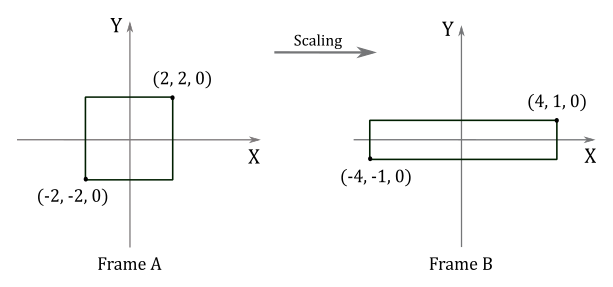
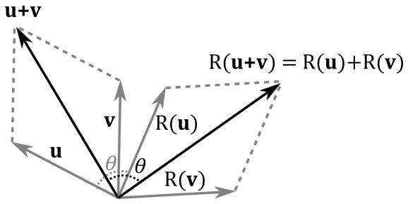
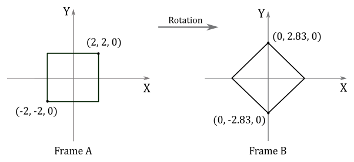
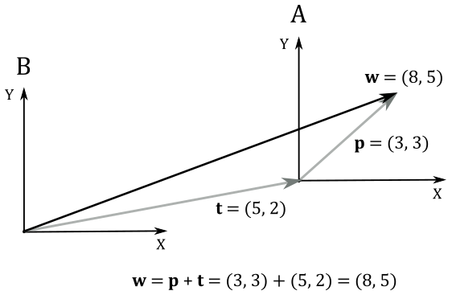

<br>

# 1 - Introduction

In graphics applications, it is common to apply transformations such as scaling, rotation, and translation to objects before displaying them on the screen. For example, let's consider a scenario where you want to move an object to a different position in the scene. In order to achieve this, you need to move all the vertices of the object by applying a transformation on them. Matrices are mathematical entities that represent transformations. This means that if we treat vertex positions as vectors in a 3D space, we can multiply them by a matrix to change their position in the scene. In the example given, we would perform a matrix multiplication between each vertex position $\mathbf{v}=(x,y,z)$ stored in the vertex buffer and a translation matrix $T$ in order to change its coordinates.

<br>

$T(\mathbf{v})=(x\textrm', y\textrm', z\textrm')=\mathbf{w}$

<br>

Here, $\mathbf{w}$ represents the new position of the vertex $\mathbf{v}$ after the transformation $T$. <br>
Now, it’s interesting how we can visualize it in two different ways. Obviously, we can move (translate) $\mathbf{v}$ until its coordinate match those of $\mathbf{w}$. Alternatively, we can translate the entire frame to achieve the same result. In Appendix 01, we established that points (and therefore positions) are vectors bound to the origin of a frame, which can be described by the coordinates of the corresponding arrowheads. In the illustration below, on the left side, we translate the arrowhead of $\mathbf{v}$ by changing its coordinates, resulting in the vector\position $\mathbf{w}$. On the right side of the illustration, we apply the same translation to the origin of the frame. As you can observe, the coordinates of $\mathbf{v}$ with respect to the transformed frame A remain the same because the vector shares the same fate (transformation) as its frame of reference. However, now the original frame B "see" $\mathbf{v}$ as being applied to the origin of frame A. Consequently, the coordinates of $\mathbf{v}$ with respect to the original frame B are the same as those of $\mathbf{w}$. Thus, we can consider the transformed frame A as the starting frame, while the original frame B as the new frame of reference.

<br>


<br>

The same concept applies when rotating or scaling a vertex position. As we will explore in this tutorial, vector transformations and changes of coordinate systems are mathematically equivalent. In other words, transforming an object is equivalent to transforming its frame of reference, and vice versa.

<br>

<br>

# 2 -	Linear transformations

A transformation $L$ is linear if it satisfies the following two conditions for any two vectors $\mathbf{u}$ and $\mathbf{v}$, and any scalar $k$.

<br>

$L(\mathbf{u}+\mathbf{v})=L(\mathbf{u})+L(\mathbf{v})$

$L(k\mathbf{v})=kL(\mathbf{v})$

<br>

In appendix 01, it was demonstrated that a generic bound vector $\mathbf{v}$ can be expressed as a linear combination as follows:

<br>

$\mathbf{v}=x\mathbf{i}+y\mathbf{j}+z\mathbf{k}$

<br>

Here, $\mathbf{i}$, $\mathbf{j}$, and $\mathbf{k}$ are the basis vectors that describe a frame, and $x$, $y$, and $z$ are the coefficients that determine the magnitude and direction of $\mathbf{v}$ along each basis vector. Then we can express the transformation of $\mathbf{v}$ as:

<br>

$L(\mathbf{v})=L(x\mathbf{i}+y\mathbf{j}+z\mathbf{k})=xL(\mathbf{i})+yL(\mathbf{j})+zL(\mathbf{k})=x\mathbf{f}+y\mathbf{g}+z\mathbf{h}=\mathbf{w}$

<br>

Here, $\mathbf{f}$, $\mathbf{g}$, and $\mathbf{h}$ represent the transformed standard basis vectors. These vectors correspond to the standard basis vectors of the transformed frame. It's important to note that the coordinates of $\mathbf{f}$, $\mathbf{g}$, and $\mathbf{h}$ are expressed with respect to the original frame. For example, in the following illustration, a linear transformation $L$ is applied to the unit vector $\mathbf{i}=(1,0)$ of a frame B. This transformation affects the original frame B as well, creating a new frame A (since the transformed standard basis vector will represent the standard basis vector in a new coordinate system). However, observe that, in the transformed frame A, the coordinates of the transformed $\mathbf{i}$ remain $(1,0)$. On the other hand, we have $L(\mathbf{i})=\mathbf{f}=(x',y')$ in frame B, which represents the original frame. Therefore, we can consider the transformed frame A as our initial starting point, where $\mathbf{i}$ was $(1,0)$, while the frame B represents the final result after applying the transformation $L$ to $\mathbf{i}$.

<br>


<br>

Then, we can conclude that applying a linear transformation to a vector $\mathbf{v}$ is equivalent to applying the same transformation to the initial frame, represented by its standard basis vectors. This is crucial because it means that transforming a vector $\mathbf{v}$ with a linear transformation can be achieved by transforming the standard basis vectors of the frame in which the vector is defined. Furthermore, it has been shown that the coordinates of the transformed vector $\mathbf{w}$ can be obtained as a linear combination of the transformed basis vectors, with the components of $\mathbf{v}$ used as coefficients. As we know, a linear combination can be expressed as the product of a row vector and a column vector, which is related to the concept of dot product. Therefore, we can express the transformation as follows:

<br>

$\mathbf{w}=L(\mathbf{v})=L(x\mathbf{i}+y\mathbf{j}+z\mathbf{k})=xL(\mathbf{i})+yL(\mathbf{j})+zL(\mathbf{k})=x\mathbf{f}+y\mathbf{g}+z\mathbf{h}=$

$\mathbf{m}\cdot\mathbf{v}=\left\lbrack\matrix{\uparrow&\uparrow&\uparrow\cr \mathbf{f}&\mathbf{g}&\mathbf{h}\cr \downarrow&\downarrow&\downarrow}\right\rbrack\left\lbrack\matrix{x\cr y\cr z}\right\rbrack=$

$\mathbf{Mv}=\left\lbrack\matrix{M_{00}&M_{01}&M_{02}\cr M_{10}&M_{11}&M_{12}\cr M_{20}&M_{21}&M_{22}}\right\rbrack\left\lbrack\matrix{x\cr y\cr z}\right\rbrack=\left\lbrack\matrix{\mathbf{M}_ {0\ast}\cdot\mathbf{v}\cr\mathbf{M}_ {1\ast}\cdot\mathbf{v}\cr\mathbf{M}_ {2\ast}\cdot\mathbf{v}}\right\rbrack$

<br>

where $\mathbf{v}=(x, y, z)$, $\mathbf{m}=(\mathbf{f},\mathbf{g},\mathbf{h})$, $\mathbf{f}=\left\lbrack\matrix{M_{00}&M_{10}&M_{20}}\right\rbrack$, $\mathbf{g}=\left\lbrack\matrix{M_{01}&M_{11}&M_{21}}\right\rbrack$ and $\mathbf{h}=\left\lbrack\matrix{M_{02}&M_{12}&M_{22}}\right\rbrack$.<br> 
That’s exactly what we have seen in appendix 02. Indeed, if we perform the multiplication between the matrix $\mathbf{M}$ and the column vector $\mathbf{v}$, we have

<br>

$\mathbf{Mv}=\left\lbrack\matrix{\mathbf{M}_ {0\ast}\cdot\mathbf{v}&\mathbf{M}_ {1\ast}\cdot\mathbf{v}&\mathbf{M}_ {2\ast}\cdot\mathbf{v}}\right\rbrack=$ 

$\left\lbrack\matrix{xM_{00}+yM_{01}+zM_{02}&\quad xM_{10}+yM_{11}+zM_{12}&\quad xM_{20}+yM_{21}+zM_{22}}\right\rbrack=$

$\left\lbrack\matrix{xM_{00}&xM_{10}&xM_{20}}\right\rbrack+\left\lbrack\matrix{yM_{01}&yM_{11}&yM_{21}}\right\rbrack+\left\lbrack\matrix{zM_{02}&zM_{12}&zM_{22}}\right\rbrack=$

$$
\begin{flalign}&
x\mathbf{M}_ {\ast 0}+y\mathbf{M}_ {\ast 1}+z\mathbf{M}_ {\ast 2}$=x\mathbf{f}+y\mathbf{g}+z\mathbf{h} =\mathbf{w}\tag{1}
&\end{flalign}
$$

<br>

We just found that to transform a vector $\mathbf{v}$ we need to multiply it by a matrix $\mathbf{M}$ whose columns are the transformed standard basis vectors. In other words, we can express this relationship as:

<br>

$\mathbf{w}=\mathbf{Mv}$

<br>

where $\mathbf{M}$ is the matrix that transforms a vector $\mathbf{v}$ into another vector $\mathbf{w}$.<br>
However, we can also interpret $\mathbf{M}$ as the matrix to go from a frame A (the starting one) to a frame B (the new one), which allows a vector $\mathbf{v}$ bound to the origin of frame A to be expressed with respect to frame B. We can demonstrate this intricated conclusion with a simple illustration.

<br>


<br>

Here, we have a vector $\mathbf{p}_A=(3,2)$ applied to the origin of a frame A (on the left side). Recall that a vector can be expressed as a linear combination of the standard basis vectors, using its components as coefficients. Thus, in frame A, we have:

<br>

$\mathbf{p}_A=3\mathbf{i}+2\mathbf{j}$

<br>

This representation corresponds to the diagonal of the parallelogram formed by scaling the vectors $\mathbf{i}$ and $\mathbf{j}$ using the components of $\mathbf{p}_A$ as coefficients. Now, imagine scaling frame A twice along both the x-axis and y-axis, followed by a rotation around the origin. This transformation results in the vector $\mathbf{p}_A$ being doubled in size and rotated with respect to the original frame, which can therefore be considered as a new frame B because in the transformed one (A) the coordinates of $\mathbf{p}_A$ are still $(3,2)$. As stated earlier, $L(\mathbf{i})$, $L(\mathbf{j})$ and $L(\mathbf{k})$ are expressed in coordinates with respect to the original frame B. Now, our goal is to demonstrate that using these transformed basis vectors as columns of a matrix, we can compute the coordinates of $\mathbf{p}_A$ with respect to frame B. In other words, we aim to show that this matrix enables us to transition from frame A to frame B. <br>
As depicted on the right side of the above illustration, we have that

<br>

$\mathbf{p}_B=3L(\mathbf{i})+2L(\mathbf{j})$

<br>

That is, $\mathbf{p}_A$ with respect to the frame B is the diagonal of the transformed standard basis vectors, scaled using the components of $\mathbf{p}_A$. In other words, the coordinates of $\mathbf{p}_A$ with respect to frame B can be expressed as a linear combination of the transformed basis vectors, using the components of $\mathbf{p}_A$ as coefficients. This is exactly what we formally proved in equation $(1)$, where we used the transformed basis vectors as columns of the matrix $\mathbf{M}$. Thus, we have just demonstrated that $\mathbf{M}$ is the matrix to express the coordinates of a vector in frame A with respect to frame B. That is, we have shown that $\mathbf{M}$ allows to go from frame A (the original one) to frame B (the transformed one). <br>
At this point, it should come as no surprise that the inverse matrix $\mathbf{M}^{-1}$ represents the transformation to go from frame B back to frame A.

<br>

## 2.1 - Scaling

In a 3D Cartesian coordinate system, vectors can be scaled independently in three directions by scaling their respective components. That is, given a scaling $S$ and a vector $\mathbf{v}=(x,y,z)$ we have

<br>

$S(\mathbf{v})=(s_xx, s_yy, s_zz)$

<br>

Here, $s_x$, $s_y$, and $s_z$ represent the scaling factors associated with the x, y, and z directions, respectively. This allows us to stretch or shrink vectors in each direction independently, altering their overall size and proportions. <br> 
The scaling is uniform if the scaling factors are equal $(s_x=s_y=s_z)$, otherwise it’s non-uniform. We can formally prove the scaling is a linear transformation by showing that it satisfies the two conditions of linearity.

<br>

>$S(\mathbf{u}+\mathbf{v})=\big( s_x(u_x+v_x),\ s_y(u_y+v_y),\ s_z(u_z+v_z) \big)=$
>
>$(s_xu_x+s_xv_x,\ s_yu_y+s_yv_y,\ s_zu_z+s_zv_z)=$
>
>$(s_xu_x,\ s_yu_y,\ s_zu_z)+(s_xv_x,\ s_yv_y,\ s_zv_z)=$
>
>$S(\mathbf{u})+S(\mathbf{v})$
>
><br>
>
>$S(k\mathbf{v})=(s_xkv_x,\ s_ykv_y,\ s_zkv_z)=$
>
>$k(s_xv_x,\ s_yv_y,\ s_zv_z)=$
>
>$kS(\mathbf{v})$

<br>

We know that a linear transformation can be associated with a matrix whose rows are the transformed standard basis vectors. In 3D Cartesian coordinate systems, we have that

<br>

$S(\mathbf{i})=(s_x1,\ s_y0,\ s_z0)=(s_x,0,0)$

$S(\mathbf{j})=(s_x0,\ s_y1,\ s_z0)=(0,s_y,0)$

$S(\mathbf{k})=(s_x0,\ s_y0,\ s_z1)=(0,0,s_z)$

<br>

Then, the matrix $\mathbf{S}$ associated with a scaling is

<br>

$\mathbf{S}=\left\lbrack\matrix{s_x&0&0\cr 0&s_y&0\cr 0&0&s_z}\right\rbrack$

<br>

This matrix is associated with the scaling operation. Consequently, we can apply scaling to any 3D vector by multiplying it with the scaling matrix $\mathbf{S}$. If the intention is to restore the vector to its original size, we can accomplish this by multiplying the scaled vector by the inverse of the scaling matrix, denoted as $\mathbf{S}^{-1}$.

<br>

$S^{-1}=\left\lbrack\matrix{1/s_x&0&0\cr 0&1/s_y&0\cr 0&0&1/s_z}\right\rbrack$

<br>

***Example***:

Given a minimum point $\mathbf{p}=(-2,0,-2)$ and a maximum point $\mathbf{q}=(2,0,2)$ defining a square, if you want to scale it by a factor of $2$ along the x-axis, $0.5$ along the z-axis, and leave the y-coordinate unchanged, you can use the corresponding scaling matrix:

<br>

$\mathbf{S}=\left\lbrack\matrix{2&0&0\cr 0&1&0\cr 0&0&0.5}\right\rbrack$

<br>

To scale the square, we need to multiply both $\mathbf{p}$ and $\mathbf{q}$ by $\mathbf{S}$.

<br>

$\left\lbrack\matrix{-2&0&-2}\right\rbrack\left\lbrack\matrix{2&0&0\cr 0&1&0\cr 0&0&0.5}\right\rbrack=\left\lbrack\matrix{-4&0&-1}\right\rbrack$

$\ \quad\left\lbrack\matrix{2&0&2}\right\rbrack\left\lbrack\matrix{2&0&0\cr 0&1&0\cr 0&0&0.5}\right\rbrack=\left\lbrack\matrix{4&0&1}\right\rbrack$

<br>

The following illustration shows the result of these transformations

<br>



$\square$

<br>

## 2.2	Rotation

A rotation is a linear transformation, but we won’t provide a formal proof here since it is simpler to observe, from the illustration below, that the rotation of the sum of two vectors (that is, the rotation of the diagonal of the parallelogram defined by the two vectors) is equivalent to the sum of rotations of the two vectors (that is, the diagonal of the rotated parallelogram). At the same time, rotating a uniformly scaled vector is equivalent to first rotating the vector and then applying the uniform scaling.

<br>



<br>

Finding the matrix associated with a rotation can be slightly more challenging compared to scaling. However, for the purpose of our discussion, we will consider $R_\mathbf{n}(\mathbf{v})$ as a counter-clockwise rotation of a vector $\mathbf{v}$ around a unit vector $\mathbf{n}$ by an angle $\theta$. That is, you will see the vector $\mathbf{v}$ rotating counterclockwise when looking down the unit vector $\mathbf{n}$, which determines the axis of rotation and its direction (so we can determine the direction of rotation as well). Obviously, the result of $R_\mathbf{n}(\mathbf{v})$ is the rotated version of the vector $\mathbf{v}$ passed as an argument. If a clockwise rotation is desired, the angle $\theta$ can simply be negated. Additionally, if $\mathbf{n}$ is not a unit vector, we can always normalize it, allowing us to extend our results to the more general case. <br>
Now, let's consider the left side of the illustration below.

<br>


<br>

We know that $\mathbf{n}\times\mathbf{v}$ is orthogonal to the plane defined by $\mathbf{n}$ and $\mathbf{v}$. During the rotation, the vector $\mathbf{v}$ traces out an arc of a circle, which is also orthogonal to the plane defined by $\mathbf{n}$ and $\mathbf{v}$. Therefore, the vector $\mathbf{n}\times\mathbf{v}$ and the circle drawn by $\mathbf{v}$ lie in the same plane.

As we know, $\mathbf{n}\times\mathbf{v}$ is orthogonal to the plane defined by $\mathbf{n}$ and $\mathbf{v}$. During rotation, $\mathbf{v}$ draws an arc of a circle which is also orthogonal to the plane defined by $\mathbf{n}$ and $\mathbf{v}$. As a result, the vector $\mathbf{n}\times\mathbf{v}$ and the circle drawn by $\mathbf{v}$ lie in the same plane.
Now, let's consider the projection of the vector $\mathbf{v}$ onto $\mathbf{n}$. It can be expressed as the difference between two vectors (this result can also be derived from appendix 02, section **2.2.3.2 - Gram-Schmidt Orthogonalization**).

<br>

$\text{proj}_ \mathbf{n}(\mathbf{v})=\mathbf{v}-\mathbf{v}_ \bot$

<br>

where $\mathbf{v}_ \bot$ is the orthogonal component of $\mathbf{v}$ with respect to $\mathbf{n}$. So, we have that

<br>

$\mathbf{v}_ \bot\ =\ \mathbf{v}-\text{proj}_\mathbf{n}(\mathbf{v})$

<br>

Then, $\mathbf{v}_ \bot$ lies in the plane defined by $\mathbf{n}$ and $\mathbf{v}$, since it’s the subtraction of these two vectors, and therefore it’s orthogonal to $\mathbf{n}\times\mathbf{v}$. $\ R_\mathbf{n}(\mathbf{v}_ \bot)$ is the orthogonal component of $R_\mathbf{n}(\mathbf{v})$ with respect to $\mathbf{n}$. Moreover, observe that we have

<br>

$\vert\mathbf{n}\times\mathbf{v}\vert=\vert\mathbf{n}\vert\vert\mathbf{v}\vert\sin a=\vert\mathbf{v}\vert\sin a =\vert\mathbf{v}_\bot\vert$

<br>

That is, $\mathbf{n}\times\mathbf{v}$ and $\mathbf{v}_ \bot$ have the same length, and are orthogonal to each other. So, they can define a 2D frame (just like the standard basis vectors $\mathbf{i}$ and $\mathbf{j}$) where we can compute the coordinates of $R_\mathbf{n}(\mathbf{v}_ \bot)$, which can be considered as the rotation of the basis vector $\mathbf{v}_ \bot$ about $\mathbf{n}$. This means that $R_\mathbf{n}(\mathbf{v}_ \bot)$ has the same length of both $\mathbf{n}\times\mathbf{v}$ and $\mathbf{v}_ \bot$. As you can see in the figure above (on the right), the orthogonal projection of $R_\mathbf{n}(\mathbf{v}_ \bot)$ onto $\mathbf{v}_ \bot$ is

<br>

$\displaystyle\frac{(R_\mathbf{n}(\mathbf{v}_ \bot)\cdot\mathbf{v}_ \bot)}{\vert\mathbf{v}_ \bot\vert^2}\mathbf{v}_ \bot=\frac{\vert R_\mathbf{n}(\mathbf{v}_ \bot)\vert\vert\mathbf{v}_ \bot\vert\cos\theta}{\vert\mathbf{v}_ \bot\vert^2}\mathbf{v}_ \bot=\frac{\vert\mathbf{v}_ \bot\vert\vert\mathbf{v}_ \bot\vert\cos\theta}{\vert\mathbf{v}_ \bot\vert^2}\mathbf{v}_ \bot=\cos{\mathbf{\theta}}\ \mathbf{v}_ \bot$

<br>

In a similar way, the orthogonal projection of $R_\mathbf{n}(\mathbf{v} _\bot)$ onto $\mathbf{n}\times\mathbf{v}$ is

<br>

$\displaystyle\frac{(R_\mathbf{n}(\mathbf{v}_ \bot)\cdot\mathbf{n}\times\mathbf{v})}{\vert\mathbf{n}\times\mathbf{v}\vert^2}\mathbf{n}\times\mathbf{v}=\frac{\vert R_\mathbf{n}(\mathbf{v}_ \bot)\vert\vert\mathbf{n}\times\mathbf{v}\vert\cos{(90°-\theta)}}{\vert\mathbf{n}\times\mathbf{v}\vert^2}\mathbf{n}\times\mathbf{v}=\frac{\vert\mathbf{n}\times\mathbf{v}\vert\vert\mathbf{n}\times\mathbf{v}\vert\sin\theta}{\vert\mathbf{n}\times\mathbf{v}\vert^2}\mathbf{n}\times\mathbf{v}=\sin\theta\ \mathbf{n}\times\mathbf{v}$

<br>

Then, we have that

<br>

$R_\mathbf{n}(\mathbf{v}_ \bot)=\cos\theta\ \mathbf{v}_ \bot+\sin\theta\ (\mathbf{n}\times\mathbf{v})$

<br>

Now, we can compute $R_\mathbf{n}(\mathbf{v})$ as a sum of $\text{proj}_ \mathbf{n}(\mathbf{v})$ and $R_\mathbf{n}(\mathbf{v}_ \bot)$.

<br>

$R_{\mathbf{n}}(\mathbf{v})=\text{proj}_ \mathbf{n}(\mathbf{v})+R_{\mathbf{n}}(\mathbf{v_T})=$

$(\mathbf{n}\cdot \mathbf{v})\mathbf{n}+\cos\theta\ \mathbf{v}_ \bot+\sin\theta\ (\mathbf{n}\times\mathbf{v})=$

$(\mathbf{n}\cdot \mathbf{v})\mathbf{n}+\cos\theta\ (\mathbf{v}-(\mathbf{n}\cdot\mathbf{v})\mathbf{n})+\sin\theta\ (\mathbf{n}\times\mathbf{v})=$

$\cos\theta\ \mathbf{v}+(1-\cos\theta)(\mathbf{n}\cdot\mathbf{v})\mathbf{n}+\sin\theta\ (\mathbf{n}\times\mathbf{v})$

<br>

As you can see, $\mathbf{v}_ \bot$ disappeared, so we can compute any rotation by knowing only the vector $\mathbf{v}$ to rotate, the angle of rotation $\theta$, and the unit vector $\mathbf{n}$. At this point, we can transform the standard basis vectors to compute the column vectors that make up the rotation matrix $\mathbf{R}_\mathbf{n}$.

<br>

$R_\mathbf{n}(\mathbf{i})=\big(\cos\theta+(1-\cos\theta)\ x^2,\quad(1-\cos\theta)\ xy+\sin\theta\ z,\quad(1-\cos\theta)\ xz-\sin\theta\ y\big)$

$R_\mathbf{n}(\mathbf{j})=((1-\cos\theta)\ xy-\sin\theta\ z,\quad \cos\theta+(1-\cos\theta)\ y^2,\quad(1-\cos\theta)\ yz+\sin\theta\ x)$

$R_\mathbf{n}(\mathbf{k})=((1-\cos\theta)\ xz+\sin\theta\ y,\quad(1-\cos\theta)\ yz-\sin\theta\ x,\quad\cos\theta+(1-\cos\theta)\ z^2)$

<br>

where $\mathbf{n}=(x, y, z)$, $\mathbf{i}=(1,0,0)$, $\mathbf{j}=(0,1,0)$, and $\mathbf{k}=(0,0,1)$. Then, we have that

<br>

$\mathbf{R}_\mathbf{n}=\left\lbrack\matrix{c+(1-c)x^2&(1-c)xy-sz&(1-c)xz+sy\cr (1-c)xy+sz&c+(1-c)y^2&(1-c)yz-sx\cr (1-c)xz-sy&(1-c)yz+sx&c+(1-c)z^2}\right\rbrack$

<br>

where $c=\cos\theta$, and $s=sin\theta$.<br>
For example, if we want to rotate about the x-, y- and z-axes, we need to set $\mathbf{n}=\mathbf{i}=(1,0,0)$, $\mathbf{n}=\mathbf{j}=(0,1,0)$, and $\mathbf{n}=\mathbf{k}=(0,0,1\)$, respectively. So, the related rotation matrices are

<br>

$\mathbf{R}_ x=\left\lbrack\matrix{1&0&0\cr 0&\cos\theta&-\sin\theta\cr 0&\sin\theta&\cos\theta}\right\rbrack\quad\quad\quad\mathbf{R}_ y=\left\lbrack\matrix{\cos\theta&0&\sin\theta\cr 0&1&0\cr -\sin\theta&0&\cos\theta}\right\rbrack\quad\quad\quad\mathbf{R}_ z=\left\lbrack\matrix{\cos\theta&-\sin\theta&0\cr \sin\theta&\cos\theta&0\cr 0&0&1}\right\rbrack$

<br>

***Example***:

Given a minimum point $\mathbf{p}=(-2,0,-2)$ and a maximum point $\mathbf{q}=(2,0,2)$ of a square, suppose you want to rotate it $-45°$ counterclockwise (that is, $45°$ clockwise) about the y-axis. The corresponding rotation matrix is:

<br>

$\mathbf{R}_ y=\left\lbrack\matrix{\cos\theta&0&\sin\theta\cr 0&1&0\cr -\sin\theta&0&\cos\theta}\right\rbrack=\left\lbrack\matrix{\cos{(-45°)}&0&\sin{(-45°)}\cr 0&1&0\cr -\sin{(-45°)}&0&\cos{(-45°)}}\right\rbrack=\left\lbrack\matrix{1/\sqrt{2}&0&-1/\sqrt{2}\cr 0&1&0\cr 1/\sqrt{2}&0&1/\sqrt{2}}\right\rbrack$

<br>

To rotate the square we need to multiply $\mathbf{p}$ and $\mathbf{q}$ by the rotation matrix $\mathbf{R}_ y$.

<br>

$\left\lbrack\matrix{-2&0&-2}\right\rbrack\left\lbrack\matrix{1/\sqrt{2}&0&-1/\sqrt{2}\cr 0&1&0\cr 1/\sqrt{2}&0&1/\sqrt{2}}\right\rbrack=\left\lbrack\matrix{0&0&-2.83}\right\rbrack$

$\ \quad\left\lbrack\matrix{2&0&2}\right\rbrack\left\lbrack\matrix{1/\sqrt{2}&0&-1/\sqrt{2}\cr 0&1&0\cr 1/\sqrt{2}&0&1/\sqrt{2}}\right\rbrack=\left\lbrack\matrix{0&0&2.83}\right\rbrack$

<br>



$\square$

<br>

You can easily verify that the column of $\mathbf{R}_ x$ are unit vectors and orthogonal to each other (i.e., they make up an orthonormal set). The same applies to the columns of $\mathbf{R}_ y$, $\mathbf{R}_ z$ and the general rotation matrix $\mathbf{R}_\mathbf{n}$ (although, this last one is a little trickier to prove). A matrix whose columns compose an orthonormal set is called orthogonal. Orthogonal matrices are of particular interest since their inverse is equal to their transpose. That is, we have that

<br>

$\mathbf{R}_ \mathbf{n}^{-1}=\mathbf{R}_ \mathbf{n}^T=\left\lbrack\matrix{c+(1-c)x^2&(1-c)xy+sz&(1-c)xz-sy\cr (1-c)xy-sz&c+(1-c)y^2&(1-c)yz+sx\cr (1-c)xz+sy&(1-c)yz-sx&c+(1-c)z^2}\right\rbrack$

<br>

<br>

# 3 - Affine transformations

Now that we know how to scale and rotate vectors, we'd also like to move points. While we can easily relocate points using a transformation called translation, we face two challenges when it comes to moving vectors:

- we certainly can move points (vertex positions) to relocate 3D objects in the scene. However, for free vectors, this transformation doesn’t make any sense since direction and magnitude don’t change after a translation (the point of application for a free vector is irrelevant). Therefore, we need to distinguish between points and vectors.

- moving a point can’t be expressed as a linear combination of the standard basis vectors. That is, translation is not a linear transformation, so we can’t associate a $3\times 3$ matrix with it. Fortunately, we can still find a way to incorporate translations into our matrix equation $\mathbf{w}=\mathbf{Mv}$.

<br>

Affine transformations extend linear ones by adding translations.  In the following section, we will explore this type of transformation and aim to resolve the aforementioned issues.

<br>

## 3.1 - Translation

To move a bound vector (point) $\mathbf{p}=(p_x, p_y, p_z)$ using a translation $T$, we simply add a displacement vector $\mathbf{t}=(t_x, t_y, t_z)$ to the point.

<br>

$T(\mathbf{p})=\mathbf{p}+\mathbf{t}=(p_x+t_x,\ p_y+t_y,\ p_z+t_z)$

<br>

For example, let's consider a 2D point $\mathbf{p}=(3, 3)$. If we want to translate it by $+5$ units along the x-axis and $+2$ units along the y-axis, we can add the displacement vector $\mathbf{t}=(5, 2)$ to $\mathbf{p}$, as shown in the following illustration.

<br>


<br>

At the same time, we can translate the frame by using the same displacement vector $\mathbf{t}$, that now specifies the offset where to move the origin of the translated frame A (the starting one) with respect to the original frame B (the new one). In frame A, the coordinates of the bound vector (point) $\mathbf{p}$ are still the same, while in frame B the coordinates of $\mathbf{p}$ can be seen as the sum of $\mathbf{p}$ and $\mathbf{t}$.

<br>



<br>

So, it seems that translation of vectors and translation of coordinate systems are mathematically equivalent, just like with linear transformations (in the next section we will formally prove that this is true in general for affine transformations). This means that we can translate a frame to apply the same transformation to a vector. So far so good, but the question is: can we find a $3\times 3$ matrix $\mathbf{T}$ to associate with translations? Unfortunately, the answer is no. To understand why, just take a look at the definition of $T(\mathbf{p})$ above. It’s a simple sum of vectors. On the other hand, in a matrix by vector multiplication, we have the dot product of two vectors (a row of the matrix and the column vector). So, there is no way we can find a $3\times 3$  matrix $\mathbf{T}$ so that $\mathbf{w}=\mathbf{p}+\mathbf{t}=\mathbf{Tp}$. This is due to the fact that translations are not linear transformations. Indeed, we have

<br>

>$T(\mathbf{u}+\mathbf{v})=(u_x+v_x+t_x,\ u_y+v_y+t_y,\ u_z+v_z+t_z)$
>
><br>
>
>while
>
><br>
>
>$T(\mathbf{u})+T(\mathbf{v})=(u_x+t_x,\ u_y+t_y,\ u_z+t_z)+(v_x+t_x,\ v_y+t_y,\ v_z+t_z)=$
>
>$(u_x+v_x+2t_x,\ u_y+v_y+2t_y,\ u_z+v_z+2t_z)$

<br>

Then, $T(\mathbf{u}+\mathbf{v}) \neq T(\mathbf{u})+T(\mathbf{v})$.<br>
However, we can still find a way to include translations in our matrix equation $\mathbf{w}=\mathbf{Mv}$ by using homogeneous coordinates, so that we can write $\mathbf{w}=\mathbf{p}+\mathbf{t}=\mathbf{Tp}$, where $\mathbf{T}$ is the translation matrix.

<br>

<br>

# 4 - Homogeneous coordinates

As explained in appendix 01, homogeneous coordinates introduce an "extra" coordinate. This means that starting from a 3D Cartesian systems, we step into the 4-th dimension. Fortunately, we just pop in to pick up what we need, and leave immediately after.

A point in 3D space can be represented in homogeneous coordinates by the tuple $(x,y,z,w)$, where the related 3D Cartesian coordinates are $(x/w,\ y/w,\ z/w,\ w/w)$. So, the generic 3D Cartesian coordinates $(x, y, z)$ can be written as $(x, y, z, 1)$ in homogeneous coordinates. That way, we can use the first three components as regular 3D Cartesian coordinates, and the last component to differentiate between points and vectors.

<br>

Points: $\ (x, y, z, 1)$

Vectors: $\ (x, y, z, 0)$

<br>

We need this distinction between points and vectors as we want to apply translations to points without affecting vectors. Now, since we are using four components, we can try to find a $4\times 4$ matrix $\mathbf{T}$ associated with translations. Let’s start with the identity matrix, using the offset of the translated frame $\mathbf{t}=(t_x, t_y, t_z, 1)$ as last column.

<br>

$\mathbf{T}=\left\lbrack\matrix{1&0&0&t_x\cr 0&1&0&t_y\cr 0&0&1&t_z\cr 0&0&0&1}\right\rbrack$

<br>

Let’s see what happens if we multiply a generic point $\mathbf{p}=(p_x, p_y, p_z, 1)$ by $\mathbf{T}$.

<br>

$\mathbf{w}=\mathbf{Tp}=\left\lbrack\matrix{1&0&0&t_x\cr 0&1&0&t_y\cr 0&0&1&t_z\cr 0&0&0&1}\right\rbrack\left\lbrack\matrix{p_x \cr p_y \cr p_z \cr 1}\right\rbrack=(p_x+t_x,\ p_y+t_y,\ p_z+t_z,\ 1)=\mathbf{p}+\mathbf{t}$

<br>

That’s exactly the definition of $T(\mathbf{p})$, but in homogeneous coordinates (that is, with the last component $1$). Now, let’s see what happens if we multiply a generic vector $\mathbf{v}=(v_x, v_y, v_z, 0)$ by $\mathbf{T}$.

<br>

$\mathbf{w}=\mathbf{Tv}=\left\lbrack\matrix{1&0&0&t_x\cr 0&1&0&t_y\cr 0&0&1&t_z\cr 0&0&0&1}\right\rbrack\left\lbrack\matrix{v_x \cr v_y \cr v_z \cr 0}\right\rbrack=(v_x, v_y, v_z, 0)=\mathbf{v}$

<br>

The vector $\mathbf{v}$ is not affected by the translation. It looks like we just found a matrix associated with the translation of points, and that doesn’t affect directions. Of course, the inverse of the translation matrix is

<br>

$\mathbf{T}^{-1}=\left\lbrack\matrix{1&0&0&-t_x\cr 0&1&0&-t_y\cr 0&0&1&-t_z\cr 0&0&0&1}\right\rbrack$

<br>

However, we'd like to include linear transformations as well. For this purpose, we can try to embed the $3\times 3$ matrix $\mathbf{A}$ associated with linear transformations (scaling and rotation) in the upper left position of $\mathbf{T}$.

<br>

$\mathbf{M}=\left\lbrack\matrix{A_{00}&A_{01}&A_{02}&t_x\cr A_{10}&A_{11}&A_{12}&t_y\cr A_{20}&A_{21}&A_{22}&t_z\cr 0&0&0&1}\right\rbrack$

<br>

Now, if we multiply a generic vector $\mathbf{v}=(x, y, z, 0)$ by $\mathbf{M}$ we have

<br>

$\mathbf{w}=\mathbf{Mv}=\left\lbrack\matrix{\mathbf{f}&\mathbf{g}&\mathbf{h}&\mathbf{t}}\right\rbrack\cdot\left\lbrack\matrix{x\cr y\cr z\cr 0}\right\rbrack=x\mathbf{f}+y\mathbf{g}+z\mathbf{h}+0\mathbf{t}=x\mathbf{f}+y\mathbf{g}+z\mathbf{h}$

<br>

where $\mathbf{f}=(A_{00}, A_{10}, A_{20}, 0)$, $\mathbf{g}=(A_{01}, A_{11}, A_{21}, 0)$ and $\mathbf{h}=(A_{02}, A_{12}, A_{22}, 0)$ are the linearly transformed standard basis vectors $\mathbf{i}=(1,0,0,0)$, $\mathbf{j}=(0,1,0,0)$ and $\mathbf{k}=(0,0,1,0)$, while $\mathbf{t}=(t_x, t_y, t_z, 1)$ is still the position of the translated frame (the starting one) with respect to the original frame (the new one). <br>
As you can see, the translation doesn’t affect the vector, and the result is the same we showed in equation $(1)$: $\mathbf{w}=\mathbf{Mv}$. Indeed, when you transform vectors with $\mathbf{M}$, they can only be affected by the linear transformation embedded within the matrix. Moreover, the result is still a vector: the last component is zero because it's the dot product of $\mathbf{v}=(v_x, v_y, v_z, 0)$ and $(0,0,0,1)$, the last row of $\mathbf{M}$.

On the other hand, if we multiply a generic point $\mathbf{q}=(x, y, z, 1)$ by $\mathbf{M}$ we have

<br>

$\mathbf{p}=\mathbf{Mq}=\left\lbrack\matrix{\mathbf{f}&\mathbf{g}&\mathbf{h}&\mathbf{t}}\right\rbrack\cdot\left\lbrack\matrix{x\cr y\cr z\cr 1}\right\rbrack=x\mathbf{f}+y\mathbf{g}+z\mathbf{h}+1\mathbf{t}=x\mathbf{f}+y\mathbf{g}+z\mathbf{h}+\mathbf{t}$

<br>

Here, we transform $\mathbf{q}$ with a linear transformation, which results in an intermediate vector $\mathbf{q}_1=x\mathbf{f}+y\mathbf{g}+z\mathbf{h}$ to which we add the translation $\mathbf{t}$. That’s exactly what we stated earlier: a translation is a sum of a point ad a vector. In this case the point is $\mathbf{t}$ because it specifies the origin of the starting frame with respect to the new one. Also, the result is still a point: the last component is $1$ because it's the dot product of $\mathbf{q}=(x, y, z, 1)$ and $(0, 0, 0, 1)$, the last row of $\mathbf{M}$. <br>
Furthermore, the difference of two points is the vector from a point to the other one. Indeed, from the equation above, we have

<br>

$\mathbf{p}-\mathbf{t}=x\mathbf{f}+y\mathbf{g}+z\mathbf{h}$

<br>

which is a vector, as it’s not bound to the origin of the frame of reference (see the illustration below, on the left side). On the other hand, the sum of two points is a point as well, but it doesn’t make any sense (unlike the sum of two vectors, which is the resultant force, direction or speed).

<br>


<br>

Then, the matrix $\mathbf{M}$ we built in this section can be used to transform both vectors and points with an affine transformation. It embeds a linear transformation, plus a translation. Its columns are the transformed standard basis vectors, and a displacement that specifies the origin of the starting frame with respect to a new one. Most importantly, $\mathbf{M}$ still allows us matrix to express the coordinates of a vector in starting frame with respect to new frame. As explained at the beginning of the tutorial, this implies that $\mathbf{M}$ is a matrix that allows to go from a frame to another, which means that change of coordinates and change of coordinate system are still mathematically equivalent in the context of affine transformations.

<br>

<br>

# 5 - Composition of transformations

Imagine you want to scale, rotate and translate a vector $\mathbf{v}$. That is,

<br>

$\mathbf{w}=(\mathbf{T}(\mathbf{R}(\mathbf{Sv})))$

<br>

The vector $\mathbf{v}$ and the resultant vector $\mathbf{w}$ can be considered column vectors of dimension $n\times 1$, while the matrices are all $n\times n$.<br>
In a matrix by vector multiplication, we need to perform $(2n-1)$ operations for each component of the resultant vector: $(n-1)$ sums and $n$ products. Then, we must multiply $(2n-1)$ by the $n$ components of the resultant vector. So, we have $n(2n-1)$ operations to perform matrix by vector multiplication. In the equation above we have three matrix by vector multiplications, so the total cost is $3n(2n-1)=6n^2-3n=O(n^2)$.<br>
However, thanks to the associative property of matrix multiplication we can write

<br>

$\mathbf{w}=(\mathbf{T}(\mathbf{R}(\mathbf{Sv})))=(\mathbf{T}(\mathbf{R}\mathbf{S})\mathbf{v}))=(\mathbf{TRS})\mathbf{v}$

<br>

Now, we have two matrix by matrix multiplications and a matrix by vector multiplication.<br>
Each matrix by matrix multiplication needs $(2n-1)$ operations for each element of the resultant matrix. So, we have to multiply $(2n-1)$ by the $n^2$ elements of the resultant matrix. Then, we need $(2n-1)n^2$ operations to perform a matrix by matrix multiplication. In the equation above, we have two of these multiplications, plus a matrix by vector multiplication, so the total cost is $2(2n^3-n^2)+n(2n-1)=4n^3-n=O(n^3)$.<br>

It seems that we need more operations to perform if we first multiply the matrices. However, imagine you want to transform 10 thousand vectors by the same matrices $\mathbf{S}$, $\mathbf{R}$ and $\mathbf{T}$. In the first case we need to perform $10000(3n(2n-1))$ operations, while in the second case we only need $10000(n(2n-1))+2(2n^3-n^2)$ operations, as the double matrix by matrix multiplication must be computed only once. That is, we can reuse $(\mathbf{TRS})$ to multiply every vector. For example, if $n=4$ we have $10000(3n(2n-1))=840\text{k}$, while $10000(n(2n-1))+2(2n^3-n^2)=280\text{k}$.

Then, it is strongly recommended to transform vectors with a matrix which is a composition of all the transformations you want to apply to the vectors.

<br>

<br>

# 6 - Transformation in Vulkan

GLM provides convenient helper functions for building $4\times 4$ transformation matrices to scale, rotate, and translate points (e.g., vertex positions) and vectors (e.g., light directions) in homogeneous coordinates. All these functions take a $4\times 4$ matrix as the first parameter to facilitate the composition of transformations. In particular, the matrix provided as the first parameter is used as left operand in a matrix multiplication with the transformation matrix built by the helper function (more on this at the end of the section).

The **glm::scale_slow** function offers a naive implementation for scaling. As shown in the following code snippet, it follows the definition presented in this tutorial:

```cpp
template<typename T, qualifier Q>
GLM_FUNC_QUALIFIER mat<4, 4, T, Q> scale_slow(mat<4, 4, T, Q> const& m, vec<3, T, Q> const& v)
{
    mat<4, 4, T, Q> Result(T(1));
    Result[0][0] = v.x;
    Result[1][1] = v.y;
    Result[2][2] = v.z;
    return m * Result;
}
```
<br>

However, considering that the first parameter is used as the left operand in a matrix multiplication with the scaling matrix, we can optimize this composition by recognizing that multiplying a $3\times 3$ matrix with a scaling matrix results in a matrix where each column is the column of the first operand scaled by the corresponding element on the main diagonal of the scaling matrix. Indeed, we have that

<br>

$\left\lbrack\matrix{a&b&c\cr d&e&f\cr g&h&i}\right\rbrack\left\lbrack\matrix{s_x&0&0\cr 0&s_y&0\cr 0&0&s_z}\right\rbrack=\left\lbrack\matrix{s_xa&s_yb&s_zc\cr s_xd&s_ye&s_zf\cr s_xg&s_yh&s_zi}\right\rbrack$

<br>

We can leverage this insight to implement a faster version of the scaling transformation. The code snippet below demonstrates this approach:

<br>

```cpp
template<typename T, qualifier Q>
GLM_FUNC_QUALIFIER mat<4, 4, T, Q> scale(mat<4, 4, T, Q> const& m, vec<3, T, Q> const& v)
{
    mat<4, 4, T, Q> Result;
    Result[0] = m[0] * v[0];
    Result[1] = m[1] * v[1];
    Result[2] = m[2] * v[2];
    Result[3] = m[3];
    return Result;
}
```
<br>

Recall that matrices in GLM are defined column by column, so both ```Result[0]``` and ```m[0]``` refer to the first column.

The same principle is applied to build a rotation matrix. A naive/slow version is provided, adhering to the definition presented in this tutorial:

<br>

```cpp
template<typename T, qualifier Q>
GLM_FUNC_QUALIFIER mat<4, 4, T, Q> rotate_slow(mat<4, 4, T, Q> const& m, T angle, vec<3, T, Q> const& v)
{
    T const a = angle;
    T const c = cos(a);
    T const s = sin(a);
    mat<4, 4, T, Q> Result;

    vec<3, T, Q> axis = normalize(v);

    Result[0][0] = c + (static_cast<T>(1) - c)      * axis.x     * axis.x;
    Result[0][1] = (static_cast<T>(1) - c) * axis.x * axis.y + s * axis.z;
    Result[0][2] = (static_cast<T>(1) - c) * axis.x * axis.z - s * axis.y;
    Result[0][3] = static_cast<T>(0);

    Result[1][0] = (static_cast<T>(1) - c) * axis.y * axis.x - s * axis.z;
    Result[1][1] = c + (static_cast<T>(1) - c) * axis.y * axis.y;
    Result[1][2] = (static_cast<T>(1) - c) * axis.y * axis.z + s * axis.x;
    Result[1][3] = static_cast<T>(0);

    Result[2][0] = (static_cast<T>(1) - c) * axis.z * axis.x + s * axis.y;
    Result[2][1] = (static_cast<T>(1) - c) * axis.z * axis.y - s * axis.x;
    Result[2][2] = c + (static_cast<T>(1) - c) * axis.z * axis.z;
    Result[2][3] = static_cast<T>(0);

    Result[3] = vec<4, T, Q>(0, 0, 0, 1);
    return m * Result;
}
```
<br>

In the optimized version, we compute $(1-\cos\theta x)$, $(1-\cos\theta y)$, and $(1-\cos\theta z)$ only once, and replace the matrix multiplication at the end of the function with four sums  of scaled vectors. Indeed, it can be proven that in a multiplication of square matrices $\mathbf{A}$ and $\mathbf{B}$, the i-th row of the resultant matrix $\mathbf{C}$ is given by:

<br>

$\mathbf{C}_ {i\ast}=\displaystyle\sum_{j}\mathbf{A}_ {j\ast}\cdot\mathbf{B}_ {ij}$

<br>

In other words, the i-th row of the resultant matrix is the sum of the rows of the left operand, scaled by the elements in the i-th row of the right operand matrix. You can easily verify this by multiplying two simple $2\times 2$ matrices. However, due to GLM's column-major matrix order, we need to reverse the indices compared to the equation above. This adjustment allows us to select the rows of the operand matrices instead of the columns.

<br>

```cpp
template<typename T, qualifier Q>
GLM_FUNC_QUALIFIER mat<4, 4, T, Q> rotate(mat<4, 4, T, Q> const& m, T angle, vec<3, T, Q> const& v)
{
    T const a = angle;
    T const c = cos(a);
    T const s = sin(a);

    vec<3, T, Q> axis(normalize(v));
    vec<3, T, Q> temp((T(1) - c) * axis);

    mat<4, 4, T, Q> Rotate;
    Rotate[0][0] = c + temp[0] * axis[0];
    Rotate[0][1] = temp[0] * axis[1] + s * axis[2];
    Rotate[0][2] = temp[0] * axis[2] - s * axis[1];

    Rotate[1][0] = temp[1] * axis[0] - s * axis[2];
    Rotate[1][1] = c + temp[1] * axis[1];
    Rotate[1][2] = temp[1] * axis[2] + s * axis[0];

    Rotate[2][0] = temp[2] * axis[0] + s * axis[1];
    Rotate[2][1] = temp[2] * axis[1] - s * axis[0];
    Rotate[2][2] = c + temp[2] * axis[2];

    mat<4, 4, T, Q> Result;
    Result[0] = m[0] * Rotate[0][0] + m[1] * Rotate[0][1] + m[2] * Rotate[0][2];
    Result[1] = m[0] * Rotate[1][0] + m[1] * Rotate[1][1] + m[2] * Rotate[1][2];
    Result[2] = m[0] * Rotate[2][0] + m[1] * Rotate[2][1] + m[2] * Rotate[2][2];
    Result[3] = m[3];
    return Result;
}
```
<br>

Translation matrices can be constructed using the **glm::translate** function, which is implemented as follows:

<br>

```cpp
template<typename T, qualifier Q>
GLM_FUNC_QUALIFIER mat<4, 4, T, Q> translate(mat<4, 4, T, Q> const& m, vec<3, T, Q> const& v)
{
    mat<4, 4, T, Q> Result(m);
    Result[3] = m[0] * v[0] + m[1] * v[1] + m[2] * v[2] + m[3];
    return Result;
}
```
<br>

This function scales the columns of the matrix passed as the first parameter using the components of the vector passed as the second parameter and assigns the result to the last column of the resultant matrix. Therefore, to make it work according to the definition provided in this tutorial, you should pass a $4\times 4$ identity matrix as the first argument.

To conclude this section, when composing multiple transformations into a single matrix using the first parameter of the transformation helper functions (**glm::scale**, **glm::rotate**, and **glm::translate**), you should call them in reverse order. This is because the first parameter is used as the left operand in a matrix multiplication with the transformation matrix built by the helper function. For example, if you want to scale, rotate, and translate an object, you need to first call **glm::translate** and pass the returned matrix to **glm::rotate**. Then, the matrix returned by **glm::rotate** must be passed to **glm::scale**. In pseudocode:

<br>

```
S = glm::scale(IdentityMatrix, scalingVector);
R = glm::rotate(IdentityMatrix, axisOfRotationVector);
T = glm::translate(IdentityMatrix, displacementVector);
M = T * R * S;

// Equivalent to:

T = glm::translate(IdentityMatrix, displacementVector);
R = glm::rotate(T, axisOfRotationVector);
M = glm::scale(R, scalingVector); // M = TRS
```
<br>

This ensures that the transformations are applied in the correct order.

<br>

<br>

Source code: [LearnVulkan](https://github.com/PAMinerva/LearnVulkan)

<br>

# References

[1] Practical Linear Algebra: A Geometry Toolbox (Farin, Hansford) <br>

<br>

***
If you found the content of this tutorial somewhat useful or interesting, please consider supporting this project by clicking on the **Sponsor** button.  Whether a small tip, a one time donation, or a recurring payment, it's all welcome! Thank you!<br><br>
<p align="center">
 <a href="https://github.com/sponsors/PAMinerva">
         
      </a>
</p><br>