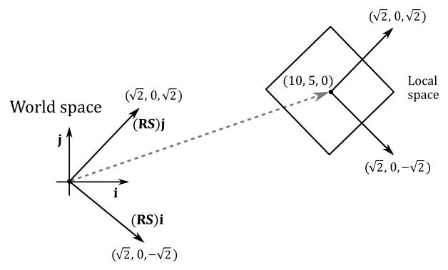
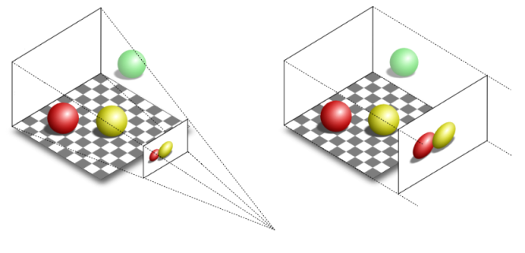
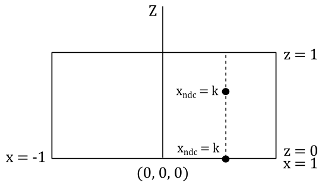
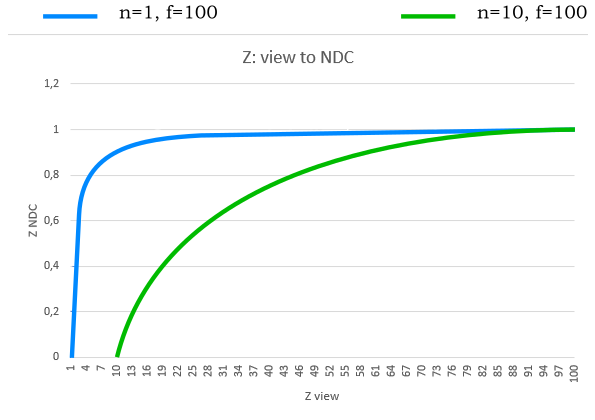

<br>

# 1 - Introduction

The magic of computer graphics lies in the ability to transform and manipulate objects within cartesian coordinate systems, also known as spaces for brevity. Indeed, a fundamental concept that forms the backbone of many graphics pipelines is the utilization of various spaces that bring virtual worlds to be shown on our screens. <br>
In appendix 02 on matrices, we showed that to transform a vector we can transform the starting frame so that we can express its coordinates with respect to a new space. Building upon this foundation, it’s now interesting to look at the common spaces employed in the graphics pipeline and how to go from a space to another as well in order to project 3D scenes onto a 2D surface before showing the result on the screen. From the initial local space where objects originate, to the all-encompassing world space, and the camera space that offers a unique perspective, each space plays a crucial role in the intricate process of rendering.

<br>

<br>

# 2 - Object space

The object space, also known as local space, is the frame in which 3D meshes are defined. When creating these meshes, 3D graphic artists often work in a convenient space that simplifies vertex modeling and provides symmetry with respect to the origin of the coordinate system.

<br>


<br>

For instance, consider the modeling of a sphere. It is much easier to place all the vertices at an equal distance from the origin, rather than using a random point as the sphere's center. This intuitive choice is not only practical but can also be mathematically justified.

<br>

Equation of the sphere with center in $(0,0,0)$: $\quad x^2+y^2+z^2=r^2$

Equation of the Sphere with center in $(x_0, y_0, z_0)$: $\quad (x-x_0)^2+(y-y_0)^2+(z-z_0)^2=r^2$

<br>

It's important to note that the local space is the frame where the vertices of a mesh are defined in the first place. These vertices are often stored in a file on disk and can be loaded into memory to create the vertex buffer, which is subsequently sent to the input assembler. Within this buffer, the vertices remain in their local space representation until the graphics pipeline performs the necessary transformations to convert the 3D objects they represent into a 2D representation to show on the screen.

Throughout this tutorial series, we’ll use a right-handed coordinate system where the z-axis points upwards to represent the object space. This is in line with the convention used by default in Blender and 3ds Max, two well-known 3D modeling softwares. However, keep in mind that this is completely arbitrary and you can choose any configuration (z-up or y-up) and handedness that suits your needs.

<br>

<br>

# 3 - World space and World matrix

When the input assembler sends its output to the next stage (the vertex shader), we have vertices in local space that we want to place in a 3D global scene shared by all meshes. The space of the global scene is called world space, and the transformation to go from local to world space is called world transformation. To represent the world space, we will use the same convention as the object space: right-handed system with the z-axis pointing upwards.

<br>


<br>

As we know, to go from a frame to another, we need to express the basis vectors of the starting frame with respect to the new frame. So, we can build a matrix $\mathbf{W}=\mathbf{TRS}$ (a composition of three trasformations: a scaling, a rotation, and a translation) associated with the world transformation we want to apply to the local frame to get the coordinates of its basis vectors with respect to the world space. Therefore, $\mathbf{W}$ is the matrix to go from local to world space, and that allows us to put a mesh (or rather, its vertices) in the global scene. For this reason, we call $\mathbf{W}$ the world matrix. It's important to note that we hardly place every mesh in the same location of the world space, so $\mathbf{W}$ will likely be different from mesh to mesh.

<br>


<br>

Then, we can define $\mathbf{W}$ as 

<br>

$\mathbf{W}=\mathbf{SRT}=\left\lbrack\matrix{f_x&g_x&h_x&t_x\cr f_y&g_y&h_y&t_y\cr f_z&g_z&h_z&t_z\cr 0&0&0&1}\right\rbrack$

<br>

where the first three columns of $\mathbf{W}$ are the scaled and rotated basis vectors of the local space with respect to the world space, while the column row is the translation of the origin of the local space (again, with respect to the world space).

<br>

***Example:***

Given a cube in local space, suppose you want to double its size, rotate it by $-45°$ counterclockwise (that is, $45°$ clockwise) about the z-axis, and move it at $(10,5,0)$ in the world space. Then, we have to transform all the vertices of the square with the following world matrix.

<br>

$\mathbf{W}=\mathbf{TRS}=\left\lbrack\matrix{1&0&0&10\cr 0&1&0&5\cr 0&0&1&0\cr 0&0&0&1}\right\rbrack\left\lbrack\matrix{\sqrt2/2&\sqrt2/2&0&0\cr -\sqrt2/2&\sqrt2/2&0&0\cr 0&0&1&0\cr 0&0&0&1}\right\rbrack\left\lbrack\matrix{2&0&0&0\cr 0&2&0&0\cr 0&0&2&0\cr 0&0&0&1}\right\rbrack=\left\lbrack\matrix{\sqrt2&\sqrt2&0&10\cr -\sqrt2&\sqrt2&0&5\cr 0&0&2&0\cr 0&0&0&1}\right\rbrack$

<br>

As you can see in the following illustration, the first three columns of $\mathbf{W}$ are the scaled and rotated basis vectors of the local space in world coordinates (that is, whose coordinates are with respect to the world space), while the fourth row is the position (point) of the origin of the local space (again, in world coordinates). Based on the information provided in Appendix 03, we can use $\mathbf{W}$ to transform the vertices of the cube in order to place it in the global scene.

<br>



$\square$

<br>

<br>

# 4 - View space and View matrix

Once we have applied the world transformation, all of our meshes are in world space, but we need a specific point of view to observe the 3D scene. This new space is called view space, or camera space. Again, we must perform another transformation (known as the view transformation) on all the vertices of our meshes to go from world space to view space. To facilitate this transition, we employ a matrix $\mathbf{V}$, known as the view matrix, which is associated with the view transformation. The view matrix is responsible for configuring the camera's position, orientation, and perspective within the scene. By applying the view matrix, we can effectively convert the coordinates of the meshes' vertices from world space to view space, providing the desired viewpoint for our 3D scene.

<br>


<br>

It is worth noting that for the camera space, we’ll use a right-handed system where the y-axis points downwards. This will be very helpful as we move through the following spaces, which we’ll discuss in upcoming sections. By following the convention of having the y-axis point downwards at some point during the rendering process, we can eliminate the awkward flip instruction in the vertex shader we used so far.

Unlike the world transformation, where each mesh has its own unique transformation, in the case of the view transformation, we typically use the same view matrix to transform all the vertices of our meshes. This is because we usually want a consistent viewpoint to observe the entire scene. In other words, we desire a single point of view that encompasses the entire scene. It's as if we can consider the entire scene, comprising all the meshes, as a single large mesh that needs to be transformed from world space to view space. <br>
Now, to build the view matrix, we can start considering the camera as an ordinary mesh we can place in world space. So, we can use a world matrix $\mathbf{W}_ c$ to put the camera in the global space as the point of view from which to look at the scene.

<br>

$\mathbf{W}_ c=\left\lbrack\matrix{f_x&g_x&h_x&t_x\cr f_y&g_y&h_y&t_y\cr f_z&g_z&h_z&t_z\cr 0&0&0&1}\right\rbrack$

<br>

$\mathbf{W}_ c$ is the matrix to go from the local space of the camera to the world space. However, note that the local space of the camera is exactly the view space with respect to which we want to look at the scene. This means that $\mathbf{W}_ c$ is the matrix to go from view space to world space. Therefore, we can compute the inverse $\mathbf{W}_ c^{-1}$ to get the view matrix, which allows to go from world space to view space. It’s not too difficult to compute the inverse of $\mathbf{W}_ c$ because it’s the composition of a rotation and a translation: $\mathbf{W}_ c=\mathbf{TR}$. Indeed, it doesn’t make any sense to scale the camera since it’s a dummy object (we are only interested in the position and orientation of the view space). And we don’t need a scaling in the inverse transformation as well, because we’ve already scaled the meshes during the world transformations (that is, we wish to keep the size of the meshes in world space). Then, the first three columns of $\mathbf{W}_ c$ are the rotations of the standard basis vectors of the view space with respect to the world space (that is, in world coordinates), while the last column is the position of (the origin of) the view space (in world coordinates as well). So, we have

<br>

$\mathbf{V}=\mathbf{W}_c^{-1}=(\mathbf{TR})^{-1}=\mathbf{R}^{-1}\mathbf{T}^{-1}=\mathbf{R}^{T}\mathbf{T}^{-1}=\left\lbrack\matrix{f_x&f_y&f_z&0\cr g_x&g_y&g_z&0\cr h_x&h_y&h_z&0\cr 0&0&0&1}\right\rbrack\left\lbrack\matrix{1&0&0&-t_x\cr 0&1&0&-t_y\cr 0&0&1&-t_z\cr 0&0&0&1}\right\rbrack$

<br>

Indeed, remember that the inverse of a rotation matrix is equal of its transpose (see appendix 03). Then, the view matrix $\mathbf{V}$ to go from world space to view space is

<br>

$\mathbf{V}=\left\lbrack\matrix{f_x&f_y&f_z&-\mathbf{t}\cdot\mathbf{f}\cr g_x&g_y&g_z&-\mathbf{t}\cdot\mathbf{g}\cr h_x&h_y&h_z&-\mathbf{t}\cdot\mathbf{h}\cr 0&0&0&1}\right\rbrack$

<br>

It’s interesting to note that, since $\mathbf{f}$, $\mathbf{g}$, $\mathbf{h}$ and $\mathbf{t}$ are in world coordinates, we can compute the view matrix $\mathbf{V}$ from scratch by only using two points in world coordinates: the origin $\mathbf{O}_v$ of the view space, and a target point $\mathbf{T}$ indicating where the camera is aimed at. Let's start by noting that

<br>

$\mathbf{t}=\mathbf{O}_v$

<br>

because both $\mathbf{O}_v$ and $\mathbf{t}$ represent the same value: the position of the view space in world coordinates.<br>
Now, we need to calculate $\mathbf{f}$, $\mathbf{g}$ and $\mathbf{h}$, transformations of the standard basis vectors $\mathbf{i}$, $\mathbf{j}$ and $\mathbf{k}$ in the local space of the camera. As for $\mathbf{h}$ (transformation of $\mathbf{k}$),  it specifies the direction the camera is aimed at. Therefore, we can simply compute the difference between $\mathbf{T}$ and $\mathbf{O}_v$.

<br>

$\mathbf{h}=\displaystyle\frac{\mathbf{T}-\mathbf{O}_v}{\vert\mathbf{T}-\mathbf{O}_v\vert}$

<br>

To compute $\mathbf{f}$ (transformation of $\mathbf{i}$) we will use the inverse of $\mathbf{k}$, the unit vector which points up in every local space (object, world, camera, etc.). This way, we can make the y-axis point downwards in camera space.

<br>

>Observe that to compute $\mathbf{f}$ we can use $-\mathbf{k}$ because we typically limit the vertical rotation of the camera to less than $90°$ around the x-axis (the reasons behind this will be explained in another tutorial). As a result, the angle between $-\mathbf{k}$ and $\mathbf{g}$ will be less than $90°$. Similarly, the angle between $-\mathbf{k}$ and $\mathbf{h}$ will be less than $180°$, as $\mathbf{g}$ and $\mathbf{h}$ must be orthogonal to each other.

<br>


<br>

Therefore, we can calculate $\mathbf{f}$ with the following cross product.

<br>

$\mathbf{f}=\displaystyle\frac{\mathbf{-k}\times\mathbf{h}}{\vert\mathbf{-k}\times\mathbf{h}\vert}$

<br>

Observe that the vector $\mathbf{k}$, with coordinates $(0,0,1)$, remains consistent across all spaces, so both the $-\mathbf{k}$ and $\mathbf{h}$ can be considered as expressed with respect to the world space, which is a right-handed system. This means that the direction of $\mathbf{f}$ will be the one that sees $-\mathbf{k}$ rotate anticlockwise towards $\mathbf{h}$, which makes $\mathbf{f}$, $-\mathbf{k}$ and $\mathbf{h}$ a right-handed system. This preserves the expected result, as it ensures the handedness of the system remains unchanged during the transformation.

Finally, to compute $\mathbf{g}$ (transformation of $\mathbf{j}$) we can simply calculate the cross product between $\mathbf{h}$ and $\mathbf{f}$.

<br>

$\mathbf{g}=\mathbf{h}\times\mathbf{f}$

<br>


Both $\mathbf{f}$ and $\mathbf{h}$ are unit vectors, so we don’t need to normalize the result. Recall what we stated in appendix 01: the length of the vector resulting from the cross product between $\mathbf{u}$ and $\mathbf{v}$ is $\vert\mathbf{u}\times\mathbf{v}\vert=\vert\mathbf{u}\vert\vert\mathbf{v}\vert\sin{\theta}$. In this case we have $\vert\mathbf{h}\vert=\vert\mathbf{f}\vert=1$ and $\sin{90°}=1$.

GLM provides the helper function **lookAtLH** to build a view matrix similar to the one we discussed in this section. You need to pass the camera position and target point as arguments to this function, which returns the related view matrix. <br>
Observe that we use the **LH** (left-handed) version of the more general **lookAt** function. Indeed, the RH (right-handed) version provided by GLM is implemented with the assumption that the y-axis points upwards and the z-axis points backwards with respect to the camera. This results in different calculations for computing $\mathbf{f}$, $\mathbf{g}$ and $\mathbf{h}$ so that they form a right-handed system.

<br>

```cpp
// pos: position (in world coordinates) of the (origin of the) view\camera space.
// target: position (in world coordinates) where we want the camera is aimed at.
// down: -k (unit basis vector which points downwards).
glm::vec3 c_pos = { 0.0f, -10.0f, 3.0f };
glm::vec3 c_at =  { 0.0f, 0.0f, 1.0f };
glm::vec3 c_down =  { 0.0f, 0.0f, -1.0f };

// Compute the View matrix.
glm::mat4 viewMatrix = glm::lookAtLH(c_pos, c_at, c_down);
```
<br>

The implementation of the **lookAtLH** function should be relatively straightforward, given the concepts we have discussed in this section. Observe how the columns and rows are swapped compared to the view matrix $\mathbf{V}$ that was defined earlier in this section. This is done by GLM to store matrix data in a column-major order.

<br>

```cpp
/// Build a left handed look at view matrix.
///
/// @param eye Position of the camera
/// @param center Position where the camera is looking at
/// @param up Normalized up vector, how the camera is oriented. Note: We will use it as down vector
///
/// @tparam T A floating-point scalar type
/// @tparam Q A value from qualifier enum
template<typename T, qualifier Q>
GLM_FUNC_DECL mat<4, 4, T, Q> lookAtLH(
    vec<3, T, Q> const& eye, vec<3, T, Q> const& center, vec<3, T, Q> const& up);
```

```cpp
template<typename T, qualifier Q>
GLM_FUNC_QUALIFIER mat<4, 4, T, Q> lookAtLH(vec<3, T, Q> const& eye, vec<3, T, Q> const& center, vec<3, T, Q> const& up)
{
    vec<3, T, Q> const f(normalize(center - eye));  // h = target - camPos
    vec<3, T, Q> const s(normalize(cross(up, f)));  // f = -k x h
    vec<3, T, Q> const u(cross(f, s));              // g = h x f

    mat<4, 4, T, Q> Result(1);
    Result[0][0] = s.x;
    Result[1][0] = s.y;
    Result[2][0] = s.z;
    Result[0][1] = u.x;
    Result[1][1] = u.y;
    Result[2][1] = u.z;
    Result[0][2] = f.x;
    Result[1][2] = f.y;
    Result[2][2] = f.z;
    Result[3][0] = -dot(s, eye);
    Result[3][1] = -dot(u, eye);
    Result[3][2] = -dot(f, eye);
    return Result;
}
```
<br>

<br>

# 5 - NDC space and Projection matrix

Once we have the entire scene in camera space, the next step is to project it onto a plane to obtain a 2D representation of the 3D scene. To achieve this, we can ideally place a plane in front of the camera and trace rays from the camera to each vertex of the mesh. The intersection between these rays and the plane gives us the 2D representation of the corresponding 3D vertices. Note that if the projection rays are parallel to each other and orthogonal to the projection plane, the camera's position becomes irrelevant.

<br>


<br>

In the first case, where the projection rays converge towards a focal point, distant objects appear smaller. This replicates the way human vision works in real life and we commonly refer to this type of projection as perspective. <br>
On the other hand, if the projection rays are parallel to each other, the perspective effect is lost, and the size of objects becomes independent of their distance from the camera. This type of projection is known as orthographic. <br>
To better understand the difference, consider the illustration provided below. It depicts two segments of equal size placed at different distances from the camera. In the perspective projection, the closer segment appears longer when projected onto the projection plane, emphasizing the depth perception effect.

<br>


<br>

Fortunately, the intricacies of the projection process are almost transparent to the programmer, who is primarily responsible for defining the portion of the 3D scene to be projected onto the projection plane. Indeed, in most cases, capturing the entire scene is not necessary or desired. Depending on the type of projection being used, different geometric shapes define the region of interest. <br>
For orthographic projections, the region is represented by a box. This box encapsulates the portion of the scene that will be projected onto the 2D plane. <br>
In the case of perspective projections, the region of interest is defined by a frustum. A frustum is the volume that exists between two parallel planes that intersect a pyramid. The apex of the pyramid corresponds to the camera position. The plane closer to the camera is referred to as the near plane, while the farther plane is called the far plane. By intersecting a plane and the frustum between the camera and the near plane, we obtain a projection window. Alternatively, the upper face of the frustum, which is the intersection between the near plane and the frustum, can be used as the projection window. In computer graphics literature, the terms "near plane" and "far plane" are commonly used to refer to the corresponding windows as well.

<br>


<br>

The illustration clearly demonstrates the differences between perspective and orthographic projections. In both projections, the green ball lies outside the defined region of interest and therefore is not projected onto the projection window. <br>
In the case of the orthographic projection, the red and yellow balls appear the same size, regardless of their distance from the camera. This is because the projection rays are parallel and do not converge towards a focal point, resulting in a lack of perspective distortion. <br>
On the other hand, in the perspective projection, the red ball appears smaller compared to the yellow ball. This is due to the converging projection rays that mimic the behavior of human vision in real life. As objects move further away from the camera, they appear smaller, resulting in the size difference observed in the perspective projection.

<br>



<br>

To define a frustum or a box, we need to specify the distances of the near and far planes from the camera. Therefore, it is convenient to define the frustum in view space, where the camera position is located at the origin. Additionally, we need to determine the dimensions of the projection window. Thanks to this information we can build a projection matrix to transform 3D vertices from view space to another one, called NDC (Normalized Device Coordinates) space. The frustum defined in view space becomes a parallelepiped in NDC space, whose origin is located at the center of the front face (corresponding to the transformation of the near plane). <br>
One significant aspect of NDC space is that the meshes contained within the parallelepiped (previously within the frustum) will have vertex coordinates falling within the following ranges:

<br>

$-1\le x\le 1$

$-1\le y\le 1$

$\ \ \ 0\le z\le 1$

<br>

The illustration below depicts the frustum in view space (left) and the corresponding parallelepiped in NDC space (right). In Vulkan, the y-axis of the NDC space point downwards. This means we made a wise choice by setting up a y-down configuration for the view space. Indeed, this allows us to align with the Vulkan coordinate system and ensures consistency throughout the rendering process. In other words, there’s no need to flip the y-coordinate in the vertex shader anymore. <br>
The z-axis is always perpendicular to both the front and back faces of the parallelepiped in NDC space and passes through their centers. While this arrangement also holds in view space, it is not an absolute requirement. Indeed, the z-axis in view space can be non-perpendicular to both the near and far planes, and it may pass through a point other than their centers.

<br>


<br>

Now, you may wonder what’s the point of this transformation. The following illustration shows a 2D representation from the top that explains what happens if you transform a frustum to a parallelepiped. The meshes inside the frustum are transformed accordingly, and the projection rays become parallel to each other. That way, we can orthographically project the mesh vertices onto a projection window (for example, the front face of the parallelepiped in NDC space) to mimic the perspective vision we are used to in real life, where the sides of a long road (or a railway) seem to meet at infinity, for example, and where near objects appear bigger than distant ones. 

<br>


<br>

Interestingly, once we are in NDC space, there is no actual need to project the 3D vertices onto the projection window, as we already have a 2D representation of them. Indeed, as mentioned earlier, in NDC space the projection rays are parallel, and the z-axis is orthogonal to the front face of the NDC parallelepiped, passing through its center (the origin of the NDC space). This means that the x- and y-coordinates of vertices in NDC space remain constant along the projection rays, with only the z-coordinate varying. Consequently, the x- and y-coordinates of a vertex in NDC space are identical both inside the NDC parallelepiped and when projected onto the front face (which lies in the $z=0$ plane of the NDC space). The illustration below provided a top-down view that further demonstrates this concept. It shows that the x-coordinate of a vertex remains constant along the projection ray. The same applies to the y-coordinate if you look at the NDC space sideways.

<br>



<br>

Most of the time, that’s all we need to know in order to write applications that renders 3D objects on the screen. However, as graphics programmers, we are expected to know how things work under the hood. In particular, knowing how to build a projection matrix might come in useful in the future.

As stated earlier, once we go from view space to NDC space, we implicitly get a 2D representation of 3D mesh vertex positions. So, this transformation is definitely related to the concept of projection. Indeed, the associated matrix is called projection matrix, that can vary depending on the type of projection we are interested in. We will start with a couple of matrices associated with the perspective projection, and then we will show the matrix associated with the orthographic projection.

<br>

## 5.1 - Perspective projection

While GLM offers convenient helper functions for constructing some projection matrices, in this section we will explore the process of manually creating a couple of projection matrices based on frustum information. Our first objective is to derive NDC coordinates from view coordinates. Then, we will attempt to express the resulting equations in matrix form, with the goal of finding a projection matrix to go from the view space to the NDC space. Consider the following illustration.

<br>


<br>

To begin constructing a projection matrix, we must define a frustum that provides the necessary information. Regarding the projection window, we can intersect a pyramid in view space with any plane positioned between the camera (located at the origin $\mathbf{O}_v$ of the view space) and the near plane. For our purposes, let's conveniently choose a plane at a distance $d$ along the z-axis from the camera so that the height of the projection window is $2$. <br>
The angle $\theta$, known as the vertical FOV (field of view), allows us to control the vertical extent of the visible scene in view space. Notably, by setting $\theta$ as the angle between the top and bottom sides of the frustum, we implicitly establish the distance $d$, given our earlier requirement that the height of the projection window be $2$. Additionally, the angle $\phi$ controls the horizontal FOV. This means we can zoom-in by simply decreasing $\theta$ and\or $\phi$, as this reduces the visible region, which results in fewer objects being projected onto the projection window. On the other hand, if we increase $\theta$ and\or $\phi$ we have a zoom-out effect because more objects are projected onto the projection window. <br>
However, we usually don’t use the horizontal FOV $\phi$ to control the projection window’s width; instead, we set its aspect ratio $r$ to avoid distortion when mapping it onto the render target (which is then mapped to the window’s client area). Hence, we define $r=w/h=w/2$, where $w$ and $h$ represent the width and length of the render target, respectively. Consequently, the width of the projection window is $w=2r$. As depicted in the illustration above, the horizontal FOV $\phi$ is dependent on both the aspect ratio $r$ and the distance $d$ of the projection window (which, in turn, depends on the vertical FOV $\theta$). Notably, the z-axis is orthogonal to the projection window and passes through its center, dividing the height of the projection window into two parts of unit lengths. <br>
Furthermore, the frustum includes near and far planes positioned at distances $n$ and $f$ units from the camera, respectively. This particular frustum configuration is commonly used, but it is only a specific case. In the next section, we will explore a more general case.


Since the z-axis is orthogonal to the projection window and passes through its center, any 3D vertex projected onto its surface will have the y-coordinate already in NDC space (i.e., within the range $[-1, 1]$). You can verify it in the illustration above, where the perspective projection $y_w$ of the y-coordinate $y_v$ of a 3D vertex in view space will be always in the range $[-1, 1]$, and note that the y-axis points downwards both in view and NDC space, so $y_w$ can be considered in NDC space. <br>
On the other hand, the perspective projection $x_w$ of the x-coordinate $x_v$ of the same vertex in view space needs to be scaled by $1/r$ to fit within the same range. As for the z-coordinate, it requires a separate discussion, which we will delve into shortly.

<br>


<br>

Let's begin by examining $y_w$, which represents the perspective projection of the y-coordinate of a 3D vertex $\mathbf{v}_v=(x_v, y_v, z_v, w_v)$ in view coordinates. The projection window lies in the plane $z=d$. As mentioned earlier, we want to find a formula to derive the NDC coordinates from a vertex’s view coordinates. To achieve this, let's consider the triangles $\triangle_1=(\mathbf{O}_v, d, y_w)$ and $\triangle_2=(\mathbf{O}_v, z_v, y_v)$. These triangles are similar because they share an angle (the one at $\mathbf{O}_v$), and both have a right angle. So, we have

<br>

$$\frac{y_w}{d}=\frac{y_v}{z_v}$$

$$y_{ndc} = y_w = \frac{dy_v}{z_v}\tag{1}$$

<br>

Also, we know that $d$ depends on the vertical FOV $\theta$. Indeed, you can check in the first illustration of this section that 

<br>

$$\frac{1}{d}=\tan{\left({\frac{\theta}{2}}\right)}$$

$$\tag{1b} d=\frac{1}{\tan{(\theta/2)}}=\cot{\left(\frac{\theta}{2}\right)} $$

<br>

If you want to compute the horizontal FOV $\phi$, we have that

<br>

$$ tan{(\phi/2)}=r/d=r/cot{(\theta/2)}=r\ tan{(\theta/2)} $$

$$\tag{1c} \phi=2\ {tan}^{-1}{(r\ tan{(\theta/2)})} $$

<br>

As for $x_w$, we have a similar calculation. However, we need to consider the width of the projection window and the final scaling by $1/r$ to derive the related NDC coordinate.

<br>

$$ \frac{x_w}{d}=\frac{x_v}{z_v} $$

$$ x_w=\frac{dx_v}{z_v} $$

$$\tag{2} x_{ndc}=\frac{x_w}{r}=\frac{dx_v}{rz_v} $$

<br>

Observe that a vertex in view space $\mathbf{v}_ v=(x_v, y_v, z_v, w_v)$ is inside the frustum if and only if

<br>

$-r\ \le\ x_w\ \le\ r$

$-1\ \le\ y_w\ \le\ 1$

$\ \ \ n\ \le\ z_v\ \le\ f$

<br>

where $x_w$ and $y_w$ are the first two coordinates of the projection of $\mathbf{v}_ v$ onto the projection window. As for the other two NDC coordinates, we have

<br>

$$\tag{3} z_{ndc}=z_{ndc} $$

$$\tag{4} w_{ndc}=w_v=1 $$

<br>

As we know, a vertex position is a point, so the w-coordinate is always 1 regardless of the coordinate space. As for $z_{ndc}$, there are additional considerations to take into account before deriving this NDC coordinate from the view one, so we will temporarily write a dummy $z_{ndc}=z_{ndc}$.

However, before deriving $z_{ndc}$ from $z_v$, we can draw our first, unfortunate, conclusion: we cannot express the transformation from view space to NDC space using a simple matrix form with equations (1) through (4). The reason is that a matrix form can be used if we have a linear combination of the rows of the matrix with the components of the vector as coefficients, as explained in appendices 02 and 03. The presence of $z_v$ in the denominator of $x_{ndc}$ and $y_{ndc}$ prevents us from directly representing the transformation as a matrix multiplication. Indeed, there’s no way to multiply a matrix by a vector and have a vector component in the denominator of one of the coefficients in the linear combination of the matrix’s rows. So, we need to come up with something else to get a matrix form anyway. <br>
Observe that if we multiply the NDC coordinates by $z_v$ (equations $(1)$ through $(4))$ we can derive a matrix form to transform a vertex from view space to a temporary space that is similar to NDC space, except for a division by $z_v$. The trick is to place $z_v$ in the w-component of the temporary coordinates and let the rasterizer perform the division by $z_v$ for us. This operation is called perspective division because it is related to the perspective projection. Observe that we are using the last coordinate to hold a value that divides the other components, so this temporary space is an homogeneous space, as explained in appendix 01. This homogeneous space is usually referred to as clip space (and its coordinates as clip coordinates) because it is a convenient space for discarding primitives outside the frustum and clipping primitives that intersect the frustum’s boundary (more on this shortly). Well, it turns out that clip coordinates are exactly what the rasterizer expects before performing perspective division, so we can use this trick to find a matrix form that transforms view coordinates into clip coordinates. <br>

<br>

>The rasterizer expects to receive primitives with vertices in clip coordinates as input. Therefore, the last stage before the rasterizer must output vertices in clip space. Typically, if no optional stage is enabled, the last stage before the rasterizer is the vertex shader. Otherwise, it can be one between geometry and domain shader.

<br>

With the perspective division automatically performed by the rasterizer, we are able to transform the coordinates of a vertex from clip to NDC space. Now, we need to find a matrix form to go from view space to clip space. To do this, we must first multiply equations $(1)$ through $(4)$ by $z_v$ to obtain the clip coordinates $\mathbf{v}_c$, that represents the vertex in clip space.

<br>

$$
\begin{align*}
x_c&=\frac{d\ x_v}{r} \cr \cr
y_c&=d\ y_v \cr \cr
z_c&=z_{ndc}\ z_v \cr \cr
w_c&=z_v
\end{align*}
$$

<br>

Observe that we still need to derive $z_{ndc}$ from the view coordinates of the vertex. Meanwhile, we can write the above equations in the following matrix form

<br>

$$\tag{5} \mathbf{v}_ c= \left\lbrack\matrix{d/r&0&0&0\cr 0&d&0&0\cr 0&0&z_ {ndc}&0\cr 0&0&1&0}\right\rbrack\left\lbrack\matrix{x_v\cr y_v\cr z_v\cr w_v}\right\rbrack $$

<br>

Then, to get the NDC coordinates, we simply need to divide all the components of $\mathbf{v}_ c$ by $z_v$ (operation automatically performed by the rasterizer; we will simply enjoy the result in the pixel shader).

We can now focus on deriving a formula for $z_{ndc}$ starting from $z_v$. Actually, we simply need to re-map $z_v$ from $[n, f]$ (the range defined by the near and far planes of a frustum in view space) to $[0, 1]$ (the range defined by front and back faces of the corresponding parallelepiped in NDC space). That is, we want a normalized distance of the vertex from the front face of the NDC parallelepiped, which will be used as the projection window. 

<br>

>As mentioned before, the projection window in camera space can be obtained by intersecting any plane between the camera and the near plane. The result remains the same because, once in NDC space, they both represent the projection window at different distances. This difference in distance does not affect the x- and y-coordinates, as previously explained. However, it does impact the z-coordinate, which requires to handle it separately, as discussed in the current explanation.

<br>

Observe that $n$ in view space is mapped to $0$ in NDC space, while $f$ is mapped to $1$. Therefore, we need a scaling $S$ operations to resize the range $[n, f]$ from $(f-n)$ to $1$ (the size of the range $[0, 1]$), plus a translation $T$ to shift the scaled range so that it covers exactly the values in $[0, 1]$. Therefore, the generic equation is

<br>

$z_{ndc}=Sz_v+T$

<br>

Consequently, the matrix $(5)$ becomes

<br>

$$\tag{6} \left\lbrack\matrix{d/r&0&0&0\cr 0&d&0&0\cr 0&0&S&T\cr 0&0&1&0}\right\rbrack $$

<br>

because the last two entry in the third row are the only ones that can scale and translate the third coordinate of $\mathbf{v}_ v$, that is $z_v$. To find $S$ and $T$, we can multiply the matrix above by a couple of vertices in view space which we already know the results in NDC space. For example, we know that for a vertex in view space that lies in the near plane we have $z_{ndc}=0$ (since $z_v=n$, and we know that $n$ maps to $0$). So, if we multiply the matrix $(6)$ by the vertex $\mathbf{v}_ v=(0, 0, n, 1)$ (which lies in the near plane), we have

<br>

$\mathbf{v}_ c=\left\lbrack\matrix{d/r&0&0&0\cr 0&d&0&0\cr 0&0&S&T\cr 0&0&1&0}\right\rbrack\left\lbrack\matrix{0\cr 0\cr n\cr 1}\right\rbrack=\left\lbrack\matrix{0\cr 0\cr Sn+T\cr n}\right\rbrack$

<br>

The coordinates of $\mathbf{v}_ c$ are in clip space, and after the perspective division (by $w_c=n$) we have

<br>

$\displaystyle z_{ndc}=S+\frac{T}{n}$

<br>

However, in this case we know that $z_{ndc}=0$ so we have that

<br>

$$ 0=S+\frac{T}{n} $$

$$\tag{7} T=-Sn $$

<br>

We also know that for a vertex in view space that lies in the far plane we have $z_{ndc}=1$ (since $z_v=f$, and we know that $f$ maps to $1$). Therefore, if we multiply the matrix $(6)$ by the vertex $\mathbf{v}_ v=(0,0,f,1)$ (which lies in the far plane), we have

<br>

$\mathbf{v}_ c=\left\lbrack\matrix{d/r&0&0&0\cr 0&d&0&0\cr 0&0&S&-Sn\cr 0&0&1&0}\right\rbrack\left\lbrack\matrix{0\cr 0\cr f\cr 1}\right\rbrack=\left\lbrack\matrix{0\cr 0\cr Sf-Sn\cr f}\right\rbrack^T$

<br>

where we used $T=-Sn$. After the perspective division (by $w_c=f$) we have

<br>

$\displaystyle z_{ndc}=Sf-Sn=S-S\ \frac{n}{f}=S\left(1-\frac{n}{f}\right)$

<br>

However, in this case we know that $z_{ndc}=1$ so,

<br>

$$ 1=S\left(1-\frac{n}{f}\right) $$

$$ S=\frac{1}{1-\displaystyle\frac{n}{f}}=\frac{1}{\displaystyle\frac{f-n}{f}}=\frac{f}{f-n} $$

<br>

Substituting this into equation $(7)$ we have

<br>

$$ T=-\left(\frac{f}{f-n}\right)n=-\frac{fn}{f-n} $$

<br>

So, we just found the values of $S$ and $T$ in the third row of the matrix $(6)$, that now only depends on the distances of the near and far planes from the camera. This means that the matrix below can be built by only using the frustum information at our disposal, and we can use it to transform vertex positions from view space to homogeneous clip space.

<br>

$$\tag{8} \mathbf{P}=\left\lbrack\matrix{d/r\ &0&0&0\cr 0&d&0&0\cr 0&0&\frac{f}{f-n}&-\frac{nf}{f-n}\cr 0&0&1&0}\right\rbrack $$

<br>

Although, that’s not what we wanted to find at the start of this section (the matrix to go from view to NDC space). However, since we get the perspective division for free during the rasterizer stage, we can actually consider $\mathbf{P}$ as the perspective projection matrix to go from the view space to NDC space.

<br>

### 5.1.1 - General case

We built the perspective projection matrix $(8)$ with the assumption that the z-axis goes through the center of the projection window. However, in a more general situation, we have a scenario similar to the one shown in the illustration below.
<br>


<br>

It won’t be too difficult to derive a perspective projection matrix for this general case, since we have already examined and solved a specific case. Indeed, after projecting the 3D vertices onto the projection window, we just need to translate the projection window so that the z-axis goes through its center again. But first, we need to make some initial observations.

In this general case, the frustum is not symmetrical with respect to the z-axis, so we can’t use the vertical FOV and aspect ratio to define its size. Instead, we need to set the width and height of the projection window by specifying the view coordinates of its top, bottom, left, and right sides. Also, we will project 3D vertices onto the projection window that lies on the near plane (meaning $d=n$). This isn’t really a limitation because we can project onto any projection window between the camera (exclusive) and near plane (inclusive).

In the general case, a vertex $\mathbf{v}_ v=(x_v, y_v, z_v)$ in view space is inside the frustum if and only if

<br>

$l\ \le\ x_w\ \le\ r$

$b\ \le\ y_w\ \le\ t$

$n\ \le\ z_v\ \le\ f$

<br>

where $r, l, t$ and $b$ are the view coordinates of the right, left, top and bottom sides of the projection window that lies on the near plane. <br>
Therefore, we need to translate the first two coordinates of $\mathbf{v}_ w$ (projection of $\mathbf{v}_ v$) so that the z-axis passes through the center of the projection window.  This brings the problem back to the specific case we have already examined.

<br>

$$\tag{9} x_w=x_w-\frac{r+l}{2} $$

$$\tag{10} y_w=y_w-\frac{t+b}{2} $$

<br>

Observe that we used the mid-point formula to subtract the corresponding coordinate of the center (of the projection window) from $x_w$ and $y_w$. Now, to get the NDC coordinates, we need to scale their ranges. That is, since $x_w$ is in the range $[l, r]$ and $y_w$ is in the range $[b,t]$, we must re-map both to the range $[-1, 1]$. If we multiply $x_w$ by $(t-b)^{-1}$ and $y_w$ by $(r-l)^{-1}$, then both ranges will be in $[-0.5, 0.5]$. At that point, we only need to multiply by 2 to scale both ranges to $[-1, 1]$.

<br>

$$\tag{11} x_{ndc}=\frac{2\ x_w}{r-l}-\frac{2(r+l)}{2(r-l)} $$

$$\tag{12} y_{ndc}=\frac{2\ y_w}{t-b}-\frac{2(t+b)}{2(t-b)} $$

<br>

Now that we are back to the specific case, we can substitute equation $(1)$ into equation $(12)$, keeping in mind that we now have $d=n$.

<br>

$$ y_{ndc}=\frac{2(ny_v/z_v)}{t-b}-\frac{2(t+b)}{2(t-b)}=\frac{2n(y_v/z_v)}{t-b}-\frac{(t+b)(z_v/z_v)}{(t-b)}=\frac{2ny_v}{t-b}\cdot\frac{1}{z_v}-\frac{z_v(t+b)}{(t-b)}\cdot\frac{1}{z_v}= $$

$$\tag{13} \frac{1}{z_v}\left(\frac{2n}{t-b}y_v-\frac{t+b}{t-b}z_v\right) $$

<br>

Similarly, we can substitute equation $(2)$ (in particular, the second one of the three equations) into equation $(11)$.

<br>

$$ x_{ndc}=\frac{2(nx_v/z_v)}{r-l}-\frac{2(r+l)}{2(r-l)}=\frac{2n(x_v/z_v)}{r-l}-\frac{(r+l)(z_v/z_v)}{(r-l)}=\frac{2nx_v}{r-l}\cdot\frac{1}{z_v}-\frac{z_v(r+l)}{(r-l)}\cdot\frac{1}{z_v}= $$

$$\tag{14} \frac{1}{z_v}\left(\frac{2n}{r-l}x_v-\frac{r+l}{r-l}z_v\right) $$

<br>

With equations $(13)$ and $(14)$, we have found a way to calculate the first two NDC coordinates from the corresponding view coordinates. As for $z_{ndc}$, the equation remains unchanged from the one we derived for the specific case because the solution still involves to map the range $[n,f]$ to $[0,1]$. <br>
If we omit the perspective division $(1/z_v)$ in $(13)$ and $(14)$, we can express the clip coordinates as a linear combination of the view coordinates. This means the perspective projection matrix $(8)$ becomes

<br>

$$\tag{15} \mathbf{P}=\left\lbrack\matrix{\frac{2n}{r-l}&0&-\frac{r+l}{r-l}&0\cr 0&\frac{2n}{t-b}&-\frac{t+b}{t-b}&0\cr 0&0&\frac{f}{f-n}&-\frac{nf}{f-n}\cr 0&0&1&0}\right\rbrack $$

<br>

### 5.1.2 - Perspective division and clipping

After the perspective division by the w-component, the vertices inside the NDC parallelepiped are the ones with NDC coordinates falling within the following ranges

<br>

$-1\le x/w\le 1$

$-1\le y/w\le 1$

$\ \ \ 0\le z/w\le 1$

<br>

This means that the vertices in clip space inside the frustum were the ones with homogeneous coordinates falling within the following ranges

<br>

$-w\le x\le w$

$-w\le y\le w$

$\ \ \ 0\le z\le w$

<br>

That is, the vertices inside the frustum are the ones bounded by the following homogeneous planes (that is, 4D planes expressed in homogeneous coordinates). 

<br>

Left: $\quad\quad w = -x$

Right: $\quad\ w = x$

Bottom: $\ w = -y$

Top: $\quad\quad w = y$

Near: $\quad\ w = 0$

Far: $\quad\quad w = z$

<br>

The following illustration shows a 2D representation of the frustum in the homogeneous zw-plane.

<br>


<br>

If $w\ne 0$, we know that after the perspective division we always have $w=1$. In this 2D case, the perspective division is essentially a projection onto the line $w=1$. This means that a 2D object is projected to reduce its dimension to 1D. The same applies to objects in clip space: the perspective division projects object in a 4D space (the clip space) onto a 3D Cartesian space (the NDC space).

We have $w=0$ if a vertex lies in the near plane. Indeed, in that case we have $w=z_v=0$, which is the value the rasterizer uses to divide the other coordinates. To avoid divide-by-zero exceptions, as well as processing objects outside the visible region for nothing, the rasterizer clips primitives intersecting the planes of the frustum before executing the perspective division. Clipping is automatically performed by the rasterizer, so we won't cover the implementation of an efficient clipping algorithm here. However, in general a rasterizer could simply clip primitives intersecting the near plane before the perspective division (in clip space), and discard non-visible pixels after the perspective division.

<br>


<br>

As you can see in the image above, a clipped primitive might no longer be a triangle. Therefore, the rasterizer also needs to triangulate clipped primitives, and re-inserts them in the pipeline.

<br>

### 5.1.3 - Depth buffer precision

Whatever perspective projection matrix you decide to use (either $(8)$ or $(15)$), after the perspective division we have

<br>

$\displaystyle z_{ndc}=\frac{f}{f-n}-\frac{nf}{(f-n)z_v}$

<br>

If you set $n$ and $f$, this equation  represents a strictly increasing function of $z_v$, with $z_v=1$ acting as a horizontal asymptote. Mathematically, this implies that for every $z_v$ value, there exists a unique corresponding $z_{ndc}$. However, when working with computers, this property cannot be relied upon due to the finite precision of floating-point representations. Moreover, the density of representable floating-point values is higher near zero and decreases as values move further away.

The following graph shows what happens if you set $n=1$ and $f=100$. Approximately $80%$ of the NDC values in the range $[0, 1]$ are available for less than $5%$ of the view values in the range $[n,f]$. Consequently, the remaining $95%$ of the view values must share the remaining $20%$ of the NDC values. As a result, it is likely that different view values close to $100$ cannot be represented by unique NDC values. In other words, different $z_v$ values can produce the same $z_{ndc}$ if the corresponding vertices are close to each other and far from the camera.

<br>



<br>

This can represent a big problem because if a far mesh A is in front of another mesh B, but A is rendered after B, then A could be considered at the same distance as B with respect to the camera, and discarded from the pipeline if the depth test is enabled. We will delve into depth testing in a subsequent tutorial. <br>
To mitigate the problem, we can set $n$ and $f$ to make the near and far planes as close as possible. In the illustration above, you can see what happens if we set $n=10$ and $f=100$. The function grows slower, so we have a more even distribution of NDC values. Another mitigation technique is to redesign the projection matrix so that the clip space depths $z_c$ are still mapped to $[0,1]$, but in reverse order. That is, after the perspective division we have that $z_{ndc}$ is a strictly decreasing function, where the NDC values are much more evenly distributed between near and far planes. We will explore the concept of the reverse projection matrix in a subsequent tutorial.

<br>

## 5.2 - Orthographic projection

In an orthographic projection, we also want the z-axis to pass through the center of the projection window, just like in the general case of a perspective projection. However, in an orthographic projection, we can move the projection window anywhere along the z-axis as its location doesn’t really matter. This is an interesting property that we will use to derive an equation for $z_{ndc}$.

<br>


<br>

Indeed, we can reuse equations $(9)$ through $(12)$ to make the z-axis pass through the center of the projection window and derive the first two NDC coordinates. However, this time we can’t reuse the $z_{ndc}$ of the previous sections because it was derived in the context of a perspective projection (i.e., we found the variable $S$ and $T$ inside a perspective projection matrix). With an orthographic projection, we can derive an equation for $z_{ndc}$ by considering that we can move the projection window along the z-axis without any consequences. So, to map $[n,f]$ to $[0,1]$, we can translate the coordinate $z_w$ (similar to how we did with $x_w$ and $y_w$) to make both the x- and y-axes pass through the center of the region (box) between the near and far planes. Then, we can scale the result by $(f-n)^{-1}$ (to normalize the range) and eventually translate it by $1/2$ to shift from $[-0.5, 0.5]$ to $[0, 1]$.

<br>

$$ z_w=z_w-\frac{f+n}{2} $$

$$\tag{16} z_{ndc}=\frac{z_w}{f-n}-\frac{f+n}{2\left(f-n\right)}+\frac{1}{2} $$

<br>

Also, with an orthographic projection, we can’t substitute $(1)$ and $(2)$ into $(12)$ and $(11)$ because now we have $x_w=x_v$, $y_w=y_v$, and $z_w=z_v$. These are the values we need to plug into $(12)$, $(11)$, and $(16)$. The result is that we no longer have $z_v$ in the denominators of the NDC coordinates. This means the NDC coordinates can be expressed as a linear combination of the view coordinates, so that we can build our orthographic projection matrix directly from the equations defining the NDC coordinates.

<br>

$$\tag{17} \mathbf{P}=\left\lbrack\matrix{\frac{2}{r-l}&0&0&-\frac{r+l}{r-l}\cr 0&\frac{2}{t-b}&0&-\frac{t+b}{t-b}\cr 0&0&\frac{1}{f-n}&-\frac{n}{f-n}\cr 0&0&0&1}\right\rbrack $$

<br>

This means the matrix above allows us to go straight from view space to NDC space, without passing through the homogeneous clip space. Although, the rasterizer still expects vertices in clip coordinates. Then, we need a way to make the rasterizer believe we are passing clip coordinates, while also avoiding the perspective division. As you can see in the fourth row of the orthographic projection matrix, the unitary value has moved in the last element. This means that if you multiply a vertex by an orthographic projection matrix you will get 1 in the last component of the resultant vector. That way, the rasterizer will divide the remaining components by 1, which nullifies the effect of the perspective division.

<br>

## 5.3 - Projection matrices in Vulkan

GLM provides many useful functions for building different types of projection matrices, depending on the type of projection and the handedness of the frame. However, for the same reasons discussed in the section on view space, the fact that we are using a right-handed system with the y-axis pointing downwards and the z-axis pointing towards the frustum affects the implementation of the projection matrices as well. As a result, we need to use the left-handed versions provided by GLM. So, for example, to build a perspective projection matrix we can use the helper function **perspectiveLH_ZO**.

<br>

```cpp
/// Creates a matrix for a left handed, symmetric perspective-view frustum.
/// The near and far clip planes correspond to z normalized device coordinates of 0 and +1 respectively. (Direct3D and Vulkan clip volume definition)
///
/// @param fovy Specifies the field of view angle, in degrees, in the y direction. Expressed in radians.
/// @param aspect Specifies the aspect ratio that determines the field of view in the x direction. The aspect ratio is the ratio of x (width) to y (height).
/// @param near Specifies the distance from the viewer to the near clipping plane (always positive).
/// @param far Specifies the distance from the viewer to the far clipping plane (always positive).
///
/// @tparam T A floating-point scalar type
template<typename T>
GLM_FUNC_DECL mat<4, 4, T, defaultp> perspectiveLH_ZO(
    T fovy, T aspect, T near, T far);
```
<br>

As you can see, we only need to pass the vertical FOV, the aspect ratio, and the distances of the near and far planes. This means that with this function we can build the matrix $(8)$, related to the particular case of a perspective projection, as discussed in section 5.1. Observe that $d$ can be derived from the vertical FOV (see equation $(1b))$.

As for the general case of a perspective projection, we can use the helper function **frustumLH_ZO**.

<br>

```cpp
/// Creates a left handed frustum matrix.
/// The near and far clip planes correspond to z normalized device coordinates of 0 and +1 respectively. (Direct3D and Vulkan clip volume definition)
///
/// @param left Specifies the view x-coordinate of the left side of the projection window (on the near plane).
/// @param right Specifies the view x-coordinate of the right side of the projection window (on the near plane).
/// @param top Specifies the view y-coordinate of the top side of the projection window (on the near plane).
/// @param bottom Specifies the view y-coordinate of the bottom side of the projection window (on the near plane).
/// @param near Specifies the distance from the viewer to the near clipping plane (always positive).
/// @param far Specifies the distance from the viewer to the far clipping plane (always positive).
///
/// @tparam T A floating-point scalar type
template<typename T>
GLM_FUNC_DECL mat<4, 4, T, defaultp> frustumLH_ZO(
    T left, T right, T bottom, T top, T near, T far);
```
<br>

As for the orthographic projection, we can use the helper function **orthoLH_ZO**.

<br>

```cpp
/// Creates a matrix for an orthographic parallel viewing volume, using left-handed coordinates.
/// The near and far clip planes correspond to z normalized device coordinates of 0 and +1 respectively. (Direct3D and Vulkan clip volume definition)
///
/// @param left Specifies the view x-coordinate of the left side of the projection window (on the near plane).
/// @param right Specifies the view x-coordinate of the right side of the projection window (on the near plane).
/// @param top Specifies the view y-coordinate of the top side of the projection window (on the near plane).
/// @param bottom Specifies the view y-coordinate of the bottom side of the projection window (on the near plane).
/// @param near Specifies the distance from the viewer to the near clipping plane (always positive).
/// @param far Specifies the distance from the viewer to the far clipping plane (always positive).
///
/// @tparam T A floating-point scalar type
template<typename T>
GLM_FUNC_DECL mat<4, 4, T, defaultp> orthoLH_ZO(
    T left, T right, T bottom, T top, T zNear, T zFar);
```
<br>

Refer to the GLM library’s source code to verify that these projection matrices are implemented according to the definitions presented in this tutorial. And remember that GLM follows the column-major order convention for storing matrix data, which means that columns are stored contiguously in memory rather than rows. Consequently, when inspecting the GLM source code, you should expect to see a reversal of columns and rows compared to the projection matrices presented in this tutorial.

<br>

<br>

# 6 - Framebuffer space and Viewport

After the perspective division, all vertices are in NDC space, and if we only consider the first two NDC coordinates, we also have their 2D representations. Although, we are in a normalized 2D space (the $[-1,1]\times [-1,1]$ front face of the NDC parallelepiped) and we need to map it onto the color attachment in order for the rasterizer to determine the pixels covered by the primitives at specific positions, typically the centers of the texels in the color attachment. 

The framebuffer space is the coordinate system used by pipeline stages that operate on, or with respect to, framebuffer attachments (including the color attachment). Framebuffer coordinates are used to specify texel\pixel positions in framebuffer space, where adjacent pixels’ coordinates differ by 1 in x and/or y, with (0,0) in the upper left corner and pixel centers at half-integers. Framebuffer space also has size information (determined by the dimensions specified during the creation of the framebuffer, as discussed in the tutorial **01.A - Hello Window**) that specifies where the rendering operations will be restricted in framebuffer space. In the image below, $w_f$ and $h_f$ represent the dimensions of the framebuffer, defining the boundaries where rendering operations are confined within the framebuffer space.

<br>


<br>

The rasterizer automatically transforms the vertices from NDC space to framebuffer space by using the viewport information we set with **vkCmdSetViewport**. Once in framebuffer space, it can generate fragments covered by primitives. However, if the framebuffer coordinates of a fragment fall outside the specified framebuffer size, the fragment will be discarded and won't be processed by any subsequent stage of the pipeline. <br>
In the tutorial **01.A - Hello Window**, we briefly mentioned that a viewport can be seen as a rectangular region within the framebuffer space where rendering operations take place. Now, we can be more specific in stating that a viewport is a structure that holds the necessary information for the rasterizer to construct a matrix that transforms vertices from NDC space to a specific rectangle within the framebuffer space. In other words, it defines the mapping of the projection window onto a chosen area of the color attachment within the framebuffer.

<br>


<br>

Since we might find it useful in the future, let’s see how we can manually build this matrix to go from NDC space to frambuffer space from the viewport information. Suppose we want to draw on a selected $w\times h$ rectangle of the frambuffer space (that is, we want to map the front face of the NDC parallelepiped onto a rectangular area of the color attachment). This means that we want to map the following NDC ranges

<br>

$-1\le x\le 1$

$-1\le y\le 1$

$\ \ \ 0\le z\le 1$

<br>

to the following framebuffer ranges

<br>

$0\le x\le w$

$0\le y\le y$

$z_{min}\le z\le z_{max}$

<br>

Starting with the x-coordinate, we need to map $[-1, 1]$ to $[0,w]$. For this purpose, we can divide $[-1, 1]$ by $2$ to normalize the range, which becomes $[-0.5, 0.5]$. Then, we can multiply by $w$ to get $[-w/2, w/2]$. Lastly, we add $w/2$ to get $[0, w]$.

A similar calculation applies to calculate the y-coordinate by mapping $[-1, 1]$ to $[0,h]$.

As for the z-coordinate, we only need to scale $[0, 1]$ by $(z_{max}-z_{min})$ to get $[0,\ (z_{max}-z_{min})]$, and then add $z_{min}$ to get $[z_{min}, z_{max}]$.

At this point, we only need to translate the resulting coordinates to shift the origin of the $w\times h$ rectangle to the position $(s_x,s_y)$ in framebuffer space. So, the range $[0, w]$ becomes $[s_x,\ w+s_x]$, while the range $[0,h]$ becomes $[s_y,\ h+s_y]$. That way, we can map the 2D (normalized) projection window to the color attachment, starting from the position $(s_x,s_y)$ for $w$ units along the x-axis, and $h$ units along the y-axis.

<br>

>Due to this translation operation, if the resulting framebuffer coordinates fall outside the framebuffer size, then the corresponding fragments generated by the rasterizer will be discarded. That is, they won't be processed by subsequent stages in the pipeline. 

<br>

Now, we can derive our framebuffer coordinates $(x_f, y_f, z_f)$ with respect to the NDC ones as follows.

<br>

$$ x_f=\frac{w}{2}x_{ndc}+\frac{w}{2}+s_x $$

$$ y_f=-\frac{h}{2}y_{ndc}+\frac{h}{2}+s_y $$

$$ z_f=\left(z_{max}-z_{min}\right)z_{ndc}+z_{min} $$

<br>

In matrix form this becomes

<br>

$$ \left\lbrack\matrix{x_f\cr y_f\cr z_f\cr 1}\right\rbrack=\left\lbrack\matrix{w/2&0&0&w/2+s_x\cr 0&h/2&0&h/2+s_y\cr 0&0&z_{max}-z_{min}&z_{min}\cr 0&0&0&1}\right\rbrack\left\lbrack\matrix{x_{ndc}\cr y_{ndc}\cr z_{ndc}\cr 1}\right\rbrack $$

<br>

Although, most of the time we don’t want to rescale the NDC z-coordinate, so we have $z_{min}=0$ and $z_{max}=1$, and thus $z_f=z_{ndc}$

<br>

>To prevent stretching in the final image on the screen, it’s recommended to set $w$ and $h$ so that aspect ratio of the projection window matches the aspect ratio of the color attachment, and the window’s client area as well.

<br>

Once mesh vertices are in framebuffer space, the rasterizer can identify the texels covered by the primitives, and emit fragments at the corresponding positions to be consumed by the fragment shader.

<br>

<br>

Source code: [LearnVulkan](https://github.com/PAMinerva/LearnVulkan)

<br>

# References

[1] Essential Mathematics for Games and Interactive Applications (Van Verth, Bishop) <br>
[2] 3D Graphics for Game Programming (Han)

<br>

***
If you found the content of this tutorial somewhat useful or interesting, please consider supporting this project by clicking on the **Sponsor** button.  Whether a small tip, a one time donation, or a recurring payment, it's all welcome! Thank you!<br><br>
<p align="center">
 <a href="https://github.com/sponsors/PAMinerva">
         
      </a>
</p><br>