 

# 1 - Introduction

Analytic geometry is the study of geometry through the use of a coordinate system. As explained in appendix 01, vectors can be expressed both visually and numerically. In analytic geometry, we can use vectors in equations to define geometries numerically as sets of points within a Cartesian coordinate system. This approach enables us to numerically solve geometric problems, such as determining distances, computing intersections and projections, and more.

In this tutorial, we will only provide a brief overview of the essential concepts required for building the graphic applications presented in the forthcoming tutorials. Additional topics will be discussed in subsequent tutorials and appendices. For a more comprehensive and in-depth coverage, please refer to the references listed at the end of this tutorial.

 

 

# 2 - Points and directions

From appendix 01, we know that points and directions can be represented by vectors.

 

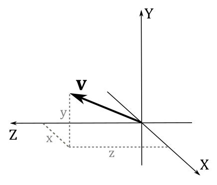

 

 

# 3 - Lines, rays, and segments

Lines can be described by a point $\mathbf{p} _0$ and a direction $\mathbf{u}$ with the following parametric equation

 

$\mathbf{p}(t)=\mathbf{p} _0+t\mathbf{u}$

 

where $\mathbf{p}(t)$ is a function of $t \in \mathbb{R}$ that can be used to calculate all points of a line. Indeed, by setting $t$, we scale the vector $\mathbf{u}$, which summed to the point $\mathbf{p} _0$ results in a translation of the point $\mathbf{p} _0$ along the direction $\mathbf{u}$ (refer to appendix 03 for more details). This translation enables us to identify new points on the line, as illustrated in the image below.

 

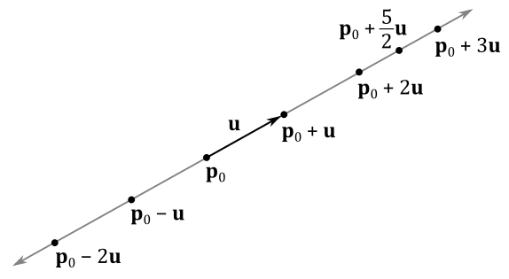

 

If we limit the parameter $t$ to be a positive real number (i.e., $t \in \mathbb{R}_+$), we can define a ray starting at $\mathbf{p}_0$ (the origin of the ray) that maintains a constant direction as $t$ varies. This means that the ray extends infinitely in one direction from the point $\mathbf{p}_0$ without ever changing its direction.

To define a line segment, we require the two endpoints $\mathbf{p}_0$ and $\mathbf{p}_1$. From these points, we can determine the vector $\mathbf{u} = \mathbf{p}_1 - \mathbf{p}_0$ that points from $\mathbf{p}_0$ to $\mathbf{p}_1$. This vector $\mathbf{u}$ specifies the direction and length of the line segment. The equation of the line containing the line segment can be expressed as:

 

$\mathbf{p}(t)=\mathbf{p} _0+t\mathbf{u}=\mathbf{p} _0+t(\mathbf{p} _1 - \mathbf{p} _0)$

 

By restricting the parameter $t$ to the range $[0, 1]$, we can specify all the points that lie along the line segment between $\mathbf{p}_0$ and $\mathbf{p}_1$, as illustrated in the image below

 

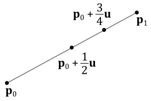

 

## 3.1 - Distance between a point and a line

To measure the distance $d$ of a point $\mathbf{q}$ from a line $\mathbf{p}(t)=\mathbf{p}+t\mathbf{u}$, we can use the following formula.

 

$d=\displaystyle\frac{\vert(\mathbf{q}-\mathbf{p})\times \mathbf{u}\vert}{\vert\mathbf{u}\vert}$

 

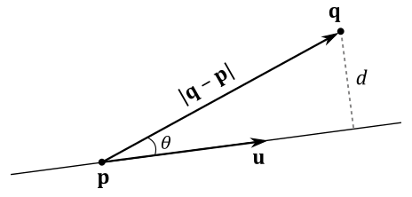

 

Indeed, from trigonometry and considering the image above, we have that

 

$d=\displaystyle\frac{\vert(\mathbf{q}-\mathbf{p})\times\mathbf{u}\vert}{\vert\mathbf{u}\vert}=\frac{\vert(\mathbf{q}-\mathbf{p})\vert\ \vert\mathbf{u}\vert\sin\theta}{\vert\mathbf{u}\vert}=\vert(\mathbf{q}-\mathbf{p})\vert\sin\theta=d$

 

 

# 4 - Parallelograms and triangles

Given a point $\mathbf{q}$ and two non-parallel directions $\mathbf{u}$ and $\mathbf{v}$ (that is, $\mathbf{u}\ne k\mathbf{v}$), we can define the parametric equation of a parallelogram as follows

 

$\mathbf{p}(s,t)=\mathbf{q}+s\mathbf{u}+t\mathbf{v}$

 

where the parameters $s$ and $t$ are real numbers in the range $[0,1]$.  
Indeed, all points of a parallelogram can be specified as the sum of the scaled sides applied to a point, as shown in the image below.

 

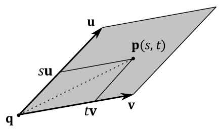

 

If we restrict $s$ and $t$ so that $s\ge 0,\ t\ge 0,\ s+t\le 1$, then $\mathbf{p}(s,t)$ becomes the parametric equation of a triangle. Indeed, considering the image above (as well as the one in the subsequent section), if we set $s=1$ and $t\ne 0$, then the point $\mathbf{p}(s,t)$ will cross the minor diagonal of the parallelogram, specifying a point outside the triangle with sides $\mathbf{u}$ and $\mathbf{v}$.

 

## 4.1 - Barycentric coordinates

Most of the time, to define a triangle we will use three points $\mathbf{p} _0$, $\mathbf{p} _1$ and $\mathbf{p} _2$ to specify its vertices. Therefore, we can define the vectors $\mathbf{u}=\mathbf{p} _1 - \mathbf{p} _0$ and $\mathbf{v}=\mathbf{p} _2 - \mathbf{p} _0$. Substituting these vectors into the parametric equation of a triangle (that is, with $s\ge 0,\ t\ge 0,\ s+t\le 1$) we have

 

$\mathbf{p}(s,t)=\mathbf{p} _0 + s(\mathbf{p} _1 -\mathbf{p} _0) + t(\mathbf{p} _2 - \mathbf{p} _0)$

$=\mathbf{p} _0+s\mathbf{p} _1 - s\mathbf{p} _0 + t\mathbf{p} _2 - t\mathbf{p} _0$

$=(1-s-t)\mathbf{p} _0+s\mathbf{p} _1 + t\mathbf{p} _2$

$=r\mathbf{p} _0+s\mathbf{p} _1 + t\mathbf{p} _2$

 

where $r=(1-s-t)$, so that $r+s+t=1$.  
In this case, we call $(r, s, t)$ the barycentric coordinates of a generic point $\mathbf{p}(s,t)$ inside a triangle defined by three points $\mathbf{p} _0$, $\mathbf{p} _1$ and $\mathbf{p} _2$.

 

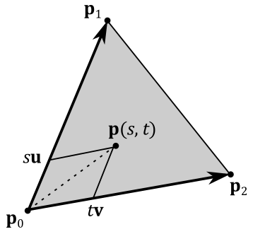

 

Barycentric coordinates allow to specify a generic point $\mathbf{p}(s,t)$ inside a triangle as a linear combination (weighted sum) of its vertices. The higher the value of a barycentric coordinate, the more the point $\mathbf{p}(s,t)$ is attracted by the corresponding vertex.

 

 

# 5 - Planes

A plane can be specified by a point $\mathbf{p} _0$ on the plane and a direction $\mathbf{n}$ perpendicular to the plane called normal vector (or simply normal). A plane divides the 3D space in two half-spaces: an upper (or positive) halp-space and a lower (or negative) halp-space. The normal to a plane always points towards the upper half-space. If a point $\mathbf{q}$ is in the upper half-space, then $\mathbf{q}$ is in front of the plane, otherwise it is behind it.

 

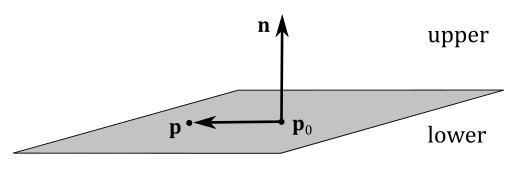

 

As you can verify in the image above, a generic point $\mathbf{p}$ of the plane should solve the following equation as the vectors $(\mathbf{p}-\mathbf{p} _0)$ and $\mathbf{n}$ must be orthogonal to each other for every point $\mathbf{p}$ on the plane.

 

$\mathbf{n}\cdot (\mathbf{p}-\mathbf{p} _0)=0$

 

This is called equation of the plane because the set of points satisfying this equation represents the plane. The equation of the plane can also be written as follows

 

$\mathbf{n}\cdot (\mathbf{p}-\mathbf{p} _0)=\mathbf{n}\cdot\mathbf{p}-\mathbf{n}\cdot\mathbf{p} _0=\mathbf{n}\cdot \mathbf{p}+d=0$

 

where $d=-\mathbf{n}\cdot\mathbf{p} _0$.  
If $\mathbf{n}=(a,b,c)$ and $\mathbf{p}=(x,y,z)$, the equation of the plane can also be rewritten as

 

$ax+by+cz+d=0$

 

This equation is a well-known algebraic formula used to define a plane in a 3D Cartesian coordinate system. It's worth noting that in this equation the only unknown is the point $\mathbf{p}=(x, y, z)$ because we are already given the normal vector $\mathbf{n}$ and the point $\mathbf{p}_0$. Consequently, we can determine $d=-\mathbf{n}\cdot\mathbf{p} _0$.

 

## 5.1 - Distance between a point and a plane

Often we will use the vector $(\mathbf{n},d)=(n_x,n_y,n_z,d)$ to specify a plane. As explained in appendix 01, if $\mathbf{n}$ is a unit vector, then $\mathbf{n}\cdot\mathbf{p} _0$ is the signed length of the orthogonal projection of $\mathbf{p} _0$ onto $\mathbf{n}$. Therefore, $d=-\mathbf{n}\cdot\mathbf{p} _0$ represents the signed distance between the plane and the origin of the 3D Cartesian coordinate system in which the plane is defined, as shown in the image below.

 

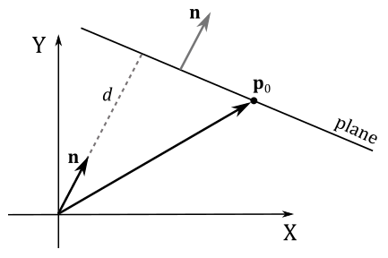

 

In general, we have a negative distance between a point and a plane if the point is behind the plane (that is, the point is in the negative\lower half-space). Indeed, the distance $k$ of a point $\mathbf{p}$ from a plane $(\mathbf{n},d)$ is given by the following equation

 

$k=\mathbf{n}\cdot (\mathbf{p}-\mathbf{p} _0)=\mathbf{n}\cdot\mathbf{p}-\mathbf{n}\cdot\mathbf{p} _0=\mathbf{n}\cdot \mathbf{p}+d$

 

which makes sense since this distance is calculated subtracting the length of the projection of $\mathbf{p}$ onto $\mathbf{n}$ (that is, $\mathbf{n}\cdot \mathbf{p}$) from the length of the projection of $\mathbf{p} _0$ onto $\mathbf{n}$ (that is, $\mathbf{n}\cdot \mathbf{p} _0$), as illustrated in the image below.

 

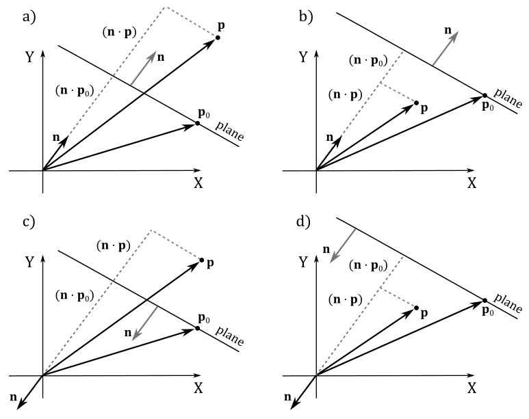

 

Observe that, in the Cartesian systems illustrated in the images c and d of the image above, both $(\mathbf{n}\cdot \mathbf{p})$ and $\mathbf{n}\cdot \mathbf{p} _0$ are negative because the angles are greater than $90°$.  
Therefore, if $\mathbf{p}$ is in the lower half-space, then $k$ is negative, otherwise it is positive. So, we can conclude that

- If $\mathbf{n}\cdot (\mathbf{p}-\mathbf{p} _0)=\mathbf{n}\cdot \mathbf{p}+d>0$, then $\mathbf{p}$ is in front of the plane.

- If $\mathbf{n}\cdot (\mathbf{p}-\mathbf{p} _0)=\mathbf{n}\cdot \mathbf{p}+d<0$, then $\mathbf{p}$ is behind the plane.

- If $\mathbf{n}\cdot (\mathbf{p}-\mathbf{p} _0)=\mathbf{n}\cdot \mathbf{p}+d=0$, then $\mathbf{p}$ lies in the plane.

 

## 5.2 - Normalizing a Plane

If we have a plane $(\mathbf{n},d)$ where $\mathbf{n}$ is not a unit vector, we can't simply normalize $\mathbf{n}$ because $d=-\mathbf{n}\cdot\mathbf{p} _0$ (that is, $d$ depends on $\mathbf{n}$). This means that to normalize $\mathbf{n}$ we must change $d$ accordingly. For this purpose, we just need to divide both $\mathbf{n}$ and $d$ by $1/\vert\mathbf{n}\vert$.

 

$\hat{\mathbf{n}}=\displaystyle\frac{\mathbf{n}}{\vert\mathbf{n}\vert}$

$d'=\displaystyle\frac{d}{\vert\mathbf{n}\vert}=-\frac{\mathbf{n}}{\vert\mathbf{n}\vert}\cdot \mathbf{p} _0$

 

## 5.3 - Line-Plane Intersection

To determine if a line, a ray, or a line segment intersects a plane we can proceed as follows.  
Given a line $\mathbf{p}(t)=\mathbf{p} _0+t\mathbf{u}$ (the equation remains the same for rays and segments, as shown in section 3) and a plane $\mathbf{n}\cdot \mathbf{p}+d=0$, we can substitute the equation of the line into the equation of the plane to check if both have a shared point (i.e., if the line intersects the plane). For this purpose, we need to find a value for the parameter $t$ which is both finite and non-zero.

 

$\mathbf{n}\cdot \mathbf{p}(t)+d=0$

$\mathbf{n}\cdot(\mathbf{p} _0+t\mathbf{u})+d=0$

$\mathbf{n}\cdot\mathbf{p} _0+t\mathbf{n}\cdot\mathbf{u}+d=0$

$t\mathbf{n}\cdot\mathbf{u}=-\mathbf{n}\cdot\mathbf{p} _0-d$

 

$t=\displaystyle\frac{-\mathbf{n}\cdot\mathbf{p} _0-d}{\mathbf{n}\cdot\mathbf{u}}$

 

If $\mathbf{n}\cdot\mathbf{u}=0$, it indicates that there are two possibilities: either there are no solutions (the line and plane are parallel), or there are infinite solutions (the line lies in the plane). However, when we find a unique, finite solution for $t$, it means that the line intersects the plane at a single point. We can then substitute this value of $t$ into the equation of the line to calculate the coordinates of the point of intersection. Observe that solutions for $t$ outside the range $[0,+\infty)$ and $[0, 1]$ are not valid for rays and line segments, respectively.

 

## 5.4 - Reflecting directions and points with respect to a plane

Directions are free vectors, meaning their application point doesn't matter. However, when performing calculations involving directions, it can be beneficial to apply them to a common point. The image below shows that to compute the reflection $\mathbf{r}$ of a direction $\mathbf{l}$ with respect to the normal $\mathbf{n}$ of a plane, we can add to $\mathbf{l}$ the inverse of its projection onto $\mathbf{n}$, doubled in size. This reflection formula is expressed as:

 

$\mathbf{r}=\mathbf{l}-2(\mathbf{n}\cdot \mathbf{l})\mathbf{n}$

 

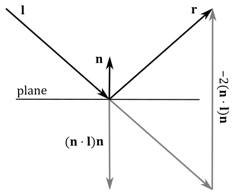

 

Observe that for this calculation to work correctly, the normal vector $\mathbf{n}$ must be a unit vector, as we used the orthogonal projection of $\mathbf{l}$ onto $\mathbf{n}$ to calculate $\mathbf{r}$ (refer to appendix 01). However, we can always normalize the normal vector using the method presented in section 5.2.

When reflecting points with respect to a plane, we require both a point on the plane and its normal vector (that is, we need the vector $(\mathbf{n},d)$ that represents the plane). Indeed, as you can see in the image below, to calculate the reflection $\mathbf{q}$ of a point $\mathbf{p}$ concerning the plane $(\mathbf{n}, d)$, we add to $\mathbf{p}$ the inverse of the projection of $(\mathbf{p} _0 - \mathbf{p})$ onto $\mathbf{n}$, doubled in size. This reflection formula can be expressed as:

 

$\mathbf{q}=\mathbf{p}-2\ \text{proj} _{\mathbf{n}}(\mathbf{p}-\mathbf{p} _0)$

 

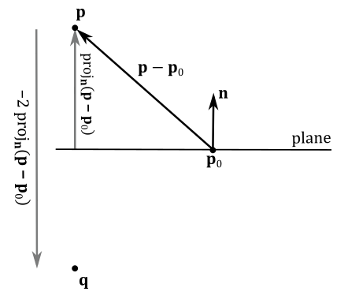

 

Observe that the reflection $\mathbf{q}$ can be thought of as a translation of $\mathbf{p}$ in the opposite direction of the normal. In this case, the normal $\mathbf{n}$ doesn't need to be a unit vector. However, if that's the case, we have

 

$\mathbf{q}=\mathbf{p}-2\ \text{proj} _{\mathbf{n}}(\mathbf{p}-\mathbf{p} _0)$

$=\color{#FF6666}\mathbf{p}-2[\mathbf{n}\cdot (\mathbf{p}-\mathbf{p} _0)]\mathbf{n}$

$=\mathbf{p}-2(\mathbf{n}\cdot\mathbf{p}-\mathbf{n}\cdot\mathbf{p} _0)\mathbf{n}$

$=\mathbf{p}-2(\mathbf{n}\cdot\mathbf{p}+d)\mathbf{n}$

 

As you can see, the reflection of points is quite similar to the reflection of directions (especially the part highlighted in red). And in fact, both cases can be handled in a unified way using the following reflection matrix with respect to a plane $(\mathbf{n},d)=(n_x,n_y,n_z,d)$.

 

$\mathbf{R}=\left\lbrack\matrix{ 1-2n_xn_x & -2n_xn_y & -2n_xn_z & -2dn_x \cr  -2n_xn_y & 1-2n_yn_y & -2n_yn_z & -2dn_y \cr  -2n_xn_z &  -2n_yn_z & 1-2n_zn_z & -2dn_z \cr  0 & 0 & 0 & 1 }\right\rbrack$

 

Multiplying a point $\mathbf{p}=(p_x,p_y,p_z,1)$ by $\mathbf{R}$ we can check that the result is the reflected point $\mathbf{q}$.

 

$\left\lbrack\matrix{ 1-2n_xn_x & -2n_xn_y & -2n_xn_z & -2dn_x \cr  -2n_xn_y & 1-2n_yn_y & -2n_yn_z & -2dn_y \cr  -2n_xn_z &  -2n_yn_z & 1-2n_zn_z & -2dn_z \cr  0 & 0 & 0 & 1 }\right\rbrack \left\lbrack\matrix{ p_x \cr p_y \cr p_z \cr 1 }\right\rbrack $

$=\left\lbrack\matrix{  (p_x-2p_xn_xn_x-2p_yn_xn_y-2p_zn_xn_z-2dn_x) \cr  (-2p_xn_xn_y+p_y-2p_yn_yn_y-2p_zn_yn_z-2dn_y) \cr  (-2p_xn_xn_z-2p_yn_yn_z+p_z-2p_zn_zn_z-2dn_z) \cr  1 }\right\rbrack$

$=\left\lbrack\matrix{ p_x \cr p_y \cr p_z \cr 1 }\right\rbrack + \left\lbrack\matrix{  -2n_x(p_xn_x+p_yn_y+p_zn_z+d) \cr  -2n_y(p_xn_x+p_yn_y+p_zn_z+d) \cr  -2n_z(p_xn_x+p_yn_y+p_zn_z+d) \cr  0 }\right\rbrack$

$=\left\lbrack\matrix{ p_x \cr p_y \cr p_z \cr 1 }\right\rbrack + \left\lbrack\matrix{  -2n_x(\mathbf{n}\cdot\mathbf{p}+d) \cr  -2n_y(\mathbf{n}\cdot\mathbf{p}+d) \cr  -2n_z(\mathbf{n}\cdot\mathbf{p}+d) \cr  0 }\right\rbrack$

$=\mathbf{p}-2(\mathbf{n}\cdot\mathbf{p}+d)\mathbf{n}$

$=\mathbf{p}-2\,\text{proj}_{\mathbf{n}}(\mathbf{p}-\mathbf{p_0})=\mathbf{q}$

 

In a similar way, multiplying a direction $\mathbf{l}=(l_x,l_y,l_z,0)$ by $\mathbf{R}$ we can check that the result is the reflected direction $\mathbf{r}$.

 

$\left\lbrack\matrix{ 1-2n_xn_x & -2n_xn_y & -2n_xn_z & -2dn_x \cr  -2n_xn_y & 1-2n_yn_y & -2n_yn_z & -2dn_y \cr  -2n_xn_z &  -2n_yn_z & 1-2n_zn_z & -2dn_z \cr  0 & 0 & 0 & 1 }\right\rbrack \left\lbrack\matrix{ l_x \cr l_y \cr l_z \cr 0 }\right\rbrack$

$=\mathbf{l}-2(\mathbf{n}\cdot \mathbf{l})\mathbf{n}=\mathbf{r}$

 

Therefore, we can use the matrix $\mathbf{R}$ to reflect both points and directions with respect to a plane $(\mathbf{n},d)$, as long as $\mathbf{n}$ is a unit vector (although, remember that you can always normalize it).

 

## 5.5 - Projecting points onto a plane

A point $\mathbf{p}$ can be projected onto a plane $(\mathbf{n},d)$ along a specific direction $\mathbf{l}=(l_x,l_y,l_z,0)$, as depicted in the following image.

 

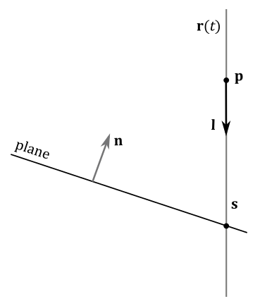

 

In this case, we have all the necessary information to build the equation of the plane $(\mathbf{n}\cdot \mathbf{p}+d=0)$ and the equation of the line passing through the point $\mathbf{p}$ as well $(\mathbf{r}(t)=\mathbf{p}+t\mathbf{l})$. Therefore, we can simply calculate their point of intersection $\mathbf{s}$ using the method presented in section 5.3. Assuming we find a valid solution $t_s$ for the parameter $t$, we can then substitute $t_s$ into the equation of the line to compute the coordinates of the point of intersection $\mathbf{s}=(s_x,s_y,s_z)$.

 

$$\mathbf{s}=\mathbf{r}(t_s)=\mathbf{p}-\displaystyle\frac{\mathbf{n}\cdot\mathbf{p}+d}{\mathbf{n}\cdot\mathbf{l}}\mathbf{l}\tag{1}$$

 

On the other hand, a point $\mathbf{p}$ can also be projected onto a plane with respect to another point $\mathbf{l}=(l_x,l_y,l_z,1)$ (observe that the w-component now is 1). 

 

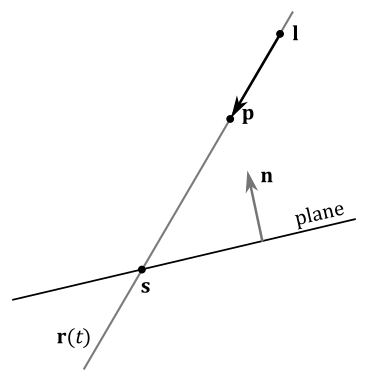

 

In this case, the direction of projection is $(\mathbf{p}-\mathbf{l})$, so that equation $(1)$ becomes

 

$$\tag{2}\mathbf{s}=\mathbf{r}(t_s)=\mathbf{p}-\displaystyle\frac{\mathbf{n}\cdot\mathbf{p}+d}{\mathbf{n}\cdot(\mathbf{p}-\mathbf{l})}(\mathbf{p}-\mathbf{l})$$

 

Fortunately, we can still handle both these cases in a unified manner using the following matrix of projection onto a plane $(\mathbf{n},d)=(n_x,n_y,n_z,d)$.

 

$\mathbf{S}=\left\lbrack\matrix{ \mathbf{n}\cdot\mathbf{l}+dl_w-l_xn_x & -l_xn_y & -l_xn_z & -l_xd \cr  -l_yn_x & \mathbf{n}\cdot\mathbf{l}+dl_w-l_yn_y & -l_yn_z & -l_yd \cr  -l_zn_x & -l_zn_y & \mathbf{n}\cdot\mathbf{l}+dl_w-l_zn_z & -l_zd \cr  -l_wn_x & -l_wn_y & -l_wn_z & \mathbf{n}\cdot\mathbf{l} }\right\rbrack$

 

It works provided that the multiplication by this matrix is followed by a perspective division (that is, we need to consider it as a perspective projection matrix, as explained in appendix 04; the rationale behind this will be clarified shortly).

Multiplying a point $\mathbf{p}=(p_x,p_y,p_z,1)$ by $\mathbf{S}$, and considering $\mathbf{l}=(l_x,l_y,l_z,0)$ a direction, we have

 

$\mathbf{s}'=\left\lbrack\matrix{ \mathbf{n}\cdot\mathbf{l}-l_xn_x & -l_xn_y & -l_xn_z & -l_xd \cr  -l_yn_x & \mathbf{n}\cdot\mathbf{l}-l_yn_y & -l_yn_z & -l_yd \cr  -l_zn_x & -l_zn_y & \mathbf{n}\cdot\mathbf{l}-l_zn_z & -l_zd \cr  0 & 0 & 0 & \mathbf{n}\cdot\mathbf{l} }\right\rbrack \left\lbrack\matrix{ p_x \cr p_y \cr p_z \cr 1 }\right\rbrack$

 

Computing the i-th component of $\mathbf{s}'$ we obtain

 

$s'_i=(\mathbf{n}\cdot\mathbf{l})p_i-l_in_xp_x-l_in_yp_y-l_in_zp_z-l_id$

$=(\mathbf{n}\cdot\mathbf{l})p_i-(\mathbf{n}\cdot\mathbf{p}+d)l_i$

 

Therefore, we have that

 

$\mathbf{s}'=(\mathbf{n}\cdot\mathbf{l})\mathbf{p}-(\mathbf{n}\cdot\mathbf{p}+d)\mathbf{l}$

 

As you can see, $\mathbf{s}'$ differs from $\mathbf{s}$ (equation $(1)$ ) by a factor of $(\mathbf{n}\cdot\mathbf{l})$. That is, we need to divide $\mathbf{s}'$ by $\mathbf{n}\cdot\mathbf{l}$ to get $\mathbf{s}$. Fortunately, the last component of $\mathbf{s}'$ is 

 

$s'_w=(\mathbf{n}\cdot\mathbf{l})p_w-(\mathbf{n}\cdot\mathbf{p}+d)l_w=(\mathbf{n}\cdot\mathbf{l})1-(\mathbf{n}\cdot\mathbf{p}+d)0=(\mathbf{n}\cdot\mathbf{l})$

 

Therefore, considering $\mathbf{S}$ as a perspective projection matrix, we can get $\mathbf{s}$ after the rasterizer stage, which automatically performs the perspective division (i.e., it divides the components of each vertex position by its w-component; see appendix 04). As a result, if there are objects we wish to project onto a plane, we can multiply their world matrix by $\mathbf{S}$ to benefit from the subsequent perspective division performed by the rasterizer.

 

>Multiplying a vertex $\mathbf{v}$ by $\mathbf{WS}$ (the composition between world matrix and $\mathbf{S}$) we get $\mathbf{s}'$, the projection of $\mathbf{v}$ in world coordinates. It does not matter if we also multiply $\mathbf{s}'$ by $\mathbf{V}$ and\or $\mathbf{P}$ (the view and perspective projection matrices, respectively). In fact, it ends up being a simple matrix composition where we keep adding transformations without affecting the effect of previous one (see appendix 03). In other words, the perspective division will take into account the term $(\mathbf{n}\cdot\mathbf{l})$, as well as the terms of any other projections (i.e., the w-component in homogeneous clip space will include the terms of all the perspective transformations).  
However, we need to address a problem: when we use the perspective division to calculate the projection of a vertex onto a plane (in addition to its perspective projection onto the projection window), the vertex could be incorrectly clipped by the rasterizer. Indeed, as explained in appendix 04, clipping can be performed in homogeneous clip space, where if the w-coordinate is negative, the related vertex is considered outside the visible region and discarded by the clipping algorithm.
>
> 
>
>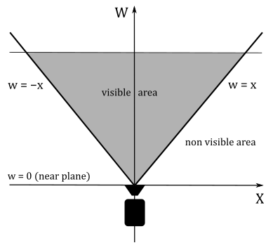
>
> 
>
>Transforming a vertex position using the matrix $\mathbf{S}$ results in the w-coordinate containing the cosine between two vectors $(\mathbf{n}\cdot\mathbf{l})$, so that we can often get a negative value, as illustrated in the following image.
>
> 
>
>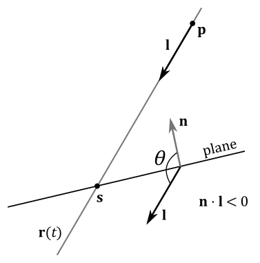
>
> 
>
>To solve this problem we can simply reverse the direction of projection $\mathbf{l}$ when it forms an angle greater than $90°$ with $\mathbf{n}$. This adjustment does not pose a significant problem because the equation of the line $\mathbf{r}(t)$ remains the same. The only difference lies in obtaining a distinct solution $t_s$ for the parameter $t$ in equation $(1)$ to account for the change of direction. However, substituting $t_s$ into the equation of the line still yields the point of intersection $\mathbf{s}$.

 

On the other hand, multiplying a point $\mathbf{p}=(p_x,p_y,p_z,1)$ by $\mathbf{S}$, and considering $\mathbf{l}=(l_x,l_y,l_z,1)$ as a point, we have

 

$\mathbf{s}'=\left\lbrack\matrix{ \mathbf{n}\cdot\mathbf{l}+d-l_xn_x & -l_xn_y & -l_xn_z & -l_xd \cr  -l_yn_x & \mathbf{n}\cdot\mathbf{l}+d-l_yn_y & -l_yn_z & -l_yd \cr  -l_zn_x & -l_zn_y & \mathbf{n}\cdot\mathbf{l}+d-l_zn_z & -l_zd \cr  -n_x & -n_y & -n_z & \mathbf{n}\cdot\mathbf{l} }\right\rbrack \left\lbrack\matrix{ p_x \cr p_y \cr p_z \cr 1 }\right\rbrack$

 

Computing the i-th component of $\mathbf{s}'$ we get

 

$s'_i=(\mathbf{n}\cdot\mathbf{l})p_i+p_id-l_in_xp_x-l_in_yp_y-l_in_zp_z-l_id$

$=(\mathbf{n}\cdot\mathbf{l})p_i+p_id-(\mathbf{n}\cdot\mathbf{p})l_i+l_id$

$=(\mathbf{n}\cdot\mathbf{l})p_i+p_id$ $\color{#FF6666}+\ (\mathbf{n}\cdot\mathbf{p})p_i-(\mathbf{n}\cdot\mathbf{p})p_i$ $-\ (\mathbf{n}\cdot\mathbf{p})l_i+l_id$

$=(\mathbf{n}\cdot\mathbf{l})p_i-(\mathbf{n}\cdot\mathbf{p})p_i+(\mathbf{n}\cdot\mathbf{p}+d)p_i-(\mathbf{n}\cdot\mathbf{p}+d)l_i$

$=\mathbf{n}\cdot(\mathbf{l}-\mathbf{p})p_i+(\mathbf{n}\cdot\mathbf{p}+d)p_i-(\mathbf{n}\cdot\mathbf{p}+d)l_i$

$=-\mathbf{n}\cdot(\mathbf{p}-\mathbf{l})p_i+(\mathbf{n}\cdot\mathbf{p}+d)(p_i-l_i)$

 

Therefore, we have that

 

$\mathbf{s'}=-\mathbf{n}\cdot(\mathbf{p}-\mathbf{l})\mathbf{p}+(\mathbf{n}\cdot\mathbf{p}+d)(\mathbf{p}-\mathbf{l})$

 

As you can see, $\mathbf{s}'$ differs from $\mathbf{s}$ (equation $(2)$ ) by a factor of $-\mathbf{n}\cdot(\mathbf{p}-\mathbf{l})$, which is exactly the value of the last component of $\mathbf{s}'$

 

$s'_w=-\mathbf{n}\cdot(\mathbf{p}-\mathbf{l})p_w+(\mathbf{n}\cdot\mathbf{p}+d)(p_w-l_w)=-\mathbf{n}\cdot(\mathbf{p}-\mathbf{l})1+(\mathbf{n}\cdot\mathbf{p}+d)(1-1)=-\mathbf{n}\cdot(\mathbf{p}-\mathbf{l})$

 

This means that after the perspective division we get $\mathbf{s}$, the projection of $\mathbf{p}$ with respect to the point $\mathbf{l}$. Observe that in this case $s'_w$  will not be negative when $(\mathbf{p}-\mathbf{l})$ forms an angle greater than $90°$ with $\mathbf{n}$ because the dot product is between $(\mathbf{p}-\mathbf{l})$ and the inverse of the normal. On the other hand, $s'_w$ will be negative when the angle is less than $90°$. Nevertheless, in most cases, we can simply reverse the direction $(\mathbf{p}-\mathbf{l})$ to get the expected result (the projection of a point onto a plane).

So, we just showed we can handle both cases (projection onto a plane along a direction and with respect to a point) with the help of the matrix $\mathbf{S}$. 

 

 

# 6 - Cramer's rule

A general system of $m$ linear equations with $n$ unknowns and coefficients can be written as

 

$$\begin{flalign}
& \begin{cases}
a_{11}x_1 + a_{12}x_2 + a_{13}x_3 + \cdots + a_{1n}x_n = b_1 \cr a_{21}x_1 + a_{22}x_2 + a_{23}x_3 + \cdots + a_{2n}x_n = b_2 \cr a_{31}x_1 + a_{32}x_2 + a_{33}x_3 + \cdots + a_{3n}x_n = b_3 \cr \cdots \cr a_{n1}x_1 + a_{n2}x_2 + a_{n3}x_3 + \cdots + a_{nn}x_n = b_n
\end{cases} &
\end{flalign}$$

 

where $x_{1},x_{2},\dots ,x_{n}$ are the unknowns, $a_{11},a_{12},\dots ,a_{mn}$ are the coefficients of the system, and $b_{1},b_{2},\dots ,b_{m}$ are the constant terms.  
We can also write it in matrix form as follows

 

$\left\lbrack\matrix{ a_{11} & a_{12} & a_{13} & \cdots & a_{1n} \cr a_{21} & a_{22} & a_{23} & \cdots & a_{2n} \cr a_{31} & a_{32} & a_{33} & \cdots & a_{3n} \cr \vdots & \vdots & \ddots & \vdots \cr a_{n1} & a_{n2} & a_{n3} & \cdots & a_{nn} }\right\rbrack \left\lbrack\matrix{ x_{1}\cr x_{2} \cr \vdots \cr x_{n} }\right\rbrack = \left\lbrack\matrix{ b_{1}\cr b_{2} \cr \vdots \cr b_{n} }\right\rbrack$

 

$\mathbf{A}\mathbf{x}=\mathbf{b}$

 

where $\mathbf{A}$ is an $m\times n$ matrix consisting of the coefficients of the system, $\mathbf{x}$ is a column vector with the $n$ unknowns, and $\mathbf{b}$ is a column vector with the $m$ constant terms.

If $m=n$ (i.e., if $\mathbf{A}$ is a square matrix), then we can find the i-th unknown $x_i$ by dividing the determinat of $\mathbf{A} _i$ by the determinant of $\mathbf{A}$. We can build the matrix $\mathbf{A} _i$ starting from $\mathbf{A}$, and replacing its i-th column with $\mathbf{b}$, the column vector of the constant terms.

 

$x_i=\displaystyle\frac{det(\mathbf{A} _i)}{det(\mathbf{A})}$

 

Below is a practical demonstration showing the validity of this formula. 
Suppose we have a system of 3 linear equations with 3 unknowns $(x,y,z)$.

 

$$\begin{flalign} & \begin{cases} 
a_1x+b_1y+c_1z=d_1 \cr 
a_2x+b_2y+c_2z=d_2 \cr 
a_3x+b_3y+c_3z=d_3
\end{cases} & \end{flalign}
$$

 

Assuming the matrix $\mathbf{A}$ has a non-zero determinant $(det(\mathbf{A})\ne 0)$, and remembering that if we add a scaled column to another column of a matrix the determinant does not change (see appendix 03), we have

 

$det(\mathbf{A} _1)=det\left\lbrack\matrix{d_1 & b_1 & c_1 \cr d_2 & b_2 & c_2 \cr d_3 & b_3 & c_3 }\right\rbrack$

$=det\left\lbrack\matrix{ (a_1x+b_1y+c_1z) & b_1 & c_1 \cr (a_2x+b_2y+c_2z) & b_2 & c_2 \cr (a_3x+b_3y+c_3z) & b_3 & c_3 }\right\rbrack$

$=det\left\lbrack\matrix{ (a_1x+b_1y+c_1z)-(b_1y+c_1z) & b_1 & c_1 \cr (a_2x+b_2y+c_2z)-(b_2y+c_2z) & b_2 & c_2 \cr (a_3x+b_3y+c_3z)-(b_3y+c_3z) & b_3 & c_3 }\right\rbrack$

$=det\left\lbrack\matrix{ a_1x & b_1 & c_1 \cr a_2x & b_2 & c_2 \cr a_3x & b_3 & c_3 }\right\rbrack$

$=x\ det\left\lbrack\matrix{ a_1 & b_1 & c_1 \cr a_2 & b_2 & c_2 \cr a_3 & b_3 & c_3 }\right\rbrack$

$=x\ det(\mathbf{A})$

 

Therefore, the first unknown $(x)$ is

 

$x=\displaystyle\frac{det(\mathbf{A} _1)}{det(\mathbf{A})}$

 

By performing similar calculations, we can determine the other two unknowns ($y$ and $z$).

 

 

# References

[1] Practical Linear Algebra: A Geometry Toolbox (Farin, Hansford)  
[2] Introduction to 3D Game Programming with DirectX 12 (Luna)  
[3] Real-Time Rendering (Haines, Möller, Hoffman)  
[4] Jim Blinn's Corner: A Trip Down the Graphics Pipeline (Blinn)

 

***
If you found the content of this tutorial somewhat useful or interesting, please consider supporting this project by clicking on the **Sponsor** button.  Whether a small tip, a one time donation, or a recurring payment, it's all welcome! Thank you!  

 

 