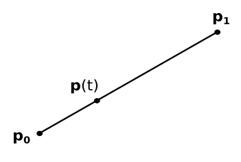
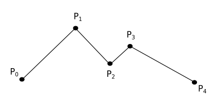
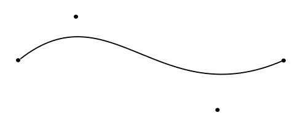
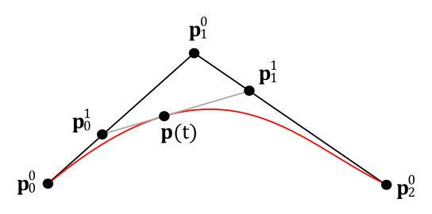
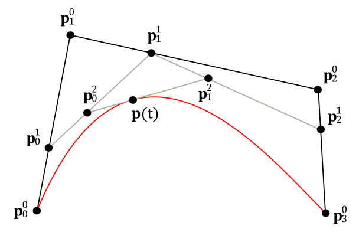
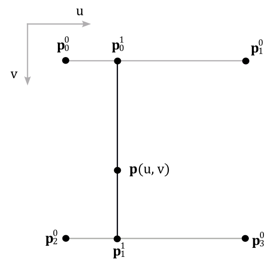
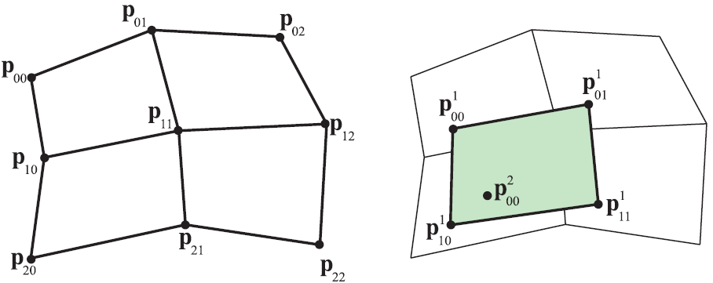
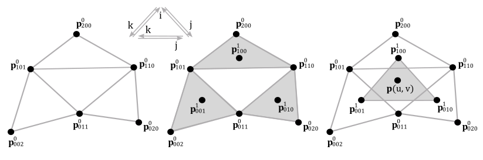

 

# 1 - Introduction

Curves and surfaces can be described by parametric equations that allow to specify each of their points as a weighted sum of specific vertices, commonly known as control points, since they provide a means to shape and control the curve or surface they define.

In parametric representations, a curve is defined by an equation that depends on a single parameter, typically denoted as $t$, while a surface requires two parameters, $u$ and $v$. 

There are various methods for defining curves and surfaces with parametric equations. In this tutorial, our focus will be on Bézier curves and surfaces, which are widely employed in computer graphics due to their semplicity and versatility.

 

 

# 2 - Linear interpolation

In a previous appendix (**A.05 - Analytic Geometry**), we showed that a line segment can be expressed as a weighted sum of its endpoints $\mathbf{p} _0$ and $\mathbf{p} _1$

 

$\mathbf{p}(t)=\mathbf{p} _0+t(\mathbf{p} _1 - \mathbf{p} _0)=(1-t)\mathbf{p} _0 + t \mathbf{p} _1$

 

with the parameter $t$ that varies within the range of $[0, 1]$, defining the domain of the function $\mathbf{p}(t)$.  
Essentially, what has been derived is a method to calculate all the points along a line segment when only the endpoints are known. In general, when a technique is found for generating new points in space (across any dimension) from a finite set of given points, it is referred to as interpolation. In this specific case, the highest degree of the parameter $t$ is one, and $\mathbf{p}(t)$ can be viewed as a linear polynomial describing a line segment, thus we refer to it as linear interpolation.

 

 

If the parameter domain is different, for example, if $t$ is within the interval $[t_1, t_2]$, you can translate and scale it back to the standard interval $[0, 1]$ using the following formula:

 

$t' = \displaystyle\frac{t-t_1}{t_2-t_1}$

 

Hence, you should use $t'$ as the parameter for the function $\mathbf{p}$.  
As a result,  if you have a loop that increments $t$ by a fixed value, the point will move faster or slower from $\mathbf{p} _0$ to $\mathbf{p} _1$ depending on whether the domain of the function is shorter or longer, respectively, than $[0, 1]$.

Taking a finite and ordered set of points, it is possible to linearly interpolate every pair within the point set, resulting in a piecewise linear curve, also known as a polyline.

 

 

Linear interpolation is useful for interpolating between two points. However, when dealing with more than two points, polylines are not usually employed in computer graphics due to the abrupt changes in direction at the points, referred to as joints in a polyline. Consequently, we need to find a way for representing a smoother curve as a weighted sum of the control points.

 

 

# 3 - Bézier curves

Bézier curves use linear interpolation repeatedly to build smoothed curves described by polynomials (in particular, as a weighted sums of control points). To achieve this, it is necessary to define a series of control points where, apart from the first and last points through which the curve passes, the remaining control points act as attractors for the curve.

 

 

Now, we need to find a way to express this curve as a polynomial so that it can be expressed as a weighted sum of the control points. Let's start with a simple, practical example. Assume we have three control points $\mathbf{p}^0 _0$, $\mathbf{p}^0 _1$ and $\mathbf{p}^0 _2$ describing a curve $\mathbf{p}(t)$, the red one illustrated in the following image.

 

 

By using linear interpolation, the two line segments with endpoints $\mathbf{p}^0 _0$ and $\mathbf{p}^0 _1$, and $\mathbf{p}^0 _1$ and $\mathbf{p}^0 _2$ are defined as follows:

 

$\mathbf{p}^1 _0(t)=\mathbf{p}^0 _0+t(\mathbf{p}^0 _1-\mathbf{p}^0 _0)=(1-t)\mathbf{p}^0 _0+t\mathbf{p}^0 _1$

$\mathbf{p}^1 _1(t)=\mathbf{p}^0 _1+t(\mathbf{p}^0 _2-\mathbf{p}^0 _1)=(1-t)\mathbf{p}^0 _1+t\mathbf{p}^0 _2$

 

Given a fixed value for the parameter $t$, we can identify the points $\mathbf{p}^1 _0$ and $\mathbf{p}^1 _1$ on the two line segments. These points can, in turn, be considered as endpoints of another line segment. By interpolating again between these new endpoints (using the same value for the parameter $t$), we find a point on $\mathbf{p}(t)$. As we vary the parameter $t$, which always remains within the range $[0, 1]$, we find all the points of the red curve in the image above. In formula, this can be expressed as follows:

 

$\mathbf{p}(t)=(1-t)\mathbf{p}^1 _0+t\mathbf{p}^1 _1$

$=(1-t)\big((1-t)\mathbf{p}^0 _0+t\mathbf{p}^0 _1\big)+t\big((1-t)\mathbf{p}^0 _1+t\mathbf{p}^0 _2\big)$

$=(1-t)^2\mathbf{p}^0 _0+2t(1-t)\mathbf{p}^0 _1+t^2\mathbf{p}^0 _2$

 

which is the function of the curve $\mathbf{p}(t)$, expressed as a second-degree polynomial but also, and most importantly, as a weighted sum of the control points. This function is referred to as a quadratic (or second-degree) Bézier curve.

By increasing the number of control points and the linear interpolations performed, Bézier curves offers more control over the shape of the curve at the cost of increasing the degree of the polynomial. As a rule, we require $n+1$ control points to build an n-degree Bézier curve through $n$ interpolations. After linear interpolation has been applied $k$ times, we obtain intermediate $\mathbf{p}^k _i$ control points, which are then used in the next linear interpolation to define new intermediate line segments.

 

 

For example, to build a cubic (3-degree) Bézier curve, we need four control points, which are used in the first linear interpolation to define three line segments as follows:

 

$\mathbf{p}^1 _0(t)=\mathbf{p}^0 _0+t(\mathbf{p}^0 _1-\mathbf{p}^0 _0)=(1-t)\mathbf{p}^0 _0+t\mathbf{p}^0 _1$

$\mathbf{p}^1 _1(t)=\mathbf{p}^0 _1+t(\mathbf{p}^0 _2-\mathbf{p}^0 _1)=(1-t)\mathbf{p}^0 _1+t\mathbf{p}^0 _2$

$\mathbf{p}^1 _2(t)=\mathbf{p}^0 _2+t(\mathbf{p}^0 _3-\mathbf{p}^0 _2)=(1-t)\mathbf{p}^0 _2+t\mathbf{p}^0 _3$

 

By linearly interpolating again between $\mathbf{p}^1 _0(t)$ and $\mathbf{p}^1 _1(t)$, and then between $\mathbf{p}^1 _1(t)$ and $\mathbf{p}^1 _2(t)$, two new line segments are obtained.

 

$\mathbf{p}^2 _0(t)=\mathbf{p}^1 _0+t(\mathbf{p}^1 _1-\mathbf{p}^1 _0)=(1-t)\mathbf{p}^1 _0+t\mathbf{p}^1 _1$

$\mathbf{p}^2 _1(t)=\mathbf{p}^1 _1+t(\mathbf{p}^1 _2-\mathbf{p}^1 _1)=(1-t)\mathbf{p}^1 _1+t\mathbf{p}^1 _2$

 

Finally, by interpolating a third time between $\mathbf{p}^2 _0(t)$ and $\mathbf{p}^2 _1(t)$, we get the cubic Bézier curve $\mathbf{p}(t)$

 

$\mathbf{p}(t)=\mathbf{p}^2 _0+t(\mathbf{p}^2 _1-\mathbf{p}^2 _0)=(1-t)\mathbf{p}^2 _0+t\mathbf{p}^2 _1$

$=(1-t)\big((1-t)\mathbf{p}^1 _0+t\mathbf{p}^1 _1\big)+t\big((1-t)\mathbf{p}^1 _1+t\mathbf{p}^1 _2\big)$

$=(1-t)^3\mathbf{p}^0 _0+3t(1-t)^2\mathbf{p}^0 _1+3t^2(1-t)\mathbf{p}^0 _2+t^3\mathbf{p}^0 _3$

 

As you can see, now the highest degree of the parameter $t$ is three.  
This equation can also be rewritten in matrix form as

 

$\mathbf{p}(t) = \left\lbrack\matrix{ t^3 & t^2 & t & 1 }\right\rbrack \left\lbrack\matrix{ -1 & 3 & -3 & 1 \cr 3 & -6 & 3 & 0 \cr -3 & 3 & 0 & 0 \cr 1 & 0 & 0 & 0 }\right\rbrack \left\lbrack\matrix{ \mathbf{p} _0 \cr \mathbf{p} _1 \cr \mathbf{p} _2 \cr \mathbf{p} _3 }\right\rbrack$

 

where the superscript has been omitted for convenience, so that $\mathbf{p} _0$ is $\mathbf{p}^0 _0$.  
Typically, one can stop at cubic Bézier curves. However, thanks to the repeated linear interpolation and the practical examples we've just examined, it's possible to provide a recursive formula for calculating Bézier curves of any degree.

 

$\mathbf{p}^k _i(t)=(1-t)\mathbf{p}^{k-1} _i+t\mathbf{p}^{k-1} _{i+1}$

 

Nevertheless, in the end, we always end up with a weighted sum of the original control points. So, it would be nice to find an algebraic formula for Bézier curves that avoids the use of recursive formulas and repeated interpolations. Fortunately, such a formula exists, and it's called the Bernstein form of a Bézier curve. The Bernstein form allows to describe Bézier curves of any degree $n$ through the weighted sum of $(n+1)$ control points $(\mathbf{p} _0, \ldots, \mathbf{p} _n)$.

 

$\mathbf{p}(t) = \displaystyle\sum_{i=0}^{n}B_i^n(t)\mathbf{p}^0 _i$

 

where $B_i^n(t)$ is a polynomial, known as Bernstein polynomial, defined as follows:

 

$B_i^n(t) = \left(\matrix{ n \cr i } \right)\ t^i(1-t)^{n-i}$

 

where

 

$\left(\matrix{ n \cr i } \right) = \displaystyle\frac{n!}{i!\ (n-i)!}$

 

For cubic Bézier curves, the Bernstein polynomials are

 

$B_0^3(t)=\displaystyle\frac{3!}{0!(3-0)!}t^0(1-t)^{3-0}=(1-t)^3$

$B_1^3(t)=\displaystyle\frac{3!}{1!(3-1)!}t^1(1-t)^{3-1}=3t(1-t)^2$

$B_2^3(t)=\displaystyle\frac{3!}{2!(3-2)!}t^2(1-t)^{3-2}=3t^2(1-t)$

$B_3^3(t)=\displaystyle\frac{3!}{3!(3-3)!}t^3(1-t)^{3-3}=t^3$

 

which are indeed the weights of the fours control points calculated earlier, so that we can rewrite the cubic Bézier curve as follows:

 

$\mathbf{p}(t) = \displaystyle\sum_{i=0}^{3}B_i^3(t)\mathbf{p}^0 _i=B_0^3(t)\mathbf{p}^0 _0+B_1^3(t)\mathbf{p}^0 _1+B_2^3(t)\mathbf{p}^0 _2+B_3^3(t)\mathbf{p}^0 _3$

 

The derivative of a Bézier curve is often used to calculate the tangent space (more details will be provided in a later tutorial). For now, it's enough to note that $\mathbf{p}(t)$ is a polynomial where the variable is $t$. This means that to compute the derivative $\mathbf{p}'(t)$, it's sufficient to differentiate each term of the polynomial with respect to $t$, which is only present in the Bernstein polynomials (the control points are position vectors). Therefore, we have

 

$\mathbf{p}'(t) = \displaystyle\sum_{i=0}^{3}B{'}_i^3(t)\mathbf{p}^0 _i=B{'}_0^3(t)\mathbf{p}^0 _0+B{'}_1^3(t)\mathbf{p}^0 _1+B{'}_2^3(t)\mathbf{p}^0 _2+B{'}_3^3(t)\mathbf{p}^0 _3$

 

where

 

$B{'}_0^3(t)=-3(1-t)^2$

$B{'}_1^3(t)=3(1-t)^2-6t(1-t)$

$B{'}_2^3(t)=6t(1-t)-3t^2$

$B{'}_3^3(t)=3t^2$

 

Finally, it's worth noting that if you want to describe relatively complex curves, the degree of the Bézier curve polynomial can become very high, making it computationally demanding or less practically useful. Fortunately, in most cases, it's possible to build a composition of lower-degree Bézier curve segments that share control points at their endpoints.

 

 

# 4 - Bilinear interpolation

In a previous tutorial (**01.F - Hello Textures**), we indirectly showed that it is possible to use linear interpolation for describing a unit square (in addition to a line segment). Indeed, with four points representing the corners of the square, we can linearly interpolate two pairs of points in one direction, resulting in two horizontal or vertical segments that describe two sides of the square. These segments can then be used for a second linear interpolation in a direction perpendicular to the first one, enabling us to describe every point on the square.

It's clear that two parameters $u$ and $v$, each within the range $[0, 1]$, are required to specify the directions of the two interpolations.

 

 

For example, the point $\mathbf{p}(u,v)$ on the square illustrated above can be computed as follows:

$\mathbf{p}^1 _0(u) = (1-u)\mathbf{p}^0 _0 + u\mathbf{p}^0 _1$

$\mathbf{p}^1 _1(u) = (1-u)\mathbf{p}^0 _2 + u\mathbf{p}^0 _3$

$\mathbf{p}(u,v) = (1-v)\mathbf{p}^1 _0 + v\mathbf{p}^1 _1 = (1-v)(1-u)\mathbf{p}^0 _0 + u(1-v)\mathbf{p}^0 _1 + v(1-u)\mathbf{p}^0 _2 + uv\mathbf{p}^0 _3$

 

Considering the concepts presented in this section, it is not too difficult to understand why this technique is referred to as bilinear interpolation.

 

 

# 5 - Bézier surfaces

The concept of Bézier curves, presented in section 3, can be extended to describe nonplanar (curved) surfaces by using bilinear interpolation repeatedly to find a parametric equation as a weighted sum of some control points used to control the shape of the surface. When described this way, a 3D nonplanar surface is oten called a patch.

Now, we need to derive a parametric equation describing a patch. For this purpose, let's first examine a practical example from which to derive a more general formula.

Assume we have a grid of $3\times 3$ control points describing a patch, as illustrated in the image below (on the left).

 

  
(source: realtimerendering.com)

 

Following the same strategy used for Bézier curves, we can bilinearly interpolate repeatedly up to calculating the final point. In the case under consideration, we need to bilinearly interpolate four times to create four intermediate points, which can be used in an additional bilinear interpolation to calculate the final point of the patch, as illustrated in the image above (on the right).

By using the same strategy used for Bézier curves and following the example provided in section 4, we can derive the following recursive formula:

 

$\mathbf{p}^k _{i,j}(u,v) = (1-v)(1-u)\mathbf{p}^{k-1} _{i,j} + u(1-v)\mathbf{p}^{k-1} _{i,j+1} + v(1-u)\mathbf{p}^{k-1} _{i+1,j} + uv\mathbf{p}^{k-1} _{i+1,j+1}$

 

where $\mathbf{p}^k _{i,j}$ is the intermediate control point obtained after the $k$-th bilinear interpolation and where $i$ and $j$ are within the range $[0, n]$, so that we have $(n+1)^2$ control points describing an n-degree Bezier surface.

However, even in this case we can derive a Bernstein form using Bernstein polynomials that allow to semplify our calculations.

 

$\mathbf{p}(u,v) = \displaystyle\sum_{i=0}^{m}B_i^{m}(u)\sum_{j=0}^{n}B_j^{n}(v)\ \mathbf{p}^0 _{i,j}$

$= \displaystyle\sum_{i=0}^{m}\sum_{j=0}^{n}B_i^{m}(u)\ B_j^{n}(v)\ \mathbf{p}^0 _{i,j}$

$=\displaystyle\sum_{i=0}^{m}\sum_{j=0}^{n} \left(\matrix{m \cr i} \right) \left(\matrix{n \cr j} \right) \ u^i(1-u)^{m-1}v^j(1-v)^{n-j} \ \mathbf{p}^0 _{i,j}$

 

Here, we need $(m+1)\times (n+1)$ control points to describe a patch with a compound degree of $m\times n$. If $m = n$, the implementation semplifies a bit. 

Partially differentiating the above equation gives the following equations:

 

$\displaystyle\frac{\partial\mathbf{p}}{\partial u}(u,v)= \displaystyle\sum_{i=0}^{m}\frac{\partial B_i^{m}}{\partial u}(u)\sum_{j=0}^{n}B_j^{n}(v)\ \mathbf{p}^0 _{i,j}$

$\displaystyle\frac{\partial\mathbf{p}}{\partial v}(u,v)= \displaystyle\sum_{i=0}^{m}B_i^{m}(u)\sum_{j=0}^{n}\frac{\partial B_j^{n}}{\partial v}(v)\ \mathbf{p}^0 _{i,j}$

 

We hardly use patches with $m$ or $n$ greater than three, so we can expand the Bernstein form of a $3\times 3$ (bicubic) Bezier surface to obtain a formula that it is easy to implement in code. First of all, to build a bicubic Bézier surface, we need a grid of $4\times 4$ control points. Then, we can proceede exapanding the corresponding Bernstein form.

 

$\mathbf{p}(u,v) = $

$B_0^{3}(u) \left[B_0^{3}(v)\ \mathbf{p}^0 _{0,0} + B_1^{3}(v)\ \mathbf{p}^0 _{0,1}+B_2^{3}(v)\ \mathbf{p}^0 _{0,2} + B_3^{3}(v)\ \mathbf{p}^0 _{0,3} \right] +$

$B_1^{3}(u) \left[B_0^{3}(v)\ \mathbf{p}^0 _{1,0} + B_1^{3}(v)\ \mathbf{p}^0 _{1,1}+B_2^{3}(v)\ \mathbf{p}^0 _{1,2} + B_3^{3}(v)\ \mathbf{p}^0 _{1,3} \right] +$

$B_2^{3}(u) \left[B_0^{3}(v)\ \mathbf{p}^0 _{2,0} + B_1^{3}(v)\ \mathbf{p}^0 _{2,1}+B_2^{3}(v)\ \mathbf{p}^0 _{2,2} + B_3^{3}(v)\ \mathbf{p}^0 _{2,3} \right] +$

$B_3^{3}(u) \left[B_0^{3}(v)\ \mathbf{p}^0 _{3,0} + B_1^{3}(v)\ \mathbf{p}^0 _{3,1}+B_2^{3}(v)\ \mathbf{p}^0 _{3,2} + B_3^{3}(v)\ \mathbf{p}^0 _{3,3} \right]$

 

 

# 6 - Bézier triangles

Besides linear and bilinear interpolations, we also examined another type of interpolation in appendix 05 (**Analytic Geometry**) that allow to describe every point of a tringle as a weighted sum of its vertices $\mathbf{p} _0$, $\mathbf{p} _1$ and $\mathbf{p} _2$ using barycentric coordinates. 

 

$\mathbf{p}(u,v)=\mathbf{p} _0 + u(\mathbf{p} _1 -\mathbf{p} _0) + v(\mathbf{p} _2 - \mathbf{p} _0)$

$=\mathbf{p} _0+u\mathbf{p} _1 - u\mathbf{p} _0 + v\mathbf{p} _2 - v\mathbf{p} _0$

$=(1-u-v)\mathbf{p} _0 + u\mathbf{p} _1 + v\mathbf{p} _2$

 

We can use this type of interpolation repeatedly to describe Bézier triangles, which cannot be described using bilinear interpolation as we they require a triangular domain. 

In general, we need $(n+1)(n+2)/2$ control points to build an n-degree Bézier triangle. For example, to build a quadratic Bézier triangle, we need six control points and three interpolations to get three intermediated points from wich interpolate a second time to get the final point, as illustrated in the image below.

 

 

The recursive formula is as follows:

 

$\mathbf{p}^l _{i,j,k}(u,v) = u\mathbf{p}^{l-1} _{i+1,j,k} + v\mathbf{p}^{l-1} _{i,j+1,k} + (1-u-v)\mathbf{p}^{l-1} _{i,j,k+1}$

 

where $l$ is the $l$-th interpolation and $i$, $j$ and $k$ are the indices used to select the intermediate control points according to the directions illustrated in the image above.

Even in this case, we can rely on a Bernstein form, which is as follows:

 

$\mathbf{p}(u,v) = \displaystyle\sum_{i+j+k=n}B_{i,j,k}^{n}(u,v)\ \mathbf{p}^0 _{i,j,k}$

 

Observe that the Bernstein polynomials now depend on two variables and are computed differently, as shown below

 

$B_{i,j,k}^{n}(u,v) = \displaystyle\frac{n!}{i!\ j!\ k!}\ u^i\ v^j\ (1-u-v)^k$

 

with $i+j+k=n$, so that the subscript of the summation symbol in the Bernstein form actually means any combination of $i$, $j$, and $k$ that sums to $n$.

 

 

# References

[1] Real-Time Rendering (Haines, Möller, Hoffman)  
[2] Introduction to 3D Game Programming with DirectX 12 (Luna)  
[3] 3D Graphics for Game Programming (Han)

 

***
If you found the content of this tutorial somewhat useful or interesting, please consider supporting this project by clicking on the **Sponsor** button.  Whether a small tip, a one time donation, or a recurring payment, it's all welcome! Thank you!  

 

 